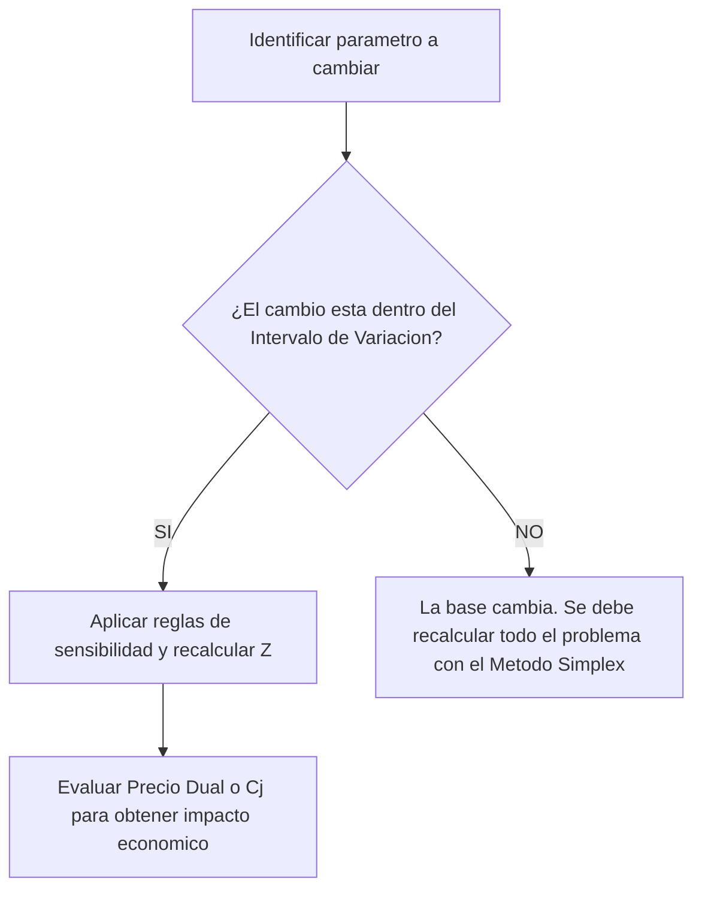

## 1. Interpretación de Resultados Base y Salidas de Software (0:00 - 6:42)

El profesor inicia la clase retomando un problema de producción de televisores y monitores, analizando la salida del software (LINDO).
![[{F1D2EAE9-51FE-4B7B-80E7-E98D953A443B}.png]]

- **Identificación de Componentes del Modelo:**
    - [[Variables de Decisión]]: $x_1$ (TV color) y $x_2$ (Monitores).

>[!note]-  **[[Variables de Decisión]] (**xj​**):** 
>Son las incógnitas del modelo que representan las cantidades físicas a determinar. En el ejemplo de la clase, hacían referencia a la "cantidad de TV a producir por mes" y la "cantidad de monitores a producir por mes".

Definición de las restricciones:
	1. horas hombre, 
		1. (Para producir x1 se requiere 20 horas-hombre)
		2. ....
	2. [[Demanda Máxima]] (o producción máxima)  
		1. se puede vender no mas de 1000 unidades de x1
		2. .....
	3. presupuesto disponible.
		1. la compañia dispon de 700.000 para la prod del mes

>[!note]- **[[Restricciones]]:** 
>Son los límites físicos, económicos o de mercado que condicionan el modelo. El profesor identificó tipos específicos como "horas-hombre", "[[Demanda Máxima]]" (o "producción máxima") y "cantidad máxima de dinero disponible" (presupuesto)

![[{AD62FC32-36CD-4552-B84B-EAC47AA38606}.png]]

* Identificación de [[Restricciones Limitantes]] (o activas) y no limitantes.
	* No limitantes
		* 3) S2
			* demanda de tv
		* 4) S3
			* demanda de monitores
	* LIMITANTES
		* 2) S1 
			* hs mano de obra
		* 5) S4
			*  presupuesto
>[!note]- Variable de Holgura 
>Una [[Variable de Holgura]] (identificada en el software bajo la columna _slack_ o _surplus_) representa matemáticamente el "sobrante del recurso" o las "unidades de recurso sin utilizar" en la [[Solución Óptima]]

> [!note]- Restricción Limitante 
> Una [[Restricción Limitante]] es aquella que restringe el crecimiento de la función objetivo porque su recurso se ha agotado por completo. Se identifica en la salida de la computadora porque su [[Variable de Holgura]] es exactamente igual a cero

---
### a) cual es la solucion optima, cual es el valro de la funcion objetivo y que recursos son limitantes
solucion optima es

X=
[
x1=625
x2=2500
s1=0
s2=375
s3=1500
s4=0
]
>[!note]- **[[Función Objetivo]] (**Z**):** 
>Es la ecuación que define la meta del problema, la cual puede ser maximizar (como en el caso de la ganancia por ventas) o minimizar.

el valor de la funcion objetivo es 1.125.000


los recuross limitantes son las hs mano de obra y el presupuesto
![[{D2AE7086-57AC-422D-8150-C3500F8D36D6}.png]]
### b) suponienod que la cantidad de horas-hombre se reduce en 4.000; como afectaria a la solucion optima y al valor de z? si deseara utilizas horas-hombre extras, que precio maximo estaria dispuesto a pagar?


> [!question]- Pregunta de la clase Al plantear una reducción en la cantidad de horas hombre, el profesor pregunta: _"¿Es un cambio en qué parámetro del problema?"_ 
> 
> _Respuesta:_ En un coeficiente del lado derecho, específicamente en un $b_i$ (disponibilidad de recurso).
![[Pasted image 20260608181257.png|391]]


[[Análisis de Sensibilidad]]: Cambios en el Lado Derecho ($b_i$) (6:42 - 13:32)
Se evalúa el impacto de alterar la disponibilidad de un recurso (reducción de 4,000 horas de mano de obra).

![[{3DE0A884-5254-46A5-828B-9FFA6E4E8733} 1.png]]
1. Evaluación de los Límites:** Comprobación de si el cambio ($-\Delta b_i$) se encuentra dentro del [[Intervalo de Variación]] permitido en el reporte.
2. Si esta dentro del rango por lo tanto
	1. La base del problema **no cambia** (las variables positivas siguen siendo positivas y las nulas siguien siendo nulas).
    - Pero si cambia La solución (el valor numérico de las variables) 
	    - ![[{E250A9E8-1636-471E-9123-C13E539D6252}.png]]
	    - necesitarias la tabla simplex
    - El valor de la [[Función Objetivo]] ($Z$) **sí cambia**.
	    - ![[{9DD5FDEA-91C9-4BCA-A3CC-D77B88362889}.png]]

que precio estaria dispuesto a pagar?
atento que esto es el lindo para maximo
el precio dual me estaria indicando el precio maximo que se esta dipuesto a pagar por una unidad mas, en este caso el precio maximo seria 5$ por hora adicional
>[!note]- **[[Precio Dual]] / [[Variable Dual]] (**yi​**):** 
>Es la valoración interna del recurso. El profesor lo definió como "en cuánto aumenta la función objetivo si tengo una unidad más del recurso" o el "precio máximo que estoy dispuesto a pagar por encima de lo que pago actualmente" por un recurso adicional

>[!danger] Recordar que es si es para minimo cambia y la difrencia con el precio sombra


CALCULO NUEVO VALOR Z*
> [!note] Fórmula: Nuevo valor de Z $$Z_{nuevo} = Z_{actual} + (\Delta \times Multiplicador)$$ _(Nota: El multiplicador es el [[Precio Dual]] si cambia un $b_i$, o el valor actual de la [[Variable de Decisión]] si cambia un $c_j$).


1.1125.000+(-4000x5)=1.105.000 =Z*

![[{4FB7FC6A-1D37-40EF-BC58-C508057040F4}.png]]

---

### C) Teniendo la posibilidad de aumentar la ganancia de los monitores de vigilancia, hasta cuanto modificaria este valor de tal manquera que no se modifique la solucion optima? indque la ganancia total en este caso

[[Análisis de Sensibilidad]]: Cambios en Coeficientes de la Función Objetivo ($c_j$) (13:39 - 19:47)

>[!note] **Coeficientes de la Función Objetivo (**cj​**):** Representan el aporte unitario de cada variable a la meta. En problemas de maximización, indican la "ganancia" pura que se obtiene por cada unidad producida (y no simplemente el precio de venta)

![[Pasted image 20260608185013.png]]

El profesor plantea un aumento en la ganancia unitaria de los monitores de vigilancia.
- **Diferenciación Conceptual:** Aclaración de que se modifica la "ganancia" al ser un problema de maximizacion, se busca optimizar la ganancia por la produccion y venta de los monitores, no simplemente el "precio de venta".

c2actual=300
![[{B88392EE-4270-4908-836B-696A46971212}.png]]
1. **Evaluación del [[Intervalo de Variación]] para $c_j$:** Determinación del aumento máximo permitido sin alterar la solución óptima.
	1. PUEDE AUMENTAR HASTA en 150
- **Efectos del Cambio en Variable Básica:**
    - La base **no cambia**.
    - El valor numérico de las variables **no cambia** LA SOL OPTIMA.
    - El valor de $Z$ **sí cambia**.
      ![[{2996115A-9250-421A-AA91-B48714B49ABF}.png]]
		![[{4C236A46-06B5-4C2C-89BC-C02CFF847279}.png]]
> [!note] Fórmula: Nuevo valor de Z $$Z_{nuevo} = Z_{actual} + (\Delta \times Multiplicador)$$ _(Nota: El multiplicador es el [[Precio Dual]] si cambia un $b_i$, o el valor actual de la [[Variable de Decisión]] si cambia un $c_j$).


1.125.000+(150x2500)


> [!tip] Regla de Oro del Examen En este curso, los cambios en los parámetros se estudian **de a uno por vez** (cambios independientes). Aunque en la práctica o en bibliografía avanzada (como el libro de Anderson) existan fórmulas para cambios simultáneos, aquí no se exigen para no generar confusión.


![[{9A361A8B-EAF0-4903-AEB4-80132ED91E82}.png]]

### D) lamentablemente no ha podido conseguir todo el dinero disponible, si solo consigui 200.000, esta solucion siguie siendo factible? Para solicitar un prestamo en el banco, cuanto solicitaria y cual seria el interes que podria aceptar

Cambios Fuera de los Intervalos y Evaluación de Préstamos (19:47 - 26:08)


Que cambia? cambia un valor del lado derecho (b_i) en este caso es el presupuesto b_4= presupuesto 

ATENTO A 
- 1. **Identificación del Cambio Real:** Cuidado con confundir el valor final del parámetro con la magnitud de la variación ($\Delta$).
	- variacion $\Delta$b4=200.000-700.000=-500.000
	- b_4 final=200.000

2. esta dentro de los limites permitidos ? 
	1. NO, el limite permitido era 100.000 
		![[{64324EF0-15DA-4CA9-ACDC-B3C8C46AFECC}.png]]
![[Pasted image 20260608191746.png]]

al no estar dentro del intervalo SE DEBE RESOLVER NUEVAMENTE
* CAMBIA LA BASE
![[{E4D474C7-639C-472F-B503-3FDBA6057EDF}.png]]

---
ESTO SERIA APARTE sin importar el cambio anterior

CUANTO SOLICITARIA Y CUAL SERIA EL INTERES MAXIMO A PAGAR?

- **Toma de Decisiones (Préstamo Bancario):**
    - Uso del límite superior del [[Intervalo de Variación]] para saber el monto máximo a pedir prestado manteniendo la estructura actual.
	    - en este caso seria hasta 600.0000
    - Uso del [[Precio Dual]] para deducir la [[Tasa de Interés]] máxima a pagar (Ej: Si el Precio Dual es 1.25 por peso, se acepta un interés de hasta 0.25).


### Flujo de Resolución: Impacto de Variaciones en Parámetros

A continuación, un diagrama que sintetiza la metodología enseñada para evaluar cambios:



_Conceptos relacionados al diagrama:_ [[Intervalo de Variación]], [[Precio Dual]], [[Método Simplex]].


Resumen de Impactos en el [[Análisis de Sensibilidad]]:

| Modificación (Dentro del [[Intervalo de Variación]])                                      | ¿Cambia la Base? | ¿Cambia el valor de las Variables? | ¿Cambia el valor de Z? |
| ----------------------------------------------------------------------------------------- | ---------------- | ---------------------------------- | ---------------------- |
| Cambio en un límite de recurso o [[Lado Derecho]] (bi​)                                   | NO               | SÍ                                 | SÍ                     |
| Cambio en el aporte o [[Coeficiente de la Función Objetivo]] (cj​) de una Variable Básica | NO               | NO                                 |                        |

---


# ------- Calculo de los intervalos de los coeficinetes para C_i -------
![[{B2AC69B1-8E32-4892-9879-75D9F85B63CF}.png]]
![[{3904603E-9F4B-47D0-9173-5116CC8DD3F4}.png]]
## 5. [[Dualidad]] y Lectura de la [[Tabla Simplex]] (26:08 - 32:43)
![[{962000BA-8FC6-4F57-ADB9-C0E3DFE49FC7}.png]]
>[!danger ] ni idea como rellenaba un simplex REPASAR;


En la segunda mitad de la clase, se pasó a un cuestionario en el aula virtual para trabajar con una tabla óptima sin conocer el modelo original. El foco fue extraer la solución del [[Problema Dual]] a partir de la tabla del [[Problema Primal]].

- **Reconocimiento de Datos Faltantes:** Identificación de los valores originales del lado derecho ($b_1, b_2, b_3$) y su importancia.


![[{91408F25-49DE-4982-BCAB-9AC3A48D21A5}.png]]
- **Lectura de la Solución Óptima:** Extracción del valor de $Z$ y de las [[Variables Básicas]] directamente de la tabla.


![[{5E68484A-9148-43A2-962A-B626D7923743}.png]]


---

## 6. [[Dualidad]]: Relación Primal-Dual (32:43 - 38:00)
![[{81818738-0374-4D4E-B11A-B0862910D4E4}.png]]
Esta fue una de las secciones con mayor dificultad para los alumnos, enfocada en armar la solución del [[Problema Dual]] mirando la tabla del [[Problema Primal]].

> [!question] Pregunta Frecuente Un alumno preguntó cómo darse cuenta exactamente qué variable dual correspondía a qué valor. _Respuesta del profesor:_ "En la tabla simplex, me tengo que fijar en el $C_j - Z_j$ de la variable de holgura que está relacionada. Por ejemplo, $y_6$ saca su valor del $C_j - Z_j$ de $x_3$".

- **Correspondencia de Variables (Teorema de Holgura Complementaria):**
    - Variables principales del Primal ($x_1, x_2, ...$) se relacionan con las variables de holgura del Dual ($y_4, y_5, ...$).
    - Variables de holgura del Primal ($x_4, x_5, ...$) se relacionan con las variables principales del Dual ($y_1, y_2, ...$).

|Componente en la Tabla Primal|Extrae valor para... (en el Dual)|
|:--|:--|
|Fila $C_j - Z_j$ de [[Variable de Holgura]] Primal|Valor de la [[Variable Dual]] Principal ($y_i$)|
|Fila $C_j - Z_j$ de [[Variable de Decisión]] Primal|Valor de la [[Variable Dual]] de Holgura|
>[!note] **Correspondencia de Variables ([[Teorema de Holgura Complementaria]]):** Es la regla que vincula ambos modelos. Las variables principales del [[Problema Primal]] extraen sus valores duales del Cj​−Zj​ de las variables de holgura del [[Problema Dual]]. A la inversa, las variables de holgura del primal se relacionan con las principales del dual


![[{D2488408-836C-4FE6-A96D-2DAD66D4A2A7}.png]]

![[{FA83613D-310C-47A8-A5E1-BD4972C98A99}.png]]

> [!danger] Trampa de Parcial (Signos de Variables Duales) 
> 
> Un error MUY grave advertido por el profesor es colocar variables duales con signo negativo en un problema de maximización estándar (recursos productivos). 
> 
> Si el problema original es canónico (todas las restricciones son $\le$), por definición matemática, todas las variables duales DEBEN ser $\ge 0$. Jamás traslades el signo negativo del $C_j - Z_j$ directamente sin analizar la naturaleza del problema.
## 7. Interpretación Económica Profunda y Cierre (38:00 - Fin)
![[{7EE51C3E-0FC8-4B0F-AD6F-E024A6321F7B}.png]]

El último tema clave fue una aclaración conceptual muy importante sobre el significado económico de los indicadores que arroja la tabla simplex, los cuales suelen confundir a los alumnos.

Se hizo una fuerte distinción entre analizar una unidad sobrante versus una unidad adicional de recurso.

| Concepto Matemático                                      | Interpretación Económica                                                                                        | Impacto en $Z$ |
| :------------------------------------------------------- | :-------------------------------------------------------------------------------------------------------------- | :------------- |
| **Coeficiente $C_j - Z_j$ (de [[Variable de Holgura]])** | Indica el costo de oportunidad de forzar a dejar **una unidad de recurso sin utilizar**.                        | $Z$ disminuye. |
| **[[Variable Dual]] / [[Precio Dual]]**                  | Indica la valoración interna del recurso; qué sucede si obtenemos **una unidad adicional (extra)** del recurso. | $Z$ aumenta.   |

- **Confusión Conceptual Común:**
    - El coeficiente $C_j - Z_j$ de una variable de holgura (Ej: $x_4$) indica en cuánto _disminuye_ $Z$ si forzamos a dejar una unidad del recurso sin utilizar.
    - La [[Variable Dual]] ($y_1$) indica en cuánto _aumenta_ $Z$ si obtenemos una unidad _adicional_ del recurso ($+\Delta b_i$).


- **Recálculo Rápido:** Aplicación del nuevo valor de $Z$ basándose en la variable dual para recursos con unidad extra.
- **Cierre de Clase:** El profesor consulta sobre las dificultades persistentes (los alumnos señalan la interpretación de las variables duales) y agenda realizar más ejercitación integral en la próxima clase


para x4 -> y1- > recurso A


LA LECTURA DE 0,2 ES DIFErente si yo esto trabajando con la variable dual, o si estoy trabajando respecto a la variable de holgura

X4
	Variable de holgura: Indica las unidades del recurso A sin utilizar.
	-0,2 indica que si yo quiero tener una unidad de recurso A sin utilizar; la funcion objetivo va a disminuir en 0,2
		ESTO ES LO QUE ME INDICA EL Cj-Zj RESPECTO A X4

Y1
	Pero tmb es el valor de y_1,
		ES el precio o valor interna del recurso A
		VARIABLE DUAL CORRESPONDIENTE AL RECURSO A
		el significado matematico de la variable dual nos indicaba en cuanto aumenta la funcion objetivo si tengo una unidad mas del recurso
	y_1=0,2 ; Por cada unidad adicional del recurso A, voy a incrementar la funcion objetivo en 0,2
		por ejemplo quedaria en 11,8


Y_2=0,8; por cada unidad adicional del recurso B, voy a incrementar la funcion objetio 0,8
	por ejemplo quedaria en 11,8
y_3=0 ; ante una unidad mas de C, la funcion objetivo no incrementara
![[{71014344-360E-4DA7-85D5-F169DC97B056}.png]]
![[{7F935CEC-EB3F-46B1-A549-31337F1F20B8}.png]]


## mas pregs
![[{261B05A2-8C7A-4428-85B1-3EF7DAAE0F0B}.png]]
teniamos que calcular el intervalo de cambio para c2
	la variacion que tenemos esta dentro del intervalo de cambio?
		el intervalo tenia que estar entre -1 a
>[!danger] NI IDEA COMO SE CALCULA ESTA

![[{8AE63321-AE26-4296-9800-02B9D793E569}.png]]
# --- dudas preguntas ---

Durante la clase, el profesor hizo pausas estratégicas para remarcar conceptos que habitualmente generan errores en las evaluaciones. A continuación, te detallo los focos principales de alerta.

### 1. El Error Más Grave: Signos Negativos en las [[Variables Duales]]

El profesor fue sumamente enfático al calificar como **"un error grave, grave, grave"** la colocación de signos negativos en las variables del [[Problema Dual]] extraídas de la [[Tabla Simplex]].

> [!danger] Trampa de Parcial (Signos en el Dual) Muchos alumnos copian el valor literal de la fila $C_j - Z_j$ hacia la [[Variable Dual]]. Sin embargo, si el modelo original (como el de producción visto en clase) es un problema canónico (todas las restricciones son de $\le$), **todas las variables duales DEBEN ser $\ge 0$**. Colocar un valor negativo altera los supuestos matemáticos básicos de la [[Programación Lineal]].

### 2. Estructura Típica de Parcial

Al finalizar el ejercicio de salidas del software (LINDO), el profesor indicó textualmente: _"de este tipo de problemas son los que vamos a ver o los que les vamos a pedir en las actividades prácticas o en los parciales"_. Con esto se refiere a la capacidad de interpretar reportes para evaluar cambios en los límites y calcular tasas de interés o préstamos basados en el [[Precio Dual]].

### 3. Alcance del Curso: Cambios Simultáneos

> [!tip] Metodología de Resolución (Regla de Oro) Un concepto clave para el examen es que el [[Análisis de Sensibilidad]] se hace evaluando **"los cambios de a uno por vez"**. Aunque en la bibliografía existan formas de analizar modificaciones múltiples, el profesor recalcó que en este curso se estudian exclusivamente como _cambios independientes_ para no generar confusiones.

---

# Consultas Relevantes de los Alumnos en Clase

La interacción en clase reveló varias confusiones conceptuales típicas. Aquí tienes el resumen estructurado de las dudas y las respuestas académicas del profesor:

> [!question] Pregunta 1: Análisis de Sensibilidad (Cambios Simultáneos) **Alumno:** _"Si yo quiero incrementar la ganancia de los monitores en 150 y a la vez incrementar el de las TV a color, ¿no puedo? ¿Tendría que analizar solamente uno?"_ **Respuesta del Profesor:** Le confirmó que debe analizarse **solo uno a la vez**. Explicó que si bien en libros avanzados (como el de Anderson) existen fórmulas para estudiar el impacto conjunto de varios cambios, esto **excede el alcance del curso** y aquí siempre se evalúan de forma estrictamente independiente.

> [!question] Pregunta 2: Límites del Intervalo para Préstamos **Alumno:** Al analizar un préstamo bancario, el alumno se confundió usando el límite inferior de disminución (100,000) argumentando que el préstamo "sería de 400,000" para cubrir la falta de dinero. **Respuesta del Profesor:** Lo corrigió indicando que se debe mirar el **límite de aumento permitido** a partir del presupuesto original. Si el presupuesto original es 700,000 y el límite de aumento es 60,000, **solo se pueden pedir prestados hasta 60,000 pesos adicionales** sin que la base óptima cambie. Además, usando el [[Precio Dual]] (1.25), dedujo que la tasa de interés máxima a pagar es del 25% (0.25 por cada peso).

> [!question] Pregunta 3: Correspondencia Primal-Dual en la Tabla Simplex **Alumno:** _"Pusimos bien los valores pero en los lugares equivocados... ¿Cómo llegó usted a que $y_6$ es el que vale 2.4?"_ **Respuesta del Profesor:** Explicó que el valor se extrae cruzando la variable con su contraparte usando el Teorema de Holgura Complementaria. El valor de $y_6$ (una variable de holgura en el dual) se saca del $C_j - Z_j$ de su variable relacionada en el primal, que es $x_3$ (una variable principal).

Para aclarar la duda del Alumno 3, el profesor repasó el siguiente flujo de relación de variables:

```
graph LR
    A[Variables Principales Primal] -->|Se asocian a| B[Variables de Holgura Dual]
    C[Variables de Holgura Primal] -->|Se asocian a| D[Variables Principales Dual]
    B --> E[Extraen su valor de la fila Cj - Zj correspondiente]
    D --> E
```

_Conceptos relacionados: [[Problema Primal]], [[Problema Dual]], [[Variable de Holgura]], [[Variable de Decisión]]._

> [!question] Pregunta 4: "Sobrante" vs. "Unidad Extra" (Interpretación Económica) **Alumno:** Al calcular el impacto en las utilidades por una modificación de recursos, el alumno restó erróneamente los valores porque confesó: _"Yo malinterpreté y consideré que estaba dejando una unidad sin utilizar"_. **Respuesta del Profesor:** Trazó una línea fundamental entre dos indicadores que se leen en la tabla:

|Indicador|Interpretación Económica|Impacto|
|:--|:--|:--|
|**Coeficiente en fila $C_j - Z_j$**|Indica el costo de forzar a tener **una unidad de recurso sin utilizar** (sobrante).|Disminuye la [[Función Objetivo]].|
|**[[Variable Dual]] ($y_i$)**|Representa la valoración interna, es decir, qué pasa si obtengo **una unidad más (adicional)** del recurso.|Aumenta la [[Función Objetivo]].|

> [!note] Fórmulas de Recálculo (Impacto de Unidad Extra) Ante una unidad adicional de un recurso (incremento unitario de $b_i$), el nuevo valor de la función objetivo se calcula usando la [[Variable Dual]]: $$Z_{nuevo} = Z_{actual} + Variable_Dual_i$$ _Ejemplo en clase: Si $Z$ era 11 y se obtiene una unidad extra de A (cuya Variable Dual es 0.2), el nuevo Z será 11.2_.

> [!question] Pregunta 5: Límite Superior Inexistente en Intervalos **Alumno:** _"¿Qué pasa si no tenés ninguna cota superior al intervalo? ¿Estás haciendo algo mal?"_ **Respuesta del Profesor:** Aclaró que es un resultado perfectamente normal. Si no hay cota superior, significa que el límite es **infinito**, por lo que el parámetro puede incrementarse indefinidamente sin alterar la base de la solución óptima.