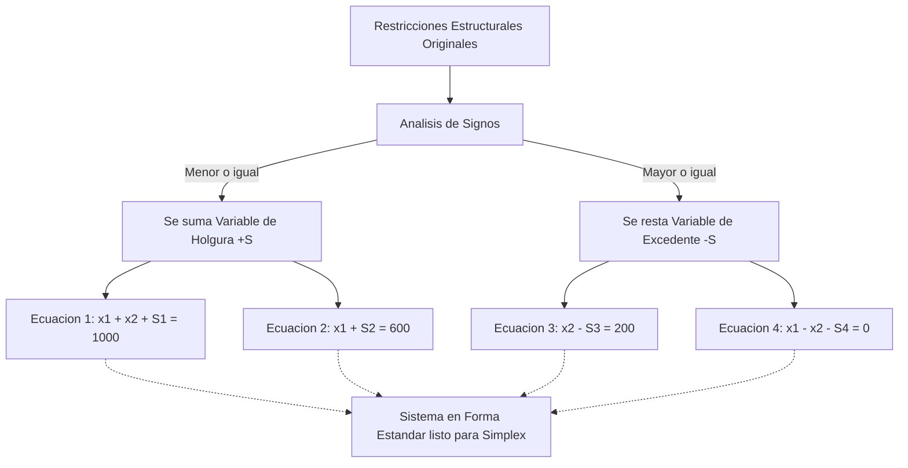

https://www.youtube.com/watch?v=q7EOjGSJda0&list=PLYZrqm_pzRul0t_2QKU2kdHDwGkKblutk&index=3

Problema 1.5
Una persona ha recibido 1 millón de pesos de una herencia y le aconsejan que lo invierta en dos tipos de acciones, A y B. Las acciones de tipo A tienen más riesgo, ==pero producen un beneficio del 30% anual mientras que las de tipo B son más seguras, pero producen sólo el 10% anual. ==
Después de analizarlo decide invertir ==como máximo 600 mil en la compra de acciones A y, por lo menos, 200 mil en la compra de acciones B==. Además, ==decide que la cantidad invertida en A sea, por lo menos, igual a lo invertido en B.== 
¿Cómo deberá invertir el millón de pesos para que el beneficio anual sea máximo suponiendo que los valores tienen certeza y se puede comprar cualquier número de acciones A o B, inclusive fracciones de ellas?

a) Describa el objetivo en forma verbal
b) Defina las variables de decisión del problema.
c) ¿Al describir las variables utilizó alguna unidad de tiempo? Si la respuesta es afirmativa indique cual es en cada variable y cual corresponderá a la función objetivo
d) Formule la función objetivo explicando el valor de cada uno de los coeficientes.
e) Plantee las restricciones en forma literal y en forma de ecuaciones o inecuaciones lineales, explicando c/u de ellas.
f) Plantee el problema como un modelo de programación lineal.
g) Defina las variables de holgura

---
La profesora enfatizó que no se debe saltar directamente a escribir ecuaciones sin antes realizar un análisis comprensivo del enunciado. Textualmente indicó: _"no subestimen estos pasos de leer y analizar el problema e identificar con palabras qué es lo que tengo es muy importante y en medida que los problemas se hacen más complicados más importantes se vuelven estos pasos"_.

>[!tip] Metodología de Resolución Antes de plantear variables matemáticas (x1​,x2​), debes escribir verbalmente cuál es la meta del decisor y cuáles son los límites físicos o económicos que enfrenta

# U2
a) Describa el objetivo en forma verbal
	El objetivo del decisor es **maximizar el [[Rendimiento Anual]]** (o beneficio total) obtenido a partir del dinero invertido en las acciones de tipo A y de tipo B.

b) Defina las variables de decisión del problema.
	A través del **Problema 5 (Inversión en Acciones)**, la profesora demostró qué hacer cuando los datos convencionales no están disponibles. Como el enunciado no proporcionaba el precio unitario de cada acción, no era posible definir las variables como "número de acciones a comprar".
	- **Definición de las [[Variables de Decisión]]:**
	    - _El problema de los datos:_ No se pueden definir las variables como "cantidad de acciones" porque el enunciado no da el precio unitario de cada acción.
    - _Solución:_ 
	    - Se debió definir la variable utilizando una unidad monetaria:
		    - x1="Miles de pesos a invertir en la acción tipo A
		    - x2="Miles de pesos a invertir en la acción tipo B

>[!danger] Trampa de Parcial (Definición de Variables) La profesora advirtió firmemente que definir una variable como "cantidad del producto" es un error conceptual. Explicó que _"cantidad no es una unidad a la cual esta medida"_. Por ejemplo, en lugar de decir "cantidad de dinero a invertir", se debe ser exacto y definir "pesos a invertir", o en lugar de "cantidad de sillas", usar "unidades de sillas a producir". Esto garantiza la correcta aplicación del [[Análisis Dimensional]].
- **Formas de Definición de Variables:**
    - **[[Definición por Extensión]]:** Detallar cada variable individualmente (Ej: x1​ = pesos invertidos en acción A).
    - **[[Definición por Comprensión]]:** Usar una notación general (Ej: xi​ = pesos a invertir en la acción tipo i, para i=1,2).

c) ¿Al describir las variables utilizó alguna unidad de tiempo? Si la respuesta es afirmativa indique cual es en cada variable y cual corresponderá a la función objetivo
	**No, no se utilizó ninguna unidad de tiempo en las variables.** La profesora aclaró que en este caso hay una unidad de medida (Pesos) pero la inversión se hace en un instante único, por lo que carece de período temporal intrínseco.
	**¿Y en la [[Función Objetivo]]?** Sí, el resultado de la función objetivo corresponderá a **Pesos por Año** (o miles de pesos anuales), ya que los rendimientos del 30% y 10% son tasas anuales que le inyectan la unidad de tiempo a la meta.

d) Formule la función objetivo explicando el valor de cada uno de los coeficientes.
	Fórmula de la Función Objetivo (Z)
	Max z=0,30 * X_1+0,10 * X_2
		C1=Representa la [Tasa de Retorno] anual de la acción A (30%). Indica que por cada mil pesos invertidos en x1​, el beneficio se incrementará en 0.30 miles de pesos
		C2=Representa la [Tasa de Retorno] anual de la acción B (10%). Indica el aporte marginal al beneficio por cada mil pesos invertidos en x2

e) Plantee las restricciones en forma literal y en forma de ecuaciones o inecuaciones lineales, explicando c/u de ellas.
	Restriccion 1:
		Maximo para invertir en total 1 millon de pesos
	Restriccion 2:
		como máximo 600 mil en la compra de acciones A
	Restriccion 3:
		por lo menos, 200 mil en la compra de acciones B
	Restriccion 4
		la cantidad invertida en A sea, por lo menos, igual a lo invertido en B.
	En forma de inecuaciones
			x_1+x_2<= 1.000.000
			x_1<=600.000
			x_2 >=200.000
			X_1>=X_2 -> x_1-x_2 >=
			x_1;x_2>= 0  

f) Plantee el problema como un modelo de programación lineal.
	![[{0A42B011-5A5D-4770-BD68-D0AE687B8BD2}.png|504]]
		!note] Modelo Matemático Completo 
		MaxZ=0.30x1​+0.10x2​ 
			_Sujeto a (s.a.):_ 
			x1​+x2​≤1000 
			x1​≤600 
			x2​≥200 
			x1​−x2​≥0 
			x1​,x2​≥0

>[!danger] Error Crítico: "Positivo" vs "No Negativo" La última inecuación es la [[Condición de No Negatividad]]. La profesora advirtió que es un error de parcial llamarla "condición de positividad". _"Recuerden por favor que no negatividad quiere decir mayor o igual a 0, no quiere decir positivo"_

pregunta de la profe: que significa resolver un modelo de pl?
	RESOLVERLO es encontrar encontrar los valores de las variables x1,x2  , que sasfifacen todas las restricciones y que optmizen la funcion objetivo

g) Defina las variables de holgura

Para poder resolver el modelo y llevarlo a su [[Forma Estándar]], las inecuaciones deben transformarse en igualdades matemáticas agregando las [[Variables de Holgura]] o excedente (representadas con la letra S).

Estas variables entran a la función objetivo con un coeficiente de costo o beneficio nulo (0), ya que _"no aportan nada a las utilidades"_.

|Restricción|Signo original|Ajuste al Modelo|Definición Económica ([[Variables de Holgura]])|
|---|---|---|---|
|**1 (Capital)**|≤|+S1​|Miles de pesos del millón original **no invertidos** (Capital ocioso).|
|**2 (Máx A)**|≤|+S2​|Margen de dinero sobrante hasta alcanzar el tope máximo de inversión en A (Miles de pesos por debajo de 600).|
|**3 (Mín B)**|≥|−S3​|Excedente monetario invertido en la acción B por encima de su piso mínimo obligatorio de 200 mil.|
|**4 (Proporción)**|≥|−S4​|Diferencia excedente del capital invertido en A por sobre el capital invertido en B.|

Síntesis Visual: Transformación a Forma Estándar

A continuación, te presento cómo fluye la transformación del sistema de inecuaciones hacia ecuaciones de igualdad mediante la inyección de estas variables:

