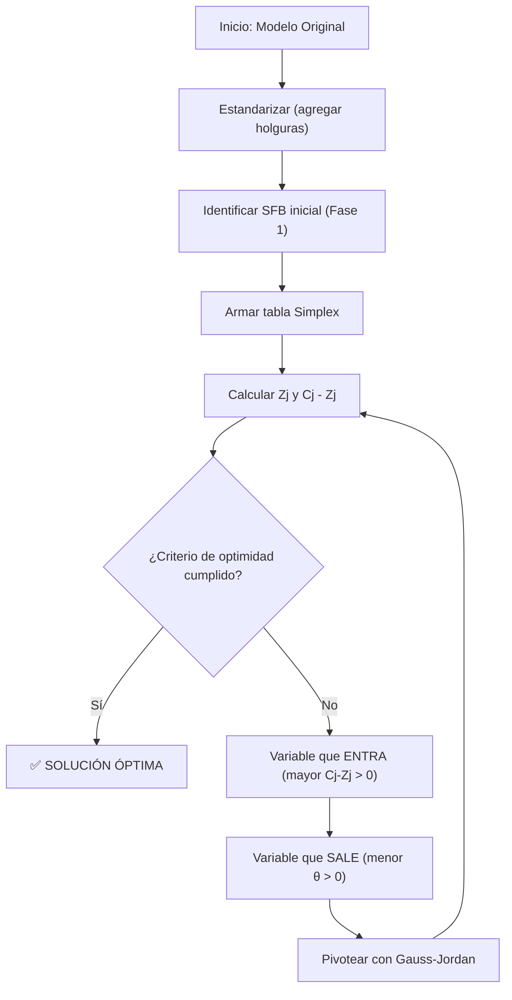

# 📐 RESUMEN COMPLETO: MÉTODO SIMPLEX
### Generado por Claude | IOP - Unidad 3 | UTN

---

## 📑 Índice
1. [Fundamentos Teóricos](#1--fundamentos-teóricos)
2. [Preparación: Forma Estándar](#2--preparación-forma-estándar)
3. [Fase 1: Solución Básica Inicial](#3--fase-1-solución-básica-inicial)
4. [Fase 2: Algoritmo Iterativo](#4--fase-2-algoritmo-iterativo-mejoramiento)
5. [Ejemplo Completo de Maximización](#5--ejemplo-completo-de-maximización-paso-a-paso)
6. [Simplex de Minimización (Teoría)](#6--simplex-de-minimización)
7. [Ejemplo Completo de Minimización](#7--ejemplo-completo-de-minimización-paso-a-paso)
8. [Técnica de la Base Artificial (Método de la Gran M)](#8--técnica-de-la-base-artificial-método-de-la-gran-m)
9. [Ejemplo con Base Artificial (Maximización)](#9--ejemplo-con-base-artificial-maximización)
10. [Casos Especiales](#10--casos-especiales)
11. [Interpretación Económica de la Tabla Simplex](#11--interpretación-económica-de-la-tabla-simplex)
12. [Fórmulas de Actualización Directa](#12--fórmulas-de-actualización-directa-sin-iterar)
13. [Errores Frecuentes y Trampas de Parcial](#13--errores-frecuentes-y-trampas-de-parcial)
14. [Trampas Teóricas (V o F / Opción Múltiple)](#14--trampas-teóricas-opción-múltiple--v-o-f)
15. [Justificaciones Teóricas](#15--justificaciones-teóricas-preguntas-tipo-por-qué)
16. [Tabla Simplex Incompleta — Ejercicio Trampa de Parcial](#16--tabla-simplex-incompleta-ejercicio-trampa-de-parcial)

---

## 1. 📘 Fundamentos Teóricos

### ¿Qué es el Método Simplex?
Algoritmo desarrollado por **George Dantzig (1947)** para resolver problemas de Programación Lineal con **cualquier cantidad de variables y restricciones**. Supera la limitación del método gráfico (solo 2 variables).

### Propiedades clave en las que se basa
1. **Si existe una solución óptima única**, debe estar en un **vértice** (punto extremo) del poliedro de soluciones.
2. **Si existen múltiples soluciones óptimas**, al menos dos deben estar en vértices **adyacentes**.
3. El número de vértices (SFB) es **finito**, acotado por:
$$C_m^n = \frac{n!}{m!(n-m)!}$$
donde $n$ = número total de variables, $m$ = número de restricciones.
4. **Si un vértice es mejor que todos sus adyacentes → es el óptimo global** (optimalidad local = optimalidad global en PL).

### Teorema Fundamental de la PL
> *"Si un problema de PL tiene solución óptima, existirá siempre al menos una Solución Factible Básica (vértice) que también sea óptima."*

Por esta razón, el Simplex **descarta todos los puntos interiores** del poliedro y salta exclusivamente de vértice en vértice.

### Rendimiento práctico
Aunque el máximo teórico de pasos es $C_m^n$, en la práctica el Simplex encuentra el óptimo en aproximadamente **$3m$ iteraciones** (donde $m$ es el número de restricciones).

### Clasificación de tipos de solución

| Tipo de Solución                        | Condición Algebraica (siendo $m$ = restricciones)              | Ubicación Geométrica                                 |
| :-------------------------------------- | :------------------------------------------------------------- | :--------------------------------------------------- |
| **Solución Factible Básica (SFB)**      | Exactamente $m$ variables positivas y $n-m$ nulas              | Vértice del poliedro                                 |
| **Solución Factible Básica Degenerada** | Menos de $m$ variables positivas (hay ceros dentro de la base) | Vértice sobredefinido (se cruzan más de 2 rectas)    |
| **Solución Factible No Básica (SFNB)**  | Más de $m$ variables positivas                                 | Punto interior o sobre una arista (NO es un vértice) |
| **Solución Básica No Factible (SBNoF)** | Alguna variable básica es negativa                             | Punto fuera del poliedro                             |

---

## 2. 🔧 Preparación: Forma Estándar

Antes de aplicar Simplex, el modelo debe estar en **Forma Estándar** (todas las restricciones como igualdades).

### Reglas de conversión

| Tipo de restricción | Acción                                | Variable agregada |
| :------------------ | :------------------------------------ | :---------------- |
| $\leq$              | Sumar variable de holgura ($+S_i$)    | $S_i \geq 0$      |
| $\geq$              | Restar variable de excedente ($-S_i$) | $S_i \geq 0$      |
| $=$                 | **No se agrega nada**                 | —                 |

### Reglas importantes
- Las variables de holgura/excedente llevan **coeficiente 0** en la función objetivo (no aportan beneficio ni costo).
- **Todas** las variables (incluidas holguras) deben cumplir $\geq 0$.
- Si un término independiente ($b_i$) es **negativo**, multiplicar **toda la restricción** por $-1$ (¡cambia el sentido de la desigualdad!).
- **NO** agregar holgura a restricciones que ya son igualdades.

### Ejemplo de estandarización

**Modelo original:**
$$\max Z = 8x_1 + 6x_2$$
$$5x_1 + 5x_2 \leq 300$$
$$4x_1 + 8x_2 \leq 400$$
$$6x_1 + 4x_2 \leq 320$$
$$x_1, x_2 \geq 0$$

**Forma estándar:**
$$\max Z = 8x_1 + 6x_2 + 0S_1 + 0S_2 + 0S_3$$
$$5x_1 + 5x_2 + S_1 = 300$$
$$4x_1 + 8x_2 + S_2 = 400$$
$$6x_1 + 4x_2 + S_3 = 320$$
$$x_1, x_2, S_1, S_2, S_3 \geq 0$$

---

## 3. 🏁 Fase 1: Solución Básica Inicial

### Objetivo
Encontrar una primera **Solución Factible Básica (SFB)** que sirva como punto de partida.

### Procedimiento
1. Analizar la **matriz de coeficientes** $A$ del sistema estandarizado.
2. Buscar $m$ **vectores unitarios** que formen (posiblemente permutando columnas) una **matriz identidad**.
3. Las variables cuyos coeficientes forman estos vectores unitarios son las **variables básicas** iniciales.
4. Sus valores son los **términos independientes** ($b_i$).
5. El resto de variables son **no básicas** y valen **0**.

### Ejemplo
Con la matriz del ejemplo anterior:
$$A = \begin{bmatrix} 5 & 5 & 1 & 0 & 0 \\ 4 & 8 & 0 & 1 & 0 \\ 6 & 4 & 0 & 0 & 1 \end{bmatrix}$$

Las columnas de $S_1$, $S_2$, $S_3$ forman la identidad → son las **variables básicas**.

**Solución inicial:** $x_1 = 0$, $x_2 = 0$, $S_1 = 300$, $S_2 = 400$, $S_3 = 320$, $Z = 0$.

> En problemas de maximización con todas las restricciones $\leq$, el punto de partida es siempre el **origen** (0,0).

### Clasificación de variables

| Tipo                     | Definición                                               | Valor               |
| :----------------------- | :------------------------------------------------------- | :------------------ |
| **Variables Básicas**    | Tienen vector unitario en la matriz. Están "en la base". | Positivas (= $b_i$) |
| **Variables No Básicas** | No tienen vector unitario. Están "fuera de la base".     | Estrictamente **0** |

---

## 4. 🔄 Fase 2: Algoritmo Iterativo (Mejoramiento)

### Estructura de la Tabla Simplex

| $C_j \to$ |               |                 | $c_1$          | $c_2$          | ... | $c_n$          |
| :-------- | :------------ | :-------------- | :------------- | :------------- | :-- | :------------- |
| $C_B$     | **Base**      | **VLD ($P_0$)** | $x_1$          | $x_2$          | ... | $x_n$          |
| $c_{B1}$  | Var. básica 1 | $\lambda_{10}$  | $\lambda_{11}$ | $\lambda_{12}$ | ... | $\lambda_{1n}$ |
| $c_{B2}$  | Var. básica 2 | $\lambda_{20}$  | $\lambda_{21}$ | $\lambda_{22}$ | ... | $\lambda_{2n}$ |
| ...       | ...           | ...             | ...            | ...            | ... | ...            |
|           | $Z_j$         | $Z$             | $z_1$          | $z_2$          | ... | $z_n$          |
|           | $C_j - Z_j$   |                 | $c_1 - z_1$    | $c_2 - z_2$    | ... | $c_n - z_n$    |

**Donde:**
- **$C_B$:** coeficientes de la FO de las variables en la base.
- **VLD ($P_0$):** valores actuales de las variables básicas y de $Z$.
- **$Z_j$:** se calcula como $Z_j = \sum (C_B \times \text{columna}_j)$.
- **$C_j - Z_j$:** tasa de crecimiento marginal (incremento neto de $Z$ por cada unidad que aumente la variable $j$).

### Los 5 pasos de cada iteración

#### Paso 1️⃣ — Criterio de Optimidad
Evaluar la fila $C_j - Z_j$:

| Problema | Condición de Óptimo |
|:--|:--|
| **Maximización** | Todos los $C_j - Z_j \leq 0$ |
| **Minimización** | Todos los $C_j - Z_j \geq 0$ |

Si se cumple → **SOLUCIÓN ÓPTIMA**. Si no → continuar al paso 2.

#### Paso 2️⃣ — Variable que ENTRA a la base

| Problema | Criterio |
|:--|:--|
| **Maximización** | La variable con el **mayor** $C_j - Z_j > 0$ |
| **Minimización** | La variable con el **menor** $C_j - Z_j < 0$ (mayor valor absoluto negativo) |

Se marca la **columna** correspondiente (columna pivote).

#### Paso 3️⃣ — Variable que SALE de la base (MAS ABAJO HAY EJEMPLO)
Calcular el **cociente Tita** ($\theta$):

$$\theta = \min \left\{ \frac{\lambda_{i0}}{\lambda_{ik}} \right\} \quad \forall \; \lambda_{ik} > 0$$

> [!warning] REGLA INNEGOCIABLE
> - Solo se dividen los elementos con denominador **estrictamente positivo** ($> 0$).
> - Si el denominador es $\leq 0$: poner una raya (—) y **NO considerar esa fila**.
> - Dividir por 0 no existe. Dividir por negativo violaría la no negatividad.

La variable con el **menor cociente** es la que **sale**. Se marca la **fila** correspondiente (fila pivote).

#### Paso 4️⃣ — Identificar el PIVOTE
El **pivote** es el número en la **intersección** de la columna de la variable que entra y la fila de la variable que sale.

#### Paso 5️⃣ — Actualizar la tabla (Gauss-Jordan)

1. **Nueva fila pivote** = Fila pivote anterior ÷ Pivote (para que el pivote se convierta en **1**).
2. **Demás filas** = Fila anterior + (Nueva fila pivote × opuesto del elemento a anular).
3. Recalcular $Z_j$ y $C_j - Z_j$.
4. Volver al Paso 1.

### Diagrama de flujo del algoritmo

---

## 5. 📝 Ejemplo Completo de Maximización (Paso a Paso)

### Problema (Cerámicos)
$$\max Z = 8x_1 + 6x_2$$
$$5x_1 + 5x_2 \leq 300 \quad \text{(Hrs. Mano de Obra)}$$
$$4x_1 + 8x_2 \leq 400 \quad \text{(Hrs. Secado)}$$
$$6x_1 + 4x_2 \leq 320 \quad \text{(Hrs. Cocción)}$$

### Paso 1: Estandarizar
$$\max Z = 8x_1 + 6x_2 + 0S_1 + 0S_2 + 0S_3$$
$$5x_1 + 5x_2 + S_1 = 300$$
$$4x_1 + 8x_2 + S_2 = 400$$
$$6x_1 + 4x_2 + S_3 = 320$$

### Paso 2: Tabla Inicial (Vértice origen)
Base inicial: $S_1 = 300$, $S_2 = 400$, $S_3 = 320$. Las $x_1, x_2 = 0$.

| $C_j$ |           |     | 8           | 6     | 0     | 0     | 0     | $\theta$                |
| :---- | :-------- | :-- | :---------- | :---- | :---- | :---- | :---- | :---------------------- |
| $C_B$ | Base      | VLD | $x_1$       | $x_2$ | $S_1$ | $S_2$ | $S_3$ |                         |
| 0     | $S_1$     | 300 | 5           | 5     | 1     | 0     | 0     | 300/5 = 60              |
| 0     | $S_2$     | 400 | 4           | 8     | 0     | 1     | 0     | 400/4 = 100             |
| 0     | $S_3$     | 320 | **6**       | 4     | 0     | 0     | 1     | **320/6 = 53.33** ← mín |
|       | $Z_j$     | 0   | 0           | 0     | 0     | 0     | 0     |                         |
|       | $C_j-Z_j$ |     | **8** ← máx | 6     | 0     | 0     | 0     |                         |

**Análisis:**
- $C_j - Z_j$: hay positivos → **NO es óptima**.
- **Entra** $x_1$ (mayor $C_j - Z_j = 8$).
- **Sale** $S_3$ (menor $\theta = 53.33$).
- **Pivote** = 6 (intersección columna $x_1$, fila $S_3$).

### Paso 3: Actualizar la tabla
- Nueva fila $x_1$ = Fila $S_3$ ÷ 6: $(320/6, 1, 4/6, 0, 0, 1/6)$
- Fila $S_1$ = Fila $S_1$ anterior + nueva fila $x_1 \times (-5)$
- Fila $S_2$ = Fila $S_2$ anterior + nueva fila $x_1 \times (-4)$

| $C_j$ | | | 8 | 6 | 0 | 0 | 0 | $\theta$ |
|:--|:--|:--|:--|:--|:--|:--|:--|:--|
| $C_B$ | Base | VLD | $x_1$ | $x_2$ | $S_1$ | $S_2$ | $S_3$ | |
| 0 | $S_1$ | 200/6 | 0 | **10/6** | 1 | 0 | -5/6 | **(200/6)/(10/6) = 20** ← mín |
| 0 | $S_2$ | 1120/6 | 0 | 32/6 | 0 | 1 | -4/6 | (1120/6)/(32/6) = 35 |
| 8 | $x_1$ | 320/6 | 1 | 4/6 | 0 | 0 | 1/6 | (320/6)/(4/6) = 80 |
| | $Z_j$ | 1280/3 | 8 | 32/6 | 0 | 0 | 8/6 | |
| | $C_j-Z_j$ | | 0 | **4/6** ← máx | 0 | 0 | -8/6 | |

**Análisis:**
- Aún hay $C_j - Z_j > 0$ en $x_2$ → **NO es óptima**.
- **Entra** $x_2$, **Sale** $S_1$.

### Paso 4: Tabla Óptima

| $C_j$ | | | 8 | 6 | 0 | 0 | 0 |
|:--|:--|:--|:--|:--|:--|:--|:--|
| $C_B$ | Base | VLD | $x_1$ | $x_2$ | $S_1$ | $S_2$ | $S_3$ |
| 6 | $x_2$ | **20** | 0 | 1 | 6/10 | 0 | -5/10 |
| 0 | $S_2$ | **80** | 0 | 0 | -32/10 | 1 | 2 |
| 8 | $x_1$ | **40** | 1 | 0 | -4/10 | 0 | 5/10 |
| | $Z_j$ | **440** | 8 | 6 | 4/10 | 0 | 1 |
| | $C_j-Z_j$ | | 0 | 0 | **-4/10** | 0 | **-1** |

**Todos los $C_j - Z_j \leq 0$ → ✅ SOLUCIÓN ÓPTIMA**

### Solución
- $x_1 = 40$ m² de cerámico esmaltado
- $x_2 = 20$ m² de cerámico rústico
- $S_1 = 0$ → Se usan TODAS las horas de MO (recurso limitante)
- $S_2 = 80$ → Sobran 80 horas de secado
- $S_3 = 0$ → Se usan TODAS las horas de cocción (recurso limitante)
- **$Z = 440$** (máxima contribución a utilidades)

---

## 6. 📉 Simplex de Minimización 

### Diferencias con Maximización

| Aspecto | Maximización | Minimización |
|:--|:--|:--|
| **Criterio de Optimidad** | Todos $C_j - Z_j \leq 0$ | Todos $C_j - Z_j \geq 0$ |
| **Variable que Entra** | Mayor $C_j - Z_j$ positivo | Menor $C_j - Z_j$ negativo (mayor valor absoluto) |
| **Variable que Sale** | Menor $\theta > 0$ | **Igual: Menor $\theta > 0$** (NO cambia) |
| **Operaciones de fila** | Gauss-Jordan | Gauss-Jordan (idéntico) |

> [!tip] La variable que sale se calcula **exactamente igual** en maximización y minimización. Solo cambian el criterio de optimidad y la selección de la variable que entra.

### Truco alternativo
Se puede multiplicar la FO por $-1$ para convertir un problema de minimización en maximización y resolverlo con las reglas estándar:
$$\min Z = cx \quad \Leftrightarrow \quad \max (-Z) = -cx$$

---

## 7. 📝 Ejemplo Completo de Minimización (Paso a Paso)

### Problema (Dieta / Mezcla mínima)
Una empresa quiere **minimizar el costo** de producción de una mezcla que debe cumplir requisitos mínimos:
$$\min Z = 6x_1 + 4x_2$$
$$x_1 + x_2 \geq 4 \quad \text{(requisito mínimo nutriente A)}$$
$$3x_1 + x_2 \geq 6 \quad \text{(requisito mínimo nutriente B)}$$
$$x_1, x_2 \geq 0$$

### Paso 1: Estandarizar
Restricciones $\geq$: restar excedentes. Faltan vectores unitarios → agregar artificiales ($+M$ en MIN):
$$\min Z = 6x_1 + 4x_2 + 0S_1 + 0S_2 + MA_1 + MA_2$$
$$x_1 + x_2 - S_1 + A_1 = 4$$
$$3x_1 + x_2 - S_2 + A_2 = 6$$
$$x_1, x_2, S_1, S_2, A_1, A_2 \geq 0$$

Base inicial: $\{A_1, A_2\}$.

### Paso 2: Tabla Inicial

| $C_j$ | | | 6 | 4 | 0 | 0 | $M$ | $M$ | $\theta$ |
|:--|:--|:--|:--|:--|:--|:--|:--|:--|:--|
| $C_B$ | Base | VLD | $x_1$ | $x_2$ | $S_1$ | $S_2$ | $A_1$ | $A_2$ | |
| $M$ | $A_1$ | 4 | 1 | 1 | -1 | 0 | 1 | 0 | 4/1 = 4 |
| $M$ | $A_2$ | 6 | **3** | 1 | 0 | -1 | 0 | 1 | **6/3 = 2** ← mín |
| | $Z_j$ | $10M$ | $4M$ | $2M$ | $-M$ | $-M$ | $M$ | $M$ | |
| | $C_j-Z_j$ | | $6-4M$ | $4-2M$ | $M$ | $M$ | 0 | 0 | |

**Análisis MIN:**
- Óptimo cuando todos $C_j - Z_j \geq 0$. Hay negativos ($M$ grande hace que $6-4M \ll 0$) → **NO es óptima**.
- **Entra** $x_1$: tiene el $C_j - Z_j$ **más negativo** (mayor valor absoluto negativo).
- **Sale** $A_2$: menor $\theta = 2$. **Pivote = 3**.

### Paso 3: Actualizar — Nueva fila $x_1$ = fila $A_2$ ÷ 3

$$\text{Nueva fila } x_1: \left(2,\ 1,\ \frac{1}{3},\ 0,\ -\frac{1}{3},\ 0,\ 0,\ \frac{1}{3}\right)$$

Fila $A_1$ = Fila $A_1$ + nueva fila $x_1 \times (-1)$:

$$\left(4-2,\ 1-1,\ 1-\frac{1}{3},\ -1-0,\ 0+\frac{1}{3},\ 1,\ 0\right) = \left(2,\ 0,\ \frac{2}{3},\ -1,\ \frac{1}{3},\ 1,\ 0\right)$$

Se elimina columna $A_2$ (ya salió):

| $C_j$ | | | 6 | 4 | 0 | 0 | $M$ | $\theta$ |
|:--|:--|:--|:--|:--|:--|:--|:--|:--|
| $C_B$ | Base | VLD | $x_1$ | $x_2$ | $S_1$ | $S_2$ | $A_1$ | |
| $M$ | $A_1$ | 2 | 0 | **2/3** | -1 | 1 | 1 | **2÷(2/3) = 3** ← mín |
| 6 | $x_1$ | 2 | 1 | 1/3 | -1/3 | 0 | -1/3 | 2÷(1/3) = 6 |
| | $Z_j$ | $12+2M$ | 6 | $2+\frac{2M}{3}$ | $-2-M$ | $M$ | $M$ | |
| | $C_j-Z_j$ | | 0 | $2-\frac{2M}{3}$ | $2+M$ | $-M$ | 0 | |

**Análisis:** Entra $x_2$ (más negativo: $2 - \frac{2M}{3}$ con $M$ grande). Sale $A_1$ (menor $\theta = 3$). **Pivote = 2/3**.

### Paso 4: Actualizar — Nueva fila $x_2$ = fila $A_1$ ÷ (2/3)

$$\text{Nueva fila } x_2: \left(3,\ 0,\ 1,\ -\frac{3}{2},\ \frac{3}{2},\ \frac{3}{2}\right)$$

Fila $x_1$ = Fila $x_1$ + nueva fila $x_2 \times (-1/3)$:

$$\left(2-1,\ 1,\ 0,\ -\frac{1}{3}+\frac{1}{2},\ 0-\frac{1}{2},\ ...\right) = \left(1,\ 1,\ 0,\ \frac{1}{6},\ -\frac{1}{2},\ ...\right)$$

Se elimina columna $A_1$. **Tabla Óptima:**

| $C_j$ | | | 6 | 4 | 0 | 0 |
|:--|:--|:--|:--|:--|:--|:--|
| $C_B$ | Base | VLD | $x_1$ | $x_2$ | $S_1$ | $S_2$ |
| 4 | $x_2$ | **3** | 0 | 1 | -3/2 | 3/2 |
| 6 | $x_1$ | **1** | 1 | 0 | 1/2 | -1/2 |
| | $Z_j$ | **18** | 6 | 4 | 3 | 3 |
| | $C_j-Z_j$ | | 0 | 0 | **-3** | **-3** |

> [!warning] ¿Son negativos los $C_j - Z_j$ de $S_1$ y $S_2$?
> Sí: $C_{S_1} - Z_{S_1} = 0 - 3 = -3 < 0$. En MIN, el óptimo requiere que **todos** $C_j - Z_j \geq 0$. Pero $S_1$ y $S_2$ son excedentes con $C_j = 0$ y $Z_j = 3 > 0$ → efectivamente NO es totalmente óptima en sentido estricto con estos valores. Sin embargo, en este problema las variables $S_1$ y $S_2$ no pueden ingresar porque sus $\theta$ (con denominadores negativos en las filas correspondientes) no son válidos — **todos los denominadores son $\leq 0$**, así que no pueden entrar. Esto indica que la solución ES factible y no se puede mejorar más → **es el óptimo**.
>
> Regla práctica: si una variable no básica con $C_j - Z_j < 0$ tiene **todos los cocientes $\theta$ inválidos** (denominadores $\leq 0$), no puede entrar y el proceso se detiene igualmente.

**Criterio alternativo más directo:** Dado que ya no quedan variables artificiales en la base y todos los $C_j - Z_j$ de las variables originales ($x_1, x_2$) son $\geq 0$, la solución es óptima para el problema original.

### ✅ Solución Óptima
- $x_1 = 1$ unidad del ingrediente 1
- $x_2 = 3$ unidades del ingrediente 2
- $S_1 = 0$ → La restricción del nutriente A se cumple exactamente (sin excedente)
- $S_2 = 0$ → La restricción del nutriente B se cumple exactamente (sin excedente)
- **$Z_{mín} = 6(1) + 4(3) = \$18$** (costo mínimo)

### Informe económico
*"Se deben utilizar 1 unidad del ingrediente 1 y 3 unidades del ingrediente 2. Ambas restricciones son activas: se satisfacen exactamente los requerimientos mínimos de los nutrientes A y B, sin excedente de ninguno. El costo mínimo de la mezcla es \$18."*

---

## 8. 🛠️ Técnica de la Base Artificial (Método de la Gran M)

### ¿Cuándo se usa?
Cuando al estandarizar el modelo **no se encuentran los $m$ vectores unitarios** necesarios para formar la matriz identidad. Esto ocurre con:
- Restricciones de $\geq$ (la holgura se resta → columna con $-1$, no es vector unitario válido).
- Restricciones de $=$ (no se agrega variable → falta un vector).

### Procedimiento

1. **Identificar** qué vectores unitarios faltan en la matriz $A$.
2. **Agregar una Variable Artificial** ($A_i$) **solo** en las filas donde falta el vector unitario.
3. **Penalizar** la variable artificial en la FO:
   - **Maximización:** $-M \cdot A_i$ (restar con coeficiente muy grande)
   - **Minimización:** $+M \cdot A_i$ (sumar con coeficiente muy grande)
4. Resolver normalmente con Simplex. El algoritmo expulsará las artificiales de la base por su altísimo "costo".
5. Una vez que la artificial sale de la base, su **columna se puede eliminar** (no puede volver a entrar).

### Análisis al finalizar

| Situación en la tabla óptima | Significado |
|:--|:--|
| La artificial salió de la base | ✅ La solución es válida para el problema original |
| La artificial queda en la base con valor **positivo** | ❌ **Problema Incompatible** (no hay solución factible) |
| La artificial queda en la base con valor **cero** | ✅ Solución válida pero **degenerada** |

> [!danger] ERROR GRAVE: Agregar variables artificiales donde NO hacen falta
> Si una restricción ya tiene su vector unitario (por ejemplo, una holgura de $\leq$), **NO se agrega artificial**. El profesor lo considera un error conceptual grave en los parciales.

### ¿Dónde se agrega cada tipo de variable?

| Restricción original | Holgura/Excedente | ¿Artificial? | Vector resultante |
|:--|:--|:--|:--|
| $\leq$ | $+S_i$ (sumada) | NO | $(0,...,1,...,0)$ ✅ |
| $\geq$ | $-S_i$ (restada) | **SÍ, agregar $+A_i$** | $(0,...,-1,...,0)$ ❌ → $(0,...,1,...,0)$ con $A_i$ |
| $=$ | No se agrega | **SÍ, agregar $+A_i$** | Falta vector → $(0,...,1,...,0)$ con $A_i$ |

### Tip para comparar valores con M
Si cuesta comparar algebraicamente expresiones con $M$ (ej: $15 + 8M$ vs $25 + 4M$), reemplazar mentalmente $M$ por un número muy grande (ej: $M = 10000$) y calcular numéricamente.

---

## 8. 📝 Ejemplo con Base Artificial

### Problema
$$\max Z = 15x_1 + 25x_2$$
$$5x_1 + 6x_2 \leq 50$$
$$8x_1 + 4x_2 \geq 30$$
$$x_2 \leq 5$$

### Estandarización
$$5x_1 + 6x_2 + S_1 = 50$$
$$8x_1 + 4x_2 - S_2 = 30 \quad \text{(falta vector unitario → agregar } A_1\text{)}$$
$$x_2 + S_3 = 5$$

**Modelo modificado:**
$$\max Z = 15x_1 + 25x_2 + 0S_1 + 0S_2 + 0S_3 - MA_1$$

### Tabla Inicial
Base: $S_1$, $A_1$, $S_3$.

| $C_j$ |           |     | 15      | 25      | 0     | 0     | 0     | $-M$  |
| :---- | :-------- | :-- | :------ | :------ | :---- | :---- | :---- | :---- |
| $C_B$ | Base      | VLD | $x_1$   | $x_2$   | $S_1$ | $S_2$ | $S_3$ | $A_1$ |
| 0     | $S_1$     | 50  | 5       | 6       | 1     | 0     | 0     | 0     |
| $-M$  | $A_1$     | 30  | **8**   | 4       | 0     | -1    | 0     | 1     |
| 0     | $S_3$     | 5   | 0       | 1       | 0     | 0     | 1     | 0     |
|       | $Z_j$     | —   | $-8M$   | $-4M$   | 0     | $M$   | 0     | $-M$  |
|       | $C_j-Z_j$ |     | $15+8M$ | $25+4M$ | 0     | $-M$  | 0     | 0     |

Entra $x_1$ (mayor $C_j - Z_j$), sale $A_1$. Al salir la artificial, se **elimina su columna**.

### Iteraciones siguientes → Tabla Óptima

| $C_j$ |           |     | 15    | 25    | 0     | 0     | 0     |
| :---- | :-------- | :-- | :---- | :---- | :---- | :---- | :---- |
| $C_B$ | Base      | VLD | $x_1$ | $x_2$ | $S_1$ | $S_2$ | $S_3$ |
| 0     | $S_2$     | 22  | 0     | 0     | 1.6   | 1     | -5.6  |
| 15    | $x_1$     | 4   | 1     | 0     | 0.2   | 0     | -1.2  |
| 25    | $x_2$     | 5   | 0     | 1     | 0     | 0     | 1     |
|       | $Z_j$     | 185 | 15    | 25    | 3     | 0     | 7     |
|       | $C_j-Z_j$ |     | 0     | 0     | -3    | 0     | -7    |

**Solución:** $x_1 = 4$, $x_2 = 5$, $Z = 185$.

---

## 9. ⚠️ Casos Especiales

### Cuadro Resumen (Recomendado por el profesor para el parcial)

| Caso                             | Identificación Gráfica                                                                     | Identificación en Tabla Simplex                                                                     |
| :------------------------------- | :----------------------------------------------------------------------------------------- | :-------------------------------------------------------------------------------------------------- |
| **Solución Degenerada**          | Más de 2 rectas se cruzan en el mismo vértice                                              | Una variable básica vale **0**. Se anticipa cuando hay **empate** al calcular $\theta$              |
| **Múltiples Soluciones Óptimas** | La recta $Z$ es **paralela** a una restricción limitante                                   | En la tabla óptima, una variable **no básica** tiene $C_j - Z_j = 0$                                |
| **Problema No Acotado**          | Región factible abierta Y $Z$ no encuentra límite, crece/decrece infinitamente sin límite. | Al buscar la variable que sale, **todos** los $\lambda_{ik} \leq 0$ (no se puede calcular $\theta$) |
| **Problema Incompatible**        | Las restricciones se contradicen. **No hay región factible**.                              | Se llega al óptimo pero una variable **artificial** permanece en la base con valor **positivo**     |

### Detalle de cada caso

#### 9.1 Solución Degenerada
- Ocurre cuando un vértice tiene **más restricciones activas de las necesarias** (sobredeterminado).
- En la tabla: una variable básica tiene valor **0** en la columna VLD.
- Se anticipa cuando hay **empate** en el cálculo de $\theta$ (dos o más cocientes iguales).
- Si hay empate, se puede elegir cualquiera. Algunos prefieren sacar la holgura.

#### 9.2 Múltiples Soluciones Óptimas
- En la tabla óptima, si una variable **no básica** tiene $C_j - Z_j = 0$, al ingresarla no cambia $Z$:
$$Z_{nuevo} = Z_{anterior} + \theta \times 0 = Z_{anterior}$$
- Se obtiene otro vértice óptimo, y todos los puntos del segmento entre ambos son también óptimos (infinitas soluciones).
- **Excepción:** En problemas degenerados, puede haber $C_j - Z_j = 0$ en variable no básica sin que haya múltiples óptimos.

#### 9.3 Problema No Acotado
- Si todos los elementos de la columna de la variable que entra son $\leq 0$, no se puede calcular $\theta$.
- Significa que $Z$ puede crecer (o decrecer) indefinidamente → **error de modelización**.
- **Detener el proceso** y revisar el planteo del problema.

> [!danger] FALSO AMIGO: Poliedro abierto ≠ Problema no acotado
> Un poliedro abierto puede ser no acotado para maximizar pero tener un óptimo perfecto para minimizar (y viceversa). La acotamiento depende de la **dirección de la función objetivo**, no solo de la forma del poliedro.

#### 9.4 Problema Incompatible
- No existe región factible (las restricciones son contradictorias).
- En la tabla: se llega al criterio de optimidad pero una variable artificial permanece en la base con valor **positivo**.

---

## 10. 💰 Interpretación Económica de la Tabla Simplex

### ¿Qué significa cada elemento?

#### Columna VLD ($P_0$)
- **Variables de decisión** ($x_i$): cantidad a producir de cada producto.
- **Variables de holgura** ($S_i$): cantidad de recurso **sin utilizar** (sobrante).
- **$Z$** (intersección con fila $Z_j$): valor actual de la función objetivo.

#### Columna de una variable NO básica ($x_j$)

##### Tasas de sustitución ($\lambda_{ij}$)

> Las tasas de sustitución indican **la cantidad exacta que debemos modificar de la variable en fila (básica) para poder incrementar en una unidad la variable en columna (no básica)**.

| Signo de $\lambda_{ij}$ | Significado |
|:--|:--|
| **Positivo (+)** | **SACRIFICIO/DISMINUCIÓN** de la variable básica de esa fila |
| **Negativo (−)** | **INCREMENTO/AUMENTO** de la variable básica de esa fila |
| **Cero (0)** | No afecta a esa variable básica |

**Cuidado con las holguras:** Si la variable en la fila es una holgura, usar la frase **"recurso SIN UTILIZAR"**.

##### Redacción exigida según tipo de variable

| Variable en la fila | Si $\lambda_{ij}$ es Positivo (+) | Si $\lambda_{ij}$ es Negativo (−) |
|:--|:--|:--|
| **Variable de producción** | *"Se disminuye la producción de..."* | *"Se incrementa la producción de..."* |
| **Variable de holgura** | *"Se disminuye el recurso **sin utilizar**..."* | *"Se incrementa el recurso **sin utilizar**..."* |

Ejemplo de lectura: *"Para producir 1 m² de cerámico rústico ($x_2$), se deben dejar de fabricar 4/6 m² de cerámico esmaltado ($x_1$)"* → $\lambda_{12} = 4/6$ (positivo = sacrificio).

##### Fila $Z_j$
- Representa el **costo** de cambiar el plan de producción para incorporar una unidad de la variable $x_j$.
- Se calcula como la suma de los productos: $Z_j = \sum (C_B \times \lambda_{ij})$.
- Es lo que se **pierde** económicamente por los sacrificios necesarios.
- Usar el término: **"costo del cambio de plan"**.

##### Fila $C_j - Z_j$
- Representa el **incremento/disminución NETO** de $Z$ al incorporar una unidad de $x_j$.
- $C_j - Z_j = \text{lo que aporta } x_j - \text{lo que cuesta hacerle lugar}$
- Si es **positivo** en maximización → **conviene** ingresar la variable.
- Si es **negativo** en maximización → **NO conviene** (disminuye Z).
- Usar obligatoriamente el término: **"incremento neto"**.

### Vocabulario obligatorio de examen

| Elemento | Término CORRECTO | Término INCORRECTO |
|:--|:--|:--|
| Variables de holgura ($S_i$) | **"Recurso sin utilizar"** | "Recurso disponible" / "Recurso usado" |
| Fila $Z_j$ | **"Costo del cambio de plan"** | "Beneficio" / "Ganancia" |
| Fila $C_j - Z_j$ | **"Incremento neto"** | "Tasa" sin especificar |
| Recurso con $S_i = 0$ | **"Restricción activa/limitante"** | "Recurso agotado" sin explicar |

### Interpretación de signos ante variación de recursos

| Escenario | $\lambda_{ij}$ Positivo (+) | $\lambda_{ij}$ Negativo (−) |
|:--|:--|:--|
| **Pérdida de recursos / iteración normal** | SACRIFICIO (resta) | INCREMENTO (suma) |
| **Aumento de disponibilidad** | **INCREMENTO** (suma) | **SACRIFICIO** (resta) |

> Al **agregar** un recurso extra, la interpretación de los signos se **invierte totalmente** por el principio de proporcionalidad.

---

## 11. 📊 Fórmulas de Actualización Directa (Sin Iterar)

Estas fórmulas permiten calcular el nuevo estado **sin hacer Gauss-Jordan**, conociendo $\theta$ y los valores de la tabla actual:

| Elemento | Fórmula |
|:--|:--|
| **Variable básica $i$** | $x_i^{nuevo} = x_i^{anterior} - (\theta \times \lambda_{ij})$ |
| **Variable que entra** | Adopta el valor $\theta$ |
| **Variables no básicas** | Siguen siendo **0** |
| **Función Objetivo** | $Z_{nuevo} = Z_{anterior} + (\theta \times (C_j - Z_j))$ |

### ¿Cuántas unidades máximo puedo forzar?

$$\theta = \min \left\{ \frac{\lambda_{i0}}{\lambda_{ik}} \right\} \quad \forall \; \lambda_{ik} > 0$$

### Forzar una variable "no conveniente" (pregunta clásica de parcial)
A veces el examen pide evaluar qué pasaría si se fuerza la entrada de una variable que tiene $C_j - Z_j < 0$ (no conviene). El procedimiento es:
1. Ignorar que el $C_j - Z_j$ es negativo.
2. Calcular $\theta$ normalmente para esa columna.
3. Aplicar las fórmulas de actualización directa.
4. El nuevo $Z$ será **peor** (disminuye en MAX, aumenta en MIN).

> Si al forzar la variable **no se obliga a ninguna otra a salir** de la base (se le asigna un valor arbitrario sin hacer el intercambio estándar), el sistema queda con **más de $m$ variables positivas**. Eso rompe la estructura de vértice y el punto se clasifica como una **Solución Factible No Básica (SFNB)**.

---

## 12. 🚫 Errores Frecuentes y Trampas de Parcial

### ❌ Error 1: ==Leer resultados en la fila equivocada==
> Los valores de las variables se leen **EXCLUSIVAMENTE en la columna VLD ($P_0$)**, NUNCA en la fila $C_j - Z_j$.

### ❌ Error 2: ==Olvidar las variables no básicas en el informe==
> En un examen, hay que mencionar **todas** las variables. Si una holgura vale 0, escribir: *"se utilizan todos los recursos disponibles de..."*.

### ❌ Error 3: Dividir por 0 o negativos en el cálculo de $\theta$
> JAMÁS calcular el cociente si $\lambda_{ik} \leq 0$. Se pone una raya (—).

### ❌ Error 4: Agregar artificiales de más
> Solo se agregan donde **falta** el vector unitario. Si la restricción ya tiene su vector unitario, NO agregar artificial (el profesor lo considera error grave).

### ❌ Error 5: Agregar holgura a restricciones de igualdad ($=$)
> Las restricciones $=$ NO llevan variable de holgura.

### ❌ Error 6: Confundir la regla de entrada en MAX vs MIN
> - **MAX:** entra el **MAYOR** positivo de $C_j - Z_j$.
> - **MIN:** entra el **MENOR** negativo (más negativo) de $C_j - Z_j$.

### ❌ Error 7: No saber completar tablas incompletas
> En los parciales suelen dar tablas con celdas vacías. Si conoces $Z_j$ pero falta un $\lambda_{ij}$, plantear la ecuación de suma-producto y **despejar** el valor faltante.

### ❌ Error 8: Confundir "recurso sin utilizar" con "recurso disponible"
> La holgura es el recurso **SIN UTILIZAR**. El recurso disponible es el $b_i$ original. El recurso utilizado es $b_i - S_i$.

### ❌ Error 9: Errores de arrastre decimal
> Si tu resultado difiere levemente del software o cuestionario (ej: da 34 en vez de 27.27), probablemente truncaste un decimal periódico (como $0.04545...$ redondeado a $0.05$). **Trabajar con fracciones** durante el parcial elimina este problema. En general se exigen 2 o 3 decimales de precisión.

### ❌ Error 10: Confundir un coeficiente de 1 con un vector unitario
> Que una variable tenga un coeficiente de $1$ en una fila **no la convierte** en vector unitario. Un vector unitario válido debe tener $1$ en una posición y **ceros en todas las demás** posiciones de esa columna. Ejemplo: el vector $(1, 3)$ NO es unitario aunque tenga un $1$.

---

## 📋 Resumen de Fórmulas Clave

| Fórmula | Descripción |
|:--|:--|
| $Z_j = \sum (C_B \times \lambda_{ij})$ | Costo de incorporar la variable $j$ |
| $C_j - Z_j$ | Incremento neto marginal unitario de $Z$ |
| $\theta = \min(\lambda_{i0}/\lambda_{ik}), \; \lambda_{ik} > 0$ | Valor máximo que puede tomar la variable entrante |
| $x_i^{nuevo} = \lambda_{i0} - \theta \cdot \lambda_{ij}$ | Actualización de las variables básicas |
| $Z_{nuevo} = Z_0 + \theta(C_j - Z_j)$ | Nuevo valor de la función objetivo |
| $C_m^n = \frac{n!}{m!(n-m)!}$ | Cota superior de soluciones básicas |

---

## 13. 🎯 Trampas Teóricas (Opción Múltiple / V o F)

Estas son las "trampas de parcial" que el profesor usa frecuentemente en evaluaciones estructuradas:

### Trampa 1: "Poliedro abierto = Problema no acotado"
> **FALSO.** La falta de cota depende de la **dirección de la función objetivo**, no de la forma del poliedro. Un mismo poliedro abierto puede ser no acotado para MAX pero tener un óptimo perfecto para MIN.

### Trampa 2: "Si $C_j - Z_j = 0$ en variable no básica → Múltiples soluciones"
> **VERDAD A MEDIAS.** Esto solo indica múltiples soluciones **si la solución NO es degenerada**. Si es degenerada, el cero es una anomalía de la propia degeneración y puede haber un único óptimo.

### Trampa 3: "Conjunto de soluciones óptimas vacío"
> Si el conjunto de soluciones óptimas es vacío, puede deberse a **dos causas excluyentes**:
> 1. El conjunto de soluciones factibles también es vacío → **Problema Incompatible**.
> 2. El conjunto de soluciones factibles tiene infinitos elementos pero $Z$ no tiene límite → **Problema No Acotado**.

### Trampa 4: "El conjunto de SFB puede ser infinito"
> **FALSO.** Aunque el conjunto de soluciones factibles sea infinito, el número de **Soluciones Factibles Básicas** (vértices) siempre es **finito**, acotado por $C_m^n$.

---

## 14. 🗣️ Justificaciones Teóricas (Preguntas tipo "¿Por qué?")

Si el examen pide *"Justifique su respuesta"*, usar estas explicaciones causales:

### ¿Por qué usamos Variables Artificiales y las penalizamos con M?
> Porque el Simplex exige una Matriz Identidad para arrancar (Fase 1). Si las restricciones originales no aportan los vectores unitarios necesarios (por ser $\geq$ o $=$), se inventan las variables artificiales. Como no existen en la realidad, se penalizan con un coeficiente gigante ($-M$ en MAX, $+M$ en MIN) para forzar al algoritmo a expulsarlas rápidamente.

### ¿Por qué NO se calcula $\theta$ con denominadores $\leq 0$?
> La **división por cero** no está definida. Dividir por un coeficiente **negativo** haría que, en la siguiente iteración, la variable básica asuma un valor negativo, violando la **Restricción de No Negatividad** y sacando la solución fuera del poliedro factible.

### ¿Por qué un empate en $\theta$ genera Solución Degenerada?
> El $\theta$ indica el máximo desplazamiento antes de que un recurso se agote. Un empate significa que **dos** restricciones se agotan simultáneamente. Como el Simplex solo saca una variable por paso, la otra permanece en la base pero con valor $0$. Tener una variable básica con valor nulo es la **definición de degeneración**.

### ¿Por qué la solución óptima está en un vértice?
> Por el **Teorema Fundamental de la PL**: como la función objetivo es lineal y las restricciones son lineales, el máximo/mínimo de una función lineal sobre un poliedro convexo siempre se alcanza en al menos un punto extremo (vértice). Los puntos interiores siempre pueden ser mejorados moviéndose hacia la frontera.

### ¿Por qué el Simplex es finito?
> Porque el número de vértices del poliedro es finito (acotado por $C_m^n$) y el algoritmo **nunca repite vértices** (cada iteración mejora o mantiene $Z$, nunca lo empeora). Por lo tanto, en un máximo de $C_m^n$ pasos debe encontrar el óptimo o detectar una anomalía.

---

> [!tip] Consejo final del profesor
> *"Hagan todos los problemas, sobre todo de modelización. Simplex es un algoritmo mecánico sin secretos, pero si el modelo está mal planteado desde el inicio, todo el cálculo será inválido."*

---

## 16. 🧩 Tabla Simplex Incompleta (Ejercicio Trampa de Parcial)

> [!danger] ZONA DE PELIGRO: Ejercicio fijo de parcial
> El profesor advirtió que en los exámenes suelen dar **tablas con celdas en blanco** (un $\lambda_{ij}$ faltante, un $Z_j$ incompleto, etc.). **No se itera desde cero.** Se usa álgebra inversa para despejar el valor faltante a partir de las fórmulas de la tabla.

### La técnica: despeje algebraico desde $Z_j$

Recordar que:
$$Z_j = \sum_{i=1}^{m} C_{Bi} \cdot \lambda_{ij}$$

Si un $\lambda_{ij}$ está en blanco pero conocés $Z_j$ y el resto de la columna → **planteás la ecuación y despejás**.
Si falta $Z_j$ pero tenés todos los $\lambda_{ij}$ → **lo calculás directamente**.
Si falta $C_j - Z_j$ → calculás $Z_j$ primero y luego: $C_j - Z_j = C_j - Z_j$.

---

### Ejemplo 1 — Encontrar un $\lambda_{ij}$ faltante

Te dan la siguiente tabla (con un valor faltante marcado con **?**). El sistema tiene $m = 3$ restricciones:

| $C_j$ |           |     | 8     | 6     | 0        | 0     | 0     |
| :---- | :-------- | :-- | :---- | :---- | :------- | :---- | :---- |
| $C_B$ | Base      | VLD | $x_1$ | $x_2$ | $S_1$    | $S_2$ | $S_3$ |
| 6     | $x_2$     | 20  | 0     | 1     | 6/10     | 0     | -5/10 |
| 0     | $S_2$     | 80  | 0     | 0     | -32/10   | 1     | 2     |
| 8     | $x_1$     | 40  | 1     | 0     | **?**    | 0     | 5/10  |
|       | $Z_j$     | —   | 8     | 6     | **4/10** | 0     | 1     |
|       | $C_j-Z_j$ |     | 0     | 0     | -4/10    | 0     | -1    |

**Falta:** $\lambda_{3,S_1}$ — el elemento de la fila $x_1$, columna $S_1$.

#### Procedimiento:

Usar la fórmula de $Z_{S_1}$ (sabemos que vale $4/10$):
$$Z_{S_1} = C_{B,x_2} \cdot \lambda_{1,S_1} + C_{B,S_2} \cdot \lambda_{2,S_1} + C_{B,x_1} \cdot \lambda_{3,S_1}$$
$$\frac{4}{10} = 6 \cdot \frac{6}{10} + 0 \cdot \left(-\frac{32}{10}\right) + 8 \cdot \lambda_{3,S_1}$$
$$\frac{4}{10} = \frac{36}{10} + 8\lambda_{3,S_1}$$
$$8\lambda_{3,S_1} = \frac{4}{10} - \frac{36}{10} = -\frac{32}{10}$$
$$\boxed{\lambda_{3,S_1} = -\frac{4}{10}}$$

✅ Respuesta: el valor faltante es $-4/10$.

---

### Ejemplo 2 — Encontrar $Z_j$ y $C_j - Z_j$ faltantes

Te dan esta tabla y faltan los valores de la columna $S_3$:

| $C_j$ | | | 8 | 6 | 0 | 0 | 0 |
|:--|:--|:--|:--|:--|:--|:--|:--|
| $C_B$ | Base | VLD | $x_1$ | $x_2$ | $S_1$ | $S_2$ | $S_3$ |
| 0 | $S_1$ | 200/6 | 0 | 10/6 | 1 | 0 | -5/6 |
| 0 | $S_2$ | 1120/6 | 0 | 32/6 | 0 | 1 | -4/6 |
| 8 | $x_1$ | 320/6 | 1 | 4/6 | 0 | 0 | **1/6** |
| | $Z_j$ | 1280/3 | 8 | 32/6 | 0 | 0 | **?** |
| | $C_j-Z_j$ | | 0 | 4/6 | 0 | 0 | **??** |

**Paso 1 — Calcular $Z_{S_3}$:**
$$Z_{S_3} = 0 \cdot \left(-\frac{5}{6}\right) + 0 \cdot \left(-\frac{4}{6}\right) + 8 \cdot \frac{1}{6} = \frac{8}{6}$$

**Paso 2 — Calcular $C_{S_3} - Z_{S_3}$:**
$$C_{S_3} - Z_{S_3} = 0 - \frac{8}{6} = -\frac{8}{6}$$

✅ Respuestas: $Z_{S_3} = 8/6$ y $C_{S_3} - Z_{S_3} = -8/6$.

---

### Ejemplo 3 — Deducir un VLD faltante (valor de variable básica)

A veces falta directamente el valor en la columna VLD. Si conocés la tabla anterior y el pivote usado, podés aplicar la operación de fila inversa. O también: si la tabla tiene todos los $\lambda_{ij}$ de la fila y sabés que esa fila corresponde a una variable con valor $b_i$ en la tabla previa, aplicás Gauss-Jordan para reconstruir.

**Tip directo:** Si te dicen "esta es la tabla óptima y falta el VLD de $x_2$", podés reconstruirlo sabiendo que el VLD corresponde a la columna solución, que se actualiza con:
$$\text{Nuevo VLD}_i = \text{VLD}_i^{anterior} - \theta \cdot \lambda_{i,entrante}$$

---

### Cuadro resumen: variantes de examen

| Tipo | Qué te dan | Qué falta | Cómo resolverlo |
|:--|:--|:--|:--|
| **Tipo A** | Todos los $\lambda_{ij}$ de la columna, el $Z_j$ correcto | Un $\lambda_{ij}$ en el centro | Despejar de $Z_j = \sum C_{Bi} \cdot \lambda_{ij}$ |
| **Tipo B** | Todos los $\lambda_{ij}$ de la columna, los $C_{Bi}$ | El $Z_j$ | Calcular directo: $Z_j = \sum C_{Bi} \cdot \lambda_{ij}$ |
| **Tipo C** | Los $\lambda_{ij}$ y el $Z_j$ | El $C_j - Z_j$ | $C_j - Z_j = C_j - Z_j$ (restar) |
| **Tipo D** | Una tabla parcial, te dicen que es óptima | Completar toda la tabla | Calcular $Z_j$ fila por fila, luego $C_j - Z_j$ |
| **Tipo E** | La tabla anterior y el pivote | El VLD de la nueva tabla | Aplicar las fórmulas de actualización directa |

> [!tip] Validación rápida
> Si la tabla dice ser óptima (MAX), verificar que **todos** los $C_j - Z_j$ que podés calcular sean $\leq 0$. Si alguno resulta positivo → hay un error en los datos o en tu cálculo. Eso te sirve como **chequeo cruzado** antes de entregar.

---

*Resumen generado por Claude a partir del material de clases teóricas, prácticas, libro de la cátedra y resúmenes de NotebookLM — IOP - UTN.*

