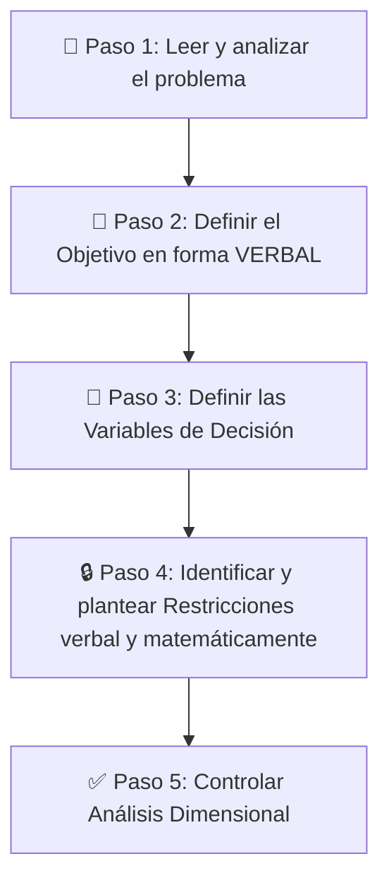

# 🤖 Resumen Teórico-Práctico: Programación Lineal — Formulación de Modelos

> [!info] Generado por Antigravity
> Resumen integrado a partir de teoría (libro Cap. 3, clases teóricas C01 y C02), clase práctica C03, y problemas resueltos 1.2, 1.5, 1.12, 1.14 y 2.31 de la guía.

---

# PARTE 1: TEORÍA FUNDAMENTAL

## 1. ¿Qué es la Programación Lineal (PL)?

La **Programación Lineal** es un modelo de Programación Matemática donde:
- La **función a optimizar** (maximizar o minimizar) es **lineal**
- Las **variables** (no negativas) están sujetas a un conjunto de **restricciones también lineales**
- Las restricciones pueden ser desigualdades ($\leq$, $\geq$) o igualdades ($=$)

### Características clave del modelo

| Concepto                      | Significado                                                                                                                                                                       |
| :---------------------------- | :-------------------------------------------------------------------------------------------------------------------------------------------------------------------------------- |
| **Modelo Formal**             | La PL "atiende a la forma" en que se modeliza, no al contenido. La misma estructura matemática sirve para planificar una dieta de cerdos o para cargar bombas en un avión militar |
| **Modelo de Universo Cierto** | Asume **certeza total** de los parámetros que lo definen                                                                                                                          |
| **Parámetros**                | Datos conocidos con certeza ($c_j$, $a_{ij}$, $b_i$) que acompañan a las variables.: coeficientes, tasas de transformación, disponibilidades                                      |
| **Variables de Decisión**     | Las incógnitas puras a determinar ($x_j$)                                                                                                                                         |

---

## 2. Componentes de un Modelo de PL

Todo modelo de PL tiene **tres componentes esenciales**:

| Componente                      | Descripción                                                                                         | Ejemplo                    |
| :------------------------------ | :-------------------------------------------------------------------------------------------------- | :------------------------- |
| **Función Objetivo (Z)**        | Expresión matemática que representa la meta del decisor (maximizar beneficio o minimizar costo)     | $\max Z = 100x_1 + 120x_2$ |
| **Restricciones**               | Limitaciones físicas, operativas o lógicas del sistema que condicionan los valores de las variables | $4x_1 + 8x_2 \leq 480$     |
| **Condición de No Negatividad** | Las variables no pueden tomar valores negativos                                                     | $x_1, x_2 \geq 0$          |

---

## 3. Supuestos del Modelo de PL

Para que el uso de PL sea válido, deben cumplirse **5 supuestos**:

> [!caution] Tema de evaluación obligatoria
> Los supuestos son contenidos evaluables en **cualquier instancia** (parcial o final). En un examen teórico te pedirán **justificar** cada uno.

| Supuesto             | Significado                                                                                                              |
| :------------------- | :----------------------------------------------------------------------------------------------------------------------- |
| **Único Objetivo**   | Solo se optimiza una función. Si hay metas múltiples → modelo multi-objetivo                                             |
| **Aditividad**       | Las contribuciones individuales se **suman** (no se multiplican entre sí)                                                |
| **Proporcionalidad** | La FO y restricciones varían **proporcionalmente** al nivel de las variables (exponente = 1, no hay economías de escala) |
| **Divisibilidad**    | Las variables pueden asumir **valores fraccionarios**. Si deben ser enteras → Programación Lineal Entera                 |
| **Certidumbre**      | Todos los parámetros ($c_j$, $a_{ij}$, $b_i$) se conocen con **certeza exacta**. Si no → Análisis de Sensibilidad        |

### Cómo justificar cada supuesto en un examen

**1. Certidumbre:**
- *¿Qué asume?* Que los parámetros ($c_j$, $a_{ij}$, $b_i$) se conocen con certeza matemática exacta.
- *¿Cómo justificarlo?* En la realidad esto es casi imposible (los recursos y tiempos son estimaciones, pueden ocurrir imprevistos como operarios enfermos). El modelo es una "foto" de un momento. **Por lo tanto**, al finalizar se debe realizar un **Análisis de Post-Optimidad** (sensibilidad) para evaluar qué ocurre si los parámetros cambian.

**2. Divisibilidad:**
- *¿Qué asume?* Que las variables pueden asumir cualquier valor fraccionario (ej: fabricar 37.2 motores).
- *¿Cómo justificarlo?* Aunque en la realidad haya productos no fraccionables, en la PL pura se permite la fracción. Si la realidad exige enteros estrictos → cambiar a **Programación Lineal Entera**.

**3. Proporcionalidad:**
- *¿Qué asume?* Que **no existen economías de escala**.
- *¿Cómo justificarlo?* Matemáticamente significa que todas las variables están elevadas al **exponente 1**. Si gano \$4 fabricando 1 unidad, gano \$40.000 fabricando 10.000. Costos y ganancias crecen en proporción directa.

**4. Aditividad:**
- *¿Qué asume?* Que las contribuciones individuales se suman.
- *¿Cómo justificarlo?* En la estructura del modelo **solo intervienen sumas**, prohibiendo matemáticamente cualquier multiplicación entre variables ($x_1 \cdot x_2$ está prohibido). El uso total de recursos = suma del uso individual de cada producto.

**5. Único Objetivo:**
- *¿Qué asume?* Que solo se maximiza o minimiza **una** función $Z$.
- *¿Cómo justificarlo?* Si una empresa busca maximizar beneficios Y simultáneamente minimizar contaminación ambiental, no puede usar PL básica → debe recurrir a **Modelos Multi-Objetivo**.

---

## 4. Formas de Presentación del Modelo

### 4.1 Según la notación

| Forma | Descripción |
|:--|:--|
| **Explícita** | Se detallan todos los parámetros individuales con sus subíndices |
| **Matricial** | Se usan matrices: $\max Z = CX$, $AX \leq B$, $X \geq 0$ |
| **Vectorial** | Se agrupan los coeficientes en vectores columna $P_j$ |

### 4.2 Según el tipo de restricciones

| Forma        | Restricciones                       | Regla                                               |
| :----------- | :---------------------------------- | :-------------------------------------------------- |
| **Canónica** | Todas del mismo tipo                | Si MAX → todas $\leq$. Si MIN → todas $\geq$        |
| **Estándar** | Todas de **igualdad** ($=$)         | Se obtiene agregando variables de holgura/excedente |
| **Mixta**    | Combinación de $\leq$, $\geq$ y $=$ | Sentidos mezclados                                  |

> [!warning] Regla de la profesora sobre Forma Canónica
> _"Con que **una sola restricción** ya no sea menor o igual (en MAX)... ya se considera mixta"_. Debe ser **puro** para ser canónico.

---

## 5. Variables de Holgura y Excedente

Para pasar de forma **canónica/mixta** a **forma estándar**, se agregan variables auxiliares:

| Tipo de restricción | Acción | Variable agregada | Significado económico |
|:--|:--|:--|:--|
| $\leq$ (menor o igual) | Se **suma** una variable de holgura $+S_i$ | Holgura | Recurso **sobrante** (no utilizado) |
| $\geq$ (mayor o igual) | Se **resta** una variable de excedente $-S_i$ | Excedente | Lo que se produce **por encima** del mínimo exigido |

> [!important] Las variables de holgura/excedente entran a la Función Objetivo con **coeficiente 0** porque no aportan nada a las utilidades/costos.

**Ejemplo (Problema 1.5 - Inversiones):**

| Restricción original | Transformación a igualdad | Significado de $S_i$ |
|:--|:--|:--|
| $x_1 + x_2 \leq 1000$ | $x_1 + x_2 + S_1 = 1000$ | $S_1$ = miles de pesos no invertidos (capital ocioso) |
| $x_1 \leq 600$ | $x_1 + S_2 = 600$ | $S_2$ = margen sobrante hasta el tope de inversión en A |
| $x_2 \geq 200$ | $x_2 - S_3 = 200$ | $S_3$ = excedente invertido en B por encima de 200 mil |
| $x_1 - x_2 \geq 0$ | $x_1 - x_2 - S_4 = 0$ | $S_4$ = diferencia excedente de A sobre B |

---

# PARTE 2: METODOLOGÍA DE FORMULACIÓN (Paso a Paso)

## Los 5 Pasos para Formular un Modelo de PL

> [!caution] El "Todo o Nada" del Planteo
> La profesora fue categórica: _"Si el planteo está mal, **todo lo otro va a estar mal**"_. No hay puntos intermedios. Enfocate obsesivamente en formular bien **antes** de calcular.

> [!tip] Regla de Oro
> _"No subestimen estos pasos de leer y analizar el problema e identificar con palabras qué es lo que tengo. Es muy importante y en medida que los problemas se hacen más complicados, más importantes se vuelven estos pasos"_ — Profesora

---

## Paso 2: Definir el Objetivo

Lee el problema e identifica escribiendo con palabras cuál es la meta del decisor (maximizar ingresos, minimizar costos) y cuáles son las limitaciones físicas, de mercado o de políticas.

### ¿Maximizar o Minimizar?

| Datos disponibles en el problema       | Meta a optimizar                                        | Dirección de Z |
| :------------------------------------- | :------------------------------------------------------ | :------------- |
| Precios de venta **Y** costos          | **Beneficio / Contribución Marginal** (Ingreso - Costo) | $\max Z$       |
| Solo precios de venta o "ingreso neto" | **Ingreso Total**                                       | $\max Z$       |
| Solo costos operativos                 | **Costos Totales**                                      | $\min Z$       |
|                                        |                                                         |                |

### Contribución Marginal vs. Ingreso (diferencia clave)

| Concepto                                       | Definición                                      | ¿Cuándo usarlo?                                 |
| :--------------------------------------------- | :---------------------------------------------- | :---------------------------------------------- |
| **Ingreso Total**                              | Simplemente el Precio de Venta × unidades       | Cuando el problema **solo** da precios de venta |
| **Contribución Marginal (Beneficio/Utilidad)** | Precio de Venta **−** Costos Variables Directos | Cuando el problema da **ventas Y costos**       |

> [!caution] Trampas frecuentes en el objetivo
> - ❌ "Maximizar la producción" → El objetivo casi nunca es físico, es **económico**
> - ❌ Confundir **Beneficio** con **Ingreso**: Solo se habla de beneficio si el enunciado da costos Y precios. Si solo da "ingreso neto", la FO maximiza **Ingresos**, NO beneficios
> - ❌ El objetivo verbal debe incluir **qué** se optimiza + **de qué productos** + **en qué período**

---

## Paso 3: Definir Variables de Decisión
Son las incógnitas del problema

Las variables deben tener una **anatomía estricta de tres partes**:

$$\boxed{\text{Unidad de medida} + \text{Ítem / Acción} + \text{Período de tiempo}}$$

1. **Unidad de medida:** (Litros, Pesos, Unidades).
2. **Ítem / Acción:** (del producto 1 a fabricar, a invertir en acción A).
3. **Período de tiempo:** (semanalmente, por mes). _Nota: Si es una inversión única de capital, puede no tener período_.

**Ejemplo correcto:** $x_1$ = **unidades** de motores tipo 1 **a fabricar semanalmente**

### Errores fatales en la definición de variables

| ❌ Error | ✅ Corrección | Motivo |
|:--|:--|:--|
| "Cantidad de motores" | "Unidades de motores" | "Cantidad" no es una unidad de medida |
| "Gramos de producto a envasar" | "Unidades de envase de 120g a rellenar" | Los gramos son un dato fijo del envase, no la incógnita |
| "Producto a fabricar" | "Unidades del producto a producir en envases de 120g" | Falta especificar unidad de medida y qué acción |
| "x1 = arándanos" | "x1 = litros de pulpa de arándanos a destilar semanalmente" | Falta todo: unidad, acción y período |

### Formas de definición

| Forma | Ejemplo |
|:--|:--|
| **Por extensión** | $x_1$ = unidades de motores M1 a fabricar semanalmente, $x_2$ = unidades de motores M2 a fabricar semanalmente |
| **Por comprensión** | $x_j$ = unidades de motores tipo $j$ a fabricar semanalmente, para $j = 1, 2$ |

### ¿Qué hacer cuando no hay precio unitario?

Si no se conoce el precio de cada unidad (ej: acciones), **no se puede definir la variable como "cantidad de unidades"**. Se define en la unidad monetaria:
- $x_1$ = miles de pesos a invertir en la acción tipo A

---

## DEF FUNCION OBJETIVO Z

Identifica los parámetros económicos (precios, costos, rendimientos) y multiplícalos por tus variables.

> [!note] Fórmula de la Función Objetivo General Para un problema de $n$ variables, la función toma la forma explícita: $$Max Z = c_1 x_1 + c_2 x_2 + \dots + c_n x_n$$ _(Donde $c_j$ son los coeficientes de utilidad o costo)_.

> [!tip] Tip de Parcial: ¿Cuándo Maximizar o Minimizar? Si el problema te da datos de "Precios de Venta" y "Costos", tu objetivo es **Maximizar el Beneficio o Contribución**. Si el problema solo te da "Costos operativos", tu objetivo es **Minimizar Costos**.

## Paso 4: Plantear Restricciones

### Traducción de frases a signos matemáticos

| Frase del enunciado                                             | Signo  | Ejemplo                | Justificación                                 |
| :-------------------------------------------------------------- | :----- | :--------------------- | --------------------------------------------- |
| "dispone de", "como máximo", "no más de", "hasta", "no superar" | $\leq$ | $4x_1 + 8x_2 \leq 480$ | Limitación de recurso o capacidad.            |
| "por lo menos", "como mínimo", "al menos"                       | $\geq$ | $x_2 \geq 200$         | Satisfacción de demanda o piso de producción. |
| "exactamente", "debe ser igual a"                               | $=$    | $x_1 + x_2 = 100$      | Condición de equilibrio estricto.             |

### Reglas clave para restricciones

> [!warning] Parámetro vs. Restricción
> Los tiempos unitarios (ej: "1 minuto por envase", "60 litros/hora") son **PARÁMETROS** (datos), NO restricciones. La verdadera restricción es la **disponibilidad total** del recurso (ej: "120 horas de máquina").

> [!warning] Inversión de Tasas de Velocidad
> Cuando el límite del lado derecho está en **horas** y la velocidad se da en **unidades/hora**, se debe **invertir la velocidad** para obtener **horas/unidad**:
> $$\text{Coeficiente} = \frac{1}{\text{Velocidad de procesamiento}}$$
> 
> *Ejemplo:* Si la máquina procesa 60 litros/hora → coeficiente = $\frac{1}{60}$ horas/litro

> [!warning] Restricciones Proporcionales
> Cuando dicen "al menos el 25% del total fabricado", se plantea lógicamente como:
> $$x_1 \geq 0.25(x_1 + x_2)$$
> [!tip] Regla de Estandarización para Resolver
> Al momento de formular, la restricción se puede dejar en forma lógica. Pero para **resolver** (software o Simplex), se debe:
> 1. Aplicar propiedad distributiva
> 2. Pasar todas las variables al lado **izquierdo**
> 3. Dejar solo constantes en el lado **derecho**
> 
> La profesora exige: _"del lado derecho tienen que estar todo lo que sea constante y del lado izquierdo todo lo que sea variable"_
> $$0.75x_1 - 0.25x_2 \geq 0$$

### Análisis Dimensional (El "Tachado")

Al multiplicar un coeficiente por la variable, las unidades deben simplificarse para coincidir con el lado derecho:

$$\underbrace{\frac{\text{Horas}}{\text{Unidad}}}_{\text{Coeficiente}} \times \underbrace{\text{Unidades}}_{\text{Variable}} = \underbrace{\text{Horas}}_{\text{Lado Izquierdo}} \leq \underbrace{\text{Horas}}_{\text{Lado Derecho}} \quad ✅$$
> [!question] ¿Dudas si puedes sumar peras con manzanas? Un alumno preguntó si se podían mezclar "dinero y unidades de casa" en la misma restricción. La profesora respondió que **SÍ**. Si multiplicas un Costo ($/Unidad$) por la Variable ($Unidades$), las unidades físicas se simplifican (se tachan) y te quedan netamente "$Pesos$", validando que es matemáticamente correcto compararlo contra un Presupuesto (Límite Derecho en Pesos).

---

DUDA
**Paso 4: Planteo de [[Restricciones Estructurales]].** Traducir los límites físicos. **Regla de Estandarización:** Al armar la inecuación, _"del lado derecho tienen que estar todo lo que sea constante y del lado izquierdo todo lo que sea variable"_. (Ej. $x_1 \ge x_2$ se debe escribir $x_1 - x_2 \ge 0$).

## Paso 5: Condición de No Negatividad

$$x_1, x_2, \ldots, x_n \geq 0$$

> [!caution] Trampa clásica de parcial
> **No Negatividad ≠ Positividad**
> - No negatividad: $\geq 0$ → el **cero SÍ está permitido** ✅
> - Positividad: $> 0$ → excluye el cero, lo cual **INVALIDA** el modelo ❌
> 
> _"Recuerden por favor que no negatividad quiere decir mayor o igual a 0, no quiere decir positivo, recuerden la diferencia"_ — Profesora

---

# PARTE 3: PROBLEMAS RESUELTOS PASO A PASO

---

## 📘 Problema 1.2 — Industrias Veidile (Motores)

### Enunciado resumido
Fábrica de motores M1 y M2. Utilidad: $100/M1 y $120/M2. Recursos: Maquinado (480 hs), Armado (600 hs), Montaje (540 hs). Requerimientos por motor en la tabla.

### Resolución

**Paso 1 — Objetivo verbal:**
Maximizar la Utilidad Total semanal por la producción y venta de motores tipo M1 y M2.

**Paso 2 — Variables:**
- $x_1$ = unidades de motores tipo 1 a fabricar semanalmente
- $x_2$ = unidades de motores tipo 2 a fabricar semanalmente

**Paso 3 — Función Objetivo:**
$$\max Z = 100x_1 + 120x_2$$
*(Se usa utilidad = precio - costo, ya dado como $100 y $120)*

**Paso 4 — Restricciones:**

| Recurso | Req. M1 | Req. M2 | Disponible | Restricción |
|:--|:--|:--|:--|:--|
| Maquinado | 4 hs | 8 hs | 480 hs | $4x_1 + 8x_2 \leq 480$ |
| Armado | 5 hs | 6 hs | 600 hs | $5x_1 + 6x_2 \leq 600$ |
| Montaje | 12 hs | 8 hs | 540 hs | $12x_1 + 8x_2 \leq 540$ |

**Paso 5 — No Negatividad:**
$$x_1, x_2 \geq 0$$

### Modelo completo

$$\max Z = 100x_1 + 120x_2$$
$$\text{s.a.} \begin{cases} 4x_1 + 8x_2 \leq 480 \\ 5x_1 + 6x_2 \leq 600 \\ 12x_1 + 8x_2 \leq 540 \\ x_1, x_2 \geq 0 \end{cases}$$

> **Clasificación:** Forma **Explícita** y **Canónica** (MAX con todas $\leq$)

---

## 📘 Problema 1.5 — Inversión en Acciones

### Enunciado resumido
Herencia de $1.000.000. Dos tipos de acciones: A (30% anual, más riesgo) y B (10% anual, más segura). Restricciones: máx $600.000 en A, mín $200.000 en B, inversión en A ≥ inversión en B.

### Resolución

**Paso 1 — Objetivo verbal:**
Maximizar el Rendimiento Anual obtenido a partir de la inversión en acciones tipo A y B.

**Paso 2 — Variables:**
- $x_1$ = miles de pesos a invertir en la acción tipo A
- $x_2$ = miles de pesos a invertir en la acción tipo B

> [!tip] Como no se conoce el precio unitario de cada acción, NO se puede definir "cantidad de acciones". Se define en unidad monetaria.

**Paso 3 — Función Objetivo:**
$$\max Z = 0.30x_1 + 0.10x_2$$
- $c_1 = 0.30$ → tasa de retorno anual de A (30%)
- $c_2 = 0.10$ → tasa de retorno anual de B (10%)

**Paso 4 — Restricciones:**

| Restricción verbal | Matemática |
|:--|:--|
| Como máximo invertir 1.000 (en miles) en total | $x_1 + x_2 \leq 1000$ |
| Como máximo $600 mil en A | $x_1 \leq 600$ |
| Por lo menos $200 mil en B | $x_2 \geq 200$ |
| Lo invertido en A ≥ lo invertido en B | $x_1 - x_2 \geq 0$ |

**Paso 5 — No Negatividad:**
$$x_1, x_2 \geq 0$$

### Modelo completo

$$\max Z = 0.30x_1 + 0.10x_2$$
$$\text{s.a.} \begin{cases} x_1 + x_2 \leq 1000 \\ x_1 \leq 600 \\ x_2 \geq 200 \\ x_1 - x_2 \geq 0 \\ x_1, x_2 \geq 0 \end{cases}$$

> **Clasificación:** Forma **Explícita** y **Mixta** (conviven $\leq$ y $\geq$)

### Variables de holgura (Forma Estándar)

$$\max Z = 0.30x_1 + 0.10x_2 + 0S_1 + 0S_2 + 0S_3 + 0S_4$$
$$\text{s.a.} \begin{cases} x_1 + x_2 + S_1 = 1000 \\ x_1 + S_2 = 600 \\ x_2 - S_3 = 200 \\ x_1 - x_2 - S_4 = 0 \\ x_1, x_2, S_1, S_2, S_3, S_4 \geq 0 \end{cases}$$

---

## 📘 Problema 1.12 — Constructor de Viviendas

### Enunciado resumido
Dos tipos de viviendas prefabricadas (1 y 2 dormitorios). Presupuesto: $6M. Costo: $500k (2 dorm.) y $350k (1 dorm.). Venta: $850k y $550k. Restricciones de proporción y de inversión máxima.

### Resolución

**Paso 1 — Objetivo verbal:**
Maximizar el Beneficio Total obtenido por la construcción y venta de viviendas tipo 1 y tipo 2.

> [!tip] Se calcula **beneficio** porque se tienen **precio de venta Y costo** → Beneficio = Precio - Costo

**Paso 2 — Variables:**
- $x_1$ = unidades de viviendas de 1 dormitorio a construir
- $x_2$ = unidades de viviendas de 2 dormitorios a construir

**Paso 3 — Función Objetivo:**
- Beneficio $x_1$: $550.000 - 350.000 = 200.000$ → coeficiente = 200 (en miles)
- Beneficio $x_2$: $850.000 - 500.000 = 350.000$ → coeficiente = 350 (en miles)

$$\max Z = 200x_1 + 350x_2$$

**Paso 4 — Restricciones:**

| Restricción verbal | Matemática |
|:--|:--|
| Presupuesto total de $6M | $350x_1 + 500x_2 \leq 6000$ |
| Casas de 2 dorm. al menos 35% del total | $x_2 \geq 0.35(x_1 + x_2)$ |
| Casas de 1 dorm. al menos 25% del total | $x_1 \geq 0.25(x_1 + x_2)$ |
| Inversión en 2 dorm. no superar $4.5M | $500x_2 \leq 4500$ |
| Inversión en 1 dorm. máx 70% de inversión total | $350x_1 \leq 0.70(350x_1 + 500x_2)$ |

**Paso 5 — No Negatividad:**
$$x_1, x_2 \geq 0$$

> **Nota sobre restricciones proporcionales:** Para formular se deja $x_2 \geq 0.35(x_1 + x_2)$. Para **resolver**, se aplica distributiva: $x_2 \geq 0.35x_1 + 0.35x_2$ → $0.65x_2 - 0.35x_1 \geq 0$

---

## 📘 Problema 1.14 — Envasado de Productos (3 tamaños)

### Enunciado resumido
Producto en 3 tamaños de envase (120g, 200g, 360g). Disponible: 3 toneladas de producto, envases vacíos limitados, máquina con horario semanal. Venta comprometida de 300 unidades de 200g. Ingresos netos: $25, $50, $110.

### Resolución

**Paso 1 — Objetivo verbal:**
Maximizar el Ingreso Total por la elaboración y venta del producto en envases de 120g, 200g y 360g para la próxima semana.

> [!caution] Se maximiza **Ingreso** (NO beneficio), porque el enunciado solo da "ingreso neto" sin desglosar costos de producción.

**Paso 2 — Variables:**
- $x_1$ = unidades del producto a producir en envases de 120g para la próxima semana
- $x_2$ = unidades del producto a producir en envases de 200g para la próxima semana
- $x_3$ = unidades del producto a producir en envases de 360g para la próxima semana

**Paso 3 — Función Objetivo:**
$$\max Z = 25x_1 + 50x_2 + 110x_3$$

**Paso 4 — Restricciones:**

| Restricción verbal | Conversión | Matemática |
|:--|:--|:--|
| Disponibilidad de producto (3 ton) | 3 ton = 3.000 kg = 3.000.000 g | $0.120x_1 + 0.200x_2 + 0.360x_3 \leq 3000$ (en kg) |
| Horas de máquina (120 hs semanales) | 20h×5 + 12h + 8h = 120h | $\frac{1}{60}x_1 + \frac{2}{60}x_2 + \frac{4}{60}x_3 \leq 120$ (en horas) |
| Envases vacíos de 120g | Stock = 3000 | $x_1 \leq 3000$ |
| Envases vacíos de 200g | Stock = 2000 | $x_2 \leq 2000$ |
| Envases vacíos de 360g | Stock = 1500 | $x_3 \leq 1500$ |
| Venta comprometida 200g | Mínimo 300 | $x_2 \geq 300$ |

> La restricción de máquina también puede expresarse en minutos: $1x_1 + 2x_2 + 4x_3 \leq 7200$ (120 h × 60 = 7200 min)

**Paso 5 — No Negatividad:**
$$x_1, x_2, x_3 \geq 0$$

> **Clasificación:** Forma **Explícita** y **Mixta** (tiene $\leq$ y $\geq$)

### Inciso B: ¿Conviene comprar envases adicionales?

Si un proveedor ofrece envases de 120g a $1 c/u:

1. **Nueva variable:** $x_4$ = cantidad de envases vacíos de 120g a comprar
2. **Modificar restricción de envases:** $x_1 \leq 3000 + x_4$
3. **Modificar FO (restar costo):** $\max Z = 25x_1 + 50x_2 + 110x_3 - 1x_4$

> El modelo **decide solo** cuántos comprar. No hace falta calcularlo mentalmente.

---

## 📘 Problema 2.31 — Fruits SA (Jugos Concentrados)

### Enunciado resumido
Destilación de pulpa de arándanos y frambuesas. Máquina: 30 hs/semana, 60 lt/h (arándanos) y 50 lt/h (frambuesas). Tanques: 650 lt c/u. Mermas: 35% arándanos, 25% frambuesas. Costos y precios dados.

### Resolución

**Paso 1 — Objetivo verbal:**
Maximizar el Beneficio Total semanal por la destilación y venta de concentrado de arándanos y frambuesas.

**Paso 2 — Variables (definidas como INPUT):**
- $x_1$ = litros de pulpa de arándanos a destilar por semana
- $x_2$ = litros de pulpa de frambuesa a destilar por semana

> También podrían definirse como OUTPUT (litros de concentrado a producir), pero cambian los coeficientes.

**Paso 3 — Función Objetivo:**

Cálculo del beneficio unitario (variables como input):

| Producto | Rendimiento | Precio de venta | Ingreso por lt pulpa | Costo por lt pulpa | **Beneficio por lt pulpa** |
|:--|:--|:--|:--|:--|:--|
| Arándanos | 65% (pierde 35%) | $50/lt concentrado | $0.65 \times 50 = 32.50$ | $12 | $32.50 - 12 = \mathbf{20.50}$ |
| Frambuesas | 75% (pierde 25%) | $45/lt concentrado | $0.75 \times 45 = 33.75$ | $15 | $33.75 - 15 = \mathbf{18.75}$ |

$$\max Z = 20.50x_1 + 18.75x_2$$

**Paso 4 — Restricciones:**

| Restricción verbal | Razonamiento | Matemática |
|:--|:--|:--|
| Tanque arándanos (650 lt concentrado) | Lo que entra al tanque es el concentrado: $0.65 \times x_1$ | $0.65x_1 \leq 650$ |
| Tanque frambuesas (650 lt concentrado) | Lo que entra al tanque es el concentrado: $0.75 \times x_2$ | $0.75x_2 \leq 650$ |
| Máquina destiladora (30 hs/semana) | Invertir velocidad: $\frac{1}{60}$ h/lt y $\frac{1}{50}$ h/lt | $\frac{1}{60}x_1 + \frac{1}{50}x_2 \leq 30$ |

> [!tip] Inversión de tasas
> La máquina procesa 60 lt/h de arándanos → tarda $\frac{1}{60}$ h por litro.
> La máquina procesa 50 lt/h de frambuesas → tarda $\frac{1}{50}$ h por litro.
> Como el lado derecho está en **horas**, los coeficientes deben estar en **horas/litro**.

**Paso 5 — No Negatividad:**
$$x_1, x_2 \geq 0$$

### Modelo completo

$$\max Z = 20.50x_1 + 18.75x_2$$
$$\text{s.a.} \begin{cases} 0.65x_1 \leq 650 \\ 0.75x_2 \leq 650 \\ \frac{1}{60}x_1 + \frac{1}{50}x_2 \leq 30 \\ x_1, x_2 \geq 0 \end{cases}$$

> **Clasificación:** Forma **Explícita** y **Canónica** (MAX con todas $\leq$)

---

# PARTE 4: RESUMEN DE TRAMPAS DE PARCIAL

| #   | Trampa                             | Error frecuente                                | Correcto                                                                 |
| :-- | :--------------------------------- | :--------------------------------------------- | :----------------------------------------------------------------------- |
| 1   | **No Negatividad vs. Positividad** | Decir que las variables son "positivas"        | Son **no negativas** ($\geq 0$), el cero ESTÁ permitido                  |
| 2   | **Palabra "cantidad"**             | Definir "cantidad de motores"                  | Usar unidad exacta: "unidades de motores"                                |
| 3   | **Beneficio vs. Ingreso**          | Decir "maximizar beneficio" sin datos de costo | Si solo hay ingresos netos → maximizar **Ingreso**                       |
| 4   | **Dato vs. Restricción**           | Marcar "1 minuto por envase" como restricción  | Eso es un **parámetro**. La restricción es "120 horas de máquina"        |
| 5   | **Análisis Dimensional**           | Mezclar unidades en los lados de la ecuación   | Verificar que ambos lados tengan la misma unidad                         |
| 6   | **Inversión de velocidad**         | Usar "60 lt/h" directamente como coeficiente   | Invertir: coeficiente = $\frac{1}{60}$ h/lt                              |
| 7   | **Mermas / Rendimiento**           | Ignorar la pérdida de agua en procesos         | Multiplicar por factor de rendimiento (0.65, 0.75)                       |
| 8   | **Maximizar producción**           | Decir "el objetivo es maximizar la producción" | El objetivo es casi siempre **económico** (beneficio, utilidad, ingreso) |
| 9   | **Variables sin período**          | "$x_1$ = motores tipo 1"                       | Agregar período: "a fabricar **semanalmente**"                           |
| 10  | **Restricciones proporcionales**   | No saber dónde poner las variables             | Formular lógicamente, luego pasar todo a la izquierda para resolver      |

---
"El objetivo es maximizar la producción".**
    - _Por qué es falso:_ En problemas económicos, no es lo mismo maximizar la suma física de productos que maximizar su rentabilidad. Cada producto aporta un peso económico diferente, por ende, el objetivo teórico real es **Maximizar la Utilidad o Contribución Total**.
- **Objetivo Económico vs. Físico:** En los cuestionarios, la trampa clásica es poner "Maximizar la producción". Esto suele ser incorrecto. Si el problema da costos o ingresos, la meta real es maximizar la [[Utilidad Total]] o el [[Ingreso Neto]], ya que cada producto aporta un valor monetario diferente.

1. **Falta de Precio Unitario:** Si el problema exige invertir dinero pero no te da el precio de la acción, no puedes definir la variable como "acciones a comprar". Debes definirla en moneda: _"Pesos invertidos en la acción tipo A"_.
2. **Problemas con [[Mermas]]:** Si un proceso pierde material (Ej: se pierde el $35%$ de agua al destilar), tu coeficiente de salida no es $1$. Debes multiplicar tu variable por lo que _queda_: en este caso, por $0.65$ ($1 - 0.35$) para reflejar el volumen real.
3. **[[Velocidad de Procesamiento]]:** Si la máquina procesa $60~L/hora$, pero tu límite de tiempo está en **Horas**, debes invertir la tasa para mantener la coherencia dimensional. El coeficiente técnico será $1/60$ horas por litro.
# PARTE 5: TABLA COMPARATIVA DE LOS PROBLEMAS

| Aspecto | Prob. 1.2 (Motores) | Prob. 1.5 (Acciones) | Prob. 1.12 (Viviendas) | Prob. 1.14 (Envases) | Prob. 2.31 (Jugos) |
|:--|:--|:--|:--|:--|:--|
| **Objetivo** | MAX Utilidad | MAX Rendimiento | MAX Beneficio | MAX Ingreso | MAX Beneficio |
| **# Variables** | 2 | 2 | 2 | 3 (+1 opcional) | 2 |
| **Unidad variable** | Unidades | Miles de pesos | Unidades | Unidades de envase | Litros de pulpa |
| **Complejidad nueva** | Caso base | Sin precio unitario | Restricciones proporcionales | Conversión de unidades, venta comprometida | Mermas + Inversión de tasas |
| **Forma** | Canónica | Mixta | Mixta | Mixta | Canónica |

---

# PARTE 6: FÓRMULAS RÁPIDAS DE REFERENCIA

### Modelo General de PL

$$\max(\min) \; Z = \sum_{j=1}^{n} c_j x_j$$

$$\text{s.a.} \quad \sum_{j=1}^{n} a_{ij} x_j \; [\leq, =, \geq] \; b_i \quad (i = 1, 2, \ldots, m)$$

$$x_j \geq 0 \quad (j = 1, 2, \ldots, n)$$

Donde:
- $x_j$ = variables de decisión
- $c_j$ = coeficientes de la FO (beneficios, ingresos o costos unitarios)
- $a_{ij}$ = coeficientes técnicos (requerimientos por unidad)
- $b_i$ = términos independientes (disponibilidades o requerimientos)

### Beneficio unitario
$$c_j = \text{Precio de venta}_j - \text{Costo}_j$$

### Con merma/rendimiento
$$c_j = (\text{Rendimiento}_j \times \text{Precio de venta}_j) - \text{Costo}_j$$

### Inversión de velocidad
$$a_{ij} = \frac{1}{\text{Velocidad de procesamiento}}$$

---

# 4. 🗣️ CÓMO JUSTIFICAR (El "Por qué")

En las evaluaciones teóricas, te pedirán justificar los **Supuestos o Hipótesis del Modelo Lineal**. Aquí tienes el "Por Qué" causal de cada supuesto, extraído textualmente de las explicaciones de la profesora:

**1. Supuesto de Certidumbre:**

- _¿Qué asume?_ Que los parámetros ($c_j, a_{ij}, b_i$) se conocen con certeza matemática exacta.
- _¿Cómo se justifica en un examen?_ Se debe aclarar que, dado que en la realidad esto es casi imposible (porque los recursos y tiempos son estimaciones y pueden ocurrir imprevistos como operarios enfermos), el modelo es una "foto" de un momento. _Por lo tanto_, exige que al finalizar se realice un **Análisis de Post-Optimidad** (o sensibilidad) para ver qué ocurre si esos parámetros cambian.

**2. Supuesto de Divisibilidad:**

- _¿Qué asume?_ Que las variables pueden asumir cualquier valor fraccionario (Ej. fabricar $37.2$ motores).
- _¿Cómo se justifica en un examen?_ Aunque en la vida real haya productos no fraccionables, en la PL pura se permite la fracción. Si la realidad exige enteros estrictos, se debe cambiar a un modelo de _Programación Lineal Entera_. Para la formulación lineal básica, obviamos temporalmente esa restricción.

**3. Supuesto de Proporcionalidad:**

- _¿Qué asume?_ Que no existen las "economías de escala".
- _¿Cómo se justifica en un examen?_ Matemáticamente significa que _todas las variables están elevadas al exponente 1_. Si gano $4 fabricando una unidad, gano $40,000 fabricando 10,000. Los costos y ganancias crecen en proporción directa.

**4. Supuesto de Aditividad:**

- _¿Qué asume?_ Que las contribuciones individuales se suman.
- _¿Cómo se justifica en un examen?_ En la estructura del modelo _sólo intervienen sumas_, prohibiendo matemáticamente cualquier multiplicación entre variables ($x_1 \cdot x_2$). El uso total de recursos es igual a la suma del uso individual de cada producto.

**5. Supuesto de Único Objetivo:**

- _¿Qué asume?_ Que solo se maximiza o minimiza _una_ función $Z$.
- _¿Cómo se justifica en un examen?_ Si una empresa busca maximizar beneficios Y simultáneamente minimizar contaminación ambiental de forma directa, no puede usar PL básica. Deberá recurrir a _Modelos Multi-Objetivo_.