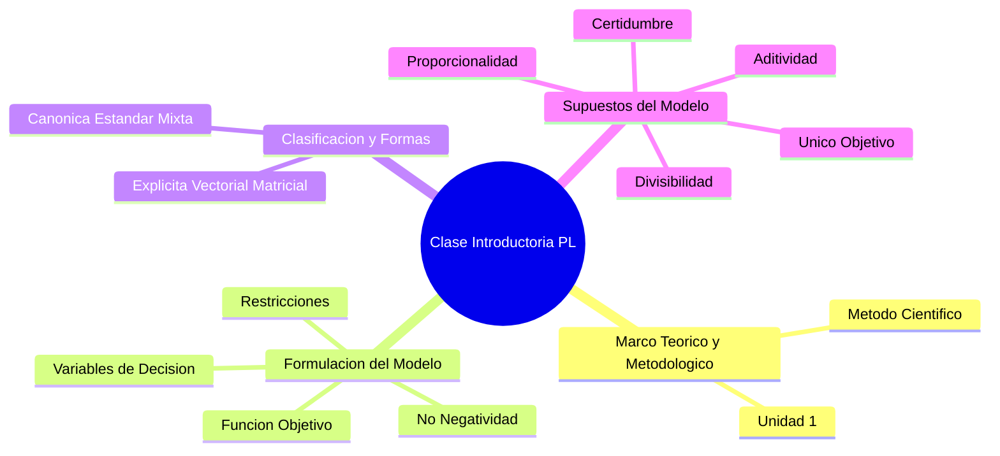

# Índice Cronológico de la Clase: Fundamentos y Formulación en [[Programación Lineal]]

En la clase de introducción a la [[Programación Lineal]], el profesor estructuró la sesión en **cuatro ejes temáticos principales**, abarcando desde el marco teórico y metodológico hasta la construcción matemática del modelo y sus supuestos subyacentes.

A continuación, te presento un mapa conceptual de los temas abordados y un resumen detallado de cada uno:



_Conceptos relacionados:_ [[Programación Lineal]], [[Método Científico]], [[Variables de Decisión]], [[Función Objetivo]], [[Restricciones]].


## 2. Introducción al Modelo de [[Programación Lineal]] (15:00 - 37:00)

El núcleo práctico de la clase consistió en aprender a traducir un problema verbal (caso "Manuel S.A.") a un modelo matemático. Se explicaron los componentes esenciales que estructuran cualquier modelo:
![[{DA8C1EFA-48AB-4907-AADC-6EA9CAABDB2E}.png]]
- **Identificación del Objetivo:** El primer paso es determinar qué busca el decisor, que en este caso es maximizar la utilidad o contribución marginal total.

**[[Función Objetivo]] (**Z**):** Es la representación matemática de la meta general del decisor, que habitualmente consiste en maximizar un beneficio (como la [[Contribución Marginal Total]]) o minimizar un costo

>[!note] Fórmula de la Función Objetivo Para un problema de dos variables donde se busca maximizar la contribución marginal, el modelo general toma esta forma: MaxZ=C1​*x_1​+C2*​*x_2​
>
>Donde $x_1$ y $x_2$ son las [[Variables de Decisión]] y los coeficientes representan la [[Contribución Marginal Unitaria]].


- **Definición de [[Variables de Decisión]]:** Representan las cantidades a determinar (Ej: unidades del producto 1 y producto 2 a fabricar mensualmente).

>[!note]- **[[Variables de Decisión]] (**xj​**):** 
>
>Son las incógnitas del problema. Es vital definirlas especificando exactamente las unidades de medida y el período para el cual se realiza la medición (por ejemplo: "unidades del producto 1 a fabricar mensualmente"). El profesor enfatizó que usar la palabra "cantidad" es incorrecto por ser un término difuso

- **Planteo de [[Restricciones]]:** Son las limitaciones del sistema, dadas en este caso por la disponibilidad de insumos (horas de mano de obra, horas máquina y materia prima).

>[!note]- **[[Restricciones]]:** 
>Son las limitaciones físicas, operativas o lógicas del sistema, tales como la disponibilidad de recursos (horas de mano de obra, horas máquina, materia prima). Condicionan los valores que pueden asumir las variables

- **[[Condición de No Negatividad]]:** Todo modelo debe indicar explícitamente que las variables no pueden tomar valores negativos.
>[!danger] Trampa de Parcial: No Negatividad vs. Positividad Un error recurrente en los cuestionarios es marcar que las variables deben ser "positivas". La [[Condición de No Negatividad]] requiere matemáticamente que sean ≥0, lo que significa que el valor 0 está permitido. La positividad estricta excluye al cero, forzando a que se deba producir siempre, lo cual invalida el modelo


---

> [!note] Componentes Básicos del Modelo Un modelo de programación matemática se reconoce porque siempre tiene: una [[Función Objetivo]] (a maximizar o minimizar), un conjunto de [[Restricciones]] y las condiciones de [[No Negatividad]].

![[{C5A7B6A0-7FB5-4C59-B85B-BC17E7A195D6}.png]]

## 3. Formas y Presentaciones del Modelo Matemático (37:00 - 47:00)

El tercer tema consistió en generalizar el modelo introductorio. Se aclaró que el objetivo no siempre es maximizar beneficios; también puede ser minimizar costos o incluso insumos físicos (como en el ejemplo de maximizar la destrucción de un avión bombardero).

El modelo puede presentarse matemáticamente en [[Forma Explícita]] (detallando parámetros individuales), [[Forma Vectorial]] (Se resume la información agrupando los coeficientes en vectores) o [[Forma Matricial]] (Se utilizan matrices para representar los sistemas de ecuaciones). 


### Clasificación según el Tipo de Restricciones

| Tipo de Modelo         | Relación con la [[Función Objetivo]] | Dirección de las [[Restricciones]]                           | Característica Principal                         |
| :--------------------- | :----------------------------------- | :----------------------------------------------------------- | :----------------------------------------------- |
| **[[Forma Canónica]]** | Maximización o Minimización          | Si es Max, todas son $\le$. Si es Min, todas son $\ge$.      | Todas las restricciones tienen el mismo sentido. |
| **[[Forma Estándar]]** | Cualquier meta                       | Todas las restricciones son estrictamente de igualdad ($=$). | Todas las restricciones son estrictas.           |
| **[[Forma Mixta]]**    | Cualquier meta                       | Contiene combinaciones mezcladas de $\le$, $\ge$ y $=$.      | Sentidos mezclados.                              |

> [!question] Duda de Clase: ¿Cuándo Maximizar o Minimizar? Un alumno consultó: _"¿Cómo nos podemos dar cuenta cuándo maximizar y cuándo minimizar?"_. _Respuesta del Profesor:_ Depende exclusivamente del análisis del problema. Si tienes ingresos y costos (beneficio), debes maximizar; si sólo tienes costos a cubrir, debes minimizar.


![[{E774AB7B-02CF-453A-9F23-48F6FE835020}.png]]

## 4. Hipótesis y Supuestos Básicos del Modelo (47:00 - 54:00)

El último bloque teórico fue fundamental, ya que detalla las condiciones obligatorias que deben darse en la realidad para que el uso de la [[Programación Lineal]] sea válido. Estos son:

1. **[[Único Objetivo]]:** El sistema solo puede optimizar una única función. Si hay metas múltiples, se requiere un modelo multi-objetivo
2. **[[Aditividad]]:** Las contribuciones individuales y el uso de recursos se suman (no se multiplican entre sí).
3. **[[Proporcionalidad]]:** Tanto la función objetivo como las restricciones varían proporcionalmente al nivel de las variables. No hay economías de escala (las variables están elevadas al exponente 1).
4. **[[Divisibilidad]]:** Las variables pueden asumir valores fraccionarios.
5. **[[Certidumbre]]:** Es un modelo de "universo cierto". Se asume que todos los coeficientes (cj​, aij​, bi​) se conocen con certeza exacta y no varían


> [!danger] Límite Práctico: Falta de Divisibilidad ¿Qué pasa si el resultado sugiere fabricar $37.2$ motores? El profesor aclaró que si las variables en la realidad deben ser enteras y no fraccionables, se invalida el supuesto de [[Divisibilidad]]. En estos casos, aunque provisoriamente se ignora en la unidad actual, el problema real debe resolverse utilizando métodos de [[Programación Lineal Entera]].

>[!tip] Metodología: Falta de Certidumbre Como en la realidad los datos sufren modificaciones, el profesor aclaró que luego de resolver el modelo se debe realizar un [[Análisis de Post Optimidad]] (o Sensibilidad) para evaluar el impacto de los cambios en estos parámetros
## 5. Síntesis: Metodología de Formulación (54:00 - 58:00)

Antes de pasar al trabajo práctico, el profesor resumió los pasos para abordar cualquier problema de formulación.

```
graph TD
    A[Leer el problema] --> B[1. Definir el Objetivo en forma verbal]
    B --> C[2. Definir las Variables de Decision]
    C --> D[3. Identificar el periodo de analisis y las unidades de medida]
    D --> E[4. Identificar Restricciones verbalmente y pasarlas a ecuaciones]
    E --> F[5. Controlar dimensionalidad y unidades de cada lado de la restriccion]
```

_Conceptos relacionados:_ [[Variables de Decisión]], [[Restricciones]], [[Dimensionalidad]].

---


## aplicado al problema
![[{771F8F34-8390-45F5-804F-53BD05EBDAF8}.png]]

max z = 4 * x1+7 *  x2


s.a
10x1+10x2 <= 980 (hrs. de mano de obra)
12x1+24x2 <= 1932 (hrs. maquina)
15x1+10x2 <= 1250 (unidades de materia prima)

x1;x2 >= 0

x1: unidades a producir del producto 1
x2:unidades a producir del producto 2

![[{9D9692FD-0E70-48AA-84F3-38A2236292BD}.png]]

![[{153E8551-062C-4B95-84AD-DE3CFFCAE152}.png]]
## 6. Actividad Práctica y Revisión de Errores (58:00 - Fin)

[[✅Problema 1.12]]

Los alumnos realizaron un cuestionario en el aula virtual sobre un problema de producción de motores, tras lo cual el profesor analizó los errores más comunes.

- **Maximizar Producción vs Utilidad:** Es un error común confundir el objetivo. Maximizar la suma de productos físicos no es lo mismo que maximizar el beneficio monetario, ya que cada producto aporta un valor distinto.
- **Definición Estricta de Variables:** Decir "cantidad de motores" es incorrecto por ser difuso. Lo correcto es definir "unidades de motores tipo 1 a fabricar semanalmente".
- **Formato de Desigualdades:** Frases como "hasta", "no más de" o "como máximo" se traducen siempre como menor o igual ($\le$).

> [!danger] Error Crítico de Parcial: No Negatividad vs. Positividad El profesor remarcó fuertemente un error muy común de los alumnos en los cuestionarios y exámenes. La restricción exige **[[No Negatividad]]** (que matemáticamente es $\ge 0$), lo que significa que el valor $0$ está permitido. Marcar que las variables deben ser "positivas" es INCORRECTO, ya que la positividad estricta excluye al cero e implicaría que el sistema está obligado a fabricar al menos una unidad de cada producto siempre.


# ---- Dudas y pregs ----

Durante la sesión, el profesor y la profesora adjunta hicieron pausas estratégicas para remarcar conceptos que habitualmente generan errores y que son de evaluación obligatoria. A continuación, detallo los focos principales de alerta para tus próximos parciales:

### 1. La "Trampa" de la Teoría: [[Unidad 1]]

El profesor fue sumamente claro respecto a los temas de la primera unidad (Metodología de la Investigación Operativa). Advirtió que, al no tener ejercitación práctica, los alumnos suelen omitirla, pero **es un tema de evaluación obligatoria**.

> [!tip] Tip de Parcial: Teoría Evaluada _"Los contenidos teóricos que están en esta unidad son contenidos teóricos evaluables en cualquiera de las instancias de examen, ya sea parcial o final"_. Debes enfocarte en conocer los pasos del [[Método Científico]], la definición de los diferentes tipos de modelos y, fundamentalmente, las **hipótesis** en las que se apoya cada modelo.

### 2. Error Crítico: [[Condición de No Negatividad]] vs. Positividad

Durante la revisión del cuestionario, se destacó el error más común entre los estudiantes (incluso contando una anécdota de un alumno del año pasado que falló en esto).

> [!danger] Trampa de Parcial (Signos de las Variables) En la formulación de modelos lineales, se exige la **[[Condición de No Negatividad]]** (matemáticamente $\ge 0$), lo que significa que el valor $0$ está permitido. Marcar en un examen que las variables deben ser "positivas" es INCORRECTO. El cero no es ni positivo ni negativo; exigir positividad excluye al cero e implicaría que el sistema está obligado a fabricar al menos una unidad siempre.

### 3. Requisitos Administrativos para Promoción

Se recordó que para aspirar a la promoción o aprobación directa es obligatorio tener completado el **80% de los cuestionarios** o tareas propuestas en el aula virtual. Además, para rendir los parciales será **obligatorio ingresar con la cuenta institucional** (correo de la UTN).

---

# Consultas Relevantes de los Alumnos en Clase

La interacción en clase reveló varias confusiones conceptuales típicas en la introducción a la [[Programación Lineal]]. Aquí tienes el resumen estructurado de las dudas y las respuestas académicas:

> [!question] Pregunta 1: ¿Cómo darnos cuenta si hay que Maximizar o Minimizar? **Alumno:** _"Entonces, ¿cuándo nos podemos dar cuenta que se puede maximizar y cuándo minimizar en base a qué?"_. Otro alumno reiteró al final de la clase que le costaba identificar este objetivo. **Respuesta del Profesor:** Explicó que depende estrictamente del análisis del problema. Aseguró que con la práctica de la guía de casos se vuelve más intuitivo. Dio una regla general basada en los datos económicos.

Para sistematizar esta respuesta, te presento la siguiente tabla de clasificación:

|Datos Disponibles en el Problema|Meta a Optimizar|Dirección de la [[Función Objetivo]]|
|:--|:--|:--|
|Precios de Venta y Costos|[[Contribución Marginal]] o Beneficio|Maximizar ($Max Z$)|
|Solamente Costos Operativos|Costos Totales|Minimizar ($Min Z$)|
|Solamente Precios de Venta|Ingresos Totales|Maximizar ($Max Z$)|

> [!question] Pregunta 2: ¿Qué significa "Sujeto a" en el modelo matemático? **Alumno:** _"¿Qué significa el 'Sujeto a' que se escribe debajo de la función Max?"_. **Respuesta del Profesor:** Aclaró que la expresión (a menudo abreviada como _s.a._) indica que los valores que asuman las [[Variables de Decisión]] y, por lo tanto, el valor que alcance la función $Z$, están condicionados o "sujetos a" que se cumplan todas las limitaciones y restricciones que se detallan a continuación.

> [!question] Pregunta 3: Consumo de recursos limitados **Alumno:** Al analizar las 980 horas disponibles de mano de obra, el alumno preguntó si se debía usar todo el recurso o cómo se interpretaba el límite. **Respuesta del Profesor:** El profesor procedió con una validación lógica: _"¿Puedo usar 980 horas? Sí. ¿Puedo usar más? No. ¿Puedo usar menos? Sí"_. Esto fundamentó por qué la inecuación debe formularse con el símbolo de menor o igual ($\le$).

> [!note] Formulación: Restricción de Disponibilidad $$Uso_del_Recurso \le Disponibilidad_Total$$

### Flujo de Identificación de Objetivo (Síntesis de Consultas)

Basado en las dudas de los alumnos sobre cómo arrancar la formulación, el profesor propuso este esquema mental tácito:

```
graph TD
    A[Lectura del Problema] --> B{¿Qué datos económicos o físicos predominan?}
    B -- Ingresos y Egresos --> C[Calcular Contribucion Marginal]
    C --> D[Objetivo: MAXIMIZAR]
    B -- Solo Egresos o Insumos --> E[Agrupar Costos / Recursos a ahorrar]
    E --> F[Objetivo: MINIMIZAR]
    B -- Solo Beneficios o Ingresos --> G[Agrupar Ingresos]
    G --> D
```

_Conceptos relacionados:_ [[Programación Lineal]], [[Función Objetivo]], [[Contribución Marginal]].