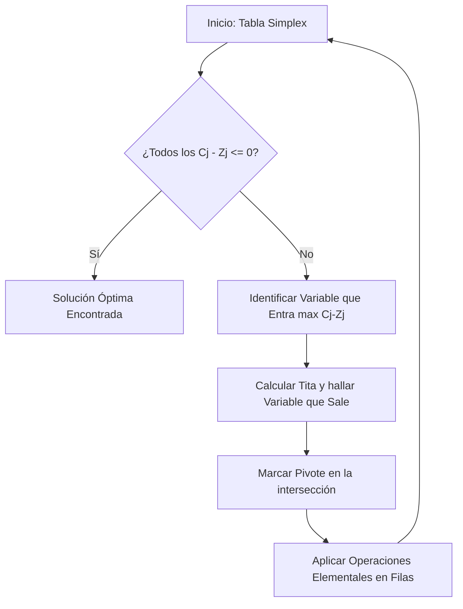
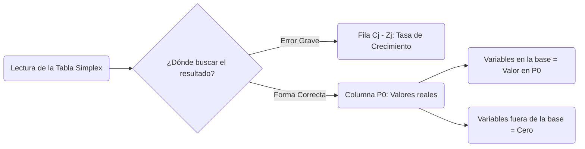

Parte 2: https://www.youtube.com/watch?v=kFjiVCMhAjk&list=PLYZrqm_pzRul0t_2QKU2kdHDwGkKblutk&index=8

## 1. Fundamentos y Fases del Método Simplex
El profesor introdujo el [[Algoritmo Simplex]], desarrollado por George Dantzig en 1947, destacando que permite resolver problemas de [[Programación Lineal]] sin ningún límite en la cantidad de variables o restricciones, superando así la restricción de dos variables que posee el método gráfico. 

- **Fundamento Geométrico:** El algoritmo explora los puntos extremos (vértices) del [[Poliedro de Soluciones]] sabiendo que el óptimo se encuentra allí.

Explicó que este método opera explorando un número finito de vértices o puntos extremos 
- **Límite Combinatorio:** Reitera que el número de [[Soluciones Factibles Básicas]] es finito, limitado por la cota superior combinatoria $C = \frac{n!}{m!(n-m)!}$.

y su ejecución se divide estrictamente en dos etapas:

- **[Fase 1]**: Consiste en encontrar la primera [[Solución Factible Básica]] o solución de partida. En problemas canónicos de maximización, este vértice inicial se identifica fácilmente en el origen.
- **[Fase 2]**: Es la fase iterativa. Analiza si la solución actual es óptima; si no lo es, determina cómo mejorarla pasando hacia otra solución factible básica adyacente.

![[{54A1D424-3BFC-44BB-82E1-4D629B79C00D}.png]]

El método Simplex, basándose en estas conclusiones generales, analiza sistemáticamente los puntos extremos de la región factible hasta identificar el punto óptimo. Asegurándose en cada paso que el vértice analizado no es peor que el anterior, esto es, que le dé a la función objetivo un valor mejor o al menos igual que el anterior.


## El metodo simplex tiene en cuenta las siguientes propiedades de los puntos extremos o soluciones factibles basicas

* a) Si existe exactamente una solución óptima, entonces debe ser una solución de punto extremo.
	* (b) Si existen soluciones óptimas múltiples, entonces al menos dos de ellas deben ser soluciones factibles en puntos extremos adyacentes (sólo se consideran las soluciones factibles).
* Existe sólo un número finito de puntos extremos (soluciones factibles básicas).
* Si una solución en un vértice es igual o mejor (según el valor de la función objetivo) que todas las soluciones factibles en los vértices adyacentes a ella, entonces es igual o mejor que todas las demás soluciones en los vértices, es decir, es óptima

## III. Preparación del Modelo (Caso "Fruits")
![[{6AC512EF-84C4-47DC-9CF4-806255B4E586}.png]]

- **Paso 1 - para comenzar a aplicar el algoritmo, el primer paso obligatorio es transformar el modelo matemático a su [[Forma Estándar]], agregando las [[Variables de Holgura]] necesarias para convertir todas las inecuaciones en igualdades.
	![[{6CE31910-18F4-4A81-AE60-9212A0AE5354}.png]]

- PASO 2: **Identificación del vértice inicial:** En problemas de máximo canónico, la solución de partida se ubica en el origen (0,0), donde no se produce nada y sobran todos los recursos.
	![[{80E5221F-9F2D-4760-A31E-752E41928098}.png]]
- PASO 3 Una forma de identificar las variables que serán básicas en la solución de partida, consiste en analizar la matriz A de coeficientes del sistema de ecuaciones de restricción:
	 ![[{943E02B5-3959-46FC-A62E-AB91013863AB}.png]]
	 NO HACE falta que este formada asi, los 1 , pueden estar desacomodadoos
	- Obsérvese que las columnas que corresponden a las variables básicas son vectores unitarios, esta es justamente, la característica que nos permite identificar las variables que estarán en la base en la primera solución
	
- Esto permite clasificar las variables:

| Tipo de Variable             | Definición Matemática                                                                                                                           | Valor en el Vértice (Origen)                                    | en nuestro ejemplo |
| :--------------------------- | :---------------------------------------------------------------------------------------------------------------------------------------------- | :-------------------------------------------------------------- | ------------------ |
| **[[Variables Básicas]]**    | Se identifican a través de los vectores unitarios (columnas con un 1 y el resto ceros)Asumen valores numéricos positivos en la solución actual. | Son positivas (ej. disponibilidades sobrantes de los recursos). | p3=s1,p4=s2,p5=s3  |
| **[[Variables No Básicas]]** | Corresponden a los demás vectores de la matriz que no forman la identidad. En la solución evaluada, su valor es estrictamente igual a cero      | Son estrictamente iguales a cero.                               | p1=x1;p2=x2        |

## IV. Construcción de la Tabla Simplex Inicial

Es conveniente expresar esta solución, útil como punto de partida para
el Simplex, en una tabla (para facilitar los cálculos que el método
requiere).

A continuación, se presenta la estructura de una tabla Simplex con su
descripción
![[{881F4AED-05A1-4689-A18B-E517198D2F43}.png]]
![[{A50931C6-962E-4A98-A5D4-7C9B39BE2A02}.png]]

PLANTANDOLA CON EL PROBLEMA DE FRUITS
![[{0AEF0E1B-61C4-4937-BABD-D956E409AED2}.png]]
- **Estructura base:** Se colocan los coeficientes de la función objetivo ($C_j$), las variables en la base, la [[Columna P0]] (vector del lado derecho o disponibilidad) y la matriz de coeficientes.
- **Cálculo de la fila $Z_j$:** Representa el costo o beneficio acumulado. Cada valor se calcula sumando los productos entre los coeficientes de las variables en la base y los valores de cada columna respectiva.
- **Cálculo de la fila $C_j - Z_j$:**

> [!note] Tasa de Crecimiento La fila $C_j - Z_j$ representa la [[Tasa de Crecimiento]] de la función objetivo. Indica exactamente en cuánto crecerá el beneficio total ($Z$) por cada unidad que se incremente una variable que actualmente vale cero. $$ Tasa = C_j - Z_j $$
> 
> Por ejemplo , si incrementamos P1=x1 la funcion objetivo incrementaria en 20,5 y lo mismo con P2=x2

- **Criterio de Optimidad:** En problemas de maximización, la solución es óptima únicamente si todos los valores de la fila $C_j - Z_j$ son menores o iguales a cero. Como hay valores positivos en la primera tabla, el algoritmo debe iterar.

## V. Iteración: Cambio de Base (Fase 2)

Al no ser óptima, se debe realizar un cambio de base saltando a otro vértice:
![[{60EFE53C-6319-41AE-9DAA-049CEE1AD5E6}.png]]
1. **Determinar la [[Variable que Entra]]:** Ingresa a la base la variable que posea el mayor valor positivo en la fila $C_j - Z_j$, ya que es la que aporta más crecimiento a la función. 
	1. la variable que entras es de la que son cero es la que voy a hacer positiva
	2. En nuestro ejemplo 20,5
		![[{DC4C4E58-F71F-4826-AC81-6730DBDE500E}.png]]

2. **[[Variable que Sale]]**: Para saber qué variable dejará de ser básica, se calculan los cocientes entre el vector solución y los valores de la columna que entra.
	1. variable que sale son las que son positivas y voy a hacer cero

> [!note] Cálculo de Tita ($\theta$) y Criterio de Salida $$ \theta = \min \left( \frac{P_0}{Elemento_{Entra}} \right) \quad \forall Elemento_{Entra} > 0 $$ Solo se divide por denominadores positivos. El menor de estos cocientes se llama [[Tita]] e indica la variable que debe salir de la base, asegurando que no nos salgamos de la región factible.

![[{F9EB181A-8A60-40C1-9F7F-F6D83A4D9885}.png]]
entonces sale de la base P3=S1 y entra P1=x1


3. **Identificar el [[Pivote]]:** Es el número ubicado en la intersección de la columna de la variable que entra y la fila de la variable que sale.
	![[{41A98686-D9BE-406E-97FA-F5451A088203}.png]]
		pivote seria 0,65

4. **Actualización de la tabla:** Se utilizan las [[Operaciones Elementales en Filas]] para lograr que el pivote se transforme en 1 y el resto de su columna en 0.



_Conceptos relacionados: Tabla Simplex, Variable que Entra, Variable que Sale, Tita, Pivote, Operaciones Elementales en Filas._

> [!tip] Tip de Resolución Operativa La profesora recalca que toda la operatoria para actualizar la tabla y pasar de un vértice a otro es mecánicamente idéntica al método algebraico de [[Gauss-Jordan]].

en nuestro ejemplo
![[{F9DA7DD2-2C6B-43EE-93E1-BF666D739AB3}.png]]
![[{716A3F6D-7118-4571-BC89-62F4CE4046C8}.png]]
### recalculamos
![[{13270123-69F1-4A9B-B77F-D85A92821BE8}.png]]
NO ES OPTIMA

iteramos,
entra P2, y sale, *tenemos que hacer los cocientes de p0/ sobre los valores p2 650/0,75=    13,33333/0,02=666,665 *

el menor que sale es p5 ![[{73D3539C-5B7F-47AE-A94D-D1136ADA4FEB}.png]]
el pivote es 0,02, repetimos operaciones elementales  *hacemos 1 el pivote y el resto 0 de la colu,na de p2* 
quedandonos
![[{ED4A020D-CF05-4ADB-8DA5-B36D5476A029}.png]]

## VI. Llegada al Óptimo y Lectura de Resultados


- Tras realizar una segunda iteración completa, la fila $C_j - Z_j$ queda sin valores positivos, cumpliendo el criterio de optimidad.

>[!danger] Trampa de Evaluación (Error Crítico de Lectura) 
>La profesora detectó un error masivo en el cuestionario práctico que es crucial evitar en los parciales. Muchos alumnos intentaron leer el resultado final de las variables buscándolo en la `[[Fila C_j - Z_j]]`. Advirtió enfáticamente que los valores finales de las `[[Variables Básicas]]` y de la función objetivo (Z) se leen **EXCLUSIVAMENTE** en la `[[Columna P0]]` (también conocida como `[[Vector del Lado Derecho]]` o BLD).



_Conceptos relacionados: Tabla Simplex, Fila Cj - Zj, Columna P0, Variables Basicas, Variables No Basicas._

## VII. Rondas de Preguntas y Cierre

Durante la clase, los alumnos plantearon dudas importantes que la profesora aclaró:

> [!question] ¿Por qué siempre tiene que quedar un "1" y el resto ceros en la columna al iterar? 
> **Respuesta:** La profesora explicó que esto permite ir formando la nueva [[Matriz Identidad]] iteración tras iteración, lo cual es vital para poder identificar visualmente y leer qué variables quedan positivas en la base (igual que ocurre al finalizar un sistema por [[Gauss-Jordan]]).


# SIMPLEX aplicacion practica libro
>[!danger] agregar ejemplo de aplicacion pagina 73


# ---
### 3. 🏁 Fase 1: Estandarización y Tabla Inicial (20:00 - 31:00)

El profesor desarrolla el paso a paso para iniciar el algoritmo matemático.

- **Transformación del Modelo:** Para iniciar el proceso (Fase 1), es un paso innegociable transformar el modelo a su [[Forma Estándar]] agregando [[Variables de Holgura]] para convertir inecuaciones en igualdades
- **El Vértice de Partida (Origen):** En problemas de "Máximo Canónico", la primera [[Solución Factible Básica]] se encuentra anulando las variables de decisión ($x_1=0, x_2=0$). Esto deja toda la capacidad de los recursos libre para las variables de holgura ($S_1=650, S_2=650, S_3=30$).

- **Vectores Unitarios:**  El profesor explicó que se debe buscar en el sistema una matriz identidad formada por vectores unitarios. Esto es vital porque define la clasificación de las variables:
	-  **[[Variables Básicas]]** (positivas, dentro de la base): Son positivas, ingresan a la base de la tabla y se identifican mediante los vectores identidad.
	- **[[Variables No Básicas]]** (fuera de la base, con valor cero).: No están en la base y su valor en esa iteración es estrictamente cero.
- **Armado de la Tabla:** Estructura de filas y columnas, incluyendo el vector de lados derechos ($P_0$ o $bld$).

> [!note] Fórmulas de Evaluación ($Z_j$ y $C_j - Z_j$) El profesor detalló el cálculo de las dos filas inferiores de la tabla:
> 
> - **Fila $Z_j$:** Se obtiene mediante la suma de los productos entre los coeficientes de las variables en la base (columna $C_b$) y los valores de cada columna respectiva.
> - **Fila $C_j - Z_j$:** Es la [[Tasa de Crecimiento]] de la función $Z$. Indica exactamente en cuánto crecerá el beneficio total por cada unidad que se incremente una variable.


### 4. 🔄 Fase 2: Criterios de Iteración y Pivot (31:00 - 45:00)
Si en la tabla existen valores positivos en la fila $C_j - Z_j$ (estando en un problema de maximización), la solución no es óptima y el algoritmo debe saltar hacia un vértice adyacente. El profesor estableció las reglas matemáticas inflexibles para este movimiento:

| Acción del Algoritmo               | Regla Matemática (Criterio del Profesor)                                                                                                       |
| :--------------------------------- | :--------------------------------------------------------------------------------------------------------------------------------------------- |
| **Variable que Entra (a la base)** | Se elige la columna con el valor **positivo mayor** en la fila $C_j - Z_j$.                                                                    |
| **Variable que Sale (de la base)** | Se calcula el cociente ($\theta$ o Tita) entre $P_0$ y la columna de la variable entrante. Se elige el **menor valor estrictamente positivo**. |
| **El [[Pivot]]**                   | Es el número interceptado entre la fila saliente y la columna entrante.                                                                        |

- **Aplicación de [[Gauss-Jordan]]:**
    1. Se divide toda la fila saliente por el valor del [[Pivot]] para convertirlo en $1$.
    2. Se aplican [[Operaciones Elementales de Fila]] para convertir en $0$ el resto de los números de esa columna.


### 5. 🛑 Convergencia, Lectura del Óptimo y Dudas (45:00 - 1:05:12)

Tras realizar la iteración, se actualiza la tabla y se vuelve a aplicar el test de optimidad.

- **Condición de Parada:** El profesor confirma que se ha llegado al óptimo cuando no queda ningún valor positivo en la fila de $C_j - Z_j$ (para problemas de maximización).
- **Solución Final de Fruits SA:** El algoritmo arroja $x_1 = 1000$, $x_2 = 666.66$ y $Z = 33333$, coincidiendo exactamente con el resultado del [[Método Gráfico]].

> [!danger] TRAMPA LETAL DE EXAMEN: ¿Dónde se leen los resultados? El profesor detuvo la clase para alertar de un error masivo en los cuestionarios: Muchos alumnos buscaron los valores de las variables en la fila de $C_j - Z_j$. ¡Error fatal! **Los valores de la solución se leen EXCLUSIVAMENTE en la columna $P_0$** (o $bld$ / $RHS$). Las variables listadas en esa columna son las básicas, y si una variable no aparece ahí (es no básica), su valor es estrictamente $0$.


### 📊 DIAGRAMA DE FLUJO: El Algoritmo Operativo de la Clase

```
graph TD
    A(Inicio: Modelo Original) --> B(Estandarización: Agregar Holguras)
    B --> C(Armar Tabla Inicial con Matriz Identidad)
    C --> D(Calcular Z_j y C_j - Z_j)
    D --> E{¿Hay valores > 0 en C_j - Z_j?}
    E -->|No| F(SOLUCIÓN ÓPTIMA ALCANZADA)
    E -->|Sí| G(Fase 2: Iteración)
    G --> H(Identificar Variable que Entra: Mayor Positivo)
    H --> I(Identificar Variable que Sale: Menor Cociente Tita)
    I --> J(Aplicar Operaciones de Gauss-Jordan con el Pivot)
    J --> C
```

_Conceptos relacionados:_ [[Fase 1 del Simplex]], [[Fase 2 del Simplex]], [[Forma Estándar]], [[Gauss-Jordan]], [[Tasa de Crecimiento]].
# 
# -- dudas y pregs
Como tu Tutor Académico de Élite, he analizado la transcripción de esta clase práctica. El profesor no solo hizo un énfasis crítico (marcando un error masivo que suele costar parciales), sino que también respondió preguntas operativas y teóricas fundamentales de los alumnos.

A continuación, te presento el reporte detallado dividido en las advertencias innegociables y el registro de consultas.

# 🚨 RADAR DE PARCIAL: Énfasis y Advertencias del Profesor

El profesor detuvo la clase específicamente para marcar **dos temas críticos** que observó durante la corrección en vivo de los cuestionarios.

### 1. La "Trampa Letal" de Lectura en la Tabla Simplex

Este fue el **mayor énfasis de toda la clase**. El profesor notó que muchísimos alumnos leían mal los resultados finales y fue tajante al corregirlo.

> [!danger] ZONA DE PELIGRO: ¿Dónde se leen los valores? Muchos alumnos buscaron los valores finales de la solución en la fila inferior de $C_j - Z_j$ [58:32, 58:39]. **¡Esto es un error conceptual grave!** El profesor recalcó vehementemente que los valores de las [[Variables Básicas]] y el resultado de la [[Función Objetivo]] se leen EXCLUSIVAMENTE en la columna $P_0$ (también llamada $bld$ o $RHS$) [58:16, 59:10, 1:01:22].

### 2. La Advertencia Logística: "La Bola de Nieve"

El profesor notó con molestia que menos de la mitad del curso había visto el material preparatorio [5:07, 6:04].

> [!tip] Tip Innegociable para la [[Aprobación Directa]] Advirtió que apoyarse exclusivamente en los videos "no sirve" y que es obligatorio leer el libro [14:19, 14:35]. Sentenció que si no mantienen la materia al día, se les hará muy complicado lograr la aprobación directa [8:35, 8:42].

---

# 🗣️ PREGUNTAS DE LOS ALUMNOS Y RESPUESTAS DEL PROFESOR

Durante la sesión, los alumnos realizaron intervenciones clave que el profesor utilizó para anclar conceptos teóricos y técnicos de la plataforma.

### Pregunta 1: La Lógica del "1" en la Intersección (El [[Pivot]])

> [!question] Dudas de Concepto en Clase **Alumno:** _"¿Por qué siempre tiene que quedar en 1, por ejemplo las intersecciones de la fila y la columna acá?"_ [50:16, 50:22]. **Respuesta del Profesor:** Justificó este paso vinculándolo estrictamente al método de [[Gauss-Jordan]]. Explicó que lograr ese "1" es el mecanismo algebraico para formar la [[Matriz Identidad]] [50:30, 50:39, 50:47]. Esto es vital porque permite identificar sin ambigüedades qué variable está en la base y qué valor exacto de la columna $P_0$ le corresponde [51:13, 51:40, 51:49]. Sin ese "1", no se podrían leer los resultados [52:05, 52:12].

### Pregunta 2: Errores de Puntuación (Comas vs. Puntos)

> [!question] Duda Técnica del Cuestionario **Alumno:** _"El problema te cuento con el punto y la coma... en una me tira error y la otra la puse con coma y no"_ [53:27, 55:01]. **Respuesta del Profesor (Tip Técnico):** Aclaró que esto no era un error matemático del alumno, sino un conflicto con la **Configuración Regional de Windows** de sus computadoras [53:34, 54:23]. El sistema Moodle lee el separador de decimales según cómo esté configurado el sistema operativo del usuario [54:30, 54:46]. _Nota adicional:_ También identificó que algunos alumnos confundieron celdas, ingresando el nombre de la variable (letras) en el casillero de "coeficientes" (números) y viceversa [56:14, 56:38, 56:47].

### Pregunta 3: Las Variables Nulas (Regla de Lectura)

> [!question] Duda de Clasificación **Alumno:** _"¿Entonces... y todas las otras son 0, lo que sale en $P_0$?"_ [59:42, 59:50]. **Respuesta del Profesor:** El profesor confirmó esta regla de oro. Demostró en pantalla que las variables explícitamente listadas en la base asumen los valores de la columna $P_0$ [59:59, 1:00:45]. Aquellas variables que NO figuran en ese listado son, por definición matemática, **[[Variables No Básicas]]**, y su valor es estrictamente $0$ [1:00:45, 1:00:55].