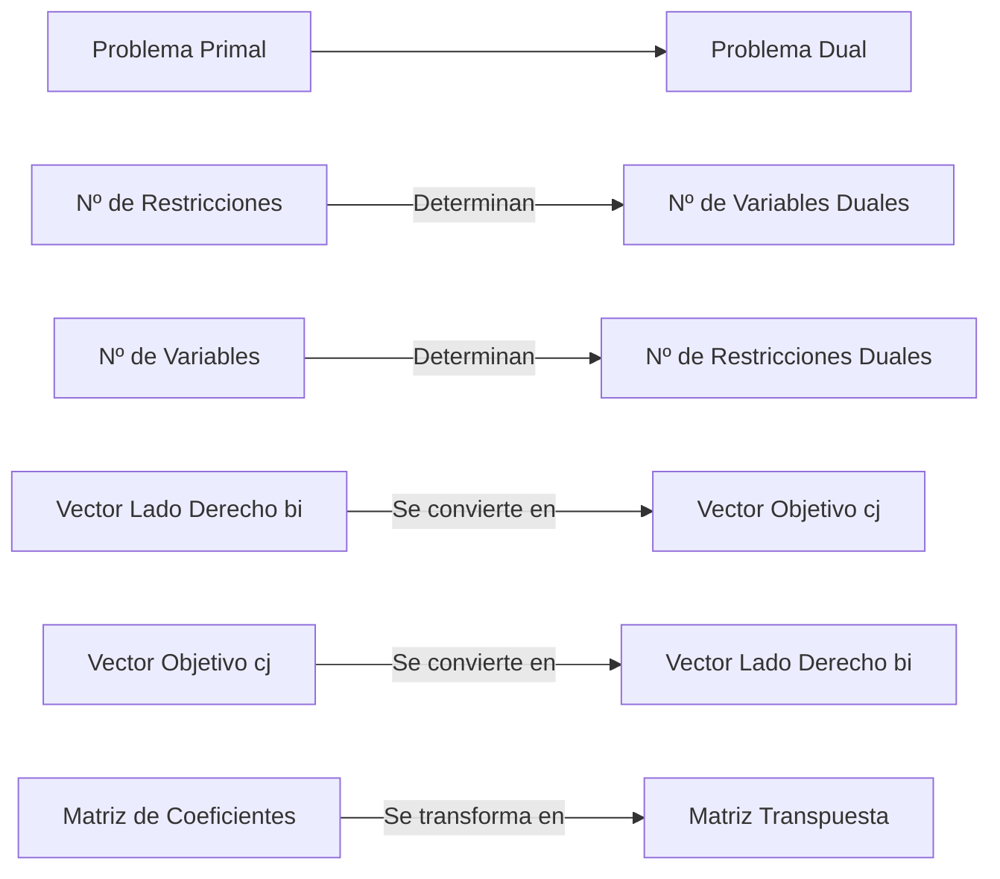
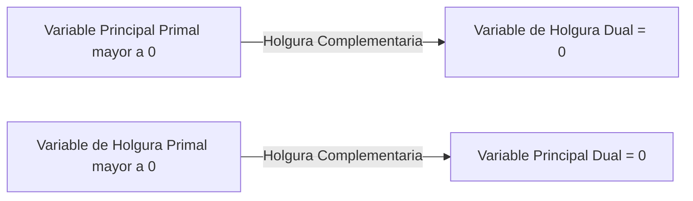
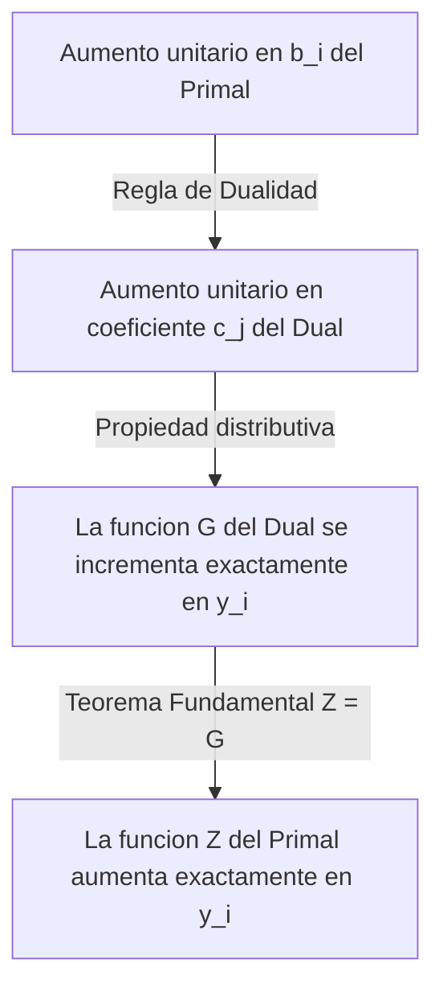

https://www.youtube.com/watch?v=mT9CXciG3d8&list=PLYZrqm_pzRul0t_2QKU2kdHDwGkKblutk&index=15


## 1. Introducción al Análisis de Post-Optimidad

- **Apertura de la unidad:** Presentación de la [[Dualidad]] y el [[Análisis de Sensibilidad]].
- **Concepto global:** Estas herramientas se engloban dentro del [[Análisis de Post-optimidad]], el cual se aplica una vez que ya se ha encontrado la [[Solución Óptima]] de un modelo de [[Programación Lineal]].

## 2. Origen y Formulación del Problema Dual

- **El Problema Primal:** Explicación a través del caso práctico de una fábrica de pinturas (maximización de utilidades sujeta a disponibilidad de materia prima, químicos y horas de mano de obra).

![[{02406D83-8324-4ACB-BE81-C85C32113B19}.png|457]]
>[!note] **[[Problema Primal]]**: Es el modelo matemático original formulado para resolver el problema inicial, como maximizar la contribución a las utilidades a partir de ciertos recursos.

En el [[Problema Primal]] estándar, el objetivo de la empresa es **maximizar las utilidades** decidiendo cuánto fabricar de cada producto, sujetos a una disponibilidad limitada de recursos (materia prima, mano de obra, químicos). El profesor propone un cambio de paradigma: ¿qué pasaría si la empresa decide "vender" esos recursos en lugar de usarlos para fabricar?.

Al formular el [[Problema Dual]], el objetivo cambia a **minimizar el precio** al cual se venderían esos recursos. La lógica dicta que la empresa exigirá recibir, _como mínimo_, la misma ganancia que habría obtenido si utilizaba esos recursos para fabricar los productos originales
>[!note] **[[Problema Dual]]**: Es el modelo matemático directamente asociado al [[Problema Primal]], el cual comparte sus mismos parámetros. Su objetivo es valorar económicamente los recursos, encontrando el "precio mínimo" aceptable al que la empresa estaría dispuesta a venderlos en lugar de usarlos para fabricar.


### 2. Reglas Estructurales de Conversión (Correspondencia 1 a 1)

Todo problema dual se construye aplicando un mapeo directo y sistemático desde el [[Problema Primal]]. El profesor detalló las siguientes equivalencias universales:

1. **Objetivo Inverso:** Si el primal es de [[Maximización]], el dual será de [[Minimización]] (y viceversa).
2. **Cantidades Cruzadas:**
    - El dual tendrá tantas [[Variables Duales]] (yi​) como [[Restricciones]] tenga el primal.
    - El dual tendrá tantas [[Restricciones]] como [[Variables Principales]] (xj​) tenga el primal.
3. **Intercambio de Vectores:**
    - Los [[Valores del Lado Derecho]] (bi​) del primal pasan a ser los [[Coeficientes de la Función Objetivo]] (cj​) del dual.
    - Los [[Coeficientes de la Función Objetivo]] (cj​) del primal pasan a ser los [[Valores del Lado Derecho]] (bi​) del dual.
4. **Transposición:** Los coeficientes técnicos de las variables pasan a formar la [[Matriz Transpuesta]] (las columnas del primal se convierten en las filas/restricciones del dual).![[{1ABC1C47-99C4-4F42-993D-11F622985944}.png|585]]



_Conceptos relacionados:_ [[Problema Primal]], [[Problema Dual]], [[Lado Derecho]], [[Función Objetivo]], [[Matriz Transpuesta]].

### Formas de la Dualidad
El profesor indicó que el [[Problema Dual]] se construye de distintas maneras según la estructura original del modelo.

| Tipo de Formulación                   | Estructura del [[Problema Primal]]                                                                                                    | Consecuencias en el [[Problema Dual]]                                                                            |                                                                                                                       |
| ------------------------------------- | ------------------------------------------------------------------------------------------------------------------------------------- | ---------------------------------------------------------------------------------------------------------------- | --------------------------------------------------------------------------------------------------------------------- |
| **[[Forma Canónica de la Dualidad]]** | Problema de Maximización con restricciones ≤ y variables ≥0 <br>o cuando uno de mínimo tiene restricciones $\ge$ y variables $\ge 0$. | Se transpone la matriz. El objetivo se invierte (pasa a Minimización) y las restricciones cambian a ≥.           | Modelo Matemático Canónico **Primal:** Max Z=CX sujeto a AX≤B y X≥0 <br><br>**Dual:** Min G=BTY sujeto a ATY≥CT y Y≥0 |
| **[[Forma Estándar de la Dualidad]]** | Todas las restricciones son de igualdad (=).                                                                                          | Las variables resultantes quedan definidas como [[Sin restricción de signo]] (pueden ser negativas o positivas). |                                                                                                                       |
| **[[Forma Mixta de la Dualidad]]**    | Combina restricciones de ≤, ≥ o = y variables de distintos signos.                                                                    | Se aplican reglas de conversión cruzada para definir los signos y sentidos de cada inecuación individualmente.   |                                                                                                                       |
![[{BA85D874-E94C-4E6F-AD96-2857AA633252}.png|396]]
![[{18EB4940-1E5A-4AC7-B55E-DC01BC2D72A1}.png|397]]
![[{8CFD96A5-C610-4BBC-B331-CB60D2B71843}.png|384]]
![[{E54C95EF-60AE-4CD4-B577-78F18428E40F}.png|383]]
#### 3.3. Forma Mixta de la Dualidad

Es la forma más compleja y realista, donde el primal combina inecuaciones (≤,≥,=) y variables con distintos signos. Para resolverlo, el profesor enseñó a "cruzar" el análisis usando la siguiente tabla de transformación:

| [[Problema de Máximo]]                    | [[Problema de Mínimo]]                    |
| :---------------------------------------- | :---------------------------------------- |
| [[Restricción]] $\le$ (Canónica)          | [[Variable]] $\ge 0$                      |
| [[Restricción]] $\ge$ (No Canónica)       | [[Variable]] $\le 0$                      |
| [[Restricción]] $=$                       | [[Variable]] [[Sin restricción de signo]] |
| [[Variable]] $\ge 0$                      | [[Restricción]] $\ge$ (Canónica)          |
| [[Variable]] $\le 0$                      | [[Restricción]] $\le$ (No Canónica)       |
| [[Variable]] [[Sin restricción de signo]] | [[Restricción]] $=$                       |

> [!tip] Regla de Oro del Planteo Mixto El profesor hizo un énfasis fundamental aquí: **"Las restricciones de un modelo determinan los signos de las variables del otro, y los signos de las variables del primero determinan los símbolos de las restricciones del segundo"**. Si estás en duda, recuerda: si una restricción primal "respeta" su estado natural (ej. Máximo con ≤), su variable dual asociada será "normal" (≥0). Si la restricción es antinatural (ej. Máximo con ≥), la variable dual absorbe esa anomalía siendo ≤0.

> [!danger] Trampa Frecuente al Transponer Cuando armes las restricciones del dual, no te olvides de leer el problema primal "por columnas". Los coeficientes verticales que acompañan a x


---


#### EJemplo de mixto
![[{FCCC7E3D-40D3-4478-A4F9-402104A9902B}.png|552]]

## 4. Teoremas Relacionales Primal-Dual

El núcleo teórico de la clase se sostiene sobre dos axiomas fundamentales:

### 4.1. Teorema Fundamental de la Dualidad

- **[[Teorema Fundamental de la Dualidad]]**: Establece que si uno de los problemas posee una [[Solución Óptima]], el otro también la tendrá. Si uno es no acotado, el otro es no factible.

> [!note] Ecuación de Igualdad en el Óptimo En la solución óptima, los valores de la función objetivo para ambos problemas son matemáticamente idénticos. $$ Z = G $$

![[{E705B0C6-E073-4E28-9068-3D159B07C9CB}.png|561]]
![[{088DF162-0916-45A4-A555-F30A1E19F8A5}.png|569]]
### 4.2. Teorema Débil de Holgura Complementaria
Dicta una relación de exclusión entre las variables.
* Si una [[Variable Principal]] en un modelo es estrictamente positiva (>0), la [[Variable de Holgura]] de la restricción equivalente en el problema opuesto debe ser exactamente cero. 
* Si una restricción tiene sobrante (holgura >0), la variable principal asociada será nula.



![[{8C0D9440-916B-4AF6-8523-582ED0EEC068}.png]]
## 5. COMO OBTENER EL VALOR DE las variables duales de la tabla simplex
- Se explica cómo encontrar el valor de la [[Variable Dual]] leyendo la fila de evaluación $C_j - Z_j$ de las variables de holgura en la [[Tabla Simplex]] óptima del Primal.
-


Para obtener el valor de las [[Variables Duales]] sin necesidad de resolver matemáticamente el [[Problema Dual]] desde cero, el profesor explicó un método de lectura directa utilizando la [[Tabla Óptima]] del [[Problema Primal]].

Este procedimiento se fundamenta en la relación de correspondencia uno a uno que existe entre las variables de ambos modelos.
![[{9AADD1B8-6973-42C6-8390-D8E310429AC5}.png]]
### 1. El Principio de Correspondencia

Antes de ir a la tabla, el profesor repasó cómo se cruzan las variables entre los dos problemas basándose en el [[Teorema Débil de Holgura Complementaria]]. Esta correspondencia es la regla de oro para saber dónde buscar:

- Las **[[Variables Principales]]** del primal ($x_j$) se relacionan directamente con las **[[Variables de Holgura]]** del dual.
- Las **[[Variables de Holgura]]** del primal ($s_i$) se relacionan directamente con las **[[Variables Principales]]** del dual ($y_i$).

```
graph LR
    A[Problema Primal] --> B[Problema Dual]
    C[Variable Principal Primal] -->|Se relaciona con| D[Variable de Holgura Dual]
    E[Variable de Holgura Primal] -->|Se relaciona con| F[Variable Principal Dual]
```

_Conceptos relacionados:_ [[Problema Primal]], [[Problema Dual]], [[Variable Principal]], [[Variable de Holgura]].

### 2. Lectura Directa en la Fila de Evaluación

El profesor detalló los pasos exactos para extraer los valores de $y_i$ observando la iteración final del algoritmo.
#### Paso a Paso para la Extracción:

1. **Ubicar la Fila Analítica:** Dirígete a la fila $C_j - Z_j$ de la [[Tabla Simplex]] óptima del primal.
2. **Identificar las Columnas Clave:** Ignora las columnas de las variables de decisión. Observa exclusivamente las columnas correspondientes a las [[Variables de Holgura]] iniciales del problema primal ($s_1, s_2, \dots$).
3. **Extraer el Valor Numérico:** El número que se encuentra en la intersección de la fila $C_j - Z_j$ y la columna de la [[Variable de Holgura]] específica, corresponde al valor de su [[Variable Dual]] asociada ($y_i$).

| Variable en el Primal         | Ubicación en Simplex            | Variable Dual Asociada  | Valor Resultante |
| :---------------------------- | :------------------------------ | :---------------------- | :--------------- |
| [[Variable de Holgura]] $s_1$ | Columna $s_1$, Fila $C_j - Z_j$ | [[Variable Dual]] $y_1$ | \|-2\|           |
| [[Variable de Holgura]] $s_2$ | Columna $s_2$, Fila $C_j - Z_j$ | [[Variable Dual]] $y_2$ | \|-6,11\|        |
| [[Variable de Holgura]] $s_i$ | Columna $s_i$, Fila $C_j - Z_j$ | [[Variable Dual]] $y_i$ | $\|              |
![[{4E4A752A-0DD4-42F1-8636-1B90BEF5A256}.png|534]]
> [!tip] Tip de Resolución El mapeo respeta el orden numérico de las restricciones. Para encontrar el valor de la primera variable dual ($y_1$), busca la columna de la primera variable de holgura ($s_1$). El valor de la segunda variable dual ($y_2$) surge directamente de la columna de $s_2$, y así sucesivamente.

> [!danger] Trampa de Parcial: El Signo Numérico El profesor hizo un énfasis crítico al explicar este paso: el valor de las variables duales se extrae siempre tomando el **[[Valor Absoluto]]** del número que figura en la fila $C_j - Z_j$. Como la tabla óptima de un problema de maximización tendrá valores negativos o nulos en esta fila, debes ignorar el signo menos para obtener el precio correcto del recurso.

> [!note] Ecuación de Extracción Dual $$ y_i = | C_{s_i} - Z_{s_i} | $$

### 3. Validación mediante Holgura Complementaria

El profesor explicó cómo aplicar el [[Teorema Débil de Holgura Complementaria]] para validar lógicamente lo que estamos leyendo en la tabla:

- Si al mirar la tabla óptima notamos que una [[Variable de Holgura]] del primal (por ejemplo, $s_3$) forma parte de la base y tiene un valor estrictamente positivo (es decir, sobra recurso), podemos concluir inmediatamente que su [[Variable Dual]] asociada ($y_3$) valdrá cero ($y_3 = 0$). No tiene sentido pagar un precio marginal por un recurso que nos sobra.
- En contrapartida, si la [[Variable de Holgura]] del primal vale cero (el recurso se agotó por completo), entonces su [[Variable Dual]] asociada sí tomará un valor positivo extraído de la fila $C_j - Z_j$, representando el [[Precio Sombra]] o verdadero [[Valor Marginal del Recurso]].


## 6. Significado Matemático de las [[Variables Duales]]

El profesor basó su explicación matemática en el concepto de **tasa de cambio marginal** derivada del cálculo diferencial.

Matemáticamente, en el punto óptimo, una [[Variable Dual]] ($y_i$) representa la cantidad exacta en la que se incrementa el valor de la [[Función Objetivo]] ($Z$) ante un **incremento unitario** en el valor del [[Lado Derecho]] ($b_i$) de la restricción _i-ésima_.

> [!note] Definición Matemática Exacta (Derivada Parcial) La variable dual es la derivada de la función objetivo respecto al término independiente de la restricción: $$ y_i = \frac{\partial Z}{\partial b_i} $$

### La Demostración Analítica del Profesor

Para que los alumnos comprendieran de dónde sale esta igualdad, el profesor realizó una demostración lógica paso a paso cruzando el [[Problema Primal]] con el [[Problema Dual]].

El razonamiento fue el siguiente:

1. **Perturbación del Primal:** Supongamos que incrementamos en una unidad el recurso disponible ($b_1$) en el [[Problema Primal]]. Por ejemplo, pasamos de tener 600 unidades de materia prima a tener 601.
2. **Impacto Estructural en el Dual:** Por las reglas de conversión de la dualidad, sabemos que los [[Valores del Lado Derecho]] del primal se convierten en los [[Coeficientes de la Función Objetivo]] del dual. Por lo tanto, ese "601" ahora multiplicará a la variable $y_1$ en la función objetivo del dual ($G$).
3. **Aplicación de la Propiedad Distributiva:** Si tomamos esta nueva función objetivo dual modificada y aplicamos la propiedad distributiva, observaremos que la diferencia exacta entre la función nueva y la función original es un término solitario: el valor de $y_1$.
    - _Ejemplo conceptual:_ Si $G = 600y_1 + ...$, al cambiar a $G_{nueva} = (600 + 1)y_1 + ... = 600y_1 + 1y_1 + ...$ la diferencia neta es $+y_1$.
    ![[{7C7C0D41-5118-410F-B9B8-6CD006891B4D} 1.png|558]]
4. **Igualdad por el Teorema Fundamental:** Finalmente, apoyándose en el [[Teorema Fundamental de la Dualidad]], sabemos que en la [[Solución Óptima]], los valores de las funciones objetivo de ambos problemas son matemáticamente iguales ($Z = G$). Por tránsito lógico, si la función dual aumentó en $y_1$, la función primal $Z$ forzosamente también se incrementa en $y_1$.
![[{14C93A9B-A8F7-4728-BB24-CD81E714C770}.png]]




### Resumen del Comportamiento Matemático

|Cambio en el [[Problema Primal]]|Reflejo en el [[Problema Dual]]|Consecuencia Matemática Final|
|:--|:--|:--|
|$\Delta b_i = +1$ (Suma de 1 unidad al lado derecho)|Modificación de la pendiente objetivo dual ($c_j + 1$)|$\Delta Z = + y_i$ (El objetivo total se incrementa en la cuantía de la variable dual)|

> [!tip] Tip de Resolución Si en un ejercicio te piden justificar matemáticamente (y no económicamente) por qué $Z$ aumenta al agregar un recurso, no hables de dinero ni costos. Habla de la **derivada parcial** ($\frac{\partial Z}{\partial b_i}$) y de cómo el incremento de la constante $b_i$ se transfiere linealmente al resultado óptimo a través de $y_i$.

> [!danger] Trampa de Conceptos Clave Es vital no mezclar la demostración matemática (la derivada explicada arriba) con la interpretación económica. Matemáticamente es una "tasa de cambio marginal" ($y_i$). Cuando a este modelo matemático le inyectamos significado de negocio (utilidades, horas, costos), entonces $y_i$ pasa a llamarse [[Precio Sombra]] o [[Valor Marginal del Recurso]].


## 5. Interpretación Económica  de las variables duales

Mientras que matemáticamente una [[Variable Dual]] ($y_i$) es una simple tasa de cambio marginal, en el ámbito de los negocios y la economía adopta un rol fundamental para la toma de decisiones empresariales. Económicamente, el vector de variables duales se interpreta como un vector de precios para el [[Lado Derecho]] de las restricciones.

### 1. Concepto Central: El Precio Sombra

El profesor enfatizó que, en la economía de la [[Programación Lineal]], la [[Variable Dual]] ($y_i$) representa el **[[Valor Marginal del Recurso]]** o el **[[Precio Sombra]]**.

**[[Precio Sombra]]** o **[[Valor Marginal del Recurso]]**: Indica la variación matemática exacta que se produce en el valor de la función objetivo ante un incremento de una unidad en el lado derecho (bi​) de una restricción. Representa el "precio justo" o lo máximo que se pagaría por una unidad adicional del recurso.

![[{CBE5AA99-597B-4161-A3A1-7DBAE521FEDB}.png|517]]

![[{CD5CC875-3363-4196-A1CD-52D14505A64D}.png]]

### precio sombra vs precio dual
- **[[Precio Sombra]]** o **[[Valor Marginal del Recurso]]**: Indica la variación matemática exacta que se produce en el valor de la función objetivo ante un incremento de una unidad en el lado derecho (bi​) de una restricción. Representa el "precio justo" o lo máximo que se pagaría por una unidad adicional del recurso.
	- precio sombra + -> indica crecimiento en la funcion objetivo
		- si es de maximo lo acerca al objetivo
		- si es de minimo lo aleja del objetivp

> [!note] Derivada del Precio Sombra  $$ y_i = \frac{\partial Z}{\partial b_i} $$

- **[[Precio Dual]]**: Mide la _mejora o desmejora_ que sufre el valor de la función objetivo ante el incremento  unitario en el lado derecho de una restriccion, segun que el precio dual sea positivo o negativo
	![[{FFB3BE03-0773-41F3-96BE-27CC27854074}.png]]

> [!danger] Trampa Clásica de Interpretación Es crítico diferenciar estos dos términos. En un problema de Maximización, el [[Precio Sombra]] y el [[Precio Dual]] son exactamente iguales. Sin embargo, en un problema de Minimización, uno es el opuesto del otro, ya que un incremento en los costos (Precio Sombra positivo) significa que el objetivo desmejora (Precio Dual negativo)
### 2. La Regla de Interpretación del Profesor

Para poder interpretar correctamente qué significa este número en la realidad, el profesor dictó una regla de oro: **el significado económico depende estrictamente de qué represente la [[Función Objetivo]] ($Z$) y qué represente la [[Restricción]] ($b_i$) analizada**.

El profesor dividió esta interpretación en dos escenarios empresariales clásicos:

#### Escenario A: Problemas de [[Maximización]] (Recursos Limitados)

Si el modelo busca maximizar la contribución total a las utilidades ($Z$) y la restricción representa la disponibilidad limitada de un insumo (ej. horas de mano de obra o litros de químicos):

- **Interpretación:** $y_i$ representa el incremento en las utilidades por adicionar una unidad de ese insumo.
- _Ejemplo de clase:_ Si en la fábrica de pinturas el [[Precio Sombra]] de los químicos es 6.11, significa que tener un litro extra de químico aumentará la utilidad total en 6.11.

#### Escenario B: Problemas de [[Minimización]] (Cumplimiento de Demanda)

Si el modelo busca minimizar el costo total de producción ($Z$) y la restricción representa la demanda mínima exigida de un producto ($b_i$):

- **Interpretación:** $y_i$ representa el costo incremental de producir una unidad más de ese producto.

### 3. Toma de Decisiones: ¿Conviene comprar más recursos?

El significado económico cobra vida cuando la gerencia debe decidir si adquiere recursos adicionales en el mercado. El profesor planteó escenarios prácticos leyendo el reporte de software para tomar decisiones:

1. **Recursos Ociosos (Sobrantes):** Si la [[Variable de Holgura]] de un recurso es positiva (es decir, sobran horas o material), su [[Precio Sombra]] o [[Variable Dual]] será exactamente cero.
    - _Decisión:_ **No conviene** pagar por horas extras ni comprar más material, ya que actualmente no se está utilizando todo lo disponible y no aportaría ninguna mejora a la utilidad.![[{1F3D01B2-65CA-417C-8456-4A21E009BA92}.png]]
2. **Recursos Limitantes (Agotados):** Si el recurso se consumió por completo (holgura igual a cero), su [[Precio Sombra]] será positivo.
    - _Decisión:_ Conviene adquirir más recurso **solo si el precio adicional exigido por el proveedor es menor o igual al [[Precio Sombra]]**.![[{AC1D1DCF-3FCE-4903-AABD-727940A13F52}.png|495]]

> [!danger] Trampa Gerencial: El Costo Adicional Cuando se evalúa comprar unidades extra (ej. 1000 kg más de materia prima a 5$ extra por kg), no debes mirar el costo total, sino comparar directamente el recargo que te cobra el proveedor contra tu [[Variable Dual]]. Si el proveedor te cobra 5$ adicionales, pero tu [[Precio Sombra]] es 1.5$, la operación arrojará pérdidas netas. ¡Nunca pagues por un recurso más de lo que este aporta a tu [[Función Objetivo]]!

