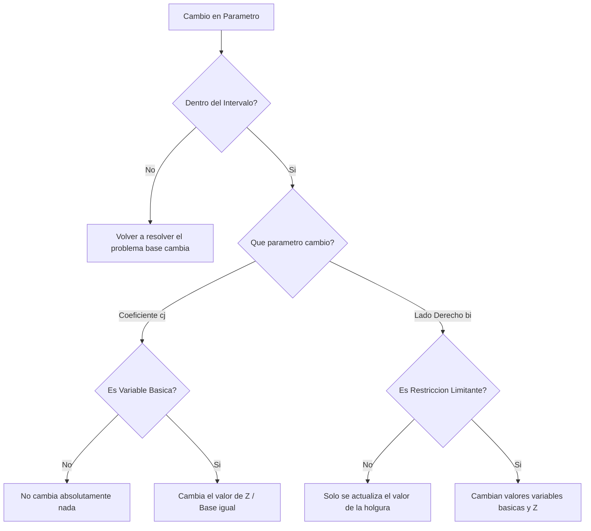
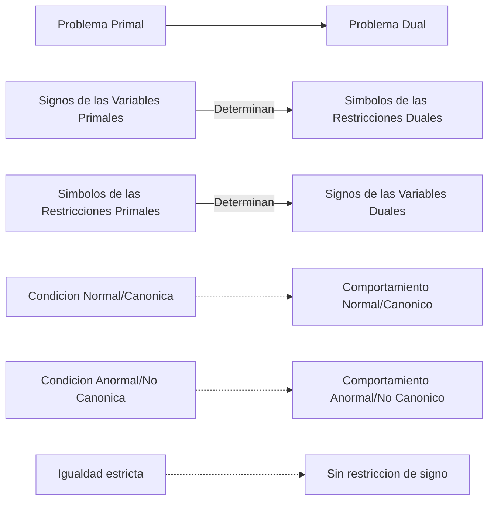
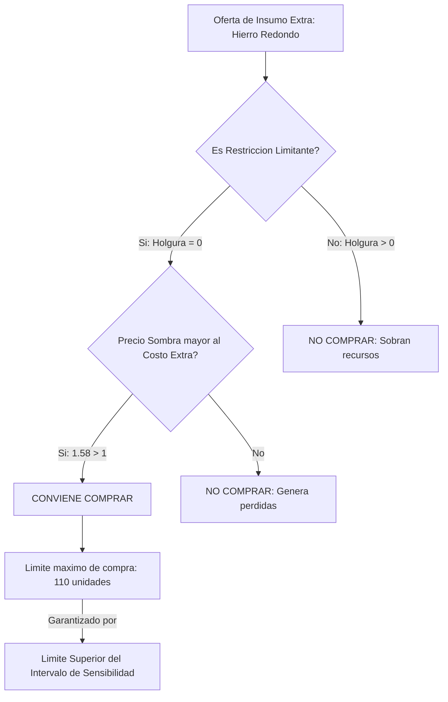
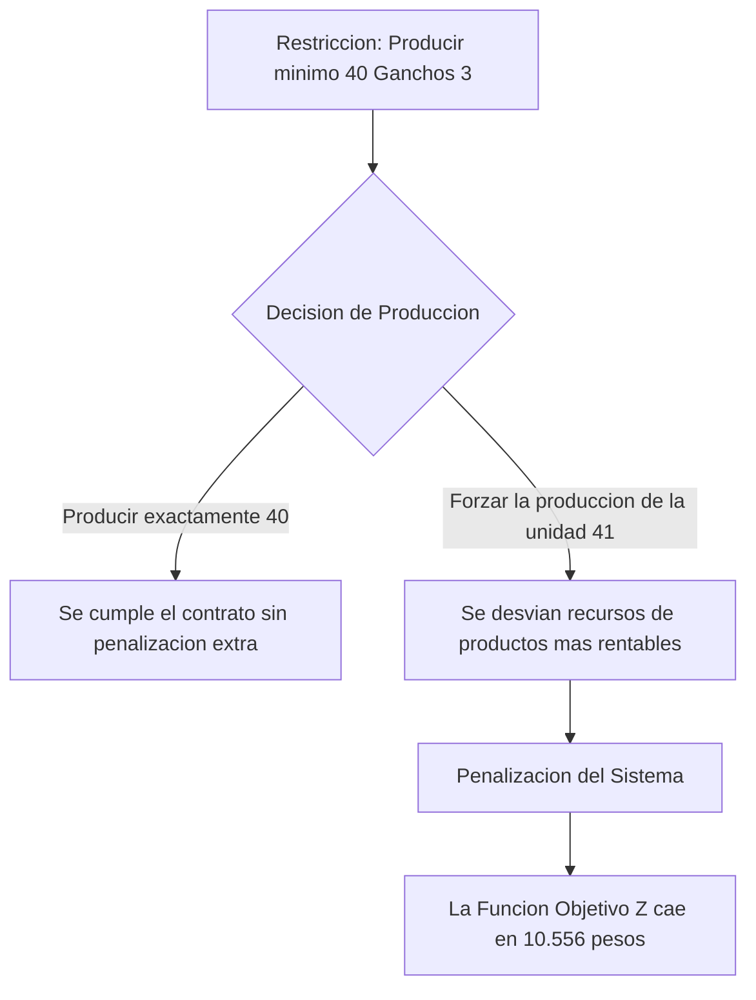

un repaso de lo que es el análisis de post actividad en la parte inicial en la
cual vamos a ver el un repaso sobre el problema dual y vamos a comenzar con el análisis de sensibilidad en particular hoy del análisis de sensibilidad lo que vamos a ver es la interpretación de los intervalos de sensibilidad nosotros la última clase estuvimos

## 1. Introducción y Repaso Matemático del Precio Sombra (Min 08:12 - 13:00)


El profesor inició la clase destacando la importancia de comprender qué representan exactamente las [[Variables Duales]] del [[Problema Dual]] asociado a nuestro modelo original. Se hizo un fuerte énfasis en separar el significado puramente matemático del económico:

- **Significado Matemático:** La [[Variable Dual]] representa una tasa de cambio; es decir, en cuánto se incrementa el valor de la [[Función Objetivo]] si se aumenta en una unidad el [[Lado Derecho]] de una restricción.
![[{1D07A614-013E-44B0-8C96-8B1248371B8F}.png|459]]

- **Significado Económico:** Depende estrictamente de qué represente el objetivo (ej. utilidades o costos) y la restricción (ej. horas, insumos o demandas mínimas).
![[{0317D605-5EED-49FB-AC61-40BD9E0BC99B}.png|352]]


==PARA PODER INTERPRETAR QUE SIGNIFICA EL PRECIO SOMBRA ANTE UN PROBLEMA PARTICULAR, ANTES DEBEMOS SABER (QUE REPRESENTA MATEMATICAMENTE, luego aplicarlo al problema de acuerdo a lo que representa Z y lo que represente la restriccion correspondiente)==


![[{E89F616B-8771-4290-B8F3-B36FB9E334E7}.png]]
>[!note]- **[[Precio Sombra]]** (_Shadow Price_): 
>
>Valor marginal del recurso. Indica la cantidad exacta en que se incrementa el valor de la [[Función Objetivo]] si se adiciona una unidad al valor del [[Lado Derecho]] de una restricción.
>
>Definición Matemática del Precio Sombra Matemáticamente, el precio sombra es un concepto puro de derivada parcial:
>
>$$ y_i = \frac{\partial Z}{\partial b_i} $$.
>
>(Tal como lo indica el profesor: "el incremento que se produce en la función objetivo si se incrementa en una unidad el valor del lado derecho... o sea, es el concepto de derivada")

- **Diferencia de Software:** Se discutió la diferencia de terminología entre reportes informáticos. En [[SOLVER]] se denomina _Precio Sombra_, mientras que en [[LINDO]] se llama _Precio Dual_.

> [!danger] Trampa de Nomenclatura Informática En problemas de [[Maximización]], el [[Precio Sombra]] y el [[Precio Dual]] coinciden perfectamente. Sin embargo, el profesor advirtió que en modelos de [[Minimización]], uno es el opuesto del otro (se multiplican por $-1$). Esto se debe a que un "aumento" matemático en un problema de minimización representa una "desmejora" económica (más costos).


## 2. trabajamos con ejemplo (Min 13:00 - 21:00)
![[{C59A6E73-31C5-4C43-94DD-13ABE6E0633C}.png]]
>[!note]- **[[Problema Primal]]**: 
>Es el modelo matemático original formulado para resolver la problemática de la empresa (por ejemplo, maximizar utilidades produciendo artículos).

El segundo gran pilar fue la construcción del [[Problema Dual]] a partir de un [[Problema Primal]] que combina inecuaciones y variables de distintos signos.
### cuantas variables tendra el dual de este PL?
La cantidad de **[[Restricciones]]** del primal determina exactamente la cantidad de **[[Variables Duales]]**

En este caso tendremos 3 variables duales

### cuantas restricciones tendra el dual?
La cantidad de **[[Variables Principales]]** del primal determina exactamente la cantidad de **[[Restricciones]]** en el dual.

en este caso tendra 2 restricciones el problema dual

### Como se relacion las variables y restricciones de un PL y su dual
- **Reglas de Formulación:** Construcción interactiva del [[Problema Dual]] a partir del problema de máximo original.
    - Las [[Restricciones]] del primal definen la cantidad de [[Variables Duales]].
    - Las [[Variables Principales]] del primal definen la cantidad de inecuaciones en el dual.
    - Transposición de los [[Valores del Lado Derecho]] a [[Coeficientes de la Función Objetivo]].

>[!note] cada variable del problema dual va a representar el incremento que se produce en el valor de la función objetivo si se incrementa en una unidad del valor del lado derecho 
>
>por eso vamos a tener una variable por cada restricción que tengamos en el primal y a su vez las restricciones que vamos a tener en el dual se van a corresponder con la cantidad de variables que tengamos en el primal 
>
>es decir que vamos a tener tantas restricciones en el dual como variables tengamos el primal 

### Cual es el sentido de optimizacion del objetivo y cuales seran los coeficientes de la funcion objetivo?
Si el Primal es de maximo su dual sera de minimo, y los coeficientes seran los valores del lado derecho de las restricciones

Los **[[Valores del Lado Derecho]]** (bi​) del primal pasan a ser los **[[Coeficientes de la Función Objetivo]]** del dual

### Que coeficientes forman los VLD del dual?
Los coeficientes que forman a la funcion objetivo del primal
### formulamos el problema dual

>[!note ]- **[[Problema Dual]]**: 
>
>Es el programa matemático directamente asociado al original, formulado con la misma información, cuyo objetivo económico es calcular el valor marginal o precio de los recursos

![[{4C6C22FE-8262-474F-BFEC-FC0266CACBC8}.png]]

>[!note] **[[Dualidad Canónica]]**: Caso donde un problema de [[Maximización]] tiene todas sus restricciones ≤ y variables ≥0. Su dual asociado será de [[Minimización]] con todas sus restricciones ≥ y variables ≥0

### Donde encontramos los valores de las variables duales?

Los valores de todas las variables duales, incluidas las variables de holgura, se encuentran en la fila $C_j - Z_j$.

**Consideraciones sobre los signos:**

Los signos de estas variables se deben interpretar según el planteo original del problema dual. En el caso específico de un dual canónico, los valores leídos en la fila se toman en **valor absoluto**, ya que las variables originales son negativas.
![[{6D70B984-C247-4D88-AA49-C4F0CBF3E111}.png|374]]

**Valor de la Función Objetivo ($Z$):** El valor de la función objetivo es exactamente el mismo para ambos problemas. Según la teoría de la dualidad, si uno de los problemas (primal) tiene una solución óptima, el otro (dual) también la tiene, y los valores de sus funciones objetivo coinciden. Por lo tanto, el valor de $Z$ para el dual también será de **581**.
## 3. Teorema de Holgura Complementaria y Trampas Lógicas (Min 21:00 - 26:48)

>[!note]- **[[Teorema Débil de Holgura Complementaria]]**: 
>Establece la relación excluyente entre las variables de ambos problemas. Dicta que si una variable (de decisión, holgura o excedente) en uno de los problemas es estrictamente positiva (>0), entonces la variable directamente asociada en el problema opuesto debe ser nula (cero)

POR EJEMPLO si en el primal x1 es positiva, en el dual y4(es con la que se relaciona va a ser negativa)

> [!danger] Trampa de Parcial: La Relación Unidireccional del Teorema El profesor fue muy incisivo al respecto: el teorema de holgura **funciona en un solo sentido**. Si al mirar una tabla observas que una variable es nula (cero), **NO PUEDES** asumir automáticamente que su contraparte en el otro problema sea positiva. Su contraparte podría valer cero también. Esto ocurre cuando el modelo presenta una **[[Solución Factible Básica Degenerada]]** o si posee **[[Múltiples Soluciones Óptimas]]**

POR EJEMPLO SI S1=0 , EN EL DUAL NO PUEDO ASEGURAR QUE LA RELACIONADA SEA +


![[{2A365D8C-BA15-472D-9047-2C0AE2413D93}.png]]
En este caso tenemos una Solucion factible basica degenerada

P5 =0 y su relacianda es y3 y es =0 ENTONCES NO PODIA ASEGURAR QUE SEA POSITIVA

## 4. Fundamentos del Análisis de Sensibilidad (Min 26:48 - 33:01)
![[{6C646F94-F158-4DEF-8D1B-12E49F3BF1D6}.png|396]]

>[!note]- **[[Análisis de Sensibilidad]]** o **[[Análisis de Post-optimidad]]**: 
>Es la herramienta que se utiliza para suplir la limitación de los modelos deterministas. Permite estudiar los efectos y responder a preguntas del tipo _"¿Qué pasa si...?"_ (por ejemplo, si cambian los costos, utilidades o la disponibilidad de recursos) sin la necesidad de recalcular todo el algoritmo desde cero

#### 1. Naturaleza del Modelo

El modelo con el que trabajamos es **determinista** y **estático**. Esto significa que nos proporciona una respuesta para un momento específico (es decir, nos da "una foto del problema") asumiendo que los parámetros tienen valores fijos y conocidos. Dado que el modelo es determinista, si la realidad altera alguno de estos valores, la solución óptima del problema también puede cambiar.

#### 2. Objetivo del Análisis de Sensibilidad

El objetivo principal de este análisis es poder responder a preguntas del tipo **"¿Qué pasa si...?"** frente a cambios en la realidad, sin necesidad de formular y resolver todo el problema desde cero.

Por ejemplo:

- **Restricciones de recursos:** ¿Qué pasa si en lugar de disponer de 980 horas de mano de obra, solo tengo 900 porque un operario se ausentó?
    
- **Variaciones en utilidades:** ¿Qué pasa si el beneficio por unidad del producto 2 baja de $7 a $6 debido a que tuve que comprar materia prima más cara a un proveedor no habitual? ¿Me conviene seguir produciendo la misma cantidad?
    

#### 3. ¿Cómo se realiza?

El análisis de sensibilidad se lleva a cabo determinando **intervalos de variación** válidos para los parámetros del modelo. Dentro de estos intervalos, la base óptima actual no cambia.

>[!note] **[[Intervalo de Sensibilidad]]** o **[[Intervalo de Variación]]**: Rango numérico definido por un límite inferior y un límite superior ("disminución permitida" y "aumento permitido" en los reportes) dentro del cual puede fluctuar un parámetro garantizando que se mantenga la estructura de la base óptima actual
>
>si algunos de los parametros cae fuera del intervalo vamos a tener que resolver nuevamente el problema

**Parámetros sobre los que se realiza el análisis:**

El análisis se aplica exclusivamente a dos conjuntos de datos:

- Los coeficientes de la función objetivo ($c_j$).
    
- Los valores del vector del lado derecho de las restricciones ($b_i$).
    ![[{90CDFFE5-3858-4C00-9A50-5A32B2D5A8A3}.png|477]]
	- **[[Restricción Limitante]]** o **[[Restricción Vinculante]]**: Recurso totalmente consumido o agotado, en el que la [[Variable de Holgura]] es cero.
	- **[[Restricción No Limitante]]** o **[[Restricción No Vinculante]]**: Recurso inactivo o con sobrante, donde la [[Variable de Holgura]] es estrictamente positiva (>0)
#### 4. Exclusión de la Matriz de Coeficientes Tecnológicos

La matriz de coeficientes del sistema (los valores $a_{ij}$) también es un parámetro del modelo, pero **no se realiza análisis de sensibilidad sobre ellos**.

**¿Por qué?**

Estos coeficientes representan las tasas tecnológicas del proceso de producción. Si hay una alteración en una tasa tecnológica, significa que la tecnología, los métodos o la estructura subyacente de la empresa han cambiado. Ante un cambio de esta magnitud, el problema original pierde validez y la situación requiere formular un modelo completamente nuevo.

## 5. El Árbol de Decisión de Variaciones (Min 33:01 - 42:26)

### Efectos de las Variaciones en el Análisis de Sensibilidad

El análisis de sensibilidad no solo determina los intervalos de variación, sino que nos permite evaluar el impacto de estas fluctuaciones y actualizar la solución óptima sin necesidad de formular el problema desde cero.

A continuación, se detalla cómo proceder según el parámetro modificado, lo cual funciona como un árbol de decisión.

#### 1. Variación en los Coeficientes de la Función Objetivo ($c_j$)
![[{D14E1A7A-C6E0-41F1-9268-AAD90B36D661}.png|461]]

_Nota: Este análisis aplica exclusivamente a los coeficientes de las variables de decisión, no a las variables de holgura._

Ante un incremento o disminución ($\Delta c_j$) en la contribución a las utilidades (o costos):

- **Si la variación está FUERA del intervalo:**
    
    Se debe resolver el problema nuevamente. La estructura de la base cambiará, lo que significa que las variables que conforman la solución óptima ya no serán las mismas.
    
- **Si la variación está DENTRO del intervalo:**
    
    La estructura de la base se mantiene. El efecto exacto depende de la naturaleza de la variable afectada:
    
    - **Variable No Básica:** Si la modificación ocurre en un producto que no se está fabricando (no está en la base), **no cambia absolutamente nada**. La solución actual permanece intacta.
	    - Son aquellas variables que actualmente forman la "base" de la solución en una iteración específica del algoritmo =(positivas)
        
    - **Variable Básica:** Si el coeficiente pertenece a una variable que sí está en la base, las variables básicas y sus cantidades producidas no cambian, pero **el valor total de la función objetivo ($Z$) sí se modifica**.
	    - Son las variables que se encuentran "inactivas" en la solución actual y no forman parte de la base. =0
        
        El impacto en $Z$ se calcula de la siguiente manera:
        
        $$\Delta Z = \Delta c_j \times \text{valor actual de la variable}$$
        
        > **Ejemplo:** Si el beneficio del Producto 2 disminuye en $\$1$ ($\Delta c_j = -1$) y actualmente producimos $63$ unidades, la función objetivo se reducirá en $\$63$.
        

#### 2. Variación en los Valores del Lado Derecho ($b_i$)
![[{2E4CAC30-00B6-49A0-A1D2-7E43C14A5673}.png|469]]

Ante un cambio ($\Delta b_i$) en la disponibilidad de un recurso o capacidad:

- **Si la variación está FUERA del intervalo:**
    
    Al igual que en el caso anterior, se debe resolver el problema nuevamente porque la estructura de la base cambiará y los efectos no se pueden calcular directamente con la tabla actual.
    
- **Si la variación está DENTRO del intervalo:**
    
    El impacto depende del estado de saturación del recurso (es decir, si la restricción es limitante o no):
    
    - **Restricción No Limitante (Holgura $> 0$):
	    - ****[[Restricción No Limitante]]** o **[[Restricción No Vinculante]]**: Recurso inactivo o con sobrante, donde la [[Variable de Holgura]] es estrictamente positiva (>0)
        
        No se modifica el valor de $Z$ ni los valores de las variables básicas. **Lo único que cambia es el valor de la holgura**.
        
        > **Ejemplo:** Si originalmente sobraban $95$ unidades de materia prima y la disponibilidad total disminuye en $50$ (variación permitida por el intervalo), la nueva holgura será de $45$ unidades.
        
    - **Restricción Limitante (Holgura $= 0$):**
	    - **[[Restricción Limitante]]** o **[[Restricción Vinculante]]**: Recurso totalmente consumido o agotado, en el que la [[Variable de Holgura]] es cero.
        
        La estructura de la base se mantiene (las variables no entran ni salen), pero **sí cambian los valores de las variables básicas y el valor óptimo de $Z$**.
        
        **A. Actualización del valor de $Z$:**
        
        El incremento o decremento se calcula utilizando el **precio sombra**:
        
        $$\Delta Z = \Delta b_i \times \text{Precio Sombra}$$
        
        _(Nota: $\Delta b_i$ se debe ingresar con su respectivo signo positivo o negativo)._
        
        **B. Actualización de las variables básicas ($\lambda_i$):**
        
        Los nuevos valores se calculan utilizando las tasas de sustitución ($\lambda_{ij}$).
        
        Para restricciones de tipo $\le$ o $=$:
        
        $$\lambda_i^{nueva} = \lambda_i + (\Delta b_i \times \lambda_{ij})$$
        
        Para restricciones de tipo $\ge$:
        
        $$\lambda_i^{nueva} = \lambda_i - (\Delta b_i \times \lambda_{ij})$$
        
        _(Aclaración para el caso $\ge$: la fórmula con signo negativo asume que se está utilizando la tasa de sustitución de la variable de **excedente**. Si, en su defecto, se utiliza la tasa de sustitución de una variable **artificial** agregada al modelo, el cálculo mantiene el signo positivo original)._

### a


## 6. Resolución Práctica de Dualidad Mixta (Min 42:26 - 51:11)
![[{E9E623CB-26FF-421B-92A8-1B5338C12EF5}.png]]

- El profesor plantea en la pizarra un ejercicio complejo con inecuaciones mezcladas para aplicar las reglas de la [[Dualidad Mixta]].

### 2. Reglas Base de Conversión (Estructura General)

Antes de analizar los signos mixtos, el profesor repasó las reglas universales que aplican a cualquier transformación del [[Problema Primal]] al [[Problema Dual]]:

1. **Inversión del Objetivo:** Si el primal es de [[Maximización]], el dual será forzosamente de [[Minimización]] (y viceversa).
2. **Vectores Cruzados:** Los [[Valores del Lado Derecho]] (bi​) del primal se convierten en los [[Coeficientes de la Función Objetivo]] del dual.
3. **Correspondencia de Cantidades:**
    - Habrá una [[Variable Dual]] por cada restricción del primal.
    - Habrá una [[Restricción Dual]] por cada variable del primal.

> [!note] Función Objetivo del Dual Matemáticamente, la función objetivo se construye multiplicando los valores del lado derecho del primal por las nuevas variables duales: Min G=b1​y1​+b2​y2​+⋯+bm​ym​

![[{80A901DE-856F-46B4-847D-9EDFB5DCB742}.png|383]]
### 3. Determinación de los Símbolos de las Restricciones Duales
Para saber qué símbolo (≤,≥,=) llevará cada inecuación en el dual, el profesor indicó que **hay que mirar exclusivamente el signo de las variables del primal**.

Se debe evaluar cada variable primal individualmente y aplicar la siguiente lógica cruzada:

| Atributo de la [[Variable Principal]] (Primal)          | Relación con la Normalidad     | Símbolo de la [[Restricción]] Asociada (Dual Min) |
| ------------------------------------------------------- | ------------------------------ | ------------------------------------------------- |
| **[[Variable No Negativa]]** (≥0)<br>ejemplo X1^X4      | Es el comportamiento "Normal"  | **[[Restricción Canónica]]** (Aplica ≥).          |
| **[[Variable No Positiva]]** (≤0)<br>ejemplo X2         | Es un comportamiento "Anormal" | **[[Restricción No Canónica]]** (Aplica ≤).       |
| **[[Variable Sin Restricción de Signo]]**<br>ejemplo X3 | Es una Excepción Matemática    | **[[Restricción de Igualdad]]** (Aplica =).       |

> [!danger] Trampa de Nomenclatura El profesor corrigió una costumbre común en clase: no se debe decir "variable negativa". El término técnico correcto es **[[Variable No Positiva]]** (≤0), ya que este intervalo incluye matemáticamente al cero

![[{9827F286-91D7-43A6-9F4A-735A250C7F2E}.png]]

### 4. Determinación de los Signos de las Variables Duales
Una vez armadas las inecuaciones, se deben definir los signos de las nuevas variables (y1​,y2​,…). Para esto, la regla se invierte: **hay que mirar exclusivamente los símbolos de las restricciones del primal**.

| Símbolo de la [[Restricción]] (Primal Max)                       | Relación con la Normalidad    | Signo de la [[Variable Dual]] Asociada          |
| ---------------------------------------------------------------- | ----------------------------- | ----------------------------------------------- |
| **[[Restricción Canónica]]** (≤)<br><br>ejemplo la restriccion 1 | Respeta el modelo original    | **[[Variable No Negativa]]** (≥0).<br><br>y1>=0 |
| **[[Restricción No Canónica]]** (≥)                              | Contradice el modelo original | **[[Variable No Positiva]]** (≤0).              |
| **[[Restricción de Igualdad]]** (=)                              | Es una Excepción Estricta     | **[[Variable Sin Restricción de Signo]]**.      |
![[{771A6EF7-931A-4396-8D30-F6D54197D965}.png]]

>[!question] Pregunta de Análisis en Clase **Alumno:** _"¿Entonces no siempre va a ser así el intercambio? Por ejemplo, si el dual fuera máximo..."_ **Profesor:** _Exacto. Por eso no debes memorizar símbolos fijos. Debes evaluar si la inecuación es 'Canónica' o 'No Canónica' dependiendo del objetivo del problema que estés analizando. Si el problema es de Mínimo, lo canónico es_ ≥_; pero si es de Máximo, lo canónico es_ ≤.

### 5. Resumen Visual del Flujo de Conversión


## 7. Interpretación de Software: LINDO vs. SOLVER (Min 51:11 - 1:00:24) (EN EL LIBRO TMB ESTAN LAS INTERPRETACIONES)
El profesor utilizó la **[[Actividad 5]]** del libro de texto (página 139), correspondiente al caso de la empresa **"Amarras S.A."**, como el ejercicio integrador definitivo para enseñar a interpretar los reportes de software ([[LINDO]] y [[SOLVER]]) y aplicar el [[Análisis de Sensibilidad]] en la toma de decisiones gerenciales.

### 1. Contexto del Problema
![[{30E045FC-CF41-4361-B9B5-50DBF39AB1EA}.png|477]]
La empresa fabrica tres tipos de ganchos para tráiler (Gancho 1, Gancho 2 y Gancho 3) utilizando tres tipos de recursos o insumos metálicos: [[Hierro Acanalado]], [[Hierro Plano]] y [[Hierro Redondo]]. Adicionalmente, el modelo original posee una restricción de demanda o producción mínima exigida de 40 unidades para el Gancho 3.

![[{0F7CFA2F-3871-4912-86C2-16AC65E43B31}.png|591]]

#### interpretacion lindo
##### informe de solucion
![[{6D670CD0-D877-4349-B1BC-488E62BA7869}.png]]
- **Objective Function Value:** Es el valor final de la [[Función Objetivo]] (utilidad máxima o costo mínimo, dependiendo del modelo).
- **Variable & Value:** Lista las **[[Variables de Decisión]]** originales y el valor óptimo que asumen en la base.
- **[[Costo Reducido]] (Reduced Cost):** En LINDO, representa matemáticamente el valor absoluto de la fila de evaluación en la tabla Simplex (cj-zj en valor absoluto).
- **Slack or Surplus:** Muestra directamente el valor de la **[[Holgura]]** (recurso sobrante) o **[[Variable de Excedente]]** (producción por encima del mínimo). Si este valor es distinto de cero, el recurso sobra.
- **[[Precio Dual]] (Dual Price):** Muestra el valor de las **[[Variables Duales]]**. En problemas de maximización, coincide matemáticamente y conceptualmente con el **[[Precio Sombra]]**.
	- es decir en maximo tengo los valores de las variables principale del dual
##### informe de sensibilidad
![[{C7876642-1367-4B9B-8A63-E84D190B0EDB}.png]]
- Muestra el coeficiente actual (_Current Coef / RHS_) y sus límites de tolerancia mediante las columnas **[[Aumento Permisible]]** (_Allowable Increase_) y **[[Disminución Permitida]]** (_Allowable Decrease_).
- Sumando o restando estos valores al coeficiente actual, se obtiene el **[[Intervalo de Sensibilidad]]**.

#### interpretacion solver
![[{D7FE2DFD-F7D4-4928-973F-3686283E916E}.png]]
Diferencias Clave Señaladas por el Profesor:
- **Valor de la Celda (Lado Izquierdo):** A diferencia de LINDO que te da la [[Holgura]] directamente, SOLVER te da el _Valor de la Celda_, que equivale al consumo real del recurso (la suma producto del lado izquierdo de la inecuación).
- **Estado de la Restricción:** Utiliza terminología de estado:
    - **[[Vinculante]]**: Significa que es una **[[Restricción Limitante]]** (se agotó el recurso, su holgura es 0).
    - **[[No Vinculante]]**: Significa que es una **[[Restricción No Limitante]]** (sobra recurso, su holgura es >0).
- **[[Precio Sombra]] (Shadow Price):** SOLVER utiliza el término técnico correcto para denotar la derivada parcial de la función objetivo respecto al lado derecho (bi​).
#### 3. Cuadro Comparativo de Nomenclaturas Clave
Para evitar errores en exámenes, el profesor enfatizó las diferencias semánticas entre los programas:

|Concepto Teórico|Nomenclatura en [[LINDO]]|Nomenclatura en [[SOLVER]]|Significado Práctico|
|---|---|---|---|
|**[[Holgura]] / Excedente**|Slack or Surplus|A veces omitido o calculado por diferencia|Cantidad de recurso no utilizado o producción excedente.|
|**Estado del Recurso**|_Deducible mirando el Slack = 0_|**[[Vinculante]]** / **[[No Vinculante]]**|Determina si el recurso limita o no el sistema actual.|
|**Tasa de Penalización**|Reduced Cost|Costo Reducido|Pérdida de utilidad si forzamos a producir una unidad no óptima.|
|**Valor Marginal (**yi​**)**|**[[Precio Dual]]**|**[[Precio Sombra]]**|Cuánto incrementa Z si se añade 1 unidad de recurso.|

[!danger] Trampa Crítica: Precio Sombra vs Precio Dual en Minimización El profesor remarcó fuertemente esto:

- En un problema de **Maximización**, el [[Precio Sombra]] (SOLVER) y el [[Precio Dual]] (LINDO) **son iguales**.
- En un problema de **Minimización**, el [[Precio Dual]] es igual al [[Precio Sombra]] **multiplicado por** −1. (Porque matemáticamente un aumento de costos es una "desmejora" para el negocio).
### ---
![[{CD779E8A-8D8C-4D45-A76C-DD0118BE1990}.png]]
### a) Especifique cual es la solucion optima y cual es el beneficio maximo?

>[!danger] Trampa de Parcial: El concepto de "Solución" El profesor fue tajante al indicar que cuando en un problema se te pide la **"[[Solución Óptima]]"**, esto se refiere estricta y exclusivamente a los **valores numéricos de las variables de decisión** (cuánto fabricar de cada gancho), y NO al valor de la [[Función Objetivo]] (Z).
![[{57520BDE-8882-4851-88AE-C9492F3CCD64}.png]]
### B) jUAN RECIBIO UNA OFERTA DE HIERRO REDONDO A $1 - ADICIONAL POR UNIDAD. DEBERA COMPRARLO?
- **Situación:** El gerente Juan recibe una oferta para comprar [[Hierro Redondo]] pagando un recargo de $1 adicional por cada unidad.
- **Análisis del Profesor:**
    1. **Verificar uso:** Observó que la [[Variable de Holgura]] para el Hierro Redondo es cero (0), confirmando que es una **[[Restricción Limitante]]** y se consumió en su totalidad (1150 kg).
		![[{DBEF72C7-802E-4597-8C9F-B489A29AF7C4}.png|534]]
	2. **Evaluar Rentabilidad:** Buscó el **[[Precio Sombra]]** del Hierro Redondo en el reporte, el cual es $1.5833. Como este valor marginal es mayor al recargo exigido ($1), **SÍ conviene comprarlo** 
			![[{35B71413-80D9-4B3D-B59F-9B7A0BB3288E}.png]]
			precio sombra o dual prices: indicaba en cuanto se incrementa el valor de la funcion objetivo por cada unidad adicional  (es decir en el ejemplo que por cada unidad de H, redondo que adicione la funcion objetivo va acerecer en 1,5833)

### c) Hasta que cantidad puede comprar a ese precio?
**Límite de Compra:** Buscó en la columna de _Aumento Permisible_ (_Allowable Increase_) del [[Intervalo de Sensibilidad]], la cual indica un máximo de 110 unidades.
* puedo adicionar hasta 110 unidades de hierro redondo, sin que la estructura actual de la base me cambie
	* Ademas dentro de este intervalo va a ser valido el precio sombra
	* ![[{13494017-AA1D-478E-8919-AB05ECDA853E}.png]]

>[!tip] Tip Gerencial: Ingreso Neto vs Incremento de Z El profesor aclaró que si Juan compra 100 unidades extra, la función Z crecerá aritméticamente en $158.33 (100×1.5833). Sin embargo, su **ingreso neto de bolsillo** será solo de $58.33, porque debe restarle los $100 de costo extra que le pagó al proveedor.

si nos pregunta en cuanto si incrementa la uitlicad es esta : $158.33 (100×1.5833)
pero si pregunta en cuanto se incrementa lo que va a recibir juan, va a ser 58,3



### d) en cuanto podria incrementarse la utilidad total por undiad adicional de hierro plano?
![[{593D4A47-F1D3-4960-9AC9-AB98E4CB7F49}.png]]
podria incrementarse la utilidad total por undiad adicional de hierro plano en 1,1111


### e) Si la utilidad del gancho 2 se incrementa en $5, por unidad, cual sera la nueva solucion y cual el valor de la utilidad total (si es que existe alguna variacion)
**Situación:** Se estima que la utilidad del Gancho 2 se incrementará en $5 por unidad (pasando de un coeficiente de $16 a $21).

1. **Identificar el estado de la variable:** El Gancho 2 es una **[[Variable Básica]]** (actualmente se fabrican 85 unidades) ; 
	1. (osea que el coef $5 pertenece a una variable basica )
2. **Verificar Intervalo:** En el reporte de los [[Coeficientes de la Función Objetivo]], el _Aumento Permisible_ para el Gancho 2 es de $10. Como el cambio ($5) es menor al límite, cae dentro del intervalo.
3. **Impacto:** Como la variación ocurre dentro del intervalo permitido, la **estructura de la solución óptima no cambia** (se seguirán fabricando exactamente los mismos 85 ganchos). Sin embargo, el valor total de Z se actualizará positivamente.
	1. (si aumento en 5$ en vez de ganar 16$ voy a pasar a ganar 16+5) y Z incrementara en 
	2. ΔZ=ΔCj​×Xj​ En este escenario: ΔZ=$5×85=$425. La utilidad total crece en 425.

![[{03DA7B9F-7437-4057-9F9A-6E3C22C0B124}.png]]
![[{3CA824B0-467B-4DD9-91D5-386295566419}.png|515]]

>[!tip] RECORDAR: que solucion son los valores de las variables

### G) indique donde se encuentra los valores de las variables duales en los informes de los software (precio dual vs precio sombra)
![[{11568099-3920-41A4-8DBB-A29EADFAF6AE}.png|486]]

El profesor dedicó una sección importante de la clase para aclarar una confusión muy común que surge al interpretar las salidas de los programas de optimización. La clave radica en separar el concepto puramente matemático del concepto económico de mejora.

#### 1. Definiciones Teóricas Fundamentales

- **[[Precio Sombra]] (Shadow Price):** Es un concepto estrictamente matemático. Representa en cuánto se **incrementa** el valor de la [[Función Objetivo]] ($Z$) si se incrementa en exactamente una unidad el valor del [[Lado Derecho]] ($b_i$) de una restricción.
- **[[Precio Dual]] (Dual Price):** Es un concepto con enfoque económico. Indica en cuánto **mejora** el valor de la [[Función Objetivo]] si se incrementa en una unidad el valor del [[Lado Derecho]] de una restricción.

> [!note] Definición Matemática del Precio Sombra Como indicó el profesor, el precio sombra es equivalente al concepto de derivada parcial. $$ y_i = \frac{\partial Z}{\partial b_i} $$

#### 2. La Diferencia Crítica según el Tipo de Problema

La diferencia entre "incremento matemático" y "mejora económica" se hace evidente dependiendo del objetivo del modelo:

|Tipo de Modelo|Relación|Explicación del Profesor|
|:--|:--|:--|
|**[[Maximización]]**|**[[Precio Sombra]] = [[Precio Dual]]**|En un problema de máximo (ej. utilidades), un "incremento" matemático es equivalente a una "mejora" para la empresa. Por lo tanto, los valores y los signos coinciden exactamente.|
|**[[Minimización]]**|**[[Precio Dual]] = [[Precio Sombra]] $\times (-1)$**|En un problema de mínimo (ej. costos), un "incremento" matemático de los costos representa una "desmejora" económica. Por ello, en minimización, uno es el opuesto matemático del otro.|

#### 3. Aclaraciones y Trampas en los Softwares

El profesor contrastó directamente las salidas de los dos softwares principales de la cátedra e hizo advertencias severas sobre su nomenclatura.

- **[[SOLVER]] (Excel):** Este software utiliza el término técnico puro y reporta el **[[Precio Sombra]]**. Te dará siempre el incremento matemático, independientemente de si es ganancia o pérdida.
- **[[LINDO]]:** Este software reporta el **[[Precio Dual]]**. Te dará el valor enfocado en la mejora del sistema.

> [!danger] Trampa Clásica de Parcial El profesor fue muy claro con esto: si en un examen te dan la salida de [[LINDO]] para un problema de **[[Minimización]]** y te preguntan "Cuáles son los precios sombra", **debes multiplicar los valores que ves en pantalla por $-1$**. Si no haces esa conversión de signos, el ejercicio estará mal.

#### Flujo de Interpretación Informática

```
graph TD
    A[Lectura del Reporte Informatico] --> B{Que software se utilizo?}
    B -->|SOLVER| C[Columna: Precio Sombra]
    B -->|LINDO| D[Columna: Precio Dual]

    C --> E[Indica el Incremento Matematico Directo de Z]

    D --> F{Cual es el objetivo del modelo?}
    F -->|Problema de Maximizacion| G[El valor leido ES IGUAL al Precio Sombra]
    F -->|Problema de Minimizacion| H[El valor leido ES EL OPUESTO al Precio Sombra]
    H --> I[Multiplicar por -1 para obtener el Precio Sombra real]
```

_Conceptos relacionados:_ [[SOLVER]], [[LINDO]], [[Maximización]], [[Minimización]], [[Precio Sombra]], [[Precio Dual]].

#### 4. Interacción Relevante en Clase

Para consolidar este tema, un alumno hizo una intervención muy pertinente que el profesor validó inmediatamente:

> [!question] Duda de Alumno: Inversión de Signos en Minimización **Alumno:** _"Profe, si hubiese sido un problema de mínimo primal, ¿la columna de precios duales y la columna de precios sombra estarían invertidas en signo, no?"_ **Respuesta del Profesor:** _"¡Claro, exactamente! La que te da el valor de la variable dual es la del Solver (Precio Sombra). El Precio Dual NO es igual al Precio Sombra, solamente en caso de máximo. En caso de mínimo, son uno el negativo del otro... vas a tener que multiplicarlo por $-1$"_.


### H) que signfica (con respecto al problema) el valor de la variable dual correspondiente a la ultima restriccion?

Análisis de la Última Restricción: [[Demanda Mínima]] y [[Precio Dual]] Negativo
![[{83BA0453-40F0-49E9-8B3C-B244DB49F733}.png]]
#### 1. El Contexto de la Restricción

El profesor comenzó situando a los alumnos en el contexto del problema original ("Amarras S.A."). La última restricción del modelo establecía un compromiso de entrega: la empresa estaba obligada a cumplir con una **[[Demanda Mínima]]** de 40 unidades del "Gancho 3" ($x_3 \ge 40$).

Al observar el reporte de solución, el profesor destacó un dato clave: la empresa fabricó **exactamente 40 unidades**. Esto significa que la **[[Variable de Excedente]]** es igual a cero (no se fabricó ni una sola unidad por encima de lo estrictamente obligatorio).

![[{606DC905-B12D-43B2-B7B0-C013E89F0469}.png|600]]

#### 2. La Interacción Lógica en Clase

Para llegar al significado económico, el profesor guió a la clase a través del análisis del reporte, donde la [[Variable Dual]] (o precio sombra reportado) para esta restricción arrojaba un valor numérico negativo de **$-1.0555556$**.

> [!question]- Dinámica de Clase: El porqué del valor negativo **Profesor:** _"¿Qué significará este -1.0555556 con respecto a la restricción de producir mínimo 40 ganchos?"_.
>  **Alumnos:** _"Que el Z va a disminuir en esa cantidad... en razón de producir una unidad más"_. **Profesor:** _"Exactamente. La restricción dice mayor o igual a 40 y yo estoy produciendo exactamente 40. ¿Por qué no produzco uno más? Porque por cada unidad que yo produzca por encima de 40, la función objetivo va a disminuir en 1.0555556"_.

#### 3. El Significado Económico (La Penalización)
![[{4863A2D8-BA87-4A90-B8F7-1E61AF78B0B2}.png]]

El profesor explicó que este valor representa una "penalización" económica para la empresa.

Como el modelo busca maximizar la contribución total a las utilidades, el hecho de que el software haya decidido producir _justo en el límite exigido_ (40 unidades) y ni una más, indica que **fabricar el Gancho 3 no es naturalmente rentable** para el sistema en comparación con los otros productos. Solo se fabrican esas 40 unidades porque hay un contrato o restricción que obliga a hacerlo.

> [!note] Definición Final del Profesor _"Por cada Gancho 3 que se produzca por encima de los 40 (que me están pidiendo), la contribución total (la [[Función Objetivo]]) disminuirá en $1.0556"_.

> [!danger] Trampa de Interpretación No confundas esto con que el producto "da pérdidas" por sí solo. El producto puede tener un precio de venta positivo, pero al obligar al sistema a fabricar una unidad extra (la unidad 41), le estás quitando **[[Recursos Limitantes]]** (como el hierro) a la fabricación de los Ganchos 1 o 2, que son mucho más rentables. Esa diferencia de asignación de recursos es lo que provoca la caída neta de $1.0556 en  el valor de Z.

#### 4. Diagrama del Comportamiento del Sistema



_Conceptos relacionados:_ [[Demanda Mínima]], [[Variable de Excedente]], [[Función Objetivo]], [[Variable Dual]].