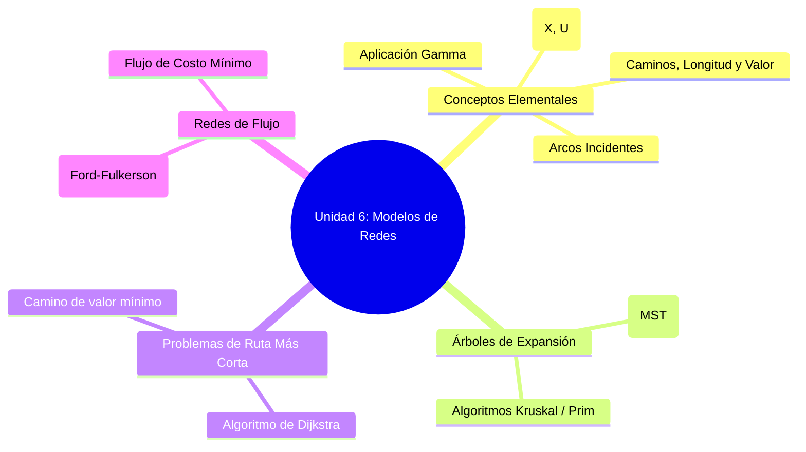
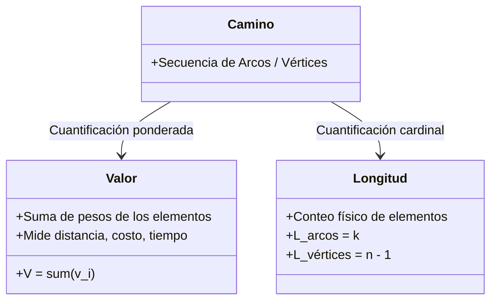

---
aliases:
  - intro Redes
subject: IOP
year: "4"
exam: PARCIAL2
unit: "6"
type: TEO
zk_type: fleeting
status: in-progress
date: 2026-08-18
source:
  - https://www.youtube.com/watch?v=tUx67DUAVvU&list=PLYZrqm_pzRul0t_2QKU2kdHDwGkKblutk&index=23
  - "[[P2-U06-T01 IOP]]"
tags:
---
---

|     |                                                                                                                                                                                                                                                                                                                                       |
| --- | ------------------------------------------------------------------------------------------------------------------------------------------------------------------------------------------------------------------------------------------------------------------------------------------------------------------------------------- |
|     | **Material de estudio**: capítulo Nº 9 Puntos 1 a 4  [[CAP9-1_4.pdf]]   y capítulo Nº 5  del libro _[Apoyo Cuantitativo a las Decisiones](https://uv.frc.utn.edu.ar/mod/page/view.php?id=551724 "Apoyo Cuantitativo a las Decisiones")_   Se **excluyen** del capítulo Nº 5 los temas: Transporte Asignación y Transbordo |

Introducción a los Modelos de Redes
https://www.youtube.com/watch?v=kZxCetFmfP8&time_continue=1&source_ve_path=MjM4NTE&embeds_referring_euri=https%3A%2F%2Fuv.frc.utn.edu.ar%2F&embeds_referring_origin=https%3A%2F%2Fuv.frc.utn.edu.ar

Conceptos Básicos de Redes
https://www.youtube.com/watch?v=Ao92GmfdTts

> [!INFO] Ficha de la Clase
> - **Materia:** Investigación Operativa (IOP)
> - **Unidad:** Unidad 6 – Modelos de Redes / Teoría de Grafos
> - **Clase:** T01 – Introducción a Redes y Conceptos Fundamentales
> - **Modalidad:** Taller interactivo de aprendizaje colaborativo + Exposición teórica formal

**Que es una red o grafo de red?**
un conjunto de nodos o vertices los cuales están unidos mediante un conjunto de trayectorias

![[Pasted image 20260823191018.png|542]]

# Modelos de redes

## Modelo de transporte
0consiste en tener un conjunto de fábricas que producen algún bien y un conjunto de clientes que demandan este tipo de unidades la idea fundamental consiste en que cada planta puede enviar artículos a cada uno de los clientes y el problema consiste en determinar cuántos artículos debe enviar cada fábrica a cada cliente para que el costo de transporte sea el más económico
![[Pasted image 20260823191215.png|361]]
### Generalización: modelo de transbordo
contempla la posibilidad de que puedan existir centros de distribución hacia donde las plantas envían sus productos y estos centros de distribución realizan los envíos de los artículos las a sus clientes 
![[Pasted image 20260823191341.png|417]]
pueden existir diferentes variantes en el modelo por ejemplo que exista la posibilidad de que las plantas puedan enviar artículos directamente a algunos de sus clientes

![[Pasted image 20260823191356.png|426]]

## [[Problema de la ruta mas corta]]
este problema consiste en seleccionar dos nodos digamos a y un nodo b y obtener la ruta más corta para unir ambos nodos
![[Pasted image 20260823191531.png|387]]

## Problema de [[Árbol de expansion minima]]
consiste en tender una red de tamaño mínimo que logre unir a todos los nodos si lo piensas un momento te darás cuenta de que este problema tiene múltiples aplicaciones por ejemplo en la construcción es muy utilizada cuando se tienden las conexiones de energía eléctrica dentro de los edificios y se desea minimizar la cantidad de cable a utilizar o bien cuando se construyen gaseoductos desde los campos petroleros y el combustible puede tener diferentes destinos
![[Pasted image 20260823191744.png|366]]

## problema de la gente viajero de s&p
el problema consiste en diseñar una ruta que visite todos los nodos de la red y pase únicamente una vez por cada nodo la idea es que el nodo inicial sea a su vez el nodo final este problema ha generado una infinidad de estudios y existen nueve diferentes formulaciones para el problema sin embargo aún no ha podido ser resuelto de forma eficiente el problema es tan retador e interesante en su resolución que existen páginas en la red libros y múltiples artículos dedicados a él yo te recomendaría visitar esta página y navegar en ella
![[Pasted image 20260823192004.png|393]]

## problema de flujo maximo
cada trayectoria tiene una capacidad máxima de flujo y es importante determinar el máximo de unidades que pueden ser transportadas de un nodo a , a un nodo b

## problema de la ruta critica (perth cpm)
este tipo de problemas nos puede ser útil para la realización de diferentes proyectos básicamente sirve para identificar cuáles actividades necesitan terminar en tiempo para no sufrir atrasos en la entrega de los proyectos o bien también puede indicarnos qué actividades podemos comprimir para tratar de terminar el proyecto en el menor tiempo posible al menor costo

---

# Aclaraciones conceptuales clave:
1. **Vértices / Nodos ($X$):** No basta con decir "los vértices son nodos". Formalmente, $X$ es un conjunto finito de elementos que representan entidades reales (ciudades, máquinas, intersecciones), modelados geométricamente como puntos en el plano.
2. **Arcos / Conexiones ($U$):** Representan una **relación binaria** entre pares de elementos de $X$. Es un subconjunto del producto cartesiano $X \times X$.
3. **Producto Cartesiano ($X \times X$):** Es el conjunto de todos los pares ordenados posibles $(x_i, x_j)$. Como es un *par ordenado*, el orden importa: $(x_i, x_j) \neq (x_j, x_i)$.
4. **Red Orientada vs. No Orientada:**
   - *Orientada (Dirigida):* Los arcos tienen sentido de dirección (flechas).
   - *No Orientada:* Los arcos son aristas bidireccionales sin orientación prefijada.
5. **Red Conexa:** Una red es conexa si existe al menos una conexión o camino (directo o indirecto) entre cualquier par de nodos.
6. **Ciclo / Circuito vs. Bucle:**
   - *Ciclo / Circuito:* Camino cerrado donde el vértice de inicio coincide con el vértice de fin tras transitar por varios arcos distintos.
   - *Bucle (Lazo):* Arco que conecta un nodo consigo mismo $(x_i, x_i)$.
7. **Formas de Representación:**
   - *Gráfica:* Diagrama topológico de nodos y flechas/aristas.
   - *Matricial:* Matriz de adyacencia/incidencia con valores binarios ($1$ si existe arco entre $x_i$ y $x_j$, $0$ si no).
![[Pasted image 20260824112236.png|560]]

1. **Camino (mu)**
	 un camino es una secuencia de arcos de la red con la condición de que para cualquier arco del camino su vértice final debe coincidir con el vértice inicial del siguiente.
  2. **valor de un arco v(x_i;x_j**
	  1. es un número real asociado al arco y que representa según la naturaleza del problema una distancia un costo tiempo etcétera. En el ejemplo podemos identificar varios caminos y los nombramos con la letra griega núm
![[Pasted image 20260824113025.png]]
3. **Valor de un camino por los arcos**
	1. ![[Pasted image 20260824113051.png|452]]
	2. el del camino verde por ejemplo seria igual a 12
4. Valor de un camino por los vertices
	1. solo se puede hcaer si los vertices tienen valores![[Pasted image 20260824134510.png|378]]
##  Definiciones Formales
### RED

Existen dos formas canónicas de definir rigurosamente una red:

#### A) Definición por Par de Conjuntos: $R = (X, U)$
$$R = (X, U)$$
- $X = \{x_1, x_2, \dots, x_n\}$: Conjunto finito y no vacío de vértices o nodos ($|X| \ge 2$).
- $U \subseteq X \times X$: Conjunto de pares ordenados $(x_i, x_j)$ denominados **arcos**, donde $x_i \in X$ (vértice inicial) y $x_j \in X$ (vértice final).
![[Pasted image 20260824112600.png|326]]

---

### Arcos Incidentes
Para un nodo particular $x_i$:
- **Arcos Incidentes hacia el Exterior ($U^+(x_i)$):** Conjunto de arcos que **salen** de $x_i$ (donde $x_i$ es origen).
$$U^+(x_i) = \{ (x_i, x_j) \in U \}$$
- **Arcos Incidentes hacia el Interior ($U^-(x_i)$):** Conjunto de arcos que **llegan** a $x_i$ (donde $x_i$ es destino).
$$U^-(x_i) = \{ (x_j, x_i) \in U \}$$

> [!NOTE] Ejemplo
> Si de un nodo $x_1$ parten arcos hacia $x_2, x_3, x_4$ y no le llega ninguno:
> - $U^+(x_1) = \{(x_1, x_2), (x_1, x_3), (x_1, x_4)\}$
> - $U^-(x_1) = \emptyset$

### Distinción Fundamental: Valor vs. Longitud de un Camino
El docente hace especial énfasis en no confundir estos dos conceptos:

$$
\begin{array}{|l|c|c|}
\hline
\textbf{Concepto} & \textbf{Por los Arcos} & \textbf{Por los Vértices} \\
\hline
\textbf{Valor del Camino } (V) & V = \sum_{u \in C} \text{valor}(u) & V = \sum_{x \in C} \text{valor}(x) \\
\hline
\textbf{Longitud del Camino } (L) & L = \text{Cantidad total de arcos} & L = \text{Cantidad de vértices} - 1 \\
\hline
\end{array}
$$

> [!IMPORTANT] ¿Cuándo coinciden Valor y Longitud?
> El **Valor** de un camino será igual a su **Longitud** **únicamente si todos los arcos (o vértices) tienen peso unitario ($v = 1$)**. En cualquier otro escenario son conceptos totalmente independientes.

