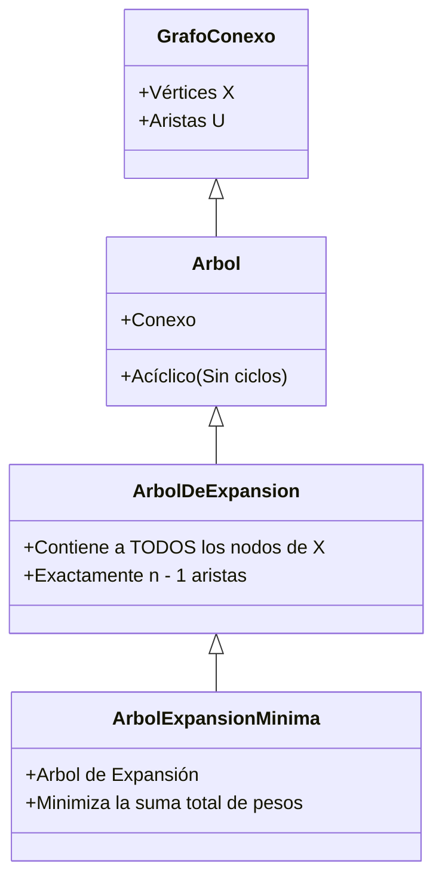
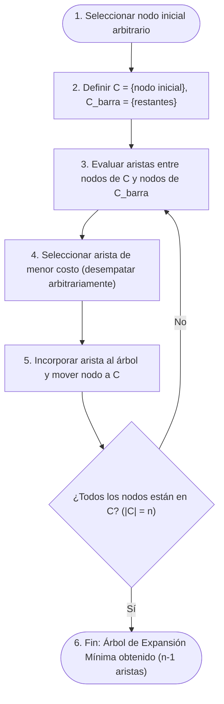
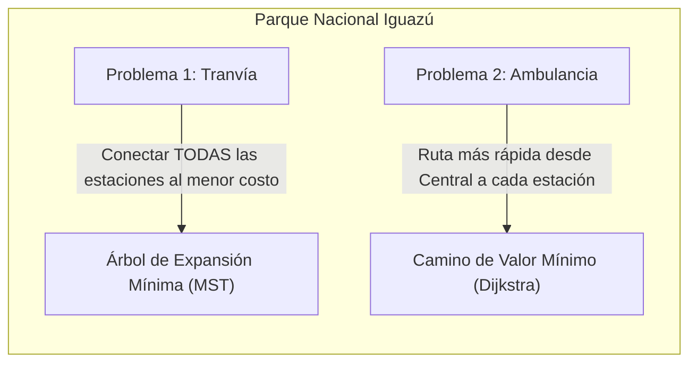
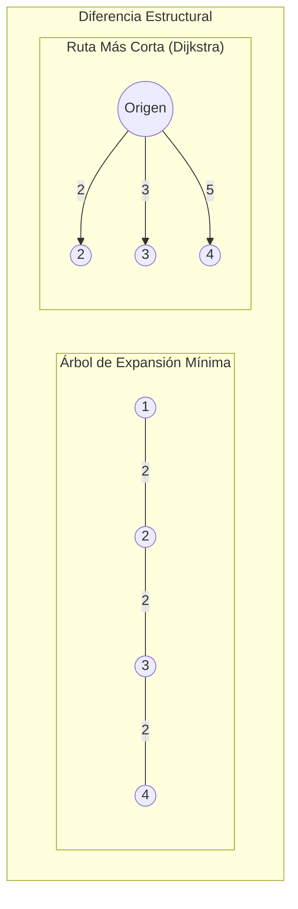
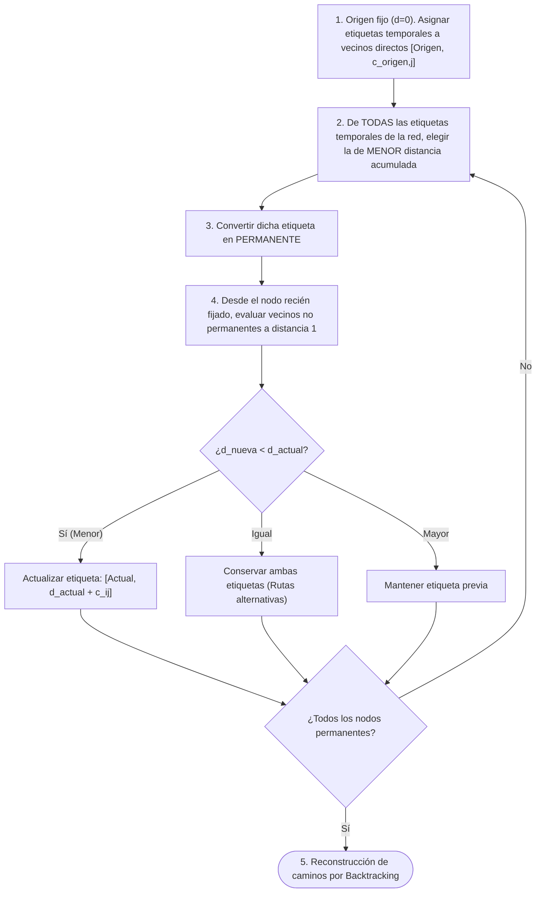
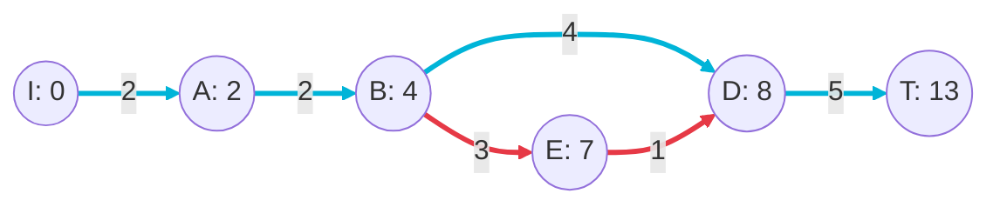

---
aliases:
subject: IOP
year: "4"
exam: PARCIAL2
unit: "6"
type: TEO
zk_type: fleeting
status: in-progress
date: 2026-08-18
source:
  - "[[P2-U06-T02 IOP]]"
tags:
---
---
Árbol de Expansión
https://www.youtube.com/watch?v=3pthagBmcGE

otro video arbol de expansion: https://www.youtube.com/watch?v=KsPEHo4WAZU&t=1s

Camino de valor mínimo: https://www.youtube.com/watch?v=bjUFXRHGExU

> [!INFO] Ficha de la Clase
> - **Materia:** Investigación Operativa (IOP)
> - **Unidad:** Unidad 6 – Modelos de Redes
> - **Clase:** T02 – Árbol de Expansión Mínima (MST), Principio de Bellman y Algoritmo de Dijkstra
> - **Modalidad:** Exposición conceptual + Taller grupal en Jamboard + Formalización algorítmica

---

# Conceptos
*Subred:*
	dada una red g una subred de g incluye un subconjunto de nodos y ligaduras de g 

*Arbol*:
	un árbol es una subred conexa que no contiene ciclos no dirigidos

Arbol de expansion:
	Un Arbol de expansion es una subred conexa que incluye a todos los nodos de la red y no contiene ciclos no dirigidos
	Si la red tiene $n$ nodos, cualquier árbol de expansión tendrá exactamente $n-1$ ligaduras.

- **Árbol de Expansión Mínima (*MST - Minimum Spanning Tree*):** Es aquel árbol de expansión cuya suma total de pesos/costos en sus ligaduras es mínima:
$$\min \sum_{(i,j) \in T} c_{ij}$$

> [!IMPORTANT] Clave de Examen
> En una red pueden existir múltiples árboles de expansión. El objetivo del problema del MST es hallar aquel (o aquellos) cuyo costo acumulado global sea el menor posible.

# Algoritmo para hallar el arbol de expansion minima
## problema
en una zona rural de la provincia se llevará a cabo una obra de autovías en rutas que actualmente son de tierra o están pavimentadas al gobierno de la provincia le interesa seleccionar los tramos a construir de manera que todas las ciudades estén conectadas por una autoría sobre cada tramo de ruta se colocó el costo de construcción expresado en millones de dólares
![[Pasted image 20260824132752.png|475]]

## algoritmo
Para resolver el problema del MST se presenta un algoritmo constructivo de tipo **voraz (*greedy*)** (equivalente al algoritmo de Prim).

### Pasos del Algoritmo:
1. **Selección de inicio:** Se elige un nodo cualquiera de forma arbitraria (independientemente del nodo elegido, se llega al mismo costo mínimo óptimo).
2. **Partición de nodos:**
   - $C$ (**Nodos Conectados / "Rojos"**): Conjunto de nodos ya integrados al árbol.
   - $\bar{C}$ (**Nodos No Conectados / "Azules"**): Conjunto de nodos aún no conectados.
3. **Selección voraz de arista:** Se identifican todas las aristas que unen algún nodo de $C$ con algún nodo de $\bar{C}$. Se selecciona la arista de **menor peso/costo**.
4. **Actualización:** El nuevo nodo se transfiere de $\bar{C}$ a $C$, y la arista seleccionada se incorpora formalmente al MST.
5. **Resolución de empates:** Si existen varias aristas con el mismo costo mínimo admisible, se elige cualquiera arbitrariamente (lo que puede originar árboles de expansión mínima alternativos con igual costo óptimo).
6. **Criterio de parada:** El proceso finaliza cuando $\bar{C} = \emptyset$ (todos los $n$ nodos conectados mediante $n-1$ aristas).

> [!TIP] Organización Mental y Explicación
> El docente resalta que no alcanza con saber codificar o ejecutar mecánicamente el algoritmo; es fundamental saber explicar con claridad su lógica paso a paso, su estructura de conjuntos y el criterio voraz de selección.

## Resolucion
![[Pasted image 20260824140657.png]]

generalizacion de este tipo de problema
![[Pasted image 20260824140846.png]]

en este caso:
Cual es el objetivo?
el objetivo es lograr una red en la cual todos los nodos estén conectados y que la suma de las ligaduras que los conectan sea de mínimo costo y que tenga n-1 ligaduras

# Caso de Estudio: Parque Nacional Iguazú
Se presenta un problema real del parque que ilustra la necesidad de diferenciar dos problemas de optimización sobre una misma infraestructura topológica:

### Enunciado:
- **Infraestructura:** Red de calzadas y estaciones turísticas. Cada tramo posee dos métricas:
  1. *Distancia en kilómetros:* valor indicado **entre paréntesis** $(km)$.
  2. *Costo de construcción en cientos de miles de pesos:* valor indicado **fuera del paréntesis** (no proporcional a la distancia debido a irregularidades topográficas).
- **Requerimiento 1 (Tranvía):** Construir vías para que personas con movilidad reducida puedan visitar **todas las estaciones** del parque minimizando el **costo total de construcción**.
- **Requerimiento 2 (Ambulancia):** Diseñar las rutas de **menor distancia / tiempo** de respuesta desde la **Estación Central** hacia **cada una de las restantes estaciones** ante una emergencia.
![[Pasted image 20260824142304.png|452]]

## Requerimiento 1
![[Pasted image 20260824142206.png]]
![[Pasted image 20260824143013.png]]
32x100.000 = 3.200.000 Costo de la red de vias
## Requerimiento 2 (todavia no lo podriamso resolver)
![[Pasted image 20260824142233.png]]

# TEOREMA DE OPTIMIDAD
 existe un principio muy importante en el que se basan los algoritmos para encontrar caminos de valor óptimo este e **Principio o Teorema de Optimalidad de Richard Bellman**.
### Enunciado del Teorema:
> *Si un camino $P^*$ que une un nodo origen $1$ con un nodo destino $k$ es de valor óptimo (mínimo o máximo), entonces cualquier subcamino $P^*_{ij}$ que una dos nodos intermedios $i$ y $j$ pertenecientes a $P^*$ es también un camino de valor óptimo entre $i$ y $j$.*

![[Pasted image 20260824114101.png]]
por ejemplo busquemos el camino de valor mínimo que une el vértice 1 con el 8 la duración del camino verde es de 12 la del camino rojo es de 14 y la duración del camino azul es de 15 es decir el camino verde es de menor duración si ahora consideramos el sub camino que une los vértices 1 y 6 según el teorema el camino verde debe tener menor duración que el rojo observen que la duración del camino verde que une el vértice 1 y el 6 es de 7 y la duración del camino rojo entre esos dos vértices es de 9 es decir el camino verde es el de duración mínima entre esos dos vértices 

otro ejemplo
![[Screencast_20260824_150449.webm]]

# Problema de la ruta mas corta y Algoritmo de Dijkstra
### 5.1. Concepto y Objetivo
- **Propósito:** Hallar el camino de valor mínimo (distancia, costo o tiempo) entre un **nodo origen** y **todos los demás nodos de la red**.
- **Diferencia con MST:**
  - El MST busca conectar **toda la red** con el mínimo costo global (sin privilegiar ningún nodo en particular).
  - Dijkstra busca la **distancia mínima punto a punto** desde un origen específico hacia cada nodo de destino.
  - ![[Pasted image 20260824152808.png|277]]

---

### 5.2. Mecánica del Algoritmo de Dijkstra (Método de Etiquetas)

A cada nodo $j$ de la red se le asocia una etiqueta de dos componentes, Excepto al nodo origen:
$$[\text{Predecesor } (p_j), \text{ Distancia Acumulada } (d_j)]$$

- **$p_j$:** Nodo inmediatamente anterior por el cual se llega a $j$ en la ruta óptima.
- **$d_j$:** Distancia total acumulada desde el nodo origen hasta $j$.
![[Pasted image 20260824153006.png]]
#### Tipos de Etiquetas:
1. **Etiquetas Temporales:** Valores provisionales que pueden actualizarse (relajarse) si se descubre una ruta más corta.
2. **Etiquetas Permanentes:** Valores óptimos definitivos e inmutables que representan la distancia mínima garantizada desde el origen.

---

### 5.3. Pasos Detallados del Algoritmo

1. **Inicialización:**
   - El nodo origen se fija como permanente con distancia $0$.
   - A todos los nodos adyacentes al origen se les asigna una etiqueta temporal: $[Origen, c_{Origen, j}]$.
2. **Fijación de la mínima etiqueta temporal:**
   - Se examinan **todas** las etiquetas temporales existentes en la red.
   - Se selecciona el nodo con la **menor componente de distancia acumulada** y su etiqueta pasa a ser **permanente**.
   - Los empates se resuelven arbitrariamente.
3. **Actualización / Relajación de vecinos:**
   - Desde el nodo recién fijado $i$, se analizan todos sus vecinos $j$ que aún tengan etiqueta temporal.
   - Se calcula la nueva distancia potencial: $d_{nueva} = d_i + c_{ij}$.
   - **Reglas de actualización:**
     - Si $j$ no tenía etiqueta: se le asigna $[i, d_{nueva}]$.
     - Si $d_{nueva} < d_j$: se reemplaza la etiqueta por $[i, d_{nueva}]$.
     - Si $d_{nueva} = d_j$: **se conservan ambas etiquetas** $[p_j^{(1)}, d_j]$ y $[i, d_j]$ para registrar soluciones óptimas múltiples.
     - Si $d_{nueva} > d_j$: la etiqueta no se modifica.
4. **Iteración:** Se repiten los pasos 2 y 3 hasta que todos los nodos requeridos queden con etiqueta permanente.
5. **Reconstrucción del camino óptimo (*Backtracking*):**
   - Desde el nodo destino, se leen los predecesores en cadena inversa ($p_j \rightarrow p_{p_j} \rightarrow \dots \rightarrow Origen$).

---

### 5.4. Traza del Ejemplo de Clase

En el ejercicio esquemático resuelto por el profesor (nodo inicio $I \rightarrow$ nodo destino $T$):
![[Pasted image 20260824153838.png|543]]
EXPLICADO PASO POR PASO:
https://www.youtube.com/watch?v=bjUFXRHGExU

|      Nodo      | Etiqueta Final Permanente | Distancia Acumulada |  Nodos Predecesores  |
| :------------: | :-----------------------: | :-----------------: | :------------------: |
| **I (Inicio)** |         $[-, 0]$          |         $0$         |          —           |
|     **A**      |         $[I, 2]$          |         $2$         |         $I$          |
|     **B**      |         $[A, 4]$          |         $4$         |         $A$          |
|     **C**      |         $[I, 4]$          |         $4$         |         $I$          |
|     **E**      |         $[B, 7]$          |         $7$         |         $B$          |
|     **D**      |    $[B, 8]$ y $[E, 8]$    |         $8$         | $B$ ó $E$ *(Empate)* |
|  **T (Fin)**   |         $[D, 13]$         |      **$13$**       |         $D$          |

> [!NOTE] Rutas Óptimas Alternativas Obtenidas
> Gracias a conservar las etiquetas empatadas en el nodo $D$, se identifican **dos caminos de distancia mínima $13$**:
> 1. $\text{Ruta 1: } I \rightarrow A \rightarrow B \rightarrow D \rightarrow T \quad (2 + 2 + 4 + 5 = 13)$
> 2. $\text{Ruta 2: } I \rightarrow A \rightarrow B \rightarrow E \rightarrow D \rightarrow T \quad (2 + 2 + 3 + 1 + 5 = 13)$

---

## 6. Cuadro Comparativo: MST vs. Dijkstra

$$
\begin{array}{|l|l|l|}
\hline
\textbf{Criterio} & \textbf{Árbol de Expansión Mínima (MST)} & \textbf{Ruta Más Corta (Dijkstra)} \\
\hline
\textbf{Objetivo} & \text{Conectar todos los nodos al menor costo total} & \text{Minimizar la distancia/costo desde un origen a cada nodo} \\
\hline
\textbf{Estructura} & \text{Subgrafo acíclico de } n-1 \text{ aristas} & \text{Conjunto de caminos individuales desde la raíz} \\
\hline
\textbf{Dependencia de Raíz} & \text{Independiente (el árbol es global)} & \text{Dependiente del nodo origen seleccionado} \\
\hline
\textbf{Mecanismo} & \text{Elección de aristas mínimas entre } C \text{ y } \bar{C} & \text{Fijación de etiquetas acumuladas mínimas } [p_j, d_j] \\
\hline
\textbf{Ejemplo Típico} & \text{Tendido de vías de tranvía / cableado} & \text{Ruta de ambulancia ante emergencias} \\
\hline
\end{array}
$$

