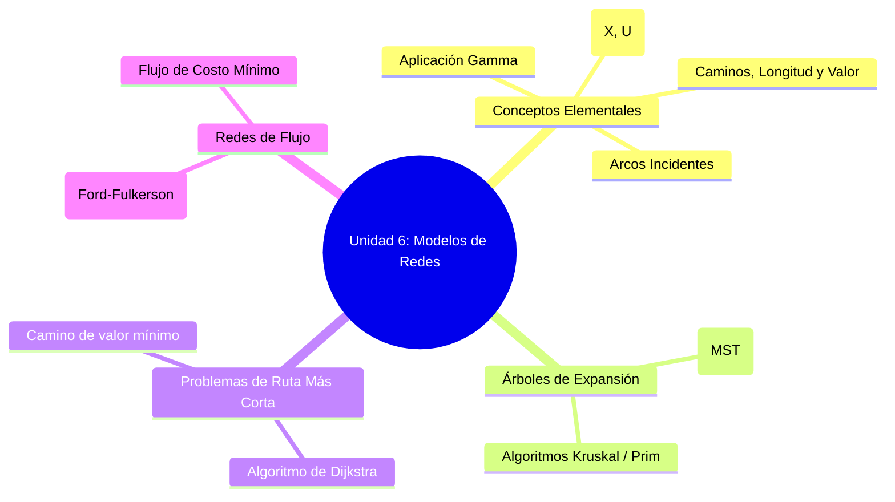
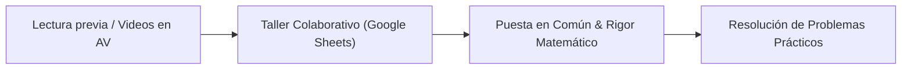
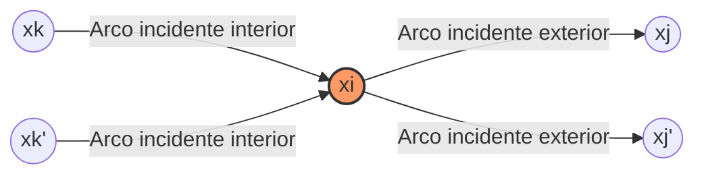
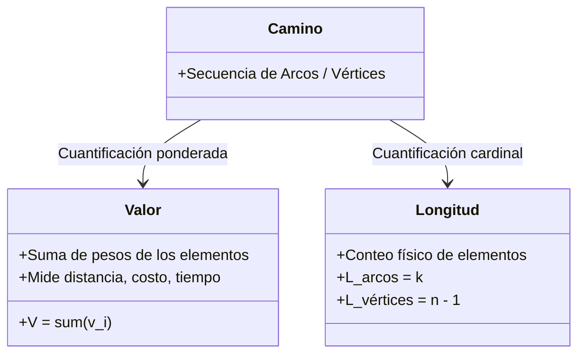

---
aliases:
subject: IOP
year: "4"
exam:
unit: "6"
type: Transcripcion
zk_type: resources
status: done
date: 2026-08-18
source:
  - https://www.youtube.com/watch?v=tUx67DUAVvU&list=PLYZrqm_pzRul0t_2QKU2kdHDwGkKblutk&index=23
tags:
---
---
0:00

0 segundos

lo que te dé con lo que es incremento o disminución

0:03

3 segundos

[Música]

0:04

4 segundos

por eso si si si tengo un una cota inferior que puede disminuir mi coeficiente hasta

0:13

13 segundos

menos 2 no está mal no es que estamos confundiendo unas cosas y disminuir hasta -2 y otra cosa

0:22

22 segundos

es disminuir en 2 claro a vos te van a pedir que cálculos incrementos y disminuciones no valores

0:30

30 segundos

del coeficiente mínimo y máximo claro me expresé mal yo quería decir el menos 2 o

0:37

37 segundos

sea el límite inferior digamos la disminución siempre iba a ir asociado un valor negativo

0:45

45 segundos

y así con la fórmula para dar un valor negativo en una disminución porque el

0:52

52 segundos

software de muestra después positivo claro el software te muestra en cuanto claro y eso es lo que vamos a tener que poner en cuanto fíjate que el problema

1:02

1 minuto y 2 segundos

que vimos y analizamos en todo el de las carteras inclusive tienen toda la solución

1:09

1 minuto y 9 segundos

y justamente estaba analizando un coeficiente negativo de la función objetivo

1:17

1 minuto y 17 segundos

de hecho lo hicimos lo trabajamos en clase

1:24

1 minuto y 24 segundos

no me acuerdo pero ahí está la solución pues está puesta toda la solución en el aula virtual

1:32

1 minuto y 32 segundos

bien gracias y alguna otra duda

1:45

1 minuto y 45 segundos

ninguna me imagino que todos les dieron lo que

1:54

1 minuto y 54 segundos

pusimos en la pestaña de parciales del protocolo de los parciales eso rige para

2:00

2 minutos

todos los pagar ciales por favor hay varios acá que están como

2:07

2 minutos y 7 segundos

invitados o sea que no están usando la cuenta oficial yo les voy a pedir en la

2:13

2 minutos y 13 segundos

medida de lo posible que utilicen la cuenta oficial son miguel calvo está como invitado

2:22

2 minutos y 22 segundos

si profe m no tiene forma de renovarla

2:40

2 minutos y 40 segundos

bueno picante porque hay algo que tenía un problema porque se los mandan mails de la facultad y si tienen la bandeja llena no le entra fíjate también los

2:49

2 minutos y 49 segundos

spam no perfecto sobre todo porque es por el

2:57

2 minutos y 57 segundos

examen final también necesitamos que estén conectados con la cuenta oficial si aprovechamos para para empezar para

3:06

3 minutos y 6 segundos

insistirá desde ya bien eso de recuperar esos mismos te

3:14

3 minutos y 14 segundos

llaman o no se agrega nada efe

3:23

3 minutos y 23 segundos

en el cálculo de intervalos de sensibilidad de una variable básica puede tener una cota que sea infinito

3:32

3 minutos y 32 segundos

de una variable básica si el coeficiente de una variable básica

3:44

3 minutos y 44 segundos

bien si no no tienen más preguntas lo que yo tenía pensado para hacer hoy es

3:50

3 minutos y 50 segundos

yo les prepare un archivo una hoja de cálculo y dentro de la hoja de cálculo van a

3:58

3 minutos y 58 segundos

encontrar que tienen distintos conceptos entonces eso lo que tenía pensado era use una hoja de cálculo porque es lo más

4:06

4 minutos y 6 segundos

cómodo para trabajar en grupo no que armaron los grupos y que se fijaron en los conceptos busquen en el libro ahí

4:14

4 minutos y 14 segundos

dicen que página del libro están y con sus palabras no copiando lo que dice en el libro sino escribiendo lo que

4:21

4 minutos y 21 segundos

entendieron está bien por supuesto que hay veces que el concepto es tan básico que no caben muchas diferencias en la

4:29

4 minutos y 29 segundos

forma de explicarlo me gustaría que lo lo ponga lo vayan escribiendo así después vemos y yo puedo analizar porque

4:38

4 minutos y 38 segundos

hay veces aunque usted no lo creen que cuando uno pregunta los conceptos básicos tienen algunos problemas al

4:45

4 minutos y 45 segundos

expresar lo sé así ya el lunes que viene comenzamos con árbol de expansión árbol de expansión

4:54

4 minutos y 54 segundos

mínima camino de valor mínimo el algoritmo de dijkstra y para la semana que viene sobre todo ustedes que tienen

5:02

5 minutos y 2 segundos

el lunes yo les voy a pedir que vean hay unos vídeos que ya están habilitados que habla justamente de la parte

5:11

5 minutos y 11 segundos

inicial de redes y de árbol de expansión para que trabajemos esta segunda parte

5:21

5 minutos y 21 segundos

del año vamos a hacer más trabajo con problemas está bien la primera parte del año cómo está toda la parte de

5:29

5 minutos y 29 segundos

programación lineal que es un que es como más dura más pesada quizás de entender por qué tiene demasiados

5:37

5 minutos y 37 segundos

conceptos o muchos conceptos y son difíciles de internalizar si un sin ayuda digamos

5:46

5 minutos y 46 segundos

y hemos trabajado más en clase los lunes con cosas teóricas y después prácticas en el caso de la segunda parte del año

5:53

5 minutos y 53 segundos

es como más práctica entonces lo que vamos a hacer es cada semana ustedes van a tener que ver un vídeo o leer algo y

6:00

6 minutos

vamos a trabajar con problemas siempre con problemas tanto los lunes como los miércoles estamos

6:11

6 minutos y 11 segundos

bien entonces no les voy a pasar un link ahora por el chat

6:18

6 minutos y 18 segundos

d una hoja de cálculo con la que vamos a trabajar

6:26

6 minutos y 26 segundos

para que vayan para que vayamos viendo los conceptos

6:34

6 minutos y 34 segundos

básicos si hay no es fácil si uno pregunta hasta que en el bar se las quite me entra en práctica lo que

6:42

6 minutos y 42 segundos

tuvimos el primer sería hasta programas soy una línea que a menudo engloba todos y por supuesto todo

6:53

6 minutos y 53 segundos

todo lo que es programación matemática realidad todo el primer semestre bien ahí les

7:00

7 minutos

pasen bien yo le le les abro las sesiones del grupo sí

7:07

7 minutos y 7 segundos

yo no recuerdo cuántas a ver cuántas hojas les abrí

7:14

7 minutos y 14 segundos

creo que eran 16 o 17 17 pero bien no sé qué voy a abrir 17 grupos estarían cosa

7:22

7 minutos y 22 segundos

de que cada grupo pueda usar una hoja así

7:33

7 minutos y 33 segundos

y les cuento algo quizás anecdóticos estaba haciendo esto

7:42

7 minutos y 42 segundos

durante la ocasión en un taller quedaba la ciencia económica la parte de

7:49

7 minutos y 49 segundos

agost el área pedagógica y saben que saben de que tratar el

7:56

7 minutos y 56 segundos

taller de cómo trabajar lo que se conoce como el aprendizaje

8:03

8 minutos y 3 segundos

colaborativo es decir los trabajos en utilizarlo aprendizaje colaborativo en la virtualidad con lo cual lo único que

8:11

8 minutos y 11 segundos

tuve que hacer de actividad fue contar lo que habíamos hecho con ustedes se acuerdan que trabajamos con el jamboree con nada

8:19

8 minutos y 19 segundos

con las hojas de cálculo no lo había puesto en práctica yo tenía todo claro

8:27

8 minutos y 27 segundos

eso ya lo había puesto en práctica que cómo estás trabajamos con la mit y tenemos habilitado todo lo que es de google y yo justamente había usado tanto

8:35

8 minutos y 35 segundos

jean board como una hoja de cálculo así que bueno tuve que lo único que tuve que hacer es contar sentarme escribir y

8:42

8 minutos y 42 segundos

contar lo que lo que habíamos hecho y mi sorpresa fue que había muchos profes de lo que estaban haciendo ahí

8:50

8 minutos y 50 segundos

que nunca lo habían habían estas experiencias y que fue grata para mí bueno entonces ahora les voy a crear los

8:58

8 minutos y 58 segundos

grupos así que después le voy a tener que completar todo esto después les voy a tener que hacer un pequeño tipo de

9:07

9 minutos y 7 segundos

encuesta digamos para ver si se les sirve si no es decir éste trabajar en grupos y con estos instrumentos

9:17

9 minutos y 17 segundos

bueno hay abrirlas de las salas usted es el que no pueda entrar porque no puede verla me avisa como hacemos

9:27

9 minutos y 27 segundos

siempre y yo lo paso a la sala

10:04

10 minutos y 4 segundos

y gracias con la bonanza

10:13

10 minutos y 13 segundos

hola útil

10:46

10 minutos y 46 segundos

igualmente podemos entrar en la pestaña me parece a la once no es por cada grupo

10:56

10 minutos y 56 segundos

mira

11:03

11 minutos y 3 segundos

[Música]

18:13

18 minutos y 13 segundos

[Música]

42:24

42 minutos y 24 segundos

bueno chicos como veo que muchos terminaron delante se vamos a cerrar la sesión si repasamos lo que es lo que

42:33

42 minutos y 33 segundos

pusieron

42:36

42 minutos y 36 segundos

[Música]

43:24

43 minutos y 24 segundos

bueno creo que ya volvieron los que quedamos no e

43:34

43 minutos y 34 segundos

yo estaba mirando no me di cuenta de que darles una casilla de verificación al principio para ir viendo para que me avisaran quienes habían terminado o no

43:43

43 minutos y 43 segundos

yo estuve revisando y si bien es cierto que les puse que no escribieran con sus palabras y después les puse que la

43:52

43 minutos y 52 segundos

definición de re tratarán de hacerlo formal por el hecho de que después no se aprovechó de tener que tener presente

43:59

43 minutos y 59 segundos

que es lo que tengo que definir cuando defino la red está bien cuando le pusieron con su palabra está perfecto porque eso a mí me me da

44:08

44 minutos y 8 segundos

cuenta de que ustedes entendieron que es una red pero también después les puse la definición fue normal como para que se

44:15

44 minutos y 15 segundos

acostumbren a tener la presencia cuál es la definición hay hay más de una forma de definir la red inclusive si ustedes

44:23

44 minutos y 23 segundos

en el libro se fijan hay una que está definida a través de él para ordenado de kivú que la que la mayoría puso y la otra es a través de una aplicación gama

44:32

44 minutos y 32 segundos

depende y como uno la vaya a usar por ahí conviene definir la de una manera o de otra

44:41

44 minutos y 41 segundos

pero está bien o sea este era un ejercicio para que ustedes para remitirlos en realidad a que lean esta

44:49

44 minutos y 49 segundos

parte en el libro sí porque son conceptos realmente básicos ustedes van que se habrán dado cuenta que algunos

44:57

44 minutos y 57 segundos

que se fue se definen muy fácilmente y son muy intuitivos pero hay que tenerlos presentes porque hay que tenerlos presentes porque después cuando nosotros

45:06

45 minutos y 6 segundos

hablemos de árbol de expansión por ejemplo vamos a tener que decir que es un árbol de expansión es una subred de

45:14

45 minutos y 14 segundos

una redada que es conexa sí y que no tiene ciclos entonces yo tengo que tener presente que ustedes saben qué significa

45:23

45 minutos y 23 segundos

eso les cuento que hay veces que cuando pido que lo definan en lugar de conexión me pueden conversar que no no tiene nada

45:31

45 minutos y 31 segundos

que ver con esta es de conexión sí entonces por eso en este año dije bueno vamos a preguntar un poco vamos a

45:40

45 minutos y 40 segundos

hacerlo trabajar un poquito para que lean cuáles son los conceptos en esa era la idea

45:49

45 minutos y 49 segundos

pero algunos aparecen con colorcito como le ponen el colorcito acá en la hoja

45:57

45 minutos y 57 segundos

clic derecho y cambiar color en la pestaña de la hoja

46:06

46 minutos y 6 segundos

y viendo que todos los días uno aprende algo nuevo con respecto de todo con respecto a esta hoja de cálculo que yo no las uso casi nunca pero tiene muchas

46:14

46 minutos y 14 segundos

cosas buenas así que esto después lo que les queda a ustedes es porque ustedes van se quedan con el

46:23

46 minutos y 23 segundos

link entonces si ustedes completan bien las definiciones les cuento que este trabajo en algunos años lo que hemos hecho después ganarles y creo que

46:31

46 minutos y 31 segundos

todavía está hay un glosario entonces que fueran poniéndoles definición en el glosario pero como por ahí no no las

46:39

46 minutos y 39 segundos

ponen entonces bueno dije este año lo voy a hacer trabajar esta forma entonces a ustedes les queda este link y ustedes pueden ir consultando los que son

46:48

46 minutos y 48 segundos

conceptos básicos que justamente los glosarios se arman con los conceptos básicos

46:56

46 minutos y 56 segundos

vamos a ir pasando quieren que vayamos repasando algunas de las definiciones

47:03

47 minutos y 3 segundos

bueno profesor yo voy a proyectar así vamos viendo

47:11

47 minutos y 11 segundos

si me dan un segundo

47:12

47 minutos y 12 segundos

[Música]

47:21

47 minutos y 21 segundos

bien si yo paso de hoja ustedes ven el pasaje de hoja

47:32

47 minutos y 32 segundos

chicos no sabemos si están viendo la hoja 1 ahí

47:38

47 minutos y 38 segundos

hasta la bajada no les pregunto por qué a veces como es por ahí tengo que usar la mitad

47:47

47 minutos y 47 segundos

y esta que es eso por ahí son diferentes las formas de cómo se proyectan y cómo pasamos por ahí si paso a otro

47:56

47 minutos y 56 segundos

se me queda en el anterior entonces bueno acá este no trabajó con nadie

48:02

48 minutos y 2 segundos

vamos a ver el 26 concepto de red con un parking tal que x conjunto finito

48:11

48 minutos y 11 segundos

de elementos que se llaman vértices y un representa la relación binaria vértice y arcos vértices son nodos y

48:21

48 minutos y 21 segundos

arcos conexiones entre estos bares acá vértices y nodos son sinónimos entonces

48:28

48 minutos y 28 segundos

si yo pongo vértices son nodos no me dice nada lo que uno debería de decir por ejemplo

48:35

48 minutos y 35 segundos

es que los vértices permitan representan cada elemento del

48:44

48 minutos y 44 segundos

conjunto x está representado por un vértice o nodo o sea a eso se refiere y

48:51

48 minutos y 51 segundos

gráficamente yo lo representó por un punto en el plano sí se entiende arcos son las conexiones si

48:59

48 minutos y 59 segundos

te vienen y representan las relaciones que existen entre los vértices del conjunto x

49:05

49 minutos y 5 segundos

o sea que uno la podría completar así arcos incidentes y el interior es el exterior y se indica la orientación del

49:12

49 minutos y 12 segundos

camino entre los garantices está bien pero cuando yo digo arcos incidentes hacia el interior cuál es la orientación

49:19

49 minutos y 19 segundos

y si digo hacia el exterior cuál es la orientación o sea cuál es el vértice inicial y cuál

49:26

49 minutos y 26 segundos

es el final reorientada tiene los recursos caminos

49:34

49 minutos y 34 segundos

entre vértices tienen sentido sí o sea lo diríamos que los arcos están orientados tienen sentido konex a todos

49:42

49 minutos y 42 segundos

los nodos están conectados entre sí si circuito ciclo es muy simple o sea tenemos el mismo vértice inicial de

49:51

49 minutos y 51 segundos

final lo que sí hay que tener en cuenta qué uno lo ve diferente

49:59

49 minutos y 59 segundos

se trata de una red orientada o no orientada porque si es una red orientada tiene que empezar y terminar el mismo vértice si

50:07

50 minutos y 7 segundos

puede estar conectada pero que no tengan la orientación no se haría un circuito sino si no si no puedo iniciar y

50:14

50 minutos y 14 segundos

terminar el mismo vértice camino por los arcos

50:22

50 minutos y 22 segundos

una red es una sucesión de arcos del grafo con la condición de que para cualquier algo el camino de su vértice final debe ir con el inicial del

50:31

50 minutos y 31 segundos

siguiente está bien también hay dice el caso particular el

50:40

50 minutos y 40 segundos

circuito o los vértices acá están confundiendo un poquito lo que

50:52

50 minutos y 52 segundos

es la definición del camino por los vértices con la definición de que desde que hice un camino por los vértices la cantidad de vértices por la longitud del

51:01

51 minutos y 1 segundo

camino algo que yo no les puse ahí no me di cuenta de poner el concepto de longitud longitud en el camino por los

51:08

51 minutos y 8 segundos

arcos es la cantidad de arcos que componen el camino y en camino por los vértices es la cantidad de caminos menos uno

51:16

51 minutos y 16 segundos

chain allí habría que corregir esta definición

51:23

51 minutos y 23 segundos

valor de un arco es número real que representa algo

51:30

51 minutos y 30 segundos

y en un vértice también cuando hay muchas veces una pregunta muy común que me suelen hacer bueno pero cuando uso

51:39

51 minutos y 39 segundos

camino por los arco y cuando uso camino por los vértices el hecho de ser camino es por los arcos o camino por los vértices o valor de un arco o valor de

51:47

51 minutos y 47 segundos

un vértice depende del problema que yo esté representando con una red

51:52

51 minutos y 52 segundos

si por ejemplo yo represento una ruta yo voy a usar el camino por los arcos si

52:00

52 minutos

es que a mí me interesa por ejemplo la distancia entre una ciudad y otra o lo que yo gasto al salir de una ciudad a

52:07

52 minutos y 7 segundos

otra si yo estoy representando un proceso productivo y estoy considerando las máquinas que intervienen y el tiempo

52:16

52 minutos y 16 segundos

de procesamiento en cada máquina por ejemplo entonces me van a interesar el valor del vértice si es que yo

52:25

52 minutos y 25 segundos

represento cada máquina con un bar dice y los arcos van a representar la relación sea cuando va por una máquina cuando va por la otra y aunque se

52:33

52 minutos y 33 segundos

acuerden sí pero lo que yo ni me interesa por ejemplo es el valor del vértice porque yo analizo el tiempo de

52:40

52 minutos y 40 segundos

procesamiento del producto el valor del camino está bien

52:52

52 minutos y 52 segundos

en tres no hay nada en cuatro

53:02

53 minutos y 2 segundos

y voy leyendo no sé si ustedes van leyendo también lo que dice la idea sería que ustedes también vayan leyendo

53:09

53 minutos y 9 segundos

y si encuentran algo que no les cierra lo hablamos chicos así que hagamos una discusión

53:20

53 minutos y 20 segundos

se entiende que participamos todos okay profert

53:30

53 minutos y 30 segundos

profe relación binaria entre los elementos del conjunto x que se refiere eso que uno a uno

53:38

53 minutos y 38 segundos

binaria es entre dos elementos si representa la relación entre xy lic y j

53:47

53 minutos y 47 segundos

se entiende por eso en relación binaria de a dos o sea es aún cuando ese equipo

53:54

53 minutos y 54 segundos

es la cantidad la un la ub un conjunto de pares ordenados que representan la relación entre los

54:03

54 minutos y 3 segundos

elementos de x es una relación binaria porque es de uno a uno está representando un par en el x

54:11

54 minutos y 11 segundos

el arq el vértice xy con el xj está representando la relación que existe se entiende

54:35

54 minutos y 35 segundos

bien por ejemplo acá está puesta la de arcos incidente sí o sea cuáles sí hacia el exterior cuál es el vértice inicio de

54:43

54 minutos y 43 segundos

vigencia el interior que es el vértice final cx y si yo estoy hablando arcos incidentes hacia el interior de equipo

54:52

54 minutos y 52 segundos

hacia el exterior de xy

55:06

55 minutos y 6 segundos

sería como va la flecha no sé si sean de anda lo de arcos incidentes hacia el interior

55:14

55 minutos y 14 segundos

desde el exterior se entiende eso chicos sí sí sí al principio me había costado

55:23

55 minutos y 23 segundos

pero le había costado claro por ahí yo no lo veo gráficamente te das cuenta más rápidamente y superaba con carencias con

55:32

55 minutos y 32 segundos

algunos conceptos así básicos si quieren se los muestro y por ahí algunos

55:38

55 minutos y 38 segundos

conceptos justamente los pongo con un dibujo para que se vea mejor

55:49

55 minutos y 49 segundos

acá por ejemplo en esta cuando se les puede dar la definición formal me dicen para ordenar de kivú con x conjunto de

55:58

55 minutos y 58 segundos

vértices you relaciones pero ahí no define cómo son los conjuntos sea x un conjunto de elementos

56:06

56 minutos y 6 segundos

x1x de quién es un conjunto de pares ordenados de los elementos de x si ustedes ven

56:15

56 minutos y 15 segundos

bien la definición de conformar en el libro fíjense dice es un conjunto de pares ordenados xx cotas que pertenecen

56:22

56 minutos y 22 segundos

al producto cartesiano de x consigo mismo que es un subconjunto que se acuerda lo que era un conjunto producto

56:30

56 minutos y 30 segundos

de asia no o no

56:38

56 minutos y 38 segundos

chicos yo no era como la combinación de todos los elementos de los conjuntos algo así el producto carteles ya no se formaba

56:47

56 minutos y 47 segundos

con todos los padres ordenados que se puedan formar con los elementos del conjunto dado o sea si yo que tengo el

56:54

56 minutos y 54 segundos

conjunto que están formado por él por ejemplo 1 2 y 3 el producto caracteres ya no se haría todos los pares ordenados

57:03

57 minutos y 3 segundos

que se pueden formar con esos dos con esos tres elementos y el 11 al 12 el 13 el 21 22 23 entre todos los con los

57:12

57 minutos y 12 segundos

pares ordenados que se puedan formar y recuerden que es par ordenado porque se tiene en cuenta o sea el par 21 por

57:20

57 minutos y 20 segundos

ejemplo no es igual al par 12 sí se entiende uno tratando de explicárselo

57:28

57 minutos y 28 segundos

si bien creo lo digamos para que lo entiendan cien

57:45

57 minutos y 45 segundos

torno se encuentra orientadas 2

58:15

58 minutos y 15 segundos

también puede existir un ciclo cuando después de transiciones por varios caminos distintos se puede volver el

58:21

58 minutos y 21 segundos

inicial no no lo entiendo no entendí bien la diferencia

58:28

58 minutos y 28 segundos

eso profe porque puede haber una flechita hacia el mismo lado supongamos el nodo vial no pueden haber

58:37

58 minutos y 37 segundos

varios caminos de ave de ac/dc se vuelve a ser claro que va de 1 a sí mismo no

58:47

58 minutos y 47 segundos

solemos llamar bucle no se hace pero como decía después de transitar por

58:54

58 minutos y 54 segundos

varios caminos distintos sería por varios arcos

59:02

59 minutos y 2 segundos

quería tratar de entender cómo lo habían puesto

59:32

59 minutos y 32 segundos

lo que acá en éste no podía demostrarles ir a las representa cómo puedo representar de una red una red la puedo representar gráficamente haciendo

59:40

59 minutos y 40 segundos

coincidir a cada vértice con un punto en el plano y cada arco o sea cada para ordenador es un arco que puede ser

59:49

59 minutos y 49 segundos

orientado o no y así puedo representar la red y ustedes también deben saber por qué lo han visto en otras materias que

59:56

59 minutos y 56 segundos

lo podemos representar con una matriz donde aparecerán todos 0 1 1 si existe la relación entre el vértice kyi x costa

1:00:05

1 hora y 5 segundos

y 0 si no existe esa relación se acuerdan de eso si o no

1:00:15

1 hora y 15 segundos

y yo les dejo ustedes van a ir cada grupo si quiere va a ir corrigiendo

1:00:22

1 hora y 22 segundos

afinando las definiciones que han puesto así las tienen después y yo les voy a mostrar ahora unas transparencias y

1:00:30

1 hora y 30 segundos

hacemos un breve repaso de esto y así es a la semana que viene comenzamos con

1:00:42

1 hora y 42 segundos

directamente con árbol y disfraz perfecto

1:00:49

1 hora y 49 segundos

entonces eso lo voy a compartir ahora unas transparencias para que hagamos una breve resumen digamos de lo que hemos

1:00:57

1 hora y 57 segundos

visto nosotros hoy comenzamos con un y destino

1:01:09

1 hora, 1 minuto y 9 segundos

en la unidad 6 tenemos la parte de conceptos elementales de redes que vamos a necesitar o sea los conceptos básicos

1:01:16

1 hora, 1 minuto y 16 segundos

como son estos vamos a ver árbol de expansión el árbol de expansión mínima el problema de la

1:01:23

1 hora, 1 minuto y 23 segundos

ruta más corta dentro del algoritmo de dijkstra y redes de flujo de costo mínimo y redes de flujo máximo esos son

1:01:30

1 hora, 1 minuto y 30 segundos

los temas de esta unidad es decir que nosotros vamos a trabajar la clase que viene con árbol de

1:01:37

1 hora, 1 minuto y 37 segundos

expansión y el problema de la ruta más corta en realidad yo aquí marqué árbol expansión pero yo creo que vamos a poder ver las dos cosas

1:01:46

1 hora, 1 minuto y 46 segundos

sí los conceptos básicos son los que les pedía recién si entonces nosotros tenemos dos conjuntos como como podemos

1:01:55

1 hora, 1 minuto y 55 segundos

definir mire a una red una de las formas es utilizando los conjuntos un conjunto de elementos si x 1 x 2 x n que podrían

1:02:04

1 hora, 2 minutos y 4 segundos

ser por ejemplo ciudades estos elementos se llaman vértice sonoros y un conjunto de pares ordenados

1:02:11

1 hora, 2 minutos y 11 segundos

xy xj que es lo que yo les decía que están este conjunto vuelta incluido en

1:02:19

1 hora, 2 minutos y 19 segundos

el producto cartesiano de x consigo mismo es decir está incluido pero no es estrictamente ese conjunto entonces está

1:02:28

1 hora, 2 minutos y 28 segundos

formado por pares ordenada xy con la condición de que tanto xy como el quijote en ese conjunto

1:02:36

1 hora, 2 minutos y 36 segundos

se llaman arcos los padres ordenados los solemos llamar como arco

1:02:43

1 hora, 2 minutos y 43 segundos

este es una representación de una red estos son los vértices y las flechitas son los aros en este caso están con

1:02:50

1 hora, 2 minutos y 50 segundos

flechitas porque están orientados en la otra forma de definir la que

1:02:58

1 hora, 2 minutos y 58 segundos

ninguno la uso definirla a través de un conjunto también de un par de conjuntos x en el

1:03:07

1 hora, 3 minutos y 7 segundos

mismo conjunto de vértices y gamma que es una aplicación gamma es un subconjunto de x entonces

1:03:15

1 hora, 3 minutos y 15 segundos

como usted representa el quijote pertenece la aplicación gamma sí solo si

1:03:24

1 hora, 3 minutos y 24 segundos

tenemos el par xx jc tal qué quiere decir esto que por ejemplo si

1:03:33

1 hora, 3 minutos y 33 segundos

yo voy a definir acá un gamma para cada uno de los vértices entonces gamma de x

1:03:40

1 hora, 3 minutos y 40 segundos

1 sería este va a estar formado por quienes por los vértices x 2 x 4 y x 3

1:03:51

1 hora, 3 minutos y 51 segundos

se entiende perdón es como si cada vértice tuviese

1:04:00

1 hora y 4 minutos

asocia un subconjunto de vértices que son los que son los vértices que claro exactamente cada vértice tiene asociado

1:04:09

1 hora, 4 minutos y 9 segundos

una aplicación que es un subconjunto de vértices que son todos aquellos vértices cuales van a dar presencia a este conjunto los vértices finales de los

1:04:18

1 hora, 4 minutos y 18 segundos

arcos cuyo arco y cuyo vértice inicial es x o sea gama de que va a estar formado por

1:04:25

1 hora, 4 minutos y 25 segundos

todos los x jotas que son vértices finales de los arcos en donde erick xy es inicial se entiende

1:04:34

1 hora, 4 minutos y 34 segundos

si bien y gamal a menos uno sería al revés

1:04:42

1 hora, 4 minutos y 42 segundos

por ejemplo si yo quiero ver gamma la gama la menos 1 de este vértice sería los que llegan y gamma serían este se

1:04:51

1 hora, 4 minutos y 51 segundos

entiende se haga más de cuatro de este vértice es el vértice 5 gr más la menos 1 de 4 es el vértice 2 y el vértice 1

1:05:02

1 hora, 5 minutos y 2 segundos

chicos pero fue una red puede ser un solo no dominique ser más de dos

1:05:11

1 hora, 5 minutos y 11 segundos

no deberían ser por lo menos dos porque si no donde estén en la red no tendría el segundo conjunto

1:05:22

1 hora, 5 minutos y 22 segundos

los arcos incidentes hacia el interior y hacia el exterior lo que eso no tuvieron problemas

1:05:29

1 hora, 5 minutos y 29 segundos

en definirlo en el concepto me imagino porque vi que todos lo habían definido bien o sea que creo que no tuvieron

1:05:37

1 hora, 5 minutos y 37 segundos

problemas en entenderlo lo que significa no entonces por ejemplo arcos incidentes

1:05:44

1 hora, 5 minutos y 44 segundos

hacia el exterior del vértice x del vértice 1 por ejemplo

1:05:54

1 hora, 5 minutos y 54 segundos

cuáles serían el conjunto de arcos sería 13 14 y 12 exactamente

1:06:04

1 hora, 6 minutos y 4 segundos

o sea todos los que tienen como vértice inicial a uno y hacia el interior serían los que llegan este sería vacío por

1:06:11

1 hora, 6 minutos y 11 segundos

ejemplo para ese vértice no una red orientada eso lo habían puesto

1:06:20

1 hora, 6 minutos y 20 segundos

bien sus arcos son todos dirigidos conexas sus nodos están todos conectados ciclos es un camino que comienza y

1:06:27

1 hora, 6 minutos y 27 segundos

termina y terminó en el mismo nodo de esta red por ejemplo es con excel es

1:06:34

1 hora, 6 minutos y 34 segundos

orientada esta red como seria

1:06:42

1 hora, 6 minutos y 42 segundos

cómo la ven a esta red conecta no es conexión nos orienta exactamente y bueno

1:06:49

1 hora, 6 minutos y 49 segundos

podemos combinar ambas ese sería un circuito o ciclo

1:06:57

1 hora, 6 minutos y 57 segundos

porque ellos ven que no puedo recorrer y aquí tengo el mismo en realidad era la

1:07:05

1 hora, 7 minutos y 5 segundos

misma red está en que esa que algunos art pero no está orientado se lo puedo hacer en cualquier sentido

1:07:15

1 hora, 7 minutos y 15 segundos

camino también lo habían entendido bien no sea una secuencia o sucesión de arcos con el camino por los arcos los llamamos

1:07:24

1 hora, 7 minutos y 24 segundos

muy en general si yo digo por los arcos es una secuenciación de arcos con la condición

1:07:32

1 hora, 7 minutos y 32 segundos

que el vértice final de un arco debe coincidir con el inicial del siguiente y acá tengo marcados varios

1:07:39

1 hora, 7 minutos y 39 segundos

por ejemplo si yo quiero buscar entre el vértice 1 y el 8 acá tengo un camino acá tengo otro camino acá tengo otro

1:07:49

1 hora, 7 minutos y 49 segundos

el valor de un arco es un número real si éstos fueran ciudades esto podría ser la distancia el consumo etcétera

1:07:58

1 hora, 7 minutos y 58 segundos

y podemos hacer lo mismo si nosotros queremos el bar un camino tenemos camino por los arcos el valor del arco obtenemos el valor del camino esto

1:08:07

1 hora, 8 minutos y 7 segundos

quiere decir que acá si yo quiero saber por ejemplo cuál es el valor del camino verde si yo tendría que sumar dos más 13 más 4

1:08:16

1 hora, 8 minutos y 16 segundos

752 es el valor del camino verde por eso ahora podemos hacer lo mismo si tuviéramos valores en los en los

1:08:25

1 hora, 8 minutos y 25 segundos

vértices en este caso tenemos un camino por los vértices y valor en cada vértice

1:08:32

1 hora, 8 minutos y 32 segundos

y el valor del camino x por los vértices la suma de estos valores y acá bueno yo no puse ninguna transparencia pero es

1:08:41

1 hora, 8 minutos y 41 segundos

importante distinguir y en el libro está el concepto entre valor de un camino y longitud de un camino

1:08:48

1 hora, 8 minutos y 48 segundos

el valor del camino sea por los arcos sea por los vértices supongamos que hablamos de los arcos decimos que el valor de un camino por los arcos igual a

1:08:56

1 hora, 8 minutos y 56 segundos

la suma de los valores de los arcos que componen el camino y el valor del camino por los vértices es igual a la suma de

1:09:03

1 hora, 9 minutos y 3 segundos

los valores de los vértices que componen el camino en cambio el de longitud

1:09:10

1 hora, 9 minutos y 10 segundos

la longitud de un camino por los arcos es igual a la suma de los arcos que lo componen y la longitud del camino por

1:09:19

1 hora, 9 minutos y 19 segundos

los vértices es igual a la suma de los vértices que los componen menos 1 hay veces que esto se confunde porque en

1:09:29

1 hora, 9 minutos y 29 segundos

general cuando uno habla del camino de valor mínimo en general todos los libros los tratan como distancia

1:09:35

1 hora, 9 minutos y 35 segundos

y entonces asimilan algunas distancias a la longitud que no es lo mismo hay un único caso en el cual sería igual que

1:09:44

1 hora, 9 minutos y 44 segundos

creen ustedes en qué caso sería me daría igual el valor del camino que la longitud del camino

1:09:56

1 hora, 9 minutos y 56 segundos

si los valores de los arcos o de los vértices son uno exacta vale no

1:10:03

1 hora, 10 minutos y 3 segundos

solamente si el valor de cada arco de cada vértice igual a uno me daría igual este concepto

1:10:12

1 hora, 10 minutos y 12 segundos

la semana que viene vamos a trabajar con empezar a trabajar con este pequeño

1:10:17

1 hora, 10 minutos y 17 segundos

problema para buscar para definir lo que es un árbol un árbol que la expansión y

1:10:27

1 hora, 10 minutos y 27 segundos

lo que es un árbol de expansión mínima que por ahí se les confunden y vamos a ver la parte d justamente

1:10:36

1 hora, 10 minutos y 36 segundos

camino de valor me estamos

1:10:45

1 hora, 10 minutos y 45 segundos

si ustedes entran al aula virtual ahora van a ver que tienen habilitada la

1:10:54

1 hora, 10 minutos y 54 segundos

unidad de 6 que dice modelos de redes ahora vamos a ver

1:11:07

1 hora, 11 minutos y 7 segundos

ustedes tienen habilitada ya la unidad 6 en modelos de redes y en la parte donde

1:11:16

1 hora, 11 minutos y 16 segundos

dice inicio tienen la parte de introducción van a ver que tienen un vídeo de introducción yo el año paso había encontrado algunos vídeos que

1:11:24

1 hora, 11 minutos y 24 segundos

estaban en la red y que no sabían bien así que por ejemplo este es un vídeo que estaba en la red de youtube wii que

1:11:31

1 hora, 11 minutos y 31 segundos

estaba en youtube aquí tienen unos de conceptos básicos ya tienen habilitada la pestaña que

1:11:42

1 hora, 11 minutos y 42 segundos

corresponde a árbol de expansión mínima sí o sí este sería el algoritmo dar una expansión

1:11:49

1 hora, 11 minutos y 49 segundos

mínima y otro vídeo de árbol de expansión para que se vayan viendo y ya tienen habilitado una guía de

1:11:56

1 hora, 11 minutos y 56 segundos

estudio primera parte dice que corresponde justamente conceptos básicos y a los conceptos de árbol y camino de

1:12:03

1 hora, 12 minutos y 3 segundos

valor niño estamos chicos

1:12:11

1 hora, 12 minutos y 11 segundos

para la semana que viene ya vamos a empezar a trabajar con esto así que se han repasado un poco los conceptos

1:12:19

1 hora, 12 minutos y 19 segundos

básicos creo que esto no requiere mucho más yo les sugeriría que vea los videos o el después el parcial que ahora tiene

1:12:27

1 hora, 12 minutos y 27 segundos

que estudiar por el parcial y antes de la clase lea en el libro lo que corresponde a árbol y árbol de expansión así el lunes vemos esto

1:12:37

1 hora, 12 minutos y 37 segundos

el profe alguna pregunta o consulta que se les haya aparecido durante este tiempo

1:12:49

1 hora, 12 minutos y 49 segundos

ninguna creo que nosotros bueno el miércoles tiene en clase con la profe pero también

1:13:00

1 hora y 13 minutos

así que seguramente va a atender consultas para el parche tamos

1:13:10

1 hora, 13 minutos y 10 segundos

nos vemos entonces el sábado chicos

1:13:14

1 hora, 13 minutos y 14 segundos

luego hasta luego


---

# Transcripción

> [!INFO] Ficha de la Clase
> - **Materia:** Investigación Operativa (IOP)
> - **Unidad:** Unidad 6 – Modelos de Redes / Teoría de Grafos
> - **Clase:** T01 – Introducción a Redes y Conceptos Fundamentales
> - **Modalidad:** Taller interactivo de aprendizaje colaborativo + Exposición teórica formal

---



---

## 1. Apertura y Consultas Previas: Sensibilidad y Parciales (00:00 – 03:45)

La clase inicia resolviendo consultas puntuales de los alumnos sobre el cierre del primer cuatrimestre (**Programación Lineal y Análisis de Sensibilidad**), seguido de pautas operativas para los exámenes parciales.

### 📌 Dudas sobre Análisis de Sensibilidad
- **Incremento/Disminución vs. Valor Final del Coeficiente:**
  - Se aclara la confusión frecuente entre el *delta* permitido ($\Delta c_j$) y el *valor extremo/cota* del coeficiente ($c_j^{mín}, c_j^{máx}$).
  - Una cosa es *disminuir hasta $-2$* (cota inferior del coeficiente) y otra *disminuir en $2$* (amplitud de variación permitida). El software de optimización suele reportar el monto admisible de incremento/disminución como un valor positivo.
- **Cotas infinitas en variables básicas:**
  - Se confirma que un intervalo de sensibilidad para el coeficiente de una variable básica **sí puede tener una cota que sea $+\infty$ o $-\infty$**.

> [!WARNING] Protocolo de Exámenes Parciales
> - **Cuenta institucional obligatoria:** Todos los estudiantes deben conectarse e ingresar a las instancias evaluativas con la cuenta institucional de la facultad (no como invitados).
> - **Bandeja de entrada:** Verificar periódicamente espacio disponible y revisar carpeta de *Spam* para no perder notificaciones oficiales.
> - **Alcance temático del parcial:** Cubre toda la primera parte de la materia (Programación Matemática y Programación Lineal).

---

## 2. Dinámica Pedagógica del 2° Cuatrimestre (03:45 – 10:04)

El docente explica la metodología de trabajo para la segunda mitad del año:

- **Enfoque de Aula Invertida / Resolución Práctica:** A diferencia del primer semestre (donde la programación lineal demandaba un desarrollo teórico muy pesado en clase), en esta etapa se trabajará con lecturas y videos previos en el aula virtual para enfocar las clases sincrónicas directamente en la **resolución de problemas aplicados**.
- **Taller de Aprendizaje Colaborativo:** Se divide a los estudiantes en **17 salas/grupos de trabajo** con una hoja de cálculo compartida en Drive.
- **Consigna:** Elaborar y contrastar las definiciones formales y conceptuales de la Teoría de Redes a partir de la bibliografía básica, con sus propias palabras, para consolidar el vocabulario técnico antes de abordar los algoritmos de optimización.



---

## 3. Puesta en Común y Debate de Conceptos Básicos (42:24 – 1:00:45)

Tras el trabajo en comisiones, se realiza una revisión grupal analizando los aciertos y errores conceptuales detectados en las hojas de cálculo:

```mermiad
subgraph Red["Estructura de una Red R = (X, U)"]
	X1((x1))
	X2((x2))
	X3((x3))
	X4((x4))
	
	X1 -->|u1 = (x1,x2)| X2
	X1 -->|u2 = (x1,x3)| X3
	X2 -->|u3 = (x2,x4)| X4
	X3 -->|u4 = (x3,x4)| X4
end
```

### Aclaraciones conceptuales clave:
1. **Vértices / Nodos ($X$):** No basta con decir "los vértices son nodos". Formalmente, $X$ es un conjunto finito de elementos que representan entidades reales (ciudades, máquinas, intersecciones), modelados geométricamente como puntos en el plano.
2. **Arcos / Conexiones ($U$):** Representan una **relación binaria** entre pares de elementos de $X$. Es un subconjunto del producto cartesiano $X \times X$.
3. **Producto Cartesiano ($X \times X$):** Es el conjunto de todos los pares ordenados posibles $(x_i, x_j)$. Como es un *par ordenado*, el orden importa: $(x_i, x_j) \neq (x_j, x_i)$.
4. **Red Orientada vs. No Orientada:**
   - *Orientada (Dirigida):* Los arcos tienen sentido de dirección (flechas).
   - *No Orientada:* Los arcos son aristas bidireccionales sin orientación prefijada.
5. **Red Conexa:** Una red es conexa si existe al menos una conexión o camino (directo o indirecto) entre cualquier par de nodos.
6. **Ciclo / Circuito vs. Bucle:**
   - *Ciclo / Circuito:* Camino cerrado donde el vértice de inicio coincide con el vértice de fin tras transitar por varios arcos distintos.
   - *Bucle (Lazo):* Arco que conecta un nodo consigo mismo $(x_i, x_i)$.
7. **Formas de Representación:**
   - *Gráfica:* Diagrama topológico de nodos y flechas/aristas.
   - *Matricial:* Matriz de adyacencia/incidencia con valores binarios ($1$ si existe arco entre $x_i$ y $x_j$, $0$ si no).

---

## 4. Formalización Teórica y Exposición Magistral (1:00:45 – 1:10:15)

El profesor proyecta las transparencias oficiales de la **Unidad 6** para formalizar matemáticamente los modelos de redes.

### 4.1. Definiciones Formales de una Red

Existen dos formas canónicas de definir rigurosamente una red:

#### A) Definición por Par de Conjuntos: $R = (X, U)$
$$R = (X, U)$$
- $X = \{x_1, x_2, \dots, x_n\}$: Conjunto finito y no vacío de vértices o nodos ($|X| \ge 2$).
- $U \subseteq X \times X$: Conjunto de pares ordenados $(x_i, x_j)$ denominados **arcos**, donde $x_i \in X$ (vértice inicial) y $x_j \in X$ (vértice final).

#### B) Definición mediante Aplicación Multívoca: $R = (X, \Gamma)$
$$R = (X, \Gamma)$$
- $\Gamma(x_i)$: Subconjunto de vértices que son **vértices finales (sucesores)** de arcos que parten desde $x_i$:
$$\Gamma(x_i) = \{ x_j \in X \mid (x_i, x_j) \in U \}$$
- $\Gamma^{-1}(x_i)$: Subconjunto de vértices que son **vértices iniciales (predecesores)** de arcos que llegan a $x_i$:
$$\Gamma^{-1}(x_i) = \{ x_k \in X \mid (x_k, x_i) \in U \}$$



---

### 4.2. Arcos Incidentes

Para un nodo particular $x_i$:
- **Arcos Incidentes hacia el Exterior ($U^+(x_i)$):** Conjunto de arcos que **salen** de $x_i$ (donde $x_i$ es origen).
$$U^+(x_i) = \{ (x_i, x_j) \in U \}$$
- **Arcos Incidentes hacia el Interior ($U^-(x_i)$):** Conjunto de arcos que **llegan** a $x_i$ (donde $x_i$ es destino).
$$U^-(x_i) = \{ (x_j, x_i) \in U \}$$

> [!NOTE] Ejemplo
> Si de un nodo $x_1$ parten arcos hacia $x_2, x_3, x_4$ y no le llega ninguno:
> - $U^+(x_1) = \{(x_1, x_2), (x_1, x_3), (x_1, x_4)\}$
> - $U^-(x_1) = \emptyset$

---

### 4.3. Caminos: Por Arcos vs. Por Vértices

Un **camino** es una secuencia encadenada donde el extremo final de un elemento coincide con el inicial del siguiente.

| Tipo de Camino | Definición | Aplicación Típica |
| :--- | :--- | :--- |
| **Camino por los Arcos** | Secuencia ordenada de arcos contiguos $(u_1, u_2, \dots, u_k)$. | Rutas de transporte, redes de cañerías, costos de traslado, distancias entre ciudades. |
| **Camino por los Vértices** | Secuencia ordenada de nodos consecutivos $(x_1, x_2, \dots, x_m)$. | Procesos productivos secuenciales, tiempos de operación en máquinas, etapas de procesamiento. |

---

### 4.4. Distinción Fundamental: Valor vs. Longitud de un Camino

El docente hace especial énfasis en no confundir estos dos conceptos:



$$
\begin{array}{|l|c|c|}
\hline
\textbf{Concepto} & \textbf{Por los Arcos} & \textbf{Por los Vértices} \\
\hline
\textbf{Valor del Camino } (V) & V = \sum_{u \in C} \text{valor}(u) & V = \sum_{x \in C} \text{valor}(x) \\
\hline
\textbf{Longitud del Camino } (L) & L = \text{Cantidad total de arcos} & L = \text{Cantidad de vértices} - 1 \\
\hline
\end{array}
$$

> [!IMPORTANT] ¿Cuándo coinciden Valor y Longitud?
> El **Valor** de un camino será igual a su **Longitud** **únicamente si todos los arcos (o vértices) tienen peso unitario ($v = 1$)**. En cualquier otro escenario son conceptos totalmente independientes.

---

## 5. Cierre, Material en Aula Virtual y Próxima Clase (1:10:15 – 1:13:14)

### 📚 Material disponible en el Aula Virtual (Unidad 6)
1. **Video introductorio:** Conceptos básicos de Teoría de Redes.
2. **Video temático:** Árbol de Expansión y Árbol de Expansión Mínima (MST).
3. **Guía de Estudio N° 1:** Ejercicios de conceptos básicos, árboles y camino de valor mínimo.

### 🗓️ Próxima Sesión
- **Temas centrales:**
  1. **Árbol de Expansión y Árbol de Expansión Mínima (MST)**.
  2. **Problema de la Ruta más Corta (Algoritmo de Dijkstra)**.
- **Preparación previa requerida:** Ver los videos de la plataforma y leer el capítulo correspondiente del libro para trabajar directamente con problemas de aplicación práctica en clase.
- **Consultas de Parcial:** Miércoles en la clase de trabajos prácticos.
