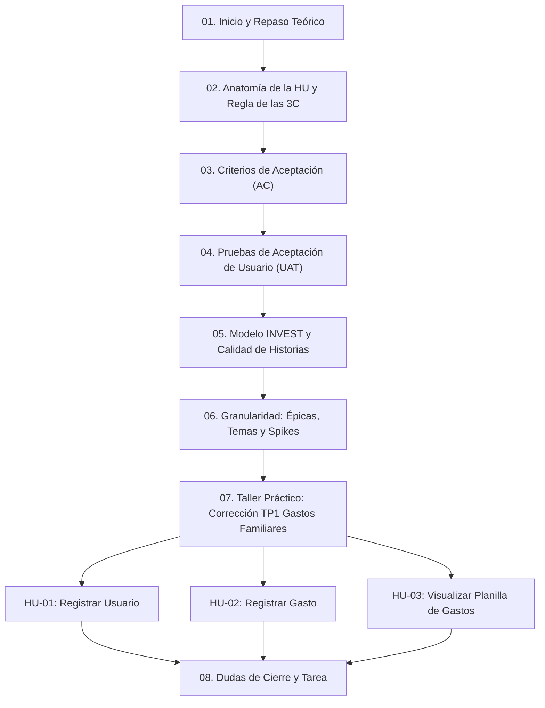
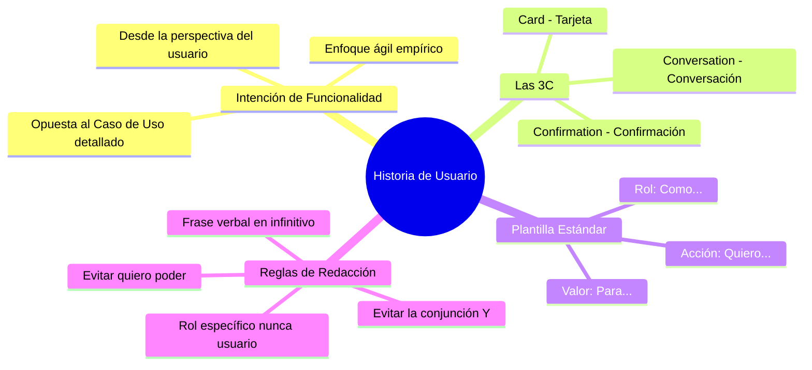

---
aliases:
subject:
  - ISW
year: "4"
exam: PARCIAL1
unit:
type: PRACTICO
zk_type: fleeting
status: in-progress
date: 2026-09-02
source:
tags:
---
---
## 🗺️ Mapa Conceptual y Cronología de la Sesión

---

## 1. Introducción y Repaso Teórico: ¿Qué es una Historia de Usuario?

La clase comienza retomando la fundamentación teórica de las **Historias de Usuario (User Stories)** en el contexto de metodologías ágiles (enfoque empírico) frente a los requerimientos tradicionales:

- **Definición:** Es una descripción de alto nivel de una necesidad o intención de funcionalidad planteada desde la perspectiva del cliente o usuario final para aportar valor al negocio.
- **Diferencia con Casos de Uso tradicionales:** No busca ser una especificación exhaustiva ni técnica de entrada. Es un recordatorio para conversar, no un contrato rígido escrito en piedra.

---

## 2. cuales son las partes de una US? -> preg de final

> [!IMPORTANT] ¡Pregunta Clásica de Examen Final!
> Los docentes remarcan expresamente que las **3C** son contenido evaluable típico en exámenes teóricos y finales.

| Componente                      | Definición y Función en la Clase                                                                                                                                                                     |
| :------------------------------ | :--------------------------------------------------------------------------------------------------------------------------------------------------------------------------------------------------- |
| **Card (Tarjeta)**              | Soporte físico o digital donde se plasma la frase verbal identificadora, la plantilla estándar (`Como / Quiero / Para`) y en el dorso los criterios y pruebas de aceptación.                         |
| **Conversation (Conversación)** | **La parte invisible más importante.** El diálogo e intercambio continuo entre el Product Owner (PO), los usuarios clave y el equipo de desarrollo. La tarjeta es solo el disparador de esta charla. |
| **Confirmation (Confirmación)** | Conjunto de criterios y pruebas de aceptación que determinan cuándo la historia se considera terminada y aceptada por el cliente/PO.                                                                 |

### Anatomía de la Tarjeta y Reglas de Redacción![[Pasted image 20260902154633.png]]
- **Frase Verbal:** Identificador conciso con verbo en infinitivo (Ej: *Registrar gasto*, *Buscar destino por dirección*).
- **Estructura:**
  $$\text{Como } [\text{Rol}] \quad \text{quiero } [\text{Actividad/Qué}] \quad \text{para } [\text{Valor de negocio/Para qué}]$$
- **Reglas fijadas por los docentes:**
  1. **El Rol:** Debe ser concreto y representativo de la actividad de negocio. **Prohibido poner simplemente "Usuario" o "Persona"**.
  2. **Verbos directos:** Usar *"quiero"* o *"puedo"*, **nunca *"quiero poder"***.
  3. **Obligatoriedad del Valor:** Si una necesidad no tiene un *"para qué"* claro que beneficie al cliente, no califica como historia de usuario.
  4. **Evitar la letra "Y":** Si al redactar la acción o el valor se agrega una "Y", se está acoplando una segunda funcionalidad o beneficio; debe dividirse en dos historias.
![[Pasted image 20260902154701.png]]

### 3. Criterios de Aceptación (Acceptance Criteria)

Los docentes aclaran qué son y qué no son los criterios de aceptación:

- **Propósito:**
  - Definen los límites y el alcance exacto de la historia de usuario.
  - Definen una intencion, no una solucion
  - Le indican al equipo de desarrollo **cuándo detenerse** y cuándo la historia está completa.
  - Proveen la base para que testers y desarrolladores deriven las pruebas.
- **¿Quién los define?:** El **Product Owner (PO)** como síntesis de las conversaciones con el cliente.
- **Independencia de la implementación:**
  - Se redactan en alto nivel de negocio.
  - **No deben incluir detalles técnicos:** no usar términos como *"combobox"*, *"formulario"*, *"tabla Excel"*, *"base de datos SQL"*. En su lugar, usar términos funcionales como *"formato de tabla con filas y columnas"*, *"selección de opciones"*.
  - Abarcan requerimientos funcionales, reglas de negocio (ej. validación de rangos, unicidad) y requerimientos no funcionales transversales (ej. tiempos de respuesta < 30 seg).
![[Pasted image 20260902155402.png]]
otro posible criterio de aceptación seria que la altura sea no negativa

### 4. Pruebas de Aceptación de Usuario (UAT - User Acceptance Tests)

> [!WARNING] Distinción Clave: UAT vs. Casos de Prueba de QA
> Las pruebas de usuario **NO** son casos de prueba técnicos detallados (no llevan pasos paso a paso como *"hacer clic en botón X e ingresar 1234"*), ni pruebas de prototipos de UX. Son escenarios conceptuales de aceptación expresados por el usuario/PO.

son definiciones de pruebas que realizara el usuario, para determinar si se cumple o no se cumple el criterio de Aceptacion
#### Estructura de Redacción enseñada por la Cátedra:
$$\text{Probar } + [\text{Frase verbal / Acción}] + [\text{Condiciones en límites o datos genéricos}] \longrightarrow (\text{Pasa} \mid \text{Falla})$$

- **Reglas para las Pruebas:**
  - Siempre comenzar con el infinitivo **"Probar"**.
  - **Camino Feliz (Happy Path):** Al menos una prueba completa donde todas las condiciones se cumplen y el resultado es **(Pasa)**.
  - **Caminos de Falla / Límites:** Pruebas que validan las restricciones negativas (ej. contraseña menor a 8 caracteres, calle inexistente, tiempo superior a 30s) y resultan en **(Falla)**.
  - **Trabajar con límites generales:** Decir *"menor a 8 caracteres"*, no enumerar *"de 7, de 6 o de 5"*.
  - No es obligatorio un par espejo pasa/falla para cada cosa, pero sí debe existir cobertura para cada criterio de aceptación.
![[Pasted image 20260902160030.png]]
---
