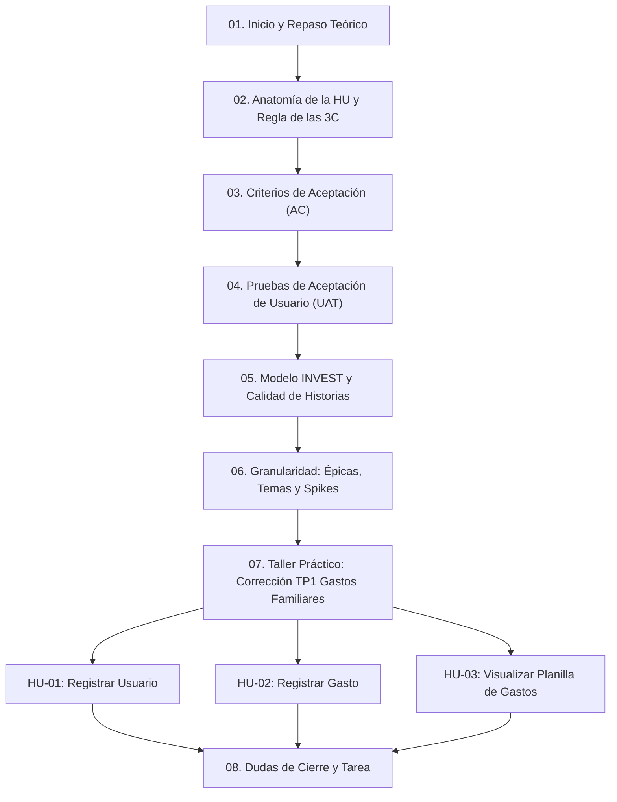
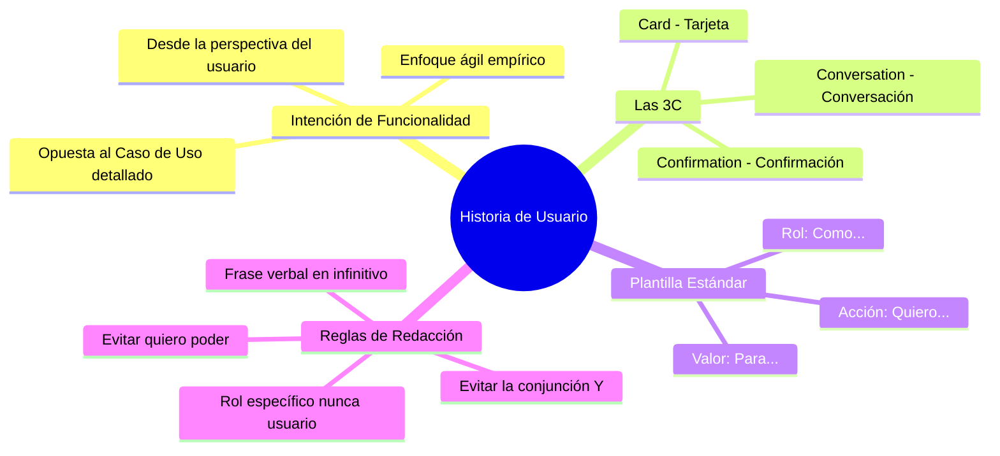
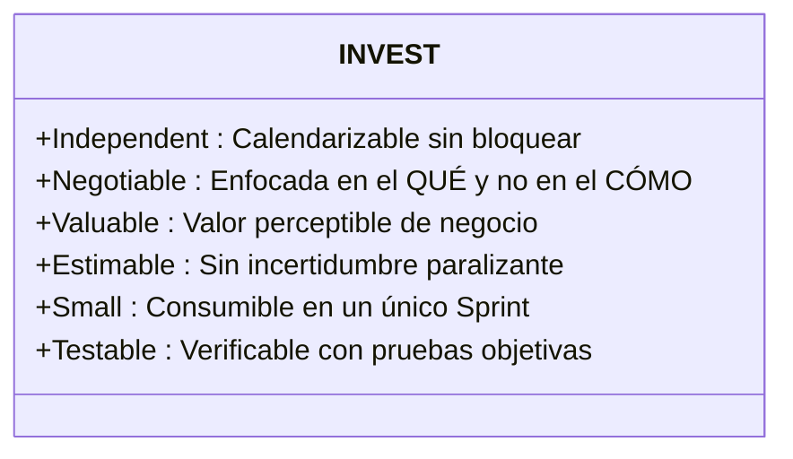
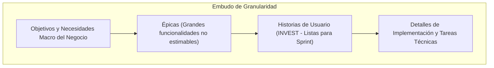
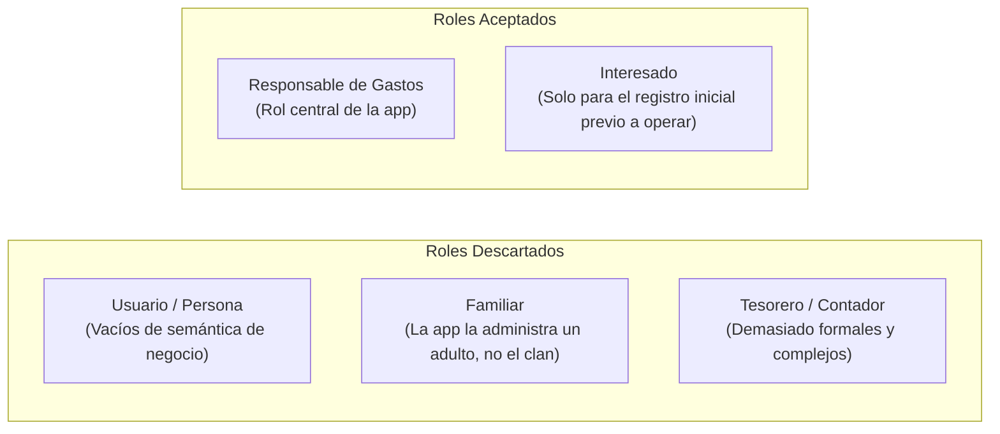
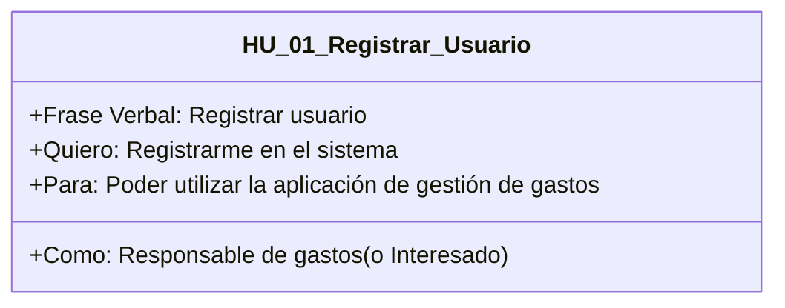
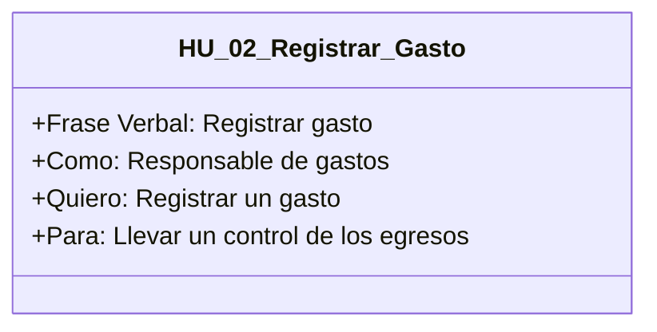
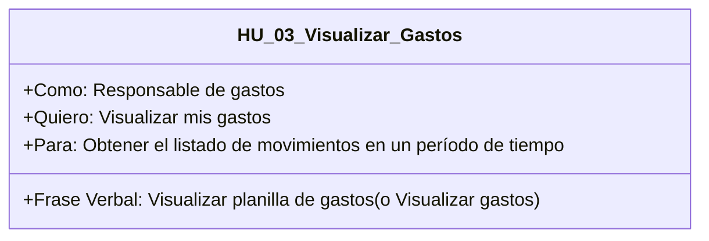

---
aliases:
subject:
  - ISW
year: "4"
exam: PARCIAL1
unit:
type: Transcripcion
zk_type: resources
status: in-progress
date: 2026-09-02
source:
tags:
---
---
# Transcripcion

Yo soy del 4K1 y no podía salir de de diseño. Sí, no entendía.

Eh, bueno, eh, ¿qué teníamos por acá? Teníamos el ejercicio sí, que trabajar con ¿qué? A ver, cuéntenme.

Historia de usuario sobre

con historias de usuario. Bien. Y para eso nosotros, ¿qué les pedimos?

Le con los conceptos,

que los conceptos y lo hagan las dos cosas, ¿no?

Sí, también.

Bien. A ver, entonces repasemos conceptos. Eh, historia de usuario. ¿Qué es una historia de usuario? Ah, podríamos ir viendo o cuéntenme mientras cuéntenme, yo voy viendo si puedo.

La historia de usuario es una descripción de la intención de no funcionalidad desde la vista del usuario del cliente de la intención de una funcionalidad. Me gusta bien desde el punto de vista del cliente. Bien,

profe, dice que hay chicos esperando

esto. Medio medio lento.

Se le ocurre Perdón, Zoom, darles de la entrada. Bueno, entonces, ¿estamos todos de acuerdo? Sí. Con que es el planteo de una necesidad, es una especificación de requerimiento, una historia de usuario, podemos decir,

es una técnica ¿Qué es más? Lo vemos así planteado desde

eh desde que es una intención de una funcionalidad, una necesidad planteada por el usuario de una funcionalidad que necesita para su producto de software. Sí. Eh, si tenemos que hablar de requerimientos detallados, podemos hablar ya de casos de uso, que no es el tema. Sí, esa sería como la diferencia. Perfecto. ¿Cuáles son las partes? User story,

la tarjeta que tiene como el contexto, los criterios y las pruebas de usuario,

la tarjeta, los

convers está. ¿Cuáles son las? No, bien, pero sí, sí está. Tenés razón.

Dentro de la tarjeta, sí tenés lo que es la la Bueno,

dentro de la de la tarjeta tenemos que nombre, actividad

y el valor

y el valor de negocio

y falta más.

Y la breve frase que va arriba que describen. Ah, los criterios de aceptación y los

y las pruebas de usuario.

Prueb de aceptación.

Ahí está.

Eso que hicieron al principio se engloba en lo que se conoce como descripción. Sí. Que es todo esto que dice el rol, ¿qué quiero hacer como rol? La descripción de lo que quiero, la la necesidad o esta intención, ¿sí? Que quiero desolver el sistema y el para qué. que es el valor de negocio que se espera que resolver eso le dé y la frase verbal, como decían algunos, para poder identificar más fácilmente.

Estoy queriendo ver cómo

el historio de usuario eran eran tres o no la conversación, la tarjeta o la carsación, las 13, confirmación, conversación y la tarjeta o car en inglés. Esas son las tres partes de lo dice el

claro. Entonces cuando Exacto, como dice el profes Cuando les vamos a eh presentación, cuando eh les preguntan en el teórico, ¿sí?, cuáles son las partes de una user story, acuérdense de las 3C, sí, car, conversation, confirmation. Sí,

esperen que yo había dicho la primera clase

que se acuerden de esa pregunta.

Sí,

son preguntas de final.

Bueno, no nos acordamos. Entonces, ahora lo repasamos bien. Eh, ¿Qué qué otra cosa? Entonces, empezaron a hablar de cómo se describiría, ¿sí? O cómo cuál es la forma sí, que tenemos de expresar esas intenciones o necesidades del usuario escrita en una historia de usuario. Y ahí sí están las partes eh de cómo, el nombre del rol, qué más,

quién, cómo y para qué.

Exactamente. Él qui que sería el rol. ¿Qué teníamos que tener en cuenta con respecto al rol?

No poner usuario solamente.

Bien, exactamente. Eh, entonces yo como nombre del rol, ¿sí? Que es el que estaría realizando la acción o la actividad que es yo puedo, ¿sí? Y la actividad de forma tal que y el valor de negocio que va a recibir ese rol respecto de esa actividad. Entonces, las tres cosas tienen que estar sí o sí. Sí. No puedo decir cómo, nombre del rol, yo quiero o yo puedo, eh, y me quedo ahí. Está bien. Eh, ¿qué otra cosa? Cuando estamos escribiendo, sí, el cómo yo puedo y de tal forma que o para sí, no o porque no es eh quiero poder. Sí. Si o es quiero o puedo. Que también es una por ahí de las confusiones con con respecto a a cómo escriben las historias de usuario. Hasta bien.

Acá encontré a ver si acá puedo compartir. Ah, no, pero nunca hice la presentación. A ver, ahí. Ahí se ve.

Sí.

Bien. Y eh bien, esto es lo que dijimos recién. Y ahora, ¿por qué yo no puedo adentrar? Bueno, ¿qué es esto de la frase verbal?

Es un identificador de la tarjeta.

Perdón, entendí. Un identificador de la user. Sí. Una forma de identificar o Sí, que se llama frase verbal, lo que eh expresa la usa. Perfecto. En este caso sí buscar destino por dirección y el ejemplo es como conductor quiero buscar un destino a partir de una calle y altura para poder llegar al lugar deseado sin perderme. ¿Sí? Entonces acá ya estamos viendo la CAR con la frase y la descripción de un ejemplo de una historia de usuario. Después me comentaron que venían los criterios de aceptación. Entonces, chu chu Buah, tengo como muchas cositas antes. Bien, acá está criterios de aceptación. ¿Qué son los criterios de aceptación? Sin leerme lo que está ahí, no les pregunto qué es lo que ustedes entendieron como criterios de aceptación de la historia de usuario.

Requerimientos no funcionales, profe.

No funcionales.

Solo requerimientos no funcionales.

Son para Eh, no, o sea, a ver, puedo plantear, sí, como nosotros vemos requerimientos no funcionales, un criterio de aceptación, si por ejemplo necesito que me responda en 30 segundos, ¿sí? El la devolución de lo que está planteando el la historia de usuario, como por ejemplo, ¿no? Pero, ¿qué otra cosa es un criterio de aceptación?

No son requisitos que tiene esa funcionalidad. Por ejemplo, si es un campo de eh categoría de pagos y por ejemplo era que se pueda personalizar, ¿no sería eso como un requisito dentro de la funcionalidad? Un

requisito dentro de la funcionalidad. Me quedé pensando porque como requisito es requerimiento y dentro de la funcionalidad es el deseo de un requerimiento, digamos como que estamos como el concepto medio que queda como una chanchada, diría porque

los criterios no son cómo debería funcionar la la funcionalidad, ¿va? Sí.

Los criterios de aceptación, ¿quién los escribe?

El po

bien. Sí. Entonces son, ¿por qué dice acá, por ejemplo, define los límites para una user story? Uy, me fui. Quería poner el punterito. Sí, definen los límites para una user story, ayudan a los que los peor respondan lo que necesitan para que esa user story provea valor. Eh, ayudan a los desarrolladores y tester a derivar las pruebas. Ayudan a los desarrolladores a saber cuándo parar de agregar funcionalidad en una user story. Entonces, la definición de los criterios de aceptación que hace el PO, ¿sí? Es la forma que tiene el PO, ¿sí?, de determinar ¿Cuándo se está cumpliendo para él esa historia de usuario? ¿Sí? Y ahora vamos a ver ejemplos. Uno de los ejemplos que ustedes bien decían puede ser expresado, como nosotros los vemos en requerimientos no funcionales, pero no necesariamente son todos requerimientos no funcionales los que ponemos en los criterios de aceptación. ¿Sí? Esto que habla de los límites y de cuándo yo voy a parar de agregar funcionalidad tiene mucho que ver con esto de decir, bueno, el criterio de aceptación de esta user es hasta acá. Sí, te tiene que poder definir en el momento en que vos decís, esta user story terminó de desarrollarse. ¿Sí me explico con eso?

Sí, sí. Un momento.

Entonces, por ejemplo, un criterio de aceptación. A ver si tenemos acá. Acá fíjense que ustedes tienen, si la búsqueda no puedes demorar más de 30 segundos en este buscar destino por dirección. Sí, tiene que ver con un requerimiento no funcional del tiempo de respuesta de la búsqueda y en eso estamos bien. Y la altura de la calle es un número. ¿Sí? Es decir, bueno, ¿qué otro criterio de aceptación podría decir yo acá? Podría poner acá en el

ese número tenga que ser positivo o no o que sea no negativo.

Por ejemplo, podría poner ese también. Sí. Entonces, escribiendo los criterios de aceptar Sí, a mí me tiene que quedar claro que lo único que cumple, sí, que cumpliría esta user story es buscar un destino, ¿sí?, a partir de una calle y una altura para llegar a un lugar deseado sin perderla, ¿sí? Que sería la parte de el valor de negocio para este conductor. Está bueno. Igualmente vamos a ir trabajando para que termine de cerrar este sí. Hm. Eh, estos conceptos de lo que es es un criterio de aceptación de de usuario. A partir de los criterios de aceptación de usuario, ¿qué escribimos?

Las pruebas.

Las pruebas de aceptación. Exactamente. Sí. Acá tenemos algo más de cuáles son los criterios. Ah, cuáles son los criterios de aceptación. Buenos. Bla bla bla. Bien. Entonces, no, acá hay algo importante que acabo de leer. Son independientes de la implementación. Si relativamente alto nivel. No es necesario que se escriba cada detalle. Y eso, ¿por qué? Porque los escribe el PO. ¿Sí? Entonces, el peo no te va a decir a vos cómo tenés que determinar eh la funcionalidad esa que él está describiendo. ¿Sí? Y esa es la es una parte importante también cuando ustedes escriban los criterios de aceptación. ¿Sí? Bien,

profe, yo ahí tengo una duda de

dónde hasta dónde entraría en criterio de aceptación y dónde se pondría en un documento aparte, por ejemplo, de que porque hay veces el cliente como en esta actividad que tuvimos que hacer, que te explica eh de forma de alto nivel como que quiere ver la la interfaz como Excel. Ponel,

¿eso sería considerado un criterio de aceptación o para un documento aparte?

En realidad sí, el criterio de aceptación sería el como Excel es lo quiero ver en forma de tabla, es lo que te quiere expresar. Sí. Entonces, ese sería un criterio de de aceptación, porque si vos ya le pones Excel, ¿de qué estamos hablando? Ya de implementación. Entonces, por ahí lo que vos podrías poner es el criterio de aceptación. Lo quiero ver como una tabla al listado de gastos. Sí, pero eh en un documento aparte vos podés definir con tabla nos referimos a que sea formato Excel, por ejemplo. Sí.

Okay.

No es tan grave. Justo en este caso el ejemplo que que Pero sería eso, digamos, no hacer foco. Sí, porque hoy es Excel, mañana será otro, digamos. Entonces, no ponemos ese tipo, sí, de de asociaciones a a implementación. Entonces, ¿qué le ponemos? Tipo tabla. Sí, en formato tabla, columnas, filas. Mm.

Dale. Perfecto.

Bien. Vamos bien.

Sí. Bien. Eh, entonces, bueno, la tarjeta habla porque antes sí se usaban así tipo tarjeta para escribir, sí, las historias de usuario. Entonces, por una parte tenías que dice ahí front of car, ¿sí? La escritura de lo que era la historia de usuario. En la parte del back, sí, las los criterios, las pruebas de aceptación, perdón. ¿Qué son las pruebas de aceptación? Son escenarios en donde se evalúa si la funcionalidad es correcta o incorrecta. Eso no me quedo muy claro.

Escenarios donde se evalúa si la funcionalidad es correcta o incorrecta. E a ver,

sería más bien

las situaciones que la que la funcionalidad tiene que poder satisfacer para que satisfaga, valga la redundancia, la necesidad del cliente.

Sí,

serían como las pruebas que tiene que pasar para saber si está desarrollado de una manera correcta el user story,

eh, desarrollado de una manera correcta. Hasta ahí. Bueno, eh, estaría. A ver, nosotros vamos a definir las pruebas de aceptación de usuario, ¿sí? Porque son pruebas de aceptación de usuario a partir, ¿sí?, una forma de decir, "Sí, eh, para el usuario te voy a aceptar, sí, esta historia de usuario es escribirlas a partir de los criterios de aceptación que te dijo, bueno, te voy a aceptar, voy a aceptar esta historia de usuario con estos criterios y para ello voy a hacer estas pruebas." Entonces, son definiciones, ¿sí?, de pruebas que va a hacer el usuario para determinar si se cumple o no se cumple con el criterio de aceptación. Sí. Lo que Yo quiero que quede claro es que no es el diseño de una prueba de usuario. Sí. Entonces, de la forma, creo que acá tenemos una forma en que se escribe. Hay alguien que levantó la manotom. Es lo mismo que la prueba de usuario. Esto

sí, prueba de usuario, prueba de aceptación de usuario. Sí, es lo mismo

de UAT, digamos. No está relacionado, profe, con la prueba de prototipos que hay uno de los chicos dijo como uso de escenarios y eso.

Ah, okay. Bien. Eso es lo que yo quería dejar en claro, ¿sí? Que no es eso. Cuando nosotros escribimos prueba de aceptación de usuario, ¿sí? Perdón si lo dijeron en el chat, vos después o cómo lo dijeron. ¿Dónde lo dijeron?

E

antes lo había dicho uno de los chicos del

Ah, había dicho. Ah,

el chat está el chat. está tranquilo todavía.

Ah, okay, bien. Perdón, no lo escuché. No, no era eso. Sí, fíjense acá no estamos escribiendo. Esto va a servir de punto de partida para poder diseñar las cuando nosotros escribimos las pruebas de aceptación de usuario de punto de partida para poder después diseñar los casos de prueba que se van a utilizar, ¿sí?, en las pruebas para realizar si funciona o no funciona, digamos, o determinar, digamos, si la funcionalidad funciona correctamente, digamos, sí, de manera correcta. y correctamente las dos cosas, pero no nosotros la prueba de usuario es, por ejemplo, probad buscar un destino en un país y ciudad existente de una calle existente y una altura, a ver, porque yo no estoy leyendo porque están ustedes y la altura existente y pasa, ¿sí? ¿Qué está haciendo acá? Definiendo ni más ni menos, sí, que una prueba para determinar si esa funcionalidad que es la que estamos describiendo este deseo de poder ver si un destino ingresando la calle, la altura y todo eso para no perderme va a funcionar. Sí. Entonces, probar buscar un destino en un país y ciudad existente, de una calle existente a la altura existente y pasa en las pruebas de usuario va el pasa y el falla. ¿Para qué? Porque tenemos que determinar por lo menos sí, una completa, sí, que generalmente es la que satisface todo lo que dice la historia de usuario que pase y una digamos que falle, digamos que poner algo que no va, por ejemplo, probar buscar un destino en un país y ciudad existente de una calle inexistente. Sí. Y entonces falla. Probar buscar un destino en un país y ciudad existente de una calle existente y la altura inexistente falla. ¿Sí? ¿Qué es lo que yo no pondría por ejemplo acá en una, por ejemplo, Ah, no, no, no sé si lo dijeron así, pero yo había entendido. E, ¿qué podemos nosotros después poner en un documento aparte? Sí, un prototipo para hacer una validación y después el detalle de la prueba, del caso de prueba con los datos y todo lo que nosotros tenemos que diseñar ese caso de prueba para poder probar. Sí, pero acá fíjense que solamente es una definición para determinar sí, si esa con esas pruebas de usuario si se cumple o no se cumple, ¿sí? Con lo definido. la historia de usuario. Hasta ahí más o menos, profe, perdón, a mí no me termino. Una sola cosa, no me quedo claro. Estas pruebas de usuario la define justamente el usuario que está escribiendo esta esta card en función de cómo él ya tuvo experiencia con otro sistema o esto tenemos que relevarlo nosotros para que nos redacte las pruebas de usuario,

¿no? Vamos de nuevo. Es Sí. O sea, a ver, esto es una conversación, ¿sí? Voy un poquito más allá. Sí.

Eh, entonces, independientemente de quién esté escribiendo, o sea, quién agarre el lápiz o quién use el software para escribir la historia de usuario, ¿sí? Queremos que estas definiciones salgan del lado del rol, ¿sí?, que para el cual se está escribiendo esta historia de usuario. Sí, hasta ahí vamos bien.

Sí, sí.

Okay. Entonces, define, sí, en esta conversación le define, che, y yo en realidad, bueno, este que era para buscar en el GPS, me imagino, quiero buscar si que poner una calle con una altura y que me salga el destino correctamente para no tener que que perderme. Entonces, para poder hacer eso en la conversación, ¿qué te va son cosas que te va diciendo el usuario que vos podés rescatar y que él si tiene experiencia las puede escribir. Eso es independiente en la teoría. Nosotros decimos que le escribe el PO como resultado de una conversación. Sí, pero con esto queremos decir de que porque vienen del lado, sí, del PO, del lado del cliente está, independientemente de que después vos agarres un software y digas, "Ah, las historias de usuario son estas, los criterios son estos y las pruebas de usuarios son estas." Bien, entonces no tiene el conocimiento, quizás sí, porque puede ser algún experto, pero quizás no tiene el conocimiento, ni queremos que tenga el conocimiento. de escribir una prueba de usuario de forma tal que vos sí puedas ir directamente y tirarla a un software de testing y que validar si funciona o no funciona el sistema. Sí, la idea no es esa de la de esta de la definición de estas pruebas de usuario. Construyendo a la par con el el experto en justamente esta funcionalidad con él vamos construyendo Exacto. Y va, y vos fíjate que todas van más del lado de cómo yo quiero que funcione, ¿sí?, el sistema a de lo que yo podría después validar o hacer validaciones en el sistema de información, ya sí, digamos, detallando eh, no sé, los los datos de entrada, los datos de salida, los tipos de datos, si llen un combo, si no llen un combo. Sí, fíjate que todo eso acá no lo tenemos. Sí. Por ejemplo, probar buscar un investir en un país y ciudad existente de una calle inexistente y falla. Con este el usuario, ¿qué te quiere decir? De que no me tendría que dar un resultado si te pone una calle inexistente. No voy a poner acá yo, por ejemplo, si no va a salir de él, decir, no voy a poner, no se va a seleccionar una calle inexistente o el sistema me va a validar de que la calle sea inexistente porque eso ya va por la implementación. Esa sería la La diferencia. Sí, yo acá no pondría como prueba de usuario eh que tenga que valido si el sistema valida que la calle exista. No, no sería la idea. ¿Me explico la diferencia? Porque eso sería no se reactan de forma técnica.

Claro. Entonces, ¿qué hago? Sí, me puedo basar en los criterios de aceptación. Primero, sí, lo que solemos poner es una prueba general, ¿sí? Que valide de manera general la user que está escrita, ¿sí? Como la primera que está escrita acá, probar buscar un destino en un país existente, una calle existente, existente y pasa. Sí. Y después puedo ver, digamos, fíjate que esta es la primera y es la toda la variedad y después para decir, "Che, lo que yo no quiero y pone todo lo que falla." Entonces no quiero que metir un destino si la calle no existe, si la ciudad no existe, que el país no existe, sí, que la ciudad no existe. Probar buscar un destino en un país una ciudad existente, de una calle existente y demora más de 30 segundos, que tiene que ver con el último criterio de aceptación, también fallaría.

Sí,

sí, sí.

No sé, Si, si vos querés agregar algo.

Eh, no, básicamente las pruebas es lo que van a permitir que te acepten o no lo que vos hiciste. Es como decía la profe, va a validar el PO y va a decir, "Bueno, cuando llegue el deadline, no me que mostrar esto, va a probar lo que es conen y va a ir. Pruebo esto y Esto funciona, listo, pasó, no pasó. Eh, esa es la idea de las pruebas de usuario, es lo que va a terminar en base a los criterios de aceptación, que te acepten o no lo que construiste. Entonces, importante que esté, y esto que hablaban de del PO y demás, qui no escribe, qui no lo escribe. El PO es como un rol que se aplica para poder integrar al cliente un poco más a lo que es este proceso de desarrollo. Generalmente lo ideal, obviamente siempre hay cursos, hay hay formación en lo que es un PO y demás y se busca que sea con más del lado del cliente, casi que integrar el cliente que me está comprando. Pero generalmente, fíjense que esto tiene algo de técnico en decir, bueno, ¿cómo tengo que escribir la disor que regalar un requerimiento y demás? Que lo que se hace es tercerizar ese rol, por así decirlo, con uno de nuestro equipo. Pero la idea de esto es que ustedes haya una charla, que esto represente una charla con el cliente y de alguna manera se materialice o se quede como una memo con esta técnica. Sí. Por eso eh la idea de esto es que sea como un recordatorio eh como una forma rápida para poder empezar a trabajar y no no no quedarnos en ese

en ese en esa sobre definición de las cosas antes de arrancar. Sí. O sea, sin número. O sea, que sea el tras.

Ahí ya estamos cuando estamos diciendo, por ejemplo,

eso que estás diciendo vos, ya estamos entrando en el mundo de lo que es un caso de prueba. Estamos definiendo un escenario. Voy a probar un cierto tipo de error. La idea de los criterios de aceptación y de las pruebas de usuarios que yo voy a escribir en base a criterios de aceptación es que me permitan de una manera genérica decir que yo tengo que probar ese criterio. Sí, yo pruebo este criterio, no ingresándolo. Ingres si te dice que sabe quitar lación que tiene un formato específico. Voy a probar que no se cumpla ese formato, pero no voy a poner en pruebas ingreso un número, ingreso 555, ingreso AC en lugar de Sí. Es decir, yo tengo que probar este criterio de aceptación de esta manera. Pum. Es muy alto nivel como venían hablando.

Bien, perfecto.

Bien. Eh, ¿qué otro concepto tenemos? Ah, bueno, acá es otro ejemplo. Bien, entonces, ¿qué esto, qué es esto del modelo? ¿Que es un modelo de calidad? Sí, el modelo invest.

¿Para qué teníamos este modelo?

Forma de de seleccionarse, de controlar que las user estén bien escritas y bien definidas.

Perfecto. Bien. Y entonces si estamos hablando de que una user tiene que ser independiente. Sí. ¿Qué significa en sus palabras?

Que no se necesita de que otra user story empiece para para empezar esta.

Exacto. Sí, que no dependa de otra. Significa que yo, como dice acá, la puedo poner en cualquier momento, desarrollar sin tener la necesidad de que otra esté desarrollada. Sí. Por eso dice calendarizables e implementables en cualquier orden. Bien. Negociable, ¿sí? El qué y no el cómo. Esto es un poco lo que estábamos Ando recién, no me va a decir cómo lo voy a implementar, sino qué es lo que tengo que hacer. Sí, valuable debe tener un valor para el cliente. ¿Dónde vemos esto?

En el para qué de la historia.

Exacto. Exacto. Sí. Eh, si nosotros no la no llegamos a obtener, conversamos y no podemos obtener esta parte de valor para el cliente, bueno, pues entonces no es una user story. Sí. Entonces, tenemos que volver a pensar y y y ver de qué estamos hablando. Tiene que quizás es parte de otra user story, ¿sí? Si no le puedo encontrar el valor de negocio a o el valor para el cliente para para esa user story tiene que ser estimable. ¿Sí? ¿Qué significa esto?

Que el equipo puede debe saber el tamaño de la trayectoria del usuario para poderla dividir o si es una funcionalidad mínima, o sea, que es si es una user story o zona épica, por ejemplo.

Por ejemplo, sí debo poder sí determinar, bueno, ahí dice armar un ranking basado en costos para poder determinar si es estimable que, bueno, estimable obviamente que no tiene certeza, pero ver si esa user story puede ingresar si a a ser desarrollada o no. Sí, está perfecto. Estimable small deben ser consumidas en una iteración.

Bueno, está sí.

Una consulta con respecto estimable.

Si la audio story la lleva a cabo el product owner, eh, no entendí bien la diferencia entre si va a ser negociable y se tiene que definir el qué, eh, cómo es que el product owner también sabe aproximadamente cómo se cómo se puede resolver para que sea negociable, o sea, para que cumpla con ese criterio también. Bien, el cómo, acorddate que no y este modelo inves para poder definir o ayudar a definir con el cliente cómo va a ser una user story, o sea, si estamos hablando de una user story, o sea, es como un check para poder validar si es una user story o no. Entonces, negociable tiene que ver que cuando estemos hablando de una necesidad que te está planteando el usuario que necesita, ¿sí? No te diga el cómo, porque la parte del cómo, ¿sí? Que sería la parte de implementación, cómo lo voy a desarrollar, ¿sí? Ya depende de cómo nosotros ya como desarrolladores sí le vamos a dar el resultado al cliente. No obstante, con esto abro paréntesis, sí puede ser que nosotros tengamos en otro lado, pero que ya no forme parte de la user story, que el usuario, por ejemplo, te diga, "Y che, la verdad, que yo ya me manejo con un motor de base de datos de este tipo y entonces tenés que guardar lo que es persistente, ¿sí? En esta base de datos y ahí ya tenés un como que te está tirando, sí, el el usuario, pero ya esto está planteado en otro documento, don decir nosotros por ahí también recuerden que lo veíamos como requerimiento no funcional expresado por el usuario, donde tenemos que cumplir con eso obviamente sí porque es algo que ya tiene el usuario, pero no forma parte de mi historia de usuario. Sí,

claro. O sea, depende depende también del contexto y también la comunicación entre el equipo técnico y no técnico, digamos.

Exacto. Vos tenés que ir a identificar con la user story el qué, che, qué necesita, ¿no? ¿Cómo? Sí. No pensar en el cómo, qué es lo que necesita. Y creo que la otra relación que vos me hacías es con estimable o con valuable. No, no entendí, Diego.

Con O sea, negociable con estimable.

Con estimable. Ah, bien. Estimable es otro concepto, ¿sí? Que yo pueda decir, ¿sí? ¿Qué tamaño? Ustedes ya vieron la estimación de de user. ¿Cómo podemos hacer el concepto de estimación? MVP,

eh, no. Okay. Bueno, estimable es que yo pueda determinar, si que esa historia de de usuario se puede concretar de alguna forma, ¿sí? Que yo le puedo dar un peso, ¿sí? A esa historia de usuario, independientemente eh de de lo anterior, digamos, de que sea eh o sea, debería cumplir también con que es negociable, pero no es que haya una dependencia. Sí, yo debería decir, bueno, esta historia de usuario es estimable porque yo le puedo dar un peso, ¿sí? Puedo determinar de que puedo cumplir con ese historia de usuario, sí, no necesariamente de que dependa de lo que estoy negociando o valor de negocio que tenga. Sí, es como otro punto.

Ah, claro. O sea, vendría a ser eh si dependiendo la incertidumbre que se tenga, o sea, se va a conversar más con el cliente y dependiendo de eso, o se divide la historia de usuario o se hace, creo que se llamaba un spike que era para realizar una investigación.

Exacto. Exacto. Bien. Sí, eso es. Sí, por ahí no no me acuerdo, no me quería meter tanto, pero con esto de la estimación tiene que ver con que vos tenés un grado de incertidumbre siempre, por eso estás estimando un poquito de riesgo, un poco de no sé cómo lo voy a resolver, ¿sí? Pero en el caso de la definición, digamos que decimos tiene que ser estimable, eso yo le puedo dar un peso en el caso de que yo no lo pueda determinar. Sí. Entonces, ya podemos decir que estamos hablando de un spy que ahora si quieren ya lo vemos que creo que está más adelante y si no hay Ahí lo repasamos y terminamos de ver estos puntitos.

Profe, ese peso es lo que está vinculado a los story points, digamos.

Claro. Exactamente.

Sí. Sí. Bien. Small deben ser consumidas en una interación. Sí. Y esto depende, si recuerden que la iteración en los marcos de trabajo que se ven las user story, que estamos hablando por ahí de gestión de de SCAM, donde las iteraciones que se definen Son tr semanas, 4 semanas. Bueno, como máximo estamos hablando de que entonces yo puedo sí determinar o terminar sí de construir esa user story, darle el valor de negocio que está esperando el usuario en una iteración, ¿no? Decir, ah no, mira, lo hice hasta la mitad, ahora la próxima mitad va en la otra iteración. Si me pasa eso, sí significa que ahí sí podemos decir que está por ahí más relacionado con el tema de estiva está mal estimada, es muy grande. Sí, recuerden que eh nosotros tenemos que terminar la interación con un valor de negocio para el usuario. Entonces, si esa eh historia de usuario yo digo entra en este sprint, en esta iteración, perdón, la tengo que terminar. Sí, a eso se refiere con small. Si yo tengo entonces sprint de 3 semanas o dos semanas, a veces se definen de dos semanas y bueno, entonces va a tener que ser así de chiquita, ¿sí? Y ahí hay un poco Entonces, entre lo que es la duración de la estimación, el tipo de producto que estoy desarrollando y realidad, mira, che, la verdad que no llevo a ninguna historia de usuario que pueda consumir en dos semanas y bueno, lo veamos. Sí, algo hay para rever. Esto no es que va independientemente de todo, sí, pero la idea es que se cumpla con esto. Y bueno, si estamos entrando en un sprint, se supone que cuando yo termine esta iteración, un valor de negocio para el usuario tiene que tener. No me puedo quedar diciéndole, bueno, ahora te muestro nada. en la demo porque esto lo voy a terminar en la próxima iteración, no al lugar. Sí, me expliqué con eso.

Sí.

Bien. Testeable demostrar que fueron implementadas. Sí. Entonces se corren las pruebas de usuario y se determina bien eh se cumplió con la historia de usuario. Eso sería. Entonces, ¿alguna duda con esto? ¿Cómo se demuestra que fueron ah que fueron implementadas? No, disculpa, disculpa.

No, no está bien.

Yo tengo una duda. O sea, ¿cuál es la forma de saber si lo que vos dijiste que ibas a hacer está? Sí. Bueno, es testeable. Lo podemos probar, ¿sí o no?

Sí. Yo puedo ingresar un destino, supóng que es esta, ¿sí? Están acá. Un destino en un país y una ciudad existente una calle existente, una altura existente y pasa. Bueno, eso es una forma de probar, ¿sí? De que esa historia de usuario se cumplió.

Profe,

sí,

como dice demostrar que fueron implementadas significa que ya, o sea, se implementó la usuera story y pasaron todas las pruebas de aceptación y los criterios o e cuando se definen los criterios y las pruebas de de aceptación ya sería testeable, o sea, antes

ahí, porque nosotros lo que estamos determinando, ¿sí? Es si esto es o no es una user. Sí. Entonces, si yo puedo sí definiendo las pruebas de aceptación demostrar de que eso puede eh quedó implementado, entonces está bien, a eso se refiere. Sí, estamos todavía en el en el evaluando si esto es una historia de usuario o no.

Ahí va, ahí va. Gracias, No, nada.

E les recuerdo un conceptito que que va también un poco de la mano con esto. Acuérdense que la user es un pedazo de funcionalidad de de sistema transversal. ¿Sí? ¿Qué quiere decir esto? Cuando yo la implemento, digo frontend, backend y base de datos como mínimo. E ahí que había una fotos. Esa esa torta sí es eso. Una story no puede ser solo una porción de de una aplicación por consolas. Sí, bueno, ejecutamos que va, mire cómo le mando la petición y demás. Entonces, yo si lo quieren pensar de alguna manera, como que desarrollo una porción mínima independiente de código que se puede ver su sistema. Sí. Y eso es lo que va a usar el el PO para poder implementarlo. Si el día de mañana un PO quiere para poder probarlo, si el día de mañana un PO quiere probarlo, lo que va a hacer es entrar a un front y hacer todas esas pruebas que se definieron en la story. Eh, que queden claro eso.

¿Quedó claro?

Yo tengo una duda. Eh, cuando usted dijo lo de small, que tiene que aportar un valor antes que termine la iteración, ¿qué sería ese valor que que te puede aportar en esa iteración? Por ejemplo,

el valor que definiste user user story.

Y vos decís, por ejemplo, ¿dónde estaba? A ver, poner la del

Ya está

la del es si vos decís que el olor es llegar al lugar deseado sin perderme, la idea de yo usar esa funcionalidad es que me permita a mí llegar a un lugar, imagínense como una aplicación de mapa, por ejemplo. Si esa user story a mí no me permite buscar una ubicación en un mapa para que yo pueda saber cómo llegar y no está cumpliendo el valor que que pedía el cliente.

Claro, pero vos tenés más de una iteración, o sea, en cada una ación cuando uno trabaja, acuérdense que estamos cuando hablamos de story, generalmente se emplea en enfoques empíricos en donde se pone foco en el valor del clientelas que entre en esa iteración, se le implemente y que salga y al aprobarla por el PO ya quede lista para ser utilizada. ¿Vieron? Bueno, lo van a ver mucho. Esto por ahora quizá queda medio como raro porque estamos viendo como la unidad de de trabajo, pero cuando vean MVP y vean planificación van a entender este concepto de y de incremento y de valor. Sí, pero la idea es que entre en una interacción story, la desarrolle por completo y qued terminada, por así decirlo, para que cumpla lo que dijo que iba a hacer. Si pide, si te lleva dos iteraciones es porque algo mal estuvo en esa story. Seguramente la tendrías que haber dividido, quedó muy grande y es lo que se produce después como carryover, que también lo van a ver después. Perfecto. Se entendió.

Se entendió bien. Yo si no me había venido acá hasta el producto sí, que es donde acá, fíjense, tenemos la lo de más prioridad porque, bueno, es un product que que uno que el PO prioriza según el valor de negocio de las user story, pero no obstante en este backlock también sí tenés eh otras cosas, sí, que no necesariamente escritas ya como historias de usuario. Entonces, lo que entra a una iteración, ¿sí? Son ya las historias de usuario. Entonces, esas historias de usuario tienen que ser lo suficientemente pequeñas para terminarla en una iteración. ¿Sí? Entonces, si en mi proyecto yo defino que las iteraciones son de dos semanas, entonces tengo que definir las user stories de manera tal que en dos semanas yo pueda dar un resultado. ¿Sí o no? Sí, sí, sí, sí.

Okay.

O sea, profe, hablando del ejemplo ese del de que fuera un mapa, primero sería si fuera algo más grande, por ejemplo, que aparte de llegar a un lugar sin perderte, que busque después, no sé, el algoritmo para buscar el camino más corto, más rápido y más seguro. Eso debería hacerse, por ejemplo, en otración.

¿Cómo? Perdón, se cortó

otras. user, perdón. Sí, por ahí se se ve corto.

Claro.

Entonces, en esas otras user pues por ahí sí es como dice el profe por ahí ustedes ahora como que no se termina, como no tenemos la forma global, estamos viendo algo como muy chiquitito. Sí. Eh, puede ser que esta user la incluya en esta iteración, pero aquellas otras user donde son un poco más complejas, sí, no las voy a poner en esta misma iteración porque mi equipo de desarrollo no va a terminar, sí, de desarrollar estas otras alternativas, estas otras user en este tiempo de iteración. ¿Sí? Entonces, eso es lo que se hace también cuando se planifica la iteración, cuáles son las historias de usuario. Sí, tengo que tener en cuenta de que todas esas historias de usuario que están entrando en esta iteración se puedan cumplir. Si no se puede cumplir, sí, si yo hay una historia de usuario que no la puedo terminar en una iteración, pues la tengo que dividir, ¿sí? O me tengo que plantear, che, las iteraciones no pueden ser de dos semanas, tendrán que ser de tres. Sí, pero esto ya es a un nivel un poco más grande, como les decía el profe, una visión un poco más de de alto nivel, solo que nosotros ahora estamos viendo la porción más chiquitita, decir, bueno, ¿qué es una historia de usuario? Entonces, lo que a ustedes les tiene que quedar claro que una historia de usuario tiene que cumplir con este modelo, ¿sí? Para decir, ¿ves dónde está el modelo? que cumpla con este modelo. Si cumple con este modelo, podemos decir que entonces ya tenemos un historiado de usuario lista para entrar un sprint.

Sí,

sí, sí.

Y si la, o sea, si la historia de usuario la el proer, que posiblemente sea el cliente, ¿cómo sabe medir que algo es tan grande o no para desarrollar? Eso me hace un poco de ruido. ¿Cómo se

Sí, es que para eso también estamos nosotros

que le ponemos para un freno y le decimos, "Mira, eso. algo grande que va a durar más tiempo,

que de hecho por ahí. Sí, exacto, porque por ahí lo que sale que es el concepto que teníamos acá de épica, que creo que alguien no nombró, digamos que es una historia de usuario más grande que cuando nos damos cuenta que la tenemos que trabajar, sí, la tenemos que dividir, la tenemos que dividir porque no entra en el sprint, la tenemos que dividir porque no no todavía no hay una parte que no podemos desarrollar, ¿sí? Entonces hay que dividirla y ahí entramos a en esto de decir, "Che, mira, me parece que esta historia de usuario la vamos a dividir en esta y esta. ¿Qué te parece?" Sí, por ahí no tiene la capacidad el usuario de decirte sí, qué tan pequeño o de identificar sí historias de usuario pequeñas. Ahí entra en juego, ¿sí?, en nuestro trabajo.

Perfecto.

Por eso esto es, repito, sí, por ahí que pesada con este tema, pero Eh eh es un el resultado de una conversación, no es, ah, vos me decís, porque eso ya sería sí otro paradigma, otra forma de trabajar, ah, me dice qué es lo que quiero y yo escribo lo que yo interpreté de lo que él quiere, ¿no? La idea es sí tener una conversación con el usuario para determinar sin tener la cabeza en otro lado, qué es lo que quiere, ¿sí? El usuario. Entonces, entregas pequeñas donde él puede ir viendo, si en cada interacción, u, mira, si es lo que el producto, bla, bla, bla. Bueno, después hay toda una gestión, digamos, de estas historias de usuario donde el resultado final es lo que realmente quiere el usuario, no es que esto también una historia de usuario se desarrolló en un sprint y queda grabada ahí en piedra y no se puede mover. Obviamente el software tiene cambios, después vamos a ver cómo se incorporan los cambios, ¿sí? Pero bueno, la idea es esa. No sé si me expliqué o los confundid. Vamos. Está un pocoendo, un poco. Sí,

tengo una duda con el tema de Independiente y sobre el TP que teníamos que hacer nos hablaba de que el usuario quería que se registre, o sea, que el usuario de la aplicación se pueda registrar y además iniciar sesión. Entonces, eh habíamos pensado con nuestro grupo que esas dos funcionalidades eran muy grandes porque tenías que hacer, o sea, para implementarlas porque se tenían que hacer muchas validaciones, muchas eh restricciones se tían confirmar con API de mail, por ejemplo, para confirmar que existen y la pensamos en dividir, pero al dividirnas al al querer dividirlas eh también nos encontramos con que el criterio independiente no tendría mucho sentido el, por ejemplo, implementar una un inicio de sesión sin antes haber implementado el registro o implemento un registro sin poder iniciar sesión, entonces como que no se lo podría priorizar de manera independiente. ¿Qué hacemos en esos casos?

Y estamos pensando que está mal la historia de usuario. Sí, ahí vamos a ver bien el ejemplo porque la idea es llegar, ¿sí? a corregir el ejercicio que ustedes tenían que hacer. Sí. Y ahí vemos bien cómo ustedes redactaron la historia de usuario y qué es lo que hay. A ustedes les hizo ruido que la quisieron dividir y no les quedó independiente. Sí. Pero hay ahí lo vemos, hay algo, digamos que hay que darle solución a eso. Sí. Y vamos a ver qué qué es lo que es. Hm.

Pero ya llegamos, terminamos.

Sí,

haré algo rapín rapidín más que es respecto al esto independiente que quizá te traba esta duda rapidín. Eh, es que la story al ser independiente tenemos herramientas como los Moxs, ¿sí?, que te dejan si necesitas un usuario de cierto tipo sin necesidad de implementar inicio de sesión, eh, que te dejan probar Entonces vos con esos MS ya podés probar y no no necesariamente tenés que tener relación relación con con otros stories. Ahí lo vamos a ver cuando el ejercicio.

Claro, por ahí hay cosas digamos que no sé que uno resuelve de alguna forma para que te quede independiente la user story para poder implementarla en un sprint, ¿sí? En una iteración sin necesidad de desarrollar toda la funcionalidad que implica eso. Sí. por ejemplo, una parametrización en la base de datos.

Claro, lo habíamos pensado también que se podía dar el caso en que el login sea sin registro si es que se tiene que hacer, por ejemplo, el registro eh como se hace en las compras al por mayor que te tienen que registrar manualmente, por ejemplo, un administrador o cosas del estilo.

Bueno, pero igualmente sí, este no era el caso del ejercicio, pero ahí ahí ya llegamos al ejercicio, terminamos de hacer este repaso. y ya llegamos y y vemos cómo está escrita la la user. Eh, bueno, esto un poco lo hablamos. Ah, eh, teníamos el concepto de de épica, ¿sí? Que la podemos identificar, ¿no? Es una cuando hablamos de épica es porque es una historia de usuario, sí, tan grande que nosotros podemos llegar a tener que dividirla porque la tenemos que estimar, porque tiene que entrar en una interación. Sí. porque abarca muchas cosas. No obstante, ¿por qué nosotros lo resolvemos y decimos, "Bueno, es una épica porque no tengo que olvidarme, sí, de esa funcionalidad?" Entonces, no, por ahí no necesariamente estoy pensando ya en el detalle, sí, pero digo, bueno, sí identifico esta ética y después la trabajamos, después vemos cómo la dividimos en una user story, ¿sí? Después se sigue desarrollando. Esto es como todo desarrollo de software, no es me siento en una conversación con el usuario e identifiqué de las 64 historias de usuario que van a entrar en los tres sprint que tengo definidos. Sí, no es así, es todo un trabajo, ¿sí? De conversar, ponerme de acuerdo, trabajar, ver cómo vamos a dividir las historias de usuario, eh ver cómo van a entrar esas historias de usuario dentro de un sprint, bueno, bla bla bla bla bla. Sí, no, esto no es magia. Y después tenemos el otro concepto que es la de temas, que es tener, sí, un conjunto de historias de usuario que se refiere Sí, a un mismo tema, por ejemplo, para un mismo eh subsistema, por ejemplo, de de un de un negocio. Sí, podemos decir, bueno, este este eso es un tema, una colección de historias de usuario que están relacionadas, ¿sí? Por ejemplo, por un

subnegocio dentro de un negocio. Sí,

eso es nada más eh por un tema de organización. para, por ejemplo, poner las user stories que tengan que ver con los pagos, otras con productos.

Exacto. Sí. O sea, las unidades de negocio, por ejemplo, que es lo que estás nombrando vos, que yo decía como ejemplo, bueno, las ponemos todas juntas. Sería eso. Sí. Bien. Eh, este embudito que está que está bueno, digamos porque es la la forma de ver que era lo que yo les comentaba recién, no es me siento y mira, uy, qué buenísimo, me salieron todas las historias de usuario y no, la verdad que fíjense acá tenemos necesidades, problemas, ¿sí? Objetivos que se van identificando, fíjense, con una tarjeta grande, grande, grande, sí, una evaluación de impacto con el cliente, de cambios en el negocio. Y esto cada vez sí va teniendo una granularidad más alta. Fíjense, acá aparecen las épicas, acá aparecen ya las historias para cada una, ¿sí?, de esas épicas o historias de usuario que fuimos identificando y ya después acá que entran en el embudito los detalles de implementación y las especificaciones que necesitamos para dar resultado eh a esas historias. ¿Sí? Entonces, de esto es lo que hablamos es no es que me siento, uy, mira, me salieron de una todas las historias de usuario, ¿no? Hm. Bueno, la Spike, que era que también habíamos había salido antes, ¿sí? Este, con concepto que es un tipo, como dice ahí, especial de historia, que es cuando estoy trabajando y hay una incertidumbre que puede ser técnica, que puede ser funcional. Bueno, justo ahí está. Sí, se clasifican en técnicas y funcionales. Eh, y entonces sí, esta épica, lo que lo que hago con esa user story que se denomina épica, porque todavía sí no termina siendo una historia de usuario porque no puedo estimarla. Eh, no puedo determinar el peso que tenía esa user story, no puedo determinar, por ejemplo, cuándo esa user story está lista. Sí, no puedo identificar las pruebas de usuario porque tengo eh desconocimiento de esto, pero la identifico, ¿sí?, con lo mismo que hablamos de la épica para no olvidarme de eso. Sí. Y esta este estas spike, perdón, las e lo que hacemos es dejarlas definidas y después digamos entrar a una iteración para para poder trabajarlas, para poder difuminar esto que me daba incertidumbre, que tenía riesgo, ¿sí?, y que no podía terminar de ser una historia de usuario. Obviamente estos generalmente sí, en la práctica de lo que se hace es en una iteración resolvemos el tema del spy, en otra iteración le damos resultado a la historia de usuario, no voy a ingresar en la misma iteración, che, voy a trabajar la spike que después va a terminar siendo una historia de usuario que me va a determinar como resultado un valor de negocio porque es como que se terminó un sprint y nunca terminamos. Sí. Entonces, ¿existen las spy? Sí, existe el momento en que las voy a trabajar. Sí, no necesariamente es el mismo momento, o misma iteración donde después van a surgir las historias de usuario que salen de estas spales. ¿Me expliqué con eso?

Holis.

Sí,

sí, profe.

Gracias. Eh, bueno, Bla bla bla bla bla. Que ustedes tienen algo más para decir de las spikes, Alvin? Porque no quiero que se nos vaya el tiempo,

¿no? Esto que pueden ser técnicas de negocio, que implica tiempo de investigación, no mucho más.

Miren, acá está

pued investigar una tecnología, como investigar un proceso de negocio dentro de del cliente.

Exacto. Sí. E esto que yo les comentaba era justo lo que dice acá, implementar las spike en una interacción separa. de las historias resultantes. Sí, no trato de meter las spike en una iteración para determinar cuáles van a ser las historias de usuario y de ahí dar resultados a las historias de usuario. Generalmente van en una interación anterior, ¿sí? Para poder justamente trabajar y resolver esta incertidumbre funcional o técnica que se tenga. Ah, bien. Esto es tips para que la usuer sea útil para el equipo. Evitar la palabra I. Cuando yo pongo I, es todo Seguramente asociando una funcionalidad más. Sí, usar palabras claras en los criterios de aceptación. Me tiene que quedar claro, sí, que se me va el criterio de aceptación para poder determinar con una prueba de aceptación de que esa historia se va a aceptar, ¿sí? Que realmente cumple con lo que tiene que cumplir. No olvides la parte invisible, ¿sí?, que es la conversación. Y esto es de lo que habla, ¿sí? Esta técnica de historias de de usuario que nosotros tenemos una gran conversación, ¿sí?, con eh mi usuario, mi cliente, mi po, sí, pero nosotros terminamos sí, con algunas palabras con identificando estas necesidades en historias de usuario, pero tenemos toda esa parte que no la tenemos registrada en una historia de usuario, que es la parte de la conversación que como decían ustedes por ahí puede ir en otro documento, ¿sí? Que registrando algún otro tipo de cosas, sí, pero que es la parte más importante de de esto. Se escriben desde la perspectiva del usuario, no forzar todo para escribirlo como una user story. Va, ¿alguna duda con respecto a esto?

¿Puede por favor el primero el un paso a la vez?

Un paso a la vez es cuando yo tengo que poner la palabra I, quiero buscar un eh destino por eh calle y número y que me muestre, no sé, los S que tengo eh o la cantidad de estaciones de servicio que tengo hasta llegar a mi destino. Ya ese I es otra historia de usar. Cuando yo ya le pongo un I, significa que le estoy agregando, ¿sí? Algo a esta user que no corresponde. Eso es a eso se refiere. Cuando ya pones una I, ya te tiene que sonar de que, mm, acá estoy agregando algo que no va.

Eso aplica también para el valor de negocio. Cuando ustedes identifican, quiero para que me determine esto y esto y esto y esto y esto y esto, es otro valor de negocio, es otra funcionalidad y más. Exacto. Bueno, terminamos ya con el repaso este y ahora vamos entonces a si lo que ustedes trabajaron, pero yo Antes tengo que poner acá que ustedes puedan uy que puedan poder leer chuur acá y ahí entonces ya uy poder compartir. ¿Quién quiere compartir lo que hizo? Ya estaría habilitado. Una consulta, profe.

Sí.

Eh, como para cerrar la parte teórica, la

profe el martes había mencionado algo de historias técnicas. Eso no sé, es más que todo para el equipo, ¿cierto? O O sea, los roles vendrían a ser los roles, digamos, del equipo mismo

y la, o sea, el para qué vendría a ser la actividad, o sea, la actividad y el para qué vendría a ser más eh más técnico, digamos, no tanto a nivel de usuario y lo que tenga que hacer,

sino más a nivel base de datos, infraestructura y esas cosas.

Exacto.

Sí.

Y es relevante, o sea, hacerlas en una eh a ver, cuando vos ya las tenés resueltas, sí, no hace falta, pero cuando no las tenés resueltas, las tenés que identificar porque de alguna forma vos tenés que preparar, ¿sí?, tu infraestructura, tu tus espacios, las las distintas bases, ¿sí? Los distintos entornos eh que necesitas para poder trabajar esas Y, ¿qué les dijo de estas historias? de usuario. ¿Qué pasa con esas historias de usuario? ¿Cómo

eh no, o sea, más que todo que representaban requerimientos no funcionales eh que afectaban de una manera determinada al producto eh de manera transversal, creo que había dicho, si no me equivoco.

Claro. Exactamente. Entonces, ¿qué tienen? Una estimación, una estimación como Eh, estoy buscando a ver si en algún lado

de cero no no sea porque no se entrega como

Exacto, exacto.

Ahí va.

Se identifican, pero sí no no tenemos un un un valor, un peso, una estimación, ¿sí? Porque eh es algo que vos tenés que hacer y no tiene, digamos, un valor de usuario. Bueno, y todas esas cosas que me quedó acá oculto ahora que estoy repas Ando acá, creo que ya había visto en algún lado el concepto de eh, definition of ready y definition of. Eso lo vieron,

¿no? Ya

no.

Ah, por eso entonces está oculto. Eso lo ven después, Alvi.

Sí, más que nada cuando vean scram.

Ah, okay, okay. Listo. No dije nada entonces. Bueno. Eh, entonces, ¿qué estamos esperando? Que alguien eh comparta.

Yo puedo compartir lo que hizo mi grupo, pero espero un poquito.

Esperamos un poquito mientras eh yo me tomo un segundito. Ya vengo. Mientras pueden comprar lo hizo en papel mi compañero. Eso sí. Por las dudas, si alguien no lo hizo, era el TP1 de aplicación de migajos familiares. Eh, vayan un poco como identificando los roles que pueden llegar a tener, vayan identificando eh las frases verbales dice story, las que vayan identificando y bueno, después vemos bien cuando el desarrollo y el detalle de una de las tiene alguna duda resulta al dominio antes de que pasen los compañeros algo que no quedó muy en claro. Básicamente yo creo que había una aplicación que hacía esto como un splitwise o esas.

Yo tengo yo tengo una duda que capaz no duda tonta,

pero no está como al revés el rol tipo no tiene que ser el producto owner el que como que está respondiendo qué es lo que tipo que necesita que se vea en un Excel que que necesita el, por ejemplo, que los gastos se ordenen, que se filen de de tal y otra forma.

A ver, depende cómo lo mires, porque el que va a responder eso es el product owner, o sea, ahí va a tomar como la forma de responder al equipo cuando hable con el equipo, pero el productor es el intermediario entre el cliente cliente que va a poner a plata y el equipo que va a desarrollar eso que pide el cliente. Entonces, el producter es que generalmente hace el relevamiento. Sí, obviamente se espera que sea como eh alguien dentro de el ámbito o el rubro o del grupo, mejor dicho, del cliente, pero es el intermediario, habla tanto con el cliente como con directamente el equipo y si puede ser el cliente mejor.

Ah, o sea, que ahí el experto de negocio sería otro cliente, o sea, el cliente, digamos, de de ese lado.

Pensalo como el jefe. El jefe es el el cliente, el que va a poner la guita y el productor es uno de esa empresa más más abajo o que nosotros ponemos para que funcione como como intermediario y experto en la organización, pero que trabaja con los dos, con equipo y con con cliente. Gracias.

Estaba hablando muteada. Bueno, Tomy que está compartiendo como rol no

se pone usuario,

pero eso es otra cosa. Está no es parte de la historia de usuario. ¿Nos querés leer qué historia

eh cuál sería el rol que identificaron? Ahí veo que él tachaste usuario, usuario, usuario. Entonces, ¿cuál sería?

No lo hice yo, lo hizo el compañero.

Ah, okay. Ignacio levantó la mano.

Es el que lo hizo.

¿Se me escucha?

Sí, se escucha. Perfecto.

Eh, bajo la mano. Sí, no, porque yo en un primer momento había puesto como usuario, no me acordaba de eso que hablamos en clase, pero un compañero de la mañana me dijo que podríamos haber puesto, no sé si estar bien, como familiar, por ejemplo. No sé. como eh familiar.

Claro, porque el dominio hacía referencia a una aplicación de gastos para una familia,

o sea, no referencia una familia. Entonces, no sé si estaría bien ese error.

Bien, perfecto. Porque una de las partes más importantes que tenemos que hacer primero, sí, es empezar a identificar los roles, que creo que de eso deben haber hablado un poco en el en el teórico, ¿sí? Que es importante que uno No, primero identifique cuáles serían esos roles de usuario, ¿sí? Y después, a partir de esos roles de usuario, identificar entonces cuáles serían, sí, las necesidades que tienen que plantean de funcionalidad para el sistema. Entonces, algo importante es identificar cuál sería el rol. ¿Hay alguien había levantado la mano? No sé si

quería preguntar. Ah,

sí, sí. Bueno, si el rol podría ser responsable de gasto.

Sí. ¿Qué opina el resto? A ver.

Claro, a mí yo justo se iba a decir, no sé si familiar

porque

no, o sea, no sé si ellos se están refiriendo al familiar de que que se puede filtrar por familiar y familiar asociado al gasto, pero no es quien registra dicho gasto a no ser eventualmente que se quiera armar grupos familiares entre usuarios, pero Ahí sería otra cosa, pero hasta donde dice el negocio, uno solo registra por toda la familia.

Exacto. Muy bien. Sí. Entonces, ¿por qué no pondríamos familiar? Y por esto es que yo me vine un poquito más atrás, ¿sí?, a esto de la identificación de roles, ¿sí? Porque lo primero que yo tengo que hacer es identificar cuáles van a ser los roles que van a utilizar el sistema. Entonces, yo si en este caso, lo que decía es que tenemos un responsable de registrar los gastos que puede asociar un familiar como responsable de ese gasto, ¿sí? Pero no necesariamente es ese familiar el que registra el gasto. Entonces queda como medio eh que no está bien definido decir como familiar voy a registrar un gasto. Sí, la idea es tengo el rol. Entonces, ¿cómo cómo dijeron recién que podía hacer el nombre del rol?

Yo le di responsable de gastos.

Responsable de gastos. Bueno, me gusta. ¿Alguno otro puso otro nombre para el rolero,

yo? Puse persona y persona logueada,

no es muy genérico como usuario

y tesorero. Puse administrador.

Además, no es rol.

Piensen piensen en ahí vamos con con esa con esas propuestas también ahí en el chat hay algunas. Piensen que es un es una persona que cumple con un rol. La persona cumple el rol de persona de por sí, por existencia. Pero vamos, una buena práctica para poder identificar los roles en en que van a tener el sistema es ver las actividades o qué se hace en ese dominio que me está hablando el cliente. Bueno, ¿qué se hace? Se gasta. Listo, eso es lo lo más básico que hay. Se gasta y se registra el gasto por el cual se gastó. Entonces ahí piensen responsable gasto, no sé, persona que hizo el gasto, pero más en específico nombres o adjetivos. que te permitan decir que una persona cumple ciertas actividades en ese dominio. Tesorero, como ponían ahí,

habla de otra cosa. El tesorero como más que nada el que mantiene el control. Y en este sistema no solo hay la gente que mantiene el control, sino también hay gente que gasta. Al fin y al cabo todos somos gastadores.

Claro. Y con respecto a la diferenciación entre el odiado y el que lo el que no está logiado está hecho por el tema del de que se tiene que registrar, iniciar sesión y todo eso.

Lo que pasa es que si está logueado o no, distinguir que cierto rol está logado o no, eso lo va a haber en un criterio de aceptación. Vas a poner la persona tiene que estar, a ver, en un sistema en donde tenés eh un módulo de usuarios y todas las funcionalidades se van a hacer generalmente con con usuarios. Si no, no va a permitir usar el sistema.

Esto, acuérdense, estamos no piensen tanto, salgamos un poco de la caja del ingeniero superduro ahí en el en los ceros y los unos y empecemos a pensar en el cliente. O sea, pónganse como en el lugar de de de de alguien o un usuario que va a terminar usando la aplicación en el rub en el que estoy trabajando. Estoy en el chat de Agus que dice, "Profe, como responsable del gasto no quedaría muy en vivo porque yo puedo registrar un gasto que no es mío." Sí, es así es tal cual.

Tengo que tener muy en claro si esto es como todo, gente, y esto va a salir de la conversación. Ustedes no tenían una conversación con nosotros, con lo cual nosotros le damos una descripción de lo que sería una conversación con el usuario, ¿sí? Eh, para poder determinar esto. Y justamente de ahí sale esto que está diciendo a que el responsable de gasto yo podía, sí, en la aplicación registrar un responsable de gasto, no necesariamente ser yo como responsable de gasto quién lo registre. Sí. Y eso está bien, está perfecto. Yo había identificado el rol comprador o consumidor. Bueno,

me gusta un poco más. Sí,

no,

porque al fin y al cabo Me da gracias el consumidor

capitalista.

No, no,

que al fin y al cabo, o sea, esta esta aplicación, este rubro, o sea, lo que tenemos es gente que hace gastos. Sí. Entonces, me acuerdo en en años anteriores cuando cuando creo que cuando había cursado yo, que habían planteado gastador, por ejemplo, que es la persona básicamente que hace el gasto, o sea, y ahí puede hacer otras cosas, pero

pero básicamente uno gasta en este sistema, entonces como un adjetivo y es gastador, será o no compulsivo, pero pero es gastador en sí. Eh, entonces como que algo más más específico de de de de la actividad y del core de este de este negocio.

A mí, profe, me gustaba gastador. Pero, ¿por qué entonces no se puede familiar? ¿La aplicación no es para familias?

Sí. Eh, pero tenés un rol que está Sí. Registrando el gasto, no es la familia o familiar.

No, no había dicho que cualquiera puede gastar. Claro, pero poniendo familiar no es tan representativo, digamos, eh de de lo que queremos poner, digamos, familiar es más es quién es el que es más como familiar, yo te podría decir la hermana, la tía, el primo, el hijo, la suegra, ¿me entendés?

Bueno, están los que están en la aplicación responsable, que era lo que decía tu compañero, compañera, no me acuerdo, que era quién es el responsable de ese gasto que yo sí lo debería poder identificar. Era opcional, pero lo podía identificar. Sí, no necesariamente es la persona que está registrando el gasto. Sí. Entonces, tenemos que tratar de visualizar, ¿sí? Esto que decía el profe, hacer un trabajito un poco más fino de decir, "Che, me pongo en el rol, ¿sí?, de la persona que va a usar esta aplicación." ¿Cuál sería el rol de esa persona? Sí, porque no es que todos los familiares van a tener la aplicación baja. ¿Cómo era el tema acá? ¿Cómo era el tema de de de esta aplicación?

Solamente

para poder descargarla tenés que logiarte.

Claro. Pero la idea, ¿cómo era? Tener persona.

Exacto. Que una persona, por ejemplo, no sé, yo como madre sí quiero registrar los gastos de mi marido y mis dos hijas para poder, digamos, tener esto de, como decían por ahí, el seguimiento de las finanzas de la casa. Sí. De manera que general. Entonces era yo que tenía la aplicación y como responsable del gasto podía poner a mi hija, a mi otra hija, mi marido, gastos que hago para el gato, gastos que hago para el perro. Sí. Entonces,

profe, podría ser como administrador de gastos. Entonces, el rol,

si vos te querés poner en el rol de administrador de gasto, podría ser, digamos, no sé si sería ese tal, porque lo que en realidad el objetivo de Esto era ver en qué se gastaban, digamos, no no sé si tanto como llegar a la administración de los gastos, pero bueno, eh no no estaría tan mal, sí, como poner usuario, como poner persona, como poner persona logada. Eh, vamos con los que sí, no, digamos, el resto podemos jugar un poquito con los que podrían ser, sí, que sea representativo. Está eh bien. No sé si hay alguna otra duda. Porque la clase y no vimos nada. Nos quedamos acá en el rol usuario y todavía no vimos nada.

¿Cómo?

Sí

se me escucha.

Sí.

A ver. No, que primero no tengo el así que levanté la mano en la cámara por eso. Entonces, además de como bastador pones poner como madre, padre. Te entendí bien la pregunta, pero el tema ese es el responsable del gasto. que yo podía poner quién era el responsable del gasto era una de las cosas que decía, ¿no es cierto? Yo puedo registrar un gasto y poner quién fue el responsable. Sí,

familiar yo yo el rol.

Okay, pero vamos de nuevo con hacia qué persona estaba dirigida. Sí, no es que si yo digo como responsable del gasto y ahí estoy con vos, Ignacio, es eh mi hija, no necesariamente ella va a entrar a la aplicación y va a registrar su gasto. Sí. Entonces, no es Yo como hija quiero registrar un gasto. No, no, yo que tengo aplicación.

Ah, te entendí que lo querías poner como rol. Madre, padre podría ser porque sería el adulto responsable que está usando la aplicación.

Vamos de nuevo con eso, Tomy. Es lo que te estoy diciendo, digamos, por no quiero identificar un rol familiar. Sí quiero poner un rol que represente o al padre o a la madre. Sí, que está registrando el gasto a eso. Eso sería. Sí.

Está bien.

Okay. Bien. Eh, ¿alguien había levantado la mano? Ignacio, creo.

No, profe. E el último teita el rol. Eh, yo había pensado, podría ser, por ejemplo, para eh contador poner directamente eso

y la verdad que no sé si una aplicación para contadores, estás poniendo como un rol muy grande.

Sí.

Para

es lo mismo que pasa con tesorero.

Claro,

es una un rol muy administrativo.

Sí, la verdad que chicos, si yo tienen ya tienen una contador tesorero

por sí, esos roles ya tienen como una definición de cuáles serían, sí, sus responsabilidades y creo que va un poco más allá de solamente registrar un gasto con un monto, ¿sí? Y poder después ver cuánto consumí en un mes. Eh, va más allá. Entonces, no le pondría, no es ativo. Sí. De contador, tesorero. ¿Se entiende la idea? Sí.

Okay. Bien. Entonces, como qué me habían dicho responsable de gastos querían ponerle acá. Quiero, ¿me lo podés leer, por favor?

Sí, disculpe.

No, la letra.

Eh, este tutorio de usuario como frase verbal puse eh bueno, registro de usuario. Originalmente pensé esta historia de usuario porque en el dominio habla de que el usuario debe para permitirle descargar la aplicación. Y bueno, todo eso además de que bueno, la primera vez debe iniciar sesión, eso lo hice en otra historia de usuario, como habían dicho los chicos, pero bueno, me entró eso de que si es independiente o no. Entonces eh la descripción sería como bueno, responsable de gastos, quiero registrarme en el sistema para poder descargar y utilizar la aplicación de gestión de gastos. Descargar y utilizar la aplicación de gestión de gastos sería la aplicación, ¿no es cierto? Eh, o sea, que estamos hablando de lo mismo. Entonces, eh, vamos con esta partecita. Quiero registrarme eh quiero registrarme en el sistema para poder utilizar Sí.

Ah, okay.

El descargar no, el descargar va a ser como parte de cómo va a operar, pero el valor de negocio para poder utilizar la aplicación. Bueno, la aplicación de gestión de gastos. Okay. Sí. Entonces, ese descargar no iría. ¿Algún otro que planteó otra cosa? Está bien, ¿no es cierto? Es que registrar al usuario. Nos teníamos que registrar con usuario para poder eh poder eh usar esta aplicación. Un poco detallista. Acuérdense la frase verbal es se enuncian con un verbo infinitivo. Registrar usuario, registrar gasto, cargar algo, visualizar algo. modificar algo. Sí,

claro.

Yo había detectado tres historias.

Espera.

Ah,

algo respecto a esto. Gusario.

Vamos a los criterios. Est esperando. No sé si alguien más lo había hecho, si alguien quería decir algo, pero bueno, vamos con los criterios de aceptación. ¿Qué dice?

Bueno, eh con criterios de citación acá no estoy muy seguro, pero puse el primero es el registro requiere datos válidos. A la mañana lo hemos hablado con un compañero que le pareció un poco genérico a que hace referencia con datos válidos. Claro. Sí. No, no. ¿Qué serían datos válidos? Tengo que tener otro documento que me diga cuáles son los datos válidos. Sí. Entonces, más vale especificarlos acá. ¿A qué se refieren ustedes con datos válidos? Por ejemplo,

¿qué cosa? Eh,

no se entendió el que está hablando. Perdón. O yo no estoy escuchando bien.

No, igual mi micrófono toma menos. Por eso yo decía que la contraseña tenga ocho letras de largo, por ejemplo, o más. Se puede ser un criterio de aceptación. Sí, podemos poner un criterio de aceptación. La contraseña debe tener ocho caracteres, dijiste.

Sí, que es lo que se usa más. siempre ocho caracteres o más.

Okay, ocho caracteres. Okay, hasta ahí llegó la el criterio de aceptación de Tomy.

Bien, pero quiero que el primero que dijeron, la primer cosa se puede transformar, ¿sí? En un criterio de aceptación. El registro, como por Dios, no entiendo la letra. El registro,

el registro requiere datos válidos.

Ah, el registro requiere datos válidos. Sí. ¿Cuál sería? Sí. El criterio de aceptación, ¿cómo lo expresaríamos? Y por ejemplo, el registro requiere nombre, apellido. Eh, supongamos que DNI, capaz que no va, pero por ejemplo no puede ser que habría que hablarlas con el con el

con el PO, ¿no es cierto? Entonces, ustedes ahí que dicen, "Che, el criterio de aceptación para poder registrarme como usuario, ¿qué queres?" Solamente apellido, nombre, us y contraseña. Solo usuario y contraseña. Eh, sería nombre, usuario y contraseña. Eh, querés apellido, nombre, DNI, usuario, contraseña. Sí. Y eso es perfecto, parte, digamos, del diálogo que vos tenés que tener, ¿sí?, con el PO para determinar cuál va a ser el criterio de aceptación. Entonces, porque si yo le pongo esto que era datos válidos, datos válidos es muy ambiguo. ¿Cuáles son los datos válidos? Sí, porque recuerden que después de ahí se deriva lo que sería la prueba de aceptación para decir, "Che, ¿te acepto o no te aceptes de teoría de usuario. Entonces, no es lo mismo registrarme con usuario y contraseña que decirle, "No, necesito apellido, nombre, DNI, email, usuario y contraseña, qué s yo por por decirles unos ejemplos." Sí, se entiende la idea,

profe, una consulta. En el caso de no estar especificados los criterios de aceptación

eh con respecto acá en el registro de usuario,

eh ponemos solamente los que identificamos o también va, no inventamos, pero agregamos esos entan solo los que les dice el enunciado a fines educativos.

Lo que pasa que este ejercicio vieron que es muy corto, muy cortito, o sea, es un TikTok, creo que hasta un TikTok es mucha ejercicio. La idea es que para dejarles en claro que es una técnica que nos permite convenzar, nos permite empezar a negociar con con los clientes y demás, entonces como decíamos esto, che, bueno, ¿cuáles son los datos válidos? Y yo como PO quiero que pongan en el inicio en el registro DNA, nombre de usuario, una contraseña que cumpla estas características y demás, pero a nivel educativo, justo estaba respondiendo a Pero bueno, yo respondo con esta, que el dominio, el enunciado les va a decir bien que qué se espera del requerimiento de esa use. No van a tener que inventar nada.

No, no inventan. Entonces, acá, ¿qué decía el po? El nombre o la relación con el usuario debe indicarse, entonces debe indicarse el nombre y apellido. También por defecto debe mostrarse el nombre y el apellido del usuario logueado, permitiendo modificarlo. Si alguna vez se registra nombre aprecio, bla bla bla bla. Sí. Entonces, hay ahí algo que les estaba diciendo que era lo que tenía que poder tener eh la el tema del registro de del usuario, ¿no es cierto? ¿O no?

Sí,

tenía que tener. Okay. Bien. Eh, entonces ese sería

el criterio.

Sí,

sí, escucho.

Entonces, con lo que hemos estado hablando ahora lo cambiaría, por ejemplo, podría poner el registro, requiere que se indique eh nombre y apellido,

así directamente.

Sí, como que el registro requiere es se debe ingresar o debe poder eh ingresar nombre, apellido, usuario, contraseña.

Okay, está bien. O sea, claro, porque eso de los usuarios se autoentiende y la contraseña también, pero si no lo explica lo podemos agregar directamente. Y si no explica que lo del usuario, la contraseña,

¿no? Porque se sobreentiende que para iniciar sesión, aparte del nombre y del apellido, tendrías que tener un usuario asociado y una contraseña. Sí, sí,

igual como ahí.

Sí,

no, no, que iba a decir que igual la idea, como dice el profe, sí, era que ustedes tuvieran ahí unos lineamientos para poder trabajar y que si tuvieran dudas nosotros nos era nos formábamos en PO y se los contestábamos, ¿no es cierto? Entonces, para que ustedes pudieran ver cuál era la técnica en esta situación, nosotros hicimos de que ustedes ya lo trabajaran solo con lo que tenían ahí escrito. Sí. Entonces, es válida la la duda, pero vamos a poner, digamos, que es apellido, nombre, usuario y contraseña. Sí.

Okay.

Que era lo que se pedía.

Bien. Bueno,

en el otro criterio de aceptación, ya habíamos leído Eh, no y ese no sabía si estaba bien o no porque no se me ocurría agregar otra cosa, pero puse es un paso previo obligatorio para iniciar sesión por primera vez.

El resto

e

ah, ¿quién me va a contestar?

No, está bien,

profe, profe,

parece que es esta de es Es un paso previo, obligatorio, es una un criterio de aceptación, un paso previo para iniciar sesión

por primera vez.

Ah, por primera vez. Gracias.

Pero ahíendo independencia,

no estaría rompiendo el tema de la independencia con lo de iniciar sesión.

Claro. Exactamente. Sí. Entonces, nos tenemos que centrar en esta historia de usuario. Sí. Si, entonces eso lo podemos hacer con esta historia. Podemos llegar después a poner un caso de prueba que me valide este criterio de aceptación y ya con esta historia de usuario solita no vamos a poder. Entonces, no sería un criterio de aceptación para e esta historia de usuario. Otro criterio. ¿Quedó claro? Eso quiero avanzar porque se nos van los minutos y y casi que no vimos nada porque quiero ver Sí. ¿Qué otra cosa? ¿Qué otro criterio de aceptación pondrían? Queda claro por qué este no. No es cierto. Si pongo para descargar la app el usuario debe estar registrado. Es que justamente esta es la historia de usuario de registrarme. Sí. Entonces decir que que está registrado. No, no, no entiendo. No me

vas a registrar algo que ya registraste. Claro,

claro.

O sea, a lo sumo Sería una prueba para inicio de sesión, como decían los chicos.

Claro.

Pero no es una prueba, no es una prueba para para registro. Una historia, un criterio de aceptación, alguien lo había dicho. Puede ser, por ejemplo, esto de quiero que la contraseña tenga ocho caracteres. Entonces, la contraseña debe contener ocho caracteres. Si quiero ponerle un poquito más, eh, que incluya un carácter especial y al menos una letra mayúscula, qué s yo, no sé, una cosa así. Son todos eh criterio de aceptación, ¿no es cierto? Que te va a decir el usuario que va que va a querer. Sí. Bien. ¿Qué otro criterio?

Perdón, yo eh de lo que comentaban recién, eh yo puse que el usuario tiene que estar registrado para descargar la aplicación en el sentido en el que una vez que yo me registre se me tiene que habilitar esa posibilidad, que sería como una prueba mobile porempilita eso.

Si una aplicación mobile, por ejemplo, que seguramente creo que era una aplicación No, bueno, no importa. Pero vos cuando descargas las aplicaciones estás registrado generalmente,

claro. Pasa que dice que es que lo dice específico, lo dice muy específico que para descargar la aplicación tenes que estar registrado

de que el usuario debe registrarse para permitirle descargar la aplicación y la primera vez debe iniciar sesión. No lo pondría como criterio de aceptación porque es no es no hace no puedes probarlo después, o sea, eh eh cómo prueba la la descarga en sí. A lo que voy es e es es una debe ser un error o una confusión a la hora de escribir el enunciado, pero generalmente nosotros descargamos las aplicaciones y después cuando entramos a la aplicación nos registramos en esa aplicación como tal. Eh, a lo sumo deberías tener un usuario, pero Play Store y estás muy fuera de de nuestro nuestro dominio, nuestro entorno. Entonces, no no va a aparecer como quitción generalmente algo así. Sí, que tengan que descargar eh algo para para después registrarse. No, no,

claro,

es raro porque cómo lo prueba uno después.

Claro, sí. No, lo que pasa es quedaba raro.

Entiendo dónde viene tu duda. Entiende. Entiendo dónde viene tu duda.

Bien, bien. Gracias.

Pero no, o sea, lo sumo sería de otro story. Ponele que ponerle que sea un una landing page de una aplicación que solo es para cierta gente. Entonces, vos pasás y te registras en esa aplicación y si te aceptan después te dejan descarrara, pero es otra otra cosa parte. Esto yo quiero para poder utilizarla no necesito eh esto de de poder descargarlo.

Vo lo voy a revisar después.

Claro, justamente por eso pusimos que la historia de usuario era que me quiero registrar para poder empezar a utilizar la aplicación. Sí. Y acuérdense que también el criterio de aceptación, ya voy con vos, Ignacio, también esto que todo el tiempo le estamos diciendo es me marca el límite para decir, "Che, esta cumpliste con esta historia de usuario, ¿sí? ¿Cumpliste con esta necesidad de funcionalidad que tenía el usuario, entonces no puedo meter en el medio otras funcionalidades, ¿sí? Porque si no, como decía el profe, ¿cómo hago para probarlo? Ya tengo que involucrar otras historias de usuario y se va de esto de que la historia de usuario sea independiente, de que la pueda poder probar para ver si está eh lista, eh si está hecha. Ignacio, la duda.

Sí, un criterio de aceptación de de esa user story podría ser que el email no haya sido utilizado antes,

por ejemplo. Sí. Sí. que el

Pero, perdón, pero acá ya teníamos lo del email. Acá dijimos algo del email en el caso de que te registre con un email, ¿no es cierto?

Ah, no, yo si yo había puesto

yo había puesto apellido, nombre, email y contraseña. Ahí sí,

ahí sí, porque habíamos dicho justo nombre, apellido y usuario y contraseña. Si pusiste el email, entonces está bien, digamos. Sí,

exacto.

¿Qué otra cosa puede ser que no tenga? el mismo e el mismo nombre o el mismo, bueno, el mismo el mismo nombre es como que no lo estoy como mochando mucho, digamos. Yo lo iría por ese lado, email, DNI, algo más.

Nombre, sí, pero muchas veces se pide diferente nombre de usuario,

¿no? Nombre de usuario, sí, claro. Nombre de usuario. Okay. Ahí está.

Profe, una consulta. ¿Se diferencia el rol de cuando está registrado a cuando no, como si fuera un posible interesado o algo del estilo? e decir que, por ejemplo, acá yo no pusiera otro rol que no fuera el que voy a usar después para cuando uso la aplicación. Eso

sí, por no estar ya registrado.

Bien. Y este, bueno, podría ser, digamos, que pudieras vos tener como nombre, digamos, algo más más general, digamos, pero como eh como por ejemplo, ¿cuál nombre de rol? ¿Cuál?

E interesado puse, pero es muy general.

Ah, interesado. Yo creo que sería la única historia de usuario que podría llegar a utilizar ese ese rol. O sea, ponele, no no está tan mal, digamos, pensarlo así. Si después vos utilizás el nombre de usuario, un nombre de rol, ¿sí? Eh, de usuario, correcto, en las próximas User podría ser.

Perfecto, gracias.

De nada. Vamos con las pruebas.

Entonces, supóng que yo tengo eh el criterio de aceptación este que habíamos dicho de debe ingresar el apellido del nombre del usuario y la contraseña. Entonces, la prueba de usuario, ¿cómo podría ser? Y no sé si bastaría dejarlo muy genérico, pero podría ser probar registrarse con nombre, apellido, contraseña válidas, pero no sé si muy genérico decirlo así, dejando solo valias. No sé si podemos especificar un poco más.

¿Qué te referís con válidas?

Claro, exactamente. Como por ejemplo eso que habíamos puesto de que la contraseña puede ser máximo de ocho caracteres.

Ah,

que a eso me refiero, que se vali que tenga menos de esa longitud, por ejemplo.

Ah, con la contraseña válida. Ah, bien, bien. No, pensé que me estabas hablando de de todos los los parámetros que ingresaba. Bien, entonces eso podría ser una prueba, ¿sí?, de probar, registrar el un el bueno, el nombre de responsable de gastos, ¿sí? Con una contraseña que No contiene ocho caracteres. Si, entonces ahí si falla y que contiene ocho caracteres sería válida. Sería pasa, perdón. Sí. No es que vos te pones e válida haciendo referencia a la a la característica que pusiste de la contraseña. Sí. Entonces, por ejemplo, vos decís, eh, va a registrar un responsable de gastos con una contraseña de al menos ocho caracteres, por ejemplo. ¿Qué pasaría ahí?

Eh,

¿qué le tendría que poner yo para que se dé cuenta de que eso es válido?

Pasa,

pasa. Es esa es la forma que tenemos de ver o de poner, digamos, si es válido o o no válido. A eso iba. Sí. Entonces, si vos ponés probar, registrar o si solamente tiene que tener ocho caracteres, porque la definición es ocho caracteres y no más, porque a veces hay contraseñas que son ocho caracteres. Sí, depende si vos pusiste al menos ocho caracteres u ocho caracteres. ¿Me explico con la diferencia?

Sí.

Entonces, y ahí en la prueba vos decís provo registrar. Sí. Probar registrar. Acuérdense lo que dijo el profe, que eso es en infinitivo. Probar registrar un responsable de gasto con una una contraseña de al menos ocho caracteres. Si lo hubiera puesto así, pasa. Entonces ahí yo le estoy dando la validación a que eso sí es una contraseña válida. Probar registrar un un responsable de eh gastos con eh una contraseña menor a ocho caracteres. Sí, falla. Y entonces ahí le digo que esa contraseña es no válida. ¿Me explico?

Sí.

Okay. lo que solemos poner. Ay, perdón. Sí, díganme.

Ah, perdón, explico.

El detalle y pregunta cosa que es ahí. Fíjense, la profe dijo menor a ocho, no dijo de siete, ni de seis, ni de cinco, ni de cuatro, menor a ocho. Siempre trabajen con los límites para incluir a todo lo no válido en esa prueba. Sí, no sean específicos. Cuando hacemos una prueba de de pasa, casi siempre vamos a tener otra prueba que sea de falla, que sea como el lado incorrecto de de esa, como en este caso la contraseña cuando tiene más de ocho pasa y abajo vamos a poner probar cuando tenga menos de ocho, eh, no pasa, o sea, no sé si es una regla para siempre, pero hay una reglación ahí.

Y para siempre,

no siempre.

Nunca hay un siempre. No siempre.

Claro. Exacto. Sí. No hay no hay un falla para un pasa, no es así que vienen en pareja. Sí, pero en este caso justo es una forma de decir qué es lo que acepto y qué es lo que no acepto. ¿Sí? Entonces esa sería la idea con justo este ejemplo de la contraseña. Pero justo también les estaba por decir, sí, de que generalmente ponemos un escenario feliz de probar, registrar un responsable de gastos con apellido, nombre, usuario. y contraseña de al menos ocho caracteres y pasa, ¿sí? Entre paréntesis pasa. Entonces, y ese es sí el escenario completo, feliz para eh el criterio de aceptación este que teníamos de lo que tenía que contener para registrar un usuario. Y después podemos poner esto de la contraseña. Lo otro que habían dicho de que no tenga el mismo nombre de usuario. Sí. Entonces, probar registrar un responsable de gasto con un nombre de usuario. ya existente, entonces falla. ¿Me explicó con eso? ¿Cuál sería la forma que ustedes agarren un criterio de aceptación? Sí. Y identifiquen una prueba, ¿sí?, que me aceptaría ese criterio de aceptación. Entonces, con el primero sería este de probar registrar un responsable de gastos con apellido, nombre, usuario y contraseña de al menos ocho caracteres. paso eh la cantidad de cómo tenía que ser la contraseña, una eh características de la contraseña de al menos ocho caracteres. Supónganse que solamente pusimos así, no importa qué tipo de carácter sea. Entonces, probar registrar un responsable de gastos eh con una contraseña menor a ocho caracteres, entonces falla. ¿Sí? Esa sería una forma de validar este criterio de aceptación. Se entiende, no necesariamente voy a tener el par de pasa, que puede ser también porque está bueno, no está mal, digamos, pero eh tampoco es que yo tenga una regla escrita de cómo voy a escribir las las pruebas de usuario, ¿sí? Pero es una guía que ustedes tienen que tener y que debería haber por lo menos una ¿Qué? Prueba de usuario para un criterio de aceptación. ¿Sí? ¿Alguna duda con eso?

Okay. Eh, entonces estamos con esta user. ¿Alguien tiene alguna otra cosa, alguna duda con esta user?

Vamos con la próxima.

Sí. No me había quedado claro si el si el objetivo, el para qué estaba bien de descargar la aplicación,

¿no? El descargar habíamos dicho que no.

Okay.

Sí, que tiene que ver esto más con algo de implementación, no era para descargar, sino que es para el valor de negocio, es para utilizar la aplicación. Era lo que explicaba el profe hace un rato, ¿no? Del tema de la de la descarga.

Bien, bien. Me había perdido, me había confundido. Gracias.

De nada,

profe. A mí me quedó duda. ¿Hasta dónde va? ¿Qué podemos llegar a inventar nosotros? Porque en este caso no decía nada de qué datos se tenían que registrar del usuario.

O sea,

justo esta no tenían tanta información específico de cómo era el registro, pero no van a tener que inventar nada. Ya.

Ah, okay.

Cuando hagan los ejercicios y demás no van a tener que inventar nada. Es más, eh, hay otras user stories que se hablan dentro de esto, por ejemplo, cuando indica el el el gasto, cómo se carga y más o cómo se ven los gastos y eso ahí te explica más eso, pero no van a tener que que inventar nada, no se preocupen.

Claro, porque yo esta no la había resuelto, por eso

como no había tanta información dije, bueno,

capaz no hay que hacerla para este caso.

A ver, las se detallan todas, pero bueno, en para lo que es el fin educativo, hay otras más potentes en este en este la que veo ahí que es registrar gasto. Sí. ¿Cómo sería entonces la user? Vamos a utilizar el mismo rol, ¿no es cierto? Como responsable de gastos.

Sí. Eh, como responsable de gastos quiero registrar un gasto indicando el monto, tipo de gasto, la fecha de realización, además del responsable para llevar un control de mis egresos. Acá tengo una duda porque al inicio, cuando estábamos recordando algunos temas habías explicado que cuando nosotros tenemos que en una user story la necesidad de agregar un i está mal. que sería algo aparte. Entonces, yo ahí tengo la duda. Ahí yo puse la palabra de más, pero también pude haber puesto la palabra ahí. Eso de el responsable sería de otra historia, ¿no? Para ahí lo que estoy viendo primero en esa descripción es que no es una descripción.

Okay. Primero vamos de vamos por partes a ver si te das cuenta. ¿Por qué decime. de esa descripción, ¿cuál es el rol?

Claro.

¿Cuál es el cómo y cuál es el valor?

El rol sería bueno como responsable de gastos.

Más que el cómo, mejor es qué es lo que queres hacer.

Okay. Eh,

como responsable de gasto,

¿cómo sería el cómo sería registrar un gasto? No más

exactamente claro. Eso de indicar el monto, tipo de gasto y la fecha sería, eh, ¿cómo se dice? No me sale la palabra, pero estaría ación.

Claro, eso serían criterios de aceptación. Claro.

Exacto.

Okay, perfecto. Sí. Y el valor

y acá yo había puesto para llevar un control de mis egresos.

Bien, está bien.

Okay. Control de de mis egresos con L. De los egresos pondría yo, porque viste que es más general. Pueden ser tuyos. pueden ser de otro.

Okay.

Eh, pero bien, eh, la parte que te diste cuenta de donde vos describís, ¿sí?, todo eso de tipo de gasto, no sé qué más que habías leído, porque no te entiendo la letra, sería el criterio de aceptación, el monto, la fecha. Exactamente. Sí. Bien. Eso sería criterio de aceptación. ¿Cómo entonces? A ver, como criterio de aceptación, ¿qué pusimos?

El primero puse la fecha de de realización del gasto tiene que ser la fecha actual, además de permitir su modificación.

Eh, sí, la fecha del gasto. Sí, la me me lees de nuevo, por favor.

La fecha de realización del gasto tiene que ser la fecha actual, además de permitir su modificación.

Okay. Bien. Yo por ahí lo redactaría un poco más como que Se muestra si la fecha actual y permite su modificación porque hay una palabra que vos usaste, me lo lees de nuevo, por favor.

La fecha de realización del gasto tiene que ser la fecha actual, además de

Claro, ese tiene que ser como así como tajante. Sí, es

se muestra como fecha del gasto la fecha actual y se puede y debe permitir su modificación y ahí perfecto. Pero bien, bien, bien. Vamos al otro.

El formulario debe tener los campos monto, tipo de gasto, fecha de realización, nombre y apellido del responsable.

Bien. ¿A qué te referís con formulario?

Porque, a ver, ¿dónde estaba el enunciado? Pero bueno, independientemente sí entiendo que por ahí no me Si hemos hablado que alguien decía el tema de de cómo cómo era el el tema del registro del gasto.

Sí, pero si yo hablo de formulario, ¿de qué estoy hablando?

O sea, yo lo había pensado porque en el enunciado dice cada persona debería poder registrar sus tipos de gastos, así como indicar si el gasto es propio de otra persona. Yo ahí pensé que para que apareciera en la tabla una persona debería registrar todo eso y luego apareció en la tabla. Entonces, por eso pensé que era un formulario, pero bueno,

que sí, eh, entiendo, pero yo al indicar ahí formulario, yo estoy poniendo un como y no hay un un como en esto. Sí,

porque

porque yo cómo lo tengo que expresar que está bien todo lo que vos pusiste después. Léeme lo que pusiste después. ¿Debe ingresar o debe contener?

Contener los campos, monto, tipo de gasto, fecha, realización, nombre y apellido del responsable. No me había pedido el responsable y me habías dicho si era propio o no era propio algo así habías dicho.

Eso era para indicar si el tipo de gasto podía ser propio de otra persona. Está bien, pero estamos hablando siempre del gasto de una de un gasto

con fecha con su descripción. Exactamente. Bien, esa sería la parte del criterio de aceptación. La parte de formulario está de más. Sí, porque ya estoy hablando ahí de cómo entonces como sería el criterio de aceptación. Debo ingresar la fecha, el tipo, la descripción, el monto, el nombre y el apellido, el responsable del gasto y si es propio o no.

Ah, agregando eso de si es propio o no. Okay,

puede ser porque puede ser que lo tengas en otra en otro criterio de aceptación.

Bueno,

puede ser ahí, puede ser en otro criterio de aceptación, pero era una de las cosas que Deberíamos poder indicar si era propio o no. Por esto que ustedes comentaban del tema de la familia, ¿se acuerdan cómo era,

profe? Pero propio o no va ligado al nombre y apellido que fue el ejecutor del gasto,

nombre y apellido del responsable del gasto ese que habíamos dicho.

Sí.

Bien. ¿Cuál sería la diferencia entre el responsable, digamos, de decir quién fue el que gastó y otro decir si es propio o no, digamos es eh cuando digo no sería bueno. Entonces, ¿quién es el responsable del gasto?

Claro, porque lo que decía era que

por default te muestra el nombre del titular de la cuenta sería y que eso se puede modificar.

Yo lo interpreté como que no era un como un botón aparte, sino que directamente editas el nombre de quién fue el que ejecutó el gasto, cuándo lo registr hace el gasto propio. No sé si me explico bien.

Digamos que no hace falta decir si era propio o no. Eso entiendo.

Al cambiarle el nombre. Sí.

Okay. Bueno, sí, no está mal esa interpretación porque creo que no había tampoco nada tan detallo con eso. ¿Cierto?

Acá más que nada es porque te lo está indicando el el el experto del dominio. Te dice eh cada persona debería poder registrar su tipo de gastos, así como indicar si el gasto es propio o o de otra persona, es como te está pidiendo que quiere tener un campo más, por más que ahí entra la negociación, vos le decís, "Bueno, pero lo podemos manejar con el nombre del usuario, solo el nombre y el apellido." Entonces, solo mostramos eh quién lo ejecutó, pero bueno, es cómo el cliente lo está trabajando y cómo lo trabaja y cómo te lo pide. Entonces, es propio del enunciado eso.

Bien,

bien. O sea, igual el responsable sí eh iría, que es lo que está diciendo ahí. Eh, bien. ¿Qué otro? ¿Qué dice?

Eh, el responsable se indica a partir del nombre y apellido del usuario logueado. Además, se debe permitir su modificación.

Okay.

Okay. Y el último,

el campo nombre y apellido. Debe sugerir coincidencias basadas en nombres y apellidos ingresados previamente.

Eh, Se cortó. Disculpe

si me lo lees de nuevo, por favor.

El campo nombre y apellido debe sugerir coincidencias basadas en nombres y apellidos ingresados previamente.

Mir, siendo sí, mucho énfasis en la implementación. Ahí no está mal la idea. Sí, pero ¿qué es lo que estaría de más ahí? Campo. No sabemos qué campo puede ser un No, no, no, no creo que el usuario diga, "Che, quiero un campo, quiero un intro, un combo box, un Sí." Entonces, hablamos de el nombre y apellido, ¿sí? Del responsable del gasto debe ser un eh uno registrado, así. Eso era lo que vos querías poner, uno ya registrado.

Porque una parte de enunciado dice que, por ejemplo, vos registraste en un momento Tomás, por un ejemplo, y cuando vos querés volver a registrar a registrar, pones por ejemplo la T y la O, ya te aparece eh el tema que vos registraste antes como una coincidencia.

Okay. Pero entonces interpretemos algo yo el criterio de aceptación que vos pusiste. A ver, ¿me lo lees de nuevo?

Eh, bueno, el nombre y apellido debe sugerir coincidencias basadas en nombres y apellidos ingresados previamente. Bien. Sí, había interpretado otra cosa.

Bien. ¿Qué otro criterio? Sí, perdón, había interpretado otra cosa. Digamos que yo había interpretado de que el responsable de el el responsable del gasto que vos seleccionaras tenía que ser un responsable de gasto válido, digamos. Eso.

Okay. Y aún así, pero aún así el lo que tengo ahí escrito, el campo directamente no va, lo saco. No, campo, ¿no?

Okay. Y bueno, esos son todos los criterios de instalación que puse. Okay. Bien. ¿Alguien quiere agregar algo con esta historia de usuario?

Profe, yo quería preguntar con respecto a lo que había dicho en un momento con con las palabras esas debe, tiene eh en los criterios de aceptación que dijo que eran tajantes, que no se debían incluir,

o sea, había dicho en querer poder.

Dije, eh, ahí, ahí vamos, ahí hacemos un repasito. Salvi, ¿vos querías decir algo? Ay, me voy a desmutear. Que eso estaba en la en la descripción que hablabas de quiero poder hacer eso

de la descripción. El quiero poder.

El poder es

claro en otro lado. Está gracias.

No, de nada, ¿eh? Y luego Lo que había dicho era la frase verbal, que lo había dicho el profe, que tiene que estar en infinitivo. Sí. Y eh lo de las pruebas de usuario, probar tal cosa, probar, probar, probar, probar. Hm. Y depende de la historia de usuario, que es lo que vamos a probar. Eh, bien. ¿Qué se les ocurre respecto de el gasto eh que tenga que yo poder validar? ¿Podría registrar gastos a futuro? No especifica el enunciado de eso, pero no no se debería.

Pero chicos, ¿qué?

Nosotros interpretamos que sí por si por ejemplo hay un gasto mensual que se hace fijo, por ejemplo.

Bien. Específicamente, sí lo no lo dice, si no lo dice específicamente, pero e no debería poder. Esto es algo que eh sería algo para preguntar. Che, ¿te parece que se puedan registrar gastos futuros? Con la idea que tenía esta explicación de que eran un gastos que hacía un responsable, digamos, como que era algo que ya había pasado. La idea de futuro no va. Sí, pero eh para dejarlo más claro de que no iría gastos a futuro, yo tendría que poner un criterio de aceptación de que la fecha del gasto tiene que ser qué,

menor o igual al actual.

Exactamente. Bien. Sí. Sin sin hacer eh tan específico. izar los rangos. Bien. E alguna Bueno, ahí está, ahí estamos bien. O sea, algo para agregar. Sí,

profe, tengo una pregunta. ¿La visualización tipo tabla sería un criterio de aceptación?

Si lo quiere el formato de visualización. Eh, teníamos, ¿no?, cuando registrábamos el gasto, pero sí hay algo ahí. ¿Cómo era? ¿Qué era lo que quería ver? en formato de hoja de cálculo.

¿Qué cosa?

Dice similar a una tabla en Excel con columnas donde se puede indicar el monto tipo de gasto y la fecha en que se realizó el gasto.

Bueno, pero eso sería para arriba

sería visualizar gastos.

Ah, okay. Entonces, estamos hablando de esta user,

¿no? De otra.

Estamos hablando de otra user. Exacto. Sí. Esta es la user donde se registra el gasto, no la forma de verlo. Entonces, para registrar el gasto, listo, chao, lo cerramos. ¿Alguna duda con eso? Bien, entonces, perfecto. Esa sería otra historia de usuario, ¿sí? Que sería la de qué, cómo pusieron, cómo pusieron esa uso, pero sería visualizar la planilla de gastos. Así solito. Sí. Y el el Sí,

faltaría el valor, digamos, el valor otorgado.

Claro, claro. El para

y el rol también o no. El rol se lo salió porque lo había tachado. Pero sí,

no, profe, ese es el nombre, lo que está diciendo.

Ah, yo dije la frase verbal, por eso.

Ah, visualización de la planilla de gastos. Sí, visualizar. Sí, sí,

exacto. Visualizar, sí, el listado de gastos. Bien. Y entonces vamos con la historia de usuario.

Sí, vamos con la historia de cómo

Bueno, como responsable de gastos eh quiero visualizar una plantilla estilo tabla. Ahí puse en Excel, pero después lo borré con mis gastos para poder tener un resumen de mis movimientos recientes. tener un resumen. Era un resumen en listado.

Es lo que se me ocurrió, pero no sé,

no era resumen, si no eran los gastos.

Todos los gastos del mes.

Todos los gastos los gastos vigentes

en

o en un periodo de tiempo. En un periodo de tiempo.

Ahí lo terminamos. Y otra cosa que te quería decir, eh, con mis gastos para no una Una planilla es tipo una planilla estilo tabla.

¿Qué onda eso?

Sí, porque en el enunciado decía eso de similar tabla en Excel y había puesto en un

¿Dónde pondrían eso?

En criterio.

En un criterio.

Exactamente. Sí.

Entonces, la user nos quedaría como Vamos de nuevo con la user como responsable a Como responsable de gastos quiero visualizar una planilla, eh,

no planilla,

quiero visualizar mis gastos.

Ah, okay. Quiero visualizar mis gastos para tener un eh resumen de mi movimiento, no me acuerdo cómo habían dicho, algo de un periodo de tiempo.

Se puede, profe, tiempo

de de mis movimientos mensuales. Sería

es que no sé si eran sí o sí mensuales. Eran en un periodo de tiempo, puede ser una semana. 3 meses, un año. Sí. Entonces, la idea concreta de la necesidad, ¿sí? Acuérdense, en la historia de usuario es la lo que yo necesito. Necesito como responsable de gastos quiero visualizar eh mis gastos, valga la redundancia, pero así se llamaba el rol, para eh para y no entiendo la letra o pongan para obtener un resumen. Bueno, el resumen, acuérdense que no era un resumen para obtener la lista de movimientos

recientes.

Ah, bien. Okay. No, no tanto reciente, sino en un periodo de tiempo lo terminamos. Sí,

se entiende. Okay. Y todo, digamos, lo que vos decís de la planilla, de la lista, de la tabla y todo eso es criterio de aceptación. Sí, porque tiene que ver de qué ¿Qué manera quiere visualizar esos gastos para poder darte la validación de la historia de usuarios? Sí.

Sí.

Bien.

Sí.

Con respecto a los valores por defecto, que es eh aparecen en varios lugares. Eh, eso es cada valor por defecto un criterio de aceptación y se pone así por defecto bla bla bla bla bla bla.

Podés ponerlo, por ejemplo, si ponés un criterio de aceptación que habla de ese campo por defecto. Se debe indicar un, no sé, un nombre que por defecto es el uso abogiado y permite su modificación. Se puede poner dentro de un mismo criterio exración.

Ahí va. Ahí va.

Como que indicas el que te pone por defecto en el placeholder y el que que lo ingresas vos,

tipo los dos en el mismo criterio.

Exactamente.

Gracias.

Sí, creo que los chicos habían dicho algo así también como el que te aparecía primero como responsable del gasto. Sí.

Eh, bien. ¿Qué pusimos acá como criterio de aceptación?

Eh,

sí. Bueno, eso por defecto se debe mostrar todos los gastos del mes en curso.

Por defecto del mes. Vamos con el mes. ¿Qué pasa con el mes? ¿Por qué mes? Era para un periodo de tiempo.

Ah, okay. Periodo de tiempo. Sí.

Sí, porque ahí no no es No te lo que no te decía en esto era que tenía que ser mensual. Si fuera así específico que vos cada vez que tiras el listado es mensual, está bien. Ahora, no era así. Sí era vos podías ver una semana, un mes, un año.

Sí, pero en realidad acá estoy leyendo abajo si dice por defecto se debe mostrar todos los gastos del mes en curso ordenados del gasto más actual. Bueno, pero el sistema debe eh debe permitir ver cualquier periodo que el usuario quiera y después sigue. Pero ahí menciona Específicamente mes en curso. No sé si

eh se cortó.

Sí, si me lo lees de nuevo, por favor.

Ah, sí. Eh, por defecto se deben mostrar todos los gastos del mes en curso ordenados desde el gasto más actual, pero el sistema debería permitir ver cualquier periodo que el usuario quiera.

¿Okay? Entonces, bien, del mes en curso y permitir su modificación. Perfecto. Eh, periodo del tiempo. Sí, pero con eso el periodo del tiempo, ¿cómo quedaría? Entonces,

por defecto, claro, ahí está. Por defecto se debe

mostrar todos los gastos.

Mostar todos los gastos, sí, del mes en curso y permitir su modificación, cosa que no te quede ahí mochado que solamente es el mes en curso. Por ejemplo, para lo del periodo de tiempo que estoy diciendo. Bueno, o por ejemplo o el de abajo que dice o el de abajo e tenés otra cosa. Yo porque para que no te quede que es solo mensual.

Okay. Abajo puse por defecto los gastos tienen que estar ordenados desde el gasto más actual.

Bien. Ah, es que vos ya habías puesto la visualización allá arriba. Okay. Bien. El otro, ¿qué dice?

La la vista debe ser una tabla con las columnas monto tipo de gasto. la fecha de realización del gasto y responsable identificado por nombre y apellido.

Mm. Okay. Bien,

bien, bien. Eh, prueba.

Eh, acá puse probar ingresar a la vista y comprobar que solo se ven los gastos del mes actual. Ingresar a la vista.

Sí, probar ingresar a la vista. y comprobar que solo se ven los gastos del mes actual, que ahí puse pasa, pero no sé si probar ingresar, no entiendo a qué te referís con probar ingresar a la vista,

eh, o sea, o el lugar de vista a la tabla, que ingresar a la tabla, ver todos los datos y comprobar que estamos en el mes actual.

Bueno, pero vos ingresasso que sí. No, ¿cómo era esto? ¿Qué qué estamos haciendo? ¿Estamos ingresando?

No, sería nada más que que se visualicen solo los gastos del mes y se elige la opción por defecto o no se aclara

eso de de ingresar la vista y demás. Es como si estuvieran definiendo un paso a paso, en caso de prueba. El usuario ingresa ta ta y después les voy a dar como un formato que quizás les sirve, que generalmente lo usamos, que es la palabra probar. A ese probar le sumamos la frase verbal. Sí, a eso, a esa frase verbal le suma la que misma que definieron parece user le sumamos lo que lo que vamos a a a ingresar el cómo. Sí, bueno, indicando tanto tanto tanto e generalmente los visualizar es un poco más complicado. Ya vamos a ver la clase que viene, eh, pero bueno, con esto con el caminito feliz y el pasa o falla, eso les puede ayudar porque si ustedes ponen probar, ingresar la vista y muestra esto y se Es un paso a paso y un caso de prueba. Es diferente de la prueba de usuario. ¿Sí? Entonces, probar eh visualizar planilla de gastos. Eh, ¿qué otro criterio deación tenemos?

Con los atributos que ustedes pusieron, que no entiendo ahí mucho la letra.

Eh, en un periodo de tiempo, el mes actual en el periodo de tiempo.

Y cham y pasa.

Y pasa,

sí. sean generalmente los generalmente los visualizar suelen tener como

un poco más de dificultad para definir las pruebas porque uno al visualizar no está ingresando nada, ¿no? Generalmente a lo sumo como caminito feliz directamente solo visualiz lo lo más normal, el flujo normal, pero uno va poniendo ahí los filtros, lo del ordenamiento, ordenando de mayor a menor, eh, y demás, no van a poner ahí en el caso el resultado del sistema que y muestra la tabla y Sí.

Bien. Y estoy viendo acá en el chat la parte de los filtros por tipo de gasto y todo eso, que eso, ¿qué sería?

Yo lo puse como otra historia de usuario.

Como otra historia de usuario. Perfecto. Sí. Entonces, eh como algo a tener en cuenta para que ustedes no se confundan, era lo que recién un resumen de lo que dijo el profe perfectamente con el tema de las pruebas de usuario. Sí, empezar con la palabra probar, está bien. Sí, utilizar la frase verbal, ¿sí? Visualizar. Por eso siempre les decimos que lo pongan en infinitivo, sí ustedes porque ya lo venían arrastrando, pero probar visualizar la planilla de gastos para eh poder ver un Bueno, no entiendo para poder ver el el listado de gastos, bueno, o lo que habían puesto allí de atributos de los gastos eh del mes actual y pasa y está bien. Después pueden poner en un periodo de tiempo válido, ¿sí? Eh, que sería un periodo de tiempo válido, que la fecha sea la fecha que pongo a Sí, sea mayor a la fecha desde a eso me referí.

Profe, yo quería consultar algo. Siempre en el visualizar eh el criterio de aceptación, en el criterio de aceptación va a estar el orden en que se muestra o el o el orden puede estar el ordenado, digamos, puede estar en otra user story, porque yo lo separé el visualizar de cómo se ordena después al mostrarse, porque me parecía que era

piensen en el valor. que te ofrece diferente de filtrar. Vamos con ordenar. El ordenamiento en sí por sí solo te ofrece un valor de negocio diferente al que te ofrece el de visualizar la planilla, por ejemplo.

Claro, es que yo lo junté en realidad, ahora viéndolo capaz si es que está incorrecto el ordenar y el filtrar, aunque

sí me parece un poco incorrecto, pero bueno, lo que me pasaba era que, por ejemplo, el definir la fecha eh el rango de fecha que me va a mostrar de gasto. No sería un filtrar también.

Es que en real porque estábamos hablando de otro va. Yo entendí que eran otros filtros que estaban

en filtros por otro del tipo

eh el tipo de gasto, el responsable, el monto, una fecha determinada. O sea, vos para poder generar planilla tenés que definir una fecha de la planilla sí o sí para saber ¿Qué registro te va a traer ese ese esa ese planillo?

Y Okay. Y si okay, entonces no contaría el definir la fecha como un filtro. Me sonaba un poco raro la fecha como un filtro dentro de esta usó de si estamos hablando de esta de esta user.

Sí, comparándola con el visualizar y en qué situación el ordenar tendría que ir separado de la lo que te estaba explicando el profe, ¿sí? Porque el ordenar por sí solo los gastos sí no no tienen un valor de negocio aparte del mirar los gastos ordenados en un periodo de tiempo. ¿Sí? Entonces, ¿me explico con eso?

Sí. Sí.

Entonces, el ordenar sí que est que estamos hablando de del orden que va a tener el la el listado este de gastos, ¿sí? En un periodo de tiempo va a ser un criterio de aceptación si te dice, "Che, yo quiero que el gasto último esté primero." Sí. Entonces, ese es el ordenamiento. No tiene aparte sí otro está, fíjate que esa user incluso te va a quedar como muy pegada a esta user. Sí, porque de qué forma vos después probas de que el gasto ese está ordenado ni visualizándolo. ¿Me explico con eso? Sí, profe, gracias. Ahí está bien.

Y otra cosa era lo que sí estaban hablando, que era otro punto, digamos, de de este de este dominio, que era el tema de los filtros, ¿sí? Que se podía filtrar por responsable, por el tipo de gasto, bueno, esas cosas que sí es eh otro otra user. Pero gente, quiero que en general sí me veamos dudas, ¿sí? Para cerrar la clase, sí, porque que nos ya tenemos que cerrar la clase.

Profe, una pregunta. Entonces, al final, ¿en qué queda el tema de registrar e iniciar sesión? Porque vimos registrar, sí, por separado, pero

o sea, van separados, van juntos.

No, no teníamos registrar usuario por un lado, después vamos a tener el iniciar sesión. Por otro lado, sí es válido.

Y no s una s una parte. Sí,

pero no es parte de esa user story, no es parte de registrar usuario que ya habíamos visto, ¿no? Ya lo habíamos comentado. Eso.

Claro. Entonces, serían dos user diferentes, una para registrar y una para iniciar sesión. Okay.

Okay. ¿Y qué otra cosa me me preguntaron? ¿Qué otra cosa preguntaron? Hay dos con la mano levantada.

Yo una duda, en las de usuario, ¿hace falta eh aclarar los casos por defecto, tipo aclarar que es por defecto tiene que pasar tal cosa o pongo lo que tiene como que pasar y después aclaro los casos que no sean por efecto? No sé si me explico. Eh, o sea, siendo este caso, bueno, justo este caso, ¿no? Porque lo separamos. en dos en dos users, pero por ejemplo haría falta aclarar que eh que se tiene que ver la vista del mes, si es como les caso, por defecto, digamos, como no, perdón, no que se tenga que ver la vista del mes, sino que yo no cuando hago la prueba no estoy cambiando, o sea, estoy diciendo la opción por efecto de visualización, entonces se muestran los casos del mes.

Perdón, porque ahí yo eh me enredé. ¿Me puedes preguntar de nuevo?

Perdón, reo la pregunta. En este caso, bueno, justo este caso no, porque dijimos de separar

en este caso este de visualizar la planilla de gastos.

Sí, yo tendría que aclarar que

eh pruebo la tengo que aclarar pruebo la opción por efecto para visualizar los gastos si se muestran los casos del mes o no hace falta aclarar que es la opción por defecto o que no estoy tocando ningún otro parámetro. Creo que más o menos te entiendo y es lo que vos querés probar, digamos, es que se muestren primero los gastos del mes. Eso sería.

Eh, claro, digamos, si tengo que aclarar que no estoy haciendo un cambio en la, o sea, si quiero aclarar que estoy que no estoy tocando nada, por así decirlo. Y ahí es cuando me pierdo. ¿En de qué forma vos querés poner que no tocas nada, digamos? No, no, esa es la pregunta. Si tengo que eh por ejemplo, supongamos otro caso, eh

decime la prueba, decime cómo pondrías la prueba y por ahí con el ejemplo y por ahí es más fácil. Eh, probar eh probar visualizar los gastos y se muestran solamente los gastos del mes

y se muestran solamente, digamos, eh

los gastos del mes actual

los gastos de mesa actual, o sea, el I se muestran solamente, no hace falta por no

ya, pero yo digamos yo no tengo que declarar, por ejemplo, eso la segunda alternativa, por ejemplo, probar ingresar eh probar visualizar los gastos en la en su opción por defecto y se visualizan solamente los gastos del mes actual, perdón, no enter y solamente en se visualizan solo los gastos del mes actual. o es redundante, digamos, cualquiera de las dos opciones. Está bien. Poner es que querés probar visualizar, sí, la la lista de gastos en un periodo de tiempo. Si querés, digamos, ahí podés, creo que es lo que vos estás queriendo poner, que yo te decía, que es e probar visualizar mi la planilla de gastos. en del mes en curso. Eso es. Y pasa que por defecto te te muestre eso, digamos, del mes en curso, un solo mes, ¿no? O sea, si yo no en el resultado de que se muestre eso todos los mes, sí, o sea, eso ya digamos si no no es que tengo duda, digamos, si yo tengo que aclarar que estoy usando la opción por defecto, por así decirlo, en el caso de que en ese caso porque es como por defecto esa del mes.

Ah, ya entendí. Sí, puedes aclarar ahí en la prueba que sea,

pero es renundante. Aclararlo o no aclararlo, digamos, cualquiera de la forma de Correcto. Son dos pruebas distintas.

No entiendo ahí.

Sí, porque vos, digamos, eh, si yo pongo en un periodo de tiempo, puedo poner cualquier periodo de tiempo. Si yo pongo por defecto, El mes actual es otra prueba.

Claro.

Si es lo que te estoy entendiendo, ¿eh? O creo,

no, pero bueno, no creo que no importa. O sea, acá creo que no me estoy dando bien la la pregunta, disculpe.

No, perdón, perdón que no que no entiendo. Digamos si vos querés poner una prueba, ¿sí? Que que diga y por defecto quiero y que por defecto eh probar, vamos de nuevo, sí, probar visualizar el listado de gastos y que y mostrar por defecto el mes actual pasa, está bien. Eso es una prueba válida. Sí. Tener una prueba que diga probar, visualizar la planilla de gastos y e y y y se muestra el listado de los gastos del mes actual. Sí. Y pasa ahí que vos me estás diciendo, creo ahí queriendo decir si es lo mismo eso que poner por defecto. Sí. Eh, es como que vos ahí lo que estás diciendo es que por defecto, sí entiendo lo que vos querés poner, e sería como el la ya parte de la implementación donde en el periodo de tiempo por defecto te aparece el mes actual. No sé, creo que me estás queriendo decir eso. Entonces, ya eso sí es otra cosa. Ya eso no lo pongo. Por eso yo te decía, ¿no? El el por defecto del mes actual y estamos siempre hablando de lo mismo. Sí, salvo que yo diga del mes actual un periodo de tiempo y bueno, sí, ahí ya son dos pruebas distintas, pero si yo quiero decir, digamos, que en el calendario me aparezca el mes actual por defecto, eso ya es algo de implementación. que no lo ponemos, digamos, sí, en la prueba, se entiende.

Sí, sí, sí, esa era lo

bien. Eh, Ignacio,

bueno, una pregunta rápida porque ya, bueno, se repasó la hora de al final, ¿en qué quedamos? ¿Cuáles eran los roles? Solo el responsable de gastos.

Teníamos el responsable de gastos y los chicos creo que habían planteado de poner en el primero, digamos, cuando todavía no son responsable de gastos. Eh, otro rol que no me acuerdo como como usuario que no era usuario.

Interesado, creo que lo habían puesto. Interesado,

interesado. Interesado. Sí, que que es válido.

Sí, exacto.

Interesado sería en que quiera ver la la planilla de gasto,

¿no?

Ah,

en acceder a la aplicación.

Para acceder.

Ya cuando acceder a la planilla de gastos que ya son un responsable de gastos.

Ah, listo, listo.

Gracias.

El registrar usuario esardo.

Hola, profe. Disculpe. algo eh rápido. Entre el filtrado de gastos y la visualización de la planilla, ¿cómo queda implícita e la independencia? Quiero decir, se entiendo que se puede armar un sistema en el que se pueda filtrar de igual forma o hacer una búsqueda y que no sea necesario que se despliegue como se quiera buscar. Entonces, así se puede hacer la diferentes funcionalidades sin que tengan dependencia. Es de esa la forma.

Podes podés como moquear la lista, podés hacer un de la lista. Entonces, sobre esa lista vas haciendo los diferentes ordenamientos eh filtrados, digo.

Sí.

Bueno, a ver, manejo el filtro de esto.

Perfecto,

pero la lista la tenés moqueada

y no podría ser e que ahí también, perdón, que sea reiterativo con lo de antes, que ahí también puede estar lo del filtrado por fecha, que pongas un rango de fecha y que ese sea un filtro por Me suena un poco extraño que el ese filtro esté en visualizar.

Podés agregarlo. Lo que pasa que que vos para vos poder armar la planilla necesitas sí o sí una fecha, tenés que decirle de qué periodo es. Como por defecto se usa y te dice que usa la el último mes, pero la idea es que la planilla en sí se hace en base a una fecha, te trae los a un periodo más que nada, te trae los registros de tal periodo. Después vos podés filtrar por una fecha en específico y demás, pero es otro filtro aparte. Pero vos para la parilla sí o sí necesit generarla con un con un periodo.

No existe perillas sin periodo, es por eso. Claro.

Sí, gracias.

Listo. Bien, Santiago.

Hola, profe. ¿Cómo va? Eh, con respecto a una de las dudas que se estaba planteando ahí en el chat de que se podía llegar a plantear una user story que sea de agarrar selección, ¿cómo sería el tema de los criterios de aceptación y de las pruebas de usuario de este? Porque me quedó con esa duda, porque se haría muy chica a mi parecer.

Bueno, piénsenlo y lo vemos la clase que viene porque está bueno como tarea.

Bueno, gracias.

De nada. Está bien. Sí, el cerrar sesión puede ser otra historia de usuario. Sí, perfecto. Pero piensen, piensen, piensen un poco. Sí, eh, algunas otras no veo más manos levantadas, así que si no hay más dudas, gente, nos vemos la semana que viene. Sí. Y ya con el otro práctico.

Bueno, gracias.

Gracias. Chao. Adiós.

Gracias.

Gracias. Gracias.

Chao. Chao.

Salv.

# Resumen Transcripción

> [!INFO] Ficha de la Clase
> - **Materia:** Ingeniería de Software (ISW) – 4to Año (UTN-FRC)
> - **Tema Central:** Historias de Usuario (User Stories), Criterios y Pruebas de Aceptación, Modelo INVEST y Corrección Práctica del TP1 (Gestión de Gastos Familiares)
> - **Docentes a cargo:** Profesora Titular / JTP y Prof. Salvi
> - **Tags:** #ISW #UserStories #Agile #Scrum #INVEST #UAT #Requerimientos

---

## 🗺️ Mapa Conceptual y Cronología de la Sesión

---

## 1. Introducción y Repaso Teórico: ¿Qué es una Historia de Usuario?

La clase comienza retomando la fundamentación teórica de las **Historias de Usuario (User Stories)** en el contexto de metodologías ágiles (enfoque empírico) frente a los requerimientos tradicionales:

- **Definición:** Es una descripción de alto nivel de una necesidad o intención de funcionalidad planteada desde la perspectiva del cliente o usuario final para aportar valor al negocio.
- **Diferencia con Casos de Uso tradicionales:** No busca ser una especificación exhaustiva ni técnica de entrada. Es un recordatorio para conversar, no un contrato rígido escrito en piedra.

---

## 2. La Regla de las 3C (Ron Jeffries)

> [!IMPORTANT] ¡Pregunta Clásica de Examen Final!
> Los docentes remarcan expresamente que las **3C** son contenido evaluable típico en exámenes teóricos y finales.

| Componente                      | Definición y Función en la Clase                                                                                                                                                                     |
| :------------------------------ | :--------------------------------------------------------------------------------------------------------------------------------------------------------------------------------------------------- |
| **Card (Tarjeta)**              | Soporte físico o digital donde se plasma la frase verbal identificadora, la plantilla estándar (`Como / Quiero / Para`) y en el dorso los criterios y pruebas de aceptación.                         |
| **Conversation (Conversación)** | **La parte invisible más importante.** El diálogo e intercambio continuo entre el Product Owner (PO), los usuarios clave y el equipo de desarrollo. La tarjeta es solo el disparador de esta charla. |
| **Confirmation (Confirmación)** | Conjunto de criterios y pruebas de aceptación que determinan cuándo la historia se considera terminada y aceptada por el cliente/PO.                                                                 |

### Anatomía de la Tarjeta y Reglas de Redacción
- **Frase Verbal:** Identificador conciso con verbo en infinitivo (Ej: *Registrar gasto*, *Buscar destino por dirección*).
- **Estructura:**
  $$\text{Como } [\text{Rol}] \quad \text{quiero } [\text{Actividad/Qué}] \quad \text{para } [\text{Valor de negocio/Para qué}]$$
- **Reglas fijadas por los docentes:**
  1. **El Rol:** Debe ser concreto y representativo de la actividad de negocio. **Prohibido poner simplemente "Usuario" o "Persona"**.
  2. **Verbos directos:** Usar *"quiero"* o *"puedo"*, **nunca *"quiero poder"***.
  3. **Obligatoriedad del Valor:** Si una necesidad no tiene un *"para qué"* claro que beneficie al cliente, no califica como historia de usuario.
  4. **Evitar la letra "Y":** Si al redactar la acción o el valor se agrega una "Y", se está acoplando una segunda funcionalidad o beneficio; debe dividirse en dos historias.

---

## 3. Criterios de Aceptación (Acceptance Criteria)

Los docentes aclaran qué son y qué no son los criterios de aceptación:

- **Propósito:**
  - Definen los límites y el alcance exacto de la historia de usuario.
  - Le indican al equipo de desarrollo **cuándo detenerse** y cuándo la historia está completa.
  - Proveen la base para que testers y desarrolladores deriven las pruebas.
- **¿Quién los define?:** El **Product Owner (PO)** como síntesis de las conversaciones con el cliente.
- **Independencia de la implementación:**
  - Se redactan en alto nivel de negocio.
  - **No deben incluir detalles técnicos:** no usar términos como *"combobox"*, *"formulario"*, *"tabla Excel"*, *"base de datos SQL"*. En su lugar, usar términos funcionales como *"formato de tabla con filas y columnas"*, *"selección de opciones"*.
  - Abarcan requerimientos funcionales, reglas de negocio (ej. validación de rangos, unicidad) y requerimientos no funcionales transversales (ej. tiempos de respuesta < 30 seg).

---

## 4. Pruebas de Aceptación de Usuario (UAT - User Acceptance Tests)

> [!WARNING] Distinción Clave: UAT vs. Casos de Prueba de QA
> Las pruebas de usuario **NO** son casos de prueba técnicos detallados (no llevan pasos paso a paso como *"hacer clic en botón X e ingresar 1234"*), ni pruebas de prototipos de UX. Son escenarios conceptuales de aceptación expresados por el usuario/PO.

### Estructura de Redacción enseñada por la Cátedra:
$$\text{Probar } + [\text{Frase verbal / Acción}] + [\text{Condiciones en límites o datos genéricos}] \longrightarrow (\text{Pasa} \mid \text{Falla})$$

- **Reglas para las Pruebas:**
  - Siempre comenzar con el infinitivo **"Probar"**.
  - **Camino Feliz (Happy Path):** Al menos una prueba completa donde todas las condiciones se cumplen y el resultado es **(Pasa)**.
  - **Caminos de Falla / Límites:** Pruebas que validan las restricciones negativas (ej. contraseña menor a 8 caracteres, calle inexistente, tiempo superior a 30s) y resultan en **(Falla)**.
  - **Trabajar con límites generales:** Decir *"menor a 8 caracteres"*, no enumerar *"de 7, de 6 o de 5"*.
  - No es obligatorio un par espejo pasa/falla para cada cosa, pero sí debe existir cobertura para cada criterio de aceptación.

---

## 5. El Modelo INVEST (Criterios de Calidad de una US)

Modelo nemotécnico para validar si una historia está correctamente formulada antes de ingresar a un Sprint:

| Sigla | Criterio | Explicación en Clase y Tips Prácticos |
| :---: | :--- | :--- |
| **I** | **Independent** (Independiente) | La historia se puede priorizar, desarrollar y desplegar en cualquier orden. Si parece haber dependencia (ej. Login vs. Registro, o Visualizar vs. Filtrar), se utilizan **Mocks, Stubs o parametrización de base de datos** para simular datos y no bloquear el desarrollo. |
| **N** | **Negotiable** (Negociable) | Se enfoca en el **QUÉ** necesita el usuario y deja abierta la negociación del **CÓMO** técnico con el equipo. |
| **V** | **Valuable** (Valiosa) | Aporta valor tangible al cliente plasmado en el "para qué". Si no hay beneficio, la historia no existe o está mal concebida. |
| **E** | **Estimable** (Estimable) | El equipo puede dimensionarla en Story Points. Si hay demasiada incertidumbre funcional o tecnológica, se debe crear un **Spike** previo. |
| **S** | **Small** (Pequeña) | Debe consumirse enteramente dentro de una sola iteración (Sprint de 2 a 4 semanas). No puede quedar a medias para el siguiente sprint (evitar *carryover*). |
| **T** | **Testable** (Testeable) | Debe poder verificarse mediante pruebas de aceptación objetivas si se cumplió o no. |

> [!NOTE] Concepto de "Vertical Slice" (Corte Vertical)
> El Prof. Salvi remarca la metáfora de la **"porción de torta"**: una historia de usuario nunca es una capa técnica aislada (ej. solo backend o solo script de BD). Debe cortar horizontalmente todas las capas: **Frontend + Backend + Base de Datos**, entregando software funcionando de extremo a extremo.

---

## 6. Granularidad y Tipos de Historias de Usuario

### Conceptos tratados:
1. **Épica (Epic):** Historia de usuario de gran magnitud que no entra en un Sprint. Se registra en el Product Backlog para no olvidar la necesidad y posteriormente se descompone en historias más pequeñas mediante refinamiento.
2. **Tema (Theme):** Agrupación organizativa de historias de usuario que pertenecen a un mismo subsistema o dominio funcional (ej. *Módulo Pagos*, *Módulo Reportes*).
3. **Spike:** Historia especial de investigación (técnica o funcional) orientada a mitigar riesgos e incertidumbres.
   - **Regla ágil:** Un Spike se ejecuta en una iteración previa a la historia resultante; nunca se intenta investigar y construir la funcionalidad definitiva en el mismo Sprint.
4. **Historias Técnicas:** Representan requerimientos no funcionales o habilitadores de infraestructura (servidores, entornos). Tienen valor para el equipo técnico pero no entregan valor directo visible en la demo al usuario (suelen tener estimación 0 o tratamiento diferenciado).

---

## 7. Taller Práctico: Corrección en Vivo del TP1 (Gestión de Gastos Familiares)

El alumno Tomás comparte la resolución de su grupo y los profesores dirigen la corrección iterativa con participación de los demás alumnos (Ignacio, Diego, Agustín, etc.).

### 🔍 Debate 1: La Identificación del Rol

- **Discusión:** La app permite registrar gastos familiares e indicar opcionalmente quién fue el ejecutor real (ej. la madre anota un gasto del hijo o del perro). Por ende, el rol activo que maneja la app es **"Responsable de gastos"** (o "Adulto a cargo" / "Gastador").
- Para el primer contacto antes de existir en el sistema, se valida como opción el rol **"Interesado"**.

---

### 📝 Desglose de Historias de Usuario Corregidas

#### HU 01: Registrar Usuario

> [!NOTE] Corrección de la redacción:
> Se elimina la palabra *"descargar"*. La descarga es un proceso de distribución/instalación, mientras que el valor de negocio de registrarse es **utilizar la aplicación**. Asimismo, **Registro** e **Inicio de Sesión** son dos historias independientes.

**Criterios de Aceptación:**
1. El registro requiere el ingreso de nombre, apellido, nombre de usuario (o email) y contraseña.
2. El nombre de usuario (o email) no debe estar previamente registrado en el sistema.
3. La contraseña debe contener al menos 8 caracteres.

**Pruebas de Aceptación (UAT):**
- `Probar registrar un responsable de gastos con nombre, apellido, nombre de usuario no existente y contraseña de al menos 8 caracteres (Pasa)`.
- `Probar registrar un responsable de gastos con una contraseña menor a 8 caracteres (Falla)`.
- `Probar registrar un responsable de gastos con un nombre de usuario ya registrado (Falla)`.

---

#### HU 02: Registrar Gasto

> [!NOTE] Corrección de la redacción:
> El alumno había incluido los campos dentro del *"quiero"* (*"quiero registrar un gasto indicando monto, tipo..."*). Los profesores corrigen: la descripción debe ser limpia; el detalle de campos va en los **criterios de aceptación**. Además, se suprime el término técnico *"formulario"*.

**Criterios de Aceptación:**
1. Se debe ingresar monto, tipo de gasto (categoría), fecha de realización y nombre y apellido del responsable del gasto (propio o de otro familiar).
2. Se muestra por defecto como fecha del gasto la fecha actual y se debe permitir su modificación.
3. La fecha de realización del gasto debe ser menor o igual a la fecha actual (no se admiten gastos a futuro).
4. El responsable del gasto se inicializa por defecto con el nombre y apellido del usuario logueado, permitiendo su modificación.
5. El ingreso del responsable debe sugerir coincidencias basadas en nombres y apellidos registrados previamente.

**Pruebas de Aceptación (UAT):**
- `Probar registrar un gasto indicando monto positivo, tipo de gasto, fecha actual y responsable (Pasa)`.
- `Probar registrar un gasto con una fecha posterior a la actual (Falla)`.
- `Probar registrar un gasto sin ingresar monto o con monto inválido (Falla)`.

---

#### HU 03: Visualizar Planilla de Gastos

> [!NOTE] Corrección de la redacción:
> No colocar en la descripción *"en una tabla estilo Excel"*, ya que eso atenta contra la independencia de implementación; ese formato va en los criterios como *"formato de tabla con filas y columnas"*.

**Criterios de Aceptación:**
1. La vista debe ser en formato tabla con las columnas: monto, tipo de gasto, fecha de realización y responsable (nombre y apellido).
2. Por defecto se deben mostrar todos los gastos del mes en curso y permitir cambiar el período de tiempo a visualizar.
3. Por defecto los gastos deben mostrarse ordenados cronológicamente desde el gasto más actual al más antiguo (descendente).

**Debates clave en clase sobre Ordenamiento y Filtros:**
- **¿El ordenamiento es una historia aparte?:** **No.** El ordenamiento por sí solo no aporta un valor de negocio independiente; es un criterio de aceptación de cómo se visualiza la planilla.
- **¿Los filtros avanzados son una historia aparte?:** **Sí.** Filtrar por responsable, por categoría o por rango de montos constituye una historia de usuario independiente.
- **¿Cómo se mantiene la independencia (INVEST) entre Filtrar y Visualizar?:** Se utiliza un **Mock** de la lista de gastos para desarrollar y probar los filtros sin depender de la implementación final de la vista general.

**Pruebas de Aceptación (UAT):**
- `Probar visualizar la planilla de gastos en su opción por defecto (mes en curso) (Pasa)`.
- `Probar visualizar la planilla de gastos seleccionando un período de tiempo válido (Pasa)`.
- `Probar visualizar la planilla de gastos con un período de tiempo donde la fecha desde es posterior a la fecha hasta (Falla)`.

---

## 8. Cierre de la Clase, Dudas Frecuentes y Tarea

> [!QUESTION] Dudas planteadas por los alumnos al cierre:
> 1. **¿Hace falta aclarar en las pruebas que se usa la opción por defecto?:** Sí, son dos pruebas conceptuales distintas: una prueba valida que al entrar directamente se vean los datos del mes actual por defecto (Happy Path por defecto), y otra prueba valida el ingreso explícito de un rango de fechas personalizado.
> 2. **¿Cerrar sesión (Logout) amerita una Historia de Usuario propia?:** La profesora deja este interrogante planteado como **tarea de reflexión** para la próxima clase: analizar si tiene suficiente peso/valor o si resulta excesivamente pequeña dentro del marco de la iteración.

---

## 💡 Cuadro Síntesis de Buenas Prácticas (Cheat Sheet para el Parcial)

| Elemento | Práctica Correcta ✅ | Error Frecuente a Evitar ❌ |
| :--- | :--- | :--- |
| **Frase Verbal** | Infinitivo claro: `Registrar gasto` | Nombres vagos o conjugados: `Registrando`, `Gastos` |
| **Rol** | Específico del dominio: `Responsable de gastos` | Genérico o técnico: `Usuario`, `Persona`, `Sistema` |
| **Verbos** | Directo: `quiero registrar` o `puedo registrar` | Redundante: `quiero poder registrar` |
| **Valor de Negocio** | Obligatorio y claro: `para llevar control de egresos` | Omitirlo o repetir la acción: `para poder registrarlo` |
| **Conjunción "Y"** | Una sola acción y un solo valor por historia | Múltiples acciones: `quiero registrar y filtrar gastos` |
| **Criterios** | Alto nivel de negocio: `formato tabla`, `tiempo < 30s` | Implementación dura: `en un Excel`, `en un combobox` |
| **Pruebas UAT** | Alto nivel con límites: `Probar registrar... (Pasa)` | Casos de prueba QA paso a paso: `Click en botón guardar` |
| **Independencia** | Usar Mocks / Stubs para desacoplar | Frenar desarrollo aduciendo dependencias con otra HU |
