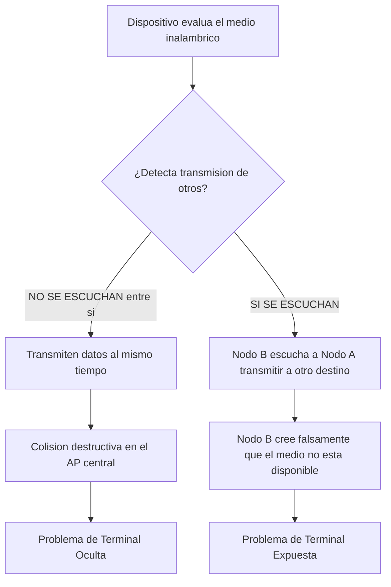

# TEMAS
* Modelo de referencia OSI
	* Capa de Enlaces de datos ✅
* Metodos de acceso al Medio   ✅
	* CSMA_CD ✅
	* CSMA_CA ✅
	* Token RING (802.5) ❌
* Estandar IEEE 802.3
	* Ethernet ✅
		* Trama Ethernet ✅
		* Direccion MAC ethernet ✅
	* Fast ethernet / giga thernet / 10 gigabit ethernet ✅
* Conceptos de Segmentación de Tráfico: ✅
	*  Dominio de colision✅
	* Dominio de Brodcast✅
* DISPOSITIVOS
	* Tarjeta de interfaz de red (NIC)
	* HUB o Concentrador
	* puente o bridge
	* Switch o Conmutador
		* Tecnicas de Conmutacion
		* Aprendizaje del Switch
		* Redundancia en una red
		* Blcues en una RED
* IEEE 802.1D STP (Spinning Tree Protocolo)
	* Funcionamiento del STP
	* Estados de los puerots
* WLAN - Redes inalambricas (Wireless Local Area Network) clasificación teórica por área de cobertura y movilidad
* Access Point (AP)
	* Router Modem WIFI
* Arquitectura de IEEE 802.11  _estándar técnico_ y arquitectónico que define las reglas de cómo se comunican
	* Componentes - dispositivos que vamos a conectar ✅
	* Caractersiticas ❌
	* Modo de implementacion ✅
	* Servicios del sistema de distribucion ✅
	* Asociacion de un cliente inalambrico  ❌
	* Consideraciones ❌
	* Pilas de protocolos , Estandares 802.11 ❌
		* Protocolo [CSMA_CA] en la Subcapa MAC 802.11
	* Seguridad en Redes inalambricas ❌
	* Metodos de Autenticacion ❌
	* Estructura de la Trama 802.11 ⚠️
	* Blutu (IEEE 802.15) ✅
	* WIMax (IEEE 802.16) ✅

# RESUMEN POR PREGUNTAS
## Modelo de referencia OSI

###  1¿Qué capa del modelo OSI se encarga de enrutar los paquetes? (inventada por ia) ⚠️
- [ ] Capa de aplicación
- [ ] Capa de enlace de datos
- [ ] Capa de red
- [ ] Capa de transporte
#### rta
- [ ] Capa de red
### Capa de Enlaces de datos
![[Pasted image 20260529180229.png|308]]

La Capa de enlace de datos es la capa 2 del modelo osi. esta se subidivde en dos capas: LC (Control de Enlace Lógico) y MAC (Control de Acceso al Medio). 

La LLC se relaciona con todo el mundo lógico (el software de las capas superiores), mientras que la MAC se relaciona con las capas inferiores, siendo más vinculada al hardware

La subcapa LLC (IEEE 802.2 Control de Enlace logico) es común a todas las tecnologías y encapsula paquetes provenientes de la capa de red en tramas, describiendo su contenido antes de pasarlas a la subcapa MAC

La subcapa MAC (control de Acceso al Medio) abarca diferentes tecnologías como Ethernet 802.3 (LAN), Wi-Fi 802.11 (WLAN) y Bluetooth 802.15 (PAN). Estas ocupan la capa física y parte de la capa de Enlace, especialmente la parte de acceso al medio, que varía según la tecnología sea alambrada o inalámbrica. La subcapa MAC prepara los datos/tramas de la subcapa LLC para su transmisión a través de un medio específico, siendo dependiente del medio de transmisión (cable UTP, fibra óptica, el aire).
	Aquí es donde operan los [Métodos de acceso al medio] para organizar las transmisiones.

#### ==2. Las tecnologías Ethernet, Fastethernet y Gigaethernet ejecutan funciones de las siguientes capas==
- [ ] Capa física y subcapas MAC y LLC de la capa de enlace. 
- [ ] Capa física, capa de enlace y capa de red. 
- [ ] Capa física y subcapa LLC de la capa de enlace. 
- [x] Capa física y subcapa MAC de la capa de enlace. 
- [ ] Capa física y capa de enlace.
##### RTA
**Capa física y subcapa MAC de la capa de enlace.**
![[Pasted image 20260529180935.png|484]]
- justificacion
- **División de la Capa de Enlace (La causa arquitectónica):** Para separar las funciones lógicas de las físicas, la Capa de Enlace de Datos se dividió conceptualmente en dos subcapas: la subcapa superior **LLC** (Control de Enlace Lógico) y la subcapa inferior **MAC** (Control de Acceso al Medio).
- **El rol independiente de la subcapa LLC:** La subcapa LLC (estandarizada como IEEE 802.2) tiene como función principal relacionarse con el software y la capa de red superior. Su efecto estructural es ser **común e independiente a todas las tecnologías**; no le importa si los datos viajan por un cable de cobre, fibra óptica o el aire. Su trabajo es simplemente encapsular el paquete (ej. IPv4) y marcar en la trama a qué protocolo superior debe entregarse en el destino.
- **La dependencia del hardware en Ethernet (El efecto):** En contraposición, las tecnologías Ethernet (IEEE 802.3), Fast Ethernet y Gigabit Ethernet son protocolos altamente dependientes de la naturaleza física del medio. Se encargan de preparar los datos para transmitirse por medios guiados específicos, resolver colisiones de señales mediante contienda (CSMA/CD) y asignar direcciones físicas grabadas en el hardware (MAC).
- **Conclusión de la causalidad:** Debido a esta alta dependencia física, se establece estrictamente que la tecnología Ethernet, en todas sus velocidades, **ocupa la Capa Física y solamente la subcapa MAC de la capa de enlace**. Como indican las fuentes, Ethernet "no abarca la sub capa de llc sino que avanza la sub capa mac que [es] el control de acceso al medio".

#### ==3. ¿En qué capa trabaja la placa de red? Seleccion una: 
- [ ] En la subcapa LLC y física
- [ ] En la física, de enlace y red
- [ ] En la física y de red
- [x] En la física y subcapa MAC
- [ ] Ninguna de las opciones
##### rta
En la física y subcapa MAC

#### ==4. ¿Cuál es un elemento básico de un protocolo de capa de enlace ⚠️==
- [ ] Establecimiento de enlace
- [ ] Paquete
- [x] Control de acceso al medio
- [ ] Recuperación de errores
- [ ] Señalización
- [ ] Segmento
- [ ] Control de tráfico
- [ ] Fibra óptica
##### rta
- [ ] Control de acceso al medio
-
Decide cuándo y quién puede usar el canal (por ejemplo, el aire en Wi-Fi o un cable en
Ethernet).

### ==5. ¿En qué capa del modelo OSI se define la topología de la red? ==
- [x] Física
- [ ] Red
- [ ] Enlace
- [ ] Transporte
- [ ] Aplicación
#### rta
- [ ] Física
### 6. El modelo OSI fue desarrollado por:
- [ ] IEE
- [ ] ITU
- [x] ISO
- [ ] RFC
- [ ] IET
#### rta
- [ ] ISO
## Metodos de acceso al Medio
viven en la subcapa MAC de la capa 2. Esta subcapa es la que se encarga de organizar "quién habla y cuándo" para que las señales no choquen en el medio físico.
>[!note] **Redes de Difusión**
>Son entornos donde múltiples dispositivos comparten un mismo canal físico de comunicación, generando la necesidad de organizar quién transmite

>[!question] Como asignar el canal entre varios usuarios en un entorno de difusion?
>* ***Asignación Estática:** Se divide el canal de manera matemática por tiempo (TDMA) o frecuencia (FDMA), evitando la competencia.
>  * **Asignación Dinámica (Por Contienda):** Los equipos compiten dinámicamente por el uso del medio. (CSMA_CD Y CSMA_CA)

### 7 Completar los métodos de acceso al medio de la actualidad: (inventada por ia) A) de acceso inalambrico B) de acceso cableado
- [x] A) CSMA/CA ; B) CSMA/CD
- [ ] A) Token Ring ; B) CSMA/CD
- [ ] A) CSMA/CA ; B) Token Ring
#### rta
- [ ] A) CSMA/CA ; B) CSMA/CD

#### ==8. ¿Cuáles son métodos de acceso al medio más difundidos en LAN?==
- [x] CDMA/CD
- [ ] X25
- [ ] HDLC
- [ ] PPP
- [ ] LAPD
- [ ] LAPB
##### rta
- [ ] CDMA/CD
En una LAN (red local), los dispositivos comparten el medio (el cable o el aire) para enviar
datos, y necesitan reglas para no chocarse al hablar. Esas reglas se llaman métodos de
acceso al medio.
El más común y difundido en LAN cableadas (Ethernet) es:
CSMA/CD (Carrier Sense Multiple Access with Collision Detection)

es un protocolo utilizado en redes de área local (LAN) Ethernet clásicas. Su función principal consiste en verificar la presencia de transmisiones en el canal antes de enviar datos.

El dispositivo "escucha" el canal; si está libre, transmite. Si dos equipos transmiten simultáneamente, sus señales chocan produciendo una **Colisión**. Al detectar el choque, dejan de enviar datos, lanzan una **Señal de Atasco** y esperan un tiempo aleatorio antes de reintentar
### CSMA_CA
método diseñado para redes inalámbricas debido a la vulnerabilidad del entorno, donde la seguridad de los datos es crucial ya que pueden ser interceptados en el aire, y la detección de colisiones no es posible.
![[Pasted image 20260531120249.png|269]]

* La estación origen escucha el medio para determinar su disponibilidad y, cuando está libre, anuncia su intención de transmitir a todos los dispositivos mediante una trama de control RTS (Request to Send). La RTS especifica las direcciones MAC de origen y destino, identificando emisor y receptor.
	* repuestas y confirmaciones
		* El dispositivo destinatario responde con CTS (Clear to Send) si está libre para recibir datos, o con RxBUSY (Receptor Ocupado) si está ocupado. El emisor espera hasta que el destinatario esté libre antes de transmitir.
	* Tramisison de datos
		* La estación espera un breve tiempo aleatorio adicional para prevenir colisiones antes de transmitir, y solo lo hace si el medio sigue libre. Al recibir el CTS, la transmisión de datos DATA comienza.
	* Acuse de recihbo
		* Después de enviar los datos, el receptor envía un ACK (Acuse de Recibo) si se recibieron correctamente, o un NAK (Negativo Acuse de Recibo) en caso contrario (por ejemplo, si algún bit llegó mal).
	* control de calidad de transmision
		* Debido a la inseguridad y posibles daños en los datos, el método asegura un control riguroso, lo que hace que las transmisiones inalámbricas sean más lentas en comparación con las alámbricas.
		* 

#### 9 ¿Cuál es el principal objetivo del protocolo CSMA/CA en redes inalámbricas? (inventada por ia) ⚠️
- [ ] Detectar colisiones.
- [ ] Prevenir colisiones.
- [ ] Evitar interferencias externas.
- [ ] Enviar datos sin necesidad de veri�cación.
##### rta
- [ ] Prevenir colisiones.

#### ==10. En el método de acceso CSMA/CA, el mensaje RTS lo envía:==
- [ ] Hub
- [x] Dispositivo origen (también DATA)
- [ ] Switch
- [ ] Dispositivo destino (CTS-ACK-NAK)
##### rta
- [ ] Dispositivo origen (también DATA)

En redes Wi-Fi, para evitar que los datos choquen en el aire, se usa CSMA/CA (Evita
Colisiones).
Antes de mandar los datos, el dispositivo origen (el que quiere enviar) primero pide
permiso mandando un mensaje llamado RTS (Request To Send)

#### ==8. En el método de acceso al medio utilizado por las redes inalámbricas, los dispositivos cuando tienen que transmitir una trama:==
- [ ] Esperan que les llegue una trama de control denominada token para poder transmitir datos
- [x] Escuchan el medio y si está libre, esperan un tiempo aleatorio y envían una trama RTS indicando dirección MAC origen y dirección MAC destino
- [ ] Escuchan el medio y si está libre, le avisan al emisor que están dispuestos a recibir datos mediante la trama de control RTS
- [ ] Escuchan al medio y si está libre, envían los datos hacia el medio de transmisión
- [ ] Garantizan que las tramas que colisionan, sean confirmadas por el receptor con una trama de control ACK
##### rta
Escuchan el medio y si está libre, esperan un tiempo aleatorio y envían una
trama RTS indicando dirección MAC origen y dirección MAC destino

Las redes inalámbricas (Wi-Fi) utilizan el método de acceso al medio llamado CSMA/CA
(Carrier Sense Multiple Access with Collision Avoidance).
A diferencia de las redes cableadas (que usan CSMA/CD), en las inalámbricas no se
pueden detectar colisiones fácilmente, por eso se evitan usando tramas de control como:
RTS (Request To Send), CTS (Clear To Send)

#### ==9. En el método de acceso CSMA/CA el mensaje RTS contiene:==
- [x] Direcciones MAC del dispositivo origen y destino
- [ ] Direcciones IP del dispositivo origen y destino
- [ ] Número de puerto origen y destino
- [ ] Relación IP-MAC del dispositivo de destino
##### rta
- [ ] Direcciones MAC del dispositivo origen y destino
#### ==10. ¿Qué trama usa una estación de trabajo, cuando quiere transmitir a otro puesto de trabajo utilizando CSMA/CA?==
- [ ] Ninguna de las opciones
- [ ] RxBUSY
- [ ] ACK
- [x] RTS
- [ ] CTS

##### rta
RTS

justif:
La respuesta correcta es:

- [x] **RTS**

Para comprender el **porqué** de esta respuesta basándonos en la arquitectura de redes inalámbricas y el método CSMA/CA (Carrier Sense Multiple Access / Collision Avoidance), analicemos la secuencia de comunicación:

- **El inicio (La intención de transmitir):** Cuando una estación origen tiene datos para enviar y escucha que el medio inalámbrico se encuentra libre, anuncia su intención a todos los dispositivos enviando primero una trama de control corta denominada **RTS (Request to Send - Solicitud para enviar)**.
- **El propósito (La prevención):** Esta trama RTS contiene las direcciones MAC tanto del equipo origen como del destino, y sirve para hacer una reserva del canal inalámbrico por el tiempo que durará la transferencia, evitando así que otras estaciones transmitan y generen colisiones.

**Por qué las demás opciones son incorrectas para la estación que quiere iniciar la transmisión:**

- **CTS (Clear to Send) o RxBUSY:** Estas no son enviadas por el origen, sino que son las tramas de respuesta que envía el **dispositivo destino**. Si el destino recibe el RTS y está preparado para comunicarse, contesta con CTS (listo para enviar); si por el contrario está ocupado, contesta con RxBUSY.
- **ACK (Acuse de recibo):** Es la trama de control que envía el dispositivo destino recién **al final de la transacción**, para confirmar que la transmisión de datos (DATA) se recibió de manera íntegra y sin errores.
#### ==11. En cuáles de los siguientes dispositivos se ejecuta el método de acceso al medio CSMA/CA (seleccione dos):⚠️==
- [ ] Placas de red Ethernet
- [ ] Cable UTP
- [x] Placas de red inalámbricas
- [ ] Switches
- [ ] Hubs
- [x] Access Point
##### rta
- [ ] Placas de red inalámbricas
- [ ] - [ ] Access Point

El método CSMA/CA (Carrier Sense Multiple Access with Collision Avoidance) se utiliza en
redes inalámbricas (como las basadas en IEEE 802.11, es decir, Wi-Fi).
A diferencia de las redes cableadas que usan CSMA/CD (con detección de colisiones), las
inalámbricas usan CSMA/CA para evitar colisiones, ya que no pueden detectarlas
fácilmente en el aire

### Token ring 
Método lógico de transmisión estructurado en anillo. Es determinístico y libre de colisiones. Consiste en hacer circular un testigo llamado **[Token]** por la red. Únicamente la máquina que posee dicho token en su poder tiene el derecho a insertar datos en el medio físico
![[{7407E1FE-11BD-4E1E-9629-D3B2795BCFA1}.png|278]]
En esta configuración, los datos circulan en una única dirección, formando un círculo a través de las estaciones conectadas
* Proceso de transmisión: Cuando una estación recibe el token y no tiene datos, lo pasa a la siguiente. Si tiene datos, convierte el token en una trama y la lanza al medio de transmisión.
*  Verificación de destino: Cada estación verifica si la trama está dirigida a ella por medio de la dirección MAC. Si no es el caso, la trama sigue su curso; si es correcto, la estación procesa la trama y envía un acuse de recibo al origen.
*  Token como permiso: El token actúa como un permiso para enviar datos, permitiendo que solo una máquina transmita a la vez y evitando colisiones.
*  Método determinístico: Garantiza que las máquinas podrán transmitir datos, pero se considera lento en comparación con otras tecnologías.
*  Recorrido completo de la trama: La trama completa da una vuelta desde el origen hasta el destino, y luego se genera un nuevo token para habilitar la transmisión desde otras estaciones.
####  12 El método de acceso al medio Token Ring garantiza que no haya colisiones en la red. (inventada por ia)
verdadero 
falso
##### rta
verdadero
## Estandar IEEE 802.3 (Ethernet)
### Ethernet
representa la primera red cableada y es la tecnología de LAN más extendida. Opera en las capas de enlace y física del modelo OSI, utilizando la subcapa MAC. Con velocidades de 3 a 10 Mbps, utiliza CSMA/CD para el acceso al medio

Es una tecnología de máximo esfuerzo, sin retransmisión de tramas y sin confirmación de recepción

#### esto capaz ta un poquito de mas ❌
Esta topología tenía algunos inconvenientes como gran número de colisiones, que se resuelve con el CSMA/CD, o dificultad para conectar un nuevo dispositivo, cada vez que se quiere incorporar una máquina se debía dar de baja la red. Se hacía cuando la red no estaba en producción.

Para superar los problemas del cable coaxial, se adoptó la tec. Ethernet sobre UTP, destacando 10BaseT con cable de par trenzado y HUBs. Esta implementación facilitó la conexión y desconexión de computadoras sin interrumpir toda la red, operando en modo Half- Dúplex y utilizando CSMA/CD.

La evolución llevó a Ethernet conmutada, reemplazando el HUB por un switch en la capa de enlace. El switch, más inteligente, permite transmisiones simultáneas, eliminando colisiones y reduciendo el dominio de colisión a cada puerto. No requiere CSMA/CD, admite comunicación full dúplex y se utiliza ampliamente.

Destacan:
• No hay colisiones entre PCs conectadas a un switch.
• Comunicación full dúplex: recibir y enviar simultáneamente.
• Se usa en la actualidad.
• Switch gestiona tramas, evitando colisiones. Conmuta para comunicaciones simultáneas.
• Fast Ethernet para estaciones de trabajo, Gigabit Ethernet y 10 Gigabit Ethernet para servidores

> [!question] **Pregunta 2: Transmisiones simultáneas en un Switch** **Alumno:** _"¿Qué pasaría si en esta topología con un switch, dos orígenes quieren transmitir simultáneamente a un mismo receptor (ej. un Servidor)?"_. 
> **Respuesta del Profesor:** Explicó que las tramas **no colisionan**. Un **[Switch]** es un dispositivo inteligente que cuenta con memoria o **[Buffer]**. Al recibir ambas tramas al mismo tiempo dirigidas al mismo destino, el switch almacena una en cola, entrega primero la otra, y una vez que el puerto físico se libera, envía la que estaba en espera.
#### trama ethernet
El formato de la trama Ethernet, utilizado en la capa 2 para la transmisión de datos entre máquinas, varía entre Ethernet II y IEEE 802.3.

Ethernet II

| Campo                        | Tamaño                              |
| ---------------------------- | ----------------------------------- |
| Preámbulo                    | 8 bytes (sincronización de relojes) |
| Dirección MAC Destino        | 6 bytes                             |
| Dirección MAC Origen         | 6 bytes                             |
| Tipo (protocolo encapsulado) | 2 bytes                             |
| Datos                        | 46–1500 bytes                       |
| FCS (CRC — verificación)     | 4 bytes                             |
> **La MAC destino va primero** intencionalmente: si no coincide con la MAC del receptor, se descarta inmediatamente sin leer el resto (optimización).

---
IEEE 802.3:
• Preambulo de 7 bytes y delimitador de inicio de trama de 1 byte.
• 6 bytes para dirección de destino y 6 para dirección de origen (MAC).
• Campo tipo > 1536. Protocolo que se está usando. Dice que se encapsuló de la capa de arriba.
• Campo longitud <= 1536. Tamaño de la trama, lo que se está enviando de datos en la trama.
• 4 bytes de secuencia de verificación de trama (CRC)

Tamaño de la Trama ethernet

$$\text{Tama{n}o}_{Mín} = 46_{datos} + 18_{cabecera/cola} = 64 \text{ bytes}$$

$$\text{Tama{n}o}_{Máx} = 1500_{datosMAX} + 18_{cabecera/cola} = 1518 \text{ bytes}$$

> **El relleno (padding) NO es un campo definido en la norma.** Si los datos son < 46 bytes, se rellena para alcanzar el mínimo, pero forma parte del campo "Datos".

##### 13. Tamaño máx. de trama Ethernet : (inventada po ia) 
- [ ] 512 bytes
- [ ] 2048 bytes
- [ ] 1000 bytes
- [x] 1518 bytes
###### rta
- [ ] 1518 bytes

##### ==14. El campo de la trama Ethernet que permite verificar la integridad de la trama es:== 
- [x] Secuencia de verificación de trama (CRC o FCS)
- [ ] Tipo
- [ ] Ninguno porque Ethernet no es fiable
- [ ] Preámbulo
- [ ] CTS
###### rta
- [ ] Secuencia de verificación de trama (CRC o FCS)

##### ==15. Una computadora tiene que enviar un archivo de 5 Kbytes a través de la tecnologia GigaEthernet. Si desea maximizar el uso de la MTU (unidad máxima de transferencia), ello implica que enviará:==
- [ ] 5 tramas 
- [ ] 2 tramas 
- [ ] 3 tramas 
- [ ] 7 tramas 
- [x] 4 tramas 
- [ ] 6 trama
###### rta
La respuesta correcta es:

- [x] **4 tramas**

==La MTU de Ethernet es de 1500 bytes.
El archivo pesa 5120 bytes (5 KB).
Dividiendo: 5120 ÷ 1500 ≈ 3.41 → se necesitan 4 tramas (3 de 1500 bytes y 1 de 620
bytes)==

Para comprender el **porqué** de este resultado basándonos en la arquitectura de redes y el encapsulamiento de datos, analicemos matemáticamente cómo se divide la información para viajar por el medio físico:

- **==1. La restricción estructural (La MTU)==:** La MTU (Unidad Máxima de Transferencia) define el tamaño máximo de la "carga útil" o campo de datos que puede transportar una trama. En la tecnología Ethernet (y por ende en Gigabit Ethernet, ya que mantiene estricta compatibilidad con los formatos de las versiones anteriores), el campo de datos permite un ==**máximo de 1500 bytes**.==
- **2. La causa (El tamaño del archivo):** La computadora necesita enviar un archivo de **5 Kbytes**. Independientemente de si tomamos la medida comercial de almacenamiento ==($5 \text{ KB} = 5000 \text{ bytes}$)== o la medida binaria exacta ($5 \text{ KiB} = 5120 \text{ bytes}$), la cantidad de datos supera ampliamente la capacidad de una sola trama.
- **3. El efecto (La división en tramas):** Para maximizar la MTU, la computadora llenará cada trama hasta su límite permitido de 1500 bytes antes de armar la siguiente:
    - **Trama 1:** Transporta los primeros **1500 bytes**.
    - **Trama 2:** Transporta los siguientes **1500 bytes** (Acumulado: 3000 bytes).
    - **Trama 3:** Transporta los siguientes **1500 bytes** (Acumulado: 4500 bytes).
    - **Trama 4:** Transporta el **resto de los bytes** (los 500 o 620 bytes sobrantes, dependiendo del cálculo exacto del Kbyte), los cuales son perfectamente válidos ya que el tamaño mínimo de datos exigido por Ethernet es de 46 bytes.

**Conclusión:** ==Al dividir los $\approx 5000 \text{ bytes}$ totales por la MTU máxima de $1500 \text{ bytes}$ por trama ($5000 / 1500 = 3.33$), el resultado nos indica que se llenarán **3 tramas completas** y se requerirá ineludiblemente una **4ª trama** ==para transportar el remanente de los datos. Las demás opciones numéricas (2, 3, 5, 6, 7) son matemáticamente incorrectas para este escenario.
##### ==16. Una pc tiene que enviar un archivo de 5 Kbytes a través de la tecnología Fast Ethernet. Si desea maximizar el uso de la MTU (esto implica que enviará):==
- [x] 4 tramas
- [ ] 5 tramas
- [ ] 2 tramas
- [ ] 1 trama
- [ ] 3 tramas
###### rta
4 tramas

El archivo pesa 5 Kbytes, o sea: 5 × 1024 = 5120 bytes

Fast Ethernet tiene una MTU (unidad máxima de transmisión) de 1500 bytes de datos
útiles por trama (sin contar cabeceras).

Entonces:
Podés mandar 3 tramas de 1500 bytes cada una → 3 × 1500 = 4500 bytes
Y te sobran 5120 – 4500 = 620 bytes

#### MAC ethernet
- **48 bits** (6 bytes) expresados en **12 dígitos hexadecimales**.
- Grabada de fábrica en la ROM de la NIC.
- **Primeros 24 bits (OUI):** identifican al fabricante (asignado por IEEE).
- **Últimos 24 bits:** asignados por el fabricante al producto.
* Para visualizarla: en Windows con "ipconfig /all" y en Linux con "ifconfig".
* • Son direcciones de capa 2.

##### TIPOS DE DIRECCIONES MAC

| Tipo          | Descripción                                          | En campo...      |
| ------------- | ---------------------------------------------------- | ---------------- |
| **Unicast**   | Identifica un dispositivo único                      | Origen y Destino |
| **Broadcast** | FF-FF-FF-FF-FF-FF — todos los equipos del segmento   | Solo Destino     |
| **Multicast** | 01-00-5E-XX-XX-XX — grupo específico de dispositivos | Solo Destino     |

> Una MAC de **origen** siempre es tipo **unicast**.

#####  ==17. La siguiente dirección 01:00:5E:00:04:C9 aparece en el campo destino de una trama
- [ ] Es una dirección jerárquica.
- [x] La tama será procesada solo por una PC.
- [ ] Todas las PCs de la LAN procesarán la tama.
- [ ] No puede aparecer esa dirección en el campo de destino de una trama.
- [x] La trama será procesada solo por un grupo de PCs de la LAN.
###### rta
- [ ] La trama será procesada solo por un grupo de PCs de la LAN.
empieza con 01, lo que indica que es una dirección multicast (el bit menos signi�cativo
del primer byte está en 1).
##### ==18. Una dirección MAC es== ⚠️
- [ ] Física, jerárquica, depende de la ubicación dentro de la organización
- [ ] Lógica, jerárquica, depende de la ubicación dentro de la organización
- [x] Física, plana, es independiente de la ubicación dentro de la organización
- [ ] Lógica, plana, es independiente de la ubicación dentro de la organización
###### rta
- [ ] Física, plana, es independiente de la ubicación dentro de la organización
##### ==19. Una dirección MAC Ethernet está compuesta por 2: (2 opciones son correctas)== ⚠️
- [x] 6 bytes
- [ ] 8 bytes
- [ ] 32 bits
- [x] 48 bits
- [ ] 12 bytes
###### rta
- [ ] 6 bytes
- [ ] - [ ] 48 bits

##### ==20. ¿En qué capa del modelo OSI se definen las direcciones Físicas o de Hardware?== ⚠️
- [ ] Física
- [ ] Transporte
- [x] Ninguna es correcta
- [ ] Aplicación
- [ ] Red
###### rta
ninguna es correcta

Comentarios
Las direcciones físicas o de hardware, como la dirección MAC, se usan para identi�car
dispositivos dentro de una red local (LAN).
Estas direcciones se de�nen en la Capa 2 del modelo OSI, que es la Capa de Enlace de
Datos.
##### 21 OUI en dirección MAC identifica (inventada por ia)
- [ ] Usuario 
- [ ] Puerto 
- [x] Fabricante 
- [ ] Protocolo
###### rta
La respuesta correcta es: **Fabricante**.

- **La estructura física (La Causa):** Como vimos anteriormente, todo dispositivo necesita una placa de red que opera en la Capa 2 y posee una ==dirección MAC (física, plana y única) de 48 bits o 6 bytes de longitud.==
- **La división del direccionamiento (El Efecto):** Para garantizar que no existan dos direcciones MAC iguales en el mundo, el IEEE administra la asignación de estas direcciones dividiéndolas en dos partes exactas:
    1. Los ==primeros 24 bits conforman el **OUI (Identificador Único Organizacional)**, cuya función estricta es identificar de manera exclusiva a la organización o **fabricante** de la placa de red.
    2. Los últimos 24 bits conforman el "Identificador del producto". Una vez que el fabricante obtiene su OUI, es él mismo quien administra y hace variar esta segunda mitad para asignarle una combinación única a cada placa física individual que produce.

**Por qué las demás opciones son incorrectas:**

- **Usuario:** Arquitectónicamente falso. Las direcciones de Capa 2 identifican un componente de hardware (la interfaz de red) que envía o recibe los datos, pero no tienen conocimiento de la persona u operador que está utilizando el dispositivo.
- **Puerto:** Aunque los switches asocian las direcciones MAC a sus puertos físicos dentro de su tabla CAM para saber por dónde conmutar la información, la dirección MAC y su OUI en sí mismos pertenecen a la placa de red del dispositivo final, no identifican la boca del switch.
- **Protocolo:** Es un error de capa y de campo. Para identificar qué protocolo viaja dentro de la unidad de datos se utilizan otros controles, como el campo "Tipo" en la cabecera de la trama Ethernet (que avisa qué protocolo de red se está encapsulando).
##### ==22. Si se quiere que una trama sea procesada por todos los dispositivos de una determinada LAN, la dirección de destino será:==
- [ ] 127.0.0.0.1
- [ ] 255.255.255.255
- [ ] 01:00:5E:98:76:54
- [x] FF:FF:FF:FF:FF:FF
###### rta
La respuesta correcta es:

- [x] **FF:FF:FF:FF:FF:FF**

- **La unidad de datos (La Causa):** La consigna especifica que lo que se desea enviar es una **trama**. Como hemos visto, ==las tramas son las unidades de datos de la **Capa de Enlace de Datos (Capa 2)** y, por lo tanto, utilizan ineludiblemente el direccionamiento físico o de hardware: las **direcciones MAC**.==
- **El destino múltiple (El Efecto):** Para que esa trama sea procesada obligatoriamente por **todos los dispositivos** de un mismo segmento de red (LAN), se debe utilizar una dirección MAC de difusión o **broadcast**. Estructuralmente, esta dirección requiere tener sus **48 bits encendidos (en "1")**, lo cual se representa en formato hexadecimal exactamente como **FF:FF:FF:FF:FF:FF**.

**Por qué las demás opciones son incorrectas:**

- ==**255.255.255.255:** Es la "trampa" arquitectónica de la pregunta. Aunque representa la dirección de difusión o broadcast para la red local, esta es una **dirección lógica IPv4**, la cual opera en la Capa 3 (Interred) y se utiliza para direccionar **paquetes**, no tramas.==
- **01:00:5E:98:76:54:** Es incorrecta por su alcance. Las direcciones MAC que comienzan con el identificador `01:00:5E` corresponden a direcciones **Multicast** (multidifusión). Su función es enviar la trama únicamente a un **grupo específico** de dispositivos que estén suscritos, no a todos los de la LAN.
- **127.0.0.0.1:** Es arquitectónicamente falsa por dos motivos. Primero, tiene un error estructural evidente al poseer 5 octetos en lugar de 4. Segundo, el rango `127.x.x.x` está reservado exclusivamente para direcciones lógicas de **loopback** (bucle invertido), cuyo fin es probar el funcionamiento interno de la propia máquina emisor, no para comunicarse con el resto de la LAN.

### Fast ethernet / giga thernet / 10 gigabit ethernet
| Tecnología                | Estándar IEEE | Velocidad | Medio Físico y Características Principales                                                                               |
| :------------------------ | :------------ | :-------- | :----------------------------------------------------------------------------------------------------------------------- |
| **[Fast Ethernet]**       | 802.3u        | 100 Mbps  | Usa [Autonegociación]. Puede usar UTP Cat 5 (100m) o Fibra Óptica (hasta 2 km).                                          |
| **[Gigabit Ethernet]**    | 802.3ab       | 1000 Mbps | Soporta Hubs (Half) y Switches (Full). Introduce amplio uso de fibra multimodo y monomodo.                            |
| **[10 Gigabit Ethernet]** | 802.3ae       | 10 Gbps   | **Solo opera en modo [Full-Duplex]**. Uso principal en troncales universitarias/empresariales y servidores de alta gama. |
|                           |               |           |                                                                                                                          |

#### ==23. ¿Cuál es la máxima tasa de bits a la que funcionará una LAN tipo Ethernet si el switch tiene 24 puertos de 1 Gb/s (c/u), dos puertos de fibra óptica de 10 Gb/s (c/u), la instalación de cableado ha sido certificada para categoría 6 y las placas de red de las PCson Fast Ethernet?==
- [ ] 1 Gb/s
- [x] 100 Mb/s
- [ ] 2,4 Gb/s
- [ ] 22,4 Gb/s
- [ ] 24 Gb/s
##### rta
100 Mb/s

Aunque el switch tiene puertos de alta velocidad (1 Gb/s y 10 Gb/s) y el cableado es
categoría 6 (que soporta hasta 10 Gb/s), la velocidad �nal de la red depende del
dispositivo más lento del enlace, es decir, de las placas de red de las PCs.

==Las placas de red mencionadas son Fast Ethernet, que funcionan a 100 Mb/s.==

#### ==24. Un usuario se queja que la velocidad de su PC en la red es inapropiada, por ello el administrador decide actualizar la placa de red de la PC de dicho usuario de FastEthernet a GigaEthernet. esto implica que (seleccione dos):==
- [ ] Se debe actualizar la dirección IPv4 de la PC
- [x] La velocidad de la placa será de 1000Mbps
- [ ] Se debe reinstalar el sistema operativo
- [x] La PC tendrá otra dirección MAC
- [ ] La velocidad de la placa será de 100Mbps
- [ ] La velocidad ahora es 100 veces más rapida
##### rta
- [ ] La velocidad de la placa será de 1000Mbps
- [ ] La PC tendrá otra dirección MAC

atento: _la opción de que "es 100 veces más rápida" es falsa, ya que el salto de 100 Mbps a 1000 Mbps representa un incremento de 10 veces, no de 100)._
#### ==25. Se deben conectar dos edi�cios en un campus universitario, los cuales están ubicados a 200 metros de distancia uno del otro. El administrador de red debe decidir qué tecnología utilizar. Cuáles de las siguientes se podría implementar: ⚠️
- [ ] 1000BASE-CX
- [ ] 1000BASE-T
- [ ] 1000BASE-TX
- [ ] 1000BASE-T4
- [x] 1000BASE-SX
##### rta
1000BASE-SX

---
La respuesta que has marcado contiene un error. La única opción verdaderamente correcta es:

- [x] **1000BASE-SX**

Para comprender el **porqué** de esta resolución, debemos analizar las limitaciones físicas de distancia (segmento máximo) que establece la arquitectura Gigabit Ethernet para cada tipo de medio de transmisión:

- **==La solución viable (1000BASE-SX):** Según la bibliografía de la materia, el estándar 1000Base-SX utiliza cable de **fibra óptica** (específicamente fibra multimodo) y permite alcanzar un segmento máximo de **550 metros**. Al estar los edificios separados por una distancia de 200 metros, esta es ineludiblemente la única tecnología de las opciones presentadas que es capaz de cubrir el trayecto de un edificio a otro garantizando la conectividad y la integridad de la señal.==

**Por qué las demás opciones son incorrectas:**

- **1000BASE-T (El error en tu selección):** Esta tecnología transmite sobre 4 pares de cable de cobre de par trenzado UTP (categoría 5). Arquitectónicamente, el límite físico estandarizado para cualquier segmento Ethernet sobre cable UTP es estrictamente de **100 metros**. Intentar conectar equipos a 200 metros con este cable violaría el estándar, lo que provocaría atenuación y la caída de la conexión.
- **1000BASE-CX:** Este estándar de Gigabit Ethernet utiliza cable de cobre STP (par trenzado blindado) y está diseñado exclusivamente para distancias muy cortas, permitiendo un segmento máximo de apenas **25 metros**.
- **1000BASE-TX y 1000BASE-T4:** Las siglas "TX" y "T4" presentadas aquí son una trampa de nomenclatura. Según tus apuntes, esos sufijos pertenecen a la generación anterior de **Fast Ethernet** (100Base-TX y 100Base-T4), no a Gigabit Ethernet. E ==incluso si obviáramos ese error de nombre, ambas tecnologías siguen operando sobre cables de par trenzado de cobre con el mismo límite estructural máximo de **100 metros**, lo cual resulta insuficiente para el trayecto requerido de 200 metros.==![[Pasted image 20260601144957.png]]![[Pasted image 20260601145002.png]]![[Pasted image 20260601145007.png]]
## Conceptos de Segmentación de Tráfico:
### ==26. Determine a partir de la topología, cuáles de las afirmaciones son correctas (seleccione dos):
![[{CE97C7A5-1278-401E-9F0C-331851C13E73}.png]]
- [ ] Existen 6 dominios de colisión
- [ ] Existen 4 dominios de colisión
- [ ] Existen 5 dominios de colisión
- [ ] Existe 1 dominio de broadcast
- [ ] Existen 3 dominios de broadcast
- [x] Existen 7 dominios de colisión
- [x] Existen 2 dominios de broadcast
#### rta
Existen 7 dominios de colisión
Existen 2 dominios de broadcast

### Dominio de colision
Segmento físico donde las señales eléctricas o electromagnéticas pueden chocar y destruirse. 
* Dividido por Switches y Routers.
	* Desde el switch al router un dominio de colisión, y cada puerto del router es un dominio de colisión separado.
* Repetidores y hubs extienden el dominio de colisión
	![[Pasted image 20260528190205.png|229]]

#### ==27. Qué dispositivo divide dominios de colisión? Seleccione una: 
Switch

#### ==28. Un switch de 24 bocas (puertos) está conectado a un hub (en el puerto 1), a un router (en el puerto 2) y a computadoras el resto de los puertos. Determine cuantos dominios de colisión existen:
- [ ] 2
- [ ] 3
- [ ] 22
- [ ] 1
- [x] 24
- [ ] Dependen si se conectan PC o hubs
- [ ] 23
##### rta
En esta topología existen exactamente **24 dominios de colisión**.

#### ==29. Si en una LAN se tienen 3 Switch como los de la figura==
![[{4E39FA54-ADC9-4BB3-B39E-0A43F6EC118A}.png]]
##### rta
comentarios
24 puertos x 3 switches = 72 + (2 puertos más pequeños x 3 switches = 6) = 78.
LA RESPUESTA CORRECTA SEGÚN AÑOS ANTERIORES ES 82.
### Dominio de brodcast
Área lógica de la red donde los dispositivos pueden comunicarse por difusión masiva sin atravesar un enrutador. **Solo los routers dividen dominios de broadcast
![[Pasted image 20260528190752.png|270]]

#### ==30. ¿Qué permiten los dispositivos de capa 3 en la red?==
- [ ] Segmentación de LAN
- [ ] Reducción de la congestión
- [ ] Ninguna es correcta
- [ ] Planificar red
- [ ] Segmentación de tramas
- [ ] Segmentación de paquetes
##### rta
ninguna es correcta

Justificacion:
La respuesta correcta es: **Ninguna es correcta**.

Para comprender el **porqué** de esta respuesta basándonos en la arquitectura de red y analizar la relación de causa y efecto de los dispositivos de Capa 3 (como los routers), desglosemos el error técnico de cada una de las opciones:

- **Error de concepto léxico (Segmentación de paquetes):** Los dispositivos de Capa 3 no "segmentan" los datos. En la arquitectura, la acción de tomar los datos originarios y dividirlos en unidades lógicas llamadas **"segmentos"** es una función exclusiva de la **Capa de Transporte (Capa 4)** mediante protocolos como TCP. Cuando un dispositivo de Capa 3 necesita dividir un paquete IP porque es demasiado grande para atravesar una red física específica (límite de MTU), a este proceso se lo denomina estrictamente **Fragmentación**, no segmentación.
- **Error en la unidad de datos (Segmentación de tramas):** Las tramas son las unidades de datos (PDU) que operan en la **Capa de Enlace de Datos (Capa 2)**. Las tramas no se segmentan ni se dividen a este nivel; si un paquete de Capa 3 es demasiado grande para ser encapsulado en una trama Ethernet, el router descarta el paquete (si tiene prohibido fragmentarlo) o lo fragmenta a nivel de paquete, pero jamás fragmenta/segmenta la trama en sí.
- **Error de Capa y Alcance (Segmentación de LAN y Reducción de la congestión):** La segmentación de una red local (LAN) en segmentos físicos más pequeños para **reducir las colisiones y la congestión** del medio es el efecto directo de utilizar **Switches o Bridges (dispositivos de Capa 2)**. Asimismo, la división lógica de una LAN se realiza configurando **VLANs**, lo cual también opera a nivel de Capa 2.
- **Error lógico (Planificar red):** La planificación de la red es una tarea administrativa humana de diseño previo y no un servicio o función ejecutada operativamente por un dispositivo.

**Entonces, ¿qué es lo que realmente permite un dispositivo de Capa 3?** La causa fundamental de la existencia de un dispositivo de Capa 3 (el router) es el **encaminamiento (ruteo)**, es decir, consultar su tabla de enrutamiento para inyectar paquetes y buscar el mejor camino para que estos viajen entre **redes diferentes**. Como efecto arquitectónico directo, los dispositivos de Capa 3 actúan como fronteras que **dividen los dominios de broadcast** (difusión), evitando que el tráfico local inunde toda Internet u otras redes adyacentes.

#### ==29. Un switch de 24 bocas (puertos) está conectado a un hub (en el puerto 1), a un router (en el puerto 2) y a computadoras el resto de los puertos. Determine cuantos dominios de broadcast existen
- [ ] 23 
- [ ] 24
- [ ] 22
- [ ] Depende si se conectan PC, hubs o switches
- [x] 1
- [ ] 2
##### rta
1

####  ==30. Indique cuántos dominios de broadcast existen en la figura.
![[{E206E5CD-D1EC-4632-8C92-CFB90A55BCB3}.png]]
##### rta
Hay 3 dominios de broadcast en la imagen porque hay 3 VLANs distintas, y cada VLAN es
un dominio de broadcast separado, incluso si comparten el mismo switch físico. Los
paquetes broadcast enviados por una PC en la VLAN 10 no llegan a las PC de la VLAN 20
ni a las de la VLAN 30.

#### ==31. A partir de la siguiente topología determine cuantos dominios de broadcast existen:
![[{D3CFBE3C-9504-4934-AA43-3188BADF6961}.png]]
- [ ] 14
- [ ] 4
- [x] 1
- [ ] 5
- [ ] 3
##### rta
1

--- 

### 32 Un switch puede dividir tanto el dominio de colisión como el dominio de broadcast. (inventada por IA)
verdadero o falso
#### rta
falso

## DISPOSITIVOS
| Dispositivo             | Capa OSI   | Impacto en Dom. Colisión         | Impacto en Dom. Broadcast |
| ----------------------- | ---------- | -------------------------------- | ------------------------- |
| **NIC** (Placa de red)  | Capa 1 y 2 | —                                | —                         |
| **Hub** (Concentrador)  | Capa 1     | Lo **extiende** (1 solo dominio) | Lo mantiene               |
| **Bridge** (Puente)     | Capa 2     | Lo **divide** (1 por puerto)     | Lo mantiene               |
| **Switch** (Conmutador) | Capa 2     | Lo **divide** (1 por puerto)     | Lo mantiene               |
| **Router** (Enrutador)  | Capa 3     | Lo divide                        | Lo **divide**             |
>[!danger] Trampa de parcial típica sobre Dispositivos Presta especial atención al impacto de los dispositivos en los dominios:
>- Un **[Hub]** (Capa 1) repite los bits "a ciegas" por todos sus puertos simultáneamente, por lo tanto _extiende_ un único y gran **[[Dominio de Colisión]]**.
>  - Un **[[Switch]]** (Capa 2) funciona con memoria y conmuta tramas, lo que aísla el canal y _divide_ reduciendo los **[[Dominio de Colisión]]** a cada puerto individual.
>   - Los **[[Router]]** (Capa 3) son los dispositivos que dividen los **[[Dominio de Broadcast]]** aislando lógicamente las redes.
---
### Tarjeta de interfaz de red (NIC)

- Opera en Capa 1 y Capa 2 del modelo osi.
- Cada NIC posee una MAC única (en ROM).
- Trabaja autónomamente analizando la MAC destino de las tramas entrantes.
- Detecta errores mediante CRC.
- Tipos: UTP, fibra óptica, inalámbrica (Wi-Fi).
- Recibe un paquete de la capa de red, lo encapsula en una trama y lo envía al medio de comunicación. 
- • Implementa el protocolo de capa de enlace (802.3 - 802.11).

#### ==33. Mientras se está intercambiando datos entre una PC y un servidor, una NIC recibe desde el medio de transmisión (UTP) una trama y cuando realiza el cálculo del CRC, el resultado coincide con el valor que viene en dicha trama. ¿Qué hará la placa de red
 - [ ] Pedir retransmisión al origen
 - [ ] Enviar confirmación de recepción al origen
 - [x] Desencapsular y entregar a la capa superior
 - [ ] Encapsular y enviar la trama
 - [ ] Descartar la trama
##### rta
La respuesta correcta es:

- [x] **Desencapsular y entregar a la capa superior**

Para comprender el **porqué** de esta acción basándonos en el proceso de comunicación y las responsabilidades de la Capa de Enlace, analicemos cómo trabaja la tarjeta de red (NIC):

- **La comprobación (El CRC):** Cuando la placa de red recibe una trama desde el medio físico, lo primero que hace para garantizar la integridad de los datos es calcular el Código de Redundancia Cíclica (CRC) sobre todos los bits recibidos.
- **La coincidencia (Trama correcta):** Si el cálculo que realiza la NIC coincide exactamente con el valor que viene guardado en la trama (en la Secuencia de Verificación de Trama o FCS), esto significa ineludiblemente que la trama llegó intacta y sin errores.
- **La acción (Desencapsular y subir):** Al confirmar que la trama es correcta, la placa de red procede a procesarla y **desencapsularla**. Esto significa que elimina la cabecera y la cola de la trama (el "sobre") y le entrega la carga útil resultante (el paquete) a la **capa superior** (la Capa de Interred, como el protocolo IP) para que continúe su procesamiento.

**Por qué las demás opciones son incorrectas:**

- **Descartar la trama:** Solo ocurriría si el resultado del cálculo CRC _no_ coincidiera con el de la trama, lo que indicaría que los datos se dañaron en el viaje. En ese caso de error, la NIC simplemente descarta la información corrupta.
- **Pedir retransmisión al origen / Enviar confirmación de recepción al origen:** Ethernet es una tecnología de "máximo esfuerzo" (best effort). A nivel de Capa de Enlace, la placa de red no envía acuses de recibo ni pide retransmisiones al origen si algo falla o llega bien. Si se necesita retransmitir información perdida, es responsabilidad exclusiva de los protocolos de las capas superiores (como TCP en la Capa de Transporte).
- **Encapsular y enviar la trama:** Esta es la acción de inyección al medio que realiza la máquina emisora (el origen) cuando los datos descienden por su estructura de capas, no la que realiza el destinatario al recibir información.

#### ==34. ¿En qué capas según el modelo OSI interviene la placa de red (NIC)?
- [x] Enlace
- [ ] Red
- [ ] Aplicación
- [ ] Sesion
- [ ] Transporte
##### rta
- [ ] Enlace
#### ==35. Una placa de red recibe una trama desde el medio de transmisión. Realiza el cálculo del CRC y el resultado no coincide con el valor que viene en dicha trama ¿Qué hace la placa?==
- [ ] Pide retransmisión al origen
- [x] Descarta la trama
- [ ] Descarta la trama e informa al origen
- [ ] Desencapsula la trama y la entrega en la capa superior
##### rta
- [ ] Descarta la trama

Pedir retransmisión o informar errores lo hacen otras capas, como la de transporte
(TCP).

### HUB o Concentrador
- Dispositivo de **Capa 1**, sin inteligencia.
- "Repetidor multipuerto": recibe señal por un puerto y la reenvía por **todos** los demás.
- Opera en **Half-Duplex** → requiere CSMA/CD.
- **Extiende** el dominio de colisión.

#### 36 ¿Cuál de estos dispositivos trabaja exclusivamente en la capa 1 del modelo OSI (inventada por ia)
- [ ] Router
- [ ] Switch
- [x] Hub
- [ ] Bridge
##### rta
- [ ] Hub

### puente o bridge

- Dispositivo de **Capa 2**, inteligente.
- **Segmenta** la red dividiendo dominios de colisión.
- Maneja tabla de direcciones MAC por segmento.
- **NO divide** dominios de broadcast.
- Puede interconectar diferentes protocolos de enlace (ej. Ethernet ↔ Wi-Fi).

#### ==37. ¿Con qué direcciones trabaja el puente (bridge)?==
- [x] MAC
- [ ] IP
- [ ] Ninguna de las opciones
- [ ] PUERTOS
##### rta
- [ ] MAC
### Switch o Conmutador

#### ==38. A partir de la siguiente topología y tabla de direcciones MAC del switch, indique por cuales puertos se transmitirá la trama si la maquina E le envía datos a la máquina B
![[{6553A8AD-661B-4D23-9F0A-743772BC2524}.png|410]]
- [ ] Puerto 3
- [ ] Puertos 1, 3, 5, 8
- [ ] Puertos 1, 2, 3, 4, 6, 7 y 8
- [x] Puertos 1,3 y 8
##### rta
- [ ] Puertos 1,3 y 8
¿qué hace el switch cuando no sabe por qué puerto está el destino?
Reenvía la trama por todos los puertos, excepto por el puerto por donde llegó (el
puerto 5, que es por donde está conectada la máquina E).

#### ==39. El switch construye su tabla de direcciones MAC para conmutar más rápidamente a través de:==
- [ ] La dirección MAC de la trama saliente
- [ ] La dirección IP de la trama saliente
- [x] La dirección MAC de la trama entrante
- [ ] Flooding (FF:FF:FF:FF:FF:FF)
- [ ] La dirección IP de la trama entrante
##### rta
- [ ] La dirección MAC de la trama entrante
#### ==40. ¿En qué capa del modelo OSI trabaja un switch? Selecccione una
- [x] Física y enlace de datos
- [ ] Red
- [ ] Física
- [ ] Enlace de datos
- [ ] Ninguna de las opciones
##### rta
Enlace de datos
####  Técnicas de Conmutación
| Técnica               | Funcionamiento                                        | Control de errores                                                                                                                 |
| --------------------- | ----------------------------------------------------- | ---------------------------------------------------------------------------------------------------------------------------------- |
| **Store and Forward** | Almacena trama completa antes de enviar               | Verifica CRC. Seguro pero lento                                                                                                    |
| **Cut-through**       | Lee solo los primeros 6 bytes (MAC destino) y conmuta | **No** controla errores. Rápido                                                                                                    |
| **Fragment-Free**     | Lee los primeros 64 bytes y conmuta                   | • Intermedia en velocidad. • Evita conmutar fragmentos de colisión. • Puede conmutar tramas erróneas al no verificar el CRC. |
##### ==41. Un administrador de red debe garantizar que el switch conmute tramas de la manera más rápida posible. Cual de las siguientes técnicas deberá configurar:==
- [ ] Fast-switch
- [ ] Tabla CAM
- [x] Cut-through
- [ ] Almacenamiento y re-envío
- [ ] Libre de fragmentos
###### rta
- [ ] Cut-through
Lee solo la MAC de destino y la manda enseguida, sin esperar.
##### ==42. Un administrador de red desea garantizar que el switch conmute sólo con tramas correctas. Indique cuál de las siguientes técnicas deberá configurar:==
- [ ] Fast-switch
- [ ] Tabla CAM
- [ ] Cut-through
- [x] Almacenamiento y re-envío
- [ ] Libre de fragmentos
###### rta
- [ ] Almacenamiento y re-envío

Recibe toda la trama completa
Veri�ca si la trama está libre de errores, usando el CRC (Cyclic Redundancy Check) en el
FCS (Frame Check Sequence)
Recién después la reenvía si es válida

X Fast-switch: es una técnica de routing, no conmutación de tramas.
X Tabla CAM: almacena direcciones MAC, pero no veri�ca errores en tramas.
X Cut-through: reenvía la trama antes de recibirla completa, no veri�ca errores
X Libre de fragmentos (fragment free): solo analiza los primeros 64 bytes para evitar colisiones, no garantiza tramas correctas
#### Lógica de Aprendizaje del Switch (Tabla CAM)

1. Al encender, la tabla está **vacía** → actúa como hub (**inundación**).
2. **Aprende** observando la **MAC origen** de cada trama entrante → registra MAC + puerto.
3. **Conmuta** buscando la **MAC destino** en su tabla:
   - Si la conoce → envía solo por ese puerto.
   - Si NO la conoce o es broadcast → **inunda** (todos los puertos excepto el de entrada).
4. Un mismo puerto puede tener **múltiples MACs** (si hay un hub o switch conectado).
5. Las entradas tienen un **temporizador**; si la MAC no envía datos en un tiempo, se borra.

> **Regla de oro:** El switch _aprende_ por la MAC Origen. El switch _conmuta_ por la MAC Destino.
### 43Dispositivo que filtra por MAC: (inventada por ia)
- [x] bridge
- [ ] hub
- [ ] router
- [ ] nic
- [x] switch
#### rta
bridge
switch

### ==44. ¿Cuál es uno de los propósitos de los dispositivos de capa 2 en la red?== ⚠️
- [x] Suministrar camino a las tramas
- [ ] Proveer enrutamiento
- [ ] Reducción de errores
- [ ] Planificar la red
- [ ] Proveer segmentación de paquetes
- [x] Detección de errores
#### rta
Suministrar camino a las tramas
Detección de errores

Comentarios
Ejemplo: SWITCH
## IEEE 802.1D STP (Spinning Tree Protocolo)
- **Objetivo:** Eliminar bucles lógicos manteniendo la redundancia física.
- Convierte una red física de malla en una **red lógica de árbol**.
- Bloquea puertos redundantes y los activa si falla el enlace principal.

### Funcionamiento Resumido
1. **Elección del Puente Raíz (Root Bridge):** El switch con menor ID/prioridad es elegido mediante intercambio de tramas **BPDU** (cada 2 segundos).
2. **Selección de Puertos Raíz:** Cada switch determina el puerto con menor costo hacia el Puente Raíz.
3. **Bloqueo de Puertos Redundantes:** Los puertos que generarían bucles se desactivan lógicamente.
4. **Recálculo ante falla:** Si un enlace cae, STP recalcula y desbloquea puertos.![[Pasted image 20260531212534.png|485]]

###  Estados de los Puertos STP
| Estado          | Procesa BPDU      | Aprende MAC | Envía datos |
| --------------- | ----------------- | ----------- | ----------- |
| **Bloqueo**     | Recibe (no envía) | No          | No          |
| **Escucha**     | Sí                | No          | No          |
| **Aprendizaje** | Sí                | **Sí**      | No          |
| **Envío**       | Sí                | Sí          | **Sí**      |
| **Desactivado** | No                | No          | No          |
#### 45 Estado inicial de puerto STP: (inventada por ia)
- [ ] Escucha
- [ ] Aprendizaje
- [x] Bloqueo
- [ ] Desactivado
##### rta
bloqueo
#### ==46. En cuál de los siguientes estados de los puertos de un switch, se envían y reciben tramas BPDU (seleccione tres)==
- [ ] Desactivado
- [x] Envío
- [ ] Actualizado
- [x] Escucha
- [ ] Bloqueo
- [x] Aprendizaje
##### rta
envio 
escucha
aprendizaje
### ==47. A partir de la siguiente topología, determine que switch se elegirá como Switch raíz, cuando se ejecute el protocolo de árbol de expansión (STP):==
![[{E63DB92F-AE67-48C0-B274-F88C6317E494}.png]]
- [ ] Switch 1
- [ ] Switch 0
- [ ] Switch 0 y switch 3
- [ ] Switch 3
- [x] Switch 2
#### rta
- [ ] Switch 2

Comentarios
se elige el que tenga menor prioridad y, si hay 2 con igual prioridad, se elige el de la menor
dirección MAC
### ==48. A partir de la topología planteada, indique cuáles de las siguientes afirmaciones son correctas con respecto a los tipos de puertos:==
![[{3783D0E2-E0FD-4466-9013-7D4DACE4E0FA}.png]]
- [ ] Los puertos F0/3, F0/4 y F0/5 son puertos designados
- [x] Los puertos F0/8, F0/9 y F0/10 son puertos designados
- [ ] Los puertos F0/8, F0/9 y F0/10 son puertos raíz
- [x] Los puertos F0/2, F0/4 y F0/7 son puertos raíz
- [ ] Los puertos F0/2 y F0/7 son puertos designados
#### rta
Los puertos F0/8, F0/9 y F0/10 son puertos designados
Los puertos F0/2, F0/4 y F0/7 son puertos raíz

### ==49. De acuerdo al protocolo IEEE 802.1D; ¿Cuál de los siguientes switch se convertirá en el Raíz de la siguiente topología?==
![[{46572778-8445-4B23-AF30-689246162830}.png|343]]
- [x] CAT1
- [ ] CAT2
- [ ] CAT3
- [ ] CAT4
#### rta
CAT1
## WLAN - Redes inalambricas - (Wireless Local Area Network) clasificación teórica por área de cobertura y movilidad
### Access Point (AP)
| **Access Point (AP)** | Capa 2. Actúa como Bridge entre red inalámbrica (802.11) y cableada (802.3). Posee IP para configuración remota |
| --------------------- | --------------------------------------------------------------------------------------------------------------- |
#### 50 Indique cuales de los sigueintes son modos de funcionamiento de un AP domestico
1. Modo en el que el dispositivo se conecta por un calbe utp al modem y permite extender la cobuertua:
2. Modo en el cual el dispositivo se conceta de manera inalambrica a la red  y permiete extender su cobertura
3. Modo en el que el dispositivo puede otorgar dirreciones ip y ser puerta de enlace de una red
- [x] Modo Acces Point/Bridge , Modo repetidor, Modo Router
- [ ] Modo repetidor, Modo Acces Point/Bridge , Modo Router
- [ ] Modo Router, Modo repetidor, Modo Acces Point/Bridge
##### rta
Modo Acces Point/Bridge , Modo repetidor, Modo Router

Comentarios
Modo en el que el dispositivo se conecta por un cable UTP al módem y permite extender la
cobertura Respuesta: Modo Access Point / Bridge
	Este modo convierte al dispositivo en un punto de acceso cableado, extendiendo la red mediante conexión por cable.
Modo en el cual el dispositivo se conecta de manera inalámbrica a la red y permite
extender su cobertura Respuesta: Modo repetidor
	Recibe la señal WiFi existente y la retransmite, ampliando el alcance de la red sin usar cables.
Modo en el que el dispositivo puede otorgar direcciones IP y ser puerta de enlace de una
red Respuesta: Modo Router
	El dispositivo actúa como un router completo, asignando IPs (DHCP) y conectando la red local con el exterio

### Arquitectura de IEEE 802.11 _estándar técnico_ y arquitectónico que define las reglas de cómo se comunican redes inalambricas
#### Componentes - dispositivos que vamos a conectar
1. **Estaciones**: Dispositivos como PC, notebooks, impresoras, smartphones, Smart TV, etc., que se conectan de manera inalámbrica
2. **Medio inalámbrico:** Usa radiofrecuencias o infrarrojos como el aire por donde se transmiten las ondas
3. **Access Point (AP)**: Funciona como un bridge, permitiendo la interconexión de dispositivos inalámbricos
4. **Sistema de Distribución:** Facilita la movilidad entre celdas, conectando varias de ellas a través de cable o aire.
5. **Conjunto de Servicios Básicos (BSS**): **conjunto de estaciones (dispositivos) que se comunican entre ellas** dentro de una red, las cuales pueden operar de forma independiente (modo ad-hoc) o a través de un intermediario (modo infraestructura). En la arquitectura del estándar 802.11, a cada celda se la llama BSS, la cual es controlada por una estación base o Punto de Acceso (_Access Point_) y agrupa a los equipos que interactúan bajo un mismo nombre de red (SSID).
	1. **Celda**: Área geográfica donde dispositivos se interconectan inalámbricamente, siendo el área de cobertura para mantener conectividad
6. **Conjunto de Servicio Extendido (ESS)**: Unión de varios BSS que permite el roaming, posibilitando la conectividad al desplazarse entre celdas
7. **Sistema de Distribución (DS)**: Es la red troncal (habitualmente cableada por Ethernet) que sirve para interconectar múltiples Access Points entre sí.
![[Pasted image 20260529230236.png]]

Nota: Roaming es la capacidad de un dispositivo inalámbrico de cambiar de área de cobertura, asociándose automáticamente al access point de la nueva área. Los access points se interconectan mediante una red cableada para comunicar dispositivos de diferentes celdas, formando así el Conjunto de Servicios Extendidos.

#### ==51. A un administrador de red le pidieron que instale una red inalámbrica en un edificio de cuatro pisos, para dar acceso a las 3 oficinas de cada piso. Decide instalar 4 AP para tener buena cobertura. ¿Cuántos ESS tiene esa arquitectura?
- [ ] 48
- [ ] 16
- [ ] 12
- [ ] 4
- [x] 1
##### rta
1
ESS (Extended Service Set) = conjunto de uno o más Access Points (APs) conectados a la
misma red (misma SSID; Service Set Identifier). y con roaming entre ellos.

En este caso, el administrador instala 4 APs para cubrir un solo edificio con una red
inalámbrica única y continua.

Mientras todos los APs estén configurados con el mismo SSID y autenticación, forman un
único ESS.

4 BSS habría. Uno por cada AP.

#### Caractersiticas ❌ 
• Sistema con arquitectura celular dividido en celdas.
• Cada celda, conocida como BSS (Basic Service Set), está controlada por una estación base, el AP
• Los AP de cada celda se comunican mediante una red troncal llamada Sistema de Distribución (DS).
• Se requiere autenticación y asociación con el AP para establecer conexión

#### Modo de implementacion
#### modo ad-hoc
* Red Descentalizada p2p
* envio directo de tramas entre dispositivos
* Permite formar pequeñas redes inalámbricas entre dispositivos.
![[Pasted image 20260529231934.png]]

#### modo infraestructura
* Red centralizada donde todos los dispositivos obligatoriamente envían su tráfico a través del [Access Point].
* Conexión del AP a otra red
* Envío y recepción de tramas por parte del cliente a través del AP.
* Posibilidad de conectar varios AP formando un "Sistema de Distribución" y una red extendida.
* ![[Pasted image 20260529232119.png]]
		 Nota: Las dos antenas en el Access Point están relacionadas con la tecnología MIMO, que mejora el ancho de banda transmitiendo y recibiendo simultáneamente por varias antenas.

#### 52 ¿Cuál es la ventaja principal del modo de red WLAN "infraestructura" sobre "ad-hoc"? (hecha por IA)
- [ ] Permite mayor velocidad de transmisión.
- [x] Permite roaming entre celdas mediante APs conectados.
- [ ] No necesita un Access Point.
- [ ] Es más económica en grandes edificios.
##### rta
Permite roaming entre celdas mediante APs conectados.

#### Servicios del sistema de distribucion
Para gestionar la movilidad de los usuarios, la norma establece 5 servicios fundamentales:

1. **Asociación:** 
	1. Conexión de una estación a un AP mediante un SSID (nombre de la red inalambrica)
	2. Handshake para autenticación., Paso previo a la asociación,
	3. Una estación puede asociarse a un AP a la vez.
	4. Protocolos de autenticación constantes
2. **[Disociación]:** 
	1. Salida de un dispositivo de la red.
	2. Puede ser antes de apagarse o por mantenimiento.
	3. Puede ser iniciada por AP o estación
	4. AP apagado provoca disociación automática.
3. **[Reasociación]:** 
	1. Cambio de asociación de un AP a otro.
	2. Permite roaming y se realiza automáticamente
4. **[Distribución]:**
	1. Traslado de datos entre APs
	2. Interconexión de APs mediante tecnología Ethernet.
	3. Datos enviados al AP local y a través del DS al AP remoto.
	4. Trama con 4 direcciones MAC.
5. **[Integración]:
	1. Conversión de protocolos para red destino (WiFi-Ethernet
	2. Función de puente, conectando tecnologías inalámbricas y Ethernet a nivel de capa 2.

#### ==53. Cuales de los siguientes servicios se requieren para que un dispositivo inalámbrico pueda desplazarse dentro de un sistema de distribución
- [x]  Asociación
- [ ] Producción
- [ ] Implementación
- [x] Reasociación
- [ ] Coordinación
##### rta
asociacion y reasociacion
#### ==54. Un empleado en el primer piso, le envía un mail a su supervisor que se encuentra en el cuarto piso, avisándole que tiene una reunión la semana que viene. La primera persona tiene una notebook conectada a un AP y la segunda tiene una pc de escrito conectada a un switch de ese piso. ¿Qué servicio está  realizando el DS?
- [ ] Asociación 
- [x] Integración
- [ ] Distribución
- [ ] Disociación
- [ ] Reasociación
##### rta
Integración

Permite convertir protocolos en función de la red destino (WiFi – Ethernet).
Permite que redes WiFi se comuniquen con redes cableadas (traducción de protocolos).
#### Asociacion de un cliente inalambrico ❌
#### Consideraciones ❌
* confiabilidad
	* problema:
		* Redes inalámbricas son ruidosas e inseguras
		* Interferencia con otros dispositivos
		* las redes inalámbricas se consideran "no fiables"
	* estrategias de mejora
		* Ajuste de la tasa de transmisión según la calidad de la red.
		* Envío de tramas cortas y fragmentadas.:
		* Uso de confirmaciones de acuse de recibo.
		* Detección física y virtual del canal. (adquirir el canal)
		* Uso de NAV (vector de asignación del canal) para evitar colisiones
* ahorro de energia
	* problema
		*  La duración de las baterías de los dispositivos móviles es importante
	* estretegia de mejora
		* Mejorar la vida útil de las baterías de dispositivos.
		* • Clientes informan al AP antes de entrar en modo de ahorro de energía.
		* • AP controla y almacena tramas en el buffer para dispositivos en modo ahorro.
		* • Uso de tramas baliza para anunciar la presencia del AP y parámetros del sistema.
		* • Objetivo: evitar desperdicio de energía cuando los clientes no transmiten o reciben datos.

#### Pilas de protocolos , 

Problemas Físicos de Topología | Protocolo [CSMA_CA] en la Subcapa MAC 802.11:
![[{C953D1D3-A609-439A-AB69-BD2C3984BCC0}.png|478]]

#### Estandares 802.11 ⚠️
| Estándar                                  | Banda de Frecuencia | Velocidad Teórica                                        | Modulación/Tecnología                                                                      |                                                                                 |
| :---------------------------------------- | :------------------ | :------------------------------------------------------- | :----------------------------------------------------------------------------------------- | ------------------------------------------------------------------------------- |
| 802.11a                                   | 5 GHz               | 54 Mbps (real de 20 Mbps).                            | OFDM con 52 sub-portadoras.  Multiplexación por División de Frecuencias Ortogonales) | Alcance de 20 km con radios especiales.                                         |
| **802.11b**                               | 2.4 GHz             | 11 Mbps                                                  | Espectro Expandido                                                                         | Puede interferir con otros dispositivos en la misma banda.                      |
| **802.11g**  Evolución del 802.11b, | 2.4 GHz             | 54 Mbps  (real de 22 Mbps)                         | [OFDM]                                                                                     | Compatible con 802.11a/b/g.  Copia modelos de modulación OFDM de 802.11a. |
| **802.11n**                               | 2.4 GHz y 5 GHz     | Hasta 600 Mbps  percibido por el usuario 100 Mbps) | [MIMO] (Múltiples antenas)                                                                 | Compatible con a/b/g.  Ratificado en 2009.                                |
| **802.11ac**                              | 5 GHz               | Hasta 1.3 Gbps                                           | Utiliza hasta 8 flujos MIMO y modulación de alta densidad 256 QAM.                         | Utiliza hasta 8 flujos MIMO y modulación de alta densidad 256 QAM.              |
#### Seguridad en Redes inalambricas ❌
#### Metodos de Autenticacion ❌
#### Estructura de la Trama 802.11
Se dividen en tres clases:
1. Trama de Datos:
	1. Transporta información entre estaciones y Access Points.
2. Trama de Control:
	1. Asisten en la transferencia entre estaciones inalámbricas.
		1. RTS (Request to Send)
		2. CTS (Clear to Send)
		3. ACK (Acknowledgment)
3. Trama de Administración
	1. Implementa diversos servicios como autenticación, asociación, reasociación, baliza, prueba, etc

Trama de datos:
![[Pasted image 20260530113514.png|419]]
La complejidad del medio inseguro exige que la trama inalámbrica posea una sobrecarga administrativa enorme respecto a la clásica de Ethernet.

Campos en Bytes:
* Control de Trama: 2 bytes
* Duración: Indica el tiempo de ocupación del canal y la longitud de la trama (microsegundos). (este es el que se usa para NAV)
* Dirección 1 (DA): 6 bytes, dirección MAC del destino.
* Dirección 2 (SA): 6 bytes, dirección MAC del origen.
* Dirección 3 (RA): 6 bytes, dirección MAC del destinatario inmediato (AP).
* Control de Secuencia: 2 bytes, numeración de tramas para detectar duplicados.
	* se subdivide para cuando se fragmentan
* Dirección 4 (TA): 6 bytes, dirección MAC del transmisor.
* Cuerpo de la Trama (Datos): Hasta 2312 bytes
* FCS (Secuencia de Verificación de Trama): CRC de 32 bits (4 bytes).

> [!note] Fórmula de Sobrecarga de Trama A diferencia de Ethernet (cuya cabecera y FCS ocupan solo 18 bytes), la Trama 802.11 posee numerosos campos de control que elevan significativamente el tamaño de la envoltura. Taman~oCabecera/Cola​=34bytes

>[!danger] Trampa de Examen: Las Cuatro Direcciones MAC Mientras que una trama Ethernet estándar solo tiene MAC de Origen y MAC de Destino, la cabecera de la **[Trama 802.11]** posee **4 campos separados para direcciones MAC**. Esto se debe a que debe identificar:
>1. El destino final (**[DA]**).
> 2. El origen inicial (**[SA]**).
> 3. El Access Point intermedio receptor (**[RA]**).
> 4. El Access Point transmisor dentro del Sistema de Distribución (**[TA]**)

Control de Trama (Subcampos):
* Versión del Protocolo.
* • Tipo de Trama (Datos, Control o Administración).
* • Subtipo (RTS o CTS, por ejemplo).
* • Para DS (A DS): Indica que la trama va hacia el Sistema de Distribución.
* • De DS: Indica que la trama viene desde el Sistema de Distribución.
* • Más Fragmentos: Se enciende si la trama se subdividió en segmentos.
* • Reintentar: Marca una retransmisión de una trama.
* • Administración de Energía: Indica al receptor que el emisor entra en modo de ahorro de energía.
* • Más Datos: Indica que el emisor tiene más tramas para el receptor.
* • Trama Protegida (WEP): Indica que el cuerpo de la trama está cifrado por seguridad.
* • Orden: Indica al receptor que la capa superior espera que las tramas lleguen en estricto orden.

### 55 que es mf?
Basándome en los apuntes proporcionados, el subcampo **"Más fragmentos"** forma parte de la estructura de la **trama inalámbrica estandarizada por IEEE 802.11 (Wi-Fi)**.

Aquí te detallo su función y ubicación arquitectónica:

- **Ubicación:** Es un subcampo de 1 bit que se encuentra dentro del campo principal de **Control de trama** en el encabezado de la trama inalámbrica.
- **Función (El Porqué):** Debido a que las redes inalámbricas son medios ruidosos, inseguros y propensos a interferencias, una estrategia para mejorar la probabilidad de que la información llegue correctamente al destino es dividir (fragmentar) las tramas en trozos más pequeños y numerados individualmente.
- **Comportamiento:** Cuando una trama original ha sido dividida en varios fragmentos, este bit de "Más fragmentos" **se enciende** para avisarle al dispositivo receptor que aún hay más fragmentos de esa transmisión pendientes por llegar.

_(Nota: Como conocimiento adicional que se encuentra fuera de tus fuentes, te aclaro que en la cabecera de los paquetes de Capa 3 (IPv4) también existe un flag llamado "MF" o "More Fragments" que cumple un propósito de fragmentación muy similar, pero aplicado a los paquetes IP. Te sugiero verificar esta información de forma independiente si tu consulta apuntaba al protocolo IPv4, ya que tus apuntes desarrollan este concepto exclusivamente para la Capa de Enlace de las redes inalámbricas)._
#### ==56. Si se desea conectar una computadora y un mouse inalámbrico, indique que tecnología seria la mejor opción:
- [ ] Ethernet
- [ ] IEEE 802.11
- [ ] WiMax
- [ ] 802.3ab
- [ ] WAN
- [ ] IEEE 802.15
##### rta
IEEE 802.15

Blutu (IEEE 802.15)

• Estándar inalámbrico para enlazar computadoras y dispositivos a través de radiofrecuencia
• Opera en 2,4 GHz, corto alcance y bajo consumo.
• Crea redes inalámbricas (WPAN), facilita sincronización y emparejamiento de dispositivos.
• Emparejamiento permite conexión segura y transferencia de datos.

#### ==57. Una persona que vive en un pueblo y tiene su campo a 50 km de distancia y quiere controlar sus instalaciones, vía internet. ¿Cuál de las siguientes tecnologías tendría que contratar?
- [ ] IEEE 802.15
- [ ] IEEE 802.5
- [ ] Wi-Fi
- [ ] IEEE 802.3
- [ ] IEEE 802.16
##### rta
IEEE 802.16 WiMax

##### WIMax (IEEE 802.16)
• Conexión inalámbrica para internet en áreas rurales.
• Opera en 2,4 a 5,8 GHz, alcance hasta 70 Km.
• Tecnología WMAN para áreas sin conexión cableada.

#### ==58. Cuál de las siguientes tecnologías permite que dispositivos inalámbricos se conecten a internet en entornos rurales:
- [ ] WiFi
- [ ] IEEE 802.15 (Bluetooth)
- [ ] IEEE 802.5 (Token Ring)
- [ ] IEEE 802.3 (Ethernet)
- [ ] IEEE 802.16 (WiMAX)
##### rta
IEEE 802.16 (WiMAX)

### ==59. ¿Cuáles de las siguientes es una desventaja de las redes inalámbricas?
- [ ] Costo de instalación
- [ ] Flexibilidad
- [ ] Movilidad
- [x] Velocidad
#### rta
- [ ] Velocidad

## 60 análisis comparativo entre el formato de las tramas 802.3 (ethernet) y la 802.11 (inalambrica)

| caracteristcia             | 802.3                                                                  | 802.11                                                                                                |
| -------------------------- | ---------------------------------------------------------------------- | ----------------------------------------------------------------------------------------------------- |
| MEDIO FÍSICO               | usa cables (LAN cableada).                                             | usa el aire (Wi-Fi, inalámbrico).                                                                     |
| CONTROL DE ACCESO AL MEDIO | usa CSMA/CD (detección de colisiones).                                 | usa CSMA/CA (prevención de colisiones con espera y posible RTS/CTS).                                  |
| SEGURIDAD                  | no tiene seguridad propia, se aplica a otro nivel                      | puede incluir seguridad, como WEP, WPA, WPA2, WPA3.                                                   |
| COMPLEJIDAD                | más simple, porque la red cableada es más estable.                     | más complejo, porque necesita manejar interferencias y movilidad.                                     |
|                            |                                                                        |                                                                                                       |
| CANTIDAD DE DIRECCIONES    | usa 2 direcciones MAC (origen y destino).                              | puede usar hasta 4 direcciones MAC (origen, destino, AP, etc.                                         |
| CABECERA                   | es más simple y �ja (18 bytes)                                         | es más larga y variable (entre 24 y 32 bytes), con campos extra como control, duración y secuencia |
| ACK (RECONOCIMIENTO        | no usa ACK a nivel de trama                                            | sí usa ACK para con�rmar la recepción de cada trama.                                                  |
| CONTROL DE ERRORES         | Ambos tienen FCS (Frame Check Sequence) al �nal para detectar errores. | Ambos tienen FCS (Frame Check Sequence) al �nal para detectar errores.                                |
| TAMAÑO DE TRAMA (DATOS     | carga útil máxima de 1500 bytes.                                       |  puede llevar un poco más (hasta ~2300 bytes), pero más variable.                                     |

# --- pregs nuevas o que fueron surgiendo

## 61 a mi me tomaron desarrollar y ennumerar el significado de las flags df mf (esto son las flags de trama e)
Control de Trama (Subcampos):
* Versión del Protocolo.
* • Tipo de Trama (Datos, Control o Administración).
* • Subtipo (RTS o CTS, por ejemplo).
* • Para DS (A DS): Indica que la trama va hacia el Sistema de Distribución.
* • De DS: Indica que la trama viene desde el Sistema de Distribución.
* • Más Fragmentos: Se enciende si la trama se subdividió en segmentos.
* • Reintentar: Marca una retransmisión de una trama.
* • Administración de Energía: Indica al receptor que el emisor entra en modo de ahorro de energía.
* • Más Datos: Indica que el emisor tiene más tramas para el receptor.
* • Trama Protegida (WEP): Indica que el cuerpo de la trama está cifrado por seguridad.
* • Orden: Indica al receptor que la capa superior espera que las tramas lleguen en estricto orden.

# --- COSAS DSP VER DONDE AGG

> [!danger] **Cuidado con el descarte de tramas:** Un alumno preguntó si se avisa al origen cuando el [CRC] da error. El profesor aclaró que no. La tecnología [IEE 802.3 (Ethernet)] es de _"máximo esfuerzo"_; si la trama está corrupta, simplemente **se descarta sin avisar**. Será responsabilidad de las capas superiores (como el protocolo [TCP]) solicitar la retransmisión.

>[!tip] bibliografía establece que al clasificar dispositivos o protocolos por números de capa, siempre se utiliza la estructura del modelo OSI.

![[{D5EE3A60-8D8E-4A23-A23B-FF3D17240B69}.png]]![[{BA52046D-9B56-4A43-9151-80F8D5BD1647}.png]]

---
