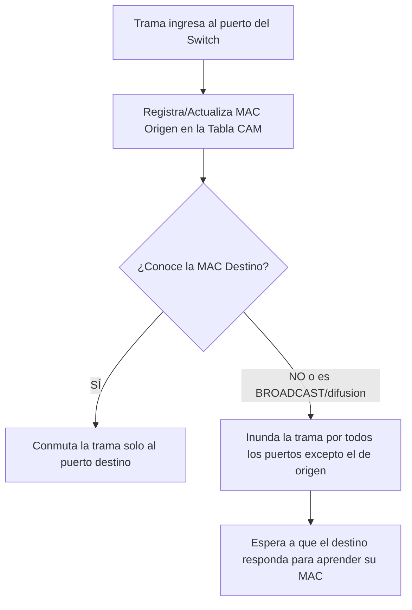
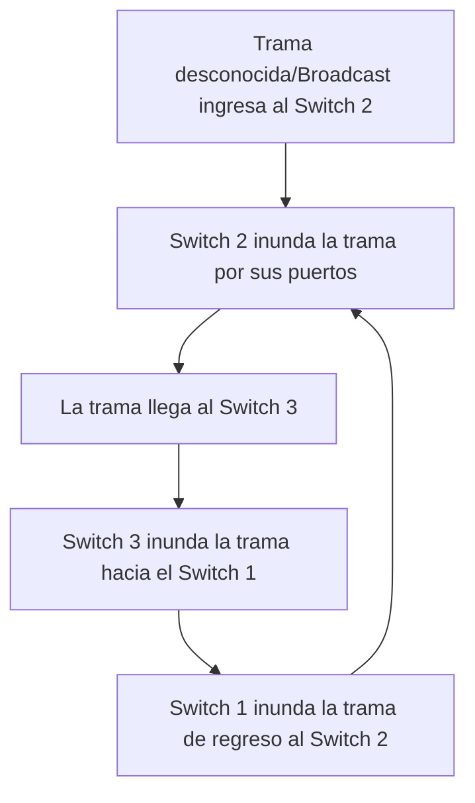
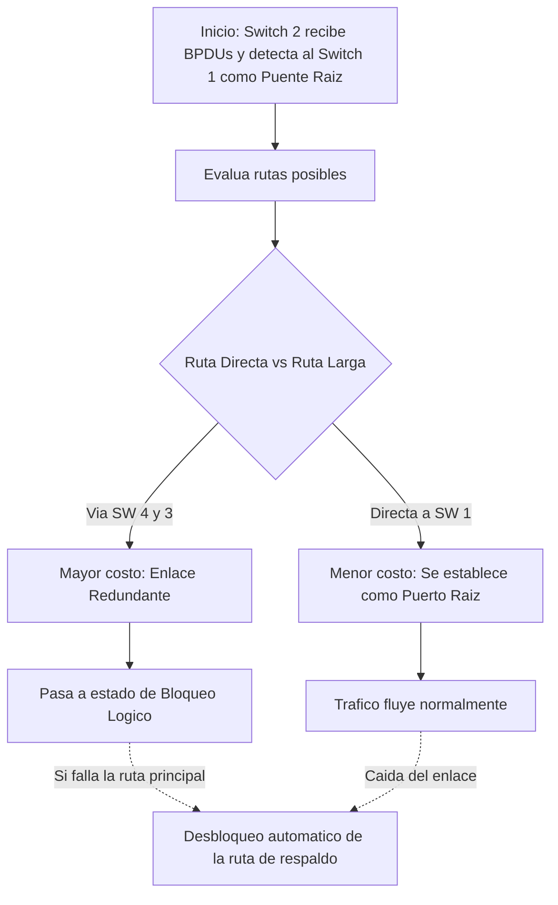

![[P1-U02-P08 - RDD - Unidad 2 - DISPOSITIVOS.pdf]]

parte 1 https://www.youtube.com/watch?v=uBRtnRKKsw4&list=PLYZrqm_pzRumO_6c3u7yeHbNF9j6bkbM8&index=13
parte2 : https://www.youtube.com/watch?v=5H3JdNefgTA&list=PLYZrqm_pzRumO_6c3u7yeHbNF9j6bkbM8&index=15
## 1. El Proceso de [[Encapsulamiento y Desencapsulamiento]] y Desencapsulamiento (0:00 - 19:42)✅

El profesor inicia la clase demostrando cómo viaja la información desde el dispositivo origen hasta el destino a través de la arquitectura [TCP_IP], atravesando las distintas capas y transformando su [PDU] (Unidad de Datos del Protocolo).

Tanto en origen como destino, se ejecutan las cuatro capas de la arquitectura TCP/IP. y En dispositivos intermedios: Host a Red (capa 1 y 2 del OSI) e Interred (capa 3 del OSI).![[{92AC963B-B5BB-43CA-AC6D-7C81C0D93C26}.png]]

- **En el Origen (Encapsulamiento):** 
	- La [Capa de Aplicación]  inicia la comunicacion y genera los datos.
	- Estos descienden a la [Capa de Transporte] segmenta y encapsula (se les agrega cabecera [TCP] o UDP formando un [Segmento]), 
	- luego a la [Capa de Internet] (se agrega cabecera [IP] formando un [Paquete]) 
	- y finalmente a la [Capa Host a red] encapsual la trama (se agrega cabecera (eth) y cola (CRC)  formando una [Trama]), para ser enviados como [Bits] al medio físico.
	- ![[{549F74AC-570A-4901-946E-4863C2C6C778}.png]]
>[!note] **[Encapsulamiento]**: Es el proceso descendente en el dispositivo de origen. Los datos bajan desde la capa de aplicación hacia la capa física y, en cada paso, se les agregan cabeceras y colas de control (como "sobres dentro de sobres").

- **En Dispositivos Intermedios ([Router]):**
> [!question] **Pregunta en clase:** El profesor preguntó: _"¿Qué funciones de capas cumple un Router: Capa 1, Capa 2, Capa 3 o todas?"_ 
> **Respuesta:** Varios alumnos dudaron, pero la respuesta correcta es que un [Router] es un dispositivo de **Capa 3** (Capa de Red), lo que significa que asume obligatoriamente las funciones de su capa máxima y de todas las inferiores (Capa 1 y Capa 2). Recibe bits, desencapsula la trama, lee la dirección IP del paquete para consultar su [Tabla de Encaminamiento] y vuelve a encapsular para enviarlo por la interfaz correspondiente.
    
- **En el Destino (Desencapsulamiento):** 
	- Bits llegan a la capa de Host a Red del destino.
	- En la capa de intrared (en osi la de enlace), se interpreta la trama y se verifica el CRC (código de redundancia cíclica). La placa revisa la [Dirección MAC] y verifica errores mediante el cálculo del [CRC] (Código de Redundancia Cíclica).
		- Si correcto, se procesa y pasa a la capa de Interred.
		- Si incorrecto, se descarta sin avisar
	- Capa de Interred,  verifica la IP destino y desencapsula el segmento.
	- Capa de transporte tcp
	- capa de aplicaco
> [!danger] **Cuidado con el descarte de tramas:** Un alumno preguntó si se avisa al origen cuando el [CRC] da error. El profesor aclaró que no. La tecnología [IEE 802.3 (Ethernet)] es de _"máximo esfuerzo"_; si la trama está corrupta, simplemente **se descarta sin avisar**. Será responsabilidad de las capas superiores (como el protocolo [TCP]) solicitar la retransmisión.

![[{15F568FC-3DA7-4719-B9B6-F10D82E6033D}.png]]

> [!note] Definición: Unidades de Datos Cada capa maneja un tipo diferente de [PDU] (Unidad de Datos del Protocolo). La Capa de Transporte maneja el [Segmento], la Capa de Internet maneja el [Paquete], y la Capa de Enlace construye la [Trama].

# Dispositivos
## 2. Tarjeta de Interfaz de Red o [[NIC]] (19:42 - 24:53)
![[{E72D3A0C-85EF-4F3E-9F05-AF28AD55EA3B}.png]]
- es esencial para la comunicación entre dispositivos en una red. Sinónimos incluyen adaptador de red, placa de red, y tarjeta de interfaz de red.
-
funciones principales:

- **Definición:** Es el adaptador que brinda acceso físico al medio de comunicación. dependiendo del método de acceso al medio ([IEE 802.3 (Ethernet)] para alámbricos y 802.11 para inalámbricos)
- **Ubicación lógica:** Opera en la [Capa 1] (Física) y la [Capa 2] ([CAPA DE ENLACE DE DATOS]) del [Modelo OSI].
- Cada placa de red posee una [Dirección MAC] unica(almacenada en la ROM)
- **Funcionamiento:** Trabaja de forma autónoma analizando la [Dirección MAC | MAC destino]  de las tramas que llegan para saber si las procesa o las descarta.
- Detecta y verifica errores en las tramas mediante el algoritmo de código de redundancia cíclica.

operacion:
* Recibe un paquete de la capa de red, lo encapsula en una trama y lo envía al medio de comunicación.
* El protocolo de capa de enlace está implementado en la NIC (802.3 – 802.11)

**Tipos:** 
	- Existen diferentes tipos según el medio (Cable UTP, [Fibra Óptica], inálambricas para [Wi-Fi]), ya que deben adaptar la información a la naturaleza física del canal.

## 3. [[Hub]] o Concentrador (24:53 - 28:55)
![[{AF57CC6F-98EF-41A3-99D3-074F6FBA636C} 1.png]]

Dispositivo que permite conectar varias computadoras o formar una red, aunque actualmente ha sido reemplazado por switches más económicos y genéricos

*funciones principales*
- **Nivel operativo:** Dispositivo netamente de [Capa 1] (Física). No tiene inteligencia.
- **Función:** Conocido como "repetidor multipuerto". Centraliza el cableado de una red una [Topología en Estrella] física. Recibe la señal por un puerto y la reenvía o repite por **todos** los demás puertos, 
- Si interconectamos varios hubs, se extendiende el tamaño del [Dominio de Colisión].
- Conocido como repetidor multipuerto, regenera la señal recibida y la envía por todos los puertos, excepto por donde ingresó, elevando su potencia para permitir mayor alcance.

*caracteristicas:*
* Conecta eléctricamente todos los cables que llegan a él.
* Carece de inteligencia, no procesa ni interpreta la señal, simplemente la repite
* Permite la conexión/desconexión de computadoras sin interrumpir la red.

*Modo de Operación:*

> [!question] **Pregunta en clase:** _"¿En qué modo opera un Hub: Simplex, Half-Duplex o Full-Duplex?"_ 
> **Respuesta de los alumnos validada por el profesor:** Opera en [Half-Duplex] o (Semi-dúplex), ya que un equipo puede transmitir o recibir, pero no ambas cosas simultáneamente. Por esto, los equipos conectados a un Hub están obligados a usar el método de acceso [CSMA_CD] para lidiar con las colisiones.

## 4. [[Bridge]] o Puente (28:55 - 36:39)

- **Nivel operativo:** Dispositivo inteligente de [Capa 2]| [CAPA DE ENLACE DE DATOS]., combina funciones de capa 1 y capa 2
- **Propósito principal:** Segmenta una red logica y dividir un dominio de colisión muy grande en partes pequeñas. Si hay muchos equipos colisionando, un puente intermedio separa el tráfico.

 funciones principales:
 * Interconecta segmentos de red, dividiendo dominios de colisión y extendiendo el dominio de broadcast.
> [!tip] **Tip para parciales (Dominios):** El profesor enfatizó que un [[Bridge]] o un [Switch] dividen y reducen el [Dominio de Colisión] por cada uno de sus puertos, pero **NO** dividen el [Dominio de Broadcast] (la difusión masiva sigue pasando a toda la red). Solo el [Router] divide dominios de broadcast.
* Maneja una tabla de direcciones MAC por cada segmento, permitiendo la comunicación entre ellos.
![[{E1B28008-FFC3-4EC8-BEF4-1DE9495D33C3}.png|364]]![[{52C667BD-B327-452B-A545-9CC8419C183A}.png|382]]

ventajas:
* Divide dominios de colisión, creando un dominio por cada puerto del puente
- Puede interconectar diferentes protocolos de [CAPA DE ENLACE DE DATOS] enlace
- Permite la interoperabilidad entre diferentes segmentos de red (Ethernet – WiFi)
- Aumenta el número de estaciones y amplía la distancia física entre ellas.
- Mejora el rendimiento y la confiabilidad al reducir el tráfico local y aislar errores.
- No requiere configuración, utiliza autoaprendizaje para aprender direcciones MAC.
- Puede ser equivalente a un Access Point al interconectar redes cableadas e inalámbricas.

## 5. [[Switch]] o Conmutador y sus Técnicas (36:39 - 48:53)
![[{FD911E01-51D0-48D6-BFD1-9D6435E038A3}.png]]
- **Definición:** Dispositivo de interconexión que forma una LAN con topología en estrella, operando en la  [Capa 2]|[CAPA DE ENLACE DE DATOS] del modelo osi, reemplazó a los hubs.
- **Ventaja clave:** Todos sus puertos operan en modo [Full-Duplex], lo que anula la posibilidad física de colisiones. El uso de [CSMA_CD] ya no es necesario. Cada puerto del switch es su propio [Dominio de Colisión].
	- Mejora el rendimiento y la seguridad en LANs, implementando seguridad de puerto.
	- Facilita la escalabilidad de la red al ser expansible mediante la conexión de switches adicionales.
	- Puede tener puertos simétricos o asimétricos, y ser fijos o modulares, dependiendo de la configuración física.
	- Ofrece flexibilidad con puertos de acceso y troncales para la conexión de PC, disp. y servidores.
	- Utiliza UTP y fibra óptica, con opciones de velocidad de puertos que varían desde 10Mbps hasta 10Gbps![[{0A83C428-6C53-4900-AB22-83557A1915BC}.png]]

- **Consideraciones de adquisición:**
	- Puertos
		- Al evaluar switches para una empresa, se debe considerar la densidad de puertos, su velocidad (10, 100, 1000 Mbps), si son simétricos (todos los puertos con la misma velocidad) o asimétricos (velocidades diferentes para algunos puertos), 
		- Configuración: Puede ser fijo o modular, permitiendo o no la modificación de la configuración física.
		- Tipo: Puertos de acceso para conectar dispositivos y servidores, y puertos troncales para interconectar switches o routers
	- Tecnologia
		- Uso de UTP y fibra óptica según las necesidades de la red
		- Consideración de buffers para almacenamiento de tramas, siendo mayor el buffer para un mejor rendimiento.
	- Administracion
		- y si son un [Switch Administrable] (necesario para configurar [VLAN] o seguridad) o genérico.
		- Un switch administrable brinda más servicios al tener un sistema operativo más potente

### **Técnicas de Conmutación:**

| Técnica de Conmutación  | Funcionamiento Lógico                                                     | Control de Errores                                             |                                                                                                                                    |
| :---------------------- | :------------------------------------------------------------------------ | :------------------------------------------------------------- | ---------------------------------------------------------------------------------------------------------------------------------- |
| **[Store and Forward]** | Almacena la trama _completa_ antes de enviarla.                           | Verifica el [CRC] y descarta tramas corruptas.                 | * verifica la direccion mac destino * conmuta la trama despues de todas la verificaciones * metodo seguro pero lento      |
| **[Cut-through]**       | Lee solo la [MAC Destino] (primeros 6 bytes) y conmuta inmediatamente.    | **No** controla errores. Puede reenviar colisiones.            | * Rápido pero puede conmutar tramas dañadas o fragmentos de colisión.                                                              |
| **[Fragment-Free]**     | Lee los primeros 64 bytes (46 datos +18 cabecera y cola) y luego conmuta. | Filtra fragmentos de colisión, pero no chequea el [CRC] total. | * Intermedia en velocidad. * Evita conmutar fragmentos de colisión. * Puede conmutar tramas erróneas al no verificar el CRC. |

###  Lógica de Aprendizaje Automático del Switch y como se construye Tabla de direcciones MAC (48:53 - 1:02:49) 
El profesor detalla de manera minuciosa cómo un switch construye dinámicamente su [Tabla CAM] (o [Tabla MAC]) desde que se enciende (cuando está totalmente vacía) para poder conmutar las tramas inteligentemente en lugar de repetirlas "a ciegas". A diferencia de un [Hub], un [[Switch]] solo envía la información al puerto que la necesita. Para lograrlo, construye dinámicamente una **[Tabla CAM]** (o tabla de direcciones MAC).

#### Escenario Inicial: Tabla Vacía e Inundación (Máquina A a Máquina D)
- **El Planteo:** Al encender el equipo, la **[Tabla de Direcciones MAC]** está vacía. La **[Máquina A]** (conectada al Puerto 1) decide enviarle datos a la **[Máquina D]** (conectada al Puerto 8).![[{F9EDF0E2-911F-4074-B06F-01C254601612}.png]]

- **Proceso de Aprendizaje:** La **[Trama]** ingresa por el Puerto 1. El switch extrae inmediatamente la **[MAC Origen]** de la cabecera y anota en su tabla que la `MAC-A` se encuentra físicamente en el Puerto 1.![[{DDD7D6E3-4ACD-4A09-BAAF-F9E506D05051}.png]]
>[!note] Regla de Aprendizaje Un [[Switch]] SIEMPRE aprende y actualiza su tabla observando únicamente la **[MAC Origen]** de las tramas que ingresan.
- **Reenvío de Datos:** Como la tabla está vacía para el resto, el switch desconoce dónde está la `MAC-D`. Para solucionarlo temporalmente, actúa como un hub y ejecuta una **[Inundación]** (flooding): envía la trama por todos los puertos activos de la red, excepto por el Puerto 1 de donde provino.![[{850D38C1-16C0-4F99-89D6-08211D63B2F8}.png]]
#### Escenario de Respuesta: Conmutación Directa (Máquina D a Máquina A)
- **El Planteo:** La **[Máquina D]** recibe la trama y le responde con datos a la **[Máquina A]**.
![[{75C4EB84-BD4D-4AF8-AD75-2F0D5E2D979E}.png]]
- **Proceso de Aprendizaje:** Esta nueva trama ingresa por el Puerto 8. El switch lee la **[[Dirección MAC| MAC Origen]]**y registra en su tabla que la `MAC-D` se encuentra en el Puerto 8.
![[{3565E603-C2CA-4D70-816D-71FE50B39420}.png]]
- **Reenvío de Datos:** Ahora el switch debe enviar los datos a la `MAC-A`. Como ya había aprendido en el paso anterior que la `MAC-A` está en el Puerto 1, **no inunda la red**. Directamente realiza la **[Conmutación]** y saca la trama de manera exclusiva por el Puerto 1.![[{182B80ED-3A5E-45D3-8CAA-4624F4134C71}.png]]

> [!tip] Tip del Profesor Esta es la inteligencia principal del switch que lo diferencia del [Hub]: al enviar los datos solo por el puerto necesario, permite comunicaciones simultáneas en la red sin que existan colisiones.

#### aprendisaje resumido
1. Inicialmente, la tabla del switch está vacía, y al recibir la primera trama, la difunde por todos los puertos excepto por el puerto de entrada.
	1. tambien Si la [MAC Destino] no está en la tabla (o es una trama [Broadcast]), el switch realiza una "tormenta" e inunda enviando la trama por _todos_ los puertos activos, excepto por el que ingresó.
2. El switch aprende mediante la dirección MAC de origen de las tramas, actualizando su tabla con la información del puerto al que pertenece cada dirección MAC.
3. Con cada trama nueva, el switch continúa aprendiendo y construyendo su tabla de direcciones MAC.
4. Permite comunicaciones simultáneas entre diferentes máquinas, en contraste con un hub
5. El switch conmuta selectivamente las tramas según la información de su tabla, mejorando la eficiencia y reduciendo el tráfico innecesari
6. La construcción de la tabla inicia cuando comienza el tráfico de red, permitiendo al switch adaptarse y optimizar la conmutación de datos.

> [!tip] Comportamiento Inicial Cuando se enciende un [[Switch]], su tabla está vacía y funciona temporalmente como un Hub (inundando todos los puertos) hasta que las máquinas empiezan a transmitir y el equipo "aprende" las rutas. Además, un mismo puerto físico puede aprender **múltiples direcciones MAC** si se conecta otro Switch o Hub a esa boca.

#### 3. Escenario Avanzado: Conexión de un HUB (Múltiples MACs)
Para demostrar un caso más complejo, el profesor planteó que un administrador conecta un **[Hub]** al Puerto 5 del switch,este actúa como un repetidor multiplicador de puertos,
ampliando la conectividad, , y a dicho hub le conecta la **[Máquina E]]* y la **[Máquina F]**.

1. (Aprender Máquina E) Las tramas enviadas desde A hacia E ingresan por el puerto 1. El switch interpreta la entrada de datos como la ubicación de A en ese puerto y actualiza el temporizador asociado a ese puerto en la tabla de direcciones MAC.
	1. Si una máquina no envía datos durante un tiempo configurable, la entrada correspondiente en la tabla se borra. Sin embargo, cada vez que ingresan datos por el puerto, se reinicia el temporizador.
	![[{93DCB314-6BA6-4354-983E-782E9753FE75}.png]]
2. Al no encontrar la dirección MAC de destino (E) en la tabla, el switch difunde la trama por todos los puertos activos excepto por el puerto de entrada.![[{004AB7DA-33E3-47E6-995F-20D4E1BDBE95}.png]]
3. La máquina E responde a “A”, y la trama es modificada con la dirección MAC de origen E y destino A. El Hub envía la trama al switch por el puerto 5, y este la conmuta solo al puerto 1 (donde está A).
	![[{AC62A15C-6981-487C-9332-49FECC19A3BD}.png]]
		aca la flechita que esta para F, es por la naturaleza del hub que retrasmite a todos sus puertos
	![[{3DCC1DCF-EE28-4803-BF33-F1441E00FFF9}.png]]
---
ahora la maquina f le quiere mandar datos, F se comunica con D
- **(Aprender Máquina F):** Posteriormente, la Máquina F envía datos a la Máquina D. Su trama también atraviesa el hub e ingresa al switch por el mismo Puerto 5. y como no tiene la dirección MAC de F en la tabla, la agrega. La trama se conmuta directamente al puerto 8, donde está la máquina D
![[{9E51D105-4823-46A3-A6DC-AEE7237BAAC0}.png]]

Un puerto del switch puede tener varias direcciones MAC detrás de él, ya que no distingue si hay una PC, un servidor, un Hub o un switch

>[!danger] Trampa de Parcial / Confusión Frecuente Es un error creer que un puerto de switch solo puede alojar una única máquina. El profesor usó este ejemplo para demostrar que **un mismo [Puerto Físico] de un switch puede aprender y registrar múltiples [Direcciones MAC] simultáneamente** (en este caso, 2 direcciones, pero podrían ser 24 si el hub tuviera 24 bocas).

#### ---
>[!note] **Regla de Oro: Aprendizaje vs. Conmutación** La profesora enfatizó rigurosamente la diferencia entre cómo aprende y cómo envía datos el equipo:
   El **[[Switch]]** _aprende_ e inserta registros en su tabla observando **únicamente** la **[MAC Origen]** de las tramas entrantes.
   El **[[Switch]]** _conmuta_ (decide por dónde sacar los datos) buscando **únicamente** la **[MAC Destino]** en su tabla.

>[!tip] **Tip sobre Comportamiento por Defecto (La Inundación)** Se recalcó fuertemente qué hace el switch si **no encuentra** la MAC de destino en su tabla: la saca obligatoriamente por **todos los puertos activos, excepto por el que ingresó** (acción conocida como **[Inundación]**)
## 7. Redundancia, Bucles y el [Spanning Tree Protocol]] (STP) (1:02:49 - 1:12:48)

Para explicar la progresión lógica entre la vulnerabilidad de una red, la necesidad de redundancia y los problemas que esta conlleva en la **[[CAPA DE ENLACE DE DATOS]]**, el profesor utilizó como ejemplo principal una topología compuesta por tres conmutadores (**[[Switch]] 1, Switch 2 y Switch 3**), a los cuales estaban conectadas varias máquinas de usuarios (PC A, B, C) y un **[Servidor]**.

### El escenario de falla y la implementación de [Redundancia]
- **El Planteo Inicial:** El profesor propuso la situación donde el Switch 1 estaba conectado en cascada al Switch 2, y este a su vez al Switch 3 (donde se encontraba alojado el servidor principal).
- ![[{7A45C5BB-94F9-4467-81B4-00BA919EFD05}.png]]
-  Si se interrumpe el enlace entre el switch 1 y el switch 2, las máquinas A y B no podrán comunicarse con la máquina C y el servidor. Sin embargo, A y B seguirán siendo capaces de comunicarse entre sí, dividiendo la red en dos partes
	- Para evitar esta situación, se establece redundancia conectando el switch 2 y el switch 3. Si un enlace falla, el tráfico se redirige automáticamente por el otro enlace hacia el destino.
	- ![[{18D4BD4A-0BA9-4F4A-BB3D-C00DB3EFEE63}.png]]
- **Conclusión del ejemplo:** La redundancia es costosa físicamente porque se desperdician puertos en los dispositivos, pero es fundamental ya que brinda fiabilidad y tolerancia a fallos, previniendo que se interrumpan los servicios si un cable se daña

### 2. El problema catastrófico: [Bucles de Capa 2] (Loops)
Al conectar los tres switches formando un triángulo o "malla" para lograr la redundancia, el profesor advirtió que se genera un problema crítico a nivel operativo provocado por el comportamiento natural del switch.

- **La Dinámica del Bucle:** Si ingresa una **[Trama]** con un destino que el switch no conoce, o bien una trama de difusión masiva (Broadcast, dirigida a FF-FF-FF-FF-FF-FF), el Switch 2 actuará realizando una **[Inundación]** (enviando la trama por todos sus puertos activos).
- Esa trama inundada llegará al Switch 3, el cual también la inundará enviándola hacia el Switch 1. El Switch 1 la recibirá y la inundará de regreso hacia el Switch 2, reiniciando el ciclo.

![[{4DE9A6BA-0B02-4A46-A91D-1273F6170946}.png]]
• Redundancia: La presencia de redundancia en una red, especialmente al usar
dispositivos de capa de enlace como bridges o switches, puede resultar en la
formación de bucles o loops.
• Degradación del Rendimiento: Los bucles tienen un impacto negativo en el
rendimiento de la red.
• Tormentas de Difusión: Los bucles pueden provocar tormentas de difusión,
donde las tramas quedan atrapadas en un ciclo de capa 2, consumiendo todo
el ancho de banda disponible

### 3. La solución lógica: El protocolo IEEE 802.1D SPINNING TREE PROTOCOL (STP)
Para solucionar el colapso sin tener que desconectar el cable físicamente (y así no perder la ventaja de la redundancia), el profesor introdujo el protocolo **[STP]** (Spanning Tree Protocol, estándar IEEE 802.1D inventado por Radia Perlman).

**Objetivo**: Eliminar enlaces redundantes y evitar la formación de bucles en la red.
**Capa y Dispositivos**: Protocolo de capa 2, [[CAPA DE ENLACE DE DATOS]] para bridges y switches.
**Activación/Desactivación de Enlaces**: Permite que el switch active o desactive enlaces para prevenir bucles. Los enlaces redundantes están inactivos.
**Transformación de Red**: Convierte una red física de malla en una red lógica de árbol, proporcionando un único camino hacia cada dispositivo.
**Recálculo Tras Falla:** Ante la falla de un enlace, STP recalcula el árbol y reactiva los puertos bloqueados.
**Variantes**: Incluyen RSTP (IEEE 802.1w, 2004) y SPB (IEEE 802.1aq, 2012), con diferentes tiempos de convergencia.

#### **Funcionamiento del STP:** resumido
* Detección de Bucles
	* Bucles de capa 2 pueden causar la retransmisión continua de tramas, afectando la red.
* Construcción del Árbol de Expansión:
	1. Elección del Bridge Raíz:
		• Se elige el bridge raíz mediante el intercambio de Bridge Protocol Data Units (BPDU).
		* • Cada puerto tiene un costo basado en la velocidad, seleccionando rutas más rápidas.
	2. Selección de Puertos:
		* Puertos raíz, designados y bloqueados se determinan según el costo y la posición en el árbol.
	3. Comunicación mediante BPDU:
		* Switches intercambian BPDU cada dos segundos, informando el estado de la red
		* Cada switch tiene un ID único basado en una dirección MAC.
	4. Selección del Puente Raíz:
		* Inicialmente, cada switch se considera "puente raíz". Descubren sw con menor ID y actualizan.*
		* Se elige puente raíz aquel con ID más bajo (menor prioridad).
	5. Selección de Puertos Raíz
		* Switches envían BPDUs indicando su ID, prioridad, costo para llegar al puente raíz y actualizan estos datos.
		* Cada switch calcula el puerto raíz por el cual llegar al puente raíz con el mínimo costo.
	6. Designación de Puertos
		* Todos los puertos en el puente raíz y en los demás switches hacia dispositivos son designados.
		* Puertos no raíz ni designados son bloqueados para evitar bucles.
	7. Manejo de Redundancia:
		* Puertos redundantes son bloqueados para evitar tormentas de broadcast y garantizar una sola ruta al puente raíz.
		* En caso de falla, STP reconfigura activando enlaces previamente bloqueados .

#### ejemplo de funcionamiento detallado
![[{CE60B10F-6916-4B74-9D3D-F61737F58E70}.png]]
Para explicar cómo los dispositivos arman el árbol de expansión, el profesor utilizó el ejemplo de una topología compuesta por 4 conmutadores interconectados en forma de malla, y describió el proceso en las siguientes etapas lógicas:

1. ==Elección del [Puente Raíz] (Root Bridge)==
	- **El Planteo:** Al encender los equipos, los switches comienzan a intercambiar tramas de control llamadas **[BPDU]** (Bridge Protocol Data Unit) para descubrir la topología de la red.
	- **La Resolución:** Tras analizar la información intercambiada, todos los equipos se dan cuenta de que el **Switch 1** es el que posee el identificador (ID) y la prioridad más baja (ya sea de fábrica o configurada por el administrador).
	- **Conclusión:** Por regla del algoritmo, el Switch 1 es automáticamente elegido como el **[Puente Raíz]**, convirtiéndose en el centro de toda la topología de red.
	- ![[{C25D3AA6-3995-419B-9829-4C2EAA763CBD}.png]]
2. ==Cálculo del [[Puerto Raíz]] (Costos de Ruta)==
	- **El Planteo:** Una vez definido el núcleo, los demás equipos deben descubrir cuál es la ruta más corta para llegar a él.
	- ![[{55EA4B38-5775-487B-89EE-01E5642DFD87}.png|520]]
		- y asi cada switch decide su puerto raiz, que es por donde va ir mas rapido al switch raiz
	- **El Ejemplo del Switch 2:** El profesor tomó al Switch 2 y explicó que este equipo evaluaba dos caminos posibles:
	    - **Ruta A:** Ir directo hacia el Switch 1 (Ruta de menor costo, compuesta solo por una interfaz).
	    - (en este caso da igual, pero se tomo como que el switch 4 tiene un id menor entonces decidira el puerto raiz para ir al switch 4)
	- **Conclusión:** El Switch 2 determina que la Ruta A es la más corta y designa a esa interfaz física como su **[Puerto Raíz]** (el puerto por donde enviará el tráfico para llegar más rápido al núcleo).
![[{9445B7D1-9E76-4EC4-BD55-5918A41D9850}.png]]
3. ==El Bloqueo del Enlace (La Analogía de los Autos)==
	Al detectar que existe un camino alternativo (la Ruta B), el Switch 2 debe evitar que se genere un **[Bucle de Capa 2]**.
> [!tip] **La Analogía Práctica del Profesor** Para explicar por qué se debe bloquear el puerto, el profesor utilizó una analogía de la vida cotidiana: _"Es como si tuvieras dos autos pero usas siempre uno. Si se te rompe ese auto tienes el otro de respaldo, pero no puedes usar los dos autos a la vez"_.

- **Aplicación a la red:** Un switch no puede mantener dos rutas activas enviando tráfico simultáneamente hacia el **[Puente Raíz]**, porque se formaría una **[Tormenta de Difusión]**. Por lo tanto, el Switch 2 desactiva lógicamente el puerto redundante (estado de [Bloqueo]). El cable sigue conectado físicamente, pero no permite el paso de tramas de datos de usuario.
- ![[{D3A42929-C365-4F79-9F69-86AE51260A62}.png]]

>[!question] ¿Qué ocurre si un administrador corta accidentalmente el cable principal o si el enlace principal falla?
>Como los switches se envían tramas **[BPDU]** constantemente (aproximadamente cada 2 segundos), notan de manera inmediata la interrupción del servicio.
>El algoritmo recalcula el árbol de expansión automáticamente y "desbloquea" la interfaz de la Ruta Larga que estaba en resguardo. Así, el servicio se restaura sin necesidad de intervención humana.

Diagrama del Proceso de Decisión (Ejemplo Switch 2)

#### importante
 Un switch no puede tener más de un camino al puente raíz.
 Enlaces redundantes sirven como respaldo y se bloquean para evitar tormentas de broadcast.
 STP permite una red lógica de árbol, garantizando conectividad y evitando bucles.
#### **Asignación de Costos en STP**

Para decidir qué ruta mantener activa hacia el **[Puente Raíz]** y cuál bloquear, el algoritmo evalúa las rutas sumando los costos de las interfaces que debe atravesar.

> [!note] Fórmula: Cálculo de Costo STP En el protocolo STP, el costo de un enlace es inversamente proporcional a la velocidad del medio físico (a mayor velocidad, menor costo). $$ Costo \propto \frac{1}{Velocidad} $$

Para ilustrar esta métrica inversa (a mayor velocidad, menor costo y mayor prioridad para el algoritmo), se presentó la siguiente tabla basada en el estándar IEEE 802.1D:

| Velocidad del Puerto Físico         | Valor del Costo [STP] Asignado |
| ----------------------------------- | ------------------------------ |
| **[10 Gigabit Ethernet] (10 Gbps)** | 2                              |
| **[Gigabit Ethernet] (1 Gbps)**     | 4                              |
| **[Fast Ethernet] (100 Mbps)**      | 19                             |
| **[Ethernet Clásica] (10 Mbps)**    | 100                            |

En conclusión, si existen múltiples rutas, el algoritmo siempre elegirá conmutar el tráfico por aquellos enlaces cuyas velocidades sean más altas (ej. 1 Gbps), ya que su sumatoria de costo final será la más baja de toda la topología.

---
#### ESTADOS DE LOS PUERTOS
1. ==BLOQUEO== Así inician todos los puertos, pueden recibir BPDU's pero no las envían. Las tramas de datos se descartan y no actualiza tablas.
	1. Evita enlaces redundantes bloqueando todos los puertos inicialmente.
2. ==Escucha==: Los switches determinan si existe alguna otra ruta hacia el switch raíz, si ésta tiene un costo mayor, se vuelve a Bloqueo. Las tramas de datos se descartan y no se actualiza las tablas. Se envían BPDU’s para conocer la topología de la red.
	1. Escuchan tramas BPDU para entender la configuración de la red antes de construir el grafo
3. ==Aprendizaje:== Las tramas de datos se descartan pero se actualizan las tablas (el switch aprende). Se procesan las BPDU’s.
	1. Construyen tablas al aprender y al fijarse si la dirección MAC ya está en ese puerto.
	2. Todavía no conmutan tramas de datos
4. ==Envío:== los puertos pueden enviar y recibir datos. Las tramas de datos se envían y se actualizan las tablas. Se procesan las BPDU.
5. ==Desactivado:== Se produce cuando un administrador deshabilita el puerto o falla. No se procesan las BPDU.
	1. Puerto apagado, no conectado
	2. Único estado sin procesar BPDU, ya que el switch no está conectado.

>[!note] Siempre se procesan BPDU para controlar enlaces redundantes, incluso cuando los puertos están desactivados, ya que son esenciales para construir una topología libre de bucles.

![[{8F5DB012-4EF6-4655-8D4E-CD8008702ED7}.png]]
# ---

| Dispositivo                 | Capa OSI        | Impacto en el [Dominio de Colisión]   | Impacto en el [Dominio de Broadcast] |
| :-------------------------- | :-------------- | :------------------------------------ | :----------------------------------- |
| **[[Hub]]**                 | Capa 1 (Física) | Lo extiende (1 solo dominio global)   | Lo mantiene igual                    |
| **[[Bridge]] / [[Switch]]** | Capa 2 (Enlace) | Lo divide (1 dominio por cada puerto) | Lo mantiene igual                    |
| **[[Router]]**              | Capa 3 (Red)    | Lo divide por completo                | **Lo divide**                        |
|                             |                 |                                       |                                      |

>[!danger] **Trampa de Parcial: Jerarquía del [[Router]]** La profesora hizo una pausa específica para preguntar a los alumnos qué funciones de capa cumplía un [[Router]]. Varios alumnos dudaron. La aclaración fundamental es que, si bien el [[Router]] es un dispositivo de **[Capa 3]** (Capa de Red/Internet), asume obligatoriamente el procesamiento de las capas inferiores. Es decir, procesa [Bits] en la **[Capa 1]**, desencapsula la **[Trama]** en la **[Capa 2]**, y lee el **[Paquete]** en la **[Capa 3]** para consultar su tabla de encaminamiento

---

