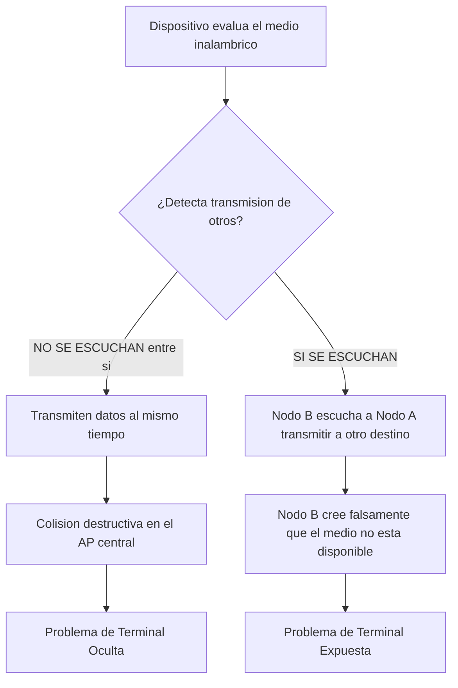

https://www.youtube.com/watch?v=f3Hn_KORFZM&list=PLYZrqm_pzRumO_6c3u7yeHbNF9j6bkbM8&index=18

![[P1-U02-P09 - RDD - Unidad 2 - WLAN.pdf]]

# Esquema Cronológico de la Clase: Redes LAN Inalámbricas (WLAN)

A continuación, presento el esquema estructurado y secuencial de la clase sobre la Unidad 2: **[[WLAN]]** (Wireless Local Area Network), ordenado exactamente según el flujo de la explicación del profesor.

---

## 1. Introducción y Características de las [[WLAN]]

El profesor inicia definiendo las redes inalámbricas y contrastándolas con las redes cableadas tradicionales ([Ethernet]).

>[!note] Definición: [[WLAN]] (Wireless Local Area Network) 
>Es el **concepto genérico** o el tipo de red.
>Es un conjunto de dispositivos conectados a través de ondas electromagnéticas (radiofrecuencia), eliminando la necesidad de medios físicos guiados. Su ventaja primordial es el abaratamiento de costos y la movilidad de los usuarios, mientras que sus desventajas críticas son la baja seguridad inherente y la susceptibilidad a interferencias

> [!question] **Pregunta en clase: Cableado vs Inalámbrico** El profesor preguntó qué tipo de red era mejor. Validó las respuestas de los alumnos concluyendo que las redes cableadas con un [Switch] evitan las colisiones (no compiten por el medio) y son más estables y seguras, mientras que las inalámbricas obligan a competir por el acceso al aire de a un dispositivo por vez usando el protocolo [[CSMA_CA]].
### caracteristicas:
* Dispositivos conectados mediante ondas electromagnéticas.
* Utiliza tecnología de radiofrecuencia para mayor movilidad al minimizar conexiones cableadas.
* Popular en hogares para compartir acceso a Internet entre varios dispositivos
* Elección entre red cableada e inalámbrica según la situación y ubicación.

- **Ventaja Principal:** Brindan total ==movilidad== a los usuarios y reducen drásticamente los ==costos== y ==tiempos de instalación==.
- **Desventajas Críticas:** Son inherentemente ==inseguras==, susceptibles a ==interferencias== (ruido electromagnético) y operan compartiendo el canal, lo que ==reduce el ancho de banda efectivo==.

## 2. Dispositivos Inalámbricos y el [[Access Point]]

- **[[Access Point]] (AP):** 
	- Dispositivo de **[[CAPA DE ENLACE DE DATOS|Capa 2]]**  y permite la conexión de notebooks, tablets, smartphones, y SmartTV.
	- interconecta dispositivos inalámbricos formando una red inalámbrica.
	- Su función lógica es actuar como un **[Bridge]** (puente) que interconecta la red inalámbrica 802.11 con la red cableada (IEEE 802.3 Ethernet), realizando la conversión de las tramas.
	- Posee una dirección IP para configuración remota![[{F24B6722-3EE2-47DA-B785-410DDE100BD7}.png]]
-  **[[Router Módem WiFi]] (ISR):** Es el equipo integrado que solemos tener en entornos hogareños. 
	- Interconecta dispositivos (PC, notebooks, impresoras, smartphones, SmartTV).
	- El profesor recalcó que para abaratar costos, este aparato unifica muchas funciones en una sola placa.
	  Brinda las siguieentes funciones:

| Dispositivo Lógico Simulado | Función que cumple dentro del ISR (Equipo Hogareño)                                                                                                                                                                         |
| :-------------------------- | :-------------------------------------------------------------------------------------------------------------------------------------------------------------------------------------------------------------------------- |
| **[[Access Point]]**        | Controla el acceso al medio inalámbrico de las notebooks o smartphones.                                                                                                                                                     |
| **[Switch]**                | Interconecta equipos físicos cableados mediante los puertos RJ45 traseros.                                                                                                                                                  |
| **[Router]**                | Realiza el proceso de **[NAT]** (Traducción de direcciones públicas/privadas) para navegar por Internet. Dirige los paquetes de datos de un dispositivo a otro en la red local o hacia destinos externos, como Internet. |
| Servidor **[DHCP]**         | Asigna dinámicamente las **[Dirección IP]* a cada cliente que se conecta a la red.                                                                                                                                          |
![[{E976D01E-BE85-45DA-A829-02F8031AEEDF}.png]]

### ap vs router modem wifi

| AP                                                                                       | router modem wifi                                                                                                                          |
| ---------------------------------------------------------------------------------------- | ------------------------------------------------------------------------------------------------------------------------------------------ |
| permite la conexion de dipsositibos inalambricos                                         | permite la conexion de dipsositibos inalambricos                                                                                           |
| analiza la comunicación inalámbrica y conecta redes con diferentes protocolos de enlace. | ontegra funciones de router, switch, access point, y módem, proporcionando conexión a Internet y asignación dinámica de direcciones IP. |
| utilizan direcciones IP para configuración remota.                                       | utilizan direcciones IP para configuración remota.                                                                                         |

## 3. Arquitectura [[IEEE 802.11]] y Dominios Lógicos✅
Es el **estándar técnico** y la pila de protocolos. Es el conjunto de normas de red creadas por el Instituto IEEE que definen las reglas lógicas y físicas de _cómo_ debe construirse y operar exactamente esa red inalámbrica

### COMPONENTES – DISPOSITIVOS QUE VAMOS A CONECTAR✅
1. Estaciones: Dispositivos como PC, notebooks, impresoras, smartphones, Smart TV, etc., que se conectan de manera inalámbrica
2. Medio inalámbrico: Usa radiofrecuencias o infrarrojos como el aire por donde se transmiten las ondas
3. Celda: Área geográfica donde dispositivos se interconectan inalámbricamente, siendo el área de cobertura para mantener conectividad
4. Access Point (AP): Funciona como un bridge, permitiendo la interconexión de dispositivos inalámbricos
5. Sistema de Distribución: Facilita la movilidad entre celdas, conectando varias de ellas a través de cable o aire.
6. Conjunto de Servicios Básicos (BSS): Grupo de estaciones que se comunican, en modos ad hoc o infraestructura, compartiendo un mismo SSID en una red
7. Conjunto de Servicio Extendido (ESS): Unión de varios BSS que permite el roaming, posibilitando la conectividad al desplazarse entre celdas

### Ejemplo Arquitectura de 802.11✅
![[{4619A1B9-8C5B-45C2-B268-DC543C1CCA7E}.png]]
Nota: Roaming es la capacidad de un dispositivo inalámbrico de
cambiar de área de cobertura, asociándose automáticamente al access point de la nueva área. Los access points se interconectan mediante una red cableada para comunicar dispositivos de diferentes celdas, formando así el Conjunto de Servicios Extendidos.

**[BSS] (Conjunto de Servicios Básicos)**: Es la "celda" o área de cobertura geográfica controlada por un único **[[Access Point]]**. Todos los dispositivos dentro del BSS interactúan bajo la jurisdicción de esa antena.

**[Sistema de Distribución] (DS)**: Es la red troncal (habitualmente cableada por Ethernet) que sirve para interconectar múltiples Access Points entre sí.

**[ESS] (Conjunto de Servicios Extendido)**: Es la suma de varios **[BSS]** interconectados mediante un **[Sistema de Distribución]**, permitiendo abarcar infraestructuras enormes como el campus de una universidad.
![[{3F375644-6022-4EEE-8DB0-0B6C013C33E8}.png]]

---
* Se requiere autenticación y asociación con el AP para establecer conexión

### Modos de Implementación✅

- **[Modo Ad-hoc]:** Red descentralizada ("peer-to-peer") donde los dispositivos se conectan directamente entre sí sin necesidad de un AP.
	- Envío directo de tramas entre dispositivos
	- Permite formar pequeñas redes inalámbricas entre dispositivos.
	- ![[{E8023E6E-EA6A-4EBF-BF69-960DD7B6C36D}.png]]
- **[Modo Infraestructura]:** Red centralizada donde todos los dispositivos obligatoriamente envían su tráfico a través del [[Access Point]].
	- Conexión del AP a otra red
	- Envío y recepción de tramas por parte del cliente a través del AP.
	- Posibilidad de conectar varios AP formando un "Sistema de Distribución" y una red extendida.![[{D87E9311-9545-46FA-912F-7C6126D1D293}.png]]
	 Nota: Las dos antenas en el Access Point están relacionadas con la tecnología MIMO, que mejora el ancho de banda transmitiendo y recibiendo simultáneamente por varias antenas.

### 4. Servicios del [Sistema de Distribución] (DS)✅
![[{3F375644-6022-4EEE-8DB0-0B6C013C33E8}.png]]
Para gestionar la movilidad de los usuarios, la norma establece 5 servicios fundamentales:

1. **Asociación:** 
	1. Conexión de una estación a un AP mediante un SSID (nombre de la red inalambrica)
		1. SSID (Service Set Identifier) → nombre de la red formado por 32 caracteres como máximo. Todos los dispositivos dentro de un BSS deben compartir el mismo SSID
	2. Handshake para autenticación.
		1. Paso previo a la asociación, mediante el cual el AP valida la identidad del usuario a través de un intercambio criptográfico o **[Handshake]**
	3. Una estación puede asociarse a un AP a la vez.
	4. Protocolos de autenticación constantes
2. **[Disociación]:** Proceso donde un equipo se desconecta voluntariamente de la red o se apaga, dándose de baja del registro del AP
	1. Salida de un dispositivo de la red.
	2. Puede ser antes de apagarse o por mantenimiento.
	3. Puede ser iniciada por AP o estación
	4. AP apagado provoca disociación automática.
3. **[Reasociación]:** Servicio clave que permite el **[Roaming]**; es decir, permite que un usuario caminando por un edificio se desvincule de un AP con señal débil y se asocie a un nuevo AP con mejor señal de forma transparente, sin perder conectividad
	1. Cambio de asociación de un AP a otro.
	2. Permite roaming y se realiza automáticamente
4. **[Distribución]:** Traslado de los datos a través de la red troncal hasta el AP de destino.
	1. Traslado de datos entre APs
	2. Interconexión de APs mediante tecnología Ethernet.
	3. Datos enviados al AP local y a través del DS al AP remoto.
	4. Trama con 4 direcciones MAC.
5. **[Integración]:**Proceso de conversión de protocolos, traduciendo tramas inalámbricas a tramas Ethernet
	1. Función de puente, conectando tecnologías inalámbricas y Ethernet a nivel de capa 2.

### Como se asocia un cliente inalambrico

1. Para permitir la negociación de estos procesos, se deben configurar los parámetros en el AP y luego en el cliente

2. Autenticacion
Para asociarse, un cliente inalámbrico y un AP deben acordar parámetros específicos.
* SSID → el cliente necesita conocer el nombre de la red para conectarse
* Contraseña → para que el cliente se autentique en el AP
* Modo de red → estándar 802.11 que se esté utilizando
* Modo de seguridad → parámetros de seguridad, WEP, WPA, WPA2 o WPA3
* Configuración de canales → las bandas de frecuencia en uso

![[{C356F989-9AD2-438B-90BC-73160F1CEF12}.png]]

3. El cliente se asocia con un AP o router inalámbrico

(Tipos de tramas manejadas: control, administración y datos.)

Se utilizan tramas de administración para: Implementra los servicios de autenticación, asociación, reasociación, baliza, prueba, etc.
* Descubrir nuevos AP inalámbricos.
* Autenticar con el AP.
* Asociarse al AP.

### Consideraciones importantes en IEEE 802.11

#### Confiabilidad

* Problema
	* Redes inalámbricas son ruidosas e inseguras
	* Interferencia con otros dispositivos
	* las redes inalámbricas se consideran "no fiables"
* Estrategias para mejorar la fiabilidad:
	* Ajuste de la tasa de transmisión según la calidad de la red.
		* cuando el dispositivo detecta que se pierden datos, (para saber que se perdian dato lo hace atraves de que exigen el envío de acuses de recibo (**[ACK]**) por cada trama exitosa porque utilizan [CSMA_CA] )
			* Entonces cuando no llegan los acuses de recibo disminuye la tasa de trasmision
			* y al reves cuando llegan los acuses de recibo aumenta la tasa de trasmision
	* Envío de tramas cortas y fragmentadas. + :
		* mejora la probabilidad de que la trama llegue correctamente
		* Dividir las tramas en fragmentos numerados individualmente. No se puede transmitir el fragmento K+1 hasta que no se haya recibido la confirmación del fragmento k
	* Detección física (si hay una señal o no en el aire) y virtual del canal. (adquirir el canal)
	* Uso de NAV (vector de asignación del canal) para evitar colisiones.
		* - **[NAV] (Vector de Asignación de Red):** Mecanismo de "detección virtual". Temporizador virtual transmitido en las tramas. El dispositivo emisor avisa al resto cuánto tiempo exacto en microsegundos ocupará el canal. Los demás dispositivos leen el **[[NAV]]** y suspenden sus transmisiones durante ese lapso

#### Ahorro de energía
* Problema:
	* La duración de las baterías de los dispositivos móviles es importante
* Estrategias para mejorar
	* Mejorar la vida útil de las baterías de dispositivos
		* que los clientes no tengan que desperdiciar energía cuando no tienen información para enviar o recibir
		* Clientes informan al AP antes de entrar en modo de ahorro de energí
		* AP controla y almacena tramas en el buffer para dispositivos en modo ahorro
	* Uso de tramas baliza para anunciar la presencia del AP y parámetros del sistema.
		* Son difusiones periódicas que realiza el Access Point (cada 100 mseg)
		* Anuncian la presencia del Access Point a los clientes
		* Llevan parámetros del sistema como el identificador del Access Point, tiempo que falta para la siguiente baliza y configuración de seguridad
	* Objetivo: evitar desperdicio de energía cuando los clientes no transmiten o reciben datos.

### Pila de protocolos IEEE 802.11
![[{3FA8FE6C-4E8D-4BB3-B875-6EB2C7EC7D55}.png]]
La profesora recordó que la **[Capa de Enlace de Datos]** se divide en dos subcapas y explicó la diferencia fundamental entre ellas en este entorno:
* [Subcapa LLC] **(Control de Enlace Lógico)** es común a todas las tecnologías. Es decir, la lógica de enlace con las capas superiores de red es exactamente la misma ya sea que estemos usando un cable de red clásico o una antena Wi-Fi
* [Subcapa MAC] **(Control de Acceso al Medio)** depende de la parte física, varía en la forma de enviar la señal.

#### Estándares IEEE 802.11 y Frecuencias
Estándares IEEE 802.11
* Transmite en bandas de 2.4 GHz y 5 GHz sin requerir licencia.
* Saturación mayor en 2.4 GHz
* La mayoría de las placas inalámbricas soporta todas las normas
*

Normas y Tecnologias

Se analizaron las bandas ISM (Industrial, Scientific and Medical) donde operan estas tecnologías sin licencia comercial.

| Estándar                                  | Banda de Frecuencia | Velocidad Teórica                                        | Modulación/Tecnología                                                                      |                                                                                 |
| :---------------------------------------- | :------------------ | :------------------------------------------------------- | :----------------------------------------------------------------------------------------- | ------------------------------------------------------------------------------- |
| 802.11a                                   | 5 GHz               | 54 Mbps (real de 20 Mbps).                            | OFDM con 52 sub-portadoras.  Multiplexación por División de Frecuencias Ortogonales) | Alcance de 20 km con radios especiales.                                         |
| **802.11b**                               | 2.4 GHz             | 11 Mbps                                                  | Espectro Expandido                                                                         | Puede interferir con otros dispositivos en la misma banda.                      |
| **802.11g**  Evolución del 802.11b, | 2.4 GHz             | 54 Mbps  (real de 22 Mbps)                         | [OFDM]                                                                                     | Compatible con 802.11a/b/g.  Copia modelos de modulación OFDM de 802.11a. |
| **802.11n**                               | 2.4 GHz y 5 GHz     | Hasta 600 Mbps  percibido por el usuario 100 Mbps) | [MIMO] (Múltiples antenas)                                                                 | Compatible con a/b/g.  Ratificado en 2009.                                |
| **802.11ac**                              | 5 GHz               | Hasta 1.3 Gbps                                           | Utiliza hasta 8 flujos MIMO y modulación de alta densidad 256 QAM.                         | Utiliza hasta 8 flujos MIMO y modulación de alta densidad 256 QAM.              |

### 6. Problemas Físicos de Topología | Protocolo [CSMA_CA] en la Subcapa MAC 802.11:

El profesor hizo un fuerte énfasis en dos anomalías físicas de la topología inalámbrica:
1. Rangos de Transmisión Diferentes:
	1. • Estaciones tienen alcances de radio distintos
	2.  Transmisiones pueden no ser recibidas en todas las partes de una celda

2. Terminal Oculta 
	1. - **Problema de la [Terminal Oculta]:**
		1. Una estación no detecta a un competidor potencial debido a la distancia.
		2. Problema de atenuación de la señal
		3. ejemplo: Ocurre cuando dos máquinas (A y C) están demasiado lejos y no se escuchan entre sí. Al creer erróneamente que el canal está libre, transmiten a la vez hacia el nodo central (B), generando una **[Colisión]** destructiva en el receptor.
	   ![[{74AA1080-6A45-4315-88D3-5C92A382BDC8}.png|333]]
	
3. Terminal Expuesta
	- **Problema de la [Terminal Expuesta]:** 
	- Una estación no transmite pensando que el receptor está en zona de interferencia cuando no
	- Subutilización del canal.
	- ejemplo: Falla de optimización donde una estación (B) quiere trasmitir a C, pero escucha que su vecina (A) está transmitiendo (hacia otro lado) y, por precaución, porquee cree que C esta en la misma celda entonces, no transmite. Desperdicia su turno y pierde ancho de banda asumiendo que el canal general está ocupado
		![[{C9091ADE-B19E-429A-ABCC-B0300A36745F}.png|379]]
		 Para que B pueda transmitir, debe esperar a que A termine, va a intentar enviar una trama corta (RTS) a la red y como C si la va a poder escuchar, si llega a estar libre le envía un CTS para que le envíe información. A partir de ahí queda reservado el ancho de banda por el tiempo que B tarda en comunicarse con C.

### 8. Seguridad Inalámbrica y Autenticación

WiFi Alliance:
* Organización que promueve la tecnología WiFi
* Certifica interoperabilidad en productos WiFi (tecnología 802.11).

Tipos de Autenticación:
1. Autenticación de Sistema Abierto
	* No requiere contraseña, usado en lugares públicos.
	* Permite asociación automática sin proporcionar contraseña.
2. Autenticación de Clave Compartida:
	* Recomendado.
	* Autentica y cifra datos entre cliente y AP.
	* Requiere preacuerdo de clave simétrica entre ambas partes.

#### Evolución de Protocolos:
1. Autenticación de clave compartida (PSK):
	• Significa que es simétrico, o sea, tenemos que preacordar una clave con el AP o con el router.
2. WEP (Wired Equivalent Privacy):
	• Cifrado en estándar original 802.11.
	• Usa RC4 con claves de 64 o 128 bits.
	• No se recomienda por vulnerabilidades.
3. WPA (WiFi Protected Access):
	• Estándar WiFi Alliance.
	• Utiliza servidor RADIUS para autenticación.
	• Implementa Protocolo de Integridad de Clave Temporal (TKIP). cambia las claves dinamicamente
4. WPA2:
	• Ratificado en 2004.
	• Emplea cifrado AES (Advanced Encryption Standard).
5. WPA3:
	• Sucesor de WPA2, anunciado en 2018.
	• Proporciona mejoras en seguridad y cifrado.

#### metodos de autenticacion
Personal
 * Para redes hogareñas o pequeñas oficinas.
 * Dispositivos se autentican con el router mediante clave precompartida (PSK).
 * Autenticación del AP.
Enterprise
* Para empresas, requiere servidor de autenticación RADIUS.
* El AP se comunica con un servidor de autenticación que tiene una base de datos con nombres de usuario y contraseñas para controlar el acceso a la red. Cuando el usuario se quiere autenticar para poder asociarse el AP se comunica con el servidor RADIUS, manda los datos del usuario y si son correctos el servidor le dice al AP que es correcto y recién ahí lo asocia al AP. Se definen los nombres de los empleados con sus respectivas contraseñas y solamente ellos se pueden autenticar, son totalmente privados los accesos. Una vez autenticado el dispositivo, recién ahí se asocia.

## 9. Estructura de la [Trama 802.11]✅
Se dividen en tres clases:
1. Trama de Datos:
	1. Transporta información entre estaciones y Access Points.
2. Trama de Control:
	1. Asisten en la transferencia entre estaciones inalámbricas.
		1. RTS (Request to Send)
		2. CTS (Clear to Send)
		3. ACK (Acknowledgment)
3. Trama de Administración
	1. Implementa diversos servicios como autenticación, asociación, reasociación, baliza, prueba, etc.

### Trama de Datos:
![[{0F6E77B0-4FFD-41E6-95A1-4DA4FE60D7D1}.png]]
La complejidad del medio inseguro exige que la trama inalámbrica posea una sobrecarga administrativa enorme respecto a la clásica de Ethernet.

Campos en Bytes:
* Control de Trama: 2 bytes
* Duración: Indica el tiempo de ocupación del canal y la longitud de la trama (microsegundos). (este es el que se usa para NAV)
* Dirección 1 (DA): 6 bytes, dirección MAC del destino.
* Dirección 2 (SA): 6 bytes, dirección MAC del origen.
* Dirección 3 (RA): 6 bytes, dirección MAC del destinatario inmediato (AP).
* Control de Secuencia: 2 bytes, numeración de tramas para detectar duplicados.
	* se subdivide para cuando se fragmentan
* Dirección 4 (TA): 6 bytes, dirección MAC del transmisor.
* Cuerpo de la Trama (Datos): Hasta 2312 bytes
* FCS (Secuencia de Verificación de Trama): CRC de 32 bits (4 bytes).

> [!note] Fórmula de Sobrecarga de Trama A diferencia de Ethernet (cuya cabecera y FCS ocupan solo 18 bytes), la Trama 802.11 posee numerosos campos de control que elevan significativamente el tamaño de la envoltura. Taman~oCabecera/Cola​=34bytes

>[!danger] Trampa de Examen: Las Cuatro Direcciones MAC Mientras que una trama Ethernet estándar solo tiene MAC de Origen y MAC de Destino, la cabecera de la **[Trama 802.11]** posee **4 campos separados para direcciones MAC**. Esto se debe a que debe identificar:
>1. El destino final (**[DA]**).
> 2. El origen inicial (**[SA]**).
> 3. El Access Point intermedio receptor (**[RA]**).
> 4. El Access Point transmisor dentro del Sistema de Distribución (**[TA]**)

Control de Trama (Subcampos):
* Versión del Protocolo.
* • Tipo de Trama (Datos, Control o Administración).
* • Subtipo (RTS o CTS, por ejemplo).
* • Para DS (A DS): Indica que la trama va hacia el Sistema de Distribución.
* • De DS: Indica que la trama viene desde el Sistema de Distribución.
* • Más Fragmentos: Se enciende si la trama se subdividió en segmentos.
* • Reintentar: Marca una retransmisión de una trama.
* • Administración de Energía: Indica al receptor que el emisor entra en modo de ahorro de energía.
* • Más Datos: Indica que el emisor tiene más tramas para el receptor.
* • Trama Protegida (WEP): Indica que el cuerpo de la trama está cifrado por seguridad.
* • Orden: Indica al receptor que la capa superior espera que las tramas lleguen en estricto orden.
## 10. Breve mención de Otras Tecnologías✅

- **[Bluetooth] (IEEE 802.15):** Tecnología WPAN (Personal Area Network) de muy corto alcance. Utilizada para emparejamiento de periféricos.
	- Estándar inalámbrico para enlazar computadoras y dispositivos a través de radiofrecuencia.
	- • Desarrollado en 1998 por el consorcio SIG (Ericsson, IBM, Intel, Nokia, Toshiba).
	- • Opera en 2,4 GHz, corto alcance y bajo consumo.
	- • Crea redes inalámbricas (WPAN), facilita sincronización y emparejamiento de dispositivos.
	- • Emparejamiento permite conexión segura y transferencia de datos.
	- Trama con formato diferente.![[{C975BCA3-B004-4954-9070-9085A216B6F5}.png]]
- **[WiMax] (IEEE 802.16):** Tecnología WMAN (Metropolitan Area Network) usada para brindar acceso a Internet en entornos rurales (punto-multipunto) operando con antenas.
	- Desarrollado por WiMax Forum en 2001.
	- • Conexión inalámbrica para internet en áreas rurales.
	- • Opera en 2,4 a 5,8 GHz, alcance hasta 70 Km.
	- • Tecnología WMAN para áreas sin conexión cableada.
	- • Utiliza OFDM y MIMO para rendimiento y tasas de transferencia altas.
	- • OFDMA permite asignar subportadoras a distintas estaciones simultáneamente.
	- • Punto multipunto, estación base controla canales ascendentes y descendentes.
	- • Subcapa MAC orientada a conexión para QoS en comunicaciones de telefonía y multimedia
		![[{ADF672F3-3744-4CFB-B5E8-D172D3D3FA79}.png]]![[{96FA91F2-3D16-4E96-B5B5-31D28AEE641E}.png]]
	

