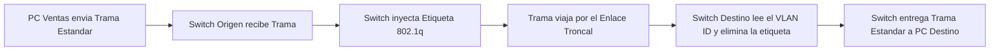
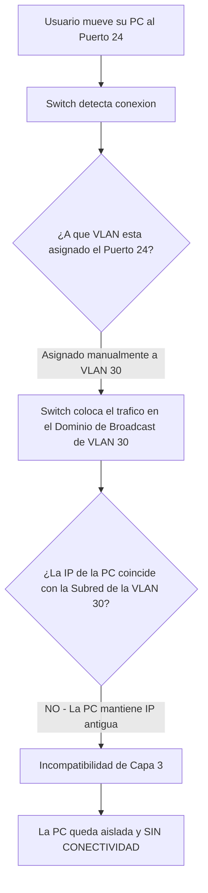

https://youtu.be/UjxOVfQZ6M0?si=FLmpyEL-hPQjnQpS&t=3136

¡Hola! Como tu Tutor Académico de Élite, he analizado rigurosamente tanto las diapositivas proporcionadas como la transcripción exacta de la clase.

A continuación, te presento el esquema cronológico detallado y estructurado con sintaxis de Obsidian, identificando todos los conceptos clave, trampas y fórmulas que el profesor desarrolló paso a paso.

## 1. Planteamiento del Problema: El [Dominio de Broadcast] compartido

El profesor inicia la clase planteando un escenario empresarial común: una organización con dos departamentos (Ventas y Administración) donde todos los empleados están conectados a un mismo **[Switch]** genérico.

- **El Problema:** Al estar en el mismo equipo físico, todos pertenecen a la misma red y, por lo tanto, comparten el mismo **[Dominio de Broadcast]**. Esto provoca que el tráfico de difusión de un area por ejemplo: Ventas, inunda también las computadoras de Administración, reduciendo la eficiencia y la seguridad.
![[{1DB92DD9-7A58-4F4A-98F7-F42911D4DC3E}.png|396]]
> [!question] Pregunta a la clase: ¿Cómo se puede dividir el tráfico entre ambos departamentos?
> 
> - División Física Mediante Routers: Divide la red utilizando un router con dos interfaces LAN. Conecta un switch a una interfaz y el otro switch a la segunda interfaz. De esta manera, tendrás dos dominios de broadcast separados, uno para cada área de la empresa, y cada área tendrá su propia dirección de subred
>   ![[{F2220E63-7BEE-4A1E-90A8-872095F95D91}.png]]

> [!danger] La Trampa de la Separación Física El profesor advirtió que la separación física es inútil si los empleados de Ventas y Administración están **mezclados físicamente** en distintos pisos o edificios de la empresa, ya que no se puede tirar un cableado exclusivo para cada empleado. Aquí nace la necesidad de la virtualización.

---

## 2.Intro  [[VLAN]] ✅

Pero como dijimos anteriormente si estan mezclados fisicamente en distintos pisos, no se puede dividir fisicamente entonces, 
![[{B2D3F369-CC5E-46B8-81D8-40D9A878FE66}.png]]

Para resolver el problema de la ubicación física, el profesor introduce las **[[VLAN]]** (Virtual Local Area Network).

>[!tip] Si los empleados están en diferentes ubicaciones físicas dentro de la misma empresa y no es posible realizar una división física, puedes implementar VLANs. Las VLANs permiten dividir un switch físico en múltiples redes virtuales, lo que significa que puedes asignar a cada área su propia VLAN y dirección de subred.

- **Definición:** Permiten crear redes lógicas separadas sobre una misma topología de red física.
- **Beneficios Estructurales:**
    - Permiten agrupar los empleados de una organización en forma lógica, independientemente de su ubicación física.
    - Reducen los **[Dominio de Broadcast]** (se crea exactamente un dominio por cada **[[VLAN]]**).
    - Permiten implementar políticas de seguridad (ej. aislar las bases de datos contables del área de ventas).
    - Son adaptables a cambios en la organización.
- **Requisitos Técnicos:**
    - Requieren especificar la cantidad de VLANs, sus nombres y asignación de dispositivos.
    - Cada **[[VLAN]]** debe tener asignada obligatoriamente una **[Dirección de Red]** o **[Subred]** diferente.
    - Solo se pueden implementar utilizando un **[Switch Administrable]** (no funcionan en switches genéricos).
> [!tip] Regla de Oro del Enrutamiento Inter-VLAN El profesor fue categórico en una regla de diseño: a cada **[[VLAN]]** se le debe asignar una **[Dirección de Red]** o **[Subred]** diferente. Por lo tanto, si se necesita que un equipo de la VLAN 10 se comunique con uno de la VLAN 20, **es estrictamente necesario utilizar un [Router]** (o un Switch Layer 3). Un switch estándar de Capa 2 jamás podrá enrutar tráfico entre dos VLANs distintas.

![[{6A33D0C1-5A42-4300-AC93-94846587FDE3}.png]]
si uno de la vlan 20 manda un brodcast lo reciben todos? NO, solamente lo reciven los de la vlan20
![[{F637703B-6EEE-4017-A373-03C55F92F128}.png]]
## Implementacion de las vlans✅
![[{944866EE-8D4A-4A45-A031-3B2F3A2B5061}.png]]
* Enlaces de acceso: donde se conectan los dispositivos finales (PC, servidores, impresoras).
* Enlaces troncales: enlaces de conexión entre switches o dispositivos de interconexión (router, hub)

Las VLANs operan en una capa intermedia, combinando aspectos de la Capa 2 y la Capa 3. En la Capa 2, se basan en la segmentación del tráfico utilizando etiquetas VLAN y se configuran en switches. Sin embargo, también adquieren conceptos de la Capa 3 al asignar direcciones IP a los dispositivos en cada VLAN. 

---
>[!question] COMO distinguen el switch entre tramas pertenecientes a diferntes VLANS en los enlaces troncales?
>
>cuando la red tiene múltiples switches interconectados, sus uniones se denominan **[Enlace Troncal]**. Por estos enlaces viaja el tráfico mezclado de todas las áreas
>
>Para que los switches puedan distinguir las tramas de diferentes VLANs, se desarrolló el protocolo [[IEEE 802.1q]].

Una PC envía una trama común, el switch identifica a qué VLAN pertenece el puerto por el que ingresó la trama, le agrega la etiqueta de esa VLAN. Viaja la trama modificada por los enlaces troncales. Cuando llega al switch al que se encuentra conectada la PC destino, elimina la etiqueta y entrega la trama común. Las PC no entienden el protocolo IEEE 802.1q

### 3. Identificación del Tráfico: Protocolo [[IEEE 802.1q]]

El estándar IEEE 802.1Q, publicado en 1998, permite la implementación de VLANs en switches. Con este estándar, varias VLANs pueden compartir el mismo medio físico sin interferir entre sí.

Este protocolo inyecta una etiqueta temporal ("Tag") en el medio de la **[Trama Ethernet]** original, justo entre la **[Dirección MAC]** de origen y el campo de tipo/longitud.

para identificar a qué VLAN pertenecen. La configuración se realiza en los enlaces troncales entre switches.

#### Estructura de la Etiqueta 802.1q
![[{B95B6A3B-3878-4236-A80B-D0AAABAC367F}.png]]
> [!note] Tamaño de la Etiqueta 802.1q El profesor detalló que esta sobrecarga se inserta entre la dirección MAC y Tipo/Longitud. $$ Tamaño_{Etiqueta} = 4_{bytes} (32_{bits}) $$

El profesor dividió esos 32 bits en cuatro campos clave:
1. **Tipo (0x8100):** Un valor constante para futura adaptación de protocolos
2. **Prioridad (3 bits):** Permite dar prioridad al tráfico crítico, como una **[VLAN de Voz]** (VoIP).
3. **CFI (1 bit):** Identificador de formato canónico (en desuso, pensado históricamente para Token Ring).
4. **[VLAN ID] (12 bits):** Es el número de identificación de la vlan. Al tener 12 bits matemáticamente permite crear hasta 4096 **[[VLAN]]** distintas (2^12)

> [!question] Pregunta en clase: ¿Quién agrega esta etiqueta? Un alumno respondió correctamente. El profesor confirmó que **sólo los switches agregan y quitan las etiquetas en los puertos del [Enlace Troncal]**. Las computadoras finales no entienden este protocolo; ellas envían y reciben una **[Trama Ethernet]** común y corriente.

> [!danger] Trampa de Parcial: ¿Quién lee la etiqueta? Es un error común creer que las computadoras leen las etiquetas. El profesor recalcó que **sólo los switches** (en sus puertos troncales) inyectan y retiran la etiqueta **[[IEEE 802.1q]]**. Los dispositivos finales (PCs de usuarios) no entienden este protocolo; ellos siempre envían y reciben una **[Trama Ethernet]** estándar.

>[!question] **Pregunta 4: Etiquetas vs Subredes** **Alumno:** _"Entonces, ¿etiquetas es una cuestión de seguridad porque se podrían reaccionar siempre con la dirección de su red?"_. (El alumno dudaba por qué usar etiquetas si las subredes IP ya aíslan el tráfico). **Respuesta del Profesor:** Aclaró que las etiquetas no reemplazan a la subred, sino que son obligatorias para el **[Enlace Troncal]**. Si todos los empleados estuvieran en un único switch, el switch podría manejar internamente la separación sin etiquetas. Pero cuando la empresa tiene múltiples switches interconectados, la **[Etiqueta 802.1q]** es el único mecanismo físico que permite que una trama viaje de un switch a otro sin perder su identidad de red.

---

## 4. Tipos de Implementación de [[VLAN]]✅

Para finalizar la temática, el profesor explicó las dos metodologías existentes para configurar a qué red virtual  pertenece cada máquina.

| Clasificación       | Metodología de Asignación y Características                                                                                                                                                                                                                                                                                                                                                                                                                                                                                                                                                                                                                                                                                                                                                                                  |
| :------------------ | :--------------------------------------------------------------------------------------------------------------------------------------------------------------------------------------------------------------------------------------------------------------------------------------------------------------------------------------------------------------------------------------------------------------------------------------------------------------------------------------------------------------------------------------------------------------------------------------------------------------------------------------------------------------------------------------------------------------------------------------------------------------------------------------------------------------------------- |
| **[VLAN Estática]** | Son **basadas en el puerto**. El administrador configura manualmente en el **[Switch]** qué bocas físicas pertenecen a qué red (ej. del puerto 1 al 8 son VLAN 10).   Cuando se conecta un dispositivo, automáticamente asume su pertenencia a la VLAN a la que se asignó el puerto   Son las más utilizadas por ser sencillas, pero son rígidas: si un usuario cambia su PC de boca sin avisar, pierde conectividad al quedar en una **[Subred]** incorrecta.                                                                                                                                                                                                                                                                                                                                                |
| **[VLAN Dinámica]** | Son automáticas y flexibles.   La asignación de VLANs se realiza a través de un servidor VMPS (VLAN Management Policy Server) que permite al administrador de red asignar puertos de manera automática basándose en la dirección MAC del dispositivo o el nombre de usuario utilizado para acceder.   Cuando un dispositivo se conecta, se consulta la base de datos de miembros de la VLAN para determinar su asignación.  En este enfoque, los puertos no están vinculados a una VLAN específica; Esto brinda flexibilidad, permitiendo que los dispositivos se muevan entre switches y aun así permanezcan en la misma VLAN.  Esta técnica se utiliza comúnmente en empresas grandes y ofrece la capacidad de crear VLANs basadas en el usuario o en la dirección MAC del dispositivo |

> [!danger] Pregunta de Análisis Práctico (Trampa en VLAN Estática) El profesor preguntó: _"En una VLAN estática, ¿qué sucede si un usuario que pertenece al puerto 1 (VLAN 10) se equivoca y conecta su PC al puerto 24 (VLAN 30)?"_.
> 
> - **Respuesta de la clase:** Un alumno dedujo correctamente que **no tendrá conectividad**.
> - **Validación:** El profesor confirmó que al cambiar de puerto asume la nueva **[[VLAN]]**, pero como su computadora sigue teniendo configurada la **[Dirección IP]** de la **[Subred]** anterior, la red lo dejará totalmente incomunicado.

### Cuadro Comparativo de Tipos de VLAN

| Clasificación       | Metodología de Asignación                                                                                                                                                                              | Ventajas / Desventajas                                                                                                                  |
| :------------------ | :----------------------------------------------------------------------------------------------------------------------------------------------------------------------------------------------------- | :-------------------------------------------------------------------------------------------------------------------------------------- |
| *[[VLAN Estática]** | **Basada en el Puerto.** El administrador configura manualmente en el **[[Switch]]** qué bocas pertenecen a qué VLAN (ej. puertos 1 al 8 a la VLAN Ventas).                                            | Es la más utilizada y sencilla de configurar, pero es muy rígida y no permite movilidad física del usuario.                             |
| **[VLAN Dinámica]** | **Basada en el Dispositivo/Usuario.** El switch consulta automáticamente un servidor **[VMPS]** y asigna el puerto leyendo la **[[Dirección MAC]]** de la placa de red o las credenciales del usuario. | Es muy flexible y permite el libre movimiento (ideal para grandes corporaciones), pero requiere mantener un servidor de bases de datos. |

