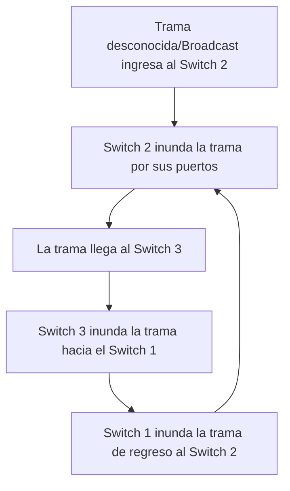

### 2. El problema catastrófico: [[Bucles de Capa 2]] (Loops)
Al conectar los tres switches formando un triángulo o "malla" para lograr la redundancia, el profesor advirtió que se genera un problema crítico a nivel operativo provocado por el comportamiento natural del switch.

- **La Dinámica del Bucle:** Si ingresa una **[Trama]** con un destino que el switch no conoce, o bien una trama de difusión masiva (Broadcast, dirigida a FF-FF-FF-FF-FF-FF), el Switch 2 actuará realizando una **[Inundación]** (enviando la trama por todos sus puertos activos).
- Esa trama inundada llegará al Switch 3, el cual también la inundará enviándola hacia el Switch 1. El Switch 1 la recibirá y la inundará de regreso hacia el Switch 2, reiniciando el ciclo.

![[{4DE9A6BA-0B02-4A46-A91D-1273F6170946}.png]]
• Redundancia: La presencia de redundancia en una red, especialmente al usar
dispositivos de capa de enlace como bridges o switches, puede resultar en la
formación de bucles o loops.
• Degradación del Rendimiento: Los bucles tienen un impacto negativo en el
rendimiento de la red.
• Tormentas de Difusión: Los bucles pueden provocar tormentas de difusión,
donde las tramas quedan atrapadas en un ciclo de capa 2, consumiendo todo
el ancho de banda disponible