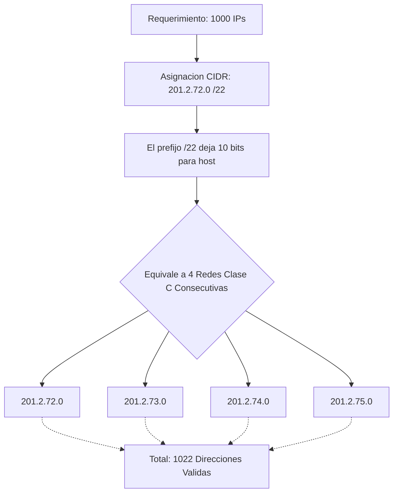

padre: [[Agotamiento de IPv4]]

---
La Solución Arquitectónica: [[CIDR]] (Enrutamiento Inter-Dominio sin Clases) (CLASSLESS INTER-DOMAIN ROUTING)

Para solucionar el derroche de la asignación _Classful_, se creó el estándar **[[CIDR]]**.

Concepto: Es una metodología que elimina el concepto de clases de direcciones IP y asignar redes enteras  y se enfoca en asignar direcciones en función de la cantidad de hosts necesarios y la ubicación geográfica.

Sus objetivos son:
* Distribuir direcciones IPv4 públicas no asignadas geográficamente
	* CIDR agrupa las IP por continentes. Esto permite que los routers lean menos bits (ej. los primeros 8 bits) para saber que el paquete va a Sudamérica, agilizando drásticamente el procesamiento
* Mejorar el enrutamiento al reducir el tamaño de las tablas en los routers y acelerar el procesamiento de paquetes
* Asignar direcciones en bloques de tamaño variable, eliminando la asignación por "clase"
* Basarse en la cantidad necesaria de direcciones válidas.
* Permitir la implementación de resumen de rutas ([[Sumarización de Rutas]]), similar a IPv6

### POR EJEMPLO:
>[!note] Fórmula Matemática de Asignación CIDR A diferencia del modelo **[Classful]** que entregaba redes enteras (Clase A, B o C), el proveedor de servicios en **[[CIDR]]** entrega una **[[Dirección IP]]** basándose estrictamente en la cantidad de bits 'n' que se dejan para la porción de host. 
>
>$$\text{DireccionesValidas}=2^n−2$$

#### ejemplo 1
![[{B25B4CEC-3156-45C8-8282-4C21E48227B7}.png]]
- **El Problema:** Una empresa solicita 100 direcciones IP públicas.
- **Solución [Classful] (Antigua):** Se le hubiera entregado una red **[Clase C]** entera (254 IPs), derrochando 154 direcciones.
- **Solución [[CIDR]] (Explicada en clase):** El proveedor le asigna el bloque `201.2.78.0/25`.

> [!question] Interacción en Clase: Cálculo de Hosts El profesor interpeló a la clase: _"¿Cuántas IP válidas voy a obtener con un barra 25?"_. 
> "126"_. **Justificación del profesor:** Al usar un prefijo `/25`, quedan exactamente 7 bits para **[Host]**. Aplicando la fórmula (2^7−2), se obtienen 126 direcciones útiles, cubriendo la necesidad de 100 sin generar un derroche excesivo.
#### ejemplo 2
![[{F6D94AD3-B1EA-42E3-97B8-E7F902510A14}.png]]
- **El Problema:** Una empresa necesita 500 direcciones IP públicas.
- **Solución [Classful] (Antigua):** Una red **[Clase C]** (254 IPs) no alcanza. Se le hubiera entregado obligatoriamente una red **[Clase B]** (65.534 IPs), generando un derroche inaceptable de más de 65.000 direcciones.
- **Solución [[CIDR]]:** El proveedor le asigna el bloque `201.2.76.0/23`.
- **Desglose Técnico del Profesor:** Al acortar la **[Máscara de Subred]** a un prefijo `/23`, quedan 9 bits para la porción de host (32−23=9).
    - Matemáticamente: 2^9−2=510 direcciones válidas.
    - **Equivalencia Lógica:** El profesor destacó que asignar un `/23` equivale exactamente a fusionar **DOS bloques de direcciones [Clase C] consecutivas** (`201.2.76.0` y `201.2.77.0`) en una sola red.
#### ejemplo 3
![[{34F1066B-708E-47CD-911A-89A991A4D843}.png]]
- **El Problema:** Una empresa necesita 1000 direcciones IP públicas.
- **Solución [[CIDR]]:** Se le asigna el bloque `201.2.72.0/22`.
- **Desglose Técnico del Profesor:** Con un prefijo `/22`, quedan 10 bits para la porción de host.
    - Matemáticamente: 2^10−2=1022 direcciones válidas.
    - **Equivalencia Lógica:** Equivale a unificar **CUATRO bloques de direcciones [Clase C] consecutivas**.

> [!danger] Confusión Frecuente en Clase: La Fusión de los 4 Bloques Durante este ejemplo, una alumna se confundió sobre de dónde salían los 4 bloques.

- **Aclaración del Profesor:** Explicó que al cortar la máscara en el bit 22 (dentro del tercer octeto), las combinaciones binarias restantes de ese octeto permiten agrupar cuatro redes contiguas bajo el mismo prefijo. Específicamente, el bloque `/22` engloba a las redes: `72.0`, `73.0`, `74.0` y `75.0`.

#### ---

|Requisito de la Empresa|Asignación en [[CIDR]]|Equivalencia Práctica|Direcciones Válidas|
|:--|:--|:--|:--|
|**500 Direcciones IP**|Se otorga un prefijo **/23**|2 bloques Clase C consecutivos|510 IPs|
|**1000 Direcciones IP**|Se otorga un prefijo **/22**|4 bloques Clase C consecutivos|1022 IPs|

Por ejemplo, en el pasado, se asignaba una dirección de clase C,
pero con CIDR, se asigna solo la cantidad de direcciones requeridas,
lo que evita el desperdicio. ==La dirección IP puede parecer de clase C,
pero la máscara de red es más pequeña que la máscara de subred
por defecto, como es un /24, lo que equivale a asignar dos bloques
de direcciones de clase C consecutivas.

# ---

hijo: [[Sumarización de Rutas]]