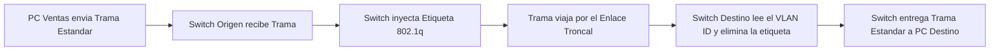

padre: [[VLAN]]

Protocolo [[IEEE 802.1q]]

El estándar IEEE 802.1Q, publicado en 1998, permite la implementación de VLANs en switches. Con este estándar, varias VLANs pueden compartir el mismo medio físico sin interferir entre sí.

Este protocolo inyecta una etiqueta temporal ("Tag") en el medio de la **[[Trama Ethernet]]** original, justo entre la **[Dirección MAC]** de origen y el campo de tipo/longitud.

para identificar a qué VLAN pertenecen. La configuración se realiza en los enlaces troncales entre switches.

#### Estructura de la Etiqueta 802.1q
![[{B95B6A3B-3878-4236-A80B-D0AAABAC367F}.png]]
> [!note] Tamaño de la Etiqueta 802.1q El profesor detalló que esta sobrecarga se inserta entre la dirección MAC y Tipo/Longitud. $$ Tamaño_{Etiqueta} = 4_{bytes} (32_{bits}) $$

El profesor dividió esos 32 bits en cuatro campos clave:
1. **Tipo (0x8100):** Identifica que la trama usa el protocolo 802.1q.
2. **Prioridad (3 bits):** Permite dar prioridad al tráfico crítico, como una **[VLAN de Voz]** (VoIP).
3. **CFI (1 bit):** Identificador de formato canónico (en desuso, pensado históricamente para Token Ring).
4. **[VLAN ID] (12 bits):** Es el número de identificación de la vlan. Al tener 12 bits matemáticamente permite crear hasta 4096 **[[VLAN]]** distintas (2^12)

> [!question] Pregunta en clase: ¿Quién agrega esta etiqueta? Un alumno respondió correctamente. El profesor confirmó que **sólo los switches agregan y quitan las etiquetas en los puertos del [Enlace Troncal]**. Las computadoras finales no entienden este protocolo; ellas envían y reciben una **[[Trama Ethernet]]** común y corriente.

> [!danger] Trampa de Parcial: ¿Quién lee la etiqueta? Es un error común creer que las computadoras leen las etiquetas. El profesor recalcó que **sólo los switches** (en sus puertos troncales) inyectan y retiran la etiqueta **[[IEEE 802.1q]]**. Los dispositivos finales (PCs de usuarios) no entienden este protocolo; ellos siempre envían y reciben una **[[Trama Ethernet]]** estándar.

>[!question] **Pregunta 4: Etiquetas vs Subredes** **Alumno:** _"Entonces, ¿etiquetas es una cuestión de seguridad porque se podrían reaccionar siempre con la dirección de su red?"_. (El alumno dudaba por qué usar etiquetas si las subredes IP ya aíslan el tráfico). **Respuesta del Profesor:** Aclaró que las etiquetas no reemplazan a la subred, sino que son obligatorias para el **[Enlace Troncal]**. Si todos los empleados estuvieran en un único switch, el switch podría manejar internamente la separación sin etiquetas. Pero cuando la empresa tiene múltiples switches interconectados, la **[Etiqueta 802.1q]** es el único mecanismo físico que permite que una trama viaje de un switch a otro sin perder su identidad de red.