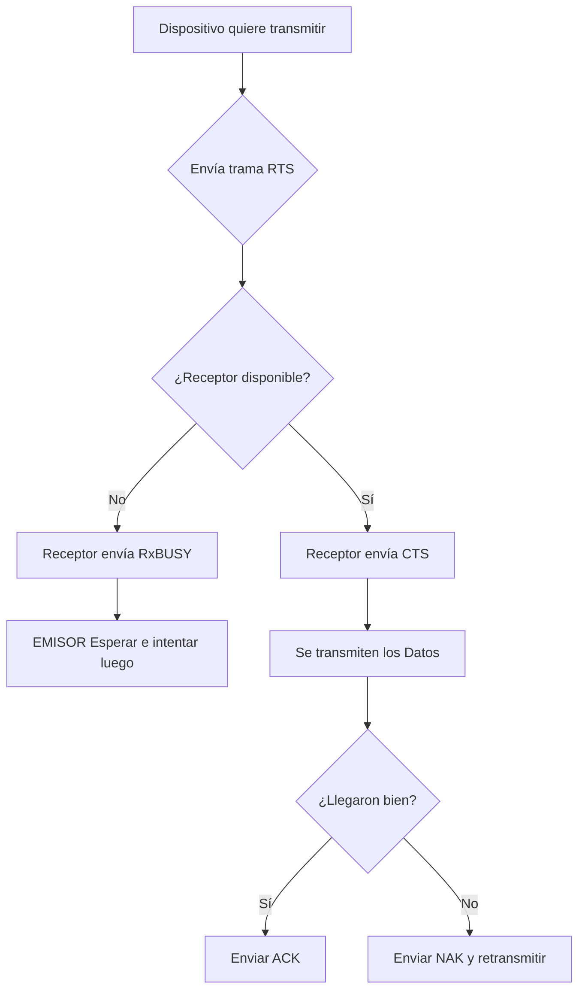

>[!note] **Redes de Difusión**
>Son entornos donde múltiples dispositivos comparten un mismo canal físico de comunicación, generando la necesidad de organizar quién transmite

>[!question] Como asignar el canal entre varios usuarios en un entorno de difusion?

- **Asignación Estática:** Se divide el canal de manera matemática por tiempo (TDMA) o frecuencia (FDMA), evitando la competencia.
	- FDMA (Acceso Múltiple por División de Frecuencias).
	- TDMA (Acceso Múltiple por División de Tiempo).
	- CDMA (Acceso Múltiple por División de Código).
	- En este tipo, los dispositivos no compiten, cada uno transmite en una frecuencia, tiempo o código asignado
- **Asignación Dinámica (Por Contienda):** Los equipos compiten dinámicamente por el uso del medio.
	- Los dispositivos compiten para enviar bits.
	- Métodos de acceso al medio incluyen CSMA/CD, CSMA/CA y Token Ring.
## Protocolos Dinámicos Explicados:

1. **[[CSMA_CD]]  Acceso Múltiple con Sensibilidad de Portadora y Detección de Colisiones)**: Es el protocolo dinámico usado en la [Ethernet Clásica] (redes alambradas, redes de área local (LAN)). El dispositivo "escucha" el canal; si está libre, transmite. Si dos equipos transmiten simultáneamente, sus señales chocan produciendo una **Colisión**. Al detectar el choque, dejan de enviar datos, lanzan una **Señal de Atasco** y esperan un tiempo aleatorio antes de reintent
   ![[{CB6F97A3-D1BF-4BFF-A23F-903B28EF9570}.png|508]]
	* Dispositivos y Ubicación de Lógica CSMA/CD:
		* Lógica implementada en la NIC (placa de red) y en el SWITCH (dispositivos de capa 2 - capa de enlace).
	* Limitaciones:
		* Funciona mejor en redes alámbricas, como en el caso de cable UTP.
		* No es adecuado para redes inalámbricas, ya que no pueden detectar colisiones.
	* Manejo de Errores:
		* Después de 16 intentos sin éxito, se detiene el intento y se informa de un error.
---
**[[CSMA_CA]] (Acceso Múltiple con Prevención de Colisiones)**: Es el protocolo usado en redes inalámbricas (Wi-Fi). Como en el aire es imposible detectar colisiones mientras se transmite simultáneamente, este método intenta _prevenirlas_ con anticipación mediante un intercambio burocrático de mensajes de control. Utiliza los siguientes parámetros:
![[{201A3B9B-D817-4761-9D76-0D1F101E8C09}.png|438]]
1. La estación origen escucha el medio para determinar su disponibilidad y, cuando está libre:
2. anuncia su intención de transmitir a todos los dispositivos mediante una trama de control RTS (Request to Send)**[RTS] (Request to Send)**:  Trama corta que envía la computadora de origen solicitando permiso a la red y anunciando su intención de comunicarse con una máquina específica.  La RTS especifica las direcciones MAC de origen y destino, identificando emisor y receptor y un tiempo previste de duracion.
3. Recepotr puede contestar CTS o RxBusy
	1. **[CTS] (Clear to Send)**: Trama de respuesta del destino que indica que se encuentra disponible y autoriza la recepción de datos.
	2. **[RxBUSY] (Receptor Ocupado)**: Respuesta del destino indicando que no puede recibir la información en ese momento. ( El emisor espera hasta que el destinatario esté libre antes de transmitir.)
4. el emisor al recibir CTS, Cuando el medio está libre, la estación espera un tiempo aleatorio adicional corto y solamente si el medio sigue libre, transmite la tramision de datos DATA comienza ,, ==DUDA ESEPRA UN TIEMPO ALEATORIO ANTES DE RECIBIR CTS O DSP DE RECIBIR CTS? ==
5. El receptor envia:
	- **[ACK] (Acknowledge)**: Acuse de recibo positivo. El receptor lo envía solo si la trama de datos llegó completa y sin errores.
	- **[NAK] (Negative Acknowledge)**: Acuse negativo, indicando que los datos llegaron con errores y se debe iniciar de nuevo la solicitud de transmisión.

---

**[[Token Ring (IEEE 802.5)]]**: (Redes de Anillo Lógico) Método lógico de transmisión estructurado en anillo. Es determinístico y libre de colisiones. Consiste en hacer circular un testigo llamado **[Token]** por la red. Únicamente la máquina que posee dicho token en su poder tiene el derecho a insertar datos en el medio físico
