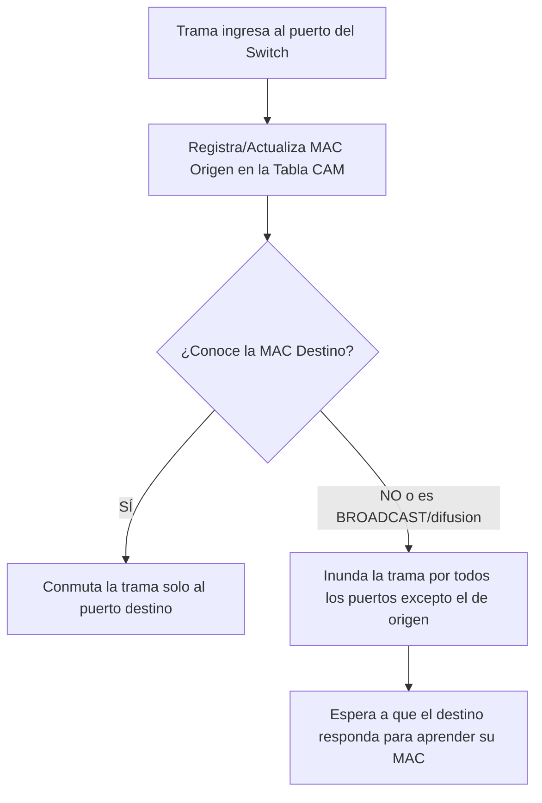

Un **conmutador de paquetes**, comúnmente conocido en las redes como **switch**, es un **equipo centralizador y concentrador** al que se conectan todos los dispositivos finales (o hosts) de una red.

Su tarea fundamental es actuar como intermediario para "dar los pases" de la información. Esto significa que cuando un mensaje o paquete de datos llega al dispositivo a través de un puerto específico, **el conmutador se encarga de analizarlo y reenviarlo exactamente al puerto donde se encuentra el destinatario**. Por ejemplo, si un paquete ingresa por un puerto y su destino es el equipo conectado al puerto cinco, el switch toma la decisión de enviarlo únicamente hacia ese puerto cinco.

Es importante destacar que el conmutador de paquetes **realiza esta función de manera local**, facilitando la comunicación exclusivamente entre los equipos que pertenecen a una misma red, a diferencia de un router, el cual tiene la capacidad de leer rutas y despachar paquetes hacia redes externas.


Tambien puede ser:
[[Switch no administrable]]

---
## 5. [[Switch]] o Conmutador y sus Técnicas (36:39 - 48:53)
![[{FD911E01-51D0-48D6-BFD1-9D6435E038A3}.png]]
- **Definición:** Dispositivo de interconexión que forma una LAN con topología en estrella, operando en la  [Capa 2]|[[CAPA DE ENLACE DE DATOS]] del modelo osi, reemplazó a los hubs.
- **Ventaja clave:** Todos sus puertos operan en modo [Full-Duplex], lo que anula la posibilidad física de colisiones. El uso de [[CSMA_CD]] ya no es necesario. Cada puerto del switch es su propio [[Dominio de Colisión]].
	- Mejora el rendimiento y la seguridad en LANs, implementando seguridad de puerto.
	- Facilita la escalabilidad de la red al ser expansible mediante la conexión de switches adicionales.
	- Puede tener puertos simétricos o asimétricos, y ser fijos o modulares, dependiendo de la configuración física.
	- Ofrece flexibilidad con puertos de acceso y troncales para la conexión de PC, disp. y servidores.
	- Utiliza UTP y fibra óptica, con opciones de velocidad de puertos que varían desde 10Mbps hasta 10Gbps![[{0A83C428-6C53-4900-AB22-83557A1915BC}.png]]

- **Consideraciones de adquisición:**
	- Puertos
		- Al evaluar switches para una empresa, se debe considerar la densidad de puertos, su velocidad (10, 100, 1000 Mbps), si son simétricos (todos los puertos con la misma velocidad) o asimétricos (velocidades diferentes para algunos puertos), 
		- Configuración: Puede ser fijo o modular, permitiendo o no la modificación de la configuración física.
		- Tipo: Puertos de acceso para conectar dispositivos y servidores, y puertos troncales para interconectar switches o routers
	- Tecnologia
		- Uso de UTP y fibra óptica según las necesidades de la red
		- Consideración de buffers para almacenamiento de tramas, siendo mayor el buffer para un mejor rendimiento.
	- Administracion
		- y si son un [Switch Administrable] (necesario para configurar [[VLAN]] o seguridad) o genérico.
		- Un switch administrable brinda más servicios al tener un sistema operativo más potente

### **Técnicas de Conmutación:**

| Técnica de Conmutación  | Funcionamiento Lógico                                                     | Control de Errores                                             |                                                                                                                                    |
| :---------------------- | :------------------------------------------------------------------------ | :------------------------------------------------------------- | ---------------------------------------------------------------------------------------------------------------------------------- |
| **[Store and Forward]** | Almacena la trama _completa_ antes de enviarla.                           | Verifica el [CRC] y descarta tramas corruptas.                 | * verifica la direccion mac destino<br>* conmuta la trama despues de todas la verificaciones<br>* metodo seguro pero lento<br>     |
| **[Cut-through]**       | Lee solo la [MAC Destino] (primeros 6 bytes) y conmuta inmediatamente.    | **No** controla errores. Puede reenviar colisiones.            | * Rápido pero puede conmutar tramas dañadas o fragmentos de colisión.                                                              |
| **[Fragment-Free]**     | Lee los primeros 64 bytes (46 datos +18 cabecera y cola) y luego conmuta. | Filtra fragmentos de colisión, pero no chequea el [CRC] total. | * Intermedia en velocidad.<br>* Evita conmutar fragmentos de colisión.<br>* Puede conmutar tramas erróneas al no verificar el CRC. |


###  Lógica de Aprendizaje Automático del Switch y como se construye Tabla de direcciones MAC (48:53 - 1:02:49) 
El profesor detalla de manera minuciosa cómo un switch construye dinámicamente su [Tabla CAM] (o [Tabla MAC]) desde que se enciende (cuando está totalmente vacía) para poder conmutar las tramas inteligentemente en lugar de repetirlas "a ciegas". A diferencia de un [[Hub]], un [[Switch]] solo envía la información al puerto que la necesita. Para lograrlo, construye dinámicamente una **[Tabla CAM]** (o tabla de direcciones MAC).

#### Escenario Inicial: Tabla Vacía e Inundación (Máquina A a Máquina D)
- **El Planteo:** Al encender el equipo, la **[Tabla de Direcciones MAC]** está vacía. La **[Máquina A]** (conectada al Puerto 1) decide enviarle datos a la **[Máquina D]** (conectada al Puerto 8).![[{F9EDF0E2-911F-4074-B06F-01C254601612}.png]]

- **Proceso de Aprendizaje:** La **[Trama]** ingresa por el Puerto 1. El switch extrae inmediatamente la **[[Dirección MAC| MAC Origen]]** de la cabecera y anota en su tabla que la `MAC-A` se encuentra físicamente en el Puerto 1.![[{DDD7D6E3-4ACD-4A09-BAAF-F9E506D05051}.png]]
>[!note] Regla de Aprendizaje Un [[Switch]] SIEMPRE aprende y actualiza su tabla observando únicamente la **[[Dirección MAC| MAC Origen]]** de las tramas que ingresan.
- **Reenvío de Datos:** Como la tabla está vacía para el resto, el switch desconoce dónde está la `MAC-D`. Para solucionarlo temporalmente, actúa como un hub y ejecuta una **[Inundación]** (flooding): envía la trama por todos los puertos activos de la red, excepto por el Puerto 1 de donde provino.![[{850D38C1-16C0-4F99-89D6-08211D63B2F8}.png]]
#### Escenario de Respuesta: Conmutación Directa (Máquina D a Máquina A)
- **El Planteo:** La **[Máquina D]** recibe la trama y le responde con datos a la **[Máquina A]**.
![[{75C4EB84-BD4D-4AF8-AD75-2F0D5E2D979E}.png]]
- **Proceso de Aprendizaje:** Esta nueva trama ingresa por el Puerto 8. El switch lee la **[[Dirección MAC| MAC Origen]]**y registra en su tabla que la `MAC-D` se encuentra en el Puerto 8.
![[{3565E603-C2CA-4D70-816D-71FE50B39420}.png]]
- **Reenvío de Datos:** Ahora el switch debe enviar los datos a la `MAC-A`. Como ya había aprendido en el paso anterior que la `MAC-A` está en el Puerto 1, **no inunda la red**. Directamente realiza la **[Conmutación]** y saca la trama de manera exclusiva por el Puerto 1.![[{182B80ED-3A5E-45D3-8CAA-4624F4134C71}.png]]

> [!tip] Tip del Profesor Esta es la inteligencia principal del switch que lo diferencia del [Hub]: al enviar los datos solo por el puerto necesario, permite comunicaciones simultáneas en la red sin que existan colisiones.


#### aprendisaje resumido
1. Inicialmente, la tabla del switch está vacía, y al recibir la primera trama, la difunde por todos los puertos excepto por el puerto de entrada.
	1. tambien Si la [MAC Destino] no está en la tabla (o es una trama [Broadcast]), el switch realiza una "tormenta" e inunda enviando la trama por _todos_ los puertos activos, excepto por el que ingresó.
2. El switch aprende mediante la dirección MAC de origen de las tramas, actualizando su tabla con la información del puerto al que pertenece cada dirección MAC.
3. Con cada trama nueva, el switch continúa aprendiendo y construyendo su tabla de direcciones MAC.
4. Permite comunicaciones simultáneas entre diferentes máquinas, en contraste con un hub
5. El switch conmuta selectivamente las tramas según la información de su tabla, mejorando la eficiencia y reduciendo el tráfico innecesari
6. La construcción de la tabla inicia cuando comienza el tráfico de red, permitiendo al switch adaptarse y optimizar la conmutación de datos.




> [!tip] Comportamiento Inicial Cuando se enciende un [[Switch]], su tabla está vacía y funciona temporalmente como un Hub (inundando todos los puertos) hasta que las máquinas empiezan a transmitir y el equipo "aprende" las rutas. Además, un mismo puerto físico puede aprender **múltiples direcciones MAC** si se conecta otro Switch o Hub a esa boca.

#### 3. Escenario Avanzado: Conexión de un HUB (Múltiples MACs)
Para demostrar un caso más complejo, el profesor planteó que un administrador conecta un **[[Hub]]** al Puerto 5 del switch,este actúa como un repetidor multiplicador de puertos,
ampliando la conectividad, , y a dicho hub le conecta la **[Máquina E]]* y la **[Máquina F]**.

1. (Aprender Máquina E) Las tramas enviadas desde A hacia E ingresan por el puerto 1. El switch interpreta la entrada de datos como la ubicación de A en ese puerto y actualiza el temporizador asociado a ese puerto en la tabla de direcciones MAC.
	1. Si una máquina no envía datos durante un tiempo configurable, la entrada correspondiente en la tabla se borra. Sin embargo, cada vez que ingresan datos por el puerto, se reinicia el temporizador.
	![[{93DCB314-6BA6-4354-983E-782E9753FE75}.png]]
2. Al no encontrar la dirección MAC de destino (E) en la tabla, el switch difunde la trama por todos los puertos activos excepto por el puerto de entrada.![[{004AB7DA-33E3-47E6-995F-20D4E1BDBE95}.png]]
3. La máquina E responde a “A”, y la trama es modificada con la dirección MAC de origen E y destino A. El Hub envía la trama al switch por el puerto 5, y este la conmuta solo al puerto 1 (donde está A).
	![[{AC62A15C-6981-487C-9332-49FECC19A3BD}.png]]
		aca la flechita que esta para F, es por la naturaleza del hub que retrasmite a todos sus puertos
	![[{3DCC1DCF-EE28-4803-BF33-F1441E00FFF9}.png]]
---
ahora la maquina f le quiere mandar datos, F se comunica con D
- **(Aprender Máquina F):** Posteriormente, la Máquina F envía datos a la Máquina D. Su trama también atraviesa el hub e ingresa al switch por el mismo Puerto 5. y como no tiene la dirección MAC de F en la tabla, la agrega. La trama se conmuta directamente al puerto 8, donde está la máquina D
![[{9E51D105-4823-46A3-A6DC-AEE7237BAAC0}.png]]

Un puerto del switch puede tener varias direcciones MAC detrás de él, ya que no distingue si hay una PC, un servidor, un Hub o un switch

>[!danger] Trampa de Parcial / Confusión Frecuente Es un error creer que un puerto de switch solo puede alojar una única máquina. El profesor usó este ejemplo para demostrar que **un mismo [Puerto Físico] de un switch puede aprender y registrar múltiples [[Dirección MAC]] simultáneamente** (en este caso, 2 direcciones, pero podrían ser 24 si el hub tuviera 24 bocas).


# ==DUDAS==

## una duda, no hace falta que lo agregues en el archivo, dsp lo agrego yo un switch, puede tener por ejemplo la mitad de bocas para una subred y la otra mitad de bocas para otra subred? (CHEQUEAR ESTA REPUESTA)
¡Buena pregunta! La respuesta depende del **tipo de switch**:

---

### Switch NO Gestionable (Unmanaged)

**Técnicamente sí podés conectar devices de dos subredes distintas**, pero con una limitación importante:

> Un switch no gestionable **no entiende de subredes** — opera en Capa 2 (MAC addresses). Para él, todos los puertos son **el mismo dominio de broadcast**.

Esto significa que aunque tengas PCs de la subred A en los puertos 1–12 y PCs de la subred B en los puertos 13–24:
- Los **broadcasts** de la subred A van a llegar también a los puertos de la subred B y viceversa → **derrota el propósito de hacer subredes**.
- Las PCs de subred A **no van a poder hablar directamente** con las de subred B (eso requeriría un router), pero sí van a "ver" el tráfico broadcast de la otra.

---

### Switch Gestionable (Managed) con VLANs

Esta es la forma **correcta** de hacerlo:

Con **VLANs (Virtual LANs)** podés asignar puertos a dominios de broadcast lógicamente separados dentro del mismo switch físico:

```
Switch Gestionable de 24 puertos:
├── Puertos 1-12  → VLAN 10 → Subred 192.168.10.0/28  (Oficina A)
└── Puertos 13-24 → VLAN 20 → Subred 192.168.10.16/28 (Oficina B)
```

Cada VLAN es un dominio de broadcast **completamente aislado**, como si fueran dos switches físicos distintos. Para comunicar las dos VLANs necesitás un router (o un **switch de Capa 3**).

---

### Resumen

| Tipo de Switch | ¿Puede tener dos subredes? | ¿Es correcto? |
|---|:---:|:---:|
| No gestionable (unmanaged) | ⚠️ Físicamente sí | ❌ No recomendado (broadcasts se mezclan) |
| Gestionable con VLANs | ✅ Sí | ✅ Forma correcta |

En los ejercicios de la práctica, cuando se plantea un switch por oficina, se asume que **cada switch corresponde a una sola subred/dominio de broadcast** — que es la arquitectura más simple y la que se estudia primero antes de ver VLANs.