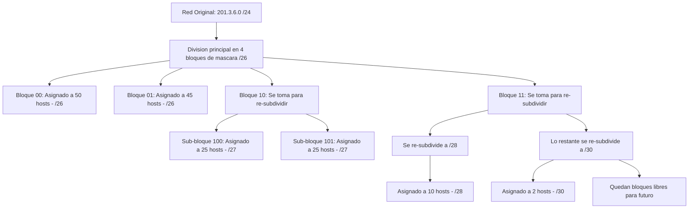

padre: [[VLSM]]

---
[[VLSM]]
###  USO DE SUBREDES- Subnneting
![[{48F3E25E-CFDB-40F3-A195-31A3711C026A}.png]]
como vemos se van desaprovechando muchas ios, ahora si son ips privados no hay ningun problema, EL PROBLEMA ES CUANDO SON IP PUBLICAS, no deben desaprovecharse

para esto surge vlsm

Para la asignación de subredes, se utilizan 3 bits, lo que permite crear 2^3 = 8 subredes, suficientes para las 6 que se necesitan en el gráfico. En cuanto a la cantidad de hosts que se pueden direccionar, se obtiene mediante 2^5 - 2, lo que da un total de 30 hosts.

Es importante destacar que el "2" se refiere a la necesidad de asignar 2 direcciones IP, una por cada interfaz en un enlace punto a punto.

Sin embargo, con enfoques de subredes se puede desperdiciar espacio de direcciones IP. Por ejemplo, en una subred de tamaño 28, se desperdician 2 direcciones IP, en una de tamaño 25, se desperdician 5 IP, y en una de tamaño
5, se desperdician 25 IP. Esto es un problema cuando se trata de direcciones IP públicas, por lo que surge la necesidad de utilizar VLSM (Variable Length Subnet Masking) para asignar direcciones de manera más eficiente.

### vlsm concepto
El último gran tema resolvió la limitación del _subnetting_ tradicional. El profesor demostró que, al usar subredes clásicas, todas heredan la misma **[Máscara de Subred]**, obligando a que todas tengan la misma capacidad de hosts. Si se necesita un enlace punto a punto de 2 PCs, una máscara rígida desperdiciaría decenas de IPs.

La solución definitiva es **[[VLSM]]** (Máscara de Subred de Longitud Variable)(Variable Length Subnet Masking), es una técnica que permite crear esquemas de direccionamiento eficientes y escalables en direcciones IPv4 públicas. que permite "crear subredes dentro de subredes" lo que agrega un nivel adicional de jerarquía.  Usa máscaras largas (mascaras con muchos bits) (ej. `/30`) para direccionar pocos hosts, y máscaras cortas para direccionar muchos host, optimizando al máximo las IPs públicas.

* VLSM no se utiliza en direcciones IP privadas, ya que no hay restricciones de asignación de direcciones.

Asi se ven los nuevos niveles de jerarjquia
![[{9F8436DC-FFE5-4D29-8B19-F2B50AF9A772}.png|502]]
	Puede ser mas tambien por ejemplo RED;SR;SR;SR;SR;...;HOST

#### EJEMPLO
![[{57D32671-3456-4B8B-B9A3-EC902028A465}.png]]
El profesor planteó un escenario real para demostrar el algoritmo: un **[ISP]** le asigna a una empresa la red pública `201.3.6.0/24` y el administrador debe dividirla para 6 áreas con requerimientos dispares: **50, 45, 25, 25, 10 y 2 [[Host|Hosts]]**.

>[!question] **Pregunta en clase: Limitación Topológica** El profesor interpeló: _"¿Se puede resolver este caso con subredes clásicas?"_. 
>- **Alumno:** Intentó dejar 6 bits para host (permitiendo 62 máquinas, lo que cubre el área de 50). Pero notó que esto solo dejaba 2 bits para red, permitiendo crear apenas 2^2=4 subredes, cuando el ejercicio pide 6.
> - **Respuesta del Profesor:** Validó que **no tiene solución** con el _subnetting_ tradicional. Como la máscara clásica es fija, todas las subredes quedan del mismo tamaño. Esto genera que en el enlace donde solo hay 2 hosts, estemos derrochando 60 IPs públicas, lo cual es inaceptable.
>   Por ende, es obligatorio usar **[[VLSM]]**

#### PROCEDIMIENTO DE CALCULO VLSM
>[!tip] **Regla de Oro (Metodología de Cálculo)** El profesor fue tajante con el primer paso del algoritmo: Para que **[[VLSM]]** funcione, **siempre se deben ordenar los requerimientos de mayor a menor** cantidad de **[[Host|Hosts]]** antes de empezar a subdividir

1. Primero se determinan los requerimientos de direccionamiento, considerando la cantidad de dispositivos y las IPs necesarias para cada área de la empresa, organizándolos de mayor a menor importancia
	1. ![[{507D17A5-2BFC-4B34-903F-A174C43E2812}.png]]
2. Luego, se calcula el espacio total de direccionamiento, en este caso, se utilizan 8 bits para las IPs, lo que da 254 direcciones
3. A continuación, se determina la cantidad de bits para hosts y se asigna el espacio restante a subredes. En este ejemplo (de 50 hosts), quedan 2 bits para subredes, lo que permite crear 2^2=4 subredes con capacidad para 2^6-2=62 hosts cada una
4. Luego, se analiza cada área o departamento con sus requerimientos de hosts y se elige la subred adecuada. Se divide esta subred en subredes más pequeñas según sea necesario.

##### Ejemplo cada caso desglosado

###### **Área de 50 y Área de 45 [[Host|Hosts]]:**
- Se necesitan 6 bits de host (2^6−2=62).
- lo que me quede lo voy a dejar para subredes, en este caso nos quedan 2 -> 2^2=4 subredes, entonces vemos que el espacio de direccionamiento se dividi en 4 bloques
	- ![[{E41BC503-5A42-4068-A4E1-86764F7E4817}.png|464]]
	- 
- Al tomar el prefijo `/24` original y desplazar el corte, la **[[Máscara de Subred]]** se alarga a `/26`.
- .Se asigna el primer bloque (`00`) al área de 50 hosts (**201.3.6.0/26**) 
	- ![[{3B92F65A-21EE-4EF1-BCC1-465C5AFCBF9F}.png]]
- y el segundo bloque (`01`) al área de 45 hosts (**201.3.6.64/26**).
	- ![[{F3748D45-81BE-4893-8025-9F97A18A8F41}.png]]

pero ahora que pasa para el 3er requerimiento que necesito 25 host? cuantos bits necesito para la parte de host? necesito 5 bits nomas no 6 siendo, 2^5−2=30

######  **Dos Áreas de 25 [[Host|Hosts]]:**
* Se necesitan 5 bits de host (2^5−2=30).
* Utilizamos el 3er bloque (`10`) pero al utilizar solamente 5 bits para la parte de host, lo subdividmos alargando la mascara 1 bit quedandonos `/27`
	* Al hacer esto y quedanos 1 bits, nos permite SUBDIVIR la subred `10` y la vamos a dividir en 2 quedandonos  la `100` y la `101`, ENTONCES ESTO ES VLSM tomar una SUBRED y de acuerdo a la cantidad de bits que se corran subdividir esa subred
	* ![[{C61F80E5-B7BD-4A50-A693-2C84E133B14A}.png]]
* aprovechando que la otra es igual y que ya nos quedo subdivida. Se asigna el sub-bloque (`100`) para la primera red de 25 (**201.3.6.128/27**) y el (`101`) para la segunda (**201.3.6.160/27**)
	* ![[{4CE833DE-C1DE-44B6-94C9-4125363EFBA0}.png]]

###### **Área de 10 [[Host|Hosts]]:**
- Se necesitan 4 bits de host (2^4−2=14).
- Se toma el último gran bloque restante (`11`) y se le corre el límite dos posiciones dejando 4 bits para host y pasando la máscara a `/28`.
	- Atento vuelve el limite al principo y se toma asi:
		- ![[{D0FA90B0-E6A6-4789-9DF6-4EDBA28CAB0E}.png]]
	- 4 bits para host:
	- ![[{87CFBA93-F0DE-43F8-B7FC-D2F54B674D0A}.png]]
	- Vemos que al desplazarse dos bits nos permite la subred `11` dividirla en 4 subredes
		- ![[{10D78EC4-72FB-47D5-A164-8BCFF19681FD}.png]]
- Se asigna la red **201.3.6.192/28**.
	- ![[{7CAB4A91-BC1F-4C89-907C-4EA9AE0BA79B}.png]]

###### ** 2 [[Host|Hosts]] :**
- Se necesitan 2 bits de host (2^2−2=2).
- Se toma uno de los sub-bloques libres restantes de `11` que ya fue divida en 4, ahora tomamos por ejemplo el `1101` y lo subdivimos porque tomamos solo 2 bits de hots, asi alargando la mascara y se ajusta la máscara al máximo permitido, `/30`.
	- ![[{8614DB0F-99B0-4580-B320-E3B9FFC2A6AE}.png]]
- Se asigna la red **201.3.6.208/30**.
- ![[{590B10CE-FA8A-4FE0-BCEA-200CF1C3AAC4}.png]]

###### Componente Visual: El Árbol de Subdivisión [[VLSM]]
Para fijar cómo el profesor dividió lógicamente el espacio total de direcciones creando subredes dentro de subredes, aquí tienes el mapa conceptual del proceso algorítmico:

###### posible crecimiento

> [!question] Pregunta Avanzada de Diseño (Expansión Futura)
> 
> - **Alumno:** Preguntó si, previendo que la subred de 10 hosts pudiera crecer en el futuro, se podría asignar preventivamente un bloque más grande (ej. un `/27` en lugar de un `/28`).
> - **Profesor:** Validó la idea como un excelente ejemplo de diseño de redes. Aconsejó hablar siempre con la gerencia sobre los planes de crecimiento a 5 años, ya que prever el tamaño en **[[VLSM]]** ahorra tener que recalcular y reconfigurar todas las IPs de la empresa posteriormente.

###### RANGO DE CADA SUBRED
![[{A3018BA5-35B4-4E85-B912-E10E4F841C64}.png]]
Los rangos son faciles de calcular simplemente viendo la siguiente subred

el incremento 2^h = 2^6=64

y arriba pos el rango de ip validas

###### aplicacion en topoligia
![[{574217F3-66A5-4D10-AA57-ACD2CDE293BC}.png]]
##### ---

>[!note] La máscara /30 es la más grande que podemos tener, ya que la máscara /31 no nos permite direccionar hosts.
>El uso de VLSM permite aprovechar al máximo las direcciones IP públicas y es una técnica que se utiliza junto con CIDR(Classless Inter-Domain Routing) para lograr un direccionamiento eficiente y escalable en redes IPv4 públicas.

---

# ---