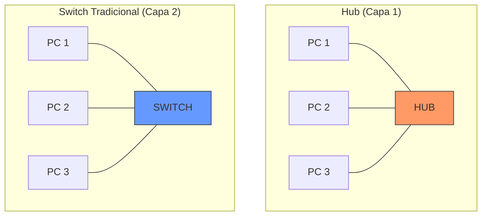
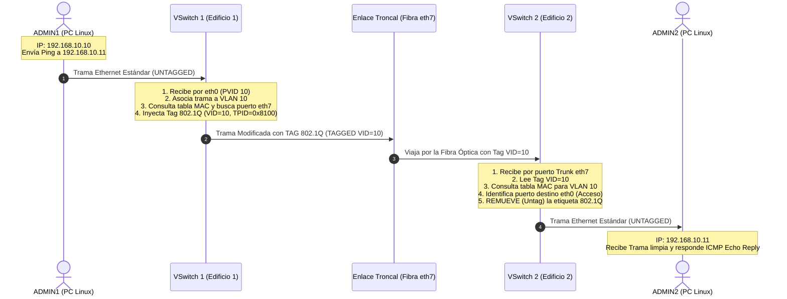
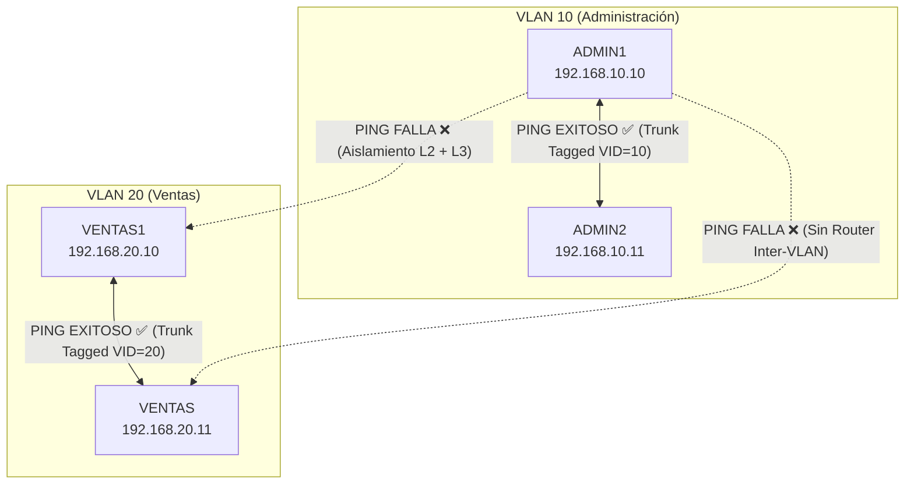

![[P2-C02-Segmentación de redes - Trunking.pdf]]

# 🏢 Redes de Datos — Segmentación de Redes y Trunking (VLANs)
## Guía Teórico-Práctica Integral: De Cero a Experto

> **Cátedra:** Redes de Datos — UTN FRC  
> **Archivos de referencia:**  
> - `P2-C02-Segmentación de redes - Trunking.pdf` (Enunciado práctico)  
> - `P2-C02-Preguntas Diagnostico - Segmentación de redes - Trunking.pdf` (Cuestionario)  
> **Autor del enunciado:** Ing. Ciceri, Leonardo — Versión 1.0  
> **Plataforma:** RVL (Redes Virtuales de Laboratorio)

---

# 📚 PARTE 1: MARCO TEÓRICO COMPLETO

---

## 1. Fundamentos de Redes Locales (LAN) y Conmutación

### 1.1 El Dominio de Colisión vs El Dominio de Broadcast (Difusión)

Para comprender por qué surgen las VLANs, es indispensable distinguir los dos conceptos de dominio fundamentales en redes:

```
┌──────────────────────────────────────────────────────────────────────────────────┐
│                             CONCEPTOS DE DOMINIO                                 │
├────────────────────────────────────────┬─────────────────────────────────────────┤
│         DOMINIO DE COLISIÓN (Capa 1/2)                      │         DOMINIO DE BROADCAST (Capa 2/3) │
├────────────────────────────────────────┼─────────────────────────────────────────┤
│ Área de la red donde dos tramas pueden                   │ Área de la red alcanzada por una trama  │
│ colisionar al transmitirse a la vez.                               │ de difusión (MAC FF:FF:FF:FF:FF:FF).    │
│ • Un Hub crea 1 solo dominio.                                       │ • Un Switch tradicional tiene 1 solo    │
│ • Cada puerto de un Switch es un                                 │   dominio de broadcast para todos sus   │
│   dominio de colisión independiente                            │   puertos.                              │
│   (Full-Duplex = 0 colisiones).                                         │ • Un Router limita/corta el broadcast.  │
└────────────────────────────────────────┴─────────────────────────────────────────┘
```



### 1.2 ¿Cómo opera un Switch de Capa 2 tradicional?

Un switch estándar opera en la **Capa de Enlace de Datos (Capa 2)** del modelo OSI. Su función principal es reenviar tramas basándose en las **direcciones MAC de destino** utilizando su **Tabla de Direcciones MAC (CAM Table)**:

1. **Learning (Aprendizaje):** Cuando entra una trama por un puerto, el switch examina la **MAC de origen** y la asocia en su tabla con el número de puerto por el que ingresó.
2. **Forwarding / Filtering (Reenvío selectivo / Filtrado):**
   - Si la **MAC de destino** ya está en su tabla, envía la trama **únicamente por el puerto correspondiente** (Filtrado).
3. **Flooding (Inundación):**
   - Si la trama es de **Broadcast** (`FF:FF:FF:FF:FF:FF`) o si la MAC destino aún no fue aprendida (**Unicast Desconocido**), el switch reenvía una copia de la trama por **todos los demás puertos activos**, excepto por el que ingresó.

---

## 2. El Problema del Broadcast y la Necesidad de las VLANs

### 2.1 Los Tres Grandes Problemas de una Red Plana (Flat Network)

En una empresa en crecimiento donde todos los equipos están conectados a switches tradicionales sin segmentar:

1. **Tormentas de Difusión (Broadcast Storms):** Protocolos cotidianos como **ARP**, **DHCP** o anuncios NetBIOS envían tramas a `FF:FF:FF:FF:FF:FF`. Si hay cientos de computadoras, el switch inunda constantemente todos los puertos, saturando los enlaces y consumiendo ciclos de CPU de todas las PCs de la red.
2. **Falta Total de Seguridad e Intromisión:** En una red plana, cualquier empleado de Ventas puede ejecutar un analizador de paquetes (como Wireshark o tcpdump) y capturar tráfico sensible del departamento de Administración o Contabilidad (sueldos, datos bancarios).
3. **Pérdida de Rendimiento y Contención de Fallas:** Si una máquina se infecta con malware que genera tráfico masivo o si hay un bucle temporal, toda la empresa colapsa sin distinción de área.

### 2.2 ¿Por qué la separación física resulta inviable?

La solución clásica consistía en comprar switches separados físicamente para cada departamento y unirlos a un router:

```
Edificio 1: [Switch Admin 1] (físico)  ───  [Switch Ventas 1] (físico)
                     │                                │
                     │  (¿Cables separados por cada   │
                     │   piso, oficina y edificio?)   │
                     ▼                                ▼
Edificio 2: [Switch Admin 2] (físico)  ───  [Switch Ventas 2] (físico)
```

> [!danger] La Trampa de la Separación Física
> Si los empleados de Administración y Ventas están **distribuidos y mezclados en distintos edificios, pisos u oficinas**, tirar cables físicos independientes para cada departamento hacia cada oficina multiplica los costos, agota la infraestructura de canalizaciones y resulta imposible de mantener ante cualquier cambio de personal o mudanza de escritorios.

---

## 3. ¿Qué es una VLAN (Virtual Local Area Network)?

Una **VLAN** es una **subdivisión lógica** de una red de conmutación de Capa 2 creada dentro de uno o varios switches gestionables.

```
       SWITCH FÍSICO ÚNICO
 ┌───────────────────────────────┐
 │ [P1] [P2] [P3]            │ [P4] [P5] [P6]│
 ├────────────────┼───────────────┤
 │    VLAN 10                 │    VLAN 20    │
 │ (Administración      │   (Ventas)    │
 │  Dominio Bcast1       │ Dominio Bcast2│
 └────────────────┴───────────────┘
```

### 3.1 La Regla de Oro de las VLANs

$$\mathbf{1\ VLAN = 1\ Dominio\ de\ Broadcast\ (Capa\ 2) = 1\ Subred\ IP\ (Capa\ 3)}$$

* Cada VLAN representa un **dominio de difusión independiente**.
* Los broadcasts generados en la VLAN 10 **nunca** cruzan a la VLAN 20 a nivel de switch.
* Para comunicar dos VLANs distintas, se requiere obligatoriamente un dispositivo de **Capa 3 (Router o Switch L3)**.

### 3.2 Beneficios Clave de las VLANs

| Beneficio                   | Explicación Técnica                                                                                            |
| :-------------------------- | :------------------------------------------------------------------------------------------------------------- |
| **Seguridad Mejorada**      | Los grupos con datos sensibles (Administración) quedan aislados en Capa 2 del resto de los usuarios (Ventas).  |
| **Reducción de Broadcasts** | Las tramas de difusión quedan confinadas a su VLAN; menos tráfico basura para las PCs.                         |
| **Flexibilidad Geográfica** | Dos computadoras en edificios distintos pueden estar en la misma VLAN 10 como si estuvieran en el mismo cable. |
| **Ahorro de Costos**        | Se utiliza la misma infraestructura física de switches y fibra óptica compartida.                              |
| **Facilidad de Gestión**    | Mover a un usuario de departamento solo requiere cambiar la VLAN del puerto en el switch, sin recablear.       |

### 3.3 Tipos de Implementación de VLANs

1. **VLAN Estática (Basada en Puerto — *Port-Based*):**
   * El administrador asigna manualmente un puerto físico a una VLAN específica (ej. puertos 1 a 12 = VLAN 10; puertos 13 a 24 = VLAN 20).
   * Cuando se conecta un equipo al puerto, este asume automáticamente la VLAN del puerto.
   * **Es el método estándar de la industria y el utilizado en esta práctica.**
2. **VLAN Dinámica (Basada en MAC o Servidor VMPS / 802.1X):**
   * El switch lee la dirección MAC del equipo o credenciales del usuario y consulta una base de datos centralizada (VMPS / RADIUS) para asignarle la VLAN automáticamente, sin importar a qué puerto se conecte.

---

## 4. Tipos de Enlaces y Puertos en Switches

Para interconectar hosts y switches en un entorno con VLANs, existen dos tipos fundamentales de puertos:

```
 [ PC Host ] ──(Trama Estándar)──► [ Puerto de ACCESO ] ──► [ Switch ]
                                                                │
                                                 (Trama Tagged 802.1Q)
                                                                ▼
                                                       [ Puerto TRONCAL ]
                                                                │
                                                         (Fibra / Cobre)
                                                                ▼
 [ PC Host ] ◄──(Trama Estándar)── [ Puerto de ACCESO ] ◄── [ Switch ]
```

### 4.1 Puerto de Acceso (Access Port / Untagged Port)

* **Uso:** Conecta a **dispositivos finales** (PCs, servidores, impresoras).
* **Pertenencia:** Pertenece a **una sola VLAN**.
* **PVID (Port VLAN ID):** Es el ID de la VLAN asignada a ese puerto.
* **Comportamiento:**
  * **Al recibir tráfico de la PC (Ingreso):** La PC envía una trama Ethernet estándar (**sin etiqueta**). El switch asocia internamente esa trama a la VLAN del puerto (PVID).
  * **Al enviar tráfico a la PC (Egreso):** El switch retira cualquier etiqueta interna y entrega una trama Ethernet nativa.
* **Transparencia:** Las PCs **desconocen completamente** la existencia de las VLANs.

### 4.2 Puerto Troncal (Trunk Port / Tagged Port)

* **Uso:** Interconecta **switches entre sí** o conecta un switch con un router.
* **Pertenencia:** Puede transportar tráfico de **múltiples VLANs simultáneamente** sobre un único cable físico (fibra o cobre).
* **Multiplexación:** Para que el switch receptor sepa a qué VLAN pertenece cada trama, se utiliza el estándar **IEEE 802.1Q**, que añade una etiqueta (*Tag*) a cada trama.

---

## 5. El Estándar IEEE 802.1Q: VLAN Tagging a Fondo

El estándar **IEEE 802.1Q** define un mecanismo universal para insertar información de pertenencia de VLAN en las tramas Ethernet.

### 5.1 Estructura de la Trama Ethernet con Etiqueta 802.1Q

La etiqueta 802.1Q tiene un tamaño de **4 bytes (32 bits)** y se inserta en la trama Ethernet original justo **entre la dirección MAC Origen y el campo EtherType / Longitud**:

```
┌─────────────────┬─────────────────┬──────────────────────┬──────────┬───────────┬────────┐
│ MAC Destino     │ MAC Origen      │ ETIQUETA 802.1Q      │ Tipo/Len │ Datos IP  │  FCS   │
│ (6 bytes)       │ (6 bytes)       │ (4 bytes = 32 bits)  │ (2 bytes)│ (Payload) │(4 bytes│
└─────────────────┴─────────────────┴──────────┬───────────┴──────────┴───────────┴────────┘
                                               │
               ┌───────────────────────────────┴───────────────────────────────┐
               │                                                               │
               │   TPID (16 bits)   │ PCP (3b) │ DEI (1b) │   VLAN ID (12b)    │
               │      0x8100        │ Prioridad│ Descarte │    0 a 4095        │
               └────────────────────┴──────────┴──────────┴────────────────────┘
```

### 5.2 Desglose de los 4 Campos de la Etiqueta (32 bits)

1. **TPID (Tag Protocol Identifier — 16 bits):**
   * Contiene siempre el valor hexadecimal **`0x8100`**.
   * Identifica que la trama contiene un encabezado 802.1Q. Si un dispositivo antiguo no soporta VLANs, descarta la trama o la trata como error de tipo.
2. **PCP / CoS (Priority Code Point — 3 bits):**
   * Define la **Prioridad de Capa 2 (IEEE 802.1p)** para Calidad de Servicio (QoS).
   * Permite $2^3 = 8$ niveles de prioridad (0 a 7). Por ejemplo, prioridad 5 o 6 para VoIP (VLAN de Voz) y videoconferencia frente a tráfico de datos web estándar (prioridad 0).
3. **DEI / CFI (Drop Eligible Indicator — 1 bit):**
   * Originalmente *Canonical Format Indicator* (para compatibilidad con Token Ring). Hoy indica si la trama puede ser descartada prioritariamente en caso de congestión severa en el enlace troncal.
4. **VID (VLAN Identifier — 12 bits):**
   * Es el número identificador de la VLAN.
   * Con 12 bits se pueden representar $2^{12} = 4096$ identificadores:
     * **`VID 0`:** Reservado (prioridad sin VLAN).
     * **`VID 1`:** VLAN por defecto (Default VLAN).
     * **`VID 2 a 4094`:** Rango de VLANs utilizables (VLANs normales y extendidas).
     * **`VID 4095`:** Reservado para uso del sistema.

### 5.3 Ciclo de Vida Completo de una Trama a través del Trunk



---

## 6. Subnetting y Capa de Red (Capa 3) en este Escenario

### 6.1 Desglose de la Máscara `/28` (`255.255.255.240`)

Una dirección IPv4 tiene 32 bits. El prefijo `/28` indica:
* **Bits de red:** 28 bits en `1` $\rightarrow$ `11111111.11111111.11111111.11110000` = `255.255.255.240`.
* **Bits de host:** $32 - 28 = 4$ bits en `0`.
* **Total de direcciones por bloque:** $2^4 = 16$ direcciones.
* **Hosts útiles:** $2^4 - 2 = 14$ IPs asignables (se descuentan la dirección de red y la de broadcast).
* **Salto de red:** $256 - 240 = 16$.

```
Subred VLAN 10 (Administración):
  • Dirección de Red:       192.168.10.0
  • Primer host útil:       192.168.10.1
  • ADMIN1 asignado:        192.168.10.10
  • ADMIN2 asignado:        192.168.10.11
  • Último host útil:       192.168.10.14
  • Dirección de Broadcast: 192.168.10.15

Subred VLAN 20 (Ventas):
  • Dirección de Red:       192.168.20.0
  • Primer host útil:       192.168.20.1
  • VENTAS1 asignado:       192.168.20.10
  • VENTAS asignado:        192.168.20.11
  • Último host útil:       192.168.20.14
  • Dirección de Broadcast: 192.168.20.15
```

---

## 7. Inter-VLAN Routing: ¿Por qué NO hay comunicación entre VLAN 10 y VLAN 20?

En este laboratorio se comprueba que **ADMIN1 (VLAN 10) no puede hacer ping a VENTAS1 (VLAN 20)**, a pesar de estar conectados al mismo switch físico.

### 7.1 La Doble Barrera (Capa 2 y Capa 3)

```
       ADMIN1 (192.168.10.10)                                    VENTAS1 (192.168.20.10)
        [ VLAN 10 / Red .10.0 ]                                   [ VLAN 20 / Red .20.0 ]
                 │                                                                             │
                 ▼                                                                             ▼
        ┌─────────────────────────────────────────────────────┐
        │          VSwitch 1                 │
        │  [VLAN 10]                                                                     [VLAN 20]  │
        │   eth0 ──┐                                                               ┌── eth1  │
        │          │                                                                      │         │
        │          └───❌ AISLAMIENTO DE CAPA 2 ────┘         │
        │             (Tablas MAC independientes)             │
        └─────────────────────────────────────────────────────┘
```

1. **Barrera de Capa 3 (Lógica):** Cuando `ADMIN1` evalúa la IP destino `192.168.20.10` aplicando su máscara `/28`, detecta que pertenece a **otra subred**. Por lo tanto, no envía un ARP directo por la IP de Ventas, sino que busca en su tabla de rutas la IP de su **Default Gateway (Router)**. Al no tener gateway configurado, el kernel de Linux descarta el paquete con el error: `connect: Network is unreachable`.
2. **Barrera de Capa 2 (Conmutación):** Incluso si un atacante intentara forzar el envío de una trama dirigida a la MAC de Ventas, el switch mantiene **tablas de reenvío separadas por cada VLAN**. El switch jamás enviará una trama que ingresó por un puerto de VLAN 10 hacia un puerto de VLAN 20.

### 7.2 ¿Cómo se permitiría la comunicación en el futuro si fuera necesario?

Para permitir que ciertas PCs de Administración accedan a recursos de Ventas de forma controlada, se requiere **Inter-VLAN Routing** mediante alguno de estos métodos:

1. **Router-on-a-Stick (ROAS):** Un router conectado por un enlace troncal al switch, con **subinterfaces virtuales** (`eth0.10` y `eth0.20`), enrutando el tráfico y aplicando listas de control de acceso (ACLs).
2. **Switch de Capa 3 (Multilayer Switch):** Un switch con capacidad de enrutamiento por hardware mediante **SVIs (Switched Virtual Interfaces)**, ofreciendo máximo rendimiento a velocidad de cable.

---

# 🛠️ PARTE 2: GUÍA DE CONFIGURACIÓN PASO A PASO

---

## 🏗️ Topología del Escenario

```
╔══════════════════════════════════════════════════════════════════════════════════════════════════════╗
║                                        EDIFICIO 1                                                    ║
║                                                                                                      ║
║   [ ADMIN1 ] (Linux)                                                                                 ║
║   IP: 192.168.10.10/28                                                                               ║
║   VLAN 10 (Admin)                                                                                    ║
║       └─── eth0 ────────────────┐ (Acceso / Untagged VLAN 10)                                        ║
║                                                                    ▼ eth0                                                               ║
║                          ┌─────────────────┐                                                         ║
║                          │    VSwitch 1    │                                                         ║
║                          └─────────────────┘                                                         ║
║                                                                ▲ eth1                                                               ║
║       ┌─── eth0 ────────────────┘ (Acceso / Untagged VLAN 20)                                        ║
║   [ VENTAS1 ] (Linux)                                                                                ║
║   IP: 192.168.20.10/28                                                                               ║
║   VLAN 20 (Ventas)                                                                                   ║
╚═════════════════════════════════╤════════════════════════════════════════════════════════════════════╝
                                  │ eth7
                                  │
                                  │  🌐 ENLACE TRONCAL (Trunk IEEE 802.1Q)
                                  │     Transporta VLAN 10 y VLAN 20 (Tagged)
                                  │     Medio: Fibra Óptica
                                  │
                                  │ eth7
╔═════════════════════════════════╧════════════════════════════════════════════════════════════════════╗
║                                        EDIFICIO 2                                                    ║
║                                                                                                      ║
║                          ┌─────────────────┐                                                         ║
║                          │    VSwitch 2    │                                                         ║
║                          └─────────────────┘                                                         ║
║                                 │ eth0                     │ eth1                                                   ║
║      (Acceso / Untagged VLAN 10)│     │(Acceso / Untagged VLAN 20)                             ║
║                                 ▼                               ▼                                                        ║
║                                eth0                          eth0                                                      ║
║                           [ ADMIN2 ]              [ VENTAS ]                                                  ║
║                       192.168.10.11/28           192.168.20.11/28                                            ║
║                       VLAN 10 (Admin)         VLAN 20 (Ventas)                                            ║
╚══════════════════════════════════════════════════════════════════════════════════════════════════════╝
```

---

## 📋 Tabla de Asignación Completa

| Dispositivo   | Ubicación  | Tipo       | Interfaz | Conectado a        | Modo Puerto                 |    VLAN     | IP / Máscara       |
| :------------ | :--------- | :--------- | :------- | :----------------- | :-------------------------- | :---------: | :----------------- |
| **ADMIN1**    | Edificio 1 | Host Linux | `eth0`   | `VSwitch 1 (eth0)` | **Acceso (Untagged)**       |   VLAN 10   | `192.168.10.10/28` |
| **VENTAS1**   | Edificio 1 | Host Linux | `eth0`   | `VSwitch 1 (eth1)` | **Acceso (Untagged)**       |   VLAN 20   | `192.168.20.10/28` |
| **VSwitch 1** | Edificio 1 | Switch L2  | `eth7`   | `VSwitch 2 (eth7)` | **Troncal (Tagged 802.1Q)** | VLAN 10, 20 | N/A (Capa 2)       |
| **VSwitch 2** | Edificio 2 | Switch L2  | `eth7`   | `VSwitch 1 (eth7)` | **Troncal (Tagged 802.1Q)** | VLAN 10, 20 | N/A (Capa 2)       |
| **ADMIN2**    | Edificio 2 | Host Linux | `eth0`   | `VSwitch 2 (eth0)` | **Acceso (Untagged)**       |   VLAN 10   | `192.168.10.11/28` |
| **VENTAS**    | Edificio 2 | Host Linux | `eth0`   | `VSwitch 2 (eth1)` | **Acceso (Untagged)**       |   VLAN 20   | `192.168.20.11/28` |

---

## ⚙️ FASE 1: Configuración de Switches Virtuales (Paso a Paso Detallado)

Para que entiendas cómo se lleva a cabo la configuración del switch tanto en el **simulador RVL de la UTN**, como en **Cisco IOS (estándar de la industria)** y en **switches HP físicos de laboratorio**, a continuación se detallan los tres procedimientos:

---

### Paso 1.1 — Procedimiento en el Entorno Virtual RVL (Web GUI)

En el simulador RVL, la configuración de los switches se realiza mediante su interfaz gráfica:

```
                      VENTANA DE CONFIGURACIÓN DEL VSWITCH 1
┌─────────────────────────────────────────────────────────────────────────────┐
│  VLAN Database: [ 10, 20 ]                                                  │
├─────────┬──────────────────────┬─────────────┬──────────────────────────────┤
│ Puerto  │ Modo del Puerto      │ PVID / VLAN │ VLANs Etiquetadas (Tagged)   │
├─────────┼──────────────────────┼─────────────┼──────────────────────────────┤
│ eth0    │ Access (Untagged)    │ 10          │ —                            │
│ eth1    │ Access (Untagged)    │ 20          │ —                            │
│ eth2..6 │ Access (Untagged)    │ 1 (Default) │ —                            │
│ eth7    │ Trunk (Tagged 802.1Q)│ 1           │ 10, 20                       │
└─────────┴──────────────────────┴─────────────┴──────────────────────────────┘
```

1. **Abrir el Switch:** Hacer doble clic (o clic derecho $\rightarrow$ *Configurar*) sobre el nodo `VSwitch 1`.
2. **Crear las VLANs:**
   * En la sección de **VLAN Database** o **VLANs soportadas**, añadir los números: `10` y `20` (opcionalmente colocar nombres: `10: Admin`, `20: Ventas`).
   * Al hacer esto, el switch reserva internamente las tablas MAC independientes para ambos IDs.
3. **Configurar los Puertos de Acceso (Access / Untagged):**
   * Ubicar la fila del puerto **`eth0`**:
     * Seleccionar en **Port Type / Modo**: `Access` (o `Untagged`).
     * Asignar en **PVID / Default VLAN**: `10`.
     * *(Efecto: Toda trama que entre por eth0 se asociará a VLAN 10; toda trama que salga hacia ADMIN1 irá limpia sin tag).*
   * Ubicar la fila del puerto **`eth1`**:
     * Seleccionar en **Port Type / Modo**: `Access` (o `Untagged`).
     * Asignar en **PVID / Default VLAN**: `20`.
     * *(Efecto: Toda trama que entre por eth1 se asociará a VLAN 20).*
4. **Configurar el Puerto Troncal (Trunk / Tagged):**
   * Ubicar la fila del puerto **`eth7`** (enlace hacia `VSwitch 2`):
     * Seleccionar en **Port Type / Modo**: `Trunk` (o `Tagged`).
     * En el campo **Tagged VLANs / Allowed VLANs**: escribir `10, 20` (o marcar las casillas de VLAN 10 y VLAN 20).
     * *(Efecto: Por eth7 saldrán tramas con encabezado 802.1Q conteniendo el VLAN ID 10 o 20 hacia el Edificio 2).*
5. **Guardar Cambios:** Hacer clic en **Apply / Guardar**.

---

### Paso 1.2 — Procedimiento por Línea de Comandos (CLI Cisco IOS)

En switches Cisco o simuladores como Packet Tracer / GNS3 / EVE-NG:

```cisco
! ==========================================
! 1. ENTRAR AL MODO DE CONFIGURACIÓN GLOBAL
! ==========================================
Switch> enable
Switch# configure terminal

! ==========================================
! 2. CREACIÓN DE LAS VLANS EN LA BASE DE DATOS
! ==========================================
Switch(config)# vlan 10
Switch(config-vlan)# name Administracion
Switch(config-vlan)# exit

Switch(config)# vlan 20
Switch(config-vlan)# name Ventas
Switch(config-vlan)# exit

! ==========================================
! 3. ASIGNAR PUERTOS DE ACCESO (ADMIN1 Y VENTAS1)
! ==========================================
! Puerto eth0 (o FastEthernet 0/1) conectado a ADMIN1
Switch(config)# interface FastEthernet 0/1
Switch(config-if)# switchport mode access          ! Define el puerto en modo acceso
Switch(config-if)# switchport access vlan 10       ! Asigna el puerto a la VLAN 10
Switch(config-if)# no shutdown                     ! Enciende la interfaz
Switch(config-if)# exit

! Puerto eth1 (o FastEthernet 0/2) conectado a VENTAS1
Switch(config)# interface FastEthernet 0/2
Switch(config-if)# switchport mode access          ! Define el puerto en modo acceso
Switch(config-if)# switchport access vlan 20       ! Asigna el puerto a la VLAN 20
Switch(config-if)# no shutdown                     ! Enciende la interfaz
Switch(config-if)# exit

! ==========================================
! 4. CONFIGURAR EL PUERTO TRONCAL (HACIA SWITCH 2)
! ==========================================
! Puerto eth7 (o GigabitEthernet 0/1) enlace inter-switch
Switch(config)# interface GigabitEthernet 0/1
Switch(config-if)# switchport trunk encapsulation dot1q   ! Define estándar 802.1Q (si el switch lo requiere)
Switch(config-if)# switchport mode trunk                  ! Activa modo Troncal
Switch(config-if)# switchport trunk allowed vlan 10,20    ! Permite únicamente las VLANs 10 y 20
Switch(config-if)# no shutdown
Switch(config-if)# exit

! Guardar la configuración en la NVRAM
Switch# copy running-config startup-config
```

---

### Paso 1.3 — Procedimiento en Switches Físicos HP / Comware (Lab UTN)

En los switches HP V1910 presentes en el laboratorio de la UTN FRC:

```text
! Entrar al modo de vista del sistema
<HP-Switch> system-view

! 1. Crear las VLANs
[HP-Switch] vlan 10
[HP-Switch-vlan10] description Administracion
[HP-Switch-vlan10] quit

[HP-Switch] vlan 20
[HP-Switch-vlan20] description Ventas
[HP-Switch-vlan20] quit

! 2. Configurar puertos de acceso
[HP-Switch] interface GigabitEthernet 1/0/1
[HP-Switch-GigabitEthernet1/0/1] port link-type access
[HP-Switch-GigabitEthernet1/0/1] port default vlan 10
[HP-Switch-GigabitEthernet1/0/1] quit

[HP-Switch] interface GigabitEthernet 1/0/2
[HP-Switch-GigabitEthernet1/0/2] port link-type access
[HP-Switch-GigabitEthernet1/0/2] port default vlan 20
[HP-Switch-GigabitEthernet1/0/2] quit

! 3. Configurar puerto troncal
[HP-Switch] interface GigabitEthernet 1/0/7
[HP-Switch-GigabitEthernet1/0/7] port link-type trunk
[HP-Switch-GigabitEthernet1/0/7] port trunk permit vlan 10 20
[HP-Switch-GigabitEthernet1/0/7] quit

! Guardar cambios
[HP-Switch] save
```

---

### Paso 1.4 — Procedimiento en Linux Open vSwitch (OVS)

Si el switch virtual corre sobre Linux con `openvswitch`:

```bash
# 1. Crear el puente (bridge) virtual
ovs-vsctl add-br br0

# 2. Asignar puertos de acceso a sus VLANs correspondientes
ovs-vsctl add-port br0 eth0 tag=10      # Acceso VLAN 10 (ADMIN1)
ovs-vsctl add-port br0 eth1 tag=20      # Acceso VLAN 20 (VENTAS1)

# 3. Asignar puerto troncal con las VLANs permitidas
ovs-vsctl add-port br0 eth7 trunks=10,20 # Troncal hacia Switch 2
```

---

### Paso 1.5 — Configuración en `VSwitch 2` (Edificio 2)

> [!note] 🔁 Paso Análogo / Repetitivo
> La configuración en `VSwitch 2` es **exactamente la misma** que en `VSwitch 1`, aplicando la misma lógica para sus puertos locales:
> - **Crear VLANs:** `10` (Administración) y `20` (Ventas).
> - **Puerto `eth0`:** Modo Acceso $\rightarrow$ Asignado a **VLAN 10** (para `ADMIN2`).
> - **Puerto `eth1`:** Modo Acceso $\rightarrow$ Asignado a **VLAN 20** (para `VENTAS`).
> - **Puerto `eth7`:** Modo Troncal $\rightarrow$ Permitir **VLAN 10 y VLAN 20 (Tagged)** hacia `VSwitch 1`.

---

### 🔍 Comandos de Verificación en el Switch

Para validar que el switch quedó configurado correctamente antes de encender las PCs:

| Objetivo                      | Comando Cisco IOS                | Comando HP Comware            | Salida esperada                                                                         |
| :---------------------------- | :------------------------------- | :---------------------------- | :-------------------------------------------------------------------------------------- |
| **Ver VLANs y puertos**       | `show vlan brief`                | `display vlan brief`          | VLAN 10 con puerto `eth0`, VLAN 20 con puerto `eth1`.                                   |
| **Ver enlaces troncales**     | `show interfaces trunk`          | `display port trunk`          | Puerto `eth7` en estado *Trunking*, encapsulación `802.1q`, VLANs permitidas: `10, 20`. |
| **Ver tabla MAC de una VLAN** | `show mac address-table vlan 10` | `display mac-address vlan 10` | Muestra qué MACs fueron aprendidas en `eth0` y `eth7`.                                  |

---

## 🐧 FASE 2: Configuración de los Hosts Linux

### Paso 2.1 — Configuración del Host `ADMIN1` (Edificio 1 · VLAN 10)

Ejecutar en la terminal de **ADMIN1** como `root`:

```bash
# 1. Habilitar la interfaz física eth0
ip link set eth0 up

# 2. Asignar dirección IP y máscara /28 (255.255.255.240)
ip addr add 192.168.10.10/28 dev eth0

# 3. Verificar estado e IP asignada
ip addr show eth0
```

*(Comando clásico equivalente: `ifconfig eth0 192.168.10.10 netmask 255.255.255.240 up`)*

#### Salida esperada de verificación:
```text
2: eth0: <BROADCAST,MULTICAST,UP,LOWER_UP> mtu 1500 qdisc pfifo_fast state UP
    inet 192.168.10.10/28 brd 192.168.10.15 scope global eth0
       valid_lft forever preferred_lft forever
```

---

### Paso 2.2 — Configuración de los demás Hosts Linux

> [!note] 🔁 Pasos Análogos / Repetitivos en los demás equipos
> Se repite el mismo procedimiento de asignación de IP, cambiando únicamente la dirección según la tabla:

#### En `VENTAS1` (Edificio 1 · VLAN 20):
```bash
ip link set eth0 up
ip addr add 192.168.20.10/28 dev eth0
ip addr show eth0
```

#### En `ADMIN2` (Edificio 2 · VLAN 10):
```bash
ip link set eth0 up
ip addr add 192.168.10.11/28 dev eth0
ip addr show eth0
```

#### En `VENTAS` (Edificio 2 · VLAN 20):
```bash
ip link set eth0 up
ip addr add 192.168.20.11/28 dev eth0
ip addr show eth0
```

---

# 🧪 PARTE 3: MATRIZ DE PRUEBAS Y DIAGNÓSTICO



---

## Prueba 1: Conectividad Intra-VLAN a través del Troncal (Debe ser EXITOSA ✅)

### 1.1 Desde `ADMIN1` hacia `ADMIN2` (Ambos en VLAN 10):
```bash
ping -c 4 192.168.10.11
```
**Resultado esperado:**
```text
PING 192.168.10.11 (192.168.10.11) 56(84) bytes of data.
64 bytes from 192.168.10.11: icmp_seq=1 ttl=64 time=0.852 ms
64 bytes from 192.168.10.11: icmp_seq=2 ttl=64 time=0.612 ms
64 bytes from 192.168.10.11: icmp_seq=3 ttl=64 time=0.590 ms
64 bytes from 192.168.10.11: icmp_seq=4 ttl=64 time=0.620 ms

--- 192.168.10.11 ping statistics ---
4 packets transmitted, 4 received, 0% packet loss, time 3004ms
```

### 1.2 Desde `VENTAS1` hacia `VENTAS` (Ambos en VLAN 20):
```bash
ping -c 4 192.168.20.11
```
**Resultado esperado:** Éxito total (**`0% packet loss`**). La trama viaja etiquetada con `VID=20` a través del troncal `eth7`.

---

## Prueba 2: Aislamiento Inter-VLAN (Debe FALLAR ❌)

### 2.1 Desde `ADMIN1` (VLAN 10) hacia `VENTAS1` (VLAN 20) — Mismo Edificio:
```bash
ping -c 2 192.168.20.10
```
**Resultado:** `connect: Network is unreachable` o `100% packet loss`.

### 2.2 Desde `ADMIN1` (VLAN 10) hacia `VENTAS` (VLAN 20) — Distinto Edificio:
```bash
ping -c 2 192.168.20.11
```
**Resultado:** `100% packet loss`.

---

## Inspección de Tablas ARP en Linux

En `ADMIN1`, verificar las direcciones aprendidas:
```bash
ip neigh show
# o
arp -n
```

**Salida:**
```text
192.168.10.11 dev eth0 lladdr 00:50:56:xx:xx:xx REACHABLE
```
> **Conclusión:** Solo aparece `ADMIN2`. Las solicitudes de ARP de Ventas nunca llegan a Administración porque el switch contiene el broadcast dentro de la VLAN 20.

---

# 📝 PARTE 4: RESOLUCIÓN DE PREGUNTAS DIAGNÓSTICO

### Pregunta 1
> **¿Es posible la comunicación entre las PCs Admin1 y Admin2 que se encuentran físicamente en distintos edificios? ¿Por qué?**

**Respuesta:**  
**Sí, es totalmente posible.**  
**Justificación:** A pesar de estar en edificios distintos y conectadas a switches físicos diferentes (`VSwitch 1` y `VSwitch 2`), ambas computadoras pertenecen a la misma red lógica (**VLAN 10**, subred `192.168.10.0/28`). El enlace de fibra óptica entre los puertos `eth7` de ambos switches está configurado como **enlace troncal (Trunk)** bajo el estándar **IEEE 802.1Q**, lo que permite transportar las tramas de la VLAN 10 conservando su etiqueta e identidad de red de un switch al otro de forma transparente.

---

### Pregunta 2
> **¿Es posible la comunicación entre las PCs Admin1 y Ventas1 que se encuentran físicamente en el mismo edificio? ¿Por qué?**

**Respuesta:**  
**No, no es posible la comunicación directa.**  
**Justificación:** Aunque ambas PCs están físicamente en el mismo edificio y conectadas al mismo switch (`VSwitch 1`), pertenecen a **VLANs diferentes** (`ADMIN1` en VLAN 10 y `VENTAS1` en VLAN 20) y a **subredes IP distintas** (`192.168.10.0/28` vs `192.168.20.0/28`).  
Las VLANs dividen el switch físico en dominios de broadcast completamente aislados en Capa 2. Para que dos VLANs distintas se comuniquen es obligatorio contar con un dispositivo de Capa 3 (**Router** o **Switch Layer 3**) que realice *enrutamiento inter-VLAN*, el cual no existe en esta topología.

---

### Pregunta 3
> **¿Qué ventajas cree usted que nos provee la aplicación de las tecnologías VLAN?**

**Respuesta:**  
Las principales ventajas de la tecnología VLAN son:
1. **Segmentación y Seguridad:** Aísla el tráfico confidencial de un departamento (como Administración) del resto de la empresa sin importar su ubicación física, impidiendo el acceso no autorizado o la captura de paquetes (sniffing).
2. **Reducción de Dominios de Broadcast:** Limita el alcance de las tramas de difusión (broadcasts, ARP requests), optimizando el uso del ancho de banda y mejorando el rendimiento general de la red.
3. **Flexibilidad y Movilidad Geográfica:** Permite agrupar a los usuarios de acuerdo a su función lógica o departamento organizativo y no por su ubicación física o cableado.
4. **Reducción de Costos de Infraestructura:** Permite compartir switches y cableados troncales comunes entre distintas áreas de la empresa sin necesidad de duplicar equipamiento físico exclusivo.

---

### Pregunta 4
> **¿Por qué hay comunicaciones exitosas entre equipos de distintos edificios sin un router intermediario?**

**Respuesta:**  
Porque la comunicación se realiza dentro del **mismo dominio de broadcast y misma subred lógica de Capa 2/Capa 3** (Intra-VLAN).  
Al existir un **enlace troncal IEEE 802.1Q** entre los switches, ambos switches actúan como una única entidad de conmutación extendida para cada VLAN. Como `ADMIN1` y `ADMIN2` comparten la misma subred (`192.168.10.0/28`), la entrega del paquete se resuelve directamente a nivel de **Capa 2 mediante direcciones MAC (conmutación Ethernet / ARP)**, por lo que **no se requiere el servicio de enrutamiento de Capa 3 que brinda un router**.

---

# ⚠️ PARTE 5: GUÍA DE TROUBLESHOOTING Y TRAMPAS DE EXAMEN

| Escenario / Error Común                                          | Causa Raíz                                                                  | Síntoma / Diagnóstico                                                    | Solución                                                                                       |
| :--------------------------------------------------------------- | :-------------------------------------------------------------------------- | :----------------------------------------------------------------------- | :--------------------------------------------------------------------------------------------- |
| **Creer que la PC Linux necesita configurar 802.1Q (`eth0.10`)** | Confusión entre puerto de acceso y puerto troncal.                          | La PC envía tramas con doble tag o el switch las descarta.               | En puertos de acceso, la PC usa la interfaz `eth0` pura y estándar. El switch hace el tagging. |
| **PC asignada al puerto incorrecto del switch**                  | Conectar ADMIN1 en `eth1` (VLAN 20) manteniendo su IP `192.168.10.10`.      | La PC queda aislada; no responde a nadie de VLAN 10 ni de VLAN 20.       | Asignar el puerto correcto a la VLAN o cambiar la IP de la PC a la subred de esa VLAN.         |
| **VLAN no permitida en el Trunk**                                | Olvidar agregar VLAN 20 en la lista de *Tagged VLANs* de `eth7`.            | `ADMIN1` llega a `ADMIN2`, pero `VENTAS1` no llega a `VENTAS`.           | Verificar que el puerto troncal tenga ambas VLANs (10 y 20) permitidas y etiquetadas.          |
| **Olvidar guardar en RVL**                                       | Los simuladores virtuales pierden el estado volátil al reiniciar la sesión. | Al volver al laboratorio, las IPs y configuraciones de VLAN desaparecen. | Hacer clic en **Guardar Escenario / Laboratorio** antes de salir.                              |
