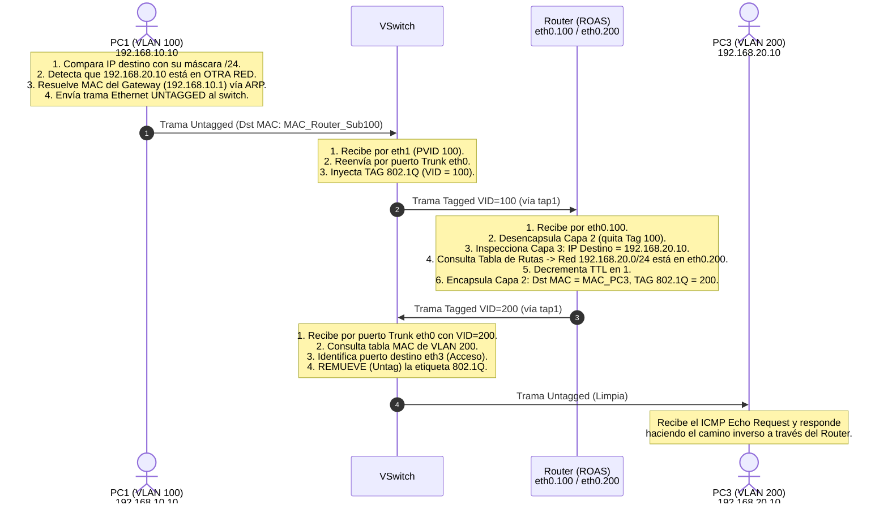

---
aliases:
  - vlan
subject: REDES
year: "4"
exam: PARCIAL2
unit:
type: PRACTICO
zk_type: fleeting
status: done
date: 2026-08-17
source:
  - "[[P2-C03-Preguntas Diagnostico-Ruteo entre redes aplicando VLANs.pdf]]"
  - "[[P2-C03--Ruteo entre redes aplicando VLANs.pdf]]"
tags:
---
---
![[P2-C03--Ruteo entre redes aplicando VLANs.pdf]]

# 🌐 Redes de Datos — Ruteo Entre Redes Aplicando VLANs (Router-on-a-Stick)
## Guía Teórico-Práctica Integral: De Cero a Experto

> **Cátedra:** Redes de Datos — UTN FRC  
> **Archivos de referencia:**  
> - `P2-C03--Ruteo entre redes aplicando VLANs.pdf` (Enunciado práctico)  
> - `P2-C03-Preguntas Diagnostico-Ruteo entre redes aplicando VLANs.pdf` (Cuestionario diagnóstico)  
> **Autor del enunciado:** Ing. Ciceri, Leonardo — Versión 1.0  
> **Plataforma:** RVL (Redes Virtuales de Laboratorio)

---

# 📚 PARTE 1: MARCO TEÓRICO COMPLETO

---

## 1. El Problema del Aislamiento y la Necesidad de Ruteo Inter-VLAN

En la práctica anterior aprendimos que las **VLANs segmentan la red en Capa 2**, creando dominios de broadcast totalmente aislados.  
Sin embargo, en el mundo real los diferentes departamentos de una organización **necesitan comunicarse de forma controlada**:
* Administración necesita consultar un servidor en la VLAN de Servidores.
* Ventas necesita comunicarse con Producción o enviar correos corporativos.
* Todas las VLANs necesitan acceder a una salida compartida a Internet.

```
       VLAN 100 (192.168.10.0/24)                                     VLAN 200 (192.168.20.0/24)
                 │                                                                    │
                 ▼                                                                    ▼
        ┌──────────────────────────────────────────────────────────┐
        │                                        SWITCH CAPA 2 (VSwitch)                                              │
        │  [Dominio Broadcast 100]                              [Dominio Broadcast 200]  │
        │             │                                                                       │             │
        │             └───❌ BLOQUEO CAPA 2 (No cruza) ──┘             │
        └──────────────────────────────────────────────────────────┘
                                     │
                     ¿Cómo unimos ambos mundos?
                                     ▼
                      🌐 DISPOSITIVO DE CAPA 3 (ROUTER)
```

> [!important] Regla Fundamental de Inter-VLAN Routing
> Un switch de Capa 2 **jamás puede pasar tráfico entre VLANs distintas**.  
> Para que un paquete viaje de una subred IP/VLAN a otra, es **estrictamente obligatorio** un dispositivo con funciones de **Capa 3 (Router o Switch Layer 3)** que inspeccione las direcciones IP, consulte su tabla de enrutamiento y reenvíe el paquete cambiando las cabeceras de Capa 2.

---

## 2. Evolución de las Arquitecturas de Ruteo Inter-VLAN

Existen tres formas históricas y modernas de comunicar VLANs:

```
1. TRADICIONAL (1 cable físico por VLAN)
   [ Router ] ════ eth0 (VLAN 100) ════ [ Switch ]
              ════ eth1 (VLAN 200) ════
              ════ eth2 (VLAN 300) ════
   ❌ Desperdicia puertos físicos del router y cables. No escala.

2. ROUTER-ON-A-STICK (ROAS) — [UTILIZADO EN ESTA PRÁCTICA]
   [ Router ] ──── 1 solo cable Físico (Trunk 802.1Q) ──── [ Switch ]
                   Transporta subinterfaces virtuales
                   (eth0.100, eth0.200, eth0.300)
   ✅ Muy económico, utiliza 1 solo puerto físico del router.

3. SWITCH DE CAPA 3 (Multilayer Switch con SVIs)
   ┌─────────────────────────────────────────┐
   │             SWITCH LAYER 3              │
   │  Rutea internamente por hardware (SVI)  │
   │  interface Vlan100 / interface Vlan200  │
   └─────────────────────────────────────────┘
   ✅ Máximo rendimiento (velocidad de cable en Gbps/Tbps). Más costoso.
```

---

## 3. ¿Qué es Router-on-a-Stick (ROAS) y cómo funcionan las Subinterfaces?

El método **Router-on-a-Stick (ROAS)** consiste en conectar un router a un switch a través de un **único enlace físico configurado como Troncal (Trunk IEEE 802.1Q)**.

```
       ROUTER (ROAS)
 ┌──────────────────────┐
 │  Interfaz eth0       │
 │   ├── eth0.100 ──────┼──► Subinterfaz Virtual (VLAN 100 · IP: 192.168.10.1/24)
 │   ├── eth0.200 ──────┼──► Subinterfaz Virtual (VLAN 200 · IP: 192.168.20.1/24)
 │   └── eth0.300 ──────┼──► Subinterfaz Virtual (VLAN 300 · IP: 192.168.30.1/24)
 └──────────┬───────────┘
            │  Enlace Físico Único (Trunk 802.1Q)
            ▼
 ┌──────────────────────┐
 │  VSwitch (Puerto eth0│──► Modo Trunk (Tagged VLAN 100, 200, 300)
 └──────────────────────┘
```

### 3.1 ¿Qué es una Subinterfaz?
Una **subinterfaz** es una interfaz virtual creada por software sobre una interfaz de red física única.  
Cada subinterfaz:
1. Se asocia a un **VLAN ID específico** mediante encapsulación **IEEE 802.1Q**.
2. Posee su propia **dirección IP y máscara de red**, funcionando como el **Default Gateway (Puerta de Enlace)** para todas las PCs de esa VLAN.
3. El router recibe tramas etiquetadas (*Tagged*), las des-etiqueta, evalúa la IP destino en su tabla de rutas, cambia la etiqueta 802.1Q al VLAN ID de la red destino y reenvía la trama por el mismo cable físico hacia el switch.

---

## 4. Ciclo de Vida Completo de un Paquete Inter-VLAN Paso a Paso

Para comprender a fondo la mecánica, analicemos qué ocurre exactamente cuando **`PC1` (VLAN 100, IP `192.168.10.10`)** hace un `ping` a **`PC3` (VLAN 200, IP `192.168.20.10`)**:



---

## 5. El Rol de los Switches TAP (Monitoreo con Wireshark)

En el diagrama del laboratorio aparecen dos dispositivos intermedios llamados **`tap1`** y **`tap2`**.

* **¿Qué es un TAP de Red?**  
  Un TAP (*Test Access Point*) o switch en modo copia es un dispositivo pasivo/transparente que duplica todo el tráfico que pasa por él hacia un puerto de monitoreo, **sin alterar las tramas ni modificar los retardos**.
* **Diferencia clave al capturar tráfico:**
  * **En `tap1` (Ubicado entre VSwitch y Router):**  
    Al estar sobre el **enlace troncal**, Wireshark capturará tramas Ethernet con el **encabezado IEEE 802.1Q presente** (se observará el campo *802.1Q Virtual LAN, PRI: 0, DEI: 0, ID: 100* y luego la respuesta con *ID: 200*).
  * **En `tap2` (Ubicado entre VSwitch y PC4):**  
    Al estar sobre un **enlace de acceso**, Wireshark capturará tramas Ethernet estándar **sin etiqueta 802.1Q (Untagged)**.

---

# 🛠️ PARTE 2: TOPOLOGÍA Y PLAN DE DIRECCIONAMIENTO

---

## 🗺️ Topología de la Red
![[Pasted image 20260817152120.png]]

---

## 📊 Plan de Direccionamiento IP y Subredes (`/24`)

| VLAN ID | Nombre VLAN | Red IP            | Máscara         | Gateway (Subinterfaz Router) | Hosts Asignados          | Rango Útil              |
| :-----: | :---------- | :---------------- | :-------------- | :--------------------------- | :----------------------- | :---------------------- |
| **100** | `VLAN100`   | `192.168.10.0/24` | `255.255.255.0` | `192.168.10.1` (`eth0.100`)  | `PC1` (.10), `PC2` (.11) | `192.168.10.1` – `.254` |
| **200** | `VLAN200`   | `192.168.20.0/24` | `255.255.255.0` | `192.168.20.1` (`eth0.200`)  | `PC3` (.10)              | `192.168.20.1` – `.254` |
| **300** | `VLAN300`   | `192.168.30.0/24` | `255.255.255.0` | `192.168.30.1` (`eth0.300`)  | `PC4` (.10)              | `192.168.30.1` – `.254` |

### Tabla de Conexiones Físicas y Modos de Puerto

| Dispositivo | Interfaz   | Conectado a              | Modo del Puerto      | VLAN / Subinterfaz | IP / Máscara       | Default Gateway |
| :---------- | :--------- | :----------------------- | :------------------- | :----------------: | :----------------- | :-------------- |
| **PC1**     | `eth0`     | `VSwitch (eth1)`         | Acceso (Untagged)    |      VLAN 100      | `192.168.10.10/24` | `192.168.10.1`  |
| **PC2**     | `eth0`     | `VSwitch (eth2)`         | Acceso (Untagged)    |      VLAN 100      | `192.168.10.11/24` | `192.168.10.1`  |
| **PC3**     | `eth0`     | `VSwitch (eth3)`         | Acceso (Untagged)    |      VLAN 200      | `192.168.20.10/24` | `192.168.20.1`  |
| **PC4**     | `eth0`     | `tap2 ── VSwitch (eth4)` | Acceso (Untagged)    |      VLAN 300      | `192.168.30.10/24` | `192.168.30.1`  |
| **VSwitch** | `eth0`     | `tap1 ── Router (eth0)`  | **Troncal (Tagged)** | VLAN 100, 200, 300 | N/A (Capa 2)       | N/A             |
| **Router**  | `eth0.100` | `VSwitch (eth0)`         | Subinterfaz 802.1Q   |      VLAN 100      | `192.168.10.1/24`  | N/A             |
| **Router**  | `eth0.200` | `VSwitch (eth0)`         | Subinterfaz 802.1Q   |      VLAN 200      | `192.168.20.1/24`  | N/A             |
| **Router**  | `eth0.300` | `VSwitch (eth0)`         | Subinterfaz 802.1Q   |      VLAN 300      | `192.168.30.1/24`  | N/A             |

---

# ⚙️ PARTE 3: GUÍA DE CONFIGURACIÓN PASO A PASO

---

## 🎛️ FASE 1: Configuración del Switch Virtual (`VSwitch`)

### Paso 1.1 — En el Entorno Virtual RVL (Web GUI)

```
                       TABLA DE PUERTOS EN VSWITCH
┌─────────┬──────────────────────┬─────────────┬──────────────────────────────┐
│ Puerto  │ Modo del Puerto      │ PVID / VLAN │ VLANs Etiquetadas (Tagged)   │
├─────────┼──────────────────────┼─────────────┼──────────────────────────────┤
│ eth0    │ Trunk (Tagged 802.1Q)│ 1           │ 100, 200, 300                │
│ eth1    │ Access (Untagged)    │ 100         │ —                            │
│ eth2    │ Access (Untagged)    │ 100         │ —                            │
│ eth3    │ Access (Untagged)    │ 200         │ —                            │
│ eth4    │ Access (Untagged)    │ 300         │ —                            │
└─────────┴──────────────────────┴─────────────┴──────────────────────────────┘
```

1. **Crear las VLANs:**
   * Abrir `VSwitch` $\rightarrow$ En **VLAN Database** añadir: `100`, `200`, `300`.
2. **Configurar el Enlace Troncal hacia el Router:**
   * Puerto **`eth0`**: Modo `Trunk` (o `Tagged`) $\rightarrow$ Tagged VLANs: `100, 200, 300`.
3. **Configurar los Puertos de Acceso:**
   * Puerto **`eth1`**: Modo `Access` $\rightarrow$ PVID = `100` (para `PC1`).
   * Puerto **`eth2`**: Modo `Access` $\rightarrow$ PVID = `100` (para `PC2`).
   * Puerto **`eth3`**: Modo `Access` $\rightarrow$ PVID = `200` (para `PC3`).
   * Puerto **`eth4`**: Modo `Access` $\rightarrow$ PVID = `300` (para `PC4` vía `tap2`).
4. **Guardar Configuración.**

---

### Paso 1.2 — Equivalente en Línea de Comandos (Cisco IOS CLI)

```cisco
Switch> enable
Switch# configure terminal

! 1. Crear las 3 VLANs
Switch(config)# vlan 100
Switch(config-vlan)# name VLAN100
Switch(config-vlan)# exit
Switch(config)# vlan 200
Switch(config-vlan)# name VLAN200
Switch(config-vlan)# exit
Switch(config)# vlan 300
Switch(config-vlan)# name VLAN300
Switch(config-vlan)# exit

! 2. Configurar el puerto Troncal hacia el Router (eth0 / Fa0/1)
Switch(config)# interface FastEthernet 0/1
Switch(config-if)# switchport trunk encapsulation dot1q
Switch(config-if)# switchport mode trunk
Switch(config-if)# switchport trunk allowed vlan 100,200,300
Switch(config-if)# no shutdown
Switch(config-if)# exit

! 3. Configurar los puertos de Acceso
Switch(config)# interface range FastEthernet 0/2 - 3
Switch(config-if-range)# switchport mode access
Switch(config-if-range)# switchport access vlan 100
Switch(config-if-range)# no shutdown
Switch(config-if-range)# exit

Switch(config)# interface FastEthernet 0/4
Switch(config-if)# switchport mode access
Switch(config-if)# switchport access vlan 200
Switch(config-if)# no shutdown
Switch(config-if)# exit

Switch(config)# interface FastEthernet 0/5
Switch(config-if)# switchport mode access
Switch(config-if)# switchport access vlan 300
Switch(config-if)# no shutdown
Switch(config-if)# exit
```

---

## 🌐 FASE 2: Configuración del Router (Router-on-a-Stick)

El Router debe recibir tramas etiquetadas con IEEE 802.1Q a través de su interfaz física `eth0`, por lo que **se crean 3 subinterfaces lógicas**:

### Paso 2.1 — Configuración en Linux Router (Entorno RVL)

Ejecutar en la terminal del nodo **`Router`** como `root`:

```bash
# 1. Habilitar la interfaz física base (sin asignarle IP)
ip link set eth0 up

# 2. Habilitar el reenvío de paquetes (IP Forwarding) en el Kernel Linux
sysctl -w net.ipv4.ip_forward=1
# o también: echo 1 > /proc/sys/net/ipv4/ip_forward

# 3. Crear y configurar la Subinterfaz para VLAN 100
ip link add link eth0 name eth0.100 type vlan id 100
ip addr add 192.168.10.1/24 dev eth0.100
ip link set eth0.100 up

# 4. Crear y configurar la Subinterfaz para VLAN 200
ip link add link eth0.200 type vlan id 200
ip addr add 192.168.20.1/24 dev eth0.200
ip link set eth0.200 up

# 5. Crear y configurar la Subinterfaz para VLAN 300
ip link add link eth0.300 type vlan id 300
ip addr add 192.168.30.1/24 dev eth0.300
ip link set eth0.300 up
```

*(Comandos clásicos alternativos con `vconfig`: `vconfig add eth0 100 && ifconfig eth0.100 192.168.10.1 netmask 255.255.255.0 up`)*

#### Verificación en el Router:
```bash
# Ver las subinterfaces y sus IPs
ip addr show

# Ver la tabla de enrutamiento (debe tener las 3 redes directamente conectadas)
ip route show
```

**Salida esperada de `ip route show`:**
```text
192.168.10.0/24 dev eth0.100 proto kernel scope link src 192.168.10.1
192.168.20.0/24 dev eth0.200 proto kernel scope link src 192.168.20.1
192.168.30.0/24 dev eth0.300 proto kernel scope link src 192.168.30.1
```

---

### Paso 2.2 — Equivalente en Router Cisco IOS CLI

```cisco
Router> enable
Router# configure terminal

! 1. Encender la interfaz física base (SIN IP)
Router(config)# interface GigabitEthernet 0/0
Router(config-if)# no ip address
Router(config-if)# no shutdown
Router(config-if)# exit

! 2. Subinterfaz VLAN 100 (Gateway 192.168.10.1)
Router(config)# interface GigabitEthernet 0/0.100
Router(config-subif)# encapsulation dot1Q 100
Router(config-subif)# ip address 192.168.10.1 255.255.255.0
Router(config-subif)# exit

! 3. Subinterfaz VLAN 200 (Gateway 192.168.20.1)
Router(config)# interface GigabitEthernet 0/0.200
Router(config-subif)# encapsulation dot1Q 200
Router(config-subif)# ip address 192.168.20.1 255.255.255.0
Router(config-subif)# exit

! 4. Subinterfaz VLAN 300 (Gateway 192.168.30.1)
Router(config)# interface GigabitEthernet 0/0.300
Router(config-subif)# encapsulation dot1Q 300
Router(config-subif)# ip address 192.168.30.1 255.255.255.0
Router(config-subif)# exit
```

---

## 🐧 FASE 3: Configuración de las Estaciones de Trabajo Linux

> [!important] ¡No olvidar el Default Gateway!
> Para que las PCs puedan salir de su VLAN local y comunicarse con otras subredes, **es obligatorio agregar la ruta por defecto hacia la subinterfaz del router**.

### Paso 3.1 — Configuración en `PC1` (VLAN 100)

```bash
# 1. Habilitar la interfaz eth0
ip link set eth0 up

# 2. Asignar dirección IP y máscara /24
ip addr add 192.168.10.10/24 dev eth0

# 3. Configurar la Puerta de Enlace (Default Gateway)
ip route add default via 192.168.10.1 dev eth0

# 4. Verificar IP y Rutas
ip addr show eth0
ip route show
```

---

### Paso 3.2 — Configuración de los demás Hosts Linux

> [!note] 🔁 Pasos Análogos / Repetitivos en las demás PCs
> Se repite el mismo procedimiento ajustando IP y Gateway según la subred correspondiente:

#### En `PC2` (VLAN 100):
```bash
ip link set eth0 up
ip addr add 192.168.10.11/24 dev eth0
ip route add default via 192.168.10.1 dev eth0
```

#### En `PC3` (VLAN 200):
```bash
ip link set eth0 up
ip addr add 192.168.20.10/24 dev eth0
ip route add default via 192.168.20.1 dev eth0
```

#### En `PC4` (VLAN 300):
```bash
ip link set eth0 up
ip addr add 192.168.30.10/24 dev eth0
ip route add default via 192.168.30.1 dev eth0
```

---

# 🧪 PARTE 4: MATRIZ DE PRUEBAS, VALIDACIÓN Y CAPTURA

---

## Prueba 1: Conectividad Intra-VLAN (Misma VLAN 100 · Sin paso por el Router)

Desde `PC1` hacer ping a `PC2`:
```bash
ping -c 4 192.168.10.11
```
* **Resultado:** **Éxito (0% packet loss)**.
* **Comportamiento:** La trama fluye directamente en Capa 2 a través de los puertos `eth1` y `eth2` del switch. **El tráfico no sube al router**.

---

## Prueba 2: Conectividad con el Gateway Local

Desde `PC1` hacer ping a su Gateway:
```bash
ping -c 2 192.168.10.1
```
* **Resultado:** **Éxito (0% packet loss)**.
* **Comportamiento:** Comprueba que la subinterfaz `eth0.100` del router responde correctamente y el enlace troncal está operativo.

---

## Prueba 3: Conectividad Inter-VLAN Completa (Ruteo a través del Router)

### 3.1 Desde `PC1` (VLAN 100) hacia `PC3` (VLAN 200):
```bash
ping -c 4 192.168.20.10
```
**Salida esperada:**
```text
PING 192.168.20.10 (192.168.20.10) 56(84) bytes of data.
64 bytes from 192.168.20.10: icmp_seq=1 ttl=63 time=1.24 ms
64 bytes from 192.168.20.10: icmp_seq=2 ttl=63 time=0.92 ms
64 bytes from 192.168.20.10: icmp_seq=3 ttl=63 time=0.88 ms
64 bytes from 192.168.20.10: icmp_seq=4 ttl=63 time=0.91 ms

--- 192.168.20.10 ping statistics ---
4 packets transmitted, 4 received, 0% packet loss, time 3004ms
```

> **🔍 Detalle del TTL:** Observa que el `ttl=63` (inicialmente 64 en Linux). Al haber pasado por **1 Router (salto de Capa 3)**, el router decrementó el campo TTL en 1 unidad.

### 3.2 Desde `PC1` (VLAN 100) hacia `PC4` (VLAN 300):
```bash
ping -c 4 192.168.30.10
```
* **Resultado:** **Éxito (0% packet loss)**.

---

## 🦈 Análisis de Capturas en Wireshark (`tap1` vs `tap2`)

Al abrir Wireshark en los nodos de monitoreo:

### 1. Captura en `tap1` (Enlace Troncal Switch ↔ Router):
* Se observan los paquetes ICMP con el encabezado **`IEEE 802.1Q Virtual LAN`**.
* **Ida:** Se ve la trama entrando al router con `802.1Q VLAN ID: 100`.
* **Retorno/Reenvío:** Se ve la trama saliendo del router hacia el switch con `802.1Q VLAN ID: 200`.

### 2. Captura en `tap2` (Enlace de Acceso hacia PC4):
* Se observan los paquetes ICMP como tramas **Ethernet II estándar**.
* **No existe encabezado 802.1Q** porque el switch ya removió la etiqueta al entregarla por su puerto de acceso `eth4`.

---

# 📝 PARTE 5: RESOLUCIÓN DE PREGUNTAS DIAGNÓSTICO

### Pregunta 1
> **¿Es necesario un router para comunicarse entre dos PCs que pertenecen a dos VLANs distintas? ¿Por qué?**

**Respuesta:**  
**Sí, es estrictamente necesario.**  
**Justificación:** Las VLANs operan en la **Capa de Enlace de Datos (Capa 2)** dividiendo el switch en dominios de broadcast lógicos totalmente aislados, y cada VLAN tiene asignada una **subred IP distinta en Capa 3**. Un switch de Capa 2 conmuta tramas únicamente dentro de la misma VLAN basándose en direcciones MAC. Para transferir paquetes entre subredes IP distintas se requiere un dispositivo de **Capa 3 (Router o Switch Capa 3)** que realice las funciones de enrutamiento (*routing*), consulte la tabla de rutas, decremente el TTL y reconstruya el encabezado de Capa 2 para la red de destino.

---

### Pregunta 2
> **¿Es necesario tener una subinterfaz configurada en el router por cada VLAN? ¿Qué sucede si esto no es así?**

**Respuesta:**  
**Sí, en la arquitectura Router-on-a-Stick es indispensable tener una subinterfaz por cada VLAN que se desee enrutar.**  
**Justificación:** Cada subinterfaz lógica se vincula a un **VLAN ID específico mediante el estándar IEEE 802.1Q** y posee la dirección IP que sirve como **Default Gateway** para los hosts de esa VLAN.  
**¿Qué sucede si falta una subinterfaz?**  
Si una VLAN (por ejemplo, VLAN 300) no tiene su correspondiente subinterfaz configurada en el router:
1. El router recibirá las tramas etiquetadas con `VID = 300` y las **descartará inmediatamente** al no tener ninguna interfaz asociada a esa etiqueta.
2. Los hosts de esa VLAN no tendrán Puerta de Enlace a la cual enviar su tráfico fuera de su subred local.
3. La VLAN quedará completamente **incomunicada con el resto de las VLANs**.

---

### Pregunta 3
> **¿La conexión entre el switch y el router es de tipo acceso o troncal? ¿En qué otro caso se puede utilizar este tipo de conexión?**

**Respuesta:**  
**La conexión entre el switch y el router es de tipo TRONCAL (Trunk / Tagged IEEE 802.1Q).**  
**Justificación:** Debe ser troncal porque sobre un único cable físico se debe transportar simultáneamente el tráfico de múltiples VLANs (VLAN 100, 200 y 300), requiriendo que cada trama viaje con su respectiva etiqueta 802.1Q para que el router identifique a qué subred pertenece.  
**¿En qué otros casos se utiliza un enlace troncal?**
1. **Interconexión entre switches (Switch-to-Switch):** Para extender las VLANs a través de múltiples pisos, edificios o racks (como se vio en la práctica anterior entre `VSwitch 1` y `VSwitch 2`).
2. **Conexión a Servidores de Virtualización (Hypervisors como VMware ESXi, Proxmox, KVM):** Donde un servidor físico aloja múltiples Máquinas Virtuales (VMs) que pertenecen a diferentes VLANs sobre una misma tarjeta de red física compartida.

---

### Pregunta 4
> **¿Qué diferencias hay entre configurar un puerto del switch en modo acceso (untagged) o en modo troncal (tagged)?**

**Respuesta:**

| Característica | Puerto de Acceso (*Access / Untagged*) | Puerto Troncal (*Trunk / Tagged*) |
| :--- | :--- | :--- |
| **Dispositivo que conecta** | Dispositivos finales (PCs, servidores simples, impresoras). | Dispositivos de red (Switches, Routers ROAS, Servidores de virtualización). |
| **Pertenencia a VLANs** | Pertenece a **una sola VLAN** (definida por su PVID). | Puede pertenecer y transportar **múltiples VLANs** simultáneamente. |
| **Tratamiento del Tag 802.1Q al transmitir** | **Untagged:** Remueve la etiqueta 802.1Q antes de entregar la trama al host. | **Tagged:** Inserta y conserva la etiqueta 802.1Q (4 bytes) con el VLAN ID. |
| **Tratamiento al recibir tramas** | Asocia la trama entrante limpia a la VLAN del puerto (PVID). | Lee la etiqueta 802.1Q para procesar la trama en la VLAN correspondiente. |
| **Conocimiento de VLANs por el host** | El dispositivo final **no sabe qué es una VLAN** (recibe Ethernet estándar). | El dispositivo conectado **debe entender y procesar tramas 802.1Q**. |

---

# 💾 PARTE 6: GUARDADO DE CONFIGURACIÓN Y PERSISTENCIA

Tal como se indica en la nota del práctico:
> *Si desea guardar la configuración para retomar el práctico posteriormente o para evitar pérdidas por algún problema, primero tiene que guardar la topología en un directorio y luego cargarla nuevamente para que el comando `save-changes.sh` sepa dónde dejar los cambios.*

* En la terminal de los nodos Linux, para hacer permanente la configuración de subinterfaces se añade al archivo `/etc/network/interfaces`:
```text
# En el Router (/etc/network/interfaces)
auto eth0
iface eth0 inet manual

auto eth0.100
iface eth0.100 inet static
    address 192.168.10.1
    netmask 255.255.255.0
    vlan-raw-device eth0

auto eth0.200
iface eth0.200 inet static
    address 192.168.20.1
    netmask 255.255.255.0
    vlan-raw-device eth0

auto eth0.300
iface eth0.300 inet static
    address 192.168.30.1
    netmask 255.255.255.0
    vlan-raw-device eth0
```


---
