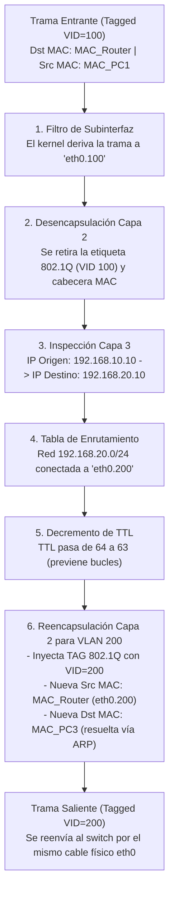

---
aliases:
  - VLANS
subject: REDES
year: "4"
exam: PARCIAL2
unit:
type: PRACTICO
zk_type: fleeting
status: done
date: 2026-08-17
source:
  - "[[P2-C04-17-Análisis de ruteo entre redes aplicando VLANs.pdf]]"
  - "[[P2-C04-Preguntas Diagnostico-Análisis de ruteo entre redes aplicando VLANs.pdf]]"
tags:
---
---


![[P2-C04-17-Análisis de ruteo entre redes aplicando VLANs.pdf]]

# 🦈 Redes de Datos — Análisis de Ruteo Entre Redes Aplicando VLANs (Wireshark)
## Guía de Análisis de Protocolos, Captura de Tráfico y Respuestas Diagnóstico

> **Cátedra:** Redes de Datos — UTN FRC  
> **Archivos de referencia:**  
> - `P2-C04-17-Análisis de ruteo entre redes aplicando VLANs.pdf` (Enunciado práctico)  
> - `P2-C04-Preguntas Diagnostico-Análisis de ruteo entre redes aplicando VLANs.pdf` (Cuestionario diagnóstico)  
> **Autor del enunciado:** Ing. Ciceri, Leonardo — Versión 1.0  
> **Plataforma:** RVL (Redes Virtuales de Laboratorio) + Wireshark

---

# 📚 PARTE 1: MARCO TEÓRICO Y ANATOMÍA DE PROTOCOLOS

---

## 1. El Rol de los Analizadores de Protocolos (Wireshark) en Entornos VLAN

En esta práctica, el objetivo principal es **diseccionar y evidenciar a nivel de bits** el comportamiento del tráfico de red cuando atraviesa diferentes tipos de enlaces (Acceso vs Troncal) y cuando es procesado por un Router que realiza *Router-on-a-Stick*.

```
  [ PC1 (VLAN 100) ]
          │
     (ENLACE DE ACCESO) ──► Trama Ethernet Estándar (Untagged - 1518 bytes max)
          ▼
     [ VSwitch ]
          │
     (ENLACE TRONCAL)   ──► [ tap1 ] ──► Trama Etiquetada IEEE 802.1Q (Tagged - 1522 bytes max)
          ▼                               (Inserta 4 bytes de cabecera VLAN)
      [ ROUTER ]
          │ (Desencapsula L2, enruta L3, reescribe MACs, cambia VLAN ID a 200)
          ▼
     (ENLACE TRONCAL)   ──► [ tap1 ] ──► Trama Etiquetada IEEE 802.1Q (Tagged con VID=200)
          ▼
     [ VSwitch ]
          │
     (ENLACE DE ACCESO) ──► [ tap2 ] ──► Trama Ethernet Estándar (Untagged - Limpia)
          ▼
  [ PC4 (VLAN 300) / PC3 (VLAN 200) ]
```

---

## 2. Anatomía Comparativa: Trama Ethernet Estándar vs Trama 802.1Q

Para entender exactamente qué se observa en Wireshark:

### 2.1 Trama Ethernet II Nativa (Enlace de Acceso / Untagged)

Es la trama que emiten y reciben los dispositivos finales (`PC1`, `PC2`, `PC3`, `PC4`).

```
┌─────────────────┬─────────────────┬──────────────────┬─────────────────┬──────────┐
│   MAC Destino   │   MAC Origen    │  EtherType (IP)  │  Datos IP / Payload (ICMP) │   FCS    │
│    (6 bytes)    │    (6 bytes)    │ 0x0800 (2 bytes) │      (46 a 1500 bytes)     │ (4 bytes)│
└─────────────────┴─────────────────┴──────────────────┴────────────────────────────┴──────────┘
```

* **Tamaño total:** 64 a 1518 bytes.
* **Transparencia:** No contiene **ningún campo de VLAN**. Las PCs no tienen conocimiento de que forman parte de una red segmentada.

---

### 2.2 Trama Ethernet con Encapsulación IEEE 802.1Q (Enlace Troncal / Tagged)

Es la trama que viaja exclusivamente por el enlace entre `VSwitch` y `Router` (capturada en `tap1`).

```
┌───────────┬───────────┬──────────────────────┬──────────┬─────────────────┬──────────┐
│MAC Destino│MAC Origen │ ETIQUETA IEEE 802.1Q │EtherType │ Datos IP (ICMP) │   FCS    │
│ (6 bytes)       │ (6 bytes)       │ (4 bytes = 32 bits)           │  0x0800     │(46 a 1500 bytes)│ (4 bytes)│
└───────────┴───────────┴──────────┬───────────┴──────────┴─────────────────┴──────────┘
                                   │
   ┌───────────────────────────────┴───────────────────────────────┐
   │ TPID (16 bits) │ PCP (3 bits) │ DEI/CFI (1 bit) │ VID (12 bits) │
   │     0x8100     │  Prioridad   │  Descarte/Can.  │    VLAN ID    │
   └────────────────┴──────────────┴─────────────────┴───────────────┘
```

* **Tamaño total:** 68 a 1522 bytes (+4 bytes por la etiqueta).
* **TPID (`0x8100`):** Alerta a Wireshark y a la placa de red de que lo siguiente es un tag VLAN.
* **VID:** Indica a qué subinterfaz virtual del router pertenece la trama (`100`, `200` o `300`).

---

## 3. Mecánica Interna del Router: Desencapsulación y Re-etiquetado

Cuando un paquete cruza de `PC1` (VLAN 100) a `PC3` (VLAN 200), el Router realiza las siguientes operaciones secuenciales:



> [!important] ¿Quién realiza el cambio de etiquetas?
> El **Switch NO cambia las etiquetas** de una VLAN a otra. El switch solo lee etiquetas y conmuta dentro de la misma VLAN.  
> **El único dispositivo que realiza el intercambio de etiquetas es el ROUTER**, porque es el único que opera en Capa 3 y puede recibir un paquete por una subinterfaz (`eth0.100`), desencapsularlo y volver a encapsularlo con la etiqueta de otra subinterfaz (`eth0.200`).

---

# 🛠️ PARTE 2: TOPOLOGÍA, DISPOSITIVOS Y PUNTOS DE CAPTURA

![[Pasted image 20260817161530.png|474]]

---

## 📊 Tabla Resumen de Puntos de Monitoreo

| Dispositivo TAP | Ubicación                                | Tipo de Enlace      | Tráfico que circula                            | Visibilidad en Wireshark                                                                |
| :-------------- | :--------------------------------------- | :------------------ | :--------------------------------------------- | :-------------------------------------------------------------------------------------- |
| **`tap1`**      | Entre `VSwitch (eth0)` y `Router (eth0)` | **Troncal (Trunk)** | Inter-VLAN de todas las VLANs (100, 200, 300). | **TAGGED (IEEE 802.1Q):** Muestra el campo `802.1Q Virtual LAN` con VID 100, 200 o 300. |
| **`tap2`**      | Entre `VSwitch (eth4)` y `PC4 (eth0)`    | **Acceso (Access)** | Tráfico exclusivo de la **VLAN 300**.          | **UNTAGGED:** Muestra tramas Ethernet II puras sin etiquetas VLAN.                      |

---

# 🔬 PARTE 3: ANÁLISIS DE CAPTURAS EN WIRESHARK PASO A PASO

---

## Escenario 1: Ping Intra-VLAN (`PC1` $\rightarrow$ `PC2` en VLAN 100)

Ejecutar en la terminal de **PC1**:
```bash
ping -c 2 192.168.10.11
```

### Observaciones en Wireshark:
1. **En `tap1` (Troncal hacia Router):**
   * **¡NO APARECE NADA!** (0 paquetes capturados).
   * **Explicación:** Al estar `PC1` y `PC2` en la misma VLAN 100 y misma subred (`192.168.10.0/24`), el switch conmuta directamente la trama entre los puertos de acceso `eth1` y `eth2`. El tráfico **jamás sube al puerto troncal ni involucra al router**.
2. **En `tap2` (Acceso VLAN 300):**
   * **¡NO APARECE NADA!** (Aislamiento total de Capa 2).

---

## Escenario 2: Ping Inter-VLAN (`PC1` VLAN 100 $\rightarrow$ `PC3` VLAN 200)

Ejecutar en la terminal de **PC1**:
```bash
ping -c 1 192.168.20.10
```

### 🔍 Inspección en `tap1` (Enlace Troncal Switch ↔ Router)

Al filtrar por `icmp` en Wireshark sobre `tap1`, se visualizan **4 paquetes (2 de ida y 2 de vuelta)** debido al paso obligatorio por el Router:

```
No.  Source          Destination     Protocol  Info
1    192.168.10.10   192.168.20.10   ICMP      Echo (ping) request  (Tag VID: 100) -> Entra al Router
2    192.168.10.10   192.168.20.10   ICMP      Echo (ping) request  (Tag VID: 200) -> Sale del Router hacia el Switch
3    192.168.20.10   192.168.10.10   ICMP      Echo (ping) reply    (Tag VID: 200) -> Entra al Router
4    192.168.20.10   192.168.10.10   ICMP      Echo (ping) reply    (Tag VID: 100) -> Sale del Router hacia el Switch
```

#### Desglose del Paquete 1 (Solicitud entrando al Router):
* **Ethernet II:**
  * Source MAC: `00:50:56:xx:xx:01` (MAC de `PC1`)
  * Destination MAC: `00:50:56:xx:xx:FF` (MAC de la subinterfaz `eth0.100` del Router)
* **802.1Q Virtual LAN, PRI: 0, DEI: 0, ID: 100**
  * `Type: IPv4 (0x0800)`
  * `ID: 100` $\leftarrow$ **Etiqueta correspondiente a la VLAN de origen (PC1)**
* **Internet Protocol Version 4:**
  * Source: `192.168.10.10`
  * Destination: `192.168.20.10`
  * `Time to live: 64`
* **Internet Control Message Protocol:**
  * `Type: 8 (Echo request)`

#### Desglose del Paquete 2 (Solicitud saliendo del Router hacia el Switch):
* **Ethernet II:**
  * Source MAC: `00:50:56:xx:xx:FE` (MAC de la subinterfaz `eth0.200` del Router)
  * Destination MAC: `00:50:56:xx:xx:03` (MAC de `PC3`)
* **802.1Q Virtual LAN, PRI: 0, DEI: 0, ID: 200**
  * `Type: IPv4 (0x0800)`
  * `ID: 200` $\leftarrow$ **¡El Router cambió la etiqueta a la VLAN de destino!**
* **Internet Protocol Version 4:**
  * Source: `192.168.10.10`
  * Destination: `192.168.20.10`
  * `Time to live: 63` $\leftarrow$ **¡El TTL se decrementó en 1 por el salto de enrutamiento!**

---

## Escenario 3: Ping Inter-VLAN hacia PC4 (`PC1` VLAN 100 $\rightarrow$ `PC4` VLAN 300)

Ejecutar en la terminal de **PC1**:
```bash
ping -c 1 192.168.30.10
```

### 🔍 Comparación directa: `tap1` vs `tap2`

| Campo en Wireshark     | Captura en `tap1` (Troncal) | Captura en `tap2` (Acceso PC4)       | Explicación                                                                                |
| :--------------------- | :-------------------------- | :----------------------------------- | :----------------------------------------------------------------------------------------- |
| **Cabecera 802.1Q**    | **PRESENTE** (`VID: 300`)   | **NO EXISTE (Ausente)**              | El switch remueve la etiqueta antes de entregar el paquete por el puerto de acceso `eth4`. |
| **EtherType**          | `0x8100` (802.1Q Tag)       | `0x0800` (IPv4 estándar)             | En acceso la trama es Ethernet estándar.                                                   |
| **TTL del paquete IP** | `63`                        | `63`<br>*aca no tendira que ser 62?* | El decremento de TTL ocurre en Capa 3 dentro del Router.                                   |
| **MAC Destino**        | MAC de `PC4`                | MAC de `PC4`                         | La MAC destino es la misma en el tramo final.                                              |

---

# 📝 PARTE 4: RESOLUCIÓN DETALLADA DE LAS PREGUNTAS DIAGNÓSTICO

---

### Pregunta 1
> **¿En la conexión entre PC1 y el switch viaja la etiqueta con el ID de VLAN? ¿Por qué?**

**Respuesta:**  
**No, en la conexión entre PC1 y el switch NO viaja la etiqueta con el ID de VLAN.**

**Justificación:**  
La conexión entre `PC1` y el puerto `eth1` del switch es un **enlace de acceso (Access / Untagged)**.  
Los dispositivos finales (como PCs, servidores e impresoras) utilizan interfaces Ethernet estándar que no comprenden el protocolo IEEE 802.1Q.  
Por lo tanto:
1. Cuando `PC1` transmite, envía tramas **Ethernet II estándar sin etiquetar**.
2. Al ingresar la trama al switch por el puerto `eth1`, el switch le asocia internamente la VLAN configurada en ese puerto (**PVID 100**).
3. Si el switch envía tráfico hacia `PC1`, le **remueve la etiqueta 802.1Q** antes de emitir la trama por el cable físico.

---

### Pregunta 2
> **¿En la conexión entre el switch y el router viaja la etiqueta con el ID de VLAN? ¿Por qué?**

**Respuesta:**  
**Sí, en la conexión entre el switch y el router SÍ viaja la etiqueta con el ID de VLAN.**

**Justificación:**  
La conexión entre el switch (`eth0`) y el router (`eth0`) es un **enlace troncal (Trunk / Tagged)**.  
Dado que existe un único cable físico que interconecta ambos equipos para transportar el tráfico de **múltiples VLANs simultáneamente** (VLAN 100, VLAN 200 y VLAN 300), es indispensable utilizar el estándar **IEEE 802.1Q**. Este estándar inserta una etiqueta de 4 bytes que incluye el campo **VLAN ID (VID)**, permitiendo que el router identifique a qué subinterfaz lógica (`eth0.100`, `eth0.200` o `eth0.300`) corresponde cada paquete recibido.

---

### Pregunta 3
> **Si se realiza un ping entre PC1 (vlan 100) y PC3 (vlan 200) que se encuentran físicamente conectadas al mismo switch, ¿Por qué el switch no puede resolver el destino del ping y debe enviarlo al router?**

**Respuesta:**  
**El switch no puede resolver el destino porque opera en la Capa de Enlace de Datos (Capa 2) y las VLANs constituyen dominios de broadcast y tablas de reenvío totalmente independientes y aisladas.**

**Justificación detallada:**
1. **Aislamiento en Capa 2:** Las VLANs dividen la tabla de direcciones MAC del switch. La VLAN 100 y la VLAN 200 no comparten tráfico de difusión ni tablas de conmutación. El switch jamás cruza tramas entre puertos asignados a VLANs distintas.
2. **Diferencia de Subred en Capa 3:** `PC1` (`192.168.10.10/24`) y `PC3` (`192.168.20.10/24`) pertenecen a redes IP lógicas diferentes. Cuando `PC1` analiza la IP destino, determina que está fuera de su red local y, en lugar de buscar la MAC de `PC3`, envía la trama a la dirección MAC de su **Puerta de Enlace (Default Gateway / Router: `192.168.10.1`)**.
3. **Rol del Router:** El switch solo se limita a entregar la trama al Router a través del enlace troncal. Es el **Router (Capa 3)** quien lee la dirección IP destino, consulta su tabla de rutas, cambia la cabecera L2 y reenvía el paquete hacia la VLAN 200.

---

### Pregunta 4
> **¿Los paquetes recibidos por el router pueden ser leídos por cualquier subinterfaz configurada en el mismo?**

**Respuesta:**  
**No. Cada paquete recibido por el router es procesado exclusivamente por la subinterfaz que coincide con el VLAN ID de la etiqueta 802.1Q.**

**Justificación:**  
Cuando una trama llega a la interfaz física `eth0` del router, el módulo del kernel / sistema operativo lee el campo **VLAN ID** del encabezado 802.1Q:
* Si la trama tiene `VID = 100`, se entrega **únicamente a la subinterfaz `eth0.100`**.
* Si la trama tiene `VID = 200`, se entrega **únicamente a la subinterfaz `eth0.200`**.
* Si llega una trama con un `VID` no configurado en el router (por ejemplo, `VID = 500`), la trama es **descartada de inmediato**.

Las subinterfaces operan como interfaces lógicas independientes y aisladas; ninguna subinterfaz procesa tráfico que no lleve su etiqueta correspondiente.

---

### Pregunta 5
> **¿Qué dispositivo es el que realiza el intercambio de etiqueta de VLAN?**

**Respuesta:**  
**El dispositivo que realiza el intercambio de etiqueta de VLAN es el ROUTER.**

**Justificación:**  
El switch es un dispositivo de Capa 2 y no puede modificar ni traducir etiquetas de una VLAN a otra; únicamente conmuta tramas dentro de la misma VLAN o las transporta por el troncal respetando su etiqueta original.  
El **Router**, al operar en la Capa de Red (Capa 3):
1. Recibe la trama por el enlace troncal con la etiqueta de origen (ej. **`VLAN 100`**).
2. **Desencapsula la trama de Capa 2** (retira la etiqueta 802.1Q y la cabecera MAC).
3. Enruta el paquete IP hacia la red de destino basándose en su tabla de enrutamiento.
4. **Reencapsula el paquete en una nueva trama Capa 2**, insertando la **nueva etiqueta 802.1Q con el VLAN ID de destino (ej. `VLAN 200`)** y las nuevas direcciones MAC correspondientes.

---

# ⚠️ PARTE 5: GUÍA DE TROUBLESHOOTING Y TRAMPAS FRECUENTES

| Error / Síntoma | Causa Técnica | Cómo detectarlo en Wireshark | Solución |
| :--- | :--- | :--- | :--- |
| **Ping Inter-VLAN falla con `100% packet loss`** | En el router no se activó el *IP Forwarding* (`net.ipv4.ip_forward = 0`). | En `tap1` se ve el *Echo Request* entrando con `VID=100`, pero **nunca sale** con `VID=200`. | Ejecutar en el Router: `sysctl -w net.ipv4.ip_forward=1`. |
| **Ping Inter-VLAN falla con `Network is unreachable`** | En la PC origen no se configuró el *Default Gateway*. | La PC ni siquiera emite paquetes hacia el switch; el kernel descarta localmente. | En la PC: `ip route add default via 192.168.10.1 dev eth0`. |
| **En Wireshark no se ven etiquetas 802.1Q en `tap1`** | El puerto del switch conectado al router se configuró en modo *Access* por error. | Las tramas se ven como Ethernet II estándar y el router descarta los paquetes. | Cambiar el puerto `eth0` del switch a modo **Trunk (Tagged)** permitiendo VLANs 100, 200, 300. |
| **Ping falla en la respuesta (Echo Reply no vuelve)** | La PC de destino (`PC3`) no tiene configurado su *Default Gateway*. | En `tap1` se ve el *Echo Request* llegar a `PC3`, pero `PC3` no sabe cómo responderle a la red `192.168.10.0/24`. | En `PC3`: `ip route add default via 192.168.20.1 dev eth0`. |


---
