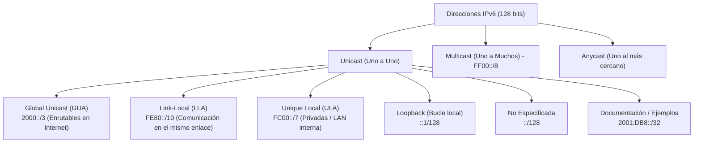
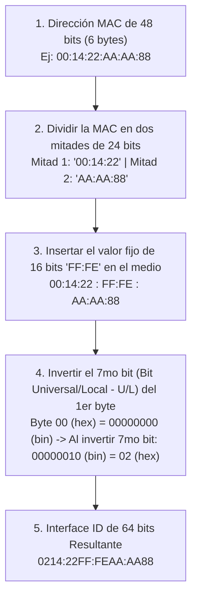

---
aliases:
  - ipv6
subject: REDES
year: "4"
exam: PARCIAL2
unit:
type: PRACTICO
zk_type: fleeting
status: done
date: 2026-08-17
source:
tags:
---
---
![[P2-C05- Direccionamiento IPv6.pdf]]

# 🌐 Redes de Datos — Práctica de Direccionamiento IPv6
## Guía Teórico-Práctica Integral: De Cero a Experto

> **Cátedra:** Redes de Datos — UTN FRC  
> **Archivo original:** `P2-C05- Direccionamiento IPv6.pdf`  
> **Autor del enunciado:** Ing. Gibellini, Fabián — Versión 1.0  
> **Tema:** Notación, Compresión, Tipos de Direcciones, EUI-64 y Análisis en Linux

---

# 📚 PARTE 1: MARCO TEÓRICO COMPLETO

---

## 1. Introducción: ¿Por qué nace IPv6?

El protocolo **IPv4** utiliza direcciones de **32 bits**, lo que proporciona un límite teórico de $2^{32} \approx 4.294.967.296$ direcciones. El crecimiento exponencial de dispositivos móviles, servidores cloud e Internet de las Cosas (IoT) provocó el **agotamiento oficial de las direcciones IPv4** (gestionado por IANA/LACNIC).

Para solucionar esto de raíz, el IETF diseñó **IPv6 (RFC 8200)** con direcciones de **128 bits**:

$$2^{128} \approx 340.282.366.920.938.463.463.374.607.431.768.211.456\text{ direcciones}$$
*(Aproximadamente $3,4 \times 10^{38}$ direcciones únicas, suficientes para asignar trillones de IPs a cada grano de arena del planeta).*

### 1.1 Mejoras Principales de IPv6 sobre IPv4

| Característica                | IPv4 (32 bits)                                    | IPv6 (128 bits)                                                              |
| :---------------------------- | :------------------------------------------------ | :--------------------------------------------------------------------------- |
| **Espacio de Direcciones**    | $2^{32} \approx 4,3 \times 10^9$                  | $2^{128} \approx 3,4 \times 10^{38}$                                         |
| **Formato de Notación**       | Decimal con puntos (`192.168.1.1`)                | Hexadecimal con dos puntos (`2001:db8::1`)                                   |
| **Tamaño de Cabecera**        | Variable (20 a 60 bytes con opciones)             | **Fija (40 bytes)** $\rightarrow$ Procesamiento mucho más rápido en routers. |
| **Mecanismo de Broadcast**    | Utiliza Broadcast (`FF:FF:FF:FF:FF:FF`)           | **¡No existe Broadcast!** Se reemplaza por **Multicast** y **Anycast**.      |
| **Autoconfiguración**         | Requiere servidor DHCPv4                          | **SLAAC (Stateless Address Autoconfiguration)** nativo sin servidor.         |
| **Resolución de Direcciones** | ARP (Address Resolution Protocol)                 | **ICMPv6 Neighbor Discovery (NDP)**.                                         |
| **Seguridad**                 | IPSec opcional (agregado posterior)               | **IPSec integrado de forma nativa** en el estándar.                          |
| **Uso de NAT**                | Obligatorio por escasez (rompe extremo a extremo) | **Innecesario**; conectividad extremo a extremo (*End-to-End*) restaurada.   |

---

## 2. Estructura y Notación de una Dirección IPv6

Una dirección IPv6 de **128 bits** se representa dividida en **8 grupos de 16 bits** denominados **Hextetos** (o palabras), separados por dos puntos (`:`). Cada hexteto se escribe con **4 dígitos hexadecimales** ($0$ a $9$, $A$ a $F$).

```
 128 bits = 8 hextetos de 16 bits cada uno
┌──────┬──────┬──────┬──────┬──────┬──────┬──────┬──────┐
│ 2001 │ 0DB8 │ 0001 │ 004A │ 0000 │ 0000 │ 0000 │ 0025 │
└──────┴──────┴──────┴──────┴──────┴──────┴──────┴──────┘
  Hext1  Hext2  Hext3  Hext4  Hext5  Hext6  Hext7  Hext8
```

---

## 3. Reglas Oficiales de Compresión y Notación (RFC 5952)

Para simplificar la escritura de direcciones IPv6 extensas, existen **2 reglas estrictas**:

```
┌─────────────────────────────────────────────────────────────────────────────────┐
│                           REGLAS DE COMPRESIÓN IPv6                             │
├─────────────────────────────────────────────────────────────────────────────────┤
│ REGLA 1: Supresión de Ceros a la Izquierda                                      │
│ • Se pueden omitir los ceros iniciales de CUALQUIER hexteto.                    │
│   Ejemplo: '0DB8' -> 'DB8'  |  '004A' -> '4A'  |  '0000' -> '0'                 │
│ • NO se pueden omitir ceros a la derecha: 'AB00' sigue siendo 'AB00'.           │
├─────────────────────────────────────────────────────────────────────────────────┤
│ REGLA 2: Doble Dos Puntos (::) para Secuencias Contiguas de Ceros               │
│ • Una secuencia contigua de dos o más hextetos con valor '0000' (o '0')         │
│   puede reemplazarse por '::'.                                                  │
│ • REGLA DE ORO: '::' SOLO PUEDE USARSE UNA VEZ por dirección para evitar       │
│   ambigüedad en la cantidad de hextetos omitidos.                               │
│ • Si hay dos secuencias de ceros iguales, se comprime la más larga o la primera.│
└─────────────────────────────────────────────────────────────────────────────────┘
```

### Ejemplo de Compresión Paso a Paso:
* **Original (128 bits):** `2001:0DB8:0000:0000:00AB:0000:0000:0001`
* **Aplicando Regla 1 (ceros a la izquierda):** `2001:DB8:0:0:AB:0:0:1`
* **Aplicando Regla 2 (comprimir el primer bloque `:0:0:`):** `2001:DB8::AB:0:0:1` *(o comprimir el segundo: `2001:DB8:0:0:AB::1`)*.

---

## 4. Tipos de Direcciones IPv6 y Rangos de Prefijos



### 4.1 Tabla de Clasificación de Prefijos

| Tipo de Dirección        | Rango de Prefijo Binario / Hexadecimal | Ámbito (*Scope*)          | Descripción y Propósito                                                                                       |
| :----------------------- | :------------------------------------- | :------------------------ | :------------------------------------------------------------------------------------------------------------ |
| **Unicast Global (GUA)** | `2000::/3` (`2000:` a `3FFF:`)         | **Global (Internet)**     | Equivalente a las IPs públicas IPv4. Enrutables en toda la Internet pública.                                  |
| **Link-Local (LLA)**     | `FE80::/10` (`FE80:` a `FEBF:`)        | **Enlace Local (*Link*)** | Obligatoria en cada interfaz. Se autogenera al encender la placa; no enrutable fuera del switch/enlace local. |
| **Unique Local (ULA)**   | `FC00::/7` (`FC00:` a `FDFF:`)         | **Organización / Sitio**  | Equivalente a las IPs privadas de IPv4 (RFC 1918 como `192.168.x.x`). No enrutables en Internet.              |
| **Loopback**             | `::1/128`                              | **Host local**            | Equivalente a `127.0.0.1`. Tráfico interno de la máquina.                                                     |
| **No Especificada**      | `::/128`                               | **Host**                  | Indica la ausencia de dirección IP (usada en arranques DHCP/DAD). Equivalente a `0.0.0.0`.                    |
| **Multicast**            | `FF00::/8` (`FF01:`, `FF02:`, etc.)    | **Variable**              | Entrega un paquete a un grupo de hosts suscritos (reemplaza al broadcast).                                    |
| **Documentación**        | `2001:0DB8::/32` (RFC 3849)            | **Didáctico**             | Reservado exclusivamente para manuales, libros y exámenes. Los routers de Internet descartan este tráfico.    |

---

## 5. Anatomía de una Dirección Unicast Global (`/64`)

En la arquitectura estándar de IPv6 (RFC 4291), una dirección Unicast Global se divide simétricamente en **dos mitades de 64 bits**:

```
┌────────────────────────────────────────────────────────┬────────────────────────────────────────────────────────┐
│               PREFIJO DE RED (64 bits)                 │           IDENTIFICADOR DE INTERFAZ (64 bits)          │
├───────────────────────────────────┬────────────────────┼────────────────────────────────────────────────────────┤
│ Prefijo de Enrutamiento Global    │ ID de Subred       │ Interface ID (Host)                                    │
│ (Asignado por ISP / RIR)          │ (Empresa local)    │ (Generado por EUI-64 o aleatorio)                      │
│ Rango típico: /48                 │ 16 bits (4to hext) │ 64 bits (Últimos 4 hextetos)                           │
│ Ej: 2001:0DB8:ABCD                │ Ej: :0001:         │ Ej: :0214:22FF:FEAA:AA88                               │
└───────────────────────────────────┴────────────────────┴────────────────────────────────────────────────────────┘
```

* **Primeros 64 bits:** Identifican la red y subred geográfica.
* **Últimos 64 bits:** Identifican únicamente la placa de red/host (*Interface ID*).

---

## 6. Generación del Interface ID mediante el Proceso EUI-64

El estándar **EUI-64 (Extended Unique Identifier 64-bit)** permite a un dispositivo autoconfigurar sus 64 bits de host a partir de su **dirección física MAC de Capa 2 (48 bits)**:



> [!important] ¿Por qué se invierte el 7mo bit (U/L)?
> En el estándar IEEE 802 MAC, el 7mo bit en `0` indica una dirección administrada universalmente por el fabricante. En IPv6 EUI-64, se diseñó a la inversa: un `1` en ese bit indica alcance universal para simplificar la configuración manual de identificadores cortos (como `::1`).

---

# 📝 PARTE 2: RESOLUCIÓN DETALLADA DE LAS ACTIVIDADES

---

## 📋 ACTIVIDAD Nro. 1: Clasificación de Direcciones, Prefijo e Interface ID

> **Consigna:** A partir de las direcciones especificadas, indique a qué tipo pertenecen. Luego indique qué parte de la dirección corresponde al **prefijo de red (primeros 64 bits / 4 hextetos)** y qué parte al **identificador de interfaz (64 bits restantes / últimos 4 hextetos)**.

| Dirección Original                   | Tipo de Dirección                          | Prefijo de Red (Primeros 64 bits)                                   | Identificador de Interfaz (64 bits restantes)        |
| :----------------------------------- | :----------------------------------------- | :------------------------------------------------------------------ | :--------------------------------------------------- |
| **`2800:3F0:4002:800::1010`**        | **Unicast Global (GUA)**                   | `2800:3F0:4002:800::/64`<br>*(Hex: `2800:03F0:4002:0800`)*          | `::1010`<br>*(Hex: `0000:0000:0000:1010`)*           |
| **`FE80::21F:c6FF:FEB0:FE06`**       | **Unicast de Enlace Local (*Link-Local*)** | `FE80::/64`<br>*(Hex: `FE80:0000:0000:0000`)*                       | `021F:C6FF:FEB0:FE06`<br>*(Generado vía EUI-64)*     |
| **`2001:DB8:100:200:ABCD::23AB`**    | **Documentación (RFC 3849)**               | `2001:DB8:100:200::/64`<br>*(Hex: `2001:0DB8:0100:0200`)*           | `ABCD::23AB`<br>*(Hex: `ABCD:0000:0000:23AB`)*       |
| **`::1`**                            | **Loopback (Bucle Local)**                 | `::/64`<br>*(Hex: `0000:0000:0000:0000`)*                           | `::1`<br>*(Hex: `0000:0000:0000:0001`)*              |
| **`FE80:5EFE:ABCD:230:34:AC45::23`** | **Unicast de Enlace Local (*Link-Local*)** | `FE80:5EFE:ABCD:230::/64`<br>*(Hex: `FE80:5EFE:ABCD:0230`)*         | `34:AC45::23`<br>*(Hex: `0034:AC45:0000:0023`)*      |
| **`FF01::1`**                        | **Multicast (Nodo Local / *All Nodes*)**   | `FF01::/64` *(Prefijo Multicast)*<br>*(Hex: `FF01:0000:0000:0000`)* | `::1` *(Group ID)*<br>*(Hex: `0000:0000:0000:0001`)* |
| **`2001:4998:F00c:1fe::3000`**       | **Unicast Global (GUA)**                   | `2001:4998:F00C:1FE::/64`<br>*(Hex: `2001:4998:F00C:01FE`)*         | `::3000`<br>*(Hex: `0000:0000:0000:3000`)*           |

---

### 🧠 ¿Cómo se resuelve la Actividad 1? Guía Metodológica Paso a Paso

Para resolver esta actividad sin dudar, se aplica un procedimiento de **3 pasos lógicos**:

```
 ┌──────────────────────────────────────────────────────────────────────────────────────┐
 │                    MÉTODO EN 3 PASOS PARA ANALIZAR DIRECCIONES IPv6                  │
 ├──────────────────────────────────────────────────────────────────────────────────────┤
 │ PASO 1: Identificar el Tipo mirando los primeros caracteres (Prefijo de Ámbito).    │
 │ PASO 2: Descomprimir mentalmente la dirección para ver sus 8 Hextetos completos.     │
 │ PASO 3: Cortar a la mitad exacta (4 hextetos = 64 bits de Red | 4 hextetos = Host). │
 └──────────────────────────────────────────────────────────────────────────────────────┘
```

#### Regla Rápida de Identificación de Tipos (Cheat-Sheet):
* **¿Empieza con `2` o `3`?** (ej. `2001:`, `2800:`, `2000:` a `3FFF:`) $\rightarrow$ **Unicast Global (GUA)**.
  * *Excepción didáctica:* Si empieza con **`2001:DB8:`** o `2001:0DB8:`, está reservada por el RFC 3849 para **Documentación / Ejemplos**.
* **¿Empieza con `FE80:`?** (rango `FE80::/10`) $\rightarrow$ **Unicast de Enlace Local (*Link-Local*)**.
* **¿Empieza con `FC` o `FD`?** (rango `FC00::/7`) $\rightarrow$ **Unique Local (ULA)** (privadas).
* **¿Empieza con `FF`?** (rango `FF00::/8`) $\rightarrow$ **Multicast**.
* **¿Es `::1`?** $\rightarrow$ **Loopback**.
* **¿Es `::`?** $\rightarrow$ **No Especificada**.

---

### 🔍 Desarrollo Paso a Paso de Cada una de las 7 Direcciones:

#### 1. Dirección: `2800:3F0:4002:800::1010`
1. **Reconocer el Tipo:** Comienza con `2800:`. Pertenece al rango `2000::/3` (prefijo `001...`). Por lo tanto, es **Unicast Global (GUA)**.
2. **Descomprimir a 8 hextetos:**
   * Hextetos visibles: `2800` (1°), `3F0` (2°), `4002` (3°), `800` (4°) y `1010` (8°).
   * El `::` contiene $8 - 5 = 3$ hextetos de ceros (`0000:0000:0000`).
   * Forma expandida: `[2800 : 03F0 : 4002 : 0800] : [0000 : 0000 : 0000 : 1010]`
3. **Extraer Prefijo de Red (Primeros 64 bits / 4 hextetos):** `2800:3F0:4002:800::/64` *(o `2800:03F0:4002:0800`)*.
4. **Extraer Interface ID (Últimos 64 bits / 4 hextetos):** `::1010` *(o `0000:0000:0000:1010`)*.

---

#### 2. Dirección: `FE80::21F:c6FF:FEB0:FE06`
1. **Reconocer el Tipo:** Comienza con `FE80:`. Pertenece al rango `FE80::/10`. Por lo tanto, es **Unicast de Enlace Local (*Link-Local*)**.
2. **Descomprimir a 8 hextetos:**
   * Hextetos visibles: `FE80` (1°), `21F` (5°), `c6FF` (6°), `FEB0` (7°), `FE06` (8°).
   * El `::` contiene $8 - 5 = 3$ hextetos de ceros.
   * Forma expandida: `[FE80 : 0000 : 0000 : 0000] : [021F : C6FF : FEB0 : FE06]`
3. **Extraer Prefijo de Red (Primeros 64 bits):** `FE80::/64` *(o `FE80:0000:0000:0000`)*.
4. **Extraer Interface ID (Últimos 64 bits):** `021F:C6FF:FEB0:FE06` *(Nótese que en el centro lleva `FF:FE`, indicando que fue generado mediante EUI-64 a partir de la MAC `00:1F:C6:B0:FE:06`)*.

---

#### 3. Dirección: `2001:DB8:100:200:ABCD::23AB`
1. **Reconocer el Tipo:** Comienza con `2001:DB8:`. El RFC 3849 reserva `2001:0DB8::/32` exclusivamente para **Documentación y Ejemplos didácticos** (es una Unicast Global con propósito documental).
2. **Descomprimir a 8 hextetos:**
   * Hextetos visibles: `2001` (1°), `DB8` (2°), `100` (3°), `200` (4°), `ABCD` (5°), `23AB` (8°).
   * El `::` contiene $8 - 6 = 2$ hextetos de ceros.
   * Forma expandida: `[2001 : 0DB8 : 0100 : 0200] : [ABCD : 0000 : 0000 : 23AB]`
3. **Extraer Prefijo de Red (Primeros 64 bits):** `2001:DB8:100:200::/64` *(o `2001:0DB8:0100:0200`)*.
4. **Extraer Interface ID (Últimos 64 bits):** `ABCD::23AB` *(o `ABCD:0000:0000:23AB`)*.

---

#### 4. Dirección: `::1`
1. **Reconocer el Tipo:** Es la dirección donde los 127 primeros bits son `0` y el bit 128 es `1` (`::1/128`). Corresponde a la dirección de **Loopback (Bucle local)**, equivalente al `127.0.0.1` de IPv4.
2. **Descomprimir a 8 hextetos:**
   * Forma expandida: `[0000 : 0000 : 0000 : 0000] : [0000 : 0000 : 0000 : 0001]`
3. **Extraer Prefijo de Red (Primeros 64 bits):** `::/64` *(o `0000:0000:0000:0000`)*.
4. **Extraer Interface ID (Últimos 64 bits):** `::1` *(o `0000:0000:0000:0001`)*.

---

#### 5. Dirección: `FE80:5EFE:ABCD:230:34:AC45::23`
1. **Reconocer el Tipo:** Comienza con `FE80:`. Es **Unicast de Enlace Local (*Link-Local*)**.
2. **Descomprimir a 8 hextetos:**
   * Hextetos visibles: `FE80` (1°), `5EFE` (2°), `ABCD` (3°), `230` (4°), `34` (5°), `AC45` (6°), `23` (8°).
   * El `::` contiene $8 - 7 = 1$ hexteto de ceros (`0000`).
   * Forma expandida: `[FE80 : 5EFE : ABCD : 0230] : [0034 : AC45 : 0000 : 0023]`
3. **Extraer Prefijo de Red (Primeros 64 bits):** `FE80:5EFE:ABCD:230::/64` *(o `FE80:5EFE:ABCD:0230`)*.
4. **Extraer Interface ID (Últimos 64 bits):** `34:AC45::23` *(o `0034:AC45:0000:0023`)*.

---

#### 6. Dirección: `FF01::1`
1. **Reconocer el Tipo:** Comienza con `FF`. Cualquier dirección en `FF00::/8` es **Multicast**. El valor `01` indica *Flags = 0* y *Scope = 1 (Node-Local / Equipo local)*; el ID final `1` identifica el grupo *All-Nodes*. Por lo tanto, es **Multicast (Nodo Local / All Nodes)**.
2. **Descomprimir a 8 hextetos:**
   * Hextetos visibles: `FF01` (1°), `1` (8°). El `::` contiene 6 hextetos de ceros.
   * Forma expandida: `[FF01 : 0000 : 0000 : 0000] : [0000 : 0000 : 0000 : 0001]`
3. **Extraer Prefijo de Red (Primeros 64 bits):** `FF01::/64` *(Prefijo Multicast)*.
4. **Extraer Identificador de Interfaz / Group ID (Últimos 64 bits):** `::1` *(o `0000:0000:0000:0001`)*.

---

#### 7. Dirección: `2001:4998:F00c:1fe::3000`
1. **Reconocer el Tipo:** Comienza con `2001:`. Pertenece al rango `2000::/3` y no coincide con `2001:DB8:`. Por lo tanto, es una dirección **Unicast Global (GUA)** enrutable en Internet (asignada históricamente a Yahoo!).
2. **Descomprimir a 8 hextetos:**
   * Hextetos visibles: `2001` (1°), `4998` (2°), `F00c` (3°), `1fe` (4°), `3000` (8°).
   * El `::` contiene $8 - 5 = 3$ hextetos de ceros.
   * Forma expandida: `[2001 : 4998 : F00C : 01FE] : [0000 : 0000 : 0000 : 3000]`
3. **Extraer Prefijo de Red (Primeros 64 bits):** `2001:4998:F00C:1FE::/64` *(o `2001:4998:F00C:01FE`)*.
4. **Extraer Interface ID (Últimos 64 bits):** `::3000` *(o `0000:0000:0000:3000`)*.

---

---

## 🗜️ ACTIVIDAD Nro. 2: Compresión Máxima de Direcciones IPv6

> **Consigna:** Comprimir al máximo las siguientes direcciones aplicando las reglas de supresión de ceros a la izquierda y el uso único de `::`.

### 1. `2001:0DB8:00AC:0000:0000:ABCD:0000:003A`
* **Paso 1 (Ceros a la izquierda):** `2001:DB8:AC:0:0:ABCD:0:3A`
* **Paso 2 (Comprimir secuencia de ceros más larga `:0:0:`):**
* **Resultado Comprimido:** **`2001:DB8:AC::ABCD:0:3A`**

---

### 2. `FE80:5EB1:0000:0029:0000:0000:0000:0200`
* **Paso 1 (Ceros a la izquierda):** `FE80:5EB1:0:29:0:0:0:200`
* **Paso 2 (Comprimir los 3 hextetos de ceros finales `:0:0:0:`):**
* **Resultado Comprimido:** **`FE80:5EB1:0:29::200`**

---

### 3. `0000:0000:0000:0000:0000:0000:0000:0001`
* **Paso 1 (Ceros a la izquierda):** `0:0:0:0:0:0:0:1`
* **Paso 2 (Comprimir los 7 hextetos contiguos de ceros):**
* **Resultado Comprimido:** **`::1`** *(Dirección de Loopback)*

---

### 4. `2000:1234:0000:0000:0012:FAB0:0100:AB00`
* **Paso 1 (Ceros a la izquierda):** `2000:1234:0:0:12:FAB0:100:AB00`  
  *(Atención: Los ceros finales de `FAB0`, `0100` y `AB00` NO se tocan).*
* **Paso 2 (Comprimir `:0:0:`):**
* **Resultado Comprimido:** **`2000:1234::12:FAB0:100:AB00`**

---

## 🔍 ACTIVIDAD Nro. 3: Descompresión Máxima de Direcciones IPv6

> **Consigna:** Expandir y rellenar las direcciones a su formato completo canónico de **8 hextetos de 4 dígitos hexadecimales (32 caracteres hex)**.

### 1. `2001:498:FC:1FE::301`
* Hextetos visibles: 5 (`2001`, `498`, `FC`, `1FE`, `301`). Faltan: $8 - 5 = 3$ hextetos de ceros en el `::`.
* **Resultado Descomprimido:** **`2001:0498:00FC:01FE:0000:0000:0000:0301`**

---

### 2. `::`
* Representa 8 hextetos nulos consecutivos.
* **Resultado Descomprimido:** **`0000:0000:0000:0000:0000:0000:0000:0000`** *(Dirección No Especificada)*

---

### 3. `FC01:0:0:3::3`
* Hextetos visibles: 5 (`FC01`, `0`, `0`, `3`, `3`). Faltan: $8 - 5 = 3$ hextetos de ceros en el `::`.
* **Resultado Descomprimido:** **`FC01:0000:0000:0003:0000:0000:0000:0003`**

---

### 4. `2001:DB8:10:20:ABC::2AB`
* Hextetos visibles: 6 (`2001`, `DB8`, `10`, `20`, `ABC`, `2AB`). Faltan: $8 - 6 = 2$ hextetos en el `::`.
* **Resultado Descomprimido:** **`2001:0DB8:0010:0020:0ABC:0000:0000:02AB`**

---

# 🐧 ACTIVIDAD Nro. 4: ANÁLISIS DE LA SALIDA DE COMANDOS LINUX

A partir de la siguiente captura de terminal de Linux:

```text
eth0      Link encap:Ethernet  HWaddr 00:14:22:aa:aa:88  
          inet addr:172.16.4.4  Bcast:172.16.4.255  Mask:255.255.255.0
          inet6 addr: 2001:db8:300:300:214:22ff:feaa:aa88/64 Scope:Global
          inet6 addr: fe80::214:22ff:feaa:aa88/64 Scope:Link
          UP BROADCAST RUNNING MULTICAST  MTU:1500  Metric:1
          RX packets:319 errors:0 dropped:0 overruns:0 frame:0
          TX packets:27 errors:0 dropped:0 overruns:0 carrier:0
          collisions:0 txqueuelen:1000 
          RX bytes:30012 (29.3 KiB)  TX bytes:2530 (2.4 KiB)
          Interrupt:5 

lo        Link encap:Local Loopback  
          inet addr:127.0.0.1  Mask:255.0.0.0
          inet6 addr: ::1/128 Scope:Host
          UP LOOPBACK RUNNING  MTU:16436  Metric:1
          RX packets:2 errors:0 dropped:0 overruns:0 frame:0
          TX packets:2 errors:0 dropped:0 overruns:0 carrier:0
          collisions:0 txqueuelen:0 
          RX bytes:100 (100.0 B)  TX bytes:100 (100.0 B)
```

---

### a) ¿Qué comando se utiliza en Linux para visualizar la información de las interfaces de red activas en un equipo?
**Respuesta:**  
* **Comando clásico (mostrado en la captura):** **`ifconfig`**  
* **Comando moderno recomendado (paquete iproute2):** **`ip addr show`** (o **`ip -6 addr show`** / **`ip a`**).

---

### b) ¿Cómo se identifica en Linux una dirección IPv4?
**Respuesta:**  
* En la salida de `ifconfig` se identifica por la etiqueta **`inet addr:`** (por ejemplo: `inet addr:172.16.4.4`).
* En el comando moderno `ip addr` se identifica por la palabra clave **`inet`**.

---

### c) ¿Cómo se identifica en Linux una dirección IPv6?
**Respuesta:**  
* En la salida de `ifconfig` se identifica por la etiqueta **`inet6 addr:`** (por ejemplo: `inet6 addr: fe80::...`).
* En el comando moderno `ip addr` se identifica por la palabra clave **`inet6`**.

---

### d) ¿Cuántas direcciones IPv6 posee configurada la interfaz Ethernet 0?
**Respuesta:**  
La interfaz `eth0` posee configuradas **2 direcciones IPv6**:
1. Una dirección de alcance global (*Scope: Global*): `2001:db8:300:300:214:22ff:feaa:aa88/64`.
2. Una dirección de enlace local (*Scope: Link*): `fe80::214:22ff:feaa:aa88/64`.

---

### e) Identifique las direcciones IPv6 que posee el equipo (en todas sus interfaces):
**Respuesta:**  
* **En la interfaz `eth0`:**
  1. `2001:db8:300:300:214:22ff:feaa:aa88/64`
  2. `fe80::214:22ff:feaa:aa88/64`
* **En la interfaz `lo` (Loopback):**
  3. `::1/128`

---

### f) Identifique a qué tipo pertenecen dichas direcciones IPv6:
**Respuesta:**  
* **`2001:db8:300:300:214:22ff:feaa:aa88/64`:** Dirección **Unicast Global (GUA) / Documentación (RFC 3849)** con alcance (*Scope*) **Global**.
* **`fe80::214:22ff:feaa:aa88/64`:** Dirección **Unicast de Enlace Local (*Link-Local Address - LLA*)** con alcance (*Scope*) **Link**.
* **`::1/128`:** Dirección de **Loopback (Bucle local)** con alcance (*Scope*) **Host**.

---

### g) Indique el prefijo de red de la dirección IPv6 de alcance global:
**Respuesta:**  
El prefijo de red (primeros 64 bits) es:  
**`2001:db8:300:300::/64`** *(o en formato expandido: `2001:0db8:0300:0300`)*.

---

### h) Indique el identificador de interfaz de la dirección IPv6 de alcance global:
**Respuesta:**  
El identificador de interfaz (64 bits restantes) es:  
**`214:22ff:feaa:aa88`** *(o en formato completo: `0214:22ff:feaa:aa88`)*.

---

### i) ¿Existe alguna relación entre la dirección de capa de enlace y la dirección IPv6? Fundamente su respuesta:
**Respuesta:**  
**SÍ, existe una relación directa y matemática entre ambas a través del algoritmo EUI-64 (Extended Unique Identifier de 64 bits).**

---

#### 📚 Fundamentación Completa (De lo más básico a lo técnico):

##### 1. ¿Qué es la "dirección de capa de enlace"? (Concepto Básico)
La dirección de capa de enlace (Capa 2 del modelo OSI) es la **dirección física o MAC Address (Media Access Control)** de la placa de red.
* Viene grabada de fábrica por el fabricante en el chip de la tarjeta de red.
* Tiene **48 bits (6 bytes)** de longitud, escrita en hexadecimal en grupos de 2 dígitos.
* En la captura del comando en Linux, aparece al lado de **`HWaddr`**:  
  $$\text{Dirección de Capa de Enlace (MAC)} = \mathbf{00:14:22:aa:aa:88}$$

##### 2. ¿Por qué IPv6 necesita relacionarse con la dirección MAC? (El Problema)
En IPv6, toda dirección de un host mide **128 bits** y se divide en:
* **Primeros 64 bits:** Prefijo de Red (identifica la red/subred).
* **Últimos 64 bits:** **Identificador de Interfaz (Interface ID)** (identifica de forma única a esa computadora dentro de la red).

Para que una computadora pueda conectarse a una red y autoconfigurar su IP automáticamente (mecanismo **SLAAC - Stateless Address Autoconfiguration**) sin necesitar un servidor DHCP ni configuración manual de un administrador, el sistema operativo **construye sus 64 bits de host a partir de su dirección MAC física de 48 bits que ya es única en el mundo**.

##### 3. ¿Cómo se transforma la MAC (48 bits) en la IPv6 (64 bits)? (Algoritmo EUI-64 Paso a Paso)

```
PASO A: Tomar la MAC de 48 bits (6 bytes)
        00 : 14 : 22 : aa : aa : 88

PASO B: Dividir la MAC en dos mitades de 24 bits (3 bytes cada una)
        [ 00 : 14 : 22 ]          y          [ aa : aa : 88 ]
        (Fabricante / OUI)                   (Número de serie)

PASO C: Insertar los 16 bits fijos 'FF:FE' (11111111 11111110) en el medio
        00 : 14 : 22 : FF : FE : aa : aa : 88  (Ya tenemos los 64 bits)

PASO D: Invertir el 7mo bit (Bit Universal/Local - U/L) del primer byte (00)
        • El primer byte es '00' en hexadecimal -> en binario es: 0 0 0 0 0 0 0 0
        • Ubicamos el 7mo bit contando de izquierda a derecha:     1 2 3 4 5 6 [7] 8
                                                                   0 0 0 0 0 0 [0] 0
        • Invertimos ese bit (pasa de 0 a 1):                      0 0 0 0 0 0 [1] 0
        • El byte binario 00000010 en hexadecimal es:             02

RESULTADO FINAL DEL IDENTIFICADOR DE INTERFAZ (64 bits):
        0214 : 22ff : feaa : aa88  (Omitiendo el cero inicial: 214:22ff:feaa:aa88)
```

##### 4. Comprobación Directa en la Salida de Linux (`ifconfig`):
Si observamos las direcciones IPv6 configuradas en la interfaz `eth0` de la captura:
* **Dirección Global:** `inet6 addr: 2001:db8:300:300:`**`214:22ff:feaa:aa88`**`/64`
* **Dirección Link-Local:** `inet6 addr: fe80::`**`214:22ff:feaa:aa88`**`/64`

> **Conclusión:** Ambas direcciones IPv6 terminan **exactamente con el mismo Identificador de Interfaz (`214:22ff:feaa:aa88`)**, demostrando que ambas fueron derivadas directamente de la dirección de capa de enlace (`HWaddr 00:14:22:aa:aa:88`) mediante el estándar **EUI-64**.

---

### j) ¿Puede el equipo comunicarse con un host de Internet con la dirección IPv6 asignada? ¿Por qué?
**Respuesta:**  
**No, en la Internet pública real NO podrá comunicarse.**

**Justificación Técnica:**  
* La dirección asignada pertenece al bloque **`2001:0DB8::/32`**, el cual está reservado exclusivamente por la IANA según el **RFC 3849 para fines de DOCUMENTACIÓN, EJEMPLOS Y ÁMBITO ACADÉMICO**.
* Los Proveedores de Servicios de Internet (ISPs) y los routers del backbone global tienen reglas de filtrado (*BGP Filter Lists*) que descartan el enrutamiento de este prefijo fuera de entornos de laboratorio.
* *(Nota conceptual: Si la dirección perteneciera a un rango de Unicast Global de producción como `2800::/3`, sí tendría conectividad directa con cualquier host de Internet sin requerir NAT).*

---

### k) ¿Se puede conocer la dirección de capa de enlace que posee el equipo?
**Respuesta:**  
**Sí, se puede conocer directamente a partir de la salida del comando.**

---

### l) Determine la dirección física (de capa de enlace) que posee la interfaz eth0:
**Respuesta:**  
La dirección física MAC (indicada en el campo `HWaddr`) es:  
**`00:14:22:aa:aa:88`**

---

# 💻 COMANDOS LINUX PARA CONFIGURACIÓN Y DIAGNÓSTICO EN IPv6

```bash
# ==========================================
# 1. VISUALIZAR DIRECCIONES IPv6
# ==========================================
ip -6 addr show eth0          # Muestra solo direcciones IPv6 de eth0
ifconfig eth0                 # Muestra IPv4 e IPv6 con formato clásico

# ==========================================
# 2. ASIGNAR DIRECCIONES IPv6 MANUALMENTE
# ==========================================
# Asignar dirección Unicast Global
sudo ip -6 addr add 2001:db8:100:200::10/64 dev eth0

# Asignar dirección Link-Local específica
sudo ip -6 addr add fe80::10/64 dev eth0

# ==========================================
# 3. VER Y CONFIGURAR RUTAS IPv6
# ==========================================
ip -6 route show              # Ver tabla de rutas IPv6
sudo ip -6 route add default via fe80::1 dev eth0   # Agregar Gateway por defecto

# ==========================================
# 4. PRUEBAS DE CONECTIVIDAD (PING IPv6)
# ==========================================
ping6 -c 4 2001:db8:100:200::1            # Ping a dirección global
ping6 -c 4 -I eth0 fe80::214:22ff:feaa:aa88 # Ping a Link-Local (requiere indicar interfaz)

# ==========================================
# 5. VER VECINOS IPv6 (REEMPLAZO DE LA TABLA ARP)
# ==========================================
ip -6 neigh show              # Muestra la caché NDP (Neighbor Discovery Protocol)
```


---
