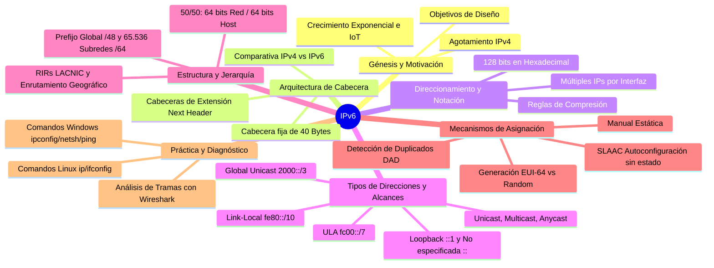
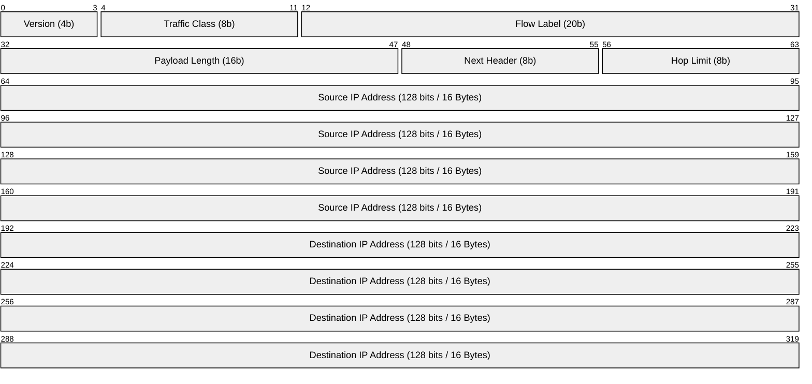
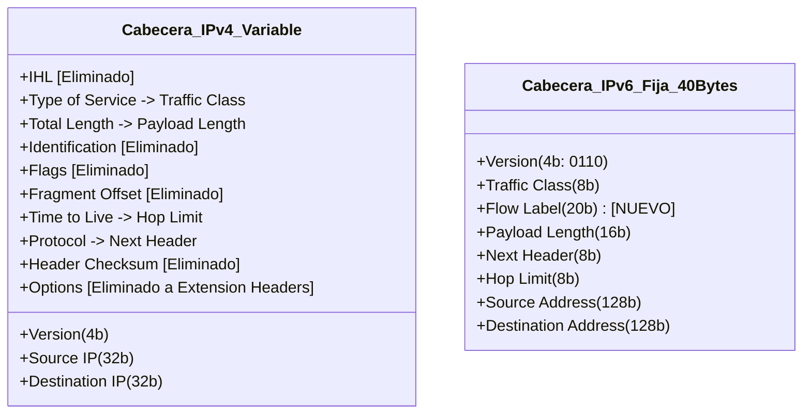
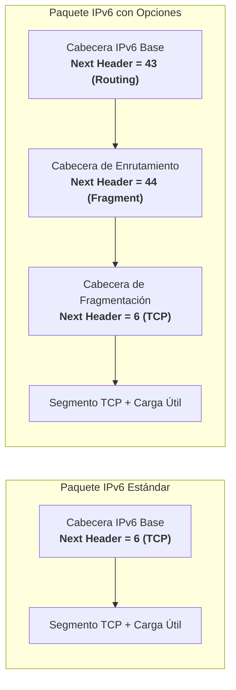
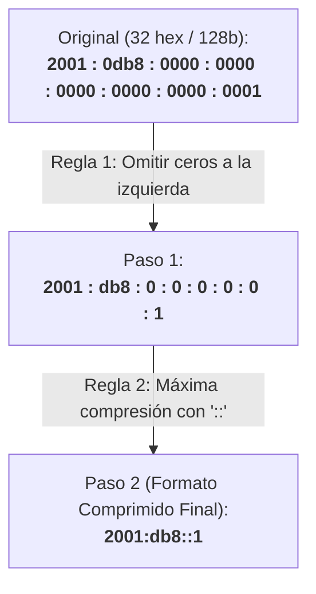
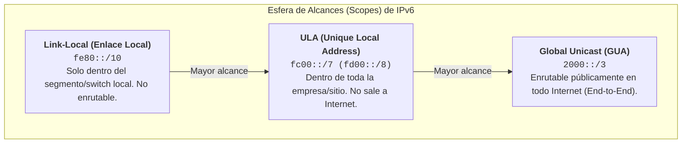
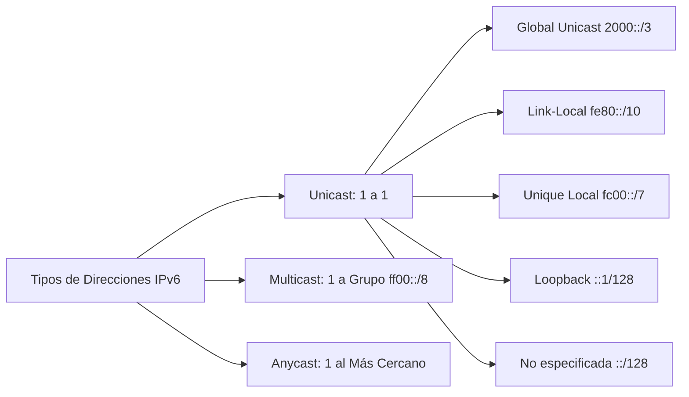
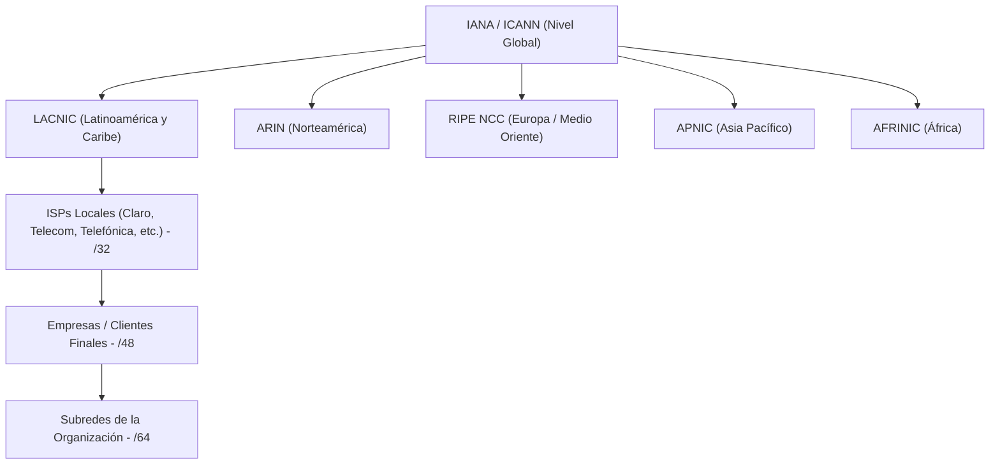
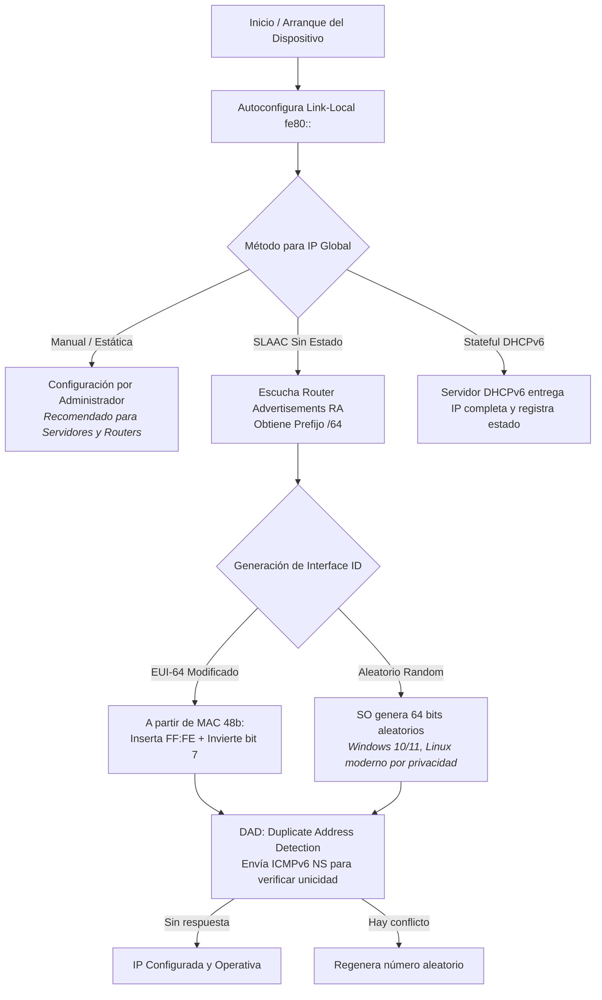
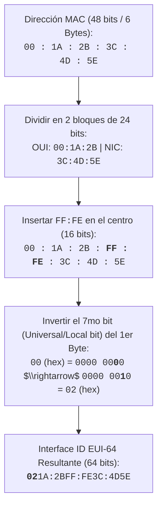

---
aliases:
subject: REDES
year: "4"
exam: PARCIAL2
unit: "2"
type: TEO
zk_type: fleeting
status: in-progress
date: 2026-08-17
source:
  - https://www.youtube.com/watch?v=QHo2Iiwg5Yk&list=PLYZrqm_pzRumO_6c3u7yeHbNF9j6bkbM8&index=19
  - https://www.youtube.com/watch?v=UjxOVfQZ6M0&list=PLYZrqm_pzRumO_6c3u7yeHbNF9j6bkbM8&index=20
  - "[[P2-U03-T02 ipv6]]"
tags:
---
---

![[P2-U03-P02 - RDD - Protocolo IPv6 - direccionamiento.pdf]]

## 📚 Estructura de la Clase: Protocolo IPv6




---
## Explicar la necesidad del espacio de direcciones de IPv6.
- **El origen del problema:** IPv4 fue diseñado originalmente para interconectar unas pocas instituciones académicas y militares (ARPANET). Su espacio de direccionamiento de **32 bits** ($\approx 4.294 \times 10^9$ direcciones) resultó insuficiente ante la explosión masiva de dispositivos conectados e Internet de las Cosas (IoT).
- **División en la comunidad de Internet:**
  1. **Soluciones paliativas / parches para IPv4:** CIDR, VLSM, NAT/PAT y direcciones privadas (RFC 1918). Aunque prolongaron la vida de IPv4, degradaron el principio *End-to-End* y agregaron latencia en el procesamiento de routers.
  2. **Diseño de un nuevo protocolo definitivo:** Desarrollo de **IPv6**, que expande el espacio a **128 bits** ($\approx 3.4 \times 10^{38}$ direcciones, equivalentes a $5 \times 10^{28}$ IPs por persona en el planeta).

## 2. 🎯 Objetivos de Diseño y Características Avanzadas de IPv6

| Objetivo / Característica            | como esta en las diapos                                           | Descripción e Impacto en la Red                                                                                                                          |
| :----------------------------------- | ----------------------------------------------------------------- | :------------------------------------------------------------------------------------------------------------------------------------------------------- |
| **Espacio de Direcciones Masivo**    | Manejar millones de hosts                                         | 128 bits ($2^{128}$). Permite asignar prefijos completos a cualquier dispositivo *sin requerir NAT*.                                                     |
| **Optimización de Enrutamiento**     | Reducir el tamaño de las tablas de encaminamiento                 | Enrutamiento jerárquico y *geográfico* con a*gregación/sumarización* de rutas en el *core* de Internet.                                                  |
| **Cabecera Simplificada y Rápida**   | Simplificar el protocolo →procesamiento más rápido en los routers | Formato de tamaño fijo (40 bytes) con menos campos para agilizar el procesamiento en hardware de los routers.                                            |
| **Seguridad Nativa (IPsec)**         | Proporcionar mayor seguridad                                      | Soporte integrado de autenticación y cifrado (en IPv4 era un agregado opcional).                                                                         |
| **Capacidad de Evolución**           | Permitir que el protocolo evolucione                              | Se incorporan **Cabeceras de Extensión** encadenadas mediante el campo *Next Header*, permitiendo agregar nuevas funciones sin crear un protocolo nuevo. |
|                                      | permitir que las versiones 4 y 6 coexitan                         | tunelizacion                                                                                                                                             |
|                                      | plug and play                                                     | una vez que se conecta a una computadora, esta computadora se inventa la ipv6, no necesita configuracion previa                                          |
| **Eliminación del Broadcast**        |                                                                   | El tráfico de difusión desaparece; se reemplaza exclusivamente por **Multicast** para evitar interrupciones innecesarias a todos los hosts del segmento. |
| **Sin Checksum en Cabecera**         |                                                                   | Se elimina el cálculo de verificación en cada salto (que en IPv4 se recalculaba por variar el TTL). La integridad se delega a Capa 2 y Capa 4 (TCP/UDP). |
| **Etiqueta de Flujo (*Flow Label*)** |                                                                   | Permite marcar secuencias de paquetes para que sigan una misma ruta física, facilitando QoS y tráfico en tiempo real (similar a circuitos virtuales).    |

### Objetivos del Desarrollo de IPv6

El protocolo IP versión 6 nació de la necesidad de superar las limitaciones de su predecesor, IPv4. Los desarrolladores se plantearon varios objetivos fundamentales al momento de diseñarlo.
El primero y más urgente fue manejar una cantidad masiva de hosts. Hoy en día, la cantidad de dispositivos conectados a Internet es inmensa, y IPv6 fue diseñado para poder direccionar a todos ellos con un
espacio de direcciones exageradamente más grande que el de IPv4.

El segundo objetivo fue optimizar las tablas de encaminamiento. Un router es un dispositivo que recibe un paquete por una de sus interfaces y, consultando su tabla de encaminamiento, busca la dirección IP
de destino y la compara con los distintos renglones de esa tabla para decidir por cuál interfaz enviarlo. En IPv4, este proceso es bastante lento porque las tablas de encaminamiento se volvieron muy
grandes, con muchos renglones. IPv6 busca reducir el tamaño de esas tablas para que las consultas sean más rápidas y el encaminamiento sea más eficiente.
El tercer objetivo fue simplificar el protocolo en su cabecera. IPv4 tenía muchos campos en su cabecera, lo que hacía más lento su procesamiento. IPv6 reduce la cantidad de campos, lo que lo hace más
simple de procesar para los routers, agilizando todo el proceso de encaminamiento y reduciendo el tiempo que tarda un paquete en ir desde el origen hasta el destino.

Otro objetivo clave fue proporcionar seguridad nativa. En IPv4, la seguridad era opcional; en IPv6, es una característica nativa del protocolo.
También se buscó permitir que el protocolo evolucione sin necesidad de desarrollar versiones nuevas. Cuando se desarrolla un protocolo, se define una serie de bits con un significado determinado; si se
quiere agregar una nueva funcionalidad, habría que prever dejar bits libres. IPv6 resolvió esto de manera muy original mediante lo que se denomina siguiente cabecera o cabeceras de extensión, que permiten
agregar nuevas funcionalidades sin rediseñar el protocolo desde cero.
Finalmente, se planteó que las dos versiones —IPv4 e IPv6— debían poder coexistir. No es posible decretar que a partir de un día determinado solo funciona IPv6 y desmantelar toda la infraestructura de
IPv4. Actualmente estamos en una etapa de transición en la que ambas versiones conviven, y para que eso sea posible existen los llamados mecanismos de transición, uno de los cuales es la tunelización.
Aunque se esperaba que la transición fuera más rápida, aún no está completa. De hecho, las direcciones IPv4 ya se agotaron, pero los proveedores de servicio se las ingenian para brindar conectividad con
las pocas que disponen.
──────
### Características Avanzadas de IPv6

1. Espacio de direcciones mucho más grande
Esta es la característica fundamental por la cual fue creado IPv6. Su espacio de direccionamiento es exageradamente más amplio que el de IPv4, lo que permite direccionar a una cantidad prácticamente
ilimitada de dispositivos.

2. Alcance y flexibilidad
Las direcciones IPv6 tienen diferentes alcances según con qué dispositivos se conecten. Si un dispositivo necesita comunicarse con otros que están del otro lado del mundo, utilizará direcciones globales
(equivalentes a las direcciones públicas de IPv4). El alcance de la dirección varía en función de qué tan lejos esté el dispositivo destino. Es como si en la vida cotidiana, cuando te comunicas con
alguien cercano usas un apodo, pero cuando te comunicas con alguien lejano usas tu nombre completo.
3. Sumarización de rutas
IPv6 permite implementar lo que se llama sumarización, que consiste en resumir varias direcciones en una sola. Por ejemplo, si se quiere hacer referencia a las direcciones 101, 102, 103, 104 y 105, basta
con publicar el prefijo 100, de modo que cualquier dirección que comience con ese valor sea encaminada hacia el mismo destino. Esto contribuye directamente a reducir el tamaño de las tablas de
encaminamiento.

4. Autoconfiguración (Plug-and-Play)
Cuando una computadora se conecta a un switch o a un access point, automáticamente obtiene conectividad. La propia computadora se auto-inventa su dirección IPv6 sin necesidad de que nadie se la configure
manualmente. Esto se conoce como autoconfiguración o plug-and-play.
5. Eliminación de NAT (Traducción de Direcciones de Red)
En IPv4, el uso de direcciones privadas (como los rangos 172.16.x.x o 192.168.x.x) obliga a realizar una traducción de direcciones (NAT) para salir a Internet, lo cual es un proceso lento. En IPv6 no es
necesaria esa traducción: se usa una única dirección global tanto dentro como fuera de la organización, eliminando ese overhead y mejorando la velocidad.
6. Cabecera más sencilla
Al tener menos campos que la cabecera de IPv4, IPv6 es más eficiente de procesar por los routers.
7. Encaminamiento geográfico más eficiente
El encaminamiento en IPv6 es geográfico, similar al sistema que usa la red telefónica. Esto permite que las tablas de encaminamiento sean mucho más pequeñas y, por ende, más rápidas de consultar.

8. Sin Broadcast
IPv6 no maneja broadcast. Se consideró que los mensajes de broadcast consumen demasiados recursos en los dispositivos, por lo que directamente fueron eliminados de esta versión.

9. Sin checksum en la cabecera
En IPv4 existía un campo que verificaba la integridad de la cabecera (una especie de código de redundancia cíclica). Como el TTL cambia salto a salto, ese checksum debía recalcularse en cada router, lo
cual es un proceso lento. IPv6 eliminó el cálculo del checksum, delegando el control de integridad a otras capas de la pila de protocolos, como la capa de transporte.

10. Cabeceras de extensión
Para permitir que el protocolo pueda evolucionar sin necesidad de rediseñarlo, IPv6 incorpora el mecanismo de cabeceras de extensión (también llamadas "siguiente cabecera"). A través de este mecanismo se
pueden agregar nuevas funcionalidades al protocolo de forma flexible y ordenada.

11. Etiquetas de flujo
IPv6 incorpora un nuevo campo en su cabecera denominado etiqueta de flujo. Si bien el protocolo IP es, en general, no orientado a la conexión (ya que opera sobre redes de conmutación de paquetes), este
campo permite que todos los paquetes pertenecientes a un mismo flujo —por ejemplo, una película que se está reproduciendo o una llamada de voz— viajen por el mismo camino físico. Al asignarles una
etiqueta común, todos esos paquetes son encaminados por la misma ruta, lo que garantiza que lleguen ordenados y de forma más rápida. Este mecanismo existe para brindar calidad de servicio (QoS), ya que
para lograrlo es necesario que los paquetes lleguen en orden y con baja latencia.
## 3. 🧩 IPv6 vs IPv4  espacio de direccionamienot
![[Pasted image 20260826182453.png]]
La abundancia de direcciones en IPv6 se justifica por dos razones principales.
1. Ante la escasez de direcciones en IPv4, el formato de IPv6 se diseñó considerando el crecimiento
futuro, asegurando así una cantidad sustancial de direcciones disponibles.
2. Con la expansión del Internet de las cosas (IoT), se anticipa la necesidad de direcciones IP no solo para individuos, sino también para objetos, impulsando aún más la disponibilidad masiva de
direcciones en IPv6.
## 4. Resumen o sumarizacion de ruta (mini explicacion , lo vimos con ipv4)
![[Pasted image 20260826182825.png]]
1. Se anuncian prefijos de resumen de ruta en la tabla global de encaminamiento.
2. Busca lograr un encaminamiento eficiente y escalable.
3. En IPv6, se utilizan prefijos en lugar de máscaras para gestionar las direcciones.
Los proveedores de servicios asignan direcciones IP a clientes con un prefijo de 48 bits. Para reducir las tablas de encaminamiento en la nube, los routers realizan resúmenes de ruta. Este resumen tiene un prefijo menor, por ejemplo, "/32". Así, un único resumen abarca las direcciones IP de múltiples clientes. A medida que nos acercamos al centro de Internet, los proveedores utilizan prefijos más pequeños para optimizar las tablas de encaminamiento. El objetivo es que los routers en la troncal de Internet tengan tablas más pequeñas, lo que resulta en comparaciones más eficientes y un encaminamiento más rápido.
### ¿Qué es la Sumarización de Rutas?

La sumarización (o resumen de rutas) es un mecanismo que permite representar múltiples direcciones IP bajo una sola dirección con un prefijo más corto, reduciendo así la cantidad de renglones en las
tablas de encaminamiento de los routers. Para entender bien este concepto es necesario comprender primero cómo está organizado Internet.
──────
### Prefijos en IPv6

En IPv6 no se manejan máscaras de red como en IPv4, sino que se utilizan prefijos. El prefijo cumple una función equivalente a la máscara de red: indica cuántos bits corresponden a la parte de red de una
dirección. Por ejemplo, un prefijo /48 significa que los primeros 48 bits identifican la red, y el resto identifica al host.

Un proveedor de servicios de Internet (ISP) asigna direcciones IPv6 a sus clientes con un prefijo de 48 bits. Esto significa que cada cliente recibe un bloque de direcciones identificado por esos primeros
48 bits.
──────
### El Problema: Tablas de Encaminamiento Enormes

Imaginemos dos proveedores de servicio de Internet, cada uno con 100 clientes. Si cada cliente tiene su propio bloque de direcciones con prefijo /48, entonces:

• El primer ISP tendría que publicar 100 rutas en la troncal de Internet.
• El segundo ISP tendría que publicar otras 100 rutas.

Esto significaría que los routers de la troncal de Internet tendrían que agregar 200 renglones a sus tablas de encaminamiento solo para estos dos proveedores. A escala global, esto se vuelve inmanejable.
──────
### La Solución: Resúmenes de Ruta

Para reducir ese problema, los routers realizan resúmenes de ruta: en lugar de publicar las 100 direcciones individuales de los clientes, el ISP publica una sola dirección con un prefijo menor, por
ejemplo /32. Este prefijo más corto abarca (resume) a todas las direcciones con prefijo /48 que están por debajo de él.

De esta manera, los routers de la troncal de Internet no necesitan conocer cada dirección individual de cada cliente; les basta con saber que todo lo que empiece con los primeros 32 bits de esa dirección
debe encaminarse hacia ese proveedor.
──────
### La Jerarquía de Internet y los Niveles de Prefijos

Internet está organizado en niveles o tiers (niveles 1, 2 y 3):

• Los ISPs de nivel 3 se conectan directamente con los clientes finales.
• Los ISPs de nivel 2 son intermedios.
• Los ISPs de nivel 1 conforman la troncal (backbone) de Internet.

A medida que nos acercamos al núcleo de Internet, los prefijos se vuelven cada vez más cortos. Esto se debe justamente a que los routers del núcleo solo necesitan ver resúmenes muy amplios de rutas, sin
conocer el detalle de cada subred individual. Cuanto más corto es el prefijo, más direcciones abarca ese resumen y menos renglones son necesarios en la tabla de encaminamiento.
──────
### Un Ejemplo Cotidiano: Las Subredes de una Empresa

Un buen ejemplo para entender la sumarización es el de una empresa con subredes internas. Dentro de la empresa se manejan múltiples subredes, pero cuando el router de la empresa sale a comunicarse con el
exterior, no publica todas y cada una de esas subredes. En cambio, anuncia un resumen: la dirección de red general que las abarca a todas. Desde afuera, nadie necesita conocer la estructura interna de
subredes; solo necesitan saber que todo lo que vaya hacia esa dirección de red debe ir hacia ese router.
──────
### ¿Por Qué Funciona Mejor Así?

La clave está en la eficiencia de comparación. Cuando un router necesita encaminar un paquete, compara la dirección IP de destino con los renglones de su tabla de encaminamiento. Cuantos menos bits tenga
que comparar, más rápido lo hace.

• Un router en la troncal de Internet, con un prefijo /16, solo necesita comparar 16 bits para decidir hacia dónde enviar el paquete.
• Un router más cercano al destino, con un prefijo /32 o /48, deberá comparar más bits porque ya está refinando el camino hacia el destino final.

Es decir, no se trata de descentralizar la responsabilidad, sino de distribuir el nivel de detalle según la posición del router en la jerarquía de Internet. Los routers del núcleo comparan pocos bits y
toman decisiones rápidas; los routers más cercanos al destino comparan más bits pero ya manejan un tráfico más acotado.

En definitiva, comparar 16 bits es mucho más rápido que comparar 48 bits, y de eso se trata toda la lógica detrás de la sumarización de rutas: menos renglones, menos bits a comparar, encaminamiento más
veloz.

## 5. 🧩 Anatomía de la Cabecera IPv6 vs IPv4
![[Pasted image 20260826184909.png]]
Ipv4 tiene 5 palabras(los renglones) de 32 bits la mayoria porque options en general no se usan

en este grafico lo que esta en rojo desaparecen, los amarillos se matienen los mismos nombres y funciones y los azules cambia el nombre pera la funcion es muy similar

### 3.1. Formato de la Cabecera Base IPv6 (40 Bytes Fijos)


### 3.2. Comparativa Detallada de Campos



> [!NOTE] **Detalles de los Campos Principales:**
> - **Version (4 bits):** Valor binario `0110` (6).
> - **Traffic Class (8 bits):** Equivale al *Type of Service* (ToS) / DiffServ de IPv4 para priorización de paquetes.
> - **Flow Label (20 bits):** Identifica paquetes de un mismo flujo para mantener coherencia de camino y baja latencia.
> 	-  encaminar paquetes mas rápidamente
> - **Payload Length (16 bits):** Indica el tamaño en bytes de los datos y cabeceras de extensión  encapsulados (carga util) (no incluye los 40 bytes de la cabecera base).
> - **Next Header (8 bits):** Reemplaza al campo *Protocol* de IPv4. Especifica el tipo de la siguiente cabecera (cabecera de extensión o protocolo de transporte como TCP=6, UDP=17, ICMPv6=58).
> 	- En el origen se utilizar para saber que protocolo estas encapsulando y en el destino identificando sirve para saber a quien entregar ese paquete luego de desencapsular
> - **Hop Limit (8 bits):** Reemplaza al *TTL* (*Time to Live*). Se decrementa en 1 en cada router; al llegar a 0 se descarta el paquete para evitar bucles.
> - **Source / Destination Address (128 bits c/u):** Ocupan 32 de los 40 bytes totales de la cabecera (80% del tamaño total).
> 	- "Source address" abarca 4 palabras (4 renglones). "Esto es porque las ipv6 son el cuadruple en cuanto a cantidad de bits que ipv4"
> 	-"Destination address" también abarca 4 palabras (4 renglones).

Cuantos bytes tendria toda la cabecera?
Destination adrees ( 4) + source adress (4) + mas el resto son 10 palabras ( renglones)

como cada renglon tiene 32 bits que igual a 4 bytes

10x4 = 40bytes

#### DIFERENCIAS
o La cabecera de IPv6 ocupa 40 bytes, el doble que IPv4 (20 bytes). Porque tiene:
	 1 renglón (donde están los campos version, traffic class y flow label) de 32 bits (4 bytes).
	 1 renglón (donde están los campos payload, next header y hop limit) de 32 bits (4 bytes).
	 4 renglones (el campo Source address) de 128 bits (16 bytes).
	 4 renglones (el campo Destination address) de 128 bits (16 bytes).
Entonces tenemos 4 + 4 + 16 + 16 = 40 bytes. La cabecera de IPv6 es la única que tiene de largo 40 bytes.

o En IPv6, no se fragmentan paquetes grandes; se solicitan paquetes más pequeños directamente.
o Se elimina el campo "longitud de cabecera" (IHL) en IPv6 debido a la fijeza de la cabecera.
o El checksum de IPv4 también fue eliminado al crear IPv6.
o Las opciones se manejan de manera diferente en IPv6, a través del campo "Next header" (siguiente cabecera).

### si en general ipv4 tiene 20 bytes e ipv6 tiene 40 bytes? no dijieron que era mas simple?
Ipv4 en las cabeceras tiene mas campos, si bien ipv6 ocupa mas bytes es mucho mas rapido de procesar por tener menos cabeceras

tendrian menos campos que procesar
### 3.3. Encadenamiento de Cabeceras de Extensión (*Next Header*)

FORMA VERTICAL
![[Pasted image 20260826191924.png]]
FORMA HORIZONTAL
![[Pasted image 20260826191936.png]]



#### explicacion del resumen
IPv6 utiliza cabeceras de extensión para manejar opciones de manera eficiente.
El campo "siguiente cabecera" permite insertar códigos de protocolo o de otra cabecera, expandiendo
la estructura de IPv6.
Se pueden agregar múltiples cabeceras para proporcionar nuevas funcionalidades al protocolo.
Ejemplos:
1.
2.
3.
4.
Encapsulamiento TCP:
• Datos encapsulados en un segmento TCP.
• Campo "siguiente cabecera" contiene el código de TCP, sin opciones.
Encaminamiento con Opción:
• Agrega la opción de encaminamiento.
• Incluye otra cabecera (Routing Header) con un campo "longitud" y un campo "siguiente
cabecera" que lleva a TCP.
Múltiples Opciones de Encaminamiento:
• Dos opciones: encaminamiento y fragmento.
• La cabecera de encaminamiento precede a la de fragmento, que a su vez lleva a TCP.
Diversidad de Opciones:
• Dos opciones: fragmento y seguridad.
• Se mantiene la lógica de orden, con la cabecera de fragmento antes que la de seguridad.
•
 Las cabeceras de extensión deben seguir un orden y una lógica para ser procesadas correctamente
por los routers.

#### explicaicon de la profe

##### ¿Qué son las Cabeceras de Extensión?
Una de las características más originales e importantes de IPv6 es el mecanismo de cabeceras de extensión, también llamadas siguiente cabecera. Este mecanismo es la solución que encontraron los
diseñadores del protocolo para permitir que IPv6 pueda evolucionar y adquirir nuevas funcionalidades sin necesidad de rediseñar el protocolo desde cero.
──────
##### ¿Cómo Funciona el Mecanismo?

La cabecera base de IPv6 incluye un campo llamado "siguiente cabecera". Este campo puede contener el código de un protocolo de capa superior (como TCP) o, en su lugar, el código de una cabecera de
extensión adicional.

Si existe una cabecera de extensión, ésta a su vez también contiene su propio campo "siguiente cabecera", que puede apuntar a otra cabecera de extensión o al protocolo de capa superior. De esta manera,
las cabeceras se van encadenando una tras otra, formando una secuencia. Cada cabecera de extensión también incluye un campo de longitud, que indica hasta dónde llega esa cabecera, permitiendo que el
router la lea correctamente y sepa dónde empieza la siguiente.

Este diseño en cadena permite expandir la cabecera de IPv6 de forma flexible, agregando tantas cabeceras de extensión como sean necesarias, siempre y cuando estén definidas en el protocolo y se respete el
orden establecido.
──────
##### Ejemplos Concretos

Ejemplo 1: Caso básico, sin opciones

En el caso más común, los datos de una aplicación están encapsulados en un segmento TCP. Ese segmento, junto con su cabecera TCP, forma la carga útil que se encapsula dentro de un paquete IPv6. En este
escenario, el campo "siguiente cabecera" de la cabecera IPv6 contiene simplemente el código de TCP, indicando que lo que viene a continuación es un segmento de ese protocolo. Cuando el paquete llega al
destino, el dispositivo sabe a quién entregarle esa carga útil gracias a ese código.

Ejemplo 2: Una cabecera de extensión

Si se necesita agregar una funcionalidad adicional, por ejemplo una opción de encaminamiento (como el encaminamiento desde el origen), el campo "siguiente cabecera" de la cabecera IPv6 ya no apunta
directamente a TCP, sino al código de la cabecera de extensión de encaminamiento. Esta cabecera de extensión tiene su propio campo "siguiente cabecera", que ahora sí apunta a TCP. La cabecera total del
paquete se ha expandido: primero va la cabecera base de IPv6, luego la cabecera de extensión de encaminamiento y finalmente el segmento TCP.

Ejemplo 3: Múltiples cabeceras de extensión

Es posible encadenar varias cabeceras de extensión. Por ejemplo, se puede tener una cabecera de encaminamiento, seguida de una cabecera de fragmento, seguida de una cabecera de seguridad. Cada una apunta
a la siguiente mediante su campo "siguiente cabecera", y la última de ellas apunta al protocolo de capa superior (TCP, por ejemplo). Así, el protocolo puede acumular múltiples funcionalidades adicionales
en un solo paquete.
──────
##### ¿Por Qué es tan Importante Este Mecanismo?

Esta es una forma muy original de hacer que el protocolo evolucione. En lugar de definir desde el principio todos los bits y campos posibles que podría necesitar en el futuro, IPv6 simplemente deja
abierta la puerta mediante el campo "siguiente cabecera". Cada vez que se quiere brindar una nueva funcionalidad, se crea y codifica una nueva cabecera de extensión, sin modificar la estructura base del
protocolo.

Cabe aclarar que no se pueden agregar cabeceras de extensión arbitrarias o inventadas; solo se pueden utilizar las que están formalmente definidas en el protocolo. Además, deben seguirse un orden y una
lógica específicos para que los routers y dispositivos intermedios puedan leer y procesar correctamente toda la cadena de cabeceras, ya que estas se van leyendo salto a salto a lo largo del camino hacia
el destino.

En resumen, las cabeceras de extensión son el mecanismo que le da a IPv6 su capacidad de crecimiento y adaptación a futuro, sin comprometer la eficiencia ni la simplicidad de su cabecera base.

---


## 6. 🔢 Notación, Representación y Reglas de Compresión

Una dirección IPv6 consta de **128 bits**, representados como **8 grupos (hextetos) de 4 dígitos hexadecimales** separados por dos puntos (`:`). Cada dígito hexadecimal representa 4 bits ($8 \times 4 \times 4 = 128\text{ bits}$).

```
Formato completo: 2001:0db8:0000:0000:0008:0800:200c:417a
```

### 4.1. Las Dos Reglas de Compresión

1. **Regla 1: Omisión de Ceros a la Izquierda:**
   - En cualquier hexteto, los ceros no significativos a la izquierda se suprimen.
   - `0db8` $\rightarrow$ `db8` | `0000` $\rightarrow$ `0` | `0800` $\rightarrow$ `800` (el cero final no se suprime).
2. **Regla 2: Compresión de Ceros Contiguos (`::`):**
   - Una secuencia de uno o más grupos consecutivos de ceros `0000` (`0:0:...`) puede reemplazarse por doble dos puntos `::`.
   > [!WARNING] **¡Regla de Oro!**
     > El símbolo `::` **solo puede usarse una única vez en toda la dirección**. Si se usara dos veces, sería imposible determinar matemáticamente cuántos hextetos de ceros corresponden a cada lado.
   - En caso de haber dos bloques de ceros separados, se comprime el bloque más largo; si empatan en longitud, se comprime el primero por convención.

### 4.2. Ejemplo Paso a Paso (Visto en Clase)



---

otro ejemlo si tenemos de ambos lados todo ceros y la misma cantidad

Si tuviéramos el caso de tener una dirección IP como esta:
	2001:0000:0000:34:3333:0000:0000:222A

donde la cantidad de ceros son iguales de cada lado, puedo comprimir el que quiera con :: pero en general, se comprimen los primeros.

Entonces, la dirección comprimida quedaría así:
	2001::34:3333:0:0:222A

**Estos mecanismos de compresión nos permiten representar de forma sencilla las direcciones IPv6, pero en el software siempre se completan los 128 bits en el paquete.**

---
otro ejemplo ![[Pasted image 20260826193400.png]]

## 7. 🌐 Tipos de Direcciones y Esquema de Alcances (*Scopes*)

A diferencia de IPv4 donde un host típicamente posee una única dirección IP, en IPv6 una interfaz de red tiene **múltiples direcciones simultáneas** asignadas a diferentes alcances (*Scopes*).


¿Cuántas direcciones tiene una PC en IPv4 normalmente? 
	1 sola.
¿Qué pasa si cambio la dirección IPv4 que tenía? ¿Cuál le queda? 
	La dirección IPv4 que tenía es reemplazada por la nueva dirección IP.
¿Qué pasa en IPv6? 
	En IPv6 una máquina puede tener y de hecho, va a tener, muchas direcciones IP. Esto se debe a que las direcciones IP se asignan a las interfaces.

*Esto que se asignen a las interfaces no entiendo, osea por ejemplo una computadora no tiene una sola interfaz? eth0?*


✓Las direcciones se asignan a las interfaces → Cambio del modo de IPv4
✓Las interfaces “esperan” tener múltiples direcciones. Como mínimo se van a tener direcciones IP.
✓Las direcciones tienen alcance:

 Local de Enlace: se usa cuando el origen y el destino están en el mismo segmento de red (FE80)
 Local Única (ULA): se usa cuando el origen y el destino están en segmentos de redes distintas. Es a nivel empresa. (empiezan con FC). En mi empresa no debe haber dos ULA iguales.
 Global: Es equivalente a la “pública” de IPv4. Proporciona conectividad de extremo a extremo en el mundo, sin hacer traducciones.
	UNICAS E IRREPETIBLES
![[Pasted image 20260826195839.png]]

* Las direcciones tienen tiempo de vida
* Tiene mayor alcance porque me permite conectar dispositivos que están más alejados.
> [!question] ¿Una máquina puede tener la misma ULA que otra máquina, pero en otra red global? 
> Sí se puede. Las únicas e irrepetibles son las globales. Las de local enlace y local única se pueden repetir.

![[Pasted image 20260826200634.png]]
 Local enlace: PC-A se comunica con PC-B
 Local única: PC-A se comunica con PC-D
 Global: las pc se conectan a Internet (normalmente empiezan con 2 o 3
las direcciones)
### 5.1. Clasificación por Método de Transmisión




#### unicast
 Dirección para una sola interfaz.
• Utilizada para la comunicación entre un origen y un destino.
• Tipos de direcciones IPv6 Unicast:
o Global
o Local de Enlace
o Local Única (ULA)
o IPv4-mapeada: Incorpora una dirección IPv4 dentro de una dirección IPv6.

#### MULTICAST
• Eficiente uso de la red.
•
 Amplio rango de direcciones.
•
 Utilizada para la comunicación de un origen a varios destinos.
•
 Similar a las direcciones de grupo en IPv4, y que empezaban con tres unos (o sea, es 224 en decimal).
→ clase A: empezaba con 0
→ clase B: empezaba con 10
→ clase C: empezaba con 110
→ clase D: empezaba con 1110
• En IPv6 empiezan con “FF”, que serían 8 unos.
#### anycast
> [!NOTE] **El concepto de Anycast en IPv6:**
> Múltiples servidores o interfaces comparten la misma dirección IP Anycast. Cuando un host envía un paquete a esa dirección, los routers lo entregan a la **instancia físicamente más cercana** (menor métrica de enrutamiento). Se utiliza ampliamente para balanceo de carga y redundancia de servicios esenciales (DNS, DHCP, CDNs).

• Asignada de un espacio de dirección unicast.
• Múltiples dispositivos comparten la misma dirección.
• Todos los nodos anycast deben ofrecer un servicio uniforme.
•Los dispositivos origen envían paquetes a la dirección anycast.
•Los routers deciden sobre el dispositivo más cercano para alcanzar el destino.
•Adecuada para balanceo de carga, donde algunas peticiones van a un servidor y otras a otro.
•Puede haber dos máquinas con la misma dirección IP dentro de una empresa, especialmente utilizadas por servidores que brindan el mismo servicio.
•Anycast asegura que un paquete llegue a la máquina más cercana físicamente al origen.
•En resumen, se repite la dirección IP anycast en la misma red para ofrecer servicios similares.

### 5.2. Tabla Maestra de Prefijos y Funciones

| Tipo de Dirección        | Prefijo Binario       | Prefijo Notación CIDR | Rango / Ejemplo         | Alcance (*Scope*) y Función                                                                                                                                                                                                                                                                  |
| :----------------------- | :-------------------- | :-------------------- | :---------------------- | :------------------------------------------------------------------------------------------------------------------------------------------------------------------------------------------------------------------------------------------------------------------------------------------- |
| **No especificada**      | Todos ceros (`0...0`) | `::/128`              | `::`                    | Dirección origen transitoria durante el arranque/DHCP. Nunca destino.<br><br>- Equivalente a 0.0.0.0 de IPv4. Se utiliza para<br>indicar la ausencia de una dirección. No debe<br>ser asignada a una interfaz o utilizada como<br>dirección destino.                                         |
| **Loopback**             | 127 ceros y un 1      | `::1/128`             | `::1`                   | Testeo local de la pila TCP/IP. (Ahorro radical vs `127.0.0.0/8` de IPv4).<br><br> En IPv4 se<br>derrocharon 2^24 direcciones IP. Es decir, se<br>destinó toda una red clase A para chequear la<br>pila de protocolos instalada. En cambio, en IPv6 sólo se derrocha una única dirección IP. |
| **Link-Local**           | `1111 1110 10...`     | `fe80::/10`           | `fe80::` a `febf::`     | Comunicación dentro del mismo segmento físico/enlace. Autoconfigurada.<br><br> Configurada<br>automáticamente. No se reenvía tráfico local de<br>enlace fuera del enlace.                                                                                                                    |
| **Unique Local (ULA)**   | `1111 110...`         | `fc00::/7`            | `fc00::/8` / `fd00::/8` | Red privada interna de empresa/organización (*Site-Local*).                                                                                                                                                                                                                                  |
| **Global Unicast (GUA)** | `001...`              | `2000::/3`            | `2000::` a `3fff::`     | Pública enrutable globalmente en Internet.                                                                                                                                                                                                                                                   |
| **Multicast**            | `1111 1111`           | `ff00::/8`            | `ff00::` a `ffff::`     | Comunicación uno a muchos (reemplaza al broadcast).<br><br>Empieza con FF. <br><br>“/8” significa que sí o<br>sí los ocho primeros bits tienen que valer FF y<br>ya después puede valer cualquier cosa.                                                                                      |
| **IPv4-Mapped**          | `0...0:ffff:...`      | `::ffff:0:0/96`       | `::ffff:192.168.1.1`    | Representación de nodos IPv4 en entornos IPv6.                                                                                                                                                                                                                                               |
| **Documentación**        | -                     | `2001:db8::/32`       | `2001:db8:...`          | Reservada exclusivamente para ejemplos, manuales y docencia.                                                                                                                                                                                                                                 |
Es importante tener en cuenta que:
	• Los primeros grupos hexadecimales en IPv6 indican el tipo de dirección y la cantidad de bits relevantes.
	•Al verificar la presencia de IPv6 con "ipconfig/all" en CMD, se muestra la dirección IPv6 con "%" al final para referenciar la interfaz.
	•Cada interfaz puede tener múltiples direcciones IP.
	•La dirección FE80 se autoconfigura incluso si no hay conexión a ninguna red. En IPv4, se asigna automáticamente la 169 si no hay DHCP.
	•Cuando una máquina sin IP busca un servidor DHCP, el paquete IPv4 originado tiene la IP origen como "0.0.0.0".

---


## 8. 🗺️ Estructura de Direcciones Globales, Subredes y Jerarquía RIR

### 6.1. División Jerárquica 50/50 (64 bits Red / 64 bits Host)

Las direcciones IPv6 se dividen en prefijo de red e ID de interfaz (50-50, 128 bits divididos a la mitad).
![[Pasted image 20260827123747.png]]

asi se divide la parte de RED:
![[Pasted image 20260827123935.png]]
esta seria una global por ejemplo


- **Prefijo de Enrutamiento Global (48 bits):** Asignado jerárquicamente por la IANA $\rightarrow$ RIR (LACNIC) $\rightarrow$ ISP $\rightarrow$ Empresa/Sitio cliente (`/48`).
- **Subnet ID (16 bits):** Permite a cada empresa crear hasta $2^{16} = \mathbf{65.536}$ **subredes `/64`** independientes sin necesidad de realizar VLSM complejo ni sacrificar bits de host.
- **Interface ID (64 bits):** Identificador del dispositivo en la subred ($2^{64} \approx 18.4$ trillones de hosts por subred).

---
•Los **prefijos** IPv6 identifican rutas o subredes.
•Ejemplos:
	• 21DA:D3::**/48** es un prefijo de ruta o red.
	•21DA:D3:0:2F3B::**/64** es un prefijo de subred.

•Prefijos con menos de 64 bits son rutas o rangos de dirección sumarizados.
•No se usan máscaras de subred en IPv6, y no hay VLSM (máscara de subred de longitud variable).
•La división de una dirección IPv6 es 50-50 (64 bits para el prefijo de red y 64 para el identificador de host).
•En una dirección como **FEC0::2AC4** *:2AA:FF:FE9A:82D4:*
	 ES una ULA
	 el identificador de red es **FEC0:0:0:2AC4::/64**
	 el ID de interfaz es *2AA:FF:FE9A:82D4*

### 6.2. Enrutamiento Geográfico por RIRs (*Regional Internet Registries*)
Para que el encaminamiento en IPv6 sea geográfico se dividió el mundo en cinco
zonas muy grandes. Nosotros pertenecemos a la LACNIC (Latinoamérica y el caribe).




### DIRECCIONES IPV6 UNICAST GLOBAL (Y ANYCAST)
* Las direcciones IPv6 Unicast Global y Anycast tienen el mismo formato de direccion.
* El encaminamiento en IPv6 se divide geográficamente en grandes zonas, como LACNIC (Latinoamérica y el Caribe).
* Utilizan un prefijo de encaminamiento global, Una estructura que habilita el resumen de ruta hacia arriba, eventualemnte el ISP
	* permitiendo la sumarización de rutas.
* Una interfaz puede tener múltiples direcciones (unicast, anycast, multicast).
	* como minimo debe tener link-local y la de loopback
	* * Cada interfaz IPv6 debe tener al menos una dirección loopback (::1/128) y una de enlace local (la que empieza con FE80).
* IPv6 identifica interfaces, no nodos. 
	* Un nodo se identifica por cualquier dirección unicast en una de sus interfaces.
* Opcionalmente, cada interfaz puede tener múltiples direcciones locales únicas (ULA) y globales.
* La dirección Anycast es una dirección unicast global asignada a un conjunto de interfaces, generalmente en diferentes nodos.
---

![[Pasted image 20260827133858.png]]
✓ El prefijo de enrutamiento global en IPv6 es geográfico y consta de tres partes: Registry, ISP Prefix y Site Prefix.
	✓ El Registry abarca hasta el bit 23 y representa el número y tipo de registro.
	✓ ISP Prefix va hasta el bit 32 y engloba al proveedor de servicio y el registro.
	✓ Site Prefix, hasta el bit 48, corresponde a la dirección de la empresa (clientes del proveedor de servicio).
	✓ Subnet Prefix, la parte de la subred se extiende hasta el bit 64, indicando subredes dentro de la empresa.


Los routers, al leer solo los primeros 23 bits, envían el paquete a uno de los 5 registros mundiales. Luego, al llegar a un registro, los routers leen hasta el bit 32 para identificar el proveedor de servicio. Para determinar si el paquete va a una empresa, se leen hasta el bit 48, y para subredes dentro de la empresa, hasta el bit 64. En resumen, a medida que nos acercamos al destino, se leen más bits.

---


## 9. ⚙️ Métodos de Asignación y Autoconfiguración



### autoconfiguracion Sin estado
•Los dispositivos obtienen automáticamente direcciones IPv6. DBR
* Cada dispositivo crea su propia parte de ID de interfaz, y el router asigna el prefijo de ruta.
* Funciones de plug & play.
* * Direcciones locales de enlace se configuran automáticamente en todos los nodos.
* Un nodo en su fase de inicialización, escuhan a un router (RA- Router advertisements) para que  le asigne: 
	* Prefijo de red IPv6, /64 
		* NO LA PARTE DE ID DE INTERFAZ, esta parte se la inventara cada dispositivo
	* Router por defecto, 
	* Límite de saltos, 
	* MTU del enlace local 
	* Validez del tiempo de vida

Una vez que un nodo tiene la direccion de red debe completarlo con el id de interfaz
* Creación de direcciones IPv6 globales mediante:
	* 		**Dirección Global = Prefijo de enlace + dirección EUI-64**
		* • Dirección EUI-64: Direcciones MAC (48 bits) se extienden con 16 bits (0xFFFE) entre el fabricante y el número de placa. Bit 7 (universal) debe estar en 1 para evitar duplicados. (menos seguro).
		* FALTA DE SEGURIDAD: se podia deducir la mac del dispositivo
	* 		**Dirección Global = Prefijo de enlace + número aleatorio**
		* • Número aleatorio: Generado por el sistema operativo, 
		* NO PUEDEN exister dos ipv6 globales iguales, como hacen?
			* evitando duplicados mediante PING.


### 9.1. Proceso de Transformación EUI-64 (de MAC de 48 bits a Interface ID de 64 bits)
![[Pasted image 20260827140233.png]]



> [!IMPORTANT] **Por qué se prefiere Interface ID Aleatorio sobre EUI-64:**
> EUI-64 expone la dirección física MAC del dispositivo en cada paquete que viaja por Internet, lo que permite rastrear la ubicación y actividades del usuario entre distintas redes. Los sistemas operativos actuales generan Interface IDs aleatorios o temporales (RFC 4941) para salvaguardar la privacidad.

---


## 💻 Laboratorio Práctico: Comandos, Diagnóstico y Capturas

### 8.1. Comandos en Linux

```bash
# 1. Configuración estática mediante iproute2 (recomendado):
sudo ip -6 addr add 2001:db8:acad:1::10/64 dev eth0

# 2. Configuración mediante ifconfig tradicional:
sudo ifconfig eth0 inet6 add 2001:db8:acad:1::10/64

# 3. Verificación de interfaces y alcances (scope):
ip -6 addr show dev eth0
# o bien:
ifconfig eth0

# 4. Pruebas de conectividad:
ping6 ::1                           # Loopback local
ping6 2001:db8:acad:1::1            # Ping a IP Global
ping6 -I eth0 fe80::21a:2bff:fe3c:4d5e  # Ping a Link-Local (requiere especificar interfaz)
```
![[Pasted image 20260827140737.png]]
### 8.2. Comandos en Windows (CMD / PowerShell)

```cmd
:: 1. Visualización completa de direcciones IPv6 y Zone IDs:
ipconfig /all

:: 2. Testeo de pila TCP/IP local IPv6:
ping ::1

:: 3. Testeo hacia un destino IPv6:
ping -6 2001:4860:4860::8888

:: 4. Inspección avanzada de interfaces y tiempos de vida con Netsh:
netsh interface ipv6 show addresses
netsh interface ipv6 show interfaces
```

> [!TIP] **Interpretación del identificador de zona (`%3`, `%12`):**
> En Windows, al listar direcciones Link-Local (`fe80::...%12`), el valor después del `%` indica el **Índice de Interfaz** (*Zone ID*). Dado que las direcciones `fe80::` no tienen prefijo de red único global, el sistema operativo necesita saber explícitamente por cuál interfaz física o virtual debe transmitir el paquete.


![[Pasted image 20260827141142.png]]
NO, porque no tiene fffe en el medio

![[Pasted image 20260827141215.png]]
![[Pasted image 20260827141259.png]]
### 8.3. Análisis de Captura en Wireshark (Visto en Clase)
![[Pasted image 20260827140846.png]]
![[Pasted image 20260827141023.png]]
```
================================================================================
ETHERNET FRAME:
  Destination MAC : 00:15:5d:01:aa:02
  Source MAC      : 00:15:5d:01:bb:03
  Type            : 0x86dd (IPv6)
--------------------------------------------------------------------------------
INTERNET PROTOCOL VERSION 6:
  0110 .... = Version: 6
  .... 0000 0000 .... = Traffic Class: 0x00 (DSCP: CS0, ECN: Not-ECT)
  .... .... .... 0000 0000 0000 0000 0000 = Flow Label: 0x00000
  Payload Length: 64 bytes
  Next Header   : 58 (ICMPv6)
  Hop Limit     : 64
  Source Address     : fe80::a123:45ff:fe67:89ab
  Destination Address: fe80::c456:78ff:fe90:12cd
--------------------------------------------------------------------------------
INTERNET CONTROL MESSAGE PROTOCOL v6:
  Type: 128 (Echo (ping) request)
  Code: 0
  Checksum: 0x4a2b [correct]
================================================================================
```

---

## 9. 📝 Síntesis para el Parcial y Puntos Clave de Evaluación

> [!IMPORTANT] **Checklist de Conceptos Clave Evaluados en Exámenes:**
> 1. **Tamaño de Cabecera:** IPv4 tiene cabecera variable (mínimo 20 bytes); IPv6 tiene cabecera base fija de **40 bytes**.
> 2. **Campos Eliminados:** En IPv6 desaparecen *IHL*, *Identification*, *Flags*, *Fragment Offset*, *Header Checksum* y *Options* de la cabecera base.
> 3. **Next Header:** Cumple la doble función de reemplazar al campo *Protocol* de IPv4 y de permitir el encadenamiento de *Cabeceras de Extensión*.
> 4. **Regla de Compresión:** El operador `::` se utiliza **una sola vez** por dirección. Los ceros a la izquierda dentro de un hexteto siempre se pueden eliminar.
> 5. **Direcciones Obligatorias:** Toda interfaz IPv6 habilitada tiene como mínimo su dirección **Loopback (`::1`)** y su dirección **Link-Local (`fe80::/10`)**.
> 6. **Subredes Estándar:** La división estándar es `/64`. El prefijo empresarial típico es `/48`, dejando 16 bits para un total de **65.536 subredes**.
> 7. **Diferencia de Alcances:**
>    - `fe80::/10` $\rightarrow$ Enlace local (no pasa routers).
>    - `fc00::/7` $\rightarrow$ Sitio local / ULA (no sale a Internet).
>    - `2000::/3` $\rightarrow$ Global pública (enrutable en Internet).
> 8. **Autoconfiguración SLAAC:** Combina el prefijo `/64` provisto por el router (vía Router Advertisement) con un Interface ID de 64 bits (generado por EUI-64 o Aleatorio), validado mediante DAD.

