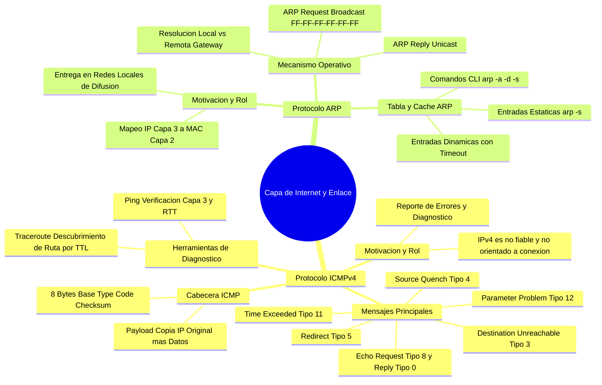
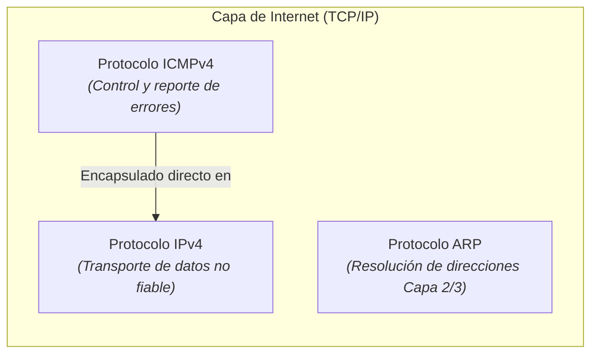
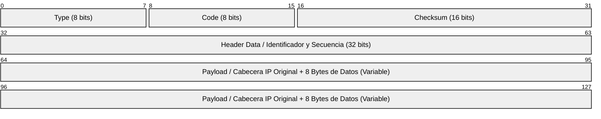
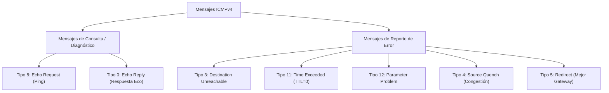
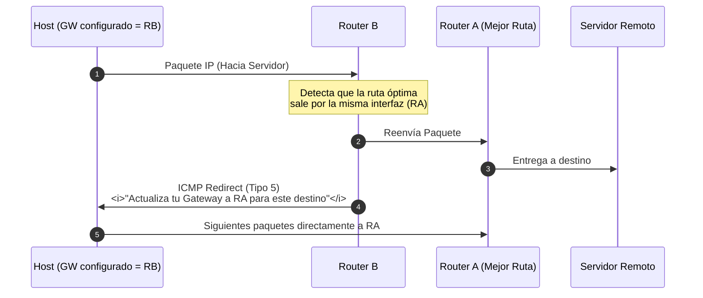
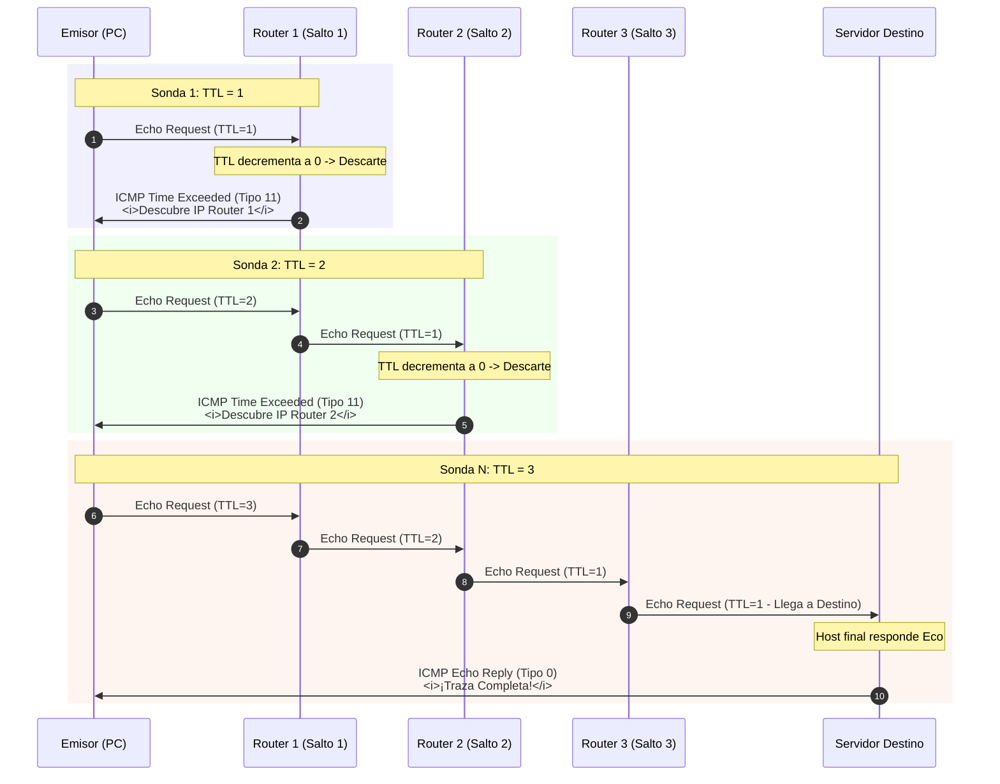

---
aliases:
subject: REDES
year: "4"
exam: PARCIAL2
unit: "3"
type: TEO
zk_type: fleeting
status: in-progress
date: 2026-08-17
source:
  - https://www.youtube.com/watch?v=8Cf6oC0uMUg&list=PLYZrqm_pzRumO_6c3u7yeHbNF9j6bkbM8&index=28
  - https://www.youtube.com/watch?v=XRniG1TsgL8&list=PLYZrqm_pzRumO_6c3u7yeHbNF9j6bkbM8&index=30
tags:
---
---
![[P2-U03-P03-RDD - Unidad 3 - Protocolo ICMP - ARP.pdf]]

---
## 1. 🚀 Protocolo ICMPv4: Fundamentos y Motivación

### 1.1. ¿Por qué es necesario ICMP?
- **La limitación de IPv4:** El protocolo IP es **no fiable** (*unreliable / best-effort*) y **no orientado a conexión**. Si durante el tránsito un paquete se descarta (enlace caído, TTL agotado, buffer de router saturado, host apagado o MTU excedida con bit DF activo), **IPv4 no realiza ningún reporte ni avisa al emisor**.
	- IPv4 es NO fiable
	- IPv4 no garantiza que se entregue el paquete en el destino 
	- IPv4 no informa si el paquete no llega al destino 
	- IPv4 no informa la causa por la cual un paquete no es entregado
- **El rol de ICMP (Internet Control Message Protocol - RFC 792):**
	- ICMP surgue para complementar el protocolo IPv4
		- cada vez que ttl llega a cero, se activa icmp
		- Cada vez que un paquete no es entregado se activa el protocolo ICMP
		- etc
  1. **Funcion principal:** INFORMAR la causa por la cual un paquete no llega al destinatario
	  1. **Notificación y Control de Errores:** Provee un mecanismo estandarizado para que routers y hosts notifiquen al emisor original sobre anomalías en el procesamiento o entrega de paquetes.
*ya que fue creado también es utilizado para:*
  2. **Diagnóstico y Evaluación de Red:** Permite medir tiempos de ida y vuelta (RTT), verificar accesibilidad de capa 3 y evaluar congestión.

> [!NOTE] **Ubicación y Encapsulamiento de ICMP:**
> Aunque conceptualmente opera en la **Capa de Internet (Capa 3)** junto con IPv4, los mensajes ICMP se encapsulan **directamente dentro de la carga útil de paquetes IPv4** (campo `Protocol = 1`). No utiliza TCP ni UDP.

### Caractersiticas
1. **Funcion principal:** Informa sobre la causa por la cual un paquete no llega al destinatario.
2. Puede usarse para evaluar el estado y el rendimiento de la red, así como para medir la congestión utilizando comandos como traceroute y ping.
3. Trabaja en conjunto con el protocolo IPv4 en la capa de red y pertenece a la capa de interred.
	![[Pasted image 20260828184030.png]]
4. Transporta mensajes de control de red y se encapsula en un paquete IP
5. Define diferentes tipos de mensajes ICMP para diversos propósitos.
6. Los mensajes ICMP son breves y no consumen ancho de banda significativo.
7. Hay un ICMP para cada protocolo
---

## 2. 🧩 Anatomía de la Cabecera ICMPv4

1. El mensaje se encapsula en un paquete IPv4 (campo protocolo = 1). Se hace referencia que se está encapsulando el mensaje ICMP.
![[Pasted image 20260828184353.png]]
2. Se envía al origen del paquete origen. Si el TTL llega a 0, el router construye un mensaje ICMP especial que recibe el nombre de “tiempo de vida excedido” y se lo manda al origen. Cuando el origen recibe este mensaje ICMP, lo que va a hacer es poner un TTL más largo (esto no suele pasar, salvo que sea un loop). 

La cabecera base de ICMPv4 es sumamente compacta: consta de **8 bytes** (2 palabras de 32 bits).  4 de los cuales son fijos. El resto depende del tipo de mensaje, aunque podría darse el caso de que ni estén esos otros 4 bytes

![[Pasted image 20260828184609.png]]
### 2.1. Descripción de Campos
- **Type (8 bits):** Define la categoría o función general del mensaje (ej. 0 = Echo Reply, 3 = Destination Unreachable, 8 = Echo Request, 11 = Time Exceeded). En función del tipo, se construye la cabecera
- **Code (8 bits):** Subtipo que especifica la causa exacta del error dentro de la categoría.
- **Checksum (16 bits):** Código de verificación de redundancia cíclica calculado sobre **todo el mensaje ICMP** (cabecera + datos).
	- Para saber si descartar el mensaje o no. Si está íntegro toda la información
- **Header Data o Encabezado opcional (32 bits):** Contenido dependiente del tipo (ej. *Identifier* y *Sequence Number* en mensajes de Eco).
- **Payload de Error o Datos (Carga Útil):** En los mensajes de reporte de error, ICMP incluye **la cabecera IP original completa + los primeros 8 bytes de datos** del paquete descartado. Esto permite al emisor identificar con precisión qué socket/puerto o datagrama provocó el fallo.
	-  Esto se hace para que el origen se dé cuenta cuál fue el paquete no fue entregado en el destino.

---
## 3. 📋 Tipos de  Mensajes ICMPv4

![[Pasted image 20260828190234.png]]
### 3.1. Tipo 3: Destino Inalcanzable (*Destination Unreachable*)
Generado cuando un paquete no puede ser entregado a su destino final.

| Código | Nombre / Causa                      | Generado por | Escenario Típico                                                                                                       |
| :----: | :---------------------------------- | :----------: | :--------------------------------------------------------------------------------------------------------------------- |
| **0**  | **Net Unreachable**                 |    Router    | La red de destino no existe en la tabla de enrutamiento del router.                                                    |
| **1**  | **Host Unreachable**                |    Router    | La subred existe, pero el host destino no responde (apagado o desconectado).                                           |
| **2**  | **Protocol Unreachable**            | Host Destino | El protocolo de transporte (ej. ICMP, UDP) no está soportado/activo en el destino.                                     |
| **3**  | **Port Unreachable**                | Host Destino | El puerto lógico UDP/TCP de destino está cerrado o bloqueado por firewall.                                             |
| **4**  | **Fragmentation Needed and DF set** |    Router    | El paquete excede la MTU del siguiente enlace y tiene el bit *Don't Fragment* (`DF=1`). El router descarta y notifica. |
| **6**  | **Destination Network Unknown**     |    Router    | Dirección IP configurada inválida o red no enrutable.                                                                  |

> [!TIP] **Resolución ante Código 4 (MTU y DF=1):**
> Ante un mensaje Tipo 3 Código 4, la máquina emisora debe **reducir el tamaño de sus datagramas** para ajustarse a la MTU del camino (*Path MTU Discovery*), evitando la fragmentación y optimizando el rendimiento.

pregunta sobre el codigo 4, quien es el encargado de construir este mensaje? el router
este mensaje que ip origen y que ip destino tendra?
	este mensaje se encapsulara en un paquete ip, y el mensaje tendra como origen al router que lo descarto y como destino el host que habia enviado el paquete anterior

Aplicación Específica: Diagnóstico de problemas de entrega.
### 3.2. Tipo 11: Tiempo de Vida Excedido (*Time Exceeded*)
- **Causa:** Cada vez que un router recibe un paquete, decrementa su campo `TTL` en 1. Si el TTL llega a `0`, el router **descarta el paquete** y envía un mensaje ICMP Tipo 11 Código 0 al emisor original.
- **Utilidad:** Previene que datagramas queden en bucle infinito por fallas de enrutamiento y constituye la base operativa de `traceroute`.
Aplicación Específica: Herramienta Traceroute.

### Tipo 12 : PARAMETER PROBLEM:
• Descripción General: Detecta campos inválidos en la cabecera del paquete (es raro que pase).
• Generado por: No especificado.
• Utilidad: Detectar errores en la cabecera del paquete.
• Aplicación Específica: Detección de errores en la cabecera.
### 3.3. Tipo 4: Fuente Reducida (*Source Quench*)
- **Control de Congestión Primitivo:** Cuando los buffers de memoria RAM de un router comienzan a saturarse antes de colapsar, este envía un mensaje *Source Quench* al host emisor para que disminuya su tasa de transmisión (*throttling*).
Aplicación Específica: Control de congestión.
### 3.4. Tipo 5: Redireccionamiento (*Redirect*)
- **Optimización de Gateway:** Ocurre cuando un host envía tráfico a un router $R_B$, pero $R_B$ detecta que el mejor camino hacia el destino es a través de otro router $R_A$ conectado **en la misma subred local**. $R_B$ reenvía el paquete y emite un ICMP Redirect al host para que actualice su gateway a $R_A$.

---
•Explicación:
	• Ejemplo de Envío de Datos: Supongamos que PC-1 envía datos a un servidor. El paquete se encapsula en una trama con la MAC origen y destino del router B. El router B encamina el paquete hacia el router A y luego al servidor.
	![[Pasted image 20260828193019.png]]
• Redirección Instantánea: Si el router B detecta que se está encaminando un paquete dentro
de la misma LAN, construye instantáneamente un paquete redirect ICMP. Le indica a PC-1 que actualice su Gateway, reconfigurando a router A como Gateway.
	![[Pasted image 20260828193153.png]]

• Optimización de Rutas: Para tráfico interno conviene que el Gateway sea el router A, mientras que para tráfico externo (hacia internet) conviene que sea el router B, evitando saltos innecesarios entre routers de la misma red.
• Proceso de Redirección: Cuando PC-1 envía datos a internet, el router A, al darse cuenta de
que debe ir por el router B, envía un mensaje de "redirect" a PC-1 para actualizar su Gateway
y dirigir el mensaje al router B.

### TIPO  8 y 0 : ECHO REQUEST/REPLY
* Descripción General: Se utilizan para verificar si un dispositivo está activo en la red. Son la base de la herramienta PING.
* Generado por: Máquina que realiza la verificación.
• Utilidad: Verificar la conectividad de capa 3 y estado de la red.
• Aplicación Específica: Verificación de conectividad (PING).
* Permite diagnosticar el estado, velocida y calidad de una conexion*

(*solicitud eco*) cada vez que cualquier dispositivo reciba un mensaje icmp (solicitud de eco) tiene la obligacion de enviar una repuesta (*echo reply*)

sirve para saber si esta funcionando a nivel de capa 3 
	seria la capa 1 2 y 3 del modelo osi
	y de tcp/ip hasta la capa 3 de intrared

![[Pasted image 20260828193800.png]]

en windows:
![[Pasted image 20260828193817.png]]
A ver, chicos, excelente la pregunta que me hacen: «¿Si le mando muchos ping a alguien, no puedo llegar a colapsarle el router o hacerle un ataque de denegación de servicio?»

Vamos a aclararlo bien, porque son conceptos que suelen prestarse a confusión.

> [!QUESTION] **Debate de Clase: Ataques DoS/DDoS y el "Ping de la Muerte"**
> - **Ping de la muerte (*Ping of Death*):** Ataque histórico que enviaba paquetes ICMP fragmentados cuyo reensamblado superaba los 65.535 bytes de IPv4, desbordando buffers del SO.
> - **DDoS Moderno vs Ping Flood:** Un ataque DoS real satura sockets y conexiones en **Capa de Aplicación** (HTTP, TCP SYN Flood) coordinando redes de equipos comprometidos (*Botnets / Zombies*). La analogía de clase: cuando miles de alumnos presionan `F5` al mismo tiempo durante las inscripciones universitarias, actúan involuntariamente como un enjambre zombie saturando los hilos del servidor web.

#### 1. El ping y la Capa de Red (Capa 3)

Lo que ustedes conocen como hacer ráfagas de ping (o el histórico ataque conocido como el "[[Ping de la Muerte]]" / Ping Flood) trabaja a nivel de Capa 3 (Capa de Red) usando el protocolo ICMP. Si vos mandás
una cantidad descomunal de paquetes Echo Request, lo único que lográs es saturarle el ancho de banda al enlace o consumirle ciclos de procesamiento a la CPU del router/dispositivo porque lo estás
obligando constantemente a responderte. Pero no es lo que técnicamente llamamos hoy un verdadero ataque de Denegación de Servicio (DoS / DDoS).
#### 2. ¿Cómo funciona realmente un ataque DoS / DDoS?

Un ataque de Denegación de Servicio (DoS) o Denegación de Servicio Distribuido (DDoS) se produce en capas superiores: en la Capa de Transporte (Capa 4) o en la Capa de Aplicación (Capa 7), y se basa en el
establecimiento masivo de conexiones.

¿Cómo se ejecuta en la práctica?

• Redes de Botnets / Zombies: Un atacante infecta miles de computadoras con programas maliciosos (malware o bots). Esas máquinas quedan como "zombies" esperando órdenes remotas.
• Ataque coordinado: A un día y horario determinado, el atacante activa esos miles de zombies dispersos por el mundo para que todos juntos envíen peticiones de conexión hacia el mismo servidor.
• Agotamiento de recursos del servidor: Por cada solicitud entrante, el servidor debe crear una conexión distinta, abrir un socket, asignar un hilo de ejecución (thread) y reservar memoria en su tabla de
estados.

│ La analogía del aula: Imagínense si de golpe todos ustedes empiezan a gritarme al mismo tiempo: «¡Profe! ¡Profe! ¡Profe! ¡Profe!». Yo me pongo en alerta máxima tratando de atender a cada uno, pero nadie
│ formula la pregunta final. Al final, me saturan la atención y no puedo dar clase ni escuchar a quien realmente necesita una consulta. Eso mismo le pasa al servidor: las tablas de conexión se llenan de
│ pedidos falsos y el servidor "se cae" (queda fuera de servicio).
──────
#### 3. El ejemplo clásico: El F5 en las inscripciones de la facultad

Esto que les explico tiene una correlación directa con lo que ustedes mismos viven cuando se abren las inscripciones a las materias en la facultad:

A las 8:00 AM están todos listos para hacer clic, el sistema de autogestión no responde y de la desesperación empiezan a apretar F5, F5, F5 sin parar.

¿Sirve apretar F5 muchas veces? ¡No, es muchísimo peor!

• Si el servidor no les devuelve la página, no es que "no los vio", sino que ya alcanzó su capacidad máxima de procesamiento y está colapsado atendiendo a los primeros que entraron.
• Cada vez que ustedes presionan F5, cancelan la solicitud anterior y le envían una nueva petición de conexión completa, obligándolo a abrir otro socket y a gastar más memoria.
• En ese momento, ustedes mismos están funcionando exactamente igual que una red de zombies: miles de usuarios pidiéndole recursos simultáneos a un único servidor hasta tirarlo abajo.

La recomendación técnica: Cuando un servidor está saturado, insistir con peticiones solo prolonga la caída. Lo correcto es esperar unos minutos a que el servidor termine de despachar las conexiones en
cola, se liberen hilos en la memoria y recién ahí intentar acceder.

---

## 4. 🛠️ Aplicaciones de Diagnóstico: Ping y Traceroute

### 4.1. Comando `ping` (Packet Internet Groper)
- **Mecanismo:** Envía mensajes ICMP **Echo Request (Tipo 8, Código 0)** y espera **Echo Reply (Tipo 0, Código 0)**.
- **Objetivo:** Comprobar conectividad en Capa 3 y evaluar el estado/latencia de la red mediante el RTT (*Round Trip Time*).
-
- Funcionalidades Principales:
	- • Permite diagnosticar el estado, velocidad y calidad de conexión de una red.
	- • Evalúa la conectividad de capa 3.
	- • Traduce dominios a direcciones IP a través del protocolo DNS. (Windows)
	- • Manda varios paquetes (por defecto 4 en Windows, infinitos en Linux).
- Cabecera del Paquete PING:
	- • Tipo = 8
	- Código = 0
	- Suma de verificación
	- Identificador de paquete
	- • Número de secuencia

- **Diferencias por Sistema Operativo:**
  - **Windows:** Envía por defecto 4 paquetes de 32 bytes con un identificador y número de secuencia correlativo.
  - **Linux:** Envío continuo e indefinido hasta interrumpir con `Ctrl+C` (o configurable con `ping -c <cantidad>`).

#### WIRESHARK
![[Pasted image 20260828202959.png]]
* Captura paquetes en la red para análisis.
* Identifica echo request y echo reply en la trama.
* Los paquetes tienen el mismo identificador pero varían en número de secuencia.
* Donde dice ethernet 2 es la capa de enlace. Sería la trama. Tenemos las mac´S (Src: MAC de origen. Dst: MAC de destino).
* Después tenemos el protocolo IPv4
* Después se encuentra el ICMP. Acá empieza la cabecera del protocolo ICMP:
	* • Tipo: 8
	* • Código: 0
	* • Checksum: [Correct]. El checksum dio correctamente.
	* • Datos: 32 bytes
	* • Si se suman los datos del protocolo ICMP y las cabeceras se llega a 72 bytes que es la longitud total.
* Protocolo IPv4 con el número 1 que indica encapsulamiento de paquete ICMP.
* Los campos "tipo" en Ethernet y "protocol" en IPv4 permiten unir capas en una arquitectura en capas.
* El comando PING utiliza paquetes echo request y echo reply encapsulados en ICMP.
![[Pasted image 20260828203534.png]]
---

### 4.2. Comando `traceroute` (`tracert` en Windows)
- **Objetivo:** Mapear y descubrir salto por salto todos los routers intermediarios que atraviesa un paquete hasta el destino.

#### Funcionamiento Paso a Paso (Manipulación del TTL)

> [!IMPORTANT] **Detalles Clave de `traceroute` / `tracert`:**
> 1. **Múltiples Sondas:** En Windows se envían **3 paquetes por salto**, mostrando tres tiempos en milisegundos para evaluar variaciones de latencia (*jitter*).
> 2. **Asteriscos (`* * *`):** Indican que el router descartó el paquete pero tiene deshabilitada/bloqueada la respuesta ICMP por políticas de firewall.
> 3. **Condición de Parada:** El bucle se detiene al recibir un **Echo Reply (Tipo 0)** del destino final o al alcanzar el límite máximo de saltos (típicamente 30).
> 4. **Estabilidad de Rutas:** En redes convergentes, las tablas de enrutamiento son estables y los paquetes siguen el mismo camino, salvo que exista balanceo de carga o caída de enlaces.

---
