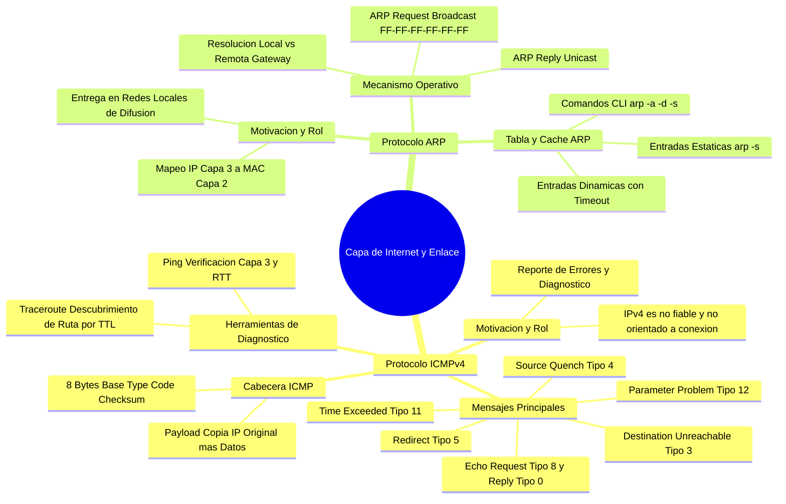
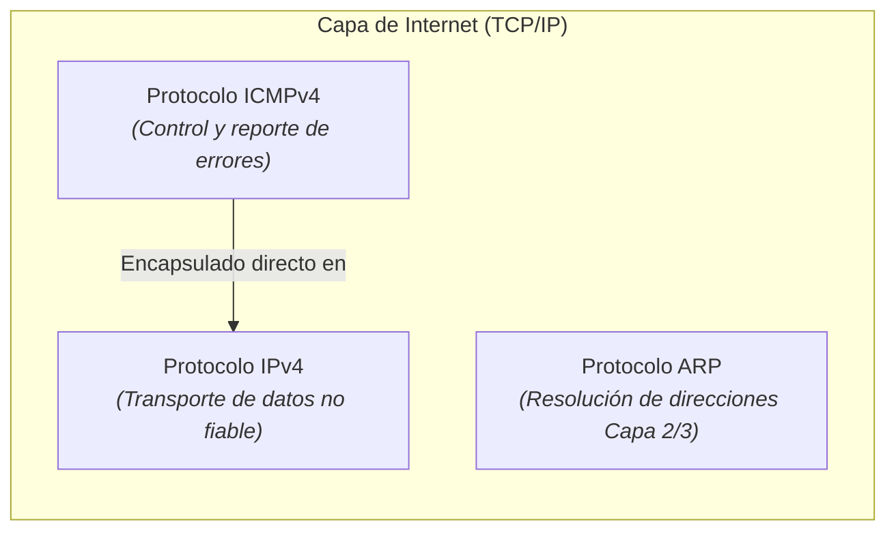
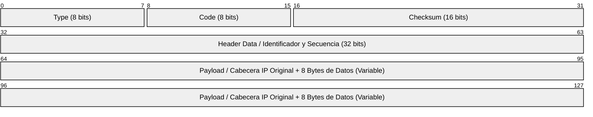
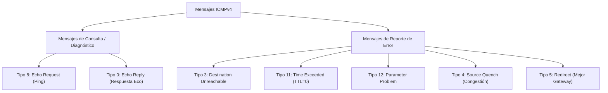
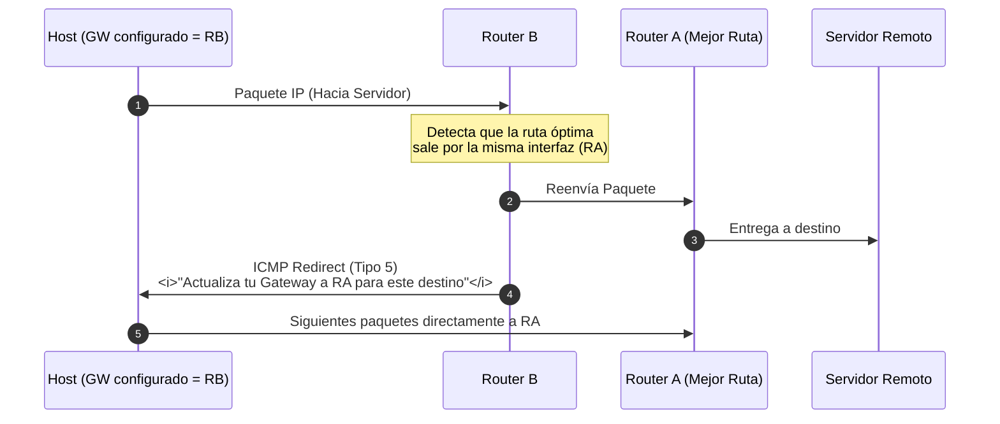
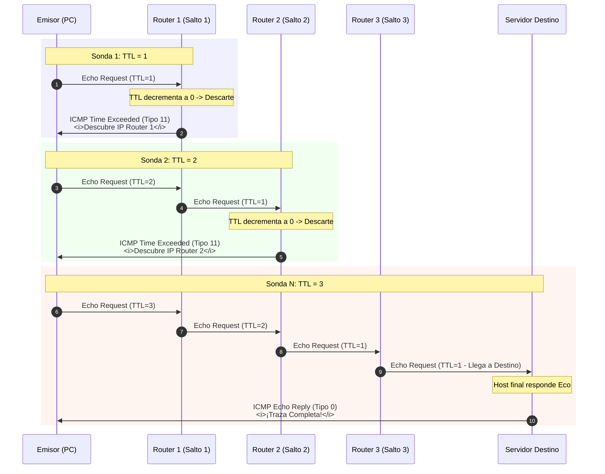
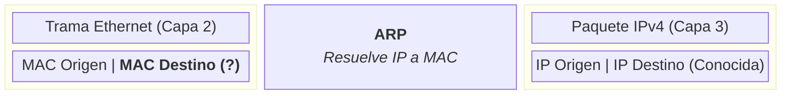
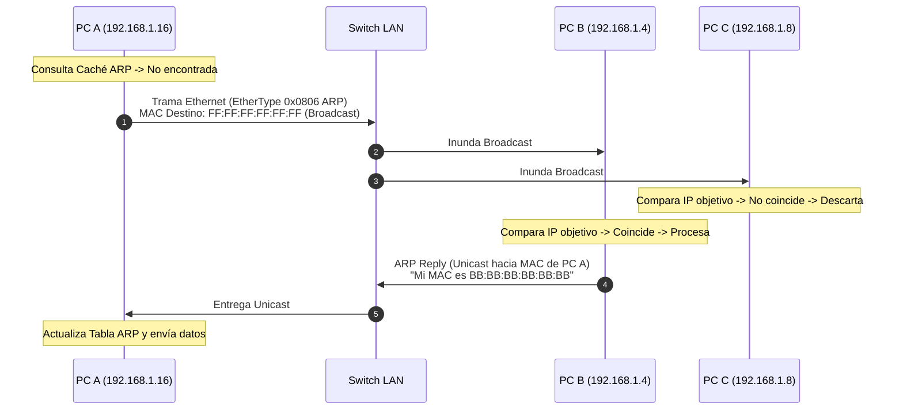
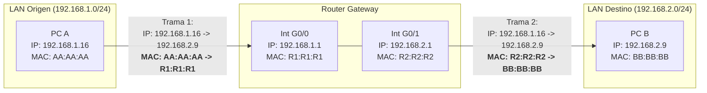

---
aliases:
subject: REDES
year: "4"
exam: PARCIAL2
unit: "3"
type: TEO
zk_type: fleeting
status: in-progress
date: 2026-08-17
source:
  - https://www.youtube.com/watch?v=8Cf6oC0uMUg&list=PLYZrqm_pzRumO_6c3u7yeHbNF9j6bkbM8&index=28
  - https://www.youtube.com/watch?v=XRniG1TsgL8&list=PLYZrqm_pzRumO_6c3u7yeHbNF9j6bkbM8&index=30
tags:
---
---
![[P2-U03-P03-RDD - Unidad 3 - Protocolo ICMP - ARP.pdf]]





---

# ICMP
## 1. 🚀 Protocolo ICMPv4: Fundamentos y Motivación

### 1.1. ¿Por qué es necesario ICMP?
- **La limitación de IPv4:** El protocolo IP es **no fiable** (*unreliable / best-effort*) y **no orientado a conexión**. Si durante el tránsito un paquete se descarta (enlace caído, TTL agotado, buffer de router saturado, host apagado o MTU excedida con bit DF activo), **IPv4 no realiza ningún reporte ni avisa al emisor**.
	- IPv4 es NO fiable
	- IPv4 no garantiza que se entregue el paquete en el destino 
	- IPv4 no informa si el paquete no llega al destino 
	- IPv4 no informa la causa por la cual un paquete no es entregado
- **El rol de ICMP (Internet Control Message Protocol - RFC 792):**
	- ICMP surgue para complementar el protocolo IPv4
		- cada vez que ttl llega a cero, se activa icmp
		- Cada vez que un paquete no es entregado se activa el protocolo ICMP
		- etc
  1. **Funcion principal:** INFORMAR la causa por la cual un paquete no llega al destinatario
	  1. **Notificación y Control de Errores:** Provee un mecanismo estandarizado para que routers y hosts notifiquen al emisor original sobre anomalías en el procesamiento o entrega de paquetes.
*ya que fue creado también es utilizado para:*
  2. **Diagnóstico y Evaluación de Red:** Permite medir tiempos de ida y vuelta (RTT), verificar accesibilidad de capa 3 y evaluar congestión.



> [!NOTE] **Ubicación y Encapsulamiento de ICMP:**
> Aunque conceptualmente opera en la **Capa de Internet (Capa 3)** junto con IPv4, los mensajes ICMP se encapsulan **directamente dentro de la carga útil de paquetes IPv4** (campo `Protocol = 1`). No utiliza TCP ni UDP.

### Caractersiticas
1. **Funcion principal:** Informa sobre la causa por la cual un paquete no llega al destinatario.
2. Puede usarse para evaluar el estado y el rendimiento de la red, así como para medir la congestión utilizando comandos como traceroute y ping.
3. Trabaja en conjunto con el protocolo IPv4 en la capa de red y pertenece a la capa de interred.
	![[Pasted image 20260828184030.png]]
4. Transporta mensajes de control de red y se encapsula en un paquete IP
5. Define diferentes tipos de mensajes ICMP para diversos propósitos.
6. Los mensajes ICMP son breves y no consumen ancho de banda significativo.
7. Hay un ICMP para cada protocolo
---

## 2. 🧩 Anatomía de la Cabecera ICMPv4

1. El mensaje se encapsula en un paquete IPv4 (campo protocolo = 1). Se hace referencia que se está encapsulando el mensaje ICMP.
![[Pasted image 20260828184353.png]]
2. Se envía al origen del paquete origen. Si el TTL llega a 0, el router construye un mensaje ICMP especial que recibe el nombre de “tiempo de vida excedido” y se lo manda al origen. Cuando el origen recibe este mensaje ICMP, lo que va a hacer es poner un TTL más largo (esto no suele pasar, salvo que sea un loop). 


La cabecera base de ICMPv4 es sumamente compacta: consta de **8 bytes** (2 palabras de 32 bits).  4 de los cuales son fijos. El resto depende del tipo de mensaje, aunque podría darse el caso de que ni estén esos otros 4 bytes


![[Pasted image 20260828184609.png]]
### 2.1. Descripción de Campos
- **Type (8 bits):** Define la categoría o función general del mensaje (ej. 0 = Echo Reply, 3 = Destination Unreachable, 8 = Echo Request, 11 = Time Exceeded). En función del tipo, se construye la cabecera
- **Code (8 bits):** Subtipo que especifica la causa exacta del error dentro de la categoría.
- **Checksum (16 bits):** Código de verificación de redundancia cíclica calculado sobre **todo el mensaje ICMP** (cabecera + datos).
	- Para saber si descartar el mensaje o no. Si está íntegro toda la información
- **Header Data o Encabezado opcional (32 bits):** Contenido dependiente del tipo (ej. *Identifier* y *Sequence Number* en mensajes de Eco).
- **Payload de Error o Datos (Carga Útil):** En los mensajes de reporte de error, ICMP incluye **la cabecera IP original completa + los primeros 8 bytes de datos** del paquete descartado. Esto permite al emisor identificar con precisión qué socket/puerto o datagrama provocó el fallo.
	-  Esto se hace para que el origen se dé cuenta cuál fue el paquete no fue entregado en el destino.

---
## 3. 📋 Tipos de  Mensajes ICMPv4


![[Pasted image 20260828190234.png]]
### 3.1. Tipo 3: Destino Inalcanzable (*Destination Unreachable*)
Generado cuando un paquete no puede ser entregado a su destino final.

| Código | Nombre / Causa                      | Generado por | Escenario Típico                                                                                                       |
| :----: | :---------------------------------- | :----------: | :--------------------------------------------------------------------------------------------------------------------- |
| **0**  | **Net Unreachable**                 |    Router    | La red de destino no existe en la tabla de enrutamiento del router.                                                    |
| **1**  | **Host Unreachable**                |    Router    | La subred existe, pero el host destino no responde (apagado o desconectado).                                           |
| **2**  | **Protocol Unreachable**            | Host Destino | El protocolo de transporte (ej. ICMP, UDP) no está soportado/activo en el destino.                                     |
| **3**  | **Port Unreachable**                | Host Destino | El puerto lógico UDP/TCP de destino está cerrado o bloqueado por firewall.                                             |
| **4**  | **Fragmentation Needed and DF set** |    Router    | El paquete excede la MTU del siguiente enlace y tiene el bit *Don't Fragment* (`DF=1`). El router descarta y notifica. |
| **6**  | **Destination Network Unknown**     |    Router    | Dirección IP configurada inválida o red no enrutable.                                                                  |

> [!TIP] **Resolución ante Código 4 (MTU y DF=1):**
> Ante un mensaje Tipo 3 Código 4, la máquina emisora debe **reducir el tamaño de sus datagramas** para ajustarse a la MTU del camino (*Path MTU Discovery*), evitando la fragmentación y optimizando el rendimiento.


pregunta sobre el codigo 4, quien es el encargado de construir este mensaje? el router
este mensaje que ip origen y que ip destino tendra?
	este mensaje se encapsulara en un paquete ip, y el mensaje tendra como origen al router que lo descarto y como destino el host que habia enviado el paquete anterior


Aplicación Específica: Diagnóstico de problemas de entrega.
### 3.2. Tipo 11: Tiempo de Vida Excedido (*Time Exceeded*)
- **Causa:** Cada vez que un router recibe un paquete, decrementa su campo `TTL` en 1. Si el TTL llega a `0`, el router **descarta el paquete** y envía un mensaje ICMP Tipo 11 Código 0 al emisor original.
- **Utilidad:** Previene que datagramas queden en bucle infinito por fallas de enrutamiento y constituye la base operativa de `traceroute`.
Aplicación Específica: Herramienta Traceroute.

### Tipo 12 : PARAMETER PROBLEM:
• Descripción General: Detecta campos inválidos en la cabecera del paquete (es raro que pase).
• Generado por: No especificado.
• Utilidad: Detectar errores en la cabecera del paquete.
• Aplicación Específica: Detección de errores en la cabecera.
### 3.3. Tipo 4: Fuente Reducida (*Source Quench*)
- **Control de Congestión Primitivo:** Cuando los buffers de memoria RAM de un router comienzan a saturarse antes de colapsar, este envía un mensaje *Source Quench* al host emisor para que disminuya su tasa de transmisión (*throttling*).
Aplicación Específica: Control de congestión.
### 3.4. Tipo 5: Redireccionamiento (*Redirect*)
- **Optimización de Gateway:** Ocurre cuando un host envía tráfico a un router $R_B$, pero $R_B$ detecta que el mejor camino hacia el destino es a través de otro router $R_A$ conectado **en la misma subred local**. $R_B$ reenvía el paquete y emite un ICMP Redirect al host para que actualice su gateway a $R_A$.


---
•Explicación:
	• Ejemplo de Envío de Datos: Supongamos que PC-1 envía datos a un servidor. El paquete se encapsula en una trama con la MAC origen y destino del router B. El router B encamina el paquete hacia el router A y luego al servidor.
	![[Pasted image 20260828193019.png]]
• Redirección Instantánea: Si el router B detecta que se está encaminando un paquete dentro
de la misma LAN, construye instantáneamente un paquete redirect ICMP. Le indica a PC-1 que actualice su Gateway, reconfigurando a router A como Gateway.
	![[Pasted image 20260828193153.png]]

• Optimización de Rutas: Para tráfico interno conviene que el Gateway sea el router A, mientras que para tráfico externo (hacia internet) conviene que sea el router B, evitando saltos innecesarios entre routers de la misma red.
• Proceso de Redirección: Cuando PC-1 envía datos a internet, el router A, al darse cuenta de
que debe ir por el router B, envía un mensaje de "redirect" a PC-1 para actualizar su Gateway
y dirigir el mensaje al router B.


### TIPO  8 y 0 : ECHO REQUEST/REPLY
* Descripción General: Se utilizan para verificar si un dispositivo está activo en la red. Son la base de la herramienta PING.
* Generado por: Máquina que realiza la verificación.
• Utilidad: Verificar la conectividad de capa 3 y estado de la red.
• Aplicación Específica: Verificación de conectividad (PING).
* Permite diagnosticar el estado, velocida y calidad de una conexion*

(*solicitud eco*) cada vez que cualquier dispositivo reciba un mensaje icmp (solicitud de eco) tiene la obligacion de enviar una repuesta (*echo reply*)

sirve para saber si esta funcionando a nivel de capa 3 
	seria la capa 1 2 y 3 del modelo osi
	y de tcp/ip hasta la capa 3 de intrared

![[Pasted image 20260828193800.png]]

en windows:
![[Pasted image 20260828193817.png]]
A ver, chicos, excelente la pregunta que me hacen: «¿Si le mando muchos ping a alguien, no puedo llegar a colapsarle el router o hacerle un ataque de denegación de servicio?»

Vamos a aclararlo bien, porque son conceptos que suelen prestarse a confusión.

> [!QUESTION] **Debate de Clase: Ataques DoS/DDoS y el "Ping de la Muerte"**
> - **Ping de la muerte (*Ping of Death*):** Ataque histórico que enviaba paquetes ICMP fragmentados cuyo reensamblado superaba los 65.535 bytes de IPv4, desbordando buffers del SO.
> - **DDoS Moderno vs Ping Flood:** Un ataque DoS real satura sockets y conexiones en **Capa de Aplicación** (HTTP, TCP SYN Flood) coordinando redes de equipos comprometidos (*Botnets / Zombies*). La analogía de clase: cuando miles de alumnos presionan `F5` al mismo tiempo durante las inscripciones universitarias, actúan involuntariamente como un enjambre zombie saturando los hilos del servidor web.

#### 1. El ping y la Capa de Red (Capa 3)

Lo que ustedes conocen como hacer ráfagas de ping (o el histórico ataque conocido como el "[[Ping de la Muerte]]" / Ping Flood) trabaja a nivel de Capa 3 (Capa de Red) usando el protocolo ICMP. Si vos mandás
una cantidad descomunal de paquetes Echo Request, lo único que lográs es saturarle el ancho de banda al enlace o consumirle ciclos de procesamiento a la CPU del router/dispositivo porque lo estás
obligando constantemente a responderte. Pero no es lo que técnicamente llamamos hoy un verdadero ataque de Denegación de Servicio (DoS / DDoS).
#### 2. ¿Cómo funciona realmente un ataque DoS / DDoS?

Un ataque de Denegación de Servicio (DoS) o Denegación de Servicio Distribuido (DDoS) se produce en capas superiores: en la Capa de Transporte (Capa 4) o en la Capa de Aplicación (Capa 7), y se basa en el
establecimiento masivo de conexiones.

¿Cómo se ejecuta en la práctica?

• Redes de Botnets / Zombies: Un atacante infecta miles de computadoras con programas maliciosos (malware o bots). Esas máquinas quedan como "zombies" esperando órdenes remotas.
• Ataque coordinado: A un día y horario determinado, el atacante activa esos miles de zombies dispersos por el mundo para que todos juntos envíen peticiones de conexión hacia el mismo servidor.
• Agotamiento de recursos del servidor: Por cada solicitud entrante, el servidor debe crear una conexión distinta, abrir un socket, asignar un hilo de ejecución (thread) y reservar memoria en su tabla de
estados.

│ La analogía del aula: Imagínense si de golpe todos ustedes empiezan a gritarme al mismo tiempo: «¡Profe! ¡Profe! ¡Profe! ¡Profe!». Yo me pongo en alerta máxima tratando de atender a cada uno, pero nadie
│ formula la pregunta final. Al final, me saturan la atención y no puedo dar clase ni escuchar a quien realmente necesita una consulta. Eso mismo le pasa al servidor: las tablas de conexión se llenan de
│ pedidos falsos y el servidor "se cae" (queda fuera de servicio).
──────
#### 3. El ejemplo clásico: El F5 en las inscripciones de la facultad

Esto que les explico tiene una correlación directa con lo que ustedes mismos viven cuando se abren las inscripciones a las materias en la facultad:

A las 8:00 AM están todos listos para hacer clic, el sistema de autogestión no responde y de la desesperación empiezan a apretar F5, F5, F5 sin parar.

¿Sirve apretar F5 muchas veces? ¡No, es muchísimo peor!

• Si el servidor no les devuelve la página, no es que "no los vio", sino que ya alcanzó su capacidad máxima de procesamiento y está colapsado atendiendo a los primeros que entraron.
• Cada vez que ustedes presionan F5, cancelan la solicitud anterior y le envían una nueva petición de conexión completa, obligándolo a abrir otro socket y a gastar más memoria.
• En ese momento, ustedes mismos están funcionando exactamente igual que una red de zombies: miles de usuarios pidiéndole recursos simultáneos a un único servidor hasta tirarlo abajo.

La recomendación técnica: Cuando un servidor está saturado, insistir con peticiones solo prolonga la caída. Lo correcto es esperar unos minutos a que el servidor termine de despachar las conexiones en
cola, se liberen hilos en la memoria y recién ahí intentar acceder.

---


## 4. 🛠️ Aplicaciones de Diagnóstico: Ping y Traceroute

### 4.1. Comando `ping` (Packet Internet Groper)
- **Mecanismo:** Envía mensajes ICMP **Echo Request (Tipo 8, Código 0)** y espera **Echo Reply (Tipo 0, Código 0)**.
- **Objetivo:** Comprobar conectividad en Capa 3 y evaluar el estado/latencia de la red mediante el RTT (*Round Trip Time*).
-
- Funcionalidades Principales:
	- • Permite diagnosticar el estado, velocidad y calidad de conexión de una red.
	- • Evalúa la conectividad de capa 3.
	- • Traduce dominios a direcciones IP a través del protocolo DNS. (Windows)
	- • Manda varios paquetes (por defecto 4 en Windows, infinitos en Linux).
- Cabecera del Paquete PING:
	- • Tipo = 8
	- Código = 0
	- Suma de verificación
	- Identificador de paquete
	- • Número de secuencia

- **Diferencias por Sistema Operativo:**
  - **Windows:** Envía por defecto 4 paquetes de 32 bytes con un identificador y número de secuencia correlativo.
  - **Linux:** Envío continuo e indefinido hasta interrumpir con `Ctrl+C` (o configurable con `ping -c <cantidad>`).

#### WIRESHARK
![[Pasted image 20260828202959.png]]
* Captura paquetes en la red para análisis.
* Identifica echo request y echo reply en la trama.
* Los paquetes tienen el mismo identificador pero varían en número de secuencia.
* Donde dice ethernet 2 es la capa de enlace. Sería la trama. Tenemos las mac´S (Src: MAC de origen. Dst: MAC de destino).
* Después tenemos el protocolo IPv4
* Después se encuentra el ICMP. Acá empieza la cabecera del protocolo ICMP:
	* • Tipo: 8
	* • Código: 0
	* • Checksum: [Correct]. El checksum dio correctamente.
	* • Datos: 32 bytes
	* • Si se suman los datos del protocolo ICMP y las cabeceras se llega a 72 bytes que es la longitud total.

![[Pasted image 20260828203534.png]]
* Protocolo IPv4 con el número 1 que indica encapsulamiento de paquete ICMP.
* Los campos "tipo" en Ethernet y "protocol" en IPv4 permiten unir capas en una arquitectura en capas.
* El comando PING utiliza paquetes echo request y echo reply encapsulados en ICMP.

---

### 4.2. Comando `traceroute` (`tracert` en Windows)
- **Objetivo:** Mapear y descubrir salto por salto todos los routers intermediarios que atraviesa un paquete hasta el destino.
	- Tiene como objetivo determinar la ruta (los routers) que sigue un paquete hasta alcanzar el destino.

**Funcionalidades Principales:**
• Muestra las direcciones IP intermedias entre el equipo local y el destino.
• Utiliza mensajes echo request y echo reply del protocolo ICMP.
• Controla hasta 30 saltos entre origen y destino.
• En Linux se denomina "traceroute".
#### Funcionamiento Paso a Paso (Manipulación del TTL)
![[Pasted image 20260829105432.png]]




![[Pasted image 20260829110406.png]]


> [!IMPORTANT] **Detalles Clave de `traceroute` / `tracert`:**
> 1. **Múltiples Sondas:** En Windows se envían **3 paquetes por salto**, mostrando tres tiempos en milisegundos para evaluar variaciones de latencia (*jitter*).
> 	1. Cada vez que se ejecuta el comando Traceroute, se envían tres paquetes "echo request" por seguridad, en caso de que se pierda alguno.
> 2. **Asteriscos (`* * *`):** Indican que el router descartó el paquete pero tiene deshabilitada/bloqueada la respuesta ICMP por políticas de firewall.
> 3. **Condición de Parada:** El bucle se detiene al recibir un **Echo Reply (Tipo 0)** del destino final o al alcanzar el límite máximo de saltos (típicamente 30).
> 4. **Estabilidad de Rutas:** En redes convergentes, las tablas de enrutamiento son estables y los paquetes siguen el mismo camino, salvo que exista balanceo de carga o caída de enlaces.


>[!note] Importante: 
>como estamos sobre una red de conmutación de paquetes, puede que los paquetes primero vayan al R1y después al R2 o que después vayan por R1 y después a R4 (o sea no siguiendo el camino que habían hecho antes). De esta forma no me daría la ruta real. Para resolver esto, los routers tienen tablas de encaminamiento y eso es lo que me guía en el camino. Pero si le configuro al router un “balanceo de carga”, lo cual permite esta situación de que los paquetes vayan por caminos diferentes entonces NO PUEDO utilizar el comando traceroute, porque nunca me daría la ruta real por la que van los paquetes.

#### en linux 
##### 1. traceroute (El equivalente directo)

Es la herramienta clásica.

• Uso básico:
traceroute google.com

• Diferencia clave con Windows (tracert):
• Windows tracert usa paquetes ICMP por defecto.
• Linux traceroute usa paquetes UDP por defecto. Si quieres que se comporte exactamente igual que Windows (usando ICMP), puedes usar el parámetro -I:
sudo traceroute -I google.com

• También permite probar puertos TCP (muy útil si los firewalls bloquean ICMP/UDP):
sudo traceroute -T -p 443 google.com


──────
##### 2. tracepath (Nativa en la mayoría de distros modernas)

Viene incluida por defecto en el paquete iputils (presente en Debian, Ubuntu, Red Hat, Fedora, Arch, etc.) y no requiere permisos de superusuario (sudo).

• Uso básico:
tracepath google.com

• Además de la ruta, detecta el MTU (Maximum Transmission Unit) en el camino.
──────
##### 3. mtr (My Traceroute - Recomendada)

Combina ping y traceroute en una interfaz interactiva en tiempo real.

• Uso básico:
mtr google.com

• Modo reporte rápido (sin interfaz interactiva):
mtr -rw google.com

──────
##### Resumen rápido

| Comando    | Características                                       | Viene preinstalado                                                     |
| ---------- | ----------------------------------------------------- | ---------------------------------------------------------------------- |
| tracepath  | Ligero, no requiere root, muestra MTU.                | Sí (en casi todas las distros).                                        |
| traceroute | Idéntico a tracert, muy configurable (UDP/ICMP/TCP).  | A veces requiere sudo apt install traceroute / dnf install traceroute. |
| mtr        | El más completo, diagnóstico continuo en tiempo real. | Suele requerir instalación (apt install mtr / dnf install mtr).        |


---

### wirshark del traceroute
• En casos de "no response found," el servidor no responde, indicando que el paquete no llegó al destino con TTL = 1.
•Capturas en Wireshark muestran respuestas de routers generando mensajes "tiempo de vida excedido."
•Se realizan tres envíos para análisis de tiempos y compensación por pérdida de paquetes.
![[Pasted image 20260829111847.png]]
• La ruta puede cambiar entre paquetes, especialmente si se produce un cambio en la red.
•Balanceo de carga en routers puede afectar la precisión del comando traceroute al permitir que los paquetes sigan caminos diferentes.

como se veria cuando llega al servidor?
el renglon en negro en vez de decir ttl diria echo reply


### traceroute vs ping
El comando PING verifica la conectividad de capa 3 y evalúa el estado de la red, mientras que el comando Tracert rastrea la ruta de un paquete a través de la red y muestra las direcciones IP intermedias. ICMP es fundamental para diagnosticar problemas en la red y garantizar la entrega confiable de paquetes en entornos IPv4. Funciona enviando paquetes "echo Request" con incrementos graduales en el valor del campo TTL (Time To Live) en la cabecera de IPv4.


# ARP
## 5. 🌐 Protocolo ARP: Resolución de Direcciones

### 5.1. La Brecha entre Capa 3 y Capa 2
- **Dirección IP (Capa 3):** Jerárquica y enrutable globalmente. Identifica la interfaz lógica del nodo.
- **Dirección MAC (Capa 2):** Plana y física (48 bits en hexadecimal). Solo tiene significado y alcance **dentro del enlace local (LAN)**.

Recordatorio:
para comunicarnos a un servidor por ejemplo fuera de nuestra red es imposible conocer la mac destino 

entonces la mac que pondra como destion es el gateway
	por eso es importante que a una maquina se le configure la mascara, la ip y la puerta de enlace, ademas de servidor dns


- **Función de ARP (Address Resolution Protocol - RFC 826):** Dado el conocimiento de una IP destino dentro de la misma subred, **averiguar dinámicamente su dirección física MAC** para construir la trama Ethernet.
	- Tiene como objetivo principal obtener la dirección MAC correspondiente a una dirección IP dentro de la misma red local (LAN)

Sus funciones clave incluyen:
	1. Resolución de Dirección IP a Dirección MAC: ARP permite que un dispositivo obtenga la dirección MAC asociada a una dirección IP específica en la misma red local. 
	2. Mantenimiento de una Tabla ARP: Cada dispositivo, como PCs, routers y servidores, mantiene una tabla ARP. Esta tabla almacena las asociaciones de direcciones IP a direcciones MAC que se han resuelto previamente. Cuando un dispositivo necesita comunicarse con otro en la misma LAN, consulta esta tabla antes de realizar una solicitud ARP para evitar realizar la resolución nuevamente.




![[Pasted image 20260829200502.png]]

primero la pc-a la va buscar en la tabla, si no lo tiene en la tabla a la mac de b, tratara de averiguarla y aca es donde empieza el protocolo ARP

---

### Funcionamiento del protocolo ARP
El proceso de ARP se inicia cuando un dispositivo necesita determinar la dirección MAC de otro dispositivo en la misma red local para enviar datos. Si no encuentra la información en su tabla ARP, se activa el protocolo ARP, que consta de dos tipos de mensajes:

**✓ ARP Request:**
1. Se encapsula en una trama Ethernet y se lanza al cable como broadcast.
2. Todas las computadoras en la LAN reciben y procesan la trama.
3. Las máquinas desencapsulan la trama y verifican si la IP de destino coincide.
4. Solo responde el dueño de la IP solicitada, enviando un ARP Reply.
5. No es eficiente debido al broadcast, ya que todas las máquinas deben procesar el mensaje.
6. Type: ARP, ya que se encapsula un protocolo ARP.
7. La información de la IP origen, destino y la MAC a averiguar se coloca en el ARP Request.
8. FUNCIONA EN LA CAPA DE EN ENLACE
	1. se contruye un ARP REQUEST y se encapusla en una trama Ethernet
![[Pasted image 20260829201252.png]]
**✓ARP Reply:**
1. Responde al ARP Request, no es broadcast, es unicast.
2. Se encapsula en una trama Ethernet de manera similar al ARP Request.
3. La máquina destino construye la respuesta con su propia dirección MAC como origen.
4. La dirección MAC del solicitante se utiliza como destino en la trama.
5. Se invierten las direcciones IP en la respuesta.
6. Type: ARP en la cabecera de Ethernet.
7. Las respuestas se almacenan en la tabla ARP para evitar broadcast en futuras solicitudes.
![[Pasted image 20260829201344.png]]
Con las respuestas de ARP, la tabla ARP se actualiza con las asociaciones de direcciones IP a direcciones MAC para futuras referencias, evitando la necesidad de realizar solicitudes ARP repetidas.

#### 5.2. Escenario 1: Comunicación en la Misma LAN (Local)



---
![[Pasted image 20260829200742.png]]
![[Pasted image 20260829200955.png]]
![[Pasted image 20260829201011.png]]
![[Pasted image 20260829201028.png]]

#### 5.3. Escenario 2: Comunicación hacia Redes Remotas (A través de Router)
![[Pasted image 20260829202751.png]]
![[Pasted image 20260829202816.png]]

> [!WARNING] **Principio Fundamental de Capa 2:**
> Las tramas de difusión (*Broadcast*) **NUNCA atraviesan un router** (los routers delimitan dominios de difusión). Por lo tanto, un host **jamás puede hacer un ARP Request por la MAC de un servidor en Internet**.

![[Pasted image 20260829202832.png]]
Cuando la IP destino pertenece a otra subred (verificado con la máscara de red):
1. El emisor consulta la tabla arp, si tiene la mac del router dirirectamente la encapsula y si no la tiene envía un **ARP Request solicitando la MAC de su Puerta de Enlace Predeterminada (*Default Gateway*)**.
2. Encapsula el paquete IP (con IPs de extremo a extremo) en una trama cuya **MAC destino es la del Router local**.
	![[Pasted image 20260829203028.png]]
3. El Router desencapsula la trama,  consulta su tabla de encaminamiento para determinar la interfaz adecuada y luego encapsula el paquete en una nueva trama, utilizando la MAC del router como origen y la MAC de la máquina(o de otro router) de destino como destino.
	1. ![[Pasted image 20260829203202.png]]
	2. Antes de encapsular el paquete, el router consulta su Tabla ARP para obtener la MAC de la máquina de destino. Si la MAC está en la tabla, se utiliza; de lo contrario, se realiza un ARP request para obtener la MAC antes de encapsular.
	3. Los router manejan tantas tablas arp como interfaces que tengan

ejemplo si tendria otro router entre medio


> [!IMPORTANT] **Invarianza IP vs Mutabilidad MAC:**
> - **Las direcciones IP (Origen y Destino)** permanecen **invariables** de extremo a extremo a lo largo de todo el viaje.
> - **Las direcciones MAC (Origen y Destino)** son **mutables** y se reescriben en cada salto (*hop-by-hop*) al atravesar routers.
> 	-  por lo tanto el protocolo ARP funciona en la capa de enlace. No llega a la capa de interred. Es decir, se encapsula en una trama ethernet. TABLAS ARP
> - *(Excepción en enlaces seriales PPP: no utilizan direcciones MAC al ser enlaces estrictamente punto a punto - analogía de la manguera).*

---
## 6. 🗄️ La Tabla / Caché ARP

Para evitar inundar la red con constantes difusiones de broadcast, todo dispositivo (hosts, servidores, interfaces de routers) mantiene una **Tabla / Caché ARP** en memoria RAM.

Las Tablas ARP son registros de información que las máquinas utilizan para asociar direcciones IP con direcciones MAC en una red.
1. Almacenamiento de Asociaciones IP-MAC: Las máquinas mantienen Tablas ARP para evitar realizar solicitudes ARP repetidas cada vez que necesitan la dirección MAC de una dirección IP específica.
2. Tablas ARP en Dispositivos: Cada dispositivo, como PCs, servidores o interfaces de routers, mantiene su propia tabla ARP, conocida como "caché ARP".
3. Crecimiento de la Tabla ARP: Con el tiempo, a medida que un dispositivo se comunica con más máquinas en la red, su tabla ARP se llena con más entradas.
### 6.1. Tipos de Entradas
1. **Dinámicas:** Aprendidas automáticamente mediante respuestas *ARP Reply*. Poseen un tiempo de vida finito (*aging timer / timeout*, típicamente de 2 a 20 minutos) y se eliminan automáticamente para mantener la consistencia si un equipo cambia de placa o IP.
2. **Estáticas:** Ingresadas manualmente por el administrador. Son permanentes (no caducan) y persisten hasta el reinicio.
3. **Predefinidas del Sistema:** Asignaciones automáticas para broadcast (`x.x.x.255` $\rightarrow$ `FF:FF:FF:FF:FF:FF`) y grupos multicast (`224.0.0.0/4` $\rightarrow$ prefijo `01:00:5E:...`).

### 6.2. Comandos de Administración ARP (CLI)
6. Opciones del Comando ARP: El comando ARP en sistemas operativos permite realizar varias operaciones en la tabla ARP, incluyendo:
	1.  -s (Static): Permite definir una entrada estática en la tabla ARP. Estas entradas no se eliminan automáticamente y se deben configurar manualmente. Ejemplo: `arp -s ip mac`.
	2.  -d (Delete): Elimina entradas de la tabla ARP. Puede eliminar entradas específicas o todas las entradas. Ejemplo: `arp -d *`. 
	3.  -a (Display): Muestra la tabla ARP actual con todas sus entradas. Ejemplo: `arp -a`.

```cmd
:: 1. Ver la tabla / caché ARP completa:
arp -a

:: 2. Agregar una entrada estática permanente:
arp -s 192.168.1.254 00-14-22-01-23-45

:: 3. Eliminar una entrada específica:
arp -d 192.168.1.254

:: 4. Vaciar / limpiar toda la caché ARP:
arp -d *
```
![[Pasted image 20260829204213.png]]
---


## 8. 📝 Síntesis para el Parcial y Puntos Clave de Evaluación

> [!IMPORTANT] **Checklist de Conceptos Clave Evaluados en Exámenes:**
> 1. **Rol de ICMP:** Protocolo auxiliar de Capa 3 para notificación de errores y diagnóstico; no hace a IP confiable ni retransmite datos perdidos.
> 2. **Encapsulamiento de ICMP:** Va directamente sobre IPv4 (`Protocol = 1`).
> 3. **Mensajes de Error ICMP:** Incluyen la cabecera IP original + 8 bytes de datos para identificar el datagrama fallido.
> 4. **Diferenciación de Códigos Tipo 3:** Código 0 (Red), Código 1 (Host), Código 3 (Puerto), Código 4 (MTU/DF=1).
> 5. **Mecánica de Traceroute:** Envía sondas con TTL incremental ($1, 2, 3...$) y descubre routers mediante mensajes ICMP *Time Exceeded* (Tipo 11). Finaliza al recibir *Echo Reply* (Tipo 0).
> 6. **Broadcast ARP:** ARP Request es de **difusión (`FF:FF:FF:FF:FF:FF`)**, mientras que ARP Reply es **Unicast**.
> 7. **Límite de Enrutamiento de ARP:** ARP solo resuelve en el enlace local. Para destinos fuera de la subred, el host resuelve la **MAC del Default Gateway**.
> 8. **Comportamiento en Tránsito:** Las direcciones IP no cambian entre extremos; las direcciones MAC cambian en cada salto de router.
> 9. **Comandos Clave:** `arp -a` (ver tabla), `arp -s` (estática), `arp -d *` (borrar), `ping` (eco ICMP) y `tracert` / `traceroute` (ruta ICMP).

