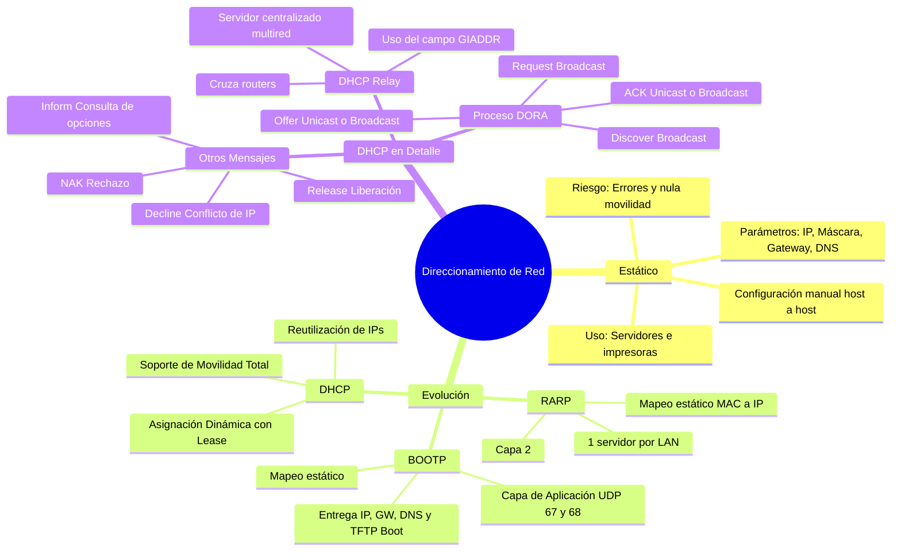
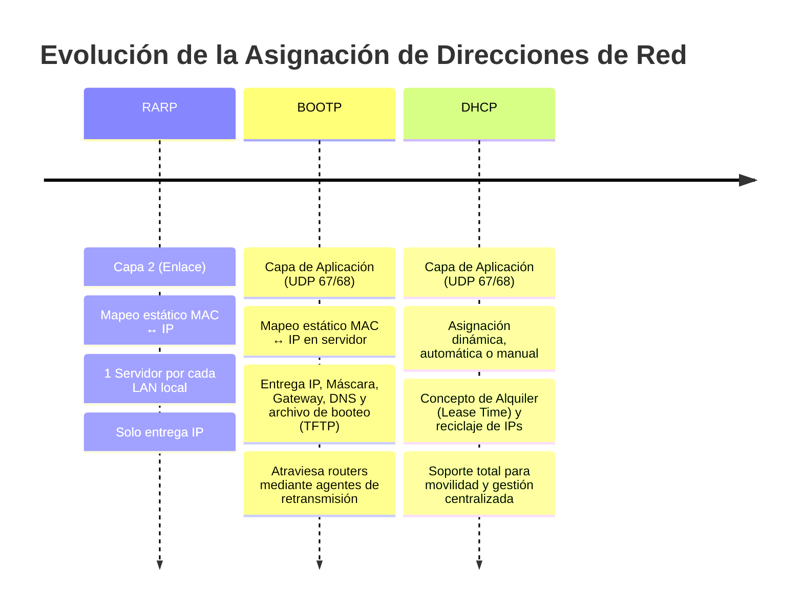
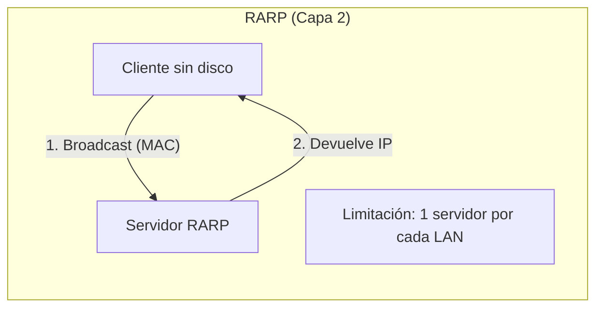
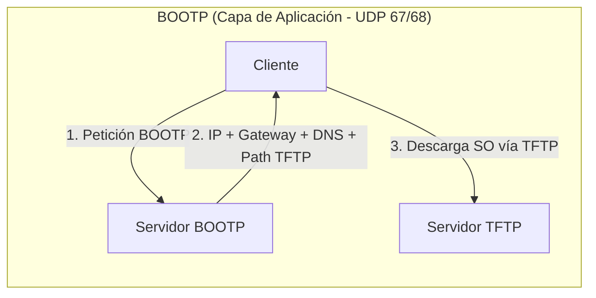
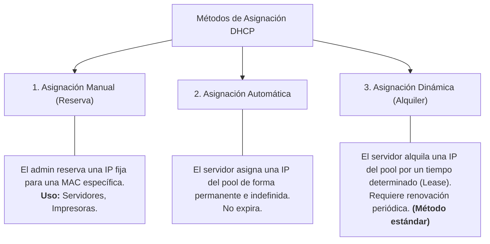
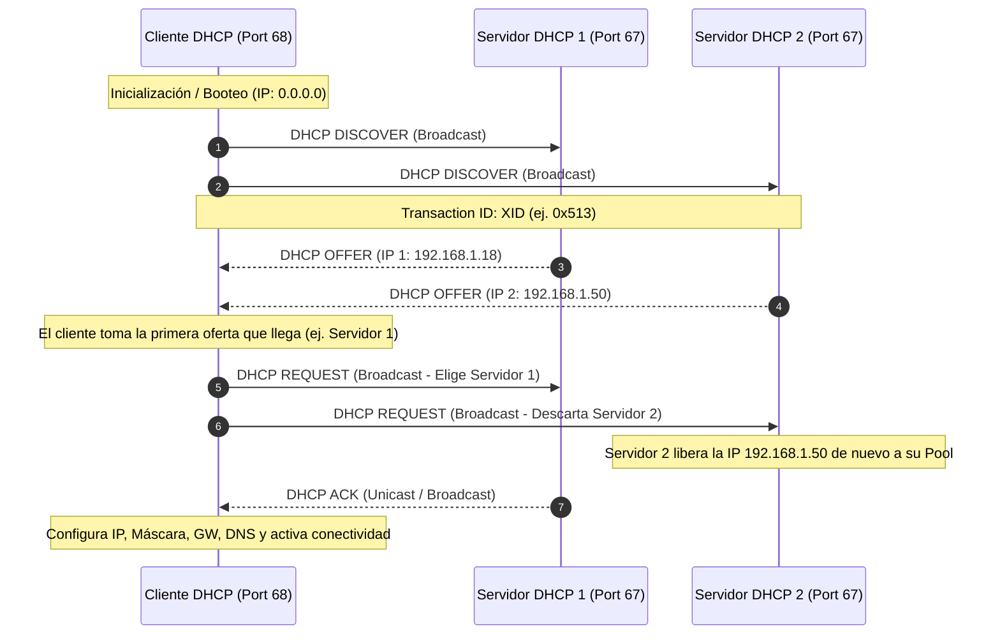
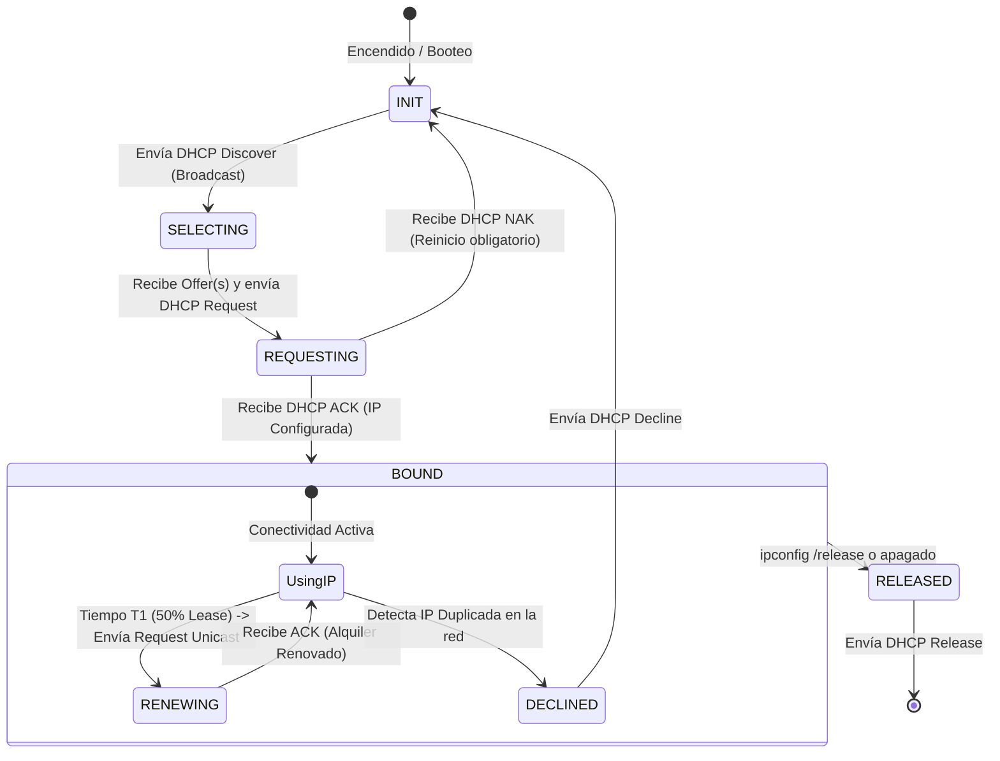
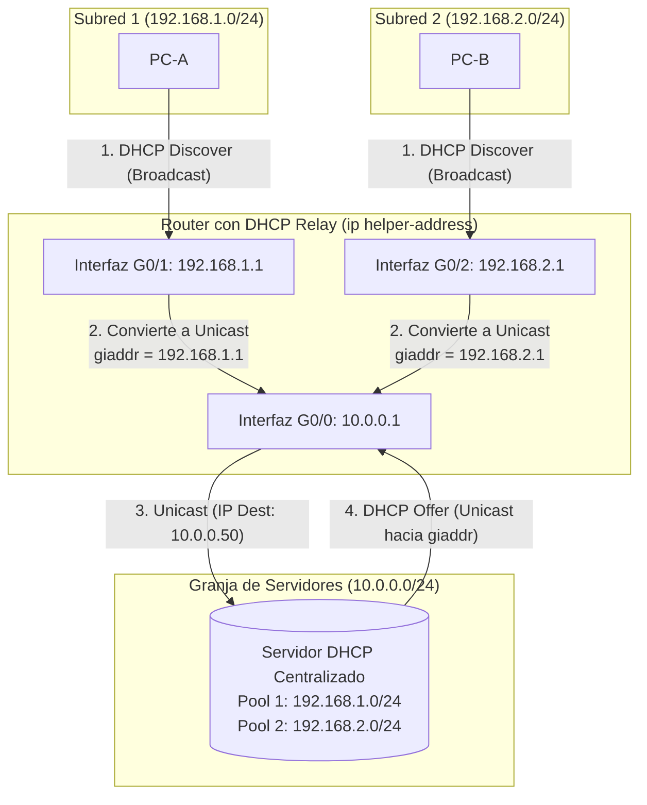

---
aliases:
subject: REDES
year: "4"
exam: PARCIAL2
unit: "3"
type: TEO
zk_type: fleeting
status: in-progress
date: 2026-08-17
source:
  - https://youtu.be/XRniG1TsgL8?si=LdwfbVyr6kiF2F6m&t=1390
tags:
---
---
![[P2-U03-P04 - RDD - Unidad 3 - DHCP.pdf]]



---
## 1. Introducción y Contexto

En clases anteriores se estudiaron protocolos fundamentales de la **Capa de Red/Internet**:
- **ARP (*Address Resolution Protocol*):** Permite averiguar la dirección física MAC a partir de una dirección lógica IP.
- **ICMP (*Internet Control Message Protocol*):** Protocolo de diagnóstico, control y reporte de errores en la red.

En esta clase se aborda el cierre de la Capa de Internet analizando cómo los dispositivos finales obtienen y gestionan su configuración de red:
1. Comparación entre **Direccionamiento Estático y Dinámico**.
2. Revisión histórica de protocolos predecesores: **RARP** y **BOOTP**.
3. Estudio exhaustivo del protocolo **DHCP**: arquitectura, ciclo de vida, mensajes, encapsulamiento y funcionamiento entre múltiples subredes con **DHCP Relay**.



---
## 2. Direccionamiento Estático vs. Dinámico

### 2.1. Direccionamiento Estático (Manual)

Consiste en que el administrador configure de forma manual e individual los parámetros de red en cada dispositivo dentro de las propiedades de TCP/IP.
* La dirección IP no cambia.
* Es adecuado para un número limitado de PCs, pero es laborioso en redes grandes.
* La dirección IP permanece constante en cada inicio de la PC.
* Ventaja: Control total para el administrador de red.
* Su utilidad depende de la empresa y se configura manualmente en las propiedades TCP/IP.


> [!NOTE] Parámetros Mínimos de Configuración TCP/IP
> Para que un host cuente con conectividad total dentro y fuera de su red local, requiere al menos 4 parámetros:
> 1. **Dirección IP:** Identificador lógico del host.
> 2. **Máscara de Subred:** Delimita los bits de red y los bits de host (el SO suele autocompletar según la clase de red, ej. `/24` para clase C, pero debe ajustarse si se utiliza *subnetting* o VLSM).
> 3. **Puerta de Enlace Predeterminada (*Default Gateway*):** Dirección IP de la interfaz del router que permite salir de la subred local.
> 4. **Servidor DNS:** Resuelve nombres de dominio (FQDN) a direcciones IP.

¿Cómo se configura? Se entra a configuración, red, propiedades, TCP/IP. Luego se debe ir a “Usar la siguiente dirección IP” y se asigna la dirección IP que se quiera, y automáticamente se le asigna la máscara. Si fuera el caso de que se manejen subredes, ahí sí se debe modificar la máscara de subred. La puerta de enlace se debe escribir por el administrador.

Se debe configurar la dirección IP y la máscara de red/subred para que tenga conectividad la PC dentro de su LAN. Para tener conectividad con otra LAN o hacia Internet, se configura la puerta de enlace y la dirección IP del servidor DNS
![[Pasted image 20260831144627.png]]
Que sucede si el administrador traslada la PC a otra area de la empresa y la conecta a otro switch

> [!WARNING] El Problema de la Movilidad en Direccionamiento Estático
> Si una PC con IP estática se traslada físicamente (por ejemplo, del 4to piso al 2do piso, conectándose a otro switch que pertenece a otra subred):
> - La IP configurada pertenecerá a la red anterior (la porción de red no coincide con el nuevo segmento).
> - El *Default Gateway* apuntará a un router inalcanzable en la nueva subred.
> - **Resultado:** El equipo pierde conectividad por completo hasta que el administrador reconfigure manualmente los 4 parámetros.

### 2.1. Direccionamiento Dinámico
* Permite asignar direcciones IP de forma automática.
* Se configura haciendo clic en "Obtener una dirección IP automáticamente".
* Utiliza protocolos como RARP, BOOTP y DHCP para asignar direcciones IP de manera dinámica.
* No es posible configurar direcciones de forma estática y dinámica simultáneamente.
### 2.2. Cuadro Comparativo: Estático vs. Dinámico

| Criterio             | Direccionamiento Estático                                                      | Direccionamiento Dinámico                                                 |
| :------------------- | :----------------------------------------------------------------------------- | :------------------------------------------------------------------------ |
| **Configuración**    | Manual host por host.                                                          | Automática al encender/conectar el host.                                  |
| **Escalabilidad**    | Inviable para medianas/grandes redes (laboratorios, *call centers*).           | Excelente (un servidor atiende miles de clientes).                        |
| **Movilidad física** | Nula; requiere intervención manual ante cada cambio de switch/subred.          | Total; el host obtiene la IP adecuada de la nueva subred automáticamente. |
| **Control de IPs**   | Control estricto y predecible de cada dispositivo.                             | Gestionado por un pool central con vencimiento temporal.                  |
| **Casos de Uso**     | Servidores, impresoras de red, interfaces de routers, switches administrables. | Computadoras de escritorio, laptops, smartphones, terminales de usuario.  |

---


## 3. Antecedentes Históricos: RARP y BOOTP

Antes del direccionamiento dinámico moderno, surgieron soluciones orientadas principalmente a **estaciones de trabajo sin disco (*diskless workstations*)**, terminales que no contaban con almacenamiento secundario para guardar su sistema operativo ni su configuración de red (ej. cajas registradoras, terminales antiguas).


### 3.1. RARP (*Reverse Address Resolution Protocol*)
- **Objetivo:** Averiguar la dirección IP a partir de la dirección física MAC grabada en la placa de red (ROM/NIC).
	- Esto es útil para dispositivos como cajas registradoras
- **Mecanismo:** El host emite un broadcast de Capa 2 con su MAC. El servidor RARP consulta una tabla de mapeo estático (`MAC ↔ IP`) cargada manualmente por el administrador y le responde con su IP.
- **Desventajas:**
  -  Requiere configurar manualmente una tabla en el servidor RARP, lo que es lento y tedioso.
  - Realiza un mapeo estático de dirección IP a MAC, en contraposición a ARP, que hace lo contrario (averiguar la MAC a partir de la dirección IP).
  - Solo proporciona la dirección IP (no suministra máscara, puerta de enlace, DNS ni archivo de arranque).
  - Opera en Capa de Enlace; los routers no reenvían tramas RARP, por lo que **se requería un servidor RARP físico en cada subred local**.
  -  Actualmente, este protocolo ya no se utiliza y fue reemplazado por el protocolo BOOTP.

### 3.2. BOOTP (*Bootstrap Protocol*)
- **Objetivo:** Superar las limitaciones de RARP para terminales sin disco y equipos en red.
- **Nivel del Modelo:** Protocolo de **Capa de Aplicación** encapsulado en segmentos UDP (puertos lógicos **67** en el servidor y **68** en el cliente).
	- ✓ Protocolo cliente/servidor que opera en la capa de aplicación del modelo TCP/IP, la más alta.
- **Mejoras clave respecto a RARP:**
	  - Entrega configuración completa: IP, máscara, default gateway, servidores DNS y el nombre/ruta del archivo del Sistema Operativo.
	  - El cliente, tras recibir los datos, descarga la imagen del SO desde un servidor **TFTP** (*Trivial File Transfer Protocol*, protocolo liviano sobre UDP).
	  - Permite utilizar agentes de retransmisión (*Relay*), logrando que un solo servidor BOOTP atienda múltiples subredes.
- **Desventajas:**
	  - Mapeo **estático y permanente**: la tabla en el servidor asocia de forma fija cada MAC con una IP.
	  -  Requiere configurar tablas manualmente en un servidor BOOTP.
	  - No permite reciclaje ni reutilización temporal de IPs. Si un equipo se traslada, el administrador debe modificar la tabla del servidor manualmente.


#### pasos del proceso BOOTP
---
1. El cliente determina su dirección MAC, generalmente leída de la ROM de la placa durante el proceso de arranque.
2. El cliente envía un mensaje BOOTP en un segmento UDP, que se encapsula en una trama y se envía a través del medio de comunicación.
3. El servidor busca la dirección MAC del cliente en su archivo de configuración y le asigna una dirección IP, además de proporcionar información como la ruta del archivo del sistema operativo a descargar.
4. El servidor completa los campos del mensaje BOOTP y lo envía de vuelta al cliente.
5. El cliente obtiene su dirección IP asignada.
6. El cliente descarga el sistema operativo desde un servidor TFTP (Trivial File Transfer Protocol), que es un protocolo ligero que funciona sobre UDP.
7. El cliente carga el sistema operativo y se inicializa.
 
## 4. Protocolo DHCP (*Dynamic Host Configuration Protocol*)

DHCP es una evolución directa y compatible de BOOTP que incorpora **asignación dinámica de direcciones IP** y gestión centralizada.

Es una forma eficiente de asignar direcciones IP y otros parámetros de configuración a
dispositivos en una red, corre sobre la capa de Aplicación tcp/ip.

![[Pasted image 20260831150809.png]]

### 4.1. Conceptos Fundamentales
- **Modelo Cliente-Servidor:** Los clientes solicitan parámetros y el servidor los asigna desde un conjunto de direcciones configuradas (**Pool de Direcciones** o *Ámbito/Scope*).
- 2. Proporciona una administración centralizada y sencilla de las direcciones IP en la red, sin necesidad de mapeos estáticos.
- **Alquiler / Concesión (*Lease Time*):** La dirección IP no se otorga permanentemente, sino que se "presta" por un tiempo determinado (por defecto, 24 a 48 horas).
- **Reutilización de Direcciones:** Cuando un equipo se apaga o libera su IP, esta regresa al pool y queda disponible para asignarse a otro host.
- 4. Facilita cambios y traslados de dispositivos en la red, ya que las direcciones IP se asignan automáticamente.
- 5. Ofrece una amplia gama de parámetros de configuración, como la dirección IP, máscara de subred, puerta de enlace, DNS, entre otros.
- 6. Se ejecuta sobre UDP en los puertos 67 y 68.
- 7. DHCP es un servidor con estado, significa que cada vez que asigna una dirección IP, el servidor registra en su memoria la asignación IP - MAC, para controlar y saber que IP le dio a cada cliente y la MAC del cliente, hasta que el cliente libera la dirección y desaparece de la tabla, ya no la considera. No es estática la tabla.
- **Ubicación en la Infraestructura:**
  - Redes hogareñas: Embebido directamente en el router/módem Wi-Fi.
  - Redes corporativas: Implementado en servidores dedicados (Windows Server, Linux/ISC-DHCP, etc.) o routers de borde.

### 4.2. Métodos de Asignación de Direcciones en DHCP



---
## 5. El Proceso DORA y Ciclo de Vida de DHCP
![[Pasted image 20260831174705.png]]

El intercambio estándar para la obtención de configuración consta de 4 pasos (conocido por el acrónimo **DORA**):


![[Pasted image 20260831174722.png|700]]
### 5.1. Detalle Paso a Paso de DORA

1. **DHCP Discover (D):**
   - El cliente no posee IP configurada; envía un mensaje en **Broadcast** a toda la red para localizar servidores DHCP activos.
   -  Este mensaje contiene un **Transaction ID (XID)** aleatorio para asociar todas las respuestas posteriores.
	   -  IP origen: 0.0.0.0. Esto es porque todavía no está asignada una dirección IP
	   -  IP destino: 255.255.255.255: es un mensaje broadcast (busca si hay un servidor DHCP).
	   -  Mac Destino: Todas FF porque es un broadcast
	   -  MAC Origen: MAC-Cliente
1. **DHCP Offer (O):**
   - Los servidores DHCP disponibles responden al mensaje de descubrimento con una oferta de configuracion (IP, Mascara, Gateway, tiempo de alquiler, etc), reservando transitoriamente una IP libre de su pool y envían una oferta de configuración al cliente incluyendo el mismo Transaction ID.
	   -  IP origen: IP del servidor.
	   -  IP destino: Puede ser que vaya IP ofrecida (la que le ofrece el servidor, por más que no esté configurado) o Broadcast. Dependiendo de cada Sistema operativo que este configurado en la máquina
	   -  MAC origen: MAC del servidor.
	   -  MAC Destino: Si va la IP ofrecida, va
	   - la MAC del cliente. Si va el broadcast, va una MAC broadcast
1. **DHCP Request (R):**
   - El cliente selecciona una oferta (generalmente la primera recibida).
   - y solicita formalmente al servidor DHCP que le asigne dicha configuración.
   - Envía un mensaje **Broadcast** notificando la IP solicitada e incluyendo el identificador del servidor elegido (*Server Identifier*).
   - *¿Por qué es Broadcast?* Para que los demás servidores que enviaron ofertas se enteren de que no fueron elegidos y liberen esas IPs inmediatamente a sus respectivos pools.
   - También, es utilizado para cuando el cliente se da cuenta que se le está por “vencer el alquiler”, es decir, se está por quedar sin conectividad, envía este mensaje solicitando una extensión del tiempo del alquiler (permite tener una PC encendida mucho tiempo con la misma IP)
1. **DHCP ACK (*Acknowledgment*) (A):**
   -  El servidor confirma la configuración ofrecida al cliente. Una vez que el cliente recibe este mensaje, puede utilizar la dirección IP asignada.
	   - El servidor elegido valida que la dirección continúe disponible, confirma formalmente la concesión y transmite los parámetros de red y el tiempo de alquiler (*Lease Time*).

---
>[!note]  mac e ip
>Siempre vemos una relación entre la dirección MAC y la dirección IP: o Si la dirección de origen IP es unicast, la MAC origen también lo es o Si la IP destino es broadcast, va una MAC de broadcast en el destino.
### 5.2. Otros Mensajes del Protocolo DHCP



Además de estos mensajes, DHCP también incluye otros tipos de mensajes como DHCP Decline (el cliente informa al servidor que la dirección IP ofrecida ya está en uso.), DHCP Release (el cliente informa al servidor que libera la dirección IP y cancela el tiempo restante de alquiler), DHCP Inform (el cliente consulta al servidor la configuración local), y DHCP Nack (el servidor le niega al cliente la asignación de los parámetros IP), que se utilizan para gestionar situaciones especiales o problemas en la asignación de direcciones IP.
- **DHCP NAK (*Negative Acknowledgment*):** Enviado por el servidor cuando la IP solicitada ya no es válida o está en conflicto. Fuerza al cliente a reiniciar el proceso DORA desde el Discover.
- **DHCP Decline:** Si el cliente, antes de usar la IP asignada, realiza una verificación (ej. ARP gratuito) y detecta que otro dispositivo ya está usando esa IP, le envía un `Decline` al servidor para que marque la IP como en conflicto y le ofrezca otra.
- **DHCP Release:** El cliente informa al servidor que renuncia voluntariamente a la dirección IP asignada para que vuelva al pool disponible (ej. al ejecutar `ipconfig /release`).
- **DHCP Inform:** Mensaje utilizado por un cliente que ya posee una IP configurada estáticamente pero requiere obtener parámetros adicionales del servidor DHCP (ej. lista de servidores DNS, nombre de dominio).

---

### 5.3. Proceso de Renovación del Alquiler (*Lease Renewal*)

> [!IMPORTANT] ¿Qué ocurre cuando el tiempo de alquiler expira?
> Un equipo encendido no pierde conectividad abruptamente ni reinicia todo el ciclo DORA.
> 1. Al alcanzar aproximadamente el **50% del tiempo de alquiler (T1)**, el cliente envía un **`DHCP Request` en Unicast** directamente al servidor que le otorgó la concesión solicitando una extensión.
> 2. El servidor responde con un **`DHCP ACK`**, reiniciando el contador de alquiler.
> 3. Si el servidor no responde, al alcanzar el **87.5% (T2)**, el cliente intenta contactar a cualquier servidor DHCP disponible mediante un `DHCP Request` en Broadcast.

![[Pasted image 20260831174943.png]]

## TIPOS DE MENSAJES EN DETALLE
Los protocolos de red operan en cascada según la pila TCP/IP. A continuación se analiza la estructura exacta de cabeceras en cada etapa del proceso DORA:
```
┌─────────────────────────────────────────────────────────────────────────────┐
│ Trama Ethernet (Capa 2 - Enlace)                                           │
│ [ MAC Destino: FF:FF:FF:FF:FF:FF ] [ MAC Origen: 00:0c:29:ab:69:a1 ]       │
├─────────────────────────────────────────────────────────────────────────────┤
│ Paquete IPv4 (Capa 3 - Internet)                                            │
│ [ IP Origen: 0.0.0.0 ]            [ IP Destino: 255.255.255.255 ]          │
├─────────────────────────────────────────────────────────────────────────────┤
│ Segmento UDP (Capa 4 - Transporte)                                          │
│ [ Puerto Origen: 68 (Cliente) ]   [ Puerto Destino: 67 (Servidor) ]         │
├─────────────────────────────────────────────────────────────────────────────┤
│ Mensaje DHCP / BOOTP (Capa 5/7 - Aplicación)                                │
│ [ OpCode: 1 (Request) ] [ Transaction ID: 0x00000513 ]                     │
│ [ Client IP (ciaddr): 0.0.0.0 ]   [ Your IP (yiaddr): 0.0.0.0 ]            │
│ [ Next Server IP: 0.0.0.0 ]       [ Relay Agent IP (giaddr): 0.0.0.0 ]     │
│ [ Client MAC (chaddr): 00:0c:29:ab:69:a1... ]                               │
│ [ Opciones DHCP: Tipo de Mensaje = Discover, Parámetros solicitados ]        │
└─────────────────────────────────────────────────────────────────────────────┘
```

### DHCP Discover (cliente)
![[Pasted image 20260831180024.png]]
1. DHCP Discover (Cliente):
2. Capa de aplicación.
3. Se encapsula en un segmento UDP.
4. Segmento encapsulado en un paquete IPv4.
5. Paquete encapsulado en una trama Ethernet.
6. Puertos: Origen 68 (cliente), Destino 67 (servidor).
7. IP destino: 255.255.255.255 (broadcast).
8. IP origen: 0.0.0.0 (Host en proceso de inicio).
9. MAC origen: MAC del cliente.
10. MAC destino: FF:FF:FF:FF:FF:FF (broadcast).

> Fíjense cómo es el encapsulamiento: el mensaje **DHCP Discover** pertenece a la capa de aplicación de la pila de protocolos TCP/IP. Este mensaje se va a encapsular primero en un **segmento UDP**. Como es un mensaje que construye el cliente y va dirigido hacia un servidor, a nivel de capa de transporte tenemos: **puerto origen 68** (porque los clientes DHCP escuchan y trabajan en el puerto 68) y **puerto destino 67** (porque los servidores DHCP escuchan en el puerto 67).
>
> A su vez, todo ese segmento UDP se va a encapsular en un **paquete IP**. Y fíjense en las IPs acá, por eso se los muestro tan en detalle: en la **IP origen va la 0.0.0.0**, IPs reservadas es la que se autoasigna una máquina cuando está booteando y todavía no tiene una dirección IP configurada. Y en la **IP destino va la 255.255.255.255**, que es un broadcast, ¿por qué? Porque la máquina no sabe cuál es la IP del servidor DHCP, entonces se lo manda a todo el mundo, a todos los dispositivos de la red local.
>
> Todo ese paquete IP, a su vez, se encapsula en una **trama Ethernet**. En la trama vamos a tener como **MAC origen** la dirección física de la placa de red de la máquina cliente, y como **MAC destino** todos unos en hexadecimal, es decir, **FF:FF:FF:FF:FF:FF**, que es la dirección física de broadcast.
>
> Y hay algo importantísimo que les quiero aclarar acá: **siempre existe una correspondencia directa entre el tipo de dirección IP y el tipo de dirección MAC**. Si la dirección IP es unicast, la MAC origen o destino también va a ser unicast; si la IP es de broadcast (como en este caso, 255.255.255.255), en la trama obligatoriamente va una MAC de broadcast (FF:FF:FF:FF:FF:FF); y si la IP fuera de multicast, acá debería ir una MAC de multicast. Siempre hay esa correspondencia exacta.


![[Pasted image 20260831180052.png]]
> acá tenemos la trama Ethernet, adentro el paquete IP, adentro el segmento UDP y adentro todo el mensaje DHCP Discover. A nivel de paquete IP vemos en origen la 0.0.0.0 y en destino la 255.255.255.255. En el segmento UDP tenemos puerto origen 68 y puerto destino 67. Y cuando entramos al protocolo DHCP propiamente dicho, nos aclara qué tipo de mensaje es: nos dice que es una solicitud ('Boot Request', que es un número 1, mientras que las respuestas son normalmente un número 2).
>
> Miren además el **Transaction ID** (que en esta captura es por ejemplo el `0x00000513`): este ID de transacción es fundamental porque todos los mensajes que siguen —el Offer, el Request y el ACK— van a tener que compartir exactamente este mismo número de transacción para que el servidor y el cliente puedan distinguir y seguirle la pista a esta máquina entre todas las que estén encendiéndose al mismo tiempo.
>
> Por último, fíjense que hay una serie de campos adentro del mensaje DHCP que están todos en cero: la dirección IP del cliente ('Client IP Address') está en 0.0.0.0 porque todavía no tiene IP asignada, y 'Your IP Address' también está en cero porque recién estamos en el Discover y el servidor todavía no le ofreció ninguna. En el Discover la gran mayoría de los campos viajan en cero y de a poco se van a ir completando a medida que se intercambien el Offer, el Request y el ACK. Lo único que viaja completo desde el inicio es la **dirección MAC del cliente** (para que el servidor sepa a quién responderle), el tipo de mensaje indicando que es un DHCP Discover, y las opciones solicitando los parámetros de red."

### 2. DHCP Offer (Servidor):
![[Pasted image 20260831180313.png]]
• Puertos invertidos respecto al Discover.
• Puertos: Origen 67 (servidor), Destino 68 (cliente).
• IP destino: IP ofrecida o Broadcast.
• IP origen: IP del servidor.
•Trama origen: MAC del servidor.
•Trama destino: MAC del cliente o Broadcast.
•Preferible usar la MAC del cliente para eficiencia.
![[Pasted image 20260831180634.png]]
•Trama destino: Puede ir la MAC del cliente (es lo ideal) o la MAC de broadcast.
	o Si se coloca la IP de broadcast debe estar la MAC de broadcast y si se coloca la IP ofrecida, se coloca la MAC del cliente.
	o Es más rápido que se coloque la MAC del cliente porque si se manda un broadcast se obliga a que todas las máquinas de la LAN desencapsulen a nivel de trama y paquete, lleguen a los puertos para determinar si el mensaje DHCP va dirigido a ellos o no. Se hace perder tiempo a la máquina.
•¿Cómo distingue una computadora que la IP ofrecida es para ella?
	o Si la PC está booteada, ignora el paquete. Es decir, si la compu ya está prendida y está andando es porque ya tiene una IP entonces va a ignorar ese mensaje “offer” que le llegue porque ella no solicitó nada.
	o Si hay computadoras múltiples que estén en el proceso de booteo, se fijan en el ID de transacción.
### 3. DHCP Request (Cliente):
• Puertos: Origen 68 (cliente), Destino 67 (servidor).
• IP destino: 255.255.255.255 (broadcast).
• IP origen: 0.0.0.0 o IP del cliente si renueva.
• MAC origen: MAC del cliente.
• MAC destino: Broadcast si no hay conexión o MAC del cliente si renueva.
![[Pasted image 20260831180728.png]]

### 4. DHCP ACK (Servidor a Cliente):
• Puertos: Origen 67 (servidor), Destino 68 (cliente).
• IP destino: IP del cliente (confirmación).
• IP origen: IP del servidor.
• Trama origen: MAC del servidor.
• Trama destino: MAC de la máquina cliente.
![[Pasted image 20260831180757.png]]

### 6.1. Comparativa de Cabeceras por Tipo de Mensaje

| Parámetro | DHCP DISCOVER | DHCP OFFER | DHCP REQUEST | DHCP ACK |
| :--- | :--- | :--- | :--- | :--- |
| **Emisor $\rightarrow$ Receptor** | Cliente $\rightarrow$ Servidores | Servidor $\rightarrow$ Cliente | Cliente $\rightarrow$ Servidores | Servidor $\rightarrow$ Cliente |
| **Puerto UDP Origen** | **68** | **67** | **68** | **67** |
| **Puerto UDP Destino** | **67** | **68** | **67** | **68** |
| **IP Origen** | `0.0.0.0` (sin IP) | IP del Servidor | `0.0.0.0` (sin IP aún) | IP del Servidor |
| **IP Destino** | `255.255.255.255` (Bcast) | IP ofrecida o Bcast (*) | `255.255.255.255` (Bcast) | IP asignada o Bcast (*) |
| **MAC Origen** | MAC de la placa cliente | MAC del servidor/router | MAC de la placa cliente | MAC del servidor/router |
| **MAC Destino** | `FF:FF:FF:FF:FF:FF` | MAC cliente o Bcast (*) | `FF:FF:FF:FF:FF:FF` | MAC cliente o Bcast (*) |
| **Transaction ID** | `XID` generado | Mismo `XID` | Mismo `XID` | Mismo `XID` |
| **`yiaddr` (*Your IP*)**| `0.0.0.0` | IP que se ofrece | `0.0.0.0` | IP confirmada |

> [!TIP] (*) Broadcast vs. Unicast en el OFFER y ACK
> La RFC define que el Offer y el ACK pueden enviarse como Unicast (dirigidos a la MAC del cliente) o como Broadcast. Esto depende de la implementación del *stack* TCP/IP del Sistema Operativo. En sistemas modernos se prefiere Unicast para no sobrecargar de tráfico a las demás terminales de la LAN.

## Parametro configurables en DHCP
Además de la dirección IP, DHCP permite aprovisionar múltiples parámetros de configuración:
* Dirección IP
- **Opción 1:** Máscara de subred (*Subnet Mask*).
- **Opción 3:** Puerta de enlace predeterminada (*Router / Default Gateway*).
- **Opción 6:** Servidores de nombres de dominio (*Domain Name Server - DNS*).
- **Opción 15:** Nombre de dominio de la red local (*Domain Name*).
- **Opción 26:** Tamaño de MTU de la interfaz.
- • Servidor TFTP: por si quiero descargar alguna transferencia de mensaje, configuración o algún sistema operativo.
- **Opción 42:** Servidor de sincronización de hora (*NTP Server*).
- • Servidores SMTP: servidor de correo.
- **Opción 51:** Tiempo de concesión de la dirección IP (*IP Address Lease Time*).
- **Opción 54:** Identificador del servidor DHCP (*Server Identifier*).
- **Opción 66/67:** Nombre y ruta del archivo de booteo / Servidor TFTP (para arranque por red PXE).

## 7. DHCP Relay Agent (Agente de Retransmisión)
Función: Permite un único servidor DHCP para múltiples LAN. Facilita la configuración de dispositivos en diferentes redes desde un solo servidor y elimina la necesidad de servidores 
DHCP dedicados para cada LAN.

• ¿Qué sucede si el cliente y el servidor están en diferente LAN? 
	• Necesidad de DHCP relay 
	• Facilita la configuración de dispositivos ubicados en diferentes LAN 
	• Elimina la necesidad de poseer un servidor DHCP en cada LAN 
	• Se configuran varios rangos de direcciones IP en el servidor 
	• Un router o servidor con funciones “DHCP relay” escucha broadcasts y los reenvía como mensajes unicast al servidor DHCP


### 7.1. El Problema del Enrutamiento de Broadcasts
Por diseño, los routers **delimitan dominios de broadcast** y no reenvían paquetes destinados a `255.255.255.255` hacia otras redes. Por lo tanto, un `DHCP Discover` emitido en la LAN 1 nunca llegaría a un servidor DHCP ubicado en otra subred o en una "granja de servidores".

configuracion DHCP RELAY:
	•Se establecen varios rangos de direcciones IP en el servidor DHCP, uno por cada área o subred en la empresa
	•Router o servidor con función "DHCP Relay" escucha broadcasts y los reenvía como mensajes unicast al servidor DHCP.

ejemplo
![[Pasted image 20260831182156.png]]

![[Pasted image 20260831182646.png]]

### 7.2. PASOS
1. PC-D envía DHCP Discover (broadcast) en LAN 2.
2. **Recepción:** El router (o servidor configurado como agente de retransmisión) escucha el `DHCP Discover` de broadcast en su interfaz local conectada a la subred del cliente.

3. **Inyección de `GIADDR`:** El router completa el campo **`GIADDR` (*Gateway / Relay IP Address*)** del mensaje DHCP con la dirección IP de su propia interfaz en esa subred de origen (ej. `192.168.1.1`).
	1. 	1. Como sabe el servidor dhcp de que rango tomar las direcciones tanto para lan 1 o lan 2:
4. **Conversión a Unicast:** El router encapsula el mensaje en un paquete Unicast dirigido directamente a la IP del servidor DHCP central.
5. **Selección del Pool:** El servidor DHCP recibe el paquete, examina el campo `GIADDR` y, basándose en la subred a la que pertenece esa IP, selecciona una dirección libre del **pool correspondiente a dicha subred**.
6. **Respuesta:** El servidor devuelve el `DHCP Offer` en Unicast al router (Relay Agent), y este lo transmite hacia la subred del cliente.
7. Cliente responde con DHCP Request al servidor vía el router.
8. DHCP ACK final confirmando la asignación de IP.

> [!TIP] Ventaja Arquitectónica
> Permite centralizar la administración de direccionamiento en un único servidor DHCP (o un par redundante) para toda la organización, sin importar la cantidad de pisos, edificios o VLANs que existan.

---
### dinamismo
• Administrador solo configura el servidor DHCP.
• Router actúa como intermediario, transformando broadcasts en mensajes unicast dirigidos al servidor DHCP.
• Cambios en la topología, como mover PC-B a otra LAN, son manejados dinámicamente sin necesidad de ajustes adicionales.

## 8. Comandos de Diagnóstico Práctico (`ipconfig`)
![[Pasted image 20260831182812.png]]
En sistemas operativos Windows, la consola de comandos provee herramientas directas para interactuar con el cliente DHCP:

```bash
# Muestra la configuración básica (IP, máscara y puerta de enlace)
ipconfig

# Muestra toda la configuración detallada (MAC, Servidores DNS, Servidor DHCP, Fechas de concesión)
ipconfig /all

# Libera la dirección IP asignada enviando un mensaje DHCP Release al servidor (la IP pasa a 0.0.0.0)
ipconfig /release

# Solicita una nueva configuración al servidor DHCP iniciando el proceso de solicitud
ipconfig /renew
```

> [!CAUTION] Cuidado al experimentar en entornos de producción
> Ejecutar `ipconfig /release` corta la conectividad de red de forma inmediata hasta que se ejecute exitosamente `ipconfig /renew` o el adaptador se reinicie.
