---
aliases:
subject: REDES
year: "4"
exam: PARCIAL2
unit: "4"
type: TEO
zk_type: fleeting
status: in-progress
date: 2026-08-17
source:
  - https://www.youtube.com/watch?v=nJy3_WXO9Z8&list=PLYZrqm_pzRumO_6c3u7yeHbNF9j6bkbM8&index=29
  - https://www.youtube.com/watch?v=N8O2xUNpQbc&list=PLYZrqm_pzRumO_6c3u7yeHbNF9j6bkbM8&index=26
  - https://www.youtube.com/watch?v=h4Bl7r2KpEA&list=PLYZrqm_pzRumO_6c3u7yeHbNF9j6bkbM8&index=27
tags:
---
---
![[P2-U04-P05 - RDD - Unidad 4 - Encaminamiento.pdf]]


---
## 1. Introducción y Ubicación en la Pila TCP/IP 

### 1.1. Las Tres Funciones de la Capa de Internet

La profesora abre la clase recordando que se ha cerrado la **Unidad 3 (Direccionamiento IP)** y que nos encontramos de lleno en la **Capa de Interred**.  y tmb seria capa 3 del modelo osi RED


Esta capa tiene tres responsabilidades troncales:
1. **Direccionamiento:** Asignación lógica de identificadores únicos a interfaces de red (IPv4 / IPv6, máscaras, subredes). *(Ya estudiado)*.
2. **Encaminamiento (Routing):** Determinación del camino óptimo que deben atravesar los paquetes para viajar desde un origen hacia un destino a través de múltiples redes intermedias. *(Tema troncal de esta y sucesivas clases)*.
	1.  los switches no se encaminan porque no llegan a esta capa
	2.  Se refiere a la determinación de la ruta que un paquete de datos debe seguir en una red para llegar desde su origen hasta su destino.
3. **Control de Congestión:** Mecanismos para evitar que los enlaces y routers de la red se saturen de tráfico.

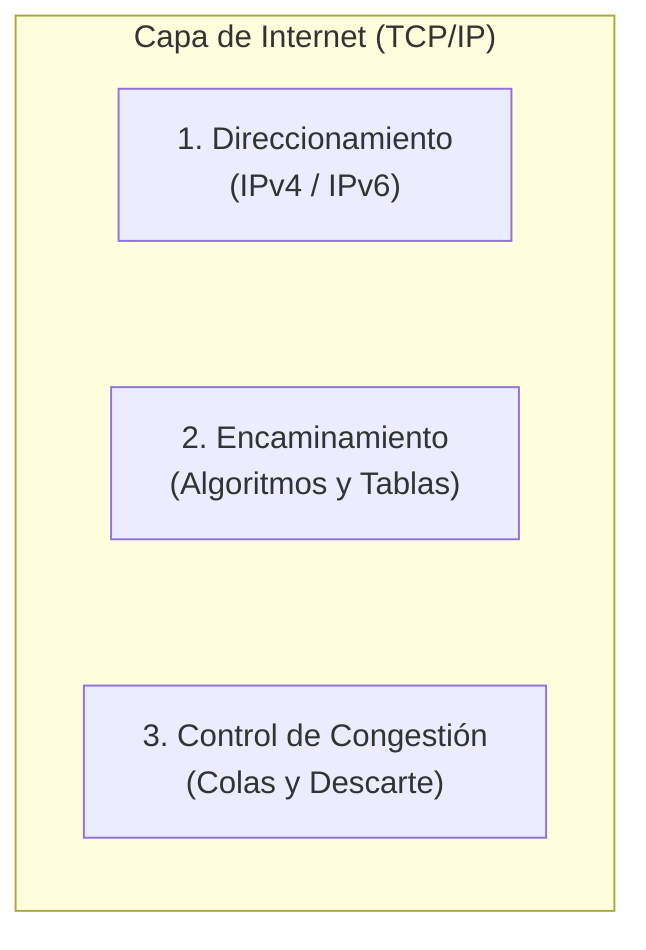

### 1.2. El Encaminamiento como Teoría de Grafos
Para formalizar y resolver el problema del encaminamiento, la topología de la red se modela matemáticamente mediante la **teoría de grafos**:
- **Nodos:** Representan a los **routers** (o conmutadores de Capa 3).
- **Arcos / Aristas:** Representan los **enlaces físicos de comunicación** entre routers.
- **Pesos en los arcos:** Representan el **costo o métrica** asociada al enlace.


### 1.3 objetivo del encaminamiento
Objetivo del Encaminamiento: Encontrar la mejor ruta desde un punto de origen hacia un punto de destino en la red. La elección de la ruta puede basarse en diferentes criterios, como:
*  Mínimo Costo: Encontrar la ruta más económica en términos de recursos de red, como ancho de banda o distancia.
*  Mínimo Retardo: Minimizar el tiempo que lleva que los paquetes viajen desde el origen hasta el destino.
*  Criterio Administrativo: Seguir políticas o reglas administrativas definidas por los administradores de la red, como preferencias de ruta específicas.
> [!QUOTE] Analogía Docente: El camino a la Facultad
> *"Cuando ustedes salen de sus casas o departamentos y van hacia la facultad, no tienen una sola calle o un único camino: tienen múltiples opciones. Pueden elegir ir por la avenida más directa, tomar la Circunvalación aunque hagan el doble de kilómetros porque van más rápido, o evitar calles que se congestionan.
> El encaminamiento consiste exactamente en eso: habiendo múltiples caminos posibles para ir de un origen a un destino, determinar cuál es la mejor ruta a seguir. Pero no al azar ni al voleo, sino aplicando una lógica estricta en función de criterios bien definidos (mínimo retardo, menor costo, políticas del administrador). Esa ruta elegida es la que se instalará en la **tabla de encaminamiento** del router."*

## 2. Paradigmas de Transporte: Redes de Circuitos Virtuales vs. Redes de Datagramas 
Para comprender cómo encaminan los routers, es indispensable diferenciar los dos grandes paradigmas de transporte en redes de paquetes, contrastándolos con la telefonía tradicional.

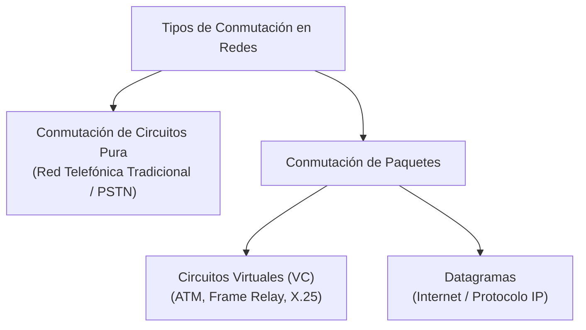

### 2.1. Conmutación de Circuitos Pura vs. Circuitos Virtuales (VC)

repaso de circuitos:

| Característica                | Conmutación de Circuitos Pura (Telefonía / PSTN)                                                                                                               | Redes de Circuitos Virtuales (VC)                                                                                                             |
| :---------------------------- | :------------------------------------------------------------------------------------------------------------------------------------------------------------- | :-------------------------------------------------------------------------------------------------------------------------------------------- |
| **Reserva de Ancho de Banda** | **Física y estricta en todo el trayecto.** Se reserva el canal completo(ancho de banda) durante toda la llamada, se transmitan datos o haya silencio absoluto. | **No se reserva ancho de banda de forma exclusiva.** Los enlaces físicos se multiplexan/comparten entre múltiples comunicaciones simultáneas. |
| **Fases de Conexión**         | 3 fases: Establecimiento, Transferencia de voz/datos, Liberación.                                                                                              | 3 fases: Establecimiento, Transferencia de datos, Liberación.                                                                                 |
| **Ruta Física**               | Fija y dedicada durante la llamada.                                                                                                                            | Fija para todos los paquetes de esa sesión (circuito virtual).                                                                                |
| **Riesgo de Saturación**      | Si la red se llena de circuitos reservados, se bloquea (da tono de ocupado, ej. colapso en Navidad o Día de la Madre).                                         | Si no hay datos pasando en un instante, otros paquetes de otras conexiones usan el enlace libremente.                                         |
 A diferencia de la conmutación de circuitos tradicional (la red telefónica clásica), donde se reserva de manera rígida y dedicada el canal y el ancho de banda extremo a extremo durante toda la comunicación —produciendo un desperdicio si hay silencios o pausas—, las redes de circuitos virtuales (VC) combinan la predictibilidad de un camino prefijado con la eficiencia de compartir (multiplexar) los enlaces físicos entre múltiples usuarios.

  Ambos modelos comparten la estructura de tres fases (establecimiento, transferencia de datos y liberación) y garantizan que todos los datos sigan la misma ruta física, pero en los circuitos virtuales el enlace queda libre para otros paquetes cada vez que un flujo no está transmitiendo. 

#### 2. ¿Por qué se le llama "Circuito Virtual"?

  Porque crea la ilusión de tener un cable directo entre emisor y receptor (dado que todos los paquetes recorren el mismo camino predefinido y llegan en perfecto orden), pero sin tener un canal físico reservado de manera exclusiva.

#### 3. ¿Y por qué se menciona que "se puede reservar"? (Calidad de Servicio / QoS)

Lo que se puede hacer en un circuito virtual es una reserva lógica de Calidad de Servicio (QoS):
	• Se le pide a los routers del camino que aparten cierta capacidad de buffer (memoria) o que garanticen una tasa mínima para cuando aparezca tráfico prioritario (por ejemplo, video o voz).
	• Sin embargo, si en un momento no estás transmitiendo, el canal físico no queda bloqueado ni inutilizado: otros usuarios pueden seguir aprovechando ese ancho de banda.
### 2.2. Funcionamiento del Encaminamiento en Circuitos Virtuales (VC)
![[Pasted image 20260901175209.png]]

1. **Fase de Establecimiento (Apertura del Circuito):**
   - El **primer paquete** (de control/señalización) es el encargado de abrir el circuito virtual.
   - Es el paquete **más lento**: cada router intermedio debe desencapsular hasta **Capa 3 (IP)**, consultar su tabla de encaminamiento, elegir la interfaz de salida y registrar una entrada en su **tabla de conmutación de circuitos virtuales**.
   - Dicha tabla mapea: `[Interfaz de Entrada + ID Circuito Entrante] ➔ [Interfaz de Salida + ID Circuito Saliente]`.
2. **Fase de Transferencia:**
   - Los paquetes subsiguientes (paquete 2, 3, etc.) viajan a máxima velocidad: el router **no desencapsula hasta Capa 3**, sino que conmuta directamente en **Capa 2** consultando la etiqueta del circuito virtual en hardware.
3. **Fase de Liberación:**
   - Un paquete de terminación libera los identificadores de circuito en las tablas de los routers.

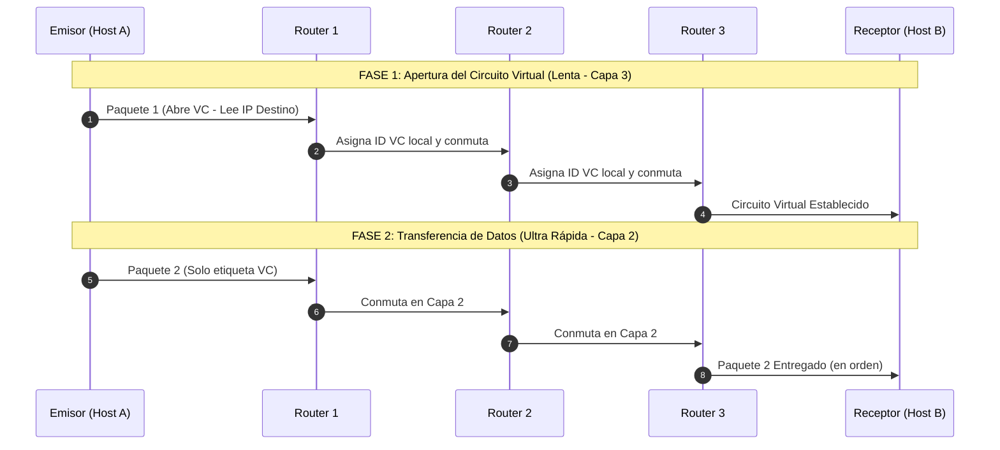

> [!TIP] Ventajas y Desventajas de Circuitos Virtuales
> - **Ventajas:**
>   - **Garantía de orden:** Todos los paquetes siguen exactamente el mismo camino físico y llegan en orden estricto.
>   - **Facilidad para Calidad de Servicio (QoS):** Al saberse de antemano el camino que recorrerán los paquetes, se pueden reservar buffers de memoria y slots de procesamiento en los routers para asegurar streaming de video/audio sin jitter ni cortes.
> - **Desventajas:**
>   - **Vulnerabilidad total a fallos:** Si un router intermedio (ej. Router 2) se apaga o falla, el circuito se destruye por completo. Para continuar la comunicación hay que renegociar y establecer un circuito virtual nuevo desde el origen.

---

### 2.3. Funcionamiento del Encaminamiento en Redes de Datagramas (Internet / IP) o Conmutacion de paquetes

En las redes de datagramas (filosofía original de Internet), **no existe conexión previa**:
- **Tratamiento independiente:** Cada paquete se trata como un datagrama autónomo.
	- Cada paquete encaminado de forma independiente.
- **Procesamiento salto a salto (Hop-by-Hop):** Cada router desencapsula **todos y cada uno de los paquetes hasta Capa 3**, lee la dirección IP de destino y consulta su tabla de encaminamiento.
- **Rutas dinámicas por paquete:** Si las condiciones cambian o hay múltiples enlaces de igual costo, el paquete 1 puede ir por un camino superior, el paquete 2 por el medio y el paquete 3 por abajo.

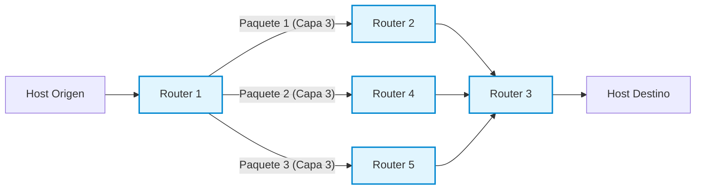

> [!IMPORTANT] Comparativa de Resiliencia y Orden
> - **Robustez y Tolerancia a Fallos:** Si el Router 2 se cae en pleno flujo, la comunicación **no se corta**. El Router 1 simplemente detecta la falla y encamina los siguientes paquetes a través del Router 4 o 5.
> - **Llegada Desordenada:** Al viajar por caminos con distintas latencias y anchos de banda, los paquetes pueden llegar desordenados al receptor.
> -  Velocidad más lenta debido al encaminamiento individual y cada router debe desencapsular hasta la capa 3 hasta la capa ip.
> 	- es decir llegan los bits, se desencapsula capa 2,
> - **¿Quién los reordena?** Pregunta la docente. El alumno **Santiago** responde acertadamente: **la Capa de Transporte, específicamente mediante el protocolo TCP** (usando números de secuencia). La Capa de Internet (IP) se desentiende del orden y de las retransmisiones.

#### porque es mas lento?
el motivo central es la sobrecarga de procesamiento salto a salto (hop-by-hop) en Capa 3:

¿Qué hace el router con cada datagrama en cada salto?

Cada vez que un paquete llega a un router, este tiene que hacer todo el ciclo completo de la pila de protocolos:

1. Recepción (Capa 1 - Física): Recibe el tren de bits eléctricos u ópticos por la interfaz física.
2. Desencapsulado a Capa 2 (Enlace de datos): Lee la trama (ej. Ethernet), comprueba errores (CRC/FCS) y le quita la cabecera de enlace para extraer el paquete IP.
3. Subida a Capa 3 (Red / IP): El router debe abrir la cabecera IP para leer la dirección IP de destino.
4. Búsqueda en la Tabla de Encaminamiento: La CPU del router debe buscar en su tabla de rutas cuál es la mejor coincidencia de prefijo (Longest Prefix Match) para decidir la interfaz de salida y el router
del siguiente salto.
5. Reencapsulado descendente: Decrementa el TTL (Time To Live), recalcula el checksum de la cabecera IP, vuelve a encapsular el paquete dentro de una nueva trama de Capa 2 (con nuevas direcciones MAC) y
lo modula a bits en Capa 1 para transmitirlo.

│ [!IMPORTANT] La clave de la lentitud
│ Esta tarea de desencapsular hasta Capa 3 → buscar en la tabla → volver a encapsular en Capa 2 se repite en absolutamente todos y cada uno de los routers del camino, para todos y cada uno de los paquetes
│ individuales.
──────
#### ¿Por qué los Circuitos Virtuales son mucho más rápidos?

En una red de circuitos virtuales, ese procesamiento pesado de Capa 3 se hace una sola vez (con el primer paquete que abre el camino).

A partir del segundo paquete:

• El router no sube a Capa 3: no lee IPs ni busca en tablas de rutas complejas.
• Conmuta directamente en Capa 2 mediante hardware ultra veloz (ASIC), simplemente leyendo el número identificador del circuito (Label / VC ID) en la cabecera de enlace y pasándolo a la interfaz de salida
preasignada.

En resumen: Datagramas es más lento porque cada router intermedio tiene que "pensar" y procesar la Capa 3 para cada paquete individual que cruza por él.


---


### concluciones segun el resumen, chekear
Conclusiones:
 Ambos enfoques se utilizan hoy en día.
 Redes de circuitos virtuales son eficientes para datos constantes y garantizan la calidad de servicio.
 Redes de datagramas son más robustas y tolerantes a fallos, pero pueden ser más lentas y presentar desorden
en la llegada de paquetes

## Algoritmos de encaminamiento
Un **algoritmo de encaminamiento** es la pieza de software (integrada nativamente en la pila TCP/IP(capa de interred) del sistema operativo y firmware de los routers) que toma la decisión: **¿por cuál de todas sus interfaces de salida debe reenviar un paquete que acaba de ingresar?**

la función de la capa de interred en la toma de decisiones sobre cómo enrutar paquetes,
enfocándose en los requisitos y tipos de encaminamiento:

### Requisitos

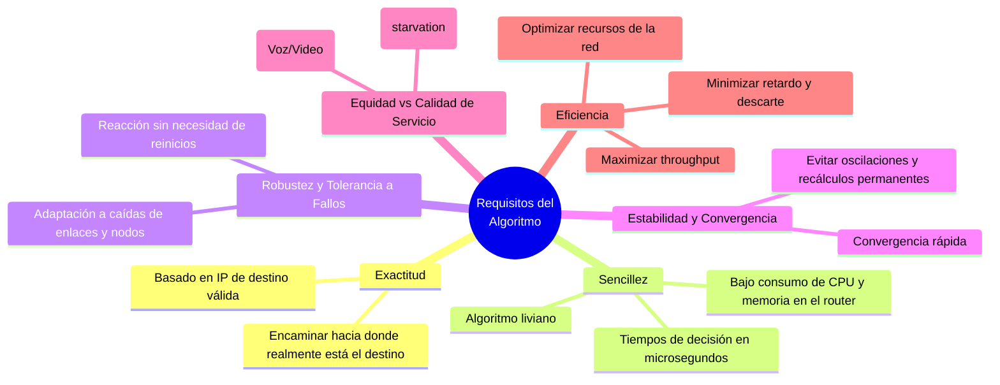
1. Exactitud: 
	1. Llegar al destino correcto, evitando rutas incorrectas. Ejemplo: Encaminar hacia el servidor web y no en dirección opuesta.
2. Sencillez: 
	1. Consumir recursos eficientemente. Minimizar el uso de memoria y ciclos de CPU. Evitar algoritmos que sean demasiado complejos y demoren el encaminamiento.
3. Robustez: 
	1. Adaptarse a cambios dinámicos en la red. Buscar rutas alternativas en caso de fallos de enlaces. Ser tolerante a fallos para mantener la conectividad incluso ante cambios en la topología.
4. Estabilidad: 
	1. Lograr la convergencia de manera eficiente. Una vez establecida la ruta, mantener la estabilidad en las tablas de encaminamiento. Evitar cambios frecuentes en las tablas de encaminamiento.
5. Equidad: 
	1. Tratar todos los paquetes de manera justa. Garantizar que todos los paquetes sean encaminados, sin dejar ninguno sin atención. Aunque algunos paquetes pueden tener prioridad, se busca equidad en el tratamiento general.
6. Eficiencia: 
	1. Encaminar de manera óptima, aprovechando eficientemente los recursos de la red. Buscar la mejor utilización del ancho de banda y minimizar la latencia en la transmisión de datos.


> [!NOTE] Reflexión en Clase: ¿Existe la Equidad Absoluta? `[29:32 - 30:06]`
> La profesora consulta al auditorio si en las redes reales todos los paquetes se tratan de forma idéntica. Los alumnos señalan que no: hoy en día los mecanismos de **Calidad de Servicio (QoS)** diferencian el tráfico. Los paquetes de video y voz en tiempo real tienen prioridad absoluta sobre una descarga de archivos. Sin embargo, el principio de equidad exige que el tráfico no prioritario **nunca sufra inanición (*starvation*)**; todos los paquetes deben ser entregados eventualmente.

---

## 4. Tipos de Encaminamiento: Estático vs. Dinámico 

### 4.1. Encaminamiento Estático (No Adaptativo)

En el enrutamiento estático, las tablas de los routers son cargadas **manualmente por el administrador de red**.
![[Pasted image 20260901182826.png]]

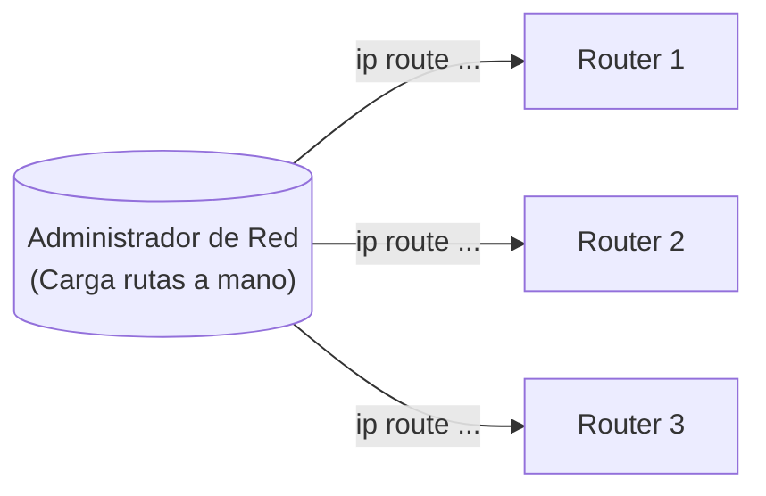

#### ¿Cómo nace un Router de fábrica? (Comparación Router vs. Switch)
- Un **router** nuevo de fábrica cuenta con CPU, memoria RAM y ROM, pero carece de disco rígido: **es un dispositivo "inútil" al inicio**. No sabe qué hacer ni por dónde reenviar nada.
- A diferencia de un **switch** (que al enchufarlo aprende dinámicamente direcciones MAC por autoaprendizaje e inunda tramas desconocidas), el router solo "aprende" automáticamente aquellas **redes que están directamente conectadas a sus interfaces**, una vez que el administrador les configura una dirección IP y máscara.
- Cualquier red remota que esté más allá de sus interfaces debe ser expresamente configurada.

#### La Regla de Oro del Enrutamiento: Rutas Bidireccionales
Durante la clase, la profesora plantea una topología típica:
$$\text{LAN A} \longleftrightarrow \text{Router 1} \longleftrightarrow \text{Router 2} \longleftrightarrow \text{Router 3} \longleftrightarrow \text{LAN C}$$

> [!QUESTION] Pregunta de la Docente `[35:48 - 36:58]`
> *"Si yo le configuro al Router 1 cómo llegar a la LAN C y le configuro al Router 2 cómo llegar a la LAN C... ¿hay conectividad total entre la LAN A y la LAN C?"*
> 
> Los alumnos (Luis y Santiago) responden: **¡No, falta el camino inverso!**
> Si enviamos un comando `ping` desde LAN A a LAN C, el paquete `ICMP Echo Request` llegará exitosamente a la máquina de LAN C. Pero cuando esta responda con un `ICMP Echo Reply`, el Router 3 y el Router 2 **no sabrán cómo llegar a la LAN A** y descartarán el paquete. En encaminamiento estático **siempre se deben definir las rutas de ida y de vuelta**.

> [!WARNING] Desventaja Crítica del Enrutamiento Estático
> Si se cae un enlace físico entre routers, aunque físicamente exista un enlace redundante alternativo en la topología, los routers **descartarán los paquetes (*packet drop*)**. El router estático es "ciego": no se adapta a los cambios de topología. El administrador debe detectar el corte y modificar manualmente la configuración en cada equipo.

• Ventajas en redes pequeñas y consumo mínimo de recursos.
	Y es seguro porque se sabe por donde viajan los paquetes
• Desventajas: No se adapta a cambios en la topología de la red.


---

### 4.2. Encaminamiento Dinámico (Adaptativo)
![[Pasted image 20260901183814.png]]
En el encaminamiento dinámico, el administrador configura un **protocolo de enrutamiento** (como RIP, OSPF, EIGRP o BGP) una única vez en los routers y *"se va de vacaciones tranquilo"*.

- Los routers intercambian periódicamente o ante eventos mensajes llamados **actualizaciones de encaminamiento (*routing updates*)**.
	-  Routers intercambian actualizaciones de encaminamiento.
- Si se corta un enlace (ej. WAN 3), los routers detectan la caída mediante paquetes de control (hellos), recalculan sus métricas y reconfiguran automáticamente sus tablas para desviar el tráfico por el camino alternativo (WAN 1).

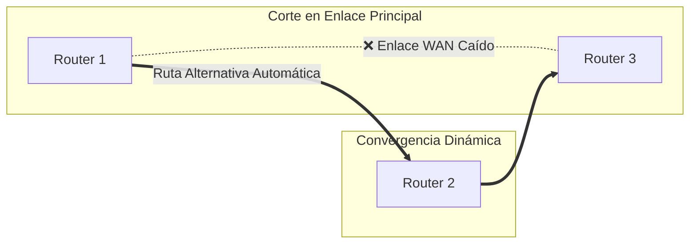
• Adecuado para redes grandes con múltiples routers.

Desventaja:  Mayor consumo de recursos debido al intercambio de información.

#### 4.4. Clasificación según la Ubicación de la Toma de Decisiones 

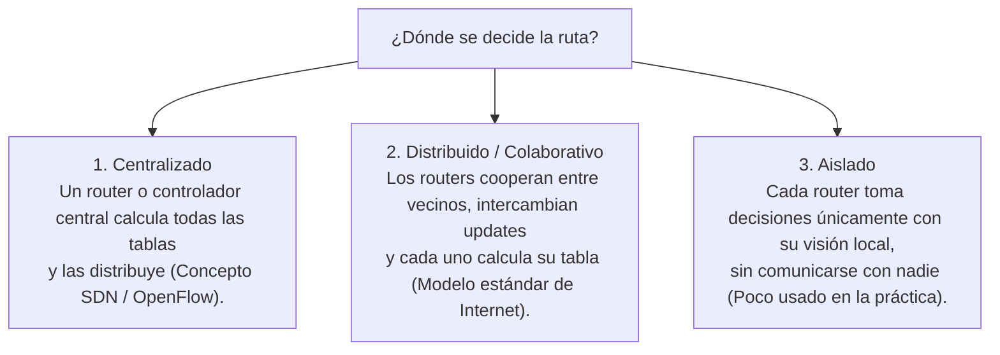
### 4.3. Comparativa: Estático vs. Dinámico

| Criterio | Encaminamiento Estático | Encaminamiento Dinámico |
| :--- | :--- | :--- |
| **Configuración** | Manual, router por router, línea por línea. | Se habilita el protocolo una sola vez; aprendizaje automático. |
| **Mantenimiento** | Alto y tedioso si la topología cambia o crece. | Mínimo; la red se autoajusta sola ante fallos. |
| **Consumo de CPU y RAM** | Mínimo (tablas fijas, sin cálculos). | Mayor (procesamiento de algoritmos y mantenimiento de estados). |
| **Consumo de Ancho de Banda** | Cero tráfico de control en los enlaces. | Consume ancho de banda enviando *routing updates* continuas. |
| **Tolerancia a Fallos** | Nula (requiere intervención humana). | **Excelente** (adaptativo y altamente resiliente). |
| **Seguridad** | Alta (el administrador define exactamente la ruta). | Requiere autenticación de updates para evitar falsificación de rutas. |
| **Ámbito de aplicación ideal** | Redes muy pequeñas (1 a 3 routers) o enlaces stub. | Redes medianas, corporativas, campus y la Internet global. |

---


---

## 5. Algoritmo 1: Ruta Más Corta (Shortest Path - Dijkstra) 

El algoritmo de la **ruta más corta** calcula el trayecto óptimo entre dos nodos de un grafo minimizando la suma acumulada de las métricas de los enlaces intermedios.
	 Construye un grafo de la red donde los nodos son routers y los enlaces tienen métricas.

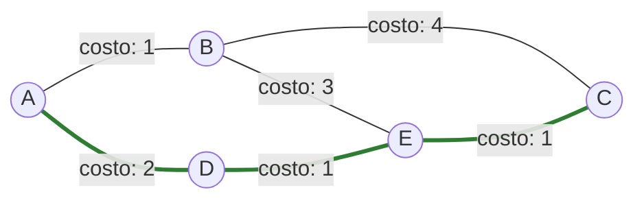
*En el grafo anterior, para ir de **A** hacia **C**:*
- *Ruta por B: $A \to B \to C \implies \text{Costo} = 1 + 4 = 5$*
- *Ruta por D y E: $A \to D \to E \to C \implies \text{Costo} = 2 + 1 + 1 = \mathbf{4}$ (Ruta elegida por ser la menor).*

### ¿cómo decidimos cuál es la *"mejor"* ruta?
- **Santiago** señala: *"El tiempo es lo más importante; elegiría la Circunvalación aunque implique más kilómetros"*. La profesora asiente: en ese caso, la métrica elegida es el **retardo**.

Las métricas más habituales en redes son:
1. **Distancia geográfica en kilómetros.**
2. **Conteo de saltos (Hop Count):** Cada router que se cruza vale 1. La ruta con menos routers intermedios gana.
3. **Retardo medio:** Tiempo promedio en milisegundos que tarda un paquete en atravesar el enlace (medido con sondas `ICMP Echo Request / Echo Reply`).
4. **Tráfico promedio / Nivel de congestión:** Penaliza enlaces saturados (similar a las rutas marcadas en rojo en Google Maps).
5. **Costo monetario:** Tarifas impuestas por los proveedores de telecomunicaciones (ISP transit).
6. ancho de banda (valores a la inversa)

### 5.2. El Dilema del Ancho de Banda y la Fórmula Inversa

La docente plantea un problema fundamental:

> [!QUESTION] El Gran Desafío Matemático del Ancho de Banda `[47:29 - 48:37]`
> *"Si mi red tiene enlaces de 1 Mbps, 10 Mbps y 100 Mbps... ¿qué enlace queremos que elija el router? Obviamente el de 100 Mbps, el de mayor ancho de banda para enviar más datos.
> Pero el algoritmo de Dijkstra **SIEMPRE busca el número menor (el camino más corto)**. Si colocamos directamente el ancho de banda como métrica, Dijkstra preferirá el enlace de 1 Mbps sobre el de 100 Mbps porque 1 < 100. ¿Cómo resolvemos esto?"*

- Un alumno sugiere usar números negativos (descartado por generar loops y problemas de divergencia en grafos).
- **La Solución Canónica:** Se utiliza la **función inversa del ancho de banda**:
$$\text{Métrica} = \frac{K}{\text{Ancho de Banda}}$$
Al colocar el ancho de banda en el **denominador**, a mayor capacidad del enlace, menor resulta el costo numérico del arco. Así, el algoritmo elige el enlace más rápido creyendo que es el "más corto".

### 5.3. Métricas Compuestas (Multicriterio)

En protocolos profesionales (como EIGRP), no se utiliza un único factor sino una **función de costo ponderada**:
$$\text{Métrica Total} = k_1 \cdot M_1 + k_2 \cdot M_2 + k_3 \cdot M_3 + k_4 \cdot M_4$$
Donde $M_1, M_2, M_3, M_4$ representan el ancho de banda, retardo, fiabilidad y carga del enlace, y las constantes $k_i$ son configuradas por el administrador según sus prioridades de tráfico.

> [!NOTE] Referencia a la Carrera
> La profesora consulta si ya conocen el algoritmo de Dijkstra. Los alumnos confirman haberlo estudiado en materias como **Investigación Operativa** y **Modelos de Simulación**.

---
## 6. Algoritmo 2: Inundación (Flooding)

### 6.1. Principio de Funcionamiento

El algoritmo de inundación opera con una lógica elemental:
> Cada vez que un router recibe un paquete por una de sus interfaces de entrada, lo retransmite inmediatamente por **todas las demás interfaces, excepto por la interfaz por la cual ingresó**.

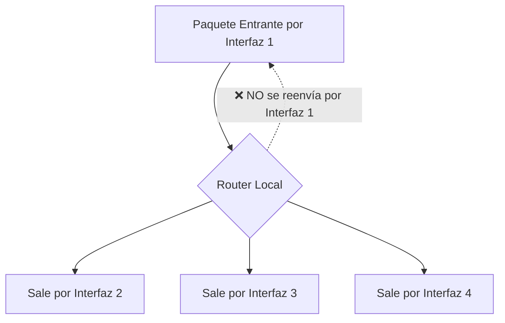

• Evita bucles con contadores de saltos, números de secuencia y registros de paquetes. (explicar bien los tres)
• Ventajas: garantiza que los paquetes se entreguen rápidamente a todos los dispositivos, pero consume mucho ancho de banda y puede generar duplicados.
### 6.2. El Problema de la Inundación Pura

Si se implementa sin restricciones, se comporta como un **Hub descontrolado**:
- Los paquetes se replican de forma exponencial.
- Se producen bucles infinitos (*routing loops*), donde los mismos paquetes circulan indefinidamente consumiendo todo el ancho de banda de los enlaces hasta colapsar los buffers de los routers.

### 6.3. ¿Para qué Sirve la Inundación? (Casos de Éxito)

Pese a su voraz consumo de red, es insustituible en escenarios críticos:
1. **Velocidad máxima:** Es el algoritmo de propagación más rápido existente; el paquete viaja en paralelo por todos los caminos físicos simultáneamente.
2. **Sincronización de Bases de Datos Replicadas:** Actualizaciones críticas que deben llegar a servidores de todo el mundo en el menor tiempo posible.
3. **Distribución de Topología en Protocolos Estado de Enlace:** Es la base con la que **OSPF** difunde sus paquetes LSA (*Link State Advertisements*) para que todos los routers de la red tengan exactamente el mismo mapa topológico.
4. **Redes Militares:** Máxima supervivencia; el mensaje llega a destino aunque se destruya el 90% de los nodos intermedios.

### 6.4. Mecanismos de Inundación Controlada

Para aprovechar sus virtudes sin colapsar la red, se aplican dos técnicas de control:

#### Método 1: Contador de Saltos / TTL (Time To Live)
Cada paquete lleva en su cabecera un contador de saltos. Cada router que lo recibe decrementa el contador en 1. Si el TTL llega a cero, el paquete se **descarta de inmediato**.

#### Método 2: ID de Router Emisor + Número de Secuencia Creciente
1. El router emisor original estampa en el paquete su identificador (ej. `Router B`) y un número de secuencia que se incrementa con cada nuevo paquete emitido (`Seq: 1`, `Seq: 2`, `Seq: 3`...).
2. Cada router vecino mantiene una tabla interna en memoria donde anota:
   `[ID del Router Emisor] ➔ [Último Número de Secuencia Visto]`.
3. Cuando a un router le llega un paquete:
   - **Si el número de secuencia es MAYOR** que el último registrado: Es información nueva. Actualiza su tabla con el nuevo valor y **procede a inundar** el paquete por sus restantes interfaces.
   - **Si el número de secuencia es MENOR o IGUAL** al registrado: Significa que ese paquete (o uno más reciente) ya fue procesado e inundado previamente. Por lo tanto, **lo descarta en el acto**.

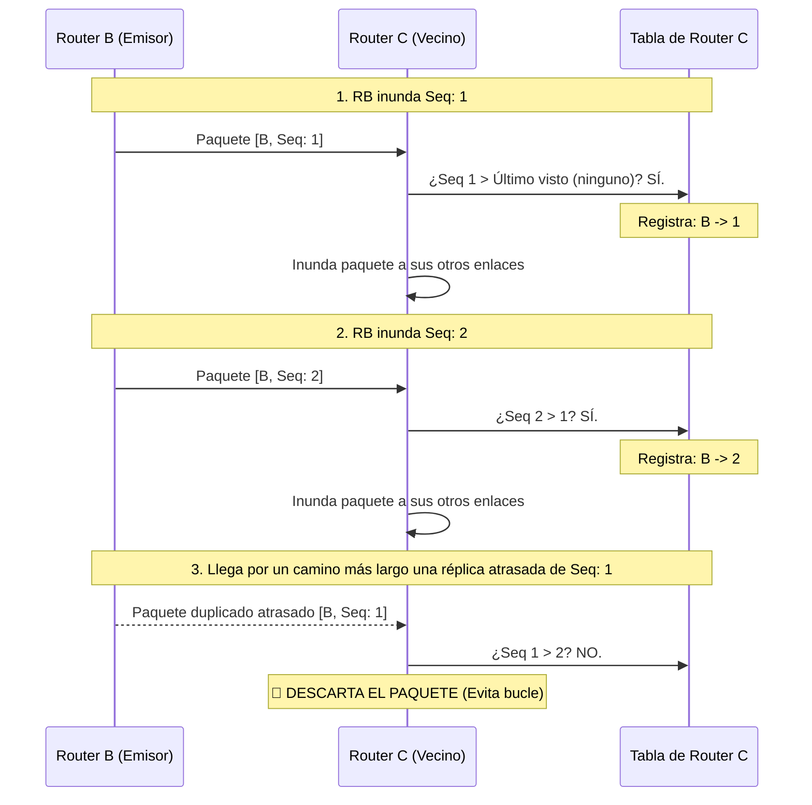

---
## 7. Algoritmo 3: Encaminamiento Jerárquico 

### 7.1. El Problema de la Explosión de las Tablas de Encaminamiento

La profesora abre este bloque con una pregunta conceptual clave sobre el diseño de redes:

> [!QUESTION] ¿Qué se almacena en la tabla de un router: Hosts o Redes? `[58:57 - 1:00:57]`
> *"En una tabla de encaminamiento, ¿tenemos un renglón por cada host (computadora) o por cada red/subred?
> Piensen en la facultad: supongamos que la UTN tiene 2.500 computadoras. Si guardáramos direcciones de host, ¡la tabla del router tendría 2.500 renglones! En cambio, la facultad está dividida en unas 100 aulas y laboratorios (subredes). Almacenar 100 renglones de subred es inmensamente más eficiente.
> El router solo necesita saber cómo llegar a la subred de destino; quien se encarga de entregar la trama a la PC específica dentro del laboratorio es el **switch**, conmutando por dirección MAC."*

Aun agrupando por subredes, cuando la red crece a nivel global (Internet), es materialmente imposible que un router de backbone contenga todas las redes del planeta:
- Se agotaría la memoria RAM de los routers.
- La búsqueda de rutas en tablas inmensas consumiría excesivos ciclos de microprocesador, ralentizando el reenvío de paquetes.
- El intercambio periódico de tablas gigantescas saturaría el ancho de banda con tráfico de control.

### 7.2. Solución: Agrupamiento Jerárquico en Regiones / Áreas / AS

Los routers se organizan en jerarquías: **Regiones, Zonas, Áreas (OSPF) o Sistemas Autónomos (BGP)**.
	 Divide los routers en regiones o zonas para reducir el tamaño de las tablas de enrutamiento.

> [!IMPORTANT] La Regla de Oro del Encaminamiento Jerárquico
> - Cada router conoce al **máximo detalle la estructura interna de su propia región** (sabe exactamente cómo llegar a cada router o subred local).
> - Pero **desconoce completamente la topología interna de las demás regiones**: solo sabe por cuál router de frontera o interfaz debe salir para enviar el tráfico a esa región en general.

> [!QUOTE] Analogía Docente: El viaje de Córdoba a Buenos Aires
> *"Si yo viajo desde Córdoba a Buenos Aires, solo necesito saber cómo llegar a la ciudad de Buenos Aires (a la región). No necesito saber de antemano en qué calle está determinado negocio o cómo llegar al Obelisco en la 9 de Julio.
> Cuando llegue a Buenos Aires, los carteles y la gente local (los routers internos de esa región) me van a encaminar con precisión al destino final. Yo, desde Córdoba, solo necesito saber por qué autopista salir hacia Buenos Aires."*

•Ayuda a evitar el crecimiento excesivo de tablas de enrutamiento en redes grandes.
•Se puede implementar la jerarquía con direcciones sumarizadas
• Métricas basadas en cantidad de saltos.
### 7.3. Análisis del Ejemplo Numérico del Libro (Tanenbaum)

Se analiza el caso de una red con 17 routers agrupados en 5 regiones distintas:

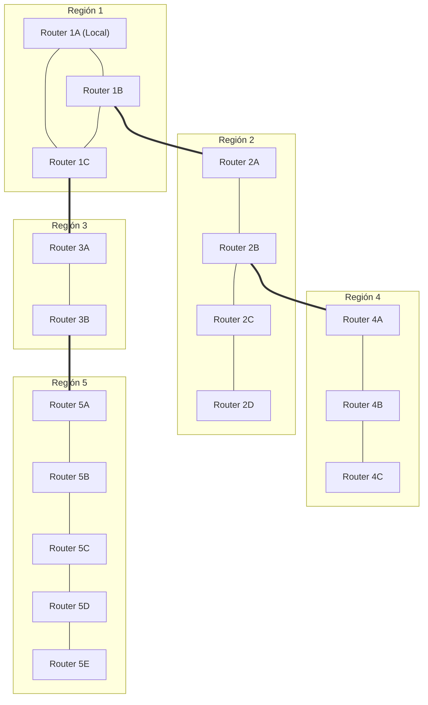

#### Comparación de la Tabla de Enrutamiento del Router 1A:

| Tipo de Tabla                   | Entradas en la Tabla de 1A                                                                                                            | Total de Renglones |
| :------------------------------ | :------------------------------------------------------------------------------------------------------------------------------------ | :----------------: |
| **Tabla Plana (Sin Jerarquía)** | Un renglón por cada uno de los 17 routers de la red completa:<br>`1A, 1B, 1C, 2A, 2B, 2C, 2D, 3A, 3B, 4A, 4B, 4C, 5A, 5B, 5C, 5D, 5E` |  **17 renglones**  |
| **Tabla Jerárquica**            | • Routers locales de su región: `1B, 1C`<br>• Entradas agregadas por región externa: `Región 2, Región 3, Región 4, Región 5`         |  **6 renglones**   |

> [!TIP] Impacto de la Reducción
> ¡La tabla de encaminamiento se redujo en casi un **65%**!
> Cuando el router **1A** debe enviar un paquete al router **2D**:
> 1. 1A consulta su tabla jerárquica: no ve al router 2D, pero ve que la **Región 2** se alcanza a través de la interfaz que va al router **1B**.
> 2. El paquete cruza a la Región 2 y llega al router **2A**.
> 3. Como **2A** sí pertenece a la Región 2, su tabla interna conoce la topología local y encamina el paquete con precisión hasta **2D**.

TABLA PLANA SIN JERARQUIA:
![[Pasted image 20260904153812.png]]
TABLA jerarquica para 1a
![[Pasted image 20260904154153.png]]
### 7.4. Vínculo con CIDR y Sumarización de Rutas (Unidad 3)

La profesora conecta este algoritmo con lo visto en la unidad anterior:
- En Internet, las regiones corresponden a **Sistemas Autónomos (AS)** o jerarquías de prefijos IP.
- Mediante **CIDR (*Classless Inter-Domain Routing*)**, miles de redes contiguas se agrupan en un único prefijo de red sumarizado (ej. `/16` o `/19`).
- Gracias a la sumarización, los routers centrales de Internet (*Default-Free Zone*) no colapsan por memoria y pueden conmutar tráfico a velocidades de terabits por segundo.

---

## 8. Cuadro Sinóptico y Cierre de la Clase `[1:09:54 - 1:10:02]`

| Algoritmo Analizado | Idea Central | Principal Ventaja | Principal Desafío / Solución |
| :--- | :--- | :--- | :--- |
| **Ruta Más Corta (Dijkstra)** | Modela la red como grafo y minimiza la suma de costos de los enlaces. | Ruta matemáticamente óptima bajo las métricas elegidas. | Invertir el ancho de banda ($1/\text{BW}$) para que enlaces veloces tengan menor costo. |
| **Inundación (Flooding)** | Reenvía el paquete por todas las interfaces salvo la de llegada. | Velocidad insuperable, máxima robustez, ideal para actualizaciones y bases de datos. | Bucle infinito de réplicas $\implies$ Se controla con **TTL** y **números de secuencia**. |
| **Jerárquico** | Agrupa routers en Regiones, Áreas o Sistemas Autónomos. | Drástica reducción de tablas de rutas, ahorro de memoria y ancho de banda. | Pérdida de visión global en nodos individuales $\implies$ Se delega la resolución al router de frontera local. |

> [!NOTE] Próxima Clase
> La docente concluye la sesión indicando que la base conceptual de algoritmos queda sentada. En las próximas clases se abordarán en detalle los algoritmos dinámicos de mayor peso en la materia: **Vector Distancia (Bellman-Ford / RIP)** y **Estado de Enlace (Dijkstra / OSPF)**.


---


# ----
## 2. Fundamentos y Filosofía del Algoritmo de Vector Distancia

> [!NOTE] Aclaración Metodológica de la Docente
> *"En la clase anterior estudiamos los tres primeros algoritmos: la ruta más corta de Dijkstra, la inundación y el encaminamiento jerárquico. Hoy nos enfocaremos en **Vector Distancia** y **Estado de Enlace**.
> Los estudiamos de forma totalmente individual para comprender la lógica pura de cada uno. Sin embargo, en los protocolos reales de Internet (como veremos más adelante) muchos de estos algoritmos coexisten o se combinan simultáneamente dentro de un mismo protocolo."*

### Caracteristicas
#### 2.1. Naturaleza del Algoritmo: Dinámico y Distribuido

Vector Distancia se define conceptualmente bajo dos pilares:
* Es un algoritmo dinámico distribuido y el primero en ser utilizado en Internet.*

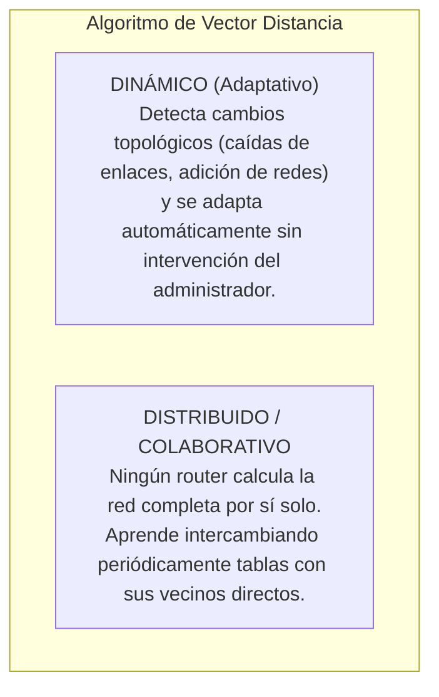

- **Dinámico:** *"El administrador de red se puede ir de vacaciones tranquilamente. Si se agrega una red o se cae un enlace, los routers detectan el cambio y recalculan las rutas de forma autónoma."*
- **Distribuido / Colaborativo:** *"Es como si ustedes supieran sobre un tema, se lo enseñan a sus compañeros de al lado, ellos a otros, y al final entre todos construyen el conocimiento completo."*

#### 2.2. Descomposición Semántica del Nombre

| Componente    | Significado Conceptual                                  | Implementación Técnica en la Tabla de Enrutamiento                                                               |
| :------------ | :------------------------------------------------------ | :--------------------------------------------------------------------------------------------------------------- |
| **Vector**    | **Dirección** (hacia dónde enviar el paquete)           | **Interfaz de salida** del router (ej. `Serial 0`, `GigabitEthernet 0/1`) o IP del siguiente salto (*Next-Hop*). |
| **Distancia** | **Costo / Métrica** (qué tan lejos se encuentra la red) | Cantidad de routers a atravesar (**número de saltos / hop count**).                                              |

> [!IMPORTANT] Criterio de Selección de Rutas
> Ante la existencia de múltiples caminos posibles hacia un mismo destino (típico en topologías en malla), Vector Distancia **únicamente instala en la tabla la mejor ruta** (la de menor distancia / menor número de saltos). Las rutas alternativas peores se descartan.

• Cada router mantiene una tabla de encaminamiento que incluye la mejor distancia a cada destino "distancia") y la interfaz de salida para llegar a esa red (llamada "vector").
• Las tablas de encaminamiento contienen información sobre la dirección de red de destino, la máscara de red, la distancia (generalmente la cantidad de saltos) y el vector (interfaz de salida).
•El algoritmo se basa en encontrar la mejor ruta hacia una red de destino, donde "mejor" generalmente significa la ruta con la menor distancia.
#### 2.3. Actualizaciones Periódicas (*Routing Updates*) y *Keepalive*

- Los routers intercambian sus tablas completas a intervalos regulares (por defecto, **cada 30 segundos** en RIP).
- **Función de supervisión (Liveness / Keepalive):** Si un router deja de enviar sus actualizaciones durante un tiempo prudencial (ej. 90 a 180 segundos), sus vecinos deducen que el router o enlace se cayó y dan de baja esas redes de sus tablas.
- **Analogía docente del aula virtual:** *"Es como si yo les pidiera que cada 2 minutos pongan 'acá estoy' en el chat. Si pasan los 2 minutos y un alumno no escribe, asumo que perdió conectividad y lo tacho de la lista de presentes."*

#### 2.4. La Gran Debilidad: Desconocimiento de la Topología Global

A diferencia de los algoritmos de Estado de Enlace, un router en Vector Distancia **no tiene el mapa de la red**:
* No tiene conocimiento de la topología completa de la red, solo conoce las rutas directamente accesibles y las aprende a través de las actualizaciones de encaminamiento de otros routers.

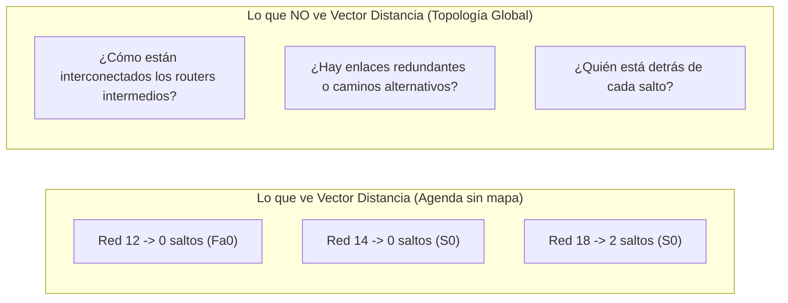

> [!QUOTE] Analogía Docente: La libreta de direcciones vs. Google Maps
> *"Es exactamente como tener en su casa un papelito que dice: 'Facultad: 4 km', 'Paseo del Jockey: 6 km', 'Nuevo Centro Shopping: 7 km'. Tienen anotado el destino y los kilómetros, pero **no tienen Google Maps**. Al no tener el mapa de la ciudad, si hay un desvío o una calle cortada, pueden desorientarse completamente y empezar a manejar en círculos. 
> Eso mismo le pasa al router: al no conocer la topología de la red, ante cualquier cambio puede interpretar mal la información y generar **bucles de encaminamiento (loops)**."*

•Para evitar bucles de encaminamiento, utiliza el Time-To-Live (TTL) en los paquetes para limitar su vida útil.
#### 2.5. Convergencia Lenta: "Enrutamiento por Rumor" (*Routing by Rumor*)

El intercambio se produce exclusivamente salto a salto entre routers adyacentes:
- El router A le cuenta a su vecino B; B procesa, actualiza su tabla y en el siguiente ciclo le cuenta a C; C le cuenta a D.
- converger lentamente debido a su naturaleza basada en rumores, lo que puede dar lugar a interpretaciones erróneas y bucles.
- **Analogía del teléfono descompuesto:** *"Imagínense que entre los 46 alumnos que estamos conectados, yo le digo una frase al oído a Lucas, Lucas se la susurra a Bruno, Bruno a Facundo, y así sucesivamente hasta llegar al alumno 46. Demora muchísimo tiempo y el mensaje final llega distorsionado. Eso es el enrutamiento por rumores: **converge muy lentamente**."*

#### 2.6. Consumo de Recursos: Hardware vs. Ancho de Banda

| Recurso                           | Nivel de Consumo | Causa Técnica                                                                                                                                              |
| :-------------------------------- | :--------------- | :--------------------------------------------------------------------------------------------------------------------------------------------------------- |
| **CPU del Router**                | 🟢 **Muy Bajo**  | El algoritmo de cálculo (**Bellman-Ford / Ford-Fulkerson**) es extremadamente simple y liviano. No requiere procesadores potentes ni grandes memorias RAM. |
| **Memoria RAM**                   | 🟢 **Muy Bajo**  | Solo almacena una tabla resumida con mejores rutas; no requiere bases de datos topológicas completas.                                                      |
| **Ancho de Banda de los Enlaces** | 🔴 **Alto**      | Difunde periódicamente (cada 30 s) la **tabla completa de enrutamiento** por todos los enlaces activos, compitiendo con el tráfico de usuario.             |

#### 2.7. Métricas Simples vs. Métricas Compuestas

- **Métrica Clásica (RIP):** Conteo estricto de saltos (*hops*). Si una ruta tiene 2 saltos y otra 4 saltos, se elige la de 2, sin importar el ancho de banda ni el retardo.
- **Métricas Compuestas (IGRP / EIGRP de Cisco):** Combinan múltiples factores mediante funciones matemáticas ponderadas:
  $$\text{Métrica} = f(\text{Ancho de Banda}, \text{Retardo}, \text{Confiabilidad}, \text{Carga}, \text{Longitud de Cola})$$
  *(Analogía docente: Elegir una calle no solo por los kilómetros, sino porque esté asfaltada, bien iluminada, sin pozos y con poco tráfico).*
#### 2.8 Soluciones para prevenir bucles en los algoritmos de enrutamiento:
1. TTL (Time-To-Live): Evita que los paquetes circulen indefinidamente.
2. Horizonte dividido: Un router solo envía actualizaciones sobre redes caídas si las conoce directamente.
3. Actualizaciones por eventos: Se generan actualizaciones inmediatas cuando una red falla, junto con las actualizaciones periódicas.
4. Temporizadores de espera: Se envían actualizaciones de evento solo si la red no se recupera dentro de un tiempo especificado.
---

### 3. Simulación Práctica: Topología, Estado Inicial y Convergencia de ALGORITMO DE VECTOR DISTANCIA

#### 3.1. Topología de Estudio

La docente plantea un escenario lineal de 3 routers y 4 redes:

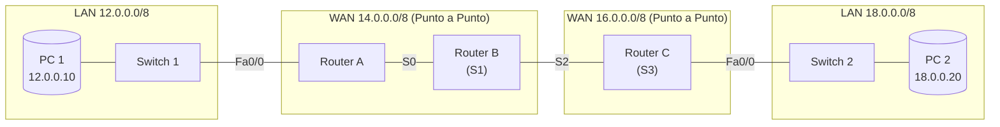

- **Interfaces FastEthernet (Fa):** Conectan a redes de difusión (*broadcast* / LAN).
- **Interfaces Seriales (S):** Conectan a enlaces WAN punto a punto.
![[Pasted image 20260904183614.png]]
#### 3.2. Router vs. Switch: ¿Cómo nace un Router de Fábrica?

> [!NOTE] Intervención Pedagógica: La "inutilidad" inicial del Router
> - **El Switch:** Se enchufa y funciona de inmediato (Plug & Play, no tiene botón de encendido). Aprende automáticamente las direcciones MAC por autoaprendizaje al recibir tramas.
> - **El Router:** De fábrica es "totalmente inútil". Requiere que el administrador configure manualmente las direcciones IP, máscaras en cada interfaz y levante el puerto con `no shutdown`.
> - **¿Por qué las tablas guardan Redes y no Hosts?** Alumno **Matías** responde correctamente: Si detrás de un switch hay 200 PCs, tener 200 entradas en la tabla de enrutamiento saturaría la memoria del router y ralentizaría la búsqueda. Al guardar un único renglón para la **dirección de red** (ej. `12.0.0.0/8`), el router procesa millones de destinos con una sola entrada.

---

#### 3.3. Estado Inicial (T0): Redes Directamente Conectadas

Apenas el administrador asigna IPs y levanta las interfaces, cada router registra únicamente sus redes directamente adyacentes con **Métrica = 0** (*Lorenzo responde: "0 saltos porque no hay que cruzar ningún router"*).

##### Tablas en T0:

| Router A (T0)   |             |              |
| :-------------- | :---------: | :----------: |
| **Red Destino** | **Métrica** | **Interfaz** |
| `12.0.0.0/8`    |      0      |    `Fa0`     |
| `14.0.0.0/8`    |      0      |     `S0`     |

| Router B (T0) | | |
| :--- | :---: | :---: |
| **Red Destino** | **Métrica** | **Interfaz** |
| `14.0.0.0/8` | 0 | `S1` |
| `16.0.0.0/8` | 0 | `S2` |

| Router C (T0) | | |
| :--- | :---: | :---: |
| **Red Destino** | **Métrica** | **Interfaz** |
| `16.0.0.0/8` | 0 | `S3` |
| `18.0.0.0/8` | 0 | `Fa0` |

> [!WARNING] Estado de Incomunicación en T0
> Si la PC `12.0.0.10` intenta enviar un paquete a la PC `18.0.0.20`:
> 1. El paquete llega al Router A.
> 2. Router A busca la red `18.0.0.0/8` en su tabla: **no existe coincidencia**.
> 3. Router A **descarta el paquete** y el protocolo auxiliar **[[ICMP]]** genera un mensaje de error: `Destination Unreachable` (Destino Inalcanzable - Red Desconocida).

---

#### 3.4. Ronda 1 de Actualizaciones (T1): Propagación de Izquierda a Derecha

Se activa el protocolo de enrutamiento y comienzan a circular las actualizaciones periódicas:

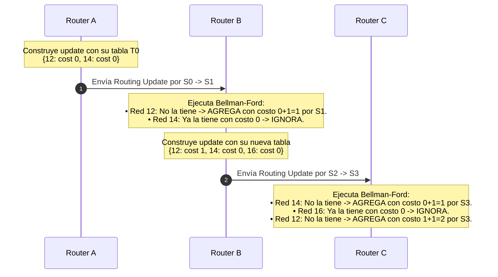

##### Tablas al finalizar la Ronda 1 (T1):

| Router A (T1) | | |
| :--- | :---: | :---: |
| **Red** | **Métrica** | **Int** |
| `12.0.0.0/8` | 0 | `Fa0` |
| `14.0.0.0/8` | 0 | `S0` |
| *(Aún desconoce 16 y 18)* | — | — |

| Router B (T1) | | |
| :--- | :---: | :---: |
| **Red** | **Métrica** | **Int** |
| `14.0.0.0/8` | 0 | `S1` |
| `16.0.0.0/8` | 0 | `S2` |
| `12.0.0.0/8` | **1** | `S1` |
| *(Aún desconoce 18)* | — | — |

| Router C (T1) | | |
| :--- | :---: | :---: |
| **Red** | **Métrica** | **Int** |
| `16.0.0.0/8` | 0 | `S3` |
| `18.0.0.0/8` | 0 | `Fa0` |
| `14.0.0.0/8` | **1** | `S3` |
| `12.0.0.0/8` | **2** | `S3` |

> [!IMPORTANT] ¿La red ya convergió?
> **No.** El alumno **Matías** observa que la información fluyó en un solo sentido. Router C sabe cómo llegar a la Red 12, pero Router A y Router B aún no tienen la menor idea de cómo llegar a la Red 18. Para que haya convergencia, la información debe viajar en sentido opuesto.
> 
> que una red converge se dice cuando todos los routers saben llegar a todas las redes

---

#### 3.5. Ronda 2 de Actualizaciones (T2): Propagación de Derecha a Izquierda y Convergencia

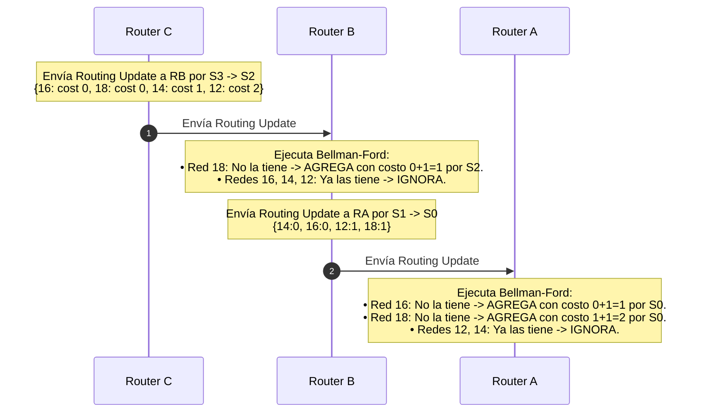

##### Estado Final Convergente (T2):

| Router A (Convergente) |             |         |
| :--------------------- | :---------: | :-----: |
| **Red**                | **Métrica** | **Int** |
| `12.0.0.0/8`           |      0      |  `Fa0`  |
| `14.0.0.0/8`           |      0      |  `S0`   |
| `16.0.0.0/8`           |    **1**    |  `S0`   |
| `18.0.0.0/8`           |    **2**    |  `S0`   |

| Router B (Convergente) | | |
| :--- | :---: | :---: |
| **Red** | **Métrica** | **Int** |
| `14.0.0.0/8` | 0 | `S1` |
| `16.0.0.0/8` | 0 | `S2` |
| `12.0.0.0/8` | **1** | `S1` |
| `18.0.0.0/8` | **1** | `S2` |

| Router C (Convergente) | | |
| :--- | :---: | :---: |
| **Red** | **Métrica** | **Int** |
| `16.0.0.0/8` | 0 | `S3` |
| `18.0.0.0/8` | 0 | `Fa0` |
| `14.0.0.0/8` | **1** | `S3` |
| `12.0.0.0/8` | **2** | `S3` |

> [!TIP] Definición de Convergencia
> Una red se encuentra en **estado convergente** cuando todos y cada uno de los routers tienen una visión coherente y completa de cómo alcanzar todas las redes de la topología. A partir de este momento, es posible la comunicación bidireccional de cualquier host contra cualquier otro host.

---


## Problemas y sus soluciones
### 4. El Gran Problema: Conteo al Infinito (*Count to Infinity*) 

Problemas o inconvenientes
* Lenta Convergencia (Basado en rumeros) -> provoca interpretaciones erroneas por parte de los routers en sus actualizaciones de encaminamiento
* Posibilidad de bucles de encaminamiento
* un bucle de encaminamiento -> conteo al inifinito de la metrica (hops)
* Solucion -> definir un valor maximo de la metrica(hops)


![[Pasted image 20260904184901.png]]
¿Qué sucede si una red falla? La combinación de **actualizaciones periódicas lentas** y la **falta de conocimiento topológico global** desencadena la patología clásica de Bellman-Ford.

#### 4.1. La Falla y el Desfase Temporal de los Temporizadores
![[Pasted image 20260904185245.png|502]]
1. La interfaz `Fa0/0` de **Router C se cae** (`shutdown`), desconectando a la Red 18.
2. Router C detecta inmediatamente la caída local y **elimina la Red 18 de su tabla**.
3. **El problema del temporizador:** Router C había enviado su actualización periódica hace apenas 10 segundos. Por diseño, debe esperar **20 segundos más** hasta que venza el ciclo de 30 segundos para anunciar novedades. Se queda en silencio.
4. En ese intervalo, a **Router B** se le cumple su propio cronómetro de 30 segundos y envía su actualización periódica hacia Router C. Como nadie le avisó nada, B todavía tiene anotado: `Red 18 -> Métrica 1 por S2`.

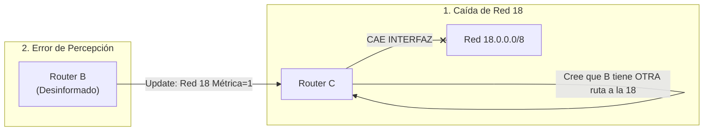

#### 4.2. La Interpretación Errónea de Router C

- Router C recibe la tabla de B que ofrece la Red 18 con métrica 1 por la interfaz `S3`.
- Como Router C **no tiene el mapa de la topología**, piensa:
  > *"¡Qué suerte! Mi conexión directa a la Red 18 murió, pero Router B me dice que él puede llegar a la 18 con costo 1. Seguro hay un enlace alternativo por otro camino de la red que yo no veo."*
- Router C re-instala la Red 18 en su tabla con métrica incrementada:
  $$\text{Métrica en C} = 1 + 1 = \mathbf{2} \quad (\text{por interfaz } S3)$$
![[Pasted image 20260904185307.png|461]]
#### 4.3. La Escalada Métrica (Realimentación Positiva)

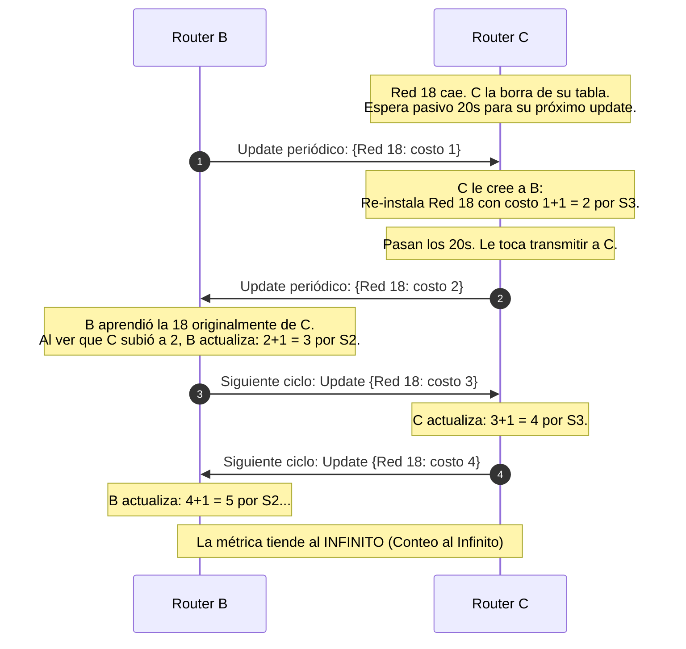
![[Pasted image 20260904185454.png]]

#### 4.4. La Solución al Conteo al Infinito: Métrica Máxima (Infinito = 16)

Para evitar que los routers cuenten indefinidamente ($1, 2, 3, \dots, 50, 100, 1000$), el protocolo RIP impone un límite superior estricto:
- **Definición de Infinito:** Se fija en **16 saltos**.
- Cuando la métrica de una ruta asciende y alcanza el valor **16**, el router la declara automáticamente como **Inalcanzable (*Unreachable*)**.
- La ruta inalcanzable se purga de la tabla de enrutamiento y se suspende el reenvío, cortando el ciclo de conteo.

---

### 5. Bucle en el paquete de Datos (*Data Plane Loop*) 

La docente hace una distinción conceptual crítica:
- **Plano de Control:** El intercambio de tablas de enrutamiento y la escalada métrica que vimos recién. (con to infinity)
- **Plano de Datos:** El tráfico real de los usuarios (páginas web, correos, streaming, PDFs, paquetes de voz). (Data plane loop)

#### 5.1. Comparación Bit a Bit según la Máscara de Red

Cuando un router recibe un paquete IP de datos, des-encapsula hasta la Capa de Interred (Capa 3) y extrae la **IP Destino** y con esta ip destino consulta su tabla de encaminamiento y en base a eso sabe por cual interfaz sacar el paquete:
- El alumno **Luis** interviene recordando el rol de la **máscara de red**.
- El router no compara los 32 bits completos de la dirección contra direcciones de PCs individuales. Aplica una operación lógica con la máscara (en este ejemplo `/8`, compara los primeros 8 bits). Al coincidir con la entrada de red `18.0.0.0`, selecciona la interfaz de salida correspondiente.

#### 5.2. La Trampa del Bucle Mortal (Efecto Ping-Pong)

Mientras la red se encuentra en el estado de inconsistencia (Router B apunta a C y Router C apunta a B para la Red 18), un host de la Red 12 envía un paquete destinado a `18.0.0.15`:
![[Pasted image 20260904190131.png]]

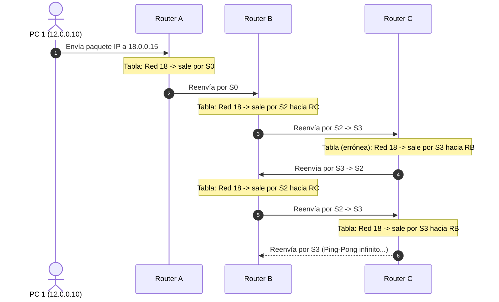

- El paquete queda atrapado en un **bucle cerrado (loop)** rebotando entre B y C.
- Consume ancho de banda del enlace serial y ciclos de CPU de ambos routers.

#### 5.3. El TTL como Mecanismo de Contención (Fusible)

Los alumnos **Leila** y **Ariel** recuerdan el mecanismo de control de la cabecera IP:
- **Campo TTL (*Time To Live*) en IPv4 / *Hop Limit* en IPv6:**
  - Cada vez que un router conmuta el paquete, decrementa el valor de TTL en 1.
  - Cuando el TTL llega a **0**, el router en posesión del paquete lo **descarta** de inmediato.
  - Se genera un paquete ICMP `Time Exceeded` (Tipo 11, Código 0) notificando al emisor.
- **Conclusión Docente:** El TTL **no soluciona ni previene el bucle**; actúa como un **fusible** de emergencia para que los paquetes huérfanos no saturen Internet eternamente.

---
### 6. Mecanismos de Prevención y Mitigación de Bucles `[57:48 - 1:11:35]`

Para resolver de raíz la formación de bucles y la lenta convergencia de Vector Distancia, se implementan cuatro técnicas complementarias:

```mermaid
flowchart TD
    subgraph Tecnicas["Mecanismos Anti-Bucle en Vector Distancia"]
        T1["1. Horizonte Dividido<br>(Split Horizon)"] --- T2["2. Actualizaciones Disparadas<br>(Triggered Updates)"]
        T3["3. Temporizadores de Espera<br>(Hold-Down Timers)"] --- T4["4. Métrica Máxima / TTL<br>(Infinito=16 y Hop Limit)"]
    end
```

---

#### 6.1. Horizonte Dividido (*Split Horizon*) `[58:22 - 1:04:40]`

> [!IMPORTANT] Regla de Oro del Horizonte Dividido
> **Si un router aprende información sobre una red a través de una determinada interfaz, NUNCA debe volver a enviar información sobre esa misma red por esa misma interfaz.**

```mermaid
flowchart LR
    subgraph SinSplit["Sin Split Horizon (Peligro de Loop)"]
        RC1["Router C"] -->|"Enseña Red 18"| RB1["Router B"]
        RB1 -.->|"Vuelve a mandar Red 18<br>(Información redundante y peligrosa)"| RC1
    end
    subgraph ConSplit["Con Split Horizon (Correcto)"]
        RC2["Router C"] -->|"Enseña Red 18 por S2"| RB2["Router B"]
        RB2 --x|"BLOQUEADO por S2:<br>Prohibido anunciar Red 18 por donde la aprendió"| RC2
        RB2 -->|"Anuncia Red 18 hacia la IZQUIERDA (S1 / Router A)"| RA2["Router A"]
    end
```

> [!QUOTE] Analogía Docente: La noticia de Lucas
> *"Si el alumno Lucas me dice por chat privado: 'Profe, estoy feliz', no tiene ningún sentido que yo me dé vuelta y le mande un mensaje a Lucas diciéndole: 'Lucas, te aviso que estás feliz'. ¡Él fue quien me lo enseñó a mí!
> Si Router B aprendió la existencia de la Red 18 a través de Router C por la interfaz Serial 2, Router B jamás debe incluir a la Red 18 en las actualizaciones que envía hacia Router C por esa interfaz."*

##### Beneficio Doble de Split Horizon:
1. **Eliminación del Bucle:** Cuando la Red 18 cae, Router C no recibe ninguna actualización falsa de Router B sobre la Red 18. Router C jamás reinstalará la ruta fantasma y la métrica no entrará en conteo al infinito.
2. **Optimización del Ancho de Banda:** Las actualizaciones son selectivas y mucho más compactas. En lugar de mandar la tabla completa de 4 renglones por todos lados:
   - Hacia Router A (por `S1`), B solo anuncia las redes `16` y `18`.
   - Hacia Router C (por `S2`), B solo anuncia las redes `12` y `14`.

---

#### 6.2. Debate en Clase: Horizonte Dividido en Topologías Redundantes `[1:04:40 - 1:09:30]`

Los alumnos **Facundo**, **Luis** y **Ariel** plantean un escenario desafiante:
- *¿Qué sucede si conectamos un enlace redundante o cable alternativo entre Router B y el switch de la Red 18 cuando se cae el enlace de C?*
- El debate técnico profundiza en cómo opera el algoritmo en el router:
  - La tabla interna almacena no solo la red y la métrica, sino también la **interfaz de procedencia / aprendizaje**.
  - Si la red se aprende por una interfaz física diferente (ej. una nueva conexión FastEthernet `Fa0`), se trata de un registro distinto, por lo que Split Horizon no bloquearía el anuncio hacia las otras interfaces.
  - Sin embargo, en topologías en malla complejas con múltiples caminos redundantes, el Split Horizon simple a veces puede retrasar la adopción de caminos alternativos válidos, razón por la cual existen variantes como **Split Horizon con Envenenamiento de Ruta (*Poison Reverse*)**, donde en lugar de omitir la red, se la publica explícitamente con métrica infinita (16) para envenenar rutas circulares.
  - La docente concluye que Split Horizon es una directiva **configurable por software** por el administrador (`ip split-horizon` en Cisco IOS), quien evalúa la conveniencia según el diseño topológico.

---

#### 6.3. Actualizaciones Disparadas por Eventos (*Triggered Updates*) `[1:09:30 - 1:10:32]`

- **Diagnóstico del problema:** En la simulación original, cuando la Red 18 cayó, Router C esperó pasivamente durante 20 segundos a que venciera su temporizador periódico habitual de 30 segundos. Esa ventana de silencio permitió que Router B transmitiera desinformado.
- **Principio de Solución:**
  > En el instante exacto en que una interfaz cambia de estado (caída de enlace / enlace levantado), el router **ignora el temporizador periódico** y genera de forma inmediata un paquete de actualización extraordinario (*Triggered Update*) que irradia a todos sus vecinos.
- Al notificar la caída en cuestión de milisegundos, todos los routers retiran la ruta de sus tablas antes de que se produzcan inconsistencias temporales.

---

#### 6.4. Temporizadores de Espera (*Hold-Down Timers*) `[1:10:32 - 1:11:35]`

- **Problema de los enlaces inestables (*Flapping Links*):**
  - Si un enlace sufre microcortes intermitentes (se apaga y se enciende repetidamente cada 2 segundos), emitir *Triggered Updates* constantes provocaría una tormenta de paquetes de control e inestabilidad generalizada en toda la red.
- **Funcionamiento del Hold-Down Timer:**
  - Cuando un router recibe la noticia de que una red ha caído o que su métrica empeoró drásticamente, coloca esa entrada en estado de **cuarentena / espera (*Hold-Down*)**.
  - Durante este intervalo de tiempo (típicamente 180 segundos en RIP), el router:
    1. Sigue reenviando paquetes por la ruta previa si aún está disponible.
    2. **Ignora cualquier nueva actualización que ofrezca esa misma red con una métrica igual o peor**.
    3. Solo aceptará una actualización si proviene de un vecino que demuestre una métrica estrictamente mejor o si vence el temporizador, dando tiempo a que la topología física se estabilice completamente.

> [!TIP] Los 4 Temporizadores Clásicos de RIP
> La docente concluye mencionando que los protocolos de Vector Distancia manejan cuatro temporizadores coordinados:
> 1. **Update Timer (30 s):** Frecuencia de envío de actualizaciones periódicas.
> 2. **Invalid Timer (180 s):** Tiempo sin recibir noticias de una red antes de considerarla inalcanzable (métrica 16).
> 3. **Hold-Down Timer (180 s):** Tiempo de cuarentena ante noticias de caída para filtrar microcortes.
> 4. **Flush Timer (240 s):** Tiempo total tras el cual una ruta inactiva es definitivamente purgada de la tabla RAM.

---


## 7. Cuadro Sinóptico de Cierre `[1:11:30 - 1:11:35]`

| Mecanismo | Nivel en que Opera | Problema que Resuelve | ¿Cómo lo Resuelve? |
| :--- | :--- | :--- | :--- |
| **Métrica Máxima (Infinito = 16)** | Plano de Control | Conteo infinito de saltos | Trunca el bucle numérico al alcanzar 16 saltos y declara la red inalcanzable. |
| **TTL / Hop Limit** | Plano de Datos | Saturación indefinida de paquetes en loops | Fusible de descarte: decrementa en cada salto; al llegar a 0 se elimina el paquete. |
| **Horizonte Dividido (Split Horizon)** | Plano de Control | Bucles mutuos entre routers vecinos | Prohíbe anunciar una red por la misma interfaz por la que fue aprendida. |
| **Actualizaciones Disparadas (Triggered Updates)** | Plano de Control | Ventana de desinformación por timers de 30s | Genera y envía un update al instante exacto de ocurrir una falla o cambio. |
| **Temporizadores de Espera (Hold-Down Timers)** | Plano de Control | Tormentas de actualización por microcortes (*flapping*) | Bloquea cambios desfavorables sobre una red durante un periodo de cuarentena. |

> [!NOTE] Cierre de la Clase
> La docente verifica la comprensión integral del auditorio (*"¿Se entendió el algoritmo de Vector Distancia, cómo funciona, el conteo al infinito y cómo se previenen los bucles?"*). Los alumnos confirman su asimilación unánime en el chat y micrófonos (*"Sí se entiende profe"*), concluyendo la clase teórica. La próxima sesión estará dedicada a analizar el **Algoritmo de Estado de Enlace (Link State)** y los protocolos específicos de Internet (**RIP** y **OSPF**).


# -------
## 1. Contextualización, Repaso y Motivación Histórica `

La profesora Cecilia retoma la sesión verificando el audio y contextualizando la clase:
- **Repaso del punto de partida:** En la clase anterior se completó el análisis de **Vector Distancia (Bellman-Ford)**, evidenciando sus problemas intrínsecos (*Conteo al Infinito* y *Bucles de Enrutamiento*) debidos a la convergencia lenta y a que los routers operan "a ciegas" sin conocer la topología global. Se revisaron sus mecanismos de mitigación (*Split Horizon*, *Triggered Updates*, *Hold-Down Timers*, *TTL*).
- **Motivación:** Se introduce el **Algoritmo de Estado de Enlace (Link State)**, el estándar arquitectónico que domina las redes e Internet modernas (implementado en protocolos como **OSPF** e **IS-IS**). Surge históricamente para superar de raíz todas y cada una de las debilidades observadas en Vector Distancia.

> [!NOTE] Analogía Histórica: La evolución tecnológica en Redes
> *"Así como IPv6 corrigió todos los defectos y limitaciones estructurales que acarreaba IPv4, el algoritmo de **Estado de Enlace** se diseñó específicamente para solucionar y erradicar todos los problemas que sufría Vector Distancia."*
## 2. Fundamentos y Filosofía del Algoritmo de Estado de Enlace `[5:45 - 13:01]`

* Es un algoritmo dinámico distribuido que recalcula las tablas de encaminamiento cuando se producen cambios en la red, como la caída de enlaces.
* Empleado en Internet hoy en día como solución a problemas del algoritmo de vector distancia.
* A diferencia del algoritmo de vector distancia, conoce la topología completa de la red y no tiene límites en el tamaño de la topología.
* Utiliza actualizaciones generadas por eventos, lo que significa que las actualizaciones se generan solo cuando ocurre algún cambio en lugar de ser periódicas.
* Requiere una cantidad significativa de recursos del router, incluida memoria y capacidad de procesamiento, debido a su implementación del algoritmo de Dijkstra.
* No presenta bucles de encaminamiento, ya que tiene conocimiento de la topología de la red.
* Converge rápidamente mediante el uso de inundación controlada, donde los routers intercambian
* información sobre el estado de enlace y actualizan sus tablas de encaminamiento en función de esta información.
* Utiliza el costo de los enlaces (medido en términos de retardo o ancho de banda) como métrica para determinar la mejor ruta.
* Mantiene una base de datos topológica compartida entre todos los routers, lo que les permite construir un grafo de la red y aplicar el algoritmo de Dijkstra para calcular las rutas más cortas.

```mermaid
flowchart TD
    subgraph LS["Pilares del Algoritmo de Estado de Enlace"]
        P1["1. Dinámico y Distribuido<br>Detección automática de cambios y cómputo colaborativo."]
        P2["2. Conocimiento Topológico Global<br>Cada router almacena el mapa exacto y completo de toda la red."]
        P3["3. Actualizaciones por Eventos<br>Cero updates periódicos: solo transmite ante altas, bajas o cambios."]
        P4["4. Cero Bucles (Loop-Free)<br>Al tener el mapa completo, es matemáticamente imposible enrutar en círculos."]
        P5["5. Métrica de Costo Real (Ancho de Banda)<br>Optimizado para enlaces heterogéneos mediante fórmula inversa."]
        P6["6. Alto Consumo de CPU y RAM<br>Exige procesador potente para Dijkstra y memoria para la LSDB."]
    end
```

### 2.1. El Fin de la "Ceguera Topológica": Cero Bucles (*Loop-Free*)

La diferencia más trascendental respecto a Vector Distancia radica en el nivel de información que posee el nodo:
- **Vector Distancia (La libreta sin mapa):** Solo conoce destinos y saltos hacia el vecino inmediato. Al no ver la red global, ante una caída cree en rumores falsos y genera bucles de reenvío.
- **Estado de Enlace (El mapa completo / Google Maps):** Cada router conoce todos los nodos, todos los enlaces y el costo exacto de cada interconexión.
	- Mantiene una base de datos topologicas
- **Consecuencia directa:** **Jamás se producen bucles de enrutamiento** (*"Teniendo el mapa completo en la mano, nunca vas a girar en círculos por la ciudad porque ves perfectamente por dónde vas"*).

### 2.2. Actualizaciones por Eventos vs. Periódicas: Aprovechamiento del Enlace

- **Vector Distancia:** Enviaba periódicamente (cada 30 s) la tabla completa, consumiendo ancho de banda de forma constante aunque la red no cambiara.
- **Estado de Enlace:** **No utiliza actualizaciones periódicas de tablas**. Solo cuando un enlace cae, una nueva red se levanta o un costo cambia, el router afectado genera una actualización puntual (*Link State Packet*) y la inunda. Si la topología está estable, los enlaces quedan 100% libres para el tráfico útil de los usuarios.

### 2.3. Convergencia Ultra-Rápida

En lugar de propagar rumores de salto en salto a través de un lento "teléfono descompuesto":
- El cambio se propaga mediante **[[inundación (*flooding*)]] controlada** a toda la red en cuestión de milisegundos.
- Todos los routers reciben el aviso prácticamente al unísono, actualizan su mapa y recalculan rutas, eliminando las inconsistencias temporales que provocaban el conteo al infinito.

### 2.4. La Métrica de Costo y el "Engaño" Matemático a Dijkstra

En Internet, los enlaces no son homogéneos: atravesar 10 routers conectados por fibra óptica a 10 Gbps es infinitamente más rápido que atravesar 2 routers sobre enlaces seriales lentos a 64 kbps. Por ello, la métrica no puede ser el número de saltos, sino el **ancho de banda / costo**.

Metrica -> costo de los enlaces

implementa el [[Algoritmo de Dijkstra]]

> [!IMPORTANT] El Dilema Matemático de Dijkstra y su Solución Inversa
> El algoritmo de Dijkstra siempre busca el camino de **menor costo acumulado** (mínimo peso numérico). Sin embargo, nosotros queremos que elija el enlace con **mayor ancho de banda**.
> ¿Cómo se resuelve esta contradicción? Mediante una **función inversamente proporcional**:
> 
> $$\text{Costo (Métrica)} = \frac{\text{Ancho de Banda de Referencia}}{\text{Ancho de Banda Real del Enlace}}$$
> 
> A mayor ancho de banda real en el denominador, menor es el número resultante. De este modo, el enlace más veloz obtiene el costo numérico más bajo, guiando a Dijkstra a seleccionarlo naturalmente como la ruta óptima.

### 2.5. La Desventaja: Consumo Intensivo de Hardware (CPU y Memoria RAM)

*"No todo lo que brilla es oro"*:
1. **Memoria RAM:** Cada router debe almacenar la Base de Datos Topológica completa de toda la red, no solo una lista compacta de mejores rutas.
2. **CPU intensivo:** Debe ejecutar el algoritmo de Dijkstra ($O(V^2)$ o $O(E + V \log V)$) cada vez que ocurre una alteración en la topología.

> [!QUOTE] Analogía Docente: El microprocesador del Router
> *"Mientras el procesador del router está ejecutando Dijkstra para armar el árbol de caminos más cortos, sus ciclos de cómputo están saturados y no puede conmutar paquetes de datos con la misma velocidad. Es exactamente como si yo en clase tuviera que tomarles asistencia nominal a los 46 alumnos o darles la teoría: o tomo asistencia o doy la clase, no puedo hacer ambas cosas a la vez sin resentir la atención."*

---

## 3. Los 5 Pasos del Algoritmo de Estado de Enlace `[13:01 - 26:15]`

Para que cada router pueda construir de forma autónoma el mapa exacto de la red y calcular sus mejores rutas, se ejecuta una secuencia rigurosa de 5 pasos:

```mermaid
flowchart LR
    S1["1. Descubrir Vecinos<br>(Paquetes HELLO)"] --> S2["2. Medir Retardo/Costo<br>(Paquetes ECHO)"]
    S2 --> S3["3. Construir LSP<br>(Link State Packet)"]
    S3 --> S4["4. Inundar LSP<br>(Flooding Controlado)"]
    S4 --> S5["5. Armar LSDB y Dijkstra<br>(Tabla de Enrutamiento)"]
```

---
El proceso de funcionamiento incluye descubrir vecinos (HELLO), medir el retardo o costo para cada vecino (ECHO), construir paquetes de estado de enlace (LSP) con esta información, enviar los LSP a todos los routers mediante inundación controlada, construir un grafo de la red, calcular las rutas más cortas con el algoritmo de Dijkstra y, finalmente, construir las tablas de encaminamiento basadas en los resultados.
### 3.1. Paso 1: Descubrir a los Vecinos Directos y sus Direcciones IP  ``(Paquetes HELLO)``

Apenas un router arranca o se levanta una interfaz física, desconoce quién está conectado del otro lado del cable. Para averiguarlo, emite un paquete especial denominado **`HELLO`** por todas sus interfaces activas.

```mermaid
sequenceDiagram
    autonumber
    actor Docente as Router Cecilia
    actor Alumno as Router Lucas / Matías
    
    Docente->>Alumno: Paquete HELLO ("¡Hola! Soy el Router Cecilia")
    Note over Alumno: Procesa paquete en Capa 3.<br>Verifica protocolo e "idioma común".
    Alumno->>Docente: Paquete HELLO ("¡Hola Cecilia! Soy el Router Lucas")
    Note over Docente,Alumno: Vecindad establecida y registrada mutuamente.
```

> [!NOTE] El Concepto de "Hablar el Mismo Idioma"
> La docente interactúa con el curso:
> *"Si yo les digo: 'Hola, soy Cecilia', Lucas o Matías me responden: 'Hola Cecilia, soy Lucas'. Ambos descubrimos quiénes somos y aprendemos nuestras direcciones. Pero si yo envío el saludo en portugués o en un idioma incomprensible, del otro lado nadie me va a responder.
> En las interfaces de red pasa lo mismo: el paquete `HELLO` no solo descubre el nombre y la IP del vecino, sino que **garantiza que el router adyacente está ejecutando el mismo algoritmo y protocolo de enrutamiento**."*

---

### 3.2. Paso 2: Medir el Costo o Retardo hacia cada Vecino `Paquetes ECHO`

Una vez identificados los vecinos adyacentes, el router debe determinar qué tan "lejos" o costoso es comunicarse con cada uno de ellos.
- Envía paquetes **`ECHO`** (análogos a un *Echo Request* de ping/ICMP) dirigidos a cada vecino.
- El vecino tiene la obligación protocolar de responder de inmediato con un **`ECHO REPLY`**.
- El router emisor mide el tiempo transcurrido de ida y vuelta (**RTT - Round Trip Time**). Para maximizar la precisión y filtrar fluctuaciones transitorias de carga, envía una ráfaga de paquetes `ECHO` y calcula el **promedio**, obteniendo el valor de costo/retardo del enlace.

---

### 3.3. Paso 3: Construir el Paquete de Estado de Enlace (*`LSP - Link State Packet`*)

Cada router condensa la información que acaba de recopilar sobre su entorno inmediato en una estructura estandarizada denominada **LSP** (*Link State Packet*):

```mermaid
classDiagram
    class LinkStatePacket {
        +Router_ID: Identificador del Router Emisor
        +Sequence_Number: Número de Secuencia (Versión)
        +Age / TTL: Tiempo de Vida en la Red
        +Vecino_1: Costo enlace 1
        +Vecino_2: Costo enlace 2
        +Vecino_N: Costo enlace N
    }
```

#### Análisis de la Topología del Libro (Tanenbaum)

La docente presenta en pantalla una topología clásica de 6 routers (`A, B, C, D, E, F`) con enlaces bidireccionales y costos asociados:

```mermaid
flowchart LR
    A((A)) ---|4| B((B))
    A ---|5| E((E))
    B ---|2| C((C))
    B ---|6| F((F))
    C ---|3| D((D))
    C ---|1| E((E))
    D ---|2| F((F))
    E ---|2| F((F))
```

A partir de esta topología física, cada router construye su propio LSP individual:

| LSP del Router B | | | LSP del Router A | |
| :--- | :---: | :--- | :--- | :---: |
| **Campo** | **Valor** | | **Campo** | **Valor** |
| **Router ID:** | `B` | | **Router ID:** | `A` |
| **Secuencia:** | `Seq #` | | **Secuencia:** | `Seq #` |
| **Edad (Age):** | `TTL` | | **Edad (Age):** | `TTL` |
| Vecino `A`: | **Costo 4** | | Vecino `B`: | **Costo 4** |
| Vecino `C`: | **Costo 2** | | Vecino `E`: | **Costo 5** |
| Vecino `F`: | **Costo 6** | | | |

*(Y de forma idéntica, los routers C, D, E y F construyen sus respectivos LSPs con sus vecinos directos y costos medidos).*
![[Pasted image 20260904194320.png]]

---

### 3.4. Paso 4: Inundación Controlada del `LSP (*Flooding*) `

Una vez que cada router fabrica su LSP, debe hacerlo llegar a **todos los demás routers de la red**.

```mermaid
flowchart TD
    subgraph Inundacion["Lógica de Inundación Controlada en cada Router"]
        IN["Llega LSP por Interfaz X"] --> REG{"¿Ya fue recibido antes?<br>(Verifica ID y Número de Secuencia)"}
        REG -- "Mismo número de Seq o menor<br>(Paquete duplicado o viejo)" --> DESC["DESCARTAR<br>(No reenviar)"]
        REG -- "Mayor número de Seq<br>(Información nueva y fresca)" --> PROC["Actualizar Base de Datos (LSDB)<br>Decrementar Edad / TTL"]
        PROC --> FLOOD["REINUNDAR por TODAS las interfaces activas<br>(EXCEPTO por la interfaz X por donde entró)"]
    end
```

#### Mecanismos de Control de la Inundación:
1. **Regla de reenvío:** Cuando un router recibe un LSP por la interfaz `X`, lo reenvía por todas sus demás interfaces, **nunca de regreso por `X`**.
2. **Número de Secuencia (*Sequence Number*):** Si el router B genera un cambio, emite un LSP con secuencia `6`. Si un router intermedio ya había procesado la secuencia `6` de B, lo descarta de inmediato para evitar tormentas de difusión y bucles.
3. **Edad / Tiempo de Vida (*Age / TTL*):** Cada router que reenvía el LSP decrementa el campo de edad. Al llegar a 0, el paquete se destruye.
4. **Velocidad de propagación:** La inundación es el mecanismo más rápido de distribución en redes. En cuestión de milisegundos, todos los routers reciben los LSPs de toda la topología, garantizando una **convergencia casi instantánea**.

---

### 3.5. Paso 5: Construcción de la Base de Datos Topológica (LSDB) y Ejecución de Dijkstra `[24:39 - 26:15]`

Al concluir la inundación:
1. **La Base de Datos Topológica (LSDB - *Link State Database*):** Todos los routers de la red han almacenado el conjunto completo de LSPs emitidos (`LSP_A, LSP_B, LSP_C, LSP_D, LSP_E, LSP_F`). 
   > [!IMPORTANT] Propiedad Crucial de la LSDB
   > **Todos los routers de la red tienen exactamente la misma Base de Datos Topológica.** Cada router posee la visión total e idéntica de la red.

2. **Reconstrucción del Grafo en Memoria:**
   > [!QUOTE] Ejercicio Práctico en Papel propuesto por la Docente
   > *"Tomen una hoja en blanco y dibujen el nodo B. Miran el LSP de B y sacan tres flechas: a C con costo 2, a F con costo 6 y a A con costo 4. Luego toman el LSP de C: tiene conexión con B (que ya la dibujaron) y con D con costo 3, así que dibujan a D... Siguiendo los LSPs de la base de datos, en un minuto reconstruyen a la perfección el mapa completo de la red. Exactamente eso hace el software del router en su memoria RAM."*

3. **Ejecución del Algoritmo de Dijkstra:**
   - Cada router se sitúa a sí mismo como nodo raíz (origen).
   - Ejecuta el algoritmo de Dijkstra sobre el grafo completo recién reconstruido.
   - Obtiene el **Árbol de Caminos Más Cortos (*Shortest Path Tree*)**.
   - Para cada red de destino, determina cuál es su propia **interfaz de salida física** y el router del siguiente salto (*next-hop*).
   - Instala estos resultados en la **Tabla de Encaminamiento (Routing Table)** con la cual conmutará el tráfico real.
![[Pasted image 20260904194526.png]]

---
## 4. Comparativa Integral: Vector Distancia vs. Estado de Enlace `[26:15 - 27:12]`

La docente cierra la unidad contrastando los dos paradigmas troncales del enrutamiento dinámico en Internet:

| Dimensión de Análisis | Vector Distancia (Bellman-Ford) | Estado de Enlace (Link State) |
| :--- | :--- | :--- |
| **Conocimiento de la Red** | **Limitado:** Desconoce la topología (solo conoce vecinos, destinos y distancias). | **Completo:** Posee el mapa y grafo global exacto de toda la topología. |
| **Formación de Bucles** | ⚠️ **Propenso a bucles y conteo al infinito** (requiere Split Horizon, Poison Reverse, TTL). | 🟢 **Libre de bucles (Loop-free):** El mapa global imposibilita crear loops. |
| **Frecuencia de Actualizaciones** | **Periódicas:** Cada 30 segundos envía la tabla completa. | **Por Eventos:** No periódicas; solo ante altas, bajas o cambios métricos. |
| **Uso de Ancho de Banda** | 🔴 **Alto:** Tráfico de control constante en todos los enlaces. | 🟢 **Muy Bajo:** En régimen estacionario no consume ancho de banda. |
| **Velocidad de Convergencia** | 🔴 **Lenta:** Enrutamiento por rumores ("teléfono descompuesto" salto a salto). | 🟢 **Ultra Rápida:** Inundación controlada simultánea a toda la red. |
| **Consumo de CPU del Router** | 🟢 **Mínimo:** Algoritmo liviano, apto para hardware muy modesto. | 🔴 **Elevado:** Cálculo de Dijkstra consume ciclos intensivos de procesador. |
| **Consumo de Memoria RAM** | 🟢 **Mínimo:** Solo guarda su propia tabla de enrutamiento reducida. | 🔴 **Elevado:** Almacena la Base de Datos Topológica completa (LSDB). |
| **Métrica Habitual** | Número de saltos (*hops*) o compuesta simple. | Costo real basado en ancho de banda inverso ($\frac{\text{BW}_{\text{ref}}}{\text{BW}_{\text{real}}}$). |
| **Algoritmo Matemático** | **Bellman-Ford / Ford-Fulkerson** | **Dijkstra (Ruta Más Corta)** + **Inundación Controlada** |
| **Protocolos Reales** | **RIPv1, RIPv2, IGRP** | **OSPF, IS-IS** |

---

## 5. Cuadro Sinóptico y Cierre de la Clase `[27:04 - 27:12]`

```mermaid
flowchart TD
    subgraph Resumen5Pasos["Resumen de los 5 Pasos de Estado de Enlace"]
        direction TB
        P1["Paso 1: HELLO<br>Descubrir identidades de vecinos directos e idioma de protocolo."]
        P2["Paso 2: ECHO<br>Medir retardo/costo promedio RTT hacia cada vecino."]
        P3["Paso 3: Construcción de LSP<br>Empaquetar ID, secuencia, edad y lista (vecino, costo)."]
        P4["Paso 4: Inundación Controlada<br>Distribuir los LSPs a toda la red con filtro de secuencia y TTL."]
        P5["Paso 5: LSDB + Dijkstra<br>Armar base topológica idéntica, graficar mapa y calcular mejores rutas."]
        P1 --> P2 --> P3 --> P4 --> P5
    end
```

> [!NOTE] Cierre y Próximos Pasos
> La profesora concluye la presentación teórica de los algoritmos clásicos de encaminamiento. Con los fundamentos de **Vector Distancia** y **Estado de Enlace** perfectamente consolidados, anuncia que la próxima clase iniciará el estudio de los protocolos específicos implementados en la arquitectura TCP/IP de Internet: **RIP (Routing Information Protocol)** y **OSPF (Open Shortest Path First)**.


# hay una cosita que no entiendo porque se dice que el vector distancia no conoce la topologia, si se guarda todas las redes y a cuanto ttl esta, pero en cambio el de estado de enlace solo se acuerda de sus vecinos osea no tiene la topologia completa

¡Es una excelente pregunta y es la duda conceptual más común al estudiar esta unidad!

La confusión surge porque estamos mezclando dos cosas distintas: tener una lista de destinos no es lo mismo que conocer la topología (el mapa).

Vamos a desarmarlo punto por punto para que te quede clarísimo:
──────
### 1. ¿Qué es exactamente "conocer la topología"?

En teoría de redes y grafos, conocer la topología significa tener en la memoria el mapa completo de interconexiones:

• Qué nodos (routers) existen en toda la red.
• Qué enlaces unen a cada router con cada uno de los otros.
• Qué costo tiene cada enlace intermedio.
──────
### 2. ¿Por qué Vector Distancia NO conoce la topología?

En Vector Distancia, el router tiene en su tabla algo como esto:

  Red Destino                             |                         Saltos (Métrica)                          |                    Siguiente Salto / Interfaz
--------------------------------------------------------------------|-------------------------------------------------------------------|-------------------------------------------------------------------
   18.0.0.0/8                             |                                 2                                 |                      Router B (por Serial 0)

El Router A sabe que para llegar a la red 18 debe pasárselo al Router B y que está a 2 saltos. Pero el Router A no tiene la menor idea de:
• ¿A quién está conectado el Router B detrás suyo?
• ¿La red 18 está conectada a un Router C, a un Router D o a una malla de routers?
• ¿Existen enlaces redundantes o caminos alternativos detrás de B?

│ [!QUOTE] Analogía: El cartel de la ruta vs. El mapa
│ Imaginate que vas manejando por la ruta y ves un cartel verde que dice:
│ 📍 "A Córdoba: 400 km por la Ruta 9 (Siga derecho)"
│
│ Ese cartel te da una dirección (vector) y una distancia (400 km). ¿Pero ese cartel sabe si en el km 200 la ruta se bifurca en un puente, si hay un lago en el medio, o si el pueblo intermedio se conecta
│ con otra autopista? No, no tiene el mapa de la provincia. Solo sabe hacia dónde empujarte y cuánto falta.
│
│ Por eso Vector Distancia se llama "enrutamiento por rumores" (routing by rumor):
│ El Router A le cree a ciegas a lo que el Router B le susurra al oído. Y por eso ocurre el conteo al infinito: cuando se cae la red 18, como el Router C no tiene el mapa, si el Router B le dice "yo llego
│ a la red 18", C se lo cree pensando que B va por otro lado, cuando en realidad B pretendía mandárselo al mismísimo C. ¡Se engañan porque ninguno de los dos ve el mapa completo!
──────
### 3. ¿Por qué en Estado de Enlace SÍ se conoce la topología completa?

Acá está el detalle que te generó la duda:
Es verdad que en el Paso 1 y 2, cada router al inicio solo habla con sus vecinos directos (HELLO y ECHO). Pero no se queda ahí:


```mermaid
flowchart TD
	subgraph P3["Paso 3: Cada uno escribe su pedacito"]
		LSPA["LSP de A: 'Mis vecinos son B y E'"]
		LSPB["LSP de B: 'Mis vecinos son A, C y F'"]
		LSPC["LSP de C: 'Mis vecinos son B y D'"]
		LSPD["LSP de D: 'Mis vecinos son C, E y F'"]
	end

	subgraph P4["Paso 4: Inundación a TODOS"]
		LSPA & LSPB & LSPC & LSPD -->|Inundación Controlada| LSDB["Base de Datos Topológica (LSDB)"]
	end

	subgraph P5["Paso 5: Armar el Rompecabezas"]
		LSDB --> MAPA["🗺️ Grafo / Mapa Completo de TODA la red en la RAM de CADA router"]
	 end
```

1. Cada router fabrica una "pieza de rompecabezas" (el LSP):
  • Router B dice: "Hola a todos, soy B y mis vecinos directos son A (costo 4), C (costo 2) y F (costo 6)".
2. Inundación a toda la red (Paso 4):
  • Router B no le manda su tabla calculada a sus vecinos; manda su LSP para que viaje por inundación a todos los routers del planeta.
  • Al mismo tiempo, el router B recibe los LSPs de A, de C, de D, de E y de F.
3. El mapa completo en memoria (Paso 5):
  • Cada router junta todas las piezas recibidas en su Base de Datos Topológica (LSDB).
  • Como cada router tiene la lista de quién está conectado con quién en toda la red, dibuja en su memoria el grafo completo (el mapa de Google Maps).
  • Sabe con precisión absoluta: "A conecta con B, B conecta con C, C conecta con D...".


Con ese mapa completo en memoria, cada router ejecuta Dijkstra y ve todas las rutas posibles con sus ojos, por lo que es matemáticamente imposible que caiga en un bucle o que le crea a un rumor falso.
──────
### 📊 Cuadro Comparativo Resumen


──────────────────────────────
```mermaid
classDiagram
class VectorDistancia {
		+Tipo de conocimiento: Libreta de teléfonos / Carteles
		+Lo que sabe: "Para la red X, tiralo por la interfaz 1 (está a 2 saltos)"
		+Lo que ignora: Quién está interconectado detrás de esa interfaz
		+Peligro: Creer en rumores falsos (Bucles / Conteo al infinito)
}

	class EstadoDeEnlace {
		+Tipo de conocimiento: Mapa completo / GPS (Google Maps)
		+Lo que sabe: Todos los routers, todos los enlaces y todos los costos de la red
		+Cómo lo logra: Inundando los LSPs de cada router a toda la red
		+Ventaja: Cero bucles (Loop-free) porque ve el camino entero
}
```

• Vector Distancia: Sabe a dónde llegar (lista de redes) y cuánto cuesta, pero no sabe cómo es la forma de la red en el medio.
• Estado de Enlace: Al inicio solo inspecciona a sus vecinos, pero al intercambiar los LSPs de todos contra todos, reconstruye el mapa entero de la red en su propia memoria RAM.