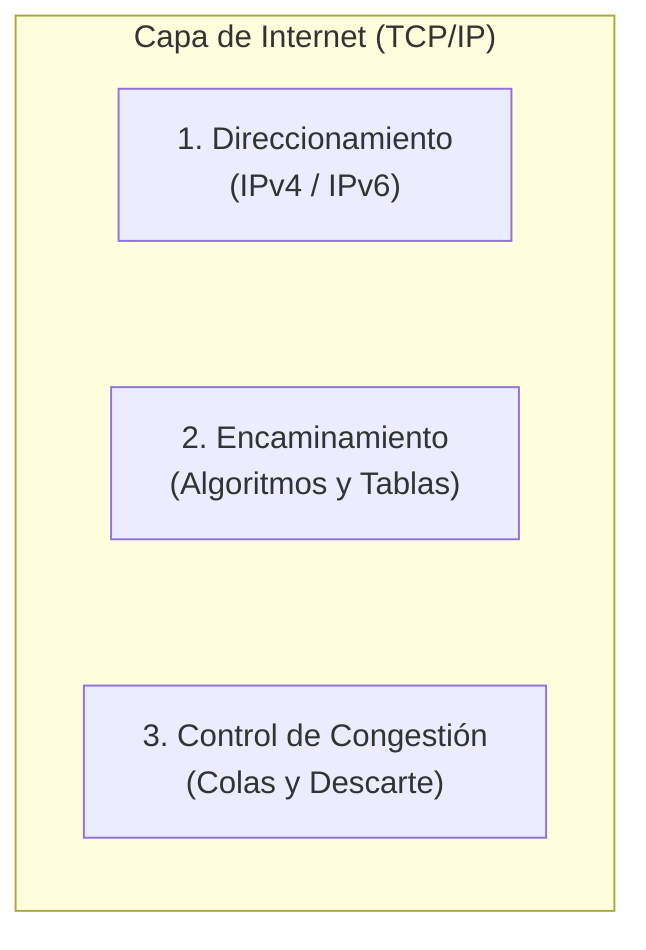
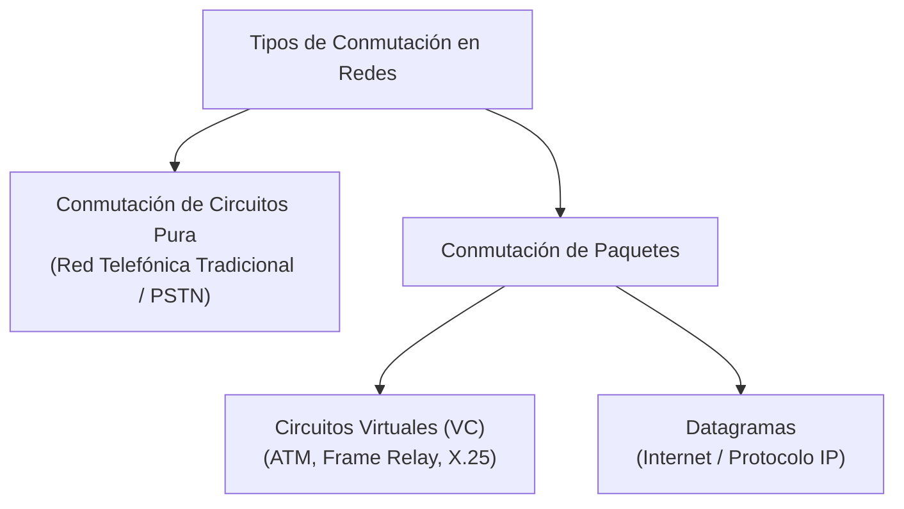
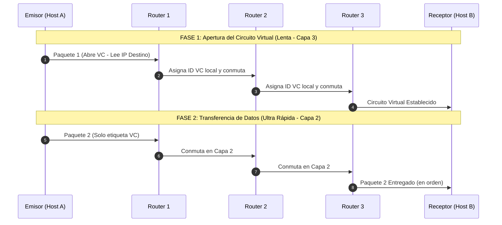
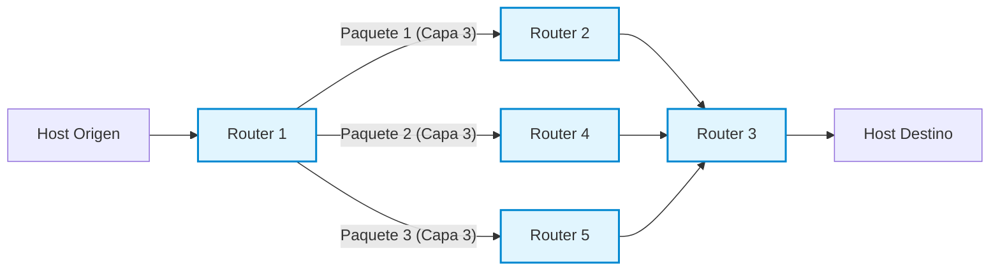
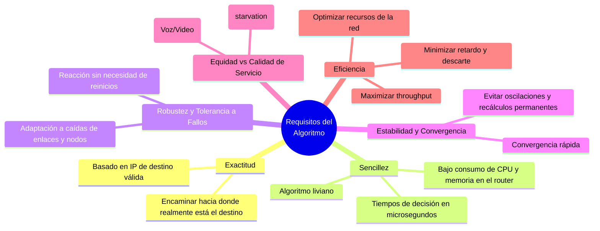
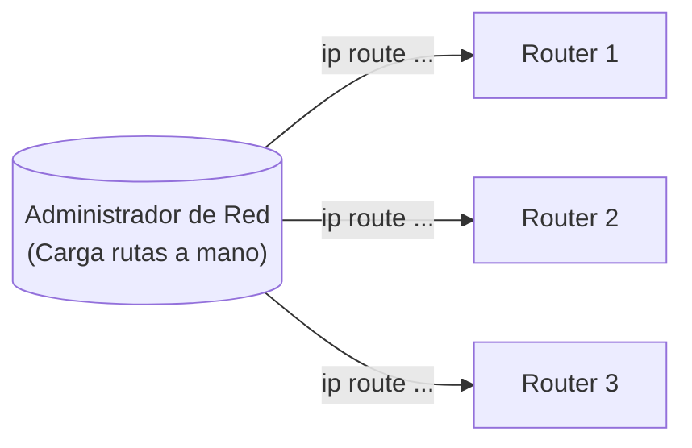
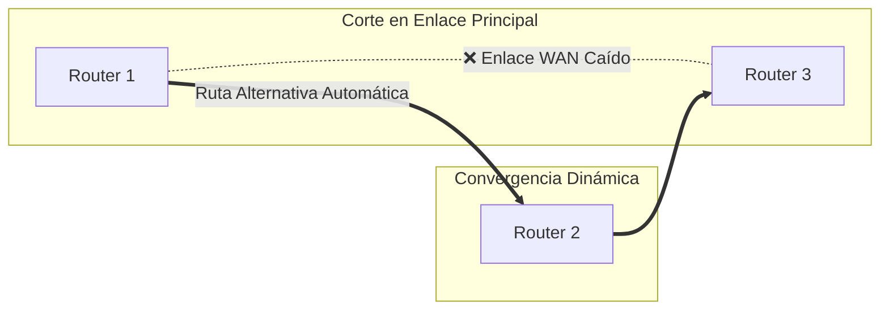
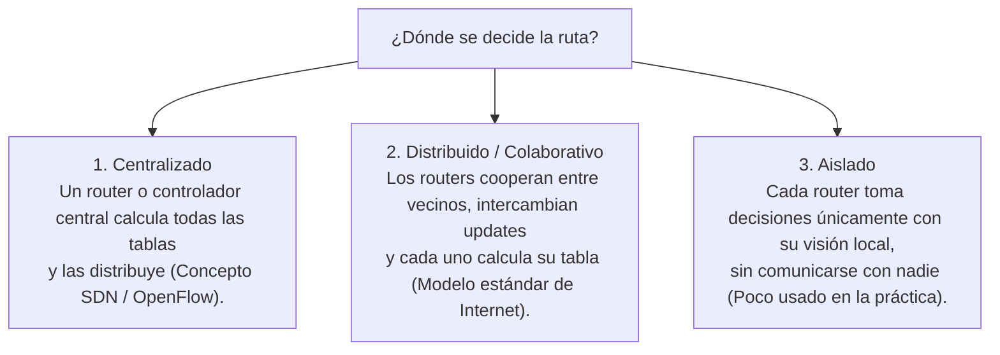

---
aliases:
subject: REDES
year: "4"
exam: PARCIAL2
unit: "4"
type: TEO
zk_type: fleeting
status: in-progress
date: 2026-08-17
source:
  - https://www.youtube.com/watch?v=nJy3_WXO9Z8&list=PLYZrqm_pzRumO_6c3u7yeHbNF9j6bkbM8&index=29
  - https://www.youtube.com/watch?v=N8O2xUNpQbc&list=PLYZrqm_pzRumO_6c3u7yeHbNF9j6bkbM8&index=26
  - https://www.youtube.com/watch?v=h4Bl7r2KpEA&list=PLYZrqm_pzRumO_6c3u7yeHbNF9j6bkbM8&index=27
tags:
---
---
![[P2-U04-P05 - RDD - Unidad 4 - Encaminamiento.pdf]]

---
## 1. Introducción y Ubicación en la Pila TCP/IP 

### 1.1. Las Tres Funciones de la Capa de Internet

La profesora abre la clase recordando que se ha cerrado la **Unidad 3 (Direccionamiento IP)** y que nos encontramos de lleno en la **Capa de Interred**.  y tmb seria capa 3 del modelo osi RED

Esta capa tiene tres responsabilidades troncales:
1. **Direccionamiento:** Asignación lógica de identificadores únicos a interfaces de red (IPv4 / IPv6, máscaras, subredes). *(Ya estudiado)*.
2. **Encaminamiento (Routing):** Determinación del camino óptimo que deben atravesar los paquetes para viajar desde un origen hacia un destino a través de múltiples redes intermedias. *(Tema troncal de esta y sucesivas clases)*.
	1.  los switches no se encaminan porque no llegan a esta capa
	2.  Se refiere a la determinación de la ruta que un paquete de datos debe seguir en una red para llegar desde su origen hasta su destino.
3. **Control de Congestión:** Mecanismos para evitar que los enlaces y routers de la red se saturen de tráfico.

### 1.2. El Encaminamiento como Teoría de Grafos
Para formalizar y resolver el problema del encaminamiento, la topología de la red se modela matemáticamente mediante la **teoría de grafos**:
- **Nodos:** Representan a los **routers** (o conmutadores de Capa 3).
- **Arcos / Aristas:** Representan los **enlaces físicos de comunicación** entre routers.
- **Pesos en los arcos:** Representan el **costo o métrica** asociada al enlace.

### 1.3 objetivo del encaminamiento
Objetivo del Encaminamiento: Encontrar la mejor ruta desde un punto de origen hacia un punto de destino en la red. La elección de la ruta puede basarse en diferentes criterios, como:
*  Mínimo Costo: Encontrar la ruta más económica en términos de recursos de red, como ancho de banda o distancia.
*  Mínimo Retardo: Minimizar el tiempo que lleva que los paquetes viajen desde el origen hasta el destino.
*  Criterio Administrativo: Seguir políticas o reglas administrativas definidas por los administradores de la red, como preferencias de ruta específicas.
> [!QUOTE] Analogía Docente: El camino a la Facultad
> *"Cuando ustedes salen de sus casas o departamentos y van hacia la facultad, no tienen una sola calle o un único camino: tienen múltiples opciones. Pueden elegir ir por la avenida más directa, tomar la Circunvalación aunque hagan el doble de kilómetros porque van más rápido, o evitar calles que se congestionan.
> El encaminamiento consiste exactamente en eso: habiendo múltiples caminos posibles para ir de un origen a un destino, determinar cuál es la mejor ruta a seguir. Pero no al azar ni al voleo, sino aplicando una lógica estricta en función de criterios bien definidos (mínimo retardo, menor costo, políticas del administrador). Esa ruta elegida es la que se instalará en la **tabla de encaminamiento** del router."*

## 2. Paradigmas de Transporte: Redes de Circuitos Virtuales vs. Redes de Datagramas 
Para comprender cómo encaminan los routers, es indispensable diferenciar los dos grandes paradigmas de transporte en redes de paquetes, contrastándolos con la telefonía tradicional.

### 2.1. Conmutación de Circuitos Pura vs. Circuitos Virtuales (VC)

repaso de circuitos:

| Característica                | Conmutación de Circuitos Pura (Telefonía / PSTN)                                                                                                               | Redes de Circuitos Virtuales (VC)                                                                                                             |
| :---------------------------- | :------------------------------------------------------------------------------------------------------------------------------------------------------------- | :-------------------------------------------------------------------------------------------------------------------------------------------- |
| **Reserva de Ancho de Banda** | **Física y estricta en todo el trayecto.** Se reserva el canal completo(ancho de banda) durante toda la llamada, se transmitan datos o haya silencio absoluto. | **No se reserva ancho de banda de forma exclusiva.** Los enlaces físicos se multiplexan/comparten entre múltiples comunicaciones simultáneas. |
| **Fases de Conexión**         | 3 fases: Establecimiento, Transferencia de voz/datos, Liberación.                                                                                              | 3 fases: Establecimiento, Transferencia de datos, Liberación.                                                                                 |
| **Ruta Física**               | Fija y dedicada durante la llamada.                                                                                                                            | Fija para todos los paquetes de esa sesión (circuito virtual).                                                                                |
| **Riesgo de Saturación**      | Si la red se llena de circuitos reservados, se bloquea (da tono de ocupado, ej. colapso en Navidad o Día de la Madre).                                         | Si no hay datos pasando en un instante, otros paquetes de otras conexiones usan el enlace libremente.                                         |
 A diferencia de la conmutación de circuitos tradicional (la red telefónica clásica), donde se reserva de manera rígida y dedicada el canal y el ancho de banda extremo a extremo durante toda la comunicación —produciendo un desperdicio si hay silencios o pausas—, las redes de circuitos virtuales (VC) combinan la predictibilidad de un camino prefijado con la eficiencia de compartir (multiplexar) los enlaces físicos entre múltiples usuarios.

  Ambos modelos comparten la estructura de tres fases (establecimiento, transferencia de datos y liberación) y garantizan que todos los datos sigan la misma ruta física, pero en los circuitos virtuales el enlace queda libre para otros paquetes cada vez que un flujo no está transmitiendo. 

#### 2. ¿Por qué se le llama "Circuito Virtual"?

  Porque crea la ilusión de tener un cable directo entre emisor y receptor (dado que todos los paquetes recorren el mismo camino predefinido y llegan en perfecto orden), pero sin tener un canal físico reservado de manera exclusiva.

#### 3. ¿Y por qué se menciona que "se puede reservar"? (Calidad de Servicio / QoS)

Lo que se puede hacer en un circuito virtual es una reserva lógica de Calidad de Servicio (QoS):
	• Se le pide a los routers del camino que aparten cierta capacidad de buffer (memoria) o que garanticen una tasa mínima para cuando aparezca tráfico prioritario (por ejemplo, video o voz).
	• Sin embargo, si en un momento no estás transmitiendo, el canal físico no queda bloqueado ni inutilizado: otros usuarios pueden seguir aprovechando ese ancho de banda.
### 2.2. Funcionamiento del Encaminamiento en Circuitos Virtuales (VC)
![[Pasted image 20260901175209.png]]

1. **Fase de Establecimiento (Apertura del Circuito):**
   - El **primer paquete** (de control/señalización) es el encargado de abrir el circuito virtual.
   - Es el paquete **más lento**: cada router intermedio debe desencapsular hasta **Capa 3 (IP)**, consultar su tabla de encaminamiento, elegir la interfaz de salida y registrar una entrada en su **tabla de conmutación de circuitos virtuales**.
   - Dicha tabla mapea: `[Interfaz de Entrada + ID Circuito Entrante] ➔ [Interfaz de Salida + ID Circuito Saliente]`.
2. **Fase de Transferencia:**
   - Los paquetes subsiguientes (paquete 2, 3, etc.) viajan a máxima velocidad: el router **no desencapsula hasta Capa 3**, sino que conmuta directamente en **Capa 2** consultando la etiqueta del circuito virtual en hardware.
3. **Fase de Liberación:**
   - Un paquete de terminación libera los identificadores de circuito en las tablas de los routers.

> [!TIP] Ventajas y Desventajas de Circuitos Virtuales
> - **Ventajas:**
>   - **Garantía de orden:** Todos los paquetes siguen exactamente el mismo camino físico y llegan en orden estricto.
>   - **Facilidad para Calidad de Servicio (QoS):** Al saberse de antemano el camino que recorrerán los paquetes, se pueden reservar buffers de memoria y slots de procesamiento en los routers para asegurar streaming de video/audio sin jitter ni cortes.
> - **Desventajas:**
>   - **Vulnerabilidad total a fallos:** Si un router intermedio (ej. Router 2) se apaga o falla, el circuito se destruye por completo. Para continuar la comunicación hay que renegociar y establecer un circuito virtual nuevo desde el origen.

---

### 2.3. Funcionamiento del Encaminamiento en Redes de Datagramas (Internet / IP) o Conmutacion de paquetes

En las redes de datagramas (filosofía original de Internet), **no existe conexión previa**:
- **Tratamiento independiente:** Cada paquete se trata como un datagrama autónomo.
	- Cada paquete encaminado de forma independiente.
- **Procesamiento salto a salto (Hop-by-Hop):** Cada router desencapsula **todos y cada uno de los paquetes hasta Capa 3**, lee la dirección IP de destino y consulta su tabla de encaminamiento.
- **Rutas dinámicas por paquete:** Si las condiciones cambian o hay múltiples enlaces de igual costo, el paquete 1 puede ir por un camino superior, el paquete 2 por el medio y el paquete 3 por abajo.

> [!IMPORTANT] Comparativa de Resiliencia y Orden
> - **Robustez y Tolerancia a Fallos:** Si el Router 2 se cae en pleno flujo, la comunicación **no se corta**. El Router 1 simplemente detecta la falla y encamina los siguientes paquetes a través del Router 4 o 5.
> - **Llegada Desordenada:** Al viajar por caminos con distintas latencias y anchos de banda, los paquetes pueden llegar desordenados al receptor.
> -  Velocidad más lenta debido al encaminamiento individual y cada router debe desencapsular hasta la capa 3 hasta la capa ip.
> 	- es decir llegan los bits, se desencapsula capa 2,
> - **¿Quién los reordena?** Pregunta la docente. El alumno **Santiago** responde acertadamente: **la Capa de Transporte, específicamente mediante el protocolo TCP** (usando números de secuencia). La Capa de Internet (IP) se desentiende del orden y de las retransmisiones.

#### porque es mas lento?
el motivo central es la sobrecarga de procesamiento salto a salto (hop-by-hop) en Capa 3:

¿Qué hace el router con cada datagrama en cada salto?

Cada vez que un paquete llega a un router, este tiene que hacer todo el ciclo completo de la pila de protocolos:

1. Recepción (Capa 1 - Física): Recibe el tren de bits eléctricos u ópticos por la interfaz física.
2. Desencapsulado a Capa 2 (Enlace de datos): Lee la trama (ej. Ethernet), comprueba errores (CRC/FCS) y le quita la cabecera de enlace para extraer el paquete IP.
3. Subida a Capa 3 (Red / IP): El router debe abrir la cabecera IP para leer la dirección IP de destino.
4. Búsqueda en la Tabla de Encaminamiento: La CPU del router debe buscar en su tabla de rutas cuál es la mejor coincidencia de prefijo (Longest Prefix Match) para decidir la interfaz de salida y el router
del siguiente salto.
5. Reencapsulado descendente: Decrementa el TTL (Time To Live), recalcula el checksum de la cabecera IP, vuelve a encapsular el paquete dentro de una nueva trama de Capa 2 (con nuevas direcciones MAC) y
lo modula a bits en Capa 1 para transmitirlo.

│ [!IMPORTANT] La clave de la lentitud
│ Esta tarea de desencapsular hasta Capa 3 → buscar en la tabla → volver a encapsular en Capa 2 se repite en absolutamente todos y cada uno de los routers del camino, para todos y cada uno de los paquetes
│ individuales.
──────
#### ¿Por qué los Circuitos Virtuales son mucho más rápidos?

En una red de circuitos virtuales, ese procesamiento pesado de Capa 3 se hace una sola vez (con el primer paquete que abre el camino).

A partir del segundo paquete:

• El router no sube a Capa 3: no lee IPs ni busca en tablas de rutas complejas.
• Conmuta directamente en Capa 2 mediante hardware ultra veloz (ASIC), simplemente leyendo el número identificador del circuito (Label / VC ID) en la cabecera de enlace y pasándolo a la interfaz de salida
preasignada.

En resumen: Datagramas es más lento porque cada router intermedio tiene que "pensar" y procesar la Capa 3 para cada paquete individual que cruza por él.

---

### concluciones segun el resumen, chekear
Conclusiones:
 Ambos enfoques se utilizan hoy en día.
 Redes de circuitos virtuales son eficientes para datos constantes y garantizan la calidad de servicio.
 Redes de datagramas son más robustas y tolerantes a fallos, pero pueden ser más lentas y presentar desorden
en la llegada de paquetes

## Algoritmos de encaminamiento
Un **algoritmo de encaminamiento** es la pieza de software (integrada nativamente en la pila TCP/IP(capa de interred) del sistema operativo y firmware de los routers) que toma la decisión: **¿por cuál de todas sus interfaces de salida debe reenviar un paquete que acaba de ingresar?**

la función de la capa de interred en la toma de decisiones sobre cómo enrutar paquetes,
enfocándose en los requisitos y tipos de encaminamiento:

### Requisitos

1. Exactitud: 
	1. Llegar al destino correcto, evitando rutas incorrectas. Ejemplo: Encaminar hacia el servidor web y no en dirección opuesta.
2. Sencillez: 
	1. Consumir recursos eficientemente. Minimizar el uso de memoria y ciclos de CPU. Evitar algoritmos que sean demasiado complejos y demoren el encaminamiento.
3. Robustez: 
	1. Adaptarse a cambios dinámicos en la red. Buscar rutas alternativas en caso de fallos de enlaces. Ser tolerante a fallos para mantener la conectividad incluso ante cambios en la topología.
4. Estabilidad: 
	1. Lograr la convergencia de manera eficiente. Una vez establecida la ruta, mantener la estabilidad en las tablas de encaminamiento. Evitar cambios frecuentes en las tablas de encaminamiento.
5. Equidad: 
	1. Tratar todos los paquetes de manera justa. Garantizar que todos los paquetes sean encaminados, sin dejar ninguno sin atención. Aunque algunos paquetes pueden tener prioridad, se busca equidad en el tratamiento general.
6. Eficiencia: 
	1. Encaminar de manera óptima, aprovechando eficientemente los recursos de la red. Buscar la mejor utilización del ancho de banda y minimizar la latencia en la transmisión de datos.

> [!NOTE] Reflexión en Clase: ¿Existe la Equidad Absoluta? `[29:32 - 30:06]`
> La profesora consulta al auditorio si en las redes reales todos los paquetes se tratan de forma idéntica. Los alumnos señalan que no: hoy en día los mecanismos de **Calidad de Servicio (QoS)** diferencian el tráfico. Los paquetes de video y voz en tiempo real tienen prioridad absoluta sobre una descarga de archivos. Sin embargo, el principio de equidad exige que el tráfico no prioritario **nunca sufra inanición (*starvation*)**; todos los paquetes deben ser entregados eventualmente.

---

## 4. Tipos de Encaminamiento: Estático vs. Dinámico 

### 4.1. Encaminamiento Estático (No Adaptativo)

En el enrutamiento estático, las tablas de los routers son cargadas **manualmente por el administrador de red**.
![[Pasted image 20260901182826.png]]

#### ¿Cómo nace un Router de fábrica? (Comparación Router vs. Switch)
- Un **router** nuevo de fábrica cuenta con CPU, memoria RAM y ROM, pero carece de disco rígido: **es un dispositivo "inútil" al inicio**. No sabe qué hacer ni por dónde reenviar nada.
- A diferencia de un **switch** (que al enchufarlo aprende dinámicamente direcciones MAC por autoaprendizaje e inunda tramas desconocidas), el router solo "aprende" automáticamente aquellas **redes que están directamente conectadas a sus interfaces**, una vez que el administrador les configura una dirección IP y máscara.
- Cualquier red remota que esté más allá de sus interfaces debe ser expresamente configurada.

#### La Regla de Oro del Enrutamiento: Rutas Bidireccionales
Durante la clase, la profesora plantea una topología típica:
$$\text{LAN A} \longleftrightarrow \text{Router 1} \longleftrightarrow \text{Router 2} \longleftrightarrow \text{Router 3} \longleftrightarrow \text{LAN C}$$

> [!QUESTION] Pregunta de la Docente `[35:48 - 36:58]`
> *"Si yo le configuro al Router 1 cómo llegar a la LAN C y le configuro al Router 2 cómo llegar a la LAN C... ¿hay conectividad total entre la LAN A y la LAN C?"*
> 
> Los alumnos (Luis y Santiago) responden: **¡No, falta el camino inverso!**
> Si enviamos un comando `ping` desde LAN A a LAN C, el paquete `ICMP Echo Request` llegará exitosamente a la máquina de LAN C. Pero cuando esta responda con un `ICMP Echo Reply`, el Router 3 y el Router 2 **no sabrán cómo llegar a la LAN A** y descartarán el paquete. En encaminamiento estático **siempre se deben definir las rutas de ida y de vuelta**.

> [!WARNING] Desventaja Crítica del Enrutamiento Estático
> Si se cae un enlace físico entre routers, aunque físicamente exista un enlace redundante alternativo en la topología, los routers **descartarán los paquetes (*packet drop*)**. El router estático es "ciego": no se adapta a los cambios de topología. El administrador debe detectar el corte y modificar manualmente la configuración en cada equipo.

• Ventajas en redes pequeñas y consumo mínimo de recursos.
	Y es seguro porque se sabe por donde viajan los paquetes
• Desventajas: No se adapta a cambios en la topología de la red.

---

### 4.2. Encaminamiento Dinámico (Adaptativo)
![[Pasted image 20260901183814.png]]
En el encaminamiento dinámico, el administrador configura un **protocolo de enrutamiento** (como RIP, OSPF, EIGRP o BGP) una única vez en los routers y *"se va de vacaciones tranquilo"*.

- Los routers intercambian periódicamente o ante eventos mensajes llamados **actualizaciones de encaminamiento (*routing updates*)**.
	-  Routers intercambian actualizaciones de encaminamiento.
- Si se corta un enlace (ej. WAN 3), los routers detectan la caída mediante paquetes de control (hellos), recalculan sus métricas y reconfiguran automáticamente sus tablas para desviar el tráfico por el camino alternativo (WAN 1).

• Adecuado para redes grandes con múltiples routers.

Desventaja:  Mayor consumo de recursos debido al intercambio de información.

#### 4.4. Clasificación según la Ubicación de la Toma de Decisiones 

### 4.3. Comparativa: Estático vs. Dinámico

| Criterio | Encaminamiento Estático | Encaminamiento Dinámico |
| :--- | :--- | :--- |
| **Configuración** | Manual, router por router, línea por línea. | Se habilita el protocolo una sola vez; aprendizaje automático. |
| **Mantenimiento** | Alto y tedioso si la topología cambia o crece. | Mínimo; la red se autoajusta sola ante fallos. |
| **Consumo de CPU y RAM** | Mínimo (tablas fijas, sin cálculos). | Mayor (procesamiento de algoritmos y mantenimiento de estados). |
| **Consumo de Ancho de Banda** | Cero tráfico de control en los enlaces. | Consume ancho de banda enviando *routing updates* continuas. |
| **Tolerancia a Fallos** | Nula (requiere intervención humana). | **Excelente** (adaptativo y altamente resiliente). |
| **Seguridad** | Alta (el administrador define exactamente la ruta). | Requiere autenticación de updates para evitar falsificación de rutas. |
| **Ámbito de aplicación ideal** | Redes muy pequeñas (1 a 3 routers) o enlaces stub. | Redes medianas, corporativas, campus y la Internet global. |

---

---
