---
aliases:
subject: REDES
year: "4"
exam: PARCIAL2
unit: "3"
type: Transcripcion
zk_type: resources
status: done
date: 2026-08-26
source:
  - https://www.youtube.com/watch?v=QHo2Iiwg5Yk&list=PLYZrqm_pzRumO_6c3u7yeHbNF9j6bkbM8&index=19
  - https://www.youtube.com/watch?v=UjxOVfQZ6M0&list=PLYZrqm_pzRumO_6c3u7yeHbNF9j6bkbM8&index=20
tags:
---
---

# Transcripcion
0:00

0 segundos

escucha bien ahí no está saturado nada no se escucharía bueno gracias

0:10

10 segundos

algún tema estresado en casa tenemos reunión de cátedras de otra cátedra 90 y decían que los dejaban entrar antes a

0:16

16 segundos

los alumnos no hasta que entrara primero el docente y se establecía dice que un

0:24

24 segundos

vínculo lindo se ponían a conversar si quieren hago esto eso ahora que no se me había ocurrido como test no se están viendo ahora supuestamente salvo los más

0:32

32 segundos

amigos entonces si quieren yo les habilitó que se puedan conectar antes de ustedes para hacer sociales como quien dice no

0:42

42 segundos

sé si quieren si les gustaría me acabo de acordar si no lo hubiera hecho

0:46

46 segundos

[Música]

0:47

47 segundos

antes como quieran si no seguimos así

1:01

1 minuto y 1 segundo

pone música pero que bien claro yo soy una por propia mordida perdón bueno antes y que prendía la cámara el sol

1:09

1 minuto y 9 segundos

pero es un lío que en este computador es porque hay que poner el celular habilitar el sol aunque a veces me anda

1:17

1 minuto y 17 segundos

demanda un trabajo realmente bueno joven

1:26

1 minuto y 26 segundos

bueno ya ver si me acuerdo para la próxima y les hago esto para que te puedan entrar un rato antes y dialogan

1:33

1 minuto y 33 segundos

entre ustedes no prende las cámaras pueden ser buenas o lo que quieran espero acordarme

1:41

1 minuto y 41 segundos

[Música]

1:43

1 minuto y 43 segundos

a ver sí

1:54

1 minuto y 54 segundos

bueno alguna duda pregunta inquietud hoy la idea es que veamos el protocolo

2:01

2 minutos y 1 segundo

ipv6 y hoy vamos a estudiar de qué se trata el protocolo de las direcciones es la única vez que vamos a ver hoy a lo

2:10

2 minutos y 10 segundos

mejor si no nos alcanza a verlas un poquito la clase que viene pero es en todo lo que vamos a ver sobre el híper versión 6

2:19

2 minutos y 19 segundos

lo organice así y después de 6 vamos a ver algo de balance

2:27

2 minutos y 27 segundos

bien si no hay dudas preguntas entonces empezamos

2:34

2 minutos y 34 segundos

la interés comparta

2:46

2 minutos y 46 segundos

ahí estamos bueno ahí deberían estar viendo

2:58

2 minutos y 58 segundos

la pantalla de introducción y pedersen 6 se exhiben graciaslucía tengo una secretaria que

3:04

3 minutos y 4 segundos

siempre está atenta muy bien bueno esos son los

3:13

3 minutos y 13 segundos

objetivas vamos a ver como un temario vamos a ver por qué surge y progresión 6

3:20

3 minutos y 20 segundos

hay perdón no estoy grabando me re olvide vuelvo vuelvo vuelvo

3:27

3 minutos y 27 segundos

tienen alguna duda pregunta alguna sobre lo que tenemos que conversar o empiezo no más los pregunta antes para que no quede tan largo

3:35

3 minutos y 35 segundos

el vídeo después profe un chico rodrigo puse en el chat que le costó entender un poco el proceso de tunelización perfecto

3:45

3 minutos y 45 segundos

a donde la distro rodrigo porque no no les vamos a explicar eso eso es la una

3:52

3 minutos y 52 segundos

forma de transición que se llama a ver si me puedes contar por el chat quizás gracias no sé no lo había visto

3:59

3 minutos y 59 segundos

está mirando arriba que tengo que tenía que saber a grabar que pusiste al

4:06

4 minutos y 6 segundos

rb6 no entiendo que la personalización perfecto que parte porque hay muchas

4:15

4 minutos y 15 segundos

técnicas de de tunelización otan el in como ustedes quieran decir

4:23

4 minutos y 23 segundos

ubicarme en qué tipo que teóricamente si pensáis eso sí

4:30

4 minutos y 30 segundos

si te pusiste a leer ip versión 6 son mecanismos de transición que se llaman cuando vos

4:40

4 minutos y 40 segundos

claro bueno y bueno pero entonces no le diste

4:49

4 minutos y 49 segundos

hiperséis y eso eso está relacionado bueno una es que el tema de tu

4:58

4 minutos y 58 segundos

organización se puede ver de varias formas una es tratar de encaminar un

5:04

5 minutos y 4 segundos

paquetito y progresión 6a dentro de otro paquete ipv4 eso es un túnel vos lo

5:11

5 minutos y 11 segundos

metes a un paquete adentro de otro eso se le llama naturalización perfecto existen diferentes técnicas diferentes

5:20

5 minutos y 20 segundos

métodos porque se creó el tema de tu organización porque es los mecanismos de transición que se llaman significa que

5:28

5 minutos y 28 segundos

hoy en día están coexistiendo ipv4 e ipv6 entonces qué pasa si vos querés conectar una máquina que soporta ipv4

5:35

5 minutos y 35 segundos

con otra máquina que soporta ipv6 o dos máquinas y dos extremos que soportan

5:42

5 minutos y 42 segundos

todo 6 y que tienen que transitar los paquetes por una red ip v4 ahí se establece un túnel si los túneles

5:50

5 minutos y 50 segundos

normalmente se establecen entre dos routers entonces el router antes de decir es un

5:58

5 minutos y 58 segundos

doble encapsulamiento eso es una actualización si es encapsular un paquete adentro de otro paquete en este caso sería el paquete de interés 6a

6:07

6 minutos y 7 segundos

dentro de un paquete v4 eso se hace a la salida del router cuando llega el router de destino donde termina el túnel de se

6:14

6 minutos y 14 segundos

encapsula es decir que sacan para qué tipo de 4 se queda con el paquete ip versión 6 y se la entrega al dispositivo

6:21

6 minutos y 21 segundos

ese es una de las formas existen varias varias varios mecanismos

6:30

6 minutos y 30 segundos

pero yo no se los prepare a eso porque me parecía que era demasiado complejo para dárselos y como ipv6 acá

6:37

6 minutos y 37 segundos

[Música]

6:38

6 minutos y 38 segundos

y si claro no termina entendiendo muy claro exacto exacto porque si los dos extremos hablan o entiendan hiperséis

6:46

6 minutos y 46 segundos

luego tenés que conectar esos dos extremos si tiene que atravesar por una red ipv6 y visto viaja con las redes persas pero si tiene que atravesar una

6:54

6 minutos y 54 segundos

red ip versión 4 hay que hacer como una traducción sería si también hay una que

7:00

7 minutos

se llama 64 pero eso es se desaconseja lo que más se use gesto de la naturalización

7:08

7 minutos y 8 segundos

yo no se los prepare claro interesa lo vemos la clase que viene pero la idea

7:14

7 minutos y 14 segundos

era no complicarlo tanto bueno perfecto por eso si les interesa a todos yo les dejo algunas diapositivas

7:23

7 minutos y 23 segundos

lo vemos ese tema en el problema eso es el sistema mecanismo de transición de ipv4 a ipv6 que es lo que estamos

7:30

7 minutos y 30 segundos

viviendo hoy en día básicamente pero en argentina se está manejando mucha ip versión 4 yo por ejemplo tengo arnet no

7:38

7 minutos y 38 segundos

me asigna una dirección ipv6 entonces las pantallas pero es captura ustedes bueno

7:47

7 minutos y 47 segundos

muy bien muy buena muy buena que viene eso como hiciste rodrigo se llama clase invertida donde

7:55

7 minutos y 55 segundos

el alumno lee antes de ir a clase es lo ideal es la ideal pero bueno por lo menos lo logramos con un alumno lo

8:02

8 minutos y 2 segundos

importante es yo ya ni les insisto porque es muy raro que lo hagan pero felicitaciones muy bien rodrigo

8:12

8 minutos y 12 segundos

bueno y gracias por producciã creo que me dijo que estaba escrito en lancha ahora si empezamos a grabar

8:19

8 minutos y 19 segundos

[Música]

8:27

8 minutos y 27 segundos

bueno entonces y en la clase de hoy vamos a ver ip versión 6 y la clase que viene entonces vamos a

8:34

8 minutos y 34 segundos

ver el tema de balance si queremos saber de inversión 6 primero porque surgió básicamente porque necesitan más

8:42

8 minutos y 42 segundos

direcciones net y se empezaron a agotar las direcciones ip versión 4 entonces surgió la necesidad de desarrollar otro

8:51

8 minutos y 51 segundos

protocolo que soportará una mayor cantidad de dispositivos de direcciones esto por qué porque se produjo un

9:00

9 minutos

crecimiento exponencial de internet entonces eso trajo aparejado que se conectarán muchísimos dispositivos a

9:07

9 minutos y 7 segundos

internet y cuando se creó mi perversión 4 y también muy pocos muy pocos más la conexión empezó entre cuatro

9:15

9 minutos y 15 segundos

universidades de eeuu entonces nunca nadie imaginó que todo el mundo iba a estar conectado

9:23

9 minutos y 23 segundos

a internet entonces bueno obviamente se empezaron a agotar las direcciones ip se empezaron a acabar entonces en la mitad

9:30

9 minutos y 30 segundos

de internet porque está dividido como dos grandes bandos en la comunidad de internet una se puso a desarrollar el protocolo ip

9:37

9 minutos y 37 segundos

versión 6 y otra y la otra mitad se puso a buscar estrategias medias raras que las vamos a ver nosotros como bl cms

9:46

9 minutos y 46 segundos

aire r traducción de dirección en un lado

9:51

9 minutos y 51 segundos

ipv4 sigue existiendo sigue funcionando y nosotros ahora vamos a ver en versión

10:00

10 minutos

6 después más adelante vamos a ver un tema estresamos agotamiento de la dirección y y vamos a ver todas las estrategias para que siga existiendo qué

10:08

10 minutos y 8 segundos

es lo que se está usando hoy en día de la ip versión 4 vamos a ver el tema del direccionamiento que es bastante distinto el tema de las

10:17

10 minutos y 17 segundos

direcciones ip versión 6 con respecto a las otras versiones 4 después vamos a por eso que les adelanto este tema y no

10:25

10 minutos y 25 segundos

vemos es como que no sigo el orden de texto al así del programa porque siempre es bueno ver el protocolo y progresión 4

10:34

10 minutos y 34 segundos

en forma comparativa con la libre versión 6 entonces por eso que los vemos medio seguido los temas

10:39

10 minutos y 39 segundos

[Música]

10:41

10 minutos y 41 segundos

vamos a ver la cabecera de inversión seis nosotros ya conocemos la cabecera de ip versión 4 vamos a ver qué hace la

10:47

10 minutos y 47 segundos

versión 6 como mejora la cabecera bueno vamos a ver acá pulseras características como las direcciones

10:55

10 minutos y 55 segundos

tipos de direcciones y vamos a ver cómo se configura ip versión 6 tanto en linux como en windows

11:00

11 minutos

[Música]

11:03

11 minutos y 3 segundos

qué pasa se pueden hacer prácticas de este tema cuáles son los objetivos con

11:10

11 minutos y 10 segundos

los cuales nació el protocolo ip versión 6 o cuando se hicieron bueno hay que desarrollar un nuevo protocolo que es lo que se plantearon los desarrolladores

11:18

11 minutos y 18 segundos

primero manejar muchísimos hosts ya cuerpos y millones de hosts pero realmente son muchos los dispositivos

11:26

11 minutos y 26 segundos

que se pueden direccionar hoy en día con esta versión 6 ya que uno desarrolla un nuevo protocolo lo que se hace es

11:33

11 minutos y 33 segundos

mejorar optimizar todo por ejemplo las tablas de encaminar todos los routers si entonces cuando uno

11:43

11 minutos y 43 segundos

cuando uno camina nosotros todavía no hemos visto bien cómo funciona un router pero un router es un aparatito yo algo

11:50

11 minutos y 50 segundos

ya les he comentado que lo que hace es recibe un paquete con una interfaz y en función de una tabla de encaminamiento

11:57

11 minutos y 57 segundos

que es el router busca la dirección ip de destino y trata de a hacer una comparación con los

12:06

12 minutos y 6 segundos

distintos renglones que tiene la tabla y decidir por cuál de las interfaces nos va a sacar hoy en día y versión 4 es

12:14

12 minutos y 14 segundos

bastante lento en este proceso porque las tardes un termina miento quedaron como grandes quedan como muchos

12:21

12 minutos y 21 segundos

renglones por decirlo de alguna manera entonces ya que se desarrolló un protocolo negro se intenta optimizar eso y reducir el tamaño de las palabras o

12:29

12 minutos y 29 segundos

sea que sean más chicas si una consulta tablas más chicas obviamente funciona todo más rápido saben caminar más rápido

12:38

12 minutos y 38 segundos

otro objetivo es simplificar el protocolo en la cabecera ustedes vieron de qué versión cuatro tenía como muchos

12:46

12 minutos y 46 segundos

campos entonces la idea es que se reduzca se reduzca la cantidad de campos el protocolo ip versión 6 para procesar

12:55

12 minutos y 55 segundos

más rápido siempre lo que se gusta es mayor rapidez mayor rapidez al tener menos campos es más simple

13:02

13 minutos y 2 segundos

procesarlo cuando reuters y se agiliza todo el proceso de encaminamiento y por ende el tiempo que tarda el paquete en

13:11

13 minutos y 11 segundos

llegar desde la origen hasta el destino proporciona seguridad ya es nativa la seguridad en ip versión 6 felipe versión

13:19

13 minutos y 19 segundos

4 en opcional opcional otra característica muy

13:28

13 minutos y 28 segundos

importante es permitir que el protocolo de evoluciones que significa eso que si se le quiere brindar una nueva funcionalidad al protocolo ip versión 6

13:36

13 minutos y 36 segundos

no hay que desarrollar otro protocolo nuevo como en la versión 6 789 sino que se le puede agregar lo que se llama una

13:45

13 minutos y 45 segundos

nueva cabecera o una siguiente cabecera se le brinda esa nueva funcionalidad cuando no desarrolló un protocolo define

13:54

13 minutos y 54 segundos

una serie de bits ustedes se vieron que vimos la cabecera de ethernet la de

14:01

14 minutos y 1 segundo

802.11 vimos la cabecera de ip y que es una cabecera son bits que tienen un determinado significado si yo quiero que

14:09

14 minutos y 9 segundos

el protocolo brinde una nueva funcionalidad tendría que prever de dejar algunos bits libres sin usar para

14:16

14 minutos y 16 segundos

que se puedan usar para otra función a futuro bueno ante versión 6 lo resolvió de una manera muy original con algo que

14:23

14 minutos y 23 segundos

se llama siguiente cabecera ya lo vamos a ver enseguida y algo muy importante que es lo que estuve leyendo rodrigo

14:32

14 minutos y 32 segundos

antes de venir a clase es el tema que coexistan las dos versiones porque porque no se puede decir bueno a partir

14:38

14 minutos y 38 segundos

de mañana empieza a funcionar solo la versión 6 y se tira abajo toda la infraestructura de esta versión 4 hoy en

14:47

14 minutos y 47 segundos

día estamos una etapa de transición y están coexistiendo las dos versiones la 4 y la 6 y perros encuentro expresión 6

14:55

14 minutos y 55 segundos

para que pueda dar sexo existen los que se llaman mecanismos de transición y uno de ellos es la

15:03

15 minutos y 3 segundos

tinellización que decía sobre sinceramente yo pensé que iba a durar

15:10

15 minutos y 10 segundos

menos esa transición pensé que se iba a producir el despliegue que se llama depresión 6 más rápido pero no todavía

15:18

15 minutos y 18 segundos

en falta y es más ya se acabaron las direcciones de ver son cuatro ya no hay pero si se las ingenian los proveedores

15:27

15 minutos y 27 segundos

de servicio para poder brindar conectividad con las pocas direcciones ip versión 4 que tienen

15:36

15 minutos y 36 segundos

a qué se refiere estas características avanzadas bueno son características como más importante con más más sofisticadas

15:44

15 minutos y 44 segundos

que tiene integración 6 primero es la fundamental por la cual fue creado ese protocolo es para tener un espacio

15:51

15 minutos y 51 segundos

que se llama de dirección es muchísimo más grande que quedarse en 4 es exageradamente grande

16:00

16 minutos

qué significa alcance y flexibilidad logran la dirección ip versión 6 tienen

16:08

16 minutos y 8 segundos

alcance en función de con qué dispositivos se conecten usan una dirección ip o usan otra dirección ip

16:15

16 minutos y 15 segundos

para poder conectarse con dispositivos están del otro lado del mundo o sea que están muy lejanos tienen que utilizar

16:23

16 minutos y 23 segundos

direcciones globales que se llaman que vienen a ser similares o equivalentes a las direcciones públicas de esta versión

16:32

16 minutos y 32 segundos

4 acá se llaman direcciones globales implementar lo que se llama su humanización esto todavía no lo hemos

16:39

16 minutos y 39 segundos

visto ya pero vamos a ver es hacer un resumen de varias direcciones mi pene

16:46

16 minutos y 46 segundos

y abarque a muchas direcciones por ejemplo si yo quiero hacer referencia a los números por decir algo 101 102 103

16:54

16 minutos y 54 segundos

104 105 lo que hago es publicar el valor 100 entonces si alguien quiere llegar a mis

17:04

17 minutos y 4 segundos

direcciones que son a 101-102 de 3 con que empiece con 100 el número 5 que tenga un 1 al principio me las encamina

17:12

17 minutos y 12 segundos

para mí es un resumen de ruta o sea cuando veamos el tema en versión 4 vamos a hacer resumen del producto en un

17:20

17 minutos y 20 segundos

gráfico 36 pero una pregunta no sé si volveremos a ver no entendí lo de alcance y

17:27

17 minutos y 27 segundos

flexibilidad global eso lo vamos a ver las direcciones tienen un alcance en el

17:34

17 minutos y 34 segundos

centro de que por ejemplo por en tu casa y empieza más lucía no sé tanto por te dicen luli o looks y entonces vos en

17:41

17 minutos y 41 segundos

función de con quien te comuniques usan un nombre para comunicarse con vos ahora si te comunicas con un hilo que yo estoy más lejos tuyo

17:50

17 minutos y 50 segundos

amigo me tenéis que decir por mi nombre sea hola a cecilia sánchez y yo te digo hola lucia toya por ejemplo es decir que

17:56

17 minutos y 56 segundos

en función de qué tan lejos esté el dispositivo origen y destino usa un tipo de dirección diferente a eso se refieren

18:05

18 minutos y 5 segundos

al cannes gracias de nada pero pregunten ustedes

18:12

18 minutos y 12 segundos

cualquier duda porque hay temas que no los vamos a volver a ver la anp ley que significa plug-and-play en el que una computadora se conecta a

18:22

18 minutos y 22 segundos

un switch por ejemplo un access point y automáticamente tiene conectividad independientemente que alguien le

18:30

18 minutos y 30 segundos

configure una dirección t sola la computadora se auto inventa su propia dirección ip versión 6 y no hace falta

18:39

18 minutos y 39 segundos

que nadie le asigne una dirección nivel allá más adelante les voy a hacer que vean ustedes las que tienen ustedes

18:47

18 minutos y 47 segundos

en su máquina qué significa esto algo vimos de

18:54

18 minutos y 54 segundos

traducción de direcciones de red se acuerdan cuando planteamos las direcciones ip privadas que era las bielas 17 16

19:01

19 minutos y 1 segundo

192 168 en este caso en ipv6 no hace falta ser traducción de direcciones a

19:09

19 minutos y 9 segundos

eso se refiere extrema extremos sin necesidad de traductor de traducir nada si yo uso una dirección ip global y voy

19:16

19 minutos y 16 segundos

a usar esa dirección ip tanto adentro de mi empresa como hacia fuera de mi empresa es muy lento en el proceso de traducción

19:25

19 minutos y 25 segundos

de nada así está funcionando hoy en día y progresión 4 con traducción pero es muy lento entonces y se trató de evitar

19:33

19 minutos y 33 segundos

esa esa traducción la cabecera es más sencilla tiene menos campos y ahora vamos a ver enseguida el

19:42

19 minutos y 42 segundos

encaminamiento es más eficiente porque el encaminamiento es geográfico y es similar a la red telefónica que encamina

19:51

19 minutos y 51 segundos

geográficamente entonces así se permite que las tablas de encaminamiento sean mucho más chicas más pequeños

19:58

19 minutos y 58 segundos

no maneja el broadcast no existen los brazos y nosotros vivimos 04 hiperséis no los tienen consideran que no son

20:06

20 minutos y 6 segundos

necesarios que consumen muchos recursos de la pc o de los dispositivos entonces ese servidor es entonces no se eliminó

20:14

20 minutos y 14 segundos

en el tema de broadcast no manejar check si se acuerdan que cuando vimos el protocolo ip versión 4 había un campo que chequeaba que la

20:24

20 minutos y 24 segundos

cabecera sea correcta un código de redundancia cíclico por ejemplo y eso culpa del pdl que variaba salto salto

20:31

20 minutos y 31 segundos

había que calcularlo muchas veces bueno como es lento eso también directamente se elimina el cálculo del sexo y tb 6 no

20:39

20 minutos y 39 segundos

tiene no controla integridad como índice del paquete ni del paquete ni de la cabecera lo delega a otras capas de la

20:49

20 minutos y 49 segundos

pila de protocolos como por ejemplo la capa de transporte maneja cabeceras de extensión esto es

20:57

20 minutos y 57 segundos

para que el protocolo pueda evolucionar pero vamos a ver en seguir así y dentro de la cabecera lo vamos a

21:03

21 minutos y 3 segundos

explicar bien está maneja etiquetas de flujo en un campo

21:10

21 minutos y 10 segundos

que nuevo se incorporó en la cabecera el protocolo ip a nivel general que les parece es orientado a conexión o no

21:18

21 minutos y 18 segundos

orientado conexión el protocolo ip se acuerdan perfecto muy bien es no

21:29

21 minutos y 29 segundos

orientado a conexión porque estamos montados sobre una red es conmutación de paquetes entonces no ha orientado conecta sin embargo y está versión 6

21:36

21 minutos y 36 segundos

tiene un campo que se llama etiqueta del flujo que ese campo permite que todos todos los paquetes pertenecientes a un

21:44

21 minutos y 44 segundos

mismo flujo por ejemplo una película que estoy viendo o una llamada de voz todo ese flujo viaje por el mismo camino

21:53

21 minutos y 53 segundos

físico como lo hace poniéndole una etiqueta entonces todos los paquetes que tienen esa etiqueta van a ser

22:01

22 minutos y 1 segundo

encaminados físicamente por el mismo camino es como que tuvo media controlarse a este campo pero bueno sé por qué surgió porque para brindar

22:10

22 minutos y 10 segundos

calidad de servicios si ustedes quieren brindar cabida en servicio los paquetes tienen que llegar ordenados tienen que llegar rápido entonces si todos viajan

22:19

22 minutos y 19 segundos

por el mismo camino se supone que van a llegar por ejemplo ordenados fíjense acá el espacio de

22:28

22 minutos y 28 segundos

direccionamiento una una dirección ip versión 4 tiene 32 bits eso ya lo

22:36

22 minutos y 36 segundos

sabemos bastante bien ya lo estuvimos viendo todo y que el world ipv6 tiene

22:42

22 minutos y 42 segundos

128 bits fíjense como cuadruplicaron el tamaño 32 por 4 128 sin embargo no es que se

22:52

22 minutos y 52 segundos

puedan tener el cuádruple de direcciones porque como esto es binario fíjense con 32 bits nosotros podemos tener 4200

22:59

22 minutos y 59 segundos

millones de direcciones ip versión 4 con ipv6

23:06

23 minutos y 6 segundos

podemos tener bueno todo este número fíjense no lo sé nombra tiene un nombre pero no me acuerdo cómo se dice es

23:14

23 minutos y 14 segundos

impresionantemente grande si es 3.4 por 10 a la 38 direcciones ip o nodos

23:23

23 minutos y 23 segundos

direccionados que se llama si podría ser una pc un teléfono un televisor un lavarropas una heladera por que

23:32

23 minutos y 32 segundos

exageraron con el tema de la cantidad de direcciones ip primero porque sabe entre dos incógnito de cuatro entonces dijeron

23:39

23 minutos y 39 segundos

otra vez no nos va a pasar lo mismo entonces y previeron exageradamente el tema de la cantidad de las direcciones

23:47

23 minutos y 47 segundos

además está muy de moda el sistema internet de las cosas que muchos dispositivos son ip direccionables

23:55

23 minutos y 55 segundos

entonces ahora ya no vamos a necesitar una dirección ip por persona como quien dice sino que vamos a tener que hasta

24:03

24 minutos y 3 segundos

los objetos van a tener direcciones ip entonces bueno por eso que exageraron en cuanto a la cantidad de dirección ip que podemos llegar a tener con interés

24:11

24 minutos y 11 segundos

fíjense acá 5 por 10 a la 28 que es muchísimo direcciones por personas

24:20

24 minutos y 20 segundos

es impresionante o sea yo creo que con esto ya no nos quedamos más sin dirección ip versión 6 manos eres quien

24:27

24 minutos y 27 segundos

se conquistemos con sistemas planetas al aqsa mente ahí debe haber que desarrollar otro pero por ahora por unos

24:34

24 minutos y 34 segundos

cuantos años vamos a tener suficientes direcciones ip versión 6 fíjense lo que es el resumen de ruta acá simplemente lo

24:41

24 minutos y 41 segundos

vamos a nombrar porque es más fácil trabajar cuando eres un 4 si cuando tengamos la clase de sdr

24:50

24 minutos y 50 segundos

que se llama y yo les voy a explicar cómo se calculan los resúmenes a qué se refiere una suma decisión o resumen de

24:57

24 minutos y 57 segundos

ruta este router tiene en muchos clientes y va a tener varios clientes entonces

25:06

25 minutos y 6 segundos

suponiendo que este router es un y s&p un proveedor de servicios de internet este proveedores en internet va aa

25:14

25 minutos y 14 segundos

a tener por ejemplo va a asignar lo que se llama bueno ya se les presentó el tema una dirección una parte de una dirección de integración 6 la primera

25:24

25 minutos y 24 segundos

parte sería el equivalente a nuestra dirección de red de itv 4 y la parte de hosts no

25:32

25 minutos y 32 segundos

está esta gráfica data este barra 48 se llama prefijo que equivale entre

25:38

25 minutos y 38 segundos

comillas a la máscara de red que nosotros habíamos visto indicadores son cuatro tampoco maneja máscaras y pre

25:46

25 minutos y 46 segundos

versión 6 pero maneja prefijos que se llama entonces este proveedor de servicio le asigna dirección pegas a sus

25:53

25 minutos y 53 segundos

clientes con un prefijo de 48 bits aquí hay otro proveedor de servicio que le

26:00

26 minutos

asigna a sus clientes un prefijo de 48 bits qué pasa si este este proveedor de servicios

26:08

26 minutos y 8 segundos

tuviera 100 clientes tendría que publicar acataría de troncal de internet tendría que publicar 100 direcciones y

26:17

26 minutos y 17 segundos

ver si si éste otro proveedor de servicios tuviera 100 clientes también tendría que publicar las direcciones de

26:25

26 minutos y 25 segundos

esos 100 clientes qué pasaría en la nube habrían dos se tendrían que agregar 200 renglones en la tablet de encaminamiento

26:33

26 minutos y 33 segundos

100 de los clientes que están acá arriba y 100 de los clientes de este proveedor acá abajo para tratar de reducir las tablas de

26:42

26 minutos y 42 segundos

encaminamiento de las troncales de internet fíjense hace un resumen los routers

26:50

26 minutos y 50 segundos

hacen resúmenes de ruta que son números que tienen un prefijo menor fíjense que es más chico que 48 32 entonces esto qué

26:59

26 minutos y 59 segundos

significa que esta dirección ip abarca tanto a éstas como estas si a su vez si

27:08

27 minutos y 8 segundos

hay otro mi proveedor de servicio por completo el nivel 2 nivel 1 se acuerdan cuando seleccionamos de la arquitectura

27:16

27 minutos y 16 segundos

de internet estaban divididos en tierras que se llama o niveles 3 2 y 1 los tres

27:23

27 minutos y 23 segundos

son los que se conectan con los clientes y los dos son intermedios y los siete de nivel uno son la que constituye constituye la troncal de internet

27:32

27 minutos y 32 segundos

entonces también que nos vamos acercando al centro de internet al núcleo de internet el prefijo cada vez es menor

27:39

27 minutos y 39 segundos

por qué porque así se ahorran de tener renglones en la tabla de encaminamiento a ver algún ejemplo conectó de 4 a ver

27:47

27 minutos y 47 segundos

si me entienden si yo estoy manejando sus redes vieron que las subredes se manejan adentro de la empresa pero cuando salimos de la

27:56

27 minutos y 56 segundos

empresa desde afuera no nos ven no ven las sobres que hacen nuestra empresa nuestro router citó para

28:04

28 minutos y 4 segundos

decirle a todo el mundo cuáles son las direcciones de que nosotros tenemos adentro manda un resumen que es la dirección de red por ejemplo si la

28:12

28 minutos y 12 segundos

dirección de red abarca o es un resumen de todas las subredes que nosotros tenemos si acá vas a entender esto es

28:21

28 minutos y 21 segundos

unas humanización de ruta es una dirección y ven con un prefijo más corto

28:27

28 minutos y 27 segundos

incluyen a estas direcciones ip y esa sería la idea

28:34

28 minutos y 34 segundos

y eso hace que contamina si es para descentralizar la responsabilidad de las redes ubicarlas

28:42

28 minutos y 42 segundos

más que descentralizar todos los van a tener que buscar lo que pasa que fíjate si yo tengo acá a la derecha alguien que

28:50

28 minutos y 50 segundos

le manda un paquete alguna ip que empiece con 200 104 100 002 que va a ser

28:57

28 minutos y 57 segundos

este router no va a tener que mirar los 48 primeros bits sino que con solo mirar 16 ya encamina la llamada pero en el

29:06

29 minutos y 6 segundos

paquete hacia acá cuando llegue el paquete a estos routers estos routers como ya se están acercando al destino van a tener que mirar o

29:14

29 minutos y 14 segundos

comparar la dirección ip de destino que viene en el paquete con la dirección de red hay está acá pero van a tener que

29:22

29 minutos y 22 segundos

comparar ahora 32 bits no tener que comparar un poquito más comparan por ejemplo tiene que caminar para este lado una vez que llegaste a proveedores de

29:30

29 minutos y 30 segundos

servicio al progrese antes iba a tener 100 renglones que eran los 100 clientes porque son redes distintas estas son

29:37

29 minutos y 37 segundos

direcciones de red y la va a encaminar por la interfaz que correspondan pero no es que descentraliza es como que

29:45

29 minutos y 45 segundos

el objetivo es que los los routers que están en la troncal de internet tengan menos renglones en la tabla de encaminamiento entonces comparan menos

29:54

29 minutos y 54 segundos

bits al comparar menos bits de la tabla de encaminamiento con la ip de destino del paquete y lo encamina más rápido que

30:02

30 minutos y 2 segundos

no es lo mismo comparar 16 bits que comparar 48 bits se entienden

30:15

30 minutos y 15 segundos

otra cosa otro aspecto de esta perversión 6 es que el encaminamiento es geográfico lo vemos con un gráfico de

30:24

30 minutos y 24 segundos

los registros regionales fíjense acá esta no esta escala en cuanto al tamaño de renglón pero me

30:32

30 minutos y 32 segundos

gustó el gráfico por eso lo puse aquí hay un renglón otro renglón

30:38

30 minutos y 38 segundos

nosotros les llamamos palabras me pero 4 se acuerdan que tenía una dos

30:47

30 minutos y 47 segundos

tres cuatro cinco palabras de 32 bits la mayoría de los paquetes porque este campo opciones en general no se usa

30:57

30 minutos y 57 segundos

fíjense todos los campos que tienen perversión 4 cuál es la idea acá está con color los campos que desaparecen en

31:04

31 minutos y 4 segundos

el caso del color rojo desaparece en esos campos en ipv6 no tenemos nada de color rojo el color amarillo son los

31:12

31 minutos y 12 segundos

campos que quedan exactamente igual con el mismo nombre de la misma función son estos tres y los campos que están de

31:19

31 minutos y 19 segundos

color celeste cambia el nombre pero la función es muy parecida y es muy similar y hay un nuevo campo que en este de

31:28

31 minutos y 28 segundos

etiqueta de flujo que tiene otro color distinto hoy vamos a ver los campos de ip versión 6 el primer campo de la cabecera en el

31:37

31 minutos y 37 segundos

campo vers perdón ya que está dividido también en palabras vamos a este es una palabra de 32 bits esta es otra palabra de 32 bits ya que hay varias palabras

31:46

31 minutos y 46 segundos

que vamos a ver por qué todo paquete y progresión 6 empieza con el tramo versión igual que ip versión 4

31:55

31 minutos y 55 segundos

por qué y por qué en función del valor voy a seguir interpretando de una manera los bits que siguen o voy a

32:03

32 minutos y 3 segundos

interpretarlo de otra manera si el tranco versión en integración 4 dice el 0 100 que es el 4to en ip versión 6 dirá

32:13

32 minutos y 13 segundos

01 10 que es el 6 en binario

32:17

32 minutos y 17 segundos

[Música]

32:19

32 minutos y 19 segundos

el segundo campo dice clase de tráfico este campo es como que se le blanqueó en el nombre

32:27

32 minutos y 27 segundos

antes de que 4 se llama tipo de servicio en clase de tráfico es para distinguir

32:34

32 minutos y 34 segundos

flujos de tráfico distinto o sea para manejar prioridades básicamente para brindar calidad de servicio si en un tráfico de voz o cualquier tráfico en

32:43

32 minutos y 43 segundos

tiempo real va a ser encaminado de una manera más rápida por los routers sí y un tráfico de correo electrónico de

32:50

32 minutos y 50 segundos

páginas web que tienen muy no hace falta que llegue tan rápido entonces tiene prioridad o baja para eso es este campo

32:59

32 minutos y 59 segundos

para manejar diferentes tipos o clases de tráfico tal cual lo dice acá después viene un nuevo campo que se

33:07

33 minutos y 7 segundos

llama etiqueta del flujo de este campo en el que dijimos recién que es para que todos los paquetes que corresponden a un mismo flujo tengan una misma

33:15

33 minutos y 15 segundos

etiqueta tengan un valor acá entonces así dos routers lo encaminan más rápido y por el mismo camino físico sería algo

33:25

33 minutos y 25 segundos

así como un circuito virtual si ustedes vieron en comunicaciones lo que era un circuito virtual que es establecer una

33:33

33 minutos y 33 segundos

conexión sobre una red de conmutación de paquetes esto sería algo parecido

33:41

33 minutos y 41 segundos

en este campo de longitud de pay load es la longitud de los datos de la carga útil que está acá abajo lo que yo estoy

33:48

33 minutos y 48 segundos

encapsulando sería la longitud de los de los datos este campo siguiente cabecera tiene la misma

33:57

33 minutos y 57 segundos

función que el campo de protocolo qué significa el campo protocolo que significa el siguiente cabecera que

34:06

34 minutos y 6 segundos

estoy encapsulando es decir que te que metió adentro del paquete ip versión 6 soportar encapsulando que viene de

34:14

34 minutos y 14 segundos

arriba un segmento que se ve en el segmento vp o un paquete que sistema nipper asestaron y cmp todavía no lo

34:21

34 minutos y 21 segundos

hemos visto pero bueno también se pueden capturar en un paquete tanto ipv4 como un 36 entonces básicamente el campo protocolo o siguiente cabecera me dice

34:30

34 minutos y 30 segundos

que es lo que estoy encapsulando con en la siguiente cabecera si ya vamos a ampliarlo esto porque gracias a este

34:37

34 minutos y 37 segundos

campo que es lo nuevo y lo muy original que tiene progresión 6 es que el protocolo puede evolucionar porque yo

34:44

34 minutos y 44 segundos

puede agregarle muchas cabeceras que dice rodrigo con el protocolo

34:52

34 minutos y 52 segundos

de destino perfecto hasta que el protocolo podría exponer a eso te referís en el siguiente cabecera

35:01

35 minutos y 1 segundo

cuál es el protocolo de destino bien bien bien sí sí sí atender esa tenden exacto es ese campo se usa en el origen

35:08

35 minutos y 8 segundos

para especificar que están encapsulando y en el destino para saber a quién le tiene que entregar ese paquete después

35:17

35 minutos y 17 segundos

debes encapsularse cuando vos eliminas cuando tres eliminan toda la cabecera a quien le entregan la carga útil para eso

35:24

35 minutos y 24 segundos

en este campo exacto sería como el protocolo de destino también está perfecto no atentaría la pregunta si 54

35:32

35 minutos y 32 segundos

este de límite de saldos el límite es se le blanqueó el nombre a qué campo a ver si se dan cuenta

35:42

35 minutos y 42 segundos

muy bien al time to live a esto ante l originalmente el ipv4 quería contar

35:50

35 minutos y 50 segundos

tiempo quería contar segundos los segundos que tenía divido un paquete pero como era bastante completo hoy en día se usa para contar saltos que hemos

35:58

35 minutos y 58 segundos

salto un router entonces academy pensa y se le blanqueó el nombre y se cuenta la cantidad de santos y así también se

36:07

36 minutos y 7 segundos

llaman campos y cada vez que pasa de paquete por un ruta es el límite exacto se reduce en 1 es básicamente para que

36:14

36 minutos y 14 segundos

no queden dando vueltas eternamente paquetes y en internet en internet o dentro de una empresa donde sea

36:21

36 minutos y 21 segundos

/ reuters por ejemplo a cada dirección original a ver qué les parece cuantas palabras abarcará una dirección origen

36:30

36 minutos y 30 segundos

con una dirección de actina 4 efecto 4 muy bien porque porque dijimos

36:37

36 minutos y 37 segundos

las prisiones y personas estiman el cuádruple la cantidad de bits con ipv4 entonces cuántos sumen viendo cuántos

36:46

36 minutos y 46 segundos

bytes tendría una cabecera de inversión 6 tantos bytes tendría toda la cabecera

37:02

37 minutos y 2 segundos

by 40 muy bien muy bien decía 40 perfecto porque porque nosotros tenemos

37:12

37 minutos y 12 segundos

una más fácil porque cada dirección dijimos que tenía cuatro palabras si tengo cuatro palabras

37:21

37 minutos y 21 segundos

acá cuatro palabras a cabo cuatro renglones serían son ocho nueve diez son diez renglones o diez palabras como

37:29

37 minutos y 29 segundos

cada renglón tiene 32 bits o lo que es lo mismo 4 bytes 10 por 440 bytes

37:38

37 minutos y 38 segundos

y con respecto a ipv4 en más chicos más grandes el tamaño de la cabecera

37:46

37 minutos y 46 segundos

sería más chico de la mitad quién es más chico lucía el ipv4 es

37:55

37 minutos y 55 segundos

perfecto perfecto de baño ipv4 tiene 20 bytes y mi campo opción es

38:04

38 minutos y 4 segundos

que normalmente cualquier paquete que viaja por internet no tienen transacciones entonces son 20 bytes y el ipv6 tiene 40

38:12

38 minutos y 12 segundos

es el doble pero según lo que dijimos clave que simplificar el protocolo uno de los objetivos es simplificar quien

38:19

38 minutos y 19 segundos

tiene más campos y por 426 la cabecera f4

38:26

38 minutos y 26 segundos

bien así a simple vista se ve que tiene muchísimos más campos con mucho más campos ipv4 que intereses a eso se refiere de la simplificación si bien

38:34

38 minutos y 34 segundos

ocupa más bytes pero el protocolo usted han desarrollado el programa además tiene como meta menos y menos datos para

38:43

38 minutos y 43 segundos

procesar sin menos campos para procesar fíjense que la fragmentación no existe o sea él no no se usa normalmente en

38:51

38 minutos y 51 segundos

interesáis prefirió directamente si un paquete no puede ser no puede ser encapsulado porque en una

39:00

39 minutos

sistema mt usa cuerdas no me a máxima de transferencia no fragmentarlo directamente avisarle al origen que el

39:07

39 minutos y 7 segundos

paquete es muy grande y sacaron estos campos de la fragmentación por este renglón que era para fragmentar sacaron

39:15

39 minutos y 15 segundos

el campo de longitud de la cabecera porque porque la cabecera fija siempre tiene la misma cantidad de bytes y

39:21

39 minutos y 21 segundos

sacaron el cjex un sí porque consideran que no tiene sentido calcular el check son y tantas veces dos veces en

39:29

39 minutos y 29 segundos

transadas como una vez del original no venga el destino no tiene sentido y el campo opción es que lo eliminaron en

39:36

39 minutos y 36 segundos

hiperséis pero no es que no maneje opciones ni persecución que se manejan de otra forma como se manejan a través de este campo que se llama siguiente

39:45

39 minutos y 45 segundos

cabecera ahí lo vemos es el siguiente cabecera también se

39:52

39 minutos y 52 segundos

llama cabeceras de extensión fíjense cómo funcionan hasta acá llega la cabecera display versión 6 la que vimos

39:59

39 minutos y 59 segundos

versión por ejemplo si yo quiero puedo colocarle donde dice siguiente cabecera el código de un protocolo o de otra

40:08

40 minutos y 8 segundos

cabecera que está acá adentro de esta cabecera va a haber otro campo que dice siguiente cabecera adentro de esta

40:15

40 minutos y 15 segundos

cabecera va haber otro campo que dice siguiente cabecera entonces yo puedo ir expandiendo la cabecera de ip versión 6 acá te puedo

40:25

40 minutos y 25 segundos

poner cualquier cantidad de cabeceras no aquí a mí se me antoje sino las que están definidas en el protocolo y puedo

40:33

40 minutos y 33 segundos

hacer que mi protocolo tenga como menos funciones nuevas funcionalidades fíjense iron vemos este estadio positiva

40:42

40 minutos y 42 segundos

esta vertical ahora lo vemos en forma horizontal con un ejemplo concreto lo más común es que nosotros tengamos datos

40:50

40 minutos y 50 segundos

a estos datos encapsulado en un segmento tcp en una cabecera ssp todo esto que es

40:58

40 minutos y 58 segundos

un segmento se encapsula o se le agrega la cabecera de impresión 6 sí entonces en el campo todo esto forma un paquete

41:07

41 minutos y 7 segundos

todo esto es un paquete en el campo siguiente cabecera en este eje del endeavour 6 está el código de tcp por

41:16

41 minutos y 16 segundos

qué porque el protocolo que está encapsulando ya yo estoy capturando un segmento p esp o como decía rodrigo reacciones para saber a quién le voy a

41:25

41 minutos y 25 segundos

entregar este en esta carga útil cuando llegue al destino este paquete entonces en este caso

41:32

41 minutos y 32 segundos

siguiente cabecera este esp hay opciones no no hay opciones acá en este primer ejemplo no hay opciones en este segundo

41:41

41 minutos y 41 segundos

sí y una opción entonces donde dice el siguiente cabecera ya no va lo del tcp sino que va la opción de encaminamiento

41:50

41 minutos y 50 segundos

se conectaba encaminamiento vaso de no origen encaminamiento estricto bueno que se le

41:57

41 minutos y 57 segundos

agrega otra cabecera esta cabecera no está detallada pero tiene un campo que dice longitud para saber hasta dónde

42:04

42 minutos y 4 segundos

llegará esta cabecera sí y a su vez tiene otro campo que dice siguiente cabecera en este caso si ya tenemos que

42:12

42 minutos y 12 segundos

poner tcp fíjense cómo se agrandó la cabecera normal del hiperséis se agrandó con la

42:19

42 minutos y 19 segundos

cabecera de encaminamiento esta sería una opción en el siguiente ejemplo en el tercero

42:25

42 minutos y 25 segundos

tenemos dos opciones si tenemos de encaminamiento y dentro de encaminamiento uno que se llama

42:33

42 minutos y 33 segundos

fragmento y de dentro de esta cabecera si la siguiente cabecera reaccionáis este siete y acá le agregaron a otra

42:42

42 minutos y 42 segundos

opción que es seguridad es decir que cada uno le puede ir agregando las opciones que quieran mejor dicho nada más que quieran sino las que están

42:49

42 minutos y 49 segundos

definidas hay opciones definidas si yo puedo agregarle todas las opciones que quiera hay que seguir una lógica hay que

42:58

42 minutos y 58 segundos

seguir una orden para que toda esta cabecera que se expandió la pueda procesar correctamente un router por ejemplo porque todo está cabecera la

43:06

43 minutos y 6 segundos

leyenda hunter si santos altos se van leyendo estas cabeceras con esta es una forma muy original de permitir que el

43:13

43 minutos y 13 segundos

protocolo evolucione y tenga una nueva funcionalidad simplemente creando una nueva cabecera y codificando la

43:24

43 minutos y 24 segundos

se entiende alguien había preguntado hace un rato lo de la siguiente cabecera que yo dije que le vamos a dar one espero que 60 en vivo

43:33

43 minutos y 33 segundos

un acuerdo tiene vamos a entrar ahora a ver empezar a ver cuáles son las direcciones y progresión

43:42

43 minutos y 42 segundos

6 como se representan alguien sabe cómo se representan en binario en decimal en excesiva denotan

43:50

43 minutos y 50 segundos

alguien sabe ha visto alguna vez in line de 6 en extra decimales

43:58

43 minutos y 58 segundos

perfecto se representan en hexadecimal porque porque el hexadecimal es lo que más comprime cada cuatro bits yo

44:06

44 minutos y 6 segundos

represento un solo dígito sí entonces es para que haya menos dígitos cuando uno ve una dirección y reversión ser bueno

44:15

44 minutos y 15 segundos

ya dijimos que tiene 128 bits pero son 6 se puede representar luego está formada por ocho grupos se

44:24

44 minutos y 24 segundos

llaman de cuatro dígitos hexadecimal es como divido un grupo de otro con dos puntos si no apuntan lo del otro sino

44:32

44 minutos y 32 segundos

dos puntos así vertical aquí hay un ejemplo de una ip versión 6

44:39

44 minutos y 39 segundos

fíjense que es bastante larga y difícil de escribir entonces como es bastante larga se han creado mecanismos que se

44:48

44 minutos y 48 segundos

llaman compresión que se implica compresión que se pueden escribir de una manera mucho más resumida miran con este

44:54

44 minutos y 54 segundos

el práctico todavía no ahora mismo perfecto no estoy en

45:02

45 minutos y 2 segundos

teóricamente tenemos que ver primero nosotros pero yo como por ahí me demoro en ver los temas try digo pues habían

45:09

45 minutos y 9 segundos

lesión después de esta clase deberían tener una práctica de direccionamiento como les decía para el séptimo más

45:17

45 minutos y 17 segundos

rápido existen ciertas reglas por ejemplo este 0 que está acá estos son grupos 1 2

45:25

45 minutos y 25 segundos

3 4 5 6 7 8 8 grupos de 4 dígitos hexadecimal en cada grupo y 8 por 4 32

45:35

45 minutos y 35 segundos

serían 32 digital como cada uno ocupa 4 bits 32 por 4 llegó a los 20 128 bits

45:42

45 minutos y 42 segundos

una más para que vean que quedan los números este 0 que está acá en cada cada vez que hayan ceros al principio de un

45:50

45 minutos y 50 segundos

grupo pueden ser eliminados pueden suscribirse si pueden comprimir sé cuando hay cuatro ceros en un grupo

45:59

45 minutos y 59 segundos

también se pueden representar como un solo cero estábamos ahí de poco este cero desaparece este que está en rojo lo

46:07

46 minutos y 7 segundos

puede eliminar porque porque no tiene ningún significado es como decir 0 128 el 0 s lo puedo sacar si en este caso lo

46:16

46 minutos y 16 segundos

sacamos fíjense que acá ese 0 desapareció queda 900 este 0 no se puede sacar porque si tiene significado

46:25

46 minutos y 25 segundos

estos ceros que están en rojo también se pueden eliminar fíjense como

46:32

46 minutos y 32 segundos

de estos 40 se pueden reducir a uno solo solo tipeo un solo cero el software se sabe el protocolo que acá hay cuatro

46:40

46 minutos y 40 segundos

ceros consecutivos cuatro dígitos estos hicimos lo mismo 0 0 y se puede

46:47

46 minutos y 47 segundos

comprimir aún más todavía eliminando varios grupos uno o más grupos de ceros consecutivos por ejemplo

46:56

46 minutos y 56 segundos

así estos dos ceros se eliminan y nos quedan dos puntos dos puntos antes que

47:03

47 minutos y 3 segundos

me pregunten no es que va 22 puntos por cada 0 que elimina sino que independientemente de la cantidad de

47:10

47 minutos y 10 segundos

grupos de ceros consecutivos siempre van dos puntos dos puntos lo puede eliminar dos grupos tres grupos cuatro grupos

47:17

47 minutos y 17 segundos

cinco grupos de ceros consecutivos siempre voy a poner dos puntos dos puntos quienes parecía que se podría poner

47:25

47 minutos y 25 segundos

también dos puntos dos puntos podríamos eliminar el tercero también

47:35

47 minutos y 35 segundos

se van a dar cuenta que voy a abrir un a brouard y les compara segundo

47:47

47 minutos y 47 segundos

no profe no te podría porque avn porque por ejemplo no voy a poder saber

47:55

47 minutos y 55 segundos

cuál es la dirección porque no ves a ver si eliminó dos veces varios grupos de ceros no puede saber cuánto hasta que cada lado perfecto muy

48:04

48 minutos y 4 segundos

bien muy bien pero aranda

48:10

48 minutos y 10 segundos

tampico es también un word si profe

48:18

48 minutos y 18 segundos

[Música]

48:31

48 minutos y 31 segundos

no sé cuántos grupos de 1 2 3 4 5 6 7 8 18

48:37

48 minutos y 37 segundos

acabamos con el trato y

48:47

48 minutos y 47 segundos

[Música]

48:48

48 minutos y 48 segundos

textual no pues ninguna letra se manejan letras también 1 2 3 4 5 6 7 8

48:56

48 minutos y 56 segundos

versión 6 podemos poner lo que aprendimos recién a

49:05

49 minutos y 5 segundos

resumir es eliminar estos ceros

49:11

49 minutos y 11 segundos

esos ceros pueden ser eliminados espero que estén viendo bien entonces ahí los elimina

49:19

49 minutos y 19 segundos

si eso es los ceros que están adentro de un grupo encima voy a poner un rojo ahora hacemos lo mismo seguimos

49:25

49 minutos y 25 segundos

comprimiendo y podemos comprimir todos estos ceros 2

49:33

49 minutos y 33 segundos

eso dijimos que se podía hacer así y así sí

49:42

49 minutos y 42 segundos

estos los eliminamos a todos y hacerlo entonces acá

49:51

49 minutos y 51 segundos

dejamos simplemente 2 puntos 2 puntos qué hace el software porque me puso en

50:00

50 minutos

la actividad bueno hizo lo que quiso

50:06

50 minutos y 6 segundos

pero espera y me perdí los usted tiene 4

50:12

50 minutos y 12 segundos

0 2 puntos 4 ceros porque abajo no iría como al lado 2 puntos 2 puntos tienen

50:21

50 minutos y 21 segundos

que ser más de 2 sin eso porque acá lo pongo dos puntos dos puntos es eso porque ahí no pone

50:29

50 minutos y 29 segundos

perfecto muy bien eso lo que quiero que se den cuenta así

50:37

50 minutos y 37 segundos

a esta podría mi dirección ip será así no creo que no se podría porque no

50:45

50 minutos y 45 segundos

podría saber cuántos cuántas palabras cuántos grupos de 40 obtendría en entre

50:53

50 minutos y 53 segundos

el 2001 y el 34 y el 34 y el 222 más en esa área la posibilidad de confundir y

51:01

51 minutos y 1 segundo

decir bueno hay tres grupos a la izquierda dos a la derecha o al revés 4 y 1 y así fracciones

51:11

51 minutos y 11 segundos

perfecto son homogéneos muy bien justamente por eso entonces cuando nosotros tenemos varios grupos de ceros

51:19

51 minutos y 19 segundos

consecutivos lo que hace el software lo que hacemos nosotros cuando escribimos es resumir donde hacen más vamos a poner

51:27

51 minutos y 27 segundos

dos puntos dos puntos acá no acá por qué porque si nosotros dejamos esto como está el software no va a saber si

51:33

51 minutos y 33 segundos

nosotros tenemos esto como decía ariel y 30 acá

51:40

51 minutos y 40 segundos

o podemos tener 2 no me falta uno

51:44

51 minutos y 44 segundos

[Música]

51:45

51 minutos y 45 segundos

bueno como acá arriba 2 y 3 1 y 4 o un montón de combinaciones con 2003 1 y 4 o

51:54

51 minutos y 54 segundos

3 acá dos ak 4 acá y una acá sí como no sabe el software si yo lo pongo a los

52:01

52 minutos y 1 segundo

dos puntos dos veces cuál es cuál qué cantidad de grupo tiene que expandir o incorporar cuando expanda la dirección

52:09

52 minutos y 9 segundos

ip entonces esto de máxima compresión que se llama de dos puntos dos puntos se puede hacer una única vez en una

52:16

52 minutos y 16 segundos

dirección y de entonces en este caso la máxima compresión que nosotros podríamos llegar a tener es esta

52:23

52 minutos y 23 segundos

estos grupos tienen que quedarse con 0 y acá estos en 12 ceros se comprimen con 2

52:31

52 minutos y 31 segundos

puntos 2 puntos porque elegimos nosotros estos y porque son más

52:38

52 minutos y 38 segundos

y conviene más comprimir 12 que comprimir 8 ceros os conviene más comprimir tres grupos que dos grupos se entiende si tuviéramos

52:48

52 minutos y 48 segundos

dos y dos qué haríamos si hubiéramos tenido dos grupos y dos grupos por ejemplo algo así

53:01

53 minutos y 1 segundo

la labor en está más presente si yo que ver así que conviene comprimir

53:10

53 minutos y 10 segundos

a cualquiera en general y general se comprime a los primeros y entonces acá se comprime así

53:19

53 minutos y 19 segundos

y acá queda el 0 y el 0 pero se entendió porque no se puede

53:25

53 minutos y 25 segundos

hacer la máxima compresión que son esos dos puntos dos puntos juntos dos veces haré lo explicó muy bien sí

53:34

53 minutos y 34 segundos

esto es simplemente para que nosotros veamos y escribamos la dirección hiper de una manera más sencilla y simple

53:41

53 minutos y 41 segundos

ahora el protocolo el software siempre completa los 128 bits en el paquete no es que escriba esto en el paquete

53:49

53 minutos y 49 segundos

estamos que va a ser eso pues lo va a expandir a expandir la dirección ip y va a vamos a obtener la dirección ip original

53:58

53 minutos y 58 segundos

se entiende en el paquete va toda la dirección completa simplemente esto de la compresión es para que nosotros unos

54:07

54 minutos y 7 segundos

usuarios podamos verlo como más fácil y escribir lo más fácil

54:14

54 minutos y 14 segundos

bueno volvamos alguna duda y que la quiere consultar calzado de este como se ve ahora la

54:22

54 minutos y 22 segundos

pantalla en el segundo renglón es así también estaría bien no sé no sería de máxima comprensión pero está bien está bien está bien está perfecto lo perfecto

54:31

54 minutos y 31 segundos

no es que esté mal no es que esté mal siempre se busca la máxima compresión pero no está mal

54:39

54 minutos y 39 segundos

más bien dejamos a compartir el word y vamos a compartir en aragón

54:47

54 minutos y 47 segundos

una presentación bien u otra

54:57

54 minutos y 57 segundos

entonces yo acá les puse al final pero bueno no se lo mostré porque quería que lo analizaremos grupos sucesivos de 0 se pueden representar como 2 puntos 2

55:05

55 minutos y 5 segundos

puntos pero sólo uno por dirección ninguna única vez

55:14

55 minutos y 14 segundos

vamos a ver un poquito más sobre la dirección primero en mí

55:25

55 minutos y 25 segundos

ipv4 cuántas direcciones ip tiene una pc en un tv 4 normalmente cuando seleccione ip versión

55:34

55 minutos y 34 segundos

4 tiene una pc muy bien una qué pasa si yo de cambio de

55:42

55 minutos y 42 segundos

dirección ip entre las propiedades tcp/ip ipv4 y le pongo otra dirección y p

55:51

55 minutos y 51 segundos

igual de queda aquí le quedan dos me queda la última

56:02

56 minutos y 2 segundos

se reemplaza desde que se pisa se sobre escribe la dirección ip y siempre en el dispositivo queda la última dirección ip

56:10

56 minutos y 10 segundos

está muy bien entonces solamente podríamos tener una única dirección ip normalmente una máquina con una sola ip ya es

56:18

56 minutos y 18 segundos

suficiente en ipv6 no una máquina puede tener y de hecho va a tener muchas direcciones ip sí eso ya es una

56:26

56 minutos y 26 segundos

diferencia con respecto a al protocolo ip versión 4 que una máquina normalmente con una sola ip ya

56:35

56 minutos y 35 segundos

es suficiente acá no por qué porque la dirección ip se asignan a las interfaces que se llaman

56:41

56 minutos y 41 segundos

entonces esas interfaces pretenden o van a tener muchas direcciones ip como

56:48

56 minutos y 48 segundos

mínimo dos dirección ip van a tener ya las vamos a ver todos esos tipos

56:56

56 minutos y 56 segundos

direcciones se las vamos a dar y las direcciones tienen alcance a esto no te habían preguntado cierto esto querían que marcó tiene la situación quien que

57:04

57 minutos y 4 segundos

lo íbamos a ver qué era esto el alcance que habían visto como decía alcance y flexibilidad global algo así decía una de las primeras vías positivas que

57:13

57 minutos y 13 segundos

significa que las direcciones ip tienen alcance que en función del dispositivo de destino a ver se predice unas

57:21

57 minutos y 21 segundos

burbujas un alcance se llama el link local o enlace local eso significa que las

57:28

57 minutos y 28 segundos

orígenes y destinos están en el mismo segmento de red y pérez ice para usar un en un tipo de

57:35

57 minutos y 35 segundos

dirección ip que empieza con f 80 80 y se le suele decir ahora si se quiere comunicar con la magnetita en

57:43

57 minutos y 43 segundos

otra red dentro de la empresa ya no puede usar esta dirección ip tiene que usar otra distinta que se llama la xi

57:51

57 minutos y 51 segundos

dirección ip local única para comunicarse con una máquina que está fuera de mi segmento de red tengo

57:59

57 minutos y 59 segundos

que usar otra dirección ip versión 6 tiene un mayor alcance porque me permite conectar dispositivos que están más

58:07

58 minutos y 7 segundos

alejados y qué pasa si quiero comunicar una máquina que está en córdoba como una máquina que estamos en japón no puedo

58:14

58 minutos y 14 segundos

usar ni esta dirección local que se llama iniesta que es la bula sino que tengo que usar una dirección que se llama global que equivaldría a la

58:22

58 minutos y 22 segundos

pública nuestra en ip versión 4 si con la global tenemos conectividad extremo a extremo en el mundo sin hacer producción

58:32

58 minutos y 32 segundos

sin hacer nada entonces acá vemos los tres alcances que puede tener nuestra

58:38

58 minutos y 38 segundos

dirección ip si procede y si se puede repetir la bula desde 80 o no

58:47

58 minutos y 47 segundos

la fe 80 bien no son distintas

58:58

58 minutos y 58 segundos

perfecto muy buena pregunta si si podría si podrían las únicas que son garantizadas que hay una zona única e

59:08

59 minutos y 8 segundos

irrepetible son las globales éstas se van a repetir y éstas se van a repetir pero de esta perfecto muy buenas muy

59:17

59 minutos y 17 segundos

buenas ya seguimos con un gráfico que le dicen la siguiente diapositivas sobre esto no no muy bien un buen aporte

59:26

59 minutos y 26 segundos

además de alcance las derechamente tienen tiempo de vida es decir que pueden durar un tiempo o pueden ser de tiempo infinito o sea que duran para

59:34

59 minutos y 34 segundos

siempre vigencia que trate de hacerles un pequeño gráfico en cuanto al alcance aquí tenemos un pequeño segmento de red

59:43

59 minutos y 43 segundos

bueno con dos peces conectadas a un switch y a un router si la máquina puede comunicarse con la máquina ve y va a

59:51

59 minutos y 51 segundos

usar las direcciones de enlace local que se llaman que empiezan con efe 80 así entonces bueno que tenemos la sobra de

59:59

59 minutos y 59 segundos

uno ahí usamos las direcciones de enlace local precisamos link local acá si tenemos en la misma empresa otra

1:00:08

1 hora y 8 segundos

subred diferente tenemos dos máquinas más la pc c y la de estas 2 entre sí también pueden

1:00:18

1 hora y 18 segundos

comunicarse a través de direcciones de enlace local si la hace con la de ahora si la adquiere comunicarse con láser o

1:00:26

1 hora y 26 segundos

con la de como no está en el mismo segmento no puede usar una dirección ni local porque porque podría estar

1:00:33

1 hora y 33 segundos

repetida tal cual dijo creo que haría en recién pueden estar repetidas sí por eso es que tienen alcance la

1:00:42

1 hora y 42 segundos

dirección nivel porque yo dentro de mí segmentos garantizó que una dirección de enlace local no está repetida dentro de

1:00:49

1 hora y 49 segundos

este otro segmento garantizo que no es tan repetido ahora si me conecto esta máquina con este segmento como puede llegar hasta repetidas tengo que usar

1:00:57

1 hora y 57 segundos

otra dirección ip que es la ula que es a nivel de empresa a nivel de site definas

1:01:05

1 hora, 1 minuto y 5 segundos

y editor versión sexy a nivel dentro de la empresa puedo usar o debería usar en tres segmentos distintos otra dirección

1:01:12

1 hora, 1 minuto y 12 segundos

que empieza con f se ofrece en este caso no deberían haber dos

1:01:20

1 hora, 1 minuto y 20 segundos

direcciones de ola iguales dentro de mi empresa eso sí es importante y si puede repetirse en otra empresa del otro lado

1:01:28

1 hora, 1 minuto y 28 segundos

del mundo pero en mi empresa no deberían haber dos descripciones y pq las iguales en cambio si quiero salir hacia internet

1:01:37

1 hora, 1 minuto y 37 segundos

tenemos que utilizar una dirección que tenga alcance global que normalmente empieza con el dos con dos o con un tres

1:01:44

1 hora, 1 minuto y 44 segundos

para empezar buenos procesos entendido lo de las alcances y dependiendo de cuál es el dispositivo con el cual yo me quiero

1:01:51

1 hora, 1 minuto y 51 segundos

comunicar o saber qué tan lejos que tan cerca esté el dispositivo con el que me quiero comunicar uso una dirección ip o uso otra dirección ip distinta

1:02:01

1 hora, 2 minutos y 1 segundo

por eso es que la computadora tienen varias direcciones y demás no es que tengan una sola sino varias

1:02:10

1 hora, 2 minutos y 10 segundos

hay en tres tipos de direcciones ip versión 6 de las que nosotros conocemos la única la conocemos es cuando se

1:02:19

1 hora, 2 minutos y 19 segundos

quiere comunicar una oreja con un destino la multicast cuando queremos comunicar un origen a varios destinos no

1:02:27

1 hora, 2 minutos y 27 segundos

a todos no a todos estas son las direcciones de grupo que nosotros vimos en ip versión 4 alguien se acuerda como

1:02:34

1 hora, 2 minutos y 34 segundos

cuáles eran las direcciones de grupo o las de multicast con qué valores empezaban en el primer byte later 4 con

1:02:41

1 hora, 2 minutos y 41 segundos

11 rascón 4 unas empresas a hombros creo

1:02:49

1 hora, 2 minutos y 49 segundos

casi con 3 12 24 224 o sea pero muy bien muy bien

1:02:56

1 hora, 2 minutos y 56 segundos

bastante bien las de clase a empezaban con un cero el primer bit y

1:03:05

1 hora, 3 minutos y 5 segundos

después en el chat las reglas de la clase b

1:03:14

1 hora, 3 minutos y 14 segundos

empezaban con 10 las de la clase c se pensaban con 110 y las de la clase d

1:03:23

1 hora, 3 minutos y 23 segundos

escribiendo bien nada más las que empezaban con 11 10 con 31 eso

1:03:31

1 hora, 3 minutos y 31 segundos

da 2 24 se acuerdan y eso a nivel de vista no lo quería

1:03:39

1 hora, 3 minutos y 39 segundos

tanto detalles una mano 30 del valor del primer byte que las de clase b son 224

1:03:45

1 hora, 3 minutos y 45 segundos

escribo acá para no ir al workers si todas las direcciones de clase d en

1:03:52

1 hora, 3 minutos y 52 segundos

ip versión 4 empiezan con 224 bueno acá nos interesa ver 6 también hay direcciones de grupo que empiezan con

1:04:00

1 hora y 4 minutos

efe efe si empiezan con 8 unos serían

1:04:06

1 hora, 4 minutos y 6 segundos

y existe otro tipo que se llama étnica que fíjense esto es distinto a ver voy a

1:04:13

1 hora, 4 minutos y 13 segundos

ver en una en una red dentro de una empresa dos máquinas que tengan la misma dirección ip versión 4

1:04:23

1 hora, 4 minutos y 23 segundos

y claro no muy bien no en ipv6 sí hasta en eso es diferente si pueden

1:04:31

1 hora, 4 minutos y 31 segundos

haber dos máquinas que tengan la misma dirección ip dentro de mi empresa esas máquinas normalmente son servidores y

1:04:39

1 hora, 4 minutos y 39 segundos

brindan el mismo servicio entonces en ica significa que cuando yo quiero que un paquete llegue a alguna de

1:04:49

1 hora, 4 minutos y 49 segundos

las máquinas no a todas sino a alguna de esas máquinas al cual va a llegar a la que estén más cerca físicamente del

1:04:56

1 hora, 4 minutos y 56 segundos

origen si esa es una dirección en mi caso en una dirección ip que se puede repetir dentro de la empresa y se usa

1:05:04

1 hora, 5 minutos y 4 segundos

básicamente para brindar servicios del mismo tipo entonces cuando una máquina quiere conectarse con algún servidor ese

1:05:12

1 hora, 5 minutos y 12 segundos

paquete iba a ser entregado a algunos de esos servidores a solo uno no a todos la cual se lo va a entregar al que te

1:05:20

1 hora, 5 minutos y 20 segundos

más cerca por eso se llama en cast fíjense que es distinto en el manejo de

1:05:28

1 hora, 5 minutos y 28 segundos

la forma de manejar las direcciones de la versión 6 tipos de direcciones algunas con el

1:05:36

1 hora, 5 minutos y 36 segundos

último tema bien endémicas si es a muchos dispositivos en nivel 6 pueden tener

1:05:46

1 hora, 5 minutos y 46 segundos

además de su ip de la ip que tienen la única que sería que ésta pueden tener otra repetida con otra máquina dentro de

1:05:56

1 hora, 5 minutos y 56 segundos

la misma red porque se use eso porque esos dispositivos van a brindar servicios no es que vos pueda repetir cualquier ip que se te ocurra sino que

1:06:04

1 hora, 6 minutos y 4 segundos

hay direcciones únicas que se llaman que borda configuradas cuando por ejemplo si tenés dos servidores de hcp que son los

1:06:13

1 hora, 6 minutos y 13 segundos

que asignan dirección a nivel puedes configurar dos o tres servidores de hp en tu empresa y les asignas la misma

1:06:20

1 hora, 6 minutos y 20 segundos

dirección ipv6 a los tres cuando una máquina intenta golpear y obtener su dirección ip versión 6 esa

1:06:28

1 hora, 6 minutos y 28 segundos

consulta va a llegar a alguno de esos servidores a cuál de los tres al que esté más cerca físicamente paquetes más

1:06:36

1 hora, 6 minutos y 36 segundos

cercanos pero solamente les va a llegar a uno solo no a todos o sea la luz en el router se los va a caminar solo a hundir

1:06:43

1 hora, 6 minutos y 43 segundos

a un servidor por eso se llama eni eni significa cualquiera cualquiera de esas direcciones ip que son direcciones

1:06:50

1 hora, 6 minutos y 50 segundos

repetidas la que les puse múltiples dispositivos comparten la misma dirección

1:06:57

1 hora, 6 minutos y 57 segundos

y después acá todos los nodos van a brindar el mismo servicio los routers deciden qué dispositivo les

1:07:07

1 hora, 7 minutos y 7 segundos

va a entregar ese paquete al que te más cercano

1:07:10

1 hora, 7 minutos y 10 segundos

[Música]

1:07:11

1 hora, 7 minutos y 11 segundos

esto el balanceo de carga porque porque si nosotros tenemos 2.000 puestos de trabajo en el call center por ejemplo y

1:07:18

1 hora, 7 minutos y 18 segundos

voltean todos a la vez o a la mañana temprano empiezan a conectarse todos imagínense esas 2.000 peticiones al

1:07:26

1 hora, 7 minutos y 26 segundos

mismo servidor lo tiran abajo entonces así esas esas peticiones de los dispositivos de esos 2000 se distribuyen

1:07:35

1 hora, 7 minutos y 35 segundos

entre por ejemplo tres servidores entonces se produce lo que se llama un balanceo de carga algunas peticiones van

1:07:42

1 hora, 7 minutos y 42 segundos

a un servidor otras peticiones van al otro servidor lo ves ahora sí pero la ciencia suena raro porque en

1:07:51

1 hora, 7 minutos y 51 segundos

itv 4 nosotros estamos acostumbrados que cada dispositivo tiene que tener una ip única que no se puede repetir pero bueno

1:07:58

1 hora, 7 minutos y 58 segundos

acá la plantearon así porque no centro si no ocurrió plantear el tema del direccionamiento de

1:08:07

1 hora, 8 minutos y 7 segundos

una forma como muy distinta a lo que nosotros estamos acostumbrados con ip versión 4 por eso también cuesta el despliegue de

1:08:14

1 hora, 8 minutos y 14 segundos

integración 6 y por ejemplo en argentina no está muy desplegado sí porque como que hay que capacitarse mucho si

1:08:21

1 hora, 8 minutos y 21 segundos

nosotros acá el objetivo que ustedes conozcan el direccionamiento ip versión 6 pero si ustedes quisieran implementar y perros en 6 tienen que obviamente

1:08:30

1 hora, 8 minutos y 30 segundos

ahondar bastante más porque hay que ser como que hay que capacitarse bastante

1:08:37

1 hora, 8 minutos y 37 segundos

para poder implementarlo para poder desplegarlo en una empresa que hace la mayoría y no haga más arios muy reacios con lo nuevo nos quedamos con lo que

1:08:45

1 hora, 8 minutos y 45 segundos

tenemos que está funcionando bien que el protocolo ip versión 4 sí que no venga desde arriba como inicien las políticas de que hay que la directiva de que hay

1:08:53

1 hora, 8 minutos y 53 segundos

que emigrar sí o sí hay 36 vamos a seguir usando la versión 4 pero bueno por manager está listo si uno

1:09:01

1 hora, 9 minutos y 1 segundo

quiere puede solicitar dirección y ver seis a la cmic observamos enseguida los problemas del servicio deberían solicitar un bloque de direcciones ipv6

1:09:09

1 hora, 9 minutos y 9 segundos

y asignarle a los clientes además de la ip de 4life de 6 tipos de direcciones están a global

1:09:18

1 hora, 9 minutos y 18 segundos

reconocemos que como la pública para tener alcance a nivel mundial lo que se llama de vic local o de enlace que era

1:09:26

1 hora, 9 minutos y 26 segundos

para dentro de nuestro segmento la bula que es para el local única bueno sería

1:09:32

1 hora, 9 minutos y 32 segundos

para las máquinas dentro de mi empresa y lo que se llama en la hiper cuatro más apeada que es en incorporar una

1:09:40

1 hora, 9 minutos y 40 segundos

dirección ip versión 4 adentro de una ip versión 6 en la vemos bueno no se asuste en este cuadrito es

1:09:49

1 hora, 9 minutos y 49 segundos

para aclarar un poquito de qué se trata cada dirección y te podemos tener la dirección ip no especificada ya la vemos

1:09:58

1 hora, 9 minutos y 58 segundos

enseguida y es cuando los 32 bits están en cero sería como el equivalente a las 0.01

1:10:06

1 hora, 10 minutos y 6 segundos

puntos 0.0 de la ip versión 4 si se llama no especificado son 128 cc bien en cómo se representa así con dos puntos

1:10:14

1 hora, 10 minutos y 14 segundos

dos puntos parece un chiste 2 puntos 2 puntos y así se representa la dirección

1:10:22

1 hora, 10 minutos y 22 segundos

que se llama no especificada cuando todos los bits pueden ser la del look back es una dirección ip que se utiliza para

1:10:30

1 hora, 10 minutos y 30 segundos

chequear que la pila de protocolos tcp/ip esté bien instalada ya la vemos ahí el equivalente a 127 de ip versión 4

1:10:39

1 hora, 10 minutos y 39 segundos

acá tenemos 227 ceros y un solo uno sino sólo en 10 se representa así dos puntos

1:10:47

1 hora, 10 minutos y 47 segundos

conjuntos 1 las direcciones multicast empiezan con efe efe que serían 4 1 y 4 1 y están

1:10:56

1 hora, 10 minutos y 56 segundos

este barrio son significa que sí o sí los ocho primeros bits tienen que valer

1:11:03

1 hora, 11 minutos y 3 segundos

ff o 111 o sea son 81 sí por eso que dice el prefijo around después voy a ver

1:11:10

1 hora, 11 minutos y 10 segundos

cualquier cosa acá puede haber cualquier cosa la única local lynn local que se

1:11:18

1 hora, 11 minutos y 18 segundos

acuerdan que la hace 80 y empiezan así con el 80 que en binarios estos sonadas les puse normalmente la

1:11:26

1 hora, 11 minutos y 26 segundos

vamos a ver si no la vamos a terminar yo pero para que vean de dónde sale la fp que está la de ésta y el 8 qué es esto los dos primeros bits como en

1:11:35

1 hora, 11 minutos y 35 segundos

hexadecimal acá faltaría gráfica los otros ceros sí para que sea un 8 si son 10 bits 4 482 10 por eso utilicé barra

1:11:43

1 hora, 11 minutos y 43 segundos

10 la escuela son las que fcc esta gráfica dora el enlace

1:11:50

1 hora, 11 minutos y 50 segundos

las místicas en las globales solamente empiezan la única restricción para que una iglesia global es que empiece con

1:11:57

1 hora, 11 minutos y 57 segundos

001 nada más como para representar un dígito ex hace falta 4 bits entonces acá se le pone un 0 y eso se transforma en

1:12:06

1 hora, 12 minutos y 6 segundos

un 2 este barro atrás significa que si o si los tres primeros bits tienen que valer

1:12:14

1 hora, 12 minutos y 14 segundos

2016 0 0 1 este es un tema apeada que es fíjense

1:12:21

1 hora, 12 minutos y 21 segundos

adentro de una bebé 6 se pone una ip versión 4 estamos para eso hay que poner

1:12:28

1 hora, 12 minutos y 28 segundos

4 efe bueno perdón me faltan 2

1:12:35

1 hora, 12 minutos y 35 segundos

faltando grupitos de unos y la dirección ip y está reservado una que se llama de documentación que es

1:12:44

1 hora, 12 minutos y 44 segundos

para que una que pruebas sin afectarle ni hacerle daño a nadie que son las que empiezan con 2001 de v8 si lo único que

1:12:52

1 hora, 12 minutos y 52 segundos

saca fue ponerles un binario todo esto 32 primeros bits se lo puse en binario entonces así uno reconoce los tipos de

1:13:01

1 hora, 13 minutos y 1 segundo

direcciones ip versión 6 por el valor con el cual empiezan en estos y se pusieron de acuerdo y es similar a la versión 4 con el valor de los primeros

1:13:10

1 hora, 13 minutos y 10 segundos

grupos de dígitos extra decimales se puede conocer el tipo de dirección del cual se trata

1:13:21

1 hora, 13 minutos y 21 segundos

yo quisiera que ahora hagan que abran una pantallita del comando inicio cmd y

1:13:28

1 hora, 13 minutos y 28 segundos

ejecuten un ipconfig barracón hoy hagan eso abran los que puedan los

1:13:38

1 hora, 13 minutos y 38 segundos

que los quiten desde el celular se les va a complicar hagan una conflictiva ràfols después del ipe confirma un

1:13:45

1 hora, 13 minutos y 45 segundos

espacio y fíjense si tienen alguna dirección ipv6 configurada

1:13:55

1 hora, 13 minutos y 55 segundos

efe me salen varias por un lado tengo la dirección ipv6 bajo de sostenibilidad hiperséis

1:14:04

1 hora, 14 minutos y 4 segundos

temporal y vínculo dos puntos dirección ipv6 local y bueno son todas direcciones

1:14:11

1 hora, 14 minutos y 11 segundos

diferentes bien léeme el primer el primer grupo de alguna el vehículo local de 80 debería decir si

1:14:20

1 hora, 14 minutos y 20 segundos

fue 80 y las otras dos son dos mil 803 pero si bien tu proveedor de servicio

1:14:30

1 hora, 14 minutos y 30 segundos

está manejando y perversión 6 que proveedor tenés es claro que ahora óptica declaró el fin si me había

1:14:37

1 hora, 14 minutos y 37 segundos

encontrado sé poco una página que se decía si estaba preparado para ipv6 de la bocina o si estás

1:14:46

1 hora, 14 minutos y 46 segundos

preparada clave tu proveedor te asigna la versión de una versión mi proveedor a

1:14:53

1 hora, 14 minutos y 53 segundos

mí no me asignó aumentó 16 muy bien bueno esas que te asignan que que de qué tipo de direcciones son de las que vimos

1:15:01

1 hora, 15 minutos y 1 segundo

locales y globales hola me parece que la temporal me parece que

1:15:10

1 hora, 15 minutos y 10 segundos

si lo evalúa no sabría dónde es en el número décima el número empieza el primer el primer grupo también es dos

1:15:18

1 hora, 15 minutos y 18 segundos

mil 803 después hay unos nueve mil ochocientos y bueno el tema que yo creo que es global porque deben salvar yo sé

1:15:28

1 hora, 15 minutos y 28 segundos

que pase por el chat me lo bueno no lo hagan exacto muy bien es muy bien por el test

1:15:35

1 hora, 15 minutos y 35 segundos

y pensáis exacto que es global muy bien muy bien ariel obtenéis conectividad ipv6 entonces tu máquina cuando quieras

1:15:44

1 hora, 15 minutos y 44 segundos

salir hacia internet va a intentar comunicarse con ipv6 por ejemplo algún servidor del google que si funciona con

1:15:52

1 hora, 15 minutos y 52 segundos

intereses va a comunicarse tu máquina con hiperséis sí porque siempre se intenta con intereses si el servidor con

1:16:01

1 hora, 16 minutos y 1 segundo

el cual no te vas a comunicar no soporta ip versión 6 se baja y se comunica con ipv4 pero tu máquina está preparada para

1:16:08

1 hora, 16 minutos y 8 segundos

tener conectividad ip versión 6 y eso depende no de vos sino de tu proveedor de servicio

1:16:15

1 hora, 16 minutos y 15 segundos

[Música]

1:16:16

1 hora, 16 minutos y 16 segundos

perfecto muy bien guido y hoy pone en el chat su dirección esa dirección como aquí se confió 80 es de link local solamente la podéis usar adentro de tu

1:16:25

1 hora, 16 minutos y 25 segundos

casa o entre tu empresa no sé dónde estás hay perdón ni siquiera entre otra empresa dentro de tu segmento de red

1:16:32

1 hora, 16 minutos y 32 segundos

si ese porcentaje 3 no existe el final es la interfaz y pérez a exponer toda la ip y al final pone un signo de

1:16:41

1 hora, 16 minutos y 41 segundos

porcentaje y un número ese número que está después es el número de interfaz porque maneja muchas interfaces luego

1:16:49

1 hora, 16 minutos y 49 segundos

estar en muchas dirección ip en cada interfaz muy bien perfecto bueno todos todos deberían tener como mínimo una

1:16:57

1 hora, 16 minutos y 57 segundos

dirección fe 80 bien macarena tiene porque le puso interfaz interfaz número 12

1:17:06

1 hora, 17 minutos y 6 segundos

perfecto bien entonces todos deberían tener una fe 80 y algunos deberían tener

1:17:14

1 hora, 17 minutos y 14 segundos

direcciones globales como ariel que empiece con un 22 1802 y algo lo que sea

1:17:21

1 hora, 17 minutos y 21 segundos

está creo que tengan claro por ejemplo van a tener direcciones globales bueno esa dirección ip usted decidieron

1:17:29

1 hora, 17 minutos y 29 segundos

configurarse la afe 80 se configuró solo perfecto esa fe o 80

1:17:37

1 hora, 17 minutos y 37 segundos

es la dirección ip que ese auto configura cualquier dispositivo que tenga inter versión 6 por eso es de

1:17:44

1 hora, 17 minutos y 44 segundos

plug-and-play esta funcionalidad cream de plug-and-play es porque ustedes cuando inicia no putean una máquina lo

1:17:51

1 hora, 17 minutos y 51 segundos

arrancan automáticamente ya que crea esa dirección ip versión 6 ignacio voten es claro que no tenés no tenés ninguna

1:18:00

1 hora y 18 minutos

global habría que ver si tenés pero si ya te está activo ip de 6 en todos los sistemas operativos

1:18:09

1 hora, 18 minutos y 9 segundos

y bueno habría que ver por qué no te asignaron una intervención 6 hay que ver dónde vivís también pueden

1:18:17

1 hora, 18 minutos y 17 segundos

ser que cada proveedor tenga su su decisión de si asignar o no a los clientes la ip versión 6 se la puede

1:18:25

1 hora, 18 minutos y 25 segundos

guardar y asignarse las a las empresas si felipe nos está dando una mano

1:18:31

1 hora, 18 minutos y 31 segundos

[Música]

1:18:35

1 hora, 18 minutos y 35 segundos

no tiene ninguna red digamos conectados que se autoasigna como youtube 4000 o no

1:18:44

1 hora, 18 minutos y 44 segundos

no no no no muy buena pregunta si la máquina primero si tu computadora no

1:18:51

1 hora, 18 minutos y 51 segundos

está conectada a ninguna red y la fe 80 o sea la intensa y se le va a auto configurar lo mismo en cuanto a ipv4 no

1:18:59

1 hora, 18 minutos y 59 segundos

se va a asignar las 0.00 sino que se va a asignar las 169 y no me acuerdo que otra más sigue que es la que te asigna

1:19:08

1 hora, 19 minutos y 8 segundos

windows automáticamente cuando no consigue ningún servidor dhcp que te asigne una ip

1:19:21

1 hora, 19 minutos y 21 segundos

cuando bien cuando una máquina no tiene asignada ninguna dirección ip lo que

1:19:29

1 hora, 19 minutos y 29 segundos

hace es buscar un servidor dhcp arma un paquetito y le va a poner en la ip origen como no tienen pe le va a poner

1:19:37

1 hora, 19 minutos y 37 segundos

las 0.0 punto cero punto cero y lo lanza ese paquete pero la máquina no es el auto configura esa dirección ip es una

1:19:45

1 hora, 19 minutos y 45 segundos

forma de identificar la ip origen de un paquete de cuatro cuando la máquina no le asignaron una ip

1:19:52

1 hora, 19 minutos y 52 segundos

a través de un servidor dhcp oa través de una configuración manual por ejemplo lo que hace windows es inventarse

1:20:00

1 hora y 20 minutos

medición ip es que no sirve para nada pero bueno se inventa una dirección ip que empiece con 169

1:20:07

1 hora, 20 minutos y 7 segundos

gracias bueno muy bien eso es que demostrar que todos tenemos configurada una dirección

1:20:15

1 hora, 20 minutos y 15 segundos

ip versión 6 lo hayamos hecho o no sí por qué porque hoy en día la mayoría de los sistemas operativos ya tienen

1:20:23

1 hora, 20 minutos y 23 segundos

habilitado el protocolo de la versión 6 hace un tiempo no había que activarlo hoy en día ya automáticamente tanto linux como windows tienen el litio de 6

1:20:32

1 hora, 20 minutos y 32 segundos

y habilitado esta dirección no especificada que recién que eran los 128 bits en cero se

1:20:40

1 hora, 20 minutos y 40 segundos

puede expresar así con muchos grupos en cero o directamente con dos puntos dos puntos y acá les puse que indica la

1:20:48

1 hora, 20 minutos y 48 segundos

ausencia de una dirección es simplemente para cuando se arma un paquete y se máquina cuando voltea desesperadamente

1:20:55

1 hora, 20 minutos y 55 segundos

busca que alguien le asigne una dirección ip si entonces en el paquete en la parte de origen de la cabecera de

1:21:03

1 hora, 21 minutos y 3 segundos

la versión 6 va a poner esta dirección ip los 128 bits en ser acá se ve como una dirección origen

1:21:12

1 hora, 21 minutos y 12 segundos

cuando todavía no está asignada la dirección que nunca jamás la van a configurar ustedes nunca pueden

1:21:19

1 hora, 21 minutos y 19 segundos

entrar a propiedades tcp/ip ipv6 y ponerla porque no corresponde

1:21:27

1 hora, 21 minutos y 27 segundos

nunca va a ir en el paquete con una ip destino si va va solamente en la parte de origen en la cabecera como de origen

1:21:36

1 hora, 21 minutos y 36 segundos

ya con obama de protocolos de hcp vamos a ver graficado esto no debe salir porque itv de 6 no lo vamos a ver del 17 para no volvernos

1:21:44

1 hora, 21 minutos y 44 segundos

locos así como hay índice s&p para la versión 4 hay un de hcp para versión 6 si nosotros vamos a estudiar el para

1:21:52

1 hora, 21 minutos y 52 segundos

versión 4 y la dirección del huc back que si acá me quiero detener un poquito era la que tenía 128 bits en 0 y un solo

1:22:01

1 hora, 22 minutos y 1 segundo

bit en 1 fíjense como cuando se creó este equivale a la 127 se acuerdan de ipv4

1:22:08

1 hora, 22 minutos y 8 segundos

que es la dirección del lumbar es para controlar si la pila de protocolos está bien instalada independientemente si la computadora esté conectada a algo a un

1:22:17

1 hora, 22 minutos y 17 segundos

switch o a un access por lo mismo yo puedo ejecutar siempre en fin a esta ip a la 127

1:22:25

1 hora, 22 minutos y 25 segundos

fíjense lo que son cuando uno crea algo y no es cuidadoso cuando se creó de versión 4 cómo sobraban dirección y ve

1:22:34

1 hora, 22 minutos y 34 segundos

porque había muchísimas según ellos había muchísimas destinaron toda la dirección de red y 127 para look back

1:22:42

1 hora, 22 minutos y 42 segundos

para chequear o sea yo le puse la equis porque yo puedo hacer un ping a las 127 12 4 4 4 10 10 10 cualquier valor y

1:22:52

1 hora, 22 minutos y 52 segundos

siempre van a ser direcciones del look back es decir que se derrocharon 2 a la 24 direcciones nivel

1:23:00

1 hora y 23 minutos

no sé si se entiende la idea si se destinó toda una red clase a para chequear la pila de protocolos y

1:23:07

1 hora, 23 minutos y 7 segundos

instalada en cambio en ipv6 como ya con tuvieron este grave error entonces

1:23:14

1 hora, 23 minutos y 14 segundos

solamente gastan una única dirección ip las 0 0001 estamos fíjense como ya aprendieron del

1:23:23

1 hora, 23 minutos y 23 segundos

error gastan solamente una sola dirección y progresión a pesar de que hay millones de millones de personas

1:23:30

1 hora, 23 minutos y 30 segundos

sin embargo gastan una sola esto siempre lo pueden sí lucas

1:23:37

1 hora, 23 minutos y 37 segundos

a pesar que querían hablar hay justicia decir que ustedes son millones y millones de ip pero es lo que

1:23:45

1 hora, 23 minutos y 45 segundos

entendí que cada cada pc necesitaba 3 sí bueno por eso que crearon tantas

1:23:54

1 hora, 23 minutos y 54 segundos

porque con la la forma eso de crear le alcance y demás direcciones si o si tengo que ser muchas porque no

1:24:02

1 hora, 24 minutos y 2 segundos

van a gastar una sola pc por ipe sino que van a gastar muchas direcciones ip por cada pc

1:24:08

1 hora, 24 minutos y 8 segundos

es porque por un celular también necesitaría tres sí sí sí perdón por cada nodo se le llama al revés por cada

1:24:17

1 hora, 24 minutos y 17 segundos

nodo así bueno acá simplemente las locales a ver

1:24:27

1 hora, 24 minutos y 27 segundos

si podemos terminar de ver esto es que son las que empezaron con fe 80 si come un barra 10 por eso que puede empezar

1:24:34

1 hora, 24 minutos y 34 segundos

con fe 8 cv9 efe ha fet si simplemente por qué pueden ir de acuerdo a los

1:24:42

1 hora, 24 minutos y 42 segundos

valores que yo vaya cambiando después en el número 11 12 13 me puede ir cambiando pero la mayoría de las máquinas así no en la fe 80 tal cual lo los hicieron

1:24:51

1 hora, 24 minutos y 51 segundos

ustedes y me pusieron en el chat se auto inventa la fe 80 y ahí está

1:24:59

1 hora, 24 minutos y 59 segundos

ese barrio 64 bueno no alcanza a explicar se los procesa vamos a ver qué es la elección y que está divida en dos partes la parte del prefijo de ruta que

1:25:08

1 hora, 25 minutos y 8 segundos

sería la parte de red electiva de la parte de red ip de cuatro y el hábil interfaz que son otros 64 bits bueno entonces está la dirección del link

1:25:17

1 hora, 25 minutos y 17 segundos

local que se llama solamente se usa para conectarse a los dispositivos en el mismo segmento de red uno mismo en las los nodos perdón hay que hablar con

1:25:25

1 hora, 25 minutos y 25 segundos

propiedad y estar que se configura automáticamente que es la que ustedes vieron que tenían en sus máquinas

1:25:34

1 hora, 25 minutos y 34 segundos

un router que está ejecutando la versión 6 nunca va a pasar este paquetes que vea con destino 80 hacia otros segmentos de

1:25:43

1 hora, 25 minutos y 43 segundos

red si nunca nunca jamás porque todos solo tienen sólo pueden estar esas direcciones dentro de un segmento de red

1:25:51

1 hora, 25 minutos y 51 segundos

nunca nos va a encaminar hacia afuera de ese segmento

1:25:54

1 hora, 25 minutos y 54 segundos

[Música]

1:25:56

1 hora, 25 minutos y 56 segundos

ej las bulas empiezan con fcc que lo que deseamos recién y ya ya lo liberó se

1:26:04

1 hora, 26 minutos y 4 segundos

usan dentro de una empresa estamos serían las dirección ip para usar adentro de una empresa le llamo sitio porque les va a aparecer como

1:26:12

1 hora, 26 minutos y 12 segundos

sites cuando ustedes y supuestamente se tiene que tratar de que nos encaminen en internet que nos sangran de la empresa sería algo así

1:26:21

1 hora, 26 minutos y 21 segundos

como las privadas nuestras que eran que pueden estar solamente dentro de la empresa no ser encaminadas hacia

1:26:27

1 hora, 26 minutos y 27 segundos

internet hay un ejemplo de una ola que empieza con fcc y las globales a bueno acá vamos a dejar porque si no se es la

1:26:35

1 hora, 26 minutos y 35 segundos

una semana no les quiero robar tiempo dejamos acá y la clase que viene seguimos explicando y cómo se dividen la

1:26:45

1 hora, 26 minutos y 45 segundos

dirección y global y que es el tráfico de red bueno presente yo creo que están

1:26:51

1 hora, 26 minutos y 51 segundos

entendiendo bien y no dispersión 6 pero bueno buenísimo

1:27:04

1 hora, 27 minutos y 4 segundos

y definir estudian de donde quieran las filminas por ahí que quizás sea medio

1:27:11

1 hora, 27 minutos y 11 segundos

poco porque yo en algunas algunas firmas las escribo más que otras se les pongo más texto otras directamente pongo un

1:27:19

1 hora, 27 minutos y 19 segundos

por ejemplo hoy vimos cabecera de ip desde personas ahí no no está explicado la función de cada campo lo estuvimos hablando solamente producto sea a mí en

1:27:28

1 hora, 27 minutos y 28 segundos

ese caso me gustaría que lo amplíen un poco del libro de internet de donde ustedes quieran estudiar de dónde entiendan mejor no es que se vaya

1:27:36

1 hora, 27 minutos y 36 segundos

tomarle literal de un libro se toman conceptos se toman cosas que se que se entiendan sí y que razonen un poco algunas preguntas van a ser de el

1:27:45

1 hora, 27 minutos y 45 segundos

razonamiento también obviamente

1:27:47

1 hora, 27 minutos y 47 segundos

[Música]

1:27:48

1 hora, 27 minutos y 48 segundos

bueno

1:27:50

1 hora, 27 minutos y 50 segundos

[Música]

1:27:52

1 hora, 27 minutos y 52 segundos

y alguna otra duda pregunta están liberados los que tengan que retirarse

1:27:57

1 hora, 27 minutos y 57 segundos

se retira el resto bueno

1:28:09

1 hora, 28 minutos y 9 segundos

claro nos queda creo que una clase más la clase de el 28 que vamos a terminar

1:28:16

1 hora, 28 minutos y 16 segundos

de mérito de 6 si tengo tiempo les doy balance pero antes aclaramos dudas si está donde entre el parcial

1:28:24

1 hora, 28 minutos y 24 segundos

hasta dávila claro si alcanzamos a ver vinos en 30 vidas que es cortos muy corto minas es cortito y sino hasta ipv6

1:28:32

1 hora, 28 minutos y 32 segundos

si no alcanzamos a ver milán entra hasta ahí pero saiz inclusive porque siempre se lo van así lo compara con ip versión 4 por eso es que trato de que vayan los

1:28:41

1 hora, 28 minutos y 41 segundos

dos protocolos a dentro del mismo parcial

1:28:50

1 hora, 28 minutos y 50 segundos

a ver dice juan juan que no tenga su progresión 6 necesita un ip configurar

1:28:58

1 hora, 28 minutos y 58 segundos

es raro porque a no ser que tengas y no te parece ninguna fe 80

1:29:08

1 hora, 29 minutos y 8 segundos

bueno lo que pasa que esa página que te pasaron que textea conectividad global

1:29:15

1 hora, 29 minutos y 15 segundos

entonces no te va a dar nunca

1:29:20

1 hora, 29 minutos y 20 segundos

[Música]

1:29:23

1 hora, 29 minutos y 23 segundos

y entra a propiedades no te entiendo puede cierto

1:29:33

1 hora, 29 minutos y 33 segundos

entre las propiedades en torno de real propiedades

1:29:40

1 hora, 29 minutos y 40 segundos

tcp/ip y ahí tendré que estar habilitado el ip versión 6 bueno

1:29:52

1 hora, 29 minutos y 52 segundos

el sistema operativo tienes que versión

1:30:02

1 hora, 30 minutos y 2 segundos

porque hay versiones de windows y windows 10 perfectos el otro le responde a que sabe lo que tiene tu compañero

1:30:11

1 hora, 30 minutos y 11 segundos

perfecto a windows 10 ya ya también hay problemas windows 10 sí o sí tiene que tener

1:30:20

1 hora, 30 minutos y 20 segundos

activo y progresión 6 a no ser que box lo hayan desactivado si alguien te lo desactivó si no va a estar habilitado y

1:30:29

1 hora, 30 minutos y 29 segundos

no te va a generar no se va a auto configurar la fe 80 ni ninguna dirección ip versión 6

1:30:35

1 hora, 30 minutos y 35 segundos

así hacer mirada hacia algo ignacio pone claro

1:30:42

1 hora, 30 minutos y 42 segundos

pone fin a ver a este como en el gimnasio pone fin abre una ventana y tecomán dos puntos dos puntos uno tan

1:30:50

1 hora, 30 minutos y 50 segundos

solo acceso p y en ese espacio dos puntos dos puntos 1 a ver si te da error que te dicen

1:30:58

1 hora, 30 minutos y 58 segundos

no lo de tener habilitado

1:31:10

1 hora, 31 minutos y 10 segundos

alguien que tiene que haber es habilitado y profesiones astro con windows 10 tendrías que

1:31:16

1 hora, 31 minutos y 16 segundos

[Música]

1:31:19

1 hora, 31 minutos y 19 segundos

lo estás haciendo o no

1:31:38

1 hora, 31 minutos y 38 segundos

la profesión escucha y si hay sí debe ser pin 2.2 puntos 2 puntos 1

1:31:48

1 hora, 31 minutos y 48 segundos

[Música]

1:31:50

1 hora, 31 minutos y 50 segundos

si dice siendo ping en 32 byte de datos respuesta desde el punto 1 lo mandó cuatro veces ese paquete enviado cuatro

1:31:58

1 hora, 31 minutos y 58 segundos

residuos cuatro perdió 0 entonces existe esta funcionalidad si tengo

1:32:07

1 hora, 32 minutos y 7 segundos

efe 80 la tengo en vínculos serían dirección

1:32:13

1 hora, 32 minutos y 13 segundos

se me apareció en claro entre la página

1:32:24

1 hora, 32 minutos y 24 segundos

y me dice no te dice que no porque no tenés conectividad global

1:32:34

1 hora, 32 minutos y 34 segundos

por eso se dice que no que no tenes conectividad global pero

1:32:42

1 hora, 32 minutos y 42 segundos

si lo tiene estaba asustando digo que eso en el sistema operativo tiene este cristiano pero sigan ciudad si no tener

1:32:50

1 hora, 32 minutos y 50 segundos

ya está tranquilo esa que esa que vos esa que por ejemplo yo a mí me da 0/10

1:32:58

1 hora, 32 minutos y 58 segundos

porque yo no tengo no tengo la global por mi proveedor nacional global

1:33:04

1 hora, 33 minutos y 4 segundos

me entendés con su táctica 0/10 es porque no tenéis que lo que no tenéis la ip habilitada solamente tenéis

1:33:13

1 hora, 33 minutos y 13 segundos

conectividad a dentro de tu casa problema podrá servir alguna fe 80 de otro pc que vos tengas adentro de tu casa solamente esa es la conectividad

1:33:20

1 hora, 33 minutos y 20 segundos

ipv6 que tenemos bolsillo como quien dice y eso es nivel configuró en mi viejo no

1:33:31

1 hora, 33 minutos y 31 segundos

tiene nada que ver no tiene nada que ver es problema de tu proveedor de servicio no es problema de él ni del windows 10

1:33:39

1 hora, 33 minutos y 39 segundos

no es problema del proveedor de servicio cualquier sistema operativo hoy en día tiene conectividad ip versión 6 porque

1:33:48

1 hora, 33 minutos y 48 segundos

ya ya viene nativo que se llama vuelta a las el windows instalan linux y tenéis presencia como mínimo se te crea esa era

1:33:56

1 hora, 33 minutos y 56 segundos

la fe 80 y esos dos puntos puntos uno fíjate qué te respondió

1:34:03

1 hora, 34 minutos y 3 segundos

culpa de arnet y si claro tenemos yo no tengo se me estaba riendo

1:34:13

1 hora, 34 minutos y 13 segundos

claro claro pregunta tuya no es culpa tuya es culpa de tu proveedor de servicio

1:34:23

1 hora, 34 minutos y 23 segundos

y bueno nos vemos donde muy bien nos vemos buen finde

1:34:32

1 hora, 34 minutos y 32 segundos

realmente igual film gracias


0:50

50 segundos

buenos días mandan a aprovechar todos en el proceso

0:56

56 segundos

nos vemos bueno bueno trata en el encierro para ustedes

1:05

1 minuto y 5 segundos

que son jóvenes la deben estar sufriendo fin

1:13

1 minuto y 13 segundos

si tengo jóvenes escuchando bien ahí

1:20

1 minuto y 20 segundos

igual y procesa escucha perfecto gracias con o sin encierro miramos

1:29

1 minuto y 29 segundos

qué barbaridad a mi hijo algo salían sobreviviendo les hay cosas bien o calor pero se juntaban

1:38

1 minuto y 38 segundos

con sus amigos deben one

1:39

1 minuto y 39 segundos

[Música]

1:41

1 minuto y 41 segundos

que se basa ustedes cuídense no hay que dejar de vivir pero bueno

1:51

1 minuto y 51 segundos

estamos alguna duda pregunta izquierdo de vengan pues vamos a ver

2:00

2 minutos

para terminar el protocolo ip versión 6 y vamos a tratar de ver vidas si

2:07

2 minutos y 7 segundos

llegamos nos queda poquito de ipv6 profes y golpes yo tengo una duda con

2:14

2 minutos y 14 segundos

respecto al parcial van a entrar tipo ejercicios prácticos así como para

2:21

2 minutos y 21 segundos

calcular en algún tipo de clase o su clase o algún tipo de ejercicios prácticos sí sí sí sí sí porque eso lo

2:29

2 minutos y 29 segundos

estuvimos viendo entonces ese tema es como que se lo van a evaluar tanto el teórico como el práctico porque yo les

2:37

2 minutos y 37 segundos

puedo dar por ejemplo una dirección ip y les puedo decir la dirección y beiramar en vigo después

2:44

2 minutos y 44 segundos

preguntar a qué subred pertenece está en que si ese texto sí porque calculen a ningún rango o que calculen

2:52

2 minutos y 52 segundos

[Música]

2:54

2 minutos y 54 segundos

sí qué clase de direcciones clases

3:00

3 minutos

que detecten fallas o se traten de la tecnología por ejemplo que ustedes tienen que darse cuenta porque no tienen conectividad de las máquinas hace todos

3:09

3 minutos y 9 segundos

estuvimos trabajando en clase pero si se iban a ver algunos ejercicios

3:13

3 minutos y 13 segundos

[Música]

3:14

3 minutos y 14 segundos

desde práctico sería que relacionado solamente direccionamiento ip comandos y demás

3:22

3 minutos y 22 segundos

solo lo que hayamos visto pero muy poco más comandos de configuración lo vemos en la parte práctica sí

3:31

3 minutos y 31 segundos

bien gracias de nada así que practiquen esto así que dice gabriel

3:40

3 minutos y 40 segundos

recomendar algo sobre cómo será el parche el parche de hacer de opción múltiple por ahora nos ocurren preguntas a

3:48

3 minutos y 48 segundos

desarrollar preguntas tipo de ensayo que se llaman para que ustedes escriban porque ese tipo de preguntas tienen que

3:55

3 minutos y 55 segundos

ser como les pues si de un caso muy concreto y muy específico no algo que usted lo puedan copiar y pegar de otro

4:02

4 minutos y 2 segundos

lado entonces por ahora lo tengo planificado tomar así con preguntas de opción múltiple que puedas puede haber

4:08

4 minutos y 8 segundos

una correcta o varias correctas si hay una correcta y el que no corresponde es cero puntaje

4:17

4 minutos y 17 segundos

del cambio en las que tienen dos más opciones correctas las que no son correctas para tener punta general

4:36

4 minutos y 36 segundos

a alguien más se le corto 6 ciencia entonces se le cortó el

4:44

4 minutos y 44 segundos

próximo

4:52

4 minutos y 52 segundos

[Música]

5:04

5 minutos y 4 segundos

o no

5:08

5 minutos y 8 segundos

[Música]

5:15

5 minutos y 15 segundos

todos

5:17

5 minutos y 17 segundos

[Música]

7:31

7 minutos y 31 segundos

conocen voz

8:23

8 minutos y 23 segundos

y como escribe la profe dice que se le cortó el internet y esperemos 5 minutos a que vuelve el internet

8:34

8 minutos y 34 segundos

gracias por avisar de uno

11:02

11 minutos y 2 segundos

aquí estoy de vuelta perdón ha estado muy inestable las conexiones hoy toda la

11:08

11 minutos y 8 segundos

mañana así que espero que podamos tener clases como corresponde están ahí no no se fueron porque se les

11:17

11 minutos y 17 segundos

mandé por el grupo que espero en 5 minutos efe estamos bárbaro bárbaro muchas gracias a gran dialogado entre ustedes

11:26

11 minutos y 26 segundos

aprovechen bueno me quería hablando sola no secreta le

11:36

11 minutos y 36 segundos

estaba diciendo las preguntas del parcial que el puntaje negativo eso se entendió no y nada más porque no le hagan click a todas las presas a todas las opciones

11:44

11 minutos y 44 segundos

porque eso sería muy fácil y le daría un máximo puntaje pues lo tenemos que hacer no es de malos ni nada por el estilo como les digo una pregunta nunca va a

11:53

11 minutos y 53 segundos

quedar con puntaje negativos porque el módulo lo que hace es que pone 0 o sea si usted contestarán las dogmas como

11:59

11 minutos y 59 segundos

quien dice tendría un puntaje negativo bueno en módulos pollice los alcance tranquilos no les va a bajar puntaje con respecto a

12:07

12 minutos y 7 segundos

las otras preguntas bueno alguna otra duda así empezamos el tema de hoy

12:18

12 minutos y 18 segundos

no claro bueno y voy a grabar entonces no me grabaron porque no se graban

12:27

12 minutos y 27 segundos

ha estado y ahí estamos

12:34

12 minutos y 34 segundos

y ahí está burton

12:46

12 minutos y 46 segundos

bueno si ustedes se acuerdan la clase pasado estamos viendo el producto poli progresión 6

12:54

12 minutos y 54 segundos

habíamos quedado no tengo no toda la historia positiva si vamos a la anterior nuestras alas habíamos visto que estamos

13:04

13 minutos y 4 segundos

el prefijo momento en este exacto a que habíamos quedado vamos a ver cómo se

13:11

13 minutos y 11 segundos

organizan o cómo se representan porque su solo mismos con ocho grupos de cuatro dígitos exc desmanes sino que vamos a ver cómo

13:20

13 minutos y 20 segundos

está divida jerárquicamente la dirección ip versión 6 se divide en dos partes una parte hace referencia a lo que se conoce

13:27

13 minutos y 27 segundos

como prefijo de red y la otra parte seria el de interfaz como para relacionarlo con el protocolo ip versión

13:35

13 minutos y 35 segundos

4 esta sería la parte de red y está la parte de host estamos fíjense que es 50 y 50 que se llaman tenemos de los 128

13:43

13 minutos y 43 segundos

bits que tiene una dirección tenemos 20 64 y para la parte de red y 64 para el

13:49

13 minutos y 49 segundos

vídeo interfaz que se suele llamar 50-50 esta parte del prefijo de red es que yo cuando lo grafica si me desplazo este

13:58

13 minutos y 58 segundos

esta mitad hacia la derecha pero no importa osea tengan en cuenta que este límite es este sí porque todo esto suma

14:07

14 minutos y 7 segundos

64 bits pero bueno no me para escribir todo esto me quedase este prefijo de red cómo se organiza primero con el valor

14:15

14 minutos y 15 segundos

más global se apuran que las reversiones globales no permitían conectividad en internet vamos es decir que equivalen

14:25

14 minutos y 25 segundos

como las públicas de versión 4 empiezan con estos tres primeros bits 001 eso si no le agrega otro cero más

14:34

14 minutos y 34 segundos

otro bit se forma un dígito hexadecimal que es el 2 vamos entonces todas las direcciones globales empiezan con un 2 o pueden

14:42

14 minutos y 42 segundos

empezar también con un 3 porque si este bit se enciende les podrían empezar también con un 3 en general todavía no se ha agotado el espacio de

14:50

14 minutos y 50 segundos

direccionamiento y presenciales entonces hay direcciones y gramos ya empiezan con un 2 después viene un prefijo de

14:57

14 minutos y 57 segundos

enrutamiento global que eso lo que vamos a ver ahora que se divide en proveedor de servicio en el tráfico de la

15:04

15 minutos y 4 segundos

organización o de la empresa y todo esto desde el principio hasta acá

15:11

15 minutos y 11 segundos

ocupa 48 bits estos 16 bits que son los que faltan para llegar a los 64 fíjense

15:19

15 minutos y 19 segundos

se usa para crear sus redes entonces en ip versión 6 es como que se está establecida la cantidad de bits que nosotros vamos a usar para crear sus

15:28

15 minutos y 28 segundos

redes eso nos facilita la vida porque no tenemos que ponernos a ver cuántos bits tomar prestado de la parte de juegos para poder crear sus redes como como es

15:36

15 minutos y 36 segundos

en ip versión 4 a que es más sencillo a ver alguien se da cuenta cuando sus redes podemos llegar a tener con una vida perfecta de 16 bits

15:45

15 minutos y 45 segundos

todos los 16 exacto pero muy bien 2 la 16° 65.536 es decir que fíjense que

15:54

15 minutos y 54 segundos

dentro de una empresa está previsto que haya un máximo de hasta 65 mil subredes o sea es muchísimo si en un futuro muy

16:02

16 minutos y 2 segundos

lejano se llegaron a quedar sin y no se necesitan más de 65 mil sus redes podrían llegar a tomar prestados bits de

16:10

16 minutos y 10 segundos

la parte de miseria de la vida interfaz se puede está previsto pero no creo que les haga falta o sea no creo que una

16:17

16 minutos y 17 segundos

empresa necesite más de 65 mil sus redes es más que suficiente vamos a ver ahora toda esta parte del prefijo de

16:24

16 minutos y 24 segundos

enrutamiento global ahora hay que explica un poco entonces

16:32

16 minutos y 32 segundos

un prefijo que se llama 48 que es el precio que vimos una diapositiva anterior

16:40

16 minutos y 40 segundos

a los 48 hace referencia al prefijo que se llama de ruta sí o sería de red hasta

16:51

16 minutos y 51 segundos

que llega la dirección de red o se estaba normalmente prefijo de rutas y selección y pedersen sets cuando

16:58

16 minutos y 58 segundos

nosotros le agregamos los 16 bits de sus redes llegamos al prefijo para 64 entonces este barrio 64 es un prefijo de

17:07

17 minutos y 7 segundos

supersport que incluye los 16 bits para sus redes fíjense que penséis no maneja máscara la forma de expresar que es

17:15

17 minutos y 15 segundos

parte de la dirección ip versión 6 corresponden a la parte de red o el prefijo de ruta es a través de así barra

17:22

17 minutos y 22 segundos

64 existe más prefijo yo ya sé los empecé a dar versión 4 vieron que poníamos la máscara

17:29

17 minutos y 29 segundos

como barra 24/25 27 para que se vayan acostumbrando de esto de barra 64 así se

17:35

17 minutos y 35 segundos

configura nivel 6 se configura así cualquier prefijo que tenga menos de 64

17:43

17 minutos y 43 segundos

bits es un prefijo de ruta que se llama si si tienen menos de ese 48 es una dirección sumar izada en un resumen de

17:51

17 minutos y 51 segundos

ruta que es lo que se lanza hacia internet para que las tardes encaminamiento sean más chicas más cortas con aquel puse que no se utilizan

18:00

18 minutos

máscaras que ya lo dijimos y en la versión 6 todavía no lo hemos estudiado pero les cuento que no existe una

18:07

18 minutos y 7 segundos

técnica que se llama bl sm eso significa más cara es su prueba de longitud variable que vamos a ver después del

18:14

18 minutos y 14 segundos

barça esta técnica que está dentro del tema de agotamiento de la dirección ip versión 4 que es crear máscaras de

18:22

18 minutos y 22 segundos

longitud variable en función de la cantidad de hosts que hagan falta en cada subred esto no lo tiene hiperséis

18:29

18 minutos y 29 segundos

no existe por qué porque como están previstos 16 bits para que los reveses más que suficiente y sobran direcciones

18:37

18 minutos y 37 segundos

ip o sea es como que el espacio de direccionamiento es tan grande que no hace falta y ahorrar direcciones y de globales

18:47

18 minutos y 47 segundos

bueno es lo que les dije 50 y 50 para abrir interfaces para prefijo de

18:54

18 minutos y 54 segundos

productos de software por ejemplo hay una dirección ip qué es una bula porque es efecto

19:05

19 minutos y 5 segundos

lo que tenemos es toda esta dirección acá hay dos puntos dos puntos o sea que está comprimida vamos a identificar qué

19:13

19 minutos y 13 segundos

parte es la parte del prefijo de ruta y cuál es la interfaz de la interfaz como

19:19

19 minutos y 19 segundos

acá tenemos uno dos tres cuatro grupos el resto lo que está hacia la izquierda en este caso son dos grupos pero aquí

19:28

19 minutos y 28 segundos

hay dos más pertenecen al identificador de la parte de red sí que se pone así fíjense que estos dos puntos dos puntos

19:36

19 minutos y 36 segundos

que se expandieron 0 0 barras 64 estos dos puntos se ponen al final ahí lo deje un espacio tamaño no debería haber unos

19:43

19 minutos y 43 segundos

pasos perdón no me quedó claro bien que lo del

19:52

19 minutos y 52 segundos

64 64 acá la culpa

20:00

20 minutos

en esta diapositiva una dirección ip presencial se divide en dos partes de horas cuando vemos la

20:09

20 minutos y 9 segundos

primer clase de la versión 4 dijimos era jerárquica porque se podía identificar la red a la cual estaba conectado un

20:17

20 minutos y 17 segundos

dispositivo o una pc acá pasa lo mismo tenemos jerárquica se divide en dos partes una parte de la red y una parte

20:24

20 minutos y 24 segundos

de alvin de interfaz que sería como la parte de host esta esta parte de red tiene 64 bits

20:33

20 minutos y 33 segundos

e incluye las subredes los 16 bits de sus redes por eso la declaración que este correo que paga es este pues

20:42

20 minutos y 42 segundos

también se me vino hacia la derecha si para poder escribir acá en una letra que más o menos la puedan ver ustedes entonces ese barra 64 identifica o

20:52

20 minutos y 52 segundos

equivale a lo que sería la máscara en una versión 4 no vi quién soy yo pregunté hoy entre

21:00

21 minutos

las drogas entienden especifique cómo uno le puedes ya no existe la máscara entonces la forma de decir o de identificar cuál es la parte o la

21:09

21 minutos y 9 segundos

porción de red de una dirección ip versión 6 es a través del prefijo el prefijo puede ser barra 48 que hace

21:17

21 minutos y 17 segundos

referencia a la empresa al site que se llama mi persona 6 o a la subred si nosotros llegamos a los 42 de los 64

21:26

21 minutos y 26 segundos

bits porque 48 mil 16 llegamos a los 64 y faltó ponerle acá otro renglón más que

21:33

21 minutos y 33 segundos

diga 64 clinton y gracias profe entonces estamos

21:41

21 minutos y 41 segundos

viendo acá en la dirección ida de esa dirección entonces se puede identificar así por la cantidad de grupos en este caso hay cuatro grupos para la vida

21:49

21 minutos y 49 segundos

interfaz el resto queda para la parte de red del identificador de red cómo se expresa se puede expresar así qué pasa

21:58

21 minutos y 58 segundos

para poner estos dos puntos dos puntos aseguran que el nivel 6 se ponía por ejemplo una red fácil a 10.0 punto 0.0

22:07

22 minutos y 7 segundos

8 acá no se pueden poner esos ceros se expresa así fec 2.0 para identificar el

22:15

22 minutos y 15 segundos

grupo que falta otro 0 otro grupo el cuarto grupo que tenemos uno dos tres cuatro grupos dos puntos dos puntos

22:24

22 minutos y 24 segundos

barra 64 así se expresa una dirección de en este caso subred en ipv6

22:33

22 minutos y 33 segundos

tiene los cuatro grupos es decir que llega a los 64 bits no existe el punto cero punto cero punto cero entonces los dos puntos dicen sé

22:42

22 minutos y 42 segundos

que acá está ahí adelante y hay que ponerlos ahí atrás qué significa eso en los otros 64 bits que corresponden a la

22:49

22 minutos y 49 segundos

vida interfaz puede haber cualquier valor eso significa hace referencia a toda la red en este

22:57

22 minutos y 57 segundos

caso toda la subred y en lo que resta estos cuatro grupos son en la vida interfaz

23:08

23 minutos y 8 segundos

y hay que poner 02.020 no se puede nos puede poner alternos para un auge los

23:17

23 minutos y 17 segundos

dos puntos dos puntos no porque se los tenga que jugar espero tener el fondo que flar por eso les dije que los saca de acá y los jonas nada acá atrás

23:26

23 minutos y 26 segundos

muy bien bueno esto yo creo que ya nos hablamos

23:36

23 minutos y 36 segundos

las direcciones únicas globales y las únicas que son las que pueden haber varias máquinas que tuvieran una misma

23:43

23 minutos y 43 segundos

dirección ip versión 6 tiene el mismo formato de la dirección esto ya lo dijimos que una sola interfaz

23:53

23 minutos y 53 segundos

puede tener muchas direcciones ip versión 6 de cualquier tipo como mínimo tiene que tener la lic

24:00

24 minutos

local un enlace local y la de 2 puntos 2 puntos 1 que hagas de look back sigues el mínimo que puede tener una interfaz y

24:10

24 minutos y 10 segundos

cómo identificamos a un dispositivo se suele llamar nodo si a un dispositivo y pre versión 6 y se lo pueden tipificar

24:17

24 minutos y 17 segundos

con cualquiera de las ip versión 6 que tenga configurado la liberación que puede tener como

24:26

24 minutos y 26 segundos

mínimo debería tener cada interfaz por lo menos una dirección del huc back que es la 2.2 puntos 1 y una dirección link

24:33

24 minutos y 33 segundos

local que empezaba con efe 80 esas son legítimas y ya sabemos lo que

24:42

24 minutos y 42 segundos

es la dirección en mi cast que cuesta repetida en varios nodos pero se brinda un mismo servicio para poder seguir

24:50

24 minutos y 50 segundos

viendo la estructura de la parte de red de una ip versión 6 vamos tenemos que conocer primero que se definieron

24:57

24 minutos y 57 segundos

registros regionales se llaman reirse y eres bueno en inglés que dado sigue

25:04

25 minutos y 4 segundos

ríos los registros regionales de internet qué significa eso el encaminamiento en ipv6 este geográfico

25:11

25 minutos y 11 segundos

entonces para que sea geográfico se dividió el mundo en cinco zonas muy grandes y acá tienen los links por si

25:19

25 minutos y 19 segundos

quieren entrar a cual pertenecemos nosotros para ver si están atentos a la cmic y

25:30

25 minutos y 30 segundos

latinoamérica y el caribe significa la nic latinoamérica y el caribe entonces

25:38

25 minutos y 38 segundos

esto para que porque se hace porque fíjense en la parte de prefijo este de red que estuvimos analizando recién es

25:46

25 minutos y 46 segundos

totalmente geográfico lo que la primera parte identificar lo que es global la dirección ip si y después hasta el bit

25:54

25 minutos y 54 segundos

23 hace referencia al número de registro al tipo de registro si es en algunos

26:18

26 minutos y 18 segundos

si se cortó de nuevo

26:42

26 minutos y 42 segundos

pero alguien

26:54

26 minutos y 54 segundos

no estoy consciente

28:39

28 minutos y 39 segundos

chicos esperemos un ratito que ahí el profe intenta conectarse de nuevo

30:14

30 minutos y 14 segundos

bueno estoy de nuevo no sé qué le pasa son micro cortes pero me arruina todo

30:32

30 minutos y 32 segundos

bueno seguimos ustedes ya saben que si yo me quedo hablando solo un ratito si no me escuchan no sé qué va a pasar con la

30:40

30 minutos y 40 segundos

grabación que dictarse este corte aórtico

30:52

30 minutos y 52 segundos

reanudar grabación nada mira aquí bien perfecto listo pero bien que dejando deje

31:00

31 minutos

reanudar la para que sea una sola vamos a ver espero que quede bien todo grabado en una sola no sólo vídeo

31:09

31 minutos y 9 segundos

si hay un entonces no sé si se alcanza a entender a lo mejor quizás la entiendan mejor con el número de una llamada de teléfono de un número telefónico si

31:18

31 minutos y 18 segundos

ustedes ponen por ejemplo de córdoba 35 35 1100 351 ese es córdoba después viene

31:29

31 minutos y 29 segundos

el número de central si por ejemplo 465 y después vienen los cuatro dígitos que son los de los abonados entonces hay una

31:37

31 minutos y 37 segundos

jerarquía dentro del número de la telefonía de la tenía fija en este

31:44

31 minutos y 44 segundos

caso se quiso hacer lo mismo entonces tenemos primero la referencia al registro después dentro de ese registro

31:52

31 minutos y 52 segundos

por ejemplo de la cmic dentro de latinoamérica tenemos distintos proveedores de servicios si después

32:00

32 minutos

dentro de cada probador de servicios se le asigna una idea a ese proveedor de servicios de proveer selección puede dar puede llegar a tener 65 mil clientes por

32:09

32 minutos y 9 segundos

decirlo alguna manera porque tengo 16 bits sí cada uno de esos clientes llegaría hasta castel barre 48 hasta que sería la

32:17

32 minutos y 17 segundos

dirección de la empresa el site hace referencia la empresa dentro de la empresa ya puede manejar distintas subredes que esto que está en vida haría

32:26

32 minutos y 26 segundos

referencia a los 16 bits de sus redes eso por qué es así porque si hay un paquete de navegando por internet

32:33

32 minutos y 33 segundos

los routers lo único que tienen que ver pero 128 bits de una dirección ip versión 6 es solamente los primeros 23

32:41

32 minutos y 41 segundos

con los primeros 23 que llegan derivan el paquete hacia algunos de los cinco

32:48

32 minutos y 48 segundos

registros una vez que llega a por ejemplo latinoamérica lo que hace ahora va a tener que leer hasta el 2032 los

32:55

32 minutos y 55 segundos

routers que están en el partido américa para poder identificar cuál servicio de

33:00

33 minutos

ese paquete no tienen exacto muy bien

33:07

33 minutos y 7 segundos

perfecto perfecto entonces eso es para lo que estamos viendo es a medida que nos vamos acercando al

33:14

33 minutos y 14 segundos

destino hay que leer más bits si el proveedor de servicio de hasta 32 después para poder saber si va a una

33:23

33 minutos y 23 segundos

empresa o no alquiler hasta el bit 48 ya sí quiero entregarlo a una determinada red dentro de mi empresa tengo que leer

33:30

33 minutos y 30 segundos

este el bit 64 así es cuando me voy acercando a un destino y al revés como dicen ustedes en resumen la ruta es que

33:38

33 minutos y 38 segundos

hacia el interior de internet cuando se publican las direcciones de redes en jan se va achicando este prefijo entonces se

33:46

33 minutos y 46 segundos

van haciendo publicaciones más cortas de prefijos más cortos que abarquen a mayor cantidad de direcciones y presenciales

33:54

33 minutos y 54 segundos

sí tal cual perfecto para eso es el resumen del hito pero este encaminamiento totalmente geográfico

34:01

34 minutos y 1 segundo

agiliza muchísimo el encaminamiento los routers porque van a tener tablas de entrenamiento más cortas todavía no

34:08

34 minutos y 8 segundos

sabemos bien lo que es una tabla encaminamiento única información pero bueno ya se las pueden ir imaginando una tabla entrenamiento hay una dirección de

34:15

34 minutos y 15 segundos

red o de subred hay un prefijo o una máscara de acuerdo siempre de 694

34:23

34 minutos y 23 segundos

hay una interfaz de salida pero me sacaron los paquetes todo eso y también

34:29

34 minutos y 29 segundos

una tarda encaminamiento y vamos a las formas o los métodos con los cuales se puede configurar una

34:37

34 minutos y 37 segundos

derecha inversión 6 la primera es la manual vamos a ver después la auto configuración que se llama sin estado

34:45

34 minutos y 45 segundos

esto es no se registra que ip v6 se le da a cada dispositivo a captar a dispositivos de auto inventa su propia y

34:55

34 minutos y 55 segundos

de versión 6 en realidad se auto inventa la parte de haití de interfaz si la parte de red o de prefijos de ruta que

35:03

35 minutos y 3 segundos

se llama relacional y generar un router la auto configuración con estado hay un servidor dhcp versión 6 que asigna la

35:12

35 minutos y 12 segundos

dirección ipv6 completa con el interfaz o se asigna los 128 bits si y esto de estado es que registra este dispositivo

35:21

35 minutos y 21 segundos

medio que dirección y presencias nosotros esto no lo vamos a ver vamos a ver en 10 ep de versión 4 no debe

35:30

35 minutos y 30 segundos

versión 6 sí vamos a ver estas 2 qué significa la auto configuración sin

35:37

35 minutos y 37 segundos

estado cuando un host batea o a rancagua se inicia se acuerdan que ese auto

35:46

35 minutos y 46 segundos

configurado la dirección del link local lo mismo no traspasa datos pudieron ver la fe 80 todos tenemos configurada la de

35:53

35 minutos y 53 segundos

f 80 además nosotros podemos necesitar una dirección ip global para poder salir hacia internet entonces como tenemos esa

36:02

36 minutos y 2 segundos

dirección ipv6 global a través de un router el router bueno esto permite lo que se llama la función de plug and play

36:10

36 minutos y 10 segundos

sin dispositivo y que soporta mí pero son 6 apenas botellas hacen la conectividad y perderán 6

36:19

36 minutos y 19 segundos

qué hace en el dispositivo cuando arranca va a haber un router que le va a asignar en la parte de red de una

36:28

36 minutos y 28 segundos

dirección ip versión 6 3 ó 64 primeros bits si se lo va asignar el router no le va a asignar en la vida interfaz

36:35

36 minutos y 35 segundos

solamente en la lvi d los primeros 64 bits levas y dar un golpe por defecto límite de salto cuando

36:43

36 minutos y 43 segundos

todos los parámetros después de asignar en ruta pero no la parte del interfaz esa parte se le tiene que inventar en

36:52

36 minutos y 52 segundos

cada dispositivo como bueno lo vemos cómo se hace eso ya lo vamos a ver hay dos métodos antes que nada

37:01

37 minutos y 1 segundo

los routers y los servidores hay que configurarlos manualmente no pueden obtener la dirección ip de cualquier

37:07

37 minutos y 7 segundos

lado sino que manualmente asignarles la dirección y progresión 6

37:14

37 minutos y 14 segundos

las direcciones link local ya lo sabemos se configuran solas sola sola sin que haya ningún router ya las de las pc o

37:23

37 minutos y 23 segundos

los dispositivos con intereses en ese auto configuran la aniq locales hace 80 que dijimos

37:30

37 minutos y 30 segundos

obtener estas direcciones globales de un router lo que hacen los dispositivos es escuchar anuncios que se llaman de router

37:38

37 minutos y 38 segundos

si esto es real son anuncios de ruta cada cierto tiempo el router envía un mensaje indicando la dirección de red

37:47

37 minutos y 47 segundos

qué hacen los dispositivos con esta dirección de red tienen que completarla con la interfaz entonces como hacen los

37:53

37 minutos y 53 segundos

dispositivos para crear una ip 96 global van a tomar los primeros 64 bits que les

38:01

38 minutos y 1 segundo

da el router que se llama prefijo de enlace y le pueden agregar por ejemplo esta segunda parte que dice dirección

38:09

38 minutos y 9 segundos

eoi 64 son los 64 bits que se auto inventa el dispositivo la pc a partir de

38:17

38 minutos y 17 segundos

su dirección marca su dirección de la placa de red ya lo vemos y la otra forma que es obtener o

38:24

38 minutos y 24 segundos

auto configurarse una dirección globales obtiene del router la parte de red los primeros 64 bits y genera el sistema

38:32

38 minutos y 32 segundos

operativo un número aleatorio es el número aleatorio se va a 2a al prefijo de red y forma la dirección ip global

38:39

38 minutos y 39 segundos

completa porque el número aleatorio porque antes se usaba este primer método pero el

38:47

38 minutos y 47 segundos

término que era inseguro porque se podía deducir la dirección mac de la máquina entonces los sistemas verdeos actuales

38:55

38 minutos y 55 segundos

en general generan un número aleatorio acá solo adosan totalmente independiente

39:02

39 minutos y 2 segundos

de la dirección más de la peseta vamos a ver qué hacer y teniendo eso con números aleatorios no podría ocurrir que haya

39:09

39 minutos y 9 segundos

coincidencias dentro de la misma región muy bien no pueden haber dos máquinas que tengan la misma dirección y 'the

39:16

39 minutos y 16 segundos

global entonces que se hacen muy bien cuando genera el sistema operativo este número automáticamente ejecuta un ping

39:24

39 minutos y 24 segundos

para ver si hay alguna máquina responde y si alguna máquina responde con esa dirección ip sabe que hay una máquina que tiene ese hecho un bebé 6 y regenera

39:33

39 minutos y 33 segundos

o asigna otro número aleatorio igual es lo mismo hasta que ninguna máquina y responde ese ping como ninguna máquina

39:41

39 minutos y 41 segundos

responde sebin entonces sabe que es la única que tiene esa dirección ip versión 6 y le da como unicidad a la dirección ip

39:50

39 minutos y 50 segundos

versión 6 con respecto al prefijo de enlace no cuidado es solamente los los 64 bits de

39:58

39 minutos y 58 segundos

interfaz dentro de esta empresa como quien dice si pueden haber los números aleatorios iguales acá siempre y cuando el prefijo

40:07

40 minutos y 7 segundos

de esta parte sea diferente cómo se genera ese número a partir de la

40:16

40 minutos y 16 segundos

dirección mac vieron que las direcciones tiene 48 bits y nosotros necesitamos 64 porque la interfaz team 64 entonces qué

40:26

40 minutos y 26 segundos

se hace se dividen a la dirección de los 48 bits 24 se acuerdan que era

40:34

40 minutos y 34 segundos

identificado al vendedor por fabricantes occupy que se llama y los otros 24 en el número de placa

40:42

40 minutos y 42 segundos

entonces se parte a la mitad y en el medio se ingresan o se agrega esta combinación efe efe efe en 0 x para identificar que

40:51

40 minutos y 51 segundos

un número excesivo efe efe efe y también para que sepan el bit número 7 que hace referencia al mito

41:00

41 minutos

universal que se llama se le ponen 1 eso es como para garantizar que no hayan dos números de vid interfaz iguales

41:09

41 minutos y 9 segundos

y lo vemos en algo concreto pero se entendió no como yo necesito

41:16

41 minutos y 16 segundos

64 bits y una marca tiene 48 hay que agregarle 16 bits siempre se agregan los

41:22

41 minutos y 22 segundos

mismos y así se llega a un total de 64 bits

41:31

41 minutos y 31 segundos

cómo se configura una dirección ip versión 6 en linux se puede configurar con el leaf config ustedes ya lo deberían haber visto si dif coffee

41:40

41 minutos y 40 segundos

internet 0 se le dice la interfaz y se le ponen adult que significa algo que se le agrega esta dirección ip fíjense cómo

41:48

41 minutos y 48 segundos

se configura barra 64 así tal cual no tiene máscaras y la forma de identificar la parte de redes con este prefijo para

41:57

41 minutos y 57 segundos

64 la otra forma es con el comando ip address ip espacio atrás

42:04

42 minutos y 4 segundos

af también y la interfaz al final sí debe de devices y al final son dos formas de configurarlo si ustedes

42:12

42 minutos y 12 segundos

configuran porque lleven algo porque si ustedes configuran varias se le dan enter me equivoque lo voy a configurar

42:19

42 minutos y 19 segundos

de nuevo ahí me equivoqué y esa máquina va a tener dos direcciones ip y globales porque se van agregando si entonces

42:28

42 minutos y 28 segundos

acuérdese que no no se pisan la dirección ip versión 6 sino que se van agregando si no prevén la máquina de ustedes llamó nada

42:37

42 minutos y 37 segundos

para ver la configuración en linux con live con fin lo ven la capu save con ethernet 0 como para ver específicamente

42:44

42 minutos y 44 segundos

la interfaz ethernet 0 acá me dice la dirección mac de hardware de la placa este i need address creo que

42:54

42 minutos y 54 segundos

tenía flechita

42:54

42 minutos y 54 segundos

[Música]

42:56

42 minutos y 56 segundos

kinect address esa dirección ipv4 de máscara con el broadcast y máscara

43:03

43 minutos y 3 segundos

durante 56 es porque es la dirección ip versión 6 fíjense está la fe 80

43:09

43 minutos y 9 segundos

tiene alcance scope link es decir que tiene un alcance solamente en el mismo segmento de red no va más allá de ese

43:18

43 minutos y 18 segundos

segmento de verdad se acuerda que tenían al alcance las direcciones ip quieres parece esta parte de abrir

43:25

43 minutos y 25 segundos

interfaz generó un número aleatorio lo sacó de la marca a simple vista se deberían dar cuenta

43:34

43 minutos y 34 segundos

eso no es un saco de la dama extra muy bien lo sacó de la marca

43:41

43 minutos y 41 segundos

son los mismos números es 66 el precio de 5 a

43:49

43 minutos y 49 segundos

5a si acá bueno estos dos ceros están acá implícitos por eso no coincide

43:57

43 minutos y 57 segundos

exactamente porque acuérdense que está resumida está comprimida esta dirección sí pero lo sacó de la marca jac hasta la ff efe que se agregó

44:06

44 minutos y 6 segundos

[Música]

44:08

44 minutos y 8 segundos

bueno la marca y el alcance sólo quería recalcar estamos en cambio esta

44:15

44 minutos y 15 segundos

dirección ip versión 6 como empieza con efe tiene un alcance dentro de la empresa entonces el scout que se usa más que el

44:23

44 minutos y 23 segundos

alcance de a nivel de empresa esta dirección ip con este lp se puede comunicar dentro de la empresa acá no tiene asignado una dirección global por

44:32

44 minutos y 32 segundos

ejemplo entonces van a tener conectividad dentro de su mismo segmento verdad y dentro de las mac con las máquinas perdón que están dentro de la

44:40

44 minutos y 40 segundos

misma empresa organización bueno esta es otra forma de verlo era nada más para mostrarles que acá viene

44:48

44 minutos y 48 segundos

global y para que vean el scout el alcance global simplemente para eso otra

44:55

44 minutos y 55 segundos

forma de verlo y acá está la de nuevo la link local acá hay un pin de la captura de un pin

45:04

45 minutos y 4 segundos

como el ping ping puede ser ping ping 6 o ping 6 dependiendo del sistema operativo sintes prueben

45:12

45 minutos y 12 segundos

la mayoría ahora con el pin sólo ella lo toma ponemos una inversión 6 al lado el núcleo no hace ping en banda paquete

45:20

45 minutos y 20 segundos

paquete paquete la forma de decirle que mande solamente 4 es así con menos de 4 es un ping a esta dirección global

45:28

45 minutos y 28 segundos

estamos bueno este la salida de un pin lo van a ver en la parte práctica se calcula

45:36

45 minutos y 36 segundos

promedio y demás de tiempos mínimo máximo y promedio acá hay un pin igual a una fe 80 a otra

45:46

45 minutos y 46 segundos

máquina que estaba dentro del mismo segmento pero desde windows si no desde linux y más de windows es muy parecido a

45:53

45 minutos y 53 segundos

que windows manda 1 2 3 4 5 paquetes y ya más adelante vamos a ver el protocolo

46:00

46 minutos

x mp que es el que utiliza internamente el pin

46:06

46 minutos y 6 segundos

acá les puse una captura de walsh art en

46:14

46 minutos y 14 segundos

de un paquete ip versión 6 y como yo no tengo lo vales entonces la conectividad fuera de una máquina dentro de la otra o

46:22

46 minutos y 22 segundos

sea por una máquina dentro del mismo segmento de red no hacia afuera fíjense esto que está acá es todo el paquete ip versión 6 que está en exceso y mal como

46:31

46 minutos y 31 segundos

es difícil entenderlo porque no se entiende nada lo que hacemos en un doble clic y el cual shark lo expande y

46:38

46 minutos y 38 segundos

expande y nos muestra la cabecera en el formato que nosotros podamos entender

46:45

46 minutos y 45 segundos

fíjense que hagan acá está la parte de la trama esta parte es la parte de la trama sin dice alternados search es el

46:53

46 minutos y 53 segundos

número de la placa o ensayo un paquete la trama perdón

46:59

46 minutos y 59 segundos

el número de la marca de destino ya que en el campo tipo

47:08

47 minutos y 8 segundos

sácate destination del cers se acuerdan que cuando vimos la trama de internet empezaba con la marca de destino bueno por eso que está acá el destino primero

47:16

47 minutos y 16 segundos

después la marca del origen y después un campo que se llama tipo ak y va lo que estábamos encapsulando lo que se está

47:23

47 minutos y 23 segundos

encapsulado que es un paquete ip versión 6 por ese que esté el código de ip versión 6 en realidad y estos son los valores que van pero bueno en el shark

47:32

47 minutos y 32 segundos

éste es bueno con nosotros y mostrado si nos ponen que es perversión sexy encapsulando un paquete ip versión 6

47:41

47 minutos y 41 segundos

hay que empezar la cabecera del protocolo ip versión 6 fíjense a esta el cambio campo versión 0

47:48

47 minutos y 48 segundos

1 1 0 que significa un hermoso 6 y después están los campos clases de tráfico etiqueta de flujo que está

47:56

47 minutos y 56 segundos

anulada en este caso no dice nada longitud de la carga útil next header se acuerdan siguiente

48:03

48 minutos y 3 segundos

cabecera en este caso lo que se está encapsulado con mucho ejecuta un pin es el protocolo y cmp versión 6 límite de

48:11

48 minutos y 11 segundos

salto la dirección origen y la dirección de espn fíjense acá me la muestra comprimida para dirección de origen pero

48:19

48 minutos y 19 segundos

cuando realmente va en el paquete va descomprimida si va expandida ponía que empecé aquí el protocolo ipv6

48:28

48 minutos y 28 segundos

encapsulando entre un paquete específico encapsulando adentro de una

48:33

48 minutos y 33 segundos

[Música]

48:36

48 minutos y 36 segundos

buena que le marque al instante y ahí estamos como se configuró ip versión 6 tienen que entrar a la parte

48:45

48 minutos y 45 segundos

de red propiedad botón derechos propiedades si elegir donde diga ip

48:52

48 minutos y 52 segundos

versión 6 no hay versión 4 si le dan clic y desaparece esto parecido a la ip

49:00

49 minutos

versión 4 no sé si van hecho pero debe llenar los lector una vez y si uno quisiera configurar el vih 7 versión 6 tiene que hacerle clic acá podéis

49:09

49 minutos y 9 segundos

obtener una ip automáticamente si ustedes se requieren configurar de manera manual hacen un clic acá se

49:15

49 minutos y 15 segundos

escriben la dirección ip versión 6 se escribe comprimida 1 como ustedes más les guste y el prefijo lo tienen que

49:23

49 minutos y 23 segundos

poner así si no se pone la barra directamente se pone en 64 acá si quieren exponen los servidores de

49:31

49 minutos y 31 segundos

nexo en este caso no le puse como vemos la configuración de ipv6 en

49:38

49 minutos y 38 segundos

windows bueno se le dije la clase pasada lo hicieron admite continuará hoy acá por ejemplo hay una dirección ip

49:46

49 minutos y 46 segundos

versión 6 global si acá está la link local en la fe 80 son todos los que tenemos ip versión 4 la más gracia me

49:55

49 minutos y 55 segundos

muestra toda la configuración con el ipeco afiguada o el tanto de cero son cuatro como reacción 6

50:04

50 minutos y 4 segundos

aun si se dan cuenta si la interfaz del este de 6 de enlace local se generó a partir de la dirección mac o no

50:11

50 minutos y 11 segundos

[Música]

50:14

50 minutos y 14 segundos

no no perfecto tener a un número aleatorio perfecto yo tengo windows viento se genera un

50:22

50 minutos y 22 segundos

número aleatorio para ver la conectividad hacemos un pin dos puntos 2.1 ten lo mismo responden son cinco

50:30

50 minutos y 30 segundos

paquetes y ahora respuesta desde dos puntos dos puntos uno obviamente que el tiempo es mínimo porque está esto era

50:38

50 minutos y 38 segundos

para chequear la pila de protocolos tcp/ip sin que esté bien instalada los tiempos son son cercanos son 0

50:45

50 minutos y 45 segundos

porque no salen de la máquina o sea este ping no salió de la computadora no salió de la máquina

50:53

50 minutos y 53 segundos

otra forma de ver lo que si acá tienen para para jugar bastante es con el comando

50:59

50 minutos y 59 segundos

net s h desde el comando existente comando y

51:07

51 minutos y 7 segundos

tienen un montón de cosas para ver ustedes banco en donde el chelsea me pregunta que va diciendo después energía el interface si me pregunta iba mostrando saca por ejemplo les puse que

51:16

51 minutos y 16 segundos

me muestren direcciones ip versión 6 de bien configurada y me dice que tiene una configuración

51:23

51 minutos y 23 segundos

manual de esta dirección ip global tiene está nick local sí pero es otra forma de

51:31

51 minutos y 31 segundos

ver exactamente lo mismo que veníamos viendo pero una forma diferente vigencia que el tiempo de vida infinito o sea

51:38

51 minutos y 38 segundos

está dicho en ip no sé por dónde tenía un tiempo de vida las luchas ni p en este caso no va a desaparecer esa dirección y p

51:47

51 minutos y 47 segundos

hasta la global y bueno con esto terminamos lo que es

51:55

51 minutos y 55 segundos

perversión 6 yo les quería dar algo de been dance

52:03

52 minutos y 3 segundos

espero poder que lo busquen

52:16

52 minutos y 16 segundos

como para que nos quede cerrado el tema de por qué se relaciona también con direccionamiento el tema de pilas


# Resumen transcripcion

---

## 📚 Estructura de la Clase: Protocolo IPv6

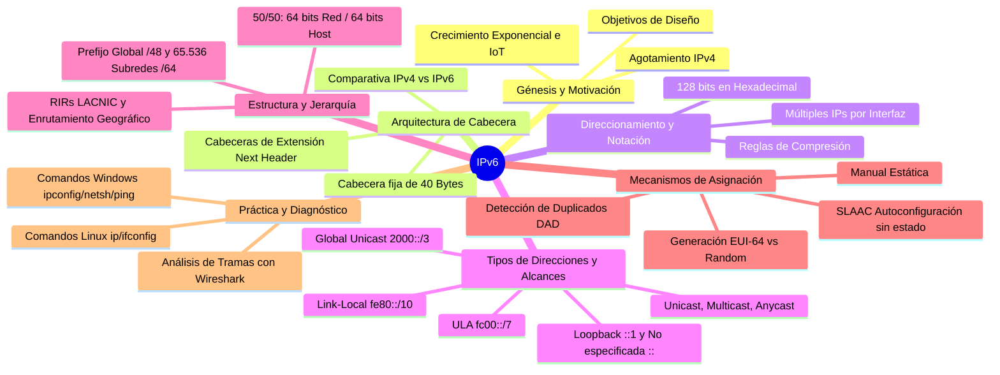

---

## 1. 🚀 Génesis, Motivación y Mecanismos de Transición

### 1.1. Contexto Histórico y Agotamiento de IPv4
- **El origen del problema:** IPv4 fue diseñado originalmente para interconectar unas pocas instituciones académicas y militares (ARPANET). Su espacio de direccionamiento de **32 bits** ($\approx 4.294 \times 10^9$ direcciones) resultó insuficiente ante la explosión masiva de dispositivos conectados e Internet de las Cosas (IoT).
- **División en la comunidad de Internet:**
  1. **Soluciones paliativas / parches para IPv4:** CIDR, VLSM, NAT/PAT y direcciones privadas (RFC 1918). Aunque prolongaron la vida de IPv4, degradaron el principio *End-to-End* y agregaron latencia en el procesamiento de routers.
  2. **Diseño de un nuevo protocolo definitivo:** Desarrollo de **IPv6**, que expande el espacio a **128 bits** ($\approx 3.4 \times 10^{38}$ direcciones, equivalentes a $5 \times 10^{28}$ IPs por persona en el planeta).

### 1.2. Transición y Coexistencia (Doble Pila y Tunelización)
> [!QUESTION] **Pregunta de clase (Rodrigo):** *¿Qué es y cómo funciona el proceso de tunelización (tunneling)?*
>
> **Explicación docente:** Durante el período de transición, IPv4 e IPv6 deben coexistir. Cuando dos extremos IPv6 necesitan comunicarse a través de una infraestructura troncal que solo soporta IPv4, se utiliza **Tunelización (Tunneling)**. Consiste en un **doble encapsulamiento**: el router de origen encapsula el paquete IPv6 completo dentro de un paquete IPv4; al llegar al router destino del túnel, este desencapsula el paquete IPv4 original, extrae el paquete IPv6 intacto y lo entrega al host final.

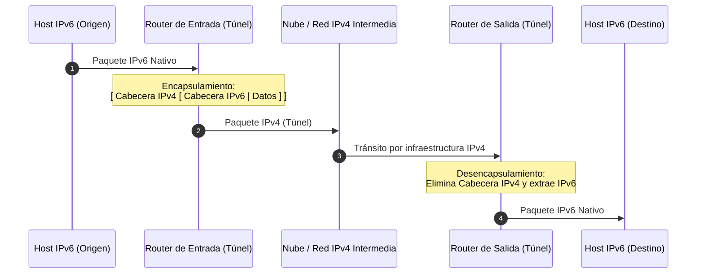

---

## 2. 🎯 Objetivos de Diseño y Características Avanzadas de IPv6

| Objetivo / Característica            | Descripción e Impacto en la Red                                                                                                                          |
| :----------------------------------- | :------------------------------------------------------------------------------------------------------------------------------------------------------- |
| **Espacio de Direcciones Masivo**    | 128 bits ($2^{128}$). Permite asignar prefijos completos a cualquier dispositivo sin requerir NAT.                                                       |
| **Optimización de Enrutamiento**     | Enrutamiento jerárquico y geográfico con agregación/sumarización de rutas en el *core* de Internet.                                                      |
| **Cabecera Simplificada y Rápida**   | Formato de tamaño fijo (40 bytes) con menos campos para agilizar el procesamiento en hardware de los routers.                                            |
| **Seguridad Nativa (IPsec)**         | Soporte integrado de autenticación y cifrado (en IPv4 era un agregado opcional).                                                                         |
| **Eliminación del Broadcast**        | El tráfico de difusión desaparece; se reemplaza exclusivamente por **Multicast** para evitar interrupciones innecesarias a todos los hosts del segmento. |
| **Sin Checksum en Cabecera**         | Se elimina el cálculo de verificación en cada salto (que en IPv4 se recalculaba por variar el TTL). La integridad se delega a Capa 2 y Capa 4 (TCP/UDP). |
| **Etiqueta de Flujo (*Flow Label*)** | Permite marcar secuencias de paquetes para que sigan una misma ruta física, facilitando QoS y tráfico en tiempo real (similar a circuitos virtuales).    |
| **Capacidad de Evolución**           | Se incorporan **Cabeceras de Extensión** encadenadas mediante el campo *Next Header*, permitiendo agregar nuevas funciones sin crear un protocolo nuevo. |

---

## 3. 🧩 Anatomía de la Cabecera IPv6 vs IPv4

### 3.1. Formato de la Cabecera Base IPv6 (40 Bytes Fijos)

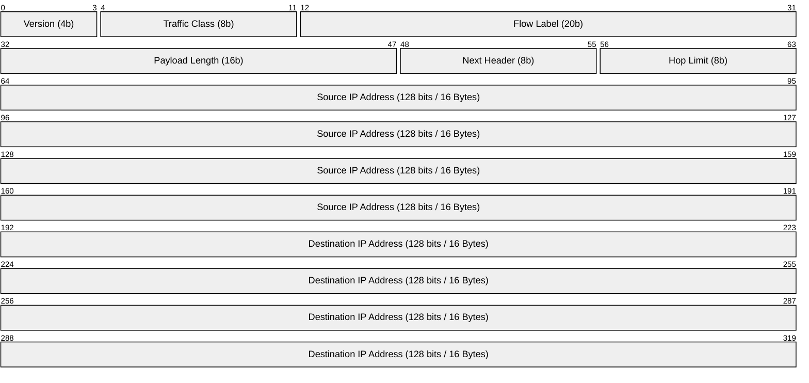

### 3.2. Comparativa Detallada de Campos

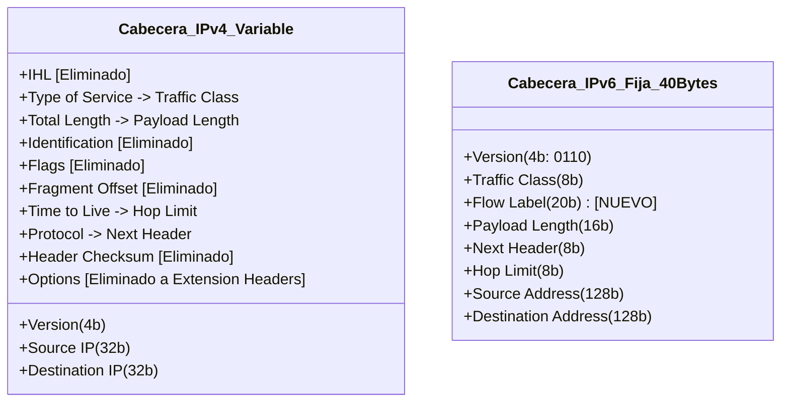

> [!NOTE] **Detalles de los Campos Principales:**
> - **Version (4 bits):** Valor binario `0110` (6).
> - **Traffic Class (8 bits):** Equivale al *Type of Service* (ToS) / DiffServ de IPv4 para priorización de paquetes.
> - **Flow Label (20 bits):** Identifica paquetes de un mismo flujo para mantener coherencia de camino y baja latencia.
> - **Payload Length (16 bits):** Indica el tamaño en bytes de los datos y cabeceras de extensión (no incluye los 40 bytes de la cabecera base).
> - **Next Header (8 bits):** Reemplaza al campo *Protocol* de IPv4. Especifica el tipo de la siguiente cabecera (cabecera de extensión o protocolo de transporte como TCP=6, UDP=17, ICMPv6=58).
> - **Hop Limit (8 bits):** Reemplaza al *TTL* (*Time to Live*). Se decrementa en 1 en cada router; al llegar a 0 se descarta el paquete para evitar bucles.
> - **Source / Destination Address (128 bits c/u):** Ocupan 32 de los 40 bytes totales de la cabecera (80% del tamaño total).

### 3.3. Encadenamiento de Cabeceras de Extensión (*Next Header*)

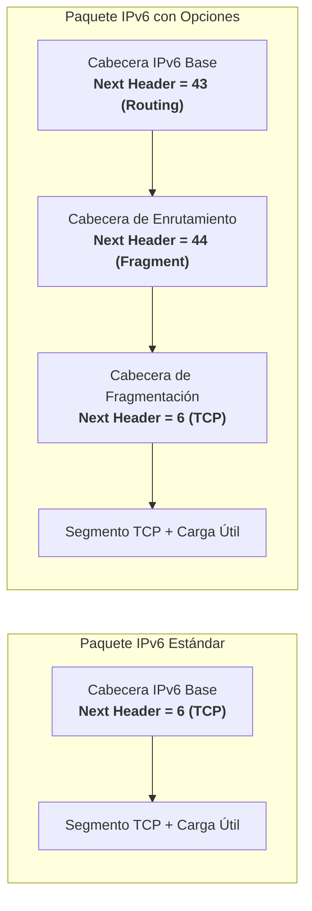

---

## 4. 🔢 Notación, Representación y Reglas de Compresión

Una dirección IPv6 consta de **128 bits**, representados como **8 grupos (hextetos) de 4 dígitos hexadecimales** separados por dos puntos (`:`). Cada dígito hexadecimal representa 4 bits ($8 \times 4 \times 4 = 128\text{ bits}$).

```
Formato completo: 2001:0db8:0000:0000:0008:0800:200c:417a
```

### 4.1. Las Dos Reglas de Compresión

1. **Regla 1: Omisión de Ceros a la Izquierda:**
   - En cualquier hexteto, los ceros no significativos a la izquierda se suprimen.
   - `0db8` $\rightarrow$ `db8` | `0000` $\rightarrow$ `0` | `0800` $\rightarrow$ `800` (el cero final no se suprime).
2. **Regla 2: Compresión de Ceros Contiguos (`::`):**
   - Una secuencia de uno o más grupos consecutivos de ceros `0000` (`0:0:...`) puede reemplazarse por doble dos puntos `::`.
   - > [!WARNING] **¡Regla de Oro!**
     > El símbolo `::` **solo puede usarse una única vez en toda la dirección**. Si se usara dos veces, sería imposible determinar matemáticamente cuántos hextetos de ceros corresponden a cada lado.
   - En caso de haber dos bloques de ceros separados, se comprime el bloque más largo; si empatan en longitud, se comprime el primero por convención.

### 4.2. Ejemplo Paso a Paso (Visto en Clase)

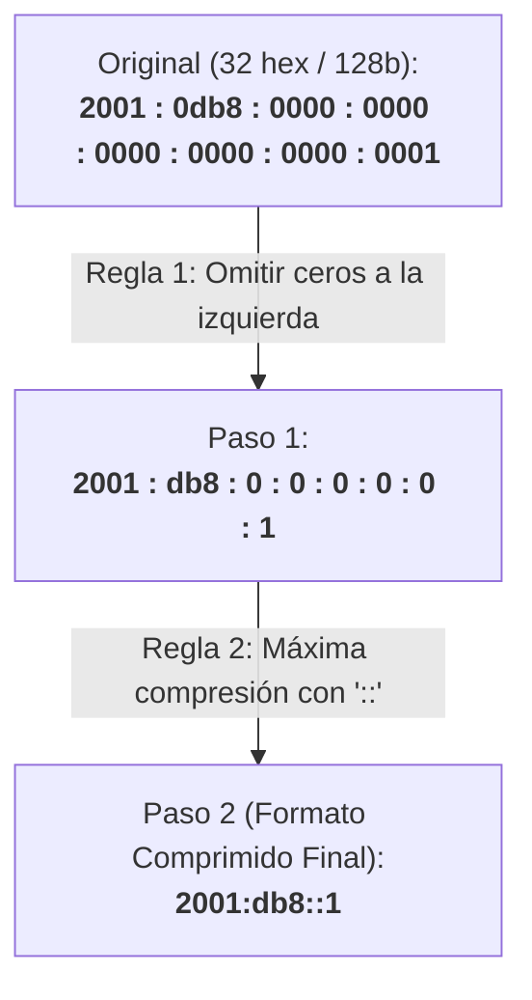

---

## 5. 🌐 Tipos de Direcciones y Esquema de Alcances (*Scopes*)

A diferencia de IPv4 donde un host típicamente posee una única dirección IP, en IPv6 una interfaz de red tiene **múltiples direcciones simultáneas** asignadas a diferentes alcances (*Scopes*).

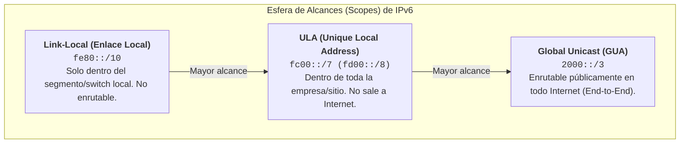

### 5.1. Clasificación por Método de Transmisión

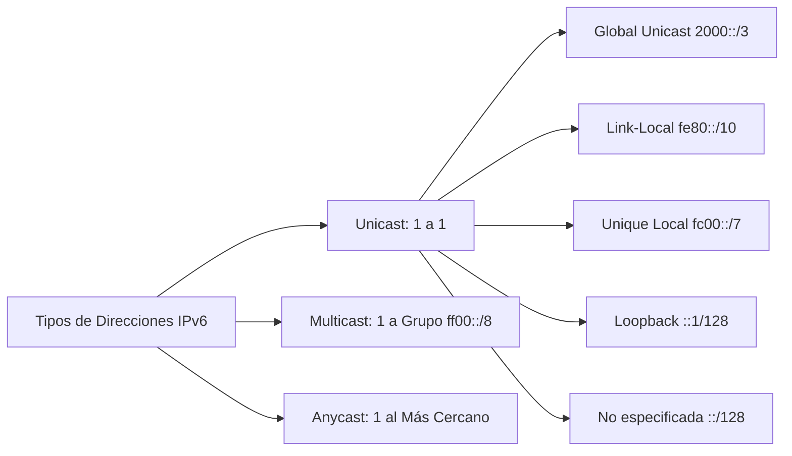

> [!NOTE] **El concepto de Anycast en IPv6:**
> Múltiples servidores o interfaces comparten la misma dirección IP Anycast. Cuando un host envía un paquete a esa dirección, los routers lo entregan a la **instancia físicamente más cercana** (menor métrica de enrutamiento). Se utiliza ampliamente para balanceo de carga y redundancia de servicios esenciales (DNS, DHCP, CDNs).

### 5.2. Tabla Maestra de Prefijos y Funciones

| Tipo de Dirección | Prefijo Binario | Prefijo Notación CIDR | Rango / Ejemplo | Alcance (*Scope*) y Función |
| :--- | :--- | :--- | :--- | :--- |
| **No especificada** | Todos ceros (`0...0`) | `::/128` | `::` | Dirección origen transitoria durante el arranque/DHCP. Nunca destino. |
| **Loopback** | 127 ceros y un 1 | `::1/128` | `::1` | Testeo local de la pila TCP/IP. (Ahorro radical vs `127.0.0.0/8` de IPv4). |
| **Link-Local** | `1111 1110 10...` | `fe80::/10` | `fe80::` a `febf::` | Comunicación dentro del mismo segmento físico/enlace. Autoconfigurada. |
| **Unique Local (ULA)** | `1111 110...` | `fc00::/7` | `fc00::/8` / `fd00::/8` | Red privada interna de empresa/organización (*Site-Local*). |
| **Global Unicast (GUA)** | `001...` | `2000::/3` | `2000::` a `3fff::` | Pública enrutable globalmente en Internet. |
| **Multicast** | `1111 1111` | `ff00::/8` | `ff00::` a `ffff::` | Comunicación uno a muchos (reemplaza al broadcast). |
| **IPv4-Mapped** | `0...0:ffff:...` | `::ffff:0:0/96` | `::ffff:192.168.1.1` | Representación de nodos IPv4 en entornos IPv6. |
| **Documentación** | - | `2001:db8::/32` | `2001:db8:...` | Reservada exclusivamente para ejemplos, manuales y docencia. |

---

## 6. 🗺️ Estructura de Direcciones Globales, Subredes y Jerarquía RIR

### 6.1. División Jerárquica 50/50 (64 bits Red / 64 bits Host)

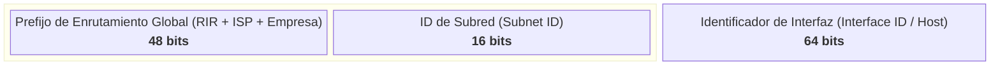

- **Prefijo de Enrutamiento Global (48 bits):** Asignado jerárquicamente por la IANA $\rightarrow$ RIR (LACNIC) $\rightarrow$ ISP $\rightarrow$ Empresa/Sitio cliente (`/48`).
- **Subnet ID (16 bits):** Permite a cada empresa crear hasta $2^{16} = \mathbf{65.536}$ **subredes `/64`** independientes sin necesidad de realizar VLSM complejo ni sacrificar bits de host.
- **Interface ID (64 bits):** Identificador del dispositivo en la subred ($2^{64} \approx 18.4$ trillones de hosts por subred).

### 6.2. Enrutamiento Geográfico por RIRs (*Regional Internet Registries*)

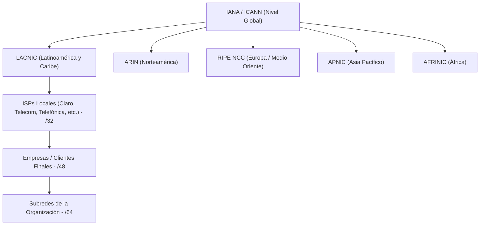

> [!INFO] **Analogía de la Numeración Telefónica Jerárquica:**
> - Código de País/Región (`+54` / `351`) $\leftrightarrow$ Bits del RIR y País (primeros 23-32 bits).
> - Código de Central Telefónica $\leftrightarrow$ Bits del ISP y Empresa (bits 32 a 48).
> - Número de Abonado Local $\leftrightarrow$ Subred y Host (bits 48 a 128).
>
> **Ventaja en Enrutadores Troncales:** Un router central solo compara los primeros 23 o 32 bits para decidir el camino intercontinental, reduciendo drásticamente el tamaño de las tablas BGP y acelerando el reenviado.

---

## 7. ⚙️ Métodos de Asignación y Autoconfiguración

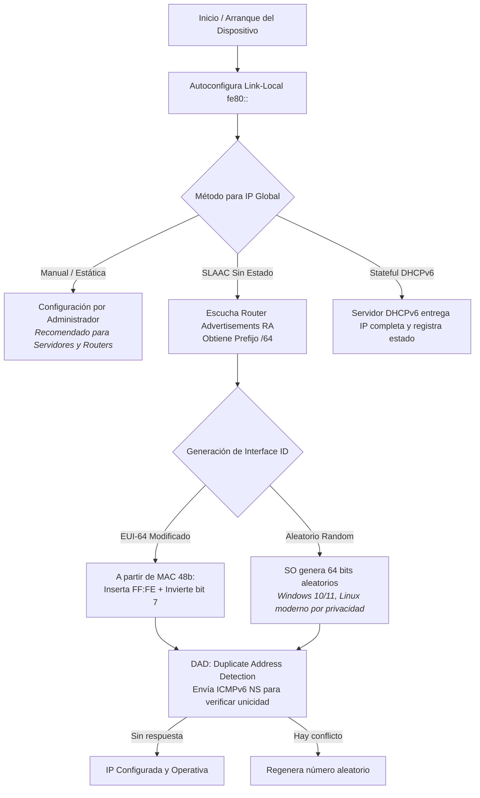

### 7.1. Proceso de Transformación EUI-64 (de MAC de 48 bits a Interface ID de 64 bits)

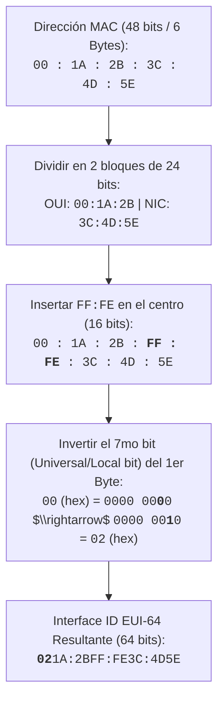

> [!IMPORTANT] **Por qué se prefiere Interface ID Aleatorio sobre EUI-64:**
> EUI-64 expone la dirección física MAC del dispositivo en cada paquete que viaja por Internet, lo que permite rastrear la ubicación y actividades del usuario entre distintas redes. Los sistemas operativos actuales generan Interface IDs aleatorios o temporales (RFC 4941) para salvaguardar la privacidad.

---

## 8. 💻 Laboratorio Práctico: Comandos, Diagnóstico y Capturas

### 8.1. Comandos en Linux

```bash
# 1. Configuración estática mediante iproute2 (recomendado):
sudo ip -6 addr add 2001:db8:acad:1::10/64 dev eth0

# 2. Configuración mediante ifconfig tradicional:
sudo ifconfig eth0 inet6 add 2001:db8:acad:1::10/64

# 3. Verificación de interfaces y alcances (scope):
ip -6 addr show dev eth0
# o bien:
ifconfig eth0

# 4. Pruebas de conectividad:
ping6 ::1                           # Loopback local
ping6 2001:db8:acad:1::1            # Ping a IP Global
ping6 -I eth0 fe80::21a:2bff:fe3c:4d5e  # Ping a Link-Local (requiere especificar interfaz)
```

### 8.2. Comandos en Windows (CMD / PowerShell)

```cmd
:: 1. Visualización completa de direcciones IPv6 y Zone IDs:
ipconfig /all

:: 2. Testeo de pila TCP/IP local IPv6:
ping ::1

:: 3. Testeo hacia un destino IPv6:
ping -6 2001:4860:4860::8888

:: 4. Inspección avanzada de interfaces y tiempos de vida con Netsh:
netsh interface ipv6 show addresses
netsh interface ipv6 show interfaces
```

> [!TIP] **Interpretación del identificador de zona (`%3`, `%12`):**
> En Windows, al listar direcciones Link-Local (`fe80::...%12`), el valor después del `%` indica el **Índice de Interfaz** (*Zone ID*). Dado que las direcciones `fe80::` no tienen prefijo de red único global, el sistema operativo necesita saber explícitamente por cuál interfaz física o virtual debe transmitir el paquete.

### 8.3. Análisis de Captura en Wireshark (Visto en Clase)

```
================================================================================
ETHERNET FRAME:
  Destination MAC : 00:15:5d:01:aa:02
  Source MAC      : 00:15:5d:01:bb:03
  Type            : 0x86dd (IPv6)
--------------------------------------------------------------------------------
INTERNET PROTOCOL VERSION 6:
  0110 .... = Version: 6
  .... 0000 0000 .... = Traffic Class: 0x00 (DSCP: CS0, ECN: Not-ECT)
  .... .... .... 0000 0000 0000 0000 0000 = Flow Label: 0x00000
  Payload Length: 64 bytes
  Next Header   : 58 (ICMPv6)
  Hop Limit     : 64
  Source Address     : fe80::a123:45ff:fe67:89ab
  Destination Address: fe80::c456:78ff:fe90:12cd
--------------------------------------------------------------------------------
INTERNET CONTROL MESSAGE PROTOCOL v6:
  Type: 128 (Echo (ping) request)
  Code: 0
  Checksum: 0x4a2b [correct]
================================================================================
```

---

## 9. 📝 Síntesis para el Parcial y Puntos Clave de Evaluación

> [!IMPORTANT] **Checklist de Conceptos Clave Evaluados en Exámenes:**
> 1. **Tamaño de Cabecera:** IPv4 tiene cabecera variable (mínimo 20 bytes); IPv6 tiene cabecera base fija de **40 bytes**.
> 2. **Campos Eliminados:** En IPv6 desaparecen *IHL*, *Identification*, *Flags*, *Fragment Offset*, *Header Checksum* y *Options* de la cabecera base.
> 3. **Next Header:** Cumple la doble función de reemplazar al campo *Protocol* de IPv4 y de permitir el encadenamiento de *Cabeceras de Extensión*.
> 4. **Regla de Compresión:** El operador `::` se utiliza **una sola vez** por dirección. Los ceros a la izquierda dentro de un hexteto siempre se pueden eliminar.
> 5. **Direcciones Obligatorias:** Toda interfaz IPv6 habilitada tiene como mínimo su dirección **Loopback (`::1`)** y su dirección **Link-Local (`fe80::/10`)**.
> 6. **Subredes Estándar:** La división estándar es `/64`. El prefijo empresarial típico es `/48`, dejando 16 bits para un total de **65.536 subredes**.
> 7. **Diferencia de Alcances:**
>    - `fe80::/10` $\rightarrow$ Enlace local (no pasa routers).
>    - `fc00::/7` $\rightarrow$ Sitio local / ULA (no sale a Internet).
>    - `2000::/3` $\rightarrow$ Global pública (enrutable en Internet).
> 8. **Autoconfiguración SLAAC:** Combina el prefijo `/64` provisto por el router (vía Router Advertisement) con un Interface ID de 64 bits (generado por EUI-64 o Aleatorio), validado mediante DAD.

