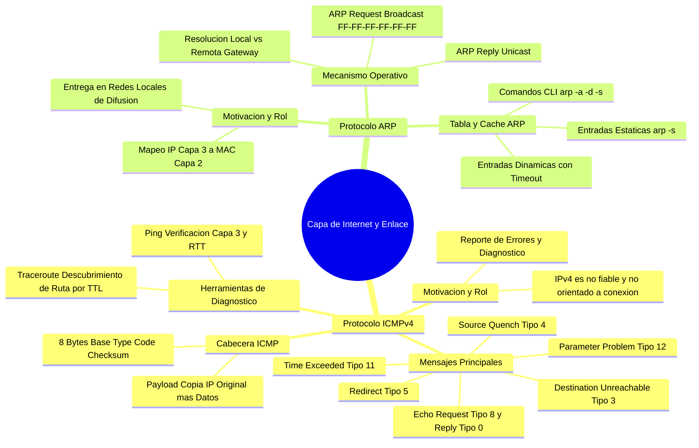
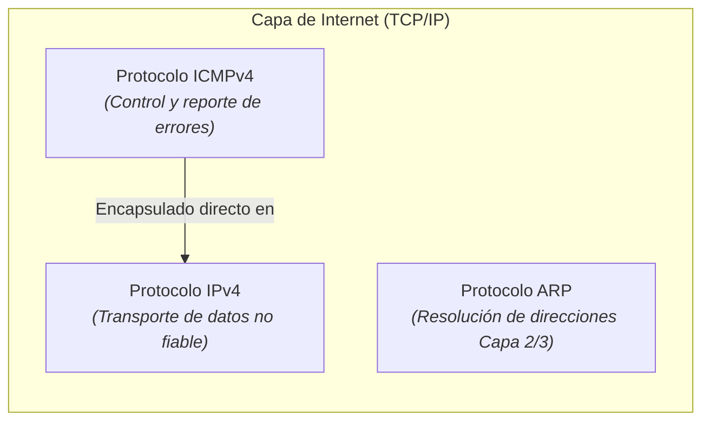
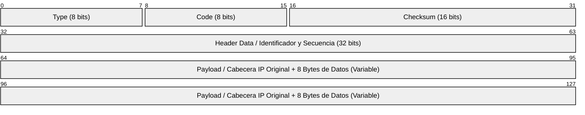
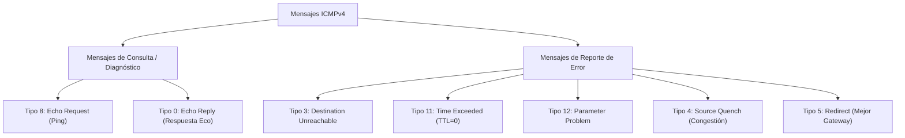
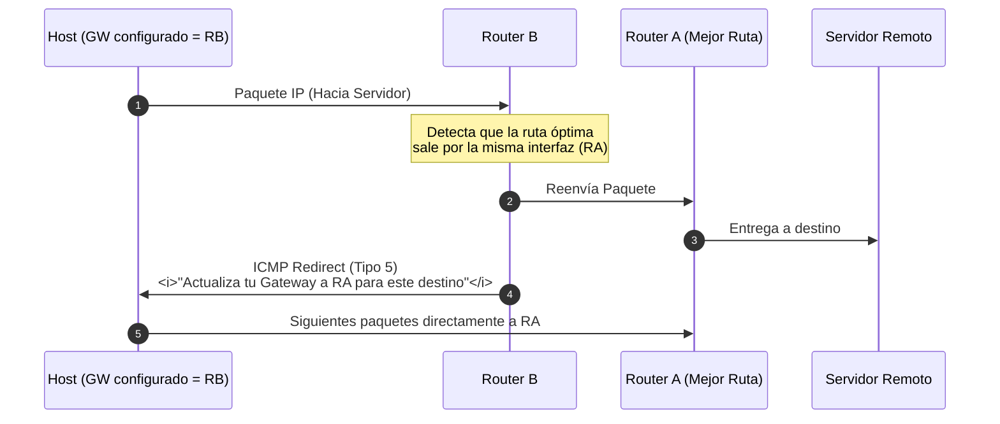
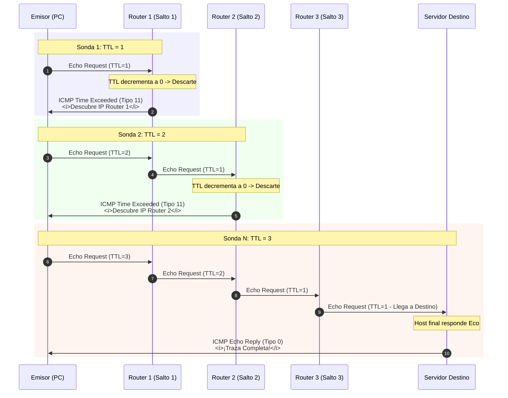
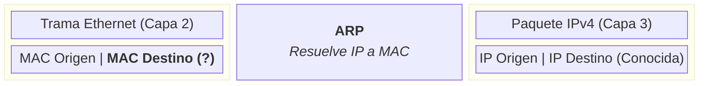
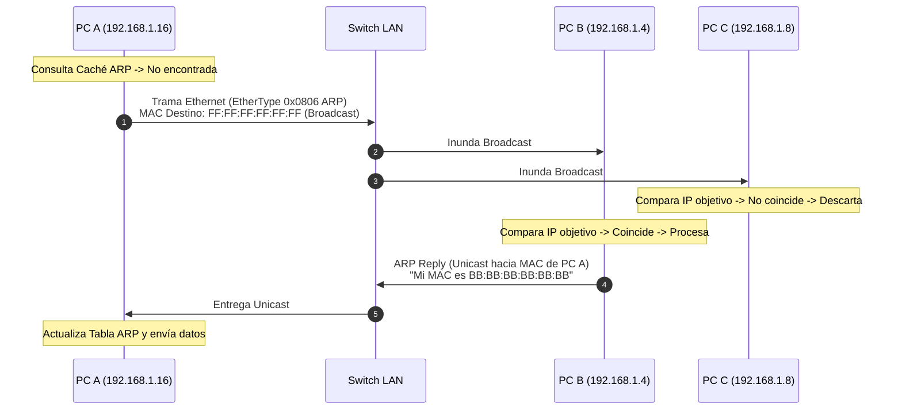
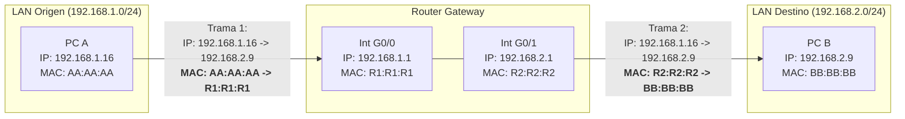

---
aliases:
subject: REDES
year: "4"
exam: PARCIAL2
unit: "3"
type: Transcripcion
zk_type: resources
status: done
date: 2026-08-28
source:
  - https://www.youtube.com/watch?v=8Cf6oC0uMUg&list=PLYZrqm_pzRumO_6c3u7yeHbNF9j6bkbM8&index=28
  - https://www.youtube.com/watch?v=XRniG1TsgL8&list=PLYZrqm_pzRumO_6c3u7yeHbNF9j6bkbM8&index=30
tags:
---
---
# Transcripcion
0:01

1 segundo

bien mientras herencia que ahora vamos a ver de manera prolija y por orden según los temas en función del programa de la

0:09

9 segundos

materia seguimos viendo en la capa de internet el tema de direccionamiento se nos falta todavía el tema de

0:16

16 segundos

direccionamiento nos faltan hoy vemos el protocolo y se me versión 4 el protocolo a erp nos va a faltar después de hs but

0:26

26 segundos

tpc y de hcp y con eso terminaríamos yo creo que lo que se cree en esto terminamos esta unidad

0:33

33 segundos

qué vamos a ver aquí vamos a ver básicamente seguimos en la quinta etapa sería de internet de tcp ip vamos a ver

0:43

43 segundos

porque es necesario el protocolo y cmp mejor algunos los conocen otros no como es el formato de la cabecera es muy

0:50

50 segundos

sencillo por eso lo vemos en ambas para que sepan que que va acá adentro que va en la cabecera y se me permanezca de

0:57

57 segundos

diferentes tipos de mensajes que se llaman en función de qué es lo que se quiera informar de la red y vamos a ver

1:05

1 minuto y 5 segundos

qué aplicaciones usan este protocolo que usted seguro y dallas conocen que son ping y trace root esto lo vamos a ver y

1:13

1 minuto y 13 segundos

después vamos a ver el protocolo a erp acá no debes desglose mucho pero vamos a ver cómo funciona el protocolo dos mensajes a la red de request ya de parte

1:21

1 minuto y 21 segundos

del plan y vamos a ver cómo se manejan las tablas a rpp empezamos entonces viendo por qué es

1:29

1 minuto y 29 segundos

necesario el protocolo y cmp primero segundo cuando vemos las características de por que colecte versión 4 dijimos que eran no fiable qué

1:38

1 minuto y 38 segundos

significa eso que intenta que los datos lleguen al destino y si por equis motivo el paquete no es entregado al de estilo

1:47

1 minuto y 47 segundos

el protocolo y se mete lo que hace es simplemente nada es decir no hay forma absolutamente nada

1:55

1 minuto y 55 segundos

eso es no fiable los datos nos llegan si no llegan al destino problema de alguien más no problema no responsabilidad del

2:04

2 minutos y 4 segundos

protocolo y te bueno garante al no ser fiable obviamente no garantiza que siempre que el paquete porque podría no entregarse un paquete a ver cuál sería

2:11

2 minutos y 11 segundos

la causa por lo por un paquete puede que nos llegue el destino

2:14

2 minutos y 14 segundos

[Música]

2:18

2 minutos y 18 segundos

se calcula en las perfectas secas son en las otro problema

2:28

2 minutos y 28 segundos

el time to live que agota los saltos si le agotan los saltos es decir que

2:36

2 minutos y 36 segundos

quiero hacer entonces en el router tiene que descartar el paquete muy bien en el momento que descarte el paquete y ya vamos a ver que el protocolo que ahora

2:43

2 minutos y 43 segundos

son cuatro no hacen nada es decir el dt que le den 0 listo descarte el paquete muy bien otra causa por la cual no se

2:52

2 minutos y 52 segundos

puede ser el paquete cual fuerza es tamaño del paquete puede ser también exceder el tamaño permitido creo que era

3:00

3 minutos

1500 país me cosas perfecta muy bien muy bien realice eso lo de que excede el tamaño permitido saber que cuando tiene

3:08

3 minutos y 8 segundos

que ser encaminado por una o por otra interfaz que tiene una mt menor una unidad transferencia el mensaje menor

3:14

3 minutos y 14 segundos

entonces en el paquete tiene que ser en fragmentados y tiene el bit encendido es

3:21

3 minutos y 21 segundos

que diciendo fragmenta no va a poder ser transmitido muy bien otra causa también muy importante que no no sé por qué no no la estamos viendo es

3:29

3 minutos y 29 segundos

el destino la está bien el destino no está muy bien el destino está apagado por ejemplo es el porque no se puede entregar

3:38

3 minutos y 38 segundos

si saturan las dos woofers de los routers de rutas son dispositivos que tienen memoria

3:45

3 minutos y 45 segundos

todo se almacena memoria ramos los paquetes no tienen disco rígido los ritos entonces si el bajo de ssd llena

3:53

3 minutos y 53 segundos

porque la reacción que se congestionan obviamente va a descartar el paquete ese paquete no va a llegar al destino con existen muchísimas causas por las cuales

4:00

4 minutos

un paquete no puede llegar al destino y así prevé cuatro nada simplemente almacenada entonces como no hace nada

4:07

4 minutos y 7 segundos

otra cosa nos informa si el paquete no llegó a decir pero todo esto es traverse no con la no fiabilidad

4:14

4 minutos y 14 segundos

no avisa si llegó no informar causa por la cual no se entregó entonces bueno acá sale lo de que su

4:21

4 minutos y 21 segundos

sesión para que te celebran 7 l que dijeron lo dijimos recién entonces justamente porque surge el protocolo y si me pido porque es necesario para

4:30

4 minutos y 30 segundos

acompañarlo para complementar los protectores de oración 4 qué significa eso cada vez que él te pegue llega a 0

4:37

4 minutos y 37 segundos

se va a activar el protocolo y cmt cada vez que un paquete no han entregado porque por ejemplo el host está apagado

4:44

4 minutos y 44 segundos

se activa el protocolo y se me place se informa y ya vamos a ver a quién porque el paquete no se entregó entonces por

4:53

4 minutos y 53 segundos

eso es que es necesario este protocolo y cmp es básicamente porque ip versión 4 es no fiable culpa de la novia agrega

5:00

5 minutos

hugo que desarrolla este protocolo qué significa perdona dijimos qué

5:07

5 minutos y 7 segundos

significa esto es protocolo de control de mensajes en internet eso significa y cmp y cmp tiene varias funciones no

5:17

5 minutos y 17 segundos

solamente sirve o sea la función principal es informar la causa por la cual un paquete no llega al destinatario

5:23

5 minutos y 23 segundos

para eso se lo creo al protocolo ya que está creado si lo usa con otros fines por ejemplo para evaluar el estado de la

5:32

5 minutos y 32 segundos

red que tan rápida está la red o cuál es la performance de la red así que están libres o saturados están

5:40

5 minutos y 40 segundos

los enlaces eso se puede medir con lo que se llaman tiempos cuando se manda un paquete se mide el tiempo que tarda en

5:47

5 minutos y 47 segundos

ir y volver o sea el tiempo que tarda en volver la respuesta y con eso se puede evaluar el estado de una red

5:55

5 minutos y 55 segundos

este protocolo pertenece a la capa de internet desde ese paper estaba a la par funciona en la misma capa spector de 40

6:03

6 minutos y 3 segundos

versión 4 esta es la función principal entonces determinar la causa por la cual un paquete no se entrega y esto estamos

6:12

6 minutos y 12 segundos

diciendo recién permite evaluar y controlar el estado de la red qué tal bien está la red o sin ir de dentista a

6:20

6 minutos y 20 segundos

ponerse cada vez más en temas de mente más lenta y habrá que invertir en infraestructura en nuevos enlaces nuevos switches en nuevas conexiones a internet

6:30

6 minutos y 30 segundos

un administrador que constantemente está evaluando que también está no puede esperar que se quejen los empleos que la

6:39

6 minutos y 39 segundos

red está lenta o sea tiene que tener una actitud proactiva que se llama 2 un buen administrador de la red debería tener

6:46

6 minutos y 46 segundos

esa actitud este protocolo bueno acá es el transporte transporta mensaje de control de la red se permite como recién evaluar

6:56

6 minutos y 56 segundos

el estado de la red cómo funciona se construye un mensaje que se llama cmp que vamos a ver quién lo construye y ese

7:04

7 minutos y 4 segundos

mensaje se va a meter en un paquete ip se encapsula se dice si a pesar de que pertenece a la misma capa que ip pero el

7:12

7 minutos y 12 segundos

mensaje y cmpc encapsula en el paquete no tiene nada que ver con la capa de transporte este y cmp quiere también

7:20

7 minutos y 20 segundos

está en la misma capa y hay distintos tipos de mensajes acá está clasificada

7:26

7 minutos y 26 segundos

la arquitectura tcp/ip a ip el perdón de cmp lo pondremos acá a la par del protocolo pipe

7:34

7 minutos y 34 segundos

y alguna aclaración nosotros vamos a estudiar y cmp versión 4 porque se ponen teniendo suerte con la raíz de

7:41

7 minutos y 41 segundos

decoración 4 versión 6 hay un y cmp marcada por otro color tal y cmp si no dice nada es versión 4 y por ahora no

7:50

7 minutos y 50 segundos

vamos a estudiar el protocolo y cmpb 65 que desarrollar también un protocolo que lo acompaña en su

7:58

7 minutos y 58 segundos

versión 6 cuál es la cabecera de este de este protocolo

8:06

8 minutos y 6 segundos

dijimos recién que se encapsula va en un parque tipo de versión 4 cuando se encapsula se acuerdan está viciada de ipv4 hay un camps que se llamaba

8:13

8 minutos y 13 segundos

protocolo y en ese campo se coloque el 1 para hacer diferencia para hacer referencia perdón a que se esté

8:20

8 minutos y 20 segundos

encapsulando un paquetito y cmp un mensaje y se me para andar correctamente aquí se va a enviar

8:28

8 minutos y 28 segundos

fíjense cuando se produce por ejemplo que éste le llega a cero se descarta ese paquete entonces el router va a construir un

8:36

8 minutos y 36 segundos

mensaje y cmp especial sistema tiempo de vida excedido y se lo va a mandar al origen al origen de quien supongamos que

8:45

8 minutos y 45 segundos

a la máquina le está enviando paquetes a la máquina si ese paquete y nos llega porque este tele por ejemplo es herencia un router

8:53

8 minutos y 53 segundos

que tiene el medio le va a enviar a ese paquete ese mensaje y cmp avisándole jesús desde el deseo hacer y que hará y

9:02

9 minutos y 2 segundos

el origen cuando le llega ese paquete de informando que ese va a ser uno podría solucionar ese problema

9:12

9 minutos y 12 segundos

que parece poner un título más largo exacto tan sencillo como es

9:19

9 minutos y 19 segundos

simplemente aumenta el pdl porque es bueno porque el estilo está muy lejos y la red no alcanza a entregarlo

9:27

9 minutos y 27 segundos

con este te lo establecidos y entonces aumenta el pp normalmente teteles alto es decir que es muy raro con paquete no se ha entregado

9:34

9 minutos y 34 segundos

porque su dt le llegó a cero salvo que se produzca lo que se llama un look o un bucle en la red entonces hay si es por problemas de encaminamiento el paquete

9:43

9 minutos y 43 segundos

queda dando vueltas en la red la cabecera tiene 8 bytes la cabecera de x y muy cortita

9:52

9 minutos y 52 segundos

son como dos palabras de 32 bits cuatro de esos y eso siempre son iguales nosotros cuatro va a depender de qué

10:01

10 minutos y 1 segundo

mensaje sea a veces me está superada esos otros cuatro años fíjense que hasta entonces el mensaje y

10:09

10 minutos y 9 segundos

si me pese encapsula en una cabecera y la versión 4 y ahí viene a la derecha la cabecera

10:16

10 minutos y 16 segundos

la primera palabra del encabezado de 10 mp dice bueno todo esto entonces es un mensaje y cmp

10:26

10 minutos y 26 segundos

tienen otra cabecera fíjense como todo este mensaje tiene mitad cabecera mitad

10:33

10 minutos y 33 segundos

la parte de datos del tipo porque diferentes tipos de mensajes que es un protocolo es un software que está

10:40

10 minutos y 40 segundos

tipificado en este caso en el caso de diciembre entonces hay diferentes tipos de mensajes en función del tipo se

10:46

10 minutos y 46 segundos

construyen en una cabecera dentro del tipo podemos tener subtipos carteles llaman códigos o dentro del tipo y

10:54

10 minutos y 54 segundos

destino alcanzable podemos tener red inalcanzable ser lamenta y job inalcanzables protocolo inalcanzable puerto inalcanzable son códigos

11:02

11 minutos y 2 segundos

distintos después tenemos una suma de verificación que esta suma se calcula sobre todo el mensaje y cmb simplemente

11:10

11 minutos y 10 segundos

para saber si descartarlo o no si es en si está íntegro integrar toda la información y después éste encabeza

11:18

11 minutos y 18 segundos

opcional va a depender del tipo de mensaje si son eco respuesta a cabo un número de identificación un número de secuencias

11:25

11 minutos y 25 segundos

[Música]

11:26

11 minutos y 26 segundos

fíjense que van en la parte de datos cuando se suponiendo que la máquina abre también da un mensaje una máquina ve si

11:34

11 minutos y 34 segundos

un ruta en el medio detecta algún problema va a construir un mensaje y cmp hiciere va a mandar dijimos al origen

11:40

11 minutos y 40 segundos

que pasa así y como distingue el origen de qué es cuál fue el problema además del tipo de mensaje acá en la

11:49

11 minutos y 49 segundos

parte de datos se copian es el mensaje original de asia se copia una parte de ese mensaje original

11:58

11 minutos y 58 segundos

que se copia la parte al señor o al mouse la parte de la cabecera de ip versión 4 más un poco de datos si eso es

12:06

12 minutos y 6 segundos

lo que se copia para qué para qué lo origen se dé cuenta que cuál es el paquete que realmente no fue entregado al destino sí

12:15

12 minutos y 15 segundos

el cortito o sea realmente es muy pequeño un mensaje y se mete no consume tráfico no consume ancho de banda de la

12:23

12 minutos y 23 segundos

red además refiero acá les pongo los vamos a dar los todos los mensajes y cmp hay muchos más

12:32

12 minutos y 32 segundos

nosotros vamos a ver algunos mi destino alcanzable tiempo de vida excedido problema de parada metros

12:40

12 minutos y 40 segundos

que se llama direct esto lo tiene que haber escuchado la mejor respuesta con un plan ya no y bueno para

12:49

12 minutos y 49 segundos

instar al govern a cada uno el primero dice destino alcanzando y qué

12:57

12 minutos y 57 segundos

significa es un paquete puede que no llegue al destino en el sitio no llegue a ver en caso de que está mandando la tormenta puede que nos llegue a las

13:06

13 minutos y 6 segundos

causas por las cuales nos llegan pueden ser varias en general este mensaje en general lo

13:13

13 minutos y 13 segundos

luego un sistema lo crea un router pero a veces algunos ya les digo que nos van a crear el dispositivo de destino es

13:20

13 minutos y 20 segundos

decir sería b en nuestro caso es de tipo 3 como para que acepten a masters en este tipo 3 y según a que la cabecera 10

13:27

13 minutos y 27 segundos

mp tenía en el campo tipo y el código bueno en este caso para destinar alcanzarme por tipo 3 y pueden haber todos estos códigos fíjense es decir que

13:36

13 minutos y 36 segundos

yo no puedo alcanzar el destino por todas estas causas por ejemplo la red es inalcanzable es decir yo estoy tratando

13:43

13 minutos y 43 segundos

de llegar a una red que está caída por ejemplo es el router cuando no quiere entregar al paquete se da cuenta que esa red no está en su tabla de

13:51

13 minutos y 51 segundos

encaminamientos y al instante construye un mensaje y se me pérez tienen alcanzarlos el tipo 3 código 0

13:59

13 minutos y 59 segundos

cuando se pone host inalcanzable cuando está apagado decir que la red está funcionando de manera perfecta pero el dispositivo estaba apagado el

14:06

14 minutos y 6 segundos

dispositivo está parado el mensaje no se puede entregar el paquete de datos no se puede entregar

14:13

14 minutos y 13 segundos

protocolo inalcanzable es este protocolo y puerto normalmente lo envía el host de

14:22

14 minutos y 22 segundos

destino final sí sí yo quiero llegar a algún protocolo o algún puerto específico y no están activos esos puertos puede que el paquete sea

14:30

14 minutos y 30 segundos

descartado de hecho a ser descartado no puede ser entregado entonces el propio job de destino construyen un mensaje emisiones de tipo

14:40

14 minutos y 40 segundos

3 puerto dos o tres en este caso sería puerto inalcanzable pero cuando uno filtra por ejemplo cuando uno configura

14:48

14 minutos y 48 segundos

un firewall ningún windows y tiene que se suele decir a abrir determinados puertos puertos lógicos cuidados a esto

14:56

14 minutos y 56 segundos

no sé si lo vamos a entender mucho ahora porque no hemos visto en la capa 4 en europa de transporte pero hay muchas aplicaciones que corren sobre determinados puertos si nosotros

15:04

15 minutos y 4 segundos

queremos llegar un despeinado puerto y ese puerto está bloqueado de alguna manera filtrada entonces no se va a poder

15:11

15 minutos y 11 segundos

llegar otro código es y si fíjense acá recibe fragmentada pero el beat down fragment

15:20

15 minutos y 20 segundos

está activo sabor ante este beach de feira de la cabecera del protocolo ip versión 4 entonces uno de ustedes recién no se

15:27

15 minutos y 27 segundos

será más dijo aquí dijo que y se producirá se podría producir este problema si crece un paquete llega al

15:34

15 minutos y 34 segundos

router por una interfaz y tiene que sacarlo por otra cuya emt es menor y lo tiene que fragmentar pero acá dice el

15:43

15 minutos y 43 segundos

paquete tiene encendido este vídeo o sea que si no fragmentar que hace el router realmente el paquete o no lo fragmenta

15:53

15 minutos y 53 segundos

perfecto muy bien no lo fragmenta lo descarta pero qué hace le avisa al origen que ese paquete fue descartado

16:01

16 minutos y 1 segundo

porque el df estaba encendida entonces tras quién va a ser el que construye este mensaje es el router de un mensaje

16:09

16 minutos y 9 segundos

ese mensaje este es el router que ip origen y quite destino va a tener cuando construye un mensaje de tipo 3 destino

16:17

16 minutos y 17 segundos

alcanzando código 4 este mensaje se va encapsular en un paquete ip que ip de origen va a tener

16:25

16 minutos y 25 segundos

ese paquete a dar si se dan cuenta se entiende la pregunta

16:34

16 minutos y 34 segundos

creo que la origen sería el router y el destino sería la máquina que antes era el origen perfecto muy bien perfecto la ip de

16:43

16 minutos y 43 segundos

origen hacer cualquier interese router que construye el mensaje y cmb y como indicarle a la ip de destino va a ser la

16:51

16 minutos y 51 segundos

ip en nuestro ejemplo de la máquina a si que fue la que envió ese paquete muy bien y cómo solucionar el problema la

16:58

16 minutos y 58 segundos

máquina cuando decir que este mensaje d de este tipo 3 código 4

17:05

17 minutos y 5 segundos

como lo podría solucionar encendiendo el medio apagando

17:14

17 minutos y 14 segundos

bien esa sería una solución y otra haciendo paquetes más chiquitos claro muy bien haciendo construyendo paquetes

17:22

17 minutos y 22 segundos

más más chicos más pequeños para que para que no se fragmente si son las opciones en general en lugar de

17:30

17 minutos y 30 segundos

desactivar este lo que se hace es el origen seguro y parece que mis paquete están siendo muy grandes entonces los voy a hacer más chico con eso mejora

17:37

17 minutos y 37 segundos

todavía porque no hay que fragmentar no se elimina la fragmentación

17:44

17 minutos y 44 segundos

ay gabriel usaid es igual a 0 buena perdón recién leo tu pregunta de ariel referida que la solución sería

17:53

17 minutos y 53 segundos

desactivar el bit sin quiero interpretar así esa sería una opción perfecto pero lo mejor todavía porque si vais a

18:01

18 minutos y 1 segundo

activar el paquete va a tener que ser fragmentado conviene que no se fragmente porque es lento el proceso de fermentación conviene mucho más hacer

18:09

18 minutos y 9 segundos

paquetes más chicos y red de destino desconocida significa que esa red hemos puesto una ip

18:17

18 minutos y 17 segundos

incorrecta de una red que no existe que no se puede llegar bueno ya hay más código ya que les puse

18:24

18 minutos y 24 segundos

algunos los mensajes decime si te quieren ver los ponen rfc se acuerdan que era el documento de internet o no

18:32

18 minutos y 32 segundos

estaban escritos todos los protocolos de internet con el rfc de y se me pegue aparecen todos los tipos y códigos de

18:41

18 minutos y 41 segundos

todos los mensajes porque es como para que se pueda entender la función de ese protocolo porque los administradores lo usan son

18:49

18 minutos y 49 segundos

los mejores de red usan este tiene que salvar la existencia de experimentos de este protocolo otro mensaje y dijimos

18:57

18 minutos y 57 segundos

que el tiempo de vida excedido este fácil no nos vamos a detener mucho acá si saber que existe porque ya lo vamos a usar este mensaje lo vamos a ver que hay

19:06

19 minutos y 6 segundos

una aplicación que se llama try fruit que usa este mensaje de tiempo de vida excedido normalmente este mensaje lo

19:13

19 minutos y 13 segundos

generó un router cuando dijimos reciente el dt l llegar 0 protocol ip 7 le llega a 0 lo que hace

19:20

19 minutos y 20 segundos

es simplemente descarta un paquete que se hace en el momento que se descarta ese paquete se activa de alguna manera él y se meten si construyen este porque

19:28

19 minutos y 28 segundos

está avisando al origen que su tele ese goce cuál es la solución aumentar este origen incremente de telecom eso puede

19:37

19 minutos y 37 segundos

llegar al destino otro mensaje quizá es rarísimo que su producto esto pero bueno está previsto

19:45

19 minutos y 45 segundos

se llama problema de parámetros a veces cuando se está construyendo un paquete puede haber

19:54

19 minutos y 54 segundos

es como que el software no está funcionando correctamente y lo construyen más del paquete entonces si se detecta

20:01

20 minutos y 1 segundo

algo incorrecto en la cabecera de ip versión 4 se genera este y cmp el

20:08

20 minutos y 8 segundos

problema está funcionando bien nos es muy raro que se produzca un error en la

20:15

20 minutos y 15 segundos

construcción de un paquete ip versión 4 qué significa este mensaje si me puede

20:21

20 minutos y 21 segundos

ser una fuente reducida esto se usa para controlar la congestión ya cuando vamos

20:28

20 minutos y 28 segundos

a ver este mensaje cuando estuvimos la parte de la próxima unidad que es control de congestión que se hace acá o

20:36

20 minutos y 36 segundos

cuáles son las funciones de mensaje los routers dijimos recién que tienen memoria es en esa memoria en la memoria ram es un buffer se tiene por cada

20:45

20 minutos y 45 segundos

interfaz 2 bufers asociados un buffer donde se guardan los paquetes que entran que llegan a esa interfaz por esa

20:52

20 minutos y 52 segundos

interfaz mejor hecho y el otro para pérez a los paquetes que tienen que ser enviados a esa interfaz que pasa sirva para empieza a llenarse antes que se

21:01

21 minutos y 1 segundo

llene el router construye un paquete mensaje perdón y cmp de este tipo fuente

21:08

21 minutos y 8 segundos

reducida aquí se le va a mandar al origen de la transmisión y le va a decir que bajen la tasa de transferencia así

21:16

21 minutos y 16 segundos

que cuando otro te comienza a saturarse oa llenarse en sus backs france demanda decidan al origen

21:24

21 minutos y 24 segundos

puede tras seguir transmitiendo paquetes pero que transmita con una menor frecuencia sí es decir que transmita más

21:31

21 minutos y 31 segundos

lento para que tenga nada es un objetivo básicamente controlar la congestión de la red es decir que es

21:38

21 minutos y 38 segundos

mejor controlar antes que saturn es una espera que la red se satura totalmente y el buffer se llena el router que va parque va a ser en routers y un

21:46

21 minutos y 46 segundos

subwoofer se llena con los paquetes que le siguen llegando

21:55

21 minutos y 55 segundos

muy bien los que aportan el paquete de los paquetes se descartan es como ponerle agua a una jarra se llena la

22:03

22 minutos y 3 segundos

jarra serie la fe del router y sigo tirándole agua y sal goteros y volteando se derrama por el corto de la jarra el

22:10

22 minutos y 10 segundos

si no hay un lugar físico para almacenar esos bits estamos entonces hay que tratar de detectar la congestión antes de que se llene ese vapor

22:19

22 minutos y 19 segundos

para eso se usa ese mensaje otro tipo de mensaje que se llama re direct vigencia para qué se usa que

22:28

22 minutos y 28 segundos

tiene una topología no es muy común esta topología pero es para poder explicar cómo funciona este mensaje directo acá

22:35

22 minutos y 35 segundos

hay una granja de servidores a la izquierda ya la derecha esto es una empresa si hay buenos dispositivos

22:43

22 minutos y 43 segundos

locales pues el ps1 ps2 psp no puse dirección ip para no confundirlos pero fíjense a cabo estas pc en él

22:51

22 minutos y 51 segundos

configurado como gateway y w5 desde tui el router ve es decir que si tienen que

22:58

22 minutos y 58 segundos

enviar un paquete lo van a enviar por su puerta de enlace va a ser esta interfaz de jiutepec

23:05

23 minutos y 5 segundos

mientras estas máquinas envíen tráfico hacia internet está todo perfecto sí porque esta va a ser su puerta de las

23:12

23 minutos y 12 segundos

hermanas salidas de internet qué pasa acá está topología tiene cuantos cuantos que a troy por defectos tienes la topología o cuántos podría

23:21

23 minutos y 21 segundos

llegar a tener 22 muy bien porque ayudan tanto 2

23:32

23 minutos y 32 segundos

fíjense esta interfaz y esa interfaz pertenecen a la misma red o la misma subred entonces esta interfaz es en qué

23:41

23 minutos y 41 segundos

factores especiales pertenece en la misma red podría haber sido la puerta de la cetaip o puede ser esta en este caso está

23:49

23 minutos y 49 segundos

configurada la del router de la interfaz que fuera el router ver qué pasa si acaso le dice como una animación

23:57

23 minutos y 57 segundos

si vienen pactando la ps1 le va a enviar datos a un servidor dentro de la empresa que quiere enviar datos a algunos de los

24:05

24 minutos y 5 segundos

servidores que hace enviar un paquete construye el paquete y lo envía y adónde va a ir ese paquete hacia dónde se va

24:14

24 minutos y 14 segundos

a ser rooteado hacer router de prudencial en el ver por qué y por qué tiene configurado acá la ip origen

24:22

24 minutos y 22 segundos

pertenece a una red y la que destinó a otra porque esto es otra red u otra subred sí entonces cuando la máquina se

24:31

24 minutos y 31 segundos

da cuenta que el destino pertenece a otra red lo tiene que mandar el gateway a la puerta de enlace entonces ese paquete se entrega al ghetto y

24:39

24 minutos y 39 segundos

configurado viaja porque porque esté configurado el del router vez y llega al router vez ya sea router ve con ese paquete

24:48

24 minutos y 48 segundos

lo más baje la rutina retomando así la formación al cuenta que la red está está hacia la izquierda como que inicia hacia

24:56

24 minutos y 56 segundos

el router entonces el router ve encamina el paquete hacia el router a dentro de la misma red fíjense que hay sectores

25:04

25 minutos y 4 segundos

con mayor entonces paquete viaja hacia rutera de rutera lo encamina finalmente hasta que llega a hacer al

25:11

25 minutos y 11 segundos

servidor sobre lo que éste se han salido me parece que está bien que todos los paquetes viajen de pc 1 router 20 a

25:18

25 minutos y 18 segundos

servidor pese a 1 reuters porque el gateway por defecto pulsera

25:27

25 minutos y 27 segundos

rutera entonces qué pasa cuando romper ve recibe este paquete si se da cuenta que

25:36

25 minutos y 36 segundos

están caminando dentro de la misma red así que vuelve encamina el paquete por la misma red al instante construye construye perdona

25:45

25 minutos y 45 segundos

un paquete red direct y cmp y le dice a la ps1 que cambie su gateway esa es la

25:52

25 minutos y 52 segundos

función de ese mensaje y si me pediré entonces este router le va a enviar un paquetito y cmb accor hacemos de otro

26:02

26 minutos y 2 segundos

color a la persona para que actualicen su gateway con la ip del router y entonces acá

26:10

26 minutos y 10 segundos

bueno no sé si vieron pero dice router ven no se ve muy bien porque se los sobreescribir pero ahora ven bien terminó diciendo router

26:19

26 minutos y 19 segundos

entonces la ps1 tienen otro gateway es la función de ese mensaje entonces ahora si la pc uno cuando manda datos tiene

26:28

26 minutos y 28 segundos

como tiene confiero del que dura el paquete directamente se envía a la interfaz del router y el router a lo encamina al servidor

26:36

26 minutos y 36 segundos

se entendió entonces la función mientras el tráfico fluya dentro de la empresa conviene que el router a ahora sí el

26:44

26 minutos y 44 segundos

tráfico va hacia internet conviene que la interfaz sea tu perder esto se puede ir modificando a demanda si parece que

26:52

26 minutos y 52 segundos

existe este mensaje revienta como le digo es raro ver esta tipología pero puede darse puede darse

26:59

26 minutos y 59 segundos

sé que existe ese mensaje vamos a los dos mensajes mp que se

27:09

27 minutos y 9 segundos

llaman eco request y eco del plan qué significa eso estos mensajes se usan dice solicitud de eco buena cata que

27:17

27 minutos y 17 segundos

significa solicitud de eco que vieron la montaña con uno grita podemos escuchar lo mismo bueno cada vez que una pc

27:25

27 minutos y 25 segundos

router servidor o sea que es que cualquier dispositivo reciba un mensaje y cmp de solicitud de eco tiene la

27:33

27 minutos y 33 segundos

obligación porque así ya está configurado el protocolo de enviar una respuesta sin un eco replay que se llama

27:40

27 minutos y 40 segundos

es decir que cada vez también me llega es como si usted mencionó la profe yo tengo la obligación decirle hola y bruno

27:47

27 minutos y 47 segundos

o la vida sí hola joaquin ya tengo la obligación de responder antes cuando esto es lo mismo para qué se usan estos mensajes

27:55

27 minutos y 55 segundos

simplemente para saber si un dispositivo está activo o si está vivo o si está funcionando para eso se usa este si está

28:05

28 minutos y 5 segundos

funcionando a nivel de capa 3 cuidado si está funcionando sería la capa 1 2 y 3 del modelo o sí o del pspv sería hasta

28:13

28 minutos y 13 segundos

la capa interna red por eso se usan estos mensajes la aplicación que usa o el comando que

28:21

28 minutos y 21 segundos

usa estos mensajes es el famoso comando ping ing este comando lo que hace es verificar la

28:28

28 minutos y 28 segundos

conectividad de capa 3 que es lo que deseamos gracias y además este comando no sólo sirve para que cuando algo no funciona se suele decir acepte un pin

28:37

28 minutos y 37 segundos

entonces qué significa 7 un pin desde mi máquina yo envío pongo png y al lado le pongo una dirección ip o un domingo sí

28:46

28 minutos y 46 segundos

me responde significa que si tiene conectividad pero no solamente sirve para eso para verificar la conectividad sino que también sirve para evaluar el

28:54

28 minutos y 54 segundos

estado de la red qué tan buena está una red que es tan rápida está una red

29:00

29 minutos

fíjense a la cabecera del ping es en tipo 8 segura estaban tipificados los

29:08

29 minutos y 8 segundos

mensajes y si me p es de tipo 8 como digo 0 y acá y los otros 8 gbytes se le pone un

29:16

29 minutos y 16 segundos

identificador y un número de secuencia por qué porque normalmente el pin manda varios paquetes alguien sabe cuántos

29:23

29 minutos y 23 segundos

paquetitos se envían desde windows 2 paquetitos score y cuesta se mandan

29:30

29 minutos y 30 segundos

la presión pin 4 son muy bien 4 perfecto hay lawrence buena que estará cabecera

29:38

29 minutos y 38 segundos

décima acá hay un pin gration ping al google y dice haciendo ping a este dominio ese

29:47

29 minutos y 47 segundos

dominio es traducido por algo que se llama dns vamos a ver más adelante y me devuelve a esta dirección ip o sea esta la dirección ip del google

29:55

29 minutos y 55 segundos

construye paquetitos de 32 gbytes y acá envía 4 fíjense 1 2 3 4 dice

30:02

30 minutos y 2 segundos

respuesta desde google y me dice los tiempos el primer paquete tardó 35.000

30:09

30 minutos y 9 segundos

segundos el segundo tardó 78 y bueno hay un tele todos tienen tele 57 y acá me saca estadísticas la cantidad para que

30:18

30 minutos y 18 segundos

tenga enviado a la cantidad paquetes recibidos y la cantidad de paquetes para vídeo en este caso como hay conectividad de capa 3 no hay ninguno perdido

30:26

30 minutos y 26 segundos

y me cálculo de los tiempos tiempo mínimo tiempo máximo y el promedio de los tiempos para que si si profe si yo

30:36

30 minutos y 36 segundos

le hago a alguien muchos ping no le puedo llegar con la opción del router con ataques hay ataques no con el nombre

30:43

30 minutos y 43 segundos

tiene un nombre de él mira de los flores servicios no no no no él debe de ser otra cosa el de veces

30:51

30 minutos y 51 segundos

establecer conexiones nos hace con el ping el ataque de denegación de servicio el denario of service que dicen ustedes se hace con establecimientos de conexión

31:00

31 minutos

a nivel de tcp o sea es como si ustedes les enviaran peticiones de páginas web a un servidor son conexiones a miguel de

31:08

31 minutos y 8 segundos

capa de transporte eso es un ataque de negación de servicio 33

31:19

31 minutos y 19 segundos

a hacer una tarea ping de la muerte de jean ping de la

31:25

31 minutos y 25 segundos

muerte exact si eso es mandar muchos paquetes de pink pero es como que las alturas

31:35

31 minutos y 35 segundos

nada más que para que te devuelve como decir que consumir procesamiento al dispositivos de único casas mandando los

31:42

31 minutos y 42 segundos

muchos pins pero entonces es como lo que haya un menso del sol se comenzó a mí exacto muy bien mi cadena muy bien una

31:51

31 minutos y 51 segundos

de las formas de hacer ataque de denegación de servicio es altamente zombies zombies que son programas o bots

31:58

31 minutos y 58 segundos

que se llama se instalan en la máquina de ustedes programas maliciosos o malware bot bot

32:06

32 minutos y 6 segundos

net con un zombi entonces se instalan en la máquina de muchos usuarios de miles de usuarios y esos zombis se pueden

32:15

32 minutos y 15 segundos

a gestionar a distancia si uno toma el control del crédito lanzó y dice bueno

32:23

32 minutos y 23 segundos

hasta el ahora tal día los activa y todos esos hombres que están miles de máquinas dispersas se conectan hacia el

32:31

32 minutos y 31 segundos

mismo servidor como todos se conectan hacia el mismo servidor se dice que lo tiran abajo lo es es un ataque de denegación de servicios distribuidos

32:39

32 minutos y 39 segundos

si son peticiones de conexión falsa consistente y quieran profe de profe el profe de profe de profes y yo estoy atenta atenta atenta atenta a la

32:48

32 minutos y 48 segundos

pregunta y nunca viene la pregunta pero bueno todos llamaron mi atención el servidor va creando un hilo que se

32:56

32 minutos y 56 segundos

llama o una conexión distinta un socket distinto por cada petición del zombi que le llega y satura las tablas es decir eso es una 3d

33:04

33 minutos y 4 segundos

negaciones es ocuparlo con conexiones falsas a un servidor pero ellos son conexiones móviles de más alto nivel son

33:12

33 minutos y 12 segundos

conexiones a nivel de capa de aplicación no a nivel de capa y de red como estamos en fin solo llegadas para capaz de ver

33:20

33 minutos y 20 segundos

y así es muy bien muy bien en el caso por ejemplo cuando nos

33:28

33 minutos y 28 segundos

inscribimos en la facu se nos cae la máquina en la autogestión y podemos hacer tipo f 5f cinco días y en ese caso

33:37

33 minutos y 37 segundos

dio el doble propósito nuestros que nos funcione tiene alguna correlación de que si vos

33:45

33 minutos y 45 segundos

mientras más pedidos le hace más todavía tenéis que disfunciones como es no es peor es peor porque mientras que si no

33:53

33 minutos y 53 segundos

te funciona es porque el servidor está saturado es decir si no te responde es porque el servidor ya llegó su capacidad máxima y no puede procesar tu solicitud

34:02

34 minutos y 2 segundos

si sigues encima más los saturan con un siendo dame dame dame dame dame dame otra conexión es cómo estás haciendo un

34:11

34 minutos y 11 segundos

daño como quien dice más vale esperar que el servidor termine que tus compañeros tus compañeros se terminan de escribir o de consultar no sea una nota

34:19

34 minutos y 19 segundos

lo que sea y ahí vos te puedes inscribir si cuando se inscriben yo sé que todos están porque se abran instrucción a nadie de la

34:27

34 minutos y 27 segundos

mañana por ejemplo están todos listos preparados ya para darle enter pero eso es tirarlo abajo al pobre servidor porque todo es también la conexión

34:35

34 minutos y 35 segundos

simultáneamente usted está haciendo de zombies muy bien dicen se están funcionando como zombies en este caso

34:43

34 minutos y 43 segundos

pero bueno todos quieren escribirse todos tienen que no selecciona el curso y le dan el f 55 el f 5 es una

34:52

34 minutos y 52 segundos

de nuevo el servidor de nuevo 5

35:06

35 minutos y 6 segundos

y sin ministros también se inscriben así como ustedes quién se tranque bueno es un rato se le quiere subir por

35:13

35 minutos y 13 segundos

ejemplo la presentaciã y estaba estaba abajo el servidor de google es como que bueno son momentos días preceptivos

35:22

35 minutos y 22 segundos

se satura y después se activa bueno que hicimos acá en esta área positiva está el pin están los paquetitos la

35:31

35 minutos y 31 segundos

coherencia la ip los 16 58 22 esté la ip del google y hoy lo que hice fue una captura mientras ejecutan zapping se

35:38

35 minutos y 38 segundos

active el cual el shark pero conocen sí tuvieron que conocer este analizador o

35:46

35 minutos y 46 segundos

no entonces con este guardian lo que se

35:54

35 minutos y 54 segundos

hace es análisis se capturan los paquetes que van viajando por la red en este caso que capturamos ese pin como

36:02

36 minutos y 2 segundos

les digo se capturó mi máquina está a 192 en 368 124 salió el ping desde esta

36:10

36 minutos y 10 segundos

máquina y se dirige hacia la ip del bus el protocolo es mi cmp para que vean que el protocolo que estamos estudiando y el

36:17

36 minutos y 17 segundos

tipo de mensaje es eco request y me avisa que lo ejecutó desde un pin tienen una identificación los paquetitos y

36:26

36 minutos y 26 segundos

tienen números de secuencia acá fíjense está la solicitud así tenían una

36:33

36 minutos y 33 segundos

marcación en una flechita bueno perdón si órganos está el request que es la

36:42

36 minutos y 42 segundos

solicitud y después está el replay que es la respuesta estamos lo que está acá es el request sería la solicitud del

36:51

36 minutos y 51 segundos

paquete de que va a viajar desde el origen hasta el destino que tenemos acá donde dice ethernet 2 en

36:58

36 minutos y 58 segundos

la capa de enlace sería la trama acá tenemos las max las marcas de origen

37:04

37 minutos y 4 segundos

pacers s src significa hacerse max de origen de st destination máxima de

37:12

37 minutos y 12 segundos

destino acá está el protocolo ip versión 4 me da la de origen del project y maqueta

37:20

37 minutos y 20 segundos

la ip de mi máquina ley del google y acá están en lo que nos interesa ahora que es y cmp internet control meses

37:27

37 minutos y 27 segundos

protocolo acá empieza la cabecera del protocolo xmp es para que vean que cierto que estuvimos estudiando acá dice

37:35

37 minutos y 35 segundos

el campo tipo que 8 dijimos que en el score que era 8 código 0 ahí está el check zombies y correcto o

37:42

37 minutos y 42 segundos

sea como que le dio correctamente el check son el resultado

37:50

37 minutos y 50 segundos

perdón y que más nada más por ahora está esta es la cabecera bueno el identificador y el número de secuencia

37:58

37 minutos y 58 segundos

sbs en indian es de acuerdos y 6 se procesan los beats de izquierda derecho de derecha a izquierda si aparecen

38:06

38 minutos y 6 segundos

números distintos

38:09

38 minutos y 9 segundos

[Música]

38:11

38 minutos y 11 segundos

lo que hice ahora eficiencia de esta diapositiva la otra lección doble clic acá es como que expande el la calidad del

38:19

38 minutos y 19 segundos

protocolo ip versión 4 y la cabecera de la trama eso es lo que está en la próxima guía positiva

38:29

38 minutos y 29 segundos

entonces acá que me muestre bolsa acá arriba un resumen y si yo le hago un doble clic a un mensaje y de nuevo luego

38:36

38 minutos y 36 segundos

doble clic acá y acá se expande situación demuestra que está mostrando acá fíjense acá se los puso arriba 33

38:43

38 minutos y 43 segundos

hermanos recorriendo el chat prometa para todos a carrió debería aparecer ahí es también un mensaje y cmp que es este de acá

38:52

38 minutos y 52 segundos

abajo que se encapsula se mete en un paquete y pp 4 que es todo esto en la cabecera de ip versión 4 que se

39:00

39 minutos

encapsula dentro de una trama una trama eterna que esta es la cabecera de la trama de ethernet que me muestra el cual ya se entiende decir está acá está de

39:09

39 minutos y 9 segundos

forma vertical ya que está de forma horizontal porque bueno normalmente se grafica así pero el sar con la muestra vertical

39:18

39 minutos y 18 segundos

y aquí tenemos a ver si aparecen algunas cositas primero acá está el propio color ip

39:25

39 minutos y 25 segundos

versión 4 entonces fíjense en el campo protocolo se curan que era lo que ponemos nosotros en función de lo que estamos

39:32

39 minutos y 32 segundos

encapsulando como se están capturando un mensaje ahí y cmp por eso está acá dice el uno como el walsh arc es bueno y

39:40

39 minutos y 40 segundos

amable me lo que me lo traduce me dice que uno significa y cmp porque aportamos encapsulando un mensaje y se mete

39:49

39 minutos y 49 segundos

no quería más cosas mostrarles acá acá está la entonces nas mac el drama ethernet está basada en la mac

39:58

39 minutos y 58 segundos

de destino primero después la mac de origen y en tipo en tipo dentro de la trama de s&p versión 4 porque importamos

40:05

40 minutos y 5 segundos

encapsulando un paquete ip versión 4 este campo tipo y este campo protocolo son los que me permiten unir una capa

40:14

40 minutos y 14 segundos

con otra una arquitectura en capas como éste se ve la forma de unir una capa con otra y saber a quien entregarle un

40:22

40 minutos y 22 segundos

paquete en el destino se hace a través del campo tipo de japón enlace y el campo protocolo en la capa de red

40:31

40 minutos y 31 segundos

más que más pero que nada más por aquí se entiende la idea no es para que vean

40:39

40 minutos y 39 segundos

cómo se encapsula un mensaje y se mete dentro de un paquete y ese paquete adentro de una trampa

40:47

40 minutos y 47 segundos

eso es como entonces el comando pin que usa paquetitos quest y el plan

40:56

40 minutos y 56 segundos

vamos a pasar a ver un comando que se llama 3 root creo que también han hecho práctica de

41:02

41 minutos y 2 segundos

esto no todavía no es así me parece que no

41:10

41 minutos y 10 segundos

me hicieron prácticas no que yo recuerde bueno perfecto

41:18

41 minutos y 18 segundos

muy bien muy bien gracias gracias tengo un 4 de bruno pero no sé a qué se refiere nada 4 debe ser la cantidad

41:26

41 minutos y 26 segundos

paquetitos de mandaba en windows nada perdón en linux el perdón en windows se manda en cuatro paquetes eco request y

41:35

41 minutos y 35 segundos

cuatro mensajes con el plan y en el ping alguien hizo un ping desde el y nux

41:44

41 minutos y 44 segundos

infinito exacto mandando las andanadas de que nosotros interrumpimos o podemos poner

41:52

41 minutos y 52 segundos

menos c y uno decide la cantidad de paquetitos que quiere enviar perfect es el de diferencia vamos a comando el trayecto este comando

42:00

42 minutos

lo que me dicen es el camino por el cual a ver todos habrán sonoro en tiempo real porque dice capturas y si llegan en

42:09

42 minutos y 9 segundos

tiempo real me cambian las direcciones ip y no me sirven usted agrega una pantalla del comando si quieren cristianas y pongan trace

42:18

42 minutos y 18 segundos

route así como está acá atrás crt espacio y pongan cualquier dominio google gmail pongan google que son el

42:27

42 minutos y 27 segundos

que propician bueno si dice él es el del del google

42:36

42 minutos y 36 segundos

www.google.com y fíjense qué pasa mientras se lo va haciendo porque es

42:44

42 minutos y 44 segundos

lento le va a tardar un ratito yo les voy contando cómo funciona este comando 3 el objetivo este comando es informar

42:51

42 minutos y 51 segundos

la ruta que sigue un paquete es decir los routers que atraviesa un paquete hasta llegar al destino sgr en la

42:59

42 minutos y 59 segundos

función de este comando es un comando y es que un comando es como una aplicación si adentro en su interior

43:08

43 minutos y 8 segundos

vamos a ver cómo funciona porque utilizan los mensajes y cmp

43:14

43 minutos y 14 segundos

la lógica de funcionar las opciones del parque tipo de 4 no hay

43:22

43 minutos y 22 segundos

una opción que era para determinar por qué camino lleva el paquete sí

43:30

43 minutos y 30 segundos

pero no no es eso que voy a decir es una de las opciones que tiene el protocolo

43:37

43 minutos y 37 segundos

de versión 4 que se llama encaminamiento estricto basado en origen que es cuando vos como administrador de configurar las

43:45

43 minutos y 45 segundos

ip por las cuales querés que un viaje un determinado paquete estaba encaminamiento estricto en origen

43:55

43 minutos y 55 segundos

el encaminamiento que lo decís es bueno pues decir yo quiero que pase por estas cuatro direcciones ip que serían las ip de los routers eso es un término miento

44:04

44 minutos y 4 segundos

estricto y voy a tener que poner las personas con figuras y la otra el otro entrenamiento es que puede pasar por

44:11

44 minutos y 11 segundos

equis cantidad de ip puede que pase como puede que no es obligación no se nos estricto y no es exactamente lo mismo si

44:20

44 minutos y 20 segundos

es como que bosco en el campo opciones lo viaja el paquete para que siga ese camino en cambio con este comando 3 lo

44:27

44 minutos y 27 segundos

que hacemos es averiguar cuál es el camino que sigue así como está configurada la red con él con los protocolos de encaminamiento que tengo

44:35

44 minutos y 35 segundos

configurados nosotros vamos a lograr averiguar cuál es el camino que sigue un determinado paquete es como que es

44:42

44 minutos y 42 segundos

parecido porque me marca la ruta pero en el primero en el que vos decís el administrador de exide por donde

44:50

44 minutos y 50 segundos

viaje el paquete acá no sabemos si estamos averiguando se entiende la diferencia los dos son routers por los cuales a través del paquete en ese

44:57

44 minutos y 57 segundos

sentido está perfecto tu comentario pero aceptó que no venga

45:03

45 minutos y 3 segundos

[Música]

45:05

45 minutos y 5 segundos

bien entonces le voy a mostrar toda la dirección ip intermedia que son estrechamente los altos la ip de los routers que hay desde la original de

45:13

45 minutos y 13 segundos

aquí y cuánto le dio al drive cuántos altos media ustedes a la izquierda hasta que llegó

45:21

45 minutos y 21 segundos

el 10 hasta el 10 de saltos llegar un perfecto

45:28

45 minutos y 28 segundos

9 en algunos entonces claro bueno depende de dónde estén depende en qué provincia

45:36

45 minutos y 36 segundos

en qué ciudad en 9 9 10 y 11 no más que eso

54:26

54 minutos y 26 segundos

bueno seguimos perdón se cortan los mini barros

54:33

54 minutos y 33 segundos

[Música]

54:36

54 minutos y 36 segundos

están por ahí o se fueron

54:38

54 minutos y 38 segundos

[Música]

54:39

54 minutos y 39 segundos

si profesamos bueno gracias por la paciencia estamos muy bien

54:48

54 minutos y 48 segundos

al ser se cortó cinco horas de luz mi barrio no puede trabajar con llevarnos

54:56

54 minutos y 56 segundos

que se hace bueno por suerte fue un micro cartens seguimos el comando tras haber seguirá

55:06

55 minutos y 6 segundos

grabando parece buenísimo su boca para que les queda todo un silencio no sé qué habrá pasado

55:13

55 minutos y 13 segundos

bueno después ustedes con escucharlo lo adelantan a la grabación entonces me va a mostrar elegimos todos

55:21

55 minutos y 21 segundos

los routers intermedios cómo funciona el texto internamente y hace uso de los paquetitos los mensajes perdón que vimos reciente de cover quest libre con replay

55:29

55 minutos y 29 segundos

del protocolo y cmp vamos a ver como como funcionó como como es el juego que hace con el 100 lo cual es la lógica de

55:37

55 minutos y 37 segundos

funcionamiento tiene un máximo de 30 saltos necesite los que hicieron recién el 3-1 abajo le dice algo de 30 saltos un acuerdo con un

55:45

55 minutos y 45 segundos

mensaje exacto pero les dice con un máximo de tres meses alto algo así qué significa eso que va a tratar de

55:52

55 minutos y 52 segundos

testear hasta 30 saltos y decir no están más más de 30 sacos y no lo voy a poder llegar a

55:59

55 minutos y 59 segundos

ese destino con este comando con el 3 windows 6 m3 crt en el minuto 3 y

56:08

56 minutos y 8 segundos

una pequeña diferencia en el nombre del comando la lógica es igual funciona lo mismo pero funciona me percibida fíjense a que

56:16

56 minutos y 16 segundos

tenemos a la izquierda del router 1 una red pero puse light de 20 y del otro lado del mundo vamos a suponer que todo

56:25

56 minutos y 25 segundos

internet hay un servidor web que tiene esa esa ip esta máquina ejecuta un try food hacia ese servidor entonces como

56:33

56 minutos y 33 segundos

con la lógica del texto para poder averiguar cuáles son los routers por los cuales va atravesando ese paquete a estacionar el servidor que quien se lo

56:41

56 minutos y 41 segundos

que hace el primer paquete el try soto manda un héctor with quest para el dt l de ese paquetito de correr cuesta

56:47

56 minutos y 47 segundos

dispone uno como acuérdense que el quest se encapsula en un paquetito versión 4 en la cabecera de esta versión 4 el pp n

56:57

56 minutos y 57 segundos

vale 1 qué va a pasar con este paquete va a llegar al router el primero esa ruta me va a

57:04

57 minutos y 4 segundos

reducir en 1 le va a quitar un nudo al ttl y llegar a cero y que dijimos que pasaba con el pp le llegaba a 0 el router tiene que construir un mensaje y

57:13

57 minutos y 13 segundos

cmp se llama tiempo de vida excedido que este mismo creció y se lo manda a la máquina a que hacer la máquina a la

57:22

57 minutos y 22 segundos

máquina descubre quién es el primer salto porque porque este mensaje de time excede lo hizo con lo fabricó lo

57:30

57 minutos y 30 segundos

construyó el router 1 entonces cuando lo encapsula en el paquete ip le pone en ip origen algunas el ip de cualquiera de

57:38

57 minutos y 38 segundos

sus interfaces y como ip de destino la y pda el 2000 3 entonces ese mensaje vuelve

57:45

57 minutos y 45 segundos

hacia esa máquina y así ya por eso que es lento entre quiero que un conductor ejecutado si es que lo ejecutaron hace

57:53

57 minutos y 53 segundos

un partido y vieron que va apareciendo lentamente los saltos no es que parecen instantáneamente porque porque lleva

58:00

58 minutos

tiempo hacer esto entonces qué hace la aplicación cuando me llega la ip del primer salto construye otro mensaje y

58:08

58 minutos y 8 segundos

por el qwest pero ahora con el dt le igualados eso qué va a ser ese mensaje y va a llegar a ser uno el router uno le

58:16

58 minutos y 16 segundos

resta al dt l ahora vale uno sino más no vale más dos y lo envía lo encamina sí por algunas son interfases como suponer

58:24

58 minutos y 24 segundos

que lo encamina hacia acá arriba al router 2 de este router le reduce de terence uno llega a cero y cuando llegue a cero dijimos que tiene que construir

58:32

58 minutos y 32 segundos

un tiempo de vida excedido ese tiempo de vida ese mensaje se envía a la máquina a la máquina así descubre cuál es el

58:41

58 minutos y 41 segundos

segundo santo que es la ip del router 2 y esta es la lógica sí entonces el 3 root internamente es

58:50

58 minutos y 50 segundos

va aumentando el techno ahora vale 3 entonces va a llegar al router 1

58:59

58 minutos y 59 segundos

la reducción en una estrella va a llegar al router 2 va a llegar al router 3 y ahí el dt l llega a ser entonces adores del router

59:07

59 minutos y 7 segundos

3g que construye un tiempo de vida excedido un mensaje y les envíe ese mensaje se encamina por un distrito a reuters ya hasta que llega a la máquina

59:17

59 minutos y 17 segundos

cuando llega a la máquina de la máquina registra el tercer salto qué pasará con el próximo

59:24

59 minutos y 24 segundos

mandar aunque te dé igual a 4 o no qué les parece según lo que vieron ustedes de

59:32

59 minutos y 32 segundos

destrucción reciente así claro sí

59:40

59 minutos y 40 segundos

entonces pensé ahora que yo les voy a hacer otra pregunta construimos el permanente construye otro

59:48

59 minutos y 48 segundos

de tela igual a 4 pasa lo mismo salta el primer router segundo el tercero y finalmente llega al servidor

59:58

59 minutos y 58 segundos

pero en el servidor no llega que a mano ya no aparece el mensaje que aparece a lo que hoy es que el servidor web no

1:00:06

1 hora y 6 segundos

manda un time excedí sino que manda un eco y ya hay una respuesta ten cuidado en todos los otros mensajes

1:00:13

1 hora y 13 segundos

no había una respuesta del eco por qué y por qué antes el pp les llegaba a cero no no había llegado al destino esta es

1:00:22

1 hora y 22 segundos

la respuesta dejó solamente se envía cuando llega el mensaje a la ip de destino en este caso como si llego

1:00:29

1 hora y 29 segundos

esteco request que se mandó acá conté tl4 llegó al destino entonces el destino envió mejor el plan sí

1:00:37

1 hora y 37 segundos

y qué pasa cuando llegue al destino sigue chequeando seguirá chicanos de películas 5 6 7 8 o no

1:00:47

1 hora y 47 segundos

qué les parece los que lo probaron recién lo entendí quien seguirá siendo

1:00:57

1 hora y 57 segundos

la máquina es la que está ejecutando la aplicación atrás fruto entonces desde la máquina se fueron a enviando y corrí

1:01:06

1 hora, 1 minuto y 6 segundos

quest contra tele bola una contra tribuna 2 puntos igual a 3 acá cuando él esté correcto está contenta y de igual a

1:01:13

1 hora, 1 minuto y 13 segundos

4 llegan servidor este servidor envía una respuesta de eco la aplicación del tránsito seguirá

1:01:22

1 hora, 1 minuto y 22 segundos

enviando eco recuestan ttl 5 6 7 8 o no control

1:01:30

1 hora, 1 minuto y 30 segundos

exacto no sigue chequeando es decir que se detiene salta si bien entre esos chequea hasta 30 saltos cuando vuelve la

1:01:39

1 hora, 1 minuto y 39 segundos

respuesta de eco se salta del bucle ósea no puede marcar con uruguay lo puede más el confort con lo que sea internamente

1:01:48

1 hora, 1 minuto y 48 segundos

pero salta noche que after 30 es tan alto número 30 sino que cuando viene esta respuesta salta y termina la aplicación

1:01:56

1 hora, 1 minuto y 56 segundos

[Música]

1:01:57

1 hora, 1 minuto y 57 segundos

a usted le saltó algunos de ustedes me habían dicho recién que hasta el salto número nueve el otro en 10 6 así

1:02:06

1 hora, 2 minutos y 6 segundos

bien este es entonces la lógica con la cual funciona el comando 3 hace uso bueno pero el cuarto salto finalmente en

1:02:15

1 hora, 2 minutos y 15 segundos

el servidor de hace uso entonces de los mensajes y cmp de co request y eco replay como que lo engaña en los routers

1:02:23

1 hora, 2 minutos y 23 segundos

utilizando los mensajes en el qwest y eco del plan fíjense acaso les hice un 3 a de google igual que ustedes pero como decía recién no veis en tiempo real

1:02:32

1 hora, 2 minutos y 32 segundos

porque si uno lo hace en tiempo real a usted le tiene que haber aparecido una ip distinta de ésta no procrear se ha coincidido con la mía no cuando los que

1:02:40

1 hora, 2 minutos y 40 segundos

hicieron recién puede que empiece con 172 17 172 pero acá sí o sí deberían tener un límite diferente porque el

1:02:48

1 hora, 2 minutos y 48 segundos

google está físicamente en servidores replicados es decir que está físicamente en máquinas distintas no es que hay un

1:02:54

1 hora, 2 minutos y 54 segundos

solo servidor de google en todo el mundo bien

1:03:02

1 hora, 3 minutos y 2 segundos

entonces la carta de fijense acá el mío cuando me pone traza completa es porque llega al servidor fijense vamos de poco

1:03:10

1 hora, 3 minutos y 10 segundos

este es el primer salto si cuantos mensajes y cmp eco request envía el

1:03:18

1 hora, 3 minutos y 18 segundos

trayecto a ver si se dan cuenta cuantos mensajes y cmp envíen

1:03:27

1 hora, 3 minutos y 27 segundos

1

1:03:30

1 hora, 3 minutos y 30 segundos

[Música]

1:03:32

1 hora, 3 minutos y 32 segundos

a ver que dicen que sería lo que dice traza completa la idea donde se traza completa

1:03:39

1 hora, 3 minutos y 39 segundos

significa que llegó al destino y llegó al destino en en mi caso 10 saltos

1:03:45

1 hora, 3 minutos y 45 segundos

y saltos atravesó 9 reuters en realidad o sea uno por cada inspiración sería

1:03:54

1 hora, 3 minutos y 54 segundos

total 10 o no 10 que 10 mensajes habían no por cada

1:04:01

1 hora, 4 minutos y 1 segundo

vez que se ejecuta manda 33 tiempos 168 mil segundos 90 y 2002

1:04:11

1 hora, 4 minutos y 11 segundos

esto que dice acá que hay tres tiempos venga hay tres tiempos en cada en cada asalto significa que internamente el texto

1:04:19

1 hora, 4 minutos y 19 segundos

envió tres mensajes se corre cuestas y si ha habido buena posterior a 100

1:04:26

1 hora, 4 minutos y 26 segundos

veces la misma la misma misma y ve al principio si los mismos números

1:04:33

1 hora, 4 minutos y 33 segundos

tres primeros bytes últimos distintos entonces como me di cuenta que manda tres mensajes y golpes porque aquí hay

1:04:41

1 hora, 4 minutos y 41 segundos

un tiempo otro tiempo y otro tiempo ahí lo vemos en el website quizá esto le dice al 192 168 11 de que será esa ip

1:04:52

1 hora, 4 minutos y 52 segundos

el router de su casa de router de mi casa perfecta es mi puerta de enlace con ese que emite era

1:05:00

1 hora y 5 minutos

24 602 de 268 124 tesla en mi primer gateway y el primer salto el gateway del router citó que en casa ya esté el que

1:05:10

1 hora, 5 minutos y 10 segundos

pisemos 181 ya es de de telecom arnet su tengo arnet perfecto muy bien qué habrá pasado acá

1:05:18

1 hora, 5 minutos y 18 segundos

que dice este disco este disco este disco el router el que salto no estaba

1:05:29

1 hora, 5 minutos y 29 segundos

el rutero y el occidente ay te escucho rebajar tanto como no sé si es que no está prendido que no lo recibió

1:05:37

1 hora, 5 minutos y 37 segundos

lo descarto bien si lo recibió y si está prendido el asterisco aparece porque ese router no

1:05:45

1 hora, 5 minutos y 45 segundos

está que como después ir a veces por tema de seguridad se filtran los mensajes y se me peto que sean peligrosos o sea yo puedo averiguar

1:05:53

1 hora, 5 minutos y 53 segundos

muchas cosas con un mensaje y cmp entonces en este caso están filtrados los mensajes es correcto es por eso es

1:06:01

1 hora, 6 minutos y 1 segundo

que este router no responde pero eso no significa que no haya atravesado ese router lo atravesó y lo atravesó solo

1:06:09

1 hora, 6 minutos y 9 segundos

que nos quedamos sin saber cuál es la dirección ip de este cuarto salto pero si está físicamente ese router están

1:06:16

1 hora, 6 minutos y 16 segundos

existen si nuestro paquetito atravesó esta ruta y acá se perdió un paquete por eso que mandan tres por si se pierde un

1:06:24

1 hora, 6 minutos y 24 segundos

mensaje y cmp está en estos dos por eso que aparece hay un asterisco bien esto vamos a tratar de verlo ahora

1:06:31

1 hora, 6 minutos y 31 segundos

desde el wireshark si hay finalmente en el último estos son los saltos intermedios finalmente acá cuando como sabemos que

1:06:41

1 hora, 6 minutos y 41 segundos

llegamos al destino porque coincide la ip del google que está 264 con la última ip entonces acá nos damos cuenta que

1:06:49

1 hora, 6 minutos y 49 segundos

llegamos al destino y es ahí cuando me dice traza completa no sé quién había preguntado leyland eso significa traza completa que

1:06:58

1 hora, 6 minutos y 58 segundos

finalmente le llegó el eco de un plan de respuesta porque entonces los saltos intermedios no le llegó la respuesta en

1:07:05

1 hora, 7 minutos y 5 segundos

este sitio este servicio han sido envió la respuesta bueno esto mismo no se asusten con este

1:07:13

1 hora, 7 minutos y 13 segundos

website con esta captura pero es para que vean que es cierto todo lo que estamos diciendo entonces tenemos el ser que es la ip

1:07:22

1 hora, 7 minutos y 22 segundos

origen mía de mi máquina en el cinto viste y perdonad a 1.24 el destino que es bueno se ven a carbón el último byte

1:07:31

1 hora, 7 minutos y 31 segundos

pero es la de google protocolo y cmp se manda fíjense un eco que cueste el reloj se mandó unos se mandaron tres

1:07:39

1 hora, 7 minutos y 39 segundos

licencias o les aparecía un aquí en esta columna vamos a ver quiero que vean

1:07:47

1 hora, 7 minutos y 47 segundos

que se mandaron 3 1 2 y 3 con ttl en 1 y 7 limón a 1 t t la iguana 1 dl igual a 1

1:07:55

1 hora, 7 minutos y 55 segundos

dice no no un responso found que significa esto que nadie respondió o sea suele mandar un equipo request desde mi máquina y nadie respondió porque me

1:08:04

1 hora, 8 minutos y 4 segundos

respondió y por qué no llegó el destino no llegó hasta el servidor de google vamos

1:08:12

1 hora, 8 minutos y 12 segundos

no llegó al destino pero fíjense a que el negro está la respuesta del primer salto que es piguet way i get away que

1:08:19

1 hora, 8 minutos y 19 segundos

caisse ip origen salió el paquetito time excedido ese tiempo de vía exterior salió del router no se lo construyó en

1:08:26

1 hora, 8 minutos y 26 segundos

ruta que está en mi casa y se lo envió en mi máquina pues en envió este mensaje time to live

1:08:33

1 hora, 8 minutos y 33 segundos

excedido y eso lo hizo tres veces porque porque se mandó este mensaje este mensaje y este mensaje se explica si que

1:08:41

1 hora, 8 minutos y 41 segundos

tiene tres número de secuencias distintos número secuencia 3 55 3 56 y 3 57

1:08:48

1 hora, 8 minutos y 48 segundos

cuando tres mensajes de corel west la segunda vez cuando pone en tela igualados están son estos tres de nuevo

1:08:58

1 hora, 8 minutos y 58 segundos

de mi máquina envió tres mensajes porque son tres pocas de los vemos de película dos delegados de tele grados tampoco son

1:09:06

1 hora, 9 minutos y 6 segundos

respondidos no van a hacer no van a reponer porque no llegó obviamente quien salta el primer mi proveedor de servicio

1:09:15

1 hora, 9 minutos y 15 segundos

responde acá con esta ip 180 y 190 y 681 acuérdense no quede segundos altos porque éste le vale 2 ahí me vuelvo un

1:09:24

1 hora, 9 minutos y 24 segundos

instante ya que lo ven en el segundo exacto está la ip 181 mil 681 que éste

1:09:30

1 hora, 9 minutos y 30 segundos

mi proveedor de servicios no sé si está entendiendo espero que sí

1:09:38

1 hora, 9 minutos y 38 segundos

después están los otros tres mensajes cuando el tercer le vale cuando te pares

1:09:44

1 hora, 9 minutos y 44 segundos

36 en círculos pero está acá y fíjense qué te pasa cuenta este elevar y 4 de mi máquina salió y corrí cuesta score

1:09:51

1 hora, 9 minutos y 51 segundos

cuesta y echo respuesta todos con 34 pero nadie respondió no aparece este renglón el negro que son los saltos

1:09:59

1 hora, 9 minutos y 59 segundos

intermedios que deberían responder nadie respondió en cambio de telecinco si respondieron a

1:10:06

1 hora, 10 minutos y 6 segundos

mi eco recuesta si respondió el último salto número 5 que sería esta ip las 63 se alcanza emprender pero con

1:10:16

1 hora, 10 minutos y 16 segundos

acción entendió cómo funciona un try food y sin hagan la captura ustedes y jueguen ustedes

1:10:27

1 hora, 10 minutos y 27 segundos

bien como le digo se analiza en tiempo real porque me cambiaba la mipe entonces como quería que me aprecian la misma ip por eso es que bueno ya lo captura y les

1:10:35

1 hora, 10 minutos y 35 segundos

pusieron se publican y todo y como se ve tanto en el ahí como en el

1:10:43

1 hora, 10 minutos y 43 segundos

anterior cuando yo llego no sé cómo se ve la perfecta no lo tengo no lo tengo acá en

1:10:50

1 hora, 10 minutos y 50 segundos

una diapositiva se vería en lugar de decir acá un time to live exedil diría

1:10:57

1 hora, 10 minutos y 57 segundos

eco replay diría una respuesta parecido a similar pero en segundo parecido al pin que vimos recién

1:11:08

1 hora, 11 minutos y 8 segundos

sí no en el fin de cosas que teníamos que correr cuesta y kobe playing bueno yo no

1:11:17

1 hora, 11 minutos y 17 segundos

se los mostré en a todos los saltos de variables hemos mostrado tarde al último cuando viene desde el servidor diría eco

1:11:24

1 hora, 11 minutos y 24 segundos

y acá la ip del servidor y acá libia la ip de mi máquina porque volvió así se vería el último mensaje

1:11:33

1 hora, 11 minutos y 33 segundos

y micaela y en el que estaba negrito el cmd ahí se

1:11:40

1 hora, 11 minutos y 40 segundos

nota algo no no estaban a grito de que es el cmd la

1:11:46

1 hora, 11 minutos y 46 segundos

consola se traiciona

1:11:53

1 hora, 11 minutos y 53 segundos

[Música]

1:12:01

1 hora, 12 minutos y 1 segundo

acá decimos si por ejemplo pongo sé que el último el 10 por ejemplo si estoy corta la foto

1:12:09

1 hora, 12 minutos y 9 segundos

antes en el 8 o el 10 haya una diferencia en que se pueda ver que en el décimo llegó y que en el otro no viene

1:12:17

1 hora, 12 minutos y 17 segundos

de tu captura sólo vas a llegar a este mensaje no vas a tener más no tengo acá la captura sino de la área

1:12:25

1 hora, 12 minutos y 25 segundos

ahí puede ver que tiene la misma ip de arriba atrás a la dirección tiene 172 eso en el último mensaje en el salto 10

1:12:34

1 hora, 12 minutos y 34 segundos

salta la misma exacto el último salto la ip dio origen ya no son de diferentes como atrás son

1:12:42

1 hora, 12 minutos y 42 segundos

las distintas sino que lleváis el type origen la del servidor 173.700 264 ip destino la de mi

1:12:51

1 hora, 12 minutos y 51 segundos

maquinistas obra de tu máquina y lo que es importante darse cuenta que no les va a decir el taimex edit si no

1:12:59

1 hora, 12 minutos y 59 segundos

quiere decir q replay porque es una respuesta de eco y acá suponiendo que este sea el paquetito

1:13:06

1 hora, 13 minutos y 6 segundos

número 10 en la respuesta no va a decir time to be be excedido si no quiere decir escurrir play porque es una respuesta del que viene desde el propio

1:13:16

1 hora, 13 minutos y 16 segundos

servidor y acá hay diack la ip del servidor la cara izquierda como hacía de compañeros muchas gracias 61

1:13:25

1 hora, 13 minutos y 25 segundos

y si no bueno pueden probar ustedes tienen que si quieren hacer caca pero tienen que iniciar primero y wells al poder iniciar captura

1:13:33

1 hora, 13 minutos y 33 segundos

y recién ahí ejecutar el trayecto la ejecutan y defienden que tienen capturas y ahí se ponen a jugar con los dos

1:13:42

1 hora, 13 minutos y 42 segundos

partidos bien no sabemos si antes que pasó yo

1:13:49

1 hora, 13 minutos y 49 segundos

tengo una duda luego la primera y tiene la topografía

1:13:57

1 hora, 13 minutos y 57 segundos

plato para acá es a él nosotros sabemos que bueno en primer mensaje va el router uno de opinión en saque 19 el segundo

1:14:06

1 hora, 14 minutos y 6 segundos

mensaje del pp va al router 2 mientras el mensaje va el router 3 como sabemos que cuando mandemos otro cuarto mensaje

1:14:15

1 hora, 14 minutos y 15 segundos

no va a ir por el re 1 r 4 r 6 perfecto muy buena pregunta se entiende

1:14:23

1 hora, 14 minutos y 23 segundos

la pregunta de matías

1:14:23

1 hora, 14 minutos y 23 segundos

[Música]

1:14:26

1 hora, 14 minutos y 26 segundos

sí él dice que muy buena pregunta está esperando como la hicieron muy bien muy bien

1:14:35

1 hora, 14 minutos y 35 segundos

como los paquetitos son independientes de 6 o mandos de tele uno vuelve de telde 2 vuelve no necesariamente todos los paquetes que tienen que seguir la

1:14:42

1 hora, 14 minutos y 42 segundos

misma ruta como estamos sobre una red de conmutación de paquetes pueden que algunos paquetes viajen por acá arriba pues de algunos paquetes viajen por acá

1:14:50

1 hora, 14 minutos y 50 segundos

abajo no es matías puede que los primeros tres ecos respuestas viajen por el router wi butter 2 pero cuando van de

1:14:58

1 hora, 14 minutos y 58 segundos

tv3 no verde irse hacia arriba se baja hacia router 4 entonces no me estaría dando la ruta real no sé si se alcanza

1:15:05

1 hora, 15 minutos y 5 segundos

entender la idea ustedes cuando van a la facultad no necesariamente van siempre por el mismo camino pues que pasan por otro porque se

1:15:12

1 hora, 15 minutos y 12 segundos

le antojó y por otro ese día que puede llegar a pasar los routers normalmente tienen tablas de encaminamiento y esas tandas de

1:15:21

1 hora, 15 minutos y 21 segundos

encaminamiento son bastantes estables entonces una vez que deciden que van a llegar a una enfermedad red por acá

1:15:28

1 hora, 15 minutos y 28 segundos

arriba todos los paquetes van a ser encaminados por acá arriba eso lo más normal ahora sí al router que se

1:15:35

1 hora, 15 minutos y 35 segundos

configuran balanceo de carga que significa balanceo de carga que pueden mandar unos paquetes por esa interfaz y otros paquetes por esto esta otra

1:15:43

1 hora, 15 minutos y 43 segundos

interfaz si fuera así no podríamos averiguar con un 3 la ruta real que siguen los paquetes está muy buena la

1:15:52

1 hora, 15 minutos y 52 segundos

pregunta de matías se alcanza a entender lo normal es que si es más de hecho ustedes ejecutaron el trecho espacio en

1:16:00

1 hora y 16 minutos

el paso recto ejecuten lo de nuevo y les va a recordar los mismos altos porque como les digo normalmente las redes una

1:16:08

1 hora, 16 minutos y 8 segundos

vez que se dice que están convergentes es decir que una vez que alcanzan la convergencia y arman sus tablas de encaminamiento

1:16:15

1 hora, 16 minutos y 15 segundos

viajan siempre por el mismo lugar e igual que ustedes ustedes cuando van al centro cuando ganan osea la facultad siempre viajan y generar por el mismo

1:16:23

1 hora, 16 minutos y 23 segundos

camino salvo que haya un corte una manifestación que haya arreglado pero lo normal es que ustedes vayan siempre por el mismo camino bueno los paquetes pasa

1:16:32

1 hora, 16 minutos y 32 segundos

lo mismo una vez que se hace configuran las tablas de encaminamiento todos los paquetes son encaminados siempre por la

1:16:39

1 hora, 16 minutos y 39 segundos

misma interfaz me ha dado matías siempre que

1:16:46

1 hora, 16 minutos y 46 segundos

muy buena pregunta muy bueno donde estábamos acá

1:16:55

1 hora, 16 minutos y 55 segundos

bueno dejamos entonces de lado el protocolo y cmp y pasamos al protocolo a rpp qué significa el protocolo es el

1:17:03

1 hora, 17 minutos y 3 segundos

protocolo de red es solo resolución de dirección

1:17:11

1 hora, 17 minutos y 11 segundos

déjeme ver algún dibujito acá si esta máquina quiere comunicarse con

1:17:18

1 hora, 17 minutos y 18 segundos

el servidor web pone en el paquete dijimos ip origen 2000 3 ip destino 153 69 later el

1:17:28

1 hora, 17 minutos y 28 segundos

servidor web dice paquetes encapsula en una trama cuando se encapsula en una trama hay que poner más origen que es la

1:17:37

1 hora, 17 minutos y 37 segundos

dirección de la placa de la máquina a imac de destino que se va a poner y adivinen porque todavía no sabemos

1:17:46

1 hora, 17 minutos y 46 segundos

nada que pondría la marca de quien en el número de placa de quién

1:17:57

1 hora, 17 minutos y 57 segundos

sin servidor bien hay forma de saber cuál es la el número de placa del servidor que está

1:18:05

1 hora, 18 minutos y 5 segundos

atravesando internet no hay forma no se puede saber si no se

1:18:14

1 hora, 18 minutos y 14 segundos

presentan de mocha cerrada no sé por qué

1:18:20

1 hora, 18 minutos y 20 segundos

[Música]

1:18:23

1 hora, 18 minutos y 23 segundos

o no

1:18:25

1 hora, 18 minutos y 25 segundos

[Música]

1:18:28

1 hora, 18 minutos y 28 segundos

no hay forma de saber cuál es la marca del servidor por qué porque las direcciones mac son planas no son girar ya no se pueden encaminar la dirección

1:18:36

1 hora, 18 minutos y 36 segundos

mac solamente tiene significado dentro de mi segmento del red dentro de milán y yo no puedo nunca jamás averiguar la

1:18:44

1 hora, 18 minutos y 44 segundos

dirección marca de una máquina está súper lejana solamente lo puedo averiguar dentro del segmento

1:18:51

1 hora, 18 minutos y 51 segundos

aclarado ese entonces con 8 construyó o encapsuló en una trama pongo la marca de a y como destino que voy a poner la mcb

1:19:02

1 hora, 19 minutos y 2 segundos

del primer router por eso es tan importante si a una máquina se le configure la ip la máscara y la puerta

1:19:10

1 hora, 19 minutos y 10 segundos

de enlace además del servidor dns sí para que pueda salir los paquetes e ir a una red que esté más lejana o sea

1:19:18

1 hora, 19 minutos y 18 segundos

necesario de milán muy bien hecha esa aclaración de entonces una herencia que tenemos dónde

1:19:31

1 hora, 19 minutos y 31 segundos

me pierdo entonces

1:19:39

1 hora, 19 minutos y 39 segundos

porque se ve distinto también bien a ustedes

1:19:49

1 hora, 19 minutos y 49 segundos

se ve bien no un sí por 8 se

1:19:57

1 hora, 19 minutos y 57 segundos

puso en modo lectura en vez de modo presentación

1:20:04

1 hora, 20 minutos y 4 segundos

abajo a la derecha así que estoy viendo

1:20:10

1 hora, 20 minutos y 10 segundos

se ha detenido la función de compartir

1:20:14

1 hora, 20 minutos y 14 segundos

[Música]

1:20:18

1 hora, 20 minutos y 18 segundos

sin querer que sea rey me fui del power point ahí se los comparto nada

1:20:30

1 hora, 20 minutos y 30 segundos

[Música]

1:20:38

1 hora, 20 minutos y 38 segundos

positiva la empezamos a ver simplemente rompa está entonces cuál es el objetivo de este protocolo que aparte de una

1:20:46

1 hora, 20 minutos y 46 segundos

dirección ip nosotros podemos averiguar cuál es la marca de esa máquina de esa máquina o de otra máquina

1:20:53

1 hora, 20 minutos y 53 segundos

que me permite llegar a ese destino y entonces básicamente dado una dirección ip y protocolos me permite averiguar

1:20:59

1 hora, 20 minutos y 59 segundos

cuál es la dirección mac de esa ip es el objetivo del protocolo y ese protocolo

1:21:06

1 hora, 21 minutos y 6 segundos

tiene como dos funciones una función es hacer esa traducción o esa resolución y la otra es llevar una tabla a rpp que se

1:21:15

1 hora, 21 minutos y 15 segundos

llama qué significa eso de llevar una tabla a rpp que por ejemplo si yo les digo a ustedes necesiten teléfonos de algunos de

1:21:23

1 hora, 21 minutos y 23 segundos

ustedes por ejemplo del gru no todo ustedes escucharon yo necesito el teléfono de ver uno quien me va a

1:21:30

1 hora, 21 minutos y 30 segundos

responder solamente bruno y me va a dar su teléfono ahora siento de 10 minutos yo necesito de nuevo el teléfono de bruno de nuevo voy a hacer la pregunta

1:21:38

1 hora, 21 minutos y 38 segundos

yo tengo aquí profe lo hubiera agendado estamos entonces cada vez que se averigua la dirección mac los dispositivos se hacen las pc de los

1:21:47

1 hora, 21 minutos y 47 segundos

routers los servidores todo el que ejecuta el erp lo guarda para lo que averiguó en una tabla que se llama aerp entonces la próxima vez que necesite

1:21:55

1 hora, 21 minutos y 55 segundos

comunicarse con esta máquina con esp directamente lo resuelve de la tabla no van a preguntar a toda la red college la

1:22:03

1 hora, 22 minutos y 3 segundos

dirección mac de una determinada y p vamos a suponer que la psa envía datos a la p se ve muy original yo siempre en

1:22:12

1 hora, 22 minutos y 12 segundos

los nombres entonces esos datos lo va a encapsular en un en un segmento pero bueno ya cáceres un mitin en un paquete

1:22:19

1 hora, 22 minutos y 19 segundos

ponemos la ip original del p destino debe eso se encapsula en una trama vamos a la marca origen la sabemos porque es

1:22:28

1 hora, 22 minutos y 28 segundos

nuestra número de placa con la arranca la máquina la computadora lee el número de la placa entonces la colocan como mac

1:22:35

1 hora, 22 minutos y 35 segundos

origen y la madre destino no la sabemos podemos no saber la si no tenemos por qué saber lo que hace la pc primero la

1:22:43

1 hora, 22 minutos y 43 segundos

va a buscar en la tabla si no la tiene la tabla de pepe a la mac de ley va a tratar de averiguarlo y es ahí donde

1:22:50

1 hora, 22 minutos y 50 segundos

empieza a se active este protocolo a rpp bueno esta gráfica que está hay un

1:22:57

1 hora, 22 minutos y 57 segundos

paquete y todo esto es una trama vamos a ver cómo funciona

1:23:05

1 hora, 23 minutos y 5 segundos

se pueden quedar dos minutos más o quieren que cortemos acá que les quieran

1:23:15

1 hora, 23 minutos y 15 segundos

pueden seguir un ratito más y así terminamos el tema

1:23:22

1 hora, 23 minutos y 22 segundos

es muy fácil esto cómo funciona entonces tenemos lo de recién encapsulado vamos a poner que tenemos la máquina con una ip de la

1:23:29

1 hora, 23 minutos y 29 segundos

máquina beacon otra ip acá para la mac de que hace el protocolo tiene que enviar eso que yo pregunté

1:23:37

1 hora, 23 minutos y 37 segundos

quién tiene el teléfono del grupo es un broadcast que joyce el grupo al curso ese programa que lo recibieron ustedes todos los recibieron todos los

1:23:46

1 hora, 23 minutos y 46 segundos

procesaron pero cuando dijeron nada 90 metros meses más para mí porque yo no me llama bruno entonces todos descartan esa

1:23:53

1 hora, 23 minutos y 53 segundos

pregunta que yo hice salvo bruno que es el que me va a responder entonces que hace de la psa primero

1:24:00

1 hora y 24 minutos

dijimos que consultar la tabla si la encuentra la saqué al signo está en la tabla así que si no tiene esa resolución

1:24:07

1 hora, 24 minutos y 7 segundos

y pemex ip mac lo que hace es envía se active el protocolo rp y envía una solicitud a erp si una rpt request que

1:24:17

1 hora, 24 minutos y 17 segundos

se llama esa solicitud es un broadcast tal cual en que hicimos recién con que necesite el teléfono de bruno yo lo hice

1:24:25

1 hora, 24 minutos y 25 segundos

un broncas a todo el curso todos ustedes recibirán y procesaron que ese mensaje entonces la máquina envía una solicitud

1:24:32

1 hora, 24 minutos y 32 segundos

a rpp y como es por broadcast esas solicitudes basales por todas las interfaces - por donde ingresó

1:24:39

1 hora, 24 minutos y 39 segundos

la va a procesar el router o se va a decir capturarlo todos lo van a procesar lo que pasa que la pc se lo va a ignorar a este mensaje el router también nueva

1:24:48

1 hora, 24 minutos y 48 segundos

ignoran solamente lo va a responder la pc la pcb si entonces la pcb responde con

1:24:57

1 hora, 24 minutos y 57 segundos

una respuesta de repente para repetir plan que se llama y esa respuesta es unicast ya no es de broadcast sino que

1:25:05

1 hora, 25 minutos y 5 segundos

es única va dirigida directamente la pese a que hace el apreciar cuando escribe letra decía una respuesta actualiza la tabla es como si yo agendar

1:25:12

1 hora, 25 minutos y 12 segundos

el teléfono del grupo que estamos planteando recién fíjense como acá no estaba en la madre y después de ejecutar

1:25:19

1 hora, 25 minutos y 19 segundos

la solicitud brp de recibir la respuesta si conozco la mac debe entonces colocó una marca bebé en la trama y se lanza

1:25:29

1 hora, 25 minutos y 29 segundos

ese trama a la red y así es cómo funciona este protocolo en qué capa funciona en la capa de

1:25:38

1 hora, 25 minutos y 38 segundos

enlace fíjense cómo se construye una red de request y eso se encapsula en una trama internet no hay paquetes acá así

1:25:45

1 hora, 25 minutos y 45 segundos

que absorben un paquete sino que sin caption en una trama eterna esto es lo que traté de

1:25:52

1 hora, 25 minutos y 52 segundos

capturar acá una rp request donde éstas vieron que sacar y expandido la capa de

1:25:59

1 hora, 25 minutos y 59 segundos

enlace y acá en la consulta o la reper request a 3 resolución proto por pico esto

1:26:06

1 hora, 26 minutos y 6 segundos

todas las respuestas son broadcast fíjense la la macro destino cuál es efe efe efe efe efe porque llega a todas las máquinas esta es la mac de mi

1:26:15

1 hora, 26 minutos y 15 segundos

máquina o de dónde salió la consulta tipo en tipo en la trama dice a erp acá

1:26:23

1 hora, 26 minutos y 23 segundos

está la cabecera de la erp y que no vamos a entrar más detalles de la cabecera de paper o simplemente para que

1:26:30

1 hora, 26 minutos y 30 segundos

sepan qué bueno este producto es marcado perdón todo permite recién marcó con la fecha

1:26:38

1 hora, 26 minutos y 38 segundos

como para qué veamos hagáis extender y padres quien mandó esta máquina el origen de la

1:26:47

1 hora, 26 minutos y 47 segundos

máquina sería si quiero la 16 que planteamos reacción en la diapositiva anterior la ip de destino esa es la pese

1:26:56

1 hora, 26 minutos y 56 segundos

a la ip de la psa acá está la ip de la pc ve simplemente en la cabecera de la de repente aparece en esta ip tenemos

1:27:03

1 hora, 27 minutos y 3 segundos

paquetes y un mensaje del erp y dónde está la pregunta es acá necesitan averiguar la marca

1:27:11

1 hora, 27 minutos y 11 segundos

y si la mac de destino objetivo debe no dice nada está en cero mejor dicho sindicato en cero podría que le muestra

1:27:20

1 hora, 27 minutos y 20 segundos

un pedacito del paquete next estiman que están todas las extras será una más para que hubiera nadie acá viene la respuesta la respuesta que

1:27:29

1 hora, 27 minutos y 29 segundos

también se encapsula en una trama igual con la misma lógica lo que pasa que ya es única entonces viene

---

0:02

2 segundos

bueno entonces para continuar lo que estábamos viendo la clase pasada estamos analizando

0:10

10 segundos

el protocolo a erp a ver algo porque

0:16

16 segundos

una palabra que digan 1 grupo y si hay un silencio así demasiado

0:23

23 segundos

silencioso gracias gracias estamos viendo el protocolo a rpp les decía que es un

0:31

31 segundos

protocolo que da una dirección ip me permite averiguar por cuadrar igual pero cuál es la dirección marca de una determinada computadora siempre y cuando

0:40

40 segundos

esa computadora esté en el mismo segmento la misma lama para averiguar eso existen dos mensajes

0:49

49 segundos

uno se llama the request que es que me parece que si lo vimos y el otro era rp replay el araberri request se encapsulan

0:57

57 segundos

en una trama ethernet y ella lo que se lanza al cable no se maneja en paquetes acá directamente se trabaja en contra

1:06

1 minuto y 6 segundos

más el mensaje era el rpr quest que es una solicitud de representa azules en una trama extra esta parte me parece que dará un vistazo traviesan tea y vamos a

1:15

1 minuto y 15 segundos

que acá se quedó con la última diapositiva que apareció por lo menos en la grabación del año pasado esto nos interrumpió así de golpe

1:24

1 minuto y 24 segundos

cuando una se obtiene una cuesta se dan cuenta que están queriendo averiguar la

1:31

1 minuto y 31 segundos

dirección mac de una determinada nivel son ese mensaje en broadcast sin verdad

1:39

1 minuto y 39 segundos

anterior es un programa dirigido a la fcf para que sea procesado por todas las computadoras del álamo

1:47

1 minuto y 47 segundos

para ser procesado por todas las computadoras de la red pero quién va a responder quién va a enviar la replay qué les parece

1:56

1 minuto y 56 segundos

imaginaba ronda se entiende la pregunta

2:05

2 minutos y 5 segundos

cuando se envía una respuesta va a la dirección mac efe entonces ese mensaje lo reciben todos los dispositivos de

2:13

2 minutos y 13 segundos

sadam no van a procesar o no lo van a procesar el mensaje no responderlo

2:22

2 minutos y 22 segundos

exacto muy bien felipe perfecto todos lo van a procesar lo agradecen capsular porque va dirigido la ff

2:30

2 minutos y 30 segundos

pero solamente va a responder la computadora donde la dirección ip que está acá en este campo acá esta crisis y

2:38

2 minutos y 38 segundos

dirección ip objetivo que es la 16 que va a responder perdona

2:47

2 minutos y 47 segundos

la que yo estoy tratando de averiguar es esta la 14 el objetivo estaba en el re quest entonces esta máquina la 1.4 va a

2:55

2 minutos y 55 segundos

ser la que responda a la máquina 14

3:00

3 minutos

[Música]

3:01

3 minutos y 1 segundo

y acá que descender el que cambiando es el que responde el mensaje entonces envía a leer perry plan que va a hacer

3:09

3 minutos y 9 segundos

esa computadora en la dirección mac va a poner su propia dirección mac acá entonces ahí se da cuenta la computadora

3:18

3 minutos y 18 segundos

que lo recibe que va a ser la 1.16 cuál es la marca de esta dirección ip este mensaje a replay también es de broadcast

3:27

3 minutos y 27 segundos

o no a quien va dirigido ese mensaje la respuesta de arte

3:35

3 minutos y 35 segundos

solamente al centro solamente solamente el que al que lanzó

3:42

3 minutos y 42 segundos

la pregunta sería si la máquina que envió la solicitud en request s llamar entonces este mensaje es única va

3:51

3 minutos y 51 segundos

dirigido desde una computadora a otra computadora acá de nada más para que vean que este es la parte de la trama es la parte de

3:59

3 minutos y 59 segundos

esta parte y todo esto es la respuesta de la rb acá el tipo va y lo que existe encapsulando

4:07

4 minutos y 7 segundos

en este caso lo que se está entrando el protocolo a rp entonces acá dice el código de la erp que amablemente el walsall me lo traduce como rp sin código

4:17

4 minutos y 17 segundos

es un ex imán 806 es una respuesta que nos damos cuenta

4:22

4 minutos y 22 segundos

que el protocolo es y es una respuesta entonces la dirección el equipo del que envía la máquina o de lo que se quería

4:31

4 minutos y 31 segundos

averiguar de la pc vencería establecía una consulta entre la presea de psb y acá

4:38

4 minutos y 38 segundos

está la dirección ip de la pc en la que lanzó la consulta y esta es la mac que estamos queriendo averiguar

4:46

4 minutos y 46 segundos

y ahora lo estamos diciendo recién la dirección mac de la psv que parece que pasa si una computadora averigua la

4:53

4 minutos y 53 segundos

dirección sea pese a que mandó mensaje a la pcb averigüe la dirección mac encapsula entonces la trama de datos original que

5:02

5 minutos y 2 segundos

tenía que enviar y que me parece que los cinco minutos a los dos minutos necesitan comunicarse de nuevo con esa computadora enviará de nuevo una rb

5:09

5 minutos y 9 segundos

request que parece no sería

5:18

5 minutos y 18 segundos

bueno no sería productivo enviar de nuevo la consulta porque porque son broadcast y los broncas hacen que en todos los dispositivos del sadam lo

5:27

5 minutos y 27 segundos

procesen a la trama entonces qué va a ser la computadora con lo que averigua con esta respuesta en lugar de guardar

5:33

5 minutos y 33 segundos

en una tabla que se llama a rpp sí ya las vamos a ver enseña pero para qué es eso para que dentro de un rato si necesita comunicarse de nuevo

5:42

5 minutos y 42 segundos

envié de nuevo la consulta pero no envía la consulta consulte primero la tabla si consigue ahí la la dirección martín era

5:49

5 minutos y 49 segundos

ip que necesita directamente encapsula con esa dirección mac fíjense qué pasa ahora si yo tengo dos

5:56

5 minutos y 56 segundos

redes diario local acá tenemos un router a la izquierda tenemos una lanza a la derecha tenemos otra la nasa atrás de la interfaz y llega uno

6:05

6 minutos y 5 segundos

qué va a pasar ahora si las computadoras que se quieren comunicar no están en la misma red no están en la misma aldama

6:12

6 minutos y 12 segundos

por ejemplo acá vía y ahí está como averiguar ya la marca de destino por ejemplo si la pese a que

6:20

6 minutos y 20 segundos

quiere enviar en información a la pc pese a que está en la alhambra izquierda que quiere enviar datos a la pc que está

6:29

6 minutos y 29 segundos

en alan de la derecha qué les parece puede averiguar la dirección mac puede enviar una rb request averiguando la dirección mac s

6:41

6 minutos y 41 segundos

si hace un broadcast a la sala es

6:47

6 minutos y 47 segundos

perfecto es hembra está dirigida hacia sí sí sí lo hace esa a esa dirección ip

6:55

6 minutos y 55 segundos

pero con la dirección mac de destino en con todos los bits prendidos perfecto

7:02

7 minutos y 2 segundos

que buena y diga mira por tendréis que ver esta banda el desarrollo de la de los protocolos tcp/ip no se les ocurrió esto no se le ocurrió esto lo manejan de

7:11

7 minutos y 11 segundos

una forma pero podría haber sido una buena solución poner por ejemplo en la en el destino las 192 168

7:20

7 minutos y 20 segundos

255 sabes por qué no se hace eso porque eso sería trabajador a nivel de ip a nivel de paquete en realidad el

7:28

7 minutos y 28 segundos

protocolo a erp nos llega hasta la capa de internet y solamente se queda una capa de enlace por ello es que no lo sé calculo que es por eso que no decidieron

7:36

7 minutos y 36 segundos

hacerlo así no sé si se entienden para que vos mandes a una ip 192 168 22 55

7:44

7 minutos y 44 segundos

vos estás proponiendo héctor ya perfecto el protocolo debería manejar en la carga para ip por acá para internet en este

7:51

7 minutos y 51 segundos

caso el pp no es tan inteligente y está solamente en la capa de host a red ya que una capa de enlace vamos entonces lo

7:59

7 minutos y 59 segundos

resuelve de otra forma como les parece que podríamos resolverla entonces si no no tenemos acceso a la capa y nos

8:06

8 minutos y 6 segundos

tenemos que quedar con la k participe la capa de enlace como sería una solución

8:16

8 minutos y 16 segundos

mientras se mueven dentro de la casa ustedes no tienen problema pero cuando tienen que salir al shopping o sea a un

8:23

8 minutos y 23 segundos

supermercado por donde salen de su casa por la ventana

8:31

8 minutos y 31 segundos

puede ser que todas las ip fuera de la lnd de la red local y tenga la dirección mac del router

8:39

8 minutos y 39 segundos

muy bien no es perfecto no es que todas las computadoras y fuera de la gran tienen la mac en el router la idea es

8:48

8 minutos y 48 segundos

que nos demos cuenta que si el de ti no está no traen la cndh que como se puede dar cuenta la especial de destinos de nuestro campo que simplemente comparan

8:56

8 minutos y 56 segundos

la ip origen con la ip de destino y se la presenta que pertenece a redes distintas como pertenece a redes distintas se da cuenta que la única

9:05

9 minutos y 5 segundos

forma de llegar a otra red es a través de acá de la puerta de enlace entonces lo que vamos a tener que hacer

9:11

9 minutos y 11 segundos

va a ser encapsular la trama para viajar el paquete iba a viajar desde psa hasta

9:17

9 minutos y 17 segundos

el paquete pero la trama va a viajar de la tormenta absorben tapados desde la pc hasta esta interfaz del router hasta el

9:25

9 minutos y 25 segundos

gateway por eso que es tan importante configurar la puerta de enlace a la especie porque porque si no tienen configurada la puerta de enlace o la

9:32

9 minutos y 32 segundos

tienen mal estas peces solamente van a tener conectividad dentro de la nana no van a poder salir hacia afuera hacia

9:40

9 minutos y 40 segundos

otras redes o hacia o hacia internet por ejemplo entonces si la máquina si tiene configurada la puerta de enlace lo que

9:47

9 minutos y 47 segundos

va a hacer es encapsular en la mac del router en la mac esta de la ip 192 168

9:54

9 minutos y 54 segundos

11 si así se trabaja cuando el destino pertenece a otra y lo que quiero que se

10:02

10 minutos y 2 segundos

encuentra es que si la pese a no a 6 son no encapsula acá me manden a rpp request a la ff

10:10

10 minutos y 10 segundos

ese brote no atraviesa romper o sea nunca jamás va a pasar un broadcast de la izquierda hacia la derecha porque

10:18

10 minutos y 18 segundos

porque el router divide dominios de brota se limita así que si ven brotes por esa interfaz no lo va a pasar así el otro lado

10:26

10 minutos y 26 segundos

bueno veamos cómo se hace eso entonces tenemos la ip en la pese a que es la 192 168 116 y la pc de la máquina y que nos

10:36

10 minutos y 36 segundos

damos cuenta que pertenece a otra red porque tiene un 211 sin tercer banco 2 y otra entonces qué hacemos vamos a los

10:46

10 minutos y 46 segundos

datos que quiere enviarle la peste a la pc lo vamos a encapsular acá en realidad son

10:53

10 minutos y 53 segundos

iván segmentos pero no importa todavía nosotros no hemos visto los segmentos simplemente lo vamos a encapsular en un paquete y ese paquete va a tener la ip

11:00

11 minutos

de destino de 2.9 que es la pcp la ip origen da 16 es la picea y eso se va

11:07

11 minutos y 7 segundos

encapsular en una trama en el origen que vamos a poner en la trama la marca de a eso lo sabemos ahora computador donde

11:15

11 minutos y 15 segundos

dice de la rom de la placa y se saca la dirección mac eso se va encapsular y ahora lo que no sabemos es la marca de

11:22

11 minutos y 22 segundos

que hacemos entonces como no sabemos la marca la psa se hizo a dar cuenta que el

11:29

11 minutos y 29 segundos

destino pertenece a otra red de oración para eso william la computadora se ejecute el ano juliano se acuerdan para

11:38

11 minutos y 38 segundos

ver qué red pertenece a la dirección ip que me va a poner en la trama la marca del router la marca de esta interfaz que

11:47

11 minutos y 47 segundos

va a hacer la computadora lo primero que hace es buscarla en su tabla si la tiene la toma de ahí directamente

11:57

11 minutos y 57 segundos

encapsula si no la tiene que dar a ver si no tiene la computadora la computadora pese a la marca del router

12:04

12 minutos y 4 segundos

que puede hacer para averiguarlo qué es lo que estamos viendo ahora

12:11

12 minutos y 11 segundos

estamos estudiando

12:15

12 minutos y 15 segundos

[Música]

12:17

12 minutos y 17 segundos

de exa muy bien bien una solicitud erp y en la ip que quiere averiguar va a poner la

12:26

12 minutos y 26 segundos

ip del router todo ese mensaje se trama en procesar todas las máquinas y solamente va a responder el router

12:33

12 minutos y 33 segundos

cuando responda con la marca de esa interfaz es del giga 0 y la que sea lo va a guardar en la tabla para que la próxima vez lo necesite lo toma de aire

12:42

12 minutos y 42 segundos

perfecto entonces como ven cápsula se pone la materia y ahora se pone en la marca de cero de esa interfaz perfecto

12:50

12 minutos y 50 segundos

qué va a pasar con esa trama va a viajar desde acá hasta acá solamente que hace router cuando recibes otra semana tiene que deseen capsular elimina todo esto

12:59

12 minutos y 59 segundos

toda la parte de la trama y se queda con el paquete del paquete que va a mirar la ip original aire destino al router

13:06

13 minutos y 6 segundos

cuando desee encapsulan qué le interesa bruto

13:16

13 minutos y 16 segundos

para ver acción lleva el paquete entonces toma la ip de destino consulten sus tablas de encaminamiento ya pronto vamos a ver que son hasta más un termina

13:24

13 minutos y 24 segundos

miento y le dice estas tablas pero tiene que sacar por la interfaz y sino además por la interfaz chicas llega uno entonces que hace rutas se tiene un

13:32

13 minutos y 32 segundos

paquete lo tiene que encapsular ahora para estar ese lapso el paquete de consulta la tabla enviar interfaz llega

13:40

13 minutos y 40 segundos

uno que hace router tiene el paquete tiene esto lo va a meter ahora lo ven capturar en una trama que va a poner como origen la marca de liga 1 esta

13:49

13 minutos y 49 segundos

marca esa interfaz y como marca de destino la marca y de nuevo la tiene el router en su tabla

13:58

13 minutos y 58 segundos

porque los routers también manejan tablas aerp en más manejan varias tablas tantas como interfaces tengan este

14:05

14 minutos y 5 segundos

router que tiene dos interfaces tengan va a manejar dos tablas a erp una para este lado hacia adelante la izquierda y

14:13

14 minutos y 13 segundos

otra tabla de replicación a la cndh de la derecha entonces que va a ser el router lo primero que hace es tienen la

14:20

14 minutos y 20 segundos

marca de si la tiene la tabla la toma de ahí y directamente en cápsulas si no la tiene averigua de nuevo manda una rb request a

14:29

14 minutos y 29 segundos

ver y cuando la poniendo la ip de para averiguar su marca cuando responde la máquina lo

14:36

14 minutos y 36 segundos

actualiza su tabla y encapsula finalmente con la marca de la trama viaja de acá hasta acá porque el router si se le va a entregar solamente que

14:45

14 minutos y 45 segundos

tardan de switch se la va entregar solamente al puerto donde esté conectada esa marca la marca se entendió entonces el paquete se

14:53

14 minutos y 53 segundos

encapsula en una trama más de origen la pc mac de la esquina la interfaz de ruta sedes en cápsula y de nuevo cómo tiene

15:00

15 minutos

que viajar de acá hasta que se vuelve encapsular con la marca le llega uno como origen y mac de destino la madre de la psp

15:09

15 minutos y 9 segundos

alguna duda hasta acá se entendió si se entiende profe

15:16

15 minutos y 16 segundos

admitido la jugada como sistema cuando viste que es aquí las compus cambian la ip pública generalmente cada cierto

15:24

15 minutos y 24 segundos

tiempo con esta actualización como se da cuenta la ip está en el aire pública en tu

15:32

15 minutos y 32 segundos

computadora vos te referís al router si que están en tu casa oa nivel de que el router que tengo en mi caso por ejemplo

15:41

15 minutos y 41 segundos

perfecto de reuters votan en tu casa tiene así internet una ip pública y hacia adentro una ip privada de esa ip

15:49

15 minutos y 49 segundos

pública si cambia que normalmente la conectividad de tu router hacia tu proveedor de servicio no es a través de ethernet es a través de otra tecnología

15:58

15 minutos y 58 segundos

de otro protocolo que se llama pp el protocolo ptp no maneja direcciones mac porque porque una tecnología punto a

16:05

16 minutos y 5 segundos

punto no necesita direcciones marca no soy fuerte que no se ejecuta el protocolo hacia afuera de tu casa sé bien

16:13

16 minutos y 13 segundos

claro claro si no se ejecuta el protocolo hacia afuera

16:21

16 minutos y 21 segundos

y encapsula directamente en una trama ppp que se llama que como te digo no no tiene mac de origen mark dead skin

16:29

16 minutos y 29 segundos

porque es una conexión serial que se llama no es si es punto a punto en cambio todo esto estamos viendo nosotros máscaras que son interfases en la

16:37

16 minutos y 37 segundos

familia de ethernet gigabit ethernet y demás que son de redes de broadcast se acuerdan había número uno este es una

16:45

16 minutos y 45 segundos

red de broadcast para describir una computadora de otra hace falta las direcciones marca y cambia cuando la tecnología es punto a punto es como si

16:52

16 minutos y 52 segundos

nos pusieras paquetes en una manguera todos los paquetes que lanzas en la punta de una manguera salen en la otra punta de los de manguera o sea no no se van a que no van a ser procesados por

17:00

17 minutos

nadie en el medio serie buena pregunta

17:09

17 minutos y 9 segundos

qué hacen las máquinas cuando averiguan la dirección marca de una determinada ip la guardan en una eterna estas tandas

17:16

17 minutos y 16 segundos

aerp cada dispositivo o se hace una pc un servidor o una interfaz de un router mantiene una tabla de respetar se le

17:25

17 minutos y 25 segundos

conoce como caché aerp si estas tablas y fíjense que no tienen que es una tabla algo que tiene entradas tiene renglones

17:33

17 minutos y 33 segundos

esos renglones no durante por vida porque porque si el administrador por ejemplo le cambia la placa de red a una computadora

17:41

17 minutos y 41 segundos

la dirección ip de la máquina sigue siendo la misma pero la dirección marc cambio porque ahora es otra placa entonces si nosotros tenemos en nuestra

17:50

17 minutos y 50 segundos

tablita erp la dirección ip y la marca vieja esa trama no va a poder ser entregada correctamente a esa computadora simplemente porque esa

17:58

17 minutos y 58 segundos

dirección mac ya no tiene validez entonces justamente para mantener esa consistencia las entradas de la tarde a rpp no son permanentes tienen un

18:06

18 minutos y 6 segundos

temporizador y cada cierto tiempo cada cantidad de minutos se borran porque toca de dos minutos se borran de la

18:14

18 minutos y 14 segundos

tabla sin la rp y si se borraron la cuestión con la necesite comunicarse a tenerte de nuevo enviar una réflex request

18:23

18 minutos y 23 segundos

pero se entiende para mantener la consistencia por si la computadora se cambia de lugar con lo cual estaría

18:30

18 minutos y 30 segundos

cambiando la ip si se va de esa red o si se le cambia la placa estaría modificando su dirección marca

18:38

18 minutos y 38 segundos

para ver o para conocer la tabla de rpp existe un comando que se llama r&b el comando tiene varias opciones en la

18:47

18 minutos y 47 segundos

opción menos s la opción menos en estático permite definir una entrada estática en la tabla

18:57

18 minutos y 57 segundos

cómo se configura la parte estática que significa el aire estático normalmente la rápida

19:05

19 minutos y 5 segundos

averiguan las asociaciones ip marca mack en forma dinámica que significa en forma dinámica con estas consultas que estuvimos viendo con los aires de

19:12

19 minutos y 12 segundos

recuesta y arreglarlo el plan ahora qué pasa si yo sé que por ejemplo la dirección y ip de un servidor o de un

19:21

19 minutos y 21 segundos

determinado dispositivo siempre va a ser la misma y la placa también para que ahorrarle trabajo para pc y para que sea más rápido y para habilitar ese prontas

19:30

19 minutos y 30 segundos

le asoció le creó en la tarde afp una entrada estática entonces debido a afp - s le doy la dirección ip del servidor

19:38

19 minutos y 38 segundos

por ejemplo y le pongo la marca esto se hace una única vez y va a quedar grabada en el dispositivo cada vez que arranque

19:46

19 minutos y 46 segundos

ese dispositivo esta entrada va a estar ya en la tabla no va a desaparecer cuando la máquina se apagó como cerna

19:53

19 minutos y 53 segundos

también cuando arranca la computadora que les parece estará vacía o tendrá muchas entradas

20:01

20 minutos y 1 segundo

cuando se inicia una computadora donde se reciben venciendo más está vacía perfecto a medida que la

20:09

20 minutos y 9 segundos

computadora va a tener la conectividad y empiezan a aparecer más renglones o más entradas en esa estamos perfectas qué pasa si yo quiero borrar la tabla de

20:17

20 minutos y 17 segundos

replay por bueno no está funcionando bien no quiero ver qué pasó cómo hace para averiguar las marcas quiero hacer capturas por ciento conversiones

20:25

20 minutos y 25 segundos

entonces lo que hacéis rp - de opción menos de borra y en este caso yo puedo borrar una sola entrada con lo cual le

20:32

20 minutos y 32 segundos

pondría rp - de todas las tramas rp - de asterisco y acá me borra toda la tabla a rpp

20:40

20 minutos y 40 segundos

cómo hago para ver la tabla con aire p - a una temerosa ya que lo ejecuta para rpp más encuestas quieren ustedes lo

20:48

20 minutos y 48 segundos

pueden probar con sus casas y abrir una ventanita del comando del cmd ejecutan espacio - a viven

20:58

20 minutos y 58 segundos

de toda la tabla de referencia que hay entradas que tenemos tres columnas buena casta como desplaza se desplazó a cada

21:04

21 minutos y 4 segundos

tres la dirección de internet que se queda dicho nivel la primera columna en hacer una cornada de visión física y en la tercera columna está el tipo que

21:13

21 minutos y 13 segundos

significa tipo como averiguo esa dirección marca si de forma dinámica que significa dinámica que la aprendió con él

21:22

21 minutos y 22 segundos

perry plan o en forma estática fíjense acá y entrada en la tabla que ya están establecidas de manera estática por

21:29

21 minutos y 29 segundos

ejemplo el broadcast en la propia lanza con el 109 22 68 12 55 que en un broadcast local que se llama un brocas

21:38

21 minutos y 38 segundos

de esa red está todas ene efe acá hay otro broadcast 200 todas ene efe

21:45

21 minutos y 45 segundos

así como quitar tiene estas entradas preestablecidas este protocolo esto ya lo configura y en la pila tcp/ip no no

21:53

21 minutos y 53 segundos

los tuvieron que configurar ustedes en cambio estas tres ip las averiguó mi máquina a través del arte request por

22:03

22 minutos y 3 segundos

eso es que dice es divina no entonces como una tabla podemos tener direcciones ip dinámicas o estáticas estás bien acá

22:09

22 minutos y 9 segundos

estas tres notas 4 1 2 3 4 de qué tipo son se alcanzan a dar cuenta qué tipo de

22:17

22 minutos y 17 segundos

dirección mi peso desde las 2 24 hasta las 239 fíjense tiene una marca especial

22:26

22 minutos y 26 segundos

2015 de multicast se acuerdan las direcciones

22:35

22 minutos y 35 segundos

ip multi cash para mandar a un grupo de máquinas bueno estas son direcciones multicast por eso que tienen direcciones mac que también son muy ricas todas

22:44

22 minutos y 44 segundos

empiezan con los mismos valores en excelencia bueno perfecto con esto terminamos

22:52

22 minutos y 52 segundos

entonces la clase de erp que no habíamos quedado corto en la clase pasada ahora ya les


# Resumen transcripcion

---

## 📚 Mapa Conceptual de la Clase: ICMP y ARP



---

## 1. 🚀 Protocolo ICMPv4: Fundamentos y Motivación

### 1.1. ¿Por qué es necesario ICMP?
- **La limitación de IPv4:** El protocolo IP es **no fiable** (*unreliable / best-effort*) y **no orientado a conexión**. Si durante el tránsito un paquete se descarta (enlace caído, TTL agotado, buffer de router saturado, host apagado o MTU excedida con bit DF activo), **IPv4 no realiza ningún reporte ni avisa al emisor**.
- **El rol de ICMP (Internet Control Message Protocol - RFC 792):**
  1. **Notificación y Control de Errores:** Provee un mecanismo estandarizado para que routers y hosts notifiquen al emisor original sobre anomalías en el procesamiento o entrega de paquetes.
  2. **Diagnóstico y Evaluación de Red:** Permite medir tiempos de ida y vuelta (RTT), verificar accesibilidad de capa 3 y evaluar congestión.



> [!NOTE] **Ubicación y Encapsulamiento de ICMP:**
> Aunque conceptualmente opera en la **Capa de Internet (Capa 3)** junto con IPv4, los mensajes ICMP se encapsulan **directamente dentro de la carga útil de paquetes IPv4** (campo `Protocol = 1`). No utiliza TCP ni UDP.

---

## 2. 🧩 Anatomía de la Cabecera ICMPv4

La cabecera base de ICMPv4 es sumamente compacta: consta de **8 bytes** (2 palabras de 32 bits).



### 2.1. Descripción de Campos
- **Type (8 bits):** Define la categoría o función general del mensaje (ej. 0 = Echo Reply, 3 = Destination Unreachable, 8 = Echo Request, 11 = Time Exceeded).
- **Code (8 bits):** Subtipo que especifica la causa exacta del error dentro de la categoría.
- **Checksum (16 bits):** Código de verificación de redundancia cíclica calculado sobre **todo el mensaje ICMP** (cabecera + datos).
- **Header Data (32 bits):** Contenido dependiente del tipo (ej. *Identifier* y *Sequence Number* en mensajes de Eco).
- **Payload de Error (Carga Útil):** En los mensajes de reporte de error, ICMP incluye **la cabecera IP original completa + los primeros 8 bytes de datos** del paquete descartado. Esto permite al emisor identificar con precisión qué socket/puerto o datagrama provocó el fallo.

---

## 3. 📋 Catálogo Exhaustivo de Mensajes ICMPv4



### 3.1. Tipo 3: Destino Inalcanzable (*Destination Unreachable*)
Generado cuando un paquete no puede ser entregado a su destino final.

| Código | Nombre / Causa | Generado por | Escenario Típico |
| :---: | :--- | :---: | :--- |
| **0** | **Net Unreachable** | Router | La red de destino no existe en la tabla de enrutamiento del router. |
| **1** | **Host Unreachable** | Router | La subred existe, pero el host destino no responde (apagado o desconectado). |
| **2** | **Protocol Unreachable** | Host Destino | El protocolo de transporte (ej. ICMP, UDP) no está soportado/activo en el destino. |
| **3** | **Port Unreachable** | Host Destino | El puerto lógico UDP/TCP de destino está cerrado o bloqueado por firewall. |
| **4** | **Fragmentation Needed and DF set** | Router | El paquete excede la MTU del siguiente enlace y tiene el bit *Don't Fragment* (`DF=1`). El router descarta y notifica. |
| **6** | **Destination Network Unknown** | Router | Dirección IP configurada inválida o red no enrutable. |

> [!TIP] **Resolución ante Código 4 (MTU y DF=1):**
> Ante un mensaje Tipo 3 Código 4, la máquina emisora debe **reducir el tamaño de sus datagramas** para ajustarse a la MTU del camino (*Path MTU Discovery*), evitando la fragmentación y optimizando el rendimiento.

### 3.2. Tipo 11: Tiempo de Vida Excedido (*Time Exceeded*)
- **Causa:** Cada vez que un router recibe un paquete, decrementa su campo `TTL` en 1. Si el TTL llega a `0`, el router **descarta el paquete** y envía un mensaje ICMP Tipo 11 Código 0 al emisor original.
- **Utilidad:** Previene que datagramas queden en bucle infinito por fallas de enrutamiento y constituye la base operativa de `traceroute`.

### 3.3. Tipo 4: Fuente Reducida (*Source Quench*)
- **Control de Congestión Primitivo:** Cuando los buffers de memoria RAM de un router comienzan a saturarse antes de colapsar, este envía un mensaje *Source Quench* al host emisor para que disminuya su tasa de transmisión (*throttling*).

### 3.4. Tipo 5: Redireccionamiento (*Redirect*)
- **Optimización de Gateway:** Ocurre cuando un host envía tráfico a un router $R_B$, pero $R_B$ detecta que el mejor camino hacia el destino es a través de otro router $R_A$ conectado **en la misma subred local**. $R_B$ reenvía el paquete y emite un ICMP Redirect al host para que actualice su gateway a $R_A$.



---

## 4. 🛠️ Aplicaciones de Diagnóstico: Ping y Traceroute

### 4.1. Comando `ping` (Packet Internet Groper)
- **Mecanismo:** Envía mensajes ICMP **Echo Request (Tipo 8, Código 0)** y espera **Echo Reply (Tipo 0, Código 0)**.
- **Objetivo:** Comprobar conectividad en Capa 3 y evaluar el estado/latencia de la red mediante el RTT (*Round Trip Time*).
- **Diferencias por Sistema Operativo:**
  - **Windows:** Envía por defecto 4 paquetes de 32 bytes con un identificador y número de secuencia correlativo.
  - **Linux:** Envío continuo e indefinido hasta interrumpir con `Ctrl+C` (o configurable con `ping -c <cantidad>`).

> [!QUESTION] **Debate de Clase: Ataques DoS/DDoS y el "Ping de la Muerte"**
> - **Ping de la muerte (*Ping of Death*):** Ataque histórico que enviaba paquetes ICMP fragmentados cuyo reensamblado superaba los 65.535 bytes de IPv4, desbordando buffers del SO.
> - **DDoS Moderno vs Ping Flood:** Un ataque DoS real satura sockets y conexiones en **Capa de Aplicación** (HTTP, TCP SYN Flood) coordinando redes de equipos comprometidos (*Botnets / Zombies*). La analogía de clase: cuando miles de alumnos presionan `F5` al mismo tiempo durante las inscripciones universitarias, actúan involuntariamente como un enjambre zombie saturando los hilos del servidor web.

---

### 4.2. Comando `traceroute` (`tracert` en Windows)
- **Objetivo:** Mapear y descubrir salto por salto todos los routers intermediarios que atraviesa un paquete hasta el destino.

#### Funcionamiento Paso a Paso (Manipulación del TTL)



> [!IMPORTANT] **Detalles Clave de `traceroute` / `tracert`:**
> 1. **Múltiples Sondas:** En Windows se envían **3 paquetes por salto**, mostrando tres tiempos en milisegundos para evaluar variaciones de latencia (*jitter*).
> 2. **Asteriscos (`* * *`):** Indican que el router descartó el paquete pero tiene deshabilitada/bloqueada la respuesta ICMP por políticas de firewall.
> 3. **Condición de Parada:** El bucle se detiene al recibir un **Echo Reply (Tipo 0)** del destino final o al alcanzar el límite máximo de saltos (típicamente 30).
> 4. **Estabilidad de Rutas:** En redes convergentes, las tablas de enrutamiento son estables y los paquetes siguen el mismo camino, salvo que exista balanceo de carga o caída de enlaces.

---

## 5. 🌐 Protocolo ARP: Resolución de Direcciones

### 5.1. La Brecha entre Capa 3 y Capa 2
- **Dirección IP (Capa 3):** Jerárquica y enrutable globalmente. Identifica la interfaz lógica del nodo.
- **Dirección MAC (Capa 2):** Plana y física (48 bits en hexadecimal). Solo tiene significado y alcance **dentro del enlace local (LAN)**.
- **Función de ARP (Address Resolution Protocol - RFC 826):** Dado el conocimiento de una IP destino dentro de la misma subred, **averiguar dinámicamente su dirección física MAC** para construir la trama Ethernet.



---

### 5.2. Escenario 1: Comunicación en la Misma LAN (Local)



---

### 5.3. Escenario 2: Comunicación hacia Redes Remotas (A través de Router)

> [!WARNING] **Principio Fundamental de Capa 2:**
> Las tramas de difusión (*Broadcast*) **NUNCA atraviesan un router** (los routers delimitan dominios de difusión). Por lo tanto, un host **jamás puede hacer un ARP Request por la MAC de un servidor en Internet**.

Cuando la IP destino pertenece a otra subred (verificado con la máscara de red):
1. El emisor envía un **ARP Request solicitando la MAC de su Puerta de Enlace Predeterminada (*Default Gateway*)**.
2. Encapsula el paquete IP (con IPs de extremo a extremo) en una trama cuya **MAC destino es la del Router local**.
3. El Router desencapsula la trama, enruta el paquete y crea una **nueva trama** con sus propias MACs para el siguiente salto.



> [!IMPORTANT] **Invarianza IP vs Mutabilidad MAC:**
> - **Las direcciones IP (Origen y Destino)** permanecen **invariables** de extremo a extremo a lo largo de todo el viaje.
> - **Las direcciones MAC (Origen y Destino)** son **mutables** y se reescriben en cada salto (*hop-by-hop*) al atravesar routers.
> - *(Excepción en enlaces seriales PPP: no utilizan direcciones MAC al ser enlaces estrictamente punto a punto - analogía de la manguera).*

---

## 6. 🗄️ La Tabla / Caché ARP

Para evitar inundar la red con constantes difusiones de broadcast, todo dispositivo (hosts, servidores, interfaces de routers) mantiene una **Tabla / Caché ARP** en memoria RAM.

### 6.1. Tipos de Entradas
1. **Dinámicas:** Aprendidas automáticamente mediante respuestas *ARP Reply*. Poseen un tiempo de vida finito (*aging timer / timeout*, típicamente de 2 a 20 minutos) y se eliminan automáticamente para mantener la consistencia si un equipo cambia de placa o IP.
2. **Estáticas:** Ingresadas manualmente por el administrador. Son permanentes (no caducan) y persisten hasta el reinicio.
3. **Predefinidas del Sistema:** Asignaciones automáticas para broadcast (`x.x.x.255` $\rightarrow$ `FF:FF:FF:FF:FF:FF`) y grupos multicast (`224.0.0.0/4` $\rightarrow$ prefijo `01:00:5E:...`).

### 6.2. Comandos de Administración ARP (CLI)

```cmd
:: 1. Ver la tabla / caché ARP completa:
arp -a

:: 2. Agregar una entrada estática permanente:
arp -s 192.168.1.254 00-14-22-01-23-45

:: 3. Eliminar una entrada específica:
arp -d 192.168.1.254

:: 4. Vaciar / limpiar toda la caché ARP:
arp -d *
```

---

## 7. 🔬 Análisis de Tramas en Wireshark (Laboratorio de Clase)

### 7.1. Captura de ARP Request (Solicitud en Broadcast)

```
================================================================================
ETHERNET FRAME (Capa 2):
  Destination MAC : ff:ff:ff:ff:ff:ff (Broadcast)
  Source MAC      : 00:15:5d:01:16:aa (PC A)
  Type            : 0x0806 (Address Resolution Protocol - ARP)
--------------------------------------------------------------------------------
ADDRESS RESOLUTION PROTOCOL (request):
  Hardware type   : Ethernet (1)
  Protocol type   : IPv4 (0x0800)
  Hardware size   : 6 bytes
  Protocol size   : 4 bytes
  Opcode          : request (1)
  Sender MAC addr : 00:15:5d:01:16:aa (PC A)
  Sender IP addr  : 192.168.1.16
  Target MAC addr : 00:00:00:00:00:00 (Desconocida / En consulta)
  Target IP addr  : 192.168.1.4
================================================================================
```

### 7.2. Captura de ARP Reply (Respuesta Unicast)

```
================================================================================
ETHERNET FRAME (Capa 2):
  Destination MAC : 00:15:5d:01:16:aa (PC A - Unicast)
  Source MAC      : 00:15:5d:01:04:bb (PC B)
  Type            : 0x0806 (ARP)
--------------------------------------------------------------------------------
ADDRESS RESOLUTION PROTOCOL (reply):
  Opcode          : reply (2)
  Sender MAC addr : 00:15:5d:01:04:bb (PC B - MAC Resuelta)
  Sender IP addr  : 192.168.1.4
  Target MAC addr : 00:15:5d:01:16:aa (PC A)
  Target IP addr  : 192.168.1.16
================================================================================
```

---

## 8. 📝 Síntesis para el Parcial y Puntos Clave de Evaluación

> [!IMPORTANT] **Checklist de Conceptos Clave Evaluados en Exámenes:**
> 1. **Rol de ICMP:** Protocolo auxiliar de Capa 3 para notificación de errores y diagnóstico; no hace a IP confiable ni retransmite datos perdidos.
> 2. **Encapsulamiento de ICMP:** Va directamente sobre IPv4 (`Protocol = 1`).
> 3. **Mensajes de Error ICMP:** Incluyen la cabecera IP original + 8 bytes de datos para identificar el datagrama fallido.
> 4. **Diferenciación de Códigos Tipo 3:** Código 0 (Red), Código 1 (Host), Código 3 (Puerto), Código 4 (MTU/DF=1).
> 5. **Mecánica de Traceroute:** Envía sondas con TTL incremental ($1, 2, 3...$) y descubre routers mediante mensajes ICMP *Time Exceeded* (Tipo 11). Finaliza al recibir *Echo Reply* (Tipo 0).
> 6. **Broadcast ARP:** ARP Request es de **difusión (`FF:FF:FF:FF:FF:FF`)**, mientras que ARP Reply es **Unicast**.
> 7. **Límite de Enrutamiento de ARP:** ARP solo resuelve en el enlace local. Para destinos fuera de la subred, el host resuelve la **MAC del Default Gateway**.
> 8. **Comportamiento en Tránsito:** Las direcciones IP no cambian entre extremos; las direcciones MAC cambian en cada salto de router.
> 9. **Comandos Clave:** `arp -a` (ver tabla), `arp -s` (estática), `arp -d *` (borrar), `ping` (eco ICMP) y `tracert` / `traceroute` (ruta ICMP).

