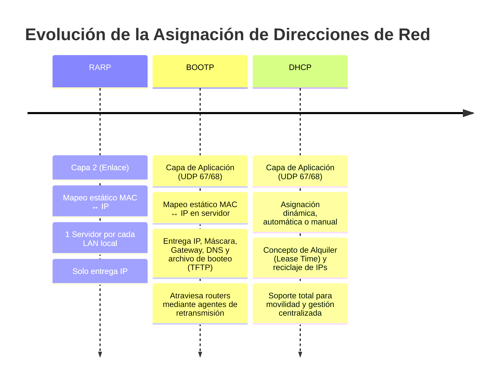
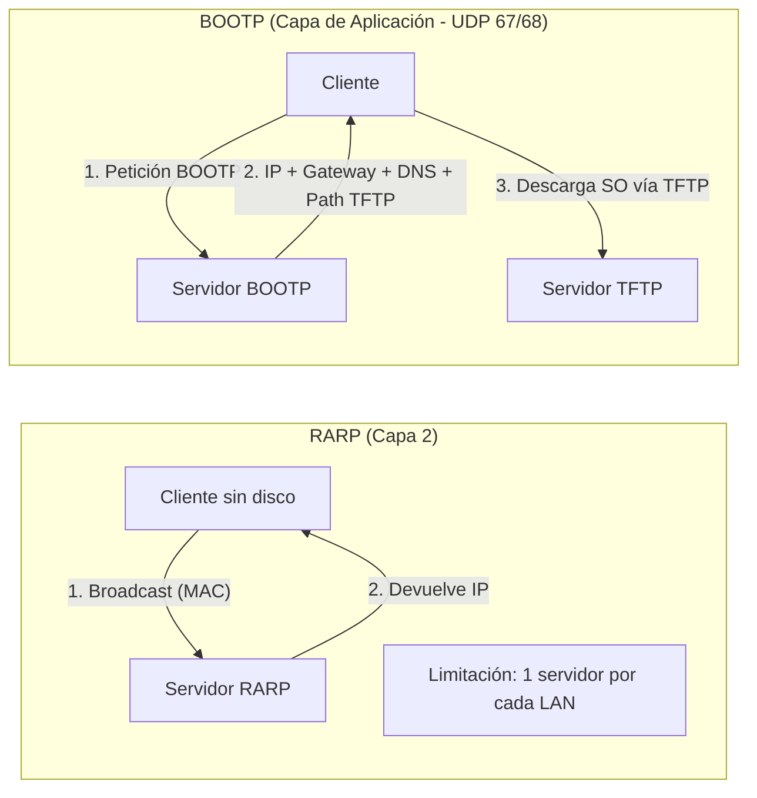
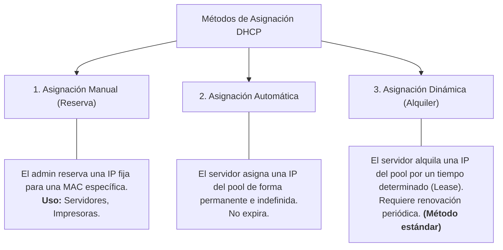
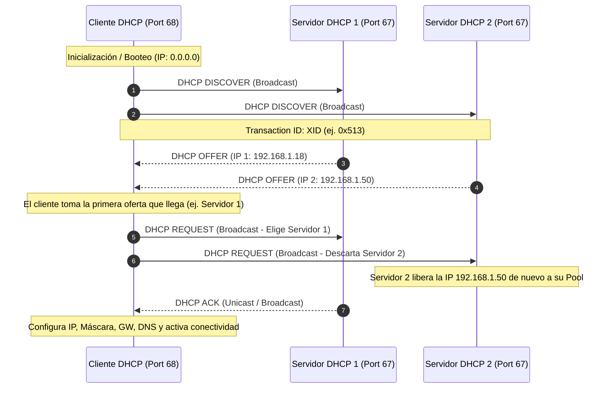
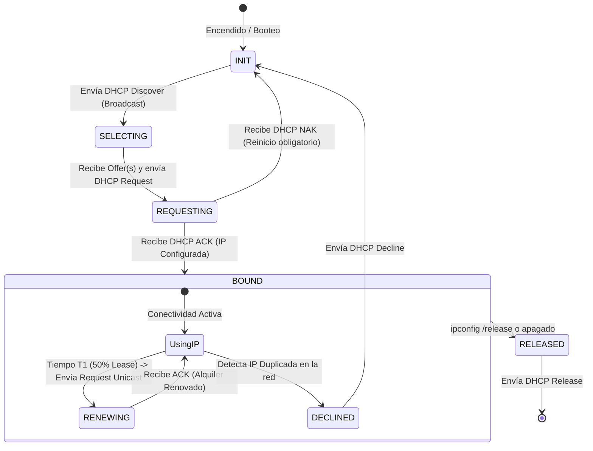
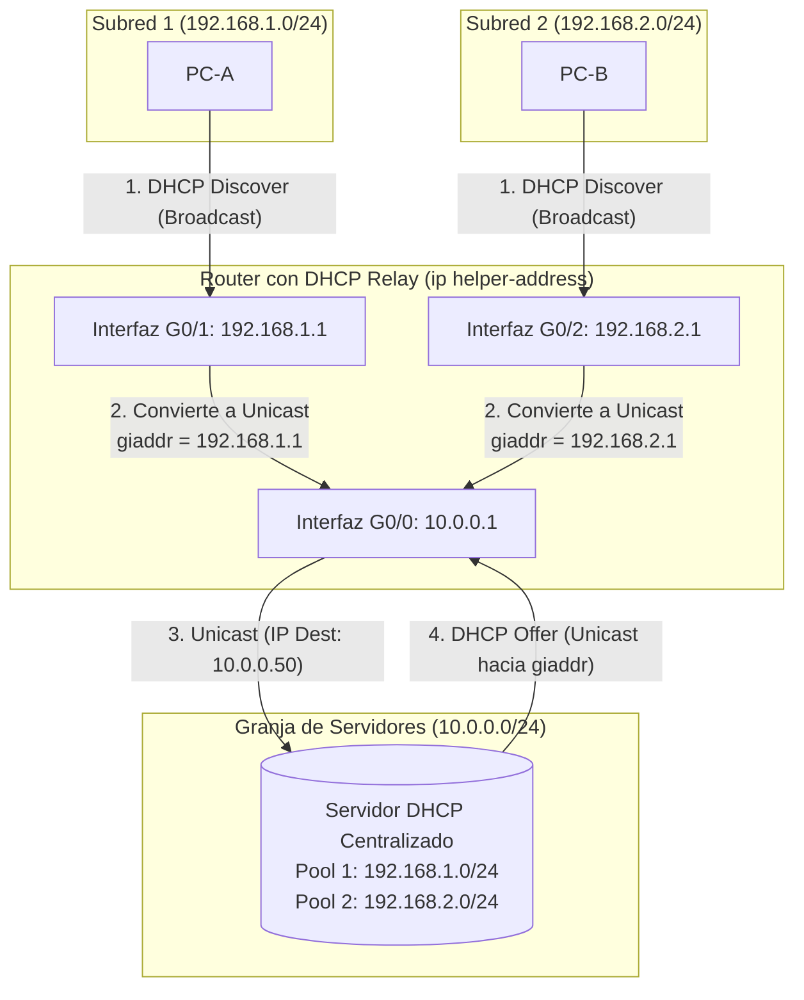
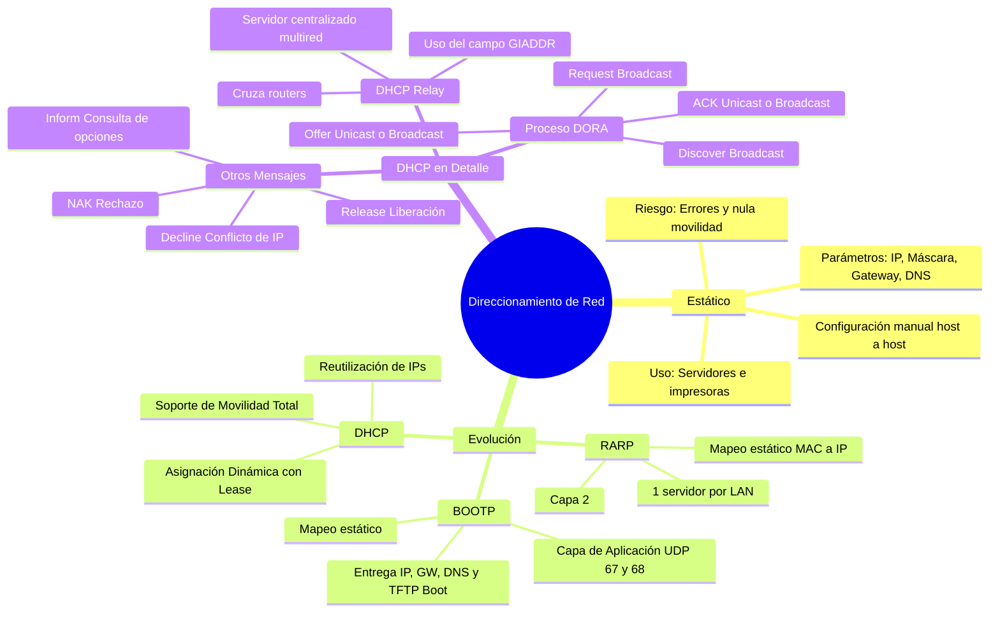

---
aliases:
subject:
  - REDES
year: "4"
exam: PARCIAL2
unit: "3"
type: Transcripcion
zk_type: resources
status: in-progress
date: 2026-08-31
source:
  - https://youtu.be/XRniG1TsgL8?si=LdwfbVyr6kiF2F6m&t=1390
tags:
---
---
# Transcripcion
23:05

23 minutos y 5 segundos

un tema que sigue que es por el protocolo de hsbc

23:23

23 minutos y 23 segundos

bueno entonces recién vimos cómo asociar una dirección como averiguar la dirección mac a partir de una dirección

23:30

23 minutos y 30 segundos

ip en el protocolo a erp y antes bueno vimos el protocolo y cmt ahora vamos a seguir es lo último que vemos de la capa

23:37

23 minutos y 37 segundos

de caminar 3 de la capa de internet que son los protectores boot pp y de hcp y vamos a ver vamos a ver la diferencia

23:46

23 minutos y 46 segundos

entre el direccionamiento estático y dinámico vamos a ver de qué se trata el protocolo raro el protocolo pp esto los vamos a

23:54

23 minutos y 54 segundos

mencionar y vamos a desarrollar bien el protocolo de hcp de hcp a qué se refiere direccionamiento

24:03

24 minutos y 3 segundos

estático los administradores a veces o mejor ya tienen dos formas de asignar dirección vive en forma estática o en forma dinámica en forma estática

24:11

24 minutos y 11 segundos

significa que tienen computadora por computadora poner propiedades tcp/ip y ponerle o cargarle a la dirección ip de

24:19

24 minutos y 19 segundos

manera manual vamos a eso se refiere el direccionamiento estático entonces si uno les configura la dgt así de esta

24:27

24 minutos y 27 segundos

forma forma manual esa dirección ip va a quedar en la computadora y cada vez que inicia esa computadora va a tener asignada esa dirección y película

24:35

24 minutos y 35 segundos

administrador le configuró es decir que no se modifica esa dirección ip el parece será bueno o será malo y esa

24:43

24 minutos y 43 segundos

forma de asignar dirección ip en forma estática no sé si usted alguna vez lo han hecho

24:52

24 minutos y 52 segundos

este dios o al menos de dios te dio asociación con muchas computadoras necesito tener una empresa

25:00

25 minutos

que tiene 6 10 20 30 computadoras y poder que les pueden arreglar pero si tienes una computadora una imaginas en

25:07

25 minutos y 7 segundos

la universidad que hay montón de computadoras muchos laboratorios o un call center que tiene 1.500 con 1500 puestos de trabajo es medio inhumano así

25:16

25 minutos y 16 segundos

medio muy laborioso para el administrador tener que configurar la máquina por máquina la dirección y simple ahora qué pasa si haces por una

25:25

25 minutos y 25 segundos

pregunta si el administrador de la red saca la computadora de un switch del piso del cuarto piso y la lleva al

25:32

25 minutos y 32 segundos

segundo piso lo conecta a otro switch o sea a otra red a otra su problema qué va a pasar con esta máquina está en el conectividad o no

25:43

25 minutos y 43 segundos

no sé por qué llaman porque la gateway por defecto es del otro switch cosa

25:52

25 minutos y 52 segundos

bien cuidado en el switch no sólo es configurar un gateway al router perfecto solamente por eso

26:02

26 minutos y 2 segundos

porque va a tener más configurado en la puerta de enlace el gateway porque otras cosas también y por qué no se le va por alcanzar

26:10

26 minutos y 10 segundos

el perdón también puede ser problema de vida es perfecto perfecto pero cuál es el grave

26:18

26 minutos y 18 segundos

problema acá el tema es la red porque puede ser que el otro área de la empresa esté con otra red va a ser otra de

26:25

26 minutos y 25 segundos

adicción y pe y ahí no va a coincidir la parte de red y no va a tener actividad exacto muy bien ariel y listo esa

26:33

26 minutos y 33 segundos

máquina al trasladarla y va a pertenecer a otra dirección de red o de subred si tenemos implementados hogares pero es lo

26:41

26 minutos y 41 segundos

mismo en el mismo nuestra miento para pertenecer a otra súper la primera parte de la de los primeros bytes no van a coincidir entonces esa pobre máquina va

26:49

26 minutos y 49 segundos

a tener ip pero como soy te pertenece a otra red no va a tener conectividad segura cuando vimos el tema de sucre eres pusimos un problema que era cuando

26:58

26 minutos y 58 segundos

el atlante estaba pertenece a otras subred este será el caso si no es que la configuró mal el administrador sino que

27:05

27 minutos y 5 segundos

al trasladar alguna red a otra automáticamente le quedó la tarjeta ya configurada como no pertenece a la misma

27:12

27 minutos y 12 segundos

red que tendría que ser un administrador ir y modificarlo y asignarle una dirección ip dentro de las que pertenecen el rango de esa nueva red o

27:21

27 minutos y 21 segundos

súper en el cual se conectó la pc sí entonces con el problema de dirección antes práctico no facilita la movilidad

27:28

27 minutos y 28 segundos

de dispositivos en la empresa ojo no es que no se puede implementar la dirección de estático de muchas empresas que implementan porque consideran que es

27:36

27 minutos y 36 segundos

seguro porque porque el administrador tiene pleno control de qué dirección ip tiene cada una de sus máquinas entonces

27:43

27 minutos y 43 segundos

es seguro en ese sentido y si la empresa no anda desplazando computadora el mundo al otro está todavía no se ha funciona

27:51

27 minutos y 51 segundos

porque existen el direccionamiento estático ahora si una empresa que estará constantemente trasladando ese de un lugar a otro que es lo que pasa por

27:59

27 minutos y 59 segundos

ejemplo en las empresas donde la movilidad de los usuarios que se cambien de oficina y demás entonces ahí no

28:06

28 minutos y 6 segundos

conviene esta forma de asignar dirección ip si no es que esté mal va a depender de la dinámica de cada empresa en

28:14

28 minutos y 14 segundos

particular por eso es que lo vemos porque quizás ustedes como decía recién simples trabajo en una empresa relativamente chica que no tiene gran cante de dispositivos está muy bien el

28:22

28 minutos y 22 segundos

direccionamiento estática como se hace para configurarlo entrar en la parte del real propiedades tcp/ip y

28:30

28 minutos y 30 segundos

ahí se van a hacer práctica de esto les va a parecer esta pantalla entonces usted le hacen clic en este circuito y cuando le hacen clic automáticamente

28:38

28 minutos y 38 segundos

despeja tipear acá la dirección ip alguna vez si alguno lo he hecho cuando type una dirección ip que dan enter qué

28:46

28 minutos y 46 segundos

pasa con la máscara la tiene tití piano no alguna vez quizá no uno cuando apenas

28:56

28 minutos y 56 segundos

pone la derecha automáticamente el software le pone la máscara porque porque analizan se da cuenta que en la red de clase c y automáticamente le pone

29:04

29 minutos y 4 segundos

master si ustedes manejan sus redes es exacta donde tienen que modificarla en este caso por ejemplo el último baile

29:11

29 minutos y 11 segundos

por ejemplo 12 42 24 depende de la cantidad subredes que vayan a ferial y la puerta de nación ahora porque no

29:19

29 minutos y 19 segundos

hacemos la ponerla tenemos que crear nosotros entonces qué es cuáles son los parámetros mínimos que tiene que tener una máquina de conectividad total dentro

29:27

29 minutos y 27 segundos

y fuera de la empresa es ip máscara puerta de enlace y servidor dns estamos esto sería una configuración manual o

29:36

29 minutos y 36 segundos

estática ahora qué pasa si queremos configurar la ip dinámicamente quizá por dentro un ratito se los digo ahora

29:45

29 minutos y 45 segundos

porque no les puse un un dibujo en la otra en el otro tema lo único que hay que hacer si no quiero obtener pero

29:51

29 minutos y 51 segundos

configurado dinámicamente la ip a una computadora no es prácticamente es hacer un clic acá donde dicen obtener una idea automáticamente y si no lo hace un click

30:00

30 minutos

para acá todo esto desaparece y no me deja ver nada es decir que o una cosa o la otra

30:07

30 minutos y 7 segundos

no se puede tener los dos las dos formas de configuración simultáneamente no lo permite el software

30:15

30 minutos y 15 segundos

pero

30:17

30 minutos y 17 segundos

[Música]

30:19

30 minutos y 19 segundos

pero vimos lo que el direccionamiento estático ahora vamos a ver otra forma de asignar direcciones y ven que es para las

30:29

30 minutos y 29 segundos

computadoras que no tienen disco rígido usted dicen pero hoy en día todas las computadoras tienen disco rígido perfecto todas las especies tienen disco

30:36

30 minutos y 36 segundos

rígido pero por ejemplo una caja registradora de un supermercado no tiene disco rígido entonces para eso y porque al principio de las redes tampoco las

30:45

30 minutos y 45 segundos

computadoras tenían disco rígido yo siempre los cuentos que yo empecé a trabajar con una pc que era una equis de

30:52

30 minutos y 52 segundos

que tenía un mega de ram y no un mega de ram escuchen bien me graban y no tenía disco rígido sin embargo yo desarrollaba

31:00

31 minutos

en día se hacía sistema y nos vendía y con eso me ganaba la vida entonces para eso para

31:08

31 minutos y 8 segundos

que una máquina pueda obtener una dirección ip si no tiene disco rígido se desarrolló el protocolo que se llama ahorrar

31:16

31 minutos y 16 segundos

significa raro si ustedes se fijan son las mismas letras del erp que vimos nosotros realmente diferencia que ahora tiene un aire adelante que significa

31:24

31 minutos y 24 segundos

reverso protocolo de resolución de direcciones al revés o inverso qué significa esto

31:34

31 minutos y 34 segundos

aseguran que el padre era aparte de una dirección ip que averiguaban la dirección marca que es exactamente al revés nosotros la pc cuando arranca

31:42

31 minutos y 42 segundos

cuando gotean le envía la dirección mac que tiene en su placa y espera que haga bien un servidor le asigna una dirección

31:50

31 minutos y 50 segundos

ip si es decir funciona exactamente a través por eso de ahí sale su nombre la que se va a enviar su dirección mal al

31:59

31 minutos y 59 segundos

servidor raro dice servidor a buscar en unas tablas que se llama y le va a devolver alguna dirección ip

32:06

32 minutos y 6 segundos

como hace el servidor para saber qué ip le tiene que dar el administrador tiene que configurar en el servidor las asociaciones de mac y pemex y pemex de

32:15

32 minutos y 15 segundos

todos los dispositivos que tiene en su plan subred diario local que parece será

32:22

32 minutos y 22 segundos

rápido será egipto el tono tener que configurar en una tabla todas

32:33

32 minutos y 33 segundos

las direcciones los 50 puestos de trabajo tengo que crear una tablita que diga las direcciones de las 50 máquinas

32:40

32 minutos y 40 segundos

y al lado la dirección mac de las 50 máquinas es tedioso sí es bastante tedioso hacerlo pero bueno era lo lo

32:48

32 minutos y 48 segundos

primero que surge entonces qué hace este protocolo hace un mapeo estático entre la ip y la mac cuando la pc envía la marca el serbio la

32:57

32 minutos y 57 segundos

busque la tabla se fija que le corresponde y asigna esa dirección ip a partir de que esa máquina tiene la

33:04

33 minutos y 4 segundos

dirección ip puede tener conectividad el problema tiene este protocolo que necesita un servidor rar por cada red

33:13

33 minutos y 13 segundos

por cada la va a necesitar un servidor raro es decir que no puede haber un solo servidor que le

33:20

33 minutos y 20 segundos

asigne direcciones a todas las máquinas de la empresa si yo tengo actividad en redes distintas con sus redes distintas

33:27

33 minutos y 27 segundos

porque tiene varias áreas por ejemplo este protocolo en realidad ya no se está usando lo que se está usando el protocolo boot pp que a su vez fue

33:36

33 minutos y 36 segundos

reemplazado por el protocolo de hcp que vamos a desarrollar bien pasamos entonces al pp todo estos

33:45

33 minutos y 45 segundos

protocolos que estamos viendo en el radar de hcp son protocolos que permiten asignar de una manera dinámica sería la

33:54

33 minutos y 54 segundos

dirección ip de las computadoras para que tengan conectividad estos protocolos tanto raro como tps

34:01

34 minutos y 1 segundo

surgieron para asignar la dirección ip a computadoras que no tenían disco rígido sí o sea que les puse que fue

34:09

34 minutos y 9 segundos

originalmente diseñado para pc o dispositivos que no tuvieran disco rígido entonces no tienen donde almacenar su dirección ip a la que

34:17

34 minutos y 17 segundos

normalmente se almacena en el disco rígido entonces igual que el protocolo raro que misma presión permite que un dispositivo

34:24

34 minutos y 24 segundos

obtenga su dirección ip funciona de manera muy similar así que hay que crear tablas en el servidor esas tablas se

34:33

34 minutos y 33 segundos

cargan o se configuran manualmente en ese servidor y la ventaja de este protocolo es que nos permite configurar más parámetros me

34:42

34 minutos y 42 segundos

permite confiar la espera más el aporte en lhasa servidor dns más para un perfil el rap que vimos recién

34:50

34 minutos y 50 segundos

es igual en el sentido que realice más bien estáticos y permanentes que significan permanentes que si yo cambio esa máquina y la llevó a otra red voy a

34:59

34 minutos y 59 segundos

tener que ir al servidor y actualizar la dirección ip porque ahora para esa marca no le tengo que dar esa piscina pero tengo que darla de la otra red en la

35:08

35 minutos y 8 segundos

cual se conectó ahora ese computador es un protocolo cliente servidor el

35:15

35 minutos y 15 segundos

gusto es un protocolo de más alto nivel y trabaja en la capa de aplicación de la actividad de protocolos tcp/ip y se

35:23

35 minutos y 23 segundos

encapsula el protocolo boots trap en un segmento ese segmento en un paquete el

35:30

35 minutos y 30 segundos

paquete en una trama y así se manda el mensaje cuál es la gran ventaja de este

35:37

35 minutos y 37 segundos

protocolo que puede tener un solo servidor boost ep que me asigna directamente para todas las redes o

35:45

35 minutos y 45 segundos

subredes que yo tenga en la empresa las máquinas clientes pueden esperar una red y el servidor pues estar en otra red distinta

35:53

35 minutos y 53 segundos

esto el protocolo raro no lo soporta en cambio el pp si no es una mejora como quien siempre se puede evolucionar lo

36:02

36 minutos y 2 segundos

estamos viendo así por orden cronológico primero surgió el raro después surgió el boot pp y ahora que se está usando es el

36:09

36 minutos y 9 segundos

de hcp que es una evolución de este protocolo este punto extra que corre sobre vp

36:16

36 minutos y 16 segundos

sobre encapsula en un segmento bp y corre sobre los puertos 67-68 el servidor escucha en el puerto

36:23

36 minutos y 23 segundos

67 y el cliente en el puerto 68 cuidado que esta palabra puertos que todavía no lo hemos visto no se refiere a los puertos físicos sino que son puertos

36:32

36 minutos y 32 segundos

lógicos piénsenlo la palabra puerto en este contexto como si fuera un número de proceso que se

36:40

36 minutos y 40 segundos

está ejecutando la computadora si un servidor es un dispositivo no es un puerto físico a la semana pero más no es lo mismo que un puerto de un

36:48

36 minutos y 48 segundos

switch con botón switch es el hueco en el cual uno enchufa una rj45 un conector rj en cambio acá no esto es un concepto

36:57

36 minutos y 57 segundos

lógico sería de la capa de transporte estos son conceptos de capa de transport

37:04

37 minutos y 4 segundos

como funciona con él cuáles son los pasos de este protocolo primero la computadora bootear y lee en su

37:12

37 minutos y 12 segundos

dirección mac de la de la roma y de la placa ahí nomás envía un mensaje wood ep que lo encapsula en un segmento vp

37:20

37 minutos y 20 segundos

pero encapsula en una trama y lo lanza al medio ese mensaje va a llegar al servidor del servidor va a buscar la dirección mac

37:28

37 minutos y 28 segundos

que viene en esa tabla que tenía de mapeo estático y de ahí encuentran la dirección ip y se la asigna a la tri set

37:36

37 minutos y 36 segundos

pero fíjense además de asignando la dirección ip lo que asigna dice que la ruta que el archivo del sistema

37:43

37 minutos y 43 segundos

operativo descarga porque porque estos protocolos surgieron para las computadoras que no tenían disco rígido y si no tienen disco regido tampoco tiene el sistema operativo las pobres

37:51

37 minutos y 51 segundos

máquinas entonces cuando vote a esa máquina lo que hace el sistema operativo es perdón del servidor es asignarle la

38:00

38 minutos

ip y le dice de alguna manera de dónde puede descargar el sistema operativo si entonces una vez que la máquina ya tiene

38:07

38 minutos y 7 segundos

sistema operativo puedes terminar de voltear correctamente el cliente obtiene skip obtiene el

38:16

38 minutos y 16 segundos

sistema operativo desde por ejemplo un servidor ftp qué significa esto ftp significa file transfer protocol

38:24

38 minutos y 24 segundos

protocolo de transferencia de archivos estate significa trivial en un protocolo de transferencia de archivos liviano que significa liviano que corre sobre un

38:33

38 minutos y 33 segundos

chico dentro de color mucho más liviano que te esp el sistema operativo se carga en la

38:42

38 minutos y 42 segundos

máquina si no va a descargarlo va a copiar desde ese servidor fácil con la propia presenta el propio cliente

38:49

38 minutos y 49 segundos

resina en el sistema operativo tiene conectividad puede terminar de voltear incorrectamente

38:57

38 minutos y 57 segundos

bueno está entendiendo está muy calladitos siento que prendieron la computadora y se fueron están en otro no a centímetros

39:04

39 minutos y 4 segundos

bien gastón estar atento estábamos pero están en transición una sensación horrible estar mirando una pared una

39:12

39 minutos y 12 segundos

computadora y no es bueno qué desventajas tiene este protocolo

39:18

39 minutos y 18 segundos

primero hay que cargar manualmente qué les parece se pueden trasladar de un

39:26

39 minutos y 26 segundos

lado de una red a otra sin dificultar las computadoras bueno administrador tiene que hacer algo

39:35

39 minutos y 35 segundos

según lo que él mismo hasta ahora y dijimos que pasaba a ser una máquina

39:43

39 minutos y 43 segundos

es cambia de lugar hay que cambiarle la ip hay que tener

39:51

39 minutos y 51 segundos

que actualizar las tablas seguir el servidor entonces desventajas configuración manual un estándar no facilita cambiar traslado porque y

39:59

39 minutos y 59 segundos

proceso el traslado a la máquina perfecto la puedo trasladar físicamente pero después tengo tiene el servidor y cambiarle la configuración de la tablet

40:07

40 minutos y 7 segundos

sin darle otra dirección ip para esa marca por eso es que ponemos acá que necesita de la actividad del administrador y necesita que el

40:15

40 minutos y 15 segundos

administrador esté atento si se traslada a una computadora de una red a otra acá dice bueno no permite asignación

40:24

40 minutos y 24 segundos

dinámica de dirección porque el próximo protocolo vamos a ver si permite la asignación dinámica y la reutilización de direcciones

40:33

40 minutos y 33 segundos

y si ya lo vemos en seguir ahora lo mejor no se entiende bueno entonces

40:39

40 minutos y 39 segundos

y el protocolo wood pp ahora vamos a ver el siguiente protocolo que es una evolución del pp que es de hcp algunos

40:49

40 minutos y 49 segundos

se lo tienen que conocerlo quizás de nombres de s qué significa protocolo de configuración

40:55

40 minutos y 55 segundos

dinámica de host vamos a ver qué significa esa palabra dinámica

41:05

41 minutos y 5 segundos

qué características tiene este protocolo los primeros protocolos clientes servidor se ejecuta la máquina que necesita la empresa en el cliente y en

41:13

41 minutos y 13 segundos

el servidor se va a configurar un rango de direcciones un pool de direcciones vieron que nosotros en todos los ejercicios de direccionamiento o el

41:21

41 minutos y 21 segundos

profe también dijo se calcular el rango de direcciones porque cuando lo consigo en un servidor dhcp lo que hay que configurar le hizo

41:29

41 minutos y 29 segundos

el rango de direcciones para que ese servidor tenga o sepan entre key baker asignar también dispositivos

41:39

41 minutos y 39 segundos

una característica muy importante es que me permite un administrador sin una administración simple o sencilla y

41:47

41 minutos y 47 segundos

centralizada qué significa eso vamos a poder tener un único servidor dhcp en toda la empresa que le va a asignar direcciones ip a todos los puestos de

41:56

41 minutos y 56 segundos

trabajo que se tenga en en mi organización si tengo 10 años de trabajo me importan tendré que cargarle

42:04

42 minutos y 4 segundos

10 rangos de dirección y ver al servidor pero cuál es la gran gran ventaja que las computadoras que arrancan se

42:13

42 minutos y 13 segundos

encienden y automáticamente el servidor busca la dirección ip que le corresponde a esa máquina

42:20

42 minutos y 20 segundos

[Música]

42:21

42 minutos y 21 segundos

no se hacen más estáticos como vimos en los dos protocolos anteriores sino que acá simplemente no hace falta configurar

42:29

42 minutos y 29 segundos

las direcciones mac simplemente se configuran las direcciones ip que nosotros queremos que el servidor - sin usted en la casa de ustedes tienen algún

42:37

42 minutos y 37 segundos

servidor dhcp han averiguado eso se les asigna a ustedes al ser el robot

42:45

42 minutos y 45 segundos

en el casi nada sí señor es el router el router sitio que tienen en casa porque es bueno

42:53

42 minutos y 53 segundos

porque en la casa ustedes tienen pocos dispositivos en una empresa no en una empresa y normalmente hay un servidor un windows o linux que funciona como

43:02

43 minutos y 2 segundos

servidor dhcp si en la casa de ustedes decíamos disfrutar citó asigna la dirección ip entonces cada vez que se enciende se conecta a un celular una

43:12

43 minutos y 12 segundos

computadora o un televisor el router le asigna una dirección y de manera dinámica entonces

43:18

43 minutos y 18 segundos

el servidor dhcp está configurado en el router de la casa muy bien la configuración es buenas dinámicas que se

43:26

43 minutos y 26 segundos

refiere eso que era como para simple dispositivo simplemente se inicia y de una dirección ip y el servidor se la asigna pero fíjense lo que dice acá que

43:34

43 minutos y 34 segundos

la configuración se alquila por un tiempo determinado qué significa eso que el servidor le va a prestar de alguna

43:42

43 minutos y 42 segundos

manera la dirección ip por un tiempo una vez que ese dispositivo se apaga esa dirección ip puede volver al pool de

43:49

43 minutos y 49 segundos

direcciones y ese servidor se la puede asignar y maipú como ahora esa mora necesita más esa computadora se la puedes ir a otra computadora dígito oa

43:58

43 minutos y 58 segundos

otro dispositivo hacer televisor celular o dispositivo que sea vamos fíjense que funciona distinto por eso que en

44:05

44 minutos y 5 segundos

dinámico y se alquila la dirección ip normalmente el tiempo que puede tener

44:13

44 minutos y 13 segundos

una dirección y todo en positivo es totalmente configurable por defecto son 24 o 48 horas

44:20

44 minutos y 20 segundos

una prefiera estamos permite la reutilización de dirección y pp por lo que decíamos recién no es que

44:27

44 minutos y 27 segundos

pueda asignar dos veces la misma ip cuidado simultáneamente eso no no pueden haber nunca los computadores que tengan

44:34

44 minutos y 34 segundos

la misma ip en un momento determinado lo que sucede acá es que sea se le alquila la dirección ip por un tiempo una vez que la computadora se apaga esa

44:42

44 minutos y 42 segundos

dirección ip no se usa más entonces se puede reutilizar y ahora asignársela a otro dispositivo pero no no se confundan

44:50

44 minutos y 50 segundos

en un momento determinado esa ip va a estar asignada a un solo dispositivo cuál es la grandísima ventaja de este

44:59

44 minutos y 59 segundos

protocolo que por eso que tienen tanto éxito y la mayoría de las empresas lo usan es que facilita cambios y traslados

45:07

45 minutos y 7 segundos

qué significa eso que si yo quiero trasladar una computadora del segundo piso al octavo piso simplemente le

45:15

45 minutos y 15 segundos

desenchufó del switch y la enchufó en el octavo piso a otro switch eso es todo no tengo que tocar absolutamente

45:22

45 minutos y 22 segundos

nada vamos a ver porque si como hace en el servidor para saber que ahora le tiene que asignar otra dirección ip que

45:30

45 minutos y 30 segundos

pertenezca a la red oa la super a la cual está conectado ese dispositivo eso es muy muy bueno porque el

45:38

45 minutos y 38 segundos

administrador tiene poco trabajo en ese sentido es mínimo el trabajo del administrador lo único que tiene que hacer es configurar ese pool de

45:47

45 minutos y 47 segundos

direcciones una única vez y listo se desentiende las computadoras pueden moverse de un lado a otro y solas cuando voltean el servidor les va asignar la

45:55

45 minutos y 55 segundos

dirección ip correcta que le corresponde bueno obviamente este protocolo no sólo puede tener la dirección ip sino todos

46:04

46 minutos y 4 segundos

los parámetros de configuración ser vamos a ver que son muchos no solamente temas que aporten enlace dns sino que también se pueden configurar otros

46:12

46 minutos y 12 segundos

parámetros como es una evolución del protocolo boot tv es igual corre sobre vp sobre los puertos 67 68

46:20

46 minutos y 20 segundos

igual acá dispuso el dibujito de la pila de protocolos tcp/ip no le puse título perdón ya sé que la capa de aplicación

46:27

46 minutos y 27 segundos

transporte internet y host tardar siete tcp está acá arriba el boot que también está car día

46:36

46 minutos y 36 segundos

en la capa de aplicación porque porque se encapsulan en un segmento que después se mete en un paquete y pérez y después

46:44

46 minutos y 44 segundos

en una trama acá está el protocolo pp pedirá a uno de ustedes que me preguntaba recién como era la conectividad desde el router

46:53

46 minutos y 53 segundos

hacia el proveedor de servicios destaca en esta capa de enlace en protocolo ppp

46:59

46 minutos y 59 segundos

la reconexión es seria las presillas bien el dsp me permite tres métodos

47:07

47 minutos y 7 segundos

distintos para asignar las direcciones de brun dirección snipe qué significa eso qué pasa si yo quiero que un

47:16

47 minutos y 16 segundos

servidor siempre tenga la misma dirección ip porque porque conviene que por ejemplo las impresoras o los servidores tengan siempre la misma

47:25

47 minutos y 25 segundos

dirección ip sino después no no se encuentran no puede un servidor ir cambiando de ip cada vez que nosotros lo

47:32

47 minutos y 32 segundos

encendemos nilo inicializa mos entonces en este caso conviene configurar manualmente a perdón

47:42

47 minutos y 42 segundos

y la dirección ip cómo se hace en este caso el servidor me dice para el

47:50

47 minutos y 50 segundos

administrador me dice al servidor o le configura en realidad nosotros dicen que configuran que para está determinada mac y carga la mac le asigne esta ip

47:59

47 minutos y 59 segundos

entonces cada vez que el servidor recibe una solicitud de dirección ip con una mac busca y le asigna lo que el

48:08

48 minutos y 8 segundos

administrador estableció si a eso se le llama configuración manual es como que nosotros le delegamos

48:15

48 minutos y 15 segundos

la configuración manual al de hcp como dándole la marca a que estaría

48:23

48 minutos y 23 segundos

funcionando como el raro o el pp que vimos recién si una configuración manual la otra configuraciones se llama

48:31

48 minutos y 31 segundos

automática que es que una vez que el dispositivo se inicia el servidor busca una dirección ip entre el pool de

48:38

48 minutos y 38 segundos

direcciones que tiene hicieras hacerme en forma permanente qué significa eso que siempre le va a asignar la misma dirección ip a ese cliente no hace falta

48:46

48 minutos y 46 segundos

que le mande la marca la primera vez simplemente le manda la solicitud el servidor le hace una ip y registra cuando asigna para esa marca para

48:55

48 minutos y 55 segundos

siempre darle la misma y la otra que es la que más se usa es esta la dinámica es la que se alquila

49:03

49 minutos y 3 segundos

entonces el servidor le presta o le alquila una dirección y ven al dispositivo que lo solicitó y cuando se el dispositivo se apaga esa dirección

49:11

49 minutos y 11 segundos

ip se libera y vuelve al pool y es lo que me permite reutilizar dirección antes de las señalas tres métodos de

49:20

49 minutos y 20 segundos

asignación de direcciones ip vamos a ver como el proceso cómo funciona en de hcp

49:26

49 minutos y 26 segundos

aquí tenemos un cliente una dijimos que era cliente servidor normalmente hay muchos clientes y un servidor planificación nuestro metraje que uno

49:34

49 minutos y 34 segundos

solo ya que hasta el servidor dhcp que hace al cliente cuando arranca cuando se inicia no tiene ningún

49:41

49 minutos y 41 segundos

a ver si viven y va a enviar un mensaje que se llama el vhs pe discover entonces lanza el cliente y xp discover hacia el

49:51

49 minutos y 51 segundos

servidor vamos a ver qué va hacia todos lados parece que hay una pc que necesitéis

49:59

49 minutos y 59 segundos

consulta y su pool de direcciones le ofrece una dirección ip entonces le va a mandar un segundo mensaje que se llama

50:07

50 minutos y 7 segundos

dhcp of fair es mensaje lo construyó el servicio lo manda a la pc la pc dice bueno también

50:15

50 minutos y 15 segundos

me gusta esa oferta dame esa configuración y le mando un mensaje que se llama dhcp request el servidor si

50:23

50 minutos y 23 segundos

está todo ok si no está duplicada de esa dirección ip que están solicitando le envía un 17 así acá

50:31

50 minutos y 31 segundos

con esto cuando el cliente recibe el cuarto mensaje o mejor dicho cuando recibir la confirmación que es el así

50:38

50 minutos y 38 segundos

que a partir de ahí el cliente puede usar la dirección ip que le ofrecieron sí y que tiene la configuración para

50:45

50 minutos y 45 segundos

tener conectividad de red hasta que no se intercambian estos cuatro mensajes no tiene conectividad de red esa pobre

50:53

50 minutos y 53 segundos

computadora estos son algunos de los mensajes sociales vamos a ver bien detalladamente

51:00

51 minutos

y hay más mensajes fíjense todos estos está el discovery que vimos recién en la

51:08

51 minutos y 8 segundos

seca que lo vimos versión ahora qué pasa si el servidor detecta la dirección ip que la flexión está

51:17

51 minutos y 17 segundos

duplicada porque puede darse la grandísima casualidad que justo el administrador vino y configuró manualmente una pc con esa ip entonces

51:25

51 minutos y 25 segundos

si el servidor se da cuenta en lugar de mandarle un pase acá le va a mandar un acta en el cuarto mensaje

51:33

51 minutos y 33 segundos

acá en lugar de aceptar demanda un negativo negative asi k significa senac y que significa es el que le dice que

51:42

51 minutos y 42 segundos

todo lo que le ofreció no sirve de nada que tiene que volver a empezar el proceso de nuevo entonces cada vez que se reciben del ccpn act el cliente tiene

51:51

51 minutos y 51 segundos

que empezar de nuevo el proceso manda un 17 discover espero no ser un big west y una seca sí

52:00

52 minutos

después está el decline ya lo vamos a seguir con el decline el release y el informe entre clanes aparecido algo

52:07

52 minutos y 7 segundos

benzano eso nos puso en cada uno por verse el disco por lo mismo gracias el primero que lo envía el cliente si el

52:16

52 minutos y 16 segundos

cliente construye el mensaje de hcp discovery se lo envía como broadcast a todos los servidores de la red s de hp

52:25

52 minutos y 25 segundos

discover continuo lo que se llama un haití de transacción que es eso un número de transacción que hacer que el servidor va a usar para distinguir una

52:35

52 minutos y 35 segundos

petición de un cliente de la petición de otro cliente imaginación en el laboratorio cuando arrancan las computadoras todas juntas

52:42

52 minutos y 42 segundos

si hay no sé 30 computadoras imagínense al servidor le van a tener 30 solicitudes se le van a llegar 30 mensajes de hp discover al servidor como

52:51

52 minutos y 51 segundos

hasta server para distinguir un mensaje de otro de esas 30 computadoras porque van a tener haití de transacción diferente

52:59

52 minutos y 59 segundos

con eso servidor va siguiendo la pista de todos los otros mensajes no fuera el resto y la seca es decir se pegó pero dijimos reciente

53:08

53 minutos y 8 segundos

se lo construye el servidor se lo envía el cliente y le ofrece algunos de los parámetros que le configuró el

53:15

53 minutos y 15 segundos

administrador algunos parámetros y demás pero normalmente el puerto de enlace y fíjense le manda también el tiempo de

53:22

53 minutos y 22 segundos

alquiler el tiempo que va a poder usar esa computadora ese es el ip esa dirección ip qué pasará si se le vence el tiempo del alquiler

53:31

53 minutos y 31 segundos

una moscú está venciendo en una computadora el router le asignó una ip y ustedes no la pagan más a la computadora lo tienen tres bien encendida que va a

53:40

53 minutos y 40 segundos

pasar ese alquiler se va a acabar en algún momento suponemos que sea de 48 horas en al final que va a pasar se va a

53:48

53 minutos y 48 segundos

quedar sin conectividad la pobre pese o que debería hacer gracias debido a la extensión

53:55

53 minutos y 55 segundos

ácido del procedimiento de vuelta no no no no hace todo el procedimiento nuevo porque ya tiene una idea asignada en lo

54:02

54 minutos y 2 segundos

que hace es se da cuenta que se le está reduciendo su tiempo es decir el tiempo de alquiler está llegando a cero y manda

54:09

54 minutos y 9 segundos

un mensaje pidiendo la renovación del alquiler por dos días más por ejemplo por 48 horas más por lo que esté configurado en el servidor no

54:18

54 minutos y 18 segundos

si está configurado 24 horas manda a pedir una extensión es como cuando usted tiene un inquilino en algún departamento si decide está por vencer el contrato

54:26

54 minutos y 26 segundos

simplemente piden renovación del alquiler no hace falta enviar de nuevo un 10 ep discover así no hace falta empezar de

54:35

54 minutos y 35 segundos

nuevo el procedimiento cómo se hace para extender el alquiler con un mensaje de s&p request este mensaje permite

54:43

54 minutos y 43 segundos

extender el alquiler o me permite en el proceso de volteo de una máquina solicitar lo que el servidor me ofreció

54:52

54 minutos y 52 segundos

con discover descubrimos servidores el servidor nos responde con un buffer el cliente dice bueno dame lo que me están

54:59

54 minutos y 59 segundos

ofreciendo y en la seca dijimos presente lo construye el servidor para darle uno que

55:08

55 minutos y 8 segundos

hay de recibido al cliente porque ya dijimos que tenía esa conectividad cuáles son otros mensajes en beat y

55:16

55 minutos y 16 segundos

sopelana dijimos recién si el cliente recibe un test penal tiene que empezar todo el proceso de nuevo por

55:25

55 minutos y 25 segundos

qué y por qué todavía no tenía dirección ip asignadas

55:27

55 minutos y 27 segundos

[Música]

55:30

55 minutos y 30 segundos

qué pasa si el cliente fíjense es muy robusto el de hcp por qué porque garantiza que nunca en una red hayan dos

55:37

55 minutos y 37 segundos

direcciones ip iguales configuradas eso sería un error no pueden haber en una red dos dirección ip iguales

55:45

55 minutos y 45 segundos

configuradas la ip del off no el gateway sin defecto horas que se van a tener el mismo gateway o puerto además qué pasa si el

55:54

55 minutos y 54 segundos

servidor le ofrece una dirección ip al cliente en el 10 sep efe y el cliente descubre que sea especial a tiene otro

56:02

56 minutos y 2 segundos

dispositivo puede dar seis son sí entonces qué hace el cliente si descubre que otro que usa tiene esa tecla que no ha ofrecido en lugar de pedir se la

56:11

56 minutos y 11 segundos

demanda algún de hcp decline el cliente le informa de avisa el servidor que esa dirección y page ya la tiene otro dispositivo que va a ser el servidor le

56:20

56 minutos y 20 segundos

va a ofrecer otra nueva dirección ip sí pero es robusto por qué porque tanto el cliente como el servidor chequean que la

56:28

56 minutos y 28 segundos

dirección ip que se ofrece o que se está por configurar no la tenga asignada otro dispositivo en la gama

56:37

56 minutos y 37 segundos

de steve perry ellis que para qué se usan cuando el cliente ya no va a usar más esa dirección y le manda al servidor

56:44

56 minutos y 44 segundos

un xv de release que significa liberar entonces el cliente y ver esa dirección ip vuelves a dirección ip al pool de

56:52

56 minutos y 52 segundos

direcciones y ese servidor se la puede asignar a otro dispositivo esa dirección ahí está la reutilización de las

56:59

56 minutos y 59 segundos

direcciones ip y a veces los clientes necesitan de nuevo solicitar la configuración al servidor entonces

57:06

57 minutos y 6 segundos

demandan un de hcp informe que se llama que es un mensaje en el cual lo construye el cliente para consultarle al

57:14

57 minutos y 14 segundos

servidor de nuevo que le pasa toda la configuración que había ofrecido antes

57:21

57 minutos y 21 segundos

aquí hay un gráfico del proceso fíjense tenemos un cliente y dos servidores de hp por qué porque van a las empresas

57:30

57 minutos y 30 segundos

grandes para que sean más tolerantes fallos más robustos y no nosotros servidores de hcp sino que hay varios por qué y por qué si se cae ese servidor

57:39

57 minutos y 39 segundos

de las computadoras quedan sin tener conectividad porque nadie le puede una dirección ip entonces pueden haber

57:47

57 minutos y 47 segundos

varios servidores de hp eso lo que esta gráfica mata que hay dos servidores de hp está el factor tiempo es decir que

57:54

57 minutos y 54 segundos

vamos a ir avanzando hacia abajo cuando el cliente arranca o inicia o gotea envía un mensaje de hp discover ese

58:02

58 minutos y 2 segundos

mensaje es de broadcast y va lo van a recibir todos los dispositivos de la magnifica sólo van a recibir los dos servidores

58:11

58 minutos y 11 segundos

qué hacen los servidores que no reciben leche cb discover buscan en el pool una dirección de libre y se las entregan al

58:19

58 minutos y 19 segundos

cliente en este caso tanto el servidor 1 como el servidor 2 de hcp va a enviarle al cliente un de hcp ofrece decir que va

58:28

58 minutos y 28 segundos

a que el cliente ver si va a encontrar con dos ofertas y hacen ustedes cuando tienen dos ofertas de trabajo full time no no pueden elegir los que hacen 300

58:38

58 minutos y 38 segundos

ofertas del de trabajo en este caso dirección ip que hará el cliente el cual recoge

58:51

58 minutos y 51 segundos

con elegiría no ustedes que son hablando con la que tenga o la

58:58

58 minutos y 58 segundos

que tenga mejor conectividad por ahí y no funcionarían o sea no serían iguales

59:07

59 minutos y 7 segundos

las dosis pero son diferentes dirección ip pero cumplen la misma función no habría ninguna diferencia

59:16

59 minutos y 16 segundos

no hay ninguna diferencia perfecto ariel muy bien no hay ninguna diferencia porque el servidor sabe en qué red pertenece ese dispositivo y le va a

59:23

59 minutos y 23 segundos

asignar una ip en cuya parte del red o su jefe es igual la única diferencia va a variar en la

59:31

59 minutos y 31 segundos

parte de hosts entonces cuando a tomar el cliente normalmente la primera que le llega le da lo mismo eso que dijeron

59:38

59 minutos y 38 segundos

reacciona la conectividad no sabe el cliente cuál se le va a brindar mejor conectividad no no puedes saber la presión está volteando tan inicial

59:45

59 minutos y 45 segundos

izando o sea a nivel de conectividad de red entonces lo que hace es cómo recibe dos ofertas porque necesitas hay dos servidores toma la primera que les llega

59:54

59 minutos y 54 segundos

en este caso de elegir el servidor 2 que es el primero que le envió en la oferta

1:00:01

1 hora y 1 segundo

cuando recibe la oferta segura que el tercer mensaje era el de super request entonces el cliente fíjense porque se lo

1:00:08

1 hora y 8 segundos

mandó a los dos porque manda a los dos servidores y xp request

1:00:16

1 hora y 16 segundos

porque uno no le puede mandar un lac y le pueden o no asignar una ip pixar

1:00:25

1 hora y 25 segundos

muy bien acá porque lo envía hacia todos lados hacia todos el cliente y acierta de cuesta para que sepa este servidor

1:00:33

1 hora y 33 segundos

que no lo eligió así como en serio está a mí no me eligió porque no me pide lo que le ofrecí y necesita que le ofreció

1:00:40

1 hora y 40 segundos

y le pide otra cosa distinta y tiene otro número de haití de transacción entonces el servidor se queda callado listo y el que le va a responder va a

1:00:49

1 hora y 49 segundos

ser el servidor no por qué por qué lo eligió eligió la oferta del servidor 2 entonces ahí el servidor 2 chequea que sabe que le ofreció no esté duplica y le

1:00:58

1 hora y 58 segundos

envía un de hcp así acá presiona y se configura el cliente tiene conectividad de red usa la dirección ip

1:01:06

1 hora, 1 minuto y 6 segundos

todo el tiempo que le hace falta y cuando por ejemplo si esa computadora está siempre encendida y nunca se apaga el tiempo de alquiler se empieza a

1:01:15

1 hora, 1 minuto y 15 segundos

reducir trabajar a bajar y cuando está próximo a llegar a cero el cliente tiene la obligación de enviar un 17 rico

1:01:22

1 hora, 1 minuto y 22 segundos

expidiendo una una renovación del alquilar el servidor se lo renueva y demanda un dhcp a seca sigue trabajando

1:01:31

1 hora, 1 minuto y 31 segundos

es clientes sigue con conectividad cuando ya no va a usar más esa ip sí porque es no la necesite más la libera y

1:01:40

1 hora, 1 minuto y 40 segundos

le manda un 17 release al servidor es ahí cuando aceite vuelve el pool de direcciones para que ese servidor se la

1:01:47

1 hora, 1 minuto y 47 segundos

pueda asignar a otro dispositivo bueno lo que vamos a hacer ahora es los mensajes que estuvimos viendo recién

1:01:55

1 hora, 1 minuto y 55 segundos

pero más detalladamente y un poquito más detallado cuáles son los niveles marc

1:02:03

1 hora, 2 minutos y 3 segundos

que hay en esos mensajes fíjense el mensaje de hp discover se va a encapsular en un segmento udp ellos

1:02:12

1 hora, 2 minutos y 12 segundos

se ven capsular en un paquete ip y eso se ven capsular en una trama ethernet vamos a ver cuáles son las direcciones

1:02:20

1 hora, 2 minutos y 20 segundos

ip el servicio en falta eso es un segmento

1:02:27

1 hora, 2 minutos y 27 segundos

hasta acá esto es un paquete hasta acá y eso es una trama hasta allá

1:02:36

1 hora, 2 minutos y 36 segundos

todo eso es una trampa ahora vamos a ver las ip o los puertos

1:02:43

1 hora, 2 minutos y 43 segundos

ese mensaje de s px pertenece a la capa de aplicación de la pira trato con el tcp ip se va a encapsular en un segmento

1:02:52

1 hora, 2 minutos y 52 segundos

de este fin gente que se levantó con los mismos colores si esto en esta parte esto es esta parte

1:02:59

1 hora, 2 minutos y 59 segundos

puerto origen 68 porque los clientes escuchan o trabajan en el puerto 68 los servidores en el 67 como este es un

1:03:07

1 hora, 3 minutos y 7 segundos

mensaje que lo construye el cliente y va dirigido a un servidor de servicios 68 y 67 acá eso se encapsula en un paquete ip

1:03:15

1 hora, 3 minutos y 15 segundos

fíjense la espera acá y p origen 0.0 punto cero punto cero por eso lo veo en detallada para que vean

1:03:23

1 hora, 3 minutos y 23 segundos

que la gente que nosotros estuvimos estudiando que las vimos como hiper reservadas si se usan vamos fíjense el

1:03:30

1 hora, 3 minutos y 30 segundos

uso de la dirección 40 que se llama 0.0 punto cero punto cero que es cuando una máquina está volteando y no tiene

1:03:37

1 hora, 3 minutos y 37 segundos

todavía una dirección ip asignada se auto asigna esta dirección ip los 32 bits en 0 y en la de destino el 17

1:03:47

1 hora, 3 minutos y 47 segundos

discover es un broncas segundos muy chicos y un 5 sin chicos y 25 por qué porque no sabe cuál es la ip del servidor entonces por la formación la

1:03:55

1 hora, 3 minutos y 55 segundos

manda a todo el mundo todos los dispositivos de la red eso se encapsula en una trama y vamos a tener como origen la marca de la máquina

1:04:04

1 hora, 4 minutos y 4 segundos

del siguiente de la número de placas aliaga y como destino todos ejes es un broadcast también y hay algo que les

1:04:12

1 hora, 4 minutos y 12 segundos

quiero aclarar acá fíjense siempre hay una relación entre el tipo de derecho en ip y el equipo de dirección marca si la

1:04:19

1 hora, 4 minutos y 19 segundos

dirección ip es única como lamac origen origen están bien y únicas en cambio si

1:04:27

1 hora, 4 minutos y 27 segundos

la ip es multicapa de pronto la música en este caso de broadcast acaba una mata de bronca siempre hay una relación entre

1:04:36

1 hora, 4 minutos y 36 segundos

el tipo de dirección ip y el tipo de dirección mac si acá es multicast acá debería ir una marca multicast si estás

1:04:45

1 hora, 4 minutos y 45 segundos

fuera únicas acá iría una pública si eso lo que quiero aclarar siempre siempre hay una correspondencia

1:04:54

1 hora, 4 minutos y 54 segundos

la captura del mensaje 17 discover vigentes para que veamos no más

1:05:01

1 hora, 5 minutos y 1 segundo

todo esto es el mensaje de hcp lógico ver esto es de p esto es ip y esta es la

1:05:09

1 hora, 5 minutos y 9 segundos

trama acá está para que vean que es cierto lo que dijimos recién el a nivel de protocolo del paquete en search en la ip

1:05:18

1 hora, 5 minutos y 18 segundos

origen están los 440 y en las de destino hasta los 42 55 acá están los puertos

1:05:25

1 hora, 5 minutos y 25 segundos

puerto origen 68 puerto destino 67 a nivel del segmento vp acá todo esto ya

1:05:32

1 hora, 5 minutos y 32 segundos

es del protocolo de hcp hay en esa clave qué tipo de mensaje es que es discover y les dice el tipo de mensaje que es una

1:05:41

1 hora, 5 minutos y 41 segundos

solicitud rico está en un número uno las respuestas son dos normalmente

1:05:49

1 hora, 5 minutos y 49 segundos

el número de transacción con el pse de 513 el número de transacción porque todos los mensajes que siguen el offer el request y el azúcar van a tener que

1:05:58

1 hora, 5 minutos y 58 segundos

tener el mismo número de leiby de transacción acá hay una serie de campos fíjense

1:06:06

1 hora, 6 minutos y 6 segundos

están tomando todo sincero porque porque la dirección ip del cliente que se cree que está pidiendo el test en cero de

1:06:13

1 hora, 6 minutos y 13 segundos

cáncer tercero no tienes dirección ip todavía tu dirección ip es la que le va a ofrecer el servidor también tercero es

1:06:21

1 hora, 6 minutos y 21 segundos

como que el mensaje del bcp en el discover está en la mayoría de los campos están en cero y de a poco se van a ir completando a medida que se vayan

1:06:29

1 hora, 6 minutos y 29 segundos

intercambiando los mensajes of fair play quest y acerca si en este caso está todo en el cielo lo único que está completo

1:06:36

1 hora, 6 minutos y 36 segundos

fíjense es la dirección mac del cliente por qué y por qué ahora sabemos el ave 69 a haberse cierto silver 69 en la que

1:06:44

1 hora, 6 minutos y 44 segundos

está winter más que más tipo de mensaje en un de hp discover y se lo vuelve a aclarar

1:06:53

1 hora, 6 minutos y 53 segundos

si y de nuevo acá pero esto es lo mismo que vimos recién porque para saqueadores el

1:07:01

1 hora, 7 minutos y 1 segundo

otro mensaje que lo construye el servidor el off que viene desde el servidor fíjense la nada acá las reglas

1:07:09

1 hora, 7 minutos y 9 segundos

del macro se van a invertir entonces el mensaje del cp webber se encapsula en un segmento los puertos se invierten el puerto

1:07:17

1 hora, 7 minutos y 17 segundos

originador en 67 el destino en 68 porque va desde el servidor hacia el cliente las específicas se hagan cuidado con las

1:07:25

1 hora, 7 minutos y 25 segundos

veces porque después la parte práctica quiero que lo analicen va a depender de la implementación del sistema operativo que vean una cosa u otra siempre siempre

1:07:34

1 hora, 7 minutos y 34 segundos

de origen para la ip del servidor hasta vice la ip del servidor dhcp en el destino pueden

1:07:42

1 hora, 7 minutos y 42 segundos

ir dos valores distintos en función de la implementación del sistema operativo puede la ip que ofrece el servidor que a

1:07:50

1 hora, 7 minutos y 50 segundos

pesar de que todavía no la tiene configurada en el dispositivo pero sí que le ofrece la pone acá o puede ir un broadcast se pueden dar las dos los dos

1:07:59

1 hora, 7 minutos y 59 segundos

casos si eso va a depender de cada sistema operativo que esté configurado en el dispositivo eso después encapsula

1:08:06

1 hora, 8 minutos y 6 segundos

en una trama y vamos a tener lo mismo en origen de amac del servidor porque es quien está enviando el buffer la oferta

1:08:13

1 hora, 8 minutos y 13 segundos

y en amac en el destino perdón puede ir si acaba la ip ofrecida a ibai la mac del cliente si va al broadcast para ir

1:08:20

1 hora, 8 minutos y 20 segundos

la ffc también sé que siempre las relaciones únicas únicas broadcast

1:08:28

1 hora, 8 minutos y 28 segundos

a tener captura de la fehr se invierten las pestes del servidor

1:08:34

1 hora, 8 minutos y 34 segundos

reuters pesos en casa que me ofrecen a una pregunta si puede volver de filmin

1:08:43

1 hora, 8 minutos y 43 segundos

anterior por favor si la ip que va en destinos productos y

1:08:51

1 hora, 8 minutos y 51 segundos

la mar también es broadcast cómo hace para identificar la computadora que va dirigido así es el

1:08:58

1 hora, 8 minutos y 58 segundos

paquete muy buena pregunta vale se encapsula para desencarcelar y va a ver que acá

1:09:05

1 hora, 9 minutos y 5 segundos

hay un primero cuando se cápsula va a ver que es una oferta si la computadora ya había

1:09:12

1 hora, 9 minutos y 12 segundos

arrancado y no estaba en proceso de inicialización no va no va a procesar el

1:09:18

1 hora, 9 minutos y 18 segundos

mensaje simplemente porque no espera una oferta de este servidor dhcp simplemente

1:09:26

1 hora, 9 minutos y 26 segundos

por eso no está no está activo el proceso de goteo de la

1:09:35

1 hora, 9 minutos y 35 segundos

obtención de los parámetros de configuración de la red pero no puede ser que dos computadoras inicial dicen digamos al mismo tiempo es que a esto

1:09:43

1 hora, 9 minutos y 43 segundos

muy buena pregunta muy buena pregunta qué pasa si está un broadcast y las ff y todas las computadores computadoras del

1:09:50

1 hora, 9 minutos y 50 segundos

laboratorio las 30 están volteando cómo va a distinguir una computadora esa oferta va hacia ella o va hacia otra

1:09:57

1 hora, 9 minutos y 57 segundos

máquina muy buena pregunta por qué

1:10:08

1 hora, 10 minutos y 8 segundos

por eso pero está muy buena la pregunta muy buena la pregunta si la persona está volteando directamente ignoro el mensaje porque si

1:10:15

1 hora, 10 minutos y 15 segundos

yo no pedí nada no no necesito una vez esa respuesta de lozas en cambio si si estaba volteando las 30 máquinas a la

1:10:24

1 hora, 10 minutos y 24 segundos

vez va a procesar solamente si te coincide este aire de transacción que fíjense que el offset coincide con el be

1:10:30

1 hora, 10 minutos y 30 segundos

513 que vivimos acá que sea de 513 siempre hay una relación para eso suceda

1:10:39

1 hora, 10 minutos y 39 segundos

y de transacción para distinguir un proceso de goteo de una máquina de otra máquina

1:10:46

1 hora, 10 minutos y 46 segundos

no hay profesión hace la madre lynn del cliente porque hay un broadcast señora conozco a la marca o sabes que depende

1:10:53

1 hora, 10 minutos y 53 segundos

de la implementación yo me ha estado investigando y es totalmente aleatorio eso en general en general es única la

1:11:00

1 hora y 11 minutos

respuesta porque no tiene sentido que sea de broadcast cuando tal cuando que vos planteás el server conocen la marca de la máquina entonces directamente lo

1:11:08

1 hora, 11 minutos y 8 segundos

pueden encapsular en el número de placa de la máquina porque solamente esa máquina lo procese de hecho eso es lo

1:11:14

1 hora, 11 minutos y 14 segundos

que más se usa pero también he visto que hay broncas dando vueltas se dan las dos implementaciones

1:11:22

1 hora, 11 minutos y 22 segundos

de hecho un año tenemos problemas porque yo solo expliqué de una forma y cuando fueron a hacer el práctico lo vieron de otra entonces bueno ahí nos pusimos a

1:11:30

1 hora, 11 minutos y 30 segundos

investigar a investigar y es totalmente aleatorio esta es más está la rfc definido que depende de la implementación del sistema operativo así

1:11:39

1 hora, 11 minutos y 39 segundos

como ya los sistemas operativos tienen con la pila de protocolos tcp/ip incorporada que antes nosotros tenemos que activar la pila tcp/ip ahora no

1:11:48

1 hora, 11 minutos y 48 segundos

ahora vos cuentan windows y automáticamente se tiene viene como en bebida como utilice

1:11:55

1 hora, 11 minutos y 55 segundos

una deportes etc entonces es totalmente dependiente del sistema operativo en general funciona así como está acá como

1:12:02

1 hora, 12 minutos y 2 segundos

la captura esta es muy cast porque es óptimo o sea no son buenos los broadcast eso es lo que quiero

1:12:10

1 hora, 12 minutos y 10 segundos

transmitirles no son buenos porque obliga a todas las máquinas que procesen algo que no va dirigido a ellas bien

1:12:18

1 hora, 12 minutos y 18 segundos

entonces lo fer los puertos se invierten ofer es una respuesta a un replay un

1:12:25

1 hora, 12 minutos y 25 segundos

código 2 acá fíjense ya empiezan a completarse algunos campos recién no decía tu

1:12:31

1 hora, 12 minutos y 31 segundos

dirección ip estaba en cero ahora la que le ofrece que fíjense acá como es única la puso también con mi p de destino lo

1:12:39

1 hora, 12 minutos y 39 segundos

que está ofreciendo si el cliente pobre todavía ni la tiene y ya se la consideran que ya la tiene porque la ponen en el campo de destino del

1:12:47

1 hora, 12 minutos y 47 segundos

protocolo ip acá completa en eso bueno la mac ya la tenía para ver buena tele con figura que

1:12:55

1 hora, 12 minutos y 55 segundos

ofrece la máscara ahí está la dirección ip del servidor sin de xp

1:13:02

1 hora, 13 minutos y 2 segundos

server identifier es la 11 en mi caso en el router y ésta era y de transacción que es el mismo m 513

1:13:11

1 hora, 13 minutos y 11 segundos

ya está bueno como le decía recién en la dirección ip del servidor es porque se van completando algunos cambios y el

1:13:19

1 hora, 13 minutos y 19 segundos

tipo de mensajes offer el request es parecido al discover en

1:13:28

1 hora, 13 minutos y 28 segundos

realidad fijense va desde la máquina que también considera 000 porque por más que le ofrecieron un aspecto ahora no la tiene configuradas del sistema la toma

1:13:36

1 hora, 13 minutos y 36 segundos

al instante a la ip solamente lo puede tomar cuando le llega en la seca sí o sí siempre el discovery el the

1:13:44

1 hora, 13 minutos y 44 segundos

request as son de broadcast siempre siempre eso ya no es dependiente de la implementación sino que siempre siempre va hacia todo para que para que si hay

1:13:52

1 hora, 13 minutos y 52 segundos

varios servidores los servidores distingan si los eligió ellos o no los puertos también se invierten 68-67 el

1:14:00

1 hora y 14 minutos

cliente a 68 servidor 67 en un request una solicitud pues acá y hay un una era y de transacción sigue siendo la misma

1:14:07

1 hora, 14 minutos y 7 segundos

línea de quest a que esta experiencia en la dirección ip que se solicita es la 1.18 la que nos

1:14:16

1 hora, 14 minutos y 16 segundos

habían ofrecido antes y venir a poco se van completando algunos campos y la ip del servidor sigue estando

1:14:25

1 hora, 14 minutos y 25 segundos

y el tipo de mensaje perdón que es request el tercer mensaje y por último en la seca genéticas únicas y esta de la

1:14:33

1 hora, 14 minutos y 33 segundos

ceca da una respuesta del servidor es decir tu dirección ip y la tenés así

1:14:41

1 hora, 14 minutos y 41 segundos

tomé la atención acá porque sabemos el siguiente tema está que se relate bien dirección ip del agente de retransmisión

1:14:48

1 hora, 14 minutos y 48 segundos

del agente riley acuérdense sí pero acuérdense es un tipo de mensaje bueno acerca porque estamos viendo elástica y

1:14:57

1 hora, 14 minutos y 57 segundos

listo ahí terminamos bueno era para que vieran nomás que la aplicación de las direcciones 00.00 que nunca habíamos

1:15:04

1 hora, 15 minutos y 4 segundos

visto no lo habían visto así producción como quien dice utilizándose que se puede configurar a través del

1:15:11

1 hora, 15 minutos y 11 segundos

servidor de xp muchas cosas por ejemplo todo esto estos parámetros la dirección ip la máscara la puerta de enlace el

1:15:19

1 hora, 15 minutos y 19 segundos

servidor dns el dominio la emt para la interfaz cambia transferencia de mensajes a cuando en la una máxima de transferencia

1:15:27

1 hora, 15 minutos y 27 segundos

servidores de ahora servidor ntp servidor de correo smtp esto los vamos a ver el servidor ftp por si yo quiero

1:15:35

1 hora, 15 minutos y 35 segundos

descargar después en alguna configuración o algo algún sistema operativo por ejemplo entonces me da la dirección ip del servidor ftp

1:15:45

1 hora, 15 minutos y 45 segundos

y hay más parados quieren buscar la reflexión del dsp y nos ven me interesa que veamos que el 10 se perfila así sal

1:15:53

1 hora, 15 minutos y 53 segundos

terminamos nos queda el tema completo una pregunta qué pasa si el cliente y el servidor están en redes distintas el

1:16:02

1 hora, 16 minutos y 2 segundos

sector está en una red y el cliente está en otra en ese caso tenemos dos opciones o ponemos un servidor dhcp en cada red o

1:16:11

1 hora, 16 minutos y 11 segundos

configuramos qué es lo que normalmente se hace la función de retransmisión de hcp o de hcp riley sí

1:16:19

1 hora, 16 minutos y 19 segundos

que me permite esta configuración que nosotros podamos tener un solo servidor dhcp en la empresa que me asigne derecho

1:16:27

1 hora, 16 minutos y 27 segundos

al ip para todos los puestos de trabajo esa es la función del 37 en inglés ya me elimina la necesidad de tener un

1:16:35

1 hora, 16 minutos y 35 segundos

servidor y cadena que se hace en ese servidor se van a configurar varios rangos de dirección cuantos tantos como

1:16:43

1 hora, 16 minutos y 43 segundos

áreas nosotros como subredes tengamos dentro de la empresa qué hace un router o un servidor porque

1:16:50

1 hora, 16 minutos y 50 segundos

puede ser extranjera en el gráfico de un router porque me parecía que era lo que más gráfico era

1:16:58

1 hora, 16 minutos y 58 segundos

pero también se puede configurar un linux con windows con funciones de hcp riley osea que podemos tener la misma función en un servidor físico no

1:17:06

1 hora, 17 minutos y 6 segundos

necesariamente no computar que va a ser ese servidor o esa router para escuchar broadcast lo que hp discover presuntos broadcast y los va a transformar en

1:17:15

1 hora, 17 minutos y 15 segundos

mensajes únicas dirigidos a este servidor dhcp ahí vemos un gráfico acá y me van a entender min

1:17:23

1 hora, 17 minutos y 23 segundos

aquí tenemos una granja de servidores normalmente las empresas que configuran así todos los servidores se conectan a un mismo switch o se forman los en una

1:17:30

1 hora, 17 minutos y 30 segundos

granja de servidores tanto los servicios de la empresa juntas empresas grandes no las empresas chicas en un solo servidor están todos los servicios como

1:17:39

1 hora, 17 minutos y 39 segundos

aquí tenemos una lana de la 1 y la 2 en realidad tres redes de área local 2 para los dispositivos y una para los

1:17:47

1 hora, 17 minutos y 47 segundos

servidores este es un router del router al que tenemos tres interfaces yo les puse nombres distintos para interfaces así

1:17:55

1 hora, 17 minutos y 55 segundos

y esta gráfica del servidor dhcp en la granja de servidores vamos a suponer que

1:18:03

1 hora, 18 minutos y 3 segundos

la psd que está acá en alan doss wood ea se inicia y envía un de hcp discover si

1:18:11

1 hora, 18 minutos y 11 segundos

entonces envía un 27 discover quien va a recibir ese ese derecho y se le cobre todos los dispositivos que están conectados a red porque es un broadcast

1:18:19

1 hora, 18 minutos y 19 segundos

entonces nos reciben todos si está configurada la función 17 relate

1:18:25

1 hora, 18 minutos y 25 segundos

en el router que va a ser el router más a ver cómo puede llegar a saber el

1:18:34

1 hora, 18 minutos y 34 segundos

servidor cuando recibe un de hp discover ten atento a esta pregunta y servir o recibir un de hp discover de la pcd y

1:18:43

1 hora, 18 minutos y 43 segundos

por ejemplo de la pc a como sabe el servidor que ip le tiene que dar la psa y que le tiene que dar a la pcd porque

1:18:51

1 hora, 18 minutos y 51 segundos

pertenecen a paredes distintas van a tener dirección ip diferentes como puedes llegar a saber parece el servidor dhcp

1:18:59

1 hora, 18 minutos y 59 segundos

de qué rango tomar o de qué pool de direcciones tomarla y pay asignársela estas máquinas si se dan cuenta

1:19:09

1 hora, 19 minutos y 9 segundos

pero fe puede ser que el rey informe la gente a que estén han sido aún en cuidados muy bien muy bien matías

1:19:17

1 hora, 19 minutos y 17 segundos

perfecto y exacto entonces como yo lo configure al router en esa interfaz que cuando ve un bronca se le mande al

1:19:25

1 hora, 19 minutos y 25 segundos

servidores de s&p y le mandó la ip del servidor el router lo que hace es completar vieron recién en la captura

1:19:33

1 hora, 19 minutos y 33 segundos

del cual shark que había un campo que decía riley eligen ip address dirección ip del agente regla y el router lo que

1:19:40

1 hora, 19 minutos y 40 segundos

hace es en ese campo pone su propia ip por donde vio el broadcast si vio en pro de la pcp va a poner esa ip la ip de

1:19:48

1 hora, 19 minutos y 48 segundos

llegados en este campo y transforma ese mensaje de vacas en únicas y se lo envía como única desde el

1:19:58

1 hora, 19 minutos y 58 segundos

router hacia el servidor dhcp el servidor lo que hace es mirar la dirección ip que dean acá y como veis que pertenece a la red por ejemplo 2 va

1:20:07

1 hora, 20 minutos y 7 segundos

a buscar en el pool de la red 2 busca una dirección libre y se la va a ofrecer

1:20:16

1 hora, 20 minutos y 16 segundos

a la pc como se hace si esa oferta va hacia el servicio hacia el router y el router se la manda al cliente si es como

1:20:26

1 hora, 20 minutos y 26 segundos

que lo que está en verde es lo que va a ser servidor o que está relacionado con el servidor en rojo lo que está relacionado con la pc que envió la

1:20:33

1 hora, 20 minutos y 33 segundos

solicitud se entendió es así como funciona el de

1:20:39

1 hora, 20 minutos y 39 segundos

hcp relate qué pasa si la psa hubiera solicitado un de 7 discover ha tardado no sé y entonces por qué lo corte acá

1:20:47

1 hora, 20 minutos y 47 segundos

debería darle señor que sigue fue el discovery hacia servidor volvió el offer ahora de nuevo iría el request de la

1:20:55

1 hora, 20 minutos y 55 segundos

misma forma vuelve así al router se vuelve como broadcast vuelve el router y lo transforma en única y se la envía al

1:21:04

1 hora, 21 minutos y 4 segundos

servidor dhcp y vuelve así que si todo como intermediario el router si hubiera enviado la psa en 17 discover

1:21:13

1 hora, 21 minutos y 13 segundos

hubiera venido por cámpora con el router completa en el campo el s&p está la ip del riley que sube consiga uno y asia el

1:21:23

1 hora, 21 minutos y 23 segundos

servidor puede distinguir que ahora tiene que elegir una dirección ip de que pertenezca a la red sufre de esta

1:21:29

1 hora, 21 minutos y 29 segundos

interfaz del router de giga aún esa es la forma en la cual podemos tener un único servidor dhcp que le brinda

1:21:37

1 hora, 21 minutos y 37 segundos

servicios de ip a muchas áreas en este caso sobre gráficos como para que no fuera tan complejo el dibujo pero si yo

1:21:45

1 hora, 21 minutos y 45 segundos

tener 10 20 años en una empresa lo tendría que configurar 10 o 20 en un de direcciones eso es lo único que tiene que hacer un

1:21:53

1 hora, 21 minutos y 53 segundos

administrador de red simplemente configurar los parámetros en el servidor para que cuando las máquinas voten a

1:22:00

1 hora y 22 minutos

este paso si yo saco esta psb de este switch del alumno y la enchufan es del switch de la lnd 2 tengo que hacer algún

1:22:07

1 hora, 22 minutos y 7 segundos

cambio o no qué les parece tengo que hacer algún cambio en la configuración

1:22:16

1 hora, 22 minutos y 16 segundos

en un momento la ip el alquiler de la ip del del pcb se va a vencer yo ya hice

1:22:24

1 hora, 22 minutos y 24 segundos

borra la perderán se disipó la pagaste a la máquina disculpa hacia la paz

1:22:34

1 hora, 22 minutos y 34 segundos

aunque se borrará el alquiler también se desconectase el otro switch y ahí se se

1:22:41

1 hora, 22 minutos y 41 segundos

hace el chofer se hace el rico desde luego básicamente no hay que hacer nada o sea a nivel ip no hay que hacer

1:22:49

1 hora, 22 minutos y 49 segundos

absolutamente nada simplemente le desenchufó y la intruso acá esta es toda la ciencia si por eso que se usa tanto el protocolo de hcp porque facilita

1:22:57

1 hora, 22 minutos y 57 segundos

cambios facilita trasladados y demás acá les puse el ipec anfield si tiene

1:23:05

1 hora, 23 minutos y 5 segundos

todas estas opciones de a poco lo van a ir viendo en la parte práctica felipe coaching normalmente me muestra la tela más que en la puerta de la sin nada más yo quiero ver la marca y servidor dns y

1:23:15

1 hora, 23 minutos y 15 segundos

toda la configuración de la placa o de toda mi máquina le pongo el ip conflicto espacio barra

1:23:22

1 hora, 23 minutos y 22 segundos

que yo ejecuto ipconfig barra rehn yo lo que hago es obligarla a la máquina a que

1:23:28

1 hora, 23 minutos y 28 segundos

me inicia el proceso de de hcp de nuevo sí es decir que si ustedes quieran hacer una captura con wells a por ejemplo y

1:23:36

1 hora, 23 minutos y 36 segundos

ver todo el proceso que estuvimos viendo hoy tienen que activar el walsall poner pide confirmar arrhenius y va a enviar la máquina ustedes de nuevo es del 7

1:23:45

1 hora, 23 minutos y 45 segundos

discover va a recibir los feliz más para qué pasa si quieren vivir en la dirección ip ponen no lo hagan ahora no

1:23:53

1 hora, 23 minutos y 53 segundos

pongan ahora al ipp configurar de vis porque van a perder la conectividad este comando y te conflicto y al reunió tampoco lo hagan ahora sí ya escuelas en

1:24:01

1 hora, 24 minutos y 1 segundo

tranquilo en su casa cuando no esté nacional importante en la computadora se ejecutan ip configura release lo que hace la computadora es liberar la dirección ip aunque devuelve la

1:24:10

1 hora, 24 minutos y 10 segundos

dirección que pierde la dirección ip si apenas se ejecutan este comando hacen una ip con fines va a parecer que su máquina tiene la ip 0.0 punto cero puede

1:24:19

1 hora, 24 minutos y 19 segundos

ser porque la computadora perdió la dirección ip como les digo no lo hagan y una computadora mitad estén haciendo cosas

1:24:28

1 hora, 24 minutos y 28 segundos

importantes primero conectivas internet porque obviamente se interrumpe la conexión bueno creo que terminamos si aquí

1:24:36

1 hora, 24 minutos y 36 segundos

terminamos con si tienen alguna duda perdón que me extendió unos minutitos para así quedar el tema cerrado

1:24:43

1 hora, 24 minutos y 43 segundos

se entendió nos venimos hoy es muy importante este protocolo saberlo


# Resumen Transcripcion

> [!INFO] Datos de la Clase
> - **Materia:** Redes de Información
> - **Nivel:** 4to Año - Parcial 2 (Unidad 3)
> - **Temas Principales:** Cierre de Capa de Red/Internet (Capa 3), Direccionamiento Estático vs. Dinámico, Evolución histórica (RARP $\rightarrow$ BOOTP $\rightarrow$ DHCP), Proceso DORA, Encapsulamiento y Análisis de Paquetes en Wireshark, DHCP Relay Agent y Comandos de Diagnóstico (`ipconfig`).

---

## 1. Introducción y Contexto

En clases anteriores se estudiaron protocolos fundamentales de la **Capa de Red/Internet**:
- **ARP (*Address Resolution Protocol*):** Permite averiguar la dirección física MAC a partir de una dirección lógica IP.
- **ICMP (*Internet Control Message Protocol*):** Protocolo de diagnóstico, control y reporte de errores en la red.

En esta clase se aborda el cierre de la Capa de Internet analizando cómo los dispositivos finales obtienen y gestionan su configuración de red:
1. Comparación entre **Direccionamiento Estático y Dinámico**.
2. Revisión histórica de protocolos predecesores: **RARP** y **BOOTP**.
3. Estudio exhaustivo del protocolo **DHCP**: arquitectura, ciclo de vida, mensajes, encapsulamiento y funcionamiento entre múltiples subredes con **DHCP Relay**.



---

## 2. Direccionamiento Estático vs. Dinámico

### 2.1. Direccionamiento Estático (Manual)

Consiste en que el administrador configure de forma manual e individual los parámetros de red en cada dispositivo dentro de las propiedades de TCP/IP.

> [!NOTE] Parámetros Mínimos de Configuración TCP/IP
> Para que un host cuente con conectividad total dentro y fuera de su red local, requiere al menos 4 parámetros:
> 1. **Dirección IP:** Identificador lógico del host.
> 2. **Máscara de Subred:** Delimita los bits de red y los bits de host (el SO suele autocompletar según la clase de red, ej. `/24` para clase C, pero debe ajustarse si se utiliza *subnetting* o VLSM).
> 3. **Puerta de Enlace Predeterminada (*Default Gateway*):** Dirección IP de la interfaz del router que permite salir de la subred local.
> 4. **Servidor DNS:** Resuelve nombres de dominio (FQDN) a direcciones IP.

```
┌─────────────────────────────────────────────────────────────┐
│ Propiedades de Protocolo de Internet versión 4 (TCP/IPv4)   │
├─────────────────────────────────────────────────────────────┤
│  ( ) Obtener una dirección IP automáticamente               │
│  (•) Usar la siguiente dirección IP:                        │
│      Dirección IP:            192.168.  1. 10               │
│      Máscara de subred:       255.255.255.  0               │
│      Puerta de enlace:        192.168.  1.  1               │
│                                                             │
│  (•) Usar las siguientes direcciones de servidor DNS:       │
│      Servidor DNS preferido:    8.  8.  8.  8               │
│      Servidor DNS alternativo:  1.  1.  1.  1               │
└─────────────────────────────────────────────────────────────┘
```

> [!WARNING] El Problema de la Movilidad en Direccionamiento Estático
> Si una PC con IP estática se traslada físicamente (por ejemplo, del 4to piso al 2do piso, conectándose a otro switch que pertenece a otra subred):
> - La IP configurada pertenecerá a la red anterior (la porción de red no coincide con el nuevo segmento).
> - El *Default Gateway* apuntará a un router inalcanzable en la nueva subred.
> - **Resultado:** El equipo pierde conectividad por completo hasta que el administrador reconfigure manualmente los 4 parámetros.

### 2.2. Cuadro Comparativo: Estático vs. Dinámico

| Criterio | Direccionamiento Estático | Direccionamiento Dinámico |
| :--- | :--- | :--- |
| **Configuración** | Manual host por host. | Automática al encender/conectar el host. |
| **Escalabilidad** | Inviable para medianas/grandes redes (laboratorios, *call centers*). | Excelente (un servidor atiende miles de clientes). |
| **Movilidad física** | Nula; requiere intervención manual ante cada cambio de switch/subred. | Total; el host obtiene la IP adecuada de la nueva subred automáticamente. |
| **Control de IPs** | Control estricto y predecible de cada dispositivo. | Gestionado por un pool central con vencimiento temporal. |
| **Casos de Uso** | Servidores, impresoras de red, interfaces de routers, switches administrables. | Computadoras de escritorio, laptops, smartphones, terminales de usuario. |

---

## 3. Antecedentes Históricos: RARP y BOOTP

Antes del direccionamiento dinámico moderno, surgieron soluciones orientadas principalmente a **estaciones de trabajo sin disco (*diskless workstations*)**, terminales que no contaban con almacenamiento secundario para guardar su sistema operativo ni su configuración de red (ej. cajas registradoras, terminales antiguas).



### 3.1. RARP (*Reverse Address Resolution Protocol*)
- **Objetivo:** Averiguar la dirección IP a partir de la dirección física MAC grabada en la placa de red (ROM/NIC).
- **Mecanismo:** El host emite un broadcast de Capa 2 con su MAC. El servidor RARP consulta una tabla de mapeo estático (`MAC ↔ IP`) cargada manualmente por el administrador y le responde con su IP.
- **Desventajas:**
  - Solo proporciona la dirección IP (no suministra máscara, puerta de enlace, DNS ni archivo de arranque).
  - Opera en Capa de Enlace; los routers no reenvían tramas RARP, por lo que **se requería un servidor RARP físico en cada subred local**.

### 3.2. BOOTP (*Bootstrap Protocol*)
- **Objetivo:** Superar las limitaciones de RARP para terminales sin disco y equipos en red.
- **Nivel del Modelo:** Protocolo de **Capa de Aplicación** encapsulado en segmentos UDP (puertos lógicos **67** en el servidor y **68** en el cliente).
- **Mejoras clave respecto a RARP:**
  - Entrega configuración completa: IP, máscara, default gateway, servidores DNS y el nombre/ruta del archivo del Sistema Operativo.
  - El cliente, tras recibir los datos, descarga la imagen del SO desde un servidor **TFTP** (*Trivial File Transfer Protocol*, protocolo liviano sobre UDP).
  - Permite utilizar agentes de retransmisión (*Relay*), logrando que un solo servidor BOOTP atienda múltiples subredes.
- **Desventajas:**
  - Mapeo **estático y permanente**: la tabla en el servidor asocia de forma fija cada MAC con una IP.
  - No permite reciclaje ni reutilización temporal de IPs. Si un equipo se traslada, el administrador debe modificar la tabla del servidor manualmente.

---

## 4. Protocolo DHCP (*Dynamic Host Configuration Protocol*)

DHCP es una evolución directa y compatible de BOOTP que incorpora **asignación dinámica de direcciones IP** y gestión centralizada.

### 4.1. Conceptos Fundamentales
- **Modelo Cliente-Servidor:** Los clientes solicitan parámetros y el servidor los asigna desde un conjunto de direcciones configuradas (**Pool de Direcciones** o *Ámbito/Scope*).
- **Alquiler / Concesión (*Lease Time*):** La dirección IP no se otorga permanentemente, sino que se "presta" por un tiempo determinado (por defecto, 24 a 48 horas).
- **Reutilización de Direcciones:** Cuando un equipo se apaga o libera su IP, esta regresa al pool y queda disponible para asignarse a otro host.
- **Ubicación en la Infraestructura:**
  - Redes hogareñas: Embebido directamente en el router/módem Wi-Fi.
  - Redes corporativas: Implementado en servidores dedicados (Windows Server, Linux/ISC-DHCP, etc.) o routers de borde.

### 4.2. Métodos de Asignación de Direcciones en DHCP



---

## 5. El Proceso DORA y Ciclo de Vida de DHCP

El intercambio estándar para la obtención de configuración consta de 4 pasos (conocido por el acrónimo **DORA**):



### 5.1. Detalle Paso a Paso de DORA

1. **DHCP Discover (D):**
   - El cliente no posee IP configurada; envía un mensaje en **Broadcast** a toda la red para localizar servidores DHCP activos.

1. **DHCP Offer (O):**
   - Los servidores disponibles reservan transitoriamente una IP libre de su pool y envían una oferta de configuración al cliente incluyendo el mismo Transaction ID.
3. **DHCP Request (R):**
   - El cliente selecciona una oferta (generalmente la primera recibida).
   - Envía un mensaje **Broadcast** notificando la IP solicitada e incluyendo el identificador del servidor elegido (*Server Identifier*).
   - *¿Por qué es Broadcast?* Para que los demás servidores que enviaron ofertas se enteren de que no fueron elegidos y liberen esas IPs inmediatamente a sus respectivos pools.
4. **DHCP ACK (*Acknowledgment*) (A):**
   - El servidor elegido valida que la dirección continúe disponible, confirma formalmente la concesión y transmite los parámetros de red y el tiempo de alquiler (*Lease Time*).

---

### 5.2. Otros Mensajes del Protocolo DHCP



- **DHCP NAK (*Negative Acknowledgment*):** Enviado por el servidor cuando la IP solicitada ya no es válida o está en conflicto. Fuerza al cliente a reiniciar el proceso DORA desde el Discover.
- **DHCP Decline:** Si el cliente, antes de usar la IP asignada, realiza una verificación (ej. ARP gratuito) y detecta que otro dispositivo ya está usando esa IP, le envía un `Decline` al servidor para que marque la IP como en conflicto y le ofrezca otra.
- **DHCP Release:** El cliente informa al servidor que renuncia voluntariamente a la dirección IP asignada para que vuelva al pool disponible (ej. al ejecutar `ipconfig /release`).
- **DHCP Inform:** Mensaje utilizado por un cliente que ya posee una IP configurada estáticamente pero requiere obtener parámetros adicionales del servidor DHCP (ej. lista de servidores DNS, nombre de dominio).

---

### 5.3. Proceso de Renovación del Alquiler (*Lease Renewal*)

> [!IMPORTANT] ¿Qué ocurre cuando el tiempo de alquiler expira?
> Un equipo encendido no pierde conectividad abruptamente ni reinicia todo el ciclo DORA.
> 1. Al alcanzar aproximadamente el **50% del tiempo de alquiler (T1)**, el cliente envía un **`DHCP Request` en Unicast** directamente al servidor que le otorgó la concesión solicitando una extensión.
> 2. El servidor responde con un **`DHCP ACK`**, reiniciando el contador de alquiler.
> 3. Si el servidor no responde, al alcanzar el **87.5% (T2)**, el cliente intenta contactar a cualquier servidor DHCP disponible mediante un `DHCP Request` en Broadcast.

---

## 6. Encapsulamiento y Análisis de Paquetes (Wireshark)

Los protocolos de red operan en cascada según la pila TCP/IP. A continuación se analiza la estructura exacta de cabeceras en cada etapa del proceso DORA:

```
┌─────────────────────────────────────────────────────────────────────────────┐
│ Trama Ethernet (Capa 2 - Enlace)                                           │
│ [ MAC Destino: FF:FF:FF:FF:FF:FF ] [ MAC Origen: 00:0c:29:ab:69:a1 ]       │
├─────────────────────────────────────────────────────────────────────────────┤
│ Paquete IPv4 (Capa 3 - Internet)                                            │
│ [ IP Origen: 0.0.0.0 ]            [ IP Destino: 255.255.255.255 ]          │
├─────────────────────────────────────────────────────────────────────────────┤
│ Segmento UDP (Capa 4 - Transporte)                                          │
│ [ Puerto Origen: 68 (Cliente) ]   [ Puerto Destino: 67 (Servidor) ]         │
├─────────────────────────────────────────────────────────────────────────────┤
│ Mensaje DHCP / BOOTP (Capa 5/7 - Aplicación)                                │
│ [ OpCode: 1 (Request) ] [ Transaction ID: 0x00000513 ]                     │
│ [ Client IP (ciaddr): 0.0.0.0 ]   [ Your IP (yiaddr): 0.0.0.0 ]            │
│ [ Next Server IP: 0.0.0.0 ]       [ Relay Agent IP (giaddr): 0.0.0.0 ]     │
│ [ Client MAC (chaddr): 00:0c:29:ab:69:a1... ]                               │
│ [ Opciones DHCP: Tipo de Mensaje = Discover, Parámetros solicitados ]        │
└─────────────────────────────────────────────────────────────────────────────┘
```

### 6.1. Comparativa de Cabeceras por Tipo de Mensaje

| Parámetro | DHCP DISCOVER | DHCP OFFER | DHCP REQUEST | DHCP ACK |
| :--- | :--- | :--- | :--- | :--- |
| **Emisor $\rightarrow$ Receptor** | Cliente $\rightarrow$ Servidores | Servidor $\rightarrow$ Cliente | Cliente $\rightarrow$ Servidores | Servidor $\rightarrow$ Cliente |
| **Puerto UDP Origen** | **68** | **67** | **68** | **67** |
| **Puerto UDP Destino** | **67** | **68** | **67** | **68** |
| **IP Origen** | `0.0.0.0` (sin IP) | IP del Servidor | `0.0.0.0` (sin IP aún) | IP del Servidor |
| **IP Destino** | `255.255.255.255` (Bcast) | IP ofrecida o Bcast (*) | `255.255.255.255` (Bcast) | IP asignada o Bcast (*) |
| **MAC Origen** | MAC de la placa cliente | MAC del servidor/router | MAC de la placa cliente | MAC del servidor/router |
| **MAC Destino** | `FF:FF:FF:FF:FF:FF` | MAC cliente o Bcast (*) | `FF:FF:FF:FF:FF:FF` | MAC cliente o Bcast (*) |
| **Transaction ID** | `XID` generado | Mismo `XID` | Mismo `XID` | Mismo `XID` |
| **`yiaddr` (*Your IP*)**| `0.0.0.0` | IP que se ofrece | `0.0.0.0` | IP confirmada |

> [!TIP] (*) Broadcast vs. Unicast en el OFFER y ACK
> La RFC define que el Offer y el ACK pueden enviarse como Unicast (dirigidos a la MAC del cliente) o como Broadcast. Esto depende de la implementación del *stack* TCP/IP del Sistema Operativo. En sistemas modernos se prefiere Unicast para no sobrecargar de tráfico a las demás terminales de la LAN.

### 6.2. Opciones Configurables en DHCP (Campos Extendidos)
Además de la dirección IP, DHCP permite aprovisionar múltiples parámetros de configuración:
- **Opción 1:** Máscara de subred (*Subnet Mask*).
- **Opción 3:** Puerta de enlace predeterminada (*Router / Default Gateway*).
- **Opción 6:** Servidores de nombres de dominio (*Domain Name Server - DNS*).
- **Opción 15:** Nombre de dominio de la red local (*Domain Name*).
- **Opción 26:** Tamaño de MTU de la interfaz.
- **Opción 42:** Servidor de sincronización de hora (*NTP Server*).
- **Opción 51:** Tiempo de concesión de la dirección IP (*IP Address Lease Time*).
- **Opción 54:** Identificador del servidor DHCP (*Server Identifier*).
- **Opción 66/67:** Nombre y ruta del archivo de booteo / Servidor TFTP (para arranque por red PXE).

---

## 7. DHCP Relay Agent (Agente de Retransmisión)

### 7.1. El Problema del Enrutamiento de Broadcasts
Por diseño, los routers **delimitan dominios de broadcast** y no reenvían paquetes destinados a `255.255.255.255` hacia otras redes. Por lo tanto, un `DHCP Discover` emitido en la LAN 1 nunca llegaría a un servidor DHCP ubicado en otra subred o en una "granja de servidores".



### 7.2. ¿Cómo Funciona el DHCP Relay?

1. **Recepción:** El router (o servidor configurado como agente de retransmisión) escucha el `DHCP Discover` de broadcast en su interfaz local conectada a la subred del cliente.
2. **Inyección de `GIADDR`:** El router completa el campo **`GIADDR` (*Gateway / Relay IP Address*)** del mensaje DHCP con la dirección IP de su propia interfaz en esa subred de origen (ej. `192.168.1.1`).
3. **Conversión a Unicast:** El router encapsula el mensaje en un paquete Unicast dirigido directamente a la IP del servidor DHCP central.
4. **Selección del Pool:** El servidor DHCP recibe el paquete, examina el campo `GIADDR` y, basándose en la subred a la que pertenece esa IP, selecciona una dirección libre del **pool correspondiente a dicha subred**.
5. **Respuesta:** El servidor devuelve el `DHCP Offer` en Unicast al router (Relay Agent), y este lo transmite hacia la subred del cliente.

> [!TIP] Ventaja Arquitectónica
> Permite centralizar la administración de direccionamiento en un único servidor DHCP (o un par redundante) para toda la organización, sin importar la cantidad de pisos, edificios o VLANs que existan.

---

## 8. Comandos de Diagnóstico Práctico (`ipconfig`)

En sistemas operativos Windows, la consola de comandos provee herramientas directas para interactuar con el cliente DHCP:

```bash
# Muestra la configuración básica (IP, máscara y puerta de enlace)
ipconfig

# Muestra toda la configuración detallada (MAC, Servidores DNS, Servidor DHCP, Fechas de concesión)
ipconfig /all

# Libera la dirección IP asignada enviando un mensaje DHCP Release al servidor (la IP pasa a 0.0.0.0)
ipconfig /release

# Solicita una nueva configuración al servidor DHCP iniciando el proceso de solicitud
ipconfig /renew
```

> [!CAUTION] Cuidado al experimentar en entornos de producción
> Ejecutar `ipconfig /release` corta la conectividad de red de forma inmediata hasta que se ejecute exitosamente `ipconfig /renew` o el adaptador se reinicie.

---

## 9. Resumen Conceptual



---

## 10. Explicación de Clase: Encapsulamiento y Análisis del DHCP Discover en Wireshark (1:02:03)

> [!QUOTE] Explicación Docente en Clase (1:02:03 - 1:06:53)
> "Bueno chicos, presten mucha atención acá porque ahora vamos a ver los mensajes que estuvimos viendo recién pero en detalle, para entender bien qué direcciones IP, MAC y puertos viajan en cada nivel.
>
> Fíjense cómo es el encapsulamiento: el mensaje **DHCP Discover** pertenece a la capa de aplicación de la pila de protocolos TCP/IP. Este mensaje se va a encapsular primero en un **segmento UDP**. Como es un mensaje que construye el cliente y va dirigido hacia un servidor, a nivel de capa de transporte tenemos: **puerto origen 68** (porque los clientes DHCP escuchan y trabajan en el puerto 68) y **puerto destino 67** (porque los servidores DHCP escuchan en el puerto 67).
>
> A su vez, todo ese segmento UDP se va a encapsular en un **paquete IP**. Y fíjense en las IPs acá, por eso se los muestro tan en detalle: en la **IP origen va la 0.0.0.0**. ¿Vieron las direcciones que nosotros estuvimos estudiando como IPs reservadas? Bueno, para que vean que sí se usan en la práctica: la dirección 'cuatro ceros' (0.0.0.0, con los 32 bits en cero) es la que se autoasigna una máquina cuando está booteando y todavía no tiene una dirección IP configurada. Y en la **IP destino va la 255.255.255.255**, que es un broadcast, ¿por qué? Porque la máquina no sabe cuál es la IP del servidor DHCP, entonces se lo manda a todo el mundo, a todos los dispositivos de la red local.
>
> Todo ese paquete IP, a su vez, se encapsula en una **trama Ethernet**. En la trama vamos a tener como **MAC origen** la dirección física de la placa de red de la máquina cliente, y como **MAC destino** todos unos en hexadecimal, es decir, **FF:FF:FF:FF:FF:FF**, que es la dirección física de broadcast.
>
> Y hay algo importantísimo que les quiero aclarar acá: **siempre existe una correspondencia directa entre el tipo de dirección IP y el tipo de dirección MAC**. Si la dirección IP es unicast, la MAC origen o destino también va a ser unicast; si la IP es de broadcast (como en este caso, 255.255.255.255), en la trama obligatoriamente va una MAC de broadcast (FF:FF:FF:FF:FF:FF); y si la IP fuera de multicast, acá debería ir una MAC de multicast. Siempre hay esa correspondencia exacta.
>
> Ahora miren la captura real de Wireshark para que vean que es tal cual lo que dijimos: acá tenemos la trama Ethernet, adentro el paquete IP, adentro el segmento UDP y adentro todo el mensaje DHCP Discover. A nivel de paquete IP vemos en origen la 0.0.0.0 y en destino la 255.255.255.255. En el segmento UDP tenemos puerto origen 68 y puerto destino 67. Y cuando entramos al protocolo DHCP propiamente dicho, nos aclara qué tipo de mensaje es: nos dice que es una solicitud ('Boot Request', que es un número 1, mientras que las respuestas son normalmente un número 2).
>
> Miren además el **Transaction ID** (que en esta captura es por ejemplo el `0x00000513`): este ID de transacción es fundamental porque todos los mensajes que siguen —el Offer, el Request y el ACK— van a tener que compartir exactamente este mismo número de transacción para que el servidor y el cliente puedan distinguir y seguirle la pista a esta máquina entre todas las que estén encendiéndose al mismo tiempo.
>
> Por último, fíjense que hay una serie de campos adentro del mensaje DHCP que están todos en cero: la dirección IP del cliente ('Client IP Address') está en 0.0.0.0 porque todavía no tiene IP asignada, y 'Your IP Address' también está en cero porque recién estamos en el Discover y el servidor todavía no le ofreció ninguna. En el Discover la gran mayoría de los campos viajan en cero y de a poco se van a ir completando a medida que se intercambien el Offer, el Request y el ACK. Lo único que viaja completo desde el inicio es la **dirección MAC del cliente** (para que el servidor sepa a quién responderle), el tipo de mensaje indicando que es un DHCP Discover, y las opciones solicitando los parámetros de red."