---
aliases:
subject:
  - REDES
year: "4"
exam: PARCIAL2
unit: "4"
type: Transcripcion
zk_type: resources
status: done
date: 2026-09-01
source:
tags:
---
---

# Transcripcion 1

0:01

1 segundo

y estamos ahí empezamos entonces la grabación bueno hemos terminado la

0:09

9 segundos

unidad de la unidad 3 era de direccionamiento estamos en esta capa seguimos una capa de internet desde ese paper y ahora

0:17

17 segundos

vamos a empezar a ver el tema de encaminamiento vamos es un tema muy importante es bastante troncal en nuestra materia así que vamos a tratar

0:26

26 segundos

de aprenderlo y entenderlo bien vamos a ver en varias clases porque no

0:33

33 segundos

vamos a poder verlo en una sola lo que vamos a ver hoy va a ser hoy vamos a tratar de ver hoy quizás no terminemos

0:40

40 segundos

este último punto en qué consiste el en termina miento del nivel general cuál es la diferencia de inter minar en redes de

0:48

48 segundos

alta grama y redes de circuitos virtuales vamos a ver la diferencia y después vamos a entrar a ver lo que se

0:55

55 segundos

llaman algoritmos de encaminamiento qué requisitos tienen que cumplir esos algoritmos y qué tipos de encaminamiento básicamente hay dos tipos que son

1:04

1 minuto y 4 segundos

encaminamiento estáticos y dinámicos una vez que entendamos esto vamos a empezar a ver cuál es cuál es la lógica de los diferentes algoritmos qué

1:12

1 minuto y 12 segundos

algoritmos que pueden tener configurados los routers para poder encaminar esta primera parte es como teórica en relación a los algoritmos más adelante

1:21

1 minuto y 21 segundos

cuando veamos lo que se llama encaminamiento en internet ahí vamos a ver protocolos específicos que

1:29

1 minuto y 29 segundos

usan todos estos algoritmos o algunos de estos algoritmos que vamos a estudiar acá y ahora quizás él no veamos teóricamente

1:38

1 minuto y 38 segundos

en el sentido de vamos analizar cuál es la lógica del algoritmo cómo funciona con el cual el objetivo es podemos configurar protocolos específicos en los

1:47

1 minuto y 47 segundos

rutas bueno perdón el encaminamiento es una de

1:54

1 minuto y 54 segundos

las funciones principales de la capa de internet cuando ustedes estudiaron en la arquitectura tcp/ip que está divida en

2:01

2 minutos y 1 segundo

cuatro capas una de las capas y pensando en la bajo desarrollo de la segunda esta capacidad tres funciones importantes que

2:09

2 minutos y 9 segundos

son direccionamiento encaminamiento y control de congestión esas son las tres funciones direccionamiento ya lo vimos

2:16

2 minutos y 16 segundos

estamos en la segunda función que sería encaminamiento para poder encaminar lo que hacen los routers normalmente es

2:24

2 minutos y 24 segundos

representar la topología de la red mediante un grafo es decir que se usa como que se aplica la teoría de grafos

2:31

2 minutos y 31 segundos

para el tema específico de encaminamiento en estos grafos los routers pasan a ser nodos y los enlaces

2:38

2 minutos y 38 segundos

serían los arcos que unen esos nodos con el objetivo de encaminar o sea porque

2:46

2 minutos y 46 segundos

existen encaminamiento cuando existen varias rutas o varios caminos para llegar de un origen a un destino entonces por ejemplo ustedes cuando

2:54

2 minutos y 54 segundos

salen de la casa de sus casas de su departamento y se dirigen hacia la facultad no tienen una sola ruta a un solo camino pueden elegir entre muchos

3:03

3 minutos y 3 segundos

múltiples caminos entonces el objetivo del en termina miento es elegir alguno de esos caminos es decir determinar qué

3:11

3 minutos y 11 segundos

ruta se va a seguir desde el origen hacia el destino pero no es una ruta tomada al azar sino que es una ruta bien definida

3:19

3 minutos y 19 segundos

en cuanto a que se analizó qué es lo mejor o cuáles son los aspectos a tener en cuenta para seleccionar esa ruta y no otra ruta

3:27

3 minutos y 27 segundos

qué aspecto se tiene en cuenta a nivel de encaminamiento para elegir en qué ruta es mejor que otra por ejemplo el mínimo costo es decir que hay rutas que

3:36

3 minutos y 36 segundos

tienen que pagar para atravesar esos enlaces entonces obviamente van a tener un mayor costo

4:50

4 minutos y 50 segundos

bueno vamos a hacer una moción para cerrar la selección si estamos a favor la mayoría en este cierro

5:20

5 minutos y 20 segundos

de paso para suavizar les que estamos grabando así que gracias

10:11

10 minutos y 11 segundos

bueno aquí estamos de nuevo perdón no le dice a lucía que le dijera que se volvió

10:23

10 minutos y 23 segundos

igual creo que estamos todos los profes los veintipico bueno pero por ahí se fueron se alejaron

10:33

10 minutos y 33 segundos

de la computadora dejaron el super oficial están un poquito y se lo llevan a todos lados

10:41

10 minutos y 41 segundos

bueno vamos de nuevo para los viernes siempre nos pasa algo a nosotros bueno un jueves se corta la luz cinco

10:48

10 minutos y 48 segundos

horas no puede dar clases yo seguía hablando ahora no se sigue

10:57

10 minutos y 57 segundos

grabando no sí bueno usted cuando sea así póngalo una pausita el que se quede en filtro no quiero que cuando se corta

11:03

11 minutos y 3 segundos

es como que uno de ustedes asume al instante como anfitrión el que detecte eso no pausa la grabación si ya saben

11:13

11 minutos y 13 segundos

cómo hacerlo ya la derecha una vez más ponen pausa el grabación vamos si no le va a quedar mucho silencio bueno no sé qué había dicho de acá o sea que me

11:21

11 minutos y 21 segundos

escucharon porque eso seguía hablando como tontas porque me di cuenta que había desaparecido el sol creo que este criterio administrativo

11:29

11 minutos y 29 segundos

perfecto gracias a santiago mínimo retardo bueno bueno entonces cuál es el objetivo del

11:38

11 minutos y 38 segundos

encaminamiento cuando tenemos muchas frutas cuando existen muchos caminos de un origen o destino elegir algunas de

11:45

11 minutos y 45 segundos

esas rutas pero no así al voleo sin ninguna lógica sino que se analiza el algoritmo lo va a analizar analizar las posibilidades y en base al

11:54

11 minutos y 54 segundos

criterio que se haya definido ya sea por protocolo oa los criterios que se ha definido el administrador que se va a elegir una de esas rutas y esa es la

12:03

12 minutos y 3 segundos

ruta que se va a instalar que se llama en la tabla de encaminamiento si la ruta acá vamos a ver la diferencia entre en

12:12

12 minutos y 12 segundos

caminar en una red de circuitos virtuales y en terminar en una red de data gramas ya que los rd sagrados versos red en circuitos virtuales vamos

12:19

12 minutos y 19 segundos

a analizar primero estas ministras sus payasadas y cómo se encamina una red el circuito virtual se acuerdan lo que era una red de circuito virtual o sea lo que

12:28

12 minutos y 28 segundos

era mejor hecho el circuito virtual tienen lo tienen en mente o no no recuerdan nada

12:39

12 minutos y 39 segundos

deberían haberlo rápidamente hay dos tipos de redes las redes que se

12:47

12 minutos y 47 segundos

llaman de conmutación de paquetes y la red de conmutación de circuitos la red de conmutación de circuitos es la red telefónica así que cuando ellos para

12:56

12 minutos y 56 segundos

poder llamar o perder pero para poder hablar o transmitir voz necesito primero establecer una comunicación extrema extremo es decir que la red de

13:05

13 minutos y 5 segundos

conmutación de circuitos tienen tres fases la fase de establecimiento de la conexión transferencia de datos y finalización de

13:12

13 minutos y 12 segundos

la conexión en las redes de circuitos virtuales se reserva el ancho de banda de toda la enlace en todo el tiempo mientras dura

13:21

13 minutos y 21 segundos

la comunicación pero si no viajan datos lo mismo se reserva el centro de banda entonces se utiliza la red por ejemplo

13:29

13 minutos y 29 segundos

si yo los llamó por teléfono a ustedes y les digo esperando un segundo y me voy y vuelvo a la media hora esa media hora que yo no hable o se que no hablamos me

13:37

13 minutos y 37 segundos

entre del millón estuvo reservado el canal es decir se la red nos asignó ese canal lo reservó todo

13:46

13 minutos y 46 segundos

el canal el extremo extremo y por más que no haya habido transferencia de datos o de información por eso surge lo que se llaman circuitos virtuales los

13:55

13 minutos y 55 segundos

circuitos virtuales la idea es que antes de poder transmitir datos se tiene que establecer un camino físico por donde van a viajar los datos

14:04

14 minutos y 4 segundos

y una vez que se establece ese camino físico que se llama circuito virtual todos los datos van a viajar por ese mismo camino cuál es la diferencia con

14:13

14 minutos y 13 segundos

respecto a la conmutación este circuito es pura que se comparte

15:13

15 minutos y 13 segundos

bueno vamos a ver si podemos seguir sin tantos cortes entonces en las redes de circuitos virtuales lo que se hace es

15:22

15 minutos y 22 segundos

para poder transmitir los paquetes se tiene que abrir un circuito establecer un camino y abrir el servicio quien es el que abre el circuito el primer

15:30

15 minutos y 30 segundos

paquete entonces el primer paquete los routers lo van encaminando de acuerdo al destino donde vaya dirigido van

15:38

15 minutos y 38 segundos

consultando quienes encapsula en el paquete y observan o miran la ip de destino que viene en el paquete ip y en base al consultar las tablas en termina

15:47

15 minutos y 47 segundos

miento por ejemplo cuando llega el precio se lo puse ahí arriba pero entre de ese paquete viene de la pc al router uno una vez que llega ese paquete entra

15:55

15 minutos y 55 segundos

por entrar esta interfaz el router tiene que decidir si lo saca por acá por ejemplo acá en este caso decidió sacarlo por acá arriba hacia router 2 de router

16:03

16 minutos y 3 segundos

donde pasa lo mismo cuando entra por esta interfaz tiene que decidir si lo saca por esa interfaz o por ésta en este caso decidió sacarlo por acá

16:10

16 minutos y 10 segundos

el primer paquete entonces va abriendo el circuito y va haciendo que los routers vayan creando unas tablas de

16:17

16 minutos y 17 segundos

conmutación que se llama donde dice el número de circuito x o x el número de circuito sacarlo por

16:25

16 minutos y 25 segundos

tal interfaz qué ventaja tiene la red de circuitos virtuales ahora internamente redes circuitos virtuales que el que

16:33

16 minutos y 33 segundos

abre el circuito que el primer paquete es el más lento porque tiene que decir capsular hasta la capa ip sí pero los

16:42

16 minutos y 42 segundos

otros paquetes del paquete 2 por ejemplo ya el router no tiene que decir encapsular hasta la capa 3 sino que desde la capa 2 que es ahí donde está

16:51

16 minutos y 51 segundos

establecido el número del circuito virtual conmuta directamente o sea es mucho más rápido y mucho más rápido con muta una vez que

16:59

16 minutos y 59 segundos

los paquetes perdón que el circuito ya está abierto que gran ventaja tenemos acá fíjense cómo fueron emitidos los paquetes y cómo llegaron todos

17:08

17 minutos y 8 segundos

ordenaditos sí porque ordenados porque en las redes circuitos vectores se garantizan que todos los paquetes viajen

17:15

17 minutos y 15 segundos

por el mismo camino físico desde una origen hacia el destino ahora qué pasa si se llega a apagar el

17:23

17 minutos y 23 segundos

router 2 por ejemplo qué pasaría si se apaga el router 2 y suponemos que tenemos que enviar más

17:32

17 minutos y 32 segundos

juguetes industry cambiaré la ruta pero perfecto si se apaga el router 2 el

17:41

17 minutos y 41 segundos

circuito virtual se pierde queda en la nada entonces para continuar transmitiendo los otros paquetes hay que de nuevo establecer el circuito es como

17:49

17 minutos y 49 segundos

siempre estuvieron hablando por teléfono si portan las llamadas no pueden seguir hablando tiene que de nuevo teclear el número y establecer las llamadas y

17:58

17 minutos y 58 segundos

recién ahí empiezan a hablar vamos entonces no es muy bien robusto el tema del circuito virtual como todo tiene sus

18:06

18 minutos y 6 segundos

ventajas y sus desventajas ventajas que la información llega perfectamente ordenada sí y como todos los paquetitos

18:14

18 minutos y 14 segundos

van a seguir el mismo camino físico si uno quisiera garantizar lo que se llama calidad de servicio promovemos adelante que significa la calidad de servicio que

18:22

18 minutos y 22 segundos

los paquetes se encaminan de la manera más rápida para que fluyan con cierta rapidez y no se nos corte por ejemplo

18:31

18 minutos y 31 segundos

con usted están viendo una película que no se les cortes y que no se interrumpa entonces si es un circuito virtual como

18:38

18 minutos y 38 segundos

nosotros sabemos que todos los paquetes van a ser el mismo camino físico se puede reservar en memoria en los routers tiempo de procesamiento ancho de banda

18:46

18 minutos y 46 segundos

de los enlaces se puede hacer cierta reserva para que estos routers no se saturen y no de estar en paquetes

18:55

18 minutos y 55 segundos

vamos a la otra al otro encaminamiento en redes de data gr más acá está subrayado data gramos profe de una pregunta a mí no me quedó claro que la

19:04

19 minutos y 4 segundos

diferencia entre el circuito virtual entonces y la computación por circuitos bien la

19:13

19 minutos y 13 segundos

es algo parecido porque fíjate que se llama red de circuitos acá con mutación de circuitos redes de circuitos lo

19:21

19 minutos y 21 segundos

importante que la palabra virtual en la red de conmutación es decir la conmutación del circuito en general

19:28

19 minutos y 28 segundos

lo que la diferencia es que se reserva en chile banda para la comunicación se transmitan datos o no se transmitan

19:36

19 minutos y 36 segundos

datos eso se hace en las redes connotación circuito lo que siempre sexy yo te hablo por teléfono y me quedo callada una hora y vamos a estar pagando

19:45

19 minutos y 45 segundos

con que inicies por ese circuito se va con una tarifa no se computa hacia la

19:53

19 minutos y 53 segundos

llamada ese costo porque estuvo todo el tiempo en circuito abierto reservado en cambio la y te puede agradar ocupada

20:02

20 minutos y 2 segundos

en la red si a todos se les antoja hablar por teléfono el día de la madre o en navidad puede que se sature en la red porque hay hay tantos circuitos

20:11

20 minutos y 11 segundos

establecidos y como son dedicados la red tiene una capacidad máxima entonces se puede llegar a saturar y te va a dar ocupado si no te querés que establecer

20:19

20 minutos y 19 segundos

una llamada picando las redes circuitos virtuales lo de circuito significa que todos los y todos los paquetes de toda la

20:28

20 minutos y 28 segundos

información viaja por el mismo camino físico a eso se refiere lo del circuito otra comparación es que se tiene que establecer el circuito o sea tiene las

20:36

20 minutos y 36 segundos

tres fases de establecimiento transferencia de datos y migración cuál es la ventaja los datos acá que van viajando por este

20:45

20 minutos y 45 segundos

circuito no reservan el ancho de banda para ese circuito sino que es simplemente cuando tienen que mandar un paquete lo envían por el enlace no es

20:54

20 minutos y 54 segundos

que este enlace se ve o se utilizase múltiplex a para muchas comunicaciones distintas y en un momento determinado

21:02

21 minutos y 2 segundos

viajan paquetes de una sola comunicación pero yo mando el paquete y liberó el circuito para que se mande un paquete de otra comunicación manda otro paquete se

21:11

21 minutos y 11 segundos

libera el circuito esa es la diferencia por eso se llama circuito virtual porque no se reserva el ancho de banda para ese

21:19

21 minutos y 19 segundos

circuito no se sincere para santander está mansito soy profe me quedo re claro ahora sí bueno

21:26

21 minutos y 26 segundos

bien vamos entonces al en termina miento en redes de alta gramos en este caso en las redes del programa es lo mismo que

21:34

21 minutos y 34 segundos

decir conmutación de paquetes y qué significa eso qué

21:39

21 minutos y 39 segundos

[Música]

21:40

21 minutos y 40 segundos

en este caso cada paquete se va a encaminar de manera individual qué significa eso en el método anterior de

21:48

21 minutos y 48 segundos

circuitos button es solamente sin terminado el primero que era el que iba abriendo el camino físico el resto viajaban gratis como quien dice porque viajaban y por el mismo camino que había

21:57

21 minutos y 57 segundos

abierto el otro si en cambio en la red de data gramas estos paquetes van llegando uno a uno a los diferentes

22:05

22 minutos y 5 segundos

routers y el router para desencarcelar cada paquete y lo va a encaminar en forma individual

22:12

22 minutos y 12 segundos

consultando la interacción entre destino que viene en el paquete y consultando la tabla de encaminamiento en este caso en camino al paquete uno por esta ruta

22:20

22 minutos y 20 segundos

cuando le llega al router uno el paquete dos por ejemplo podrían caminar por otra ruta distinta si cuando llegue el paquete 3 podría ser

22:28

22 minutos y 28 segundos

ahora sólo estoy exagerando mandé el paquete 1 por este enlace y el 2 por acá arriba y el 3 acá en el medio del cual

22:36

22 minutos y 36 segundos

traver por donde también por acá abajo qué va a pasar como cada paquete se encamina de manera independiente que le parece será más rápido más lento que

22:45

22 minutos y 45 segundos

crea la red de circuitos virtuales y más lento porque va lento por operador

22:55

22 minutos y 55 segundos

router tiene que fijarse donde manda también mandó directamente el importe más lento porque tiene que deseen

23:02

23 minutos y 2 segundos

capturar hasta la capa 3 hasta la capa y decir que llegan los bits encapsula capa 2 llega a la capa 3 o azul que el actor

23:10

23 minutos y 10 segundos

la inter milán y en ti de nuevo tiene que intersolar capa 2 acá para uno y para sale el paquete el siguiente salto la siguiente salto el mismo la misma

23:17

23 minutos y 17 segundos

tarea de se encapsuló hasta la capa 3 consultó tabla y encaminó es decir que es más lento si bien es más lento pero

23:26

23 minutos y 26 segundos

es mucho más robusto por qué porque si se llega a desactivar el router 2 y el resto de paquetes directamente se

23:34

23 minutos y 34 segundos

encamina por otras rutas si no es como o no está establecido el circuito virtual que había que establecer de nuevo el circuito para que continuara la

23:43

23 minutos y 43 segundos

comunicación acá simple implemente el paquete sin caminan por otra ruta distinta es mucho más robusto más

23:51

23 minutos y 51 segundos

confiable más tolerante a fallos y el encaminamiento sobre redes de data grandes que se usó envía a los dos tipos de

24:00

24 minutos

encaminamiento desventaja tenemos que los paquetes pueden llegar al destino desordenados

24:07

24 minutos y 7 segundos

porque puede ser desordenado y como viajan por caminos distintos puede que lleguen desordenados al destino que les

24:15

24 minutos y 15 segundos

parece la capa y pelo ordenar o quien los va a ordenar a los paquetes fort

24:24

24 minutos y 24 segundos

muy bien santiago la capa de transporte específicamente un protocolo que se llama p esp muy bien bueno entonces ya vimos la

24:32

24 minutos y 32 segundos

diferencia entre el entrenamiento en red de la grama de circuitos virtuales ahora vamos a entrar a ver conceptos

24:40

24 minutos y 40 segundos

relacionados con los algoritmos encaminamientos primero vamos a ver qué es un algoritmo de encaminamiento que el

24:47

24 minutos y 47 segundos

algoritmo un software es una parte del software de tcp/ip que ya está programado ya está incorporado en la

24:55

24 minutos y 55 segundos

máquina de ustedes por qué porque hoy en día los sistemas operativos cuando uno instala un sistema operativo en que sea ya tiene incorporado la pila de

25:03

25 minutos y 3 segundos

protocolos tcp/ip de manera nativa entonces usted no tiene que hacer nada no tiene que configurar nada directamente ya le va a empezar a

25:12

25 minutos y 12 segundos

encaminar porque está configurado así en el software sigue tcp/ip que hace un algoritmo de internamiento a dar me

25:21

25 minutos y 21 segundos

vuelvo al dibujo anterior cada vez que llega un paquete por una interfaz el router va a decidir por cuál de todas las interfaces sacar ese paquete que

25:30

25 minutos y 30 segundos

acaba de llegar si por acá por acá o para acá eso es la función de encaminar y tomar la decisión cada vez que llega

25:38

25 minutos y 38 segundos

un paquete de por cuál de todas las interfaces sacarlo o encaminarlo a ese paquete

25:44

25 minutos y 44 segundos

acá se los puso más bonito pero se debe decir sobre qué línea de salida transmitir un paquete que acaba de llegar

25:54

25 minutos y 54 segundos

luego de un entrenamiento esa decisión de decidir por cuál niña sabía sacar esos paquetes no las tienen que tomar sin ninguna lógica sino que tiene que

26:02

26 minutos y 2 segundos

tener en cuenta ciertos requisitos en ese es un buen algoritmo debería cumplir estos requisitos el primero dice que

26:10

26 minutos y 10 segundos

tiene que ser exacto un cumplido registro exactitud a qué se refieren y que si tenemos que encaminar hacia en el

26:18

26 minutos y 18 segundos

dibujo anterior hacia el servidor web yo desde el router 6 no puedo caminar en caminar hacia la izquierda tendría que

26:26

26 minutos y 26 segundos

en terminar directamente hacia la derecha sí es decir que sea exacto que encamine hacia dónde se dirige el

26:33

26 minutos y 33 segundos

destino o sea donde está el destino en base eso se encamina en la secuencia siempre que se tiene que dar la

26:40

26 minutos y 40 segundos

dirección de destino otro requisito es la sencillez a qué se refiere que si ese algoritmo se consume

26:48

26 minutos y 48 segundos

todos los recursos del router mucha memoria en muchos ciclos de cpu y se tarda tres minutos para encaminar cada

26:56

26 minutos y 56 segundos

paquete y no es sencillo ese algoritmo porque consume muchos recursos la idea de sencillez es que sea una columna de

27:04

27 minutos y 4 segundos

un software liviano en cuanto al tiempo de procesamiento y la memoria que utiliza la ruta

27:13

27 minutos y 13 segundos

otros requisitos la robustez a qué se refiere que las redes normalmente cambian son dinámicas es decir que yo

27:21

27 minutos y 21 segundos

puedo activar una nueva red puedo dar de baja una red es decir que los enlaces normalmente se activan y se desactivan

27:29

27 minutos y 29 segundos

es decir que no está siempre tranquila la referencia ahora a nosotros se nos cortó dos veces y entonces a qué se refiere la robustez la robustez es que

27:38

27 minutos y 38 segundos

la red se va a adaptar a esos cambios de topología que hace en cualquier momento si de algoritmo este producto se va y se

27:47

27 minutos y 47 segundos

va a adecuar se va a adaptar ese cambio iba a responder amplificando la que estaría lo de esto delante falso por ejemplo ser algo robusto es tolerante

27:56

27 minutos y 56 segundos

falso yo por ejemplo no soy tolerante falsos porque tengo una sola conexión a internet si tuviera si le pagara a dos proveedores de servicios y si sería

28:04

28 minutos y 4 segundos

robusta y conexión porque si se cae un servidor un proveedor y tengo otro

28:14

28 minutos y 14 segundos

a qué se refiere lo de esta habilidad cuando una red inicia o empiezan a construir sus tablas

28:22

28 minutos y 22 segundos

de encaminamiento puede que sea inestable es decir puede que no encaje ni correctamente hasta que logra lo que se llama la convergencia

28:33

28 minutos y 33 segundos

[Música]

28:35

28 minutos y 35 segundos

logra lo que se llama la convergencia qué significa eso que la red sabe como los routers saben cómo llegar a todas

28:43

28 minutos y 43 segundos

las redes eso es lograr la convergencia una red estable significa que siempre encamina por el mismo lugar es decir que

28:51

28 minutos y 51 segundos

las patas contaminantes se mantienen siempre son las mismas y no se no se modifican esas tablas encaminamiento no

28:59

28 minutos y 59 segundos

se refiere una red estable básicamente que no está el algoritmo cambiando constantemente sus tablas de encaminamiento

29:08

29 minutos y 8 segundos

el tema de la equidad se refiere a que todos los paquetes tienen que ser tratados de la misma manera un buen algoritmo tiene que ser equitativo no

29:16

29 minutos y 16 segundos

puede decir este paquete no en camino este no esté si a este no todos los paquetes deberían ser encaminados

29:25

29 minutos y 25 segundos

en la red y un buen argumento se tendrá que ser equitativo es realmente equitativo no que les parece otro

29:32

29 minutos y 32 segundos

le dará prioridad de algunos paquetes y a otros no bien hemos visto mucha calidad de

29:42

29 minutos y 42 segundos

servicio empezamos a ver que en la realidad los paquetes no son para todos equitativamente sino que algunos se les

29:49

29 minutos y 49 segundos

da prioridad si todo lo que sea transferencia de datos en tiempo real vídeo audio tienen mayor prioridad pero lo

29:58

29 minutos y 58 segundos

descuidada casi que todo tiene que ser atendidos y terminados en algún momento no pueden quedarse sin ser encaminados y

30:06

30 minutos y 6 segundos

la eficiencia se refiere que el algoritmo determina miento debería ser rápido debería consumir pocos recursos y

30:13

30 minutos y 13 segundos

deberían caminar correctamente aprovechando de manera óptima todos los recursos que tienen de la red eso debe

30:22

30 minutos y 22 segundos

ser lo de eficiencia lo tiene que hacer de la mejor manera posible vemos ahora los tipos de encaminamiento

30:32

30 minutos y 32 segundos

básicamente hay dos tipos de encaminamiento el encaminamiento estático y dinámico

30:39

30 minutos y 39 segundos

ya los vamos a ver cuál es la característica del internamiento estático que se siguen

30:47

30 minutos y 47 segundos

o se configura cuando la red está fuera de servicio es decir que el administrador va a ser el que va a

30:55

30 minutos y 55 segundos

configurar le va a decir al router por dónde quiere que en cambie en los paquetes hechos el referendo de internamiento de estática

31:03

31 minutos y 3 segundos

básicamente el administrador le va a armar las tablas de encaminamiento en ruta en cambio de vitamina miento dinámico no una vez que se configuran el protocolo

31:13

31 minutos y 13 segundos

de encaminamiento que nosotros queremos y con el cual va a tener que encaminada el administrador lo configura una única

31:21

31 minutos y 21 segundos

vez y se desentienden el tema qué pasa si se cae una red se activa una nueva solo el algoritmo va detectando esos cambios y se va adaptando a los cambios

31:30

31 minutos y 30 segundos

de topología de la red por eso se llama algoritmo adaptativo pero vemos más y siempre diapositivas

31:38

31 minutos y 38 segundos

porque es un freak esto es centralizado lo distribuyó y asignado en cuanto al encaminamiento dinámico se refiere donde

31:46

31 minutos y 46 segundos

se toma la decisión de quién va a decir cómo armar las tablas de encaminamiento sin algoritmo es centralizado va a haber

31:55

31 minutos y 55 segundos

un router supongamos que hay 6 reuters en mi red uno de los routers va a decidir por dónde se van a terminar los paquetes y le va a enviar esa

32:03

32 minutos y 3 segundos

información al resto de los routers y cambios sin algoritmo es distribuido en el volumen distribuida es un algoritmo que es colaborativo entre los routers

32:13

32 minutos y 13 segundos

entre los vecinos se van intercambiando y lo que se llaman actualizaciones de encaminamiento y de esa forma construyen

32:20

32 minutos y 20 segundos

cada uno de sus tablas esa es una coordina distribuida pero son las que más se utilizan y un algoritmo aislado

32:27

32 minutos y 27 segundos

un algoritmo que los routers no intercambien información para nada sino que cada uno en base a su poca información que tenga que tomar la

32:36

32 minutos y 36 segundos

decisión si se va a encaminar por acá o por acá así que construye sus tablas de encaminamiento teniendo en cuenta

32:43

32 minutos y 43 segundos

solamente su propia formación por eso se llaman now es como si estuvieran solos una materia y no se

32:50

32 minutos y 50 segundos

comunican con absolutamente nadie en cambio si ustedes comparten ejercicios intercambien datos dicen no mira es mejor hacer esto o aquello están

32:59

32 minutos y 59 segundos

aplicando lo que se llama un algoritmo dyn terminamos distribuidos por colaborativo

33:07

33 minutos y 7 segundos

vamos a analizar un poquito más los 2 encaminamiento vamos al estático presencia dijimos que lo definen al sin

33:14

33 minutos y 14 segundos

termina miento del administrador y dado una aclaración un router es un aparato que tiene memoria ram memoria rom

33:23

33 minutos y 23 segundos

micro y nada más es decir que no tiene disco rígido por ejemplo entonces cuando arranca nosotros lo compramos muy

33:31

33 minutos y 31 segundos

contentos al productor no hace nada es lo más inútil que hay un router si a diferencia de un switch que de un switch es mucho más inteligente en el sentido

33:40

33 minutos y 40 segundos

de que nosotros lo enchufamos porque ni siquiera tiene botón de encendido enchufamos y automáticamente el switch empieza a aprender por dónde conmutar

33:49

33 minutos y 49 segundos

las tramas se acuerda que tenía una tabla de direcciones cámara o de derecho en smata en cambio el router no el

33:56

33 minutos y 56 segundos

router si uno no le dice no sabe nada hay que configurar la dirección ip de la interfaz configurar nuestra dirección ip decirle cómo tiene que encaminar

34:04

34 minutos y 4 segundos

entonces en el examen ante estático el que le dice por dónde tiene que encaminar es el administrador como se le

34:11

34 minutos y 11 segundos

dice configurando las rutas estáticas que se llaman entonces por ejemplo el administrador le va a enseñar que si quieres llegar

34:20

34 minutos y 20 segundos

delante o hacia adelante tiene que sacar los paquetes por esta interfaz eso es lo que le dice el administrador si se lo

34:28

34 minutos y 28 segundos

configura una vez al router 2 le va a decir lo mismo le va línea para llegar a la red lance

34:35

34 minutos y 35 segundos

empezará los paquetes por esta interfaz qué va a pasar si yo le enseño al router 1 y le enseñó al router 2 van a llegar

34:44

34 minutos y 44 segundos

los paquetes a la lance o no sin enseñar uno y al router 2

34:53

34 minutos y 53 segundos

una aclaración que no responda el router 3 cuando lo único que para lo único que son inteligentes los routers es que

35:01

35 minutos y 1 segundo

cuando uno nos configura la dirección ip acá de esa interfaz el rozamiento que hacen está aparece que

35:08

35 minutos y 8 segundos

supongamos que le ponga las 190 y 268 11 y parece que después de ese

35:16

35 minutos y 16 segundos

interfaz está la red 192 168 10 entonces cuando uno le configura la dirección ip de una de interfaz al router

35:24

35 minutos y 24 segundos

automáticamente pone esa dirección de red o de subred en la tabla de encaminamiento y no hay que enseñarle al

35:31

35 minutos y 31 segundos

router cómo llegar a ésta adelante al configurarlo solamente la ip de esa interfaz sólo se da cuenta que hay una red detrás de esa interfaz igual cuando

35:41

35 minutos y 41 segundos

no le configura está en esta ip de esa interfaz entonces de nuevo la pregunta ya le enseñamos al router 1 cómo llegar

35:48

35 minutos y 48 segundos

a la lance le enseñamos al router 2 cómo llegar al avance hay conectividad ahora total entre el balance y la lnd

35:57

35 minutos y 57 segundos

o falta hacer algo qué les parece

36:04

36 minutos y 4 segundos

no bien supongamos que están toda la ip configurada santiago tanto configurada de las pc de la interfase de los routers

36:14

36 minutos y 14 segundos

si la comunicación viene muy bien luis perfecto yo lo que

36:24

36 minutos y 24 segundos

le enseñe es el administrador simplemente les enseñó cómo llegar desde la lnd hacia la lance supongamos que ejecutamos un pin se acuerdan el ing el

36:33

36 minutos y 33 segundos

pin mandaba paquetitos eco request entonces los paquetes de core dispuestas van a llegar a la lance pero cuando alguna de estas máquinas envía un

36:41

36 minutos y 41 segundos

paquete que corre play ese paquete no va a llegar porque porque no le enseñamos a los routers el camino inverso perfecto entonces hay que enseñarle

36:50

36 minutos y 50 segundos

también configurarlo al router 3 cómo llegar a la edad a la router 2 cómo llegar a la lnd a por es la idea del

36:58

36 minutos y 58 segundos

incar mediante estática entonces que hay que definir las rutas en ambos sentidos hacia la derecha y hacia la izquierda

37:07

37 minutos y 7 segundos

con la lana balance si quisiéramos comunicarla tendremos que hacer lo mismo tenemos que decirle cómo llegar al hambre y al router 2 que tenemos que

37:15

37 minutos y 15 segundos

decir cómo llegar adelante y adelante si las redes son chicas desde que tienen pocos reuters que es bueno configurarlo

37:24

37 minutos y 24 segundos

en el camino mito estático porque es bastante seguro porque el administrador sabe por dónde viajan los paquetes pero el problema que tiene que

37:33

37 minutos y 33 segundos

ir como ventaja sería que es primero seguro porque se saben por dónde

37:40

37 minutos y 40 segundos

viajan los paquetes es sencillo en cuanto a que no consume recursos de los routers es mínimo el

37:47

37 minutos y 47 segundos

recurso que consume del router y como desventaja qué pasa si se cae un enlace supongamos que hubiera un enlace

37:55

37 minutos y 55 segundos

acá en acá arriba redundante 1

38:01

38 minutos y 1 segundo

[Música]

38:02

38 minutos y 2 segundos

y hay otra como otro camino por acá podrás podrán los paquetes de la lana llegar a la lance o no si está configurado el encaminamiento estática

38:11

38 minutos y 11 segundos

va a tener que configurar otra vez el encaminamiento para que podáis por la otra ruta exacta sólo los routers y que

38:18

38 minutos y 18 segundos

van a ser van a tropezar van a descartar los paquetes por qué y por qué no pueden llegar a la lance si se cae ni el

38:26

38 minutos y 26 segundos

alambre físicamente en las formas que existe una ruta alternativa que vamos a tener que hacer el administrador se va a tener que dar cuenta que si acaso

38:34

38 minutos y 34 segundos

desenlace y va a tener que configurar le la nueva ruta que éste salió por esta otra interfaz para llegar adelante o adelante si entonces desventajas no se

38:43

38 minutos y 43 segundos

adapta no es robusto el planeamiento estático porque no se adapta a los cambios de topología de la red por más que existen caminos alternativos

38:52

38 minutos y 52 segundos

no se dan cuenta los routers son medios tontos en ese sentido bien vamos encaminamiento dinámico en el

39:02

39 minutos y 2 segundos

encaminamiento dinámico qué características tiene el administrador solamente con lo configura una única vez les apuesto quiero que cambien es en

39:10

39 minutos y 10 segundos

forma dinámica se lo dice una sola vez a los tres routers y se va de vacaciones muy tranquilo porque porque los routers

39:19

39 minutos y 19 segundos

en a perdón entre ellos van a intercambiar lo que se llaman actualizaciones de encaminamiento entre

39:27

39 minutos y 27 segundos

los routers es decir que suponemos que para hacer balance vamos por el router 35 por acá arriba

39:36

39 minutos y 36 segundos

por qué y por qué se llega más rápido por acá que por acá tengo un salto menos que pasas y si quieren darse one 3

39:44

39 minutos y 44 segundos

automáticamente las tablas de encaminamiento se reconfiguran y el router empieza en terminar los paquetes por acá por más que sea un poquito más

39:52

39 minutos y 52 segundos

lento pero se da cuenta que existe un camino alternativo en termina por acá que dice el administrador sigue de vacaciones o sea el administrador no

40:00

40 minutos

hizo absolutamente nada sin embargo la red se reconfigura sola porque porque los routers constantemente están

40:07

40 minutos y 7 segundos

enviando mensajes de cuáles son los enlaces dt inactivos sí entonces apenas se si cae un enlace los routers lo

40:15

40 minutos y 15 segundos

detectan y reconfiguran entre todos las tablas de encaminamiento es entonces que se tiene que enviar actualizaciones de encaminamiento y las

40:24

40 minutos y 24 segundos

ventajas son esas que se adaptan a los cambios de topología de la red son robustos en ese sentido cuál

40:33

40 minutos y 33 segundos

es la desventaja que consumen más recursos de los routers por qué porque cada 30 segundos por ejemplo los routers

40:41

40 minutos y 41 segundos

se intercambian información diciendo tengo todas las redes activas tengo todas las redes activas tengo todas las redes activas eso consume el ancho de

40:49

40 minutos y 49 segundos

banda y cada vez que les llega una actualización donde thor vecina el router tiene que consultar su tabla para ver si tiene que agregar una red nueva o

40:57

40 minutos y 57 segundos

tiene que bordar una red que se esté e inalcanzable sí entonces si como toda la vida tiene la ventaja de que es robusto

41:06

41 minutos y 6 segundos

pero tiene las herramientas de que demanda como más consumo de la red tanto el ancho de banda como el tiempo de

41:13

41 minutos y 13 segundos

micro la ruta y utilización de la memoria cuando es conveniente usar encadenamientos algoritmos dinámicos

41:22

41 minutos y 22 segundos

cuando nuestra red tiene muchos routers y es mucho trabajo para el administrador configurar rutas estáticas si en ese

41:29

41 minutos y 29 segundos

caso conviene implementar el encaminamiento dinámico

41:37

41 minutos y 37 segundos

bueno había hecho una animación perdón no olviden bueno ahí van por acá les vengan a al

41:43

41 minutos y 43 segundos

avance por el router 110 router 3 física del enlace one directamente se reconstruyen las tablas de

41:51

41 minutos y 51 segundos

encaminamiento y viajan los paquetes por la one 1

41:59

41 minutos y 59 segundos

bueno aquí vamos a empezar a ver ahora cuáles son los algoritmos de

42:06

42 minutos y 6 segundos

encaminamiento hay muchísimos algoritmos de encaminamiento con que sepan estos ya es más que suficiente no hace falta

42:13

42 minutos y 13 segundos

saber todos los otros porque los vemos porque son los que se están usando hoy en día los vamos a estudiar así en forma individual y

42:22

42 minutos y 22 segundos

después vamos a ver cuando analicemos los protocolos algunos estos algoritmos se implementan implementan

42:31

42 minutos y 31 segundos

algunos de estos protocolos e implementa en varios de estos algoritmos sí pero para poder entenderlo lógica lo vamos analizar uno por uno vamos por el

42:39

42 minutos y 39 segundos

primero en algoritmos de la ruta más corta a qué se refiere este algoritmo este

42:46

42 minutos y 46 segundos

gobierno lo que hace es hace un grafo de la red construye un grafo donde cada nodo representa un router en este caso a

42:53

42 minutos y 53 segundos

veces de guía representan reuters y estos arcos del grafo serían los

43:00

43 minutos

enlaces físicos este algoritmo a cada enlace le va a poner un costo que se llama una métrica

43:08

43 minutos y 8 segundos

bueno veamos es un concepto el primero para que se usan las métricas como les

43:16

43 minutos y 16 segundos

parece que puede decidir este algoritmo cuál es la ruta más corta por es la mejor ruta como elegirían usted es la mejor ruta

43:23

43 minutos y 23 segundos

desde sus casas hacia la facultad o hacia su trabajo

43:27

43 minutos y 27 segundos

[Música]

43:34

43 minutos y 34 segundos

como elegir del tiempo para santiago es importante el tiempo perfecto aunque lleva menos tiempo por más que tengas que hacer más kilómetros

43:42

43 minutos y 42 segundos

salieron tomarías la circunvalación por más que sea el doble de kilómetros

43:51

43 minutos y 51 segundos

sí mientras que puede llegar a ser puntualmente sí bastante es importante el tiempo

43:59

43 minutos y 59 segundos

entonces que la distancia en kilómetros perfecto entonces la métrica para santiago es el retardo si el retardo es

44:08

44 minutos y 8 segundos

la métrica importante para santiago entonces esto me algoritmo de la ruta más corta lo que hacen es por ejemplo a

44:15

44 minutos y 15 segundos

cada enlace le van a poner una métrica que significa eso que por ejemplo si tenemos en este que es la distancia

44:25

44 minutos y 25 segundos

kilómetros del router a asia y un kilómetro porque le pusieron 111 es el costo de ese enlace un kilómetro entre

44:33

44 minutos y 33 segundos

ahí hay dos kilómetros entre b 3 y así sucesivamente si los barcos tiene representan que le van a poner un

44:43

44 minutos y 43 segundos

costo ese número que tiene los arcos es la métrica entonces qué hacen algoritmo de la ruta más corta analiza los todos

44:51

44 minutos y 51 segundos

los posibles por ejemplo para ir de hasta hace todos los posibles caminos si sigue por acá por veis por si tiene

44:59

44 minutos y 59 segundos

una ruta que cuesta 51 45 si viene por acá abajo tiene todos más 13 más 14

45:07

45 minutos y 7 segundos

entonces se da cuenta que esta ruta es más corta y que un número menor entonces elige momentáneamente esta ruta la de

45:14

45 minutos y 14 segundos

reuters ha de irse también analiza estas dos más 3 549 y no es muy larga

45:22

45 minutos y 22 segundos

23 57 más 18 no también es muy larga y así va analizando todas las posibles rutas que hay un montón porque también

45:30

45 minutos y 30 segundos

está de estas tomas 13 más 25 49 va analizando todos los posibles caminos y solamente va a instalar en la tabla de

45:38

45 minutos y 38 segundos

entrenamiento la ruta que sea más corta la que tengan menor métrica siempre siempre los algoritmos eligen la ruta

45:45

45 minutos y 45 segundos

menor la más corta por eso se llama algoritmo de la ruta más corta

45:53

45 minutos y 53 segundos

las métricas cuentan por ejemplo la distancia en kilómetros que es lo que analizamos recién el tráfico promedio es decir que tan

46:01

46 minutos y 1 segundo

congestionado está cada uno de los enlaces vieron que cuando uno busca en el maps cómo llegar en google maps cómo llegar de un punto a otro pinta en rojo

46:10

46 minutos y 10 segundos

las zonas que están las congestionadas y hasta nos calcula el tiempo si entonces se puede analizar también eso estos algoritmos pueden analizar el

46:18

46 minutos y 18 segundos

tráfico que hay en la red sabemos el ancho de banda el costo de los enlaces no se las escriben costos se

46:26

46 minutos y 26 segundos

pagan para atravesar determinados proveedores de servicios hay que pagar más y otra métrica en retardo medio que

46:33

46 minutos y 33 segundos

lo dijimos recién en el tiempo que se tarda en llegar de un punto a otro si los routers los miren con paquetito se

46:41

46 minutos y 41 segundos

corre cuesta y por clive mandan varios sacan un promedio y si sería un re ditar lo que hay entre t y que después mide el retardo que hay entre un lado y otro

46:49

46 minutos y 49 segundos

entre uno y otro y eso le pone un costo a los enlaces una vez que se active el costo de todos los enlaces

46:56

46 minutos y 56 segundos

ejecute el algoritmo en la ruta más corta y le va a decir cuál es el camino más corto de un punto a otro si mi mente el que fuera el número de

47:04

47 minutos y 4 segundos

santos qué valor tendría que tener cada uno de los enlaces el número 24 23 21 qué valor tendría que

47:13

47 minutos y 13 segundos

tener muy bien diría 1 si entonces 11 111 si

47:21

47 minutos y 21 segundos

perfecto muy bien y ahora fíjense qué pasa si mis enlaces la métrica que yo

47:29

47 minutos y 29 segundos

uso es el ancho de banda sabemos que estos sean megas un mega los mega tres mega 124 menos que les parece

47:39

47 minutos y 39 segundos

en este caso y querría en la ruta que tenga un número mayor o un número menor si la métrica en el ancho de banda

47:48

47 minutos y 48 segundos

[Música]

47:53

47 minutos y 53 segundos

no pensar ahora y mayor porque reyes poder estará el mayor o sea poder mandar más información perfecto pero este

48:01

48 minutos y 1 segundo

algoritmo siempre elige el camino más corto entonces si la métrica fuera el ancho de banda como podemos engañarlos rigorismo para que de alguna manera me

48:09

48 minutos y 9 segundos

deja el camino con mayor ancho de banda pero que sea el menor porque siempre siempre dije el más corto está el góring

48:16

48 minutos y 16 segundos

ponemos los 82 anda con valores negativos bien a la inversa así uno sobre el ancho

48:23

48 minutos y 23 segundos

de banda entonces eso hace que si uno pone la inversa es decir que el valor de ancho de banda en la semana el

48:30

48 minutos y 30 segundos

denominador va el mayor denominador menor es el número entonces así en el alcoholismo no se da cuenta y me elige

48:37

48 minutos y 37 segundos

la ruta más corta pero es la ruta más rápida que tiene mayor ancho de banda y qué pasa si yo no elijo recién

48:47

48 minutos y 47 segundos

santiago energía el camino más rápido para la métrica importante del retardo pero qué pasa si yo quiero elegir el

48:54

48 minutos y 54 segundos

camino más corto el más rápido el que sea más barato el que no tenga mucho tráfico y mezclo

49:02

49 minutos y 2 segundos

decir que usó varias métricas que lo que hacemos nosotros en realidad con elegimos un camino para ir de un lugar a otro buscamos como un equilibrio en ese

49:11

49 minutos y 11 segundos

caso no hace falta y que el algoritmos utilice sólo una métrica sino que puede usar varias métricas si usa varias métricas lo que va a calcular el

49:19

49 minutos y 19 segundos

recorrido va a ser una función en este caso se les gráfica cuatro métricas tm 1 m 12 m3 m4 serían las métricas ya su vez

49:28

49 minutos y 28 segundos

cada métrica está afectada por un coeficiente en este caso k1 k2 k 3 y 4

49:34

49 minutos y 34 segundos

en administrador en función de en qué métrica le quiere dar mayor importancia le pueden modificar este coeficiente y

49:44

49 minutos y 44 segundos

eso es configurado por el administrador hay algoritmos que implemente la ruta más corta que utilizan varias métricas

49:51

49 minutos y 51 segundos

el ancho de banda por ejemplo el retardo el tráfico promedio hay otras veremos que lo acosan una sola métrica pero

50:00

50 minutos

cuando se usan varias se puede implementar así como una función de varias métricas y algoritmo de encaminamiento calcular

50:09

50 minutos y 9 segundos

ruta más corta un algoritmo que se llama de vista si lo tienen que conocer lo vieron en alguna materia

50:17

50 minutos y 17 segundos

modelos me parecen simular no desees de pedazos que desee el diseño

50:24

50 minutos y 24 segundos

del lenguaje con miradas pero no con el activa esa bueno ahí se explica no lo vamos a

50:33

50 minutos y 33 segundos

verificar ahora pero sepan a investigación operativa también misma cadena si sabes que lo que hay en una

50:39

50 minutos y 39 segundos

materia de la carrera 9a selectivas para que supieran de qué se trata perfecto bien

50:49

50 minutos y 49 segundos

listo vamos a decir que la inundación estaba van a hacer los power point y les

50:57

50 minutos y 57 segundos

puse el mismo el mismo gráfico el mismo dibujo cuál es la lógica del algoritmo de inundación cada vez que a un router

51:04

51 minutos y 4 segundos

supere lo que éstos sean rutas les llega un paquete por una de sus interfaces supongamos que llega por acá

51:12

51 minutos y 12 segundos

el algoritmo lo que hace es sacar ese mismo paquete por todas las interfaces - por donde entró es decir que si el paquete llega por esta interfaz lo va a

51:20

51 minutos y 20 segundos

sacar por ésta por esta y por esta caso es ese paquete que llega a reuters como le entró por esta interfaz de

51:29

51 minutos y 29 segundos

reuters preguntar por esta otra el router de cómo le entró un paquete por su interfaz va a inundar el mismo paquete que inundó reciente lo va a

51:37

51 minutos y 37 segundos

volver a inundar de lo va a sacar por acá y por acá qué va a pasar a ver qué va a seguir el mismo paquete que el mismo en un 2 pero como él no sabe de

51:46

51 minutos y 46 segundos

nuevo lo va a volver inundar no sé qué ahora como llegó por este interfaz está inundar por acá porque por acá qué va a pasar con este ritmo les parece que es

51:53

51 minutos y 53 segundos

bueno o no estaría funcionando como un hub se acuerdan el hub les acaba por todas las otras puertas

52:01

52 minutos y 1 segundo

pero el consumo y tú le enchufan de los led que consumen todo el ancho de la red se

52:08

52 minutos y 8 segundos

usar este algoritmo o no será bueno tratar de encontrar

52:17

52 minutos y 17 segundos

alguna bondad alguna ventaja si no no existiría

52:27

52 minutos y 27 segundos

puede ser profetiza sea ahora que los parientes sean recibidos como ventajas muy bien se asegura que un paquete

52:35

52 minutos y 35 segundos

recibido por todos de la manera más rápida posible este algoritmo más rápido de encaminamiento porque está inundando

52:44

52 minutos y 44 segundos

es decir qué todos los dispositivos reciben bien bien rápido los paquetes y tal cual aún así

52:51

52 minutos y 51 segundos

se asegura que todos reciban el mismo paquete para que se podría utilizar para actualizaciones de base de datos por ejemplo están replicadas en el mundo hay

53:01

53 minutos y 1 segundo

muchas bases de datos que contienen la misma información entonces si alguien hace un cambio en una de esas base de datos esa información tiene que ser

53:09

53 minutos y 9 segundos

distribuida y actualizada en el resto de las base de datos para que todos tengan la misma información si utilizar sincronizadas entonces una de las formas

53:17

53 minutos y 17 segundos

de sincronizar las es a través de este algoritmo de inundación en ese sentido es muy robusto el algoritmo el problema que tiene como

53:25

53 minutos y 25 segundos

está reciente y consume muchísimo ancho de banda entonces qué vamos a hacer no lo vamos a implementar puro que se llama este algoritmo sino que lo vamos a

53:33

53 minutos y 33 segundos

controlar y se implementa la inundación controlada que se llama para las desventajas es obviamente gran

53:42

53 minutos y 42 segundos

cantidad de paquetes duplicados y no duplicados triplicados gran cantidad paquetes replicados serían porque un mismo paquete se va a quedar dando

53:50

53 minutos y 50 segundos

vueltas eternamente en la red y va a quedar y consumiendo ancho de banda

53:54

53 minutos y 54 segundos

[Música]

53:56

53 minutos y 56 segundos

qué vamos a hacer para que eso no pase la vamos a controlar a la inundación se vamos a dejar que el router inunde pero que lo haga de manera controlada como se

54:04

54 minutos y 4 segundos

hace se le pone a cada paquete un tiempo de vida un tpl si un contador de saltos la propuse contador de santos entonces

54:13

54 minutos y 13 segundos

cada vez que empieza a inundarse un paquete el paquete va a viajar por varios nodos hasta que se venza el 7 l y

54:20

54 minutos y 20 segundos

finalmente se ha descartado y se para que sea una forma de controlar en la inundación un tiempo de vida a cada

54:28

54 minutos y 28 segundos

paquete otra forma es con un número de secuencia fíjense abel escena tanto marca

54:35

54 minutos y 35 segundos

vamos a suponer que el router tiene que inundar un paquete que hace es el router ve cuándo inunda ese paquete le avisa al

54:44

54 minutos y 44 segundos

resto el sicólogo que en el paquete su identificación le pone ve para que sepan que el mundo fue el router ve y le pone

54:52

54 minutos y 52 segundos

un número de secuencias y el primer paquete que inunda le pone el número uno por ejemplo ese paquete va a llegar ahí te va a llegar a los routers y que van

55:01

55 minutos y 1 segundo

hasta los botones y parece que hay un 3 y un 2 un paquete función número de versiones 1 o número de secuencias

55:09

55 minutos y 9 segundos

y lo anoté lo registra registran cada ruta en una tanda la última versión del

55:16

55 minutos y 16 segundos

paquete que inundó esa ruta es poner un tercer paquete número 1 llevas asiento un ratito el router de

55:23

55 minutos y 23 segundos

linda otro paquete perdón y ese paquete bueno se va inundando por la red al ratito de nuevo inunda otro paquete

55:30

55 minutos y 30 segundos

entonces el router le pone que es ver que está en una patita y ahora el número de versiones 2 quiero pasar ese paquete va a llegar a 6

55:39

55 minutos y 39 segundos

sé que hacen consultando al último paquete que yo vi desde el router ve fue que tenía versión 1 como me llegue una

55:46

55 minutos y 46 segundos

versión más nueva es la versión 2 entonces lo voy a inundar vino un del paquete y actualiza su tabla es decir

55:54

55 minutos y 54 segundos

que se pone ahora que lo último que dio de gluten es el paquete número 2 quiero pasar en la red para estar

56:01

56 minutos y 1 segundo

circulando el pan dos paquetes que provienen de él versión 1 y el versión 2 qué pasa si recibe

56:10

56 minutos y 10 segundos

por acá el paquete 2 recibe dos paquetes proveniente del router de uno con el número de versión uno y otro con el

56:17

56 minutos y 17 segundos

número de versión 2 si recibe con el número de versión 1 lo va a descartar porque porque como

56:25

56 minutos y 25 segundos

recibió el número de versión mayor solamente va a tener que inundar el número de versión mayor porque es la primera vez que lo ve a este paquete si

56:34

56 minutos y 34 segundos

si le entra por alguna decisión interfaz es un paquete proveniente de ve con un número menor al que vio por ejemplo le

56:42

56 minutos y 42 segundos

entra con un número 1 y él ya inundó el 2 entonces a ese uno no lo va a inundar

56:49

56 minutos y 49 segundos

se entiende cada ruta registra el último paquete que vio y de quien lo vio el router ve en este

56:58

56 minutos y 58 segundos

caso entonces cada vez que le llega un paquete si le llega un paquete proveniente de con número de versión por ejemplo ahora 3 porque el tercero

57:06

57 minutos y 6 segundos

pregunta como es la primera vez que lo ves si lo va a inundar por todas sus interfaces ahora si le llega a un paquete por acá con número de versión

57:14

57 minutos y 14 segundos

2 no lo va a inundar porque lo último que vio fue un paquete con nombre de versión 3 se entiende esta es una forma

57:22

57 minutos y 22 segundos

de limitar la inundación y que no se inunde tontamente así sin ninguna lógica sino que los paquetes antes de ser

57:31

57 minutos y 31 segundos

inundados se analizan mínimamente detectando así y ya se inundaron o nos

57:38

57 minutos y 38 segundos

inundan

57:40

57 minutos y 40 segundos

[Música]

57:46

57 minutos y 46 segundos

bueno que les puse también para que bueno ventajas como dijeron nuestras recién que se dieron cuenta y garanticen que un

57:54

57 minutos y 54 segundos

paquete llegue a todos los nodos rápidamente rápida convergencia de red porque todos los rutas hay un alumno de

58:02

58 minutos y 2 segundos

matemática normal de encaminamiento que se llama spf un protocolo en realidad que es el que se usa en internet hoy en

58:09

58 minutos y 9 segundos

día que lo que hace es inunda la actualización de encaminamiento cada vez que se produce una caída en un enlace lo

58:17

58 minutos y 17 segundos

inunda pero lo inunda así en forma controlada así que se usa este algoritmo el robusto totalmente porque él

58:25

58 minutos y 25 segundos

garantiza que sí o sí los dos paquetes lleguen al destinatario por un camino o por el otro

58:33

58 minutos y 33 segundos

si se diga que el router de no importa el router va a recibir los paquetes correctos enlaces

58:41

58 minutos y 41 segundos

bueno vemos el último algoritmo de el algoritmo jerárquico a qué se refiere o por qué surge del

58:49

58 minutos y 49 segundos

'bolillo' jerárquico en las tablas encaminamiento 2 reuters que les parece haber una pregunta en las tablas de

58:57

58 minutos y 57 segundos

internamiento el router tendrá por cada renglón de la tabla una dirección de red

59:03

59 minutos y 3 segundos

o una dirección de host que les parece

59:12

59 minutos y 12 segundos

de control lejos bueno en la facultad que hay no sé exactamente

59:22

59 minutos y 22 segundos

la cantidad de computadoras pero suponemos que hay 2500 computadoras si fuera así las tablas de encaminamiento de los routers que están en la facultad

59:31

59 minutos y 31 segundos

deberían tener 2500 renglones uno por cada computadora

59:36

59 minutos y 36 segundos

y si tuviéramos direcciones de host cuántos laboratorios hay o cuantas redes

59:44

59 minutos y 44 segundos

hay en la facultad en realidad simplemente en sus redes y las facultades implementadas y en cada cada aula es una subred supongamos no sé que

59:52

59 minutos y 52 segundos

hay 100 aulas de laboratorios por ejemplo entonces tendríamos 100 direcciones de subred en

1:00:00

1 hora

la facultad es mucho mejor tener 100 renglones en una tabla que tener 2 mil 500 galones en

1:00:07

1 hora y 7 segundos

una tabla entonces hoy en día las tapas de encaminamiento lo que se lo que se guarda no es direcciones de host sino

1:00:15

1 hora y 15 segundos

direcciones de red o de sobre red porque porque el router nada más tiene que saber cómo llegar a una red quién le va

1:00:23

1 hora y 23 segundos

a entregar el paquete específicamente una determinada pc qué dispositivo de los que estudiamos el switch

1:00:32

1 hora y 32 segundos

exacto muy bien el switch entonces el switch si tiene que tener no va a tener direcciones ip porque los switches o no

1:00:39

1 hora y 39 segundos

se división a y b pero va a tener direcciones más por cada puerto entonces cuando le llegue una trama la va a conmutar al puerto correspondiente

1:00:48

1 hora y 48 segundos

entonces es el router solamente tiene que dar direcciones de red o de subred vamos se entiende la idea no soy propia

1:00:57

1 hora y 57 segundos

bien qué pasa si la facultad que de hecho creció cuando cursaba bien solamente dos edificios estar de edificio central y el edificio de

1:01:05

1 hora, 1 minuto y 5 segundos

posgrado después se hizo el edificio d maders más allá del laboratorio de sistemas y

1:01:12

1 hora, 1 minuto y 12 segundos

programas del laboratorio de sistemas después se hicieron un montón de otros edificios que pasó crecieron las redes

1:01:20

1 hora, 1 minuto y 20 segundos

al crecer las redes los routers van a tener que tener más direcciones en sus tablas de

1:01:27

1 hora, 1 minuto y 27 segundos

encaminamiento sí entonces qué va a pasar las tandas de entrenamientos reuters van a crecer si una tabla encaminamiento crece el procesamiento

1:01:36

1 hora, 1 minuto y 36 segundos

del router va a ser más lento por qué y por qué no es no es lo mismo de a de una tabla que tiene 100 renglones a leer una

1:01:43

1 hora, 1 minuto y 43 segundos

tabla que tiene 500 renglones no voy a demorar un poco más entonces porque surgen algoritmos jerárquico para tratar de solucionar el

1:01:52

1 hora, 1 minuto y 52 segundos

problema cuando las redes son muy grandes que aparece en internet los routers de las troncales de internet

1:02:00

1 hora y 2 minutos

tendrán direcciones de todas las redes de todo el mundo es cabra en la memoria de los frutas

1:02:13

1 hora, 2 minutos y 13 segundos

no no les caben imposible que un router tenga las direcciones de toda la red de todo el mundo entonces por eso es que el mundo está dividido jerárquicamente en

1:02:22

1 hora, 2 minutos y 22 segundos

zonas o lo que se llaman sistemas autónomos bueno qué pasa si se estable son muy

1:02:29

1 hora, 2 minutos y 29 segundos

grandes hacen que el router que problemas tiene si nosotros no controlamos un tamaño en la tabla de encaminamiento va a tener que va a

1:02:36

1 hora, 2 minutos y 36 segundos

necesitar mucha memoria ram y los routers no tienen mucho memoria ram va a necesitar más tiempo de procesamiento de porque las tablas son más grandes y

1:02:45

1 hora, 2 minutos y 45 segundos

entonces va a usar más micro iba a necesitar mayor ancho de banda para enviar las actualizaciones de encaminamiento para que se den una idea

1:02:53

1 hora, 2 minutos y 53 segundos

cada 30 segundos un router le envía a otro su tabla de encaminamiento imagínense si esta tablet es grande se

1:03:00

1 hora y 3 minutos

va a consumir mucho ancho de banda y nosotros no queremos que el router mande actualizaciones simplemente queremos que encamine nuestra información nuestras

1:03:08

1 hora, 3 minutos y 8 segundos

páginas web nuestros correos nuestra película nuestra música

1:03:16

1 hora, 3 minutos y 16 segundos

entonces qué va a pasar los routers se van a dividir se van a agrupar en el algoritmo le llama nivel

1:03:23

1 hora, 3 minutos y 23 segundos

general regiones zonas internet por ejemplo hoy en día está dividido en sistemas autónomos también se puede dividir lo que se

1:03:31

1 hora, 3 minutos y 31 segundos

llaman áreas en protocolo que seamos estudiar más adelante maneja áreas que se llama

1:03:41

1 hora, 3 minutos y 41 segundos

cuál es la lógica este algoritmo cada router bisacca sabe cómo llegar a todas las redes solamente de su región pero

1:03:49

1 hora, 3 minutos y 49 segundos

desconoce cómo es la estructura interna de otras regiones es decir que no sabe cómo llegar a todas las redes de otra región simplemente va a saber cómo

1:03:58

1 hora, 3 minutos y 58 segundos

llegar a la región a nivel general por ejemplo si yo me voy de viaje a buenos aires

1:04:06

1 hora, 4 minutos y 6 segundos

yo solamente voy a saber cómo llegar a buenos aires ahora cómo llegar a tal negocio que están tan caso como llegar al obelisco que está en la 9 de julio no

1:04:15

1 hora, 4 minutos y 15 segundos

sé cuándo llega allá alguien me va a guiar me va a encaminar me va dirigido hacia el obelisco por ejemplo pero si yo

1:04:22

1 hora, 4 minutos y 22 segundos

tengo que saber cómo llegar por lo menos a buenos aires siendo buenos aires otra región otra provincia ahora si yo soy de

1:04:29

1 hora, 4 minutos y 29 segundos

cordoba debería saber llegar a todas las zonas o todas las calles de mi ciudad o de mi provincia pero no creo que que

1:04:38

1 hora, 4 minutos y 38 segundos

sepa tan acá hay un gráfico éste lo tomaré del libro porque era mucho el vio hacerlo

1:04:47

1 hora, 4 minutos y 47 segundos

fíjense en realidad tiene un error ortográfico porque está en la tabla de encaminamiento dice cómo llegar a cada

1:04:55

1 hora, 4 minutos y 55 segundos

uno de los brokers estos son reuters dos dados de 12 donde son routers esos circulitos enredar una tabla de encaminamiento no tiene en la dirección

1:05:03

1 hora, 5 minutos y 3 segundos

del router sino que tiene direcciones de redes sigo subredes pero bueno con fines gráficos a mí me sirve fíjense acá está

1:05:11

1 hora, 5 minutos y 11 segundos

dividido en comer a muchos reuters ahora tenemos 3 4 y 5 que hay 32 para no tener todos en una sola tanda de

1:05:19

1 hora, 5 minutos y 19 segundos

encaminamiento se dividió en cinco regiones vamos a ver hoy perdón por ejemplo cuál sería la tabla de

1:05:26

1 hora, 5 minutos y 26 segundos

encaminamiento si no estuviera dividido jerárquicamente decir que si todos estos routers estudian todo en la misma red

1:05:34

1 hora, 5 minutos y 34 segundos

como quien dice la misma tabla de un terminante tendríamos que hacer una tabla muy grande como está acá por qué por qué

1:05:43

1 hora, 5 minutos y 43 segundos

el router que construyó esta tabla tiene o sabe cómo llegar a todos los routers si la realidad comunicación sería en

1:05:51

1 hora, 5 minutos y 51 segundos

todas las redes pero bueno en este caso son todos los rutas dice cómo llegar al destino es

1:05:58

1 hora, 5 minutos y 58 segundos

tiene tres columnas de destino la línea que sería la interfaz por donde tiene que sacar el paquete y la cantidad de santos cantidad de reuters que hay que

1:06:07

1 hora, 6 minutos y 7 segundos

atravesar para llegar a un determinado destino por ejemplo para llegar desde el router 1 a hasta el útero uno ve tengo que tomar la línea está una vez y estaba

1:06:16

1 hora, 6 minutos y 16 segundos

un santo ya llegué si quiero llegar por ejemplo router 2 se está por acá tengo que tomar por la línea 1 b y visitar

1:06:24

1 hora, 6 minutos y 24 segundos

tres altos vamos a ver si haciendo por acá un salto dos santos tres saltos

1:06:31

1 hora, 6 minutos y 31 segundos

llegamos y otra cada cuatro así que hay que salir por la 1 c y también está tres altos hay que salir por la 1 c y está

1:06:40

1 hora, 6 minutos y 40 segundos

tres saltos uno dos y tres es cierto sí

1:06:47

1 hora, 6 minutos y 47 segundos

para tratar de acortar esta tablet que es muy larga lo que se hizo es dividir en cinco regiones en cinco zonas

1:06:55

1 hora, 6 minutos y 55 segundos

distintas y se agruparon los routers fíjense ahora cómo se reduce el tamaño de la tabla del router a del 1 a perdón

1:07:04

1 hora, 7 minutos y 4 segundos

fíjense este router sabe cómo llegar a todas las redes por los routers de su propia región sabes cómo llegar

1:07:10

1 hora, 7 minutos y 10 segundos

exactamente a 1b y 1c a uno porque es el mismo si que están usando cosa de conocer algunos bello no sé pero no

1:07:18

1 hora, 7 minutos y 18 segundos

sabes cómo llegar a cada uno de los routers que están en otras regiones simplemente sabe cómo llegar a la región 2 a la región 3 a la región 4 y en la

1:07:27

1 hora, 7 minutos y 27 segundos

región 5 eso está gráfica de una tabla acá como el número 2 es la región 2 es necesario ir por la línea una vez cada

1:07:35

1 hora, 7 minutos y 35 segundos

dos santos es cierto 12 villas llegué como a greg como el router si quieren terminar un paquete hacia el router 2 de

1:07:43

1 hora, 7 minutos y 43 segundos

que les parece cómo va a llegar ese paquete al router 2000 desde acá no

1:07:51

1 hora, 7 minutos y 51 segundos

[Música]

1:07:56

1 hora, 7 minutos y 56 segundos

sabe exactamente cómo llegar al 2 de reuters 1 con esta tabla

1:08:07

1 hora, 8 minutos y 7 segundos

perdí el auditorio exactamente no los salga por uno ve y llega a todos pero no sabes qué es y qué

1:08:14

1 hora, 8 minutos y 14 segundos

pasa después perfecto y quién va a saber cómo entregárselo al 2d

1:08:21

1 hora, 8 minutos y 21 segundos

perfecto doha tendrán una tabla su propia tabla que como él si está en la región 2 va a saber cómo llegar a 2 b2

1:08:29

1 hora, 8 minutos y 29 segundos

c2 de entonces simplemente el paquete y llega a esta región y una vez que está en esta región estos routers y saben

1:08:37

1 hora, 8 minutos y 37 segundos

cómo entregar correctamente el paquete hasta un router específico de su región bueno eso es el algoritmo jerárquico

1:08:44

1 hora, 8 minutos y 44 segundos

permite reducir el tamaño de las tablas de enfermedad mito de reuters entonces ahorra tiempo de procesamiento de tiempo de ancho de banda y demás si tienen si

1:08:52

1 hora, 8 minutos y 52 segundos

como acá se redujo notablemente la cantidad de renglones estos se llaman entradas de la tabla de encaminamiento de los rutas

1:09:00

1 hora y 9 minutos

a nivel de direccionamiento ip acá lo que se conoce como región dor / región 4 podría ser por ejemplo una dirección de

1:09:06

1 hora, 9 minutos y 6 segundos

red sumar izada un resumen de ruta o sea con el que lo vimos cuando estudiamos el 6 de r que es una técnica de

1:09:14

1 hora, 9 minutos y 14 segundos

encaminamiento entre dos niños sin clase dijimos que se podría sumar izar o hacer un resumen de ruta entonces

1:09:22

1 hora, 9 minutos y 22 segundos

para que seas eso es justamente segura que dijimos que era para reducir el tamaño de las tablas determinada miento de los routers para que se procesen más

1:09:30

1 hora, 9 minutos y 30 segundos

rápidos para exista miles más rápido bueno se podría implementar la jerarquía cuando direcciones sumar izados por eso

1:09:38

1 hora, 9 minutos y 38 segundos

con los routers de las frontales de internet tienen no tienen tantas entradas no tardan en que hablando sino que tienen

1:09:46

1 hora, 9 minutos y 46 segundos

y direcciones de red que resumen varias redes por sus redes

1:09:54

1 hora, 9 minutos y 54 segundos

bueno hasta aquí vamos a quedar dejar porque este algoritmo es más largo y nos va a llevar más tiempo se entendió lo que estuvimos viendo acá

1:10:02

1 hora, 10 minutos y 2 segundos

la introducción a un encaminamiento si profe buena


# Resumen Transcripcion

> [!ABSTRACT] Contexto de la Clase y Ubicación en la Materia
> - **Materia:** Redes de Información (4to Año - UTN FRC)
> - **Unidad:** Unidad 4 — Encaminamiento (Routing) en la Capa de Internet
> - **Docente a cargo:** Profesora de Teoría
> - **Objetivo de la clase:** Introducir los fundamentos del encaminamiento, contrastar el transporte en redes de datagramas frente a circuitos virtuales, definir los requisitos de los algoritmos de enrutamiento, clasificar los enfoques (estático vs. dinámico) y profundizar en tres algoritmos clásicos: **Ruta más Corta (Dijkstra)**, **Inundación (Flooding controlada)** y **Encaminamiento Jerárquico**.

---

## 🗺️ Mapa Conceptual de la Clase

```mermaid
mindmap
  root((Encaminamiento<br/>Unidad 4))
    Capa de Internet TCP/IP
      Direccionamiento (U3)
      Encaminamiento (U4)
      Control de Congestión
    Mecanismos de Conmutación
      Circuitos Virtuales (VC)
        3 fases (Setup, Datos, Teardown)
        1er paquete abre circuito (Capa 3)
        Resto conmuta veloz en Capa 2
        Orden garantizado y soporte de QoS
        Frágil ante caídas de nodos
      Datagramas (IP Pura)
        Sin conexión previa
        Cada paquete se encamina independiente
        Procesamiento salto a salto en Capa 3
        Muy robusto y tolerante a fallos
        Llegada desordenada (TCP reordena)
    Requisitos del Algoritmo
      Exactitud
      Sencillez (Bajo consumo CPU/RAM)
      Robustez y Tolerancia a Fallos
      Estabilidad y Convergencia
      Equidad vs QoS
      Eficiencia
    Tipos de Encaminamiento
      Estático (No adaptativo)
        Manual por Administrador
        Rutas bidireccionales obligatorias
        Inflexible ante caídas
      Dinámico (Adaptativo)
        Intercambio de Updates
        Reconfiguración automática
        Mayor consumo de CPU/BW
      Toma de Decisiones
        Centralizado
        Distribuido / Colaborativo
        Aislado
    Algoritmos Clásicos
      Ruta Más Corta (Dijkstra)
        Modelado con Grafos (Nodos=Routers, Arcos=Enlaces)
        Métricas (Distancia, Retardo, Saltos, Costo)
        Ancho de Banda (Fórmula Inversa 1/BW)
        Métricas Compuestas (k1·M1 + k2·M2...)
      Inundación (Flooding)
        Reenvío por todas las interfaces excepto entrada
        Pura: Tormentas de broadcast y loops infinitos
        Controlada 1: Límite por saltos (TTL)
        Controlada 2: Router ID + N° de Secuencia
        Uso: OSPF (LSA), BD distribuidas
      Jerárquico
        Problema: Tablas gigantes en routers
        Solución: Agrupación en Regiones / Áreas / AS
        Conocimiento detallado local + genérico externo
        Vínculo con CIDR y Sumarización de Rutas
```

---

## 1. Introducción y Ubicación en la Pila TCP/IP `[0:01 - 11:38]`

### 1.1. Las Tres Funciones de la Capa de Internet

La profesora abre la clase recordando que se ha cerrado la **Unidad 3 (Direccionamiento IP)** y que nos encontramos de lleno en la **Capa de Internet** (Capa 3 de la arquitectura TCP/IP). Esta capa tiene tres responsabilidades troncales:

1. **Direccionamiento:** Asignación lógica de identificadores únicos a interfaces de red (IPv4 / IPv6, máscaras, subredes). *(Ya estudiado)*.
2. **Encaminamiento (Routing):** Determinación del camino óptimo que deben atravesar los paquetes para viajar desde un origen hacia un destino a través de múltiples redes intermedias. *(Tema troncal de esta y sucesivas clases)*.
3. **Control de Congestión:** Mecanismos para evitar que los enlaces y routers de la red se saturen de tráfico.

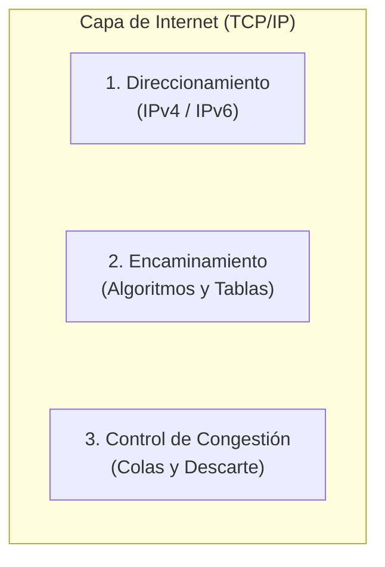

### 1.2. El Encaminamiento como Teoría de Grafos

Para formalizar y resolver el problema del enrutamiento, la topología de la red se modela matemáticamente mediante la **teoría de grafos**:
- **Nodos:** Representan a los **routers** (o conmutadores de Capa 3).
- **Arcos / Aristas:** Representan los **enlaces físicos de comunicación** entre routers.
- **Pesos en los arcos:** Representan el **costo o métrica** asociada al enlace.

> [!QUOTE] Analogía Docente: El camino a la Facultad
> *"Cuando ustedes salen de sus casas o departamentos y van hacia la facultad, no tienen una sola calle o un único camino: tienen múltiples opciones. Pueden elegir ir por la avenida más directa, tomar la Circunvalación aunque hagan el doble de kilómetros porque van más rápido, o evitar calles que se congestionan.
> El encaminamiento consiste exactamente en eso: habiendo múltiples caminos posibles para ir de un origen a un destino, determinar cuál es la mejor ruta a seguir. Pero no al azar ni al voleo, sino aplicando una lógica estricta en función de criterios bien definidos (mínimo retardo, menor costo, políticas del administrador). Esa ruta elegida es la que se instalará en la **tabla de encaminamiento** del router."*

> [!NOTE] Incidente de conectividad durante la clase `[4:50 - 11:29]`
> En este punto se produce un corte en la conexión Zoom de la docente. Al reconectarse (bromeando con que *"los viernes siempre nos pasa algo"*), el alumno **Santiago** le confirma los últimos temas escuchados (*"criterio administrativo, mínimo retardo"*), retomando fluidamente la explicación.

---

## 2. Paradigmas de Transporte: Redes de Circuitos Virtuales vs. Redes de Datagramas `[12:12 - 24:32]`

Para comprender cómo encaminan los routers, es indispensable diferenciar los dos grandes paradigmas de transporte en redes de paquetes, contrastándolos con la telefonía tradicional.

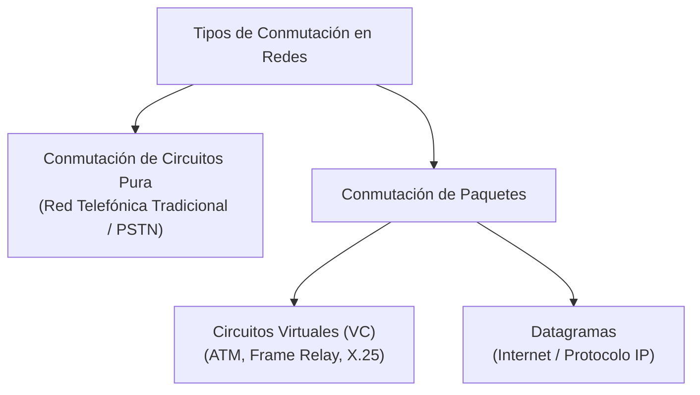

### 2.1. Conmutación de Circuitos Pura vs. Circuitos Virtuales (VC)

Ante la duda de un alumno sobre la diferencia entre *conmutación de circuitos* y *circuitos virtuales*, la docente establece una distinción tajante:

| Característica | Conmutación de Circuitos Pura (Telefonía / PSTN) | Redes de Circuitos Virtuales (VC) |
| :--- | :--- | :--- |
| **Reserva de Ancho de Banda** | **Física y estricta en todo el trayecto.** Se reserva el canal completo durante toda la llamada, se transmitan datos o haya silencio absoluto. | **No se reserva ancho de banda de forma exclusiva.** Los enlaces físicos se multiplexan/comparten entre múltiples comunicaciones simultáneas. |
| **Fases de Conexión** | 3 fases: Establecimiento, Transferencia de voz/datos, Liberación. | 3 fases: Establecimiento, Transferencia de datos, Liberación. |
| **Ruta Física** | Fija y dedicada durante la llamada. | Fija para todos los paquetes de esa sesión (circuito virtual). |
| **Riesgo de Saturación** | Si la red se llena de circuitos reservados, se bloquea (da tono de ocupado, ej. colapso en Navidad o Día de la Madre). | Si no hay datos pasando en un instante, otros paquetes de otras conexiones usan el enlace libremente. |

### 2.2. Funcionamiento del Encaminamiento en Circuitos Virtuales (VC)

1. **Fase de Establecimiento (Apertura del Circuito):**
   - El **primer paquete** (de control/señalización) es el encargado de abrir el circuito virtual.
   - Es el paquete **más lento**: cada router intermedio debe desencapsular hasta **Capa 3 (IP)**, consultar su tabla de encaminamiento, elegir la interfaz de salida y registrar una entrada en su **tabla de conmutación de circuitos virtuales**.
   - Dicha tabla mapea: `[Interfaz de Entrada + ID Circuito Entrante] ➔ [Interfaz de Salida + ID Circuito Saliente]`.
2. **Fase de Transferencia:**
   - Los paquetes subsiguientes (paquete 2, 3, etc.) viajan a máxima velocidad: el router **no desencapsula hasta Capa 3**, sino que conmuta directamente en **Capa 2** consultando la etiqueta del circuito virtual en hardware.
3. **Fase de Liberación:**
   - Un paquete de terminación libera los identificadores de circuito en las tablas de los routers.

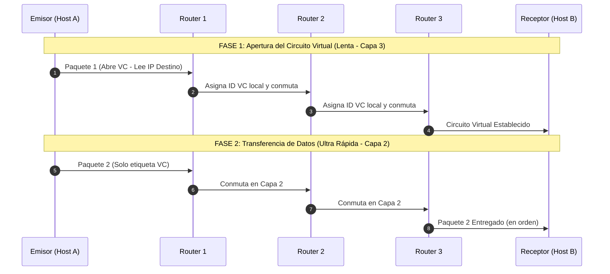

> [!TIP] Ventajas y Desventajas de Circuitos Virtuales
> - **Ventajas:**
>   - **Garantía de orden:** Todos los paquetes siguen exactamente el mismo camino físico y llegan en orden estricto.
>   - **Facilidad para Calidad de Servicio (QoS):** Al saberse de antemano el camino que recorrerán los paquetes, se pueden reservar buffers de memoria y slots de procesamiento en los routers para asegurar streaming de video/audio sin jitter ni cortes.
> - **Desventajas:**
>   - **Vulnerabilidad total a fallos:** Si un router intermedio (ej. Router 2) se apaga o falla, el circuito se destruye por completo. Para continuar la comunicación hay que renegociar y establecer un circuito virtual nuevo desde el origen.

---

### 2.3. Funcionamiento del Encaminamiento en Redes de Datagramas (Internet / IP)

En las redes de datagramas (filosofía original de Internet), **no existe conexión previa**:
- **Tratamiento independiente:** Cada paquete se trata como un datagrama autónomo.
- **Procesamiento salto a salto (Hop-by-Hop):** Cada router desencapsula **todos y cada uno de los paquetes hasta Capa 3**, lee la dirección IP de destino y consulta su tabla de encaminamiento.
- **Rutas dinámicas por paquete:** Si las condiciones cambian o hay múltiples enlaces de igual costo, el paquete 1 puede ir por un camino superior, el paquete 2 por el medio y el paquete 3 por abajo.

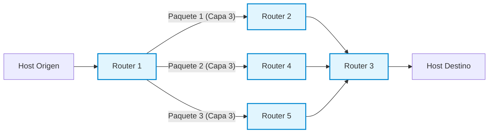

> [!IMPORTANT] Comparativa de Resiliencia y Orden
> - **Robustez y Tolerancia a Fallos:** Si el Router 2 se cae en pleno flujo, la comunicación **no se corta**. El Router 1 simplemente detecta la falla y encamina los siguientes paquetes a través del Router 4 o 5.
> - **Llegada Desordenada:** Al viajar por caminos con distintas latencias y anchos de banda, los paquetes pueden llegar desordenados al receptor.
> - **¿Quién los reordena?** Pregunta la docente. El alumno **Santiago** responde acertadamente: **la Capa de Transporte, específicamente mediante el protocolo TCP** (usando números de secuencia). La Capa de Internet (IP) se desentiende del orden y de las retransmisiones.

---

## 3. Requisitos de un Buen Algoritmo de Encaminamiento `[24:40 - 30:48]`

Un **algoritmo de encaminamiento** es la pieza de software (integrada nativamente en la pila TCP/IP del sistema operativo y firmware de los routers) que toma la decisión: **¿por cuál de todas sus interfaces de salida debe reenviar un paquete que acaba de ingresar?**

Para ser considerado de calidad, debe satisfacer seis propiedades fundamentales:

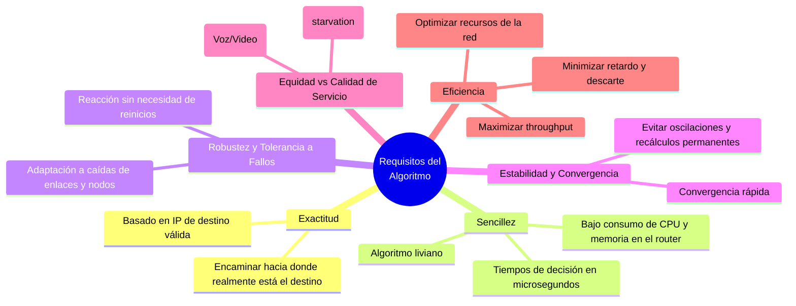

> [!NOTE] Reflexión en Clase: ¿Existe la Equidad Absoluta? `[29:32 - 30:06]`
> La profesora consulta al auditorio si en las redes reales todos los paquetes se tratan de forma idéntica. Los alumnos señalan que no: hoy en día los mecanismos de **Calidad de Servicio (QoS)** diferencian el tráfico. Los paquetes de video y voz en tiempo real tienen prioridad absoluta sobre una descarga de archivos. Sin embargo, el principio de equidad exige que el tráfico no prioritario **nunca sufra inanición (*starvation*)**; todos los paquetes deben ser entregados eventualmente.

---

## 4. Tipos de Encaminamiento: Estático vs. Dinámico `[30:48 - 42:00]`

### 4.1. Encaminamiento Estático (No Adaptativo)

En el enrutamiento estático, las tablas de los routers son cargadas **manualmente por el administrador de red**.

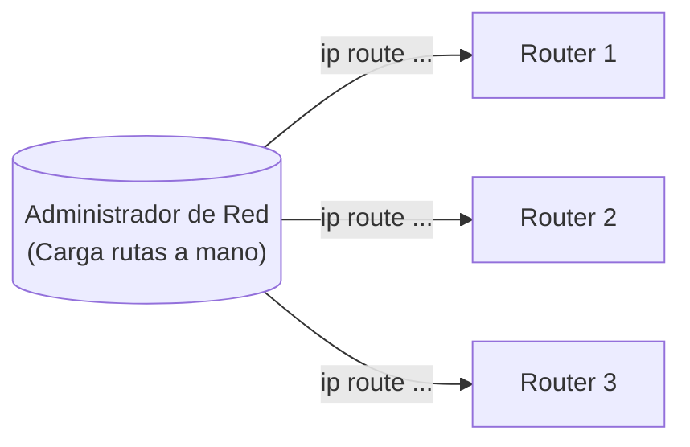

#### ¿Cómo nace un Router de fábrica? (Comparación Router vs. Switch)
- Un **router** nuevo de fábrica cuenta con CPU, memoria RAM y ROM, pero carece de disco rígido: **es un dispositivo "inútil" al inicio**. No sabe qué hacer ni por dónde reenviar nada.
- A diferencia de un **switch** (que al enchufarlo aprende dinámicamente direcciones MAC por autoaprendizaje e inunda tramas desconocidas), el router solo "aprende" automáticamente aquellas **redes que están directamente conectadas a sus interfaces**, una vez que el administrador les configura una dirección IP y máscara.
- Cualquier red remota que esté más allá de sus interfaces debe ser expresamente configurada.

#### La Regla de Oro del Enrutamiento: Rutas Bidireccionales
Durante la clase, la profesora plantea una topología típica:
$$\text{LAN A} \longleftrightarrow \text{Router 1} \longleftrightarrow \text{Router 2} \longleftrightarrow \text{Router 3} \longleftrightarrow \text{LAN C}$$

> [!QUESTION] Pregunta de la Docente `[35:48 - 36:58]`
> *"Si yo le configuro al Router 1 cómo llegar a la LAN C y le configuro al Router 2 cómo llegar a la LAN C... ¿hay conectividad total entre la LAN A y la LAN C?"*
> 
> Los alumnos (Luis y Santiago) responden: **¡No, falta el camino inverso!**
> Si enviamos un comando `ping` desde LAN A a LAN C, el paquete `ICMP Echo Request` llegará exitosamente a la máquina de LAN C. Pero cuando esta responda con un `ICMP Echo Reply`, el Router 3 y el Router 2 **no sabrán cómo llegar a la LAN A** y descartarán el paquete. En encaminamiento estático **siempre se deben definir las rutas de ida y de vuelta**.

> [!WARNING] Desventaja Crítica del Enrutamiento Estático
> Si se cae un enlace físico entre routers, aunque físicamente exista un enlace redundante alternativo en la topología, los routers **descartarán los paquetes (*packet drop*)**. El router estático es "ciego": no se adapta a los cambios de topología. El administrador debe detectar el corte y modificar manualmente la configuración en cada equipo.

---

### 4.2. Encaminamiento Dinámico (Adaptativo)

En el encaminamiento dinámico, el administrador configura un **protocolo de enrutamiento** (como RIP, OSPF, EIGRP o BGP) una única vez en los routers y *"se va de vacaciones tranquilo"*.

- Los routers intercambian periódicamente o ante eventos mensajes llamados **actualizaciones de encaminamiento (*routing updates*)**.
- Si se corta un enlace (ej. WAN 3), los routers detectan la caída mediante paquetes de control (hellos), recalculan sus métricas y reconfiguran automáticamente sus tablas para desviar el tráfico por el camino alternativo (WAN 1).

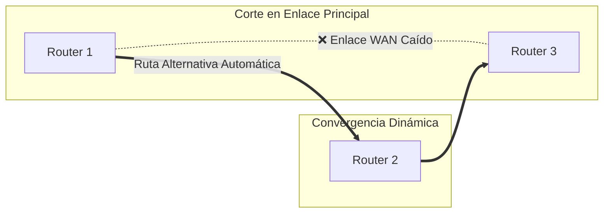

### 4.3. Comparativa: Estático vs. Dinámico

| Criterio | Encaminamiento Estático | Encaminamiento Dinámico |
| :--- | :--- | :--- |
| **Configuración** | Manual, router por router, línea por línea. | Se habilita el protocolo una sola vez; aprendizaje automático. |
| **Mantenimiento** | Alto y tedioso si la topología cambia o crece. | Mínimo; la red se autoajusta sola ante fallos. |
| **Consumo de CPU y RAM** | Mínimo (tablas fijas, sin cálculos). | Mayor (procesamiento de algoritmos y mantenimiento de estados). |
| **Consumo de Ancho de Banda** | Cero tráfico de control en los enlaces. | Consume ancho de banda enviando *routing updates* continuas. |
| **Tolerancia a Fallos** | Nula (requiere intervención humana). | **Excelente** (adaptativo y altamente resiliente). |
| **Seguridad** | Alta (el administrador define exactamente la ruta). | Requiere autenticación de updates para evitar falsificación de rutas. |
| **Ámbito de aplicación ideal** | Redes muy pequeñas (1 a 3 routers) o enlaces stub. | Redes medianas, corporativas, campus y la Internet global. |

---

### 4.4. Clasificación según la Ubicación de la Toma de Decisiones `[31:38 - 33:07]`

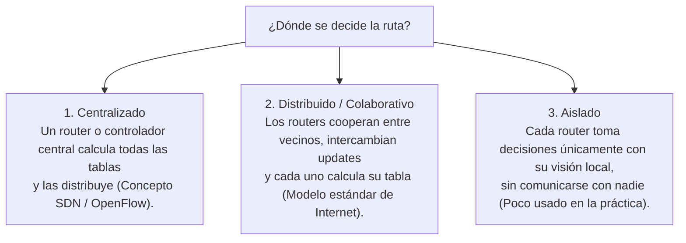

---

## 5. Algoritmo 1: Ruta Más Corta (Shortest Path - Dijkstra) `[42:00 - 50:48]`

El algoritmo de la **ruta más corta** calcula el trayecto óptimo entre dos nodos de un grafo minimizando la suma acumulada de las métricas de los enlaces intermedios.

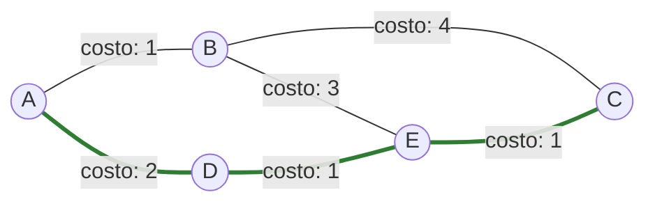
*En el grafo anterior, para ir de **A** hacia **C**:*
- *Ruta por B: $A \to B \to C \implies \text{Costo} = 1 + 4 = 5$*
- *Ruta por D y E: $A \to D \to E \to C \implies \text{Costo} = 2 + 1 + 1 = \mathbf{4}$ (Ruta elegida por ser la menor).*

### 5.1. ¿Qué Métrica Elegir?

La profesora abre el debate con los estudiantes: ¿cómo decidimos cuál es la *"mejor"* ruta?
- **Santiago** señala: *"El tiempo es lo más importante; elegiría la Circunvalación aunque implique más kilómetros"*. La profesora asiente: en ese caso, la métrica elegida es el **retardo**.

Las métricas más habituales en redes son:
1. **Distancia geográfica en kilómetros.**
2. **Conteo de saltos (Hop Count):** Cada router que se cruza vale 1. La ruta con menos routers intermedios gana.
3. **Retardo medio:** Tiempo promedio en milisegundos que tarda un paquete en atravesar el enlace (medido con sondas `ICMP Echo Request / Echo Reply`).
4. **Tráfico promedio / Nivel de congestión:** Penaliza enlaces saturados (similar a las rutas marcadas en rojo en Google Maps).
5. **Costo monetario:** Tarifas impuestas por los proveedores de telecomunicaciones (ISP transit).

### 5.2. El Dilema del Ancho de Banda y la Fórmula Inversa

La docente plantea un problema fundamental:

> [!QUESTION] El Gran Desafío Matemático del Ancho de Banda `[47:29 - 48:37]`
> *"Si mi red tiene enlaces de 1 Mbps, 10 Mbps y 100 Mbps... ¿qué enlace queremos que elija el router? Obviamente el de 100 Mbps, el de mayor ancho de banda para enviar más datos.
> Pero el algoritmo de Dijkstra **SIEMPRE busca el número menor (el camino más corto)**. Si colocamos directamente el ancho de banda como métrica, Dijkstra preferirá el enlace de 1 Mbps sobre el de 100 Mbps porque 1 < 100. ¿Cómo resolvemos esto?"*

- Un alumno sugiere usar números negativos (descartado por generar loops y problemas de divergencia en grafos).
- **La Solución Canónica:** Se utiliza la **función inversa del ancho de banda**:
$$\text{Métrica} = \frac{K}{\text{Ancho de Banda}}$$
Al colocar el ancho de banda en el **denominador**, a mayor capacidad del enlace, menor resulta el costo numérico del arco. Así, el algoritmo elige el enlace más rápido creyendo que es el "más corto".

### 5.3. Métricas Compuestas (Multicriterio)

En protocolos profesionales (como EIGRP), no se utiliza un único factor sino una **función de costo ponderada**:
$$\text{Métrica Total} = k_1 \cdot M_1 + k_2 \cdot M_2 + k_3 \cdot M_3 + k_4 \cdot M_4$$
Donde $M_1, M_2, M_3, M_4$ representan el ancho de banda, retardo, fiabilidad y carga del enlace, y las constantes $k_i$ son configuradas por el administrador según sus prioridades de tráfico.

> [!NOTE] Referencia a la Carrera
> La profesora consulta si ya conocen el algoritmo de Dijkstra. Los alumnos confirman haberlo estudiado en materias como **Investigación Operativa** y **Modelos de Simulación**.

---

## 6. Algoritmo 2: Inundación (Flooding) `[50:48 - 58:41]`

### 6.1. Principio de Funcionamiento

El algoritmo de inundación opera con una lógica elemental:
> Cada vez que un router recibe un paquete por una de sus interfaces de entrada, lo retransmite inmediatamente por **todas las demás interfaces, excepto por la interfaz por la cual ingresó**.

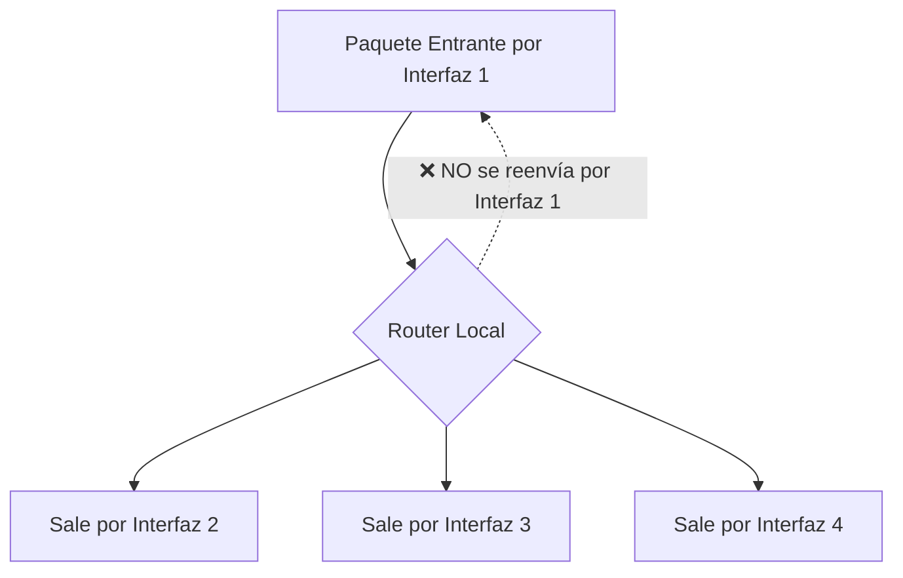

### 6.2. El Problema de la Inundación Pura

Si se implementa sin restricciones, se comporta como un **Hub descontrolado**:
- Los paquetes se replican de forma exponencial.
- Se producen bucles infinitos (*routing loops*), donde los mismos paquetes circulan indefinidamente consumiendo todo el ancho de banda de los enlaces hasta colapsar los buffers de los routers.

### 6.3. ¿Para qué Sirve la Inundación? (Casos de Éxito)

Pese a su voraz consumo de red, es insustituible en escenarios críticos:
1. **Velocidad máxima:** Es el algoritmo de propagación más rápido existente; el paquete viaja en paralelo por todos los caminos físicos simultáneamente.
2. **Sincronización de Bases de Datos Replicadas:** Actualizaciones críticas que deben llegar a servidores de todo el mundo en el menor tiempo posible.
3. **Distribución de Topología en Protocolos Estado de Enlace:** Es la base con la que **OSPF** difunde sus paquetes LSA (*Link State Advertisements*) para que todos los routers de la red tengan exactamente el mismo mapa topológico.
4. **Redes Militares:** Máxima supervivencia; el mensaje llega a destino aunque se destruya el 90% de los nodos intermedios.

### 6.4. Mecanismos de Inundación Controlada

Para aprovechar sus virtudes sin colapsar la red, se aplican dos técnicas de control:

#### Método 1: Contador de Saltos / TTL (Time To Live)
Cada paquete lleva en su cabecera un contador de saltos. Cada router que lo recibe decrementa el contador en 1. Si el TTL llega a cero, el paquete se **descarta de inmediato**.

#### Método 2: ID de Router Emisor + Número de Secuencia Creciente
1. El router emisor original estampa en el paquete su identificador (ej. `Router B`) y un número de secuencia que se incrementa con cada nuevo paquete emitido (`Seq: 1`, `Seq: 2`, `Seq: 3`...).
2. Cada router vecino mantiene una tabla interna en memoria donde anota:
   `[ID del Router Emisor] ➔ [Último Número de Secuencia Visto]`.
3. Cuando a un router le llega un paquete:
   - **Si el número de secuencia es MAYOR** que el último registrado: Es información nueva. Actualiza su tabla con el nuevo valor y **procede a inundar** el paquete por sus restantes interfaces.
   - **Si el número de secuencia es MENOR o IGUAL** al registrado: Significa que ese paquete (o uno más reciente) ya fue procesado e inundado previamente. Por lo tanto, **lo descarta en el acto**.

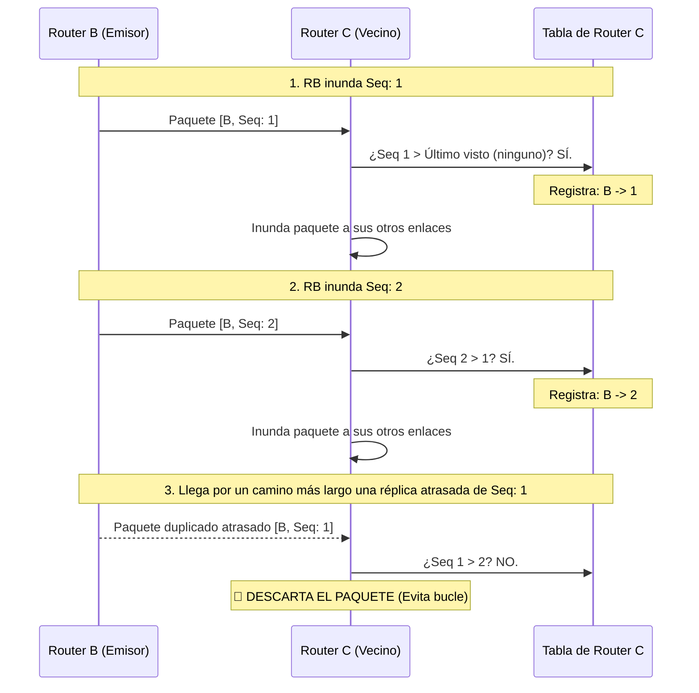

---

## 7. Algoritmo 3: Encaminamiento Jerárquico `[58:41 - 1:10:02]`

### 7.1. El Problema de la Explosión de las Tablas de Encaminamiento

La profesora abre este bloque con una pregunta conceptual clave sobre el diseño de redes:

> [!QUESTION] ¿Qué se almacena en la tabla de un router: Hosts o Redes? `[58:57 - 1:00:57]`
> *"En una tabla de encaminamiento, ¿tenemos un renglón por cada host (computadora) o por cada red/subred?
> Piensen en la facultad: supongamos que la UTN tiene 2.500 computadoras. Si guardáramos direcciones de host, ¡la tabla del router tendría 2.500 renglones! En cambio, la facultad está dividida en unas 100 aulas y laboratorios (subredes). Almacenar 100 renglones de subred es inmensamente más eficiente.
> El router solo necesita saber cómo llegar a la subred de destino; quien se encarga de entregar la trama a la PC específica dentro del laboratorio es el **switch**, conmutando por dirección MAC."*

Aun agrupando por subredes, cuando la red crece a nivel global (Internet), es materialmente imposible que un router de backbone contenga todas las redes del planeta:
- Se agotaría la memoria RAM de los routers.
- La búsqueda de rutas en tablas inmensas consumiría excesivos ciclos de microprocesador, ralentizando el reenvío de paquetes.
- El intercambio periódico de tablas gigantescas saturaría el ancho de banda con tráfico de control.

### 7.2. Solución: Agrupamiento Jerárquico en Regiones / Áreas / AS

Los routers se organizan en jerarquías: **Regiones, Zonas, Áreas (OSPF) o Sistemas Autónomos (BGP)**.

> [!IMPORTANT] La Regla de Oro del Encaminamiento Jerárquico
> - Cada router conoce al **máximo detalle la estructura interna de su propia región** (sabe exactamente cómo llegar a cada router o subred local).
> - Pero **desconoce completamente la topología interna de las demás regiones**: solo sabe por cuál router de frontera o interfaz debe salir para enviar el tráfico a esa región en general.

> [!QUOTE] Analogía Docente: El viaje de Córdoba a Buenos Aires
> *"Si yo viajo desde Córdoba a Buenos Aires, solo necesito saber cómo llegar a la ciudad de Buenos Aires (a la región). No necesito saber de antemano en qué calle está determinado negocio o cómo llegar al Obelisco en la 9 de Julio.
> Cuando llegue a Buenos Aires, los carteles y la gente local (los routers internos de esa región) me van a encaminar con precisión al destino final. Yo, desde Córdoba, solo necesito saber por qué autopista salir hacia Buenos Aires."*

### 7.3. Análisis del Ejemplo Numérico del Libro (Tanenbaum)

Se analiza el caso de una red con 17 routers agrupados en 5 regiones distintas:

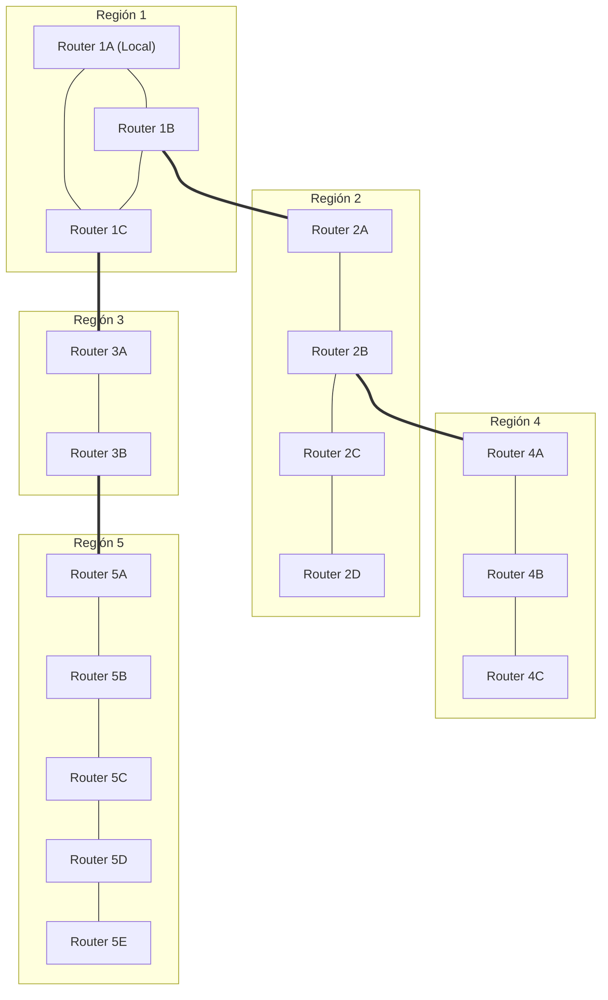

#### Comparación de la Tabla de Enrutamiento del Router 1A:

| Tipo de Tabla | Entradas en la Tabla de 1A | Total de Renglones |
| :--- | :--- | :---: |
| **Tabla Plana (Sin Jerarquía)** | Un renglón por cada uno de los 17 routers de la red completa:<br>`1A, 1B, 1C, 2A, 2B, 2C, 2D, 3A, 3B, 4A, 4B, 4C, 5A, 5B, 5C, 5D, 5E` | **17 renglones** |
| **Tabla Jerárquica** | • Routers locales de su región: `1B, 1C`<br>• Entradas agregadas por región externa: `Región 2, Región 3, Región 4, Región 5` | **6 renglones** |

> [!TIP] Impacto de la Reducción
> ¡La tabla de encaminamiento se redujo en casi un **65%**!
> Cuando el router **1A** debe enviar un paquete al router **2D**:
> 1. 1A consulta su tabla jerárquica: no ve al router 2D, pero ve que la **Región 2** se alcanza a través de la interfaz que va al router **1B**.
> 2. El paquete cruza a la Región 2 y llega al router **2A**.
> 3. Como **2A** sí pertenece a la Región 2, su tabla interna conoce la topología local y encamina el paquete con precisión hasta **2D**.

### 7.4. Vínculo con CIDR y Sumarización de Rutas (Unidad 3)

La profesora conecta este algoritmo con lo visto en la unidad anterior:
- En Internet, las regiones corresponden a **Sistemas Autónomos (AS)** o jerarquías de prefijos IP.
- Mediante **CIDR (*Classless Inter-Domain Routing*)**, miles de redes contiguas se agrupan en un único prefijo de red sumarizado (ej. `/16` o `/19`).
- Gracias a la sumarización, los routers centrales de Internet (*Default-Free Zone*) no colapsan por memoria y pueden conmutar tráfico a velocidades de terabits por segundo.

---

## 8. Cuadro Sinóptico y Cierre de la Clase `[1:09:54 - 1:10:02]`

| Algoritmo Analizado | Idea Central | Principal Ventaja | Principal Desafío / Solución |
| :--- | :--- | :--- | :--- |
| **Ruta Más Corta (Dijkstra)** | Modela la red como grafo y minimiza la suma de costos de los enlaces. | Ruta matemáticamente óptima bajo las métricas elegidas. | Invertir el ancho de banda ($1/\text{BW}$) para que enlaces veloces tengan menor costo. |
| **Inundación (Flooding)** | Reenvía el paquete por todas las interfaces salvo la de llegada. | Velocidad insuperable, máxima robustez, ideal para actualizaciones y bases de datos. | Bucle infinito de réplicas $\implies$ Se controla con **TTL** y **números de secuencia**. |
| **Jerárquico** | Agrupa routers en Regiones, Áreas o Sistemas Autónomos. | Drástica reducción de tablas de rutas, ahorro de memoria y ancho de banda. | Pérdida de visión global en nodos individuales $\implies$ Se delega la resolución al router de frontera local. |

> [!NOTE] Próxima Clase
> La docente concluye la sesión indicando que la base conceptual de algoritmos queda sentada. En las próximas clases se abordarán en detalle los algoritmos dinámicos de mayor peso en la materia: **Vector Distancia (Bellman-Ford / RIP)** y **Estado de Enlace (Dijkstra / OSPF)**.