---
aliases:
subject:
  - REDES
year: "4"
exam: PARCIAL2
unit: "4"
type: Transcripcion
zk_type: resources
status: done
date: 2026-09-01
source:
tags:
---
---

# Transcripcion 1

0:01

1 segundo

y estamos ahí empezamos entonces la grabación bueno hemos terminado la

0:09

9 segundos

unidad de la unidad 3 era de direccionamiento estamos en esta capa seguimos una capa de internet desde ese paper y ahora

0:17

17 segundos

vamos a empezar a ver el tema de encaminamiento vamos es un tema muy importante es bastante troncal en nuestra materia así que vamos a tratar

0:26

26 segundos

de aprenderlo y entenderlo bien vamos a ver en varias clases porque no

0:33

33 segundos

vamos a poder verlo en una sola lo que vamos a ver hoy va a ser hoy vamos a tratar de ver hoy quizás no terminemos

0:40

40 segundos

este último punto en qué consiste el en termina miento del nivel general cuál es la diferencia de inter minar en redes de

0:48

48 segundos

alta grama y redes de circuitos virtuales vamos a ver la diferencia y después vamos a entrar a ver lo que se

0:55

55 segundos

llaman algoritmos de encaminamiento qué requisitos tienen que cumplir esos algoritmos y qué tipos de encaminamiento básicamente hay dos tipos que son

1:04

1 minuto y 4 segundos

encaminamiento estáticos y dinámicos una vez que entendamos esto vamos a empezar a ver cuál es cuál es la lógica de los diferentes algoritmos qué

1:12

1 minuto y 12 segundos

algoritmos que pueden tener configurados los routers para poder encaminar esta primera parte es como teórica en relación a los algoritmos más adelante

1:21

1 minuto y 21 segundos

cuando veamos lo que se llama encaminamiento en internet ahí vamos a ver protocolos específicos que

1:29

1 minuto y 29 segundos

usan todos estos algoritmos o algunos de estos algoritmos que vamos a estudiar acá y ahora quizás él no veamos teóricamente

1:38

1 minuto y 38 segundos

en el sentido de vamos analizar cuál es la lógica del algoritmo cómo funciona con el cual el objetivo es podemos configurar protocolos específicos en los

1:47

1 minuto y 47 segundos

rutas bueno perdón el encaminamiento es una de

1:54

1 minuto y 54 segundos

las funciones principales de la capa de internet cuando ustedes estudiaron en la arquitectura tcp/ip que está divida en

2:01

2 minutos y 1 segundo

cuatro capas una de las capas y pensando en la bajo desarrollo de la segunda esta capacidad tres funciones importantes que

2:09

2 minutos y 9 segundos

son direccionamiento encaminamiento y control de congestión esas son las tres funciones direccionamiento ya lo vimos

2:16

2 minutos y 16 segundos

estamos en la segunda función que sería encaminamiento para poder encaminar lo que hacen los routers normalmente es

2:24

2 minutos y 24 segundos

representar la topología de la red mediante un grafo es decir que se usa como que se aplica la teoría de grafos

2:31

2 minutos y 31 segundos

para el tema específico de encaminamiento en estos grafos los routers pasan a ser nodos y los enlaces

2:38

2 minutos y 38 segundos

serían los arcos que unen esos nodos con el objetivo de encaminar o sea porque

2:46

2 minutos y 46 segundos

existen encaminamiento cuando existen varias rutas o varios caminos para llegar de un origen a un destino entonces por ejemplo ustedes cuando

2:54

2 minutos y 54 segundos

salen de la casa de sus casas de su departamento y se dirigen hacia la facultad no tienen una sola ruta a un solo camino pueden elegir entre muchos

3:03

3 minutos y 3 segundos

múltiples caminos entonces el objetivo del en termina miento es elegir alguno de esos caminos es decir determinar qué

3:11

3 minutos y 11 segundos

ruta se va a seguir desde el origen hacia el destino pero no es una ruta tomada al azar sino que es una ruta bien definida

3:19

3 minutos y 19 segundos

en cuanto a que se analizó qué es lo mejor o cuáles son los aspectos a tener en cuenta para seleccionar esa ruta y no otra ruta

3:27

3 minutos y 27 segundos

qué aspecto se tiene en cuenta a nivel de encaminamiento para elegir en qué ruta es mejor que otra por ejemplo el mínimo costo es decir que hay rutas que

3:36

3 minutos y 36 segundos

tienen que pagar para atravesar esos enlaces entonces obviamente van a tener un mayor costo

4:50

4 minutos y 50 segundos

bueno vamos a hacer una moción para cerrar la selección si estamos a favor la mayoría en este cierro

5:20

5 minutos y 20 segundos

de paso para suavizar les que estamos grabando así que gracias

10:11

10 minutos y 11 segundos

bueno aquí estamos de nuevo perdón no le dice a lucía que le dijera que se volvió

10:23

10 minutos y 23 segundos

igual creo que estamos todos los profes los veintipico bueno pero por ahí se fueron se alejaron

10:33

10 minutos y 33 segundos

de la computadora dejaron el super oficial están un poquito y se lo llevan a todos lados

10:41

10 minutos y 41 segundos

bueno vamos de nuevo para los viernes siempre nos pasa algo a nosotros bueno un jueves se corta la luz cinco

10:48

10 minutos y 48 segundos

horas no puede dar clases yo seguía hablando ahora no se sigue

10:57

10 minutos y 57 segundos

grabando no sí bueno usted cuando sea así póngalo una pausita el que se quede en filtro no quiero que cuando se corta

11:03

11 minutos y 3 segundos

es como que uno de ustedes asume al instante como anfitrión el que detecte eso no pausa la grabación si ya saben

11:13

11 minutos y 13 segundos

cómo hacerlo ya la derecha una vez más ponen pausa el grabación vamos si no le va a quedar mucho silencio bueno no sé qué había dicho de acá o sea que me

11:21

11 minutos y 21 segundos

escucharon porque eso seguía hablando como tontas porque me di cuenta que había desaparecido el sol creo que este criterio administrativo

11:29

11 minutos y 29 segundos

perfecto gracias a santiago mínimo retardo bueno bueno entonces cuál es el objetivo del

11:38

11 minutos y 38 segundos

encaminamiento cuando tenemos muchas frutas cuando existen muchos caminos de un origen o destino elegir algunas de

11:45

11 minutos y 45 segundos

esas rutas pero no así al voleo sin ninguna lógica sino que se analiza el algoritmo lo va a analizar analizar las posibilidades y en base al

11:54

11 minutos y 54 segundos

criterio que se haya definido ya sea por protocolo oa los criterios que se ha definido el administrador que se va a elegir una de esas rutas y esa es la

12:03

12 minutos y 3 segundos

ruta que se va a instalar que se llama en la tabla de encaminamiento si la ruta acá vamos a ver la diferencia entre en

12:12

12 minutos y 12 segundos

caminar en una red de circuitos virtuales y en terminar en una red de data gramas ya que los rd sagrados versos red en circuitos virtuales vamos

12:19

12 minutos y 19 segundos

a analizar primero estas ministras sus payasadas y cómo se encamina una red el circuito virtual se acuerdan lo que era una red de circuito virtual o sea lo que

12:28

12 minutos y 28 segundos

era mejor hecho el circuito virtual tienen lo tienen en mente o no no recuerdan nada

12:39

12 minutos y 39 segundos

deberían haberlo rápidamente hay dos tipos de redes las redes que se

12:47

12 minutos y 47 segundos

llaman de conmutación de paquetes y la red de conmutación de circuitos la red de conmutación de circuitos es la red telefónica así que cuando ellos para

12:56

12 minutos y 56 segundos

poder llamar o perder pero para poder hablar o transmitir voz necesito primero establecer una comunicación extrema extremo es decir que la red de

13:05

13 minutos y 5 segundos

conmutación de circuitos tienen tres fases la fase de establecimiento de la conexión transferencia de datos y finalización de

13:12

13 minutos y 12 segundos

la conexión en las redes de circuitos virtuales se reserva el ancho de banda de toda la enlace en todo el tiempo mientras dura

13:21

13 minutos y 21 segundos

la comunicación pero si no viajan datos lo mismo se reserva el centro de banda entonces se utiliza la red por ejemplo

13:29

13 minutos y 29 segundos

si yo los llamó por teléfono a ustedes y les digo esperando un segundo y me voy y vuelvo a la media hora esa media hora que yo no hable o se que no hablamos me

13:37

13 minutos y 37 segundos

entre del millón estuvo reservado el canal es decir se la red nos asignó ese canal lo reservó todo

13:46

13 minutos y 46 segundos

el canal el extremo extremo y por más que no haya habido transferencia de datos o de información por eso surge lo que se llaman circuitos virtuales los

13:55

13 minutos y 55 segundos

circuitos virtuales la idea es que antes de poder transmitir datos se tiene que establecer un camino físico por donde van a viajar los datos

14:04

14 minutos y 4 segundos

y una vez que se establece ese camino físico que se llama circuito virtual todos los datos van a viajar por ese mismo camino cuál es la diferencia con

14:13

14 minutos y 13 segundos

respecto a la conmutación este circuito es pura que se comparte

15:13

15 minutos y 13 segundos

bueno vamos a ver si podemos seguir sin tantos cortes entonces en las redes de circuitos virtuales lo que se hace es

15:22

15 minutos y 22 segundos

para poder transmitir los paquetes se tiene que abrir un circuito establecer un camino y abrir el servicio quien es el que abre el circuito el primer

15:30

15 minutos y 30 segundos

paquete entonces el primer paquete los routers lo van encaminando de acuerdo al destino donde vaya dirigido van

15:38

15 minutos y 38 segundos

consultando quienes encapsula en el paquete y observan o miran la ip de destino que viene en el paquete ip y en base al consultar las tablas en termina

15:47

15 minutos y 47 segundos

miento por ejemplo cuando llega el precio se lo puse ahí arriba pero entre de ese paquete viene de la pc al router uno una vez que llega ese paquete entra

15:55

15 minutos y 55 segundos

por entrar esta interfaz el router tiene que decidir si lo saca por acá por ejemplo acá en este caso decidió sacarlo por acá arriba hacia router 2 de router

16:03

16 minutos y 3 segundos

donde pasa lo mismo cuando entra por esta interfaz tiene que decidir si lo saca por esa interfaz o por ésta en este caso decidió sacarlo por acá

16:10

16 minutos y 10 segundos

el primer paquete entonces va abriendo el circuito y va haciendo que los routers vayan creando unas tablas de

16:17

16 minutos y 17 segundos

conmutación que se llama donde dice el número de circuito x o x el número de circuito sacarlo por

16:25

16 minutos y 25 segundos

tal interfaz qué ventaja tiene la red de circuitos virtuales ahora internamente redes circuitos virtuales que el que

16:33

16 minutos y 33 segundos

abre el circuito que el primer paquete es el más lento porque tiene que decir capsular hasta la capa ip sí pero los

16:42

16 minutos y 42 segundos

otros paquetes del paquete 2 por ejemplo ya el router no tiene que decir encapsular hasta la capa 3 sino que desde la capa 2 que es ahí donde está

16:51

16 minutos y 51 segundos

establecido el número del circuito virtual conmuta directamente o sea es mucho más rápido y mucho más rápido con muta una vez que

16:59

16 minutos y 59 segundos

los paquetes perdón que el circuito ya está abierto que gran ventaja tenemos acá fíjense cómo fueron emitidos los paquetes y cómo llegaron todos

17:08

17 minutos y 8 segundos

ordenaditos sí porque ordenados porque en las redes circuitos vectores se garantizan que todos los paquetes viajen

17:15

17 minutos y 15 segundos

por el mismo camino físico desde una origen hacia el destino ahora qué pasa si se llega a apagar el

17:23

17 minutos y 23 segundos

router 2 por ejemplo qué pasaría si se apaga el router 2 y suponemos que tenemos que enviar más

17:32

17 minutos y 32 segundos

juguetes industry cambiaré la ruta pero perfecto si se apaga el router 2 el

17:41

17 minutos y 41 segundos

circuito virtual se pierde queda en la nada entonces para continuar transmitiendo los otros paquetes hay que de nuevo establecer el circuito es como

17:49

17 minutos y 49 segundos

siempre estuvieron hablando por teléfono si portan las llamadas no pueden seguir hablando tiene que de nuevo teclear el número y establecer las llamadas y

17:58

17 minutos y 58 segundos

recién ahí empiezan a hablar vamos entonces no es muy bien robusto el tema del circuito virtual como todo tiene sus

18:06

18 minutos y 6 segundos

ventajas y sus desventajas ventajas que la información llega perfectamente ordenada sí y como todos los paquetitos

18:14

18 minutos y 14 segundos

van a seguir el mismo camino físico si uno quisiera garantizar lo que se llama calidad de servicio promovemos adelante que significa la calidad de servicio que

18:22

18 minutos y 22 segundos

los paquetes se encaminan de la manera más rápida para que fluyan con cierta rapidez y no se nos corte por ejemplo

18:31

18 minutos y 31 segundos

con usted están viendo una película que no se les cortes y que no se interrumpa entonces si es un circuito virtual como

18:38

18 minutos y 38 segundos

nosotros sabemos que todos los paquetes van a ser el mismo camino físico se puede reservar en memoria en los routers tiempo de procesamiento ancho de banda

18:46

18 minutos y 46 segundos

de los enlaces se puede hacer cierta reserva para que estos routers no se saturen y no de estar en paquetes

18:55

18 minutos y 55 segundos

vamos a la otra al otro encaminamiento en redes de data gr más acá está subrayado data gramos profe de una pregunta a mí no me quedó claro que la

19:04

19 minutos y 4 segundos

diferencia entre el circuito virtual entonces y la computación por circuitos bien la

19:13

19 minutos y 13 segundos

es algo parecido porque fíjate que se llama red de circuitos acá con mutación de circuitos redes de circuitos lo

19:21

19 minutos y 21 segundos

importante que la palabra virtual en la red de conmutación es decir la conmutación del circuito en general

19:28

19 minutos y 28 segundos

lo que la diferencia es que se reserva en chile banda para la comunicación se transmitan datos o no se transmitan

19:36

19 minutos y 36 segundos

datos eso se hace en las redes connotación circuito lo que siempre sexy yo te hablo por teléfono y me quedo callada una hora y vamos a estar pagando

19:45

19 minutos y 45 segundos

con que inicies por ese circuito se va con una tarifa no se computa hacia la

19:53

19 minutos y 53 segundos

llamada ese costo porque estuvo todo el tiempo en circuito abierto reservado en cambio la y te puede agradar ocupada

20:02

20 minutos y 2 segundos

en la red si a todos se les antoja hablar por teléfono el día de la madre o en navidad puede que se sature en la red porque hay hay tantos circuitos

20:11

20 minutos y 11 segundos

establecidos y como son dedicados la red tiene una capacidad máxima entonces se puede llegar a saturar y te va a dar ocupado si no te querés que establecer

20:19

20 minutos y 19 segundos

una llamada picando las redes circuitos virtuales lo de circuito significa que todos los y todos los paquetes de toda la

20:28

20 minutos y 28 segundos

información viaja por el mismo camino físico a eso se refiere lo del circuito otra comparación es que se tiene que establecer el circuito o sea tiene las

20:36

20 minutos y 36 segundos

tres fases de establecimiento transferencia de datos y migración cuál es la ventaja los datos acá que van viajando por este

20:45

20 minutos y 45 segundos

circuito no reservan el ancho de banda para ese circuito sino que es simplemente cuando tienen que mandar un paquete lo envían por el enlace no es

20:54

20 minutos y 54 segundos

que este enlace se ve o se utilizase múltiplex a para muchas comunicaciones distintas y en un momento determinado

21:02

21 minutos y 2 segundos

viajan paquetes de una sola comunicación pero yo mando el paquete y liberó el circuito para que se mande un paquete de otra comunicación manda otro paquete se

21:11

21 minutos y 11 segundos

libera el circuito esa es la diferencia por eso se llama circuito virtual porque no se reserva el ancho de banda para ese

21:19

21 minutos y 19 segundos

circuito no se sincere para santander está mansito soy profe me quedo re claro ahora sí bueno

21:26

21 minutos y 26 segundos

bien vamos entonces al en termina miento en redes de alta gramos en este caso en las redes del programa es lo mismo que

21:34

21 minutos y 34 segundos

decir conmutación de paquetes y qué significa eso qué

21:39

21 minutos y 39 segundos

[Música]

21:40

21 minutos y 40 segundos

en este caso cada paquete se va a encaminar de manera individual qué significa eso en el método anterior de

21:48

21 minutos y 48 segundos

circuitos button es solamente sin terminado el primero que era el que iba abriendo el camino físico el resto viajaban gratis como quien dice porque viajaban y por el mismo camino que había

21:57

21 minutos y 57 segundos

abierto el otro si en cambio en la red de data gramas estos paquetes van llegando uno a uno a los diferentes

22:05

22 minutos y 5 segundos

routers y el router para desencarcelar cada paquete y lo va a encaminar en forma individual

22:12

22 minutos y 12 segundos

consultando la interacción entre destino que viene en el paquete y consultando la tabla de encaminamiento en este caso en camino al paquete uno por esta ruta

22:20

22 minutos y 20 segundos

cuando le llega al router uno el paquete dos por ejemplo podrían caminar por otra ruta distinta si cuando llegue el paquete 3 podría ser

22:28

22 minutos y 28 segundos

ahora sólo estoy exagerando mandé el paquete 1 por este enlace y el 2 por acá arriba y el 3 acá en el medio del cual

22:36

22 minutos y 36 segundos

traver por donde también por acá abajo qué va a pasar como cada paquete se encamina de manera independiente que le parece será más rápido más lento que

22:45

22 minutos y 45 segundos

crea la red de circuitos virtuales y más lento porque va lento por operador

22:55

22 minutos y 55 segundos

router tiene que fijarse donde manda también mandó directamente el importe más lento porque tiene que deseen

23:02

23 minutos y 2 segundos

capturar hasta la capa 3 hasta la capa y decir que llegan los bits encapsula capa 2 llega a la capa 3 o azul que el actor

23:10

23 minutos y 10 segundos

la inter milán y en ti de nuevo tiene que intersolar capa 2 acá para uno y para sale el paquete el siguiente salto la siguiente salto el mismo la misma

23:17

23 minutos y 17 segundos

tarea de se encapsuló hasta la capa 3 consultó tabla y encaminó es decir que es más lento si bien es más lento pero

23:26

23 minutos y 26 segundos

es mucho más robusto por qué porque si se llega a desactivar el router 2 y el resto de paquetes directamente se

23:34

23 minutos y 34 segundos

encamina por otras rutas si no es como o no está establecido el circuito virtual que había que establecer de nuevo el circuito para que continuara la

23:43

23 minutos y 43 segundos

comunicación acá simple implemente el paquete sin caminan por otra ruta distinta es mucho más robusto más

23:51

23 minutos y 51 segundos

confiable más tolerante a fallos y el encaminamiento sobre redes de data grandes que se usó envía a los dos tipos de

24:00

24 minutos

encaminamiento desventaja tenemos que los paquetes pueden llegar al destino desordenados

24:07

24 minutos y 7 segundos

porque puede ser desordenado y como viajan por caminos distintos puede que lleguen desordenados al destino que les

24:15

24 minutos y 15 segundos

parece la capa y pelo ordenar o quien los va a ordenar a los paquetes fort

24:24

24 minutos y 24 segundos

muy bien santiago la capa de transporte específicamente un protocolo que se llama p esp muy bien bueno entonces ya vimos la

24:32

24 minutos y 32 segundos

diferencia entre el entrenamiento en red de la grama de circuitos virtuales ahora vamos a entrar a ver conceptos

24:40

24 minutos y 40 segundos

relacionados con los algoritmos encaminamientos primero vamos a ver qué es un algoritmo de encaminamiento que el

24:47

24 minutos y 47 segundos

algoritmo un software es una parte del software de tcp/ip que ya está programado ya está incorporado en la

24:55

24 minutos y 55 segundos

máquina de ustedes por qué porque hoy en día los sistemas operativos cuando uno instala un sistema operativo en que sea ya tiene incorporado la pila de

25:03

25 minutos y 3 segundos

protocolos tcp/ip de manera nativa entonces usted no tiene que hacer nada no tiene que configurar nada directamente ya le va a empezar a

25:12

25 minutos y 12 segundos

encaminar porque está configurado así en el software sigue tcp/ip que hace un algoritmo de internamiento a dar me

25:21

25 minutos y 21 segundos

vuelvo al dibujo anterior cada vez que llega un paquete por una interfaz el router va a decidir por cuál de todas las interfaces sacar ese paquete que

25:30

25 minutos y 30 segundos

acaba de llegar si por acá por acá o para acá eso es la función de encaminar y tomar la decisión cada vez que llega

25:38

25 minutos y 38 segundos

un paquete de por cuál de todas las interfaces sacarlo o encaminarlo a ese paquete

25:44

25 minutos y 44 segundos

acá se los puso más bonito pero se debe decir sobre qué línea de salida transmitir un paquete que acaba de llegar

25:54

25 minutos y 54 segundos

luego de un entrenamiento esa decisión de decidir por cuál niña sabía sacar esos paquetes no las tienen que tomar sin ninguna lógica sino que tiene que

26:02

26 minutos y 2 segundos

tener en cuenta ciertos requisitos en ese es un buen algoritmo debería cumplir estos requisitos el primero dice que

26:10

26 minutos y 10 segundos

tiene que ser exacto un cumplido registro exactitud a qué se refieren y que si tenemos que encaminar hacia en el

26:18

26 minutos y 18 segundos

dibujo anterior hacia el servidor web yo desde el router 6 no puedo caminar en caminar hacia la izquierda tendría que

26:26

26 minutos y 26 segundos

en terminar directamente hacia la derecha sí es decir que sea exacto que encamine hacia dónde se dirige el

26:33

26 minutos y 33 segundos

destino o sea donde está el destino en base eso se encamina en la secuencia siempre que se tiene que dar la

26:40

26 minutos y 40 segundos

dirección de destino otro requisito es la sencillez a qué se refiere que si ese algoritmo se consume

26:48

26 minutos y 48 segundos

todos los recursos del router mucha memoria en muchos ciclos de cpu y se tarda tres minutos para encaminar cada

26:56

26 minutos y 56 segundos

paquete y no es sencillo ese algoritmo porque consume muchos recursos la idea de sencillez es que sea una columna de

27:04

27 minutos y 4 segundos

un software liviano en cuanto al tiempo de procesamiento y la memoria que utiliza la ruta

27:13

27 minutos y 13 segundos

otros requisitos la robustez a qué se refiere que las redes normalmente cambian son dinámicas es decir que yo

27:21

27 minutos y 21 segundos

puedo activar una nueva red puedo dar de baja una red es decir que los enlaces normalmente se activan y se desactivan

27:29

27 minutos y 29 segundos

es decir que no está siempre tranquila la referencia ahora a nosotros se nos cortó dos veces y entonces a qué se refiere la robustez la robustez es que

27:38

27 minutos y 38 segundos

la red se va a adaptar a esos cambios de topología que hace en cualquier momento si de algoritmo este producto se va y se

27:47

27 minutos y 47 segundos

va a adecuar se va a adaptar ese cambio iba a responder amplificando la que estaría lo de esto delante falso por ejemplo ser algo robusto es tolerante

27:56

27 minutos y 56 segundos

falso yo por ejemplo no soy tolerante falsos porque tengo una sola conexión a internet si tuviera si le pagara a dos proveedores de servicios y si sería

28:04

28 minutos y 4 segundos

robusta y conexión porque si se cae un servidor un proveedor y tengo otro

28:14

28 minutos y 14 segundos

a qué se refiere lo de esta habilidad cuando una red inicia o empiezan a construir sus tablas

28:22

28 minutos y 22 segundos

de encaminamiento puede que sea inestable es decir puede que no encaje ni correctamente hasta que logra lo que se llama la convergencia

28:33

28 minutos y 33 segundos

[Música]

28:35

28 minutos y 35 segundos

logra lo que se llama la convergencia qué significa eso que la red sabe como los routers saben cómo llegar a todas

28:43

28 minutos y 43 segundos

las redes eso es lograr la convergencia una red estable significa que siempre encamina por el mismo lugar es decir que

28:51

28 minutos y 51 segundos

las patas contaminantes se mantienen siempre son las mismas y no se no se modifican esas tablas encaminamiento no

28:59

28 minutos y 59 segundos

se refiere una red estable básicamente que no está el algoritmo cambiando constantemente sus tablas de encaminamiento

29:08

29 minutos y 8 segundos

el tema de la equidad se refiere a que todos los paquetes tienen que ser tratados de la misma manera un buen algoritmo tiene que ser equitativo no

29:16

29 minutos y 16 segundos

puede decir este paquete no en camino este no esté si a este no todos los paquetes deberían ser encaminados

29:25

29 minutos y 25 segundos

en la red y un buen argumento se tendrá que ser equitativo es realmente equitativo no que les parece otro

29:32

29 minutos y 32 segundos

le dará prioridad de algunos paquetes y a otros no bien hemos visto mucha calidad de

29:42

29 minutos y 42 segundos

servicio empezamos a ver que en la realidad los paquetes no son para todos equitativamente sino que algunos se les

29:49

29 minutos y 49 segundos

da prioridad si todo lo que sea transferencia de datos en tiempo real vídeo audio tienen mayor prioridad pero lo

29:58

29 minutos y 58 segundos

descuidada casi que todo tiene que ser atendidos y terminados en algún momento no pueden quedarse sin ser encaminados y

30:06

30 minutos y 6 segundos

la eficiencia se refiere que el algoritmo determina miento debería ser rápido debería consumir pocos recursos y

30:13

30 minutos y 13 segundos

deberían caminar correctamente aprovechando de manera óptima todos los recursos que tienen de la red eso debe

30:22

30 minutos y 22 segundos

ser lo de eficiencia lo tiene que hacer de la mejor manera posible vemos ahora los tipos de encaminamiento

30:32

30 minutos y 32 segundos

básicamente hay dos tipos de encaminamiento el encaminamiento estático y dinámico

30:39

30 minutos y 39 segundos

ya los vamos a ver cuál es la característica del internamiento estático que se siguen

30:47

30 minutos y 47 segundos

o se configura cuando la red está fuera de servicio es decir que el administrador va a ser el que va a

30:55

30 minutos y 55 segundos

configurar le va a decir al router por dónde quiere que en cambie en los paquetes hechos el referendo de internamiento de estática

31:03

31 minutos y 3 segundos

básicamente el administrador le va a armar las tablas de encaminamiento en ruta en cambio de vitamina miento dinámico no una vez que se configuran el protocolo

31:13

31 minutos y 13 segundos

de encaminamiento que nosotros queremos y con el cual va a tener que encaminada el administrador lo configura una única

31:21

31 minutos y 21 segundos

vez y se desentienden el tema qué pasa si se cae una red se activa una nueva solo el algoritmo va detectando esos cambios y se va adaptando a los cambios

31:30

31 minutos y 30 segundos

de topología de la red por eso se llama algoritmo adaptativo pero vemos más y siempre diapositivas

31:38

31 minutos y 38 segundos

porque es un freak esto es centralizado lo distribuyó y asignado en cuanto al encaminamiento dinámico se refiere donde

31:46

31 minutos y 46 segundos

se toma la decisión de quién va a decir cómo armar las tablas de encaminamiento sin algoritmo es centralizado va a haber

31:55

31 minutos y 55 segundos

un router supongamos que hay 6 reuters en mi red uno de los routers va a decidir por dónde se van a terminar los paquetes y le va a enviar esa

32:03

32 minutos y 3 segundos

información al resto de los routers y cambios sin algoritmo es distribuido en el volumen distribuida es un algoritmo que es colaborativo entre los routers

32:13

32 minutos y 13 segundos

entre los vecinos se van intercambiando y lo que se llaman actualizaciones de encaminamiento y de esa forma construyen

32:20

32 minutos y 20 segundos

cada uno de sus tablas esa es una coordina distribuida pero son las que más se utilizan y un algoritmo aislado

32:27

32 minutos y 27 segundos

un algoritmo que los routers no intercambien información para nada sino que cada uno en base a su poca información que tenga que tomar la

32:36

32 minutos y 36 segundos

decisión si se va a encaminar por acá o por acá así que construye sus tablas de encaminamiento teniendo en cuenta

32:43

32 minutos y 43 segundos

solamente su propia formación por eso se llaman now es como si estuvieran solos una materia y no se

32:50

32 minutos y 50 segundos

comunican con absolutamente nadie en cambio si ustedes comparten ejercicios intercambien datos dicen no mira es mejor hacer esto o aquello están

32:59

32 minutos y 59 segundos

aplicando lo que se llama un algoritmo dyn terminamos distribuidos por colaborativo

33:07

33 minutos y 7 segundos

vamos a analizar un poquito más los 2 encaminamiento vamos al estático presencia dijimos que lo definen al sin

33:14

33 minutos y 14 segundos

termina miento del administrador y dado una aclaración un router es un aparato que tiene memoria ram memoria rom

33:23

33 minutos y 23 segundos

micro y nada más es decir que no tiene disco rígido por ejemplo entonces cuando arranca nosotros lo compramos muy

33:31

33 minutos y 31 segundos

contentos al productor no hace nada es lo más inútil que hay un router si a diferencia de un switch que de un switch es mucho más inteligente en el sentido

33:40

33 minutos y 40 segundos

de que nosotros lo enchufamos porque ni siquiera tiene botón de encendido enchufamos y automáticamente el switch empieza a aprender por dónde conmutar

33:49

33 minutos y 49 segundos

las tramas se acuerda que tenía una tabla de direcciones cámara o de derecho en smata en cambio el router no el

33:56

33 minutos y 56 segundos

router si uno no le dice no sabe nada hay que configurar la dirección ip de la interfaz configurar nuestra dirección ip decirle cómo tiene que encaminar

34:04

34 minutos y 4 segundos

entonces en el examen ante estático el que le dice por dónde tiene que encaminar es el administrador como se le

34:11

34 minutos y 11 segundos

dice configurando las rutas estáticas que se llaman entonces por ejemplo el administrador le va a enseñar que si quieres llegar

34:20

34 minutos y 20 segundos

delante o hacia adelante tiene que sacar los paquetes por esta interfaz eso es lo que le dice el administrador si se lo

34:28

34 minutos y 28 segundos

configura una vez al router 2 le va a decir lo mismo le va línea para llegar a la red lance

34:35

34 minutos y 35 segundos

empezará los paquetes por esta interfaz qué va a pasar si yo le enseño al router 1 y le enseñó al router 2 van a llegar

34:44

34 minutos y 44 segundos

los paquetes a la lance o no sin enseñar uno y al router 2

34:53

34 minutos y 53 segundos

una aclaración que no responda el router 3 cuando lo único que para lo único que son inteligentes los routers es que

35:01

35 minutos y 1 segundo

cuando uno nos configura la dirección ip acá de esa interfaz el rozamiento que hacen está aparece que

35:08

35 minutos y 8 segundos

supongamos que le ponga las 190 y 268 11 y parece que después de ese

35:16

35 minutos y 16 segundos

interfaz está la red 192 168 10 entonces cuando uno le configura la dirección ip de una de interfaz al router

35:24

35 minutos y 24 segundos

automáticamente pone esa dirección de red o de subred en la tabla de encaminamiento y no hay que enseñarle al

35:31

35 minutos y 31 segundos

router cómo llegar a ésta adelante al configurarlo solamente la ip de esa interfaz sólo se da cuenta que hay una red detrás de esa interfaz igual cuando

35:41

35 minutos y 41 segundos

no le configura está en esta ip de esa interfaz entonces de nuevo la pregunta ya le enseñamos al router 1 cómo llegar

35:48

35 minutos y 48 segundos

a la lance le enseñamos al router 2 cómo llegar al avance hay conectividad ahora total entre el balance y la lnd

35:57

35 minutos y 57 segundos

o falta hacer algo qué les parece

36:04

36 minutos y 4 segundos

no bien supongamos que están toda la ip configurada santiago tanto configurada de las pc de la interfase de los routers

36:14

36 minutos y 14 segundos

si la comunicación viene muy bien luis perfecto yo lo que

36:24

36 minutos y 24 segundos

le enseñe es el administrador simplemente les enseñó cómo llegar desde la lnd hacia la lance supongamos que ejecutamos un pin se acuerdan el ing el

36:33

36 minutos y 33 segundos

pin mandaba paquetitos eco request entonces los paquetes de core dispuestas van a llegar a la lance pero cuando alguna de estas máquinas envía un

36:41

36 minutos y 41 segundos

paquete que corre play ese paquete no va a llegar porque porque no le enseñamos a los routers el camino inverso perfecto entonces hay que enseñarle

36:50

36 minutos y 50 segundos

también configurarlo al router 3 cómo llegar a la edad a la router 2 cómo llegar a la lnd a por es la idea del

36:58

36 minutos y 58 segundos

incar mediante estática entonces que hay que definir las rutas en ambos sentidos hacia la derecha y hacia la izquierda

37:07

37 minutos y 7 segundos

con la lana balance si quisiéramos comunicarla tendremos que hacer lo mismo tenemos que decirle cómo llegar al hambre y al router 2 que tenemos que

37:15

37 minutos y 15 segundos

decir cómo llegar adelante y adelante si las redes son chicas desde que tienen pocos reuters que es bueno configurarlo

37:24

37 minutos y 24 segundos

en el camino mito estático porque es bastante seguro porque el administrador sabe por dónde viajan los paquetes pero el problema que tiene que

37:33

37 minutos y 33 segundos

ir como ventaja sería que es primero seguro porque se saben por dónde

37:40

37 minutos y 40 segundos

viajan los paquetes es sencillo en cuanto a que no consume recursos de los routers es mínimo el

37:47

37 minutos y 47 segundos

recurso que consume del router y como desventaja qué pasa si se cae un enlace supongamos que hubiera un enlace

37:55

37 minutos y 55 segundos

acá en acá arriba redundante 1

38:01

38 minutos y 1 segundo

[Música]

38:02

38 minutos y 2 segundos

y hay otra como otro camino por acá podrás podrán los paquetes de la lana llegar a la lance o no si está configurado el encaminamiento estática

38:11

38 minutos y 11 segundos

va a tener que configurar otra vez el encaminamiento para que podáis por la otra ruta exacta sólo los routers y que

38:18

38 minutos y 18 segundos

van a ser van a tropezar van a descartar los paquetes por qué y por qué no pueden llegar a la lance si se cae ni el

38:26

38 minutos y 26 segundos

alambre físicamente en las formas que existe una ruta alternativa que vamos a tener que hacer el administrador se va a tener que dar cuenta que si acaso

38:34

38 minutos y 34 segundos

desenlace y va a tener que configurar le la nueva ruta que éste salió por esta otra interfaz para llegar adelante o adelante si entonces desventajas no se

38:43

38 minutos y 43 segundos

adapta no es robusto el planeamiento estático porque no se adapta a los cambios de topología de la red por más que existen caminos alternativos

38:52

38 minutos y 52 segundos

no se dan cuenta los routers son medios tontos en ese sentido bien vamos encaminamiento dinámico en el

39:02

39 minutos y 2 segundos

encaminamiento dinámico qué características tiene el administrador solamente con lo configura una única vez les apuesto quiero que cambien es en

39:10

39 minutos y 10 segundos

forma dinámica se lo dice una sola vez a los tres routers y se va de vacaciones muy tranquilo porque porque los routers

39:19

39 minutos y 19 segundos

en a perdón entre ellos van a intercambiar lo que se llaman actualizaciones de encaminamiento entre

39:27

39 minutos y 27 segundos

los routers es decir que suponemos que para hacer balance vamos por el router 35 por acá arriba

39:36

39 minutos y 36 segundos

por qué y por qué se llega más rápido por acá que por acá tengo un salto menos que pasas y si quieren darse one 3

39:44

39 minutos y 44 segundos

automáticamente las tablas de encaminamiento se reconfiguran y el router empieza en terminar los paquetes por acá por más que sea un poquito más

39:52

39 minutos y 52 segundos

lento pero se da cuenta que existe un camino alternativo en termina por acá que dice el administrador sigue de vacaciones o sea el administrador no

40:00

40 minutos

hizo absolutamente nada sin embargo la red se reconfigura sola porque porque los routers constantemente están

40:07

40 minutos y 7 segundos

enviando mensajes de cuáles son los enlaces dt inactivos sí entonces apenas se si cae un enlace los routers lo

40:15

40 minutos y 15 segundos

detectan y reconfiguran entre todos las tablas de encaminamiento es entonces que se tiene que enviar actualizaciones de encaminamiento y las

40:24

40 minutos y 24 segundos

ventajas son esas que se adaptan a los cambios de topología de la red son robustos en ese sentido cuál

40:33

40 minutos y 33 segundos

es la desventaja que consumen más recursos de los routers por qué porque cada 30 segundos por ejemplo los routers

40:41

40 minutos y 41 segundos

se intercambian información diciendo tengo todas las redes activas tengo todas las redes activas tengo todas las redes activas eso consume el ancho de

40:49

40 minutos y 49 segundos

banda y cada vez que les llega una actualización donde thor vecina el router tiene que consultar su tabla para ver si tiene que agregar una red nueva o

40:57

40 minutos y 57 segundos

tiene que bordar una red que se esté e inalcanzable sí entonces si como toda la vida tiene la ventaja de que es robusto

41:06

41 minutos y 6 segundos

pero tiene las herramientas de que demanda como más consumo de la red tanto el ancho de banda como el tiempo de

41:13

41 minutos y 13 segundos

micro la ruta y utilización de la memoria cuando es conveniente usar encadenamientos algoritmos dinámicos

41:22

41 minutos y 22 segundos

cuando nuestra red tiene muchos routers y es mucho trabajo para el administrador configurar rutas estáticas si en ese

41:29

41 minutos y 29 segundos

caso conviene implementar el encaminamiento dinámico

41:37

41 minutos y 37 segundos

bueno había hecho una animación perdón no olviden bueno ahí van por acá les vengan a al

41:43

41 minutos y 43 segundos

avance por el router 110 router 3 física del enlace one directamente se reconstruyen las tablas de

41:51

41 minutos y 51 segundos

encaminamiento y viajan los paquetes por la one 1

41:59

41 minutos y 59 segundos

bueno aquí vamos a empezar a ver ahora cuáles son los algoritmos de

42:06

42 minutos y 6 segundos

encaminamiento hay muchísimos algoritmos de encaminamiento con que sepan estos ya es más que suficiente no hace falta

42:13

42 minutos y 13 segundos

saber todos los otros porque los vemos porque son los que se están usando hoy en día los vamos a estudiar así en forma individual y

42:22

42 minutos y 22 segundos

después vamos a ver cuando analicemos los protocolos algunos estos algoritmos se implementan implementan

42:31

42 minutos y 31 segundos

algunos de estos protocolos e implementa en varios de estos algoritmos sí pero para poder entenderlo lógica lo vamos analizar uno por uno vamos por el

42:39

42 minutos y 39 segundos

primero en algoritmos de la ruta más corta a qué se refiere este algoritmo este

42:46

42 minutos y 46 segundos

gobierno lo que hace es hace un grafo de la red construye un grafo donde cada nodo representa un router en este caso a

42:53

42 minutos y 53 segundos

veces de guía representan reuters y estos arcos del grafo serían los

43:00

43 minutos

enlaces físicos este algoritmo a cada enlace le va a poner un costo que se llama una métrica

43:08

43 minutos y 8 segundos

bueno veamos es un concepto el primero para que se usan las métricas como les

43:16

43 minutos y 16 segundos

parece que puede decidir este algoritmo cuál es la ruta más corta por es la mejor ruta como elegirían usted es la mejor ruta

43:23

43 minutos y 23 segundos

desde sus casas hacia la facultad o hacia su trabajo

43:27

43 minutos y 27 segundos

[Música]

43:34

43 minutos y 34 segundos

como elegir del tiempo para santiago es importante el tiempo perfecto aunque lleva menos tiempo por más que tengas que hacer más kilómetros

43:42

43 minutos y 42 segundos

salieron tomarías la circunvalación por más que sea el doble de kilómetros

43:51

43 minutos y 51 segundos

sí mientras que puede llegar a ser puntualmente sí bastante es importante el tiempo

43:59

43 minutos y 59 segundos

entonces que la distancia en kilómetros perfecto entonces la métrica para santiago es el retardo si el retardo es

44:08

44 minutos y 8 segundos

la métrica importante para santiago entonces esto me algoritmo de la ruta más corta lo que hacen es por ejemplo a

44:15

44 minutos y 15 segundos

cada enlace le van a poner una métrica que significa eso que por ejemplo si tenemos en este que es la distancia

44:25

44 minutos y 25 segundos

kilómetros del router a asia y un kilómetro porque le pusieron 111 es el costo de ese enlace un kilómetro entre

44:33

44 minutos y 33 segundos

ahí hay dos kilómetros entre b 3 y así sucesivamente si los barcos tiene representan que le van a poner un

44:43

44 minutos y 43 segundos

costo ese número que tiene los arcos es la métrica entonces qué hacen algoritmo de la ruta más corta analiza los todos

44:51

44 minutos y 51 segundos

los posibles por ejemplo para ir de hasta hace todos los posibles caminos si sigue por acá por veis por si tiene

44:59

44 minutos y 59 segundos

una ruta que cuesta 51 45 si viene por acá abajo tiene todos más 13 más 14

45:07

45 minutos y 7 segundos

entonces se da cuenta que esta ruta es más corta y que un número menor entonces elige momentáneamente esta ruta la de

45:14

45 minutos y 14 segundos

reuters ha de irse también analiza estas dos más 3 549 y no es muy larga

45:22

45 minutos y 22 segundos

23 57 más 18 no también es muy larga y así va analizando todas las posibles rutas que hay un montón porque también

45:30

45 minutos y 30 segundos

está de estas tomas 13 más 25 49 va analizando todos los posibles caminos y solamente va a instalar en la tabla de

45:38

45 minutos y 38 segundos

entrenamiento la ruta que sea más corta la que tengan menor métrica siempre siempre los algoritmos eligen la ruta

45:45

45 minutos y 45 segundos

menor la más corta por eso se llama algoritmo de la ruta más corta

45:53

45 minutos y 53 segundos

las métricas cuentan por ejemplo la distancia en kilómetros que es lo que analizamos recién el tráfico promedio es decir que tan

46:01

46 minutos y 1 segundo

congestionado está cada uno de los enlaces vieron que cuando uno busca en el maps cómo llegar en google maps cómo llegar de un punto a otro pinta en rojo

46:10

46 minutos y 10 segundos

las zonas que están las congestionadas y hasta nos calcula el tiempo si entonces se puede analizar también eso estos algoritmos pueden analizar el

46:18

46 minutos y 18 segundos

tráfico que hay en la red sabemos el ancho de banda el costo de los enlaces no se las escriben costos se

46:26

46 minutos y 26 segundos

pagan para atravesar determinados proveedores de servicios hay que pagar más y otra métrica en retardo medio que

46:33

46 minutos y 33 segundos

lo dijimos recién en el tiempo que se tarda en llegar de un punto a otro si los routers los miren con paquetito se

46:41

46 minutos y 41 segundos

corre cuesta y por clive mandan varios sacan un promedio y si sería un re ditar lo que hay entre t y que después mide el retardo que hay entre un lado y otro

46:49

46 minutos y 49 segundos

entre uno y otro y eso le pone un costo a los enlaces una vez que se active el costo de todos los enlaces

46:56

46 minutos y 56 segundos

ejecute el algoritmo en la ruta más corta y le va a decir cuál es el camino más corto de un punto a otro si mi mente el que fuera el número de

47:04

47 minutos y 4 segundos

santos qué valor tendría que tener cada uno de los enlaces el número 24 23 21 qué valor tendría que

47:13

47 minutos y 13 segundos

tener muy bien diría 1 si entonces 11 111 si

47:21

47 minutos y 21 segundos

perfecto muy bien y ahora fíjense qué pasa si mis enlaces la métrica que yo

47:29

47 minutos y 29 segundos

uso es el ancho de banda sabemos que estos sean megas un mega los mega tres mega 124 menos que les parece

47:39

47 minutos y 39 segundos

en este caso y querría en la ruta que tenga un número mayor o un número menor si la métrica en el ancho de banda

47:48

47 minutos y 48 segundos

[Música]

47:53

47 minutos y 53 segundos

no pensar ahora y mayor porque reyes poder estará el mayor o sea poder mandar más información perfecto pero este

48:01

48 minutos y 1 segundo

algoritmo siempre elige el camino más corto entonces si la métrica fuera el ancho de banda como podemos engañarlos rigorismo para que de alguna manera me

48:09

48 minutos y 9 segundos

deja el camino con mayor ancho de banda pero que sea el menor porque siempre siempre dije el más corto está el góring

48:16

48 minutos y 16 segundos

ponemos los 82 anda con valores negativos bien a la inversa así uno sobre el ancho

48:23

48 minutos y 23 segundos

de banda entonces eso hace que si uno pone la inversa es decir que el valor de ancho de banda en la semana el

48:30

48 minutos y 30 segundos

denominador va el mayor denominador menor es el número entonces así en el alcoholismo no se da cuenta y me elige

48:37

48 minutos y 37 segundos

la ruta más corta pero es la ruta más rápida que tiene mayor ancho de banda y qué pasa si yo no elijo recién

48:47

48 minutos y 47 segundos

santiago energía el camino más rápido para la métrica importante del retardo pero qué pasa si yo quiero elegir el

48:54

48 minutos y 54 segundos

camino más corto el más rápido el que sea más barato el que no tenga mucho tráfico y mezclo

49:02

49 minutos y 2 segundos

decir que usó varias métricas que lo que hacemos nosotros en realidad con elegimos un camino para ir de un lugar a otro buscamos como un equilibrio en ese

49:11

49 minutos y 11 segundos

caso no hace falta y que el algoritmos utilice sólo una métrica sino que puede usar varias métricas si usa varias métricas lo que va a calcular el

49:19

49 minutos y 19 segundos

recorrido va a ser una función en este caso se les gráfica cuatro métricas tm 1 m 12 m3 m4 serían las métricas ya su vez

49:28

49 minutos y 28 segundos

cada métrica está afectada por un coeficiente en este caso k1 k2 k 3 y 4

49:34

49 minutos y 34 segundos

en administrador en función de en qué métrica le quiere dar mayor importancia le pueden modificar este coeficiente y

49:44

49 minutos y 44 segundos

eso es configurado por el administrador hay algoritmos que implemente la ruta más corta que utilizan varias métricas

49:51

49 minutos y 51 segundos

el ancho de banda por ejemplo el retardo el tráfico promedio hay otras veremos que lo acosan una sola métrica pero

50:00

50 minutos

cuando se usan varias se puede implementar así como una función de varias métricas y algoritmo de encaminamiento calcular

50:09

50 minutos y 9 segundos

ruta más corta un algoritmo que se llama de vista si lo tienen que conocer lo vieron en alguna materia

50:17

50 minutos y 17 segundos

modelos me parecen simular no desees de pedazos que desee el diseño

50:24

50 minutos y 24 segundos

del lenguaje con miradas pero no con el activa esa bueno ahí se explica no lo vamos a

50:33

50 minutos y 33 segundos

verificar ahora pero sepan a investigación operativa también misma cadena si sabes que lo que hay en una

50:39

50 minutos y 39 segundos

materia de la carrera 9a selectivas para que supieran de qué se trata perfecto bien

50:49

50 minutos y 49 segundos

listo vamos a decir que la inundación estaba van a hacer los power point y les

50:57

50 minutos y 57 segundos

puse el mismo el mismo gráfico el mismo dibujo cuál es la lógica del algoritmo de inundación cada vez que a un router

51:04

51 minutos y 4 segundos

supere lo que éstos sean rutas les llega un paquete por una de sus interfaces supongamos que llega por acá

51:12

51 minutos y 12 segundos

el algoritmo lo que hace es sacar ese mismo paquete por todas las interfaces - por donde entró es decir que si el paquete llega por esta interfaz lo va a

51:20

51 minutos y 20 segundos

sacar por ésta por esta y por esta caso es ese paquete que llega a reuters como le entró por esta interfaz de

51:29

51 minutos y 29 segundos

reuters preguntar por esta otra el router de cómo le entró un paquete por su interfaz va a inundar el mismo paquete que inundó reciente lo va a

51:37

51 minutos y 37 segundos

volver a inundar de lo va a sacar por acá y por acá qué va a pasar a ver qué va a seguir el mismo paquete que el mismo en un 2 pero como él no sabe de

51:46

51 minutos y 46 segundos

nuevo lo va a volver inundar no sé qué ahora como llegó por este interfaz está inundar por acá porque por acá qué va a pasar con este ritmo les parece que es

51:53

51 minutos y 53 segundos

bueno o no estaría funcionando como un hub se acuerdan el hub les acaba por todas las otras puertas

52:01

52 minutos y 1 segundo

pero el consumo y tú le enchufan de los led que consumen todo el ancho de la red se

52:08

52 minutos y 8 segundos

usar este algoritmo o no será bueno tratar de encontrar

52:17

52 minutos y 17 segundos

alguna bondad alguna ventaja si no no existiría

52:27

52 minutos y 27 segundos

puede ser profetiza sea ahora que los parientes sean recibidos como ventajas muy bien se asegura que un paquete

52:35

52 minutos y 35 segundos

recibido por todos de la manera más rápida posible este algoritmo más rápido de encaminamiento porque está inundando

52:44

52 minutos y 44 segundos

es decir qué todos los dispositivos reciben bien bien rápido los paquetes y tal cual aún así

52:51

52 minutos y 51 segundos

se asegura que todos reciban el mismo paquete para que se podría utilizar para actualizaciones de base de datos por ejemplo están replicadas en el mundo hay

53:01

53 minutos y 1 segundo

muchas bases de datos que contienen la misma información entonces si alguien hace un cambio en una de esas base de datos esa información tiene que ser

53:09

53 minutos y 9 segundos

distribuida y actualizada en el resto de las base de datos para que todos tengan la misma información si utilizar sincronizadas entonces una de las formas

53:17

53 minutos y 17 segundos

de sincronizar las es a través de este algoritmo de inundación en ese sentido es muy robusto el algoritmo el problema que tiene como

53:25

53 minutos y 25 segundos

está reciente y consume muchísimo ancho de banda entonces qué vamos a hacer no lo vamos a implementar puro que se llama este algoritmo sino que lo vamos a

53:33

53 minutos y 33 segundos

controlar y se implementa la inundación controlada que se llama para las desventajas es obviamente gran

53:42

53 minutos y 42 segundos

cantidad de paquetes duplicados y no duplicados triplicados gran cantidad paquetes replicados serían porque un mismo paquete se va a quedar dando

53:50

53 minutos y 50 segundos

vueltas eternamente en la red y va a quedar y consumiendo ancho de banda

53:54

53 minutos y 54 segundos

[Música]

53:56

53 minutos y 56 segundos

qué vamos a hacer para que eso no pase la vamos a controlar a la inundación se vamos a dejar que el router inunde pero que lo haga de manera controlada como se

54:04

54 minutos y 4 segundos

hace se le pone a cada paquete un tiempo de vida un tpl si un contador de saltos la propuse contador de santos entonces

54:13

54 minutos y 13 segundos

cada vez que empieza a inundarse un paquete el paquete va a viajar por varios nodos hasta que se venza el 7 l y

54:20

54 minutos y 20 segundos

finalmente se ha descartado y se para que sea una forma de controlar en la inundación un tiempo de vida a cada

54:28

54 minutos y 28 segundos

paquete otra forma es con un número de secuencia fíjense abel escena tanto marca

54:35

54 minutos y 35 segundos

vamos a suponer que el router tiene que inundar un paquete que hace es el router ve cuándo inunda ese paquete le avisa al

54:44

54 minutos y 44 segundos

resto el sicólogo que en el paquete su identificación le pone ve para que sepan que el mundo fue el router ve y le pone

54:52

54 minutos y 52 segundos

un número de secuencias y el primer paquete que inunda le pone el número uno por ejemplo ese paquete va a llegar ahí te va a llegar a los routers y que van

55:01

55 minutos y 1 segundo

hasta los botones y parece que hay un 3 y un 2 un paquete función número de versiones 1 o número de secuencias

55:09

55 minutos y 9 segundos

y lo anoté lo registra registran cada ruta en una tanda la última versión del

55:16

55 minutos y 16 segundos

paquete que inundó esa ruta es poner un tercer paquete número 1 llevas asiento un ratito el router de

55:23

55 minutos y 23 segundos

linda otro paquete perdón y ese paquete bueno se va inundando por la red al ratito de nuevo inunda otro paquete

55:30

55 minutos y 30 segundos

entonces el router le pone que es ver que está en una patita y ahora el número de versiones 2 quiero pasar ese paquete va a llegar a 6

55:39

55 minutos y 39 segundos

sé que hacen consultando al último paquete que yo vi desde el router ve fue que tenía versión 1 como me llegue una

55:46

55 minutos y 46 segundos

versión más nueva es la versión 2 entonces lo voy a inundar vino un del paquete y actualiza su tabla es decir

55:54

55 minutos y 54 segundos

que se pone ahora que lo último que dio de gluten es el paquete número 2 quiero pasar en la red para estar

56:01

56 minutos y 1 segundo

circulando el pan dos paquetes que provienen de él versión 1 y el versión 2 qué pasa si recibe

56:10

56 minutos y 10 segundos

por acá el paquete 2 recibe dos paquetes proveniente del router de uno con el número de versión uno y otro con el

56:17

56 minutos y 17 segundos

número de versión 2 si recibe con el número de versión 1 lo va a descartar porque porque como

56:25

56 minutos y 25 segundos

recibió el número de versión mayor solamente va a tener que inundar el número de versión mayor porque es la primera vez que lo ve a este paquete si

56:34

56 minutos y 34 segundos

si le entra por alguna decisión interfaz es un paquete proveniente de ve con un número menor al que vio por ejemplo le

56:42

56 minutos y 42 segundos

entra con un número 1 y él ya inundó el 2 entonces a ese uno no lo va a inundar

56:49

56 minutos y 49 segundos

se entiende cada ruta registra el último paquete que vio y de quien lo vio el router ve en este

56:58

56 minutos y 58 segundos

caso entonces cada vez que le llega un paquete si le llega un paquete proveniente de con número de versión por ejemplo ahora 3 porque el tercero

57:06

57 minutos y 6 segundos

pregunta como es la primera vez que lo ves si lo va a inundar por todas sus interfaces ahora si le llega a un paquete por acá con número de versión

57:14

57 minutos y 14 segundos

2 no lo va a inundar porque lo último que vio fue un paquete con nombre de versión 3 se entiende esta es una forma

57:22

57 minutos y 22 segundos

de limitar la inundación y que no se inunde tontamente así sin ninguna lógica sino que los paquetes antes de ser

57:31

57 minutos y 31 segundos

inundados se analizan mínimamente detectando así y ya se inundaron o nos

57:38

57 minutos y 38 segundos

inundan

57:40

57 minutos y 40 segundos

[Música]

57:46

57 minutos y 46 segundos

bueno que les puse también para que bueno ventajas como dijeron nuestras recién que se dieron cuenta y garanticen que un

57:54

57 minutos y 54 segundos

paquete llegue a todos los nodos rápidamente rápida convergencia de red porque todos los rutas hay un alumno de

58:02

58 minutos y 2 segundos

matemática normal de encaminamiento que se llama spf un protocolo en realidad que es el que se usa en internet hoy en

58:09

58 minutos y 9 segundos

día que lo que hace es inunda la actualización de encaminamiento cada vez que se produce una caída en un enlace lo

58:17

58 minutos y 17 segundos

inunda pero lo inunda así en forma controlada así que se usa este algoritmo el robusto totalmente porque él

58:25

58 minutos y 25 segundos

garantiza que sí o sí los dos paquetes lleguen al destinatario por un camino o por el otro

58:33

58 minutos y 33 segundos

si se diga que el router de no importa el router va a recibir los paquetes correctos enlaces

58:41

58 minutos y 41 segundos

bueno vemos el último algoritmo de el algoritmo jerárquico a qué se refiere o por qué surge del

58:49

58 minutos y 49 segundos

'bolillo' jerárquico en las tablas encaminamiento 2 reuters que les parece haber una pregunta en las tablas de

58:57

58 minutos y 57 segundos

internamiento el router tendrá por cada renglón de la tabla una dirección de red

59:03

59 minutos y 3 segundos

o una dirección de host que les parece

59:12

59 minutos y 12 segundos

de control lejos bueno en la facultad que hay no sé exactamente

59:22

59 minutos y 22 segundos

la cantidad de computadoras pero suponemos que hay 2500 computadoras si fuera así las tablas de encaminamiento de los routers que están en la facultad

59:31

59 minutos y 31 segundos

deberían tener 2500 renglones uno por cada computadora

59:36

59 minutos y 36 segundos

y si tuviéramos direcciones de host cuántos laboratorios hay o cuantas redes

59:44

59 minutos y 44 segundos

hay en la facultad en realidad simplemente en sus redes y las facultades implementadas y en cada cada aula es una subred supongamos no sé que

59:52

59 minutos y 52 segundos

hay 100 aulas de laboratorios por ejemplo entonces tendríamos 100 direcciones de subred en

1:00:00

1 hora

la facultad es mucho mejor tener 100 renglones en una tabla que tener 2 mil 500 galones en

1:00:07

1 hora y 7 segundos

una tabla entonces hoy en día las tapas de encaminamiento lo que se lo que se guarda no es direcciones de host sino

1:00:15

1 hora y 15 segundos

direcciones de red o de sobre red porque porque el router nada más tiene que saber cómo llegar a una red quién le va

1:00:23

1 hora y 23 segundos

a entregar el paquete específicamente una determinada pc qué dispositivo de los que estudiamos el switch

1:00:32

1 hora y 32 segundos

exacto muy bien el switch entonces el switch si tiene que tener no va a tener direcciones ip porque los switches o no

1:00:39

1 hora y 39 segundos

se división a y b pero va a tener direcciones más por cada puerto entonces cuando le llegue una trama la va a conmutar al puerto correspondiente

1:00:48

1 hora y 48 segundos

entonces es el router solamente tiene que dar direcciones de red o de subred vamos se entiende la idea no soy propia

1:00:57

1 hora y 57 segundos

bien qué pasa si la facultad que de hecho creció cuando cursaba bien solamente dos edificios estar de edificio central y el edificio de

1:01:05

1 hora, 1 minuto y 5 segundos

posgrado después se hizo el edificio d maders más allá del laboratorio de sistemas y

1:01:12

1 hora, 1 minuto y 12 segundos

programas del laboratorio de sistemas después se hicieron un montón de otros edificios que pasó crecieron las redes

1:01:20

1 hora, 1 minuto y 20 segundos

al crecer las redes los routers van a tener que tener más direcciones en sus tablas de

1:01:27

1 hora, 1 minuto y 27 segundos

encaminamiento sí entonces qué va a pasar las tandas de entrenamientos reuters van a crecer si una tabla encaminamiento crece el procesamiento

1:01:36

1 hora, 1 minuto y 36 segundos

del router va a ser más lento por qué y por qué no es no es lo mismo de a de una tabla que tiene 100 renglones a leer una

1:01:43

1 hora, 1 minuto y 43 segundos

tabla que tiene 500 renglones no voy a demorar un poco más entonces porque surgen algoritmos jerárquico para tratar de solucionar el

1:01:52

1 hora, 1 minuto y 52 segundos

problema cuando las redes son muy grandes que aparece en internet los routers de las troncales de internet

1:02:00

1 hora y 2 minutos

tendrán direcciones de todas las redes de todo el mundo es cabra en la memoria de los frutas

1:02:13

1 hora, 2 minutos y 13 segundos

no no les caben imposible que un router tenga las direcciones de toda la red de todo el mundo entonces por eso es que el mundo está dividido jerárquicamente en

1:02:22

1 hora, 2 minutos y 22 segundos

zonas o lo que se llaman sistemas autónomos bueno qué pasa si se estable son muy

1:02:29

1 hora, 2 minutos y 29 segundos

grandes hacen que el router que problemas tiene si nosotros no controlamos un tamaño en la tabla de encaminamiento va a tener que va a

1:02:36

1 hora, 2 minutos y 36 segundos

necesitar mucha memoria ram y los routers no tienen mucho memoria ram va a necesitar más tiempo de procesamiento de porque las tablas son más grandes y

1:02:45

1 hora, 2 minutos y 45 segundos

entonces va a usar más micro iba a necesitar mayor ancho de banda para enviar las actualizaciones de encaminamiento para que se den una idea

1:02:53

1 hora, 2 minutos y 53 segundos

cada 30 segundos un router le envía a otro su tabla de encaminamiento imagínense si esta tablet es grande se

1:03:00

1 hora y 3 minutos

va a consumir mucho ancho de banda y nosotros no queremos que el router mande actualizaciones simplemente queremos que encamine nuestra información nuestras

1:03:08

1 hora, 3 minutos y 8 segundos

páginas web nuestros correos nuestra película nuestra música

1:03:16

1 hora, 3 minutos y 16 segundos

entonces qué va a pasar los routers se van a dividir se van a agrupar en el algoritmo le llama nivel

1:03:23

1 hora, 3 minutos y 23 segundos

general regiones zonas internet por ejemplo hoy en día está dividido en sistemas autónomos también se puede dividir lo que se

1:03:31

1 hora, 3 minutos y 31 segundos

llaman áreas en protocolo que seamos estudiar más adelante maneja áreas que se llama

1:03:41

1 hora, 3 minutos y 41 segundos

cuál es la lógica este algoritmo cada router bisacca sabe cómo llegar a todas las redes solamente de su región pero

1:03:49

1 hora, 3 minutos y 49 segundos

desconoce cómo es la estructura interna de otras regiones es decir que no sabe cómo llegar a todas las redes de otra región simplemente va a saber cómo

1:03:58

1 hora, 3 minutos y 58 segundos

llegar a la región a nivel general por ejemplo si yo me voy de viaje a buenos aires

1:04:06

1 hora, 4 minutos y 6 segundos

yo solamente voy a saber cómo llegar a buenos aires ahora cómo llegar a tal negocio que están tan caso como llegar al obelisco que está en la 9 de julio no

1:04:15

1 hora, 4 minutos y 15 segundos

sé cuándo llega allá alguien me va a guiar me va a encaminar me va dirigido hacia el obelisco por ejemplo pero si yo

1:04:22

1 hora, 4 minutos y 22 segundos

tengo que saber cómo llegar por lo menos a buenos aires siendo buenos aires otra región otra provincia ahora si yo soy de

1:04:29

1 hora, 4 minutos y 29 segundos

cordoba debería saber llegar a todas las zonas o todas las calles de mi ciudad o de mi provincia pero no creo que que

1:04:38

1 hora, 4 minutos y 38 segundos

sepa tan acá hay un gráfico éste lo tomaré del libro porque era mucho el vio hacerlo

1:04:47

1 hora, 4 minutos y 47 segundos

fíjense en realidad tiene un error ortográfico porque está en la tabla de encaminamiento dice cómo llegar a cada

1:04:55

1 hora, 4 minutos y 55 segundos

uno de los brokers estos son reuters dos dados de 12 donde son routers esos circulitos enredar una tabla de encaminamiento no tiene en la dirección

1:05:03

1 hora, 5 minutos y 3 segundos

del router sino que tiene direcciones de redes sigo subredes pero bueno con fines gráficos a mí me sirve fíjense acá está

1:05:11

1 hora, 5 minutos y 11 segundos

dividido en comer a muchos reuters ahora tenemos 3 4 y 5 que hay 32 para no tener todos en una sola tanda de

1:05:19

1 hora, 5 minutos y 19 segundos

encaminamiento se dividió en cinco regiones vamos a ver hoy perdón por ejemplo cuál sería la tabla de

1:05:26

1 hora, 5 minutos y 26 segundos

encaminamiento si no estuviera dividido jerárquicamente decir que si todos estos routers estudian todo en la misma red

1:05:34

1 hora, 5 minutos y 34 segundos

como quien dice la misma tabla de un terminante tendríamos que hacer una tabla muy grande como está acá por qué por qué

1:05:43

1 hora, 5 minutos y 43 segundos

el router que construyó esta tabla tiene o sabe cómo llegar a todos los routers si la realidad comunicación sería en

1:05:51

1 hora, 5 minutos y 51 segundos

todas las redes pero bueno en este caso son todos los rutas dice cómo llegar al destino es

1:05:58

1 hora, 5 minutos y 58 segundos

tiene tres columnas de destino la línea que sería la interfaz por donde tiene que sacar el paquete y la cantidad de santos cantidad de reuters que hay que

1:06:07

1 hora, 6 minutos y 7 segundos

atravesar para llegar a un determinado destino por ejemplo para llegar desde el router 1 a hasta el útero uno ve tengo que tomar la línea está una vez y estaba

1:06:16

1 hora, 6 minutos y 16 segundos

un santo ya llegué si quiero llegar por ejemplo router 2 se está por acá tengo que tomar por la línea 1 b y visitar

1:06:24

1 hora, 6 minutos y 24 segundos

tres altos vamos a ver si haciendo por acá un salto dos santos tres saltos

1:06:31

1 hora, 6 minutos y 31 segundos

llegamos y otra cada cuatro así que hay que salir por la 1 c y también está tres altos hay que salir por la 1 c y está

1:06:40

1 hora, 6 minutos y 40 segundos

tres saltos uno dos y tres es cierto sí

1:06:47

1 hora, 6 minutos y 47 segundos

para tratar de acortar esta tablet que es muy larga lo que se hizo es dividir en cinco regiones en cinco zonas

1:06:55

1 hora, 6 minutos y 55 segundos

distintas y se agruparon los routers fíjense ahora cómo se reduce el tamaño de la tabla del router a del 1 a perdón

1:07:04

1 hora, 7 minutos y 4 segundos

fíjense este router sabe cómo llegar a todas las redes por los routers de su propia región sabes cómo llegar

1:07:10

1 hora, 7 minutos y 10 segundos

exactamente a 1b y 1c a uno porque es el mismo si que están usando cosa de conocer algunos bello no sé pero no

1:07:18

1 hora, 7 minutos y 18 segundos

sabes cómo llegar a cada uno de los routers que están en otras regiones simplemente sabe cómo llegar a la región 2 a la región 3 a la región 4 y en la

1:07:27

1 hora, 7 minutos y 27 segundos

región 5 eso está gráfica de una tabla acá como el número 2 es la región 2 es necesario ir por la línea una vez cada

1:07:35

1 hora, 7 minutos y 35 segundos

dos santos es cierto 12 villas llegué como a greg como el router si quieren terminar un paquete hacia el router 2 de

1:07:43

1 hora, 7 minutos y 43 segundos

que les parece cómo va a llegar ese paquete al router 2000 desde acá no

1:07:51

1 hora, 7 minutos y 51 segundos

[Música]

1:07:56

1 hora, 7 minutos y 56 segundos

sabe exactamente cómo llegar al 2 de reuters 1 con esta tabla

1:08:07

1 hora, 8 minutos y 7 segundos

perdí el auditorio exactamente no los salga por uno ve y llega a todos pero no sabes qué es y qué

1:08:14

1 hora, 8 minutos y 14 segundos

pasa después perfecto y quién va a saber cómo entregárselo al 2d

1:08:21

1 hora, 8 minutos y 21 segundos

perfecto doha tendrán una tabla su propia tabla que como él si está en la región 2 va a saber cómo llegar a 2 b2

1:08:29

1 hora, 8 minutos y 29 segundos

c2 de entonces simplemente el paquete y llega a esta región y una vez que está en esta región estos routers y saben

1:08:37

1 hora, 8 minutos y 37 segundos

cómo entregar correctamente el paquete hasta un router específico de su región bueno eso es el algoritmo jerárquico

1:08:44

1 hora, 8 minutos y 44 segundos

permite reducir el tamaño de las tablas de enfermedad mito de reuters entonces ahorra tiempo de procesamiento de tiempo de ancho de banda y demás si tienen si

1:08:52

1 hora, 8 minutos y 52 segundos

como acá se redujo notablemente la cantidad de renglones estos se llaman entradas de la tabla de encaminamiento de los rutas

1:09:00

1 hora y 9 minutos

a nivel de direccionamiento ip acá lo que se conoce como región dor / región 4 podría ser por ejemplo una dirección de

1:09:06

1 hora, 9 minutos y 6 segundos

red sumar izada un resumen de ruta o sea con el que lo vimos cuando estudiamos el 6 de r que es una técnica de

1:09:14

1 hora, 9 minutos y 14 segundos

encaminamiento entre dos niños sin clase dijimos que se podría sumar izar o hacer un resumen de ruta entonces

1:09:22

1 hora, 9 minutos y 22 segundos

para que seas eso es justamente segura que dijimos que era para reducir el tamaño de las tablas determinada miento de los routers para que se procesen más

1:09:30

1 hora, 9 minutos y 30 segundos

rápidos para exista miles más rápido bueno se podría implementar la jerarquía cuando direcciones sumar izados por eso

1:09:38

1 hora, 9 minutos y 38 segundos

con los routers de las frontales de internet tienen no tienen tantas entradas no tardan en que hablando sino que tienen

1:09:46

1 hora, 9 minutos y 46 segundos

y direcciones de red que resumen varias redes por sus redes

1:09:54

1 hora, 9 minutos y 54 segundos

bueno hasta aquí vamos a quedar dejar porque este algoritmo es más largo y nos va a llevar más tiempo se entendió lo que estuvimos viendo acá

1:10:02

1 hora, 10 minutos y 2 segundos

la introducción a un encaminamiento si profe buena


# Resumen Transcripcion 1

> [!ABSTRACT] Contexto de la Clase y Ubicación en la Materia
> - **Materia:** Redes de Información (4to Año - UTN FRC)
> - **Unidad:** Unidad 4 — Encaminamiento (Routing) en la Capa de Internet
> - **Docente a cargo:** Profesora de Teoría
> - **Objetivo de la clase:** Introducir los fundamentos del encaminamiento, contrastar el transporte en redes de datagramas frente a circuitos virtuales, definir los requisitos de los algoritmos de enrutamiento, clasificar los enfoques (estático vs. dinámico) y profundizar en tres algoritmos clásicos: **Ruta más Corta (Dijkstra)**, **Inundación (Flooding controlada)** y **Encaminamiento Jerárquico**.

---

## 🗺️ Mapa Conceptual de la Clase

```mermaid
mindmap
  root((Encaminamiento<br/>Unidad 4))
    Capa de Internet TCP/IP
      Direccionamiento (U3)
      Encaminamiento (U4)
      Control de Congestión
    Mecanismos de Conmutación
      Circuitos Virtuales (VC)
        3 fases (Setup, Datos, Teardown)
        1er paquete abre circuito (Capa 3)
        Resto conmuta veloz en Capa 2
        Orden garantizado y soporte de QoS
        Frágil ante caídas de nodos
      Datagramas (IP Pura)
        Sin conexión previa
        Cada paquete se encamina independiente
        Procesamiento salto a salto en Capa 3
        Muy robusto y tolerante a fallos
        Llegada desordenada (TCP reordena)
    Requisitos del Algoritmo
      Exactitud
      Sencillez (Bajo consumo CPU/RAM)
      Robustez y Tolerancia a Fallos
      Estabilidad y Convergencia
      Equidad vs QoS
      Eficiencia
    Tipos de Encaminamiento
      Estático (No adaptativo)
        Manual por Administrador
        Rutas bidireccionales obligatorias
        Inflexible ante caídas
      Dinámico (Adaptativo)
        Intercambio de Updates
        Reconfiguración automática
        Mayor consumo de CPU/BW
      Toma de Decisiones
        Centralizado
        Distribuido / Colaborativo
        Aislado
    Algoritmos Clásicos
      Ruta Más Corta (Dijkstra)
        Modelado con Grafos (Nodos=Routers, Arcos=Enlaces)
        Métricas (Distancia, Retardo, Saltos, Costo)
        Ancho de Banda (Fórmula Inversa 1/BW)
        Métricas Compuestas (k1·M1 + k2·M2...)
      Inundación (Flooding)
        Reenvío por todas las interfaces excepto entrada
        Pura: Tormentas de broadcast y loops infinitos
        Controlada 1: Límite por saltos (TTL)
        Controlada 2: Router ID + N° de Secuencia
        Uso: OSPF (LSA), BD distribuidas
      Jerárquico
        Problema: Tablas gigantes en routers
        Solución: Agrupación en Regiones / Áreas / AS
        Conocimiento detallado local + genérico externo
        Vínculo con CIDR y Sumarización de Rutas
```

---

## 1. Introducción y Ubicación en la Pila TCP/IP `[0:01 - 11:38]`

### 1.1. Las Tres Funciones de la Capa de Internet

La profesora abre la clase recordando que se ha cerrado la **Unidad 3 (Direccionamiento IP)** y que nos encontramos de lleno en la **Capa de Internet** (Capa 3 de la arquitectura TCP/IP). Esta capa tiene tres responsabilidades troncales:

1. **Direccionamiento:** Asignación lógica de identificadores únicos a interfaces de red (IPv4 / IPv6, máscaras, subredes). *(Ya estudiado)*.
2. **Encaminamiento (Routing):** Determinación del camino óptimo que deben atravesar los paquetes para viajar desde un origen hacia un destino a través de múltiples redes intermedias. *(Tema troncal de esta y sucesivas clases)*.
3. **Control de Congestión:** Mecanismos para evitar que los enlaces y routers de la red se saturen de tráfico.

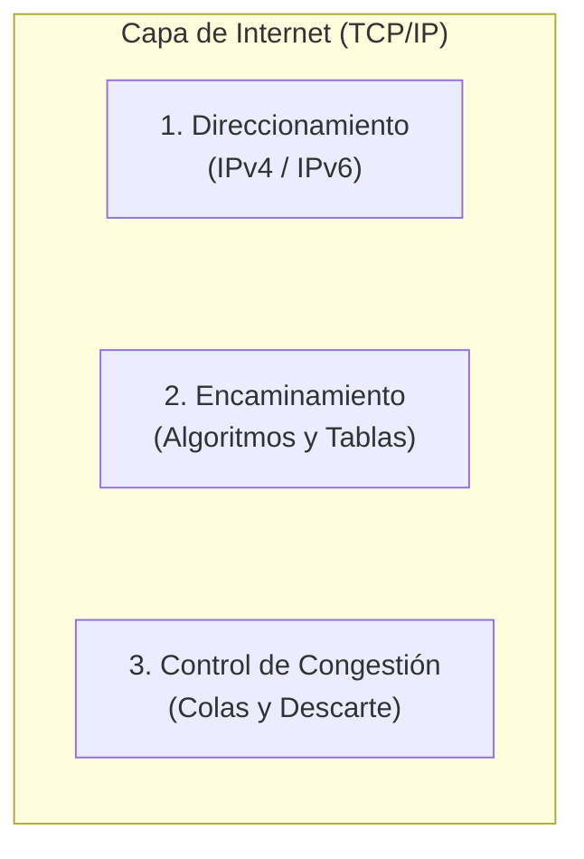

### 1.2. El Encaminamiento como Teoría de Grafos

Para formalizar y resolver el problema del enrutamiento, la topología de la red se modela matemáticamente mediante la **teoría de grafos**:
- **Nodos:** Representan a los **routers** (o conmutadores de Capa 3).
- **Arcos / Aristas:** Representan los **enlaces físicos de comunicación** entre routers.
- **Pesos en los arcos:** Representan el **costo o métrica** asociada al enlace.

> [!QUOTE] Analogía Docente: El camino a la Facultad
> *"Cuando ustedes salen de sus casas o departamentos y van hacia la facultad, no tienen una sola calle o un único camino: tienen múltiples opciones. Pueden elegir ir por la avenida más directa, tomar la Circunvalación aunque hagan el doble de kilómetros porque van más rápido, o evitar calles que se congestionan.
> El encaminamiento consiste exactamente en eso: habiendo múltiples caminos posibles para ir de un origen a un destino, determinar cuál es la mejor ruta a seguir. Pero no al azar ni al voleo, sino aplicando una lógica estricta en función de criterios bien definidos (mínimo retardo, menor costo, políticas del administrador). Esa ruta elegida es la que se instalará en la **tabla de encaminamiento** del router."*

> [!NOTE] Incidente de conectividad durante la clase `[4:50 - 11:29]`
> En este punto se produce un corte en la conexión Zoom de la docente. Al reconectarse (bromeando con que *"los viernes siempre nos pasa algo"*), el alumno **Santiago** le confirma los últimos temas escuchados (*"criterio administrativo, mínimo retardo"*), retomando fluidamente la explicación.

---

## 2. Paradigmas de Transporte: Redes de Circuitos Virtuales vs. Redes de Datagramas `[12:12 - 24:32]`

Para comprender cómo encaminan los routers, es indispensable diferenciar los dos grandes paradigmas de transporte en redes de paquetes, contrastándolos con la telefonía tradicional.

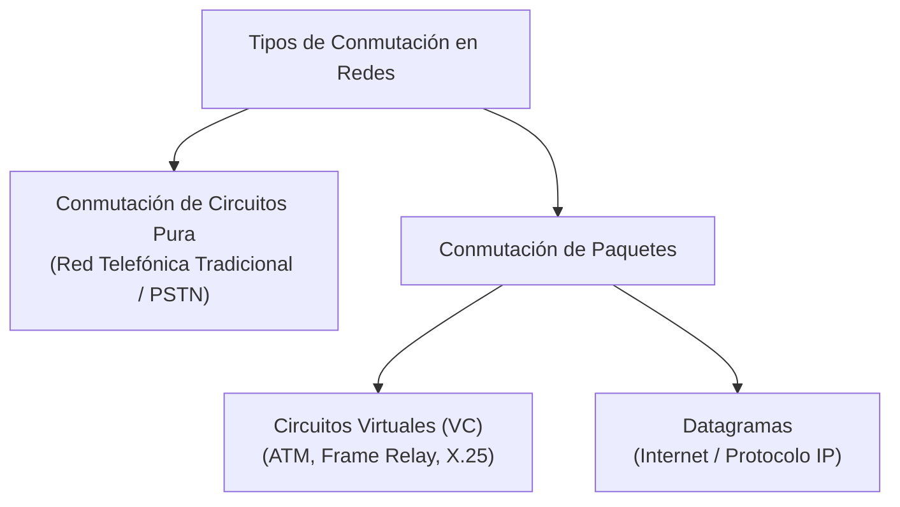

### 2.1. Conmutación de Circuitos Pura vs. Circuitos Virtuales (VC)

Ante la duda de un alumno sobre la diferencia entre *conmutación de circuitos* y *circuitos virtuales*, la docente establece una distinción tajante:

| Característica | Conmutación de Circuitos Pura (Telefonía / PSTN) | Redes de Circuitos Virtuales (VC) |
| :--- | :--- | :--- |
| **Reserva de Ancho de Banda** | **Física y estricta en todo el trayecto.** Se reserva el canal completo durante toda la llamada, se transmitan datos o haya silencio absoluto. | **No se reserva ancho de banda de forma exclusiva.** Los enlaces físicos se multiplexan/comparten entre múltiples comunicaciones simultáneas. |
| **Fases de Conexión** | 3 fases: Establecimiento, Transferencia de voz/datos, Liberación. | 3 fases: Establecimiento, Transferencia de datos, Liberación. |
| **Ruta Física** | Fija y dedicada durante la llamada. | Fija para todos los paquetes de esa sesión (circuito virtual). |
| **Riesgo de Saturación** | Si la red se llena de circuitos reservados, se bloquea (da tono de ocupado, ej. colapso en Navidad o Día de la Madre). | Si no hay datos pasando en un instante, otros paquetes de otras conexiones usan el enlace libremente. |

### 2.2. Funcionamiento del Encaminamiento en Circuitos Virtuales (VC)

1. **Fase de Establecimiento (Apertura del Circuito):**
   - El **primer paquete** (de control/señalización) es el encargado de abrir el circuito virtual.
   - Es el paquete **más lento**: cada router intermedio debe desencapsular hasta **Capa 3 (IP)**, consultar su tabla de encaminamiento, elegir la interfaz de salida y registrar una entrada en su **tabla de conmutación de circuitos virtuales**.
   - Dicha tabla mapea: `[Interfaz de Entrada + ID Circuito Entrante] ➔ [Interfaz de Salida + ID Circuito Saliente]`.
2. **Fase de Transferencia:**
   - Los paquetes subsiguientes (paquete 2, 3, etc.) viajan a máxima velocidad: el router **no desencapsula hasta Capa 3**, sino que conmuta directamente en **Capa 2** consultando la etiqueta del circuito virtual en hardware.
3. **Fase de Liberación:**
   - Un paquete de terminación libera los identificadores de circuito en las tablas de los routers.

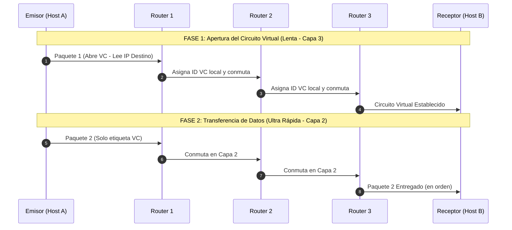

> [!TIP] Ventajas y Desventajas de Circuitos Virtuales
> - **Ventajas:**
>   - **Garantía de orden:** Todos los paquetes siguen exactamente el mismo camino físico y llegan en orden estricto.
>   - **Facilidad para Calidad de Servicio (QoS):** Al saberse de antemano el camino que recorrerán los paquetes, se pueden reservar buffers de memoria y slots de procesamiento en los routers para asegurar streaming de video/audio sin jitter ni cortes.
> - **Desventajas:**
>   - **Vulnerabilidad total a fallos:** Si un router intermedio (ej. Router 2) se apaga o falla, el circuito se destruye por completo. Para continuar la comunicación hay que renegociar y establecer un circuito virtual nuevo desde el origen.

---

### 2.3. Funcionamiento del Encaminamiento en Redes de Datagramas (Internet / IP)

En las redes de datagramas (filosofía original de Internet), **no existe conexión previa**:
- **Tratamiento independiente:** Cada paquete se trata como un datagrama autónomo.
- **Procesamiento salto a salto (Hop-by-Hop):** Cada router desencapsula **todos y cada uno de los paquetes hasta Capa 3**, lee la dirección IP de destino y consulta su tabla de encaminamiento.
- **Rutas dinámicas por paquete:** Si las condiciones cambian o hay múltiples enlaces de igual costo, el paquete 1 puede ir por un camino superior, el paquete 2 por el medio y el paquete 3 por abajo.

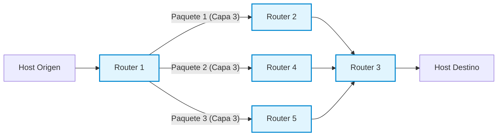

> [!IMPORTANT] Comparativa de Resiliencia y Orden
> - **Robustez y Tolerancia a Fallos:** Si el Router 2 se cae en pleno flujo, la comunicación **no se corta**. El Router 1 simplemente detecta la falla y encamina los siguientes paquetes a través del Router 4 o 5.
> - **Llegada Desordenada:** Al viajar por caminos con distintas latencias y anchos de banda, los paquetes pueden llegar desordenados al receptor.
> - **¿Quién los reordena?** Pregunta la docente. El alumno **Santiago** responde acertadamente: **la Capa de Transporte, específicamente mediante el protocolo TCP** (usando números de secuencia). La Capa de Internet (IP) se desentiende del orden y de las retransmisiones.

---

## 3. Requisitos de un Buen Algoritmo de Encaminamiento `[24:40 - 30:48]`

Un **algoritmo de encaminamiento** es la pieza de software (integrada nativamente en la pila TCP/IP del sistema operativo y firmware de los routers) que toma la decisión: **¿por cuál de todas sus interfaces de salida debe reenviar un paquete que acaba de ingresar?**

Para ser considerado de calidad, debe satisfacer seis propiedades fundamentales:

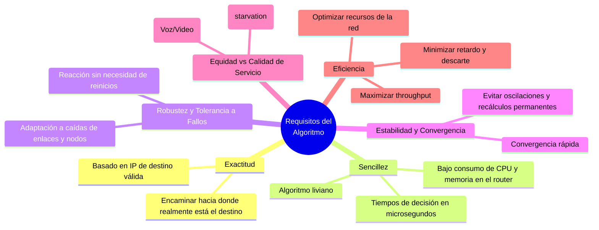

> [!NOTE] Reflexión en Clase: ¿Existe la Equidad Absoluta? `[29:32 - 30:06]`
> La profesora consulta al auditorio si en las redes reales todos los paquetes se tratan de forma idéntica. Los alumnos señalan que no: hoy en día los mecanismos de **Calidad de Servicio (QoS)** diferencian el tráfico. Los paquetes de video y voz en tiempo real tienen prioridad absoluta sobre una descarga de archivos. Sin embargo, el principio de equidad exige que el tráfico no prioritario **nunca sufra inanición (*starvation*)**; todos los paquetes deben ser entregados eventualmente.

---

## 4. Tipos de Encaminamiento: Estático vs. Dinámico `[30:48 - 42:00]`

### 4.1. Encaminamiento Estático (No Adaptativo)

En el enrutamiento estático, las tablas de los routers son cargadas **manualmente por el administrador de red**.

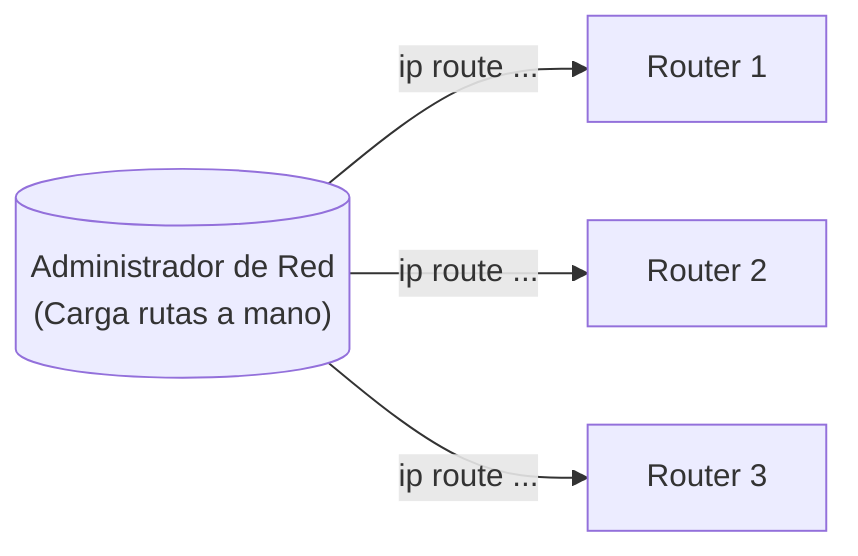

#### ¿Cómo nace un Router de fábrica? (Comparación Router vs. Switch)
- Un **router** nuevo de fábrica cuenta con CPU, memoria RAM y ROM, pero carece de disco rígido: **es un dispositivo "inútil" al inicio**. No sabe qué hacer ni por dónde reenviar nada.
- A diferencia de un **switch** (que al enchufarlo aprende dinámicamente direcciones MAC por autoaprendizaje e inunda tramas desconocidas), el router solo "aprende" automáticamente aquellas **redes que están directamente conectadas a sus interfaces**, una vez que el administrador les configura una dirección IP y máscara.
- Cualquier red remota que esté más allá de sus interfaces debe ser expresamente configurada.

#### La Regla de Oro del Enrutamiento: Rutas Bidireccionales
Durante la clase, la profesora plantea una topología típica:
$$\text{LAN A} \longleftrightarrow \text{Router 1} \longleftrightarrow \text{Router 2} \longleftrightarrow \text{Router 3} \longleftrightarrow \text{LAN C}$$

> [!QUESTION] Pregunta de la Docente `[35:48 - 36:58]`
> *"Si yo le configuro al Router 1 cómo llegar a la LAN C y le configuro al Router 2 cómo llegar a la LAN C... ¿hay conectividad total entre la LAN A y la LAN C?"*
> 
> Los alumnos (Luis y Santiago) responden: **¡No, falta el camino inverso!**
> Si enviamos un comando `ping` desde LAN A a LAN C, el paquete `ICMP Echo Request` llegará exitosamente a la máquina de LAN C. Pero cuando esta responda con un `ICMP Echo Reply`, el Router 3 y el Router 2 **no sabrán cómo llegar a la LAN A** y descartarán el paquete. En encaminamiento estático **siempre se deben definir las rutas de ida y de vuelta**.

> [!WARNING] Desventaja Crítica del Enrutamiento Estático
> Si se cae un enlace físico entre routers, aunque físicamente exista un enlace redundante alternativo en la topología, los routers **descartarán los paquetes (*packet drop*)**. El router estático es "ciego": no se adapta a los cambios de topología. El administrador debe detectar el corte y modificar manualmente la configuración en cada equipo.

---

### 4.2. Encaminamiento Dinámico (Adaptativo)

En el encaminamiento dinámico, el administrador configura un **protocolo de enrutamiento** (como RIP, OSPF, EIGRP o BGP) una única vez en los routers y *"se va de vacaciones tranquilo"*.

- Los routers intercambian periódicamente o ante eventos mensajes llamados **actualizaciones de encaminamiento (*routing updates*)**.
- Si se corta un enlace (ej. WAN 3), los routers detectan la caída mediante paquetes de control (hellos), recalculan sus métricas y reconfiguran automáticamente sus tablas para desviar el tráfico por el camino alternativo (WAN 1).

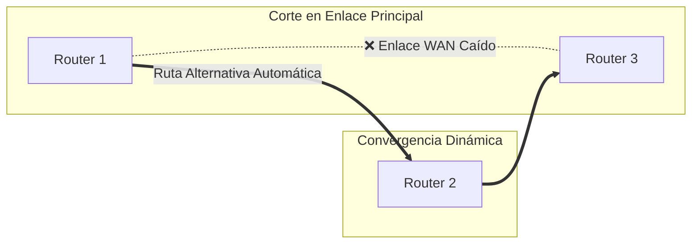

### 4.3. Comparativa: Estático vs. Dinámico

| Criterio | Encaminamiento Estático | Encaminamiento Dinámico |
| :--- | :--- | :--- |
| **Configuración** | Manual, router por router, línea por línea. | Se habilita el protocolo una sola vez; aprendizaje automático. |
| **Mantenimiento** | Alto y tedioso si la topología cambia o crece. | Mínimo; la red se autoajusta sola ante fallos. |
| **Consumo de CPU y RAM** | Mínimo (tablas fijas, sin cálculos). | Mayor (procesamiento de algoritmos y mantenimiento de estados). |
| **Consumo de Ancho de Banda** | Cero tráfico de control en los enlaces. | Consume ancho de banda enviando *routing updates* continuas. |
| **Tolerancia a Fallos** | Nula (requiere intervención humana). | **Excelente** (adaptativo y altamente resiliente). |
| **Seguridad** | Alta (el administrador define exactamente la ruta). | Requiere autenticación de updates para evitar falsificación de rutas. |
| **Ámbito de aplicación ideal** | Redes muy pequeñas (1 a 3 routers) o enlaces stub. | Redes medianas, corporativas, campus y la Internet global. |

---

### 4.4. Clasificación según la Ubicación de la Toma de Decisiones `[31:38 - 33:07]`

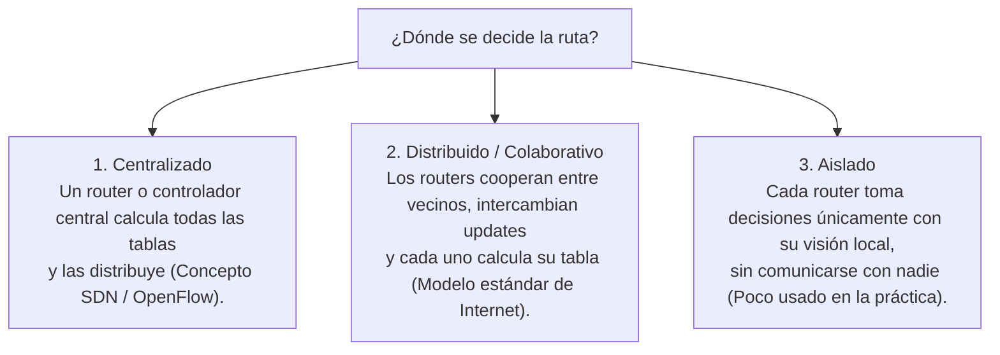

---

## 5. Algoritmo 1: Ruta Más Corta (Shortest Path - Dijkstra) `[42:00 - 50:48]`

El algoritmo de la **ruta más corta** calcula el trayecto óptimo entre dos nodos de un grafo minimizando la suma acumulada de las métricas de los enlaces intermedios.

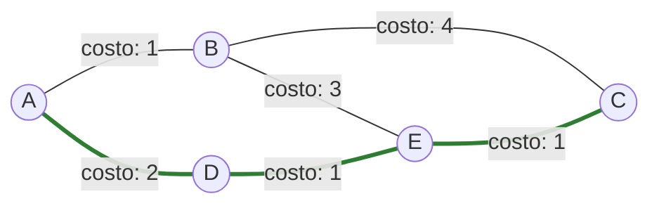
*En el grafo anterior, para ir de **A** hacia **C**:*
- *Ruta por B: $A \to B \to C \implies \text{Costo} = 1 + 4 = 5$*
- *Ruta por D y E: $A \to D \to E \to C \implies \text{Costo} = 2 + 1 + 1 = \mathbf{4}$ (Ruta elegida por ser la menor).*

### 5.1. ¿Qué Métrica Elegir?

La profesora abre el debate con los estudiantes: ¿cómo decidimos cuál es la *"mejor"* ruta?
- **Santiago** señala: *"El tiempo es lo más importante; elegiría la Circunvalación aunque implique más kilómetros"*. La profesora asiente: en ese caso, la métrica elegida es el **retardo**.

Las métricas más habituales en redes son:
1. **Distancia geográfica en kilómetros.**
2. **Conteo de saltos (Hop Count):** Cada router que se cruza vale 1. La ruta con menos routers intermedios gana.
3. **Retardo medio:** Tiempo promedio en milisegundos que tarda un paquete en atravesar el enlace (medido con sondas `ICMP Echo Request / Echo Reply`).
4. **Tráfico promedio / Nivel de congestión:** Penaliza enlaces saturados (similar a las rutas marcadas en rojo en Google Maps).
5. **Costo monetario:** Tarifas impuestas por los proveedores de telecomunicaciones (ISP transit).

### 5.2. El Dilema del Ancho de Banda y la Fórmula Inversa

La docente plantea un problema fundamental:

> [!QUESTION] El Gran Desafío Matemático del Ancho de Banda `[47:29 - 48:37]`
> *"Si mi red tiene enlaces de 1 Mbps, 10 Mbps y 100 Mbps... ¿qué enlace queremos que elija el router? Obviamente el de 100 Mbps, el de mayor ancho de banda para enviar más datos.
> Pero el algoritmo de Dijkstra **SIEMPRE busca el número menor (el camino más corto)**. Si colocamos directamente el ancho de banda como métrica, Dijkstra preferirá el enlace de 1 Mbps sobre el de 100 Mbps porque 1 < 100. ¿Cómo resolvemos esto?"*

- Un alumno sugiere usar números negativos (descartado por generar loops y problemas de divergencia en grafos).
- **La Solución Canónica:** Se utiliza la **función inversa del ancho de banda**:
$$\text{Métrica} = \frac{K}{\text{Ancho de Banda}}$$
Al colocar el ancho de banda en el **denominador**, a mayor capacidad del enlace, menor resulta el costo numérico del arco. Así, el algoritmo elige el enlace más rápido creyendo que es el "más corto".

### 5.3. Métricas Compuestas (Multicriterio)

En protocolos profesionales (como EIGRP), no se utiliza un único factor sino una **función de costo ponderada**:
$$\text{Métrica Total} = k_1 \cdot M_1 + k_2 \cdot M_2 + k_3 \cdot M_3 + k_4 \cdot M_4$$
Donde $M_1, M_2, M_3, M_4$ representan el ancho de banda, retardo, fiabilidad y carga del enlace, y las constantes $k_i$ son configuradas por el administrador según sus prioridades de tráfico.

> [!NOTE] Referencia a la Carrera
> La profesora consulta si ya conocen el algoritmo de Dijkstra. Los alumnos confirman haberlo estudiado en materias como **Investigación Operativa** y **Modelos de Simulación**.

---

## 6. Algoritmo 2: Inundación (Flooding) `[50:48 - 58:41]`

### 6.1. Principio de Funcionamiento

El algoritmo de inundación opera con una lógica elemental:
> Cada vez que un router recibe un paquete por una de sus interfaces de entrada, lo retransmite inmediatamente por **todas las demás interfaces, excepto por la interfaz por la cual ingresó**.

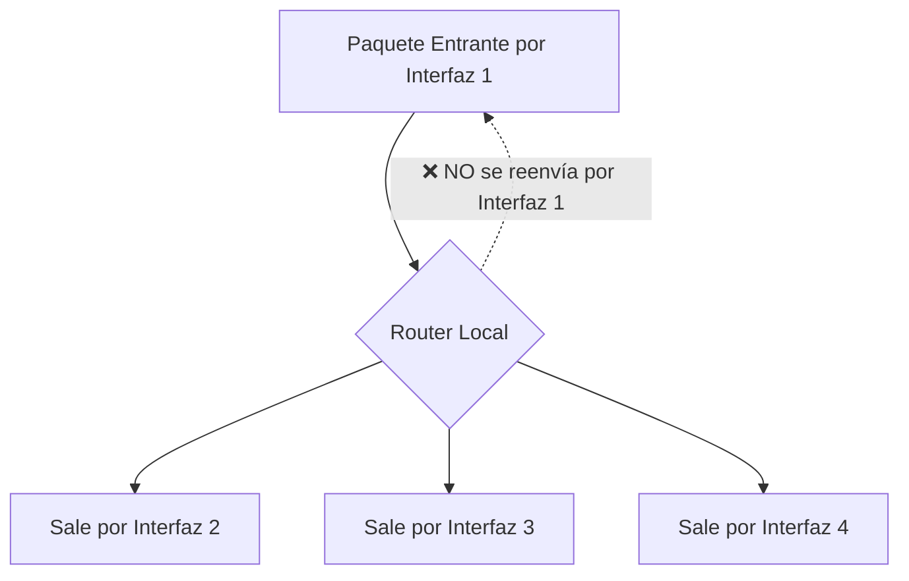

### 6.2. El Problema de la Inundación Pura

Si se implementa sin restricciones, se comporta como un **Hub descontrolado**:
- Los paquetes se replican de forma exponencial.
- Se producen bucles infinitos (*routing loops*), donde los mismos paquetes circulan indefinidamente consumiendo todo el ancho de banda de los enlaces hasta colapsar los buffers de los routers.

### 6.3. ¿Para qué Sirve la Inundación? (Casos de Éxito)

Pese a su voraz consumo de red, es insustituible en escenarios críticos:
1. **Velocidad máxima:** Es el algoritmo de propagación más rápido existente; el paquete viaja en paralelo por todos los caminos físicos simultáneamente.
2. **Sincronización de Bases de Datos Replicadas:** Actualizaciones críticas que deben llegar a servidores de todo el mundo en el menor tiempo posible.
3. **Distribución de Topología en Protocolos Estado de Enlace:** Es la base con la que **OSPF** difunde sus paquetes LSA (*Link State Advertisements*) para que todos los routers de la red tengan exactamente el mismo mapa topológico.
4. **Redes Militares:** Máxima supervivencia; el mensaje llega a destino aunque se destruya el 90% de los nodos intermedios.

### 6.4. Mecanismos de Inundación Controlada

Para aprovechar sus virtudes sin colapsar la red, se aplican dos técnicas de control:

#### Método 1: Contador de Saltos / TTL (Time To Live)
Cada paquete lleva en su cabecera un contador de saltos. Cada router que lo recibe decrementa el contador en 1. Si el TTL llega a cero, el paquete se **descarta de inmediato**.

#### Método 2: ID de Router Emisor + Número de Secuencia Creciente
1. El router emisor original estampa en el paquete su identificador (ej. `Router B`) y un número de secuencia que se incrementa con cada nuevo paquete emitido (`Seq: 1`, `Seq: 2`, `Seq: 3`...).
2. Cada router vecino mantiene una tabla interna en memoria donde anota:
   `[ID del Router Emisor] ➔ [Último Número de Secuencia Visto]`.
3. Cuando a un router le llega un paquete:
   - **Si el número de secuencia es MAYOR** que el último registrado: Es información nueva. Actualiza su tabla con el nuevo valor y **procede a inundar** el paquete por sus restantes interfaces.
   - **Si el número de secuencia es MENOR o IGUAL** al registrado: Significa que ese paquete (o uno más reciente) ya fue procesado e inundado previamente. Por lo tanto, **lo descarta en el acto**.

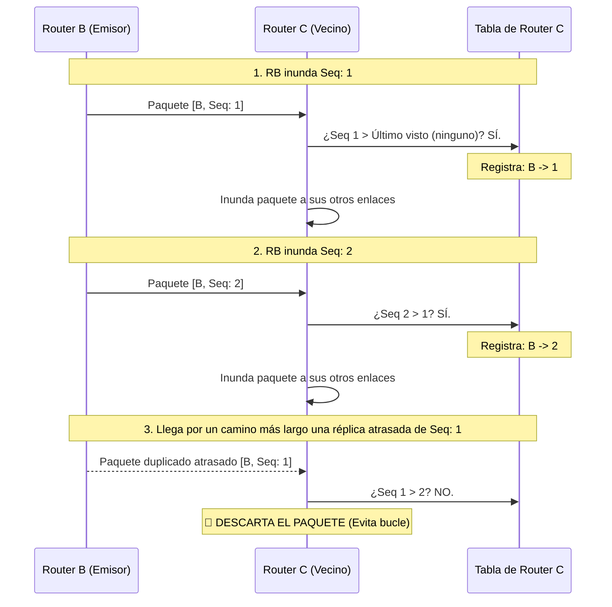

---

## 7. Algoritmo 3: Encaminamiento Jerárquico `[58:41 - 1:10:02]`

### 7.1. El Problema de la Explosión de las Tablas de Encaminamiento

La profesora abre este bloque con una pregunta conceptual clave sobre el diseño de redes:

> [!QUESTION] ¿Qué se almacena en la tabla de un router: Hosts o Redes? `[58:57 - 1:00:57]`
> *"En una tabla de encaminamiento, ¿tenemos un renglón por cada host (computadora) o por cada red/subred?
> Piensen en la facultad: supongamos que la UTN tiene 2.500 computadoras. Si guardáramos direcciones de host, ¡la tabla del router tendría 2.500 renglones! En cambio, la facultad está dividida en unas 100 aulas y laboratorios (subredes). Almacenar 100 renglones de subred es inmensamente más eficiente.
> El router solo necesita saber cómo llegar a la subred de destino; quien se encarga de entregar la trama a la PC específica dentro del laboratorio es el **switch**, conmutando por dirección MAC."*

Aun agrupando por subredes, cuando la red crece a nivel global (Internet), es materialmente imposible que un router de backbone contenga todas las redes del planeta:
- Se agotaría la memoria RAM de los routers.
- La búsqueda de rutas en tablas inmensas consumiría excesivos ciclos de microprocesador, ralentizando el reenvío de paquetes.
- El intercambio periódico de tablas gigantescas saturaría el ancho de banda con tráfico de control.

### 7.2. Solución: Agrupamiento Jerárquico en Regiones / Áreas / AS

Los routers se organizan en jerarquías: **Regiones, Zonas, Áreas (OSPF) o Sistemas Autónomos (BGP)**.

> [!IMPORTANT] La Regla de Oro del Encaminamiento Jerárquico
> - Cada router conoce al **máximo detalle la estructura interna de su propia región** (sabe exactamente cómo llegar a cada router o subred local).
> - Pero **desconoce completamente la topología interna de las demás regiones**: solo sabe por cuál router de frontera o interfaz debe salir para enviar el tráfico a esa región en general.

> [!QUOTE] Analogía Docente: El viaje de Córdoba a Buenos Aires
> *"Si yo viajo desde Córdoba a Buenos Aires, solo necesito saber cómo llegar a la ciudad de Buenos Aires (a la región). No necesito saber de antemano en qué calle está determinado negocio o cómo llegar al Obelisco en la 9 de Julio.
> Cuando llegue a Buenos Aires, los carteles y la gente local (los routers internos de esa región) me van a encaminar con precisión al destino final. Yo, desde Córdoba, solo necesito saber por qué autopista salir hacia Buenos Aires."*

### 7.3. Análisis del Ejemplo Numérico del Libro (Tanenbaum)

Se analiza el caso de una red con 17 routers agrupados en 5 regiones distintas:

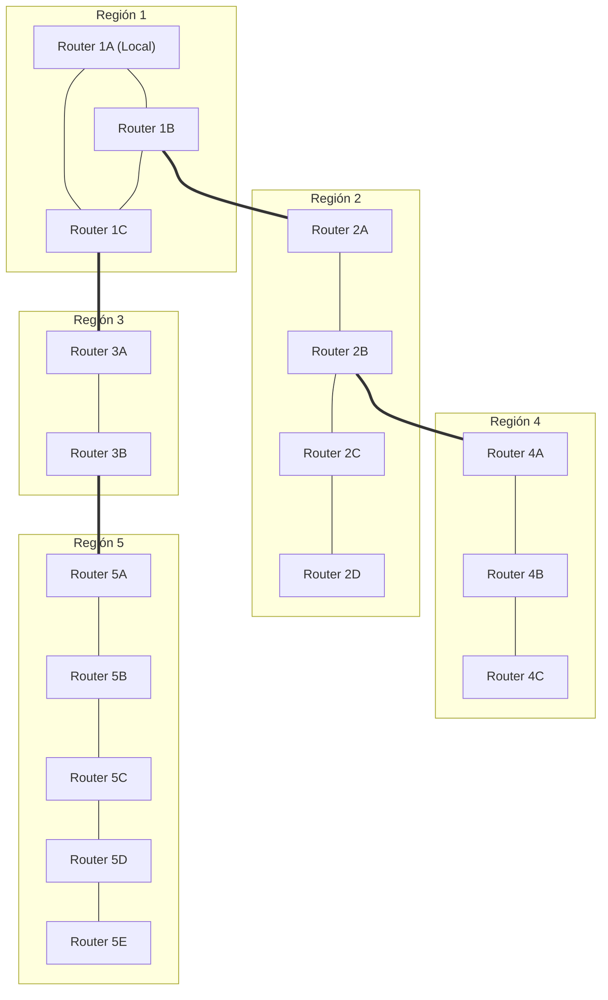

#### Comparación de la Tabla de Enrutamiento del Router 1A:

| Tipo de Tabla | Entradas en la Tabla de 1A | Total de Renglones |
| :--- | :--- | :---: |
| **Tabla Plana (Sin Jerarquía)** | Un renglón por cada uno de los 17 routers de la red completa:<br>`1A, 1B, 1C, 2A, 2B, 2C, 2D, 3A, 3B, 4A, 4B, 4C, 5A, 5B, 5C, 5D, 5E` | **17 renglones** |
| **Tabla Jerárquica** | • Routers locales de su región: `1B, 1C`<br>• Entradas agregadas por región externa: `Región 2, Región 3, Región 4, Región 5` | **6 renglones** |

> [!TIP] Impacto de la Reducción
> ¡La tabla de encaminamiento se redujo en casi un **65%**!
> Cuando el router **1A** debe enviar un paquete al router **2D**:
> 1. 1A consulta su tabla jerárquica: no ve al router 2D, pero ve que la **Región 2** se alcanza a través de la interfaz que va al router **1B**.
> 2. El paquete cruza a la Región 2 y llega al router **2A**.
> 3. Como **2A** sí pertenece a la Región 2, su tabla interna conoce la topología local y encamina el paquete con precisión hasta **2D**.

### 7.4. Vínculo con CIDR y Sumarización de Rutas (Unidad 3)

La profesora conecta este algoritmo con lo visto en la unidad anterior:
- En Internet, las regiones corresponden a **Sistemas Autónomos (AS)** o jerarquías de prefijos IP.
- Mediante **CIDR (*Classless Inter-Domain Routing*)**, miles de redes contiguas se agrupan en un único prefijo de red sumarizado (ej. `/16` o `/19`).
- Gracias a la sumarización, los routers centrales de Internet (*Default-Free Zone*) no colapsan por memoria y pueden conmutar tráfico a velocidades de terabits por segundo.

---

## 8. Cuadro Sinóptico y Cierre de la Clase `[1:09:54 - 1:10:02]`

| Algoritmo Analizado | Idea Central | Principal Ventaja | Principal Desafío / Solución |
| :--- | :--- | :--- | :--- |
| **Ruta Más Corta (Dijkstra)** | Modela la red como grafo y minimiza la suma de costos de los enlaces. | Ruta matemáticamente óptima bajo las métricas elegidas. | Invertir el ancho de banda ($1/\text{BW}$) para que enlaces veloces tengan menor costo. |
| **Inundación (Flooding)** | Reenvía el paquete por todas las interfaces salvo la de llegada. | Velocidad insuperable, máxima robustez, ideal para actualizaciones y bases de datos. | Bucle infinito de réplicas $\implies$ Se controla con **TTL** y **números de secuencia**. |
| **Jerárquico** | Agrupa routers en Regiones, Áreas o Sistemas Autónomos. | Drástica reducción de tablas de rutas, ahorro de memoria y ancho de banda. | Pérdida de visión global en nodos individuales $\implies$ Se delega la resolución al router de frontera local. |

> [!NOTE] Próxima Clase
> La docente concluye la sesión indicando que la base conceptual de algoritmos queda sentada. En las próximas clases se abordarán en detalle los algoritmos dinámicos de mayor peso en la materia: **Vector Distancia (Bellman-Ford / RIP)** y **Estado de Enlace (Dijkstra / OSPF)**.

# Transcripcion 2
12:59

12 minutos y 59 segundos

corresponde una segunda y estamos

13:07

13 minutos y 7 segundos

para que lo moviera antes

13:10

13 minutos y 10 segundos

[Música]

13:24

13 minutos y 24 segundos

entonces

13:31

13 minutos y 31 segundos

si hacemos una toma retomar o no crisis

13:40

13 minutos y 40 segundos

juntas bien bueno para poder ubicarlos en el tema

13:48

13 minutos y 48 segundos

entonces porque hace mucho enorme nos estamos estudiando la unidad de encaminamiento entonces estamos viendo

13:55

13 minutos y 55 segundos

diferentes lógicas que utilizan los routers para poder encaminar así para tomar la decisión de portal de todas las interfaces sacar un paquete que acaba de

14:04

14 minutos y 4 segundos

llegar estuvimos viendo estos tres primeros algoritmos antes del proceso desde la ruta más corta de 20 días atrás el

14:13

14 minutos y 13 segundos

algoritmo de inundación y el algoritmo jerárquico si ya nos estamos viendo en forma totalmente

14:21

14 minutos y 21 segundos

individual uno por uno vamos a ver algunos protocolos ya las que vamos a hacer estudios específicos

14:28

14 minutos y 28 segundos

algunos de esos protocolos aplican algoritmos y simultáneamente decide aplicar varios algoritmos a la vez en el capítulo no sólo nosotros pero puedo

14:36

14 minutos y 36 segundos

entender cuál es la lógica de cada algoritmo no estuvimos por separado para la realidad pueden coexistir en un mismo protocolo

14:43

14 minutos y 43 segundos

estuvimos bien estos 3 la ruta más corta eliminación del jerárquico la última clase hoy vamos a

14:50

14 minutos y 50 segundos

ver estos dos el algoritmo de vector distancia y el algoritmo de estado de enlace

14:58

14 minutos y 58 segundos

me voy directamente otra vez me pones me detuve la compartición por abajo

15:06

15 minutos y 6 segundos

en segunda no sé qué hago y cuando puse skate de todo me saco de

15:14

15 minutos y 14 segundos

la

15:15

15 minutos y 15 segundos

[Música]

15:17

15 minutos y 17 segundos

dije compartir

15:18

15 minutos y 18 segundos

[Música]

15:25

15 minutos y 25 segundos

bueno la última clase como para que se queden tranquilos habíamos quedado en esta diapositiva del algoritmo genético

15:34

15 minutos y 34 segundos

vamos a partir entonces vamos a continuar estudiando el algoritmo que sigue el algoritmo que se llama de vector distancia ahí también

15:43

15 minutos y 43 segundos

[Música]

15:50

15 minutos y 50 segundos

[Música]

15:55

15 minutos y 55 segundos

en internet hay un sistema que utiliza este algoritmo es algo que

16:04

16 minutos y 4 segundos

vamos a ver que tira con los inconvenientes podemos ver cuáles son sus comer inconvenientes y cómo se pueden solucionar

16:12

16 minutos y 12 segundos

este árbol isacar dinámico distribuido para que recuerden un algoritmo dinámico era un algoritmo que lo que hace es

16:21

16 minutos y 21 segundos

tenía micrófono alto que significa dinámico que si hay un cambio en la topología este algoritmo lo

16:31

16 minutos y 31 segundos

detecta lo más rápido posible y se haga es decir un algoritmo dinámico de

16:38

16 minutos y 38 segundos

encaminamiento permite que nosotros podamos agregar nuevas redes o que se caigan algunas redes y sin embargo en el volumen de que esos cambios se adaptan

16:46

16 minutos y 46 segundos

sin que la administradora de absolutamente nada de administrados de pedir de vacaciones y una vez que han configurado los routers todos estos

16:54

16 minutos y 54 segundos

algoritmos hacer que los routers sigan encaminando y se vayan adaptando los cambios el que se ha distribuido se refiere a

17:02

17 minutos y 2 segundos

que la forma de aprender cómo llegar a las distintas redes de la topología no la aprende solamente y no la reduce

17:11

17 minutos y 11 segundos

solamente el propio router sino que se vale de información que le va a llegar de otros routers esa información se llama actualización encaminamiento es

17:18

17 minutos y 18 segundos

decir que periódicamente este algoritmo cada por ejemplo 30 segundos es la configuración por defecto envía

17:26

17 minutos y 26 segundos

actualización contamina miento entre los routers y cada uno le dice a qué redes puede en alcanzar entonces así los otros

17:33

17 minutos y 33 segundos

routers van aprendiendo cómo llegar a diferentes redes es como si ustedes supieran sobre un tema de ser enseñan sus compañeros y entre todos aprenden todo es un

17:42

17 minutos y 42 segundos

algoritmo colaborativo y se llama distribuida y qué consiste ahora vamos a tratar de interpretar el nombre del

17:50

17 minutos y 50 segundos

algoritmo que dice vector y distancia que significa la palabra vector significa dirección entonces bueno de

17:57

17 minutos y 57 segundos

física aunque se deben acordar que la palabra director significa dirección entonces este algoritmo cada vez que quieren llegar a una determinada red

18:05

18 minutos y 5 segundos

tiene que saber así qué dirección enviar ese paquete y para que finalmente llegue a esa red cómo se implementa esa

18:13

18 minutos y 13 segundos

dirección en la tabla de encaminamiento a través de una interfaz de salida es decir que si yo quiero llegar a la red x lo tengo

18:23

18 minutos y 23 segundos

que sacar al paquete con la interfaz sería el 4 o por la interfaz gigabit ethernet 3 por ejemplo esa sería la parte de el

18:32

18 minutos y 32 segundos

nombre de vector y la parte de distancia y lo que me dice es que tan lejos es pesar red eso de qué tan lejos se puede

18:39

18 minutos y 39 segundos

medir de diferentes formas la forma más fácil de entender las entradas del número de saltos es decir la cantidad de reuters que nosotros tenemos que

18:47

18 minutos y 47 segundos

atravesar para poder llegar a esa red entonces que va a tener una tabla de encaminamiento este algoritmo la dirección de red de destino la máscara y

18:56

18 minutos y 56 segundos

la distancia que va a ser la cantidad de santos y el vector que va a ser la línea de salida por dónde sacar esos paquetes

19:04

19 minutos y 4 segundos

como en general en una topología hay rutas alternativas así que imagínense mentalmente una topología en maya este

19:13

19 minutos y 13 segundos

algoritmo lo que hace es no instalar en la tabla de encaminamiento todas las rutas posibles sino que instala en la tabla o registran atada encaminamiento

19:21

19 minutos y 21 segundos

solo la mejor la mejor ruta como voy a decidir cuál yendo corrupta porque la que tiene en general la menor

19:30

19 minutos y 30 segundos

distancia es cuando van de un lugar a otro en la ciudad por ejemplo cuando van en el auto eligen la ruta más corta por

19:39

19 minutos y 39 segundos

ejemplo la que tengan menor cantidad de kilómetros y parecido a lo que vimos en el algoritmo de la ruta más corta

19:48

19 minutos y 48 segundos

dijimos reciente está el volumen realiza actualizaciones periódicas para que se utilizan exactas actualizaciones periódicas para detectar cuándo se cae

19:55

19 minutos y 55 segundos

una red sí sí yo periódicamente a ustedes o les pido que ustedes cada dos minutos me manden un en el chat hasta

20:04

20 minutos y 4 segundos

estoy trofeo que estoy aquí estoy yo así sé que los 46 participantes que somos ahora están del otro lado paso esos dos

20:11

20 minutos y 11 segundos

minutos si ustedes no me mandan en la que estoy yo digo jubile ese alumno perdió la conectividad es decir que lo tengo que borrar de mi lista de alumnos

20:20

20 minutos y 20 segundos

presentes como quien dice si dos en una forma de detectar si una red de calyon es enviando estas actualizaciones

20:28

20 minutos y 28 segundos

periódicas entre los rutas estos son paquetes especiales que se construyen y que construcción un router

20:35

20 minutos y 35 segundos

y se le envía a otro ruta de una forma de implementar esta parte de algoritmo

20:42

20 minutos y 42 segundos

dinámico si no yo no tengo cómo saber y qué redes están activas en un determinado momento si no tengo alguien que está diciendo todo está bien todo

20:50

20 minutos y 50 segundos

está bien todo está bien esto a eso se refiere acá con actualizaciones sin

20:57

20 minutos y 57 segundos

agua cada cuánto tiempo realice esta actualización estas actualizaciones depende del

21:05

21 minutos y 5 segundos

protocolo el protocolo que nosotros vamos a estudiar las las que viene que se llama read que implemente el algoritmo de vector distancia lo hace cada 30 segundos pero eso es por defecto

21:14

21 minutos y 14 segundos

vos como administrador lo podemos modificar para no consumir tanto ancho de banda sí porque cada 30 segundos estará enviando una actualización de

21:23

21 minutos y 23 segundos

encaminamiento consume ancho de banda 30 segundos sería la respuesta correcta

21:29

21 minutos y 29 segundos

en todo lo otro bueno le agregué otra característica dice desconoce la

21:36

21 minutos y 36 segundos

topología de la red qué significa esto que ustedes es como si estuvieran una agenda en sus sus casas que dice

21:44

21 minutos y 44 segundos

facultad guión cuatro kilómetros no se pasa del jockey guión seis kilómetros

21:52

21 minutos y 52 segundos

shopping nuevo centro guión siete kilómetros eso es lo que tiene el router resultarles encaminamiento tiene en la

22:00

22 minutos

red de la cual quiere llegar a técnicas sociales lugares y la distancia lo que no conoce el router es la topología de la red solamente conoce ser como si

22:10

22 minutos y 10 segundos

ustedes no estuvieran en el google maps o sea no tienen el mapa de la ciudad simplemente tienen el destino y los kilómetros o la distancia para llegar se

22:18

22 minutos y 18 segundos

destina cuando es así pero si es dinámico como hace para detectarla el cambio de topología

22:27

22 minutos y 27 segundos

digamos cómo hace para detectar el cambio de topología porque acordate que un trabajo colaborativo

22:35

22 minutos y 35 segundos

entonces si un router no me manda ni una actualización encaminamiento pasado los 30 segundos yo lo voy a esperar por

22:42

22 minutos y 42 segundos

ejemplo un minuto y media si no me llega yo sé que todas las redes que podrían llegar a través de ese router ahora son inalcanzables

22:53

22 minutos y 53 segundos

enseguida en alguna animación de cómo funciona este algoritmo y a lo mejor se dan cuenta si no entendés bien juande

23:01

23 minutos y 1 segundo

que veamos esa animación de bolos a consultar si no ahora estamos viendo como las características a nivel general

23:09

23 minutos y 9 segundos

después mover al detalle cómo funciona este algoritmo de hecho no le hice capturas de paquete ni nada pero en la parte práctica pueden llegar a capturar

23:18

23 minutos y 18 segundos

paquetitos con el walt shark de este este protocolo y hasta pueden ver las actualizaciones entrenamiento qué información se mandan actualización un

23:27

23 minutos y 27 segundos

encaminamiento si ésta es en el de detalle se puede investigar nosotros vamos a ver nada más cómo y cómo funciona con la lógica

23:36

23 minutos y 36 segundos

se entiende entonces que desconoce la topología de la red ustedes al tener esa gente en casa que dice solamente o cuando van en el auto el destino y los

23:44

23 minutos y 44 segundos

kilómetros pueden llegar a desorientarse y pueden llegar a manejar en círculos o sea

23:51

23 minutos y 51 segundos

producirse looks que se llaman sí o bucles de encaminamiento por qué y por qué no tienen más para el no tener el

23:58

23 minutos y 58 segundos

mapa es que puede llegar a llevar a manejar en círculos y si ustedes tuvieran un mapa de la topología de la

24:06

24 minutos y 6 segundos

red no hay forma de que se tocan estos looks pero buenas recuerden que el primer algoritmo que se creó en internet

24:13

24 minutos y 13 segundos

a cerca del año 1987 tiene muchos años entonces en ese momento bueno como todo podía llegar a producirse estos errores

24:21

24 minutos y 21 segundos

sí entonces es culpa de no conocer la topología de la red existe la posibilidad de que se presenten bucles

24:29

24 minutos y 29 segundos

no es que siempre se van a presentar bucles puede que se presenten bucles y entonces cuáles qué les parece de todo lo que hemos

24:37

24 minutos y 37 segundos

visto hasta ahora cuatrimestre anterior también cómo podemos garantizar que un paquete no quede dando vueltas en internet culpa de

24:45

24 minutos y 45 segundos

estos bucles estos loops como se podría controlar controlar no me acuerdo nombres pero el

24:53

24 minutos y 53 segundos

contador de tiempo de vida perfecto hay escuché una voz existe femenina creo que la ley la muy bien ariel el ctl con el

25:01

25 minutos y 1 segundo

que justamente cuando se crea internet y se dan cuenta que los paquetes que van dando vuelta en internet culpa de encaminamiento estos problemas

25:10

25 minutos y 10 segundos

encaminamiento estos looks punto cutres de pone mente te l a la cabecera del protocolo ip tanto ipv4 fíjense vidas

25:17

25 minutos y 17 segundos

pues mantuvo en él y 36 como límite de saltos para evitar que un paquete que dando vuelta en internet es decir que si entra en un loop que quede un ratito

25:25

25 minutos y 25 segundos

dando vueltas pero una vez que se acaba el dt que muere ese paquete sin perfect muy bien esto es para que relacionen todos los temas porque si no vamos

25:33

25 minutos y 33 segundos

estudiando en forma independiente pero obviamente que existe una relación entre todos los temas que estamos estudiando

25:40

25 minutos y 40 segundos

hoy dice otra característica converge lentamente qué significa esto esto es un protocolo que se llama basado en rumores

25:48

25 minutos y 48 segundos

se hablan a lo mejor conocen un juego que se llama en cama con el nombre qué

25:53

25 minutos y 53 segundos

[Música]

25:55

25 minutos y 55 segundos

personales compuesto eso que se va cuando se ponen todo uno al lado del otro sólo juega con de la niña quizás no se pone uno al lado del otro y de la

26:04

26 minutos y 4 segundos

izquierda son días le dice un mensaje al divino al lado y se le pasa el mensaje al oído al otro en ese al oído del otro

26:11

26 minutos y 11 segundos

y así el último narración mensaje tiene que haber sido el mensaje completo que en general llega todo un día porque escucho todo al revés conocen ese juego

26:19

26 minutos y 19 segundos

[Música]

26:23

26 minutos y 23 segundos

por lo menos de nombre jugar bueno así funciona este algoritmo de héctor distancias decir cómo aprenden

26:31

26 minutos y 31 segundos

los routers acerca de las redes están distantes o sea que están por ejemplo a 4 reuters de distancia porque un router

26:37

26 minutos y 37 segundos

le dice lo que él sabe de las redes al router de al lado al que tiene directamente conectados es a su vez demanda esa actualización encaminamiento

26:46

26 minutos y 46 segundos

lo que aprendió al otro router que tiene al lado a su vecino directamente conectado y así esas actualizaciones de encaminamiento van saltando del router a

26:53

26 minutos y 53 segundos

reuters hasta que un router que está lejos por ejemplo a 10 altos recibe información de las redes que estaban

27:00

27 minutos

conectadas del primer router eso hace que conversan lentamente imagínense ahora yo estoy hablando y todos están

27:09

27 minutos y 9 segundos

escuchando simultáneamente imagínense si de los 46 que estamos yo lo que quiera que dijeran dos palabras lucas lucas guy

27:17

27 minutos y 17 segundos

se las dice a broma por unos servicios facundo facundo sólo y seguido y así es y sencillamente se tarda mucho tiempo sino si el último alumno recibe el

27:25

27 minutos y 25 segundos

mensaje eso demora por eso esta red con ver lentamente culpa de que comer lentamente pueden haber errores o

27:33

27 minutos y 33 segundos

interpretaciones erróneas encaminamiento lo que puede llevar a que se produzcan bucles sí

27:40

27 minutos y 40 segundos

una ventaja porque no todas son desventajas de este algoritmo es que consume pocos recursos del router es decir que el router o un aparatito que

27:48

27 minutos y 48 segundos

tiene micro tiene memoria ram en memoria rom pero para ejecutar este algoritmo no necesita tanta potencia del router puede

27:56

27 minutos y 56 segundos

ser un router simple sencillo si un algoritmo bastante livianito para ejecutarse lo que sí

28:04

28 minutos y 4 segundos

consume es ancho de banda de los enlaces porque envía estas actualizaciones periódicas si esto si consume mucho de

28:12

28 minutos y 12 segundos

banda pero el procesamiento del router es bastante sencillo bastante simple no consume tantos ciclos de micro como

28:20

28 minutos y 20 segundos

inicio ni necesita tanta memoria el algoritmo que implementa y el vector distancia se llama del man form of

28:27

28 minutos y 27 segundos

wilkerson del man for el nombre completo para calcular las rutas cada vez que reciben la actualización de encaminamiento se ejecuta este algoritmo

28:34

28 minutos y 34 segundos

y va detectando nuevas rutas y las va agregando a su tabla de encaminamiento

28:42

28 minutos y 42 segundos

qué métricas puede usar este algoritmo para decidir qué ruta es la mejor pues puede utilizar una o puede utilizar

28:51

28 minutos y 51 segundos

perdón varias el protocolo que nosotros vamos a estudiar que se llama red como métrico utiliza la cantidad de saltos es

28:57

28 minutos y 57 segundos

decir que si una red está a 4 reuters oa cuatro saltos y otra vez está a dos saltos va a elegir la ruta que

29:06

29 minutos y 6 segundos

obviamente tiene menor cantidad de santos y va a ser ésta la que va a instalar en la tarde de encaminamiento la otra directamente la va a desechar si

29:13

29 minutos y 13 segundos

nabai nada es como si yo le dije no miren de la casa o tengan la facultad si van por acá y son cinco kilómetros sin carné si van por la circunvalación son

29:22

29 minutos y 22 segundos

diez y no profesen así yo prefiero sala de 5 listo entonces esas las que registran en sus mentes y esa es la que vamos a reservar en sus casas una

29:30

29 minutos y 30 segundos

facultad pero hay otras métricas porque porque hay algoritmos de vector distancia que

29:38

29 minutos y 38 segundos

son propietarios no algoritmos pero protocolos que utilizan el algoritmo de vector distancia que son propietarios por empresas de telecomunicaciones como

29:46

29 minutos y 46 segundos

cisco por ejemplo y grp en un protocolo que utiliza una mezcla de alguna función

29:53

29 minutos y 53 segundos

mejor dicho de varias y métricas y utilizar cantidad a conectar la longitud de la escola de paquetes que más se pone

30:01

30 minutos y 1 segundo

creativa cuando estudiamos el algoritmo de la ruta más corta dijimos que se podían tener en cuenta varias métricas es como si ustedes eligieran una ruta no

30:10

30 minutos y 10 segundos

solamente por la distancia en kilómetros sino que esté bien iluminada que hace que no tenga pozos que sea segura bueno

30:18

30 minutos y 18 segundos

ese sería una métrica compuesta que se llama vamos a tratar de ver ahora cómo funciona este algoritmo eso le dice una

30:27

30 minutos y 27 segundos

topología bastante sencilla para que se entienda

30:30

30 minutos y 30 segundos

[Música]

30:32

30 minutos y 32 segundos

tenemos tres rutas tres perdón reuters aves y si bien dos redes de área local a

30:40

30 minutos y 40 segundos

éste no le puse para que sea más sencillo acá deberían haberse conectado ante un switch este otro sitio me puse derechamente sencilla así como para que

30:48

30 minutos y 48 segundos

sea fácil entender lo que tenemos entonces este router qué tipo de interfaz es una interfaz fast ethernet y

30:55

30 minutos y 55 segundos

un interfaz sería el cero esta es la cndh este one este es una red de broadcast este es una red punto a punto

31:02

31 minutos y 2 segundos

a una red de difusión acá el router bettini con interfaces seriales y el router se tiene un interfaz serial y una

31:10

31 minutos y 10 segundos

interfaz plana que sería esta fase interna tercero por alguna razón una red de difusión y

31:18

31 minutos y 18 segundos

tener una red punto a punto chiquito una red one alas rojas serían redes wan y esta celeste sería una red lan

31:25

31 minutos y 25 segundos

[Música]

31:28

31 minutos y 28 segundos

acá vamos a ver las tablas de encaminamiento no están completas acá me faltan algunas columnas pero bueno si no

31:35

31 minutos y 35 segundos

me cabía toda la diapositiva vamos a tratar de ver cómo va construyendo las sus tablas encaminamientos los tres rutas

31:44

31 minutos y 44 segundos

yo puedo sacar tres columnas y va a ser la red de destino la métrica cómo usar la cantidad de saltos para que sea sencillo entendernos y la interfaz sí

31:53

31 minutos y 53 segundos

entonces esto sería de métrica la distancia y la interfaz sería lo de vector promise ankara ese paquete para poder llegar a esta red de destino lo

32:02

32 minutos y 2 segundos

mismo para los otros routers han configurado algún router ya que no me fijé si hayan asignado a una

32:10

32 minutos y 10 segundos

dirección ip estas interfaces o no todavía no en la parte práctica en el simulador perfecto han configurado un ip address o

32:19

32 minutos y 19 segundos

un mix config algo así justo en marte hicimos consideradas militares y logísticos por todo el

32:26

32 minutos y 26 segundos

rostro perfecto la interfaz es la perfecta muy bien bien twitter es un

32:34

32 minutos y 34 segundos

aparatito y muy inútil es decir que en contraposición al switch ustedes cuando compran un switch simplemente lo enchufan no tienen ni que aprenderlo

32:42

32 minutos y 42 segundos

porque no tiene botón de encendido y el switch sólo se acuerdan empieza a construir sus tablas como que se llama si tratas de direcciones marcas y

32:51

32 minutos y 51 segundos

empieza a darse cuenta que máquina está conectada a cada puerto físico el router navarro tener un poco inútil nosotros compramos un router con hacemos todas

32:59

32 minutos y 59 segundos

las conexiones de cableado demás sin embargo el router no hace absolutamente nada como lo vieron el martes entonces tienen que configurar le si alguien

33:07

33 minutos y 7 segundos

quería hablar me parece que activamente hay que configurar por ejemplo las direcciones y

33:15

33 minutos y 15 segundos

eso es lo mínimo que hay que hacer entonces cuando el administrador le pone la dirección ip de esta interfaz que supongamos que tenemos esta dirección

33:23

33 minutos y 23 segundos

las 12 000 y acá le ponemos las 12 001 10 255 000 68 el router dice ah parece

33:33

33 minutos y 33 segundos

que detrás de esta interfaz hay una red que es la box y qué hace la instala en la tabla de encaminamiento y apenas le

33:41

33 minutos y 41 segundos

configuramos una dirección ip a una interfaz de un router el router si la activa o idéntica que hay que activar la esa interfaz y está activa se instala en

33:50

33 minutos y 50 segundos

la tabla de encaminamiento cuando el administrador de configura esta dirección ip que podría ser por ejemplo la 14001 ya que nos llene de dirección y

33:59

33 minutos y 59 segundos

tecno pero que no nos confundamos sí pero estamos en esta gráfica da solamente la dirección de red hasta acá

34:06

34 minutos y 6 segundos

a una ip y ahí va otra ip suponemos que pone la 14001 esa interfaz con su correspondiente máscara y se activa el

34:14

34 minutos y 14 segundos

pse interfaz automática automáticamente reutilizada parece que detrás de esa interfaz tengo la red 14 que hace

34:22

34 minutos y 22 segundos

instalan esas dos redes en su tabla entonces a la red 12 puede llegar a través de la interfaz fast ethernet serón que egipto

34:30

34 minutos y 30 segundos

a la red de datos se puede llegar a través de la interfaz sería el cero de que métrica por khedira métrica cero que le parecen porque dice métrica cero

34:38

34 minutos y 38 segundos

[Música]

34:44

34 minutos y 44 segundos

cuando reuters tengo que trabajar para enseñar la red 14 desde el router a

34:49

34 minutos y 49 segundos

[Música]

34:52

34 minutos y 52 segundos

por mí un router exacto por un link un router por ese 15 0 si muy bien lorenzo por la cantidad de

35:00

35 minutos

saltos como el cielo saltos pues es que acá en la métrica dice 0 es decir que las redes que están directamente conectadas tienen una métrica de 0

35:08

35 minutos y 8 segundos

estamos bien lo mismo va a ser el router de giovanni del administrador le va a configurar una ip acá la 14 002 acá le

35:17

35 minutos y 17 segundos

puede llegar a poner la 1600 1 y entonces el router apenas de configurar esa y te dice 1 y parece que está la red

35:24

35 minutos y 24 segundos

14 después de la interfaz serial 1 como está directamente de khaled hablé con una métrica de 0 y después en la otra

35:32

35 minutos y 32 segundos

interfaz está en el serial those una vez configurada la ip 16001 y según parece que detrás de esa interfaz hay una red fíjense que en general las tablas en

35:40

35 minutos y 40 segundos

entrenamiento aseguran que alguna vez dijimos no tienen direcciones de host qué tipo de esta dirección

35:52

35 minutos y 52 segundos

en una dirección de red perfecto muy bien matías es una dirección de red puede ser de red o puede ser de su red pero es muy raro que

36:01

36 minutos y 1 segundo

en una tabla de encaminamiento se hace direcciones de host porque porque si yo acá detrás de este switch tengo que no

36:09

36 minutos y 9 segundos

se puede ser una exageración 200 puestos de trabajo porque tengo varios switches interconectados todas las una red y me alcanza

36:17

36 minutos y 17 segundos

si tengo 200 pc sería tonto tener 200 renglones mitad de entrenamiento con

36:24

36 minutos y 24 segundos

sólo tener la dirección de red de todos esos 200 dispositivos y ya estáis suficientes y después del switch le va a

36:32

36 minutos y 32 segundos

entregar a cada una de esas 200 máquinas varios switches obviamente le van a entregar el paquete o la trama caixa se

36:40

36 minutos y 40 segundos

trabajaría de trama a cada una de esas 200 especies se entiende en todas las cargas de entrenamiento vamos a

36:46

36 minutos y 46 segundos

encontrar direcciones de red o subred por ahí pueden llegar encontrar una dirección de host pero esa dirección de

36:54

36 minutos y 54 segundos

jos es la propia interfaz sí pero nunca van a encontrar direcciones de pc acá ni de servidores en la tabla de

37:02

37 minutos y 2 segundos

entrenamiento recto esto es para agilizar el tema del encaminamiento y por último a reuters hacemos lo mismo

37:10

37 minutos y 10 segundos

cuando se configura esta ip registra esa dirección de red no se configure está híper registra la dirección de 18 que

37:18

37 minutos y 18 segundos

está detrás de la interfaz ethernet y 0 y así tal cual está la topología lo que

37:26

37 minutos y 26 segundos

está la vía positiva puede tener conectividad una pc que está en la red 12 mandarle un paquete a una peseta a la

37:33

37 minutos y 33 segundos

red 18 si no y por qué

37:42

37 minutos y 42 segundos

con eso estable en confinamiento no bien porque más días porque no porque el

37:48

37 minutos y 48 segundos

router bell no sabe dónde está la 18 y al router así saben no tampoco obviamente frontera tiene detrás o por

37:55

37 minutos y 55 segundos

tevez perfect quiera pasar cuando este router ley hay un paquete que tiene una

38:02

38 minutos y 2 segundos

ip 12 11 0 10 que va a dirigir a una ip 1800 15 va a consultar en la tabla determina miento la histeria de destino

38:10

38 minutos y 10 segundos

y no la encuentran si no la encuentra que hace elimina el paquete lo descarta simplemente descarta estamos y cuando lo descarta como para que relacionen el

38:19

38 minutos y 19 segundos

tema ay se active el protocolo y cmp se acuerdan y va a construir un paquetito que diga destino inalcanzable se

38:27

38 minutos y 27 segundos

acuerdan el sí del protocolo pipe no hace absolutamente nada simplemente descarta el paquete para que no sea tan antipático se desarrolló el protocolo y

38:35

38 minutos y 35 segundos

cmp que lo apoya el protocolo ip e informa la causa por lo cual un paquete no es entregado en este caso porque la

38:42

38 minutos y 42 segundos

red es desconocida no conoce la red no puede llegar a ésta hay que hacer va a empezar a activarse este algoritmo de vector distancia y se

38:50

38 minutos y 50 segundos

van a empezar a enviar actualizaciones de encaminamiento que son actualizaciones el router al le va a mandar todo de su tabla al router ver si

38:58

38 minutos y 58 segundos

entonces nos vamos a la ciudad a poco para ir entendiendo la rutera va a armar una una actualización determina miento

39:06

39 minutos y 6 segundos

que sería este rectángulo naranja con esta tabla y se la manda al router vez que hacer usted ve cuando recibe esa

39:13

39 minutos y 13 segundos

tanda se ejecute el algoritmo del man forma que si queremos recién del vector distancia y dice para dar la red 12 la

39:20

39 minutos y 20 segundos

tengo no no no tengo entonces que hago la agregó y la agrega pero fíjense viene con métrica cero porque aparece acá

39:29

39 minutos y 29 segundos

métrica 1 porque este router me tuvo que aumentar en 1 el salto el perdón la métrica porque para llegar a la red 12

39:36

39 minutos y 36 segundos

del router 20 tiene que atravesar un router entonces la red 12 de de schutter ve está a un salto si fuese que el

39:44

39 minutos y 44 segundos

aumento unum acá y porque interfaz lo va a sacar por la serie al 1 como esa actualización entró por la interfaz

39:51

39 minutos y 51 segundos

serial 1 el router ve cuando quieras llegar a la red on se va a tener que sacar los paquetes por la interfaz

39:58

39 minutos y 58 segundos

serial 1 eso es lo que me identifica la parte del vector de este algoritmo así por donde sacar los paquetes para poder

40:06

40 minutos y 6 segundos

llegar a una determinada red sigue analizando por otra vez en esta actualización dice la red 14 la tiene

40:14

40 minutos y 14 segundos

que agregar a la red 14 su tabla el router ve o no i

40:20

40 minutos y 20 segundos

no sé lo que me exacto como ya la tiene simplemente ignora este es esa información que va a ser ahora router ve

40:29

40 minutos y 29 segundos

con lo que aprendió de él con un teléfono descompuesto vente rutera le enseñar otra vez después el router bl enseña reuters ella así sucesivamente ya

40:37

40 minutos y 37 segundos

que han hecho una topología sencilla para poder ver la animación si ahora router vez base de que construye una tabla de encaminamiento y pegando una

40:45

40 minutos y 45 segundos

actualización de encaminamiento con esta tabla dice la manda a reuters con todo lo que aprendió de a cuando le llega el

40:52

40 minutos y 52 segundos

tercero tercerizada en la red 14 no la tengo entonces la voy a agregar le sumó una la métrica ahora vale 1 y para

41:01

41 minutos y 1 segundo

llegar a esa red tengo que sacarlos por la interfaz serial 3 que es por donde me entró a mí esa actualización para el router momento nuestra 1000 entró router

41:09

41 minutos y 9 segundos

sigamos la 16 la tengo que agregar no porque ya la tengo de la red box se la tengo que agregar sí porque no la tengo

41:17

41 minutos y 17 segundos

la agregó el sumo una la métrica ahora vale 2 y la sacó por la interfaz serial 3 porque 2 y porque para llegar de

41:26

41 minutos y 26 segundos

reuters a la red 12 tengo que atravesar 12 reuters y llegó si listo ahí convergen la red ya se pueden

41:34

41 minutos y 34 segundos

comunicar todos los todos los dispositivos entre sí sino y por qué

41:42

41 minutos y 42 segundos

no haber más días el router se le contestará el router ley el router a que el que él conoce la 18 perfecto muy bien

41:52

41 minutos y 52 segundos

entonces todavía no convergen la red no todavía no converge que significa con un aro que converge que todos los routers

42:00

42 minutos

saben cómo llegar a todas las redes y todavía no la sabemos si dijese que hay 1 2 3 4 revés y todos deberían tener

42:08

42 minutos y 8 segundos

cuatro renglones acá hasta algunos le falta uno y la perfecta dos entonces ahora router se le va a mandar toda su tabla observe

42:16

42 minutos y 16 segundos

construye su twitter construye su actualización que dice reuters las 16 ya las 18 y no la tengo entonces la agregó

42:26

42 minutos y 26 segundos

como tiene métrica de 0 le pongo métrica de 1 como llegó desde el router ve a la red 18 sacándolo por la interfaz sería

42:33

42 minutos y 33 segundos

el 2 se había el 2 por eso es que pone a diseñar 2 la 14 ya la tengo la docencia la tengo

42:40

42 minutos y 40 segundos

no hace nada ahora el router ve demanda toda su tabla al router al el router hace lo mismo a la 14 ya la tengo a 16

42:49

42 minutos y 49 segundos

no la tengo entonces la agrega y aumenta en 1 la métrica vale 1 la 12 ya la tengo la 18 no la tengo

42:58

42 minutos y 58 segundos

entonces la agregan le pone 2 a la métrica de antemano y todo puede llegar a esas redes a través de la interfaz sería el 0 que es por dentro esa

43:07

43 minutos y 7 segundos

actualización ahora si se podría decir que la red es convergente que significa eso que si

43:16

43 minutos y 16 segundos

ahora se pueden terminar paquetes de todos contra todos porque porque todos los tres rutas saben cómo llegar a las

43:22

43 minutos y 22 segundos

cuatro redes de esta topología se entendió cómo funciona entonces así es cómo esto es un algoritmo dinámico

43:30

43 minutos y 30 segundos

distribuido sí bueno ahora mismo no de distribuido si se

43:39

43 minutos y 39 segundos

va entonces ahora vamos a complicarlo un poquito y vamos a 7 ruido de fondo cierro la ventana

43:47

43 minutos y 47 segundos

porque están construyendo a call center o no no se escucha nada si escucho pero muy bajito

43:56

43 minutos y 56 segundos

si no le molesta sí no

44:03

44 minutos y 3 segundos

[Música]

44:05

44 minutos y 5 segundos

perfecto muchas gracias bueno vamos a ver ahora lo mismo hacia la misma topología porque entendimos recién pero

44:12

44 minutos y 12 segundos

vamos a ver qué problemas se pueden llegar a producir con los funcionamientos de este vector distancia

44:18

44 minutos y 18 segundos

como convergen lentamente que ese teléfono descompuesto que en realidad no se llama sistema basado en rumores

44:26

44 minutos y 26 segundos

puede bien que como se va pasando de router a reuters que convergen lentamente eso puede llevar a se

44:34

44 minutos y 34 segundos

produzcan bucles sí oa interpretaciones erróneas por parte de los routers entonces si yo interpreto incorrectamente puede llegar a

44:43

44 minutos y 43 segundos

producirse un bucle eso lo vamos a ver ahora en ese bucle y vamos a ver que la métrica que la métrica decimos que es la

44:50

44 minutos y 50 segundos

cantidad de saltos va a tender hacia el infinito es decir que va empezar a aumentar aumentar aumentar matar y va a entender al infinito

44:59

44 minutos y 59 segundos

la solución para que la métrica no tiende al infinito empieza a subir 1 2 3 4 5 6 20 30 50 100 mil es definir lo

45:07

45 minutos y 7 segundos

máximo y si yo dejo que la métrica crezca pero no hasta el infinito sino que crezca hasta un determinado valor y general es el valor es el número 16

45:16

45 minutos y 16 segundos

cuando una métrica sube a la número 16 es decir la cantidad de saltos llega a la número 16 se considera inalcanzable

45:23

45 minutos y 23 segundos

esa red sí sí la marca así en la tabla de encaminamiento bueno vamos a ver entonces ahora esa y

45:31

45 minutos y 31 segundos

cómo se produce ese bucle estén atentos porque no es fácil explicar vamos a hacer todo lo posible pero espero que se

45:38

45 minutos y 38 segundos

entienda tenemos lo mismo de recién los 3 reuters las cuatro redes las tres tablas encaminamiento a con ese que

45:45

45 minutos y 45 segundos

dijimos que eran este algoritmo enviaba actualizaciones periódicas y generar cada 30 segundos ese es el valor por

45:53

45 minutos y 53 segundos

defecto entonces podemos suponer que si cae una red cual era de 18 a 18 se cae y

46:00

46 minutos

deja de funcionar si por equis motivo se apaga esa interfaz será es un shot down se llama y se cae todo de estar de qué

46:10

46 minutos y 10 segundos

va a pasar justo el router antes que se tache de esa red ya había mandado su tabla de encaminamiento al router ver si

46:18

46 minutos y 18 segundos

ya le había mandado desactualización que le tiene que mandar cada 30 segundos entonces qué hace se queda calladito no avisa a

46:26

46 minutos y 26 segundos

nadie que se cansó es tarde el router ve a perdón que hace reuters es como sabe que sale ese caso la borra de su tabla

46:33

46 minutos y 33 segundos

determina miento porque utilizamos la tiene más algo importante saber es que los routers mantienen en sus tablas encaminamiento de las redes activas las

46:42

46 minutos y 42 segundos

que están caídas obviamente no tiene sentido mantenerlas porque si no van a encaminar para que tengan redes que no van a llegar a sus paquetes y entonces

46:50

46 minutos y 50 segundos

cuando se cae esa red como en la tiene directamente conectada la borra de su tabla de encaminamiento sea casera está hecho para que recuerden que estabas a

46:57

46 minutos y 57 segundos

red antes y si quiere calladito porque justo le acababa de mandar la actualización supongamos que hacía 10 segundos que le

47:06

47 minutos y 6 segundos

había mandado la actualización contamina mente pues ya le falta 20 segundos para que mande una nueva actualización informando que esta red se casó

47:15

47 minutos y 15 segundos

quiero pasar el router ve por ejemplo le toca mandar ahora su autorización de internamiento entonces a que les puse antes que al cantar se avise que la lnd

47:24

47 minutos y 24 segundos

18 ese caso el router me envía su autorización de en termina miento entonces qué hace router le manda todo

47:30

47 minutos y 30 segundos

su tanda al router c el router se queda se va a interpretar de nuevo la 14 ya la

47:36

47 minutos y 36 segundos

tengo las 16 ya la tengo la 12 ya la tengo de 18 y no la tengo entonces que

47:44

47 minutos y 44 segundos

va a ser la va a agregar la va a poner acá y le va a aumentar la métrica como viene con métrica 1 ahora va a tener

47:51

47 minutos y 51 segundos

métrica 2 como esa actualización o ese nuevo aprendizaje de la red 18 llegó y entró por la interfaz serial 0 por eso

47:59

47 minutos y 59 segundos

está acá pone interfaz sería el 0 sí fíjense que es una interpretación errónea porque el tercer se cree que

48:07

48 minutos y 7 segundos

puede llegar a los 18 a través del router ve porque se lo cree a eso porque este algoritmo no conoce la topología al

48:14

48 minutos y 14 segundos

no conocer la topología no sabe si hay otro camino por acá porque el chacal es una topología muy sencilla pero podrían

48:21

48 minutos y 21 segundos

haber enlaces en una topología en maya y haber conexiones por otro lado si entonces este router se le cree

48:28

48 minutos y 28 segundos

erróneamente al router ve que se puede alcanzar en la red 18 a través de esta interfaz

48:36

48 minutos y 36 segundos

cuando pasan los 20 segundos el router 6 le toca enviar la actualización de encaminamiento nueva que hace rotar se

48:44

48 minutos y 44 segundos

manda a soltarla encaminamiento a reuters el router ve como aprendió acerca de la red 18 originalmente quien le enseñó a

48:53

48 minutos y 53 segundos

cerca de la red 18 al router de quien enseñó al retroceder perfecto muy bien

49:00

49 minutos

reuters entonces como ahora router se le manda una actualización de encaminamiento que hacer otra vez le cree a reuters entonces de nuevo la 16

49:10

49 minutos y 10 segundos

ya no tengo la 18 no lo tengo entonces que hace router de la agrega y le pone

49:18

49 minutos y 18 segundos

aumenten 1 la métrica de 2 pasa a 3 hay aumento la métrica si entonces acá le aclaró la métrica empieza a aumentar

49:26

49 minutos y 26 segundos

porque porque el router ve se cree que el que conoce la revisión son el router c y el router 6 y cree erróneamente que

49:34

49 minutos y 34 segundos

el icono se agarra 18 y a reuters entonces esta actualización encaminamiento se van a ir mandando entre los routers y esta métrica va a

49:43

49 minutos y 43 segundos

seguir aumentando es decir que en una próxima canción es anime porque ya será suficiente en una próxima actualización que va a viajar desde el doctor vea de

49:52

49 minutos y 52 segundos

bouterse cuando la recibe reuters debe ser un pase claro 18 ya no está más a tres saltos está a cuatro y así vamos a

49:59

49 minutos y 59 segundos

aumentar 2 3 4 5 6 7 8 se entiende y tiende al infinito la solución es poner un máximo de 7 y

50:08

50 minutos y 8 segundos

cuando reuters se ve que llega la métrica de 16 directamente la considera inalcanzable a la red 18 y no encamina

50:16

50 minutos y 16 segundos

más el paquete espacial ssa bueno así se explica y lo mejor que pude pero el infinito como una métrica crece

50:26

50 minutos y 26 segundos

crece crece crece por una y un error de interpretación básicamente cual fue aquel error que el router se cuando se

50:34

50 minutos y 34 segundos

cayó en la red en lugar de gritar de o de avisarle rápido router veces a roche casos y quedó calladito y espero que le

50:42

50 minutos y 42 segundos

tocara el cronómetro como utilice de la siguiente actualización de encaminamiento que tenía que esperar y creo que 20 segundos habían dicho para

50:51

50 minutos y 51 segundos

avisarle que esa red se calzó si ese fue uno de los problemas vamos a ver ahora

51:01

51 minutos y 1 segundo

exp eso es en cuanto a actualizaciones de encaminamiento pero los routers para que existen para encaminar paquetes de datos es decir para encaminar páginas

51:09

51 minutos y 9 segundos

webs correo electrónicos y demás entonces vamos a ver cuando se produce ese error que tenemos recién como puede

51:16

51 minutos y 16 segundos

un paquete de datos reciente la métrica viva como creciendo hasta el infinito vamos a ver cómo se produce un loop en

51:23

51 minutos y 23 segundos

un paquete de datos antes de datos me refiero a un paquetito de bobos y digitalizada una imagen un pdf un

51:31

51 minutos y 31 segundos

powerpoint sí cómo funciona cada router y bueno ya sabemos que es en cápsulas lo que llega

51:39

51 minutos y 39 segundos

hasta la capa de internet mira la cabecera y busca la ip de destino y con este destino consulta su tarda determina miento y en base a eso sabe por cuál

51:48

51 minutos y 48 segundos

interfaz sacar ese paquete si lo vamos a ver eso ahora vamos a entonces vamos a ver cómo se produce un bucle encaminando

51:56

51 minutos y 56 segundos

un paquete de datos ya no es una actualización determina miento sino que es un paquete de datos entonces omar supone acá que tenemos un paquetito ya

52:04

52 minutos y 4 segundos

que solamente les puse de la cabecera y la ip original a este destino si no todos los campos porque no viene en caso de un paquete que sale de la red 12 y

52:12

52 minutos y 12 segundos

tiene que llegar a la red 18 antes de seguir será entendiéndonos están muy pesados se entiende cómo funciona esto

52:26

52 minutos y 26 segundos

o sea que no entiende por luchado con micrófono me pregunta entonces vamos a poner este paquete sale de la red 18 y

52:33

52 minutos y 33 segundos

tiene que llegar la red pero no sale de la red 12 tiene que ser la red 18 estoy a una ip de un ápice esto es otra y

52:39

52 minutos y 39 segundos

perdió otra pc que acs positiva allí se ha encapsular y demás y va a llegar desde la pc hasta el router y que va a

52:47

52 minutos y 47 segundos

ser el router upload scene capsular y va a llegar a ver esta dirección ip juan dirección ip le interesa al router a de

52:55

52 minutos y 55 segundos

estas 2 para saber a dónde encaminar

52:58

52 minutos y 58 segundos

[Música]

53:00

53 minutos

la 12 00 10 18 siempre la de destino router para

53:08

53 minutos y 8 segundos

encaminar siempre mira la ip de ti mira y que me parece esta dirección ip coincide con algún renglón de esta tabla

53:19

53 minutos y 19 segundos

o sea como coincidir no pero tiene la red bueno cifra con la

53:26

53 minutos y 26 segundos

que se conoce dónde está la red de dirección el router acá va a empezar a

53:33

53 minutos y 33 segundos

comparar bit aviv la dirección de destino con esta entrada no coincide no coinciden no coinciden pero cuántos bits

53:41

53 minutos y 41 segundos

tiene que comparar para que pueda encaminar por este renglón de la tabla por esta interfaz cuántos bits

53:54

53 minutos y 54 segundos

que se configura como la máscara la máscara perfecto muy

54:02

54 minutos y 2 segundos

bien luis aquello no tengo gráfica de la máscara en ninguna columna pero en general acá debería decir algo así

54:12

54 minutos y 12 segundos

bueno perdón no me voy a poner a completar la hora pero deberías silbar la 8 acá debería decir más 8 acá debería

54:19

54 minutos y 19 segundos

decir 8 qué significa eso que el router va a comparar bip bip la dirección ip

54:26

54 minutos y 26 segundos

con cada una de las entradas de la tabla pero que que va a comparar los 32 bits no solamente

54:35

54 minutos y 35 segundos

va a comparar los ocho primeros bits en este caso ocho por tema clase hada si fuera una clase de comparada día 16 se entienden entonces como acá considera

54:44

54 minutos y 44 segundos

los ochos primeros bits directamente encamina por acá nos sigue comparando el visto 9 10 11 12 se

54:53

54 minutos y 53 segundos

entiende porque si no sería lentísimo y no hay forma que un router tenga en su tabla intendente todas las direcciones de hosts porque sería

55:01

55 minutos y 1 segundo

larguísima la tabla de un termina miento entonces son anne por eso es importante la máscara si comparamos solamente el

55:09

55 minutos y 9 segundos

router los dichos con para solamente la cantidad de bits que está establecido en la máscara de cada uno de estos renglones acá son todos los mismos pero

55:16

55 minutos y 16 segundos

podrían ser distintos o porque tener una erección clase b o una derecho en clase c si podría estar sumar izada se acuerdan el resumen de ruta pues súper

55:24

55 minutos y 24 segundos

net y el objetivo era comparar menos bits bien entonces como encuentra coincidencia que decir bueno ese paquete lo tienes de secado saltos desarrollo ya

55:33

55 minutos y 33 segundos

tienes que sacar por la interfase del 0 encapsula de nuevo en una entrada más se convierte en bits y viajes de acá hasta acá el router de hace lo mismo de sin

55:40

55 minutos y 40 segundos

cápsula de la dirección de 1800 20 como para los ocho primeros bits y dice que tiene que sacar por ese 2 eso significa

55:49

55 minutos y 49 segundos

encaminada si comparar la ip destino consultando y sacarlo por una interfaz

55:56

55 minutos y 56 segundos

determinada en este caso ese 2 llega hasta ahora sí qué pasa con él reuters

56:03

56 minutos y 3 segundos

el router se aprende si tenemos gráfico bueno el paquete viaje de rutera de otra vez rtve no encamina por la interfaz sería

56:12

56 minutos y 12 segundos

el 2 que dice ahí pero a no tenían animación muy bien cuando llega el router sé por dónde lo va a sacar un tercero al paquete a veces se dan cuenta

56:20

56 minutos y 20 segundos

porque interfaz por ese 3 por ese 3 perfecto por qué porque el que que para

56:27

56 minutos y 27 segundos

hacer darle 1830 carlo por ese 3 que va a ser ese paquete va a salir por esa interfaz obviamente se encapsula y demás

56:35

56 minutos y 35 segundos

y viaja de reuters al router que va a ser el router vez cuando recibe el paquete

56:44

56 minutos y 44 segundos

según reuters y exactos el hombre de nuevo al router sé por qué dice que lo tiene que sacar a la

56:51

56 minutos y 51 segundos

red 18 por la s2 y viaja para allá cuando le llega al router set de nuevo el mismo chiste de que tiene que sacar

56:59

56 minutos y 59 segundos

por acá y así el paquetito va rebotando ping pong ping pong hasta cuando hasta que el dt le llega a 0 se ha producido

57:07

57 minutos y 7 segundos

un hermoso bucle bueno trate de mostrarles como por un error de interpretación de reuters de

57:14

57 minutos y 14 segundos

que podía llegar al re 18 a través del router b se produjo un loop y así como rebotan los paquetes de un router a otro

57:22

57 minutos y 22 segundos

podrían ser entre varios reuters ya que lo hice entre dos routers para que sea más sencillo y darle animación si se

57:29

57 minutos y 29 segundos

entendió a ese entonces se ha producido un look de paquete serie de transmisión de paquetes de datos

57:39

57 minutos y 39 segundos

bien vamos a ver cómo se puede solucionar esto si alguien quería hablar

57:48

57 minutos y 48 segundos

[Música]

57:51

57 minutos y 51 segundos

a veces de que se activen el micrófono y me callo porque yo no paro nunca de hablar pero usted me interrumpe no hay problema cuáles son las formas de

58:00

58 minutos

solucionar de prevenir estos bucles existen varios por ejemplo el dt l en realidad tenemos una solución es una

58:08

58 minutos y 8 segundos

forma de que detener que el paquete siga dando vueltas eternamente y que siga siendo ese ping pong por diferentes

58:15

58 minutos y 15 segundos

rutas pero no se soluciona simplemente se elimina el paquete para que no siga consumiendo ancho de banda eternamente

58:22

58 minutos y 22 segundos

otra otra respuesta así que es una solución es se llama horizonte dividido qué significa eso lo vamos a leer y

58:31

58 minutos y 31 segundos

después vamos a explicar dice si el router x envía información sobre una red caída sólo el router x podrá enviar

58:39

58 minutos y 39 segundos

nueva información acerca de esa red ejemplo si ustedes me dicen profe se me cayó internet y eso me lo dice no sé

58:48

58 minutos y 48 segundos

bruno solamente bruno me puede decir profesa y tengo conectividad ya sé ya ya puedo comunicarme bien si en cambio si

58:57

58 minutos y 57 segundos

viene facundo él me dice no mire profe bruno ya se conectó da no le voy a creer a facundo simplemente le voy a creer a

59:04

59 minutos y 4 segundos

bruno porque fue bruno el que me dio la información original a ver si eso lo entendemos con un ak y

59:13

59 minutos y 13 segundos

noto polonia no tengo animación para explicar lo de la gente dividida

59:21

59 minutos y 21 segundos

quién es señor rubén de la red 18 el router ser perfecto entonces

59:31

59 minutos y 31 segundos

solamente el router se puede enseñarle a ve sobre la red 18

59:38

59 minutos y 38 segundos

quién es el nuevo tv acerca de la red 12 el router o el router a perfect entonces

59:47

59 minutos y 47 segundos

tiene sentido que el router b le enseñé la red 18 al reuters cuando fue reuters

59:54

59 minutos y 54 segundos

el que me enseñó sobre la red 18 al router b no no tiene sentido a eso se llama horizonte / 1 cuando lo configura

1:00:04

1 hora y 4 segundos

en el router se llama split horizon así lo tiene que configurarse entonces para qué nos vamos a posicionar

1:00:11

1 hora y 11 segundos

a carlos reuter ve esto que tiene este router de eficiencia del router ve aprendió de la red box desde rutera y

1:00:19

1 hora y 19 segundos

aprendió la red 18 desde el router c entonces cuando la envíe la actualización de en termina mientras ruth hervé en lugar de mandar toda la

1:00:27

1 hora y 27 segundos

tabla completa va a mandar solo algunas direcciones de red a ver díganme ustedes en el chat no madrigal metros 1º número

1:00:35

1 hora y 35 segundos

2 14 y 68 que regrese le enseñaría el router ve o que redes demandar ya en la actualización de

1:00:43

1 hora y 43 segundos

encaminamiento router ve al router a qué les parece en cada actualización cada 30 segundos que redes le mandaría al router

1:00:50

1 hora y 50 segundos

ve al router la red 16 y la de 18

1:01:02

1 hora, 1 minuto y 2 segundos

perfecto en 1618 por qué y por qué rutera no las aves al revés entonces de todos su tabla solamente va a mandar el

1:01:11

1 hora, 1 minuto y 11 segundos

segundo renglón y el cuarto a decir la repitencia y la 18 sí y ahora que recibe la manda la rtva

1:01:18

1 hora, 1 minuto y 18 segundos

reuters la 14 y la 12 examen muy bien la 14 y la

1:01:28

1 hora, 1 minuto y 28 segundos

12 se alcanza a entender este horizonte / se retira el enseñó al router de acerca de la red 12 el router de uno le

1:01:37

1 hora, 1 minuto y 37 segundos

va a mandar información acerca de la reduce si el router se la información acerca de la red 18 el router de la ruta

1:01:44

1 hora, 1 minuto y 44 segundos

b no le va a mandar información acerca de la red 18 a reuters en y es así

1:01:50

1 hora, 1 minuto y 50 segundos

cuando se soluciona el tema de él del look que se había producido acá

1:01:59

1 hora, 1 minuto y 59 segundos

porque acá que pasó la red 18 dejó de funcionar y antes de que le mandara esa

1:02:07

1 hora, 2 minutos y 7 segundos

información al router ve a reuters el router ve le mandó información de la red 18 y el router se le cayó y eso es lo

1:02:15

1 hora, 2 minutos y 15 segundos

que estuvo mal se entienden a cádiz y más recientemente ve no le va a mandar información de la red 18 a reuters

1:02:25

1 hora, 2 minutos y 25 segundos

se entiende que es todo eso como lo sabe o se tiene que quitar algo que ni yo que no le podemos andar al por tercer frente

1:02:33

1 hora, 2 minutos y 33 segundos

primero que hay que tenerlo configurados y no tenerlo tener configurado rótela mandar todo toda la tabla encaminamiento ahora el router veis sabe que cuando le

1:02:42

1 hora, 2 minutos y 42 segundos

entra información por esta interfaz sobre la red 12 si no tiene que mandar información sobre la red o si por esa

1:02:50

1 hora, 2 minutos y 50 segundos

interfaz esa es la lógica del horizonte dividida si a mí me llegó una actualización de

1:02:57

1 hora, 2 minutos y 57 segundos

encaminamiento por esta interfaz por la f1 de la red boxing horizonte de vídeo significa que él no va a enviar información acerca de la red 12 por esa

1:03:06

1 hora, 3 minutos y 6 segundos

misma interfaz es como si no sé lucas me dijera profe estoy feliz y yo le mando un mensaje lucas al mismo lucas lucas

1:03:15

1 hora, 3 minutos y 15 segundos

está feliz lucas no tiene sentido si él me mandó un mensaje el mes nunca me mandó un mensaje para que yo lo había manda con mensaje lucas eso es el

1:03:23

1 hora, 3 minutos y 23 segundos

horizonte dividido si alguien me enseña acerca de una red así yo aprendo una red por esta interfaz

1:03:31

1 hora, 3 minutos y 31 segundos

no voy a mandar información acerca de esa red por esa interfaz eso es el horizonte dividido además que optimiza porque porque en las actualizaciones en

1:03:40

1 hora, 3 minutos y 40 segundos

lugar de mandar toda la tabla completa se mande la mitad en este caso el router no demanda en su autorización hacia la

1:03:48

1 hora, 3 minutos y 48 segundos

derecha solamente el renglón 14 y 12 y va a mandar hacia la izquierda el renglón 16 y 18 es decir que la

1:03:56

1 hora, 3 minutos y 56 segundos

actualización de encaminamiento es más chica al ser más chica consume menor ancho de banda la alcanzan a ver no no no es fácil

1:04:04

1 hora, 4 minutos y 4 segundos

explicarlo y menos si no igual si no podría pasar que se conecte la red 18 al

1:04:12

1 hora, 4 minutos y 12 segundos

alba generar un problema de amor así como está el router

1:04:22

1 hora, 4 minutos y 22 segundos

un cable ya que atacan sí sí si está el horizonte / nunca van a poder

1:04:33

1 hora, 4 minutos y 33 segundos

llegar a esta red porque no va a haber forma de que le enseñé a este router que puede llegar por acá cloro perfecto bien

1:04:40

1 hora, 4 minutos y 40 segundos

el horizonte dividido no siempre funciona depende de la topología por eso es que es un comando que lo decide el

1:04:48

1 hora, 4 minutos y 48 segundos

administrador o es el administrador que decide si configurar el split horizon o no lo siente / no está perfecto lo que

1:04:56

1 hora, 4 minutos y 56 segundos

se entiende lo que se facilita con dicen qué pasa si yo acá conectó un cable desde esta interfaz supongamos que el

1:05:03

1 hora, 5 minutos y 3 segundos

interfaz hace también hasta este switch y levantó la red ya existen las está caído pero no el switch tiene conectividad si éste lo vicente / nadie

1:05:12

1 hora, 5 minutos y 12 segundos

va a aprender acerca de esa red si teóricamente por qué porque en realidad este router facundo como la tiene

1:05:19

1 hora, 5 minutos y 19 segundos

directamente conectada si en la próxima actualización de encaminamiento se la va a enviar a los vecinos

1:05:27

1 hora, 5 minutos y 27 segundos

se los mandaría al router así en

1:05:33

1 hora, 5 minutos y 33 segundos

el tercero no preso ahí que es habilitar el horizonte divina profe sí disculpe

1:05:40

1 hora, 5 minutos y 40 segundos

pero di sería otro interfaz por lo tanto sí sí le podría avisar o cómo estoy confundiendo

1:05:49

1 hora, 5 minutos y 49 segundos

porque el horizon / nos dice que no lo hacemos sobre los avisos

1:05:57

1 hora, 5 minutos y 57 segundos

si esta caída esta interfaz no va a recibir la notificación para que la podría recibir por acá todo necesita el

1:06:05

1 hora, 6 minutos y 5 segundos

horizonte / configurado como el router ve aprendió de la red 18 por acá nunca va a sacar información sobre esa red por

1:06:11

1 hora, 6 minutos y 11 segundos

la misma interfaz por donde prendió pero la tabla no se actualizaría si pasa con el caso de que se le impone este la

1:06:21

1 hora, 6 minutos y 21 segundos

red 18 al otro ruteras butter de sistemas esté ahí no se actualizaría la tabla del router de sí y sí la de louis

1:06:29

1 hora, 6 minutos y 29 segundos

y cambio con el de abra hacia la izquierda funcionaria todo perfecto y acá hacia la derecha no

1:06:38

1 hora, 6 minutos y 38 segundos

es algo que es a lo que me refiero es que en vez de tener 318 métrica 3 interfaz s 2 tendría

1:06:47

1 hora, 6 minutos y 47 segundos

eléctrica 00 internaciones ternero siglo xii y bueno y ahí ya no se cumpliría la

1:06:55

1 hora, 6 minutos y 55 segundos

regla del horizonte dividido para para no avisarle por ese 2 porque por ese 2 ya no tengo guardado a la red 3 0 sobre

1:07:04

1 hora, 7 minutos y 4 segundos

escribiría si hay que hay que hay que configurarlos y mirarlo como anda hasta

1:07:11

1 hora, 7 minutos y 11 segundos

lo que yo sé que hay que deshabilitar el horizonte / para que se vuelva a converger la red correctamente si habría

1:07:21

1 hora, 7 minutos y 21 segundos

que probarlo habría que estar también tu razonamiento pensamientos de transferencia y lo que hizo el compañero es que la red debe ser en la tabla

1:07:31

1 hora, 7 minutos y 31 segundos

encaminamiento se guarda cuando yo le hice un servidor en métrica interfaz y de qué interfaz aprendió

1:07:38

1 hora, 7 minutos y 38 segundos

va a haber un registro nuevo que va a decir 18 y la red la interfaz que aprendió a ser f 0 entonces ese es el

1:07:48

1 hora, 7 minutos y 48 segundos

registro de la tablet así si no va a compartir lo que no comparte son los que tienen red en plan interfaz de

1:07:57

1 hora, 7 minutos y 57 segundos

conocimiento igual a la que viene sí pero ahí hay que hay que probar

1:08:06

1 hora, 8 minutos y 6 segundos

porque como en la red 18 la aprendió por acá ahora me tiene distinto comenta está perfecto es un registro diferente de la tabla la

1:08:15

1 hora, 8 minutos y 15 segundos

tabla va a tener dos registros uno la sabes si ésta es la elimina ésta se eliminaría cuando la métrica corte que

1:08:23

1 hora, 8 minutos y 23 segundos

la métrica y va a seguir aumentando iba a decir 3 4 5 6 7 que serán 16 16 esto desaparece no está más la red 18

1:08:31

1 hora, 8 minutos y 31 segundos

murió la red 18 bueno por eso el registro nuevo y lo va a notificar porque no lo tiene más a ese registro

1:08:39

1 hora, 8 minutos y 39 segundos

dalia no es lo que hace el horizonte vídeo es en base a la interfaz de aprendizaje no lo vuelve a sacar frames

1:08:47

1 hora, 8 minutos y 47 segundos

la 18 conectada efe 0 el router ve la interfaz de aprendizaje es 30 entonces es así le va a comunicar

1:08:55

1 hora, 8 minutos y 55 segundos

bueno bueno puede ser puede ser sí porque está ya cayó ya se olvidó como quien dice que aprendió la red 18 por esa interfaz

1:09:06

1 hora, 9 minutos y 6 segundos

rompería los redundantes exacto exacto tenés razón si esta cuarta sí sí es decir que no

1:09:15

1 hora, 9 minutos y 15 segundos

encontraría rutas alternativas exacto crisis también también también

1:09:22

1 hora, 9 minutos y 22 segundos

afectó muy bien ariel nos va a dar nos aclaró eso perfecto excelente

1:09:30

1 hora, 9 minutos y 30 segundos

bueno sigamos para acá otra otra forma de solucionar los bucles

1:09:37

1 hora, 9 minutos y 37 segundos

los loops es actualizaciones generadas por eventos qué significa eso que en el momento que se calzó la red 18 al router

1:09:44

1 hora, 9 minutos y 44 segundos

se esperó que le tocara de nuevo el temporizador para mandar la actualización es decir que dijimos que lo había enviado los 10 c 1 tuvo que

1:09:52

1 hora, 9 minutos y 52 segundos

esperar 20 segundos para avisarle a su vecino que esa red se cayó eso no eso justamente puede llegar a producir loops entonces lo que hay que hacer es en el

1:10:01

1 hora, 10 minutos y 1 segundo

instante en una red se cae independientemente de esa actualización generada cada 30 segundos se va a enviar

1:10:09

1 hora, 10 minutos y 9 segundos

una actualización nueva que se llama generada por eventos es decir que en el momento en que se cae una red al

1:10:16

1 hora, 10 minutos y 16 segundos

instante el router tiene que construir una actualización de encaminamiento y enviársela a todos

1:10:23

1 hora, 10 minutos y 23 segundos

los routers y para avisarle que esa red se cayó de esa forma se evitan las malas interpretaciones que estuvimos viendo recién

1:10:32

1 hora, 10 minutos y 32 segundos

y hoy transforma también encontrado los bucles son los temporizadores de espera porque porque vienen que a veces se producen en micro cortes es una receta

1:10:42

1 hora, 10 minutos y 42 segundos

activa y a los segundos esa red se vuelve a activar no tiene sentido que en el instante en el cual se desactiva yo

1:10:49

1 hora, 10 minutos y 49 segundos

hay una más al instante más de una actualización general del evento avisando que si acaso la red con el rea dentro de cinco minutos ya se vuelve activado entonces qué hacemos cuando

1:10:57

1 hora, 10 minutos y 57 segundos

secta de una red se espera un ratito se pone un temporizador de espera si no se levanta la red recién ahí se genera una

1:11:06

1 hora, 11 minutos y 6 segundos

actualización y se manda a avisar a todos que sea red se cansó sí los protocolos en realidad hoy en día ya

1:11:13

1 hora, 11 minutos y 13 segundos

cuando habíamos dicho quizás les cuente que maneja varios temporizadores de espera fríamente 4

1:11:23

1 hora, 11 minutos y 23 segundos

bueno se entendió ese algoritmo el vector distancia vivo en las características como funcionaban y los

1:11:30

1 hora, 11 minutos y 30 segundos

inconvenientes que puede ser a producir que es el control infinito

1:11:34

1 hora, 11 minutos y 34 segundos

[Música]

1:11:35

1 hora, 11 minutos y 35 segundos

la posibilidad de bucles conductos si se entiende profe


# Resumen Transcripcion 2

> [!ABSTRACT] Contexto de la Clase y Ubicación en la Materia
> - **Materia:** Redes de Información (4to Año - UTN FRC)
> - **Unidad:** Unidad 4 — Encaminamiento (Routing) en la Capa de Internet
> - **Docente a cargo:** Profesora de Teoría
> - **Alumnos participantes:** Santiago, Matías, Lorenzo, Luis, Ariel, Facundo, Lucas, Bruno, Leila.
> - **Objetivo de la clase:** Analizar en profundidad el algoritmo de encaminamiento por **Vector Distancia (Bellman-Ford)**. Comprender su naturaleza dinámica y distribuida, simular paso a paso la convergencia de una topología, analizar sus fallas intrínsecas (**Conteo al Infinito** y **Bucles en el Plano de Datos** derivados del enrutamiento por rumores y la falta de visión topológica global), y estudiar los cuatro mecanismos fundamentales de prevención y mitigación (**Métrica Máxima / Infinito = 16**, **Horizonte Dividido / Split Horizon**, **Actualizaciones Disparadas por Eventos / Triggered Updates**, **Temporizadores de Espera / Hold-Down Timers** y el **TTL** como fusible final).

---

## 🗺️ Mapa Conceptual de la Clase

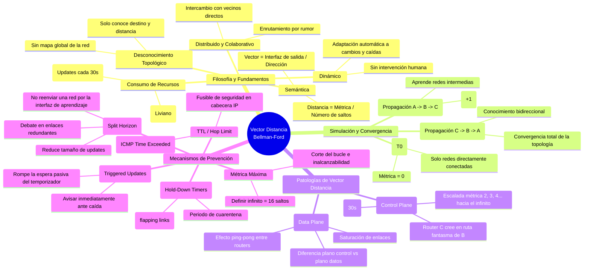

---

## 1. Contextualización y Enfoque de la Clase `[12:59 - 15:43]`

La docente retoma la sesión recordando la ubicación temática en la materia: estamos en la **Unidad 4 (Encaminamiento)** dentro de la **Capa de Internet** de la arquitectura TCP/IP.

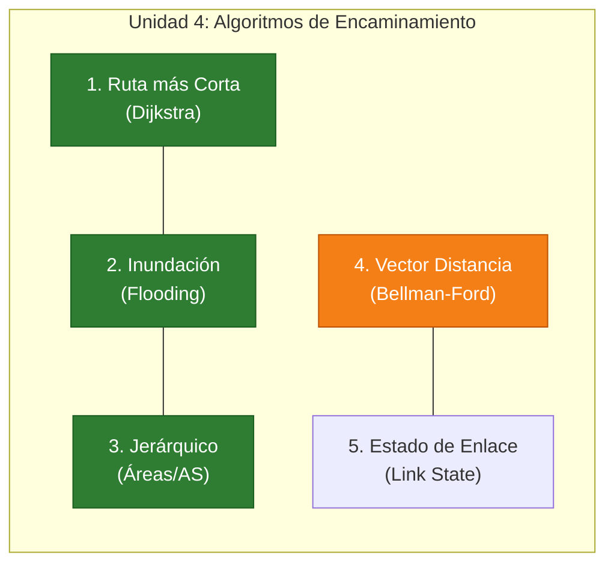

> [!NOTE] Aclaración Metodológica de la Docente
> *"En la clase anterior estudiamos los tres primeros algoritmos: la ruta más corta de Dijkstra, la inundación y el encaminamiento jerárquico. Hoy nos enfocaremos en **Vector Distancia** y **Estado de Enlace**.
> Los estudiamos de forma totalmente individual para comprender la lógica pura de cada uno. Sin embargo, en los protocolos reales de Internet (como veremos más adelante) muchos de estos algoritmos coexisten o se combinan simultáneamente dentro de un mismo protocolo."*

---

## 2. Fundamentos y Filosofía del Algoritmo de Vector Distancia `[15:43 - 30:27]`

### 2.1. Naturaleza del Algoritmo: Dinámico y Distribuido

Vector Distancia se define conceptualmente bajo dos pilares:

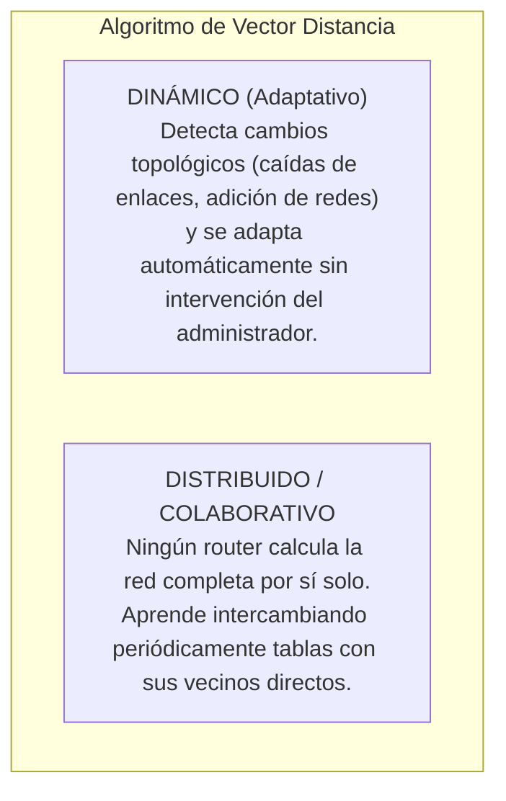

- **Dinámico:** *"El administrador de red se puede ir de vacaciones tranquilamente. Si se agrega una red o se cae un enlace, los routers detectan el cambio y recalculan las rutas de forma autónoma."*
- **Distribuido / Colaborativo:** *"Es como si ustedes supieran sobre un tema, se lo enseñan a sus compañeros de al lado, ellos a otros, y al final entre todos construyen el conocimiento completo."*

### 2.2. Descomposición Semántica del Nombre

| Componente | Significado Conceptual | Implementación Técnica en la Tabla de Enrutamiento |
| :--- | :--- | :--- |
| **Vector** | **Dirección** (hacia dónde enviar el paquete) | **Interfaz de salida** del router (ej. `Serial 0`, `GigabitEthernet 0/1`) o IP del siguiente salto (*Next-Hop*). |
| **Distancia** | **Costo / Métrica** (qué tan lejos se encuentra la red) | Cantidad de routers a atravesar (**número de saltos / hop count**). |

> [!IMPORTANT] Criterio de Selección de Rutas
> Ante la existencia de múltiples caminos posibles hacia un mismo destino (típico en topologías en malla), Vector Distancia **únicamente instala en la tabla la mejor ruta** (la de menor distancia / menor número de saltos). Las rutas alternativas peores se descartan.

### 2.3. Actualizaciones Periódicas (*Routing Updates*) y *Keepalive*

- Los routers intercambian sus tablas completas a intervalos regulares (por defecto, **cada 30 segundos** en RIP).
- **Función de supervisión (Liveness / Keepalive):** Si un router deja de enviar sus actualizaciones durante un tiempo prudencial (ej. 90 a 180 segundos), sus vecinos deducen que el router o enlace se cayó y dan de baja esas redes de sus tablas.
- **Analogía docente del aula virtual:** *"Es como si yo les pidiera que cada 2 minutos pongan 'acá estoy' en el chat. Si pasan los 2 minutos y un alumno no escribe, asumo que perdió conectividad y lo tacho de la lista de presentes."*

### 2.4. La Gran Debilidad: Desconocimiento de la Topología Global

A diferencia de los algoritmos de Estado de Enlace, un router en Vector Distancia **no tiene el mapa de la red**:

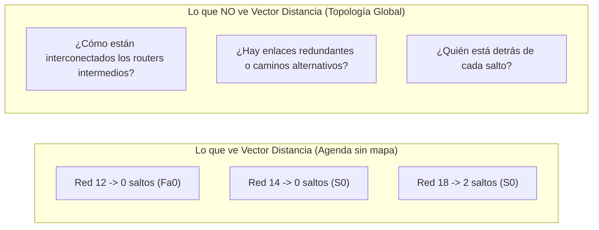

> [!QUOTE] Analogía Docente: La libreta de direcciones vs. Google Maps
> *"Es exactamente como tener en su casa un papelito que dice: 'Facultad: 4 km', 'Paseo del Jockey: 6 km', 'Nuevo Centro Shopping: 7 km'. Tienen anotado el destino y los kilómetros, pero **no tienen Google Maps**. Al no tener el mapa de la ciudad, si hay un desvío o una calle cortada, pueden desorientarse completamente y empezar a manejar en círculos. 
> Eso mismo le pasa al router: al no conocer la topología de la red, ante cualquier cambio puede interpretar mal la información y generar **bucles de encaminamiento (loops)**."*

### 2.5. Convergencia Lenta: "Enrutamiento por Rumor" (*Routing by Rumor*)

El intercambio se produce exclusivamente salto a salto entre routers adyacentes:
- El router A le cuenta a su vecino B; B procesa, actualiza su tabla y en el siguiente ciclo le cuenta a C; C le cuenta a D.
- **Analogía del teléfono descompuesto:** *"Imagínense que entre los 46 alumnos que estamos conectados, yo le digo una frase al oído a Lucas, Lucas se la susurra a Bruno, Bruno a Facundo, y así sucesivamente hasta llegar al alumno 46. Demora muchísimo tiempo y el mensaje final llega distorsionado. Eso es el enrutamiento por rumores: **converge muy lentamente**."*

### 2.6. Consumo de Recursos: Hardware vs. Ancho de Banda

| Recurso | Nivel de Consumo | Causa Técnica |
| :--- | :--- | :--- |
| **CPU del Router** | 🟢 **Muy Bajo** | El algoritmo de cálculo (**Bellman-Ford / Ford-Fulkerson**) es extremadamente simple y liviano. No requiere procesadores potentes ni grandes memorias RAM. |
| **Memoria RAM** | 🟢 **Muy Bajo** | Solo almacena una tabla resumida con mejores rutas; no requiere bases de datos topológicas completas. |
| **Ancho de Banda de los Enlaces** | 🔴 **Alto** | Difunde periódicamente (cada 30 s) la **tabla completa de enrutamiento** por todos los enlaces activos, compitiendo con el tráfico de usuario. |

### 2.7. Métricas Simples vs. Métricas Compuestas

- **Métrica Clásica (RIP):** Conteo estricto de saltos (*hops*). Si una ruta tiene 2 saltos y otra 4 saltos, se elige la de 2, sin importar el ancho de banda ni el retardo.
- **Métricas Compuestas (IGRP / EIGRP de Cisco):** Combinan múltiples factores mediante funciones matemáticas ponderadas:
  $$\text{Métrica} = f(\text{Ancho de Banda}, \text{Retardo}, \text{Confiabilidad}, \text{Carga}, \text{Longitud de Cola})$$
  *(Analogía docente: Elegir una calle no solo por los kilómetros, sino porque esté asfaltada, bien iluminada, sin pozos y con poco tráfico).*

---

## 3. Simulación Práctica: Topología, Estado Inicial y Convergencia `[30:27 - 43:30]`

### 3.1. Topología de Estudio

La docente plantea un escenario lineal de 3 routers y 4 redes:

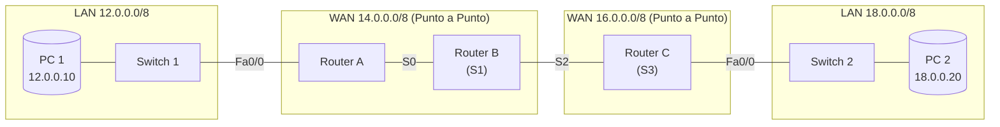

- **Interfaces FastEthernet (Fa):** Conectan a redes de difusión (*broadcast* / LAN).
- **Interfaces Seriales (S):** Conectan a enlaces WAN punto a punto.

### 3.2. Router vs. Switch: ¿Cómo nace un Router de Fábrica?

> [!NOTE] Intervención Pedagógica: La "inutilidad" inicial del Router
> - **El Switch:** Se enchufa y funciona de inmediato (Plug & Play, no tiene botón de encendido). Aprende automáticamente las direcciones MAC por autoaprendizaje al recibir tramas.
> - **El Router:** De fábrica es "totalmente inútil". Requiere que el administrador configure manualmente las direcciones IP, máscaras en cada interfaz y levante el puerto con `no shutdown`.
> - **¿Por qué las tablas guardan Redes y no Hosts?** Alumno **Matías** responde correctamente: Si detrás de un switch hay 200 PCs, tener 200 entradas en la tabla de enrutamiento saturaría la memoria del router y ralentizaría la búsqueda. Al guardar un único renglón para la **dirección de red** (ej. `12.0.0.0/8`), el router procesa millones de destinos con una sola entrada.

---

### 3.3. Estado Inicial (T0): Redes Directamente Conectadas

Apenas el administrador asigna IPs y levanta las interfaces, cada router registra únicamente sus redes directamente adyacentes con **Métrica = 0** (*Lorenzo responde: "0 saltos porque no hay que cruzar ningún router"*).

#### Tablas en T0:

| Router A (T0) | | |
| :--- | :---: | :---: |
| **Red Destino** | **Métrica** | **Interfaz** |
| `12.0.0.0/8` | 0 | `Fa0` |
| `14.0.0.0/8` | 0 | `S0` |

| Router B (T0) | | |
| :--- | :---: | :---: |
| **Red Destino** | **Métrica** | **Interfaz** |
| `14.0.0.0/8` | 0 | `S1` |
| `16.0.0.0/8` | 0 | `S2` |

| Router C (T0) | | |
| :--- | :---: | :---: |
| **Red Destino** | **Métrica** | **Interfaz** |
| `16.0.0.0/8` | 0 | `S3` |
| `18.0.0.0/8` | 0 | `Fa0` |

> [!WARNING] Estado de Incomunicación en T0
> Si la PC `12.0.0.10` intenta enviar un paquete a la PC `18.0.0.20`:
> 1. El paquete llega al Router A.
> 2. Router A busca la red `18.0.0.0/8` en su tabla: **no existe coincidencia**.
> 3. Router A **descarta el paquete** y el protocolo auxiliar **ICMP** genera un mensaje de error: `Destination Unreachable` (Destino Inalcanzable - Red Desconocida).

---

### 3.4. Ronda 1 de Actualizaciones (T1): Propagación de Izquierda a Derecha

Se activa el protocolo de enrutamiento y comienzan a circular las actualizaciones periódicas:

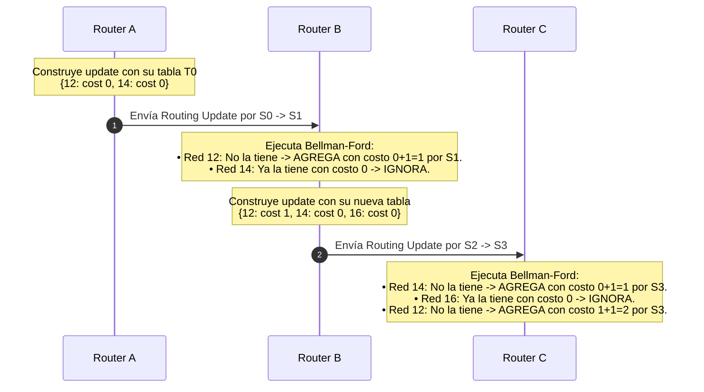

#### Tablas al finalizar la Ronda 1 (T1):

| Router A (T1) | | |
| :--- | :---: | :---: |
| **Red** | **Métrica** | **Int** |
| `12.0.0.0/8` | 0 | `Fa0` |
| `14.0.0.0/8` | 0 | `S0` |
| *(Aún desconoce 16 y 18)* | — | — |

| Router B (T1) | | |
| :--- | :---: | :---: |
| **Red** | **Métrica** | **Int** |
| `14.0.0.0/8` | 0 | `S1` |
| `16.0.0.0/8` | 0 | `S2` |
| `12.0.0.0/8` | **1** | `S1` |
| *(Aún desconoce 18)* | — | — |

| Router C (T1) | | |
| :--- | :---: | :---: |
| **Red** | **Métrica** | **Int** |
| `16.0.0.0/8` | 0 | `S3` |
| `18.0.0.0/8` | 0 | `Fa0` |
| `14.0.0.0/8` | **1** | `S3` |
| `12.0.0.0/8` | **2** | `S3` |

> [!IMPORTANT] ¿La red ya convergió?
> **No.** El alumno **Matías** observa que la información fluyó en un solo sentido. Router C sabe cómo llegar a la Red 12, pero Router A y Router B aún no tienen la menor idea de cómo llegar a la Red 18. Para que haya convergencia, la información debe viajar en sentido opuesto.

---

### 3.5. Ronda 2 de Actualizaciones (T2): Propagación de Derecha a Izquierda y Convergencia

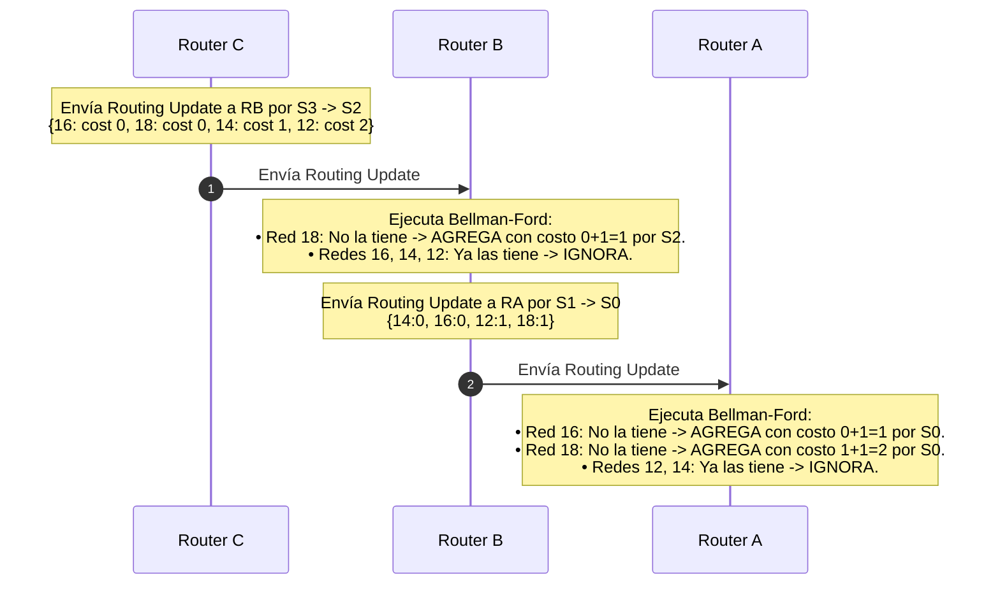

#### Estado Final Convergente (T2):

| Router A (Convergente) | | |
| :--- | :---: | :---: |
| **Red** | **Métrica** | **Int** |
| `12.0.0.0/8` | 0 | `Fa0` |
| `14.0.0.0/8` | 0 | `S0` |
| `16.0.0.0/8` | **1** | `S0` |
| `18.0.0.0/8` | **2** | `S0` |

| Router B (Convergente) | | |
| :--- | :---: | :---: |
| **Red** | **Métrica** | **Int** |
| `14.0.0.0/8` | 0 | `S1` |
| `16.0.0.0/8` | 0 | `S2` |
| `12.0.0.0/8` | **1** | `S1` |
| `18.0.0.0/8` | **1** | `S2` |

| Router C (Convergente) | | |
| :--- | :---: | :---: |
| **Red** | **Métrica** | **Int** |
| `16.0.0.0/8` | 0 | `S3` |
| `18.0.0.0/8` | 0 | `Fa0` |
| `14.0.0.0/8` | **1** | `S3` |
| `12.0.0.0/8` | **2** | `S3` |

> [!TIP] Definición de Convergencia
> Una red se encuentra en **estado convergente** cuando todos y cada uno de los routers tienen una visión coherente y completa de cómo alcanzar todas las redes de la topología. A partir de este momento, es posible la comunicación bidireccional de cualquier host contra cualquier otro host.

---

## 4. El Gran Problema: Conteo al Infinito (*Count to Infinity*) `[43:30 - 51:26]`

¿Qué sucede si una red falla? La combinación de **actualizaciones periódicas lentas** y la **falta de conocimiento topológico global** desencadena la patología clásica de Bellman-Ford.

### 4.1. La Falla y el Desfase Temporal de los Temporizadores

1. La interfaz `Fa0/0` de **Router C se cae** (`shutdown`), desconectando a la Red 18.
2. Router C detecta inmediatamente la caída local y **elimina la Red 18 de su tabla**.
3. **El problema del temporizador:** Router C había enviado su actualización periódica hace apenas 10 segundos. Por diseño, debe esperar **20 segundos más** hasta que venza el ciclo de 30 segundos para anunciar novedades. Se queda en silencio.
4. En ese intervalo, a **Router B** se le cumple su propio cronómetro de 30 segundos y envía su actualización periódica hacia Router C. Como nadie le avisó nada, B todavía tiene anotado: `Red 18 -> Métrica 1 por S2`.

```mermaid
flowchart LR
    subgraph Falla["1. Caída de Red 18"]
        RC["Router C"] --x|"CAE INTERFAZ"| R18["Red 18.0.0.0/8"]
    end
    subgraph Error["2. Error de Percepción"]
        RB["Router B<br>(Desinformado)"] -->|"Update: Red 18 Métrica=1"| RC
        RC -->|"Cree que B tiene OTRA ruta a la 18"| RC
    end
```

### 4.2. La Interpretación Errónea de Router C

- Router C recibe la tabla de B que ofrece la Red 18 con métrica 1 por la interfaz `S3`.
- Como Router C **no tiene el mapa de la topología**, piensa:
  > *"¡Qué suerte! Mi conexión directa a la Red 18 murió, pero Router B me dice que él puede llegar a la 18 con costo 1. Seguro hay un enlace alternativo por otro camino de la red que yo no veo."*
- Router C re-instala la Red 18 en su tabla con métrica incrementada:
  $$\text{Métrica en C} = 1 + 1 = \mathbf{2} \quad (\text{por interfaz } S3)$$

### 4.3. La Escalada Métrica (Realimentación Positiva)

```mermaid
sequenceDiagram
    autonumber
    participant RB as Router B
    participant RC as Router C

    Note over RC: Red 18 cae. C la borra de su tabla.<br>Espera pasivo 20s para su próximo update.
    RB->>RC: Update periódico: {Red 18: costo 1}
    Note over RC: C le cree a B:<br>Re-instala Red 18 con costo 1+1 = 2 por S3.
    Note over RC: Pasan los 20s. Le toca transmitir a C.
    RC->>RB: Update periódico: {Red 18: costo 2}
    Note over RB: B aprendió la 18 originalmente de C.<br>Al ver que C subió a 2, B actualiza: 2+1 = 3 por S2.
    RB->>RC: Siguiente ciclo: Update {Red 18: costo 3}
    Note over RC: C actualiza: 3+1 = 4 por S3.
    RC->>RB: Siguiente ciclo: Update {Red 18: costo 4}
    Note over RB: B actualiza: 4+1 = 5 por S2...
    Note over RB,RC: La métrica tiende al INFINITO (Conteo al Infinito)
```

### 4.4. La Solución al Conteo al Infinito: Métrica Máxima (Infinito = 16)

Para evitar que los routers cuenten indefinidamente ($1, 2, 3, \dots, 50, 100, 1000$), el protocolo RIP impone un límite superior estricto:
- **Definición de Infinito:** Se fija en **16 saltos**.
- Cuando la métrica de una ruta asciende y alcanza el valor **16**, el router la declara automáticamente como **Inalcanzable (*Unreachable*)**.
- La ruta inalcanzable se purga de la tabla de enrutamiento y se suspende el reenvío, cortando el ciclo de conteo.

---

## 5. Bucle en el Plano de Datos (*Data Plane Loop*) `[51:26 - 57:48]`

La docente hace una distinción conceptual crítica:
- **Plano de Control:** El intercambio de tablas de enrutamiento y la escalada métrica que vimos recién.
- **Plano de Datos:** El tráfico real de los usuarios (páginas web, correos, streaming, PDFs, paquetes de voz).

### 5.1. Comparación Bit a Bit según la Máscara de Red

Cuando un router recibe un paquete IP de datos, des-encapsula hasta la Capa de Internet (Capa 3) y extrae la **IP Destino**:
- El alumno **Luis** interviene recordando el rol de la **máscara de red**.
- El router no compara los 32 bits completos de la dirección contra direcciones de PCs individuales. Aplica una operación lógica con la máscara (en este ejemplo `/8`, compara los primeros 8 bits). Al coincidir con la entrada de red `18.0.0.0`, selecciona la interfaz de salida correspondiente.

### 5.2. La Trampa del Bucle Mortal (Efecto Ping-Pong)

Mientras la red se encuentra en el estado de inconsistencia (Router B apunta a C y Router C apunta a B para la Red 18), un host de la Red 12 envía un paquete destinado a `18.0.0.15`:

```mermaid
sequenceDiagram
    autonumber
    actor PC1 as PC 1 (12.0.0.10)
    participant RA as Router A
    participant RB as Router B
    participant RC as Router C

    PC1->>RA: Envía paquete IP a 18.0.0.15
    Note over RA: Tabla: Red 18 -> sale por S0
    RA->>RB: Reenvía por S0
    Note over RB: Tabla: Red 18 -> sale por S2 hacia RC
    RB->>RC: Reenvía por S2 -> S3
    Note over RC: Tabla (errónea): Red 18 -> sale por S3 hacia RB
    RC->>RB: Reenvía por S3 -> S2
    Note over RB: Tabla: Red 18 -> sale por S2 hacia RC
    RB->>RC: Reenvía por S2 -> S3
    Note over RC: Tabla: Red 18 -> sale por S3 hacia RB
    RC-->>RB: Reenvía por S3 (Ping-Pong infinito...)
```

- El paquete queda atrapado en un **bucle cerrado (loop)** rebotando entre B y C.
- Consume ancho de banda del enlace serial y ciclos de CPU de ambos routers.

### 5.3. El TTL como Mecanismo de Contención (Fusible)

Los alumnos **Leila** y **Ariel** recuerdan el mecanismo de control de la cabecera IP:
- **Campo TTL (*Time To Live*) en IPv4 / *Hop Limit* en IPv6:**
  - Cada vez que un router conmuta el paquete, decrementa el valor de TTL en 1.
  - Cuando el TTL llega a **0**, el router en posesión del paquete lo **descarta** de inmediato.
  - Se genera un paquete ICMP `Time Exceeded` (Tipo 11, Código 0) notificando al emisor.
- **Conclusión Docente:** El TTL **no soluciona ni previene el bucle**; actúa como un **fusible** de emergencia para que los paquetes huérfanos no saturen Internet eternamente.

---

## 6. Mecanismos de Prevención y Mitigación de Bucles `[57:48 - 1:11:35]`

Para resolver de raíz la formación de bucles y la lenta convergencia de Vector Distancia, se implementan cuatro técnicas complementarias:

```mermaid
flowchart TD
    subgraph Tecnicas["Mecanismos Anti-Bucle en Vector Distancia"]
        T1["1. Horizonte Dividido<br>(Split Horizon)"] --- T2["2. Actualizaciones Disparadas<br>(Triggered Updates)"]
        T3["3. Temporizadores de Espera<br>(Hold-Down Timers)"] --- T4["4. Métrica Máxima / TTL<br>(Infinito=16 y Hop Limit)"]
    end
```

---

### 6.1. Horizonte Dividido (*Split Horizon*) `[58:22 - 1:04:40]`

> [!IMPORTANT] Regla de Oro del Horizonte Dividido
> **Si un router aprende información sobre una red a través de una determinada interfaz, NUNCA debe volver a enviar información sobre esa misma red por esa misma interfaz.**

```mermaid
flowchart LR
    subgraph SinSplit["Sin Split Horizon (Peligro de Loop)"]
        RC1["Router C"] -->|"Enseña Red 18"| RB1["Router B"]
        RB1 -.->|"Vuelve a mandar Red 18<br>(Información redundante y peligrosa)"| RC1
    end
    subgraph ConSplit["Con Split Horizon (Correcto)"]
        RC2["Router C"] -->|"Enseña Red 18 por S2"| RB2["Router B"]
        RB2 --x|"BLOQUEADO por S2:<br>Prohibido anunciar Red 18 por donde la aprendió"| RC2
        RB2 -->|"Anuncia Red 18 hacia la IZQUIERDA (S1 / Router A)"| RA2["Router A"]
    end
```

> [!QUOTE] Analogía Docente: La noticia de Lucas
> *"Si el alumno Lucas me dice por chat privado: 'Profe, estoy feliz', no tiene ningún sentido que yo me dé vuelta y le mande un mensaje a Lucas diciéndole: 'Lucas, te aviso que estás feliz'. ¡Él fue quien me lo enseñó a mí!
> Si Router B aprendió la existencia de la Red 18 a través de Router C por la interfaz Serial 2, Router B jamás debe incluir a la Red 18 en las actualizaciones que envía hacia Router C por esa interfaz."*

#### Beneficio Doble de Split Horizon:
1. **Eliminación del Bucle:** Cuando la Red 18 cae, Router C no recibe ninguna actualización falsa de Router B sobre la Red 18. Router C jamás reinstalará la ruta fantasma y la métrica no entrará en conteo al infinito.
2. **Optimización del Ancho de Banda:** Las actualizaciones son selectivas y mucho más compactas. En lugar de mandar la tabla completa de 4 renglones por todos lados:
   - Hacia Router A (por `S1`), B solo anuncia las redes `16` y `18`.
   - Hacia Router C (por `S2`), B solo anuncia las redes `12` y `14`.

---

### 6.2. Debate en Clase: Horizonte Dividido en Topologías Redundantes `[1:04:40 - 1:09:30]`

Los alumnos **Facundo**, **Luis** y **Ariel** plantean un escenario desafiante:
- *¿Qué sucede si conectamos un enlace redundante o cable alternativo entre Router B y el switch de la Red 18 cuando se cae el enlace de C?*
- El debate técnico profundiza en cómo opera el algoritmo en el router:
  - La tabla interna almacena no solo la red y la métrica, sino también la **interfaz de procedencia / aprendizaje**.
  - Si la red se aprende por una interfaz física diferente (ej. una nueva conexión FastEthernet `Fa0`), se trata de un registro distinto, por lo que Split Horizon no bloquearía el anuncio hacia las otras interfaces.
  - Sin embargo, en topologías en malla complejas con múltiples caminos redundantes, el Split Horizon simple a veces puede retrasar la adopción de caminos alternativos válidos, razón por la cual existen variantes como **Split Horizon con Envenenamiento de Ruta (*Poison Reverse*)**, donde en lugar de omitir la red, se la publica explícitamente con métrica infinita (16) para envenenar rutas circulares.
  - La docente concluye que Split Horizon es una directiva **configurable por software** por el administrador (`ip split-horizon` en Cisco IOS), quien evalúa la conveniencia según el diseño topológico.

---

### 6.3. Actualizaciones Disparadas por Eventos (*Triggered Updates*) `[1:09:30 - 1:10:32]`

- **Diagnóstico del problema:** En la simulación original, cuando la Red 18 cayó, Router C esperó pasivamente durante 20 segundos a que venciera su temporizador periódico habitual de 30 segundos. Esa ventana de silencio permitió que Router B transmitiera desinformado.
- **Principio de Solución:**
  > En el instante exacto en que una interfaz cambia de estado (caída de enlace / enlace levantado), el router **ignora el temporizador periódico** y genera de forma inmediata un paquete de actualización extraordinario (*Triggered Update*) que irradia a todos sus vecinos.
- Al notificar la caída en cuestión de milisegundos, todos los routers retiran la ruta de sus tablas antes de que se produzcan inconsistencias temporales.

---

### 6.4. Temporizadores de Espera (*Hold-Down Timers*) `[1:10:32 - 1:11:35]`

- **Problema de los enlaces inestables (*Flapping Links*):**
  - Si un enlace sufre microcortes intermitentes (se apaga y se enciende repetidamente cada 2 segundos), emitir *Triggered Updates* constantes provocaría una tormenta de paquetes de control e inestabilidad generalizada en toda la red.
- **Funcionamiento del Hold-Down Timer:**
  - Cuando un router recibe la noticia de que una red ha caído o que su métrica empeoró drásticamente, coloca esa entrada en estado de **cuarentena / espera (*Hold-Down*)**.
  - Durante este intervalo de tiempo (típicamente 180 segundos en RIP), el router:
    1. Sigue reenviando paquetes por la ruta previa si aún está disponible.
    2. **Ignora cualquier nueva actualización que ofrezca esa misma red con una métrica igual o peor**.
    3. Solo aceptará una actualización si proviene de un vecino que demuestre una métrica estrictamente mejor o si vence el temporizador, dando tiempo a que la topología física se estabilice completamente.

> [!TIP] Los 4 Temporizadores Clásicos de RIP
> La docente concluye mencionando que los protocolos de Vector Distancia manejan cuatro temporizadores coordinados:
> 1. **Update Timer (30 s):** Frecuencia de envío de actualizaciones periódicas.
> 2. **Invalid Timer (180 s):** Tiempo sin recibir noticias de una red antes de considerarla inalcanzable (métrica 16).
> 3. **Hold-Down Timer (180 s):** Tiempo de cuarentena ante noticias de caída para filtrar microcortes.
> 4. **Flush Timer (240 s):** Tiempo total tras el cual una ruta inactiva es definitivamente purgada de la tabla RAM.

---

## 7. Cuadro Sinóptico de Cierre `[1:11:30 - 1:11:35]`

| Mecanismo | Nivel en que Opera | Problema que Resuelve | ¿Cómo lo Resuelve? |
| :--- | :--- | :--- | :--- |
| **Métrica Máxima (Infinito = 16)** | Plano de Control | Conteo infinito de saltos | Trunca el bucle numérico al alcanzar 16 saltos y declara la red inalcanzable. |
| **TTL / Hop Limit** | Plano de Datos | Saturación indefinida de paquetes en loops | Fusible de descarte: decrementa en cada salto; al llegar a 0 se elimina el paquete. |
| **Horizonte Dividido (Split Horizon)** | Plano de Control | Bucles mutuos entre routers vecinos | Prohíbe anunciar una red por la misma interfaz por la que fue aprendida. |
| **Actualizaciones Disparadas (Triggered Updates)** | Plano de Control | Ventana de desinformación por timers de 30s | Genera y envía un update al instante exacto de ocurrir una falla o cambio. |
| **Temporizadores de Espera (Hold-Down Timers)** | Plano de Control | Tormentas de actualización por microcortes (*flapping*) | Bloquea cambios desfavorables sobre una red durante un periodo de cuarentena. |

> [!NOTE] Cierre de la Clase
> La docente verifica la comprensión integral del auditorio (*"¿Se entendió el algoritmo de Vector Distancia, cómo funciona, el conteo al infinito y cómo se previenen los bucles?"*). Los alumnos confirman su asimilación unánime en el chat y micrófonos (*"Sí se entiende profe"*), concluyendo la clase teórica. La próxima sesión estará dedicada a analizar el **Algoritmo de Estado de Enlace (Link State)** y los protocolos específicos de Internet (**RIP** y **OSPF**).


# Transcripcion 3
2:50

2 minutos y 50 segundos

bien o no que vimos antes que nada si se está escuchando bien la pregunta desde

2:56

2 minutos y 56 segundos

siempre pero bueno lo importante si se escucha bien profe bueno yo tengo registrado que habíamos

3:06

3 minutos y 6 segundos

llegado hasta el algoritmo de vector distancia voy a poner la diapositiva anterior acá

3:12

3 minutos y 12 segundos

todo esto hay hasta llegado no todo el tiempo de verdad

3:20

3 minutos y 20 segundos

el vídeo yo tengo nosotros haremos terminado puede ser que arrancamos de alguien se

3:27

3 minutos y 27 segundos

acuerda me libre tengo no todo está ahí por eso pregunto por las dudas si me parece que sí pero vamos a ir sí que habían

3:36

3 minutos y 36 segundos

problemas se acuerden que tienen inconvenientes los algoritmos de vector distancia vimos las diferentes soluciones

3:43

3 minutos y 43 segundos

bueno entonces lo que vamos a grabar

3:50

3 minutos y 50 segundos

[Música]

3:51

3 minutos y 51 segundos

ustedes ven mi mouse o no porque ayer me dijeron que no lo veían los alumnos de otro curso no ven es nuevo mientras vivamos

4:02

4 minutos y 2 segundos

y si tengo que hacer blanco porque se abren con fondo un poco pero se puede cambiar

4:10

4 minutos y 10 segundos

el puntero en el orificio por eso personal se lo cambie pero también me interesa que ustedes lo vean porque yo voy a veces señalando a alguien si usted

4:19

4 minutos y 19 segundos

no ven el mouse se aburren la parte de ficción no mueve nada ahí pongo a grabar

4:26

4 minutos y 26 segundos

bueno entonces

4:28

4 minutos y 28 segundos

[Música]

4:30

4 minutos y 30 segundos

vamos a comer el puntero y ahora cómo ponerlo del puntero cool pp

4:40

4 minutos y 40 segundos

[Música]

4:41

4 minutos y 41 segundos

abajo la izquierda nos salen unas herramientas cuando pasas el mouse profe

4:55

4 minutos y 55 segundos

a través de estos puntos lo hicimos

5:04

5 minutos y 4 segundos

más bueno

5:16

5 minutos y 16 segundos

y no lo encuentro acá opciones de puntero

5:27

5 minutos y 27 segundos

estar viendo un circuito rojo así

5:36

5 minutos y 36 segundos

bueno vamos a empezar por fin entonces habíamos llegado hasta el algoritmo de vector distancia la clase pasado lo que nos completo hoy vamos a empezar a ver

5:45

5 minutos y 45 segundos

el algoritmo de estado de enlace que el otro algoritmo que se está usando en la actualidad qué características

5:53

5 minutos y 53 segundos

tiene este algoritmo como es un algoritmo que surgió después del vector distancia se solucionan todos los

6:00

6 minutos

problemas que vimos las pasadas como es algo nuevo uno cuando desarrolla nuevo obviamente que incorpora mejoras y estas

6:09

6 minutos y 9 segundos

son las características que vamos a ver de este algoritmo primero es un algoritmo dinámico distribuido ese propio ya lo sabemos

6:17

6 minutos y 17 segundos

bien no hace falta aclarar lo que es dinámico lo que es distribuido el que se usa actualmente en internet porque como decíamos recién soluciona

6:25

6 minutos y 25 segundos

todos los problemas que tenía el algoritmo de vector distancia no entonces el que se usa actualmente

6:32

6 minutos y 32 segundos

cuente cuáles eran las causas por las cuales se producen tantos problemas en el algoritmo vector distancia el no conocer la topología de la red acá

6:40

6 minutos y 40 segundos

entonces para que no se produzcan bucles con loops lo que se hace es que el algoritmo permite conocer toda la

6:48

6 minutos y 48 segundos

topología de la red y ya vamos a ver cómo lo logra y otra característica es como que al ver este algoritmo lo vamos a ir comparando

6:56

6 minutos y 56 segundos

con el vector distancia todo el tiempo en el vector distancia la actualización general periódica así cada 30 segundos

7:04

7 minutos y 4 segundos

por ejemplo acá no hasta las actualizaciones no son periódicas para no consumir ancho de banda y tiempo de procesamiento de los routers sino que se

7:12

7 minutos y 12 segundos

generan actualizaciones solamente con hay algún cambio o alguna una caída de la red o algún alta de una re nueva es

7:19

7 minutos y 19 segundos

decir algún cambio en la topología ahí es donde se genera una actualización y se envía a todos los routers eso hace

7:26

7 minutos y 26 segundos

que se aprovecha mejor el ancho de banda de los enlaces como todo lo que brilla es oro este

7:34

7 minutos y 34 segundos

algoritmo inconveniente que tiene es que consume muchos mucho hardware del router necesita tiempo pero tenga mucha memoria

7:41

7 minutos y 41 segundos

y mucha capacidad de procesamiento porque vamos a ver que implemente la misma del extra

7:51

7 minutos y 51 segundos

bueno por consumir algo de existencia acordar en el algoritmo de la ruta más corta que vimos de hecho este algoritmo

8:00

8 minutos

vamos a ver que implementa varios de los que ya vimos es como es como si fuera la unión de varios algoritmos en nosotros

8:08

8 minutos y 8 segundos

estamos viendo que implementa el algoritmo de la ruta más corta para calcular el mejor cambio gracias que conoce la topología de la

8:17

8 minutos y 17 segundos

red no presenta bucles es decir jamás se va a producir un bucle es como si estuviera en un mapa para para dirigirse

8:25

8 minutos y 25 segundos

de un punto a otro en la ciudad se manejarán con un mapa teniendo un mapa nunca van a dar vueltas por qué y por qué están viendo por dónde vamos sí

8:33

8 minutos y 33 segundos

entonces gracias a que se conoce la topología se evitan los puzzles eso es muy importante y otra característica muy

8:41

8 minutos y 41 segundos

importante que convergió rápidamente es decir que si cada vez que se produce alguna actualización algún cambio en la topología

8:49

8 minutos y 49 segundos

los routers construyen esa actualización y la inundan a la red el resto de rutas de hecho de inundar los hace que esa

8:58

8 minutos y 58 segundos

información llegue lo más rápida posible entonces no hay y para cuando llegue esa actualización

9:05

9 minutos y 5 segundos

los routers de nuevo calculan la ruta más corta simplemente en el algoritmo de texto y actualizan sus tablas de entrenamiento

9:13

9 minutos y 13 segundos

esto es beneficioso porque si ustedes se acuerdan en el algoritmo de vector distancia de la clase pasada se produjo el problema del bucle luke porque el

9:22

9 minutos y 22 segundos

router se le cayó una red y me parece para la radiación que una red lan y como no le toca vender la actualización

9:30

9 minutos y 30 segundos

determina miento entonces espero el tiempo que le correspondía y el router vecino le informó erróneamente cómo

9:38

9 minutos y 38 segundos

llegar a la red 18 sí o sea una mala interpretación por parte de ruta eso se evita acá porque la red converge

9:45

9 minutos y 45 segundos

rápidamente entonces no hay malas interpretaciones la métrica que usa y no es el número de

9:54

9 minutos y 54 segundos

saltos sino que como hoy en día en internet todos los enlaces son de diferente velocidad es decir que cada

10:01

10 minutos y 1 segundo

enlace tiene su propio ancho de banda a veces se atraviesan por ejemplo 10 rutas pero si llega mucho más rápido que por otro

10:10

10 minutos y 10 segundos

camino donde se atraviesen solo cinco rutas porque bueno porque los 10 reuters están conectados con el enlace de altísima velocidad entonces para elegir

10:18

10 minutos y 18 segundos

el camino más rápido en lugar de el más corto en cuanto a la cantidad de saltos la métrica que usa es el costo de los

10:27

10 minutos y 27 segundos

enlaces eso sería el ancho de banda de los enlaces ahora ellos dejan una pregunta siempre siempre se elige la

10:35

10 minutos y 35 segundos

ruta con menor costo menor métrica y la más corta siempre la menor eso determina el algoritmo del extra

10:44

10 minutos y 44 segundos

como haríamos o como les parece que podría hacer el algoritmo para pasear de un punto a otro

10:50

10 minutos y 50 segundos

que elija el camino más rápido que va a tener mayor ancho de banda cuando en realidad ese número le va a dar un

10:58

10 minutos y 58 segundos

número más grande es decir que me va a elegir el camino con menor ancho de banda porque el acorde más siempre elige el menor como lo podríamos engañar al

11:07

11 minutos y 7 segundos

algoritmo a ver no se vació profe tipo uno sobre ancho de banda a perfecto muy bien ya se la he dicho no no me acordaba es el habíamos visto exacto muy bien

11:16

11 minutos y 16 segundos

entonces la métrica es el cociente es decir en real es un ancho de banda de referencia que se llama en el numerador

11:23

11 minutos y 23 segundos

y en el denominador buen ancho de banda del enlace real eso hace que haya mayor denominado menor me da el número entonces yo puedo elegir la ruta más

11:31

11 minutos y 31 segundos

rápida siempre que va a ser la que tengan menor mal perfecto ya lo habíamos visto qué hace el algoritmo vamos a ver que

11:40

11 minutos y 40 segundos

construye paquetitos de estado de enlace se llama y se las van a intercambiar que serían actualizaciones se las van a

11:48

11 minutos y 48 segundos

intercambiar entre todos los routers con esos routers cuando reciben que esas actualizaciones van a construir una base de datos topológicas todos los routers

11:57

11 minutos y 57 segundos

van a tener la misma información o sea que todos rutas van a tener la misma base de datos con esa base de datos y el algoritmo lo

12:07

12 minutos y 7 segundos

que hace es armar un grafo de la red bueno les cuento yo armo un grafo de la red y ahí va a ejecutar este algoritmo

12:15

12 minutos y 15 segundos

the distance y para calcular el camino más corto en todos los posibles que hacen en esa topología y con eso va a

12:22

12 minutos y 22 segundos

armar su tabla de encaminamiento ahora vamos a ver que este algoritmo tiene pasos y vamos a ver cómo funciona

12:29

12 minutos y 29 segundos

es mucho más sencillo que el vector distancia visite se va a entender bien no tiene problema

12:37

12 minutos y 37 segundos

de luxe no tiene control infinito nada de esas cosas dadas porque un alumno posterior entonces como es más nuevo con

12:44

12 minutos y 44 segundos

picor e igual que se acuerde 1.016 y el protocolo que deseáis corrigió todos los posibles problemas que tenía élite de cuatro bueno acá pasa lo mismo este

12:53

12 minutos y 53 segundos

algoritmo y corrige mejor a todos los inconvenientes del algoritmo de vector distancia cuáles son los pasos primero un router

13:01

13 minutos y 1 segundo

cuando vote a cuando se inicia lo primero que hace es descubrir cuáles son sus vecinos es decir quiénes son sus vecinos gracias por un poquito hello

13:09

13 minutos y 9 segundos

[Música]

13:11

13 minutos y 11 segundos

entonces el primer paso para ser descubrir cuáles son los vecinos no todo los vecinos sino los que están directamente conectados sí que vamos a

13:20

13 minutos y 20 segundos

ver una topología si se entiende entonces lo primero que hacemos es descubrir nuestros vecinos directamente conectados y conocer las direcciones ip

13:28

13 minutos y 28 segundos

de ese vecino como se hace con un poquitito hello por ejemplo yo les digo

13:35

13 minutos y 35 segundos

hola lucas soy cecilia que debería responderme lucas

13:43

13 minutos y 43 segundos

lucas hasta la vi que logra tan bueno cualquiera la ola se sella exacto le faltó algo

13:51

13 minutos y 51 segundos

[Música]

13:53

13 minutos y 53 segundos

yo le he man pero ahora de nuevo hola soy cecilia que debería responder

14:01

14 minutos y 1 segundo

hola cecilia muy bien ahí estamos ahora sí en el paquetito hello yo todavía no sé por qué

14:08

14 minutos y 8 segundos

eso recién le dijeron la lucas normal hola matías yo no sé quién está del otro lado porque lo tengo que descubrir entonces yo digo mandó un paquetito

14:16

14 minutos y 16 segundos

hello identificándome 12 adiós hola yo soy cecilia y del otro lado del otro extremo del cable

14:24

14 minutos y 24 segundos

si hay un router que esté ejecutando el mismo algoritmo y entiende mi idioma me va a decir hola soy matías hola soy lucas ahora qué pasa

14:32

14 minutos y 32 segundos

si yo le digo

14:34

14 minutos y 34 segundos

[Música]

14:35

14 minutos y 35 segundos

bueno en otro idioma no me sale ahora en y portugués soy cecilia entonces como el

14:43

14 minutos y 43 segundos

otro lado no habla portugués entonces no me va a responder vamos entonces es decir está acá nosotros se descubren los vecinos sino que se descubre que ese

14:51

14 minutos y 51 segundos

vecino esté hablando el mismo idioma que yo o el mismo algoritmo que esté ejecutando el mismo protocolo

14:58

14 minutos y 58 segundos

básicamente una vez hecho ese saludo que va a ser lo mismo va a tratar de detectar de medir el tiempo o el costo o el

15:07

15 minutos y 7 segundos

retardo que hay hacia ese vecino si yo tengo que saber el costo que tiene o sea si está muy

15:14

15 minutos y 14 segundos

lejos en cuanto a tiempo o en cuanto al retardo si básicamente como hago para medir el retardo con un poquitito eco

15:22

15 minutos y 22 segundos

este acuerdo del dictamen del cómico éste y el eco del plan entonces una vez que yo descubro que están lucas o matías del otro lado lo hago un momento para

15:30

15 minutos y 30 segundos

batir a román giro no sólo le digo de más de un paquetito eco request a matías específicamente y matías tiene la

15:38

15 minutos y 38 segundos

obligación de cuando recibe un eco que cuesta enviar un eco del plano entonces yo el router que está

15:45

15 minutos y 45 segundos

aprendiendo todo esto ahora sí se puede calcular el retardo o el costo que tiene para ese vecino peso de ola y eco se

15:55

15 minutos y 55 segundos

hace para cada nuestros vecinos esa situación rota tiene cinco interfaces activas para mandar cinco paquetitos hello y cinco paquetitos tecos de hecho

16:04

16 minutos y 4 segundos

acá se pueden mandar varios y se calcula un promedio para que sea más real el cálculo de este costo o renta

16:12

16 minutos y 12 segundos

una vez que sea entendiendo no estamos casados sí sí

16:19

16 minutos y 19 segundos

sí sí no no es nada complicado pero por las veces soy paso para quedarme tranquilo que hay alguien del otro lado porque si no me siento más hablando sola

16:27

16 minutos y 27 segundos

todo el tiempo qué va a hacer cada router cuando descubre los vecinos va a armar lo que se llama un paquetito de estado de

16:36

16 minutos y 36 segundos

enlaces y este paquete de estado de enlace del grupo semillas lo va a armar con toda la información que aprendió es decir si tiene cinco vecinos va a armar

16:45

16 minutos y 45 segundos

un paquete estado enlace con cinco renglones uno por cada vecino y les va a identificar el costo a cada uno de esos

16:52

16 minutos y 52 segundos

recibos que hace con ese paquete se lo va a enviar a todos los routers de la topología

16:59

16 minutos y 59 segundos

como se la envía con qué algoritmo con el algoritmo de inundación se acuerdan pero no el de inundación pura porque

17:07

17 minutos y 7 segundos

consume muchos recursos de la red y no termina nunca sino que con el algoritmo de inundación controlada que si ustedes

17:14

17 minutos y 14 segundos

se acuerdan se le ponía un pcl a cada paquete y una identificación de versión o de secuencia no sé cómo lo habíamos visto

17:23

17 minutos y 23 segundos

como para que esa inundación empiece a circular un ratito por la red hasta que

17:30

17 minutos y 30 segundos

muere por ejemplo por el t tn pasado ese tiempo en el que se inundan

17:37

17 minutos y 37 segundos

esos paquetes todos los routers van a tener los mismos paquetes de estado de enlace lo van a guardar en su base de datos topológicas y con esos paquetitos

17:45

17 minutos y 45 segundos

van a armar o construir un grafo de la red pueden armar seguir la topología de una vez que

17:54

17 minutos y 54 segundos

tienen el grafo que tendrán que hacer a ver qué harían ustedes ejecutar el algoritmo

18:03

18 minutos y 3 segundos

muy bien lorenzo va a ejecutar el algoritmo de diestra para calcular cuál es el camino más corto a todos los demás

18:11

18 minutos y 11 segundos

routers y va a elegir solamente el más corto de hecho van a ver muchos caminos de una origina objetiva pero para elegir el más corto y qué va a hacer con ese

18:19

18 minutos y 19 segundos

camino más corto lo va a instalar en la tabla de encaminamiento es decir que bueno acá nosotros pulsan pero con ese con ese resultado de este algoritmo es

18:28

18 minutos y 28 segundos

que el router arme la tabla de encaminamiento parece que todo este lío lo estamos haciendo para aprender cómo

18:36

18 minutos y 36 segundos

llegar a todas las redes de la topología fíjense que funciona diferente del de vector distancia porque converger

18:43

18 minutos y 43 segundos

rapidísimo no es como un teléfono descompuesto que veíamos la clase pasada que las actualizaciones de internamientos pasaban de router en

18:51

18 minutos y 51 segundos

router acá todos los routers construyen su paquete de cadenas y lo inundan a la vez entonces la convergencia es muy

18:58

18 minutos y 58 segundos

rápida aquí tenemos una topología

19:06

19 minutos y 6 segundos

del libro no darme

19:11

19 minutos y 11 segundos

tenemos 1 2 3 4 5 6 reuters i/b/e/s

19:17

19 minutos y 17 segundos

jeff enséñanos reuters estos serían los enlaces este es el grafo que arman el router

19:26

19 minutos y 26 segundos

esta sería la topología mejor dicho esta salida de topología esos números que según s 6 s 3 sería el costo de los enlaces

19:34

19 minutos y 34 segundos

y acá vamos a ver yo el paso 1 y 2 ya lo bien es decir que vamos a partir a partir

19:43

19 minutos y 43 segundos

del paso 3 si como descubre y con nuestros vecinos ahí lo veamos si quieran el router ve por ejemplo de cómo

19:52

19 minutos y 52 segundos

hace para descubrir que está conectado hace a efe ya envía por sus tres interfaces paquetes hello si 12 dice

20:01

20 minutos y 1 segundo

hola yo soy b entonces haga recibir el hola y debe responder hola yo soy ah entonces aprendió que esta colisión

20:09

20 minutos y 9 segundos

yo soy de hace se le dice hola yo soy si una vez que lo descubre el vecino pasa al paso 2 que es mandar paquetitos eco

20:16

20 minutos y 16 segundos

entonces ahora acaip puede calcular este 4 en el corto si el enlace manda paquetes tico hacia acá para que técnico

20:25

20 minutos y 25 segundos

hacia acá y para que técnicos hacia atrás entonces ve ya sabe que tiene tres vecinos y sabe el costo de cada uno de esos vecinos que hace con esa

20:33

20 minutos y 33 segundos

información va a armar su paquete de estado de enlace y todos nosotros tuvimos analizando ve

20:42

20 minutos y 42 segundos

entonces ve va a armar un paquete de estado enlace va a poner su identificación porque es él el que lo está construyendo lleva a poner un

20:50

20 minutos y 50 segundos

número de secuencia o versión para que se pueda controlar la inundación le va a poner una edad que sería como un tpl y

20:58

20 minutos y 58 segundos

le va a poner la información esos tres vecinos que descubrió hacia tiene un costo de 4 está acá

21:05

21 minutos y 5 segundos

así hace tiene un costo de 2 acá ya que hacía efe perdón tiene un costo del 6 que está acá

21:13

21 minutos y 13 segundos

cada ruteras es exactamente la misma carta del paquete de estado de la cedeao que tiene solamente dos vecinos lo tiene

21:19

21 minutos y 19 segundos

y lo tiene a él hace lo mismo manda paquetito pellow resultado de trasvases manda paquete seco y aprende que tiene

21:27

21 minutos y 27 segundos

dos vecinos tal vez con un costo de 4 trata ya con un costo de 5 que está acá bueno y así sucesivamente cada la ruta

21:36

21 minutos y 36 segundos

construye su paquete de estado de enlace quiero pasar cuando cada romper tenga su paquete estaba en hace cada router va a inundar su propio paquete estaba en

21:45

21 minutos y 45 segundos

hacer decir por ejemplo ve va a inundar ese paquetito que constitución se lo va a mandar hace a efe ya

21:53

21 minutos y 53 segundos

hay que consistirá el gobierno de la nación que cuando se reciba un paquete por interfaz se lo saca por todos menos por dentro es decir que a va a inundar

22:00

22 minutos

el paquete de estado de enlace debe hacia él se va a hacer lo mismo como lo recibió por este interfaz lo va a inundar por

22:08

22 minutos y 8 segundos

acá y por acá fíjense va a recibir el mismo paquete por esta interfaz y por esta interfaz y

22:16

22 minutos y 16 segundos

por ejemplo y después de recibir por esta interfaz se acuerdan como eres de inundación los volví a inundar de nuevo

22:22

22 minutos y 22 segundos

o no en base que inundaría y acá se acuerdan cómo funcionaba el algoritmo

22:31

22 minutos y 31 segundos

de inundación controlada y me quedé sin auditorio

22:41

22 minutos y 41 segundos

y yo se lo explico si no no me acuerdo bueno

22:49

22 minutos y 49 segundos

bien gracias no hay problema no hay problema era para que lo hubieran aplicado es el gol no te lo habíamos visto como muy teórico muy en el aire

22:57

22 minutos y 57 segundos

entonces por eso que ahora la idea es que ustedes vean cómo funciona cuando se inundan paquetes si bien el

23:04

23 minutos y 4 segundos

perdón es el que lo originó ese paquete va a llegar a ser se lo va a inundar de lo va a inundar es ese paquete que se

23:14

23 minutos y 14 segundos

inundó para acá va a entrar por esta interfaz visión a inundar por acá vamos a ver entra por esta interfase de inundar por acá por acá de hecho el mismo paquete que envió ve le va a

23:22

23 minutos y 22 segundos

volver por todos lados sí que hace un router cuando tiene le llegó un paquete estaba enlace registra de quién provino

23:31

23 minutos y 31 segundos

que este caso es ve que vamos a tener que registrar que vino debe y si él entre mismo paquete por acá por acá y

23:40

23 minutos y 40 segundos

por acá sólo lo inunda una vez la próxima vez que les llegue ese paquete se va a hacer si es el mismo paquete porque tiene el mismo número de

23:48

23 minutos y 48 segundos

secuencia y proviene de v no lo va a inundar porque significa que ya lo en un 2 ahora si viene un paquete nuevo con

23:55

23 minutos y 55 segundos

nombre de secuencia mayor porque es uno nuevo que el mundo ve entonces se va a fijar a el cual fue el último paquete

24:01

24 minutos y 1 segundo

que un de del router ve el número de secuencias 5 por ejemplo y ahora me viene en 6 entonces si lo va a inundar

24:09

24 minutos y 9 segundos

porque un paquete nuevo que nunca viene un lado y le reduce el tt l el 1 es una forma de controlar la inundación para

24:18

24 minutos y 18 segundos

que los paquetes no queden dando vuelta eternamente en la red la gran ventaja que tiene de inundar esos paquetes es que llegan rapidísimo a toda la red por

24:27

24 minutos y 27 segundos

eso es que convergen tan rápido

24:29

24 minutos y 29 segundos

[Música]

24:31

24 minutos y 31 segundos

pero me faltaba el xxi el paso 4 dijimos entonces cada router inunde su paquete es todo en la cena run

24:39

24 minutos y 39 segundos

cada router arma su base de datos topológicas con todos los de s&p y después de asegurar yo cuando les doy

24:45

24 minutos y 45 segundos

presencialmente les les armó esta topología a partir de estos paquetes sí este grafo

24:54

24 minutos y 54 segundos

el router no lo sabe lo va a armar en función de todos los paquetes de estado de enlace y créanme que si se puede

25:03

25 minutos y 3 segundos

si quieren tomen un papel ustedes y pongan por ejemplo vez ponen ve y hacen tres fechas

25:12

25 minutos y 12 segundos

porque está conectado a 3 reuters aa hace a efe su activación el dibujo eso

25:19

25 minutos y 19 segundos

es lo que hace de saber que en un extremo está conectado a saber que nuestros extremos estás conectado hace y sabe que en otros extremos está

25:26

25 minutos y 26 segundos

conectado a efe después toma el paquete de todo enlace se separa en c y b que se

25:34

25 minutos y 34 segundos

tiene como vecino ave y si ya lo sabíamos si me hice ya no teníamos el

25:41

25 minutos y 41 segundos

mismo costo tiene un vecino nuevo que es de desde ese entonces no se entiende la idea es decir qué

25:49

25 minutos y 49 segundos

no sé cómo demostraron acá pero con estos paquetes el router es capaz de armar esta topología que está acá

25:58

25 minutos y 58 segundos

una vez que arma la topología calcula el algoritmo de distrae ejecuta de extra y logra armar su tabla de encaminamiento

26:06

26 minutos y 6 segundos

en función de esa tarde de encaminamiento va a encaminar todos los paquetes que le lleguen con el problema

26:15

26 minutos y 15 segundos

que tiene este algoritmo que le consumen muchos recursos del router porque porque tiene que tener memoria para almacenar esta base datos topológica y el

26:24

26 minutos y 24 segundos

algoritmo de lista le consume mucho tiempo de tiempo de procesador y mientras está ejecutando la lista no

26:31

26 minutos y 31 segundos

pueden caminar paquete esta ruta es como si yo estuviera tomando la vez asistencia a ustedes o toma asistencia o les doy clases si no explicamos algún

26:39

26 minutos y 39 segundos

tema entonces bueno mientras se está ejecutando a diestra y armando la tabla entrenamiento del router no pueden caminar paquetes y

26:49

26 minutos y 49 segundos

consume como decía muchos recursos preguntar cuál es la ventaja es que las actualizaciones se envían sólo implican test de topología no se envían

26:57

26 minutos y 57 segundos

periódicamente entonces eso aprovecha mejor el ancho de banda de los ventas

27:04

27 minutos y 4 segundos

bueno esto entonces los los dos algoritmos más importante que son los últimos que vimos que es el vector

27:12

27 minutos y 12 segundos

distancia y estado del das la idea ahora es continuar con la otra parte de encaminamiento que se llama
# Resumen Transcripcion 3

> [!ABSTRACT] Contexto de la Clase y Ubicación en la Materia
> - **Materia:** Redes de Información (4to Año - UTN FRC)
> - **Unidad:** Unidad 4 — Encaminamiento (Routing) en la Capa de Internet
> - **Docente a cargo:** Profesora de Teoría (Cecilia)
> - **Alumnos participantes:** Lucas, Matías, Lorenzo, entre otros.
> - **Objetivo de la clase:** Estudiar en profundidad el **Algoritmo de Estado de Enlace (Link State)**, paradigma moderno que supera y corrige todas las deficiencias históricas de Vector Distancia. Analizar sus fundamentos (conocimiento global de la topología, cero bucles, actualizaciones disparadas por eventos, métrica de costo/ancho de banda), desglosar exhaustivamente sus **cinco pasos operativos** (descubrimiento de vecinos vía paquetes `HELLO`, medición de retardos vía paquetes `ECHO`, construcción del `LSP`, inundación controlada de `LSPs`, y compilación de la `LSDB` con ejecución del algoritmo de Dijkstra), y contrastar técnica y dimensionalmente **Vector Distancia vs. Estado de Enlace**.

---

## 🗺️ Mapa Conceptual de la Clase

```mermaid
mindmap
  root((Estado de Enlace<br/>Link State))
    Fundamentos y Filosofía
      Dinámico y Distribuido
        Adaptación automática
        Cooperación global entre routers
      Visión Topológica Total
        Posee mapa completo de la red
        CERO BUCLES (Imposible generar loops)
      Actualizaciones por Eventos
        No periódicas
        Máximo ahorro de ancho de banda
      Métrica por Costo
        Basada en ancho de banda real
        Fórmula inversa 1/BW para Dijkstra
      Exigencia de Hardware
        Alto consumo de CPU y Memoria RAM
        Dijkstra compite con el forwarding
    Los 5 Pasos Operativos
      1. Descubrir Vecinos
        Paquetes HELLO
        Intercambio de identidades e idioma
      2. Medir Retardo / Costo
        Paquetes ECHO (Request / Reply)
        Cálculo de RTT promedio
      3. Construir el LSP
        ID Emisor
        Número de secuencia
        Edad / TTL
        Lista de tuplas Vecino-Costo
      4. Inundación Controlada
        Flooding a todos los routers
        Filtro por número de secuencia
        Convergencia ultra rápida
      5. Base de Datos y Dijkstra
        Base de Datos Topológica LSDB idéntica
        Construcción del Grafo global en RAM
        Árbol de caminos más cortos (Dijkstra)
        Instalación en Tabla de Enrutamiento
```

---

## 1. Contextualización, Repaso y Motivación Histórica `[2:50 - 5:45]`

La profesora Cecilia retoma la sesión verificando el audio y contextualizando la clase:
- **Repaso del punto de partida:** En la clase anterior se completó el análisis de **Vector Distancia (Bellman-Ford)**, evidenciando sus problemas intrínsecos (*Conteo al Infinito* y *Bucles de Enrutamiento*) debidos a la convergencia lenta y a que los routers operan "a ciegas" sin conocer la topología global. Se revisaron sus mecanismos de mitigación (*Split Horizon*, *Triggered Updates*, *Hold-Down Timers*, *TTL*).
- **Puesta a punto pedagógica:** La docente ajusta el puntero de la presentación a un círculo rojo visible para que los alumnos puedan seguir dinámicamente cada nodo y enlace en las diapositivas.
- **Motivación:** Se introduce el **Algoritmo de Estado de Enlace (Link State)**, el estándar arquitectónico que domina las redes e Internet modernas (implementado en protocolos como **OSPF** e **IS-IS**). Surge históricamente para superar de raíz todas y cada una de las debilidades observadas en Vector Distancia.

> [!NOTE] Analogía Histórica: La evolución tecnológica en Redes
> *"Así como IPv6 corrigió todos los defectos y limitaciones estructurales que acarreaba IPv4, el algoritmo de **Estado de Enlace** se diseñó específicamente para solucionar y erradicar todos los problemas que sufría Vector Distancia."*

---

## 2. Fundamentos y Filosofía del Algoritmo de Estado de Enlace `[5:45 - 13:01]`

```mermaid
flowchart TD
    subgraph LS["Pilares del Algoritmo de Estado de Enlace"]
        P1["1. Dinámico y Distribuido<br>Detección automática de cambios y cómputo colaborativo."]
        P2["2. Conocimiento Topológico Global<br>Cada router almacena el mapa exacto y completo de toda la red."]
        P3["3. Actualizaciones por Eventos<br>Cero updates periódicos: solo transmite ante altas, bajas o cambios."]
        P4["4. Cero Bucles (Loop-Free)<br>Al tener el mapa completo, es matemáticamente imposible enrutar en círculos."]
        P5["5. Métrica de Costo Real (Ancho de Banda)<br>Optimizado para enlaces heterogéneos mediante fórmula inversa."]
        P6["6. Alto Consumo de CPU y RAM<br>Exige procesador potente para Dijkstra y memoria para la LSDB."]
    end
```

### 2.1. El Fin de la "Ceguera Topológica": Cero Bucles (*Loop-Free*)

La diferencia más trascendental respecto a Vector Distancia radica en el nivel de información que posee el nodo:
- **Vector Distancia (La libreta sin mapa):** Solo conoce destinos y saltos hacia el vecino inmediato. Al no ver la red global, ante una caída cree en rumores falsos y genera bucles de reenvío.
- **Estado de Enlace (El mapa completo / Google Maps):** Cada router conoce todos los nodos, todos los enlaces y el costo exacto de cada interconexión.
- **Consecuencia directa:** **Jamás se producen bucles de enrutamiento** (*"Teniendo el mapa completo en la mano, nunca vas a girar en círculos por la ciudad porque ves perfectamente por dónde vas"*).

### 2.2. Actualizaciones por Eventos vs. Periódicas: Aprovechamiento del Enlace

- **Vector Distancia:** Enviaba periódicamente (cada 30 s) la tabla completa, consumiendo ancho de banda de forma constante aunque la red no cambiara.
- **Estado de Enlace:** **No utiliza actualizaciones periódicas de tablas**. Solo cuando un enlace cae, una nueva red se levanta o un costo cambia, el router afectado genera una actualización puntual (*Link State Packet*) y la inunda. Si la topología está estable, los enlaces quedan 100% libres para el tráfico útil de los usuarios.

### 2.3. Convergencia Ultra-Rápida

En lugar de propagar rumores de salto en salto a través de un lento "teléfono descompuesto":
- El cambio se propaga mediante **inundación (*flooding*) controlada** a toda la red en cuestión de milisegundos.
- Todos los routers reciben el aviso prácticamente al unísono, actualizan su mapa y recalculan rutas, eliminando las inconsistencias temporales que provocaban el conteo al infinito.

### 2.4. La Métrica de Costo y el "Engaño" Matemático a Dijkstra

En Internet, los enlaces no son homogéneos: atravesar 10 routers conectados por fibra óptica a 10 Gbps es infinitamente más rápido que atravesar 2 routers sobre enlaces seriales lentos a 64 kbps. Por ello, la métrica no puede ser el número de saltos, sino el **ancho de banda / costo**.

> [!IMPORTANT] El Dilema Matemático de Dijkstra y su Solución Inversa
> El algoritmo de Dijkstra siempre busca el camino de **menor costo acumulado** (mínimo peso numérico). Sin embargo, nosotros queremos que elija el enlace con **mayor ancho de banda**.
> ¿Cómo se resuelve esta contradicción? Mediante una **función inversamente proporcional**:
> 
> $$\text{Costo (Métrica)} = \frac{\text{Ancho de Banda de Referencia}}{\text{Ancho de Banda Real del Enlace}}$$
> 
> A mayor ancho de banda real en el denominador, menor es el número resultante. De este modo, el enlace más veloz obtiene el costo numérico más bajo, guiando a Dijkstra a seleccionarlo naturalmente como la ruta óptima.

### 2.5. La Desventaja: Consumo Intensivo de Hardware (CPU y Memoria RAM)

*"No todo lo que brilla es oro"*:
1. **Memoria RAM:** Cada router debe almacenar la Base de Datos Topológica completa de toda la red, no solo una lista compacta de mejores rutas.
2. **CPU intensivo:** Debe ejecutar el algoritmo de Dijkstra ($O(V^2)$ o $O(E + V \log V)$) cada vez que ocurre una alteración en la topología.

> [!QUOTE] Analogía Docente: El microprocesador del Router
> *"Mientras el procesador del router está ejecutando Dijkstra para armar el árbol de caminos más cortos, sus ciclos de cómputo están saturados y no puede conmutar paquetes de datos con la misma velocidad. Es exactamente como si yo en clase tuviera que tomarles asistencia nominal a los 46 alumnos o darles la teoría: o tomo asistencia o doy la clase, no puedo hacer ambas cosas a la vez sin resentir la atención."*

---

## 3. Los 5 Pasos del Algoritmo de Estado de Enlace `[13:01 - 26:15]`

Para que cada router pueda construir de forma autónoma el mapa exacto de la red y calcular sus mejores rutas, se ejecuta una secuencia rigurosa de 5 pasos:

```mermaid
flowchart LR
    S1["1. Descubrir Vecinos<br>(Paquetes HELLO)"] --> S2["2. Medir Retardo/Costo<br>(Paquetes ECHO)"]
    S2 --> S3["3. Construir LSP<br>(Link State Packet)"]
    S3 --> S4["4. Inundar LSP<br>(Flooding Controlado)"]
    S4 --> S5["5. Armar LSDB y Dijkstra<br>(Tabla de Enrutamiento)"]
```

---

### 3.1. Paso 1: Descubrir a los Vecinos Directos y sus Direcciones IP `[13:01 - 15:07]`

Apenas un router arranca o se levanta una interfaz física, desconoce quién está conectado del otro lado del cable. Para averiguarlo, emite un paquete especial denominado **`HELLO`** por todas sus interfaces activas.

```mermaid
sequenceDiagram
    autonumber
    actor Docente as Router Cecilia
    actor Alumno as Router Lucas / Matías
    
    Docente->>Alumno: Paquete HELLO ("¡Hola! Soy el Router Cecilia")
    Note over Alumno: Procesa paquete en Capa 3.<br>Verifica protocolo e "idioma común".
    Alumno->>Docente: Paquete HELLO ("¡Hola Cecilia! Soy el Router Lucas")
    Note over Docente,Alumno: Vecindad establecida y registrada mutuamente.
```

> [!NOTE] El Concepto de "Hablar el Mismo Idioma"
> La docente interactúa con el curso:
> *"Si yo les digo: 'Hola, soy Cecilia', Lucas o Matías me responden: 'Hola Cecilia, soy Lucas'. Ambos descubrimos quiénes somos y aprendemos nuestras direcciones. Pero si yo envío el saludo en portugués o en un idioma incomprensible, del otro lado nadie me va a responder.
> En las interfaces de red pasa lo mismo: el paquete `HELLO` no solo descubre el nombre y la IP del vecino, sino que **garantiza que el router adyacente está ejecutando el mismo algoritmo y protocolo de enrutamiento**."*

---

### 3.2. Paso 2: Medir el Costo o Retardo hacia cada Vecino `[15:07 - 16:27]`

Una vez identificados los vecinos adyacentes, el router debe determinar qué tan "lejos" o costoso es comunicarse con cada uno de ellos.
- Envía paquetes **`ECHO`** (análogos a un *Echo Request* de ping/ICMP) dirigidos a cada vecino.
- El vecino tiene la obligación protocolar de responder de inmediato con un **`ECHO REPLY`**.
- El router emisor mide el tiempo transcurrido de ida y vuelta (**RTT - Round Trip Time**). Para maximizar la precisión y filtrar fluctuaciones transitorias de carga, envía una ráfaga de paquetes `ECHO` y calcula el **promedio**, obteniendo el valor de costo/retardo del enlace.

---

### 3.3. Paso 3: Construir el Paquete de Estado de Enlace (*LSP - Link State Packet*) `[16:27 - 21:45]`

Cada router condensa la información que acaba de recopilar sobre su entorno inmediato en una estructura estandarizada denominada **LSP** (*Link State Packet*):

```mermaid
classDiagram
    class LinkStatePacket {
        +Router_ID: Identificador del Router Emisor
        +Sequence_Number: Número de Secuencia (Versión)
        +Age / TTL: Tiempo de Vida en la Red
        +Vecino_1: Costo enlace 1
        +Vecino_2: Costo enlace 2
        +Vecino_N: Costo enlace N
    }
```

#### Análisis de la Topología del Libro (Tanenbaum)

La docente presenta en pantalla una topología clásica de 6 routers (`A, B, C, D, E, F`) con enlaces bidireccionales y costos asociados:

```mermaid
flowchart LR
    A((A)) ---|4| B((B))
    A ---|5| E((E))
    B ---|2| C((C))
    B ---|6| F((F))
    C ---|3| D((D))
    D ---|1| E((E))
    D ---|2| F((F))
    E ---|2| F((F))
```

A partir de esta topología física, cada router construye su propio LSP individual:

| LSP del Router B | | | LSP del Router A | |
| :--- | :---: | :--- | :--- | :---: |
| **Campo** | **Valor** | | **Campo** | **Valor** |
| **Router ID:** | `B` | | **Router ID:** | `A` |
| **Secuencia:** | `Seq #` | | **Secuencia:** | `Seq #` |
| **Edad (Age):** | `TTL` | | **Edad (Age):** | `TTL` |
| Vecino `A`: | **Costo 4** | | Vecino `B`: | **Costo 4** |
| Vecino `C`: | **Costo 2** | | Vecino `E`: | **Costo 5** |
| Vecino `F`: | **Costo 6** | | | |

*(Y de forma idéntica, los routers C, D, E y F construyen sus respectivos LSPs con sus vecinos directos y costos medidos).*

---

### 3.4. Paso 4: Inundación Controlada del LSP (*Flooding*) `[21:45 - 24:39]`

Una vez que cada router fabrica su LSP, debe hacerlo llegar a **todos los demás routers de la red**.

```mermaid
flowchart TD
    subgraph Inundacion["Lógica de Inundación Controlada en cada Router"]
        IN["Llega LSP por Interfaz X"] --> REG{"¿Ya fue recibido antes?<br>(Verifica ID y Número de Secuencia)"}
        REG -- "Mismo número de Seq o menor<br>(Paquete duplicado o viejo)" --> DESC["DESCARTAR<br>(No reenviar)"]
        REG -- "Mayor número de Seq<br>(Información nueva y fresca)" --> PROC["Actualizar Base de Datos (LSDB)<br>Decrementar Edad / TTL"]
        PROC --> FLOOD["REINUNDAR por TODAS las interfaces activas<br>(EXCEPTO por la interfaz X por donde entró)"]
    end
```

#### Mecanismos de Control de la Inundación:
1. **Regla de reenvío:** Cuando un router recibe un LSP por la interfaz `X`, lo reenvía por todas sus demás interfaces, **nunca de regreso por `X`**.
2. **Número de Secuencia (*Sequence Number*):** Si el router B genera un cambio, emite un LSP con secuencia `6`. Si un router intermedio ya había procesado la secuencia `6` de B, lo descarta de inmediato para evitar tormentas de difusión y bucles.
3. **Edad / Tiempo de Vida (*Age / TTL*):** Cada router que reenvía el LSP decrementa el campo de edad. Al llegar a 0, el paquete se destruye.
4. **Velocidad de propagación:** La inundación es el mecanismo más rápido de distribución en redes. En cuestión de milisegundos, todos los routers reciben los LSPs de toda la topología, garantizando una **convergencia casi instantánea**.

---

### 3.5. Paso 5: Construcción de la Base de Datos Topológica (LSDB) y Ejecución de Dijkstra `[24:39 - 26:15]`

Al concluir la inundación:
1. **La Base de Datos Topológica (LSDB - *Link State Database*):** Todos los routers de la red han almacenado el conjunto completo de LSPs emitidos (`LSP_A, LSP_B, LSP_C, LSP_D, LSP_E, LSP_F`). 
   > [!IMPORTANT] Propiedad Crucial de la LSDB
   > **Todos los routers de la red tienen exactamente la misma Base de Datos Topológica.** Cada router posee la visión total e idéntica de la red.

2. **Reconstrucción del Grafo en Memoria:**
   > [!QUOTE] Ejercicio Práctico en Papel propuesto por la Docente
   > *"Tomen una hoja en blanco y dibujen el nodo B. Miran el LSP de B y sacan tres flechas: a C con costo 2, a F con costo 6 y a A con costo 4. Luego toman el LSP de C: tiene conexión con B (que ya la dibujaron) y con D con costo 3, así que dibujan a D... Siguiendo los LSPs de la base de datos, en un minuto reconstruyen a la perfección el mapa completo de la red. Exactamente eso hace el software del router en su memoria RAM."*

3. **Ejecución del Algoritmo de Dijkstra:**
   - Cada router se sitúa a sí mismo como nodo raíz (origen).
   - Ejecuta el algoritmo de Dijkstra sobre el grafo completo recién reconstruido.
   - Obtiene el **Árbol de Caminos Más Cortos (*Shortest Path Tree*)**.
   - Para cada red de destino, determina cuál es su propia **interfaz de salida física** y el router del siguiente salto (*next-hop*).
   - Instala estos resultados en la **Tabla de Encaminamiento (Routing Table)** con la cual conmutará el tráfico real.

---

## 4. Comparativa Integral: Vector Distancia vs. Estado de Enlace `[26:15 - 27:12]`

La docente cierra la unidad contrastando los dos paradigmas troncales del enrutamiento dinámico en Internet:

| Dimensión de Análisis | Vector Distancia (Bellman-Ford) | Estado de Enlace (Link State) |
| :--- | :--- | :--- |
| **Conocimiento de la Red** | **Limitado:** Desconoce la topología (solo conoce vecinos, destinos y distancias). | **Completo:** Posee el mapa y grafo global exacto de toda la topología. |
| **Formación de Bucles** | ⚠️ **Propenso a bucles y conteo al infinito** (requiere Split Horizon, Poison Reverse, TTL). | 🟢 **Libre de bucles (Loop-free):** El mapa global imposibilita crear loops. |
| **Frecuencia de Actualizaciones** | **Periódicas:** Cada 30 segundos envía la tabla completa. | **Por Eventos:** No periódicas; solo ante altas, bajas o cambios métricos. |
| **Uso de Ancho de Banda** | 🔴 **Alto:** Tráfico de control constante en todos los enlaces. | 🟢 **Muy Bajo:** En régimen estacionario no consume ancho de banda. |
| **Velocidad de Convergencia** | 🔴 **Lenta:** Enrutamiento por rumores ("teléfono descompuesto" salto a salto). | 🟢 **Ultra Rápida:** Inundación controlada simultánea a toda la red. |
| **Consumo de CPU del Router** | 🟢 **Mínimo:** Algoritmo liviano, apto para hardware muy modesto. | 🔴 **Elevado:** Cálculo de Dijkstra consume ciclos intensivos de procesador. |
| **Consumo de Memoria RAM** | 🟢 **Mínimo:** Solo guarda su propia tabla de enrutamiento reducida. | 🔴 **Elevado:** Almacena la Base de Datos Topológica completa (LSDB). |
| **Métrica Habitual** | Número de saltos (*hops*) o compuesta simple. | Costo real basado en ancho de banda inverso ($\frac{\text{BW}_{\text{ref}}}{\text{BW}_{\text{real}}}$). |
| **Algoritmo Matemático** | **Bellman-Ford / Ford-Fulkerson** | **Dijkstra (Ruta Más Corta)** + **Inundación Controlada** |
| **Protocolos Reales** | **RIPv1, RIPv2, IGRP** | **OSPF, IS-IS** |

---

## 5. Cuadro Sinóptico y Cierre de la Clase `[27:04 - 27:12]`

```mermaid
flowchart TD
    subgraph Resumen5Pasos["Resumen de los 5 Pasos de Estado de Enlace"]
        direction TB
        P1["Paso 1: HELLO<br>Descubrir identidades de vecinos directos e idioma de protocolo."]
        P2["Paso 2: ECHO<br>Medir retardo/costo promedio RTT hacia cada vecino."]
        P3["Paso 3: Construcción de LSP<br>Empaquetar ID, secuencia, edad y lista (vecino, costo)."]
        P4["Paso 4: Inundación Controlada<br>Distribuir los LSPs a toda la red con filtro de secuencia y TTL."]
        P5["Paso 5: LSDB + Dijkstra<br>Armar base topológica idéntica, graficar mapa y calcular mejores rutas."]
        P1 --> P2 --> P3 --> P4 --> P5
    end
```

> [!NOTE] Cierre y Próximos Pasos
> La profesora concluye la presentación teórica de los algoritmos clásicos de encaminamiento. Con los fundamentos de **Vector Distancia** y **Estado de Enlace** perfectamente consolidados, anuncia que la próxima clase iniciará el estudio de los protocolos específicos implementados en la arquitectura TCP/IP de Internet: **RIP (Routing Information Protocol)** y **OSPF (Open Shortest Path First)**.