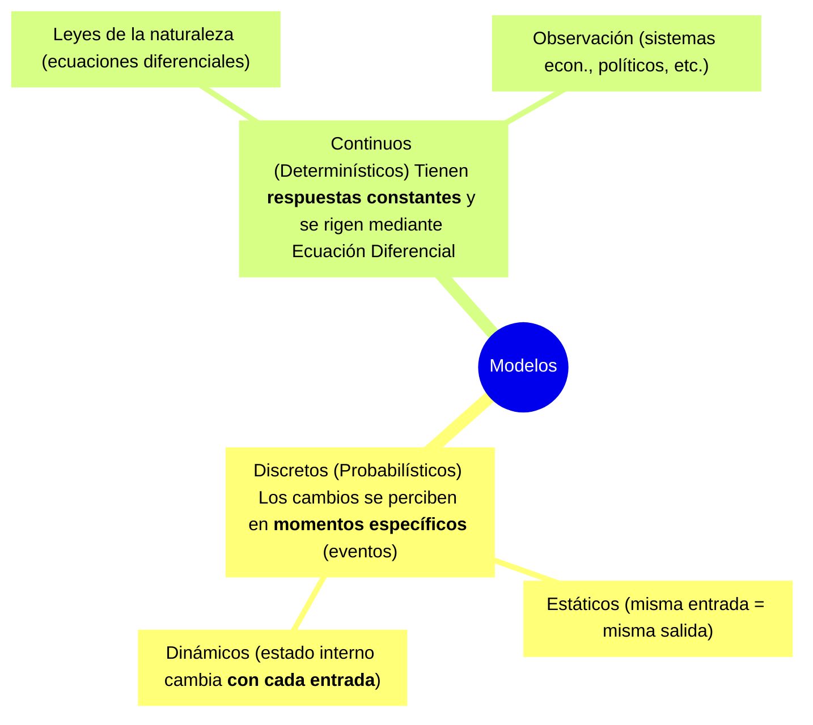

# TEO
[[P1-U01]]

## PREGUNTAS UV
### Clasificacion de los [[Modelo | modelos]]
Clasificamos los modelos en modelos ==Discretos== los cuales son modelos
probabilisticos y en modelos ==Continuos== los cuales son determinísticos.

a los modelos discretos los podemos clasificar como ==estaticos== si no
cambian su estado interno y ==dinamicos==, es decir que los estaticos
cambian con por unidad de tiempo fijo en cambio los dinamicos varian.

a los modelos continuos que cambian con el tiempo se los puede basar
en ==leyes de la naturaleza== o en la ==observacion==

### Seleccione el [[Tipo de sistema]] que corresponde a cada  descripcion✅
* por lo general no alcanza un estado estable:
	* ==Terminante==
* Su vida se prolonga en el tiempo de manera indefinida
	* ==No Terminante==
* Tiene un evento natural que determina el tiempo de vida del mismo
	* ==Terminante==
* Al inicio presenta un estado transitorio (warm-Up)
	* ==No terminante==
* Alcanza un estado de regimen
	* ==No Terminante==

### --- ==Ventajas,Desventajas y peligros Simulacion==--

### Marque cuales son las Desventajas de la [[Simulacion]]✅

- [ ] Puede aparentar reflejar con precision un sistema real, cuando en verdad no lo hace
- [ ] No es util para la estimacion de medidas de desempeño, bajo diferentes escenarios
- [ ] No permite encontrar soluciones optimas
- [ ] No se puede medir el grado de impresicion
- [ ] No siempre es conveniente desde la perspectiva de los costos (economicos y en tiempo)
- [ ] No es sustituto de un analsis detallado
- [ ] No es apropiada para el estudio de sistemas estocaiticos
- [ ] Falta contro sobre condiciones de entorno y de entrada
--- 
#### rtas
- [ ] Puede ==aparentar== reflejar con precision un sistema real, cuando en verdad no lo hace
- [ ] ==No== permite encontrar ==soluciones optimas==
- [ ] ==No== se puede medir el ==grado de impresicion==
- [ ] No siempre es conveniente desde la perspectiva de los ==costos== (economicos y en tiempo)
- [ ] No es ==sustituto de un analsis detallado==

estos no estan en la uv
| - [ ] Costos                                                                                |
| - [ ] Dificultades para "vender" la idea al managment                                       |
### Marque cuales son las Ventajas de la [[Simulacion]]✅
- [ ] Estimacion de medidas de desempeño, bajo diferentes escenarios
- [ ] Siempre es conveniente desde la perspectiva de costos, (economicos y en tiempo)
- [ ] Manejo arbitrario del tiempo
- [ ] Estudio de sistemas etocasticos
- [ ] sustituy de un analisis detallado
- [ ] permite encontrar soluciones optimas
- [ ] Estudio de sistemes estocaisticos
- [ ] Control sobre condiciones de entorno y de entrada
- [ ] Se puede medir el grado de impresicion
---
#### rtas
- [ ] ==Estimacion de medidas de desempeño, bajo diferentes escenarios
- [ ] ==Manejo arbitrario del tiempo
- [ ] ==Estudio de sistemas etocasticos
- [ ] ==Control sobre condiciones de entorno y de entrada

estos tmb son ventajas pero no aparecian en las opciones de la uv
| - [ ] Es util cuando no hay una formulacion analitica                                  |
| - [ ] ayuda a estudiar sistemas inexistentes                                           |
| - [ ] Puede ser usado repetidamente una vez construido                                 |
| - [ ] puede utilizarce como entrenamiento de personal                                  |
| - [ ] cuando se introducen nuevos elementos en el sistema, permite anticipar problemas |
### Peligros de la [[Simulacion]]
- [ ] Inferir resultaso con una sola corrida asumiendo independencia
- [ ] Uso arbitrario  de distribuciones y suposiciones
- [ ] Impresionarse con el gran volumen de informacion, pero que no refleje el sistema estudiado
---
Estos no estan en la uv
| - [ ] Los resultados pueden dar lugar a una excesiva confianza                                        |
| - [ ] Es posible que se ignoren factores tecnológicos y de indole humana                              |
| - [ ] Basar las decisiones en el promedio de estadísticas cuando los resultados son de hecho cíclicos |
### --- ==lenguajes de proposito generales vs lenguajes de simulacion== ---
### Marque cuáles son los aspectos NEGATIVOS de los [[Lenguajes de programacion|Lenguajes de Propósitos Generales]] ✅
- [ ] Costo del software
- [ ] Poco conocimiento del lenguaje
- [ ] Es necesario desarrollar las funcionalidades requeridas para construir un modelo
- [ ] Es más laboriosa la generación de datos necesarios para la simulación
- [ ] Limitada flexibilidad para adaptarse a cualquier modelo
- [ ] Es más laboriosa la administración y asignación de recursos de la computadora, durante la corrida
- [ ] Poca diversidad en el formato de salida
- [ ] Tiempo de ejecución incrementado.
- [ ] Se necesita gestionar la recopilación y despliegue de los datos producidos
#### rtas
- [ ] ==Es== necesario desarrollar las funcionalidades requeridas para construir un modelo
- [ ] ==Es más laboriosa== la generación de datos necesarios para la simulación
- [ ] ==Es más laboriosa== la administración y asignación de recursos de la computadora, durante la corrida
- [ ] ==Se== necesita gestionar la recopilación y despliegue de los datos producidos 
### Marque cuales son los aspectos Positivos de los [[Lenguajes de programacion|Lenguajes de Propósitos Generales]]✅
- [ ] Control de la administración y asignación de recursos de la computadora, durante la corrida
- [ ] Por lo general se conoce muy bien el lenguaje
- [ ] No hay restriciones para el formato de salida
- [ ] Por lo general se conoce muy bien el lenguaje
- [ ] Generación automática de ciertos datos necesarios
- [ ] Menor costo del software
- [ ] Recopilación y despliegue de los datos producidos
- [ ] Flexibilidad para adaptarse a cualquier modelo
- [ ] Tiempo de ejecucion reducido
- [ ] Brindan la mayoría de las funcionalidades necesarias para construir un modelo
#### rtas
- [ ] ==No hay restriciones para el formato de salida==
- [ ] Por lo general se ==conoce muy bien== el lenguaje
- [ ] ==Menor costo== del software
- [ ] ==Flexibilidad== para adaptarse a cualquier modelo
- [ ] ==Tiempo== de ejecucion reducido
### Marque cuales son los aspectos NEGATIVOS de los [[Lenguajes de programacion|Lenguajes de simulacion]]✅
- [ ] Poca Diversidad en el formato de salida
- [ ] Limitaciones para la generacion de datos necesarios para la simulacion
- [ ] Limitaciones para la recopilacion y desplieuge
- [ ] Es necesario desarrollar las funcionalidades requeridas para construir un modelo
- [ ] Conocomiento del lenguaje
- [ ] Costo del sofware
- [ ] Limitada flexibilidad para adaptarse a cualquer modelo
- [ ] Tiempo de ejecucion incrementado
- [ ] Dificulta la administracion y asignacion de recursos de la computadora, durante la corrida
#### rtas
- [ ] Poca Diversidad en el formato de salida
- [ ] Conocomiento del lenguaje
- [ ] Costo del sofware
- [ ] Limitada flexibilidad para adaptarse a cualquer modelo
- [ ] Tiempo de ejecucion incrementado
### Marque cuales son los aspectos Positivos de los [[Lenguajes de programacion| Lenguajes de simulacion]]✅
- [ ] Brindan la mayoria de las funcionalidades necesarias para constuir un modelo
- [ ] Tiempo de ejecucion reducido
- [ ] Generacion automatica de ciertos datos necesarios
- [ ] por lo general se conoce muy bien el lenguaje
- [ ] No hay restriicciones del formato de salida
- [ ] Recopilacion y despliegue de los datos producidos
- [ ] Menor costo del sofwtware
- [ ] Control de administracion y asignacion de recuros de la computadora, durante la corrida
- [ ] Flexibilidad para daptarse a cualquer modelo
#### rtas
- [ ] ==Brindan la mayoria de las funcionalidades== necesarias para constuir un modelo
- [ ] ==Generacion automatica== de ciertos datos necesarios
- [ ] ==Recopilacion y despliegue de los datos== producidos
- [ ] Control de administracion y asignacion de recuros de la computadora, durante la corrida

### --- ==Validacion de modelos==--
### seleccion y ordene las etapas del proceso de [[Simulacion]]✅
- [ ] Definición del problema.
- [ ] Formulación
- [ ] Adquisición y preparación de datos.
- [ ] Traslación-Programación del modelo
- [ ] [[Validación del modelo | Validacion]]
- [ ] Planeación táctica y estratégica
- [ ] Experimentación
- [ ] Interpretación y análisis de resultados
- [ ] Implantación
- [ ] Documentación 
### Acerca de la [[Validación del modelo]]...✅

Se deben **validar** varios puntos claves del Modelo construido:
- [ ] Verificacion de Supuestos (se debe involucrar al cliente)
- [ ] Valores de entrada
- [ ] Valores de salida

**Tecnicas de validacion** entre ellas encontramos:
- [ ] Intuicion de experto, que se riefere a: Alguien que conzca el modelo real
- [ ] Mediciones en el sistema real
- [ ] Resultados teoricos
- [ ] analisis de sensbilidad

### Cual o cuales de estos parametros de variables estaditicas pueden tomar eventualmete valores negativos?
- [ ] Media de una distribucion Normal (no estandar)
- [ ] Limite inferior de una distribucion uniforme (a, b)
- [ ] Limites inferior y superior de una distribucion uniforme (a,b)
# PRACTICO

R=Stock , pido? ; o si justo el semana que llega un pedido. me quedo sin stock, en el misma semana puedo hacer un pedido?

El profesor aclaró explícitamente en la clase que se debe disparar un nuevo pedido cuando el nivel de stock actual es **igual o menor** al punto de reposición (R).

Por ejemplo, al explicar el modelo con un punto de reposición de 7 unidades, indicó que **"si en algún momento queda en 7 unidades o menos se debe hacer un pedido"**. Dicho de otra manera, la única condición para _no_ hacer un pedido es que el stock se mantenga estrictamente "por encima de R". No debes esperar a que sea estrictamente menor.

Si tu stock toca a R (o cae por debajo), estás obligado a pedir **siempre y cuando no haya ya un pedido previo en curso** (viajando del proveedor a la empresa). Si ya hay un pedido pendiente de llegada, la regla te prohíbe realizar uno nuevo.

SI, debes pedir en la misma semana que llega

---
si, tengo que sacar la demanda a paritr de un rnd, y el rnd me da 0,67, a travez de la talba de probabilidades acumulada seria demanda de 6 porque su probabilidad acumulada es excatemente 0,67 o debe ser una demanda de 7 que su prob acumulada es de 1

Debe ser una demanda de **7 unidades**.

El profesor explicó explícitamente este mismo escenario en clase para advertir sobre cómo funciona la regla de los límites. La regla de oro en estas simulaciones establece que **el extremo derecho (o límite superior) de un intervalo nunca está incluido** de forma absoluta en ese mismo intervalo.

Cuando comparas tu número aleatorio (RND) con la columna de probabilidad acumulada barriendo de arriba hacia abajo, la pregunta lógica que debes hacerle al sistema es si el RND es **estrictamente menor** al valor acumulado.

En tu caso, al sacar exactamente el número `0,67`, la comprobación sería la siguiente:

- ¿Es `0,67` menor a `0,06`? No.
- ¿Es `0,67` menor a `0,19`? No.
- ¿Es `0,67` menor a `0,40`? No.
- **¿Es** **0,67** **menor a** **0,67****? No.** (Son exactamente iguales, por lo que la condición de "menor" es **falsa**).

Al ser falsa, el sistema te obliga a saltar al siguiente renglón, cayendo dentro del intervalo que tiene como límite el `1`. Por lo tanto, el número `0,67` se traduce obligatoriamente en una demanda de **7 unidades**.