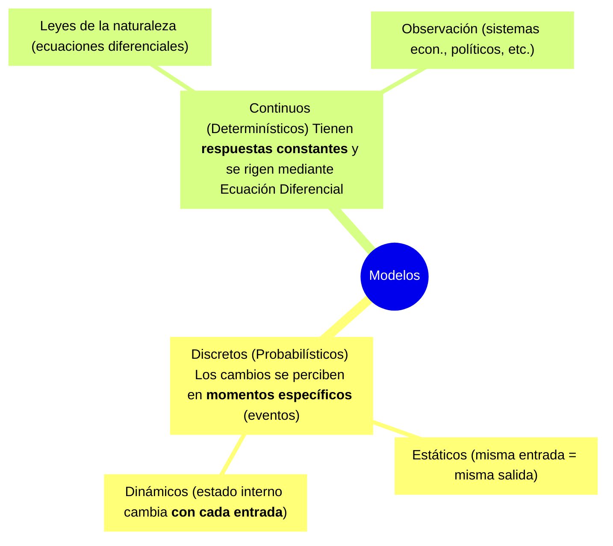

> [!note] Fuente
> Basado en `Unidad 1 SIM.pdf` · [Video de referencia](https://www.youtube.com/watch?v=pl4MmLvSywI)

---

## ¿Qué es un [[Modelo]]?

> [!note] Definición — Modelo
> Un [[Modelo]] es una **representación simplificada o abstracción de la realidad** que busca representar a un Sistema.

### Clasificación de Modelos

---
## ¿Qué es [[Simulacion]]? 
>[!note] Se define como la acción de construir un programa de computadora y hacer evolucionar ese modelo matemático a lo largo del tiempo para observar cómo reacciona y obtener datos que ayuden a la toma de decisiones.

**Objetivo**:
1. Describir el comportamiento de sistemas
2. Postular teorías o hipótesis que expliquen el comportamiento observado
3. Usar estas teorías para predecir un comportamiento futuro, es decir, los efectos que se producirán mediante cambios en el sistema o en su método de operación

**Se recurre a la simulación cuando trabajar con el sistema real es:**
1. Imposible: El sistema aún no existe.
2. Costoso: Probar cambios en producción real genera riesgos económicos o de tiempo.
3. Complejo: El sistema posee demasiadas variables que impiden un análisis analítico simple.

### 3.1 Clasificación general de Sistemas

| Dimensión                                        | Tipos                                  |
| ------------------------------------------------ | -------------------------------------- |
| Intercambio con entorno                          | Abiertos / Cerrados                    |
| Origen                                           | Naturales / Artificiales               |
| Comportamiento  frente a variables de entrada | Estables / Inestables                  |
| Relacion de variables                            | Lineales / No lineales                 |
| Aleatoriedad                                     | **Estocásticos** / **Determinísticos** |
| Duracion                                         | Terminates/ No terminates              |

> [!danger] Confusión clásica — Estático vs. Dinámico
> Un Sistema Estático no significa que "no se mueva", sino que su **estado interno no cambia** al procesar una entrada. Un Sistema Dinámico **sí modifica su estado**, por eso la misma entrada puede dar resultados distintos en distintos momentos.

## Sistemas terminates vs sistemas no terminates
#### Sistema Terminante

> [!note] Definición
> Existe un **evento natural predefinido** que determina el final de la actividad o la simulación. El sistema se **vacía** al finalizar → rara vez alcanzan un Estado Estable.

*Ejemplos:* sucursal bancaria con horarios fijos, confrontación militar, fábrica con orden específica de producción.

* ==Por lo generan no alcanzan un estado estable==
* ==hay un evento natural que determina el timepo de la simulacion o el fin de la misma ==

#### Sistema No Terminante

> [!note] Definición
> Su vida se prolonga **indefinidamente**. Suelen alcanzar un Estado Estable(*steady state* / régimen), pero siempre presentan un **Estado Transitorio inicial (Warm-Up)** antes de estabilizarse. Para que los resultados sean válidos, se deben realizar corridas prolongadas y aplicar la eliminación de datos iniciales para evitar que el sesgo del arranque distorsione las medias globales.

*Ejemplos:* central telefónica, líneas de ensamblaje continua, salas de emergencias, redes de datos.

* ==Sistemas cuya vida se prolonga indefinidamente en el tiempo 
* ==Suelen alcanzar un estado “Estable” o de “Régimen”
* ==Al inicio presentan un estado transitorio (Warm-Up)==
### Estado Transitorio (Warm-Up)

> [!note] Definición
> Etapa inicial inestable de un Sistema No Terminante donde las variables de interés (costos, ganancias, tiempos) **fluctúan agresivamente** antes de estabilizarse en el Estado Estable.

**Estrategias de supresión del Estado Transitorio:**
- Usar corridas muy largas.
- Eliminar / truncar los primeros datos erráticos.
- Inicializar el modelo "ya en movimiento" (*warm start*).

> [!danger] Error común
> Incluir los datos del Estado Transitorio en el cálculo de las medias finales **contamina los resultados** y hace que las estimaciones sean inválidas. Siempre hay que **eliminar o truncar** esa etapa inicial.

![[{601301BE-0D0A-4C86-925A-28938EE4FAF4}.png]]
## Ventajas, Desventajas y Peligros de la [[Simulacion]]

| Ventajas                                                                            | Desventajas                                                                              | Peligro                                                                                            |
| ----------------------------------------------------------------------------------- | ---------------------------------------------------------------------------------------- | -------------------------------------------------------------------------------------------------- |
| 1. Estimacion de medidas de desempeño, bajo diferentes escenarios                   | 1. Puede aparentar reflejar con precision un sistema real, cuando en verdad no lo hace   | 1. Inferir resultaso con una sola corrida asumiendo independencia                                  |
| 2. Manejo arbitrario del tiempo                                                     | 2. No permite encontrar soluciones optimas                                               | 2. Uso arbitrario  de distribuciones y suposiciones                                                |
| 3. Estudio de sistemas etocasticos                                                  | 3. No se puede medir el grado de impresicion                                             | 3. Impresionarse con el gran volumen de informacion, pero que no refleje el sistema estudiado      |
| 4. Control sobre condiciones de entorno y de entrada                                | 4. No siempre es conveniente desde la perspectiva de los costos (economicos y en tiempo) | ---                                                                                                |
| ---                                                                                 | 5. No es sustituto de un analsis detallado                                               | 4. Los resultados pueden dar lugar a una excesiva confianza                                        |
| 5. Es util cuando no hay una formulacion analitica                                  | ---                                                                                      | 5. Es posible que se ignoren factores tecnológicos y de indole humana                              |
| 6. ayuda a estudiar sistemas inexistentes                                           | 6. Costos                                                                                | 7. Basar las decisiones en el promedio de estadísticas cuando los resultados son de hecho cíclicos |
| 7. Puede ser usado repetidamente una vez construido                                 | 7. Dificultades para "vender" la idea al managment                                       |                                                                                                    |
| 8. puede utilizarce como entrenamiento de personal                                  |                                                                                          |                                                                                                    |
| 9. cuando se introducen nuevos elementos en el sistema, permite anticipar problemas |                                                                                          |                                                                                                    |

## lenguaje de proposito general vs especificos de sim

vs

| ==pros proposito general==                            | contra sespecificos de sim                                |
| ----------------------------------------------------- | --------------------------------------------------------- |
| 1. ==No hay restriciones para el formato de salida==  | 1. Poca Diversidad en el formato de salida                |
| 2. Por lo general se ==conoce muy bien el lenguaje==  | 2. Conocomiento del lenguaje                              |
| 3. ==Menor costo del software==                       | 3. Costo del sofware                                      |
| 4. ==Flexibilidad== para adaptarse a cualquier modelo | 4. Limitada flexibilidad para adaptarse a cualquer modelo |
| 5. ==Tiempo de ejecucion reducido==                   | 5. Tiempo de ejecucion incrementado                       |

vs

| contras proposito general                                                                            | ==Pros especificos de sim==                                                                    |
| ---------------------------------------------------------------------------------------------------- | ---------------------------------------------------------------------------------------------- |
| 1.  Es necesario desarrollar las funcionalidades requeridas para construir un modelo                 | 1.==Brindan la mayoria de las funcionalidades== necesarias para constuir un modelo             |
| 2. Es más laboriosa la generación de datos necesarios para la simulación                             | 2. ==Generacion automatica de ciertos datos== necesarios                                       |
| 3. Es más laboriosa la administración y asignación de recursos de la computadora, durante la corrida | 3. ==Recopilacion y despliegue de los datos producidos==                                       |
| 4. Se necesita gestionar la recopilación y despliegue de los datos producidos                        | 4. ==Control de administracion y asignacion de recuros de la computadora, durante la corrida== |
|                                                                                                      | --                                                                                             |
|                                                                                                      | 5.Los modelos son generalmente más fáciles de modificar y mantener.                         |
|                                                                                                      | 6.Los modelos son menos propensos a errores.                                                   |
|                                                                                                      | 7.Tiempo de programación más corto. (puede incidir en el costo total del proyecto).            |
![[{428DD1CE-3012-416B-988C-7F9E8F83DEF9}.png]]

> [!question] Pregunta de clase
> ¿Cuándo conviene usar un Lenguaje de Propósito General vs. un Lenguaje de Simulación? → Depende del presupuesto, la complejidad del modelo y si se necesitan formatos de salida personalizados.

---

## Las 10 Etapas del [[Simulacion|Proceso de Simulacion]]

> [!note] Concepto clave
> La [[Simulacion]] es un **proceso iterativo y metodológico**, no un acto de programación aislada. Las etapas no son siempre lineales: el paso de [[Validación del modelo|Validación]] puede forzar volver a etapas anteriores.

| N°  | Etapa                                                                                    |
| --- | ---------------------------------------------------------------------------------------- |
| 1   | Definición del Sistema y objetivos                                                       |
| 2   | Formulación del Modelo Conceptual                                                        |
| 3   | Adquisición y preparación de datos                                                       |
| 4   | Traslación / Programación del modelo en computadora                                      |
| 5   | **[[Validación del modelo]]** *(punto crítico — puede implicar volver a etapas previas)* |
| 6   | Planeación Táctica y Estratégica (cantidad y tipos de corridas)                          |
| 7   | Experimentación (ejecutar las simulaciones)                                              |
| 8   | Interpretación y Análisis de Resultados                                                  |
| 9   | Implantación de la solución                                                              |
| 10  | **Documentación detallada** *(subestimada pero muy valiosa a futuro)*                    |

> [!tip] Tip de parcial — Etapa crítica
> La etapa **5 — [[Validación del modelo]]** es el punto crítico del proceso. Si el modelo no representa fielmente la realidad, se debe volver a etapas anteriores. Es iterativo, no lineal.

---

## Técnicas de [[Validación del modelo]]

> [!note] Definición
> Consiste en verificar que los **supuestos, entradas y datos de salida** del [[Modelo]] representen fielmente al Sistema Real.

==Se deben **validar** varios puntos claves del Modelo construido:
* ==Verificacion de Supuestos (se debe involucrar al cliente)
* ==Valores de entrada
* ==Valores de salida==

Técnicas utilizadas:
- Apoyarse en la **intuición de un experto** en el negocio (cliente / stakeholder).
- **Comparar** los resultados con mediciones previas del Sistema Real.
- Respaldarse en **marcos teóricos comprobados**.
- **Análisis de Sensibilidad:

> [!question] Pregunta de clase
> ¿Qué es el Análisis de Sensibilidad y para qué sirve en la validación? → Sirve para verificar que el [[Modelo]] reacciona proporcionalmente a cambios en sus variables de entrada. Si un pequeño cambio produce una respuesta desproporcionada, hay un problema en el modelo.

> [!note]
> *📍 La clase 1 llegó hasta este punto.*

---

## Análisis de Resultados: Intervalo de Confianza y Tamaño de Muestra

Dado que cada Simulación de un Sistema Estocástico arroja valores diferentes, **no se entregan valores exactos** al cliente, sino **Estimación Estadística** dentro de un rango o Intervalo de
Confianza.

### Intervalo de Confianza

> [!note] Definición — Intervalo de Confianza
> Rango numérico delimitado entre el cual, con cierta probabilidad $(1 - \alpha)$ (ej. 95%), se ubicará el **valor real** de la variable buscada.

$$P\{L_{inf} \leq X \leq L_{sup}\} = 1 - \alpha$$

| Tamaño de muestra    | Distribución a usar           |
| -------------------- | ----------------------------- |
| $N < 30$ corridas    | **Distribución T de Student** |
| $N \geq 30$ corridas | **Distribución Normal (Z)**   |

> [!danger] Trampa de parcial — ¿Cuándo usar T o Z?
> Si la muestra de corridas es **menor a 30**, se usa **Distribución T de Student**. Si es **mayor o igual a 30**, se usa **Distribución Normal (Z)**. Confundir ambas en el cálculo del Intervalo de Confianza es un error gravísimo.

---

### Cálculo del Tamaño de Muestra ($n$)

> [!note] Fórmulas para determinar $n$
> Para garantizar que el error $\epsilon$ esté dentro de límites aceptables, se selecciona la fórmula según el escenario:

**1. Desviación Estándar ($\sigma$) conocida:**
$$n = \left(\frac{Z_{1-\alpha/2} \cdot \sigma}{\epsilon}\right)^2$$

**2. Desviación desconocida — muestra pequeña ($N < 30$) → usar Distribución T de Student:**
$$n = \left(\frac{t_{N-1,\, 1-\alpha/2} \cdot s}{\epsilon}\right)^2$$

**3. Sin suposición de normalidad — Criterio de Chebyshev:**
$$n = \frac{1}{\alpha} \left(\frac{s}{\epsilon}\right)^2$$

> [!tip] Tip de parcial — Criterio de Chebyshev
> El Criterio de Chebyshev es el más **conservador** de los tres: da el $n$ más grande porque no asume ninguna distribución. Se usa cuando **no se conoce** la distribución del sistema. Siempre sobredimensiona la muestra para estar del lado seguro.

### Ejemplo Didáctico

| Parámetro           | Valor               |
| ------------------- | ------------------- |
| Media $\bar{X}$     | 43.8 min            |
| Desviación $s$      | 6 min               |
| Muestra inicial $N$ | 10 corridas         |
| $t_{9,\; 0.975}$    | 2.26                |
| **IC resultante**   | $43.8 \pm 4.29$ min |

> [!tip] Tip de parcial — Fórmulas de $n$
> El dominio de estas tres fórmulas es el **requisito indispensable** para superar la instancia práctica. Identificar el escenario correcto (¿se conoce $\sigma$? ¿$N < 30$? ¿Se desconoce la distribución?) y aplicar la fórmula correspondiente es el núcleo del examen.

---

