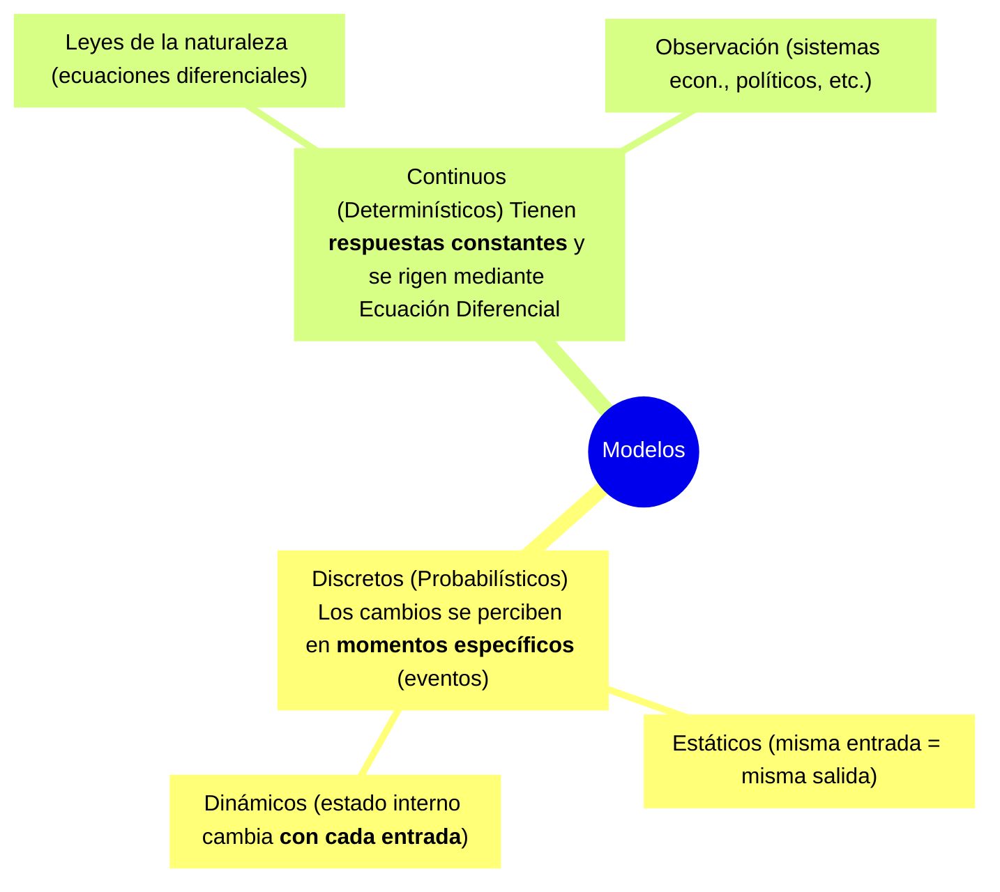

## I. ¿Qué es un Modelo?

> [!note] Definición — Modelo
> Un [[Modelo]] es una **representación simplificada o abstracción de la realidad** que busca representar a un Sistema.

### Clasificación de Modelos

---
* Discretos Probabilísticos): Dentro de esta categoría se hace una diferenciación basada en cómo reaccionan los componentes internos del modelo ante los estímulos:
	* Estáticos: son aquellos en los que los componentes internos no sufren ningún cambio cuando el sistema procesa una entrada para generar una salida. Como consecuencia de esto, ante la misma entrada, la salida siempre será idéntica.clase 
		* Ejemplos: Análisis de riesgo (de costos o ganancias) y modelos de inventario
	* Dinamicos: En estos modelos, alguna variable interna del componente cambia como consecuencia de haber recibido una entrada. Esto significa que si se vuelve a aplicar exactamente la misma entrada al sistema, la salida obtenida será diferente a la primera, ya que el estado interno del sistema se modificó en el proceso.
		* Ejemplos: Modelos de línea de espera o sistemas de colas.
* Continuos Determinísticos). Estos modelos se clasifican dependiendo del nivel de formalización matemática y el entendimiento que rige su comportamiento: 
	* Basados en leyes de la naturaleza: Son sistemas técnicos que pueden ser modelados de forma precisa, estando representados casi siempre por funciones y ecuaciones diferenciales.
		* Ejemplos: Sistemas térmicos, mecánicos, químicos y electromagnéticos.
	* basados en la obvservacion: Son sistemas de los cuales se conoce poco matemáticamente, a menudo porque están influenciados por factores altamente complejos o por la voluntad humana, lo que hace difícil representarlos adecuadamente con una ecuación diferencial exacta.
		* Ejemplos: Sistemas económicos, políticos, biológicos, meteorológicos, ecológicos y poblacionales