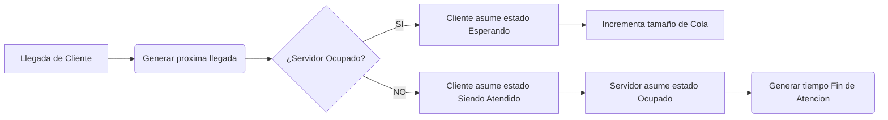
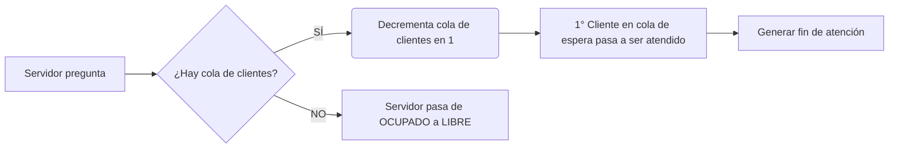
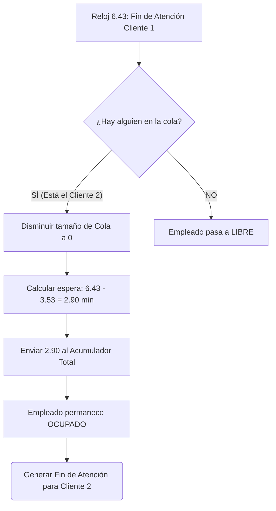

https://www.youtube.com/watch?v=XrvTttfFk-0&list=PLYZrqm_pzRumvVy7sqm8OKqaXJvbhOuaU&index=13&t=2s

![[P2-U05-P01 Sistemas de colas.pdf]]
## II. Fundamentos de los Sistemas de Colas (5:35 - 17:11)

A diferencia de algunos modelos estáticos, estos problemas se encuadran como [[Sistemas Discretos]] y netamente [[Sistemas Dinámicos]], ya que su estado interno cambia con el tiempo. El reloj avanza mediante saltos temporales que **no son equidistantes**.

> [!note] **[[Sistemas Discretos]]:** Son aquellos sistemas donde los cambios de estado ocurren en instantes separados de tiempo. El tiempo no fluye de manera continua, sino que el [[Reloj del Sistema]] avanza "a saltos" cada vez que ocurre un evento, y estos saltos **no son equidistantes**.

>[!note] **[[Sistemas Dinámicos]]:** A diferencia de modelos estáticos (como algunas simulaciones puras de Montecarlo), los sistemas de colas son dinámicos porque sus estados internos cambian constantemente a lo largo del tiempo ante la misma o distintas entradas

![[{32D41395-7028-49FD-8293-9618C97063E1}.png|543]]

>[!note[] conceptos
> cliente: entidad que necesita que se le brinde un tiempo de atencion
> servidor: son aquellos que brindan el servicio 
> 
> la capacidad de estos servidores es limitada entonces puede atender a cierta cantidad de clientes cada uno de los servidores que haya en el sistema pero si los clientes siguen llegando al sistema no se les puede brindar servicio inmediata; los clientes deberan esperar en una cola

![[{612FAA7B-8480-44B6-8439-089875BA5C55}.png|484]]

==Para estructurarlos, se deben clasificar sus componentes:==

| Categoría       |                                                       | Concepto / Clasificación             | Conceptos Clave                                                                                                                                          |
| :-------------- | ----------------------------------------------------- | :----------------------------------- | :------------------------------------------------------------------------------------------------------------------------------------------------------- |
| **[[Objetos]]** |                                                       | [[Objetos Temporarios]]              | Entidades que ingresan al sistema, requieren un servicio y luego lo abandonan (típicamente el **[[Cliente]]**                                            |
|                 |                                                       | [[Objetos Permanentes]]              | Entidades que permanecen en el sistema desde el inicio hasta el fin de la simulación brindando el servicio (típicamente el **[[Servidor]]** o empleado). |
| **[[Eventos]]** | Disparadores de cambios de estado en un instante dado | [[Llegada al Sistema]]               | Evento que introduce un nuevo objeto temporario al modelo y obliga a generar el tiempo de la próxima llegada.                                            |
|                 |                                                       | [[Fin de Atención]]                  | Evento que dictamina que un servidor ha completado el servicio de un cliente, liberándolo o haciéndolo tomar al siguiente en la cola.                    |
|                 |                                                       | [[Eventos Temporizados]]             | Sucesos programados a una hora específica del reloj, como el fin de la simulación, interrupción de llegadas (cierre de puertas) o  descansos.            |
| **[[Colas]]**   | Sitios de espera con reglas definidas                 | [[Disciplina FIFO / LIFO]]           | Reglas de atención. FIFO (First In, First Out) es el orden tradicional de llegada. LIFO (Last In, First Out) es el último en entrar, primero en salir.   |
|                 |                                                       | [[Impaciencia]]                      | Atributo de comportamiento donde un cliente decide abandonar la cola tras un determinado tiempo de espera sin ser atendido.                              |
|                 |                                                       | Tiene longitud maxima? o prioridades |                                                                                                                                                          |
|                 |                                                       |                                      |                                                                                                                                                          |
![[{B3D0EBD9-B0B2-43BB-8695-8B1B86111137}.png|464]]
>[!danger] Error Conceptual Crítico de Modelado 
El profesor hizo un énfasis fundamental: **NO existe un evento llamado "Inicio de Atención"**. Los inicios de atención son simplemente consecuencias desencadenadas o bien por una [[Llegada al Sistema]] (cuando el empleado está libre) o por un [[Fin de Atención]] previo. Escribir una columna de "Evento: Inicio de Atención" en el parcial es un error grave.

### Es necesario establecer:
![[{5CC4549B-2ED2-4093-8186-CD23A6890109}.png]]
* tipos de clientes pueden ver varios o ser unicos
* Atributos
	* **[[Estados]]:** Son un atributo particular y obligatorio de los objetos que dicta cómo van a reaccionar ante un cambio en el sistema.
		- Para un [[Servidor]], los estados básicos son **[[Libre]]** y **[[Ocupado]]**.
		- Para un [[Cliente]], los estados básicos son **[[Esperando en Cola]]** y **[[Siendo Atendido]]**.
## III. Disposición de servidores y Lógica de Interacción (17:11 - 32:21)

Se introducen las configuraciones físicas de los servidores ([[Servidores en Serie]], [[Servidores en Paralelo]] o combinados). 
![[{C57600E8-811D-464E-B932-C473CD0A1FB6}.png|502]]
![[{1FAF06DA-975D-498D-B88B-227CD38B12D5}.png|509]]

### Sistema elemental
Luego, el foco pasa a la lógica algorítmica de los eventos, para entender cómo interactúan los objetos en un escenario simple de un único servidor y una única cola. Se explicó el comportamiento exacto que deben tener las entidades para no colapsar la simulación.
![[{7DC1C1E0-F9ED-45C7-996F-46AC108CB94C}.png|458]]
![[{80F0BBBB-9E15-4F88-98C0-C65E1CAE7784}.png|457]]![[{2B9C537B-34AB-4755-86AD-4E6761FF144E}.png|468]]
se aclaró que durante un [[Fin de Atención]], si hay personas esperando en la cola, el servidor toma al siguiente cliente de inmediato y **permanece ocupado**; nunca asume el estado de [[Libre]] momentáneamente entre clientes.

![[{0F2AA736-0AE9-4B35-918D-56496B6C5A7C}.png]]
> [!question] Pregunta Lógica de Simulación Cuando un cliente entra al local, ¿Hacia dónde debe mirar (o preguntar) primero la lógica del programa, a la cola o al servidor? 
> **Respuesta del profesor:** El cliente que llega **NO pregunta por la cola, pregunta siempre por el [[Servidor]]**. Si la cola está vacía y el cliente pregunta por la cola, asumiría erróneamente que puede ser atendido inmediatamente, incluso si el servidor está ocupado. El programa colapsaría.

### Flujo Lógico: Evento de Llegada al sistemas
cambios orignados por el evento

### Flujo Lógico: Fin de servicio 
cambios originados por el evento

## IV. Extracción de Medidas de Desempeño (32:21 - 38:49)

Una vez procesado el [[Vector de Estado]], se extraen las **[[Medidas de Desempeño]]** (o parámetros del sistema) para apoyar la toma de decisiones gerenciales.

> [!note] Fórmula: Tiempo Promedio en Cola (Wq​) $$ W_q = \frac{\sum t_i}{n}$$ 
> 
> ***Explicación:** Se calcula acumulando todos los tiempos individuales (ti​) que los clientes pasaron en la cola, dividido por la cantidad total de clientes (n) "pasibles de entrar en ella". Ojo: los clientes que son atendidos inmediatamente se cuentan igual (aportando un tiempo de 0), lo que mejora el promedio general*

> [!note] Fórmula: Cantidad promedio de clientes en cola (y en sistema) $$ W_q = \frac{\sum t_i}{t_{total}}$$ 
> 
>t_i= tiempo de permanencia del cliente i en cola
>t_total= tiempo total de la simulación
>
>Es la cantidad de clientes que están en cola en  promedio o la cantidad esperada de clientes también se le puede llamar en cola
>
> se calcula esto acumulo los tiempos de permanencia de todos los clientes desde que ingresa la cola hasta que sale como en la anterior y lo voy a dividir por el tiempo total de la simulación y eso me va a dar unidades es decir me va a decir 2,15 clientes en cola en promedio o 770 tres clientes en el sistema en promedio

> [!note] Fórmula: Porcentaje de Ocupación del Servidor  $$ \% Ocup = \left(\frac{\sum t_{ocup}}{t_{total}}\right) \times 100 $$ 
> 
> **Explicación:** Es la suma de todos los intervalos de tiempo en los que el servidor estuvo en estado [[Ocupado]] (tocup​), dividido por el reloj o tiempo total de la simulación (ttotal

![[{A67AE6B8-C225-43A4-85A5-74758A016A9C}.png|564]]
## V. Caso Práctico Aplicado: "La Librería" (38:49 - 1:12:02)

Para demostrar la mecánica de estos [[Sistemas Dinámicos]], el profesor utilizó un único ejemplo transversal: **"La Librería"**, el cual representa el [[Sistema Elemental]] más básico que puede existir (un servidor, una sola cola y un solo tipo de clientes).

A continuación, desglosaremos su metodología de resolución.

![[{4E885F1E-5B66-4B57-9165-2EBD7EFE640D}.png|442]]

### 1. Definición del Modelo y sus Componentes

Antes de comenzar a llenar el [[Vector de Estado]], el profesor estableció los objetivos del dueño del comercio: determinar el **tiempo promedio de permanencia en cola** y el **porcentaje de ocupación del empleado**. Para lograrlo, clasificó los elementos en la siguiente tabla:

|Tipo de Componente|Elemento del Ejemplo|Clasificación|Atributos / [[Estados]] Asociados|
|---|---|---|---|
|**[[Objetos]]**|[[Cliente]]|[[Temporarios]]|[[Siendo Atendido]], [[Esperando en Cola]].|
|**[[Objetos]]**|Empleado / [[Servidor]]|[[Permanentes]]|[[Libre]], [[Ocupado]].|
|**[[Eventos]]**|Llegada de cliente|[[Llegada al Sistema]]|Dispara el cálculo del próximo [[Tiempo entre Llegadas]].|
|**[[Eventos]]**|Cliente termina su compra|[[Fin de Atención]]|Dispara el cálculo del próximo [[Tiempo de Atención]].|
|**[[Eventos]]**|Cierre del local|[[Eventos Temporizados]]|Fin de la simulación (Minuto 30.00).|

> [!tip] Tip de Resolución Práctica El profesor recomendó fuertemente no manejar el [[Reloj del Sistema]] en formato de horas, minutos y segundos (ej. 1h 20m 30s). Para facilitar los cálculos iterativos, **se debe utilizar una única unidad de tiempo fraccionada** (por ejemplo, expresar todo en minutos decimales, como 3,53 minutos).

![[{B62B0986-F90B-4C36-AB7B-9C68D3A211F1} 1.png|461]]
esto me da informacion de que voy a necesitar en el vector estado tmb

### 2. Diagrama Lógico Aplicado a "La Librería"

``` mermaid
graph LR
    %% Nodos iniciales
    Start((I))
    GenProx(("#<br>Genera Próxima<br>llegada"))
    ServOcup(("?<br>Servidor<br>ocupado?"))

    %% Rama SI (Arriba)
    IncCola(("+1<br>Incrementa cola<br>de Clientes"))
    CliEsp(("&#8594;<br>Cliente a<br>Esperando<br>Atención"))
    RegIngreso(("R<br>Registrar Hora de<br>ingreso a cola"))

    %% Rama NO (Abajo)
    CliAtend(("&#8594;<br>Cliente a<br>Siendo<br>atendido"))
    ServOcupado(("&#8594;<br>Servidor a<br>Ocupado"))
    GenFin(("#<br>Genera<br>Fin de<br>Atención"))
    RegOcup(("R<br>Registrar Hora<br>de Ocupación"))

    %% Cierre
    IncCont(("+1<br>Incrementa<br>Contador de<br>Clientes"))
    End((F))

    %% Conexiones
    Start --> GenProx
    GenProx --> ServOcup
    
    ServOcup -- SI --> IncCola
    IncCola --> CliEsp
    CliEsp --> RegIngreso
    RegIngreso --> IncCont

    ServOcup -- NO --> CliAtend
    CliAtend --> ServOcupado
    ServOcupado --> GenFin
    GenFin --> RegOcup
    RegOcup --> IncCont

    IncCont --> End

    %% Estilos de colores basados en la imagen
    classDef purple fill:#c2a3ff,stroke:#000,stroke-width:1px,color:#000,text-align:center;
    classDef orange fill:#ffc000,stroke:#000,stroke-width:1px,color:#000,text-align:center;
    classDef green fill:#00b050,stroke:#000,stroke-width:1px,color:#000,text-align:center;

    class Start,GenProx,ServOcup,IncCola,CliEsp,CliAtend,ServOcupado,GenFin,End purple;
    class RegIngreso,IncCont orange;
    class RegOcup green;
```

![[{0C8ED5BE-C6CC-47F6-9A91-DC0EC26BFB80}.png]]

![[{31C914C8-8E0B-484E-B54C-E415FDA6FD71}.png|378]]

```mermaid
graph LR
    %% Nodo Inicial y Decisión
    StartNode((I))
    DecisionNode(("?<br>Hay cola de<br>Clientes?"))
    
    %% Rama SI (Arriba)
    DecrNode(("-1<br>Decrementa<br>cola de<br>Clientes"))
    WaitNode(("&#8594;<br>1° Cliente en cola<br>de Esperando a<br>Siendo Atendido"))
    AccumuA(("A<br>Acumula tiempo<br>de permanencia<br>en cola"))
    GenFin(("#<br>Genera<br>Fin de Atención"))
    
    %% Rama NO (Abajo)
    ServerToFreeNode(("&#8594;<br>Servidor de<br>Ocupado a<br>Libre"))
    AccumuR(("R<br>Acumula<br>tiempo de<br>Ocupación"))
    
    %% Nodo Final
    FinalNode((F))

    %% Conexiones
    StartNode --> DecisionNode
    
    DecisionNode -- SI --> DecrNode
    DecrNode --> WaitNode
    WaitNode --> AccumuA
    AccumuA --> GenFin
    
    DecisionNode -- NO --> ServerToFreeNode
    ServerToFreeNode --> AccumuR
    
    %% Cierre hacia el nodo final
    GenFin --> FinalNode
    AccumuR --> FinalNode

    %% Clases de estilo de colores
    classDef purple fill:#c2a3ff,stroke:#000,stroke-width:1px,color:#000,text-align:center;
    classDef yellow fill:#ffc000,stroke:#000,stroke-width:1px,color:#000,text-align:center;
    classDef green fill:#00b050,stroke:#000,stroke-width:1px,color:#000,text-align:center;

    %% Aplicación de estilos a los nodos correspondientes
    class StartNode,DecisionNode,DecrNode,WaitNode,GenFin,ServerToFreeNode,FinalNode purple;
    class AccumuA yellow;
    class AccumuR green;
```

---

### 2. Desarrollo Paso a Paso del Vector de Estado
El profesor explicó la evolución del sistema renglón por renglón, donde cada fila representa la ocurrencia de un evento.

#### Paso A: Inicialización (Reloj 0)

El sistema arranca en reposo absoluto ("levantar la cortina del negocio"). No hay nadie en la cola y el empleado está [[Libre]].

> [!danger] Atención: La Semilla del Sistema Como el sistema está vacío, no hay forma de arrancar sin un evento inicial. 
> El profesor indicó que en el Reloj 0 es **obligatorio calcular o definir "de pecho" una primera llegada** (en este ejemplo, el Cliente 1 llegará en el minuto 1.23) para que el modelo inicie.

#### Paso B: Primera Llegada (Minuto 1.23)

- **Evento:** Ocurre la [[Llegada al Sistema]] del Cliente 1.
- **Lógica:** El cliente pregunta por el estado del servidor. Como está libre, pasa a ser atendido inmediatamente.
- **Actualización:** El empleado cambia a estado [[Ocupado]]. Se genera su [[Tiempo de Atención]] (5.20 min) y se suma al reloj actual, fijando el [[Fin de Atención]] para el minuto 6.43. Se calcula la llegada del próximo cliente para el minuto 3.53.

####  Paso C: Formación de la Cola (Minuto 3.53)

- **Evento:** Ocurre la llegada del Cliente 2.
- **Lógica:** Pregunta por el empleado, pero está [[Ocupado]] atendiendo al Cliente 1.
- **Actualización:** El Cliente 2 ingresa a la cola. El profesor resaltó la importancia de **registrar la hora exacta de ingreso a la cola (3.53)** en una columna específica para ese cliente. El empleado sigue ocupado y su fin de atención no se altera.

#### Paso D: Fin de Atención y Cálculo de Espera (Minuto 6.43)

- **Evento:** El empleado termina con el Cliente 1.
- **Lógica:** El empleado verifica si hay alguien en la cola. Como está el Cliente 2, la cola decrece y el empleado **permanece ocupado** tomando al Cliente 2.
- **Cálculos de Acumulación:** Al salir de la cola, se calcula el tiempo que esperó el Cliente 2: RelojActual(6.43)−HoradeIngreso(3.53)=2.90 minutos. Este valor se envía a la columna de [[Acumuladores]] de permanencia en cola.
#### 3. Diagrama Lógico Aplicado a "La Librería"

### 4. Cierre y Extracción de Medidas de Desempeño
El profesor cortó la simulación arbitrariamente en el minuto 30.00, logrando acumular un total de 16.98 minutos de espera repartidos entre 6 clientes, y un total de 24.28 minutos donde el empleado estuvo trabajando sin parar.

Con estos valores, aplicó las fórmulas de [[Medidas de Desempeño]]:

>[!note] Fórmulas Aplicadas
**Tiempo promedio de permanencia en cola (**Wq​**):
>
>$$ W_q = \frac{\sum t_i}{t_{total}}= \frac{16,98 min}{6 clientes}= 2,83 minutos$$ 
>
>
**Porcentaje de ocupación del empleado:** 
$$ \% Ocup = \left(\frac{\sum t_{ocup}}{t_{total}}\right) \times 100 =\frac{24,28 min}{30 min} x 100 =80,94 \% $$  

**Decisión Final:** Basado en estos estadísticos empíricos, el profesor concluyó como asesor que el tiempo de espera de casi 3 minutos para una compra de librería resulta "excesivo", y que al estar el empleado ocupado casi el 81% del tiempo, **es conveniente contratar un segundo empleado** que colabore con las ventas.

### concluciones
![[{68A31F64-D672-4A99-BC6C-635E94C99D3A}.png]]
# --------

