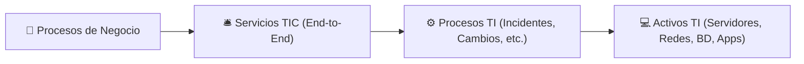
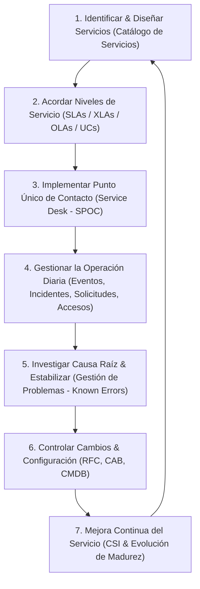
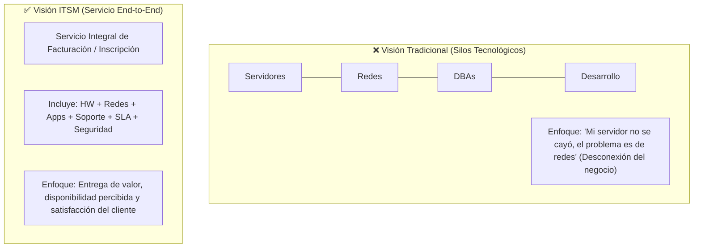
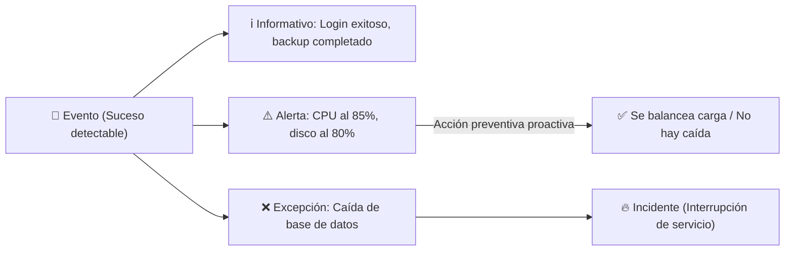
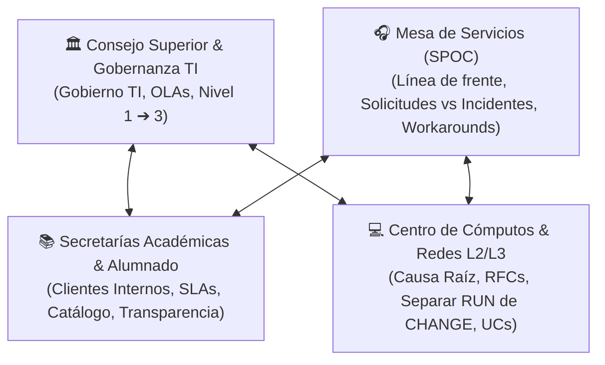
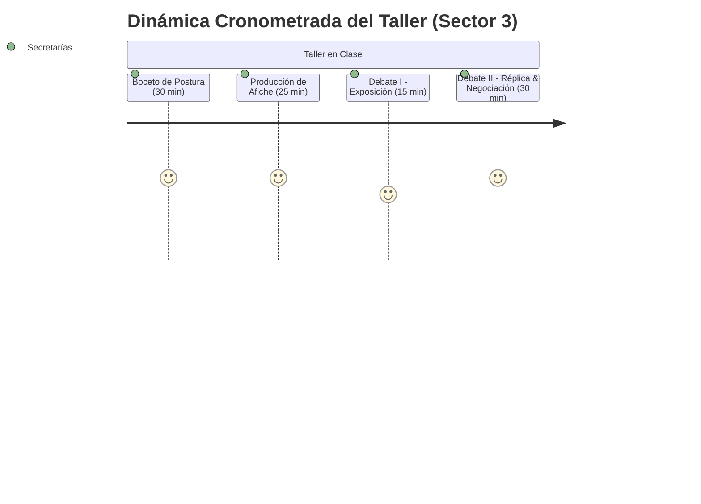
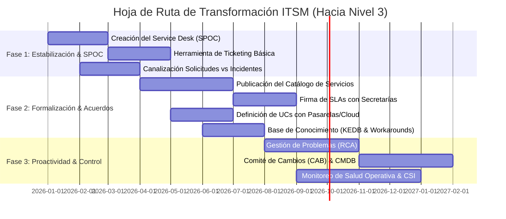
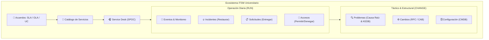

# TP N°7: Gestión Operativa de los Servicios TIC (ITSM / ITIL)

> [!INFO] **Contexto Académico**
> - **Materia:** Administración de Sistemas de Información (ADSI) - UTN FRC
> - **Unidad:** N°4 – Gestión Operativa de los Servicios TIC
> - **Resultado de Aprendizaje:** Diseñar una mesa de servicios TIC, considerando los procesos de negocio asociados a la gestión de servicios, para acompañar la transformación digital de una organización.

---

## 1. Guía de Lectura e Investigación Pre-Clase

### 1. ¿En qué está enfocado este Marco de Gestión IT (ITSM / ITIL)?
ITSM (*IT Service Management*) es un marco de gestión basado en **procesos**, cuyo foco principal es la **entrega de valor de punta a punta (End-to-End) al cliente y al negocio**, superando la visión tradicional de administrar tecnología aislada en silos funcionales.



* **Premisa fundamental:** Los servicios de TI existen para habilitar resultados del negocio sin que el cliente deba asumir la propiedad directa de los costos y riesgos específicos de la infraestructura.
* **Las 4 «P» de ITSM:** Para que la entrega de valor sea sostenible, deben articularse armónicamente:
  1. **Personas (*People*):** Cultura, competencias, roles y comunicación.
  2. **Procesos (*Processes*):** Flujos estructurados de actividades con entradas y salidas definidas.
  3. **Productos / Tecnología (*Products*):** Infraestructura, herramientas de soporte, redes y software.
  4. **Socios / Proveedores (*Partners*):** Proveedores externos y servicios tercerizados.

---

### 2. ¿Cuáles son los pasos clave de este Marco de Gestión IT?



1. **Definir el Catálogo de Servicios:** Mapear qué servicios de TI requiere el negocio y qué valor aportan.
2. **Establecer Acuerdos de Nivel de Servicio:** Definir métricas objetivas (SLAs) y de experiencia (XLAs) con los clientes.
3. **Implantar la Mesa de Servicios (*Service Desk*):** Establecer el SPOC (*Single Point of Contact*) para canalizar toda demanda de usuarios.
4. **Operar la Diaria (RUN):** Monitorear eventos, restaurar incidentes rápidamente y tramitar solicitudes de servicio y accesos.
5. **Eliminar Causas Raíz (Gestión de Problemas):** Analizar patrones de incidentes recurrentes, crear soluciones temporales (*Workarounds*) y registrar *Known Errors*.
6. **Gestionar la Configuración y los Cambios:** Registrar componentes en la CMDB y controlar modificaciones productivas mediante RFC y el comité CAB.
7. **Mejora Continua (*Continual Service Improvement - CSI*):** Medir KPIs, auditar y elevar progresivamente el nivel de madurez organizacional.

---

### 3. Cinco Ejemplos Prácticos del Impacto de ITSM en el Negocio

| #        | Situación SIN ITSM (Silos / Reactivo)                                                                                 | Situación CON ITSM / ITIL 4                                                                                                                 | Valor Real Entregado                                                                                       |
| :------- | :-------------------------------------------------------------------------------------------------------------------- | :------------------------------------------------------------------------------------------------------------------------------------------ | :--------------------------------------------------------------------------------------------------------- |
| **Ej 1** | El portal de matriculación/ventas colapsa en horario pico; los usuarios llaman a distintos técnicos y nadie coordina. | La **Mesa de Servicios (SPOC)** centraliza el reporte, declara Incidente Mayor, aplica un *Workaround* y notifica el estado en tiempo real. | Reducción drástica del *Downtime*, evitando pérdidas económicas y el deterioro de la imagen institucional. |
| **Ej 2** | Los pedidos de alta de usuarios nuevos o licencias se piden por pasillo o WhatsApp, demorando semanas.                | Se canaliza mediante la **Gestión de Solicitudes y Accesos** con flujos de aprobación automáticos y tiempos estandarizados.                 | Agilidad operativa, trazabilidad, seguridad en accesos y satisfacción inmediata del usuario.               |
| **Ej 3** | Un servidor se cuelga periódicamente cada viernes y el equipo se limita a reiniciarlo sin investigar.                 | La **Gestión de Problemas** realiza un Análisis de Causa Raíz (*RCA*), detecta un *memory leak* y publica una solución definitiva.          | Se erradica la falla de raíz, liberando al equipo técnico de "apagar incendios" recurrentes.               |
| **Ej 4** | Un desarrollador aplica un parche en la base de datos de producción un martes al mediodía y rompe el sistema.         | La **Gestión de Cambios (CAB)** evalúa impacto y riesgos, programa el despliegue en ventana nocturna y define plan de *rollback*.           | Continuidad operativa, estabilidad del entorno productivo y eliminación de caídas no planificadas.         |
| **Ej 5** | Se cae la pasarela de pagos externa y no hay contrato claro sobre quién responde ni en qué plazos.                    | Se gestiona un **Contrato Subyacente (UC)** alineado al **SLA**, con penalizaciones por incumplimiento y monitoreo continuo.                | Seguridad jurídica, calidad de servicio asegurada y respaldo formal ante proveedores clave.                |

---

### 4. Visión de Servicio vs. Visión Tecnológica



* **Diferencia conceptual:** Administrar en **silos** implica optimizar componentes aislados sin responsabilizarse por el resultado final. Gestionar **Servicios End-to-End** significa coordinar transversalmente todas las capas tecnológicas y humanas para garantizar que el proceso del cliente funcione de punta a punta.
* **Entrega de valor sin trasladar costos ni riesgos:** El área de TI asume la complejidad técnica, licencias, mantenimiento, seguridad y redundancia de infraestructura. El cliente solo consume el resultado (*outcome*) pagando un costo acordado y predecible, transfiriendo a TI el riesgo de obsolescencia o fallas técnicas.

---

### 5. Acuerdos de Servicio: SLA vs. XLA

* **SLA (*Service Level Agreement*):** Acuerdo contractual formal entre el proveedor de servicios de TI y el cliente donde se fijan metas cuantitativas y objetivas (ej. *Disponibilidad del 99.5%*, *Tiempo de respuesta < 15 min*, *MTTR < 2 horas*).
* **XLA (*Experience Level Agreement*):** Métrica moderna centrada en la **experiencia, percepción y satisfacción del usuario** al interactuar con el servicio (ej. *facilidad de uso, nivel de frustración, impacto en la productividad*).

> [!TIP] **El "Efecto Sandía" (*Watermelon Effect*)**
> Ocurre cuando todos los **SLAs están en verde por fuera** (los servidores estuvieron encendidos el 99% del tiempo), pero **por dentro la experiencia está en rojo** (el sistema fue tan lento que los usuarios no pudieron completar su trabajo). **El XLA complementa al SLA para evitar este desfasaje.**

---

### 6. Eventos vs. Incidentes



* **Evento:** Cualquier suceso detectable que tenga significancia para la gestión de la infraestructura o la entrega del servicio (informativo, advertencia o excepción).
* **Incidente:** Cualquier evento que **interrumpe** o **reduce la calidad** no planificada de un servicio de TI.
* **Ejemplo de Alerta que NO se vuelve Incidente:** Una herramienta de monitoreo detecta que el uso de memoria RAM en el servidor de base de datos supera el 85% (evento de *alerta*). El sistema de automatización o el operador de TI redistribuye la carga de consultas hacia un nodo secundario. Como el servicio nunca se interrumpió ni degradó para el usuario, **el evento se resolvió proactivamente sin convertirse en un incidente**.

---

### 7. Restaurar vs. Investigar (Incidentes vs. Problemas)

| Dimensión                 | Gestión de Incidentes                                                     | Gestión de Problemas                                                            |
| :------------------------ | :------------------------------------------------------------------------ | :------------------------------------------------------------------------------ |
| **Objetivo Principal**    | **Restaurar el servicio normal lo antes posible** minimizando el impacto. | **Identificar la causa raíz** de los incidentes y evitar su recurrencia.        |
| **Naturaleza**            | **Reactiva** (orientada a la urgencia y al tiempo de recuperación).       | **Proactiva / Analítica** (orientada a la investigación y calidad estructural). |
| **Mecanismo de Solución** | Utiliza **Soluciones Temporales (*Workarounds*)** o definitivas rápidas.  | Diseña soluciones definitivas y genera Requerimientos de Cambio (**RFC**).      |
| **Artefacto Clave**       | Ticket de Incidente / Registro de resolución.                             | Registro de Problema / Base de **Errores Conocidos (*KEDB*)**.                  |

---

### 8. ¿Qué es un *Workaround* (Solución Temporal)?
Un **Workaround** es una solución de contingencia o procedimiento alternativo que permite **restablecer la operatividad del servicio al usuario sin haber eliminado la causa raíz** que originó la falla.

**Características principales:**
1. **Inmediatez:** Su fin primordial es reducir el tiempo de inactividad (*Downtime*) y cumplir los SLAs.
2. **Causa raíz latente:** El defecto o error estructural sigue existiendo en el sistema.
3. **Documentación:** Debe quedar registrado formalmente en la base de datos de errores conocidos (*Known Error Database - KEDB*) para que cualquier técnico de la Mesa de Ayuda pueda aplicarlo.
4. **Temporalidad:** Se utiliza mientras la Gestión de Problemas analiza, prueba y despliega la solución definitiva mediante una RFC.

---

## 2. Protocolo de Taller en Clase (Grupal - Dinámica Cronometrada)

### El Escenario (Contexto de Discusión)
> *"Una histórica Universidad Pública abarca una amplia oferta académica distribuida en múltiples carreras de pregrado, grado y posgrado. Su 'Centro de Cómputos', heredado del siglo XX, funciona bajo un esquema puramente tecnológico y reactivo, donde no existe un 'Área de Servicios TI'. Cada inicio de cuatrimestre, el proceso de matriculación e inscripción a asignaturas colapsa por la alta concurrencia simultánea, generando filas presenciales interminables, caídas del sistema de días enteros, pérdida de actas y demoras de semanas para habilitar el usuario de campus virtual a los ingresantes, sectores donde no anda internet, lentitud para la realización de algunos trámites personales, problemas de asignación de aulas, falta de canales de comunicación formales establecidos, web con información sin actualización, problemas para realizar pagos con las plataformas de pagos contratadas, hay necesidades de actualización y creación de nuevas funcionalidades a los sistemas administrativos y académicos, etc. Las distintas secretarías culpan al Centro de Cómputos, mientras los técnicos argumentan que trabajan al límite apagando incendios sin presupuesto ni especificaciones claras. El Consejo Superior ha convocado a una mesa de trabajo para refundar la gestión de tecnologías en la Universidad bajo marcos ITSM/ITIL."*

### Argumentos y Manifiestos de Transformación por Sector



---

#### Sector 3: Secretarías Académicas, de Posgrado, Económico-Financiera y Alumnado (Clientes Internos del Servicio)

> [!IMPORTANT] **Rol Asignado: Clientes Internos del Negocio**
> Representamos la gestión de los procesos sustantivos de la Universidad (enseñanza, cobro de aranceles, administración de carreras y servicios a la comunidad académica). Evaluamos el desempeño tecnológico en función de la continuidad del negocio y el nivel de servicio entregado.

* **Foco del Rol:** Exigir Acuerdos de Nivel de Servicio (**SLA**) formales y auditables para la matriculación e inscripción de pregrado, grado y posgrado; mitigar el **Impacto Académico** derivado de interrupciones del servicio; estructurar la demanda mediante un **Catálogo de Servicios**; asegurar la **Disponibilidad del Servicio** en períodos críticos; y exigir la correcta gestión de proveedores externos mediante Contratos Subyacentes (**UC**).
* **Argumento Clave:** Como clientes internos, no evaluamos el esfuerzo técnico individual ni la tecnología aislada en silos, sino la **Disponibilidad del Servicio**, la eliminación del **Impacto Académico** negativo y la **Satisfacción del Usuario**. Para que el **SLA** sea viable, el área de TI debe comprometer Acuerdos de Nivel Operativo (**OLA**) internos entre sus grupos de soporte e infraestructura.
* **Terminología Obligatoria:** `SLA`, `Catálogo de Servicios`, `Impacto Académico`, `Disponibilidad del Servicio`, `Satisfacción del Usuario`.

---

### ⏱️ Guía de Ejecución de Actividades del Taller (Sector 3)



#### 📌 Actividad 1: Boceto de Postura (30 min)
*Objetivo:* Consolidar los fundamentos teóricos de la Unidad 4 para sustentar la posición de las Secretarías, integrando la terminología obligatoria y los acuerdos operativos (**OLA**).

##### A. Fundamentos Teóricos de la Postura (Unidad 4):

1. **Objetivos de Servicio vs. "Mejores Esfuerzos" (Slide 26):**
   - *Fundamento:* La teoría de ITSM explicita que los usuarios y clientes requieren **Servicios**, **Objetivos de Servicio cuantitativos** y **Alta Disponibilidad y Continuidad**, rechazando respuestas basadas en "mejores esfuerzos" o justificaciones técnicas aisladas.
   - La interrupción de 3 días en el proceso de inscripción genera un **Impacto Académico** directo que vulnera la planificación de comisiones y el inicio de clases.
   - ![[Pasted image 20260825192934.png|517]]

2. **Definición de Servicio y Transferencia de Costos/Riesgos (Slide 12):**
   - *Fundamento:* Un servicio de TI entrega valor al facilitar los resultados esperados por el cliente sin que este asuma la propiedad directa de los costos y riesgos específicos de la infraestructura.
   - La obsolescencia de los servidores del Centro de Cómputos constituye un riesgo de infraestructura de TI que no debe ser trasladado a las Secretarías en forma de demoras administrativas e **Impacto Académico**.
   - ![[Pasted image 20260825193008.png]]

3. **Responsabilidad de la Operación ante el Negocio (Slide 21) y Gestión de Problemas (Slide 41-43):**
   - *Fundamento:* Según la Slide 21, la Operación de Servicios es responsable ante el negocio de: 1) la prestación dentro de los niveles de servicio acordados (**SLA**), 2) optimizar costos y calidad, y 3) mantener la **Satisfacción del Usuario**.
   - Ante fallas recurrentes como la pérdida de actas o caídas de bases de datos, TI debe aplicar **Gestión de Problemas** y análisis de causa raíz (**RCA**) para erradicar el defecto de forma definitiva, eliminando el **Impacto Académico** y garantizando la integridad de los registros de examen.
   - ![[Pasted image 20260825193030.png|527]]

4. **Gestión de Terceros (UC) y Acuerdos Operativos Internos (OLA) (Slides 10 y 46-47):**
   - *Fundamento:* En el pilar de *Partners* (Slide 10), la integración con pasarelas de pago tercerizadas exige Contratos Subyacentes (**Underpinning Contracts - UC**) con penalizaciones y garantías de disponibilidad.
   - Asimismo, para que el área de TI garantice el **SLA** con las Secretarías, es imprescindible formalizar Acuerdos de Nivel Operativo (**OLA**) entre los administradores de redes, bases de datos y desarrollo. Sin **OLAs** internos, el soporte carece de trazabilidad y tiempos de respuesta coordinados.
   - ![[Pasted image 20260825193044.png|496]]
   - ![[Pasted image 20260825193100.png]]

##### B. Matriz de Anticipación y Defensas frente a los demás Sectores:

| Sector | Postura Prevista del Sector | Respuesta Técnica de las Secretarías |
| :--- | :--- | :--- |
| **Centro de Cómputos (L2/L3)** | *"Operamos al límite sin presupuesto, con servidores obsoletos y recibiendo pedidos de cambio sin especificación."* | **"Coincidimos en canalizar desarrollos mediante Requerimientos de Cambio (RFC), pero exigimos separar proyectos de la operación diaria (RUN). Las caídas e incidentes con alto Impacto Académico deben atenderse mediante Gestión de Problemas y OLAs internos entre sus áreas técnicas."** |
| **Service Desk (L1)** | *"Los usuarios no utilizan los canales formales y reclaman informalmente en ventanilla."* | **"El uso de la ventanilla se debe a la ausencia de un Catálogo de Servicios claro y a demoras de semanas en habilitar el Campus Virtual. Con un SLA comprometido y tiempos de entrega < 24 hs, la Satisfacción del Usuario aumentará y los canales digitales se adoptarán naturalmente."** |
| **Consejo Superior (Gobierno)** | *"Se busca coordinar la transición y distribuir recursos de forma equitativa sin conflictos interdepartamentales."* | **"La inversión en TI debe alinearse a los procesos misionales de la Universidad. Respaldamos la creación del Área de Servicios TI y los OLAs interdepartamentales, condicionando el presupuesto al cumplimiento de los SLAs y a la mitigación del Impacto Académico."** |

---

#### 🎨 Actividad 2: Producción del Afiche - "Manifiesto de Transformación Tecnológica" (25 min)
*Objetivo:* Diseñar un manifiesto estructurado que refleje la postura de las Secretarías como clientes internos, priorizando la formalización de acuerdos y la continuidad operativa.

```
+---------------------------------------------------------------------------------------+
|  🏛️ MANIFIESTO DE TRANSFORMACIÓN - CLIENTES INTERNOS (SECRETARÍAS)                    |
|  GESTIÓN DE SERVICIOS TIC BASADA EN PROCESOS, NIVELES DE SERVICIO Y VALOR ACADÉMICO  |
+---------------------------------------------------------------------------------------+
|                                                                                       |
|  📋 DIAGNÓSTICO OPERATIVO ACTUAL:                                                     |
|   • Discontinuidad del Servicio: Caídas reiteradas en períodos de matriculación.      |
|   • Severo Impacto Académico: Demoras en habilitación de Campus Virtual y actas.     |
|   • Ausencia de Formalización: Inexistencia de SLA, OLA y contratos UC de cobro.      |
|   • Gestión Reactiva: Respuestas sustentadas en "mejores esfuerzos" sin métricas.     |
|                                                                                       |
+---------------------------------------------------------------------------------------+
|  📌 PLIEGO DE CONDICIONES Y REQUERIMIENTOS (MARCO ITSM):                              |
|                                                                                       |
|   1. FORMALIZACIÓN DE ACUERDOS (SLA / OLA):                                           |
|      • SLA vinculante: 99.9% de Disponibilidad del Servicio en inscripciones.         |
|      • OLAs internos formalizados entre infraestructura, redes y desarrollo.          |
|                                                                                       |
|   2. PUBLICACIÓN DEL CATÁLOGO DE SERVICIOS:                                           |
|      • Procesos tipificados y tiempo máximo de entrega en Campus Virtual (< 24 hs).   |
|                                                                                       |
|   3. GESTIÓN DE PROVEEDORES EXTERNOS (UC):                                            |
|      • Contratos subyacentes con pasarelas de pago con penalizaciones por caída.      |
|                                                                                       |
|   4. GESTIÓN DE PROBLEMAS (RCA):                                                      |
|      • Análisis de causa raíz para erradicar definitivamente la pérdida de actas.     |
|                                                                                       |
+---------------------------------------------------------------------------------------+
|  🎯 LEMA INSTITUCIONAL:                                                               |
|  "LA TECNOLOGÍA DEBE SERVIR A LA ACADEMIA, Y NO LA ACADEMIA SER REHÉN DE LOS          |
|   SERVIDORES."                                                                        |
+---------------------------------------------------------------------------------------+
```

---

#### 🗣️ Actividad 3: Debate I - Guion de Exposición Inicial (15 min)
*Dinámica:* Exposición de 4 minutos por los 2 representantes del sector frente al Consejo Superior y los demás sectores.

* **Minuto 1 (Diagnóstico Operativo e Impacto Académico):**
  > *"Señores miembros del Consejo Superior y colegas de la mesa de trabajo: intervenimos en representación de las Secretarías Académicas, de Posgrado, Económico-Financiera y Alumnado en nuestra condición de clientes internos de los servicios de TI. Cada inicio de cuatrimestre, la caída simultánea de los sistemas genera un severo **Impacto Académico**: retrasos en la matriculación de miles de estudiantes de pregrado, grado y posgrado, demoras de semanas para habilitar usuarios en el Campus Virtual y desfasajes en el cierre de actas de examen. Nuestro rol no es evaluar componentes de hardware aislados, sino exigir que los procesos sustantivos de la Universidad operen con continuidad."*

* **Minuto 2 (Superación de los Silos Técnicos y Rol de los OLAs):**
  > *"Comprendemos que el Centro de Cómputos enfrenta limitaciones de equipamiento, pero en el marco de la gestión de servicios (Slide 21), la operación es responsable ante la organización de cumplir niveles de servicio y asegurar la **Satisfacción del Usuario**, no de justificar fallas en base a 'mejores esfuerzos'. La pérdida de actas o las fallas de conexión no pueden abordarse como incidentes aislados; requieren **Gestión de Problemas** y análisis de Causa Raíz. Asimismo, para que TI pueda comprometer un **SLA** con nosotros, debe estructurar Acuerdos de Nivel Operativo (**OLA**) entre sus propios grupos técnicos y exigir Contratos Subyacentes (**UC**) con garantías formales a los proveedores de pasarelas de pago."*

* **Minuto 3 (Propuesta: Catálogo de Servicios y Disponibilidad Garantizada):**
  > *"Nuestra propuesta se estructura en tres ejes concretos:  
  > 1. Publicación de un **Catálogo de Servicios** que defina con claridad los trámites habilitados y fije tiempos máximos de entrega, tales como el alta en Campus Virtual en menos de 24 horas.  
  > 2. Firma de Acuerdos de Nivel de Servicio (**SLA**) que establezcan una **Disponibilidad del Servicio** del 99.9% durante los períodos de matriculación y exámenes, mitigando el **Impacto Académico**.  
  > 3. Integración de la Mesa de Servicios como Punto Único de Contacto (SPOC) para canalizar solicitudes formales y aplicar soluciones temporales (Workarounds) estandarizadas ante contingencias."*

* **Minuto 4 (Cierre y Condición Institucional):**
  > *"Respaldamos la creación formal del Área de Servicios TI y la reasignación presupuestaria en el Consejo Superior, sujeta a una condición técnica: la asignación de recursos debe estar vinculada al cumplimiento verificable de los **SLAs**, la articulación de **OLAs** internos y la medición sistemática de la **Satisfacción del Usuario**. La tecnología debe servir a la academia, y no la academia ser rehén de los servidores."*

---

#### ⚔️ Actividad 4: Debate II - Estrategia de Intercambio y Réplicas (30 min)
*Dinámica:* 4 minutos de intercambio cruzado + 2 minutos de réplica directa.

##### Guiones de Réplica Directa (2 minutos) ante intervenciones de los demás sectores:

1. **Ante la intervención del Centro de Cómputos (falta de presupuesto y solicitudes sin especificación):**
   - 🎤 **Réplica Técnica:**  
     > *"Coincidimos en la necesidad de canalizar desarrollos y modificaciones mediante Requerimientos de Cambio (RFC) formales. Sin embargo, debe diferenciarse la gestión de proyectos del mantenimiento operativo diario (RUN). Asegurar la **Disponibilidad del Servicio** en inscripciones y preservar la integridad de las actas son responsabilidades operativas básicas que previenen un grave **Impacto Académico**. Apoyamos la solicitud de presupuesto, pero exigimos que se implementen **OLAs** internos y Gestión de Problemas para estabilizar la infraestructura existente."*

2. **Ante la intervención de la Mesa de Servicios (atención informal en ventanilla):**
   - 🎤 **Réplica Técnica:**  
     > *"La afluencia de estudiantes a la ventanilla presencial es consecuencia directa de la falta de un canal formalizado y de demoras de semanas en trámites críticos como el acceso al Campus Virtual. Si el Service Desk publica un **Catálogo de Servicios** con tiempos de resolución predecibles bajo **SLA** y aplica Workarounds efectivos, la **Satisfacción del Usuario** se incrementará y la comunidad académica canalizará la totalidad de sus solicitudes por la vía digital."*

3. **Propuesta de Articulación ante el Consejo Superior:**
   - 🎤 **Intervención de Cierre:**  
     > *"Señor Presidente del Consejo Superior: las Secretarías avalamos la formalización del Área de Servicios TI y la adopción de Acuerdos de Nivel Operativo (**OLA**) interdepartamentales. Solicitamos que la gobernanza universitaria catalogue los procesos de matriculación, examen y cobranza como servicios de misión crítica, estableciendo auditorías trimestrales sobre el cumplimiento de los **SLAs** y la **Satisfacción del Usuario** para garantizar que no se repitan situaciones de **Impacto Académico** negativo."*

---

# 3. Trabajo en Casa (Post-Clase)

### 3.1. Diseño de la Matriz de Priorización Universitaria

La prioridad se determina combinando el **Impacto** (alcance del daño al negocio/comunidad académica) y la **Urgencia** (tiempo crítico disponible para resolver la situación):

$$\text{Prioridad} = \text{Impacto} \times \text{Urgencia}$$

| Urgencia \ Impacto | **Alto** (Afecta a toda la Univ. / Misión crítica) | **Medio** (Afecta a un departamento / grupo) | **Bajo** (Afecta a un usuario individual) |
| :--- | :---: | :---: | :---: |
| **Alta** (Inmediata / Bloqueante) | 🔴 **CRÍTICA (P1)** | 🟠 **ALTA (P2)** | 🟡 **MEDIA (P3)** |
| **Media** (Plazo moderado / Hay alternativa) | 🟠 **ALTA (P2)** | 🟡 **MEDIA (P3)** | 🟢 **BAJA (P4)** |
| **Baja** (Planificable / No urgente) | 🟡 **MEDIA (P3)** | 🟢 **BAJA (P4)** | 🟢 **BAJA (P4)** |

```mermaid
quadrantChart
    title Matriz de Priorización Universitaria
    x-axis Urgencia Baja --> Urgencia Alta
    y-axis Impacto Bajo --> Impacto Alto
    quadrant-1 🔴 CRÍTICA (P1): Colapso Inscripciones
    quadrant-2 🟡 MEDIA (P3): Solicitud Nueva Funcionalidad
    quadrant-3 🟢 BAJA / MEDIA: Web Desactualizada
    quadrant-4 🟠 ALTA (P2): Conectividad Sector Administrativo
```

#### Justificación de los 4 Casos del Escenario:

1. **a) Colapso del portal de matriculación e inscripciones ➔ 🔴 PRIORIDAD CRÍTICA (P1)**
   - **Impacto:** *Alto*. Paraliza el proceso central de la universidad (ingresantes, alumnos regulares y docentes), genera filas presenciales multitudinarias y riesgo de pérdida de actas.
   - **Urgencia:** *Alta*. Hay ventanas temporales y fechas límite impostergables de inicio lectivo.
   - **Acción:** Activación de Incidente Mayor, comité de crisis, aplicación de *Workaround* (escalonamiento por DNI o carrera) y soporte continuo L2/L3.

2. **b) Fallas de conectividad en un sector administrativo ➔ 🟠 PRIORIDAD ALTA (P2)**
   - **Impacto:** *Medio*. Afecta a un grupo completo de trabajo (ej. oficina de tesorería o alumnado), frenando trámites y cobros de esa dependencia.
   - **Urgencia:** *Alta/Media*. Si bloquea trámites arancelarios o de cierre de actas, requiere atención en menos de 2 a 4 horas.
   - **Acción:** Diagnóstico de red L2 (switches/APs) y derivación a soporte de infraestructura.

3. **c) Solicitud de una nueva funcionalidad en el sistema académico ➔ 🟢 PRIORIDAD BAJA / MEDIA PLANIFICADA (P4)**
   - **Impacto:** *Variable (Medio/Bajo a corto plazo)*. No interrumpe ningún servicio existente.
   - **Urgencia:** *Baja*. No constituye un incidente; es un requerimiento evolutivo.
   - **Acción:** No entra por cola de incidentes. Se canaliza como **Requerimiento de Cambio (RFC)** o iniciativa de proyecto, para análisis de factibilidad, costeo y programación en el *roadmap* de desarrollo.

4. **d) Información desactualizada en la página web ➔ 🟡 PRIORIDAD MEDIA / BAJA (P3)**
   - **Impacto:** *Medio/Bajo*. Puede inducir a errores o confusiones a ingresantes respecto a cronogramas o requisitos, pero no bloquea la infraestructura operativa.
   - **Urgencia:** *Media*. Debe corregirse en el día mediante la Gestión de Solicitudes/Contenidos Web con plantilla predefinida.

---

### 3.2. Evaluación y Hoja de Ruta de Madurez ITSM

#### Diagnóstico: ¿Por qué el "Centro de Cómputos" está en el Nivel 1 (Centro de Costos / Silos)?
* **Operación aislada y fragmentada:** Los técnicos trabajan en silos (redes por un lado, servidores por otro, desarrollo aislado), sin comunicación ni visión de servicio *End-to-End*.
* **Cultura puramente reactiva:** Se opera "apagando incendios" a demanda sin registro histórico de incidentes ni análisis de causa raíz.
* **Ausencia de procesos y canales formales:** La atención es por "pasillo", mail personal o quejas a viva voz; no existe un Service Desk (SPOC) ni Catálogo de Servicios.
* **Falta de acuerdos y métricas:** No existen SLAs con las secretarías ni contratos formales con proveedores (UCs con pasarelas de pago), lo que deriva en culpas cruzadas y desconfianza institucional.

---

#### Hoja de Ruta en 3 Fases hacia el Nivel 3 (Cumplimiento de Servicios / *Service Fulfillment*)



##### Fase 1: Estabilización y Punto de Contacto (Transición Nivel 1 ➔ Nivel 2)
* **Objetivo:** Ordenar la demanda de usuarios y terminar con la atención informal.
* **Acciones:**
  1. Formalizar e instituir la **Mesa de Servicios (Service Desk)** como Punto Único de Contacto (SPOC) mediante portal web y correo único.
  2. Implementar una herramienta de gestión (*ITSM Tool*) para registro y trazabilidad de tickets.
  3. Separar en la recepción las **Solicitudes de Servicio estándar** (altas de campus, reseteo de claves) de los **Incidentes operativos**.
  4. Diseñar la Matriz de Priorización básica y capacitar al personal de L1 en tiempos de respuesta.

##### Fase 2: Formalización de Acuerdos y Estandarización de Procesos (Consolidación Nivel 2 ➔ 3)
* **Objetivo:** Establecer compromisos claros entre TI, las secretarías y los proveedores externos.
* **Acciones:**
  1. Publicar el **Catálogo de Servicios TIC Universitarios**, definiendo alcances y requisitos de cada trámite o sistema.
  2. Negociar y firmar **SLAs (Acuerdos de Nivel de Servicio)** con las Secretarías Académicas y Administrativas, y **OLAs** internos entre soporte y desarrollo.
  3. Auditar y renegociar contratos de proveedores externos (**UC - Underpinning Contracts**) para pasarelas de pago, conectividad e infraestructura cloud con penalizaciones por caída.
  4. Construir la **Base de Conocimiento (*KEDB*)** con *Workarounds* homologados para que L1 resuelva incidentes repetitivos en el primer contacto.

##### Fase 3: Proactividad, Control y Mejora Continua (Alcanzar Nivel 3 Pleno)
* **Objetivo:** Mover la organización hacia una operación proactiva orientada a la calidad y estabilidad.
* **Acciones:**
  1. Desplegar la **Gestión de Problemas**: análisis de causa raíz (*RCA*) para resolver fallas estructurales en el sistema de matriculación y base de datos de actas.
  2. Institucionalizar la **Gestión de Cambios (CAB)**: todo cambio a producción requiere solicitud RFC, análisis de riesgo y ventana de mantenimiento planificada.
  3. Implementar **Gestión de Eventos y Monitoreo** preventivo de "salud operativa" (consumo de CPU, memoria, enlaces de red, umbrales MTBF).
  4. Establecer reuniones periódicas de revisión de SLAs/XLAs e iniciar ciclos de Mejora Continua (**CSI**).

---

### 3.3. Reflexión Final Grupal

> La adopción de marcos de gestión de servicios como **ITSM / ITIL** en una institución pública universitaria representa un cambio de paradigma cultural y operativo imprescindible. Permite transformar el rol de la tecnología, dejando de ser un "centro de cómputos aislado que apaga incendios" para convertirse en un **habilitador estratégico de la educación pública**.
> 
> A través de la estandarización de procesos, la transparencia en los tiempos de respuesta mediante SLAs, la centralización de la atención en un Service Desk y la separación de las operaciones diarias del desarrollo evolutivo, se garantiza:
> - **Sostenibilidad operativa:** Sistemas estables y disponibles durante periodos críticos como matriculaciones y exámenes.
> - **Eficiencia del gasto público:** Inversión tecnológica fundamentada en el valor entregado y no en compras espasmódicas de hardware.
> - **Satisfacción comunitaria:** Alumnos, docentes y personal no docente reciben servicios digitales accesibles, ágiles y confiables, potenciando la inclusión y la excelencia académica.

---

## 4. Mapa Conceptual Resumen



---

# Terminología Obligatoria: SLA, Catálogo de Servicios, Impacto Académico, Disponibilidad del Servicio, Satisfacción del Usuario.

Esta sección consolida los 5 conceptos técnicos indispensables que fundamentan la postura y defensa de nuestro rol (**Sector 3: Secretarías Académicas y de Gestión**), detallando su significado formal según el marco **ITSM / ITIL (Unidad 4)** y su aplicación directa en el **escenario de la Universidad Pública**.

---

### 1. SLA (Service Level Agreement - Acuerdo de Nivel de Servicio)

* **¿Qué significa conceptualmente?**  
  Es un **acuerdo formal, documentado y firmado** entre el proveedor de servicios de TI y el cliente del negocio (en este caso, las Secretarías). Su objetivo es fijar expectativas realistas y compromisos cuantitativos sobre la calidad del servicio, estableciendo métricas objetivas como tiempos máximos de respuesta, tiempos de resolución (*MTTR*) y porcentajes mínimos de disponibilidad.
* **Ejemplo aplicado en nuestro caso universitario:**  
  Las Secretarías exigimos al Área de Servicios TI un **SLA contractual y vinculante** para el período crítico de inicio de cuatrimestre, que establezca:
  - **Disponibilidad del 99.9%** en el portal web de inscripciones y matriculación durante las 2 semanas pico de autogestión.
  - **Tiempo de Primera Respuesta < 15 minutos** y resolución de incidencias bloqueantes en menos de 2 horas.
  - **Tiempo de Entrega < 24 horas** para las solicitudes de alta de usuarios en el Campus Virtual a ingresantes (terminando con las demoras de semanas).
* **Impacto en el Negocio / Academia:**  
  Pasa de una relación basada en "excusas y mejores esfuerzos" a un compromiso medible con penalizaciones y revisiones periódicas.

---

### 2. Catálogo de Servicios (Service Catalogue)

* **¿Qué significa conceptualmente?**  
  Es la **fuente única de información estructurada y pública** que describe todos los servicios de TI en producción disponibles para los usuarios y clientes. Define claramente qué ofrece TI, a quién, bajo qué condiciones, cuáles son las entradas requeridas para iniciar un trámite, qué niveles de servicio (SLAs) aplican y quién es el dueño (*Service Owner*) de cada proceso.
* **Ejemplo aplicado en nuestro caso universitario:**  
  La publicación del **Catálogo de Servicios TIC Universitarios** accesible desde el portal web del Service Desk (SPOC), donde estudiantes, docentes y secretarías pueden solicitar trámites formalizados con plantillas predefinidas:
  - *Servicio de Alta y Acceso al Campus Virtual.*
  - *Servicio de Asignación y Reserva de Aulas Físicas / Híbridas.*
  - *Servicio de Emisión y Rectificación de Actas de Examen.*
  - *Servicio de Integración y Cobro por Pasarela de Pagos Arancelarios.*
  - *Servicio de Actualización de Contenidos y Noticias Web.*
* **Impacto en el Negocio / Academia:**  
  Elimina por completo el "pedido informal de pasillo" o el correo electrónico a un técnico en particular, brindando previsibilidad, transparencia y trazabilidad del estado de cada trámite.

---

### 3. Impacto Académico

* **¿Qué significa conceptualmente?**  
  Es la **magnitud del daño, alteración, retraso o pérdida** que una indisponibilidad, falla o degradación en los servicios de TI provoca sobre las funciones sustantivas y misionales de la institución educativa (docencia, investigación, cursado de materias, evaluación en mesas de examen y graduación). En la matriz de priorización, determina la gravedad (*P1 Crítica*, *P2 Alta*, etc.).
* **Ejemplo aplicado en nuestro caso universitario:**  
  Las caídas del sistema durante 3 días enteros generaron un **Impacto Académico Crítico (P1)** evidenciado en:
  - Miles de estudiantes ingresantes que no pudieron asistir a sus primeras clases virtuales ni descargar material por falta de usuario.
  - Docentes imposibilitados de asentar notas, resultando en actas de examen extraviadas o no computadas para correlatividades.
  - Colapso físico con filas interminables en ventanilla bajo el sol y riesgo de deserción estudiantil temprana.
* **Impacto en el Negocio / Academia:**  
  Demuestra que un fallo tecnológico no es un simple "problema de servidores", sino una crisis institucional que afecta directamente el derecho a la educación y el prestigio universitario.

---

### 4. Disponibilidad del Servicio (Service Availability)

* **¿Qué significa conceptualmente?**  
  Es la **capacidad técnica y operativa de un servicio de TI de estar accesible y realizar su función requerida** en el momento en que los usuarios lo necesitan, dentro de los horarios acordados. Se mide cuantitativamente mediante la fórmula:
  $$\text{Disponibilidad (\%)} = \frac{\text{Uptime (Tiempo operativo)}}{\text{Uptime} + \text{Downtime (Tiempo de inactividad)}} \times 100$$
* **Ejemplo aplicado en nuestro caso universitario:**  
  Las Secretarías exigimos que el Centro de Cómputos asegure una **alta disponibilidad real (24/7)** durante los períodos de matriculación mediante redundancia de servidores, monitoreo preventivo de "salud operativa" (evitando que el uso de CPU/RAM llegue al 100%) y balanceo de carga:
  - Si el período de matrícula dura 10 días (240 horas), una disponibilidad del 99.9% permite un *Downtime* máximo acumulado de apenas **14 minutos**, en contraste con los **3 días de caída continua (72 horas / 70% de disponibilidad)** que experimentaba la Universidad bajo el esquema tradicional en silos.
* **Impacto en el Negocio / Academia:**  
  Garantiza que la concurrencia simultánea masiva no tire abajo el sistema, permitiendo que la totalidad del alumnado se inscriba a tiempo desde sus hogares.

---

### 5. Satisfacción del Usuario (User Satisfaction & XLAs)

* **¿Qué significa conceptualmente?**  
  Es la **métrica que evalúa la percepción, experiencia subjetiva y grado de conformidad** de los usuarios finales (estudiantes, profesores, personal administrativo) al utilizar los servicios y recibir atención de TI. En marcos modernos de ITSM se instrumenta a través de los **XLAs (*Experience Level Agreements*)**, asegurando que los servicios no solo estén técnicamente "encendidos", sino que sean fáciles de usar, ágiles y resuelvan las necesidades sin fricción.
* **Ejemplo aplicado en nuestro caso universitario:**  
  Implementación de encuestas breves y automáticas (de 1 a 5 estrellas con campo de comentarios) que el *Service Desk* dispara al alumno o docente cada vez que se cierra un ticket o trámite:
  - Si el portal de inscripciones estuvo encendido pero la pasarela de pagos cobró dos veces por error, el SLA técnico figurará en "verde", pero el **XLA de Satisfacción del Usuario estará en "rojo"**.
  - Esta métrica obliga al Área de TI a realizar análisis de Causa Raíz (*RCA*), auditar a los proveedores externos (*UCs*) y orientar la mejora continua (*CSI*) hacia la experiencia real de la comunidad universitaria.
* **Impacto en el Negocio / Academia:**  
  Restaura la confianza institucional de los estudiantes y docentes en la Universidad pública y erradica el "efecto sandía" (servicios verdes por fuera para TI, pero rojos por dentro para el usuario).

---

# References
## Parent Notes
- [[Map Of Content DSI]]
## Related Theoretical Material
- [[ADSI_-_ADM_SIST_INF_2025_-_UNIDAD_4.pdf]]
- [[2026-4k#-Grupo #-TP 7.Gestión de Servicios IT. E.2.docx]]
