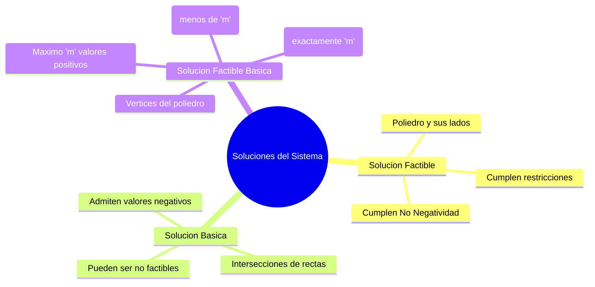

¡Hola! Como tu Tutor Académico de Élite, he analizado detalladamente la transcripción de tu clase teórica-práctica sobre la interpretación del [[Método Gráfico]] y la clasificación de soluciones.

Esta fue una clase fundamental, ya que la profesora introdujo conceptos teóricos estrictos que son evaluados en los parciales, como la estandarización del modelo y la taxonomía de las soluciones.

A continuación, te presento el índice cronológico estructurado con los elementos visuales y alertas metodológicas exigidas para tu preparación.

---


## 1. intro (0:00 - 4:46)
![[{5924D57A-A5FB-455E-A0B9-6F028C637ADD}.png]]

>[!question]- que significa resolver el problema?
>Encontrar los valores de las variables que cumplan todas las restricicones del problema y que optimicen a la funcion objetivo


![[{BD553208-A759-4CFA-A08F-C6A0E9911997}.png|562]]

La profesora detalló el algoritmo manual para resolver problemas de dos variables de decisión dibujándolos en un plano cartesiano (ubicando el problema en el primer cuadrante gracias a la [[Condición de No Negatividad]]).

1)Para hacer la primera restriccion 
	primero lo planteamos como una igualdad , y luego resuevlo la ecuacion encontrando por los puntos que pasa la recta![[{146873BF-48EA-468C-B88B-950875E0E8D2}.png|503]]

2) Identificación de Semiplanos:** Para graficar las inecuaciones, primero se dibuja la recta de igualdad. Para saber hacia qué lado sombrear, la profesora recomendó no guiarse por la intuición, sino evaluar un punto de prueba.
> [!tip] Tip de la Profesora (Punto de Prueba) Toma un punto fácil, como el origen $(0,0)$, y reemplázalo en la inecuación original. Si la desigualdad resultante es verdadera, el semiplano correcto es el que contiene a ese punto; si es falsa, se pinta hacia el lado contrario.
> ![[{32E5F11F-44AE-4EA5-A739-FB14537EB11C}.png]]

![[{E1EFBB05-0F01-4107-8862-D450B3F0066C}.png|297]]

exactamente lo mismo para las otras restricciones
![[{64554091-E82D-4BA0-9A67-3CB6F861D331}.png|400]]
![[{089E54E2-FA60-4749-B91E-3C30B1DC0896}.png|401]]

----
>[!note] el conjunto de punto que cumple simultaneamnte con todas las  restricciones es  un conjunto de soluciones tmb llamado poliedro de soluciones

- **La [[Región Factible]]:** Es la intersección de todos los semiplanos válidos en el primer cuadrante (por la [[Condición de No Negatividad]]). Representa todas las combinaciones de producción posibles.
![[{A02CE2AA-4CF9-4F36-B851-ACEA48A99E77}.png|542]]

## 2. La [[Función Objetivo]] y el [[Vértice Óptimo]] (18:58 - 28:56)

Una vez dibujado el [[Poliedro de Soluciones]], 
![[{77316E75-C220-4F0D-8A45-0675EFB70766}.png|376]]

se procede a buscar el punto que maximice el beneficio.

- **Valor Arbitrario a Z:** Se le asigna un valor cualquiera a Z (que encaje en la escala del gráfico) para poder trazar la inclinación (pendiente) inicial de la recta.
![[{5C452C55-59AC-4509-8148-02832930ED26}.png|400]]

- **Desplazamiento Paralelo:** Se desplaza la recta en el sentido de optimidad (aumentando la ordenada al origen).
- ![[{8E6DD158-FC59-4E49-B872-497F964565D0}.png|508]]

> [!danger] Trampa de Parcial: La "Distancia al Origen" La profesora advirtió sobre un error fatal en los exámenes: definir el óptimo como "el punto más alejado del origen". Explicó que esto es incorrecto porque involucra el concepto geométrico de distancia. La definición estricta es: **es el último punto que tienen en común la recta de la función objetivo y el poliedro de soluciones**.**

![[{0E64545A-D8CF-4F2B-878C-5476560710D5}.png|568]]
- **Resolución Analítica:** Una vez identificado visualmente el vértice, sus valores exactos ($x_1, x_2$) se obtienen resolviendo el [[Sistema de Ecuaciones]] formado exclusivamente por las rectas que se cruzan en ese punto (usando Gauss-Jordan o igualación).
![[{7ADA4171-5585-4B1B-B16F-C2835F8236A8}.png|431]]

## 3. Práctica Autónoma y Revisión de Errores (28:56 - 1:08:31)
[[▶️Problema 2.31]]

La profesora pausa la exposición para que los alumnos resuelvan el caso "Fruits SA" en el Aula Virtual (UV). Al regresar, se analizan los fallos.

- **El Error de la Pendiente:** Varios alumnos eligieron un vértice equivocado. La profesora detectó que dibujaron mal la inclinación de la recta Z. _"El óptimo depende de la inclinación de la recta Z... por eso hay que prestar atención al dibujarla"_.
- **Cálculos Posteriores (Salidas):** Se recordó que si el problema pide "litros de concentrado producidos", no basta con el valor de la variable (que era "litros de pulpa ingresada"), sino que hay que aplicar la tasa de transformación (merma).

---


## repaso de metodto grafico
1. Graficar las restricciones e identificar el conjunto de soluciones posibles o region factible delp roblema
	1. ![[{00D46263-E724-438E-99D8-A232B8BBE6F0}.png]]
2. Trazar la recta representativa de la funcion objetivo
	1. ![[{2DCB34FA-C5E1-4425-AD45-0AE828556F66}.png]]
3. 3. Desplazar la recta en el sentido de optimización hasta identificar el último punto de contacto entre la recta y la región factible. Este punto es la solución óptima y corresponde a un vértice del poliedro de soluciones.
	1. JATENCION!EL ÓPTIMO DEPENDE DE LA INCLINACIÓN DE Z
4. Encontrar los valores de las variables que optimizan la función objetivo, resolviendo en forma simultánea las ecuaciones de restricción que determinan el punto óptimo. Reemplazar estos valores en Z para encontrar su valor.
5. Encontrar los valores de las variables de holgura/excedente, reemplazando los valores de las variables de decisión en cada una de las ecuaciones de restricción.
## 4. Análisis de Recursos y [[Variables Implícitas]] (1:08:31 - 1:22:15)

Se vuelve al gráfico de "Manuel" para analizar qué ocurre económicamente en el [[Vértice Óptimo]].
![[{AB322D18-77F8-4A2E-A605-77C3B7F5F918}.png]]

- **[[Restricción Limitante]]:** Como el punto óptimo se ubica sobre la recta de horas de máquina y mano de obra, el recurso se agota. _El uso es igual a la disponibilidad._
- **[[Restricción No Limitante]]:** El punto cae por debajo de la recta de materia prima. _El uso es menor a la disponibilidad._
	- ![[{224E61EE-CE0B-4CBF-9372-3386FBB0484F}.png]]


## 5. Estandarización y [[Variables Implícitas]]
![[{E423EA39-110E-46B7-A838-45BDBAAD99B2}.png]]
Para poder resolver matemáticamente los algoritmos, la profesora explicó que el modelo debe pasar a su [[Forma Estándar]], transformando todas las inecuaciones originales en ecuaciones de igualdad.

Para lograr esto, se deben "sacar a la luz" variables que ==estaban implícitas en el modelo original==, sumando o restando las diferencias entre el uso y la disponibilidad.

|Signo Original de la Restricción|Ajuste al Modelo|Nombre Técnico|Impacto en la [[Función Objetivo]]|
|:--|:--|:--|:--|
|**Menor o Igual ($\le$)**|Se Suma ($+S$)|[[Variable de Holgura]]|Entra con coeficiente nulo ($0$).|
|**Mayor o Igual ($\ge$)**|Se Resta ($-S$)|[[Variable de Excedente]]|Entra con coeficiente nulo ($0$).|
|**Igualdad ($=$)**|Ninguno|N/A|No lleva variables adicionales.|
![[{31FAEB6B-1F44-4857-B1CC-FFF96DF5B008}.png|338]]

y aca faltarian todas las otras, es una por restriccion

> [!question] Dudas de Clase: ¿La variable restada es negativa? Ante la consulta sobre el signo de la variable de excedente, la profesora aclaró enérgicamente: _"Ojo, la resto, no es que la variable sea negativa... la variable siempre va a ser no negativa"_. Toda variable agregada obedece la [[Condición de No Negatividad]].

---

## 6. Taxonomía y [[Clasificación de Soluciones]] (1:22:15 - 1:59:35)

El último bloque fue puramente teórico, apoyado en el software PHPSimplex para visualizar los conceptos. Para clasificar soluciones, el modelo debe estar estandarizado. 

![[{6AE03917-39EC-4C88-98F6-99AD34AB21B1}.png]]

- **[[Solución Factible]]:** Cualquier punto dentro del poliedro verde o en sus lados (cumple todas las restricciones y la no negatividad).
- **[[Solución Básica]]:** Todas las intersecciones posibles entre las rectas. Muchas de ellas caen fuera de la región válida (tienen valores negativos y son **no factibles**). (C;G;D O; I;B;F....)
	- **[[Solución Factible Básica]]:** Son exclusivamente los **vértices** del poliedro de soluciones.  (O;EC;D;I)    (TIENE COMO MAXIMO m valores positivos, que son los vertices del poliedro de soluciones)
	    - _No Degenerada:_ Tiene exactamente $m$ valores positivos.
	    - _Degenerada:_ Tiene estrictamente menos de $m$ valores positivos.
	- Solucion factibles no basicas: tiene mas de m valores positivos y son aquellas que se encunetra dentro del poliedro de soluciones y en los lados excluidos los vertices


se definen $n$ como el número total de variables (incluyendo holguras) y $m$ como el número de restricciones sin considerar las de no negativa.
- $n$: Total de variables (decisión + holguras/excedentes).
	- en nuestro ejemplo n= 5
- $m$: Total de restricciones.
	- en nuestro ejemplo m= 3

EJEMPLO
![[{9A825682-7D6D-4533-AB5F-CD41673F4214}.png|443]]

otros ejemplos
![[{BF8C398D-9255-4BD0-A7C1-98113AF0A091}.png]]
![[{62B31AC7-7C79-4CA9-8DC2-ACBE75F49153}.png]]

> [!note] Teorema de Límite de Soluciones (Combinatoria) La profesora indicó que, mientras las soluciones factibles son infinitas, el número máximo de soluciones básicas que puede tener un modelo (y su cota superior de vértices factibles) se calcula con la fórmula: $$C_{n,m} = \frac{n!}{m!(n-m)!}$$




---


## 7. Resolución Integrada en Software (1:59:35 - Fin)

Para cerrar, la profesora muestra cómo el software **PHPSimplex** resuelve el modelo "Fruits SA" y marca los conceptos teóricos enseñados.

- Puntos **Verdes**: [[Vértice Óptimo]] (Solución factible básica óptima).
- Puntos **Blancos**: Vértices restantes de la [[Región Factible]] (Soluciones factibles básicas).
- Puntos **Rojos**: Intersecciones que caen fuera de la región válida (Soluciones básicas no factibles).


# ----


---

# Énfasis de la Profesora y "Trampas" Metodológicas

La profesora fue muy enfática en señalar falencias críticas al momento de identificar la solución y clasificar los resultados de un `[[Modelo de Programación Lineal]]`.

### 1. La Trampa Mortal de la "Distancia al Origen"

Este es uno de los errores más comunes en los exámenes al momento de justificar la elección del `[[Vértice Óptimo]]`.

> [!danger] Trampa de Parcial: El "Punto Más Alejado" La profesora advirtió explícitamente: _"Cuidado, no es el punto más alejado del origen... suelen contestar eso y no es verdad"_. Explicó que esto involucra el concepto geométrico de distancia, el cual es erróneo. El óptimo verdadero se define dinámicamente como **el último punto que tienen en común la recta de la `[[Función Objetivo]]` y el poliedro de soluciones** al desplazar $Z$.

### 2. Clasificación de Soluciones (Exigencia Teórica)

La profesora detuvo la clase para exigir la memorización de la taxonomía de las soluciones (básicas, factibles, degeneradas), indicando que _"son conceptos básicos... los tienen que aprender y se los tienen que grabar porque los vamos a necesitar"_.

> [!tip] Tip de Examen y Cota Superior Subrayó que el cálculo combinatorio $C_{n,m}$ no solo da el máximo de soluciones básicas, sino que es la cota superior del número de vértices que puede tener la `[[Región Factible]]`.

### 3. Cuidado con el Signo en la Estandarización

Al transformar el modelo a su `[[Forma Estándar]]`, se introducen `[[Variables de Excedente]]` restándolas al lado izquierdo de las inecuaciones de tipo $\ge$.

> [!danger] Trampa de Signo (Variable Negativa) Ante la confusión visual del signo menos, la profesora sentenció: _"Ojo, la resto, no es que la variable sea negativa... la variable siempre va a ser no negativa"_. Toda variable agregada obedece siempre la `[[Condición de No Negatividad]]`.

### 4. La Inclinación de la `[[Función Objetivo]]`

Al revisar el trabajo práctico de "Fruits SA", notó que varios alumnos eligieron un vértice equivocado. Explicó que esto sucede porque dibujan la recta de la función $Z$ con una inclinación incorrecta o invirtiendo los ejes. _"El óptimo depende de la inclinación de la recta Z... por eso hay que prestar atención al dibujarla"_.

---

# Consultas Relevantes de los Alumnos en Clase

La dinámica de la clase generó un alto nivel de interacción. Aquí te resumo cada intercambio clave que destrabó las confusiones más comunes:

> [!question] Pregunta 1: El "Falso Amigo" del Semiplano (Min 13:51) **Alumno:** Al graficar, un alumno sugirió que la región válida es _"todo lo que está debajo de la recta..."_. **Respuesta de la Profesora:** Corrigió rápidamente esa intuición. Aclaró que pintar hacia abajo depende estrictamente de los signos de los coeficientes. Dictó una regla infalible: **asignar un punto de prueba** (como el origen $0,0$) en la inecuación original. Si el resultado es verdadero, el `[[Semiplano]]` correcto es el que contiene a ese punto.

> [!question] Pregunta 2: Incertidumbre sobre el Vértice Óptimo (Min 27:32) **Alumno:** _"¿Cómo sabemos que ese es el vértice óptimo y no otro?"_. **Respuesta de la Profesora:** Explicó que no hace falta adivinar. Se le asigna un "valor arbitrario" conveniente a la función $Z$ (que entre en la escala del gráfico) para obtener su pendiente inicial. Al desplazar esta recta paralelamente, el último contacto visual con el poliedro antes de salir de la región dictamina con precisión matemática cuál es el óptimo.

> [!question] Pregunta 3: Relación del Gráfico con las Ecuaciones (Min 44:00) **Alumno:** _"En mi caso, ¿cómo relacionar el sistema de ecuaciones con el vértice óptimo?"_. (El alumno no lograba comprender de dónde surgían los valores exactos de $x_1$ y $x_2$). **Respuesta de la Profesora:** Le hizo observar que un vértice es la intersección de dos líneas. Por lo tanto, si el óptimo se encuentra en el cruce de, por ejemplo, la recta de "horas máquina" y "horas de mano de obra" (las `[[Restricciones Limitantes]]`), los valores exactos se descubren aislando esas dos inecuaciones y resolviendo ese `[[Sistema de Ecuaciones]]`. Recomendó usar el método de Gauss-Jordan para este cálculo.

> [!question] Pregunta 4: Variables Implícitas vs. Holgura (Min 1:21:17) **Alumno:** _"¿La variable de holgura y la variable implícita es la misma o hay una diferencia?"_. **Respuesta de la Profesora:** Explicó que **son exactamente lo mismo**. En el planteo original de las inecuaciones, la diferencia entre lo que se usa de un recurso y el total disponible está "implícita". Cuando el modelo se estandariza algebraicamente, esa diferencia sale a la luz y adopta el nombre técnico de `[[Variable de Holgura]]`.

### Síntesis Visual: Del Gráfico al Valor Matemático (Respuesta a Pregunta 3)

A partir de la duda sobre cómo calcular el punto exacto una vez visto en el gráfico, este es el flujo procedimental exigido:

```
graph TD
    A[Identificar Vertice Optimo visualmente desplazando Z] --> B[Identificar las 2 rectas de restricciones que se cruzan]
    B --> C[Plantear un Sistema de Ecuaciones solo con esas 2 rectas]
    C --> D[Resolver por Gauss-Jordan o Sustitucion]
    D --> E[Obtener los valores numericos exactos de x1 y x2]
    E -.-> F[Reemplazar x1 y x2 en la Funcion Objetivo para hallar el Beneficio Maximo]
```

_Conceptos relacionados:_ `[[Vértice Óptimo]]`, `[[Restricciones Limitantes]]`, `[[Sistema de Ecuaciones]]`, `[[Función Objetivo]]`.

> [!note] Fórmula de la Función Objetivo Explícita Paramétrica Para graficar $Z$ y encontrar su inclinación, la profesora recordó la estructura explícita de la recta que los alumnos deben despejar: $$x_2 = \frac{Z}{c_2} - \frac{c_1}{c_2} x_1$$ _(Donde $-\frac{c_1}{c_2}$ representa el coeficiente angular o pendiente)_.