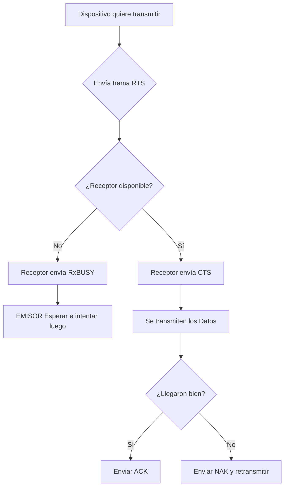

![[P1-U02-P07_-_RDD_-_Unidad_2_-_Metodos_de_acceso_al_medio.pdf]]
1era parte
[https://youtu.be/e8fRLbclVp4?si=xKeuY9GV6Aktq8Fz&t=3096]
[2da parte](https://www.youtube.com/watch?v=GSEulrhro_0&list=PLYZrqm_pzRumO_6c3u7yeHbNF9j6bkbM8&index=12)
[https://www.youtube.com/watch?v=GSEulrhro_0&list=PLYZrqm_pzRumO_6c3u7yeHbNF9j6bkbM8&index=12]

---
# [[Modelo OSI]] y la [[CAPA DE ENLACE DE DATOS]]

El **Modelo de Referencia OSI**, creado por la Organización Internacional de Normalización en 1980, es un **marco conceptual** para los **protocolos de red**. Se estructura en capas, cada una con funciones específicas, y se utiliza como referencia en el estudio de la arquitectura TCP/IP. Al referirse a dispositivos o protocolos, se utiliza la terminología "dispositivo de capa X", vinculando así el dispositivo a una capa específica del modelo.

Las **capas** están **interconectadas** de manera **adyacente**, y cada capa **ofrece servicios a la capa superior** mientras **utiliza los servicios** **de la capa inferior**. Por ejemplo, cuando se describe un router como un dispositivo de capa 3, significa que realiza funciones de las capas 1, 2 y 3, indicando la capa más alta que abarca. En resumen, un dispositivo no solo cumple las funciones de su capa designada, sino también de las capas inferiores

> [!danger] **Error de concepto frecuente** Un dispositivo clasificado en una capa superior asume obligatoriamente las funciones de las capas inferiores. Por ejemplo, un [Router] (Capa 3) también realiza funciones de Capa 2 y Capa 1, no solo de la suya propia.

## [[CAPA DE ENLACE DE DATOS]] ✅
> [!note] Definición: [[CAPA DE ENLACE DE DATOS]] Es la Capa 2 del [[Modelo OSI]]. Actúa como intermediaria, relacionando todo el mundo lógico (el software de las capas superiores) con el mundo físico (el hardware de las capas inferiores). Se encarga de preparar los datos para transmitirlos sobre un medio físico específico

![[{3DDA2E2E-1FE9-4B2C-B122-E77BE47407E4}.png|396]]
- **División de la Capa 2:** La [[CAPA DE ENLACE DE DATOS]] se divide lógicamente en dos subcapas principales:
	- **[Subcapa LLC  (IEEE 802.2)] (Control de Enlace Lógico)**: Es la subcapa superior que interactúa con el software. Su función es recibir el paquete de Capa 3 en **tramas**, encapsularlo e identificar que se está encapsulando (ej. IPv4 o IPv6) para saber a quién entregarlo
	- **[Subcapa MAC] (Control de Acceso al Medio)**: Es la subcapa inferior que interactúa con el hardware. Es totalmente dependiente del medio de transmisión físico (cable UTP, fibra óptica, el aire) y se encarga de organizar el acceso al canal de comunicación y construir la estructura física de la trama
		- Abarca diferentes tecnologías como Ethernet 802.3 (LAN), Wi-Fi 802.11 (WLAN) y Bluetooth 802.15 (PAN)
		- Aquí es donde operan los [[Métodos de acceso al medio]] para organizar las transmisiones.
> [!note]  
> **[Encapsulamiento]**: Es el proceso progresivo mediante el cual la información originada en capas superiores se introduce dentro de otras estructuras de las capas inferiores, agregándoles información de control. El profesor lo comparó con muñecas "mamushkas".
> 
> **[PDU] (Unidad de Datos del Protocolo)**: Es el nombre técnico que recibe la información de acuerdo con la capa en la que se encuentre. En Capa 3 se denominan **Paquetes**, en Capa 2 se llama **Trama**, y en Capa 1 se transmiten directamente **Bits**.

# Metodos de acceso al medio✅
Los siguientes metodos de acceso al medio, viven en la subcapa MAC de la capa 2
. Esta subcapa es la que se encarga de organizar "quién habla y cuándo" para que las señales no choquen en el medio físico.

El segundo tema principal abordó cómo los dispositivos organizan sus transmisiones cuando comparten un mismo canal en un entorno de difusión ([redes de difusion] 
>[!note] **Redes de Difusión**
>Son entornos donde múltiples dispositivos comparten un mismo canal físico de comunicación, generando la necesidad de organizar quién transmite

>[!question] Como asignar el canal entre varios usuarios en un entorno de difusion?

- **Asignación Estática:** Se divide el canal de manera matemática por tiempo (TDMA) o frecuencia (FDMA), evitando la competencia.
	- FDMA (Acceso Múltiple por División de Frecuencias).
	- TDMA (Acceso Múltiple por División de Tiempo).
	- CDMA (Acceso Múltiple por División de Código).
	- En este tipo, los dispositivos no compiten, cada uno transmite en una frecuencia, tiempo o código asignado
- **Asignación Dinámica (Por Contienda):** Los equipos compiten dinámicamente por el uso del medio.
	- Los dispositivos compiten para enviar bits.
	- Métodos de acceso al medio incluyen CSMA/CD, CSMA/CA y Token Ring.

## Protocolos Dinámicos Explicados:
1. **[CSMA_CD] Acceso Múltiple con Sensibilidad de Portadora y Detección de Colisiones)**: Es el protocolo dinámico usado en la [Ethernet Clásica] (redes alambradas, redes de área local (LAN)). El dispositivo "escucha" el canal; si está libre, transmite. Si dos equipos transmiten simultáneamente, sus señales chocan produciendo una **Colisión**. Al detectar el choque, dejan de enviar datos, lanzan una **Señal de Atasco** y esperan un tiempo aleatorio antes de reintent
   ![[{CB6F97A3-D1BF-4BFF-A23F-903B28EF9570}.png|508]]
	* Dispositivos y Ubicación de Lógica CSMA/CD:
		* Lógica implementada en la NIC (placa de red) y en el SWITCH (dispositivos de capa 2 - capa de enlace).
	* Limitaciones:
		* Funciona mejor en redes alámbricas, como en el caso de cable UTP.
		* No es adecuado para redes inalámbricas, ya que no pueden detectar colisiones.
	* Manejo de Errores:
		* Después de 16 intentos sin éxito, se detiene el intento y se informa de un error.
---
**[CSMA_CA] (Acceso Múltiple con Prevención de Colisiones)**: Es el protocolo usado en redes inalámbricas (Wi-Fi). Como en el aire es imposible detectar colisiones mientras se transmite simultáneamente, este método intenta _prevenirlas_ con anticipación mediante un intercambio burocrático de mensajes de control. Utiliza los siguientes parámetros:
![[{201A3B9B-D817-4761-9D76-0D1F101E8C09}.png|438]]
1. La estación origen escucha el medio para determinar su disponibilidad y, cuando está libre:
2. anuncia su intención de transmitir a todos los dispositivos mediante una trama de control RTS (Request to Send)**[RTS] (Request to Send)**:  Trama corta que envía la computadora de origen solicitando permiso a la red y anunciando su intención de comunicarse con una máquina específica.  La RTS especifica las direcciones MAC de origen y destino, identificando emisor y receptor y un tiempo previste de duracion.
3. Recepotr puede contestar CTS o RxBusy
	1. **[CTS] (Clear to Send)**: Trama de respuesta del destino que indica que se encuentra disponible y autoriza la recepción de datos.
	2. **[RxBUSY] (Receptor Ocupado)**: Respuesta del destino indicando que no puede recibir la información en ese momento. ( El emisor espera hasta que el destinatario esté libre antes de transmitir.)
4. el emisor al recibir CTS, Cuando el medio está libre, la estación espera un tiempo aleatorio adicional corto y solamente si el medio sigue libre, transmite la tramision de datos DATA comienza ,, ==DUDA ESEPRA UN TIEMPO ALEATORIO ANTES DE RECIBIR CTS O DSP DE RECIBIR CTS? ==
5. El receptor envia:
	- **[ACK] (Acknowledge)**: Acuse de recibo positivo. El receptor lo envía solo si la trama de datos llegó completa y sin errores.
	- **[NAK] (Negative Acknowledge)**: Acuse negativo, indicando que los datos llegaron con errores y se debe iniciar de nuevo la solicitud de transmisión.

---

**[Token Ring (IEEE 802.5)]**: (Redes de Anillo Lógico) Método lógico de transmisión estructurado en anillo. Es determinístico y libre de colisiones. Consiste en hacer circular un testigo llamado **[Token]** por la red. Únicamente la máquina que posee dicho token en su poder tiene el derecho a insertar datos en el medio físico
![[{7407E1FE-11BD-4E1E-9629-D3B2795BCFA1}.png|518]]
En esta configuración, los datos circulan en una única dirección, formando un círculo a través de las estaciones conectadas

* Proceso de transmisión: Cuando una estación recibe el token y no tiene datos, lo pasa a la siguiente. Si tiene datos, convierte el token en una trama (le agg datos, agg mac origen y mac destino) y la lanza al medio de transmisión.

* Verificación de destino: Cada estación verifica si la trama está dirigida a ella por medio de la dirección MAC. Si no es el caso, la trama sigue su curso; si es correcto, la estación procesa la trama y envía un acuse de recibo al origen.

* Token como permiso: El token actúa como un permiso para enviar datos, permitiendo que solo una máquina transmita a la vez y evitando colisiones.
* Método determinístico: Garantiza que las máquinas podrán transmitir datos, pero se considera lento en comparación con otras tecnologías.
* Recorrido completo de la trama: La trama completa da una vuelta desde el origen hasta el destino, y luego se genera un nuevo token para habilitar la transmisión desde otras estaciones.
---
Es logico en anillo como la foto de arriba pero es fisica en estrella

> [!note] En una topología en estrella, 
>un switch actúa como un puente, permitiendo que los datos se transmitan secuencialmente de un dispositivo a otro. Cada estación transmite en su turno, y la inteligencia para realizar el puente entre dispositivos radica en el concentrador central

![[{FDC101C5-8550-4FD4-834B-70C9677CEB2F}.png]]
# Estandar [[IEE 802.3 (Ethernet)]]✅
La Ethernet clásica, desarrollada en 1973, representa la primera red cableada y es la tecnología de LAN más extendida. Opera en las [[CAPA DE ENLACE DE DATOS]] y física del [[Modelo OSI]], utilizando la subcapa MAC. Con
velocidades de 3 a 10 Mbps, utiliza [CSMA_CD] para el acceso al medio y codificación Manchester (una transmisión entre cada bit que se envía) para mantener la sincronización entre emisor y receptor. Es una tecnología de
máximo esfuerzo, sin retransmisión de tramas y sin confirmación de recepción. Las primeras implementaciones usaron 

Ethernet sobre cable coaxial:
- Usaba originariamente [Topología de Bus] con cable coaxial grueso o fino ([10Base5], [10Base2]) 
- ![[{3AF66BDB-A6C4-4D16-9274-F21A5C6BC7E3}.png|316]]
	- Utilizando transmisión en banda base (señal no se encuentra modulada ni en frecuencia, ni amplitud y fase) y topología en bus. Esta topología tenía algunos inconvenientes como gran número de colisiones, que se resuelve con el CSMA/CD, o dificultad para conectar un nuevo dispositivo, cada vez que se quiere incorporar una máquina se debía dar de baja la red. Se hacía cuando la red no estaba en producción.
- y luego mutó a [Topología en Estrella] con cable UTP ([10BaseT]) conectado mediante un [Hub] operando en [Half-Duplex] con ancho de banda compartido.![[{47D96106-479F-4686-A22C-C6082F8176A0}.png|442]]
	- Para superar los problemas del cable coaxial, se adoptó la tec. Ethernet sobre UTP, destacando 10BaseT con cable de par trenzado y HUBs. Esta implementación facilitó la conexión y desconexión de computadoras sin interrumpir toda la red, operando en modo Half- Dúplex y utilizando CSMA/CD.

> [!note] **[Half-Duplex]**: Modo operativo donde un equipo puede transmitir o recibir información, pero no realizar ambas tareas al mismo tiempo (propio de un entorno de [Hub]).

**[Ethernet Conmutada]:** 

El reemplazo del Hub por el [Switch] elimina la necesidad real de usar [CSMA_CD] ya que habilita la transmisión [Full-Duplex] (porque cada puerto permite transmitir y recibir simultáneamente sin posibilidad física de colisiones).
	- La evolución llevó a Ethernet conmutada, reemplazando el HUB por un switch en la capa de enlace. El switch, más inteligente, permite transmisiones simultáneas, eliminando colisiones y reduciendo el dominio de colisión a cada puerto. No requiere CSMA/CD, admite comunicación full dúplex y se utiliza ampliamente.
	- Destacan:
		- • No hay colisiones entre PCs conectadas a un switch.
		- • Comunicación full dúplex: recibir y enviar simultáneamente.
		- • Se usa en la actualidad.
		- • Switch gestiona tramas, evitando colisiones. Conmuta para comunicaciones simultáneas.
		- • Fast Ethernet para estaciones de trabajo, Gigabit Ethernet y 10 Gigabit Ethernet para servidores
![[{F1146870-B7F9-413F-9ABE-978AFB4BF218}.png|426]]
> [!question] **Pregunta 2: Transmisiones simultáneas en un Switch** **Alumno:** _"¿Qué pasaría si en esta topología con un switch, dos orígenes quieren transmitir simultáneamente a un mismo receptor (ej. un Servidor)?"_. 
> **Respuesta del Profesor:** Explicó que las tramas **no colisionan**. Un **[Switch]** es un dispositivo inteligente que cuenta con memoria o **[Buffer]**. Al recibir ambas tramas al mismo tiempo dirigidas al mismo destino, el switch almacena una en cola, entrega primero la otra, y una vez que el puerto físico se libera, envía la que estaba en espera.

>[!note] **[Full-Duplex]**: Modo donde el equipo puede tanto enviar como recibir datos simultáneamente sin posibilidad de choque, gracias a los pares de cables independientes en puertos conectados a un [Switch]

>[!danger] Trampa de parcial típica sobre Dispositivos Presta especial atención al impacto de los dispositivos en los dominios:
>- Un **[Hub]** (Capa 1) repite los bits "a ciegas" por todos sus puertos simultáneamente, por lo tanto _extiende_ un único y gran **[[Dominio de Colisión]]**.
>  - Un **[[Switch]]** (Capa 2) funciona con memoria y conmuta tramas, lo que aísla el canal y _divide_ reduciendo los **[[Dominio de Colisión]]** a cada puerto individual.
>   - Los **[[Router]]** (Capa 3) son los dispositivos que dividen los **[[Dominio de Broadcast]]** aislando lógicamente las redes.
---

# Conceptos de Segmentación de Tráfico✅:

- **[[Dominio de Colisión]]:** Segmento físico donde las señales eléctricas o electromagnéticas pueden chocar y destruirse. Dividido por Switches y Routers.
![[{F713FA65-9A73-48BD-9408-7511DFEA3E1B}.png|438]]
- **[[Dominio de Broadcast]]:** Área lógica de la red donde los dispositivos pueden comunicarse por difusión masiva sin atravesar un enrutador. **Solo los routers dividen dominios de broadcast**![[{86033530-3195-4CBD-AFE3-45ADE3A6C259}.png]]

# Estructura de la [Trama Ethernet]✅
la relacion con los temas anteriores es que la Trama es el pdu de [[CAPA DE ENLACE DE DATOS]] y la [[IEE 802.3 (Ethernet)]] nos dice como se debe armar la trama:

El formato de la trama Ethernet, utilizado en la capa 2 para la transmisión de datos entre máquinas, varía entre Ethernet II y IEEE 802.3.

Ethernet II:
- **[Preámbulo]:** Serie inicial de 8 bytes. Su único fin lógico es lograr sincronizar los relojes del equipo emisor y receptor antes de que empiecen a llegar los datos vitales
- 6 bytes de dirección de destino (MAC).
	- (La destino va primero intencionalmente para permitir el descarte veloz si la trama no corresponde a la máquina).
- 6 bytes de dirección de origen (MAC).
- 2 bytes para el campo tipo que indica el protocolo encapsulado
	- Indica explícitamente qué protocolo de red está viajando encapsulado dentro del espacio de carga útil (por ejemplo, marca si el contenido interno es IPv4, IPv6 o ICMP)
- 46 bytes de datos (pueden incluir 4 bytes de relleno).
- 4 bytes de secuencia de verificación de tramas (CRC).
	- **[FCS] (Secuencia de Verificación de Trama):** Algoritmo matemático para descartar tramas que hayan sido dañadas en tránsito. Ethernet _no_ retransmite si hay error, es una tecnología de "máximo esfuerzo".![[{97BF7CD5-1C12-4AEE-8207-8ADC6F458196}.png]]

IEEE 802.3
*  Preambulo de 7 bytes y delimitador de inicio de trama de 1 byte.
* 6 bytes para dirección de destino y 6 para dirección de origen (MAC).
* Campo tipo > 1536. Protocolo que se está usando. Dice que se encapsuló de la capa de arriba.
* Campo longitud <= 1536. Tamaño de la trama, lo que se está enviando de datos en la trama.
* 4 bytes de secuencia de verificación de trama (CRC).*![[{AFCA806D-C616-4CF5-A974-58FE45FA1B17}.png]]

> [!note] **Fórmulas para el Cálculo del Tamaño de la Trama Ethernet** El profesor indica que la carga útil (los datos) oscila entre 46 y 1500 bytes, y a esto se le suma una cabecera y cola fijas de 18 bytes (excluyendo el preámbulo). $$ Tamaño_{Mínimo} = 46_{bytes (Datos)} + 18_{bytes (Cabecera/Cola)} = 64_{bytes} $$ $$ Tamaño_{Máximo} = 1500_{bytes (Datos)} + 18_{bytes (Cabecera/Cola)} = 1518_{bytes} $$

El tamaño mínimo de una trama Ethernet es de 64 bytes, compuesto por 46 bytes de datos más 18 bytes de la cabecera (dirección destino, dirección origen, longitud) y la cola (secuencia de verificación de la trama). Este cálculo excluye el preámbulo, y la trama comienza después de este.

>[!question] **Pregunta 4: El Relleno para el tamaño mínimo de Trama** **Alumno (Mariano):** _"¿Voy a tener que rellenar los datos para que [lleguen al mínimo]?"_. 
>**Respuesta del Profesor:** Sí. La trama requiere un mínimo de 46 bytes de datos. Si la información real a enviar ocupa, por ejemplo, solo 3 bytes, los 43 bytes restantes pasan a ser datos de relleno ("padding") obligatorios para alcanzar el piso exigido y completar los 64 bytes totales del tamaño mínimo de trama

El tamaño máximo permitido es de 1518 bytes, con 1500 bytes como máximo de datos y los restantes 18 bytes de la cabecera y la cola (6 de dirección de destino, 6 de dirección de origen, 2 de longitud y 4 de secuencia de verificación de trama). La disposición de la dirección de destino antes que la de origen facilita la identificación del destinatario y evita la lectura innecesaria de bits de la dirección de origen.

>[!danger] **Trampa de Parcial: El Campo de Relleno** Al explicar el tamaño de la trama, el profesor fue contundente: el espacio de **[Relleno]** (Padding) que se utiliza para alcanzar el tamaño mínimo de 46 bytes de datos **NO está definido como un campo oficial en la norma IEEE 802.3**. Muchos estudiantes se confunden y lo dibujan como un campo separado. El profesor aclaró expresamente: _"Esto pregunto: no está como campo definido"_. Simplemente, forma parte del espacio de **[Datos]** para completar la carga útil.

> [!tip] **Tip Lógico de Examen: El Orden de las Direcciones MAC** El profesor hizo gran énfasis alertando a la clase ("van a preguntarse...") sobre por qué en la cabecera de la **[Trama Ethernet]** aparece _primero_ la **[Dirección MAC Destino]** y luego la **[Dirección MAC Origen]**. Explicó (usando la analogía de un sobre postal) que esto se hace porque es **más rápido** para el hardware: la placa receptora lee primero el destino y, si no coincide con su propia **[Dirección MAC]** (o no es un **[Broadcast]**), descarta la trama instantáneamente sin perder tiempo leyendo el resto de los bits.
# 5. Direccionamiento Físico: Las [[Dirección MAC]] ✅

Se define la [Dirección MAC] (Media Access Control) como la dirección física y plana grabada de fábrica en la placa de red (NIC)., almacenada en la ROM de la placa de red (inalámbrica o Ethernet).

- **Formato Técnico:** 48 bits (6 bytes) expresados en 12 dígitos hexadecimales. Los primeros 24 bits (OUI) son asignados por el IEEE para identificar unívocamente al fabricante, y los últimos 24 bits los asigna el fabricante al producto específico.
![[{DD41A2CB-312C-46D6-98BA-89DD5905276E}.png]]
- **Tipos de Direcciones MAC:**
    - **[Unicast]:** Es una MAC diseñada para identificar concretamente a un dispositivo único (Ej: 24-F5-AA...). Regla fundamental: una MAC de origen _siempre_ deberá ser obligatoriamente tipo unicast.
	    - Cada vez que alguien quiere enviar datos a una máquina en la trama, la "Dirección de destino" debe contener la MAC de la placa de la máquina receptora.
    - **[Broadcast] (Difusión):** Dirigida masivamente a todos los equipos del segmento lógico. Se caracteriza por tener los 48 bits encendidos (Ej: FF-FF-FF-FF-FF-FF).
	    - Permite enviar mensajes a todos los dispositivos del segmento de red.
	    - Solo aparece en el campo destino de una trama.
    - **[Multicast]:** Dirigida exclusivamente a un grupo de dispositivos (su identificador OUI inicia de forma estandarizada con 01-00-5E).
	    - Se utiliza para enviar una trama a un grupo específico de máquinas o dispositivos.
	    - La dirección comienza con 01:00:5E, y los bytes restantes varían según el grupo destinatario.
	    - • La información llega solo a las máquinas que pertenecen al grupo especificado.

> [!tip] **Tip Práctico del Profesor** Para averiguar la [Dirección MAC] física de la computadora en la consola de comandos de Windows, el alumno debe ejecutar `ipconfig /all`.

# 6. Evolución de Estándares IEEE 802.3

Al finalizar el apartado teórico, el profesor resume las versiones modernas de Ethernet, aclarando que todas son compatibles hacia atrás gracias al proceso de **Autonegociación** (donde los extremos acuerdan automáticamente operar a la velocidad y modo del equipo con menores prestaciones).

| Tecnología                | Estándar IEEE | Velocidad | Medio Físico y Características Principales                                                                               |
| :------------------------ | :------------ | :-------- | :----------------------------------------------------------------------------------------------------------------------- |
| **[Fast Ethernet]**       | 802.3u        | 100 Mbps  | Usa [Autonegociación]. Puede usar UTP Cat 5 (100m) o Fibra Óptica (hasta 2 km).                                          |
| **[Gigabit Ethernet]**    | 802.3ab       | 1000 Mbps | Soporta Hubs (Half) y Switches (Full). Introduce amplio uso de fibra multimodo y monomodo.                               |
| **[10 Gigabit Ethernet]** | 802.3ae       | 10 Gbps   | **Solo opera en modo [Full-Duplex]**. Uso principal en troncales universitarias/empresariales y servidores de alta gama. |
|                           |               |           |                                                                                                                          |
> [!note] **[Half-Duplex]**: Modo operativo donde un equipo puede transmitir o recibir información, pero no realizar ambas tareas al mismo tiempo (propio de un entorno de [Hub]).

>[!note] **[Full-Duplex]**: Modo donde el equipo puede tanto enviar como recibir datos simultáneamente sin posibilidad de choque, gracias a los pares de cables independientes en puertos conectados a un [Switch]
## fast
 * Estándar IEEE 802.3u, aprobado en 1995.
 * • Opera a velocidades de 100 Mbps.
 * • Compatible con versiones anteriores de Ethernet, manteniendo el formato de trama.
 * • Se utiliza Auto Negociación para ajustar la velocidad entre dispositivos de 10 o 100 Mbps, trabajando a la velocidad más baja en caso de disparidad. y modo de envio ( si half o full duplex)
 * • Reduce el tiempo de bit de 100 nseg a 10 nseg.
 * • Utiliza hubs y switches en lugar de conectores BNC, cambiando la topología a estrella (no en bus).
 * • Opera en modo half-dúplex y full-dúplex, dependiendo de la configuración de los dispositivos (full-dúplex con switch, half-dúplex con hub).
 * • Autonegociación permite la negociación automática de velocidad y modo de envío entre dispositivos.
 *![[{C79C5457-33AB-46A1-B392-99A52789DF7B}.png]]
## giga
* Estándar IEEE 802.3ab, aprobado en 1999
* Compatible con versiones anteriores de Ethernet, manteniendo el formato de trama.
* oporta modos half-duplex (con hub) y full-duplex (con switch).
* Permite la autonegociación entre 10, 100 y 1000 Mbps.![[{15A56A77-FCAC-4AEA-BFEA-B62D50E82953}.png]]
## 10 giga
* *Estándar IEEE 802.3ae.
* Desarrollado para fibra (2002), cable de cobre blindado (2004) y par trenzado de cobre (2006).
* Utilizado en conexiones de alto rendimiento entre routers, switches y servidores de gama alta, así como en troncales de larga distancia.
* Solo opera en modo full-dúplex y no permite la conexión con hubs.
* Las interfaces de 10 Gigabits utilizan la autonegociación y cambian a la velocidad más alta soportada por ambos extremos de la línea
* Implementado en redes LAN, MAN y WAN.
* Utiliza fibra óptica multimodo para distancias cortas y monomodo para distancias largas.![[{5188A854-15FB-4D8B-9534-8C6F2C07F7D9}.png]]

# 7. Espacio de Dudas Finales ✅

> [!question] **Pregunta de Alumno en Clase:** _¿Cómo coexisten la [[Dirección IP]] y la [[Dirección MAC]] a la hora de direccionar si ambas buscan identificar al dispositivo de destino?_
> 
> **Respuesta del Profesor:** Funcionan como "mamushkas" o sobres postales anidados. Durante el [[Encapsulamiento y Desencapsulamiento]], la capa de red genera un paquete sellado con IP origen y destino. Al bajar al nivel inferior, la [[CAPA DE ENLACE DE DATOS]] toma ese paquete completo y lo mete _adentro_ de una nueva trama, estampando en la nueva cabecera externa la MAC origen y destino. Ambas direcciones son vitales, pero operan de forma simultánea en diferentes niveles lógicos de la transmisión.

