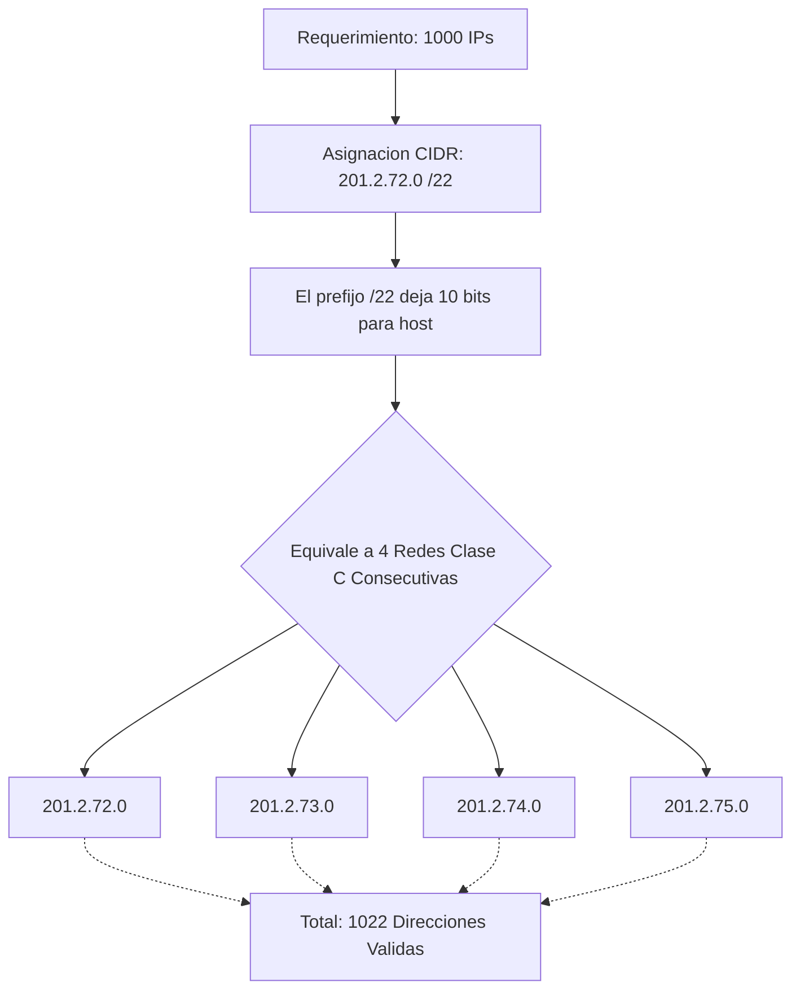
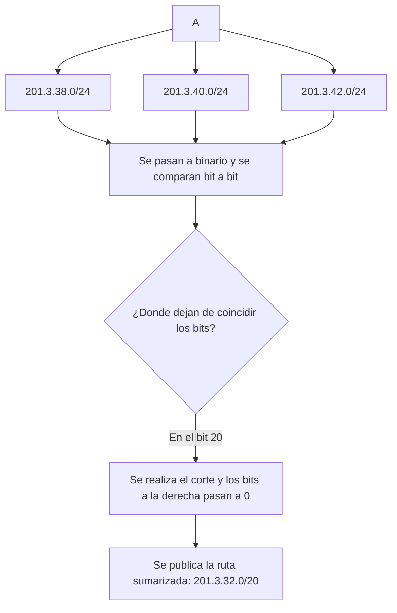
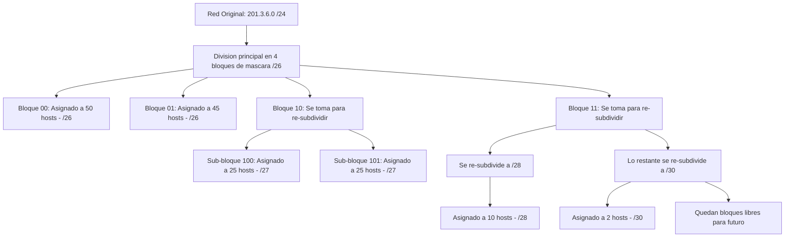

https://youtu.be/ok7txcbb6IQ?si=VxKNnFzU_0KNE3Dx&t=800

## 1. El Problema: [[Agotamiento de IPv4]] y la Asignación [Classful] ✅

El profesor inicia la clase planteando el problema central: las direcciones **[IPv4]** se agotaron mucho antes de lo previsto.

- **Causas del [[Agotamiento de IPv4]]:** 
	- El crecimiento exponencial de Internet, (causa principal)
	- Gran cantidad de “dispositivos” que requieren una dirección IP
	- las conexiones de banda ancha "siempre activas" y la proliferación masiva de dispositivos por usuario.
- **El Error Estructural ([Classful]):** El diseño original asignaba direcciones en bloques enteros de clase (A, B o C). Este método no utiliza eficazmente las direcciones disponibles y ha llevado a la necesidad de IPv6 para abordar la creciente demanda de direcciones IP.

### ASIGNACIÓN DE DIRECCIONES IPV4 POR CLASES [Classful] ✅
Classful: significa que se asignan una clase entera de direcciones IP cada vez que una empresa u organización necesitaba direccionar sus dispositivos sin importar la necesidad real de la empresa.
> [!danger] El Derroche del Modelo Classful El profesor recalcó por qué este modelo falló matemáticamente: si una empresa necesitaba 500 direcciones, una red de Clase C (254 IPs) no era suficiente. Como solución, se le entregaba una Clase B entera (2^16−2=65.534 IPs). Esto generaba un **derroche irrecuperable** de más de 65.000 direcciones públicas por empresa

* Empresa A (30 puestos de trabajo): Clase C, por lo que hay un derroche de 254 - 30 de direcciones. Se derrochan 224 direcciones IP.
* Empresa B (100 puestos de trabajo): Clase C, por lo que hay un derroche de 254 - 100 de direcciones. Se derrochan 154 direcciones IP.
* Empresa C (500 puestos de trabajo): Clase B, por lo que hay un derroche de 65534 - 500 de direcciones. Se derrochan 65034 direcciones IP.
* ![[{4DD77B09-0682-4D0C-BB9B-4D68B6CA5C8A}.png]]

## Soluciones Al agotamiento:✅
1. Direccionamiento privado: acá hacemos traducción de direcciones de red.
2. Traducción de direcciones de red.
3. CIDR: Enrutamiento entre dominios sin clases. Método de asignación de direcciones IP que mejora la eficiencia del enrutamiento de datos en Internet
4. VLSM (Máscaras de subred de longitud variable)
5. Protocolo IPv6

Los primeros cuatro ítems fueron decididos por más de la mitad de la comunidad de internet. Internet se dividió en dos bandos, aquellos que querían que siguieran viviendo el protocolo IPv4, y el bando del protocolo IPv6.

>[!question] TODOS ESTAS SOLUCIONES SE USAN?
>* se usa la traduccion de direcciones para ips privadas, por lo tanto tmb se usa el direccionamiento privado
>* y las direcciones publicas son asignadas con CIDR y van de la mano con VLSM
###  [[Direccionamiento Privado]] ✅

Para mitigar la crisis temporalmente, se implementó un rango de direcciones que no se pueden enrutar en la Internet pública.

- **[[Direccionamiento Privado]] (RFC 1918):** 
	- Sólo se pueden utilizar DENTRO de una empresa u organización
	- Estas direcciones no son visibles desde Internet, lo que proporciona una capa adicional de seguridad
	- si se necesita acceder a Internet desde la empresa, se requiere la traducción de direcciones ([[NAT]]). Las direcciones privadas suelen pertenecer al rango de la clase C, con direcciones comunes como 192.168.0.0 o 192.168.1.0

> [!question] Pregunta a la clase: Cantidad de Redes Privadas El profesor evaluó a los alumnos sobre cuántas direcciones de red privadas existen por clase:
> 
> 1** red Clase A (la `10.0.0.0/8`).
> **16** de Clase B (desde `172.16.0.0` hasta `172.31.0.0`) 
> **256** de Clase C (desde `192.168.0.0` hasta `192.168.255.0`).
> 
> ![[{7711C366-A3CF-43A6-9A99-C95503BE83D8}.png]]

###  [[NAT]] **(Network Address Translation✅**
La traducción de direcciones es necesaria cuando se comunica con Internet desde una empresa. La dirección privada (origen) se convierte en direccion pública (origen) al salir de la empresa, y al entrar desde Internet, la dirección pública (destino) se reemplaza por la dirección privada( destino) en los paquetes. Esto lo gestiona el [[router]], que mantiene tablas de traducción. 

Sin embargo, esta traducción es lenta y puede convertirse en un cuello de botella, ya que todo el proceso debe realizarse en el router

> [!danger] Trampa de Diseño: El Cuello de Botella del [[NAT]] El profesor enfatizó que el proceso de traducción que hace el **[[Router]]** (reemplazar la dirección origen privada por la pública y mantener registros en tablas) es computacionalmente **"muy lento"**. Esto convierte al router en un cuello de botella crítico para el tráfico de la red empresarial.

![[{BF3F2E12-4972-4241-9A09-2985BBA70F7B} 1.png|375]]

>[!question] hace falta traduccion si se quiere comunicar entre ellas sin salir a internet?
>NO HACE FALTA

---

## 3. ADMINISTRACIÓN DE DIRECCIONES IP: [IANA] y [RIR]
El control y distribución de direcciones IP públicas se usa para evitar duplicados a través de:

### IANA (Internet Assigned Number Authority):
- **[IANA]**: Autoridad mundial que distribuye grandes bloques de IPs.

Se encarga de distribuir partes del espacio global de direcciones IP y números de sistemas autónomos a Registros Regionales de Internet. Garantiza que no haya direcciones IP públicas idénticas. IANA asigna direcciones IP a Registros Regionales de Internet, y estos registros las distribuyen a proveedores de servicios de Internet (ISP) y empresas.
### RIR (Regional Internet Registry)
- **[RIR] (Registro Regional de Internet)**: Organismos continentales (como **[LACNIC]** para Latinoamérica) que reciben los bloques de la IANA y los reparten a los Proveedores de Servicios de Internet (**[ISP]**).
![[{ED6D85BE-E7AE-40BF-8772-D8CF028318E4}.png]]
RIR es **responsable de distribuir bloques de direcciones IP a sus miembros** y registrar estas asignaciones. Recibe bloques de direcciones y números de sistemas autónomos de IANA y luego los asigna a ISPs (proveedores de servicio de internet ) y estos a su vez a organizaciones en su región. Además, administra números de sistemas autónomos para garantizar una jerarquía en el enrutamiento de Internet.

Internet se divide en áreas y cada área es un sistema autónomo. Cada sistema autónomo tiene un número que es único e irrepetible

---

## 4. La Solución Arquitectónica: [[CIDR]] (Enrutamiento Inter-Dominio sin Clases) (CLASSLESS INTER-DOMAIN ROUTING)✅

Para solucionar el derroche de la asignación _Classful_, se creó el estándar **[[CIDR]]**.

Concepto: Es una metodología que elimina el concepto de clases de direcciones IP y asignar redes enteras  y se enfoca en asignar direcciones en función de la cantidad de hosts necesarios y la ubicación geográfica.

Sus objetivos son:
* Distribuir direcciones IPv4 públicas no asignadas geográficamente
	* CIDR agrupa las IP por continentes. Esto permite que los routers lean menos bits (ej. los primeros 8 bits) para saber que el paquete va a Sudamérica, agilizando drásticamente el procesamiento
* Mejorar el enrutamiento al reducir el tamaño de las tablas en los routers y acelerar el procesamiento de paquetes
* Asignar direcciones en bloques de tamaño variable, eliminando la asignación por "clase"
* Basarse en la cantidad necesaria de direcciones válidas.
* Permitir la implementación de resumen de rutas ([[Sumarización de Rutas]]]), similar a IPv6

### POR EJEMPLO:
>[!note] Fórmula Matemática de Asignación CIDR A diferencia del modelo **[Classful]** que entregaba redes enteras (Clase A, B o C), el proveedor de servicios en **[[CIDR]]** entrega una **[Dirección IP]** basándose estrictamente en la cantidad de bits 'n' que se dejan para la porción de host. 
>
>$$\text{DireccionesValidas}=2^n−2$$

#### ejemplo 1
![[{B25B4CEC-3156-45C8-8282-4C21E48227B7}.png]]
- **El Problema:** Una empresa solicita 100 direcciones IP públicas.
- **Solución [Classful] (Antigua):** Se le hubiera entregado una red **[Clase C]** entera (254 IPs), derrochando 154 direcciones.
- **Solución [[CIDR]] (Explicada en clase):** El proveedor le asigna el bloque `201.2.78.0/25`.

> [!question] Interacción en Clase: Cálculo de Hosts El profesor interpeló a la clase: _"¿Cuántas IP válidas voy a obtener con un barra 25?"_. 
> "126"_. **Justificación del profesor:** Al usar un prefijo `/25`, quedan exactamente 7 bits para **[Host]**. Aplicando la fórmula (2^7−2), se obtienen 126 direcciones útiles, cubriendo la necesidad de 100 sin generar un derroche excesivo.
#### ejemplo 2
![[{F6D94AD3-B1EA-42E3-97B8-E7F902510A14}.png]]
- **El Problema:** Una empresa necesita 500 direcciones IP públicas.
- **Solución [Classful] (Antigua):** Una red **[Clase C]** (254 IPs) no alcanza. Se le hubiera entregado obligatoriamente una red **[Clase B]** (65.534 IPs), generando un derroche inaceptable de más de 65.000 direcciones.
- **Solución [[CIDR]]:** El proveedor le asigna el bloque `201.2.76.0/23`.
- **Desglose Técnico del Profesor:** Al acortar la **[Máscara de Subred]** a un prefijo `/23`, quedan 9 bits para la porción de host (32−23=9).
    - Matemáticamente: 2^9−2=510 direcciones válidas.
    - **Equivalencia Lógica:** El profesor destacó que asignar un `/23` equivale exactamente a fusionar **DOS bloques de direcciones [Clase C] consecutivas** (`201.2.76.0` y `201.2.77.0`) en una sola red.
#### ejemplo 3
![[{34F1066B-708E-47CD-911A-89A991A4D843}.png]]
- **El Problema:** Una empresa necesita 1000 direcciones IP públicas.
- **Solución [[CIDR]]:** Se le asigna el bloque `201.2.72.0/22`.
- **Desglose Técnico del Profesor:** Con un prefijo `/22`, quedan 10 bits para la porción de host.
    - Matemáticamente: 2^10−2=1022 direcciones válidas.
    - **Equivalencia Lógica:** Equivale a unificar **CUATRO bloques de direcciones [Clase C] consecutivas**.

> [!danger] Confusión Frecuente en Clase: La Fusión de los 4 Bloques Durante este ejemplo, una alumna se confundió sobre de dónde salían los 4 bloques.

- **Aclaración del Profesor:** Explicó que al cortar la máscara en el bit 22 (dentro del tercer octeto), las combinaciones binarias restantes de ese octeto permiten agrupar cuatro redes contiguas bajo el mismo prefijo. Específicamente, el bloque `/22` engloba a las redes: `72.0`, `73.0`, `74.0` y `75.0`.

#### ---

| Requisito de la Empresa | Asignación en [[CIDR]]       | Equivalencia Práctica          | Direcciones Válidas |
| :---------------------- | :--------------------------- | :----------------------------- | :------------------ |
| **500 Direcciones IP**  | Se otorga un prefijo **/23** | 2 bloques Clase C consecutivos | 510 IPs             |
| **1000 Direcciones IP** | Se otorga un prefijo **/22** | 4 bloques Clase C consecutivos | 1022 IPs            |

Por ejemplo, en el pasado, se asignaba una dirección de clase C,
pero con CIDR, se asigna solo la cantidad de direcciones requeridas,
lo que evita el desperdicio. La dirección IP puede parecer de clase C,
pero la máscara de red es más pequeña que la máscara de subred
por defecto, como es un /24, lo que equivale a asignar dos bloques
de direcciones de clase C consecutivas.

---

## 5. Optimización: [[Sumarización de Rutas]] (Supernetting)✅

Como derivado del **[[CIDR]]**, el profesor explicó cómo los routers acortan sus tablas de enrutamiento.

[[CIDR]] (Classless Inter-Domain Routing) permite distribuir direcciones IP geográficamente para facilitar la sumarización o supernetting, que implica ajustar la máscara de subred.

* Subnetting: Se alarga la máscara al desplazarla hacia la derecha, creando subredes más pequeñas.
* Supernetting: La máscara se achica al desplazarla hacia la izquierda, opuesto a subnetting

El administrador de red configura el router para la Sumarización de rutas, donde una dirección de resumen cubre múltiples direcciones IP al identificar bits coincidentes. Esto simplifica el enrutamiento, por ejemplo, la dirección 201.3.32.0/20 abarca todas las IP con los primeros 20 bits iguales.
*  En lugar de publicar múltiples redes pequeñas, el **[Router]** busca los bits coincidentes (hacia la izquierda) y publica una única "súper red" que las abarca a todas. Al sumarizar, la máscara se acorta (ej. de un /24 pasa a un /20). Esto reduce drásticamente el tamaño de las tablas de enrutamiento y agiliza el procesamiento

> [!question] ¿Por qué es necesario este proceso? La profesora utilizó una analogía: _"Si los invito a una cena, necesitan mi dirección. Si no la publico, nadie llega"_. Un router debe publicar ("enseñar") las redes que conoce al siguiente router. Si no se resume, enviaría tres renglones distintos; al sumarizar, envía un solo renglón, aliviando las tablas de enrutamiento del proveedor

### Metodología: [[Sumarización de Rutas]]
> [!note] El Algoritmo de Cálculo (Corte de Bits) El objetivo es encontrar una única **[Dirección IP]** que abarque múltiples redes.
> 1.Se identifican las direcciones a resumir y se ubica el octeto "conflictivo" (el que cambia).
> 2. Se pasan a binario y se comparan bit a bit de izquierda a derecha.
> 3.Se realiza el "corte" exactamente en el punto donde los bits dejan de coincidir.
> 4.Los bits coincidentes se copian tal cual (y definen la nueva máscara), mientras que todos los bits a la derecha del corte se ponen en cero.
### Ejemplos:
> [!note] Lógica de Cálculo de Sumarización
> Nueva_Mascara=Bits_Coincidentes_Consecutivos 
> 
> El algoritmo consiste en pasar los octetos conflictivos a binario, comparar bit a bit de izquierda a derecha y realizar un "corte" en el punto exacto donde los bits dejan de coincidir. Todos los bits a la derecha del corte se convierten en 0, y la cantidad de bits a la izquierda define el nuevo prefijo
#### ejemplo 1 
El profesor planteó un escenario donde un **[Router]** tiene conectadas tres redes físicas diferentes de **[Clase C]** y necesita publicarlas hacia el **[ISP]** local sin saturar las tablas de enrutamiento.
- **Redes Originales:**
    - `201.3.38.0 /24`
    - `201.3.40.0 /24`
    - `201.3.42.0 /24`
	![[{D868D4BF-6B46-4078-80E9-FCD38DA3F006}.png]]
- **Paso 1: Identificar el octeto conflictivo y pasar a binario.** El primer y segundo octeto (`201.3`) son idénticos. El conflicto está en el tercer octeto.
    - 38 → `0 0 1 0 0 1 1 0`
    - 40 → `0 0 1 0 1 0 0 0`
    - 42 → `0 0 1 0 1 0 1 0`
    ![[{CE978FC1-9DA8-45C8-8D65-EB3BD9C784D0}.png]]
- **Paso 2: Encontrar el punto de coincidencia.** El profesor hizo comparar a la clase bit a bit. Se observa que los primeros **4 bits** del tercer octeto (`0 0 1 0`) son exactamente iguales en las tres direcciones. A partir del quinto bit, ya son diferentes.
- **Paso 3: Calcular la nueva [Dirección IP] y el nuevo Prefijo.**
    - Se suman los bits coincidentes totales: 8 (primer octeto) + 8 (segundo octeto) + 4 (tercer octeto) = 20 **bits coincidentes**. Por lo tanto, el nuevo prefijo es **/20**.
    - Al rellenar con ceros el resto del tercer octeto, el valor binario `00100000` se convierte en 32 en decimal.
    - **Resultado Final:** El router publica una única ruta resumida: **201.3.32.0 /20**. -> DIRECCION IP DE RESUMEN
    ![[{DD302EDE-D9F3-47B9-A24E-E135F0E1A81F}.png]]
		**201.3.32.0 /20**. -> DIRECCION IP DE RESUMEN -> ABARCA A TODAS AQUEAS QUE EMPIEZEN CON LOS PRIMEROS 20 BITS IGUAES

>[!note] Un router debe publicar ("enseñar") las redes que conoce al siguiente router
![[{B834C59C-50E2-448D-9898-683DCA235899}.png]]

#### que pasa con el siguieente router? Segundo Nivel de Resumen (ISP hacia Internet)
Para demostrar la escalabilidad de la red, la profesora avanzó al siguiente salto: un **[ISP]** de nivel 2 recibe la ruta resumida anterior y necesita agruparla con otras para enviarla hacia la red troncal (backbone) mundial

**Redes a Sumarizar (Todas /20):**
- `201.3.32.0 /20`
- `201.3.48.0 /20`
- `201.3.96.0 /20`
	![[{BB72AB00-390B-42BE-B070-0A0D7322A2AD}.png]]
* ***Cálculo y Resultado:** Al comparar los bits en binario de 32, 48 y 96, se detecta que la coincidencia es mucho menor. Solo coinciden hasta el **bit número 17**. Al realizar el corte en el bit 17 y poner el resto en ceros, la dirección resultante que se publica hacia Internet es una "súper red" masiva: **201.3.0.0 /17**
	![[{B1F917F4-429A-4B92-A6DB-3C377F4F2A37}.png]]

>[!tip] Tip de Desempeño y Velocidad en la Troncal La profesora hizo gran énfasis en el impacto de la máscara: a medida que nos acercamos a la troncal de Internet, **la máscara se va reduciendo** (de /24 a /20, y luego a /17). Esto es vital para la velocidad de procesamiento: un router central masivo solo necesita leer los primeros 17 bits del paquete para saber hacia dónde encaminarlo, sin perder tiempo analizando los 32 bits completos

Esto se aplica a nivel ISP, donde se leen más bits a medida que se acerca al destino, buscando un enrutamiento geográfico eficiente y minimizando la lectura de bits. La máscara se reduce en la troncal de Internet. Esto es válido tanto para IPv4 como para IPv6.
### ---

Tabla de Variación de la Máscara

| Tecnología                         | Modificación de la [Máscara de Subred]          | Efecto en la Tabla del Router                             |
| ---------------------------------- | ----------------------------------------------- | --------------------------------------------------------- |
| **Subnetting**                     | Se desplaza hacia la **derecha** (se alarga).   | Aumenta la cantidad de renglones (rutas específicas).     |
| **Supernetting** (sumarizacion) | Se desplaza hacia la **izquierda** (se acorta). | Reduce los renglones (resume múltiples rutas en una sola) |
|                                    |                                                 |                                                           |

---

## [[VLSM]]✅
###  USO DE SUBREDES- Subnneting
![[{48F3E25E-CFDB-40F3-A195-31A3711C026A}.png]]
como vemos se van desaprovechando muchas ios, ahora si son ips privados no hay ningun problema, EL PROBLEMA ES CUANDO SON IP PUBLICAS, no deben desaprovecharse

para esto surge vlsm

Para la asignación de subredes, se utilizan 3 bits, lo que permite crear 2^3 = 8 subredes, suficientes para las 6 que se necesitan en el gráfico. En cuanto a la cantidad de hosts que se pueden direccionar, se obtiene mediante 2^5 - 2, lo que da un total de 30 hosts.

Es importante destacar que el "2" se refiere a la necesidad de asignar 2 direcciones IP, una por cada interfaz en un enlace punto a punto.

Sin embargo, con enfoques de subredes se puede desperdiciar espacio de direcciones IP. Por ejemplo, en una subred de tamaño 28, se desperdician 2 direcciones IP, en una de tamaño 25, se desperdician 5 IP, y en una de tamaño
5, se desperdician 25 IP. Esto es un problema cuando se trata de direcciones IP públicas, por lo que surge la necesidad de utilizar VLSM (Variable Length Subnet Masking) para asignar direcciones de manera más eficiente.

### vlsm concepto
El último gran tema resolvió la limitación del _subnetting_ tradicional. El profesor demostró que, al usar subredes clásicas, todas heredan la misma **[Máscara de Subred]**, obligando a que todas tengan la misma capacidad de hosts. Si se necesita un enlace punto a punto de 2 PCs, una máscara rígida desperdiciaría decenas de IPs.

La solución definitiva es **[[VLSM]]** (Máscara de Subred de Longitud Variable)(Variable Length Subnet Masking), es una técnica que permite crear esquemas de direccionamiento eficientes y escalables en direcciones IPv4 públicas. que permite "crear subredes dentro de subredes" lo que agrega un nivel adicional de jerarquía.  Usa máscaras largas (mascaras con muchos bits) (ej. `/30`) para direccionar pocos hosts, y máscaras cortas para direccionar muchos host, optimizando al máximo las IPs públicas.

* VLSM no se utiliza en direcciones IP privadas, ya que no hay restricciones de asignación de direcciones.

Asi se ven los nuevos niveles de jerarjquia
![[{9F8436DC-FFE5-4D29-8B19-F2B50AF9A772}.png|502]]
	Puede ser mas tambien por ejemplo RED;SR;SR;SR;SR;...;HOST

#### EJEMPLO
![[{57D32671-3456-4B8B-B9A3-EC902028A465}.png]]
El profesor planteó un escenario real para demostrar el algoritmo: un **[ISP]** le asigna a una empresa la red pública `201.3.6.0/24` y el administrador debe dividirla para 6 áreas con requerimientos dispares: **50, 45, 25, 25, 10 y 2 [Host]**.

>[!question] **Pregunta en clase: Limitación Topológica** El profesor interpeló: _"¿Se puede resolver este caso con subredes clásicas?"_. 
>- **Alumno:** Intentó dejar 6 bits para host (permitiendo 62 máquinas, lo que cubre el área de 50). Pero notó que esto solo dejaba 2 bits para red, permitiendo crear apenas 2^2=4 subredes, cuando el ejercicio pide 6.
> - **Respuesta del Profesor:** Validó que **no tiene solución** con el _subnetting_ tradicional. Como la máscara clásica es fija, todas las subredes quedan del mismo tamaño. Esto genera que en el enlace donde solo hay 2 hosts, estemos derrochando 60 IPs públicas, lo cual es inaceptable.
>   Por ende, es obligatorio usar **[[VLSM]]**

#### PROCEDIMIENTO DE CALCULO VLSM
>[!tip] **Regla de Oro (Metodología de Cálculo)** El profesor fue tajante con el primer paso del algoritmo: Para que **[[VLSM]]** funcione, **siempre se deben ordenar los requerimientos de mayor a menor** cantidad de **[Host]** antes de empezar a subdividir

1. Primero se determinan los requerimientos de direccionamiento, considerando la cantidad de dispositivos y las IPs necesarias para cada área de la empresa, organizándolos de mayor a menor importancia
	1. ![[{507D17A5-2BFC-4B34-903F-A174C43E2812}.png]]
2. Luego, se calcula el espacio total de direccionamiento, en este caso, se utilizan 8 bits para las IPs, lo que da 254 direcciones
3. A continuación, se determina la cantidad de bits para hosts y se asigna el espacio restante a subredes. En este ejemplo (de 50 hosts), quedan 2 bits para subredes, lo que permite crear 2^2=4 subredes con capacidad para 2^6-2=62 hosts cada una
4. Luego, se analiza cada área o departamento con sus requerimientos de hosts y se elige la subred adecuada. Se divide esta subred en subredes más pequeñas según sea necesario.

##### Ejemplo cada caso desglosado

###### **Área de 50 y Área de 45 [Host]:**
- Se necesitan 6 bits de host (2^6−2=62).
- lo que me quede lo voy a dejar para subredes, en este caso nos quedan 2 -> 2^2=4 subredes, entonces vemos que el espacio de direccionamiento se dividi en 4 bloques
	- ![[{E41BC503-5A42-4068-A4E1-86764F7E4817}.png|464]]
	- 
- Al tomar el prefijo `/24` original y desplazar el corte, la **[Máscara de Subred]** se alarga a `/26`.
- .Se asigna el primer bloque (`00`) al área de 50 hosts (**201.3.6.0/26**) 
	- ![[{3B92F65A-21EE-4EF1-BCC1-465C5AFCBF9F}.png]]
- y el segundo bloque (`01`) al área de 45 hosts (**201.3.6.64/26**).
	- ![[{F3748D45-81BE-4893-8025-9F97A18A8F41}.png]]

pero ahora que pasa para el 3er requerimiento que necesito 25 host? cuantos bits necesito para la parte de host? necesito 5 bits nomas no 6 siendo, 2^5−2=30

######  **Dos Áreas de 25 [Host]:**
* Se necesitan 5 bits de host (2^5−2=30).
* Utilizamos el 3er bloque (`10`) pero al utilizar solamente 5 bits para la parte de host, lo subdividmos alargando la mascara 1 bit quedandonos `/27`
	* Al hacer esto y quedanos 1 bits, nos permite SUBDIVIR la subred `10` y la vamos a dividir en 2 quedandonos  la `100` y la `101`, ENTONCES ESTO ES VLSM tomar una SUBRED y de acuerdo a la cantidad de bits que se corran subdividir esa subred
	* ![[{C61F80E5-B7BD-4A50-A693-2C84E133B14A}.png]]
* aprovechando que la otra es igual y que ya nos quedo subdivida. Se asigna el sub-bloque (`100`) para la primera red de 25 (**201.3.6.128/27**) y el (`101`) para la segunda (**201.3.6.160/27**)
	* ![[{4CE833DE-C1DE-44B6-94C9-4125363EFBA0}.png]]

###### **Área de 10 [Host]:**
- Se necesitan 4 bits de host (2^4−2=14).
- Se toma el último gran bloque restante (`11`) y se le corre el límite dos posiciones dejando 4 bits para host y pasando la máscara a `/28`.
	- Atento vuelve el limite al principo y se toma asi:
		- ![[{D0FA90B0-E6A6-4789-9DF6-4EDBA28CAB0E}.png]]
	- 4 bits para host:
	- ![[{87CFBA93-F0DE-43F8-B7FC-D2F54B674D0A}.png]]
	- Vemos que al desplazarse dos bits nos permite la subred `11` dividirla en 4 subredes
		- ![[{10D78EC4-72FB-47D5-A164-8BCFF19681FD}.png]]
- Se asigna la red **201.3.6.192/28**.
	- ![[{7CAB4A91-BC1F-4C89-907C-4EA9AE0BA79B}.png]]

###### ** 2 [Host] :**
- Se necesitan 2 bits de host (2^2−2=2).
- Se toma uno de los sub-bloques libres restantes de `11` que ya fue divida en 4, ahora tomamos por ejemplo el `1101` y lo subdivimos porque tomamos solo 2 bits de hots, asi alargando la mascara y se ajusta la máscara al máximo permitido, `/30`.
	- ![[{8614DB0F-99B0-4580-B320-E3B9FFC2A6AE}.png]]
- Se asigna la red **201.3.6.208/30**.
- ![[{590B10CE-FA8A-4FE0-BCEA-200CF1C3AAC4}.png]]

###### Componente Visual: El Árbol de Subdivisión [[VLSM]]
Para fijar cómo el profesor dividió lógicamente el espacio total de direcciones creando subredes dentro de subredes, aquí tienes el mapa conceptual del proceso algorítmico:

###### posible crecimiento

> [!question] Pregunta Avanzada de Diseño (Expansión Futura)
> 
> - **Alumno:** Preguntó si, previendo que la subred de 10 hosts pudiera crecer en el futuro, se podría asignar preventivamente un bloque más grande (ej. un `/27` en lugar de un `/28`).
> - **Profesor:** Validó la idea como un excelente ejemplo de diseño de redes. Aconsejó hablar siempre con la gerencia sobre los planes de crecimiento a 5 años, ya que prever el tamaño en **[[VLSM]]** ahorra tener que recalcular y reconfigurar todas las IPs de la empresa posteriormente.

###### RANGO DE CADA SUBRED
![[{A3018BA5-35B4-4E85-B912-E10E4F841C64}.png]]
Los rangos son faciles de calcular simplemente viendo la siguiente subred

el incremento 2^h = 2^6=64

y arriba pos el rango de ip validas

###### aplicacion en topoligia
![[{574217F3-66A5-4D10-AA57-ACD2CDE293BC}.png]]
##### ---

>[!note] La máscara /30 es la más grande que podemos tener, ya que la máscara /31 no nos permite direccionar hosts.
>El uso de VLSM permite aprovechar al máximo las direcciones IP públicas y es una técnica que se utiliza junto con CIDR(Classless Inter-Domain Routing) para lograr un direccionamiento eficiente y escalable en redes IPv4 públicas.

---

# ---
---
### Cuadro Comparativo: Tratamiento de Subredes

| Característica                 | Subnetting Tradicional                                            | Subnetting con [[VLSM]]                                                     |
| :----------------------------- | :---------------------------------------------------------------- | :-------------------------------------------------------------------------- |
| **Tamaño de la Máscara**       | Fijo. Todas las subredes tienen la misma **[Máscara de Subred]**. | Variable. Cada subred tiene su propia máscara ajustada a su necesidad.      |
| **Capacidad de [Host\|Hosts]** | Idéntica en todas las subredes (ej. todas de 30 hosts).           |                                                                             |
| **Derroche de Direcciones**    | Altísimo (especialmente en enlaces seriales o punto a punto).     | Nulo o mínimo. Es la forma más eficiente de cuidar las **[IPv4]** públicas. |
