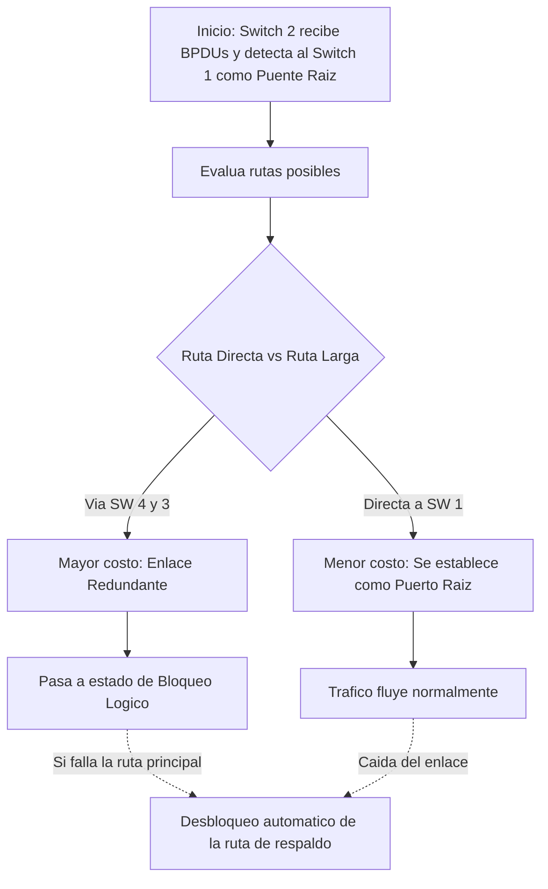

### 3. La solución lógica: El protocolo IEEE 802.1D SPINNING TREE PROTOCOL (STP)
Para solucionar el colapso sin tener que desconectar el cable físicamente (y así no perder la ventaja de la redundancia), el profesor introdujo el protocolo **[[STP]]** (Spanning Tree Protocol, estándar IEEE 802.1D inventado por Radia Perlman).

**Objetivo**: Eliminar enlaces redundantes y evitar la formación de bucles en la red.
**Capa y Dispositivos**: Protocolo de capa 2, [[CAPA DE ENLACE DE DATOS]] para bridges y switches.
**Activación/Desactivación de Enlaces**: Permite que el [[switch]] active o desactive enlaces para prevenir bucles. Los enlaces redundantes están inactivos.
**Transformación de Red**: Convierte una red física de malla en una red lógica de árbol, proporcionando un único camino hacia cada dispositivo.
**Recálculo Tras Falla:** Ante la falla de un enlace, STP recalcula el árbol y reactiva los puertos bloqueados.
**Variantes**: Incluyen RSTP (IEEE 802.1w, 2004) y SPB (IEEE 802.1aq, 2012), con diferentes tiempos de convergencia.

#### **Funcionamiento del STP:** resumido
* Detección de Bucles
	* Bucles de capa 2 pueden causar la retransmisión continua de tramas, afectando la red.
* Construcción del Árbol de Expansión:
	1. Elección del Bridge Raíz:
		• Se elige el bridge raíz mediante el intercambio de Bridge Protocol Data Units (BPDU).
		* • Cada puerto tiene un costo basado en la velocidad, seleccionando rutas más rápidas.
	2. Selección de Puertos:
		* Puertos raíz, designados y bloqueados se determinan según el costo y la posición en el árbol.
	3. Comunicación mediante BPDU:
		* Switches intercambian BPDU cada dos segundos, informando el estado de la red
		* Cada switch tiene un ID único basado en una dirección MAC.
	4. Selección del Puente Raíz:
		* Inicialmente, cada switch se considera "puente raíz". Descubren sw con menor ID y actualizan.*
		* Se elige puente raíz aquel con ID más bajo (menor prioridad).
	5. Selección de Puertos Raíz
		* Switches envían BPDUs indicando su ID, prioridad, costo para llegar al puente raíz y actualizan estos datos.
		* Cada switch calcula el puerto raíz por el cual llegar al puente raíz con el mínimo costo.
	6. Designación de Puertos
		* Todos los puertos en el puente raíz y en los demás switches hacia dispositivos son designados.
		* Puertos no raíz ni designados son bloqueados para evitar bucles.
	7. Manejo de Redundancia:
		* Puertos redundantes son bloqueados para evitar tormentas de broadcast y garantizar una sola ruta al puente raíz.
		* En caso de falla, STP reconfigura activando enlaces previamente bloqueados .

#### ejemplo de funcionamiento detallado
![[{CE60B10F-6916-4B74-9D3D-F61737F58E70}.png]]
Para explicar cómo los dispositivos arman el árbol de expansión, el profesor utilizó el ejemplo de una topología compuesta por 4 conmutadores interconectados en forma de malla, y describió el proceso en las siguientes etapas lógicas:

1. ==Elección del [Puente Raíz] (Root Bridge)==
	- **El Planteo:** Al encender los equipos, los switches comienzan a intercambiar tramas de control llamadas **[BPDU]** (Bridge Protocol Data Unit) para descubrir la topología de la red.
	- **La Resolución:** Tras analizar la información intercambiada, todos los equipos se dan cuenta de que el **Switch 1** es el que posee el identificador (ID) y la prioridad más baja (ya sea de fábrica o configurada por el administrador).
	- **Conclusión:** Por regla del algoritmo, el Switch 1 es automáticamente elegido como el **[Puente Raíz]**, convirtiéndose en el centro de toda la topología de red.
	- ![[{C25D3AA6-3995-419B-9829-4C2EAA763CBD}.png]]
2. ==Cálculo del [[Puerto Raíz]] (Costos de Ruta)==
	- **El Planteo:** Una vez definido el núcleo, los demás equipos deben descubrir cuál es la ruta más corta para llegar a él.
	- ![[{55EA4B38-5775-487B-89EE-01E5642DFD87}.png|520]]
		- y asi cada switch decide su puerto raiz, que es por donde va ir mas rapido al switch raiz
	- **El Ejemplo del Switch 2:** El profesor tomó al Switch 2 y explicó que este equipo evaluaba dos caminos posibles:
	    - **Ruta A:** Ir directo hacia el Switch 1 (Ruta de menor costo, compuesta solo por una interfaz).
	    - (en este caso da igual, pero se tomo como que el switch 4 tiene un id menor entonces decidira el puerto raiz para ir al switch 4)
	- **Conclusión:** El Switch 2 determina que la Ruta A es la más corta y designa a esa interfaz física como su **[Puerto Raíz]** (el puerto por donde enviará el tráfico para llegar más rápido al núcleo).
![[{9445B7D1-9E76-4EC4-BD55-5918A41D9850}.png]]
3. ==El Bloqueo del Enlace (La Analogía de los Autos)==
	Al detectar que existe un camino alternativo (la Ruta B), el Switch 2 debe evitar que se genere un **[Bucle de Capa 2]**.
> [!tip] **La Analogía Práctica del Profesor** Para explicar por qué se debe bloquear el puerto, el profesor utilizó una analogía de la vida cotidiana: _"Es como si tuvieras dos autos pero usas siempre uno. Si se te rompe ese auto tienes el otro de respaldo, pero no puedes usar los dos autos a la vez"_.

- **Aplicación a la red:** Un switch no puede mantener dos rutas activas enviando tráfico simultáneamente hacia el **[Puente Raíz]**, porque se formaría una **[Tormenta de Difusión]**. Por lo tanto, el Switch 2 desactiva lógicamente el puerto redundante (estado de [Bloqueo]). El cable sigue conectado físicamente, pero no permite el paso de tramas de datos de usuario.
- ![[{D3A42929-C365-4F79-9F69-86AE51260A62}.png]]

>[!question] ¿Qué ocurre si un administrador corta accidentalmente el cable principal o si el enlace principal falla?
>Como los switches se envían tramas **[BPDU]** constantemente (aproximadamente cada 2 segundos), notan de manera inmediata la interrupción del servicio.
>El algoritmo recalcula el árbol de expansión automáticamente y "desbloquea" la interfaz de la Ruta Larga que estaba en resguardo. Así, el servicio se restaura sin necesidad de intervención humana.

Diagrama del Proceso de Decisión (Ejemplo Switch 2)

#### importante
 Un switch no puede tener más de un camino al puente raíz.
 Enlaces redundantes sirven como respaldo y se bloquean para evitar tormentas de broadcast.
 STP permite una red lógica de árbol, garantizando conectividad y evitando bucles.
#### **Asignación de Costos en STP**

Para decidir qué ruta mantener activa hacia el **[Puente Raíz]** y cuál bloquear, el algoritmo evalúa las rutas sumando los costos de las interfaces que debe atravesar.

> [!note] Fórmula: Cálculo de Costo STP En el protocolo STP, el costo de un enlace es inversamente proporcional a la velocidad del medio físico (a mayor velocidad, menor costo). $$ Costo \propto \frac{1}{Velocidad} $$

Para ilustrar esta métrica inversa (a mayor velocidad, menor costo y mayor prioridad para el algoritmo), se presentó la siguiente tabla basada en el estándar IEEE 802.1D:

| Velocidad del Puerto Físico         | Valor del Costo [[STP]] Asignado |
| ----------------------------------- | -------------------------------- |
| **[10 Gigabit Ethernet] (10 Gbps)** | 2                                |
| **[Gigabit Ethernet] (1 Gbps)**     | 4                                |
| **[Fast Ethernet] (100 Mbps)**      | 19                               |
| **[Ethernet Clásica] (10 Mbps)**    | 100                              |

En conclusión, si existen múltiples rutas, el algoritmo siempre elegirá conmutar el tráfico por aquellos enlaces cuyas velocidades sean más altas (ej. 1 Gbps), ya que su sumatoria de costo final será la más baja de toda la topología.

---
#### ESTADOS DE LOS PUERTOS
1. ==BLOQUEO== Así inician todos los puertos, pueden recibir BPDU's pero no las envían. Las tramas de datos se descartan y no actualiza tablas.
	1. Evita enlaces redundantes bloqueando todos los puertos inicialmente.
2. ==Escucha==: Los switches determinan si existe alguna otra ruta hacia el switch raíz, si ésta tiene un costo mayor, se vuelve a Bloqueo. Las tramas de datos se descartan y no se actualiza las tablas. Se envían BPDU’s para conocer la topología de la red.
	1. Escuchan tramas BPDU para entender la configuración de la red antes de construir el grafo
3. ==Aprendizaje:== Las tramas de datos se descartan pero se actualizan las tablas (el switch aprende). Se procesan las BPDU’s.
	1. Construyen tablas al aprender y al fijarse si la dirección MAC ya está en ese puerto.
	2. Todavía no conmutan tramas de datos
4. ==Envío:== los puertos pueden enviar y recibir datos. Las tramas de datos se envían y se actualizan las tablas. Se procesan las BPDU.
5. ==Desactivado:== Se produce cuando un administrador deshabilita el puerto o falla. No se procesan las BPDU.
	1. Puerto apagado, no conectado
	2. Único estado sin procesar BPDU, ya que el switch no está conectado.

>[!note] Siempre se procesan BPDU para controlar enlaces redundantes, incluso cuando los puertos están desactivados, ya que son esenciales para construir una topología libre de bucles.

![[{8F5DB012-4EF6-4655-8D4E-CD8008702ED7}.png]]
# ---