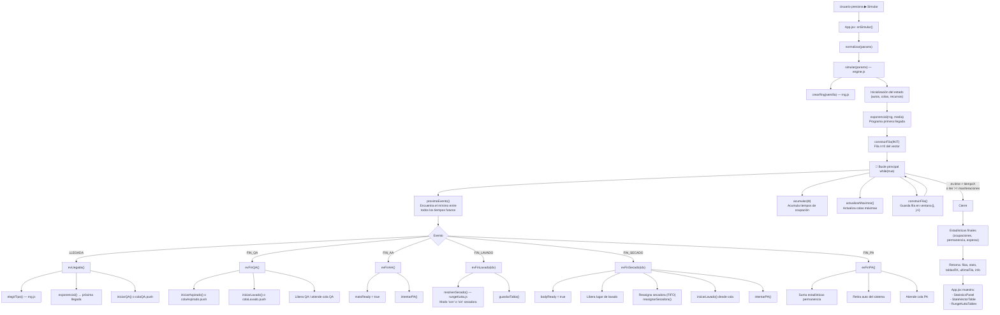

# Análisis del Código — TP5 Simulación del Lavadero (Grupo 25)

## Descripción General del Sistema

El TP simula un **lavadero de autos** usando **simulación por vector de estado / próximo evento (next-event)**. El reloj no avanza en pasos fijos, sino que **salta de evento en evento**.

Cada auto al entrar al sistema se "parte" en dos flujos paralelos:
- **Carrocería** → QA → Lavado → Secado (RK4) → PA
- **Alfombras** → QA → Aspirado → PA

Solo cuando **ambos** flujos terminan, el auto puede hacer PA (Poner Alfombras) y salir.

---

## Arquitectura de Archivos

```
src/
├── main.jsx               → Punto de entrada React
├── App.jsx                → Orquestador principal (UI + lógica de simulación)
├── utils/
│   └── format.js          → Utilidades de formateo numérico
├── sim/
│   ├── rng.js             → Generador de números aleatorios
│   ├── rungeKutta.js      → Método de Runge-Kutta 4 para el secado
│   └── engine.js          → Motor de simulación (toda la lógica)
└── components/
    ├── ParametersForm.jsx  → Formulario de parámetros
    ├── StatisticsPanel.jsx → Panel de estadísticas finales
    ├── StateVectorTable.jsx→ Tabla del vector de estado
    └── RungeKuttaTables.jsx→ Tablas de RK por auto
```

---

## Flujo de Llamadas (Call Flow)



---

## Desglose por Archivo y Función

---

### `rng.js` — Generador de Números Aleatorios

#### `truncar2(x)`
- **Trunca** (no redondea) un número `[0,1)` a **2 decimales**: `0.9797 → 0.97`.
- Se usa internamente para que el número mostrado en el vector de estado sea exactamente el que se usó para calcular el evento.

#### `crearRng(semilla)`
- **Crea y devuelve un generador** de números pseudoaleatorios.
- Si recibe semilla → usa el algoritmo **Mulberry32** (resultados reproducibles).
- Si no → usa `Math.random()` (distinto en cada corrida).
- Retorna una función `rng()` que cada vez que se llama entrega el próximo número truncado a 2 decimales.

#### `exponencial(rng, media)`
- Genera un tiempo con distribución **Exponencial Negativa**.
- Fórmula: `T = -media * ln(1 - rnd)`
- Retorna `{ rnd, valor }` (el número crudo Y el tiempo calculado).

#### `uniforme(rng, a, b)`
- Genera un tiempo con distribución **Uniforme U(a,b)**.
- Fórmula: `T = a + rnd * (b - a)`
- Retorna `{ rnd, valor }`.

#### `elegirTipo(rng, prob, kCoef)`
- Determina el **tipo de auto** (Pequeño / Mediano / Pick-up) con un único número aleatorio usando probabilidades acumuladas.
- Retorna `{ rnd, tipo, k }` donde `k` es el coeficiente de secado del auto.

---

### `rungeKutta.js` — Método de Runge-Kutta 4 para el Secado

Las ecuaciones diferenciales del secado son:

$$\frac{dH}{dt} = \begin{cases} -5t^2 + 2H - 200 & \text{con secadora} \\ -k \cdot H & \text{sin secadora} \end{cases}$$

> [!NOTE]
> La ecuación **con secadora** tiene el término `+2H` que la hace inestable con paso `h=1`. Por eso se usa un paso fino de `h=0.1 min` para estabilizarla.

#### `pasoRK4(f, t, H, h)`
- Ejecuta **un paso del método de Runge-Kutta de 4to orden**.
- Calcula las 4 pendientes:
  - `k1 = f(t, H)`
  - `k2 = f(t + h/2, H + h/2 * k1)`
  - `k3 = f(t + h/2, H + h/2 * k2)`
  - `k4 = f(t + h, H + h * k3)`
- Nuevo valor: `Hnext = H + (h/6)(k1 + 2k2 + 2k3 + k4)`
- Retorna `{ k1, k2, k3, k4, Hnext }`.

#### `resolverSecado({ Hinicial, tInicial, modo, k })`
- **Integra el secado completo** paso a paso (cada 0.1 min) hasta que `H ≤ UMBRAL_SECO (0.05%)`.
- Selecciona la ecuación correcta según `modo`: `'con'` → `fCon`, `'sin'` → `fSin(k)`.
- Retorna `{ pasos, minutos, Hfinal }`:
  - `pasos`: array con cada paso RK4 (para la tabla visual).
  - `minutos`: tiempo total hasta secar.

#### `humedadEnPaso(pasos, tLocal)`
- Lee la humedad de una tabla RK en un tiempo local dado (sin interpolar).
- Se usa para saber cuánta humedad le queda a una carrocería que se secaba **sola** en el momento en que **consigue la secadora**.

---

### `engine.js` — Motor de Simulación

Este es el núcleo del TP. Toda la lógica de simulación vive aquí.

#### `simular(params)` — Función principal exportada

Recibe todos los parámetros y retorna el resultado completo. Internamente define el estado del sistema y todas las funciones helper.

**Estado del sistema:**
| Variable | Descripción |
|---|---|
| `clock` | Reloj actual de la simulación |
| `autos` (Map) | Todos los autos actualmente en el sistema |
| `enSistema` (Set) | IDs de autos presentes |
| `QA`, `AA`, `PA` | Recursos de capacidad 1 |
| `secadora` | La única secadora |
| `lugares[0..1]` | Los 2 lugares de lavado |
| `colaQA`, `colaAspirado`, `colaLavado`, `colaPA` | Colas FIFO |
| `S.proxLlegada`, `S.finQA`, etc. | Tiempos futuros de eventos |

---

#### Helpers de inicio de operación

##### `iniciarQA(auto)`
- Marca QA como ocupado, registra la espera del auto y programa `S.finQA = clock + 2 min` (fijo).

##### `iniciarAspirado(auto)`
- Marca AA como ocupado, genera tiempo **U(aspMin, aspMax)** via `uniforme()`, programa `S.finAA`.
- Guarda el rnd usado en `rndLog.aspirado`.

##### `iniciarLavado(auto, idx)`
- Ocupa el lugar `idx`, genera tiempo **U(lavMin, lavMax)**, programa `lugares[idx].finLavado`.
- Guarda el rnd en `rndLog.lavado`.

##### `iniciarPA(auto)`
- Marca PA como ocupado, calcula la espera desde `max(dryEnd, aspEnd)`, programa `S.finPA = clock + 3 min` (fijo).

##### `intentarPA(auto)`
- **Coordina el punto de sincronización**: verifica si `bodyReady AND matsReady`.
- Si sí, marca `paIniciado = true` e inicia PA o encola el auto.
- Si no, no hace nada (el otro flujo se encargará cuando termine).

---

#### Helpers del secado

##### `guardarTabla(auto, modoInicial, pasos, minutos)`
- Almacena la tabla RK del secado en `tablasRK[]` (máximo 500 para no agotar memoria).
- Retorna referencia a la tabla guardada (para poder modificarla si cambia la secadora).

##### `reasignarSecadora(idx)`
- Se llama cuando la secadora queda libre y hay una carrocería secándose **sola**.
- Flujo:
  1. Calcula cuánto tiempo lleva secándose sola.
  2. Lee la humedad restante `Hr` de la tabla sin secadora en ese instante (`humedadEnPaso`).
  3. Trunca la tabla sin secadora al tiempo realmente transcurrido.
  4. Lanza `resolverSecado` en modo `'con'` desde `H0 = Hr`.
  5. Actualiza el `finSecado` del lugar y la tabla mostrada (concatena fases).

##### `humedadActual(l)`
- Calcula la humedad **interpolada** de una carrocería que se está secando ahora mismo.
- Ubica la fase vigente (puede haber cambiado de `sin` a `con`), calcula el tiempo local dentro de esa fase e interpola entre pasos.
- Permite que la columna "H" del vector de estado muestre valores intermedios (no salta de 100% a 0%).

---

#### Procesadores de eventos

##### `evLlegada()`
- Crea el auto con su tipo y `k` (`elegirTipo`).
- Programa la **próxima llegada** con tiempo exponencial.
- Envía el auto a QA o a la cola.

##### `evFinQA()`
- El auto termina de quitarse las alfombras.
- **Bifurcación**: alfombras → aspirado (o cola), carrocería → lavado (o cola).
- Libera QA y atiende la cola si hay autos esperando.

##### `evFinAA()`
- Termina el aspirado de alfombras.
- Marca `matsReady = true`.
- Llama a `intentarPA(auto)` → si la carrocería ya está seca, inicia PA.
- Libera AA y atiende la cola.

##### `evFinLavado(idx)`
- La carrocería termina de lavarse.
- Si la secadora está libre → modo `'con'`, toma la secadora.
- Si no → modo `'sin'`, se seca sola con `dH/dt = -kH`.
- Llama a `resolverSecado()` y guarda la tabla RK.

##### `evFinSecado(idx)`
- La carrocería terminó de secarse.
- Marca `bodyReady = true`.
- **Libera el lugar de lavado** (recién ahora, no antes).
- Si tenía la secadora → la libera y busca la carrocería que más tiempo lleva secándose sola (FIFO por `dryingStart`) → `reasignarSecadora`.
- Inicia un lavado pendiente en el lugar liberado.
- Llama a `intentarPA(auto)`.

##### `evFinPA()`
- El auto sale del sistema.
- Acumula estadísticas: permanencia total, tiempo de espera total.
- Libera PA y atiende la cola.

---

#### Funciones del bucle principal

##### `proximoEvento()`
- Busca el **mínimo tiempo** entre todos los eventos futuros.
- Desempata por prioridad: `FIN_PA < FIN_SECADO < FIN_LAVADO < FIN_AA < FIN_QA < LLEGADA`.
- Retorna `{ time, type, slot }`.

##### `acumular(dt)`
- Acumula el área bajo la curva de ocupación de cada recurso durante el intervalo `dt`.
- Permite calcular las **ocupaciones promedio** al final.

##### `actualizarMaximos()`
- Actualiza los máximos históricos de cada cola.

##### `construirFila(ev, conObjetos)`
- Toma un **snapshot** del estado completo del sistema en el instante actual.
- Incluye: reloj, evento, tiempos futuros, estados de recursos, longitudes de colas, acumuladores.
- Opcionalmente incluye el inspector de objetos (autos en el sistema).

##### `snapshotObjetos()`
- Para cada auto en el sistema, llama a `ubicacionAuto(id)` y `humedadActual()`.
- Retorna una lista con el estado detallado de cada auto.

##### `ubicacionAuto(id)`
- Determina **dónde está** cada parte del auto (carrocería y alfombras).
- Consulta los recursos, las colas y las flags `bodyReady`/`matsReady`.

---

### `App.jsx` — Orquestador React

| Función | Rol |
|---|---|
| `normalizar(params)` | Convierte strings vacíos a 0, limita `maxIteraciones` a 100000 |
| `onSimular()` | Llama a `simular()` y actualiza el estado de React |

Renderiza 4 componentes principales con los resultados.

---

### `utils/format.js` — Utilidades de Formato

| Función | Descripción |
|---|---|
| `num(v, dec=2)` | Formatea número con `dec` decimales; `Infinity` → `"—"` |
| `rndFmt(v)` | Formatea número aleatorio a 2 decimales |

---

## Flujo Completo de un Auto (desde que llega hasta que sale)

```
t=0  Auto llega → evLlegada()
       → tipo + k asignados (elegirTipo)
       → va a QA (o espera en colaQA)

t=2  Fin QA → evFinQA()
       → alfombras → colaAspirado / iniciarAspirado (AA)
       → carrocería → colaLavado / iniciarLavado (lugar i)

t=2+U(3,5)  Fin Aspirado → evFinAA()
       → matsReady = true
       → intentarPA() [¿bodyReady? → PA o espera]

t=2+U(6,12)  Fin Lavado → evFinLavado(i)
       → resolverSecado (RK4, modo 'con' o 'sin')
       → finSecado programado

t=2+U(6,12)+RK  Fin Secado → evFinSecado(i)
       → bodyReady = true
       → Libera lugar + reasigna secadora si corresponde
       → intentarPA() [¿matsReady? → PA o espera]

t=...+3  Fin PA → evFinPA()
       → Auto sale del sistema
       → Suma permanencia y esperas
```

---

## Estadísticas Calculadas

| Estadística | Fórmula |
|---|---|
| Ocupación QA | `busyQA / T * 100` |
| Ocupación AA | `busyAA / T * 100` |
| Ocupación Lugares | `busyLug / (2*T) * 100` |
| Ocupación Secadora | `busySec / T * 100` |
| Tiempo medio de secado | `sumaSecado / countSecado` |
| Permanencia media | `sumaPerm / salidos` |
| Espera media en colas | `sumaEspera / countEspera` |
| Máx. cola QA | `maxColaQA` |

> [!TIP]
> Los acumuladores se actualizan en `acumular(dt)` ANTES de procesar cada evento, usando el **estado previo** del sistema durante el intervalo `[lastClock, ev.time]`.
